## Mod 3 Project: Working Copy


* Student name: Andi Osika
* Student pace: part time
* Scheduled project review date/time: 05/02/2020 12:30PM PST
* Instructor name: James Irving, PhD
* Blog post URL: https://andiosika.github.io/imbalanced_data


## Project Quick Links:
**Link** | **Description**
--| --|
[Background](#Background:) | Details around the subject, datasource and objective
[Features and Descriptions](#Features-and-Descriptions:) | Details on each feature collected in the dataset
[Preprocessing](#Preprocessing:) | Steps taken to prepare data for modeling and evaluation
[Main Dataset](#Main-Dataset:) | The dataset in it's final form used for the predictive modeling results described in the [Conclusion](#Conclusion:)  section
[Modeling](#Modeling:) | Various iterations of predictive classification modeling including Decision Trees, Random Forest and XGBoost
[Best Model](#BEST-MODEL:-Manually-Tuned-Random-Forest) |Random Forest Classification Model including [Visualizations]() Confusion Matrix, ROC Curve, Feature Importance by Rank, Correlations
    [Conclusion](#Conclusion:) | Summation of outcomes from modeling
    


## Background:

Coronavirus disease (COVID-19) is an infectious disease.  It was discovered in late 2019 and early 2020 and originated from Wuhan, China.  It escalated into a global pandemic.

According to the [World Health Organization](https://www.who.int/health-topics/coronavirus#tab=tab_1), most people infected with the COVID-19 virus will experience mild to moderate respiratory illness and recover without requiring special treatment.  Older people, and those with underlying medical problems like cardiovascular disease, diabetes, chronic respiratory disease, and cancer are more likely to develop serious illness.

The best way to prevent and slow down transmission is be well informed about the COVID-19 virus, the disease it causes and how it spreads. In response, much data has been collected in various ways to further inform ways to slow the spread. 

The dataset used in this evaluation was created by a project created by a UK based platform-solutions company called [Nexoid]( https://www.nexoid.com/). At the start of the pandemic, Nexoid noted that there was a lack of large datasets required to predict the spread and mortality rates related to COVID-19. They took it upon themselves to create and share this dataset as an effort to better understand these factors. It is a not-for-profit project with the goal of providing researchers and governments the data needed to help understand and fight COVID-19. It is a sample provided by self-reporting of over 618,000 individuals and collects biological, behavioral, and environmental factors as well as their COVID-19 status.

The data is collected here: 
https://www.covid19survivalcalculator.com/ .  In exchange for the data, a risk of infection and mortality are returned to the user based on Nexoid's model which is not publicly sharded, yet recorded in this dataset post-hoc.  These values are reflected in the columns risk_infection and risk_mortality.

The questionaire used to collect data has since undergone several versions and several features collected during this sample are no longer being tracked. Data for this observation was collected between March 27 - April 10 of 2020, and only a very small rate (.013%) of respondents reported testing postive for COVID-19. It should be noted that at this time there was a shortage of tests available in the United States and latency in recieving results was up to two weeks. 


**The intention of this classification project is to identify primary contributing factors for contracting COVID-19.**


```python
##Importing dataset
import pandas as pd
df = pd.read_csv("master_dataset4.csv")
pd.set_option('display.max_columns', 0)
df.head()
```


<div>
<style scoped>
    .dataframe tbody tr th:only-of-type {
        vertical-align: middle;
    }

    .dataframe tbody tr th {
        vertical-align: top;
    }

    .dataframe thead th {
        text-align: right;
    }
</style>
<table border="1" class="dataframe">
  <thead>
    <tr style="text-align: right;">
      <th></th>
      <th>survey_date</th>
      <th>region</th>
      <th>country</th>
      <th>ip_latitude</th>
      <th>ip_longitude</th>
      <th>ip_accuracy</th>
      <th>sex</th>
      <th>age</th>
      <th>height</th>
      <th>weight</th>
      <th>bmi</th>
      <th>blood_type</th>
      <th>smoking</th>
      <th>alcohol</th>
      <th>cannabis</th>
      <th>amphetamines</th>
      <th>cocaine</th>
      <th>lsd</th>
      <th>mdma</th>
      <th>contacts_count</th>
      <th>house_count</th>
      <th>text_working</th>
      <th>rate_government_action</th>
      <th>rate_reducing_risk_single</th>
      <th>rate_reducing_risk_house</th>
      <th>rate_reducing_mask</th>
      <th>covid19_positive</th>
      <th>covid19_symptoms</th>
      <th>covid19_contact</th>
      <th>asthma</th>
      <th>kidney_disease</th>
      <th>compromised_immune</th>
      <th>heart_disease</th>
      <th>lung_disease</th>
      <th>diabetes</th>
      <th>hiv_positive</th>
      <th>hypertension</th>
      <th>other_chronic</th>
      <th>prescription_medication</th>
      <th>opinion_infection</th>
      <th>opinion_mortality</th>
      <th>risk_infection</th>
      <th>risk_mortality</th>
    </tr>
  </thead>
  <tbody>
    <tr>
      <th>0</th>
      <td>4/4/2020</td>
      <td>NaN</td>
      <td>US</td>
      <td>35.9568</td>
      <td>-86.5301</td>
      <td>200.0</td>
      <td>female</td>
      <td>40_50</td>
      <td>158</td>
      <td>114</td>
      <td>45.6</td>
      <td>ap</td>
      <td>quit0</td>
      <td>0.0</td>
      <td>0.0</td>
      <td>-1.0</td>
      <td>-1.0</td>
      <td>-1.0</td>
      <td>-1.0</td>
      <td>5.0</td>
      <td>4</td>
      <td>never</td>
      <td>0</td>
      <td>0</td>
      <td>0</td>
      <td>3.0</td>
      <td>0</td>
      <td>0</td>
      <td>0</td>
      <td>1</td>
      <td>0</td>
      <td>1</td>
      <td>0</td>
      <td>0</td>
      <td>0</td>
      <td>0</td>
      <td>1</td>
      <td>1</td>
      <td>NaN</td>
      <td>55.0</td>
      <td>35.0</td>
      <td>64.248</td>
      <td>0.721</td>
    </tr>
    <tr>
      <th>1</th>
      <td>4/5/2020</td>
      <td>NaN</td>
      <td>US</td>
      <td>39.6512</td>
      <td>-82.6200</td>
      <td>20.0</td>
      <td>female</td>
      <td>20_30</td>
      <td>168</td>
      <td>62</td>
      <td>21.9</td>
      <td>on</td>
      <td>never</td>
      <td>3.0</td>
      <td>-1.0</td>
      <td>-1.0</td>
      <td>-1.0</td>
      <td>-1.0</td>
      <td>-1.0</td>
      <td>5.0</td>
      <td>3</td>
      <td>never</td>
      <td>1</td>
      <td>1</td>
      <td>1</td>
      <td>2.0</td>
      <td>0</td>
      <td>0</td>
      <td>0</td>
      <td>0</td>
      <td>0</td>
      <td>0</td>
      <td>0</td>
      <td>0</td>
      <td>0</td>
      <td>0</td>
      <td>0</td>
      <td>0</td>
      <td>NaN</td>
      <td>15.0</td>
      <td>15.0</td>
      <td>57.549</td>
      <td>0.016</td>
    </tr>
    <tr>
      <th>2</th>
      <td>4/5/2020</td>
      <td>NaN</td>
      <td>US</td>
      <td>27.7723</td>
      <td>-82.2767</td>
      <td>10.0</td>
      <td>female</td>
      <td>0_10</td>
      <td>136</td>
      <td>44</td>
      <td>23.7</td>
      <td>bp</td>
      <td>never</td>
      <td>-1.0</td>
      <td>-1.0</td>
      <td>-1.0</td>
      <td>-1.0</td>
      <td>-1.0</td>
      <td>-1.0</td>
      <td>4.0</td>
      <td>3</td>
      <td>stopped</td>
      <td>0</td>
      <td>0</td>
      <td>0</td>
      <td>1.0</td>
      <td>0</td>
      <td>0</td>
      <td>0</td>
      <td>0</td>
      <td>0</td>
      <td>0</td>
      <td>0</td>
      <td>0</td>
      <td>0</td>
      <td>0</td>
      <td>0</td>
      <td>0</td>
      <td>NaN</td>
      <td>NaN</td>
      <td>NaN</td>
      <td>62.377</td>
      <td>0.000</td>
    </tr>
    <tr>
      <th>3</th>
      <td>4/5/2020</td>
      <td>NaN</td>
      <td>US</td>
      <td>39.6675</td>
      <td>-77.5666</td>
      <td>10.0</td>
      <td>female</td>
      <td>30_40</td>
      <td>164</td>
      <td>112</td>
      <td>41.6</td>
      <td>abn</td>
      <td>quit5</td>
      <td>-1.0</td>
      <td>28.0</td>
      <td>-1.0</td>
      <td>-1.0</td>
      <td>-1.0</td>
      <td>-1.0</td>
      <td>4.0</td>
      <td>3</td>
      <td>never</td>
      <td>1</td>
      <td>1</td>
      <td>0</td>
      <td>1.0</td>
      <td>0</td>
      <td>0</td>
      <td>0</td>
      <td>1</td>
      <td>0</td>
      <td>0</td>
      <td>0</td>
      <td>0</td>
      <td>0</td>
      <td>0</td>
      <td>1</td>
      <td>1</td>
      <td>ACETAZOLAMIDE;GABAPENTIN;OMEPRAZOLE;VENLAFAXIN...</td>
      <td>45.0</td>
      <td>25.0</td>
      <td>59.258</td>
      <td>0.195</td>
    </tr>
    <tr>
      <th>4</th>
      <td>4/4/2020</td>
      <td>NaN</td>
      <td>US</td>
      <td>41.3527</td>
      <td>-81.7444</td>
      <td>50.0</td>
      <td>male</td>
      <td>50_60</td>
      <td>184</td>
      <td>132</td>
      <td>38.9</td>
      <td>an</td>
      <td>vape</td>
      <td>0.0</td>
      <td>-1.0</td>
      <td>-1.0</td>
      <td>-1.0</td>
      <td>-1.0</td>
      <td>-1.0</td>
      <td>10.0</td>
      <td>4</td>
      <td>travel critical</td>
      <td>0</td>
      <td>0</td>
      <td>0</td>
      <td>3.0</td>
      <td>0</td>
      <td>0</td>
      <td>0</td>
      <td>0</td>
      <td>0</td>
      <td>0</td>
      <td>0</td>
      <td>0</td>
      <td>1</td>
      <td>0</td>
      <td>0</td>
      <td>0</td>
      <td>METFORMIN HYDROCHLORIDE</td>
      <td>15.0</td>
      <td>5.0</td>
      <td>77.098</td>
      <td>2.463</td>
    </tr>
  </tbody>
</table>
</div>


### Features and Descriptions:

There are 43 features on which data was collected around biometetrics, behavior and enviromnent.  

Details are below:

**Feature** | **Description**
--|--
survey_date|The date the survey was submitted
region	
country |The country collected from IP address long, lat
ip_latitude	|ip latitude of device at time of survey
ip_longitude |ip longitude of device at time of survey	
ip_accuracy	|-n/a
sex	|Self reported sex
age	| Self reported age based on birthdate
height |Height in cm
weight | Weight in kg
bmi	| Body Mass Index as calculated from self-reported height and weight
blood_type	| Blood type
smoking	| reported smoking/vapeing habits (never, do, 1-5x, 6-20x, 20+, quit<5yrs, quit>5yrs, quit>10yrs
alcohol	| reported days of alcohol consuption in last 14 days 
cannabis | reported days of cannabis consumpiton in last 28 days
amphetamines | reported days of amphetamine consumpiton in last 28 days	
cocaine	| reported days of cocaine consumpiton in last 28 days
lsd	| reported days of lsd consumpiton in last 28 days
mdma | reported days of mdma(ecstacy) consumpiton in last 28 days	
contacts_count	| reported contacts in the last week (1-20 and 20+)
house_count	| how many people live in the subjects dwelling
text_working | work/school travel behaviors (0-5 never did, always did, have stopped, critical only, still do)
rate_government_action	| scale of attitude that government is taking covid-19 seriously (disagree, neutral, agree)
rate_reducing_risk_single | scale of self-assesment to reduce risk(social distancing, hand washing) (disagree, neutral, agree)
rate_reducing_risk_house | scale of assessesed co-habitators risk reduction (social distancing, hand washing)(disagree, neutral, agree)	
rate_reducing_mask	| scale of how often a mask is worn outside dwelling 1-5 rarely, sometimes, usually)
covid19_positive | A binomial value o=no, 1=yes to the question  "Do you have?"	
covid19_symptoms | A binomial value o=no, 1=yes to the question  "Do you have?"	
covid19_contact	|A binomial value 0=no, 1=yes to the question "Have you been in contact with someone who has tested positive?"
asthma | A binomial value 0=no, 1=yes to the question "Do you have?"
kidney_disease | A binomial value 0=no, 1=yes to the question "Do you have?"
compromised_immune |  A binomial value 0=no, 1=yes to the question "Do you have?"
heart_disease | A binomial value 0=no, 1=yes to the question "Do you have?"	
lung_disease | A binomial value 0=no, 1=yes to the question "Do you have?"
diabetes | A binomial value 0=no, 1=yes to the question "Do you have?"
hiv_positive | A binomial value 0=no, 1=yes to the question "Do you have?"
hypertension | A binomial value 0=no, 1=yes to the question "Do you have?"
other_chronic | A binomial value 0=no, 1=yes to the question "Do you have?"
prescription_medication | Reported prescription medications
opinion_infection | No information is given about this feature, no longer collecting data on this, it is theorized that it had to do with if the subject believed they had the infection.
opinion_mortality | No information is given about this feature, no longer collecting data on this, it is theorized that it had to do with if the subject believed they could die from the infection.
risk_infection | calc'd risk for infection (based on their models)
risk_mortality | calc'd risk for mortality (based on their models)


## Inspecting the dataset:

#### Software Package Installs:


```python
# Package Installs
import matplotlib.pyplot as plt

import seaborn as sns
from pandas_profiling import ProfileReport
from imblearn.over_sampling import SMOTE
from sklearn.tree import DecisionTreeClassifier
import functions as fn
import importlib

from sklearn.metrics import accuracy_score, f1_score
from sklearn.ensemble import RandomForestClassifier
from sklearn.model_selection import cross_val_score
from imblearn.over_sampling import SMOTE
from imblearn.under_sampling import RandomUnderSampler
```

    C:\Users\aosika\AppData\Local\Continuum\anaconda3\envs\learn-env\lib\site-packages\sklearn\externals\six.py:31: FutureWarning: The module is deprecated in version 0.21 and will be removed in version 0.23 since we've dropped support for Python 2.7. Please rely on the official version of six (https://pypi.org/project/six/).
      "(https://pypi.org/project/six/).", FutureWarning)
    C:\Users\aosika\AppData\Local\Continuum\anaconda3\envs\learn-env\lib\site-packages\sklearn\utils\deprecation.py:144: FutureWarning: The sklearn.neighbors.base module is  deprecated in version 0.22 and will be removed in version 0.24. The corresponding classes / functions should instead be imported from sklearn.neighbors. Anything that cannot be imported from sklearn.neighbors is now part of the private API.
      warnings.warn(message, FutureWarning)
    

    2020-05-01 11:05:46.681242-07:00
    [i] Timer started at05/01/20 - 11:05 AM
    [i] Timer ended at 05/01/20 - 11:05 AM
    - Total time = 0:00:00
    

This set of data contains just over 619K entries and has 43 columns of both numeric and categorical data.  Because of the size of this dataset, pandas profiling was used to inform potential considerations for dataset selection and develop a strategy to manage preprocessing of a set this size.


```python
profile = ProfileReport(df, minimal=True)
profile
```


    HBox(children=(FloatProgress(value=0.0, description='variables', max=43.0, style=ProgressStyle(description_wid…


    
    


    HBox(children=(FloatProgress(value=0.0, description='table', max=1.0, style=ProgressStyle(description_width='i…


    
    


    HBox(children=(FloatProgress(value=0.0, description='warnings', max=3.0, style=ProgressStyle(description_width…


    
    


    HBox(children=(FloatProgress(value=0.0, description='package', max=1.0, style=ProgressStyle(description_width=…


    
    


    HBox(children=(FloatProgress(value=0.0, description='build report structure', max=1.0, style=ProgressStyle(des…


    
    

    C:\Users\aosika\AppData\Local\Continuum\anaconda3\envs\learn-env\lib\site-packages\IPython\core\display.py:694: UserWarning: Consider using IPython.display.IFrame instead
      warnings.warn("Consider using IPython.display.IFrame instead")
    


<iframe width="100%" height="800px" srcdoc="&lt;!doctype html&gt;&lt;html lang=en&gt;&lt;head&gt;&lt;meta charset=utf-8&gt;&lt;meta name=viewport content=&quot;width=device-width, initial-scale=1, shrink-to-fit=no&quot;&gt;&lt;meta name=description content=&quot;Profile report generated with the `pandas-profiling` Python package&quot;&gt;&lt;meta name=author content=&quot;Simon Brugman and the open source community.&quot;&gt;&lt;meta name=generator content=&quot;Pandas Profiling v2.6.0&quot;&gt;&lt;meta name=url content=https://github.com/pandas-profiling/pandas-profiling&gt;&lt;meta name=date content&gt;&lt;title&gt;Pandas Profiling Report&lt;/title&gt;&lt;style&gt;
/*!
 * Bootstrap v3.3.7 (http://getbootstrap.com)
 * Copyright 2011-2016 Twitter, Inc.
 * Licensed under MIT (https://github.com/twbs/bootstrap/blob/master/LICENSE)
 *//*! normalize.css v3.0.3 | MIT License | github.com/necolas/normalize.css */html{font-family:sans-serif;-webkit-text-size-adjust:100%;-ms-text-size-adjust:100%}body{margin:0}article,aside,details,figcaption,figure,footer,header,hgroup,main,menu,nav,section,summary{display:block}audio,canvas,progress,video{display:inline-block;vertical-align:baseline}audio:not([controls]){display:none;height:0}[hidden],template{display:none}a{background-color:transparent}a:active,a:hover{outline:0}abbr[title]{border-bottom:1px dotted}b,strong{font-weight:700}dfn{font-style:italic}h1{margin:.67em 0;font-size:2em}mark{color:#000;background:#ff0}small{font-size:80%}sub,sup{position:relative;font-size:75%;line-height:0;vertical-align:baseline}sup{top:-.5em}sub{bottom:-.25em}img{border:0}svg:not(:root){overflow:hidden}figure{margin:1em 40px}hr{height:0;-webkit-box-sizing:content-box;-moz-box-sizing:content-box;box-sizing:content-box}pre{overflow:auto}code,kbd,pre,samp{font-family:monospace,monospace;font-size:1em}button,input,optgroup,select,textarea{margin:0;font:inherit;color:inherit}button{overflow:visible}button,select{text-transform:none}button,html input[type=button],input[type=reset],input[type=submit]{-webkit-appearance:button;cursor:pointer}button[disabled],html input[disabled]{cursor:default}button::-moz-focus-inner,input::-moz-focus-inner{padding:0;border:0}input{line-height:normal}input[type=checkbox],input[type=radio]{-webkit-box-sizing:border-box;-moz-box-sizing:border-box;box-sizing:border-box;padding:0}input[type=number]::-webkit-inner-spin-button,input[type=number]::-webkit-outer-spin-button{height:auto}input[type=search]{-webkit-box-sizing:content-box;-moz-box-sizing:content-box;box-sizing:content-box;-webkit-appearance:textfield}input[type=search]::-webkit-search-cancel-button,input[type=search]::-webkit-search-decoration{-webkit-appearance:none}fieldset{padding:.35em .625em .75em;margin:0 2px;border:1px solid silver}legend{padding:0;border:0}textarea{overflow:auto}optgroup{font-weight:700}table{border-spacing:0;border-collapse:collapse}td,th{padding:0}/*! Source: https://github.com/h5bp/html5-boilerplate/blob/master/src/css/main.css */@media print{*,:after,:before{color:#000!important;text-shadow:none!important;background:0 0!important;-webkit-box-shadow:none!important;box-shadow:none!important}a,a:visited{text-decoration:underline}a[href]:after{content:&quot; (&quot; attr(href) &quot;)&quot;}abbr[title]:after{content:&quot; (&quot; attr(title) &quot;)&quot;}a[href^=&quot;javascript:&quot;]:after,a[href^=&quot;#&quot;]:after{content:&quot;&quot;}blockquote,pre{border:1px solid #999;page-break-inside:avoid}thead{display:table-header-group}img,tr{page-break-inside:avoid}img{max-width:100%!important}h2,h3,p{orphans:3;widows:3}h2,h3{page-break-after:avoid}.navbar{display:none}.btn&gt;.caret,.dropup&gt;.btn&gt;.caret{border-top-color:#000!important}.label{border:1px solid #000}.table{border-collapse:collapse!important}.table td,.table th{background-color:#fff!important}.table-bordered td,.table-bordered th{border:1px solid #ddd!important}}@font-face{font-family:&#x27;Glyphicons Halflings&#x27;;src:url(../fonts/glyphicons-halflings-regular.eot);src:url(../fonts/glyphicons-halflings-regular.eot?#iefix) format(&#x27;embedded-opentype&#x27;),url(../fonts/glyphicons-halflings-regular.woff2) format(&#x27;woff2&#x27;),url(../fonts/glyphicons-halflings-regular.woff) format(&#x27;woff&#x27;),url(../fonts/glyphicons-halflings-regular.ttf) format(&#x27;truetype&#x27;),url(../fonts/glyphicons-halflings-regular.svg#glyphicons_halflingsregular) format(&#x27;svg&#x27;)}.glyphicon{position:relative;top:1px;display:inline-block;font-family:&#x27;Glyphicons Halflings&#x27;;font-style:normal;font-weight:400;line-height:1;-webkit-font-smoothing:antialiased;-moz-osx-font-smoothing:grayscale}.glyphicon-asterisk:before{content:&quot;\002a&quot;}.glyphicon-plus:before{content:&quot;\002b&quot;}.glyphicon-eur:before,.glyphicon-euro:before{content:&quot;\20ac&quot;}.glyphicon-minus:before{content:&quot;\2212&quot;}.glyphicon-cloud:before{content:&quot;\2601&quot;}.glyphicon-envelope:before{content:&quot;\2709&quot;}.glyphicon-pencil:before{content:&quot;\270f&quot;}.glyphicon-glass:before{content:&quot;\e001&quot;}.glyphicon-music:before{content:&quot;\e002&quot;}.glyphicon-search:before{content:&quot;\e003&quot;}.glyphicon-heart:before{content:&quot;\e005&quot;}.glyphicon-star:before{content:&quot;\e006&quot;}.glyphicon-star-empty:before{content:&quot;\e007&quot;}.glyphicon-user:before{content:&quot;\e008&quot;}.glyphicon-film:before{content:&quot;\e009&quot;}.glyphicon-th-large:before{content:&quot;\e010&quot;}.glyphicon-th:before{content:&quot;\e011&quot;}.glyphicon-th-list:before{content:&quot;\e012&quot;}.glyphicon-ok:before{content:&quot;\e013&quot;}.glyphicon-remove:before{content:&quot;\e014&quot;}.glyphicon-zoom-in:before{content:&quot;\e015&quot;}.glyphicon-zoom-out:before{content:&quot;\e016&quot;}.glyphicon-off:before{content:&quot;\e017&quot;}.glyphicon-signal:before{content:&quot;\e018&quot;}.glyphicon-cog:before{content:&quot;\e019&quot;}.glyphicon-trash:before{content:&quot;\e020&quot;}.glyphicon-home:before{content:&quot;\e021&quot;}.glyphicon-file:before{content:&quot;\e022&quot;}.glyphicon-time:before{content:&quot;\e023&quot;}.glyphicon-road:before{content:&quot;\e024&quot;}.glyphicon-download-alt:before{content:&quot;\e025&quot;}.glyphicon-download:before{content:&quot;\e026&quot;}.glyphicon-upload:before{content:&quot;\e027&quot;}.glyphicon-inbox:before{content:&quot;\e028&quot;}.glyphicon-play-circle:before{content:&quot;\e029&quot;}.glyphicon-repeat:before{content:&quot;\e030&quot;}.glyphicon-refresh:before{content:&quot;\e031&quot;}.glyphicon-list-alt:before{content:&quot;\e032&quot;}.glyphicon-lock:before{content:&quot;\e033&quot;}.glyphicon-flag:before{content:&quot;\e034&quot;}.glyphicon-headphones:before{content:&quot;\e035&quot;}.glyphicon-volume-off:before{content:&quot;\e036&quot;}.glyphicon-volume-down:before{content:&quot;\e037&quot;}.glyphicon-volume-up:before{content:&quot;\e038&quot;}.glyphicon-qrcode:before{content:&quot;\e039&quot;}.glyphicon-barcode:before{content:&quot;\e040&quot;}.glyphicon-tag:before{content:&quot;\e041&quot;}.glyphicon-tags:before{content:&quot;\e042&quot;}.glyphicon-book:before{content:&quot;\e043&quot;}.glyphicon-bookmark:before{content:&quot;\e044&quot;}.glyphicon-print:before{content:&quot;\e045&quot;}.glyphicon-camera:before{content:&quot;\e046&quot;}.glyphicon-font:before{content:&quot;\e047&quot;}.glyphicon-bold:before{content:&quot;\e048&quot;}.glyphicon-italic:before{content:&quot;\e049&quot;}.glyphicon-text-height:before{content:&quot;\e050&quot;}.glyphicon-text-width:before{content:&quot;\e051&quot;}.glyphicon-align-left:before{content:&quot;\e052&quot;}.glyphicon-align-center:before{content:&quot;\e053&quot;}.glyphicon-align-right:before{content:&quot;\e054&quot;}.glyphicon-align-justify:before{content:&quot;\e055&quot;}.glyphicon-list:before{content:&quot;\e056&quot;}.glyphicon-indent-left:before{content:&quot;\e057&quot;}.glyphicon-indent-right:before{content:&quot;\e058&quot;}.glyphicon-facetime-video:before{content:&quot;\e059&quot;}.glyphicon-picture:before{content:&quot;\e060&quot;}.glyphicon-map-marker:before{content:&quot;\e062&quot;}.glyphicon-adjust:before{content:&quot;\e063&quot;}.glyphicon-tint:before{content:&quot;\e064&quot;}.glyphicon-edit:before{content:&quot;\e065&quot;}.glyphicon-share:before{content:&quot;\e066&quot;}.glyphicon-check:before{content:&quot;\e067&quot;}.glyphicon-move:before{content:&quot;\e068&quot;}.glyphicon-step-backward:before{content:&quot;\e069&quot;}.glyphicon-fast-backward:before{content:&quot;\e070&quot;}.glyphicon-backward:before{content:&quot;\e071&quot;}.glyphicon-play:before{content:&quot;\e072&quot;}.glyphicon-pause:before{content:&quot;\e073&quot;}.glyphicon-stop:before{content:&quot;\e074&quot;}.glyphicon-forward:before{content:&quot;\e075&quot;}.glyphicon-fast-forward:before{content:&quot;\e076&quot;}.glyphicon-step-forward:before{content:&quot;\e077&quot;}.glyphicon-eject:before{content:&quot;\e078&quot;}.glyphicon-chevron-left:before{content:&quot;\e079&quot;}.glyphicon-chevron-right:before{content:&quot;\e080&quot;}.glyphicon-plus-sign:before{content:&quot;\e081&quot;}.glyphicon-minus-sign:before{content:&quot;\e082&quot;}.glyphicon-remove-sign:before{content:&quot;\e083&quot;}.glyphicon-ok-sign:before{content:&quot;\e084&quot;}.glyphicon-question-sign:before{content:&quot;\e085&quot;}.glyphicon-info-sign:before{content:&quot;\e086&quot;}.glyphicon-screenshot:before{content:&quot;\e087&quot;}.glyphicon-remove-circle:before{content:&quot;\e088&quot;}.glyphicon-ok-circle:before{content:&quot;\e089&quot;}.glyphicon-ban-circle:before{content:&quot;\e090&quot;}.glyphicon-arrow-left:before{content:&quot;\e091&quot;}.glyphicon-arrow-right:before{content:&quot;\e092&quot;}.glyphicon-arrow-up:before{content:&quot;\e093&quot;}.glyphicon-arrow-down:before{content:&quot;\e094&quot;}.glyphicon-share-alt:before{content:&quot;\e095&quot;}.glyphicon-resize-full:before{content:&quot;\e096&quot;}.glyphicon-resize-small:before{content:&quot;\e097&quot;}.glyphicon-exclamation-sign:before{content:&quot;\e101&quot;}.glyphicon-gift:before{content:&quot;\e102&quot;}.glyphicon-leaf:before{content:&quot;\e103&quot;}.glyphicon-fire:before{content:&quot;\e104&quot;}.glyphicon-eye-open:before{content:&quot;\e105&quot;}.glyphicon-eye-close:before{content:&quot;\e106&quot;}.glyphicon-warning-sign:before{content:&quot;\e107&quot;}.glyphicon-plane:before{content:&quot;\e108&quot;}.glyphicon-calendar:before{content:&quot;\e109&quot;}.glyphicon-random:before{content:&quot;\e110&quot;}.glyphicon-comment:before{content:&quot;\e111&quot;}.glyphicon-magnet:before{content:&quot;\e112&quot;}.glyphicon-chevron-up:before{content:&quot;\e113&quot;}.glyphicon-chevron-down:before{content:&quot;\e114&quot;}.glyphicon-retweet:before{content:&quot;\e115&quot;}.glyphicon-shopping-cart:before{content:&quot;\e116&quot;}.glyphicon-folder-close:before{content:&quot;\e117&quot;}.glyphicon-folder-open:before{content:&quot;\e118&quot;}.glyphicon-resize-vertical:before{content:&quot;\e119&quot;}.glyphicon-resize-horizontal:before{content:&quot;\e120&quot;}.glyphicon-hdd:before{content:&quot;\e121&quot;}.glyphicon-bullhorn:before{content:&quot;\e122&quot;}.glyphicon-bell:before{content:&quot;\e123&quot;}.glyphicon-certificate:before{content:&quot;\e124&quot;}.glyphicon-thumbs-up:before{content:&quot;\e125&quot;}.glyphicon-thumbs-down:before{content:&quot;\e126&quot;}.glyphicon-hand-right:before{content:&quot;\e127&quot;}.glyphicon-hand-left:before{content:&quot;\e128&quot;}.glyphicon-hand-up:before{content:&quot;\e129&quot;}.glyphicon-hand-down:before{content:&quot;\e130&quot;}.glyphicon-circle-arrow-right:before{content:&quot;\e131&quot;}.glyphicon-circle-arrow-left:before{content:&quot;\e132&quot;}.glyphicon-circle-arrow-up:before{content:&quot;\e133&quot;}.glyphicon-circle-arrow-down:before{content:&quot;\e134&quot;}.glyphicon-globe:before{content:&quot;\e135&quot;}.glyphicon-wrench:before{content:&quot;\e136&quot;}.glyphicon-tasks:before{content:&quot;\e137&quot;}.glyphicon-filter:before{content:&quot;\e138&quot;}.glyphicon-briefcase:before{content:&quot;\e139&quot;}.glyphicon-fullscreen:before{content:&quot;\e140&quot;}.glyphicon-dashboard:before{content:&quot;\e141&quot;}.glyphicon-paperclip:before{content:&quot;\e142&quot;}.glyphicon-heart-empty:before{content:&quot;\e143&quot;}.glyphicon-link:before{content:&quot;\e144&quot;}.glyphicon-phone:before{content:&quot;\e145&quot;}.glyphicon-pushpin:before{content:&quot;\e146&quot;}.glyphicon-usd:before{content:&quot;\e148&quot;}.glyphicon-gbp:before{content:&quot;\e149&quot;}.glyphicon-sort:before{content:&quot;\e150&quot;}.glyphicon-sort-by-alphabet:before{content:&quot;\e151&quot;}.glyphicon-sort-by-alphabet-alt:before{content:&quot;\e152&quot;}.glyphicon-sort-by-order:before{content:&quot;\e153&quot;}.glyphicon-sort-by-order-alt:before{content:&quot;\e154&quot;}.glyphicon-sort-by-attributes:before{content:&quot;\e155&quot;}.glyphicon-sort-by-attributes-alt:before{content:&quot;\e156&quot;}.glyphicon-unchecked:before{content:&quot;\e157&quot;}.glyphicon-expand:before{content:&quot;\e158&quot;}.glyphicon-collapse-down:before{content:&quot;\e159&quot;}.glyphicon-collapse-up:before{content:&quot;\e160&quot;}.glyphicon-log-in:before{content:&quot;\e161&quot;}.glyphicon-flash:before{content:&quot;\e162&quot;}.glyphicon-log-out:before{content:&quot;\e163&quot;}.glyphicon-new-window:before{content:&quot;\e164&quot;}.glyphicon-record:before{content:&quot;\e165&quot;}.glyphicon-save:before{content:&quot;\e166&quot;}.glyphicon-open:before{content:&quot;\e167&quot;}.glyphicon-saved:before{content:&quot;\e168&quot;}.glyphicon-import:before{content:&quot;\e169&quot;}.glyphicon-export:before{content:&quot;\e170&quot;}.glyphicon-send:before{content:&quot;\e171&quot;}.glyphicon-floppy-disk:before{content:&quot;\e172&quot;}.glyphicon-floppy-saved:before{content:&quot;\e173&quot;}.glyphicon-floppy-remove:before{content:&quot;\e174&quot;}.glyphicon-floppy-save:before{content:&quot;\e175&quot;}.glyphicon-floppy-open:before{content:&quot;\e176&quot;}.glyphicon-credit-card:before{content:&quot;\e177&quot;}.glyphicon-transfer:before{content:&quot;\e178&quot;}.glyphicon-cutlery:before{content:&quot;\e179&quot;}.glyphicon-header:before{content:&quot;\e180&quot;}.glyphicon-compressed:before{content:&quot;\e181&quot;}.glyphicon-earphone:before{content:&quot;\e182&quot;}.glyphicon-phone-alt:before{content:&quot;\e183&quot;}.glyphicon-tower:before{content:&quot;\e184&quot;}.glyphicon-stats:before{content:&quot;\e185&quot;}.glyphicon-sd-video:before{content:&quot;\e186&quot;}.glyphicon-hd-video:before{content:&quot;\e187&quot;}.glyphicon-subtitles:before{content:&quot;\e188&quot;}.glyphicon-sound-stereo:before{content:&quot;\e189&quot;}.glyphicon-sound-dolby:before{content:&quot;\e190&quot;}.glyphicon-sound-5-1:before{content:&quot;\e191&quot;}.glyphicon-sound-6-1:before{content:&quot;\e192&quot;}.glyphicon-sound-7-1:before{content:&quot;\e193&quot;}.glyphicon-copyright-mark:before{content:&quot;\e194&quot;}.glyphicon-registration-mark:before{content:&quot;\e195&quot;}.glyphicon-cloud-download:before{content:&quot;\e197&quot;}.glyphicon-cloud-upload:before{content:&quot;\e198&quot;}.glyphicon-tree-conifer:before{content:&quot;\e199&quot;}.glyphicon-tree-deciduous:before{content:&quot;\e200&quot;}.glyphicon-cd:before{content:&quot;\e201&quot;}.glyphicon-save-file:before{content:&quot;\e202&quot;}.glyphicon-open-file:before{content:&quot;\e203&quot;}.glyphicon-level-up:before{content:&quot;\e204&quot;}.glyphicon-copy:before{content:&quot;\e205&quot;}.glyphicon-paste:before{content:&quot;\e206&quot;}.glyphicon-alert:before{content:&quot;\e209&quot;}.glyphicon-equalizer:before{content:&quot;\e210&quot;}.glyphicon-king:before{content:&quot;\e211&quot;}.glyphicon-queen:before{content:&quot;\e212&quot;}.glyphicon-pawn:before{content:&quot;\e213&quot;}.glyphicon-bishop:before{content:&quot;\e214&quot;}.glyphicon-knight:before{content:&quot;\e215&quot;}.glyphicon-baby-formula:before{content:&quot;\e216&quot;}.glyphicon-tent:before{content:&quot;\26fa&quot;}.glyphicon-blackboard:before{content:&quot;\e218&quot;}.glyphicon-bed:before{content:&quot;\e219&quot;}.glyphicon-apple:before{content:&quot;\f8ff&quot;}.glyphicon-erase:before{content:&quot;\e221&quot;}.glyphicon-hourglass:before{content:&quot;\231b&quot;}.glyphicon-lamp:before{content:&quot;\e223&quot;}.glyphicon-duplicate:before{content:&quot;\e224&quot;}.glyphicon-piggy-bank:before{content:&quot;\e225&quot;}.glyphicon-scissors:before{content:&quot;\e226&quot;}.glyphicon-bitcoin:before{content:&quot;\e227&quot;}.glyphicon-btc:before{content:&quot;\e227&quot;}.glyphicon-xbt:before{content:&quot;\e227&quot;}.glyphicon-yen:before{content:&quot;\00a5&quot;}.glyphicon-jpy:before{content:&quot;\00a5&quot;}.glyphicon-ruble:before{content:&quot;\20bd&quot;}.glyphicon-rub:before{content:&quot;\20bd&quot;}.glyphicon-scale:before{content:&quot;\e230&quot;}.glyphicon-ice-lolly:before{content:&quot;\e231&quot;}.glyphicon-ice-lolly-tasted:before{content:&quot;\e232&quot;}.glyphicon-education:before{content:&quot;\e233&quot;}.glyphicon-option-horizontal:before{content:&quot;\e234&quot;}.glyphicon-option-vertical:before{content:&quot;\e235&quot;}.glyphicon-menu-hamburger:before{content:&quot;\e236&quot;}.glyphicon-modal-window:before{content:&quot;\e237&quot;}.glyphicon-oil:before{content:&quot;\e238&quot;}.glyphicon-grain:before{content:&quot;\e239&quot;}.glyphicon-sunglasses:before{content:&quot;\e240&quot;}.glyphicon-text-size:before{content:&quot;\e241&quot;}.glyphicon-text-color:before{content:&quot;\e242&quot;}.glyphicon-text-background:before{content:&quot;\e243&quot;}.glyphicon-object-align-top:before{content:&quot;\e244&quot;}.glyphicon-object-align-bottom:before{content:&quot;\e245&quot;}.glyphicon-object-align-horizontal:before{content:&quot;\e246&quot;}.glyphicon-object-align-left:before{content:&quot;\e247&quot;}.glyphicon-object-align-vertical:before{content:&quot;\e248&quot;}.glyphicon-object-align-right:before{content:&quot;\e249&quot;}.glyphicon-triangle-right:before{content:&quot;\e250&quot;}.glyphicon-triangle-left:before{content:&quot;\e251&quot;}.glyphicon-triangle-bottom:before{content:&quot;\e252&quot;}.glyphicon-triangle-top:before{content:&quot;\e253&quot;}.glyphicon-console:before{content:&quot;\e254&quot;}.glyphicon-superscript:before{content:&quot;\e255&quot;}.glyphicon-subscript:before{content:&quot;\e256&quot;}.glyphicon-menu-left:before{content:&quot;\e257&quot;}.glyphicon-menu-right:before{content:&quot;\e258&quot;}.glyphicon-menu-down:before{content:&quot;\e259&quot;}.glyphicon-menu-up:before{content:&quot;\e260&quot;}*{-webkit-box-sizing:border-box;-moz-box-sizing:border-box;box-sizing:border-box}:after,:before{-webkit-box-sizing:border-box;-moz-box-sizing:border-box;box-sizing:border-box}html{font-size:10px;-webkit-tap-highlight-color:rgba(0,0,0,0)}body{font-family:&quot;Helvetica Neue&quot;,Helvetica,Arial,sans-serif;font-size:14px;line-height:1.42857143;color:#333;background-color:#fff}button,input,select,textarea{font-family:inherit;font-size:inherit;line-height:inherit}a{color:#337ab7;text-decoration:none}a:focus,a:hover{color:#23527c;text-decoration:underline}a:focus{outline:5px auto -webkit-focus-ring-color;outline-offset:-2px}figure{margin:0}img{vertical-align:middle}.carousel-inner&gt;.item&gt;a&gt;img,.carousel-inner&gt;.item&gt;img,.img-responsive,.thumbnail a&gt;img,.thumbnail&gt;img{display:block;max-width:100%;height:auto}.img-rounded{border-radius:6px}.img-thumbnail{display:inline-block;max-width:100%;height:auto;padding:4px;line-height:1.42857143;background-color:#fff;border:1px solid #ddd;border-radius:4px;-webkit-transition:all .2s ease-in-out;-o-transition:all .2s ease-in-out;transition:all .2s ease-in-out}.img-circle{border-radius:50%}hr{margin-top:20px;margin-bottom:20px;border:0;border-top:1px solid #eee}.sr-only{position:absolute;width:1px;height:1px;padding:0;margin:-1px;overflow:hidden;clip:rect(0,0,0,0);border:0}.sr-only-focusable:active,.sr-only-focusable:focus{position:static;width:auto;height:auto;margin:0;overflow:visible;clip:auto}[role=button]{cursor:pointer}.h1,.h2,.h3,.h4,.h5,.h6,h1,h2,h3,h4,h5,h6{font-family:inherit;font-weight:500;line-height:1.1;color:inherit}.h1 .small,.h1 small,.h2 .small,.h2 small,.h3 .small,.h3 small,.h4 .small,.h4 small,.h5 .small,.h5 small,.h6 .small,.h6 small,h1 .small,h1 small,h2 .small,h2 small,h3 .small,h3 small,h4 .small,h4 small,h5 .small,h5 small,h6 .small,h6 small{font-weight:400;line-height:1;color:#777}.h1,.h2,.h3,h1,h2,h3{margin-top:20px;margin-bottom:10px}.h1 .small,.h1 small,.h2 .small,.h2 small,.h3 .small,.h3 small,h1 .small,h1 small,h2 .small,h2 small,h3 .small,h3 small{font-size:65%}.h4,.h5,.h6,h4,h5,h6{margin-top:10px;margin-bottom:10px}.h4 .small,.h4 small,.h5 .small,.h5 small,.h6 .small,.h6 small,h4 .small,h4 small,h5 .small,h5 small,h6 .small,h6 small{font-size:75%}.h1,h1{font-size:36px}.h2,h2{font-size:30px}.h3,h3{font-size:24px}.h4,h4{font-size:18px}.h5,h5{font-size:14px}.h6,h6{font-size:12px}p{margin:0 0 10px}.lead{margin-bottom:20px;font-size:16px;font-weight:300;line-height:1.4}@media (min-width:768px){.lead{font-size:21px}}.small,small{font-size:85%}.mark,mark{padding:.2em;background-color:#fcf8e3}.text-left{text-align:left}.text-right{text-align:right}.text-center{text-align:center}.text-justify{text-align:justify}.text-nowrap{white-space:nowrap}.text-lowercase{text-transform:lowercase}.text-uppercase{text-transform:uppercase}.text-capitalize{text-transform:capitalize}.text-muted{color:#777}.text-primary{color:#337ab7}a.text-primary:focus,a.text-primary:hover{color:#286090}.text-success{color:#3c763d}a.text-success:focus,a.text-success:hover{color:#2b542c}.text-info{color:#31708f}a.text-info:focus,a.text-info:hover{color:#245269}.text-warning{color:#8a6d3b}a.text-warning:focus,a.text-warning:hover{color:#66512c}.text-danger{color:#a94442}a.text-danger:focus,a.text-danger:hover{color:#843534}.bg-primary{color:#fff;background-color:#337ab7}a.bg-primary:focus,a.bg-primary:hover{background-color:#286090}.bg-success{background-color:#dff0d8}a.bg-success:focus,a.bg-success:hover{background-color:#c1e2b3}.bg-info{background-color:#d9edf7}a.bg-info:focus,a.bg-info:hover{background-color:#afd9ee}.bg-warning{background-color:#fcf8e3}a.bg-warning:focus,a.bg-warning:hover{background-color:#f7ecb5}.bg-danger{background-color:#f2dede}a.bg-danger:focus,a.bg-danger:hover{background-color:#e4b9b9}.page-header{padding-bottom:9px;margin:40px 0 20px;border-bottom:1px solid #eee}ol,ul{margin-top:0;margin-bottom:10px}ol ol,ol ul,ul ol,ul ul{margin-bottom:0}.list-unstyled{padding-left:0;list-style:none}.list-inline{padding-left:0;margin-left:-5px;list-style:none}.list-inline&gt;li{display:inline-block;padding-right:5px;padding-left:5px}dl{margin-top:0;margin-bottom:20px}dd,dt{line-height:1.42857143}dt{font-weight:700}dd{margin-left:0}@media (min-width:768px){.dl-horizontal dt{float:left;width:160px;overflow:hidden;clear:left;text-align:right;text-overflow:ellipsis;white-space:nowrap}.dl-horizontal dd{margin-left:180px}}abbr[data-original-title],abbr[title]{cursor:help;border-bottom:1px dotted #777}.initialism{font-size:90%;text-transform:uppercase}blockquote{padding:10px 20px;margin:0 0 20px;font-size:17.5px;border-left:5px solid #eee}blockquote ol:last-child,blockquote p:last-child,blockquote ul:last-child{margin-bottom:0}blockquote .small,blockquote footer,blockquote small{display:block;font-size:80%;line-height:1.42857143;color:#777}blockquote .small:before,blockquote footer:before,blockquote small:before{content:&#x27;\2014 \00A0&#x27;}.blockquote-reverse,blockquote.pull-right{padding-right:15px;padding-left:0;text-align:right;border-right:5px solid #eee;border-left:0}.blockquote-reverse .small:before,.blockquote-reverse footer:before,.blockquote-reverse small:before,blockquote.pull-right .small:before,blockquote.pull-right footer:before,blockquote.pull-right small:before{content:&#x27;&#x27;}.blockquote-reverse .small:after,.blockquote-reverse footer:after,.blockquote-reverse small:after,blockquote.pull-right .small:after,blockquote.pull-right footer:after,blockquote.pull-right small:after{content:&#x27;\00A0 \2014&#x27;}address{margin-bottom:20px;font-style:normal;line-height:1.42857143}code,kbd,pre,samp{font-family:Menlo,Monaco,Consolas,&quot;Courier New&quot;,monospace}code{padding:2px 4px;font-size:90%;color:#c7254e;background-color:#f9f2f4;border-radius:4px}kbd{padding:2px 4px;font-size:90%;color:#fff;background-color:#333;border-radius:3px;-webkit-box-shadow:inset 0 -1px 0 rgba(0,0,0,.25);box-shadow:inset 0 -1px 0 rgba(0,0,0,.25)}kbd kbd{padding:0;font-size:100%;font-weight:700;-webkit-box-shadow:none;box-shadow:none}pre{display:block;padding:9.5px;margin:0 0 10px;font-size:13px;line-height:1.42857143;color:#333;word-break:break-all;word-wrap:break-word;background-color:#f5f5f5;border:1px solid #ccc;border-radius:4px}pre code{padding:0;font-size:inherit;color:inherit;white-space:pre-wrap;background-color:transparent;border-radius:0}.pre-scrollable{max-height:340px;overflow-y:scroll}.container{padding-right:15px;padding-left:15px;margin-right:auto;margin-left:auto}@media (min-width:768px){.container{width:750px}}@media (min-width:992px){.container{width:970px}}@media (min-width:1200px){.container{width:1170px}}.container-fluid{padding-right:15px;padding-left:15px;margin-right:auto;margin-left:auto}.row{margin-right:-15px;margin-left:-15px}.col-lg-1,.col-lg-10,.col-lg-11,.col-lg-12,.col-lg-2,.col-lg-3,.col-lg-4,.col-lg-5,.col-lg-6,.col-lg-7,.col-lg-8,.col-lg-9,.col-md-1,.col-md-10,.col-md-11,.col-md-12,.col-md-2,.col-md-3,.col-md-4,.col-md-5,.col-md-6,.col-md-7,.col-md-8,.col-md-9,.col-sm-1,.col-sm-10,.col-sm-11,.col-sm-12,.col-sm-2,.col-sm-3,.col-sm-4,.col-sm-5,.col-sm-6,.col-sm-7,.col-sm-8,.col-sm-9,.col-xs-1,.col-xs-10,.col-xs-11,.col-xs-12,.col-xs-2,.col-xs-3,.col-xs-4,.col-xs-5,.col-xs-6,.col-xs-7,.col-xs-8,.col-xs-9{position:relative;min-height:1px;padding-right:15px;padding-left:15px}.col-xs-1,.col-xs-10,.col-xs-11,.col-xs-12,.col-xs-2,.col-xs-3,.col-xs-4,.col-xs-5,.col-xs-6,.col-xs-7,.col-xs-8,.col-xs-9{float:left}.col-xs-12{width:100%}.col-xs-11{width:91.66666667%}.col-xs-10{width:83.33333333%}.col-xs-9{width:75%}.col-xs-8{width:66.66666667%}.col-xs-7{width:58.33333333%}.col-xs-6{width:50%}.col-xs-5{width:41.66666667%}.col-xs-4{width:33.33333333%}.col-xs-3{width:25%}.col-xs-2{width:16.66666667%}.col-xs-1{width:8.33333333%}.col-xs-pull-12{right:100%}.col-xs-pull-11{right:91.66666667%}.col-xs-pull-10{right:83.33333333%}.col-xs-pull-9{right:75%}.col-xs-pull-8{right:66.66666667%}.col-xs-pull-7{right:58.33333333%}.col-xs-pull-6{right:50%}.col-xs-pull-5{right:41.66666667%}.col-xs-pull-4{right:33.33333333%}.col-xs-pull-3{right:25%}.col-xs-pull-2{right:16.66666667%}.col-xs-pull-1{right:8.33333333%}.col-xs-pull-0{right:auto}.col-xs-push-12{left:100%}.col-xs-push-11{left:91.66666667%}.col-xs-push-10{left:83.33333333%}.col-xs-push-9{left:75%}.col-xs-push-8{left:66.66666667%}.col-xs-push-7{left:58.33333333%}.col-xs-push-6{left:50%}.col-xs-push-5{left:41.66666667%}.col-xs-push-4{left:33.33333333%}.col-xs-push-3{left:25%}.col-xs-push-2{left:16.66666667%}.col-xs-push-1{left:8.33333333%}.col-xs-push-0{left:auto}.col-xs-offset-12{margin-left:100%}.col-xs-offset-11{margin-left:91.66666667%}.col-xs-offset-10{margin-left:83.33333333%}.col-xs-offset-9{margin-left:75%}.col-xs-offset-8{margin-left:66.66666667%}.col-xs-offset-7{margin-left:58.33333333%}.col-xs-offset-6{margin-left:50%}.col-xs-offset-5{margin-left:41.66666667%}.col-xs-offset-4{margin-left:33.33333333%}.col-xs-offset-3{margin-left:25%}.col-xs-offset-2{margin-left:16.66666667%}.col-xs-offset-1{margin-left:8.33333333%}.col-xs-offset-0{margin-left:0}@media (min-width:768px){.col-sm-1,.col-sm-10,.col-sm-11,.col-sm-12,.col-sm-2,.col-sm-3,.col-sm-4,.col-sm-5,.col-sm-6,.col-sm-7,.col-sm-8,.col-sm-9{float:left}.col-sm-12{width:100%}.col-sm-11{width:91.66666667%}.col-sm-10{width:83.33333333%}.col-sm-9{width:75%}.col-sm-8{width:66.66666667%}.col-sm-7{width:58.33333333%}.col-sm-6{width:50%}.col-sm-5{width:41.66666667%}.col-sm-4{width:33.33333333%}.col-sm-3{width:25%}.col-sm-2{width:16.66666667%}.col-sm-1{width:8.33333333%}.col-sm-pull-12{right:100%}.col-sm-pull-11{right:91.66666667%}.col-sm-pull-10{right:83.33333333%}.col-sm-pull-9{right:75%}.col-sm-pull-8{right:66.66666667%}.col-sm-pull-7{right:58.33333333%}.col-sm-pull-6{right:50%}.col-sm-pull-5{right:41.66666667%}.col-sm-pull-4{right:33.33333333%}.col-sm-pull-3{right:25%}.col-sm-pull-2{right:16.66666667%}.col-sm-pull-1{right:8.33333333%}.col-sm-pull-0{right:auto}.col-sm-push-12{left:100%}.col-sm-push-11{left:91.66666667%}.col-sm-push-10{left:83.33333333%}.col-sm-push-9{left:75%}.col-sm-push-8{left:66.66666667%}.col-sm-push-7{left:58.33333333%}.col-sm-push-6{left:50%}.col-sm-push-5{left:41.66666667%}.col-sm-push-4{left:33.33333333%}.col-sm-push-3{left:25%}.col-sm-push-2{left:16.66666667%}.col-sm-push-1{left:8.33333333%}.col-sm-push-0{left:auto}.col-sm-offset-12{margin-left:100%}.col-sm-offset-11{margin-left:91.66666667%}.col-sm-offset-10{margin-left:83.33333333%}.col-sm-offset-9{margin-left:75%}.col-sm-offset-8{margin-left:66.66666667%}.col-sm-offset-7{margin-left:58.33333333%}.col-sm-offset-6{margin-left:50%}.col-sm-offset-5{margin-left:41.66666667%}.col-sm-offset-4{margin-left:33.33333333%}.col-sm-offset-3{margin-left:25%}.col-sm-offset-2{margin-left:16.66666667%}.col-sm-offset-1{margin-left:8.33333333%}.col-sm-offset-0{margin-left:0}}@media (min-width:992px){.col-md-1,.col-md-10,.col-md-11,.col-md-12,.col-md-2,.col-md-3,.col-md-4,.col-md-5,.col-md-6,.col-md-7,.col-md-8,.col-md-9{float:left}.col-md-12{width:100%}.col-md-11{width:91.66666667%}.col-md-10{width:83.33333333%}.col-md-9{width:75%}.col-md-8{width:66.66666667%}.col-md-7{width:58.33333333%}.col-md-6{width:50%}.col-md-5{width:41.66666667%}.col-md-4{width:33.33333333%}.col-md-3{width:25%}.col-md-2{width:16.66666667%}.col-md-1{width:8.33333333%}.col-md-pull-12{right:100%}.col-md-pull-11{right:91.66666667%}.col-md-pull-10{right:83.33333333%}.col-md-pull-9{right:75%}.col-md-pull-8{right:66.66666667%}.col-md-pull-7{right:58.33333333%}.col-md-pull-6{right:50%}.col-md-pull-5{right:41.66666667%}.col-md-pull-4{right:33.33333333%}.col-md-pull-3{right:25%}.col-md-pull-2{right:16.66666667%}.col-md-pull-1{right:8.33333333%}.col-md-pull-0{right:auto}.col-md-push-12{left:100%}.col-md-push-11{left:91.66666667%}.col-md-push-10{left:83.33333333%}.col-md-push-9{left:75%}.col-md-push-8{left:66.66666667%}.col-md-push-7{left:58.33333333%}.col-md-push-6{left:50%}.col-md-push-5{left:41.66666667%}.col-md-push-4{left:33.33333333%}.col-md-push-3{left:25%}.col-md-push-2{left:16.66666667%}.col-md-push-1{left:8.33333333%}.col-md-push-0{left:auto}.col-md-offset-12{margin-left:100%}.col-md-offset-11{margin-left:91.66666667%}.col-md-offset-10{margin-left:83.33333333%}.col-md-offset-9{margin-left:75%}.col-md-offset-8{margin-left:66.66666667%}.col-md-offset-7{margin-left:58.33333333%}.col-md-offset-6{margin-left:50%}.col-md-offset-5{margin-left:41.66666667%}.col-md-offset-4{margin-left:33.33333333%}.col-md-offset-3{margin-left:25%}.col-md-offset-2{margin-left:16.66666667%}.col-md-offset-1{margin-left:8.33333333%}.col-md-offset-0{margin-left:0}}@media (min-width:1200px){.col-lg-1,.col-lg-10,.col-lg-11,.col-lg-12,.col-lg-2,.col-lg-3,.col-lg-4,.col-lg-5,.col-lg-6,.col-lg-7,.col-lg-8,.col-lg-9{float:left}.col-lg-12{width:100%}.col-lg-11{width:91.66666667%}.col-lg-10{width:83.33333333%}.col-lg-9{width:75%}.col-lg-8{width:66.66666667%}.col-lg-7{width:58.33333333%}.col-lg-6{width:50%}.col-lg-5{width:41.66666667%}.col-lg-4{width:33.33333333%}.col-lg-3{width:25%}.col-lg-2{width:16.66666667%}.col-lg-1{width:8.33333333%}.col-lg-pull-12{right:100%}.col-lg-pull-11{right:91.66666667%}.col-lg-pull-10{right:83.33333333%}.col-lg-pull-9{right:75%}.col-lg-pull-8{right:66.66666667%}.col-lg-pull-7{right:58.33333333%}.col-lg-pull-6{right:50%}.col-lg-pull-5{right:41.66666667%}.col-lg-pull-4{right:33.33333333%}.col-lg-pull-3{right:25%}.col-lg-pull-2{right:16.66666667%}.col-lg-pull-1{right:8.33333333%}.col-lg-pull-0{right:auto}.col-lg-push-12{left:100%}.col-lg-push-11{left:91.66666667%}.col-lg-push-10{left:83.33333333%}.col-lg-push-9{left:75%}.col-lg-push-8{left:66.66666667%}.col-lg-push-7{left:58.33333333%}.col-lg-push-6{left:50%}.col-lg-push-5{left:41.66666667%}.col-lg-push-4{left:33.33333333%}.col-lg-push-3{left:25%}.col-lg-push-2{left:16.66666667%}.col-lg-push-1{left:8.33333333%}.col-lg-push-0{left:auto}.col-lg-offset-12{margin-left:100%}.col-lg-offset-11{margin-left:91.66666667%}.col-lg-offset-10{margin-left:83.33333333%}.col-lg-offset-9{margin-left:75%}.col-lg-offset-8{margin-left:66.66666667%}.col-lg-offset-7{margin-left:58.33333333%}.col-lg-offset-6{margin-left:50%}.col-lg-offset-5{margin-left:41.66666667%}.col-lg-offset-4{margin-left:33.33333333%}.col-lg-offset-3{margin-left:25%}.col-lg-offset-2{margin-left:16.66666667%}.col-lg-offset-1{margin-left:8.33333333%}.col-lg-offset-0{margin-left:0}}table{background-color:transparent}caption{padding-top:8px;padding-bottom:8px;color:#777;text-align:left}th{text-align:left}.table{width:100%;max-width:100%;margin-bottom:20px}.table&gt;tbody&gt;tr&gt;td,.table&gt;tbody&gt;tr&gt;th,.table&gt;tfoot&gt;tr&gt;td,.table&gt;tfoot&gt;tr&gt;th,.table&gt;thead&gt;tr&gt;td,.table&gt;thead&gt;tr&gt;th{padding:8px;line-height:1.42857143;vertical-align:top;border-top:1px solid #ddd}.table&gt;thead&gt;tr&gt;th{vertical-align:bottom;border-bottom:2px solid #ddd}.table&gt;caption+thead&gt;tr:first-child&gt;td,.table&gt;caption+thead&gt;tr:first-child&gt;th,.table&gt;colgroup+thead&gt;tr:first-child&gt;td,.table&gt;colgroup+thead&gt;tr:first-child&gt;th,.table&gt;thead:first-child&gt;tr:first-child&gt;td,.table&gt;thead:first-child&gt;tr:first-child&gt;th{border-top:0}.table&gt;tbody+tbody{border-top:2px solid #ddd}.table .table{background-color:#fff}.table-condensed&gt;tbody&gt;tr&gt;td,.table-condensed&gt;tbody&gt;tr&gt;th,.table-condensed&gt;tfoot&gt;tr&gt;td,.table-condensed&gt;tfoot&gt;tr&gt;th,.table-condensed&gt;thead&gt;tr&gt;td,.table-condensed&gt;thead&gt;tr&gt;th{padding:5px}.table-bordered{border:1px solid #ddd}.table-bordered&gt;tbody&gt;tr&gt;td,.table-bordered&gt;tbody&gt;tr&gt;th,.table-bordered&gt;tfoot&gt;tr&gt;td,.table-bordered&gt;tfoot&gt;tr&gt;th,.table-bordered&gt;thead&gt;tr&gt;td,.table-bordered&gt;thead&gt;tr&gt;th{border:1px solid #ddd}.table-bordered&gt;thead&gt;tr&gt;td,.table-bordered&gt;thead&gt;tr&gt;th{border-bottom-width:2px}.table-striped&gt;tbody&gt;tr:nth-of-type(odd){background-color:#f9f9f9}.table-hover&gt;tbody&gt;tr:hover{background-color:#f5f5f5}table col[class*=col-]{position:static;display:table-column;float:none}table td[class*=col-],table th[class*=col-]{position:static;display:table-cell;float:none}.table&gt;tbody&gt;tr.active&gt;td,.table&gt;tbody&gt;tr.active&gt;th,.table&gt;tbody&gt;tr&gt;td.active,.table&gt;tbody&gt;tr&gt;th.active,.table&gt;tfoot&gt;tr.active&gt;td,.table&gt;tfoot&gt;tr.active&gt;th,.table&gt;tfoot&gt;tr&gt;td.active,.table&gt;tfoot&gt;tr&gt;th.active,.table&gt;thead&gt;tr.active&gt;td,.table&gt;thead&gt;tr.active&gt;th,.table&gt;thead&gt;tr&gt;td.active,.table&gt;thead&gt;tr&gt;th.active{background-color:#f5f5f5}.table-hover&gt;tbody&gt;tr.active:hover&gt;td,.table-hover&gt;tbody&gt;tr.active:hover&gt;th,.table-hover&gt;tbody&gt;tr:hover&gt;.active,.table-hover&gt;tbody&gt;tr&gt;td.active:hover,.table-hover&gt;tbody&gt;tr&gt;th.active:hover{background-color:#e8e8e8}.table&gt;tbody&gt;tr.success&gt;td,.table&gt;tbody&gt;tr.success&gt;th,.table&gt;tbody&gt;tr&gt;td.success,.table&gt;tbody&gt;tr&gt;th.success,.table&gt;tfoot&gt;tr.success&gt;td,.table&gt;tfoot&gt;tr.success&gt;th,.table&gt;tfoot&gt;tr&gt;td.success,.table&gt;tfoot&gt;tr&gt;th.success,.table&gt;thead&gt;tr.success&gt;td,.table&gt;thead&gt;tr.success&gt;th,.table&gt;thead&gt;tr&gt;td.success,.table&gt;thead&gt;tr&gt;th.success{background-color:#dff0d8}.table-hover&gt;tbody&gt;tr.success:hover&gt;td,.table-hover&gt;tbody&gt;tr.success:hover&gt;th,.table-hover&gt;tbody&gt;tr:hover&gt;.success,.table-hover&gt;tbody&gt;tr&gt;td.success:hover,.table-hover&gt;tbody&gt;tr&gt;th.success:hover{background-color:#d0e9c6}.table&gt;tbody&gt;tr.info&gt;td,.table&gt;tbody&gt;tr.info&gt;th,.table&gt;tbody&gt;tr&gt;td.info,.table&gt;tbody&gt;tr&gt;th.info,.table&gt;tfoot&gt;tr.info&gt;td,.table&gt;tfoot&gt;tr.info&gt;th,.table&gt;tfoot&gt;tr&gt;td.info,.table&gt;tfoot&gt;tr&gt;th.info,.table&gt;thead&gt;tr.info&gt;td,.table&gt;thead&gt;tr.info&gt;th,.table&gt;thead&gt;tr&gt;td.info,.table&gt;thead&gt;tr&gt;th.info{background-color:#d9edf7}.table-hover&gt;tbody&gt;tr.info:hover&gt;td,.table-hover&gt;tbody&gt;tr.info:hover&gt;th,.table-hover&gt;tbody&gt;tr:hover&gt;.info,.table-hover&gt;tbody&gt;tr&gt;td.info:hover,.table-hover&gt;tbody&gt;tr&gt;th.info:hover{background-color:#c4e3f3}.table&gt;tbody&gt;tr.warning&gt;td,.table&gt;tbody&gt;tr.warning&gt;th,.table&gt;tbody&gt;tr&gt;td.warning,.table&gt;tbody&gt;tr&gt;th.warning,.table&gt;tfoot&gt;tr.warning&gt;td,.table&gt;tfoot&gt;tr.warning&gt;th,.table&gt;tfoot&gt;tr&gt;td.warning,.table&gt;tfoot&gt;tr&gt;th.warning,.table&gt;thead&gt;tr.warning&gt;td,.table&gt;thead&gt;tr.warning&gt;th,.table&gt;thead&gt;tr&gt;td.warning,.table&gt;thead&gt;tr&gt;th.warning{background-color:#fcf8e3}.table-hover&gt;tbody&gt;tr.warning:hover&gt;td,.table-hover&gt;tbody&gt;tr.warning:hover&gt;th,.table-hover&gt;tbody&gt;tr:hover&gt;.warning,.table-hover&gt;tbody&gt;tr&gt;td.warning:hover,.table-hover&gt;tbody&gt;tr&gt;th.warning:hover{background-color:#faf2cc}.table&gt;tbody&gt;tr.danger&gt;td,.table&gt;tbody&gt;tr.danger&gt;th,.table&gt;tbody&gt;tr&gt;td.danger,.table&gt;tbody&gt;tr&gt;th.danger,.table&gt;tfoot&gt;tr.danger&gt;td,.table&gt;tfoot&gt;tr.danger&gt;th,.table&gt;tfoot&gt;tr&gt;td.danger,.table&gt;tfoot&gt;tr&gt;th.danger,.table&gt;thead&gt;tr.danger&gt;td,.table&gt;thead&gt;tr.danger&gt;th,.table&gt;thead&gt;tr&gt;td.danger,.table&gt;thead&gt;tr&gt;th.danger{background-color:#f2dede}.table-hover&gt;tbody&gt;tr.danger:hover&gt;td,.table-hover&gt;tbody&gt;tr.danger:hover&gt;th,.table-hover&gt;tbody&gt;tr:hover&gt;.danger,.table-hover&gt;tbody&gt;tr&gt;td.danger:hover,.table-hover&gt;tbody&gt;tr&gt;th.danger:hover{background-color:#ebcccc}.table-responsive{min-height:.01%;overflow-x:auto}@media screen and (max-width:767px){.table-responsive{width:100%;margin-bottom:15px;overflow-y:hidden;-ms-overflow-style:-ms-autohiding-scrollbar;border:1px solid #ddd}.table-responsive&gt;.table{margin-bottom:0}.table-responsive&gt;.table&gt;tbody&gt;tr&gt;td,.table-responsive&gt;.table&gt;tbody&gt;tr&gt;th,.table-responsive&gt;.table&gt;tfoot&gt;tr&gt;td,.table-responsive&gt;.table&gt;tfoot&gt;tr&gt;th,.table-responsive&gt;.table&gt;thead&gt;tr&gt;td,.table-responsive&gt;.table&gt;thead&gt;tr&gt;th{white-space:nowrap}.table-responsive&gt;.table-bordered{border:0}.table-responsive&gt;.table-bordered&gt;tbody&gt;tr&gt;td:first-child,.table-responsive&gt;.table-bordered&gt;tbody&gt;tr&gt;th:first-child,.table-responsive&gt;.table-bordered&gt;tfoot&gt;tr&gt;td:first-child,.table-responsive&gt;.table-bordered&gt;tfoot&gt;tr&gt;th:first-child,.table-responsive&gt;.table-bordered&gt;thead&gt;tr&gt;td:first-child,.table-responsive&gt;.table-bordered&gt;thead&gt;tr&gt;th:first-child{border-left:0}.table-responsive&gt;.table-bordered&gt;tbody&gt;tr&gt;td:last-child,.table-responsive&gt;.table-bordered&gt;tbody&gt;tr&gt;th:last-child,.table-responsive&gt;.table-bordered&gt;tfoot&gt;tr&gt;td:last-child,.table-responsive&gt;.table-bordered&gt;tfoot&gt;tr&gt;th:last-child,.table-responsive&gt;.table-bordered&gt;thead&gt;tr&gt;td:last-child,.table-responsive&gt;.table-bordered&gt;thead&gt;tr&gt;th:last-child{border-right:0}.table-responsive&gt;.table-bordered&gt;tbody&gt;tr:last-child&gt;td,.table-responsive&gt;.table-bordered&gt;tbody&gt;tr:last-child&gt;th,.table-responsive&gt;.table-bordered&gt;tfoot&gt;tr:last-child&gt;td,.table-responsive&gt;.table-bordered&gt;tfoot&gt;tr:last-child&gt;th{border-bottom:0}}fieldset{min-width:0;padding:0;margin:0;border:0}legend{display:block;width:100%;padding:0;margin-bottom:20px;font-size:21px;line-height:inherit;color:#333;border:0;border-bottom:1px solid #e5e5e5}label{display:inline-block;max-width:100%;margin-bottom:5px;font-weight:700}input[type=search]{-webkit-box-sizing:border-box;-moz-box-sizing:border-box;box-sizing:border-box}input[type=checkbox],input[type=radio]{margin:4px 0 0;margin-top:1px\9;line-height:normal}input[type=file]{display:block}input[type=range]{display:block;width:100%}select[multiple],select[size]{height:auto}input[type=file]:focus,input[type=checkbox]:focus,input[type=radio]:focus{outline:5px auto -webkit-focus-ring-color;outline-offset:-2px}output{display:block;padding-top:7px;font-size:14px;line-height:1.42857143;color:#555}.form-control{display:block;width:100%;height:34px;padding:6px 12px;font-size:14px;line-height:1.42857143;color:#555;background-color:#fff;background-image:none;border:1px solid #ccc;border-radius:4px;-webkit-box-shadow:inset 0 1px 1px rgba(0,0,0,.075);box-shadow:inset 0 1px 1px rgba(0,0,0,.075);-webkit-transition:border-color ease-in-out .15s,-webkit-box-shadow ease-in-out .15s;-o-transition:border-color ease-in-out .15s,box-shadow ease-in-out .15s;transition:border-color ease-in-out .15s,box-shadow ease-in-out .15s}.form-control:focus{border-color:#66afe9;outline:0;-webkit-box-shadow:inset 0 1px 1px rgba(0,0,0,.075),0 0 8px rgba(102,175,233,.6);box-shadow:inset 0 1px 1px rgba(0,0,0,.075),0 0 8px rgba(102,175,233,.6)}.form-control::-moz-placeholder{color:#999;opacity:1}.form-control:-ms-input-placeholder{color:#999}.form-control::-webkit-input-placeholder{color:#999}.form-control::-ms-expand{background-color:transparent;border:0}.form-control[disabled],.form-control[readonly],fieldset[disabled] .form-control{background-color:#eee;opacity:1}.form-control[disabled],fieldset[disabled] .form-control{cursor:not-allowed}textarea.form-control{height:auto}input[type=search]{-webkit-appearance:none}@media screen and (-webkit-min-device-pixel-ratio:0){input[type=date].form-control,input[type=time].form-control,input[type=datetime-local].form-control,input[type=month].form-control{line-height:34px}.input-group-sm input[type=date],.input-group-sm input[type=time],.input-group-sm input[type=datetime-local],.input-group-sm input[type=month],input[type=date].input-sm,input[type=time].input-sm,input[type=datetime-local].input-sm,input[type=month].input-sm{line-height:30px}.input-group-lg input[type=date],.input-group-lg input[type=time],.input-group-lg input[type=datetime-local],.input-group-lg input[type=month],input[type=date].input-lg,input[type=time].input-lg,input[type=datetime-local].input-lg,input[type=month].input-lg{line-height:46px}}.form-group{margin-bottom:15px}.checkbox,.radio{position:relative;display:block;margin-top:10px;margin-bottom:10px}.checkbox label,.radio label{min-height:20px;padding-left:20px;margin-bottom:0;font-weight:400;cursor:pointer}.checkbox input[type=checkbox],.checkbox-inline input[type=checkbox],.radio input[type=radio],.radio-inline input[type=radio]{position:absolute;margin-top:4px\9;margin-left:-20px}.checkbox+.checkbox,.radio+.radio{margin-top:-5px}.checkbox-inline,.radio-inline{position:relative;display:inline-block;padding-left:20px;margin-bottom:0;font-weight:400;vertical-align:middle;cursor:pointer}.checkbox-inline+.checkbox-inline,.radio-inline+.radio-inline{margin-top:0;margin-left:10px}fieldset[disabled] input[type=checkbox],fieldset[disabled] input[type=radio],input[type=checkbox].disabled,input[type=checkbox][disabled],input[type=radio].disabled,input[type=radio][disabled]{cursor:not-allowed}.checkbox-inline.disabled,.radio-inline.disabled,fieldset[disabled] .checkbox-inline,fieldset[disabled] .radio-inline{cursor:not-allowed}.checkbox.disabled label,.radio.disabled label,fieldset[disabled] .checkbox label,fieldset[disabled] .radio label{cursor:not-allowed}.form-control-static{min-height:34px;padding-top:7px;padding-bottom:7px;margin-bottom:0}.form-control-static.input-lg,.form-control-static.input-sm{padding-right:0;padding-left:0}.input-sm{height:30px;padding:5px 10px;font-size:12px;line-height:1.5;border-radius:3px}select.input-sm{height:30px;line-height:30px}select[multiple].input-sm,textarea.input-sm{height:auto}.form-group-sm .form-control{height:30px;padding:5px 10px;font-size:12px;line-height:1.5;border-radius:3px}.form-group-sm select.form-control{height:30px;line-height:30px}.form-group-sm select[multiple].form-control,.form-group-sm textarea.form-control{height:auto}.form-group-sm .form-control-static{height:30px;min-height:32px;padding:6px 10px;font-size:12px;line-height:1.5}.input-lg{height:46px;padding:10px 16px;font-size:18px;line-height:1.3333333;border-radius:6px}select.input-lg{height:46px;line-height:46px}select[multiple].input-lg,textarea.input-lg{height:auto}.form-group-lg .form-control{height:46px;padding:10px 16px;font-size:18px;line-height:1.3333333;border-radius:6px}.form-group-lg select.form-control{height:46px;line-height:46px}.form-group-lg select[multiple].form-control,.form-group-lg textarea.form-control{height:auto}.form-group-lg .form-control-static{height:46px;min-height:38px;padding:11px 16px;font-size:18px;line-height:1.3333333}.has-feedback{position:relative}.has-feedback .form-control{padding-right:42.5px}.form-control-feedback{position:absolute;top:0;right:0;z-index:2;display:block;width:34px;height:34px;line-height:34px;text-align:center;pointer-events:none}.form-group-lg .form-control+.form-control-feedback,.input-group-lg+.form-control-feedback,.input-lg+.form-control-feedback{width:46px;height:46px;line-height:46px}.form-group-sm .form-control+.form-control-feedback,.input-group-sm+.form-control-feedback,.input-sm+.form-control-feedback{width:30px;height:30px;line-height:30px}.has-success .checkbox,.has-success .checkbox-inline,.has-success .control-label,.has-success .help-block,.has-success .radio,.has-success .radio-inline,.has-success.checkbox label,.has-success.checkbox-inline label,.has-success.radio label,.has-success.radio-inline label{color:#3c763d}.has-success .form-control{border-color:#3c763d;-webkit-box-shadow:inset 0 1px 1px rgba(0,0,0,.075);box-shadow:inset 0 1px 1px rgba(0,0,0,.075)}.has-success .form-control:focus{border-color:#2b542c;-webkit-box-shadow:inset 0 1px 1px rgba(0,0,0,.075),0 0 6px #67b168;box-shadow:inset 0 1px 1px rgba(0,0,0,.075),0 0 6px #67b168}.has-success .input-group-addon{color:#3c763d;background-color:#dff0d8;border-color:#3c763d}.has-success .form-control-feedback{color:#3c763d}.has-warning .checkbox,.has-warning .checkbox-inline,.has-warning .control-label,.has-warning .help-block,.has-warning .radio,.has-warning .radio-inline,.has-warning.checkbox label,.has-warning.checkbox-inline label,.has-warning.radio label,.has-warning.radio-inline label{color:#8a6d3b}.has-warning .form-control{border-color:#8a6d3b;-webkit-box-shadow:inset 0 1px 1px rgba(0,0,0,.075);box-shadow:inset 0 1px 1px rgba(0,0,0,.075)}.has-warning .form-control:focus{border-color:#66512c;-webkit-box-shadow:inset 0 1px 1px rgba(0,0,0,.075),0 0 6px #c0a16b;box-shadow:inset 0 1px 1px rgba(0,0,0,.075),0 0 6px #c0a16b}.has-warning .input-group-addon{color:#8a6d3b;background-color:#fcf8e3;border-color:#8a6d3b}.has-warning .form-control-feedback{color:#8a6d3b}.has-error .checkbox,.has-error .checkbox-inline,.has-error .control-label,.has-error .help-block,.has-error .radio,.has-error .radio-inline,.has-error.checkbox label,.has-error.checkbox-inline label,.has-error.radio label,.has-error.radio-inline label{color:#a94442}.has-error .form-control{border-color:#a94442;-webkit-box-shadow:inset 0 1px 1px rgba(0,0,0,.075);box-shadow:inset 0 1px 1px rgba(0,0,0,.075)}.has-error .form-control:focus{border-color:#843534;-webkit-box-shadow:inset 0 1px 1px rgba(0,0,0,.075),0 0 6px #ce8483;box-shadow:inset 0 1px 1px rgba(0,0,0,.075),0 0 6px #ce8483}.has-error .input-group-addon{color:#a94442;background-color:#f2dede;border-color:#a94442}.has-error .form-control-feedback{color:#a94442}.has-feedback label~.form-control-feedback{top:25px}.has-feedback label.sr-only~.form-control-feedback{top:0}.help-block{display:block;margin-top:5px;margin-bottom:10px;color:#737373}@media (min-width:768px){.form-inline .form-group{display:inline-block;margin-bottom:0;vertical-align:middle}.form-inline .form-control{display:inline-block;width:auto;vertical-align:middle}.form-inline .form-control-static{display:inline-block}.form-inline .input-group{display:inline-table;vertical-align:middle}.form-inline .input-group .form-control,.form-inline .input-group .input-group-addon,.form-inline .input-group .input-group-btn{width:auto}.form-inline .input-group&gt;.form-control{width:100%}.form-inline .control-label{margin-bottom:0;vertical-align:middle}.form-inline .checkbox,.form-inline .radio{display:inline-block;margin-top:0;margin-bottom:0;vertical-align:middle}.form-inline .checkbox label,.form-inline .radio label{padding-left:0}.form-inline .checkbox input[type=checkbox],.form-inline .radio input[type=radio]{position:relative;margin-left:0}.form-inline .has-feedback .form-control-feedback{top:0}}.form-horizontal .checkbox,.form-horizontal .checkbox-inline,.form-horizontal .radio,.form-horizontal .radio-inline{padding-top:7px;margin-top:0;margin-bottom:0}.form-horizontal .checkbox,.form-horizontal .radio{min-height:27px}.form-horizontal .form-group{margin-right:-15px;margin-left:-15px}@media (min-width:768px){.form-horizontal .control-label{padding-top:7px;margin-bottom:0;text-align:right}}.form-horizontal .has-feedback .form-control-feedback{right:15px}@media (min-width:768px){.form-horizontal .form-group-lg .control-label{padding-top:11px;font-size:18px}}@media (min-width:768px){.form-horizontal .form-group-sm .control-label{padding-top:6px;font-size:12px}}.btn{display:inline-block;padding:6px 12px;margin-bottom:0;font-size:14px;font-weight:400;line-height:1.42857143;text-align:center;white-space:nowrap;vertical-align:middle;-ms-touch-action:manipulation;touch-action:manipulation;cursor:pointer;-webkit-user-select:none;-moz-user-select:none;-ms-user-select:none;user-select:none;background-image:none;border:1px solid transparent;border-radius:4px}.btn.active.focus,.btn.active:focus,.btn.focus,.btn:active.focus,.btn:active:focus,.btn:focus{outline:5px auto -webkit-focus-ring-color;outline-offset:-2px}.btn.focus,.btn:focus,.btn:hover{color:#333;text-decoration:none}.btn.active,.btn:active{background-image:none;outline:0;-webkit-box-shadow:inset 0 3px 5px rgba(0,0,0,.125);box-shadow:inset 0 3px 5px rgba(0,0,0,.125)}.btn.disabled,.btn[disabled],fieldset[disabled] .btn{cursor:not-allowed;filter:alpha(opacity=65);-webkit-box-shadow:none;box-shadow:none;opacity:.65}a.btn.disabled,fieldset[disabled] a.btn{pointer-events:none}.btn-default{color:#333;background-color:#fff;border-color:#ccc}.btn-default.focus,.btn-default:focus{color:#333;background-color:#e6e6e6;border-color:#8c8c8c}.btn-default:hover{color:#333;background-color:#e6e6e6;border-color:#adadad}.btn-default.active,.btn-default:active,.open&gt;.dropdown-toggle.btn-default{color:#333;background-color:#e6e6e6;border-color:#adadad}.btn-default.active.focus,.btn-default.active:focus,.btn-default.active:hover,.btn-default:active.focus,.btn-default:active:focus,.btn-default:active:hover,.open&gt;.dropdown-toggle.btn-default.focus,.open&gt;.dropdown-toggle.btn-default:focus,.open&gt;.dropdown-toggle.btn-default:hover{color:#333;background-color:#d4d4d4;border-color:#8c8c8c}.btn-default.active,.btn-default:active,.open&gt;.dropdown-toggle.btn-default{background-image:none}.btn-default.disabled.focus,.btn-default.disabled:focus,.btn-default.disabled:hover,.btn-default[disabled].focus,.btn-default[disabled]:focus,.btn-default[disabled]:hover,fieldset[disabled] .btn-default.focus,fieldset[disabled] .btn-default:focus,fieldset[disabled] .btn-default:hover{background-color:#fff;border-color:#ccc}.btn-default .badge{color:#fff;background-color:#333}.btn-primary{color:#fff;background-color:#337ab7;border-color:#2e6da4}.btn-primary.focus,.btn-primary:focus{color:#fff;background-color:#286090;border-color:#122b40}.btn-primary:hover{color:#fff;background-color:#286090;border-color:#204d74}.btn-primary.active,.btn-primary:active,.open&gt;.dropdown-toggle.btn-primary{color:#fff;background-color:#286090;border-color:#204d74}.btn-primary.active.focus,.btn-primary.active:focus,.btn-primary.active:hover,.btn-primary:active.focus,.btn-primary:active:focus,.btn-primary:active:hover,.open&gt;.dropdown-toggle.btn-primary.focus,.open&gt;.dropdown-toggle.btn-primary:focus,.open&gt;.dropdown-toggle.btn-primary:hover{color:#fff;background-color:#204d74;border-color:#122b40}.btn-primary.active,.btn-primary:active,.open&gt;.dropdown-toggle.btn-primary{background-image:none}.btn-primary.disabled.focus,.btn-primary.disabled:focus,.btn-primary.disabled:hover,.btn-primary[disabled].focus,.btn-primary[disabled]:focus,.btn-primary[disabled]:hover,fieldset[disabled] .btn-primary.focus,fieldset[disabled] .btn-primary:focus,fieldset[disabled] .btn-primary:hover{background-color:#337ab7;border-color:#2e6da4}.btn-primary .badge{color:#337ab7;background-color:#fff}.btn-success{color:#fff;background-color:#5cb85c;border-color:#4cae4c}.btn-success.focus,.btn-success:focus{color:#fff;background-color:#449d44;border-color:#255625}.btn-success:hover{color:#fff;background-color:#449d44;border-color:#398439}.btn-success.active,.btn-success:active,.open&gt;.dropdown-toggle.btn-success{color:#fff;background-color:#449d44;border-color:#398439}.btn-success.active.focus,.btn-success.active:focus,.btn-success.active:hover,.btn-success:active.focus,.btn-success:active:focus,.btn-success:active:hover,.open&gt;.dropdown-toggle.btn-success.focus,.open&gt;.dropdown-toggle.btn-success:focus,.open&gt;.dropdown-toggle.btn-success:hover{color:#fff;background-color:#398439;border-color:#255625}.btn-success.active,.btn-success:active,.open&gt;.dropdown-toggle.btn-success{background-image:none}.btn-success.disabled.focus,.btn-success.disabled:focus,.btn-success.disabled:hover,.btn-success[disabled].focus,.btn-success[disabled]:focus,.btn-success[disabled]:hover,fieldset[disabled] .btn-success.focus,fieldset[disabled] .btn-success:focus,fieldset[disabled] .btn-success:hover{background-color:#5cb85c;border-color:#4cae4c}.btn-success .badge{color:#5cb85c;background-color:#fff}.btn-info{color:#fff;background-color:#5bc0de;border-color:#46b8da}.btn-info.focus,.btn-info:focus{color:#fff;background-color:#31b0d5;border-color:#1b6d85}.btn-info:hover{color:#fff;background-color:#31b0d5;border-color:#269abc}.btn-info.active,.btn-info:active,.open&gt;.dropdown-toggle.btn-info{color:#fff;background-color:#31b0d5;border-color:#269abc}.btn-info.active.focus,.btn-info.active:focus,.btn-info.active:hover,.btn-info:active.focus,.btn-info:active:focus,.btn-info:active:hover,.open&gt;.dropdown-toggle.btn-info.focus,.open&gt;.dropdown-toggle.btn-info:focus,.open&gt;.dropdown-toggle.btn-info:hover{color:#fff;background-color:#269abc;border-color:#1b6d85}.btn-info.active,.btn-info:active,.open&gt;.dropdown-toggle.btn-info{background-image:none}.btn-info.disabled.focus,.btn-info.disabled:focus,.btn-info.disabled:hover,.btn-info[disabled].focus,.btn-info[disabled]:focus,.btn-info[disabled]:hover,fieldset[disabled] .btn-info.focus,fieldset[disabled] .btn-info:focus,fieldset[disabled] .btn-info:hover{background-color:#5bc0de;border-color:#46b8da}.btn-info .badge{color:#5bc0de;background-color:#fff}.btn-warning{color:#fff;background-color:#f0ad4e;border-color:#eea236}.btn-warning.focus,.btn-warning:focus{color:#fff;background-color:#ec971f;border-color:#985f0d}.btn-warning:hover{color:#fff;background-color:#ec971f;border-color:#d58512}.btn-warning.active,.btn-warning:active,.open&gt;.dropdown-toggle.btn-warning{color:#fff;background-color:#ec971f;border-color:#d58512}.btn-warning.active.focus,.btn-warning.active:focus,.btn-warning.active:hover,.btn-warning:active.focus,.btn-warning:active:focus,.btn-warning:active:hover,.open&gt;.dropdown-toggle.btn-warning.focus,.open&gt;.dropdown-toggle.btn-warning:focus,.open&gt;.dropdown-toggle.btn-warning:hover{color:#fff;background-color:#d58512;border-color:#985f0d}.btn-warning.active,.btn-warning:active,.open&gt;.dropdown-toggle.btn-warning{background-image:none}.btn-warning.disabled.focus,.btn-warning.disabled:focus,.btn-warning.disabled:hover,.btn-warning[disabled].focus,.btn-warning[disabled]:focus,.btn-warning[disabled]:hover,fieldset[disabled] .btn-warning.focus,fieldset[disabled] .btn-warning:focus,fieldset[disabled] .btn-warning:hover{background-color:#f0ad4e;border-color:#eea236}.btn-warning .badge{color:#f0ad4e;background-color:#fff}.btn-danger{color:#fff;background-color:#d9534f;border-color:#d43f3a}.btn-danger.focus,.btn-danger:focus{color:#fff;background-color:#c9302c;border-color:#761c19}.btn-danger:hover{color:#fff;background-color:#c9302c;border-color:#ac2925}.btn-danger.active,.btn-danger:active,.open&gt;.dropdown-toggle.btn-danger{color:#fff;background-color:#c9302c;border-color:#ac2925}.btn-danger.active.focus,.btn-danger.active:focus,.btn-danger.active:hover,.btn-danger:active.focus,.btn-danger:active:focus,.btn-danger:active:hover,.open&gt;.dropdown-toggle.btn-danger.focus,.open&gt;.dropdown-toggle.btn-danger:focus,.open&gt;.dropdown-toggle.btn-danger:hover{color:#fff;background-color:#ac2925;border-color:#761c19}.btn-danger.active,.btn-danger:active,.open&gt;.dropdown-toggle.btn-danger{background-image:none}.btn-danger.disabled.focus,.btn-danger.disabled:focus,.btn-danger.disabled:hover,.btn-danger[disabled].focus,.btn-danger[disabled]:focus,.btn-danger[disabled]:hover,fieldset[disabled] .btn-danger.focus,fieldset[disabled] .btn-danger:focus,fieldset[disabled] .btn-danger:hover{background-color:#d9534f;border-color:#d43f3a}.btn-danger .badge{color:#d9534f;background-color:#fff}.btn-link{font-weight:400;color:#337ab7;border-radius:0}.btn-link,.btn-link.active,.btn-link:active,.btn-link[disabled],fieldset[disabled] .btn-link{background-color:transparent;-webkit-box-shadow:none;box-shadow:none}.btn-link,.btn-link:active,.btn-link:focus,.btn-link:hover{border-color:transparent}.btn-link:focus,.btn-link:hover{color:#23527c;text-decoration:underline;background-color:transparent}.btn-link[disabled]:focus,.btn-link[disabled]:hover,fieldset[disabled] .btn-link:focus,fieldset[disabled] .btn-link:hover{color:#777;text-decoration:none}.btn-group-lg&gt;.btn,.btn-lg{padding:10px 16px;font-size:18px;line-height:1.3333333;border-radius:6px}.btn-group-sm&gt;.btn,.btn-sm{padding:5px 10px;font-size:12px;line-height:1.5;border-radius:3px}.btn-group-xs&gt;.btn,.btn-xs{padding:1px 5px;font-size:12px;line-height:1.5;border-radius:3px}.btn-block{display:block;width:100%}.btn-block+.btn-block{margin-top:5px}input[type=button].btn-block,input[type=reset].btn-block,input[type=submit].btn-block{width:100%}.fade{opacity:0;-webkit-transition:opacity .15s linear;-o-transition:opacity .15s linear;transition:opacity .15s linear}.fade.in{opacity:1}.collapse{display:none}.collapse.in{display:block}tr.collapse.in{display:table-row}tbody.collapse.in{display:table-row-group}.collapsing{position:relative;height:0;overflow:hidden;-webkit-transition-timing-function:ease;-o-transition-timing-function:ease;transition-timing-function:ease;-webkit-transition-duration:.35s;-o-transition-duration:.35s;transition-duration:.35s;-webkit-transition-property:height,visibility;-o-transition-property:height,visibility;transition-property:height,visibility}.caret{display:inline-block;width:0;height:0;margin-left:2px;vertical-align:middle;border-top:4px dashed;border-top:4px solid\9;border-right:4px solid transparent;border-left:4px solid transparent}.dropdown,.dropup{position:relative}.dropdown-toggle:focus{outline:0}.dropdown-menu{position:absolute;top:100%;left:0;z-index:1000;display:none;float:left;min-width:160px;padding:5px 0;margin:2px 0 0;font-size:14px;text-align:left;list-style:none;background-color:#fff;-webkit-background-clip:padding-box;background-clip:padding-box;border:1px solid #ccc;border:1px solid rgba(0,0,0,.15);border-radius:4px;-webkit-box-shadow:0 6px 12px rgba(0,0,0,.175);box-shadow:0 6px 12px rgba(0,0,0,.175)}.dropdown-menu.pull-right{right:0;left:auto}.dropdown-menu .divider{height:1px;margin:9px 0;overflow:hidden;background-color:#e5e5e5}.dropdown-menu&gt;li&gt;a{display:block;padding:3px 20px;clear:both;font-weight:400;line-height:1.42857143;color:#333;white-space:nowrap}.dropdown-menu&gt;li&gt;a:focus,.dropdown-menu&gt;li&gt;a:hover{color:#262626;text-decoration:none;background-color:#f5f5f5}.dropdown-menu&gt;.active&gt;a,.dropdown-menu&gt;.active&gt;a:focus,.dropdown-menu&gt;.active&gt;a:hover{color:#fff;text-decoration:none;background-color:#337ab7;outline:0}.dropdown-menu&gt;.disabled&gt;a,.dropdown-menu&gt;.disabled&gt;a:focus,.dropdown-menu&gt;.disabled&gt;a:hover{color:#777}.dropdown-menu&gt;.disabled&gt;a:focus,.dropdown-menu&gt;.disabled&gt;a:hover{text-decoration:none;cursor:not-allowed;background-color:transparent;background-image:none;filter:progid:DXImageTransform.Microsoft.gradient(enabled=false)}.open&gt;.dropdown-menu{display:block}.open&gt;a{outline:0}.dropdown-menu-right{right:0;left:auto}.dropdown-menu-left{right:auto;left:0}.dropdown-header{display:block;padding:3px 20px;font-size:12px;line-height:1.42857143;color:#777;white-space:nowrap}.dropdown-backdrop{position:fixed;top:0;right:0;bottom:0;left:0;z-index:990}.pull-right&gt;.dropdown-menu{right:0;left:auto}.dropup .caret,.navbar-fixed-bottom .dropdown .caret{content:&quot;&quot;;border-top:0;border-bottom:4px dashed;border-bottom:4px solid\9}.dropup .dropdown-menu,.navbar-fixed-bottom .dropdown .dropdown-menu{top:auto;bottom:100%;margin-bottom:2px}@media (min-width:768px){.navbar-right .dropdown-menu{right:0;left:auto}.navbar-right .dropdown-menu-left{right:auto;left:0}}.btn-group,.btn-group-vertical{position:relative;display:inline-block;vertical-align:middle}.btn-group-vertical&gt;.btn,.btn-group&gt;.btn{position:relative;float:left}.btn-group-vertical&gt;.btn.active,.btn-group-vertical&gt;.btn:active,.btn-group-vertical&gt;.btn:focus,.btn-group-vertical&gt;.btn:hover,.btn-group&gt;.btn.active,.btn-group&gt;.btn:active,.btn-group&gt;.btn:focus,.btn-group&gt;.btn:hover{z-index:2}.btn-group .btn+.btn,.btn-group .btn+.btn-group,.btn-group .btn-group+.btn,.btn-group .btn-group+.btn-group{margin-left:-1px}.btn-toolbar{margin-left:-5px}.btn-toolbar .btn,.btn-toolbar .btn-group,.btn-toolbar .input-group{float:left}.btn-toolbar&gt;.btn,.btn-toolbar&gt;.btn-group,.btn-toolbar&gt;.input-group{margin-left:5px}.btn-group&gt;.btn:not(:first-child):not(:last-child):not(.dropdown-toggle){border-radius:0}.btn-group&gt;.btn:first-child{margin-left:0}.btn-group&gt;.btn:first-child:not(:last-child):not(.dropdown-toggle){border-top-right-radius:0;border-bottom-right-radius:0}.btn-group&gt;.btn:last-child:not(:first-child),.btn-group&gt;.dropdown-toggle:not(:first-child){border-top-left-radius:0;border-bottom-left-radius:0}.btn-group&gt;.btn-group{float:left}.btn-group&gt;.btn-group:not(:first-child):not(:last-child)&gt;.btn{border-radius:0}.btn-group&gt;.btn-group:first-child:not(:last-child)&gt;.btn:last-child,.btn-group&gt;.btn-group:first-child:not(:last-child)&gt;.dropdown-toggle{border-top-right-radius:0;border-bottom-right-radius:0}.btn-group&gt;.btn-group:last-child:not(:first-child)&gt;.btn:first-child{border-top-left-radius:0;border-bottom-left-radius:0}.btn-group .dropdown-toggle:active,.btn-group.open .dropdown-toggle{outline:0}.btn-group&gt;.btn+.dropdown-toggle{padding-right:8px;padding-left:8px}.btn-group&gt;.btn-lg+.dropdown-toggle{padding-right:12px;padding-left:12px}.btn-group.open .dropdown-toggle{-webkit-box-shadow:inset 0 3px 5px rgba(0,0,0,.125);box-shadow:inset 0 3px 5px rgba(0,0,0,.125)}.btn-group.open .dropdown-toggle.btn-link{-webkit-box-shadow:none;box-shadow:none}.btn .caret{margin-left:0}.btn-lg .caret{border-width:5px 5px 0;border-bottom-width:0}.dropup .btn-lg .caret{border-width:0 5px 5px}.btn-group-vertical&gt;.btn,.btn-group-vertical&gt;.btn-group,.btn-group-vertical&gt;.btn-group&gt;.btn{display:block;float:none;width:100%;max-width:100%}.btn-group-vertical&gt;.btn-group&gt;.btn{float:none}.btn-group-vertical&gt;.btn+.btn,.btn-group-vertical&gt;.btn+.btn-group,.btn-group-vertical&gt;.btn-group+.btn,.btn-group-vertical&gt;.btn-group+.btn-group{margin-top:-1px;margin-left:0}.btn-group-vertical&gt;.btn:not(:first-child):not(:last-child){border-radius:0}.btn-group-vertical&gt;.btn:first-child:not(:last-child){border-top-left-radius:4px;border-top-right-radius:4px;border-bottom-right-radius:0;border-bottom-left-radius:0}.btn-group-vertical&gt;.btn:last-child:not(:first-child){border-top-left-radius:0;border-top-right-radius:0;border-bottom-right-radius:4px;border-bottom-left-radius:4px}.btn-group-vertical&gt;.btn-group:not(:first-child):not(:last-child)&gt;.btn{border-radius:0}.btn-group-vertical&gt;.btn-group:first-child:not(:last-child)&gt;.btn:last-child,.btn-group-vertical&gt;.btn-group:first-child:not(:last-child)&gt;.dropdown-toggle{border-bottom-right-radius:0;border-bottom-left-radius:0}.btn-group-vertical&gt;.btn-group:last-child:not(:first-child)&gt;.btn:first-child{border-top-left-radius:0;border-top-right-radius:0}.btn-group-justified{display:table;width:100%;table-layout:fixed;border-collapse:separate}.btn-group-justified&gt;.btn,.btn-group-justified&gt;.btn-group{display:table-cell;float:none;width:1%}.btn-group-justified&gt;.btn-group .btn{width:100%}.btn-group-justified&gt;.btn-group .dropdown-menu{left:auto}[data-toggle=buttons]&gt;.btn input[type=checkbox],[data-toggle=buttons]&gt;.btn input[type=radio],[data-toggle=buttons]&gt;.btn-group&gt;.btn input[type=checkbox],[data-toggle=buttons]&gt;.btn-group&gt;.btn input[type=radio]{position:absolute;clip:rect(0,0,0,0);pointer-events:none}.input-group{position:relative;display:table;border-collapse:separate}.input-group[class*=col-]{float:none;padding-right:0;padding-left:0}.input-group .form-control{position:relative;z-index:2;float:left;width:100%;margin-bottom:0}.input-group .form-control:focus{z-index:3}.input-group-lg&gt;.form-control,.input-group-lg&gt;.input-group-addon,.input-group-lg&gt;.input-group-btn&gt;.btn{height:46px;padding:10px 16px;font-size:18px;line-height:1.3333333;border-radius:6px}select.input-group-lg&gt;.form-control,select.input-group-lg&gt;.input-group-addon,select.input-group-lg&gt;.input-group-btn&gt;.btn{height:46px;line-height:46px}select[multiple].input-group-lg&gt;.form-control,select[multiple].input-group-lg&gt;.input-group-addon,select[multiple].input-group-lg&gt;.input-group-btn&gt;.btn,textarea.input-group-lg&gt;.form-control,textarea.input-group-lg&gt;.input-group-addon,textarea.input-group-lg&gt;.input-group-btn&gt;.btn{height:auto}.input-group-sm&gt;.form-control,.input-group-sm&gt;.input-group-addon,.input-group-sm&gt;.input-group-btn&gt;.btn{height:30px;padding:5px 10px;font-size:12px;line-height:1.5;border-radius:3px}select.input-group-sm&gt;.form-control,select.input-group-sm&gt;.input-group-addon,select.input-group-sm&gt;.input-group-btn&gt;.btn{height:30px;line-height:30px}select[multiple].input-group-sm&gt;.form-control,select[multiple].input-group-sm&gt;.input-group-addon,select[multiple].input-group-sm&gt;.input-group-btn&gt;.btn,textarea.input-group-sm&gt;.form-control,textarea.input-group-sm&gt;.input-group-addon,textarea.input-group-sm&gt;.input-group-btn&gt;.btn{height:auto}.input-group .form-control,.input-group-addon,.input-group-btn{display:table-cell}.input-group .form-control:not(:first-child):not(:last-child),.input-group-addon:not(:first-child):not(:last-child),.input-group-btn:not(:first-child):not(:last-child){border-radius:0}.input-group-addon,.input-group-btn{width:1%;white-space:nowrap;vertical-align:middle}.input-group-addon{padding:6px 12px;font-size:14px;font-weight:400;line-height:1;color:#555;text-align:center;background-color:#eee;border:1px solid #ccc;border-radius:4px}.input-group-addon.input-sm{padding:5px 10px;font-size:12px;border-radius:3px}.input-group-addon.input-lg{padding:10px 16px;font-size:18px;border-radius:6px}.input-group-addon input[type=checkbox],.input-group-addon input[type=radio]{margin-top:0}.input-group .form-control:first-child,.input-group-addon:first-child,.input-group-btn:first-child&gt;.btn,.input-group-btn:first-child&gt;.btn-group&gt;.btn,.input-group-btn:first-child&gt;.dropdown-toggle,.input-group-btn:last-child&gt;.btn-group:not(:last-child)&gt;.btn,.input-group-btn:last-child&gt;.btn:not(:last-child):not(.dropdown-toggle){border-top-right-radius:0;border-bottom-right-radius:0}.input-group-addon:first-child{border-right:0}.input-group .form-control:last-child,.input-group-addon:last-child,.input-group-btn:first-child&gt;.btn-group:not(:first-child)&gt;.btn,.input-group-btn:first-child&gt;.btn:not(:first-child),.input-group-btn:last-child&gt;.btn,.input-group-btn:last-child&gt;.btn-group&gt;.btn,.input-group-btn:last-child&gt;.dropdown-toggle{border-top-left-radius:0;border-bottom-left-radius:0}.input-group-addon:last-child{border-left:0}.input-group-btn{position:relative;font-size:0;white-space:nowrap}.input-group-btn&gt;.btn{position:relative}.input-group-btn&gt;.btn+.btn{margin-left:-1px}.input-group-btn&gt;.btn:active,.input-group-btn&gt;.btn:focus,.input-group-btn&gt;.btn:hover{z-index:2}.input-group-btn:first-child&gt;.btn,.input-group-btn:first-child&gt;.btn-group{margin-right:-1px}.input-group-btn:last-child&gt;.btn,.input-group-btn:last-child&gt;.btn-group{z-index:2;margin-left:-1px}.nav{padding-left:0;margin-bottom:0;list-style:none}.nav&gt;li{position:relative;display:block}.nav&gt;li&gt;a{position:relative;display:block;padding:10px 15px}.nav&gt;li&gt;a:focus,.nav&gt;li&gt;a:hover{text-decoration:none;background-color:#eee}.nav&gt;li.disabled&gt;a{color:#777}.nav&gt;li.disabled&gt;a:focus,.nav&gt;li.disabled&gt;a:hover{color:#777;text-decoration:none;cursor:not-allowed;background-color:transparent}.nav .open&gt;a,.nav .open&gt;a:focus,.nav .open&gt;a:hover{background-color:#eee;border-color:#337ab7}.nav .nav-divider{height:1px;margin:9px 0;overflow:hidden;background-color:#e5e5e5}.nav&gt;li&gt;a&gt;img{max-width:none}.nav-tabs{border-bottom:1px solid #ddd}.nav-tabs&gt;li{float:left;margin-bottom:-1px}.nav-tabs&gt;li&gt;a{margin-right:2px;line-height:1.42857143;border:1px solid transparent;border-radius:4px 4px 0 0}.nav-tabs&gt;li&gt;a:hover{border-color:#eee #eee #ddd}.nav-tabs&gt;li.active&gt;a,.nav-tabs&gt;li.active&gt;a:focus,.nav-tabs&gt;li.active&gt;a:hover{color:#555;cursor:default;background-color:#fff;border:1px solid #ddd;border-bottom-color:transparent}.nav-tabs.nav-justified{width:100%;border-bottom:0}.nav-tabs.nav-justified&gt;li{float:none}.nav-tabs.nav-justified&gt;li&gt;a{margin-bottom:5px;text-align:center}.nav-tabs.nav-justified&gt;.dropdown .dropdown-menu{top:auto;left:auto}@media (min-width:768px){.nav-tabs.nav-justified&gt;li{display:table-cell;width:1%}.nav-tabs.nav-justified&gt;li&gt;a{margin-bottom:0}}.nav-tabs.nav-justified&gt;li&gt;a{margin-right:0;border-radius:4px}.nav-tabs.nav-justified&gt;.active&gt;a,.nav-tabs.nav-justified&gt;.active&gt;a:focus,.nav-tabs.nav-justified&gt;.active&gt;a:hover{border:1px solid #ddd}@media (min-width:768px){.nav-tabs.nav-justified&gt;li&gt;a{border-bottom:1px solid #ddd;border-radius:4px 4px 0 0}.nav-tabs.nav-justified&gt;.active&gt;a,.nav-tabs.nav-justified&gt;.active&gt;a:focus,.nav-tabs.nav-justified&gt;.active&gt;a:hover{border-bottom-color:#fff}}.nav-pills&gt;li{float:left}.nav-pills&gt;li&gt;a{border-radius:4px}.nav-pills&gt;li+li{margin-left:2px}.nav-pills&gt;li.active&gt;a,.nav-pills&gt;li.active&gt;a:focus,.nav-pills&gt;li.active&gt;a:hover{color:#fff;background-color:#337ab7}.nav-stacked&gt;li{float:none}.nav-stacked&gt;li+li{margin-top:2px;margin-left:0}.nav-justified{width:100%}.nav-justified&gt;li{float:none}.nav-justified&gt;li&gt;a{margin-bottom:5px;text-align:center}.nav-justified&gt;.dropdown .dropdown-menu{top:auto;left:auto}@media (min-width:768px){.nav-justified&gt;li{display:table-cell;width:1%}.nav-justified&gt;li&gt;a{margin-bottom:0}}.nav-tabs-justified{border-bottom:0}.nav-tabs-justified&gt;li&gt;a{margin-right:0;border-radius:4px}.nav-tabs-justified&gt;.active&gt;a,.nav-tabs-justified&gt;.active&gt;a:focus,.nav-tabs-justified&gt;.active&gt;a:hover{border:1px solid #ddd}@media (min-width:768px){.nav-tabs-justified&gt;li&gt;a{border-bottom:1px solid #ddd;border-radius:4px 4px 0 0}.nav-tabs-justified&gt;.active&gt;a,.nav-tabs-justified&gt;.active&gt;a:focus,.nav-tabs-justified&gt;.active&gt;a:hover{border-bottom-color:#fff}}.tab-content&gt;.tab-pane{display:none}.tab-content&gt;.active{display:block}.nav-tabs .dropdown-menu{margin-top:-1px;border-top-left-radius:0;border-top-right-radius:0}.navbar{position:relative;min-height:50px;margin-bottom:20px;border:1px solid transparent}@media (min-width:768px){.navbar{border-radius:4px}}@media (min-width:768px){.navbar-header{float:left}}.navbar-collapse{padding-right:15px;padding-left:15px;overflow-x:visible;-webkit-overflow-scrolling:touch;border-top:1px solid transparent;-webkit-box-shadow:inset 0 1px 0 rgba(255,255,255,.1);box-shadow:inset 0 1px 0 rgba(255,255,255,.1)}.navbar-collapse.in{overflow-y:auto}@media (min-width:768px){.navbar-collapse{width:auto;border-top:0;-webkit-box-shadow:none;box-shadow:none}.navbar-collapse.collapse{display:block!important;height:auto!important;padding-bottom:0;overflow:visible!important}.navbar-collapse.in{overflow-y:visible}.navbar-fixed-bottom .navbar-collapse,.navbar-fixed-top .navbar-collapse,.navbar-static-top .navbar-collapse{padding-right:0;padding-left:0}}.navbar-fixed-bottom .navbar-collapse,.navbar-fixed-top .navbar-collapse{max-height:340px}@media (max-device-width:480px) and (orientation:landscape){.navbar-fixed-bottom .navbar-collapse,.navbar-fixed-top .navbar-collapse{max-height:200px}}.container-fluid&gt;.navbar-collapse,.container-fluid&gt;.navbar-header,.container&gt;.navbar-collapse,.container&gt;.navbar-header{margin-right:-15px;margin-left:-15px}@media (min-width:768px){.container-fluid&gt;.navbar-collapse,.container-fluid&gt;.navbar-header,.container&gt;.navbar-collapse,.container&gt;.navbar-header{margin-right:0;margin-left:0}}.navbar-static-top{z-index:1000;border-width:0 0 1px}@media (min-width:768px){.navbar-static-top{border-radius:0}}.navbar-fixed-bottom,.navbar-fixed-top{position:fixed;right:0;left:0;z-index:1030}@media (min-width:768px){.navbar-fixed-bottom,.navbar-fixed-top{border-radius:0}}.navbar-fixed-top{top:0;border-width:0 0 1px}.navbar-fixed-bottom{bottom:0;margin-bottom:0;border-width:1px 0 0}.navbar-brand{float:left;height:50px;padding:15px 15px;font-size:18px;line-height:20px}.navbar-brand:focus,.navbar-brand:hover{text-decoration:none}.navbar-brand&gt;img{display:block}@media (min-width:768px){.navbar&gt;.container .navbar-brand,.navbar&gt;.container-fluid .navbar-brand{margin-left:-15px}}.navbar-toggle{position:relative;float:right;padding:9px 10px;margin-top:8px;margin-right:15px;margin-bottom:8px;background-color:transparent;background-image:none;border:1px solid transparent;border-radius:4px}.navbar-toggle:focus{outline:0}.navbar-toggle .icon-bar{display:block;width:22px;height:2px;border-radius:1px}.navbar-toggle .icon-bar+.icon-bar{margin-top:4px}@media (min-width:768px){.navbar-toggle{display:none}}.navbar-nav{margin:7.5px -15px}.navbar-nav&gt;li&gt;a{padding-top:10px;padding-bottom:10px;line-height:20px}@media (max-width:767px){.navbar-nav .open .dropdown-menu{position:static;float:none;width:auto;margin-top:0;background-color:transparent;border:0;-webkit-box-shadow:none;box-shadow:none}.navbar-nav .open .dropdown-menu .dropdown-header,.navbar-nav .open .dropdown-menu&gt;li&gt;a{padding:5px 15px 5px 25px}.navbar-nav .open .dropdown-menu&gt;li&gt;a{line-height:20px}.navbar-nav .open .dropdown-menu&gt;li&gt;a:focus,.navbar-nav .open .dropdown-menu&gt;li&gt;a:hover{background-image:none}}@media (min-width:768px){.navbar-nav{float:left;margin:0}.navbar-nav&gt;li{float:left}.navbar-nav&gt;li&gt;a{padding-top:15px;padding-bottom:15px}}.navbar-form{padding:10px 15px;margin-top:8px;margin-right:-15px;margin-bottom:8px;margin-left:-15px;border-top:1px solid transparent;border-bottom:1px solid transparent;-webkit-box-shadow:inset 0 1px 0 rgba(255,255,255,.1),0 1px 0 rgba(255,255,255,.1);box-shadow:inset 0 1px 0 rgba(255,255,255,.1),0 1px 0 rgba(255,255,255,.1)}@media (min-width:768px){.navbar-form .form-group{display:inline-block;margin-bottom:0;vertical-align:middle}.navbar-form .form-control{display:inline-block;width:auto;vertical-align:middle}.navbar-form .form-control-static{display:inline-block}.navbar-form .input-group{display:inline-table;vertical-align:middle}.navbar-form .input-group .form-control,.navbar-form .input-group .input-group-addon,.navbar-form .input-group .input-group-btn{width:auto}.navbar-form .input-group&gt;.form-control{width:100%}.navbar-form .control-label{margin-bottom:0;vertical-align:middle}.navbar-form .checkbox,.navbar-form .radio{display:inline-block;margin-top:0;margin-bottom:0;vertical-align:middle}.navbar-form .checkbox label,.navbar-form .radio label{padding-left:0}.navbar-form .checkbox input[type=checkbox],.navbar-form .radio input[type=radio]{position:relative;margin-left:0}.navbar-form .has-feedback .form-control-feedback{top:0}}@media (max-width:767px){.navbar-form .form-group{margin-bottom:5px}.navbar-form .form-group:last-child{margin-bottom:0}}@media (min-width:768px){.navbar-form{width:auto;padding-top:0;padding-bottom:0;margin-right:0;margin-left:0;border:0;-webkit-box-shadow:none;box-shadow:none}}.navbar-nav&gt;li&gt;.dropdown-menu{margin-top:0;border-top-left-radius:0;border-top-right-radius:0}.navbar-fixed-bottom .navbar-nav&gt;li&gt;.dropdown-menu{margin-bottom:0;border-top-left-radius:4px;border-top-right-radius:4px;border-bottom-right-radius:0;border-bottom-left-radius:0}.navbar-btn{margin-top:8px;margin-bottom:8px}.navbar-btn.btn-sm{margin-top:10px;margin-bottom:10px}.navbar-btn.btn-xs{margin-top:14px;margin-bottom:14px}.navbar-text{margin-top:15px;margin-bottom:15px}@media (min-width:768px){.navbar-text{float:left;margin-right:15px;margin-left:15px}}@media (min-width:768px){.navbar-left{float:left!important}.navbar-right{float:right!important;margin-right:-15px}.navbar-right~.navbar-right{margin-right:0}}.navbar-default{background-color:#f8f8f8;border-color:#e7e7e7}.navbar-default .navbar-brand{color:#777}.navbar-default .navbar-brand:focus,.navbar-default .navbar-brand:hover{color:#5e5e5e;background-color:transparent}.navbar-default .navbar-text{color:#777}.navbar-default .navbar-nav&gt;li&gt;a{color:#777}.navbar-default .navbar-nav&gt;li&gt;a:focus,.navbar-default .navbar-nav&gt;li&gt;a:hover{color:#333;background-color:transparent}.navbar-default .navbar-nav&gt;.active&gt;a,.navbar-default .navbar-nav&gt;.active&gt;a:focus,.navbar-default .navbar-nav&gt;.active&gt;a:hover{color:#555;background-color:#e7e7e7}.navbar-default .navbar-nav&gt;.disabled&gt;a,.navbar-default .navbar-nav&gt;.disabled&gt;a:focus,.navbar-default .navbar-nav&gt;.disabled&gt;a:hover{color:#ccc;background-color:transparent}.navbar-default .navbar-toggle{border-color:#ddd}.navbar-default .navbar-toggle:focus,.navbar-default .navbar-toggle:hover{background-color:#ddd}.navbar-default .navbar-toggle .icon-bar{background-color:#888}.navbar-default .navbar-collapse,.navbar-default .navbar-form{border-color:#e7e7e7}.navbar-default .navbar-nav&gt;.open&gt;a,.navbar-default .navbar-nav&gt;.open&gt;a:focus,.navbar-default .navbar-nav&gt;.open&gt;a:hover{color:#555;background-color:#e7e7e7}@media (max-width:767px){.navbar-default .navbar-nav .open .dropdown-menu&gt;li&gt;a{color:#777}.navbar-default .navbar-nav .open .dropdown-menu&gt;li&gt;a:focus,.navbar-default .navbar-nav .open .dropdown-menu&gt;li&gt;a:hover{color:#333;background-color:transparent}.navbar-default .navbar-nav .open .dropdown-menu&gt;.active&gt;a,.navbar-default .navbar-nav .open .dropdown-menu&gt;.active&gt;a:focus,.navbar-default .navbar-nav .open .dropdown-menu&gt;.active&gt;a:hover{color:#555;background-color:#e7e7e7}.navbar-default .navbar-nav .open .dropdown-menu&gt;.disabled&gt;a,.navbar-default .navbar-nav .open .dropdown-menu&gt;.disabled&gt;a:focus,.navbar-default .navbar-nav .open .dropdown-menu&gt;.disabled&gt;a:hover{color:#ccc;background-color:transparent}}.navbar-default .navbar-link{color:#777}.navbar-default .navbar-link:hover{color:#333}.navbar-default .btn-link{color:#777}.navbar-default .btn-link:focus,.navbar-default .btn-link:hover{color:#333}.navbar-default .btn-link[disabled]:focus,.navbar-default .btn-link[disabled]:hover,fieldset[disabled] .navbar-default .btn-link:focus,fieldset[disabled] .navbar-default .btn-link:hover{color:#ccc}.navbar-inverse{background-color:#222;border-color:#080808}.navbar-inverse .navbar-brand{color:#9d9d9d}.navbar-inverse .navbar-brand:focus,.navbar-inverse .navbar-brand:hover{color:#fff;background-color:transparent}.navbar-inverse .navbar-text{color:#9d9d9d}.navbar-inverse .navbar-nav&gt;li&gt;a{color:#9d9d9d}.navbar-inverse .navbar-nav&gt;li&gt;a:focus,.navbar-inverse .navbar-nav&gt;li&gt;a:hover{color:#fff;background-color:transparent}.navbar-inverse .navbar-nav&gt;.active&gt;a,.navbar-inverse .navbar-nav&gt;.active&gt;a:focus,.navbar-inverse .navbar-nav&gt;.active&gt;a:hover{color:#fff;background-color:#080808}.navbar-inverse .navbar-nav&gt;.disabled&gt;a,.navbar-inverse .navbar-nav&gt;.disabled&gt;a:focus,.navbar-inverse .navbar-nav&gt;.disabled&gt;a:hover{color:#444;background-color:transparent}.navbar-inverse .navbar-toggle{border-color:#333}.navbar-inverse .navbar-toggle:focus,.navbar-inverse .navbar-toggle:hover{background-color:#333}.navbar-inverse .navbar-toggle .icon-bar{background-color:#fff}.navbar-inverse .navbar-collapse,.navbar-inverse .navbar-form{border-color:#101010}.navbar-inverse .navbar-nav&gt;.open&gt;a,.navbar-inverse .navbar-nav&gt;.open&gt;a:focus,.navbar-inverse .navbar-nav&gt;.open&gt;a:hover{color:#fff;background-color:#080808}@media (max-width:767px){.navbar-inverse .navbar-nav .open .dropdown-menu&gt;.dropdown-header{border-color:#080808}.navbar-inverse .navbar-nav .open .dropdown-menu .divider{background-color:#080808}.navbar-inverse .navbar-nav .open .dropdown-menu&gt;li&gt;a{color:#9d9d9d}.navbar-inverse .navbar-nav .open .dropdown-menu&gt;li&gt;a:focus,.navbar-inverse .navbar-nav .open .dropdown-menu&gt;li&gt;a:hover{color:#fff;background-color:transparent}.navbar-inverse .navbar-nav .open .dropdown-menu&gt;.active&gt;a,.navbar-inverse .navbar-nav .open .dropdown-menu&gt;.active&gt;a:focus,.navbar-inverse .navbar-nav .open .dropdown-menu&gt;.active&gt;a:hover{color:#fff;background-color:#080808}.navbar-inverse .navbar-nav .open .dropdown-menu&gt;.disabled&gt;a,.navbar-inverse .navbar-nav .open .dropdown-menu&gt;.disabled&gt;a:focus,.navbar-inverse .navbar-nav .open .dropdown-menu&gt;.disabled&gt;a:hover{color:#444;background-color:transparent}}.navbar-inverse .navbar-link{color:#9d9d9d}.navbar-inverse .navbar-link:hover{color:#fff}.navbar-inverse .btn-link{color:#9d9d9d}.navbar-inverse .btn-link:focus,.navbar-inverse .btn-link:hover{color:#fff}.navbar-inverse .btn-link[disabled]:focus,.navbar-inverse .btn-link[disabled]:hover,fieldset[disabled] .navbar-inverse .btn-link:focus,fieldset[disabled] .navbar-inverse .btn-link:hover{color:#444}.breadcrumb{padding:8px 15px;margin-bottom:20px;list-style:none;background-color:#f5f5f5;border-radius:4px}.breadcrumb&gt;li{display:inline-block}.breadcrumb&gt;li+li:before{padding:0 5px;color:#ccc;content:&quot;/\00a0&quot;}.breadcrumb&gt;.active{color:#777}.pagination{display:inline-block;padding-left:0;margin:20px 0;border-radius:4px}.pagination&gt;li{display:inline}.pagination&gt;li&gt;a,.pagination&gt;li&gt;span{position:relative;float:left;padding:6px 12px;margin-left:-1px;line-height:1.42857143;color:#337ab7;text-decoration:none;background-color:#fff;border:1px solid #ddd}.pagination&gt;li:first-child&gt;a,.pagination&gt;li:first-child&gt;span{margin-left:0;border-top-left-radius:4px;border-bottom-left-radius:4px}.pagination&gt;li:last-child&gt;a,.pagination&gt;li:last-child&gt;span{border-top-right-radius:4px;border-bottom-right-radius:4px}.pagination&gt;li&gt;a:focus,.pagination&gt;li&gt;a:hover,.pagination&gt;li&gt;span:focus,.pagination&gt;li&gt;span:hover{z-index:2;color:#23527c;background-color:#eee;border-color:#ddd}.pagination&gt;.active&gt;a,.pagination&gt;.active&gt;a:focus,.pagination&gt;.active&gt;a:hover,.pagination&gt;.active&gt;span,.pagination&gt;.active&gt;span:focus,.pagination&gt;.active&gt;span:hover{z-index:3;color:#fff;cursor:default;background-color:#337ab7;border-color:#337ab7}.pagination&gt;.disabled&gt;a,.pagination&gt;.disabled&gt;a:focus,.pagination&gt;.disabled&gt;a:hover,.pagination&gt;.disabled&gt;span,.pagination&gt;.disabled&gt;span:focus,.pagination&gt;.disabled&gt;span:hover{color:#777;cursor:not-allowed;background-color:#fff;border-color:#ddd}.pagination-lg&gt;li&gt;a,.pagination-lg&gt;li&gt;span{padding:10px 16px;font-size:18px;line-height:1.3333333}.pagination-lg&gt;li:first-child&gt;a,.pagination-lg&gt;li:first-child&gt;span{border-top-left-radius:6px;border-bottom-left-radius:6px}.pagination-lg&gt;li:last-child&gt;a,.pagination-lg&gt;li:last-child&gt;span{border-top-right-radius:6px;border-bottom-right-radius:6px}.pagination-sm&gt;li&gt;a,.pagination-sm&gt;li&gt;span{padding:5px 10px;font-size:12px;line-height:1.5}.pagination-sm&gt;li:first-child&gt;a,.pagination-sm&gt;li:first-child&gt;span{border-top-left-radius:3px;border-bottom-left-radius:3px}.pagination-sm&gt;li:last-child&gt;a,.pagination-sm&gt;li:last-child&gt;span{border-top-right-radius:3px;border-bottom-right-radius:3px}.pager{padding-left:0;margin:20px 0;text-align:center;list-style:none}.pager li{display:inline}.pager li&gt;a,.pager li&gt;span{display:inline-block;padding:5px 14px;background-color:#fff;border:1px solid #ddd;border-radius:15px}.pager li&gt;a:focus,.pager li&gt;a:hover{text-decoration:none;background-color:#eee}.pager .next&gt;a,.pager .next&gt;span{float:right}.pager .previous&gt;a,.pager .previous&gt;span{float:left}.pager .disabled&gt;a,.pager .disabled&gt;a:focus,.pager .disabled&gt;a:hover,.pager .disabled&gt;span{color:#777;cursor:not-allowed;background-color:#fff}.label{display:inline;padding:.2em .6em .3em;font-size:75%;font-weight:700;line-height:1;color:#fff;text-align:center;white-space:nowrap;vertical-align:baseline;border-radius:.25em}a.label:focus,a.label:hover{color:#fff;text-decoration:none;cursor:pointer}.label:empty{display:none}.btn .label{position:relative;top:-1px}.label-default{background-color:#777}.label-default[href]:focus,.label-default[href]:hover{background-color:#5e5e5e}.label-primary{background-color:#337ab7}.label-primary[href]:focus,.label-primary[href]:hover{background-color:#286090}.label-success{background-color:#5cb85c}.label-success[href]:focus,.label-success[href]:hover{background-color:#449d44}.label-info{background-color:#5bc0de}.label-info[href]:focus,.label-info[href]:hover{background-color:#31b0d5}.label-warning{background-color:#f0ad4e}.label-warning[href]:focus,.label-warning[href]:hover{background-color:#ec971f}.label-danger{background-color:#d9534f}.label-danger[href]:focus,.label-danger[href]:hover{background-color:#c9302c}.badge{display:inline-block;min-width:10px;padding:3px 7px;font-size:12px;font-weight:700;line-height:1;color:#fff;text-align:center;white-space:nowrap;vertical-align:middle;background-color:#777;border-radius:10px}.badge:empty{display:none}.btn .badge{position:relative;top:-1px}.btn-group-xs&gt;.btn .badge,.btn-xs .badge{top:0;padding:1px 5px}a.badge:focus,a.badge:hover{color:#fff;text-decoration:none;cursor:pointer}.list-group-item.active&gt;.badge,.nav-pills&gt;.active&gt;a&gt;.badge{color:#337ab7;background-color:#fff}.list-group-item&gt;.badge{float:right}.list-group-item&gt;.badge+.badge{margin-right:5px}.nav-pills&gt;li&gt;a&gt;.badge{margin-left:3px}.jumbotron{padding-top:30px;padding-bottom:30px;margin-bottom:30px;color:inherit;background-color:#eee}.jumbotron .h1,.jumbotron h1{color:inherit}.jumbotron p{margin-bottom:15px;font-size:21px;font-weight:200}.jumbotron&gt;hr{border-top-color:#d5d5d5}.container .jumbotron,.container-fluid .jumbotron{padding-right:15px;padding-left:15px;border-radius:6px}.jumbotron .container{max-width:100%}@media screen and (min-width:768px){.jumbotron{padding-top:48px;padding-bottom:48px}.container .jumbotron,.container-fluid .jumbotron{padding-right:60px;padding-left:60px}.jumbotron .h1,.jumbotron h1{font-size:63px}}.thumbnail{display:block;padding:4px;margin-bottom:20px;line-height:1.42857143;background-color:#fff;border:1px solid #ddd;border-radius:4px;-webkit-transition:border .2s ease-in-out;-o-transition:border .2s ease-in-out;transition:border .2s ease-in-out}.thumbnail a&gt;img,.thumbnail&gt;img{margin-right:auto;margin-left:auto}a.thumbnail.active,a.thumbnail:focus,a.thumbnail:hover{border-color:#337ab7}.thumbnail .caption{padding:9px;color:#333}.alert{padding:15px;margin-bottom:20px;border:1px solid transparent;border-radius:4px}.alert h4{margin-top:0;color:inherit}.alert .alert-link{font-weight:700}.alert&gt;p,.alert&gt;ul{margin-bottom:0}.alert&gt;p+p{margin-top:5px}.alert-dismissable,.alert-dismissible{padding-right:35px}.alert-dismissable .close,.alert-dismissible .close{position:relative;top:-2px;right:-21px;color:inherit}.alert-success{color:#3c763d;background-color:#dff0d8;border-color:#d6e9c6}.alert-success hr{border-top-color:#c9e2b3}.alert-success .alert-link{color:#2b542c}.alert-info{color:#31708f;background-color:#d9edf7;border-color:#bce8f1}.alert-info hr{border-top-color:#a6e1ec}.alert-info .alert-link{color:#245269}.alert-warning{color:#8a6d3b;background-color:#fcf8e3;border-color:#faebcc}.alert-warning hr{border-top-color:#f7e1b5}.alert-warning .alert-link{color:#66512c}.alert-danger{color:#a94442;background-color:#f2dede;border-color:#ebccd1}.alert-danger hr{border-top-color:#e4b9c0}.alert-danger .alert-link{color:#843534}@-webkit-keyframes progress-bar-stripes{from{background-position:40px 0}to{background-position:0 0}}@-o-keyframes progress-bar-stripes{from{background-position:40px 0}to{background-position:0 0}}@keyframes progress-bar-stripes{from{background-position:40px 0}to{background-position:0 0}}.progress{height:20px;margin-bottom:20px;overflow:hidden;background-color:#f5f5f5;border-radius:4px;-webkit-box-shadow:inset 0 1px 2px rgba(0,0,0,.1);box-shadow:inset 0 1px 2px rgba(0,0,0,.1)}.progress-bar{float:left;width:0;height:100%;font-size:12px;line-height:20px;color:#fff;text-align:center;background-color:#337ab7;-webkit-box-shadow:inset 0 -1px 0 rgba(0,0,0,.15);box-shadow:inset 0 -1px 0 rgba(0,0,0,.15);-webkit-transition:width .6s ease;-o-transition:width .6s ease;transition:width .6s ease}.progress-bar-striped,.progress-striped .progress-bar{background-image:-webkit-linear-gradient(45deg,rgba(255,255,255,.15) 25%,transparent 25%,transparent 50%,rgba(255,255,255,.15) 50%,rgba(255,255,255,.15) 75%,transparent 75%,transparent);background-image:-o-linear-gradient(45deg,rgba(255,255,255,.15) 25%,transparent 25%,transparent 50%,rgba(255,255,255,.15) 50%,rgba(255,255,255,.15) 75%,transparent 75%,transparent);background-image:linear-gradient(45deg,rgba(255,255,255,.15) 25%,transparent 25%,transparent 50%,rgba(255,255,255,.15) 50%,rgba(255,255,255,.15) 75%,transparent 75%,transparent);-webkit-background-size:40px 40px;background-size:40px 40px}.progress-bar.active,.progress.active .progress-bar{-webkit-animation:progress-bar-stripes 2s linear infinite;-o-animation:progress-bar-stripes 2s linear infinite;animation:progress-bar-stripes 2s linear infinite}.progress-bar-success{background-color:#5cb85c}.progress-striped .progress-bar-success{background-image:-webkit-linear-gradient(45deg,rgba(255,255,255,.15) 25%,transparent 25%,transparent 50%,rgba(255,255,255,.15) 50%,rgba(255,255,255,.15) 75%,transparent 75%,transparent);background-image:-o-linear-gradient(45deg,rgba(255,255,255,.15) 25%,transparent 25%,transparent 50%,rgba(255,255,255,.15) 50%,rgba(255,255,255,.15) 75%,transparent 75%,transparent);background-image:linear-gradient(45deg,rgba(255,255,255,.15) 25%,transparent 25%,transparent 50%,rgba(255,255,255,.15) 50%,rgba(255,255,255,.15) 75%,transparent 75%,transparent)}.progress-bar-info{background-color:#5bc0de}.progress-striped .progress-bar-info{background-image:-webkit-linear-gradient(45deg,rgba(255,255,255,.15) 25%,transparent 25%,transparent 50%,rgba(255,255,255,.15) 50%,rgba(255,255,255,.15) 75%,transparent 75%,transparent);background-image:-o-linear-gradient(45deg,rgba(255,255,255,.15) 25%,transparent 25%,transparent 50%,rgba(255,255,255,.15) 50%,rgba(255,255,255,.15) 75%,transparent 75%,transparent);background-image:linear-gradient(45deg,rgba(255,255,255,.15) 25%,transparent 25%,transparent 50%,rgba(255,255,255,.15) 50%,rgba(255,255,255,.15) 75%,transparent 75%,transparent)}.progress-bar-warning{background-color:#f0ad4e}.progress-striped .progress-bar-warning{background-image:-webkit-linear-gradient(45deg,rgba(255,255,255,.15) 25%,transparent 25%,transparent 50%,rgba(255,255,255,.15) 50%,rgba(255,255,255,.15) 75%,transparent 75%,transparent);background-image:-o-linear-gradient(45deg,rgba(255,255,255,.15) 25%,transparent 25%,transparent 50%,rgba(255,255,255,.15) 50%,rgba(255,255,255,.15) 75%,transparent 75%,transparent);background-image:linear-gradient(45deg,rgba(255,255,255,.15) 25%,transparent 25%,transparent 50%,rgba(255,255,255,.15) 50%,rgba(255,255,255,.15) 75%,transparent 75%,transparent)}.progress-bar-danger{background-color:#d9534f}.progress-striped .progress-bar-danger{background-image:-webkit-linear-gradient(45deg,rgba(255,255,255,.15) 25%,transparent 25%,transparent 50%,rgba(255,255,255,.15) 50%,rgba(255,255,255,.15) 75%,transparent 75%,transparent);background-image:-o-linear-gradient(45deg,rgba(255,255,255,.15) 25%,transparent 25%,transparent 50%,rgba(255,255,255,.15) 50%,rgba(255,255,255,.15) 75%,transparent 75%,transparent);background-image:linear-gradient(45deg,rgba(255,255,255,.15) 25%,transparent 25%,transparent 50%,rgba(255,255,255,.15) 50%,rgba(255,255,255,.15) 75%,transparent 75%,transparent)}.media{margin-top:15px}.media:first-child{margin-top:0}.media,.media-body{overflow:hidden;zoom:1}.media-body{width:10000px}.media-object{display:block}.media-object.img-thumbnail{max-width:none}.media-right,.media&gt;.pull-right{padding-left:10px}.media-left,.media&gt;.pull-left{padding-right:10px}.media-body,.media-left,.media-right{display:table-cell;vertical-align:top}.media-middle{vertical-align:middle}.media-bottom{vertical-align:bottom}.media-heading{margin-top:0;margin-bottom:5px}.media-list{padding-left:0;list-style:none}.list-group{padding-left:0;margin-bottom:20px}.list-group-item{position:relative;display:block;padding:10px 15px;margin-bottom:-1px;background-color:#fff;border:1px solid #ddd}.list-group-item:first-child{border-top-left-radius:4px;border-top-right-radius:4px}.list-group-item:last-child{margin-bottom:0;border-bottom-right-radius:4px;border-bottom-left-radius:4px}a.list-group-item,button.list-group-item{color:#555}a.list-group-item .list-group-item-heading,button.list-group-item .list-group-item-heading{color:#333}a.list-group-item:focus,a.list-group-item:hover,button.list-group-item:focus,button.list-group-item:hover{color:#555;text-decoration:none;background-color:#f5f5f5}button.list-group-item{width:100%;text-align:left}.list-group-item.disabled,.list-group-item.disabled:focus,.list-group-item.disabled:hover{color:#777;cursor:not-allowed;background-color:#eee}.list-group-item.disabled .list-group-item-heading,.list-group-item.disabled:focus .list-group-item-heading,.list-group-item.disabled:hover .list-group-item-heading{color:inherit}.list-group-item.disabled .list-group-item-text,.list-group-item.disabled:focus .list-group-item-text,.list-group-item.disabled:hover .list-group-item-text{color:#777}.list-group-item.active,.list-group-item.active:focus,.list-group-item.active:hover{z-index:2;color:#fff;background-color:#337ab7;border-color:#337ab7}.list-group-item.active .list-group-item-heading,.list-group-item.active .list-group-item-heading&gt;.small,.list-group-item.active .list-group-item-heading&gt;small,.list-group-item.active:focus .list-group-item-heading,.list-group-item.active:focus .list-group-item-heading&gt;.small,.list-group-item.active:focus .list-group-item-heading&gt;small,.list-group-item.active:hover .list-group-item-heading,.list-group-item.active:hover .list-group-item-heading&gt;.small,.list-group-item.active:hover .list-group-item-heading&gt;small{color:inherit}.list-group-item.active .list-group-item-text,.list-group-item.active:focus .list-group-item-text,.list-group-item.active:hover .list-group-item-text{color:#c7ddef}.list-group-item-success{color:#3c763d;background-color:#dff0d8}a.list-group-item-success,button.list-group-item-success{color:#3c763d}a.list-group-item-success .list-group-item-heading,button.list-group-item-success .list-group-item-heading{color:inherit}a.list-group-item-success:focus,a.list-group-item-success:hover,button.list-group-item-success:focus,button.list-group-item-success:hover{color:#3c763d;background-color:#d0e9c6}a.list-group-item-success.active,a.list-group-item-success.active:focus,a.list-group-item-success.active:hover,button.list-group-item-success.active,button.list-group-item-success.active:focus,button.list-group-item-success.active:hover{color:#fff;background-color:#3c763d;border-color:#3c763d}.list-group-item-info{color:#31708f;background-color:#d9edf7}a.list-group-item-info,button.list-group-item-info{color:#31708f}a.list-group-item-info .list-group-item-heading,button.list-group-item-info .list-group-item-heading{color:inherit}a.list-group-item-info:focus,a.list-group-item-info:hover,button.list-group-item-info:focus,button.list-group-item-info:hover{color:#31708f;background-color:#c4e3f3}a.list-group-item-info.active,a.list-group-item-info.active:focus,a.list-group-item-info.active:hover,button.list-group-item-info.active,button.list-group-item-info.active:focus,button.list-group-item-info.active:hover{color:#fff;background-color:#31708f;border-color:#31708f}.list-group-item-warning{color:#8a6d3b;background-color:#fcf8e3}a.list-group-item-warning,button.list-group-item-warning{color:#8a6d3b}a.list-group-item-warning .list-group-item-heading,button.list-group-item-warning .list-group-item-heading{color:inherit}a.list-group-item-warning:focus,a.list-group-item-warning:hover,button.list-group-item-warning:focus,button.list-group-item-warning:hover{color:#8a6d3b;background-color:#faf2cc}a.list-group-item-warning.active,a.list-group-item-warning.active:focus,a.list-group-item-warning.active:hover,button.list-group-item-warning.active,button.list-group-item-warning.active:focus,button.list-group-item-warning.active:hover{color:#fff;background-color:#8a6d3b;border-color:#8a6d3b}.list-group-item-danger{color:#a94442;background-color:#f2dede}a.list-group-item-danger,button.list-group-item-danger{color:#a94442}a.list-group-item-danger .list-group-item-heading,button.list-group-item-danger .list-group-item-heading{color:inherit}a.list-group-item-danger:focus,a.list-group-item-danger:hover,button.list-group-item-danger:focus,button.list-group-item-danger:hover{color:#a94442;background-color:#ebcccc}a.list-group-item-danger.active,a.list-group-item-danger.active:focus,a.list-group-item-danger.active:hover,button.list-group-item-danger.active,button.list-group-item-danger.active:focus,button.list-group-item-danger.active:hover{color:#fff;background-color:#a94442;border-color:#a94442}.list-group-item-heading{margin-top:0;margin-bottom:5px}.list-group-item-text{margin-bottom:0;line-height:1.3}.panel{margin-bottom:20px;background-color:#fff;border:1px solid transparent;border-radius:4px;-webkit-box-shadow:0 1px 1px rgba(0,0,0,.05);box-shadow:0 1px 1px rgba(0,0,0,.05)}.panel-body{padding:15px}.panel-heading{padding:10px 15px;border-bottom:1px solid transparent;border-top-left-radius:3px;border-top-right-radius:3px}.panel-heading&gt;.dropdown .dropdown-toggle{color:inherit}.panel-title{margin-top:0;margin-bottom:0;font-size:16px;color:inherit}.panel-title&gt;.small,.panel-title&gt;.small&gt;a,.panel-title&gt;a,.panel-title&gt;small,.panel-title&gt;small&gt;a{color:inherit}.panel-footer{padding:10px 15px;background-color:#f5f5f5;border-top:1px solid #ddd;border-bottom-right-radius:3px;border-bottom-left-radius:3px}.panel&gt;.list-group,.panel&gt;.panel-collapse&gt;.list-group{margin-bottom:0}.panel&gt;.list-group .list-group-item,.panel&gt;.panel-collapse&gt;.list-group .list-group-item{border-width:1px 0;border-radius:0}.panel&gt;.list-group:first-child .list-group-item:first-child,.panel&gt;.panel-collapse&gt;.list-group:first-child .list-group-item:first-child{border-top:0;border-top-left-radius:3px;border-top-right-radius:3px}.panel&gt;.list-group:last-child .list-group-item:last-child,.panel&gt;.panel-collapse&gt;.list-group:last-child .list-group-item:last-child{border-bottom:0;border-bottom-right-radius:3px;border-bottom-left-radius:3px}.panel&gt;.panel-heading+.panel-collapse&gt;.list-group .list-group-item:first-child{border-top-left-radius:0;border-top-right-radius:0}.panel-heading+.list-group .list-group-item:first-child{border-top-width:0}.list-group+.panel-footer{border-top-width:0}.panel&gt;.panel-collapse&gt;.table,.panel&gt;.table,.panel&gt;.table-responsive&gt;.table{margin-bottom:0}.panel&gt;.panel-collapse&gt;.table caption,.panel&gt;.table caption,.panel&gt;.table-responsive&gt;.table caption{padding-right:15px;padding-left:15px}.panel&gt;.table-responsive:first-child&gt;.table:first-child,.panel&gt;.table:first-child{border-top-left-radius:3px;border-top-right-radius:3px}.panel&gt;.table-responsive:first-child&gt;.table:first-child&gt;tbody:first-child&gt;tr:first-child,.panel&gt;.table-responsive:first-child&gt;.table:first-child&gt;thead:first-child&gt;tr:first-child,.panel&gt;.table:first-child&gt;tbody:first-child&gt;tr:first-child,.panel&gt;.table:first-child&gt;thead:first-child&gt;tr:first-child{border-top-left-radius:3px;border-top-right-radius:3px}.panel&gt;.table-responsive:first-child&gt;.table:first-child&gt;tbody:first-child&gt;tr:first-child td:first-child,.panel&gt;.table-responsive:first-child&gt;.table:first-child&gt;tbody:first-child&gt;tr:first-child th:first-child,.panel&gt;.table-responsive:first-child&gt;.table:first-child&gt;thead:first-child&gt;tr:first-child td:first-child,.panel&gt;.table-responsive:first-child&gt;.table:first-child&gt;thead:first-child&gt;tr:first-child th:first-child,.panel&gt;.table:first-child&gt;tbody:first-child&gt;tr:first-child td:first-child,.panel&gt;.table:first-child&gt;tbody:first-child&gt;tr:first-child th:first-child,.panel&gt;.table:first-child&gt;thead:first-child&gt;tr:first-child td:first-child,.panel&gt;.table:first-child&gt;thead:first-child&gt;tr:first-child th:first-child{border-top-left-radius:3px}.panel&gt;.table-responsive:first-child&gt;.table:first-child&gt;tbody:first-child&gt;tr:first-child td:last-child,.panel&gt;.table-responsive:first-child&gt;.table:first-child&gt;tbody:first-child&gt;tr:first-child th:last-child,.panel&gt;.table-responsive:first-child&gt;.table:first-child&gt;thead:first-child&gt;tr:first-child td:last-child,.panel&gt;.table-responsive:first-child&gt;.table:first-child&gt;thead:first-child&gt;tr:first-child th:last-child,.panel&gt;.table:first-child&gt;tbody:first-child&gt;tr:first-child td:last-child,.panel&gt;.table:first-child&gt;tbody:first-child&gt;tr:first-child th:last-child,.panel&gt;.table:first-child&gt;thead:first-child&gt;tr:first-child td:last-child,.panel&gt;.table:first-child&gt;thead:first-child&gt;tr:first-child th:last-child{border-top-right-radius:3px}.panel&gt;.table-responsive:last-child&gt;.table:last-child,.panel&gt;.table:last-child{border-bottom-right-radius:3px;border-bottom-left-radius:3px}.panel&gt;.table-responsive:last-child&gt;.table:last-child&gt;tbody:last-child&gt;tr:last-child,.panel&gt;.table-responsive:last-child&gt;.table:last-child&gt;tfoot:last-child&gt;tr:last-child,.panel&gt;.table:last-child&gt;tbody:last-child&gt;tr:last-child,.panel&gt;.table:last-child&gt;tfoot:last-child&gt;tr:last-child{border-bottom-right-radius:3px;border-bottom-left-radius:3px}.panel&gt;.table-responsive:last-child&gt;.table:last-child&gt;tbody:last-child&gt;tr:last-child td:first-child,.panel&gt;.table-responsive:last-child&gt;.table:last-child&gt;tbody:last-child&gt;tr:last-child th:first-child,.panel&gt;.table-responsive:last-child&gt;.table:last-child&gt;tfoot:last-child&gt;tr:last-child td:first-child,.panel&gt;.table-responsive:last-child&gt;.table:last-child&gt;tfoot:last-child&gt;tr:last-child th:first-child,.panel&gt;.table:last-child&gt;tbody:last-child&gt;tr:last-child td:first-child,.panel&gt;.table:last-child&gt;tbody:last-child&gt;tr:last-child th:first-child,.panel&gt;.table:last-child&gt;tfoot:last-child&gt;tr:last-child td:first-child,.panel&gt;.table:last-child&gt;tfoot:last-child&gt;tr:last-child th:first-child{border-bottom-left-radius:3px}.panel&gt;.table-responsive:last-child&gt;.table:last-child&gt;tbody:last-child&gt;tr:last-child td:last-child,.panel&gt;.table-responsive:last-child&gt;.table:last-child&gt;tbody:last-child&gt;tr:last-child th:last-child,.panel&gt;.table-responsive:last-child&gt;.table:last-child&gt;tfoot:last-child&gt;tr:last-child td:last-child,.panel&gt;.table-responsive:last-child&gt;.table:last-child&gt;tfoot:last-child&gt;tr:last-child th:last-child,.panel&gt;.table:last-child&gt;tbody:last-child&gt;tr:last-child td:last-child,.panel&gt;.table:last-child&gt;tbody:last-child&gt;tr:last-child th:last-child,.panel&gt;.table:last-child&gt;tfoot:last-child&gt;tr:last-child td:last-child,.panel&gt;.table:last-child&gt;tfoot:last-child&gt;tr:last-child th:last-child{border-bottom-right-radius:3px}.panel&gt;.panel-body+.table,.panel&gt;.panel-body+.table-responsive,.panel&gt;.table+.panel-body,.panel&gt;.table-responsive+.panel-body{border-top:1px solid #ddd}.panel&gt;.table&gt;tbody:first-child&gt;tr:first-child td,.panel&gt;.table&gt;tbody:first-child&gt;tr:first-child th{border-top:0}.panel&gt;.table-bordered,.panel&gt;.table-responsive&gt;.table-bordered{border:0}.panel&gt;.table-bordered&gt;tbody&gt;tr&gt;td:first-child,.panel&gt;.table-bordered&gt;tbody&gt;tr&gt;th:first-child,.panel&gt;.table-bordered&gt;tfoot&gt;tr&gt;td:first-child,.panel&gt;.table-bordered&gt;tfoot&gt;tr&gt;th:first-child,.panel&gt;.table-bordered&gt;thead&gt;tr&gt;td:first-child,.panel&gt;.table-bordered&gt;thead&gt;tr&gt;th:first-child,.panel&gt;.table-responsive&gt;.table-bordered&gt;tbody&gt;tr&gt;td:first-child,.panel&gt;.table-responsive&gt;.table-bordered&gt;tbody&gt;tr&gt;th:first-child,.panel&gt;.table-responsive&gt;.table-bordered&gt;tfoot&gt;tr&gt;td:first-child,.panel&gt;.table-responsive&gt;.table-bordered&gt;tfoot&gt;tr&gt;th:first-child,.panel&gt;.table-responsive&gt;.table-bordered&gt;thead&gt;tr&gt;td:first-child,.panel&gt;.table-responsive&gt;.table-bordered&gt;thead&gt;tr&gt;th:first-child{border-left:0}.panel&gt;.table-bordered&gt;tbody&gt;tr&gt;td:last-child,.panel&gt;.table-bordered&gt;tbody&gt;tr&gt;th:last-child,.panel&gt;.table-bordered&gt;tfoot&gt;tr&gt;td:last-child,.panel&gt;.table-bordered&gt;tfoot&gt;tr&gt;th:last-child,.panel&gt;.table-bordered&gt;thead&gt;tr&gt;td:last-child,.panel&gt;.table-bordered&gt;thead&gt;tr&gt;th:last-child,.panel&gt;.table-responsive&gt;.table-bordered&gt;tbody&gt;tr&gt;td:last-child,.panel&gt;.table-responsive&gt;.table-bordered&gt;tbody&gt;tr&gt;th:last-child,.panel&gt;.table-responsive&gt;.table-bordered&gt;tfoot&gt;tr&gt;td:last-child,.panel&gt;.table-responsive&gt;.table-bordered&gt;tfoot&gt;tr&gt;th:last-child,.panel&gt;.table-responsive&gt;.table-bordered&gt;thead&gt;tr&gt;td:last-child,.panel&gt;.table-responsive&gt;.table-bordered&gt;thead&gt;tr&gt;th:last-child{border-right:0}.panel&gt;.table-bordered&gt;tbody&gt;tr:first-child&gt;td,.panel&gt;.table-bordered&gt;tbody&gt;tr:first-child&gt;th,.panel&gt;.table-bordered&gt;thead&gt;tr:first-child&gt;td,.panel&gt;.table-bordered&gt;thead&gt;tr:first-child&gt;th,.panel&gt;.table-responsive&gt;.table-bordered&gt;tbody&gt;tr:first-child&gt;td,.panel&gt;.table-responsive&gt;.table-bordered&gt;tbody&gt;tr:first-child&gt;th,.panel&gt;.table-responsive&gt;.table-bordered&gt;thead&gt;tr:first-child&gt;td,.panel&gt;.table-responsive&gt;.table-bordered&gt;thead&gt;tr:first-child&gt;th{border-bottom:0}.panel&gt;.table-bordered&gt;tbody&gt;tr:last-child&gt;td,.panel&gt;.table-bordered&gt;tbody&gt;tr:last-child&gt;th,.panel&gt;.table-bordered&gt;tfoot&gt;tr:last-child&gt;td,.panel&gt;.table-bordered&gt;tfoot&gt;tr:last-child&gt;th,.panel&gt;.table-responsive&gt;.table-bordered&gt;tbody&gt;tr:last-child&gt;td,.panel&gt;.table-responsive&gt;.table-bordered&gt;tbody&gt;tr:last-child&gt;th,.panel&gt;.table-responsive&gt;.table-bordered&gt;tfoot&gt;tr:last-child&gt;td,.panel&gt;.table-responsive&gt;.table-bordered&gt;tfoot&gt;tr:last-child&gt;th{border-bottom:0}.panel&gt;.table-responsive{margin-bottom:0;border:0}.panel-group{margin-bottom:20px}.panel-group .panel{margin-bottom:0;border-radius:4px}.panel-group .panel+.panel{margin-top:5px}.panel-group .panel-heading{border-bottom:0}.panel-group .panel-heading+.panel-collapse&gt;.list-group,.panel-group .panel-heading+.panel-collapse&gt;.panel-body{border-top:1px solid #ddd}.panel-group .panel-footer{border-top:0}.panel-group .panel-footer+.panel-collapse .panel-body{border-bottom:1px solid #ddd}.panel-default{border-color:#ddd}.panel-default&gt;.panel-heading{color:#333;background-color:#f5f5f5;border-color:#ddd}.panel-default&gt;.panel-heading+.panel-collapse&gt;.panel-body{border-top-color:#ddd}.panel-default&gt;.panel-heading .badge{color:#f5f5f5;background-color:#333}.panel-default&gt;.panel-footer+.panel-collapse&gt;.panel-body{border-bottom-color:#ddd}.panel-primary{border-color:#337ab7}.panel-primary&gt;.panel-heading{color:#fff;background-color:#337ab7;border-color:#337ab7}.panel-primary&gt;.panel-heading+.panel-collapse&gt;.panel-body{border-top-color:#337ab7}.panel-primary&gt;.panel-heading .badge{color:#337ab7;background-color:#fff}.panel-primary&gt;.panel-footer+.panel-collapse&gt;.panel-body{border-bottom-color:#337ab7}.panel-success{border-color:#d6e9c6}.panel-success&gt;.panel-heading{color:#3c763d;background-color:#dff0d8;border-color:#d6e9c6}.panel-success&gt;.panel-heading+.panel-collapse&gt;.panel-body{border-top-color:#d6e9c6}.panel-success&gt;.panel-heading .badge{color:#dff0d8;background-color:#3c763d}.panel-success&gt;.panel-footer+.panel-collapse&gt;.panel-body{border-bottom-color:#d6e9c6}.panel-info{border-color:#bce8f1}.panel-info&gt;.panel-heading{color:#31708f;background-color:#d9edf7;border-color:#bce8f1}.panel-info&gt;.panel-heading+.panel-collapse&gt;.panel-body{border-top-color:#bce8f1}.panel-info&gt;.panel-heading .badge{color:#d9edf7;background-color:#31708f}.panel-info&gt;.panel-footer+.panel-collapse&gt;.panel-body{border-bottom-color:#bce8f1}.panel-warning{border-color:#faebcc}.panel-warning&gt;.panel-heading{color:#8a6d3b;background-color:#fcf8e3;border-color:#faebcc}.panel-warning&gt;.panel-heading+.panel-collapse&gt;.panel-body{border-top-color:#faebcc}.panel-warning&gt;.panel-heading .badge{color:#fcf8e3;background-color:#8a6d3b}.panel-warning&gt;.panel-footer+.panel-collapse&gt;.panel-body{border-bottom-color:#faebcc}.panel-danger{border-color:#ebccd1}.panel-danger&gt;.panel-heading{color:#a94442;background-color:#f2dede;border-color:#ebccd1}.panel-danger&gt;.panel-heading+.panel-collapse&gt;.panel-body{border-top-color:#ebccd1}.panel-danger&gt;.panel-heading .badge{color:#f2dede;background-color:#a94442}.panel-danger&gt;.panel-footer+.panel-collapse&gt;.panel-body{border-bottom-color:#ebccd1}.embed-responsive{position:relative;display:block;height:0;padding:0;overflow:hidden}.embed-responsive .embed-responsive-item,.embed-responsive embed,.embed-responsive iframe,.embed-responsive object,.embed-responsive video{position:absolute;top:0;bottom:0;left:0;width:100%;height:100%;border:0}.embed-responsive-16by9{padding-bottom:56.25%}.embed-responsive-4by3{padding-bottom:75%}.well{min-height:20px;padding:19px;margin-bottom:20px;background-color:#f5f5f5;border:1px solid #e3e3e3;border-radius:4px;-webkit-box-shadow:inset 0 1px 1px rgba(0,0,0,.05);box-shadow:inset 0 1px 1px rgba(0,0,0,.05)}.well blockquote{border-color:#ddd;border-color:rgba(0,0,0,.15)}.well-lg{padding:24px;border-radius:6px}.well-sm{padding:9px;border-radius:3px}.close{float:right;font-size:21px;font-weight:700;line-height:1;color:#000;text-shadow:0 1px 0 #fff;filter:alpha(opacity=20);opacity:.2}.close:focus,.close:hover{color:#000;text-decoration:none;cursor:pointer;filter:alpha(opacity=50);opacity:.5}button.close{-webkit-appearance:none;padding:0;cursor:pointer;background:0 0;border:0}.modal-open{overflow:hidden}.modal{position:fixed;top:0;right:0;bottom:0;left:0;z-index:1050;display:none;overflow:hidden;-webkit-overflow-scrolling:touch;outline:0}.modal.fade .modal-dialog{-webkit-transition:-webkit-transform .3s ease-out;-o-transition:-o-transform .3s ease-out;transition:transform .3s ease-out;-webkit-transform:translate(0,-25%);-ms-transform:translate(0,-25%);-o-transform:translate(0,-25%);transform:translate(0,-25%)}.modal.in .modal-dialog{-webkit-transform:translate(0,0);-ms-transform:translate(0,0);-o-transform:translate(0,0);transform:translate(0,0)}.modal-open .modal{overflow-x:hidden;overflow-y:auto}.modal-dialog{position:relative;width:auto;margin:10px}.modal-content{position:relative;background-color:#fff;-webkit-background-clip:padding-box;background-clip:padding-box;border:1px solid #999;border:1px solid rgba(0,0,0,.2);border-radius:6px;outline:0;-webkit-box-shadow:0 3px 9px rgba(0,0,0,.5);box-shadow:0 3px 9px rgba(0,0,0,.5)}.modal-backdrop{position:fixed;top:0;right:0;bottom:0;left:0;z-index:1040;background-color:#000}.modal-backdrop.fade{filter:alpha(opacity=0);opacity:0}.modal-backdrop.in{filter:alpha(opacity=50);opacity:.5}.modal-header{padding:15px;border-bottom:1px solid #e5e5e5}.modal-header .close{margin-top:-2px}.modal-title{margin:0;line-height:1.42857143}.modal-body{position:relative;padding:15px}.modal-footer{padding:15px;text-align:right;border-top:1px solid #e5e5e5}.modal-footer .btn+.btn{margin-bottom:0;margin-left:5px}.modal-footer .btn-group .btn+.btn{margin-left:-1px}.modal-footer .btn-block+.btn-block{margin-left:0}.modal-scrollbar-measure{position:absolute;top:-9999px;width:50px;height:50px;overflow:scroll}@media (min-width:768px){.modal-dialog{width:600px;margin:30px auto}.modal-content{-webkit-box-shadow:0 5px 15px rgba(0,0,0,.5);box-shadow:0 5px 15px rgba(0,0,0,.5)}.modal-sm{width:300px}}@media (min-width:992px){.modal-lg{width:900px}}.tooltip{position:absolute;z-index:1070;display:block;font-family:&quot;Helvetica Neue&quot;,Helvetica,Arial,sans-serif;font-size:12px;font-style:normal;font-weight:400;line-height:1.42857143;text-align:left;text-align:start;text-decoration:none;text-shadow:none;text-transform:none;letter-spacing:normal;word-break:normal;word-spacing:normal;word-wrap:normal;white-space:normal;filter:alpha(opacity=0);opacity:0;line-break:auto}.tooltip.in{filter:alpha(opacity=90);opacity:.9}.tooltip.top{padding:5px 0;margin-top:-3px}.tooltip.right{padding:0 5px;margin-left:3px}.tooltip.bottom{padding:5px 0;margin-top:3px}.tooltip.left{padding:0 5px;margin-left:-3px}.tooltip-inner{max-width:200px;padding:3px 8px;color:#fff;text-align:center;background-color:#000;border-radius:4px}.tooltip-arrow{position:absolute;width:0;height:0;border-color:transparent;border-style:solid}.tooltip.top .tooltip-arrow{bottom:0;left:50%;margin-left:-5px;border-width:5px 5px 0;border-top-color:#000}.tooltip.top-left .tooltip-arrow{right:5px;bottom:0;margin-bottom:-5px;border-width:5px 5px 0;border-top-color:#000}.tooltip.top-right .tooltip-arrow{bottom:0;left:5px;margin-bottom:-5px;border-width:5px 5px 0;border-top-color:#000}.tooltip.right .tooltip-arrow{top:50%;left:0;margin-top:-5px;border-width:5px 5px 5px 0;border-right-color:#000}.tooltip.left .tooltip-arrow{top:50%;right:0;margin-top:-5px;border-width:5px 0 5px 5px;border-left-color:#000}.tooltip.bottom .tooltip-arrow{top:0;left:50%;margin-left:-5px;border-width:0 5px 5px;border-bottom-color:#000}.tooltip.bottom-left .tooltip-arrow{top:0;right:5px;margin-top:-5px;border-width:0 5px 5px;border-bottom-color:#000}.tooltip.bottom-right .tooltip-arrow{top:0;left:5px;margin-top:-5px;border-width:0 5px 5px;border-bottom-color:#000}.popover{position:absolute;top:0;left:0;z-index:1060;display:none;max-width:276px;padding:1px;font-family:&quot;Helvetica Neue&quot;,Helvetica,Arial,sans-serif;font-size:14px;font-style:normal;font-weight:400;line-height:1.42857143;text-align:left;text-align:start;text-decoration:none;text-shadow:none;text-transform:none;letter-spacing:normal;word-break:normal;word-spacing:normal;word-wrap:normal;white-space:normal;background-color:#fff;-webkit-background-clip:padding-box;background-clip:padding-box;border:1px solid #ccc;border:1px solid rgba(0,0,0,.2);border-radius:6px;-webkit-box-shadow:0 5px 10px rgba(0,0,0,.2);box-shadow:0 5px 10px rgba(0,0,0,.2);line-break:auto}.popover.top{margin-top:-10px}.popover.right{margin-left:10px}.popover.bottom{margin-top:10px}.popover.left{margin-left:-10px}.popover-title{padding:8px 14px;margin:0;font-size:14px;background-color:#f7f7f7;border-bottom:1px solid #ebebeb;border-radius:5px 5px 0 0}.popover-content{padding:9px 14px}.popover&gt;.arrow,.popover&gt;.arrow:after{position:absolute;display:block;width:0;height:0;border-color:transparent;border-style:solid}.popover&gt;.arrow{border-width:11px}.popover&gt;.arrow:after{content:&quot;&quot;;border-width:10px}.popover.top&gt;.arrow{bottom:-11px;left:50%;margin-left:-11px;border-top-color:#999;border-top-color:rgba(0,0,0,.25);border-bottom-width:0}.popover.top&gt;.arrow:after{bottom:1px;margin-left:-10px;content:&quot; &quot;;border-top-color:#fff;border-bottom-width:0}.popover.right&gt;.arrow{top:50%;left:-11px;margin-top:-11px;border-right-color:#999;border-right-color:rgba(0,0,0,.25);border-left-width:0}.popover.right&gt;.arrow:after{bottom:-10px;left:1px;content:&quot; &quot;;border-right-color:#fff;border-left-width:0}.popover.bottom&gt;.arrow{top:-11px;left:50%;margin-left:-11px;border-top-width:0;border-bottom-color:#999;border-bottom-color:rgba(0,0,0,.25)}.popover.bottom&gt;.arrow:after{top:1px;margin-left:-10px;content:&quot; &quot;;border-top-width:0;border-bottom-color:#fff}.popover.left&gt;.arrow{top:50%;right:-11px;margin-top:-11px;border-right-width:0;border-left-color:#999;border-left-color:rgba(0,0,0,.25)}.popover.left&gt;.arrow:after{right:1px;bottom:-10px;content:&quot; &quot;;border-right-width:0;border-left-color:#fff}.carousel{position:relative}.carousel-inner{position:relative;width:100%;overflow:hidden}.carousel-inner&gt;.item{position:relative;display:none;-webkit-transition:.6s ease-in-out left;-o-transition:.6s ease-in-out left;transition:.6s ease-in-out left}.carousel-inner&gt;.item&gt;a&gt;img,.carousel-inner&gt;.item&gt;img{line-height:1}@media all and (transform-3d),(-webkit-transform-3d){.carousel-inner&gt;.item{-webkit-transition:-webkit-transform .6s ease-in-out;-o-transition:-o-transform .6s ease-in-out;transition:transform .6s ease-in-out;-webkit-backface-visibility:hidden;backface-visibility:hidden;-webkit-perspective:1000px;perspective:1000px}.carousel-inner&gt;.item.active.right,.carousel-inner&gt;.item.next{left:0;-webkit-transform:translate3d(100%,0,0);transform:translate3d(100%,0,0)}.carousel-inner&gt;.item.active.left,.carousel-inner&gt;.item.prev{left:0;-webkit-transform:translate3d(-100%,0,0);transform:translate3d(-100%,0,0)}.carousel-inner&gt;.item.active,.carousel-inner&gt;.item.next.left,.carousel-inner&gt;.item.prev.right{left:0;-webkit-transform:translate3d(0,0,0);transform:translate3d(0,0,0)}}.carousel-inner&gt;.active,.carousel-inner&gt;.next,.carousel-inner&gt;.prev{display:block}.carousel-inner&gt;.active{left:0}.carousel-inner&gt;.next,.carousel-inner&gt;.prev{position:absolute;top:0;width:100%}.carousel-inner&gt;.next{left:100%}.carousel-inner&gt;.prev{left:-100%}.carousel-inner&gt;.next.left,.carousel-inner&gt;.prev.right{left:0}.carousel-inner&gt;.active.left{left:-100%}.carousel-inner&gt;.active.right{left:100%}.carousel-control{position:absolute;top:0;bottom:0;left:0;width:15%;font-size:20px;color:#fff;text-align:center;text-shadow:0 1px 2px rgba(0,0,0,.6);background-color:rgba(0,0,0,0);filter:alpha(opacity=50);opacity:.5}.carousel-control.left{background-image:-webkit-linear-gradient(left,rgba(0,0,0,.5) 0,rgba(0,0,0,.0001) 100%);background-image:-o-linear-gradient(left,rgba(0,0,0,.5) 0,rgba(0,0,0,.0001) 100%);background-image:-webkit-gradient(linear,left top,right top,from(rgba(0,0,0,.5)),to(rgba(0,0,0,.0001)));background-image:linear-gradient(to right,rgba(0,0,0,.5) 0,rgba(0,0,0,.0001) 100%);filter:progid:DXImageTransform.Microsoft.gradient(startColorstr=&#x27;#80000000&#x27;, endColorstr=&#x27;#00000000&#x27;, GradientType=1);background-repeat:repeat-x}.carousel-control.right{right:0;left:auto;background-image:-webkit-linear-gradient(left,rgba(0,0,0,.0001) 0,rgba(0,0,0,.5) 100%);background-image:-o-linear-gradient(left,rgba(0,0,0,.0001) 0,rgba(0,0,0,.5) 100%);background-image:-webkit-gradient(linear,left top,right top,from(rgba(0,0,0,.0001)),to(rgba(0,0,0,.5)));background-image:linear-gradient(to right,rgba(0,0,0,.0001) 0,rgba(0,0,0,.5) 100%);filter:progid:DXImageTransform.Microsoft.gradient(startColorstr=&#x27;#00000000&#x27;, endColorstr=&#x27;#80000000&#x27;, GradientType=1);background-repeat:repeat-x}.carousel-control:focus,.carousel-control:hover{color:#fff;text-decoration:none;filter:alpha(opacity=90);outline:0;opacity:.9}.carousel-control .glyphicon-chevron-left,.carousel-control .glyphicon-chevron-right,.carousel-control .icon-next,.carousel-control .icon-prev{position:absolute;top:50%;z-index:5;display:inline-block;margin-top:-10px}.carousel-control .glyphicon-chevron-left,.carousel-control .icon-prev{left:50%;margin-left:-10px}.carousel-control .glyphicon-chevron-right,.carousel-control .icon-next{right:50%;margin-right:-10px}.carousel-control .icon-next,.carousel-control .icon-prev{width:20px;height:20px;font-family:serif;line-height:1}.carousel-control .icon-prev:before{content:&#x27;\2039&#x27;}.carousel-control .icon-next:before{content:&#x27;\203a&#x27;}.carousel-indicators{position:absolute;bottom:10px;left:50%;z-index:15;width:60%;padding-left:0;margin-left:-30%;text-align:center;list-style:none}.carousel-indicators li{display:inline-block;width:10px;height:10px;margin:1px;text-indent:-999px;cursor:pointer;background-color:#000\9;background-color:rgba(0,0,0,0);border:1px solid #fff;border-radius:10px}.carousel-indicators .active{width:12px;height:12px;margin:0;background-color:#fff}.carousel-caption{position:absolute;right:15%;bottom:20px;left:15%;z-index:10;padding-top:20px;padding-bottom:20px;color:#fff;text-align:center;text-shadow:0 1px 2px rgba(0,0,0,.6)}.carousel-caption .btn{text-shadow:none}@media screen and (min-width:768px){.carousel-control .glyphicon-chevron-left,.carousel-control .glyphicon-chevron-right,.carousel-control .icon-next,.carousel-control .icon-prev{width:30px;height:30px;margin-top:-10px;font-size:30px}.carousel-control .glyphicon-chevron-left,.carousel-control .icon-prev{margin-left:-10px}.carousel-control .glyphicon-chevron-right,.carousel-control .icon-next{margin-right:-10px}.carousel-caption{right:20%;left:20%;padding-bottom:30px}.carousel-indicators{bottom:20px}}.btn-group-vertical&gt;.btn-group:after,.btn-group-vertical&gt;.btn-group:before,.btn-toolbar:after,.btn-toolbar:before,.clearfix:after,.clearfix:before,.container-fluid:after,.container-fluid:before,.container:after,.container:before,.dl-horizontal dd:after,.dl-horizontal dd:before,.form-horizontal .form-group:after,.form-horizontal .form-group:before,.modal-footer:after,.modal-footer:before,.modal-header:after,.modal-header:before,.nav:after,.nav:before,.navbar-collapse:after,.navbar-collapse:before,.navbar-header:after,.navbar-header:before,.navbar:after,.navbar:before,.pager:after,.pager:before,.panel-body:after,.panel-body:before,.row:after,.row:before{display:table;content:&quot; &quot;}.btn-group-vertical&gt;.btn-group:after,.btn-toolbar:after,.clearfix:after,.container-fluid:after,.container:after,.dl-horizontal dd:after,.form-horizontal .form-group:after,.modal-footer:after,.modal-header:after,.nav:after,.navbar-collapse:after,.navbar-header:after,.navbar:after,.pager:after,.panel-body:after,.row:after{clear:both}.center-block{display:block;margin-right:auto;margin-left:auto}.pull-right{float:right!important}.pull-left{float:left!important}.hide{display:none!important}.show{display:block!important}.invisible{visibility:hidden}.text-hide{font:0/0 a;color:transparent;text-shadow:none;background-color:transparent;border:0}.hidden{display:none!important}.affix{position:fixed}@-ms-viewport{width:device-width}.visible-lg,.visible-md,.visible-sm,.visible-xs{display:none!important}.visible-lg-block,.visible-lg-inline,.visible-lg-inline-block,.visible-md-block,.visible-md-inline,.visible-md-inline-block,.visible-sm-block,.visible-sm-inline,.visible-sm-inline-block,.visible-xs-block,.visible-xs-inline,.visible-xs-inline-block{display:none!important}@media (max-width:767px){.visible-xs{display:block!important}table.visible-xs{display:table!important}tr.visible-xs{display:table-row!important}td.visible-xs,th.visible-xs{display:table-cell!important}}@media (max-width:767px){.visible-xs-block{display:block!important}}@media (max-width:767px){.visible-xs-inline{display:inline!important}}@media (max-width:767px){.visible-xs-inline-block{display:inline-block!important}}@media (min-width:768px) and (max-width:991px){.visible-sm{display:block!important}table.visible-sm{display:table!important}tr.visible-sm{display:table-row!important}td.visible-sm,th.visible-sm{display:table-cell!important}}@media (min-width:768px) and (max-width:991px){.visible-sm-block{display:block!important}}@media (min-width:768px) and (max-width:991px){.visible-sm-inline{display:inline!important}}@media (min-width:768px) and (max-width:991px){.visible-sm-inline-block{display:inline-block!important}}@media (min-width:992px) and (max-width:1199px){.visible-md{display:block!important}table.visible-md{display:table!important}tr.visible-md{display:table-row!important}td.visible-md,th.visible-md{display:table-cell!important}}@media (min-width:992px) and (max-width:1199px){.visible-md-block{display:block!important}}@media (min-width:992px) and (max-width:1199px){.visible-md-inline{display:inline!important}}@media (min-width:992px) and (max-width:1199px){.visible-md-inline-block{display:inline-block!important}}@media (min-width:1200px){.visible-lg{display:block!important}table.visible-lg{display:table!important}tr.visible-lg{display:table-row!important}td.visible-lg,th.visible-lg{display:table-cell!important}}@media (min-width:1200px){.visible-lg-block{display:block!important}}@media (min-width:1200px){.visible-lg-inline{display:inline!important}}@media (min-width:1200px){.visible-lg-inline-block{display:inline-block!important}}@media (max-width:767px){.hidden-xs{display:none!important}}@media (min-width:768px) and (max-width:991px){.hidden-sm{display:none!important}}@media (min-width:992px) and (max-width:1199px){.hidden-md{display:none!important}}@media (min-width:1200px){.hidden-lg{display:none!important}}.visible-print{display:none!important}@media print{.visible-print{display:block!important}table.visible-print{display:table!important}tr.visible-print{display:table-row!important}td.visible-print,th.visible-print{display:table-cell!important}}.visible-print-block{display:none!important}@media print{.visible-print-block{display:block!important}}.visible-print-inline{display:none!important}@media print{.visible-print-inline{display:inline!important}}.visible-print-inline-block{display:none!important}@media print{.visible-print-inline-block{display:inline-block!important}}@media print{.hidden-print{display:none!important}}
/*# sourceMappingURL=bootstrap.min.css.map *//*!
 * Bootstrap v3.3.7 (http://getbootstrap.com)
 * Copyright 2011-2016 Twitter, Inc.
 * Licensed under MIT (https://github.com/twbs/bootstrap/blob/master/LICENSE)
 */.btn-danger,.btn-default,.btn-info,.btn-primary,.btn-success,.btn-warning{text-shadow:0 -1px 0 rgba(0,0,0,.2);-webkit-box-shadow:inset 0 1px 0 rgba(255,255,255,.15),0 1px 1px rgba(0,0,0,.075);box-shadow:inset 0 1px 0 rgba(255,255,255,.15),0 1px 1px rgba(0,0,0,.075)}.btn-danger.active,.btn-danger:active,.btn-default.active,.btn-default:active,.btn-info.active,.btn-info:active,.btn-primary.active,.btn-primary:active,.btn-success.active,.btn-success:active,.btn-warning.active,.btn-warning:active{-webkit-box-shadow:inset 0 3px 5px rgba(0,0,0,.125);box-shadow:inset 0 3px 5px rgba(0,0,0,.125)}.btn-danger.disabled,.btn-danger[disabled],.btn-default.disabled,.btn-default[disabled],.btn-info.disabled,.btn-info[disabled],.btn-primary.disabled,.btn-primary[disabled],.btn-success.disabled,.btn-success[disabled],.btn-warning.disabled,.btn-warning[disabled],fieldset[disabled] .btn-danger,fieldset[disabled] .btn-default,fieldset[disabled] .btn-info,fieldset[disabled] .btn-primary,fieldset[disabled] .btn-success,fieldset[disabled] .btn-warning{-webkit-box-shadow:none;box-shadow:none}.btn-danger .badge,.btn-default .badge,.btn-info .badge,.btn-primary .badge,.btn-success .badge,.btn-warning .badge{text-shadow:none}.btn.active,.btn:active{background-image:none}.btn-default{text-shadow:0 1px 0 #fff;background-image:-webkit-linear-gradient(top,#fff 0,#e0e0e0 100%);background-image:-o-linear-gradient(top,#fff 0,#e0e0e0 100%);background-image:-webkit-gradient(linear,left top,left bottom,from(#fff),to(#e0e0e0));background-image:linear-gradient(to bottom,#fff 0,#e0e0e0 100%);filter:progid:DXImageTransform.Microsoft.gradient(startColorstr=&#x27;#ffffffff&#x27;, endColorstr=&#x27;#ffe0e0e0&#x27;, GradientType=0);filter:progid:DXImageTransform.Microsoft.gradient(enabled=false);background-repeat:repeat-x;border-color:#dbdbdb;border-color:#ccc}.btn-default:focus,.btn-default:hover{background-color:#e0e0e0;background-position:0 -15px}.btn-default.active,.btn-default:active{background-color:#e0e0e0;border-color:#dbdbdb}.btn-default.disabled,.btn-default.disabled.active,.btn-default.disabled.focus,.btn-default.disabled:active,.btn-default.disabled:focus,.btn-default.disabled:hover,.btn-default[disabled],.btn-default[disabled].active,.btn-default[disabled].focus,.btn-default[disabled]:active,.btn-default[disabled]:focus,.btn-default[disabled]:hover,fieldset[disabled] .btn-default,fieldset[disabled] .btn-default.active,fieldset[disabled] .btn-default.focus,fieldset[disabled] .btn-default:active,fieldset[disabled] .btn-default:focus,fieldset[disabled] .btn-default:hover{background-color:#e0e0e0;background-image:none}.btn-primary{background-image:-webkit-linear-gradient(top,#337ab7 0,#265a88 100%);background-image:-o-linear-gradient(top,#337ab7 0,#265a88 100%);background-image:-webkit-gradient(linear,left top,left bottom,from(#337ab7),to(#265a88));background-image:linear-gradient(to bottom,#337ab7 0,#265a88 100%);filter:progid:DXImageTransform.Microsoft.gradient(startColorstr=&#x27;#ff337ab7&#x27;, endColorstr=&#x27;#ff265a88&#x27;, GradientType=0);filter:progid:DXImageTransform.Microsoft.gradient(enabled=false);background-repeat:repeat-x;border-color:#245580}.btn-primary:focus,.btn-primary:hover{background-color:#265a88;background-position:0 -15px}.btn-primary.active,.btn-primary:active{background-color:#265a88;border-color:#245580}.btn-primary.disabled,.btn-primary.disabled.active,.btn-primary.disabled.focus,.btn-primary.disabled:active,.btn-primary.disabled:focus,.btn-primary.disabled:hover,.btn-primary[disabled],.btn-primary[disabled].active,.btn-primary[disabled].focus,.btn-primary[disabled]:active,.btn-primary[disabled]:focus,.btn-primary[disabled]:hover,fieldset[disabled] .btn-primary,fieldset[disabled] .btn-primary.active,fieldset[disabled] .btn-primary.focus,fieldset[disabled] .btn-primary:active,fieldset[disabled] .btn-primary:focus,fieldset[disabled] .btn-primary:hover{background-color:#265a88;background-image:none}.btn-success{background-image:-webkit-linear-gradient(top,#5cb85c 0,#419641 100%);background-image:-o-linear-gradient(top,#5cb85c 0,#419641 100%);background-image:-webkit-gradient(linear,left top,left bottom,from(#5cb85c),to(#419641));background-image:linear-gradient(to bottom,#5cb85c 0,#419641 100%);filter:progid:DXImageTransform.Microsoft.gradient(startColorstr=&#x27;#ff5cb85c&#x27;, endColorstr=&#x27;#ff419641&#x27;, GradientType=0);filter:progid:DXImageTransform.Microsoft.gradient(enabled=false);background-repeat:repeat-x;border-color:#3e8f3e}.btn-success:focus,.btn-success:hover{background-color:#419641;background-position:0 -15px}.btn-success.active,.btn-success:active{background-color:#419641;border-color:#3e8f3e}.btn-success.disabled,.btn-success.disabled.active,.btn-success.disabled.focus,.btn-success.disabled:active,.btn-success.disabled:focus,.btn-success.disabled:hover,.btn-success[disabled],.btn-success[disabled].active,.btn-success[disabled].focus,.btn-success[disabled]:active,.btn-success[disabled]:focus,.btn-success[disabled]:hover,fieldset[disabled] .btn-success,fieldset[disabled] .btn-success.active,fieldset[disabled] .btn-success.focus,fieldset[disabled] .btn-success:active,fieldset[disabled] .btn-success:focus,fieldset[disabled] .btn-success:hover{background-color:#419641;background-image:none}.btn-info{background-image:-webkit-linear-gradient(top,#5bc0de 0,#2aabd2 100%);background-image:-o-linear-gradient(top,#5bc0de 0,#2aabd2 100%);background-image:-webkit-gradient(linear,left top,left bottom,from(#5bc0de),to(#2aabd2));background-image:linear-gradient(to bottom,#5bc0de 0,#2aabd2 100%);filter:progid:DXImageTransform.Microsoft.gradient(startColorstr=&#x27;#ff5bc0de&#x27;, endColorstr=&#x27;#ff2aabd2&#x27;, GradientType=0);filter:progid:DXImageTransform.Microsoft.gradient(enabled=false);background-repeat:repeat-x;border-color:#28a4c9}.btn-info:focus,.btn-info:hover{background-color:#2aabd2;background-position:0 -15px}.btn-info.active,.btn-info:active{background-color:#2aabd2;border-color:#28a4c9}.btn-info.disabled,.btn-info.disabled.active,.btn-info.disabled.focus,.btn-info.disabled:active,.btn-info.disabled:focus,.btn-info.disabled:hover,.btn-info[disabled],.btn-info[disabled].active,.btn-info[disabled].focus,.btn-info[disabled]:active,.btn-info[disabled]:focus,.btn-info[disabled]:hover,fieldset[disabled] .btn-info,fieldset[disabled] .btn-info.active,fieldset[disabled] .btn-info.focus,fieldset[disabled] .btn-info:active,fieldset[disabled] .btn-info:focus,fieldset[disabled] .btn-info:hover{background-color:#2aabd2;background-image:none}.btn-warning{background-image:-webkit-linear-gradient(top,#f0ad4e 0,#eb9316 100%);background-image:-o-linear-gradient(top,#f0ad4e 0,#eb9316 100%);background-image:-webkit-gradient(linear,left top,left bottom,from(#f0ad4e),to(#eb9316));background-image:linear-gradient(to bottom,#f0ad4e 0,#eb9316 100%);filter:progid:DXImageTransform.Microsoft.gradient(startColorstr=&#x27;#fff0ad4e&#x27;, endColorstr=&#x27;#ffeb9316&#x27;, GradientType=0);filter:progid:DXImageTransform.Microsoft.gradient(enabled=false);background-repeat:repeat-x;border-color:#e38d13}.btn-warning:focus,.btn-warning:hover{background-color:#eb9316;background-position:0 -15px}.btn-warning.active,.btn-warning:active{background-color:#eb9316;border-color:#e38d13}.btn-warning.disabled,.btn-warning.disabled.active,.btn-warning.disabled.focus,.btn-warning.disabled:active,.btn-warning.disabled:focus,.btn-warning.disabled:hover,.btn-warning[disabled],.btn-warning[disabled].active,.btn-warning[disabled].focus,.btn-warning[disabled]:active,.btn-warning[disabled]:focus,.btn-warning[disabled]:hover,fieldset[disabled] .btn-warning,fieldset[disabled] .btn-warning.active,fieldset[disabled] .btn-warning.focus,fieldset[disabled] .btn-warning:active,fieldset[disabled] .btn-warning:focus,fieldset[disabled] .btn-warning:hover{background-color:#eb9316;background-image:none}.btn-danger{background-image:-webkit-linear-gradient(top,#d9534f 0,#c12e2a 100%);background-image:-o-linear-gradient(top,#d9534f 0,#c12e2a 100%);background-image:-webkit-gradient(linear,left top,left bottom,from(#d9534f),to(#c12e2a));background-image:linear-gradient(to bottom,#d9534f 0,#c12e2a 100%);filter:progid:DXImageTransform.Microsoft.gradient(startColorstr=&#x27;#ffd9534f&#x27;, endColorstr=&#x27;#ffc12e2a&#x27;, GradientType=0);filter:progid:DXImageTransform.Microsoft.gradient(enabled=false);background-repeat:repeat-x;border-color:#b92c28}.btn-danger:focus,.btn-danger:hover{background-color:#c12e2a;background-position:0 -15px}.btn-danger.active,.btn-danger:active{background-color:#c12e2a;border-color:#b92c28}.btn-danger.disabled,.btn-danger.disabled.active,.btn-danger.disabled.focus,.btn-danger.disabled:active,.btn-danger.disabled:focus,.btn-danger.disabled:hover,.btn-danger[disabled],.btn-danger[disabled].active,.btn-danger[disabled].focus,.btn-danger[disabled]:active,.btn-danger[disabled]:focus,.btn-danger[disabled]:hover,fieldset[disabled] .btn-danger,fieldset[disabled] .btn-danger.active,fieldset[disabled] .btn-danger.focus,fieldset[disabled] .btn-danger:active,fieldset[disabled] .btn-danger:focus,fieldset[disabled] .btn-danger:hover{background-color:#c12e2a;background-image:none}.img-thumbnail,.thumbnail{-webkit-box-shadow:0 1px 2px rgba(0,0,0,.075);box-shadow:0 1px 2px rgba(0,0,0,.075)}.dropdown-menu&gt;li&gt;a:focus,.dropdown-menu&gt;li&gt;a:hover{background-color:#e8e8e8;background-image:-webkit-linear-gradient(top,#f5f5f5 0,#e8e8e8 100%);background-image:-o-linear-gradient(top,#f5f5f5 0,#e8e8e8 100%);background-image:-webkit-gradient(linear,left top,left bottom,from(#f5f5f5),to(#e8e8e8));background-image:linear-gradient(to bottom,#f5f5f5 0,#e8e8e8 100%);filter:progid:DXImageTransform.Microsoft.gradient(startColorstr=&#x27;#fff5f5f5&#x27;, endColorstr=&#x27;#ffe8e8e8&#x27;, GradientType=0);background-repeat:repeat-x}.dropdown-menu&gt;.active&gt;a,.dropdown-menu&gt;.active&gt;a:focus,.dropdown-menu&gt;.active&gt;a:hover{background-color:#2e6da4;background-image:-webkit-linear-gradient(top,#337ab7 0,#2e6da4 100%);background-image:-o-linear-gradient(top,#337ab7 0,#2e6da4 100%);background-image:-webkit-gradient(linear,left top,left bottom,from(#337ab7),to(#2e6da4));background-image:linear-gradient(to bottom,#337ab7 0,#2e6da4 100%);filter:progid:DXImageTransform.Microsoft.gradient(startColorstr=&#x27;#ff337ab7&#x27;, endColorstr=&#x27;#ff2e6da4&#x27;, GradientType=0);background-repeat:repeat-x}.navbar-default{background-image:-webkit-linear-gradient(top,#fff 0,#f8f8f8 100%);background-image:-o-linear-gradient(top,#fff 0,#f8f8f8 100%);background-image:-webkit-gradient(linear,left top,left bottom,from(#fff),to(#f8f8f8));background-image:linear-gradient(to bottom,#fff 0,#f8f8f8 100%);filter:progid:DXImageTransform.Microsoft.gradient(startColorstr=&#x27;#ffffffff&#x27;, endColorstr=&#x27;#fff8f8f8&#x27;, GradientType=0);filter:progid:DXImageTransform.Microsoft.gradient(enabled=false);background-repeat:repeat-x;border-radius:4px;-webkit-box-shadow:inset 0 1px 0 rgba(255,255,255,.15),0 1px 5px rgba(0,0,0,.075);box-shadow:inset 0 1px 0 rgba(255,255,255,.15),0 1px 5px rgba(0,0,0,.075)}.navbar-default .navbar-nav&gt;.active&gt;a,.navbar-default .navbar-nav&gt;.open&gt;a{background-image:-webkit-linear-gradient(top,#dbdbdb 0,#e2e2e2 100%);background-image:-o-linear-gradient(top,#dbdbdb 0,#e2e2e2 100%);background-image:-webkit-gradient(linear,left top,left bottom,from(#dbdbdb),to(#e2e2e2));background-image:linear-gradient(to bottom,#dbdbdb 0,#e2e2e2 100%);filter:progid:DXImageTransform.Microsoft.gradient(startColorstr=&#x27;#ffdbdbdb&#x27;, endColorstr=&#x27;#ffe2e2e2&#x27;, GradientType=0);background-repeat:repeat-x;-webkit-box-shadow:inset 0 3px 9px rgba(0,0,0,.075);box-shadow:inset 0 3px 9px rgba(0,0,0,.075)}.navbar-brand,.navbar-nav&gt;li&gt;a{text-shadow:0 1px 0 rgba(255,255,255,.25)}.navbar-inverse{background-image:-webkit-linear-gradient(top,#3c3c3c 0,#222 100%);background-image:-o-linear-gradient(top,#3c3c3c 0,#222 100%);background-image:-webkit-gradient(linear,left top,left bottom,from(#3c3c3c),to(#222));background-image:linear-gradient(to bottom,#3c3c3c 0,#222 100%);filter:progid:DXImageTransform.Microsoft.gradient(startColorstr=&#x27;#ff3c3c3c&#x27;, endColorstr=&#x27;#ff222222&#x27;, GradientType=0);filter:progid:DXImageTransform.Microsoft.gradient(enabled=false);background-repeat:repeat-x;border-radius:4px}.navbar-inverse .navbar-nav&gt;.active&gt;a,.navbar-inverse .navbar-nav&gt;.open&gt;a{background-image:-webkit-linear-gradient(top,#080808 0,#0f0f0f 100%);background-image:-o-linear-gradient(top,#080808 0,#0f0f0f 100%);background-image:-webkit-gradient(linear,left top,left bottom,from(#080808),to(#0f0f0f));background-image:linear-gradient(to bottom,#080808 0,#0f0f0f 100%);filter:progid:DXImageTransform.Microsoft.gradient(startColorstr=&#x27;#ff080808&#x27;, endColorstr=&#x27;#ff0f0f0f&#x27;, GradientType=0);background-repeat:repeat-x;-webkit-box-shadow:inset 0 3px 9px rgba(0,0,0,.25);box-shadow:inset 0 3px 9px rgba(0,0,0,.25)}.navbar-inverse .navbar-brand,.navbar-inverse .navbar-nav&gt;li&gt;a{text-shadow:0 -1px 0 rgba(0,0,0,.25)}.navbar-fixed-bottom,.navbar-fixed-top,.navbar-static-top{border-radius:0}@media (max-width:767px){.navbar .navbar-nav .open .dropdown-menu&gt;.active&gt;a,.navbar .navbar-nav .open .dropdown-menu&gt;.active&gt;a:focus,.navbar .navbar-nav .open .dropdown-menu&gt;.active&gt;a:hover{color:#fff;background-image:-webkit-linear-gradient(top,#337ab7 0,#2e6da4 100%);background-image:-o-linear-gradient(top,#337ab7 0,#2e6da4 100%);background-image:-webkit-gradient(linear,left top,left bottom,from(#337ab7),to(#2e6da4));background-image:linear-gradient(to bottom,#337ab7 0,#2e6da4 100%);filter:progid:DXImageTransform.Microsoft.gradient(startColorstr=&#x27;#ff337ab7&#x27;, endColorstr=&#x27;#ff2e6da4&#x27;, GradientType=0);background-repeat:repeat-x}}.alert{text-shadow:0 1px 0 rgba(255,255,255,.2);-webkit-box-shadow:inset 0 1px 0 rgba(255,255,255,.25),0 1px 2px rgba(0,0,0,.05);box-shadow:inset 0 1px 0 rgba(255,255,255,.25),0 1px 2px rgba(0,0,0,.05)}.alert-success{background-image:-webkit-linear-gradient(top,#dff0d8 0,#c8e5bc 100%);background-image:-o-linear-gradient(top,#dff0d8 0,#c8e5bc 100%);background-image:-webkit-gradient(linear,left top,left bottom,from(#dff0d8),to(#c8e5bc));background-image:linear-gradient(to bottom,#dff0d8 0,#c8e5bc 100%);filter:progid:DXImageTransform.Microsoft.gradient(startColorstr=&#x27;#ffdff0d8&#x27;, endColorstr=&#x27;#ffc8e5bc&#x27;, GradientType=0);background-repeat:repeat-x;border-color:#b2dba1}.alert-info{background-image:-webkit-linear-gradient(top,#d9edf7 0,#b9def0 100%);background-image:-o-linear-gradient(top,#d9edf7 0,#b9def0 100%);background-image:-webkit-gradient(linear,left top,left bottom,from(#d9edf7),to(#b9def0));background-image:linear-gradient(to bottom,#d9edf7 0,#b9def0 100%);filter:progid:DXImageTransform.Microsoft.gradient(startColorstr=&#x27;#ffd9edf7&#x27;, endColorstr=&#x27;#ffb9def0&#x27;, GradientType=0);background-repeat:repeat-x;border-color:#9acfea}.alert-warning{background-image:-webkit-linear-gradient(top,#fcf8e3 0,#f8efc0 100%);background-image:-o-linear-gradient(top,#fcf8e3 0,#f8efc0 100%);background-image:-webkit-gradient(linear,left top,left bottom,from(#fcf8e3),to(#f8efc0));background-image:linear-gradient(to bottom,#fcf8e3 0,#f8efc0 100%);filter:progid:DXImageTransform.Microsoft.gradient(startColorstr=&#x27;#fffcf8e3&#x27;, endColorstr=&#x27;#fff8efc0&#x27;, GradientType=0);background-repeat:repeat-x;border-color:#f5e79e}.alert-danger{background-image:-webkit-linear-gradient(top,#f2dede 0,#e7c3c3 100%);background-image:-o-linear-gradient(top,#f2dede 0,#e7c3c3 100%);background-image:-webkit-gradient(linear,left top,left bottom,from(#f2dede),to(#e7c3c3));background-image:linear-gradient(to bottom,#f2dede 0,#e7c3c3 100%);filter:progid:DXImageTransform.Microsoft.gradient(startColorstr=&#x27;#fff2dede&#x27;, endColorstr=&#x27;#ffe7c3c3&#x27;, GradientType=0);background-repeat:repeat-x;border-color:#dca7a7}.progress{background-image:-webkit-linear-gradient(top,#ebebeb 0,#f5f5f5 100%);background-image:-o-linear-gradient(top,#ebebeb 0,#f5f5f5 100%);background-image:-webkit-gradient(linear,left top,left bottom,from(#ebebeb),to(#f5f5f5));background-image:linear-gradient(to bottom,#ebebeb 0,#f5f5f5 100%);filter:progid:DXImageTransform.Microsoft.gradient(startColorstr=&#x27;#ffebebeb&#x27;, endColorstr=&#x27;#fff5f5f5&#x27;, GradientType=0);background-repeat:repeat-x}.progress-bar{background-image:-webkit-linear-gradient(top,#337ab7 0,#286090 100%);background-image:-o-linear-gradient(top,#337ab7 0,#286090 100%);background-image:-webkit-gradient(linear,left top,left bottom,from(#337ab7),to(#286090));background-image:linear-gradient(to bottom,#337ab7 0,#286090 100%);filter:progid:DXImageTransform.Microsoft.gradient(startColorstr=&#x27;#ff337ab7&#x27;, endColorstr=&#x27;#ff286090&#x27;, GradientType=0);background-repeat:repeat-x}.progress-bar-success{background-image:-webkit-linear-gradient(top,#5cb85c 0,#449d44 100%);background-image:-o-linear-gradient(top,#5cb85c 0,#449d44 100%);background-image:-webkit-gradient(linear,left top,left bottom,from(#5cb85c),to(#449d44));background-image:linear-gradient(to bottom,#5cb85c 0,#449d44 100%);filter:progid:DXImageTransform.Microsoft.gradient(startColorstr=&#x27;#ff5cb85c&#x27;, endColorstr=&#x27;#ff449d44&#x27;, GradientType=0);background-repeat:repeat-x}.progress-bar-info{background-image:-webkit-linear-gradient(top,#5bc0de 0,#31b0d5 100%);background-image:-o-linear-gradient(top,#5bc0de 0,#31b0d5 100%);background-image:-webkit-gradient(linear,left top,left bottom,from(#5bc0de),to(#31b0d5));background-image:linear-gradient(to bottom,#5bc0de 0,#31b0d5 100%);filter:progid:DXImageTransform.Microsoft.gradient(startColorstr=&#x27;#ff5bc0de&#x27;, endColorstr=&#x27;#ff31b0d5&#x27;, GradientType=0);background-repeat:repeat-x}.progress-bar-warning{background-image:-webkit-linear-gradient(top,#f0ad4e 0,#ec971f 100%);background-image:-o-linear-gradient(top,#f0ad4e 0,#ec971f 100%);background-image:-webkit-gradient(linear,left top,left bottom,from(#f0ad4e),to(#ec971f));background-image:linear-gradient(to bottom,#f0ad4e 0,#ec971f 100%);filter:progid:DXImageTransform.Microsoft.gradient(startColorstr=&#x27;#fff0ad4e&#x27;, endColorstr=&#x27;#ffec971f&#x27;, GradientType=0);background-repeat:repeat-x}.progress-bar-danger{background-image:-webkit-linear-gradient(top,#d9534f 0,#c9302c 100%);background-image:-o-linear-gradient(top,#d9534f 0,#c9302c 100%);background-image:-webkit-gradient(linear,left top,left bottom,from(#d9534f),to(#c9302c));background-image:linear-gradient(to bottom,#d9534f 0,#c9302c 100%);filter:progid:DXImageTransform.Microsoft.gradient(startColorstr=&#x27;#ffd9534f&#x27;, endColorstr=&#x27;#ffc9302c&#x27;, GradientType=0);background-repeat:repeat-x}.progress-bar-striped{background-image:-webkit-linear-gradient(45deg,rgba(255,255,255,.15) 25%,transparent 25%,transparent 50%,rgba(255,255,255,.15) 50%,rgba(255,255,255,.15) 75%,transparent 75%,transparent);background-image:-o-linear-gradient(45deg,rgba(255,255,255,.15) 25%,transparent 25%,transparent 50%,rgba(255,255,255,.15) 50%,rgba(255,255,255,.15) 75%,transparent 75%,transparent);background-image:linear-gradient(45deg,rgba(255,255,255,.15) 25%,transparent 25%,transparent 50%,rgba(255,255,255,.15) 50%,rgba(255,255,255,.15) 75%,transparent 75%,transparent)}.list-group{border-radius:4px;-webkit-box-shadow:0 1px 2px rgba(0,0,0,.075);box-shadow:0 1px 2px rgba(0,0,0,.075)}.list-group-item.active,.list-group-item.active:focus,.list-group-item.active:hover{text-shadow:0 -1px 0 #286090;background-image:-webkit-linear-gradient(top,#337ab7 0,#2b669a 100%);background-image:-o-linear-gradient(top,#337ab7 0,#2b669a 100%);background-image:-webkit-gradient(linear,left top,left bottom,from(#337ab7),to(#2b669a));background-image:linear-gradient(to bottom,#337ab7 0,#2b669a 100%);filter:progid:DXImageTransform.Microsoft.gradient(startColorstr=&#x27;#ff337ab7&#x27;, endColorstr=&#x27;#ff2b669a&#x27;, GradientType=0);background-repeat:repeat-x;border-color:#2b669a}.list-group-item.active .badge,.list-group-item.active:focus .badge,.list-group-item.active:hover .badge{text-shadow:none}.panel{-webkit-box-shadow:0 1px 2px rgba(0,0,0,.05);box-shadow:0 1px 2px rgba(0,0,0,.05)}.panel-default&gt;.panel-heading{background-image:-webkit-linear-gradient(top,#f5f5f5 0,#e8e8e8 100%);background-image:-o-linear-gradient(top,#f5f5f5 0,#e8e8e8 100%);background-image:-webkit-gradient(linear,left top,left bottom,from(#f5f5f5),to(#e8e8e8));background-image:linear-gradient(to bottom,#f5f5f5 0,#e8e8e8 100%);filter:progid:DXImageTransform.Microsoft.gradient(startColorstr=&#x27;#fff5f5f5&#x27;, endColorstr=&#x27;#ffe8e8e8&#x27;, GradientType=0);background-repeat:repeat-x}.panel-primary&gt;.panel-heading{background-image:-webkit-linear-gradient(top,#337ab7 0,#2e6da4 100%);background-image:-o-linear-gradient(top,#337ab7 0,#2e6da4 100%);background-image:-webkit-gradient(linear,left top,left bottom,from(#337ab7),to(#2e6da4));background-image:linear-gradient(to bottom,#337ab7 0,#2e6da4 100%);filter:progid:DXImageTransform.Microsoft.gradient(startColorstr=&#x27;#ff337ab7&#x27;, endColorstr=&#x27;#ff2e6da4&#x27;, GradientType=0);background-repeat:repeat-x}.panel-success&gt;.panel-heading{background-image:-webkit-linear-gradient(top,#dff0d8 0,#d0e9c6 100%);background-image:-o-linear-gradient(top,#dff0d8 0,#d0e9c6 100%);background-image:-webkit-gradient(linear,left top,left bottom,from(#dff0d8),to(#d0e9c6));background-image:linear-gradient(to bottom,#dff0d8 0,#d0e9c6 100%);filter:progid:DXImageTransform.Microsoft.gradient(startColorstr=&#x27;#ffdff0d8&#x27;, endColorstr=&#x27;#ffd0e9c6&#x27;, GradientType=0);background-repeat:repeat-x}.panel-info&gt;.panel-heading{background-image:-webkit-linear-gradient(top,#d9edf7 0,#c4e3f3 100%);background-image:-o-linear-gradient(top,#d9edf7 0,#c4e3f3 100%);background-image:-webkit-gradient(linear,left top,left bottom,from(#d9edf7),to(#c4e3f3));background-image:linear-gradient(to bottom,#d9edf7 0,#c4e3f3 100%);filter:progid:DXImageTransform.Microsoft.gradient(startColorstr=&#x27;#ffd9edf7&#x27;, endColorstr=&#x27;#ffc4e3f3&#x27;, GradientType=0);background-repeat:repeat-x}.panel-warning&gt;.panel-heading{background-image:-webkit-linear-gradient(top,#fcf8e3 0,#faf2cc 100%);background-image:-o-linear-gradient(top,#fcf8e3 0,#faf2cc 100%);background-image:-webkit-gradient(linear,left top,left bottom,from(#fcf8e3),to(#faf2cc));background-image:linear-gradient(to bottom,#fcf8e3 0,#faf2cc 100%);filter:progid:DXImageTransform.Microsoft.gradient(startColorstr=&#x27;#fffcf8e3&#x27;, endColorstr=&#x27;#fffaf2cc&#x27;, GradientType=0);background-repeat:repeat-x}.panel-danger&gt;.panel-heading{background-image:-webkit-linear-gradient(top,#f2dede 0,#ebcccc 100%);background-image:-o-linear-gradient(top,#f2dede 0,#ebcccc 100%);background-image:-webkit-gradient(linear,left top,left bottom,from(#f2dede),to(#ebcccc));background-image:linear-gradient(to bottom,#f2dede 0,#ebcccc 100%);filter:progid:DXImageTransform.Microsoft.gradient(startColorstr=&#x27;#fff2dede&#x27;, endColorstr=&#x27;#ffebcccc&#x27;, GradientType=0);background-repeat:repeat-x}.well{background-image:-webkit-linear-gradient(top,#e8e8e8 0,#f5f5f5 100%);background-image:-o-linear-gradient(top,#e8e8e8 0,#f5f5f5 100%);background-image:-webkit-gradient(linear,left top,left bottom,from(#e8e8e8),to(#f5f5f5));background-image:linear-gradient(to bottom,#e8e8e8 0,#f5f5f5 100%);filter:progid:DXImageTransform.Microsoft.gradient(startColorstr=&#x27;#ffe8e8e8&#x27;, endColorstr=&#x27;#fff5f5f5&#x27;, GradientType=0);background-repeat:repeat-x;border-color:#dcdcdc;-webkit-box-shadow:inset 0 1px 3px rgba(0,0,0,.05),0 1px 0 rgba(255,255,255,.1);box-shadow:inset 0 1px 3px rgba(0,0,0,.05),0 1px 0 rgba(255,255,255,.1)}
/*# sourceMappingURL=bootstrap-theme.min.css.map */&lt;/style&gt;&lt;style&gt;
.content .container-fluid{
    margin-left: 20px !important;
    margin-right: 20px !important;
    margin-bottom: 20px;
}

.page-header{
    border:0 !important;
}

.row.variable, .section-items &gt; .row {
    border: 1px solid #e1e1e8;
    border-top: hidden;
}

.row.spacing{
    padding: 2em 1em;
}

.row.header {
    border-bottom: 1px solid #e1e1e8;
    /*background-color: #f5f5f5;*/
    padding-left: 2em;
}


.dl-horizontal dt {
    text-align: left;
    padding-right: 1em;
    white-space: normal;
}

.dl-horizontal dd {
    margin-left: 0;
}


.col-md-12 {
    padding-left: 2em;
}

.indent {
    margin-left: 1em;
}

.center-img {
    margin-left: auto !important;
    margin-right: auto !important;
    display: block;
}

/* Table example_values */
table.example_values {
    border: 0;
}

.example_values th {
    border: 0;
    padding: 0;
    color: #555;
    font-weight: 600;
}

.example_values tr, .example_values td {
    border: 0;
    padding: 0;
    color: #555;
}

/* STATS */
table.stats {
    border: 0;
}

.stats th {
    border: 0;
    padding: 0 2em 0 0;
    color: #555;
    font-weight: 600;
}

.stats tr {
    border: 0;
}

.stats td {
    color: #555;
    padding: 1px;
    border: 0;
}


/* Sample table */
table.sample {
    border: 0;
    margin-bottom: 2em;
    margin-left: 1em;
}

.sample tr {
    border: 0;
}

.sample td, .sample th {
    padding: 0.5em;
    white-space: nowrap;
    border: none;

}

.sample thead {
    border-top: 0;
    border-bottom: 2px solid #ddd;
}

.sample td {
    width: 100%;
}


/* There is no good solution available to make the divs equal height and then center ... */
.histogram {
    margin-top: 3em;
}

/* Freq table */
table.freq {
    margin-bottom: 2em;
    border: 0;
}

table.freq th, table.freq tr, table.freq td {
    border: 0;
    padding: 0;
}

.freq thead {
    font-weight: 600;
    white-space: nowrap;
    overflow: hidden;
    text-overflow: ellipsis;

}

td.fillremaining {
    width: auto;
    max-width: none;

    white-space: nowrap;
    overflow: hidden;
    text-overflow: ellipsis;
}

td.number, th.number {
    text-align: right;
}

/* Freq mini */
.freq.mini td {
    width: 50%;
    padding: 1px;
    font-size: 12px;

}

table.freq.mini {
    width: 100%;
}

.freq.mini th {
    overflow: hidden;
    text-overflow: ellipsis;
    white-space: nowrap;
    max-width: 5em;
    font-weight: 400;
    text-align: right;
    padding-right: 0.5em;
}

/* Message classes */
.missing {
    color: #a94442;
}

.alert, .alert &gt; th, .alert &gt; td {
    color: #a94442;
}

.ignore {
    opacity: 0.4;
}

/* Bars in tables */
.freq.table{
    table-layout: fixed;
}

.freq td.number{
    width: 100px;
}
.freq td.bartd, .frequency-percentage{
    width:200px;
}

.freq .bar {
    float: left;
    width: 0;
    height: 100%;
    line-height: 20px;
    color: #fff;
    text-align: center;
    background-color: #337ab7;
    border-radius: 3px;
    margin-right: 4px;
}

.other .bar {
    background-color: #999;
}

.missing .bar {
    background-color: #a94442;
}

.tooltip-inner {
    width: 100%;
    white-space: nowrap;
    text-align: left;
}

.extrapadding {
    padding: 2em;
}

.variable .h4 {
    text-overflow: ellipsis;
    display:inline-block;
    width: calc(90%); /* The trick is here! */
    overflow:hidden;
}

.variable.ignore .h4{
    text-decoration: line-through;
}

.table-responsive{
    overflow:scroll;
    width: 100%;
    overflow-y: hidden;
}
.img-responsive{
    max-width: 99%;
}
.footer-text{
    padding:20px;
}

table.list-warnings td{
    padding-right:10px;
}

a.anchor-pos {
    display: block;
    position: relative;
    top: -70px;
    visibility: hidden;
}

a.anchor-pos-variable{
    /*top: -70px;*/
}

#sample-container{
    overflow: auto;
    width: 100%;
    overflow-y: hidden;
}

#overview-content td, #overview-content th{
    border-top: 0;
    line-height: 1;
}&lt;/style&gt;&lt;/head&gt;&lt;body&gt;&lt;div class=content&gt;&lt;div class=container&gt;&lt;div class=&quot;row header&quot;&gt;&lt;a class=anchor-pos id=overview&gt;&lt;/a&gt;&lt;h1 class=page-header&gt;Overview&lt;/h1&gt;&lt;/div&gt;&lt;div class=section-items&gt;&lt;div class=&quot;row spacing&quot;&gt;&lt;ul class=&quot;nav nav-pills&quot; role=tablist&gt;&lt;li role=presentation class=active&gt;&lt;a href=#overview-dataset_overview aria-controls=overview-dataset_overview role=tab data-toggle=tab&gt;Overview&lt;/a&gt;&lt;/li&gt;&lt;li role=presentation&gt;&lt;a href=#overview-reproduction aria-controls=overview-reproduction role=tab data-toggle=tab&gt;Reproduction&lt;/a&gt;&lt;/li&gt;&lt;li role=presentation&gt;&lt;a href=#overview-warnings aria-controls=overview-warnings role=tab data-toggle=tab&gt;Warnings &lt;span class=badge&gt;23&lt;/span&gt;&lt;/a&gt;&lt;/li&gt;&lt;/ul&gt;&lt;div class=tab-content style=&quot;padding-top: 10px;&quot;&gt;&lt;div role=tabpanel class=&quot;tab-pane col-sm-12 active&quot; id=overview-dataset_overview&gt;&lt;div class=col-sm-6&gt;&lt;p class=h4&gt;Dataset statistics&lt;/p&gt;&lt;table class=&quot;table table-condensed stats&quot;&gt;&lt;tbody&gt;&lt;tr&gt;&lt;th&gt;Number of variables&lt;/th&gt;&lt;td&gt;43&lt;/td&gt;&lt;/tr&gt;&lt;tr&gt;&lt;th&gt;Number of observations&lt;/th&gt;&lt;td&gt;619027&lt;/td&gt;&lt;/tr&gt;&lt;tr&gt;&lt;th&gt;Missing cells&lt;/th&gt;&lt;td&gt;1348916&lt;/td&gt;&lt;/tr&gt;&lt;tr&gt;&lt;th&gt;Missing cells (%)&lt;/th&gt;&lt;td&gt;5.1%&lt;/td&gt;&lt;/tr&gt;&lt;tr&gt;&lt;th&gt;Duplicate rows&lt;/th&gt;&lt;td&gt;0&lt;/td&gt;&lt;/tr&gt;&lt;tr&gt;&lt;th&gt;Duplicate rows (%)&lt;/th&gt;&lt;td&gt;0.0%&lt;/td&gt;&lt;/tr&gt;&lt;tr&gt;&lt;th&gt;Total size in memory&lt;/th&gt;&lt;td&gt;471.0 MiB&lt;/td&gt;&lt;/tr&gt;&lt;tr&gt;&lt;th&gt;Average record size in memory&lt;/th&gt;&lt;td&gt;797.8 B&lt;/td&gt;&lt;/tr&gt;&lt;/tbody&gt;&lt;/table&gt;&lt;/div&gt;&lt;div class=col-sm-6&gt;&lt;p class=h4&gt;Variable types&lt;/p&gt;&lt;table class=&quot;table table-condensed stats&quot;&gt;&lt;tbody&gt;&lt;tr&gt;&lt;th&gt;NUM&lt;/th&gt;&lt;td&gt;22&lt;/td&gt;&lt;/tr&gt;&lt;tr&gt;&lt;th&gt;BOOL&lt;/th&gt;&lt;td&gt;12&lt;/td&gt;&lt;/tr&gt;&lt;tr&gt;&lt;th&gt;CAT&lt;/th&gt;&lt;td&gt;9&lt;/td&gt;&lt;/tr&gt;&lt;/tbody&gt;&lt;/table&gt;&lt;/div&gt;&lt;/div&gt;&lt;div role=tabpanel class=&quot;tab-pane col-sm-12&quot; id=overview-reproduction&gt;&lt;p class=h4&gt;Reproduction&lt;/p&gt;&lt;table class=&quot;table table-condensed stats&quot;&gt;&lt;tbody&gt;&lt;tr&gt;&lt;th&gt;Analysis started&lt;/th&gt;&lt;td&gt;2020-05-01 18:05:46.927583&lt;/td&gt;&lt;/tr&gt;&lt;tr&gt;&lt;th&gt;Analysis finished&lt;/th&gt;&lt;td&gt;2020-05-01 18:07:11.366144&lt;/td&gt;&lt;/tr&gt;&lt;tr&gt;&lt;th&gt;Version&lt;/th&gt;&lt;td&gt;&lt;a href=https://github.com/pandas-profiling/pandas-profiling&gt;pandas-profiling v2.6.0&lt;/a&gt;&lt;/td&gt;&lt;/tr&gt;&lt;tr&gt;&lt;th&gt;Command line&lt;/th&gt;&lt;td&gt;&lt;code&gt;pandas_profiling --config_file config.yaml [YOUR_FILE.csv]&lt;/code&gt;&lt;/td&gt;&lt;/tr&gt;&lt;tr&gt;&lt;th&gt;Download configuration&lt;/th&gt;&lt;td&gt;&lt;a download=config.yaml href=&quot;data:text/plain;charset=utf-8,title%3A%20Pandas%20Profiling%20Report%0Apool_size%3A%200%0Aprogress_bar%3A%20yes%0Avars%3A%0A%20%20%20%20num%3A%0A%20%20%20%20%20%20%20%20quantiles%3A%0A%20%20%20%20%20%20%20%20-%200.05%0A%20%20%20%20%20%20%20%20-%200.25%0A%20%20%20%20%20%20%20%20-%200.5%0A%20%20%20%20%20%20%20%20-%200.75%0A%20%20%20%20%20%20%20%20-%200.95%0A%20%20%20%20%20%20%20%20skewness_threshold%3A%2020%0A%20%20%20%20%20%20%20%20low_categorical_threshold%3A%205%0A%20%20%20%20%20%20%20%20chi_squared_threshold%3A%200.0%0A%20%20%20%20cat%3A%0A%20%20%20%20%20%20%20%20check_composition%3A%20no%0A%20%20%20%20%20%20%20%20cardinality_threshold%3A%2050%0A%20%20%20%20%20%20%20%20n_obs%3A%205%0A%20%20%20%20%20%20%20%20chi_squared_threshold%3A%200.0%0A%20%20%20%20bool%3A%0A%20%20%20%20%20%20%20%20n_obs%3A%203%0Asort%3A%20None%0Amissing_diagrams%3A%0A%20%20%20%20bar%3A%20no%0A%20%20%20%20matrix%3A%20no%0A%20%20%20%20heatmap%3A%20no%0A%20%20%20%20dendrogram%3A%20no%0Acorrelations%3A%0A%20%20%20%20pearson%3A%0A%20%20%20%20%20%20%20%20calculate%3A%20no%0A%20%20%20%20%20%20%20%20warn_high_correlations%3A%20yes%0A%20%20%20%20%20%20%20%20threshold%3A%200.9%0A%20%20%20%20spearman%3A%0A%20%20%20%20%20%20%20%20calculate%3A%20no%0A%20%20%20%20%20%20%20%20warn_high_correlations%3A%20no%0A%20%20%20%20kendall%3A%0A%20%20%20%20%20%20%20%20calculate%3A%20no%0A%20%20%20%20%20%20%20%20warn_high_correlations%3A%20no%0A%20%20%20%20phi_k%3A%0A%20%20%20%20%20%20%20%20calculate%3A%20no%0A%20%20%20%20%20%20%20%20warn_high_correlations%3A%20no%0A%20%20%20%20cramers%3A%0A%20%20%20%20%20%20%20%20calculate%3A%20no%0A%20%20%20%20%20%20%20%20warn_high_correlations%3A%20yes%0A%20%20%20%20%20%20%20%20threshold%3A%200.9%0A%20%20%20%20recoded%3A%0A%20%20%20%20%20%20%20%20calculate%3A%20no%0A%20%20%20%20%20%20%20%20warn_high_correlations%3A%20yes%0A%20%20%20%20%20%20%20%20threshold%3A%201.0%0Ainteractions%3A%0A%20%20%20%20continuous%3A%20no%0Acategorical_maximum_correlation_distinct%3A%20100%0Aplot%3A%0A%20%20%20%20image_format%3A%20svg%0A%20%20%20%20dpi%3A%20800%0A%20%20%20%20correlation%3A%0A%20%20%20%20%20%20%20%20cmap%3A%20bwr%0A%20%20%20%20missing%3A%0A%20%20%20%20%20%20%20%20cmap%3A%20RdBu%0A%20%20%20%20%20%20%20%20force_labels%3A%20yes%0A%20%20%20%20histogram%3A%0A%20%20%20%20%20%20%20%20bayesian_blocks_bins%3A%20no%0A%20%20%20%20%20%20%20%20bins%3A%2050%0An_obs_unique%3A%205%0An_extreme_obs%3A%205%0An_freq_table_max%3A%2010%0Asamples%3A%0A%20%20%20%20head%3A%2010%0A%20%20%20%20tail%3A%2010%0Areject_variables%3A%20yes%0Anotebook%3A%0A%20%20%20%20iframe%3A%0A%20%20%20%20%20%20%20%20height%3A%20800px%0A%20%20%20%20%20%20%20%20width%3A%20100%25%0A%20%20%20%20%20%20%20%20attribute%3A%20srcdoc%0Ahtml%3A%0A%20%20%20%20minify_html%3A%20yes%0A%20%20%20%20use_local_assets%3A%20yes%0A%20%20%20%20navbar_show%3A%20no%0A%20%20%20%20style%3A%0A%20%20%20%20%20%20%20%20theme%3A%20None%0A%20%20%20%20%20%20%20%20logo%3A%20%27%27%0A%20%20%20%20%20%20%20%20primary_color%3A%20%27%23337ab7%27%0A%20%20%20%20%20%20%20%20full_width%3A%20no%0A&quot;&gt;config.yaml&lt;/a&gt;&lt;/td&gt;&lt;/tr&gt;&lt;/tbody&gt;&lt;/table&gt;&lt;/div&gt;&lt;div role=tabpanel class=&quot;tab-pane col-sm-12&quot; id=overview-warnings&gt;&lt;table class=&quot;table table-condensed list-warnings&quot;&gt;&lt;tr style=border-top:0&gt;&lt;td&gt;&lt;a class=anchor href=#pp_var_-159810674786848082&gt;&lt;code&gt;country&lt;/code&gt;&lt;/a&gt; has a high cardinality: 173 distinct values &lt;/td&gt;&lt;td&gt;&lt;span class=&quot;label label-warning&quot;&gt;High cardinality&lt;/span&gt;&lt;/td&gt;&lt;/tr&gt;&lt;tr&gt;&lt;td&gt;&lt;a class=anchor href=#pp_var_2035818728211591287&gt;&lt;code&gt;prescription_medication&lt;/code&gt;&lt;/a&gt; has a high cardinality: 57106 distinct values &lt;/td&gt;&lt;td&gt;&lt;span class=&quot;label label-warning&quot;&gt;High cardinality&lt;/span&gt;&lt;/td&gt;&lt;/tr&gt;&lt;tr&gt;&lt;td&gt;&lt;a class=anchor href=#pp_var_556753748798720163&gt;&lt;code&gt;region&lt;/code&gt;&lt;/a&gt; has 576731 (93.2%) missing values &lt;/td&gt;&lt;td&gt;&lt;span class=&quot;label label-default&quot;&gt;Missing&lt;/span&gt;&lt;/td&gt;&lt;/tr&gt;&lt;tr&gt;&lt;td&gt;&lt;a class=anchor href=#pp_var_657530692891601578&gt;&lt;code&gt;cannabis&lt;/code&gt;&lt;/a&gt; has 12487 (2.0%) missing values &lt;/td&gt;&lt;td&gt;&lt;span class=&quot;label label-default&quot;&gt;Missing&lt;/span&gt;&lt;/td&gt;&lt;/tr&gt;&lt;tr&gt;&lt;td&gt;&lt;a class=anchor href=#pp_var_-8106400157699298785&gt;&lt;code&gt;amphetamines&lt;/code&gt;&lt;/a&gt; has 27428 (4.4%) missing values &lt;/td&gt;&lt;td&gt;&lt;span class=&quot;label label-default&quot;&gt;Missing&lt;/span&gt;&lt;/td&gt;&lt;/tr&gt;&lt;tr&gt;&lt;td&gt;&lt;a class=anchor href=#pp_var_-124160280529871333&gt;&lt;code&gt;cocaine&lt;/code&gt;&lt;/a&gt; has 29129 (4.7%) missing values &lt;/td&gt;&lt;td&gt;&lt;span class=&quot;label label-default&quot;&gt;Missing&lt;/span&gt;&lt;/td&gt;&lt;/tr&gt;&lt;tr&gt;&lt;td&gt;&lt;a class=anchor href=#pp_var_-6751898954202070187&gt;&lt;code&gt;lsd&lt;/code&gt;&lt;/a&gt; has 25316 (4.1%) missing values &lt;/td&gt;&lt;td&gt;&lt;span class=&quot;label label-default&quot;&gt;Missing&lt;/span&gt;&lt;/td&gt;&lt;/tr&gt;&lt;tr&gt;&lt;td&gt;&lt;a class=anchor href=#pp_var_-8677748637734031673&gt;&lt;code&gt;mdma&lt;/code&gt;&lt;/a&gt; has 21748 (3.5%) missing values &lt;/td&gt;&lt;td&gt;&lt;span class=&quot;label label-default&quot;&gt;Missing&lt;/span&gt;&lt;/td&gt;&lt;/tr&gt;&lt;tr&gt;&lt;td&gt;&lt;a class=anchor href=#pp_var_2035818728211591287&gt;&lt;code&gt;prescription_medication&lt;/code&gt;&lt;/a&gt; has 425896 (68.8%) missing values &lt;/td&gt;&lt;td&gt;&lt;span class=&quot;label label-default&quot;&gt;Missing&lt;/span&gt;&lt;/td&gt;&lt;/tr&gt;&lt;tr&gt;&lt;td&gt;&lt;a class=anchor href=#pp_var_-8583795835103035539&gt;&lt;code&gt;opinion_infection&lt;/code&gt;&lt;/a&gt; has 107993 (17.4%) missing values &lt;/td&gt;&lt;td&gt;&lt;span class=&quot;label label-default&quot;&gt;Missing&lt;/span&gt;&lt;/td&gt;&lt;/tr&gt;&lt;tr&gt;&lt;td&gt;&lt;a class=anchor href=#pp_var_4597287725949686917&gt;&lt;code&gt;opinion_mortality&lt;/code&gt;&lt;/a&gt; has 107993 (17.4%) missing values &lt;/td&gt;&lt;td&gt;&lt;span class=&quot;label label-default&quot;&gt;Missing&lt;/span&gt;&lt;/td&gt;&lt;/tr&gt;&lt;tr&gt;&lt;td&gt;&lt;a class=anchor href=#pp_var_-6751898954202070187&gt;&lt;code&gt;lsd&lt;/code&gt;&lt;/a&gt; is highly skewed (γ1 = 25.08893922) &lt;/td&gt;&lt;td&gt;&lt;span class=&quot;label label-info&quot;&gt;Skewed&lt;/span&gt;&lt;/td&gt;&lt;/tr&gt;&lt;tr&gt;&lt;td&gt;&lt;a class=anchor href=#pp_var_-8677748637734031673&gt;&lt;code&gt;mdma&lt;/code&gt;&lt;/a&gt; is highly skewed (γ1 = 23.37572363) &lt;/td&gt;&lt;td&gt;&lt;span class=&quot;label label-info&quot;&gt;Skewed&lt;/span&gt;&lt;/td&gt;&lt;/tr&gt;&lt;tr&gt;&lt;td&gt;&lt;a class=anchor href=#pp_var_1071390146791512868&gt;&lt;code&gt;alcohol&lt;/code&gt;&lt;/a&gt; has 140931 (22.8%) zeros &lt;/td&gt;&lt;td&gt;&lt;span class=&quot;label label-info&quot;&gt;Zeros&lt;/span&gt;&lt;/td&gt;&lt;/tr&gt;&lt;tr&gt;&lt;td&gt;&lt;a class=anchor href=#pp_var_657530692891601578&gt;&lt;code&gt;cannabis&lt;/code&gt;&lt;/a&gt; has 174957 (28.3%) zeros &lt;/td&gt;&lt;td&gt;&lt;span class=&quot;label label-info&quot;&gt;Zeros&lt;/span&gt;&lt;/td&gt;&lt;/tr&gt;&lt;tr&gt;&lt;td&gt;&lt;a class=anchor href=#pp_var_-8106400157699298785&gt;&lt;code&gt;amphetamines&lt;/code&gt;&lt;/a&gt; has 61009 (9.9%) zeros &lt;/td&gt;&lt;td&gt;&lt;span class=&quot;label label-info&quot;&gt;Zeros&lt;/span&gt;&lt;/td&gt;&lt;/tr&gt;&lt;tr&gt;&lt;td&gt;&lt;a class=anchor href=#pp_var_-124160280529871333&gt;&lt;code&gt;cocaine&lt;/code&gt;&lt;/a&gt; has 78825 (12.7%) zeros &lt;/td&gt;&lt;td&gt;&lt;span class=&quot;label label-info&quot;&gt;Zeros&lt;/span&gt;&lt;/td&gt;&lt;/tr&gt;&lt;tr&gt;&lt;td&gt;&lt;a class=anchor href=#pp_var_-6751898954202070187&gt;&lt;code&gt;lsd&lt;/code&gt;&lt;/a&gt; has 71806 (11.6%) zeros &lt;/td&gt;&lt;td&gt;&lt;span class=&quot;label label-info&quot;&gt;Zeros&lt;/span&gt;&lt;/td&gt;&lt;/tr&gt;&lt;tr&gt;&lt;td&gt;&lt;a class=anchor href=#pp_var_-8677748637734031673&gt;&lt;code&gt;mdma&lt;/code&gt;&lt;/a&gt; has 73809 (11.9%) zeros &lt;/td&gt;&lt;td&gt;&lt;span class=&quot;label label-info&quot;&gt;Zeros&lt;/span&gt;&lt;/td&gt;&lt;/tr&gt;&lt;tr&gt;&lt;td&gt;&lt;a class=anchor href=#pp_var_-4384166422580533078&gt;&lt;code&gt;contacts_count&lt;/code&gt;&lt;/a&gt; has 22002 (3.6%) zeros &lt;/td&gt;&lt;td&gt;&lt;span class=&quot;label label-info&quot;&gt;Zeros&lt;/span&gt;&lt;/td&gt;&lt;/tr&gt;&lt;tr&gt;&lt;td&gt;&lt;a class=anchor href=#pp_var_-2717970760842356631&gt;&lt;code&gt;rate_government_action&lt;/code&gt;&lt;/a&gt; has 215899 (34.9%) zeros &lt;/td&gt;&lt;td&gt;&lt;span class=&quot;label label-info&quot;&gt;Zeros&lt;/span&gt;&lt;/td&gt;&lt;/tr&gt;&lt;tr&gt;&lt;td&gt;&lt;a class=anchor href=#pp_var_-4857162596360382682&gt;&lt;code&gt;rate_reducing_risk_single&lt;/code&gt;&lt;/a&gt; has 69906 (11.3%) zeros &lt;/td&gt;&lt;td&gt;&lt;span class=&quot;label label-info&quot;&gt;Zeros&lt;/span&gt;&lt;/td&gt;&lt;/tr&gt;&lt;tr&gt;&lt;td&gt;&lt;a class=anchor href=#pp_var_-6795733062522618552&gt;&lt;code&gt;rate_reducing_risk_house&lt;/code&gt;&lt;/a&gt; has 123151 (19.9%) zeros &lt;/td&gt;&lt;td&gt;&lt;span class=&quot;label label-info&quot;&gt;Zeros&lt;/span&gt;&lt;/td&gt;&lt;/tr&gt;&lt;/table&gt;&lt;/div&gt;&lt;/div&gt;&lt;/div&gt;&lt;/div&gt;&lt;div class=&quot;row header&quot;&gt;&lt;a class=anchor-pos id=variables&gt;&lt;/a&gt;&lt;h1 class=page-header&gt;Variables&lt;/h1&gt;&lt;/div&gt;&lt;div class=section-items&gt;&lt;div class=&quot;row spacing&quot;&gt;&lt;a class=&quot;anchor-pos anchor-pos-variable&quot; id=pp_var_2599865480691903649&gt;&lt;/a&gt;&lt;div class=variable&gt;&lt;div class=col-sm-3&gt;&lt;p class=h4 title=survey_date&gt;&lt;a href=#pp_var_2599865480691903649&gt;survey_date&lt;/a&gt;&lt;br&gt;&lt;small&gt;Categorical&lt;/small&gt;&lt;/p&gt;&lt;/div&gt;&lt;div class=col-sm-3&gt;&lt;table class=&quot;table table-condensed stats&quot;&gt;&lt;tbody&gt;&lt;tr&gt;&lt;th&gt;Distinct count&lt;/th&gt;&lt;td&gt;18&lt;/td&gt;&lt;/tr&gt;&lt;tr&gt;&lt;th&gt;Unique (%)&lt;/th&gt;&lt;td&gt;&lt; 0.1%&lt;/td&gt;&lt;/tr&gt;&lt;tr&gt;&lt;th&gt;Missing&lt;/th&gt;&lt;td&gt;0&lt;/td&gt;&lt;/tr&gt;&lt;tr&gt;&lt;th&gt;Missing (%)&lt;/th&gt;&lt;td&gt;0.0%&lt;/td&gt;&lt;/tr&gt;&lt;tr&gt;&lt;th&gt;Memory size&lt;/th&gt;&lt;td&gt;4.7 MiB&lt;/td&gt;&lt;/tr&gt;&lt;/tbody&gt;&lt;/table&gt;&lt;/div&gt;&lt;div class=col-sm-6&gt;&lt;div class=&quot;col-sm- collapse in&quot; id=minifreqtable&gt;&lt;table class=&quot;mini freq&quot;&gt;&lt;tr class&gt;&lt;th width=50%&gt;4/6/2020&lt;/th&gt;&lt;td width=50%&gt;&lt;div class=bar style=width:100.0% data-toggle=tooltip data-placement=right data-html=true data-delay=500&gt; 146003 &lt;/div&gt;&lt;/td&gt;&lt;/tr&gt;&lt;tr class&gt;&lt;th width=50%&gt;4/5/2020&lt;/th&gt;&lt;td width=50%&gt;&lt;div class=bar style=width:88.9% data-toggle=tooltip data-placement=right data-html=true data-delay=500&gt; 129734 &lt;/div&gt;&lt;/td&gt;&lt;/tr&gt;&lt;tr class&gt;&lt;th width=50%&gt;4/7/2020&lt;/th&gt;&lt;td width=50%&gt;&lt;div class=bar style=width:84.3% data-toggle=tooltip data-placement=right data-html=true data-delay=500&gt; 123064 &lt;/div&gt;&lt;/td&gt;&lt;/tr&gt;&lt;tr class&gt;&lt;th width=50%&gt;4/4/2020&lt;/th&gt;&lt;td width=50%&gt;&lt;div class=bar style=width:49.4% data-toggle=tooltip data-placement=right data-html=true data-delay=500&gt; 72156 &lt;/div&gt;&lt;/td&gt;&lt;/tr&gt;&lt;tr class&gt;&lt;th width=50%&gt;4/8/2020&lt;/th&gt;&lt;td width=50%&gt;&lt;div class=bar style=width:48.5% data-toggle=tooltip data-placement=right data-html=true data-delay=500&gt; 70767 &lt;/div&gt;&lt;/td&gt;&lt;/tr&gt;&lt;tr class=other&gt;&lt;th width=50%&gt;Other values (13)&lt;/th&gt;&lt;td width=50%&gt;&lt;div class=bar style=width:52.9% data-toggle=tooltip data-placement=right data-html=true data-delay=500&gt; 77303 &lt;/div&gt;&lt;/td&gt;&lt;/tr&gt;&lt;/table&gt;&lt;/div&gt;&lt;/div&gt;&lt;div class=&quot;col-sm-12 text-right&quot;&gt;&lt;button class=&quot;btn btn-default btn-sm&quot; data-toggle=collapse data-target=&quot;#bottom-2599865480691903649, #minifreqtable2599865480691903649&quot; aria-expanded=true aria-controls=collapseExample&gt;Toggle details&lt;/button&gt;&lt;/div&gt;&lt;div id=bottom-2599865480691903649 class=collapse&gt;&lt;div class=&quot;row spacing&quot;&gt;&lt;ul class=&quot;nav nav-tabs&quot; role=tablist&gt;&lt;li role=presentation class=active&gt;&lt;a href=#2599865480691903649bottom-2599865480691903649common_values aria-controls=2599865480691903649bottom-2599865480691903649common_values role=tab data-toggle=tab&gt;Common Values&lt;/a&gt;&lt;/li&gt;&lt;/ul&gt;&lt;div class=tab-content&gt;&lt;div role=tabpanel class=&quot;tab-pane col-sm-12 active&quot; id=2599865480691903649bottom-2599865480691903649common_values&gt;&lt;table class=&quot;freq table table-hover table-striped&quot;&gt;&lt;thead&gt;&lt;tr&gt;&lt;td class=fillremaining&gt;Value&lt;/td&gt;&lt;td class=number&gt;Count&lt;/td&gt;&lt;td class=number&gt;Frequency (%)&lt;/td&gt;&lt;td class=frequency-percentage&gt;&amp;nbsp;&lt;/td&gt;&lt;/tr&gt;&lt;/thead&gt;&lt;tbody&gt;&lt;tr class&gt;&lt;td class=fillremaining title=4/6/2020&gt; 4/6/2020 &lt;/td&gt;&lt;td class=number&gt; 146003 &lt;/td&gt;&lt;td class=number&gt; 23.6% &lt;/td&gt;&lt;td class=bartd&gt;&lt;div class=bar style=width:100.0%&gt;&amp;nbsp;&lt;/div&gt;&lt;/td&gt;&lt;/tr&gt;&lt;tr class&gt;&lt;td class=fillremaining title=4/5/2020&gt; 4/5/2020 &lt;/td&gt;&lt;td class=number&gt; 129734 &lt;/td&gt;&lt;td class=number&gt; 21.0% &lt;/td&gt;&lt;td class=bartd&gt;&lt;div class=bar style=width:88.9%&gt;&amp;nbsp;&lt;/div&gt;&lt;/td&gt;&lt;/tr&gt;&lt;tr class&gt;&lt;td class=fillremaining title=4/7/2020&gt; 4/7/2020 &lt;/td&gt;&lt;td class=number&gt; 123064 &lt;/td&gt;&lt;td class=number&gt; 19.9% &lt;/td&gt;&lt;td class=bartd&gt;&lt;div class=bar style=width:84.3%&gt;&amp;nbsp;&lt;/div&gt;&lt;/td&gt;&lt;/tr&gt;&lt;tr class&gt;&lt;td class=fillremaining title=4/4/2020&gt; 4/4/2020 &lt;/td&gt;&lt;td class=number&gt; 72156 &lt;/td&gt;&lt;td class=number&gt; 11.7% &lt;/td&gt;&lt;td class=bartd&gt;&lt;div class=bar style=width:49.4%&gt;&amp;nbsp;&lt;/div&gt;&lt;/td&gt;&lt;/tr&gt;&lt;tr class&gt;&lt;td class=fillremaining title=4/8/2020&gt; 4/8/2020 &lt;/td&gt;&lt;td class=number&gt; 70767 &lt;/td&gt;&lt;td class=number&gt; 11.4% &lt;/td&gt;&lt;td class=bartd&gt;&lt;div class=bar style=width:48.5%&gt;&amp;nbsp;&lt;/div&gt;&lt;/td&gt;&lt;/tr&gt;&lt;tr class&gt;&lt;td class=fillremaining title=4/3/2020&gt; 4/3/2020 &lt;/td&gt;&lt;td class=number&gt; 25196 &lt;/td&gt;&lt;td class=number&gt; 4.1% &lt;/td&gt;&lt;td class=bartd&gt;&lt;div class=bar style=width:17.3%&gt;&amp;nbsp;&lt;/div&gt;&lt;/td&gt;&lt;/tr&gt;&lt;tr class&gt;&lt;td class=fillremaining title=4/9/2020&gt; 4/9/2020 &lt;/td&gt;&lt;td class=number&gt; 18416 &lt;/td&gt;&lt;td class=number&gt; 3.0% &lt;/td&gt;&lt;td class=bartd&gt;&lt;div class=bar style=width:12.6%&gt;&amp;nbsp;&lt;/div&gt;&lt;/td&gt;&lt;/tr&gt;&lt;tr class&gt;&lt;td class=fillremaining title=4/2/2020&gt; 4/2/2020 &lt;/td&gt;&lt;td class=number&gt; 7135 &lt;/td&gt;&lt;td class=number&gt; 1.2% &lt;/td&gt;&lt;td class=bartd&gt;&lt;div class=bar style=width:4.9%&gt;&amp;nbsp;&lt;/div&gt;&lt;/td&gt;&lt;/tr&gt;&lt;tr class&gt;&lt;td class=fillremaining title=3/31/2020&gt; 3/31/2020 &lt;/td&gt;&lt;td class=number&gt; 5967 &lt;/td&gt;&lt;td class=number&gt; 1.0% &lt;/td&gt;&lt;td class=bartd&gt;&lt;div class=bar style=width:4.1%&gt;&amp;nbsp;&lt;/div&gt;&lt;/td&gt;&lt;/tr&gt;&lt;tr class&gt;&lt;td class=fillremaining title=4/1/2020&gt; 4/1/2020 &lt;/td&gt;&lt;td class=number&gt; 5284 &lt;/td&gt;&lt;td class=number&gt; 0.9% &lt;/td&gt;&lt;td class=bartd&gt;&lt;div class=bar style=width:3.6%&gt;&amp;nbsp;&lt;/div&gt;&lt;/td&gt;&lt;/tr&gt;&lt;tr class=other&gt;&lt;td class=fillremaining title=&quot;Other values (8)&quot;&gt; Other values (8) &lt;/td&gt;&lt;td class=number&gt; 15305 &lt;/td&gt;&lt;td class=number&gt; 2.5% &lt;/td&gt;&lt;td class=bartd&gt;&lt;div class=bar style=width:10.5%&gt;&amp;nbsp;&lt;/div&gt;&lt;/td&gt;&lt;/tr&gt;&lt;/tbody&gt;&lt;/table&gt;&lt;/div&gt;&lt;/div&gt;&lt;/div&gt;&lt;/div&gt;&lt;/div&gt;&lt;/div&gt;&lt;div class=&quot;row spacing&quot;&gt;&lt;a class=&quot;anchor-pos anchor-pos-variable&quot; id=pp_var_556753748798720163&gt;&lt;/a&gt;&lt;div class=variable&gt;&lt;div class=col-sm-3&gt;&lt;p class=h4 title=region&gt;&lt;a href=#pp_var_556753748798720163&gt;region&lt;/a&gt;&lt;br&gt;&lt;small&gt;Categorical&lt;/small&gt;&lt;/p&gt;&lt;code&gt;MISSING&lt;/code&gt;&lt;br&gt;&lt;/div&gt;&lt;div class=col-sm-3&gt;&lt;table class=&quot;table table-condensed stats&quot;&gt;&lt;tbody&gt;&lt;tr&gt;&lt;th&gt;Distinct count&lt;/th&gt;&lt;td&gt;5&lt;/td&gt;&lt;/tr&gt;&lt;tr&gt;&lt;th&gt;Unique (%)&lt;/th&gt;&lt;td&gt;&lt; 0.1%&lt;/td&gt;&lt;/tr&gt;&lt;tr class=alert&gt;&lt;th&gt;Missing&lt;/th&gt;&lt;td&gt;576731&lt;/td&gt;&lt;/tr&gt;&lt;tr class=alert&gt;&lt;th&gt;Missing (%)&lt;/th&gt;&lt;td&gt;93.2%&lt;/td&gt;&lt;/tr&gt;&lt;tr&gt;&lt;th&gt;Memory size&lt;/th&gt;&lt;td&gt;4.7 MiB&lt;/td&gt;&lt;/tr&gt;&lt;/tbody&gt;&lt;/table&gt;&lt;/div&gt;&lt;div class=col-sm-6&gt;&lt;div class=&quot;col-sm- collapse in&quot; id=minifreqtable&gt;&lt;table class=&quot;mini freq&quot;&gt;&lt;tr class&gt;&lt;th width=50%&gt;EU&lt;/th&gt;&lt;td width=50%&gt;&lt;div class=bar style=width:100.0% data-toggle=tooltip data-placement=right data-html=true data-delay=500&gt; 24860 &lt;/div&gt;&lt;/td&gt;&lt;/tr&gt;&lt;tr class&gt;&lt;th width=50%&gt;OC&lt;/th&gt;&lt;td width=50%&gt;&lt;div class=bar style=width:31.4% data-toggle=tooltip data-placement=right data-html=true data-delay=500&gt; 7799 &lt;/div&gt;&lt;/td&gt;&lt;/tr&gt;&lt;tr class&gt;&lt;th width=50%&gt;AS&lt;/th&gt;&lt;td width=50%&gt;&lt;div class=bar style=width:17.8% data-toggle=tooltip data-placement=right data-html=true data-delay=500&gt; &amp;nbsp; &lt;/div&gt; 4434 &lt;/td&gt;&lt;/tr&gt;&lt;tr class&gt;&lt;th width=50%&gt;SA&lt;/th&gt;&lt;td width=50%&gt;&lt;div class=bar style=width:17.6% data-toggle=tooltip data-placement=right data-html=true data-delay=500&gt; &amp;nbsp; &lt;/div&gt; 4380 &lt;/td&gt;&lt;/tr&gt;&lt;tr class&gt;&lt;th width=50%&gt;AF&lt;/th&gt;&lt;td width=50%&gt;&lt;div class=bar style=width:3.3% data-toggle=tooltip data-placement=right data-html=true data-delay=500&gt; &amp;nbsp; &lt;/div&gt; 823 &lt;/td&gt;&lt;/tr&gt;&lt;/table&gt;&lt;/div&gt;&lt;/div&gt;&lt;div class=&quot;col-sm-12 text-right&quot;&gt;&lt;button class=&quot;btn btn-default btn-sm&quot; data-toggle=collapse data-target=&quot;#bottom-556753748798720163, #minifreqtable556753748798720163&quot; aria-expanded=true aria-controls=collapseExample&gt;Toggle details&lt;/button&gt;&lt;/div&gt;&lt;div id=bottom-556753748798720163 class=collapse&gt;&lt;div class=&quot;row spacing&quot;&gt;&lt;ul class=&quot;nav nav-tabs&quot; role=tablist&gt;&lt;li role=presentation class=active&gt;&lt;a href=#556753748798720163bottom-556753748798720163common_values aria-controls=556753748798720163bottom-556753748798720163common_values role=tab data-toggle=tab&gt;Common Values&lt;/a&gt;&lt;/li&gt;&lt;/ul&gt;&lt;div class=tab-content&gt;&lt;div role=tabpanel class=&quot;tab-pane col-sm-12 active&quot; id=556753748798720163bottom-556753748798720163common_values&gt;&lt;table class=&quot;freq table table-hover table-striped&quot;&gt;&lt;thead&gt;&lt;tr&gt;&lt;td class=fillremaining&gt;Value&lt;/td&gt;&lt;td class=number&gt;Count&lt;/td&gt;&lt;td class=number&gt;Frequency (%)&lt;/td&gt;&lt;td class=frequency-percentage&gt;&amp;nbsp;&lt;/td&gt;&lt;/tr&gt;&lt;/thead&gt;&lt;tbody&gt;&lt;tr class&gt;&lt;td class=fillremaining title=EU&gt; EU &lt;/td&gt;&lt;td class=number&gt; 24860 &lt;/td&gt;&lt;td class=number&gt; 4.0% &lt;/td&gt;&lt;td class=bartd&gt;&lt;div class=bar style=width:4.3%&gt;&amp;nbsp;&lt;/div&gt;&lt;/td&gt;&lt;/tr&gt;&lt;tr class&gt;&lt;td class=fillremaining title=OC&gt; OC &lt;/td&gt;&lt;td class=number&gt; 7799 &lt;/td&gt;&lt;td class=number&gt; 1.3% &lt;/td&gt;&lt;td class=bartd&gt;&lt;div class=bar style=width:1.4%&gt;&amp;nbsp;&lt;/div&gt;&lt;/td&gt;&lt;/tr&gt;&lt;tr class&gt;&lt;td class=fillremaining title=AS&gt; AS &lt;/td&gt;&lt;td class=number&gt; 4434 &lt;/td&gt;&lt;td class=number&gt; 0.7% &lt;/td&gt;&lt;td class=bartd&gt;&lt;div class=bar style=width:0.8%&gt;&amp;nbsp;&lt;/div&gt;&lt;/td&gt;&lt;/tr&gt;&lt;tr class&gt;&lt;td class=fillremaining title=SA&gt; SA &lt;/td&gt;&lt;td class=number&gt; 4380 &lt;/td&gt;&lt;td class=number&gt; 0.7% &lt;/td&gt;&lt;td class=bartd&gt;&lt;div class=bar style=width:0.8%&gt;&amp;nbsp;&lt;/div&gt;&lt;/td&gt;&lt;/tr&gt;&lt;tr class&gt;&lt;td class=fillremaining title=AF&gt; AF &lt;/td&gt;&lt;td class=number&gt; 823 &lt;/td&gt;&lt;td class=number&gt; 0.1% &lt;/td&gt;&lt;td class=bartd&gt;&lt;div class=bar style=width:0.1%&gt;&amp;nbsp;&lt;/div&gt;&lt;/td&gt;&lt;/tr&gt;&lt;tr class=missing&gt;&lt;td class=fillremaining title=(Missing)&gt; (Missing) &lt;/td&gt;&lt;td class=number&gt; 576731 &lt;/td&gt;&lt;td class=number&gt; 93.2% &lt;/td&gt;&lt;td class=bartd&gt;&lt;div class=bar style=width:100.0%&gt;&amp;nbsp;&lt;/div&gt;&lt;/td&gt;&lt;/tr&gt;&lt;/tbody&gt;&lt;/table&gt;&lt;/div&gt;&lt;/div&gt;&lt;/div&gt;&lt;/div&gt;&lt;/div&gt;&lt;/div&gt;&lt;div class=&quot;row spacing&quot;&gt;&lt;a class=&quot;anchor-pos anchor-pos-variable&quot; id=pp_var_-159810674786848082&gt;&lt;/a&gt;&lt;div class=variable&gt;&lt;div class=col-sm-3&gt;&lt;p class=h4 title=country&gt;&lt;a href=#pp_var_-159810674786848082&gt;country&lt;/a&gt;&lt;br&gt;&lt;small&gt;Categorical&lt;/small&gt;&lt;/p&gt;&lt;code&gt;HIGH CARDINALITY&lt;/code&gt;&lt;br&gt;&lt;/div&gt;&lt;div class=col-sm-3&gt;&lt;table class=&quot;table table-condensed stats&quot;&gt;&lt;tbody&gt;&lt;tr class=alert&gt;&lt;th&gt;Distinct count&lt;/th&gt;&lt;td&gt;173&lt;/td&gt;&lt;/tr&gt;&lt;tr&gt;&lt;th&gt;Unique (%)&lt;/th&gt;&lt;td&gt;&lt; 0.1%&lt;/td&gt;&lt;/tr&gt;&lt;tr&gt;&lt;th&gt;Missing&lt;/th&gt;&lt;td&gt;17&lt;/td&gt;&lt;/tr&gt;&lt;tr&gt;&lt;th&gt;Missing (%)&lt;/th&gt;&lt;td&gt;&lt; 0.1%&lt;/td&gt;&lt;/tr&gt;&lt;tr&gt;&lt;th&gt;Memory size&lt;/th&gt;&lt;td&gt;4.7 MiB&lt;/td&gt;&lt;/tr&gt;&lt;/tbody&gt;&lt;/table&gt;&lt;/div&gt;&lt;div class=col-sm-6&gt;&lt;div class=&quot;col-sm- collapse in&quot; id=minifreqtable&gt;&lt;table class=&quot;mini freq&quot;&gt;&lt;tr class&gt;&lt;th width=50%&gt;US&lt;/th&gt;&lt;td width=50%&gt;&lt;div class=bar style=width:100.0% data-toggle=tooltip data-placement=right data-html=true data-delay=500&gt; 543790 &lt;/div&gt;&lt;/td&gt;&lt;/tr&gt;&lt;tr class&gt;&lt;th width=50%&gt;CA&lt;/th&gt;&lt;td width=50%&gt;&lt;div class=bar style=width:5.6% data-toggle=tooltip data-placement=right data-html=true data-delay=500&gt; &amp;nbsp; &lt;/div&gt; 30678 &lt;/td&gt;&lt;/tr&gt;&lt;tr class&gt;&lt;th width=50%&gt;GB&lt;/th&gt;&lt;td width=50%&gt;&lt;div class=bar style=width:2.6% data-toggle=tooltip data-placement=right data-html=true data-delay=500&gt; &amp;nbsp; &lt;/div&gt; 14368 &lt;/td&gt;&lt;/tr&gt;&lt;tr class&gt;&lt;th width=50%&gt;AU&lt;/th&gt;&lt;td width=50%&gt;&lt;div class=bar style=width:1.3% data-toggle=tooltip data-placement=right data-html=true data-delay=500&gt; &amp;nbsp; &lt;/div&gt; 7028 &lt;/td&gt;&lt;/tr&gt;&lt;tr class&gt;&lt;th width=50%&gt;BR&lt;/th&gt;&lt;td width=50%&gt;&lt;div class=bar style=width:0.6% data-toggle=tooltip data-placement=right data-html=true data-delay=500&gt; &amp;nbsp; &lt;/div&gt; 3437 &lt;/td&gt;&lt;/tr&gt;&lt;tr class=other&gt;&lt;th width=50%&gt;Other values (168)&lt;/th&gt;&lt;td width=50%&gt;&lt;div class=bar style=width:3.6% data-toggle=tooltip data-placement=right data-html=true data-delay=500&gt; &amp;nbsp; &lt;/div&gt; 19709 &lt;/td&gt;&lt;/tr&gt;&lt;/table&gt;&lt;/div&gt;&lt;/div&gt;&lt;div class=&quot;col-sm-12 text-right&quot;&gt;&lt;button class=&quot;btn btn-default btn-sm&quot; data-toggle=collapse data-target=&quot;#bottom--159810674786848082, #minifreqtable-159810674786848082&quot; aria-expanded=true aria-controls=collapseExample&gt;Toggle details&lt;/button&gt;&lt;/div&gt;&lt;div id=bottom--159810674786848082 class=collapse&gt;&lt;div class=&quot;row spacing&quot;&gt;&lt;ul class=&quot;nav nav-tabs&quot; role=tablist&gt;&lt;li role=presentation class=active&gt;&lt;a href=#-159810674786848082bottom--159810674786848082common_values aria-controls=-159810674786848082bottom--159810674786848082common_values role=tab data-toggle=tab&gt;Common Values&lt;/a&gt;&lt;/li&gt;&lt;/ul&gt;&lt;div class=tab-content&gt;&lt;div role=tabpanel class=&quot;tab-pane col-sm-12 active&quot; id=-159810674786848082bottom--159810674786848082common_values&gt;&lt;table class=&quot;freq table table-hover table-striped&quot;&gt;&lt;thead&gt;&lt;tr&gt;&lt;td class=fillremaining&gt;Value&lt;/td&gt;&lt;td class=number&gt;Count&lt;/td&gt;&lt;td class=number&gt;Frequency (%)&lt;/td&gt;&lt;td class=frequency-percentage&gt;&amp;nbsp;&lt;/td&gt;&lt;/tr&gt;&lt;/thead&gt;&lt;tbody&gt;&lt;tr class&gt;&lt;td class=fillremaining title=US&gt; US &lt;/td&gt;&lt;td class=number&gt; 543790 &lt;/td&gt;&lt;td class=number&gt; 87.8% &lt;/td&gt;&lt;td class=bartd&gt;&lt;div class=bar style=width:100.0%&gt;&amp;nbsp;&lt;/div&gt;&lt;/td&gt;&lt;/tr&gt;&lt;tr class&gt;&lt;td class=fillremaining title=CA&gt; CA &lt;/td&gt;&lt;td class=number&gt; 30678 &lt;/td&gt;&lt;td class=number&gt; 5.0% &lt;/td&gt;&lt;td class=bartd&gt;&lt;div class=bar style=width:5.6%&gt;&amp;nbsp;&lt;/div&gt;&lt;/td&gt;&lt;/tr&gt;&lt;tr class&gt;&lt;td class=fillremaining title=GB&gt; GB &lt;/td&gt;&lt;td class=number&gt; 14368 &lt;/td&gt;&lt;td class=number&gt; 2.3% &lt;/td&gt;&lt;td class=bartd&gt;&lt;div class=bar style=width:2.6%&gt;&amp;nbsp;&lt;/div&gt;&lt;/td&gt;&lt;/tr&gt;&lt;tr class&gt;&lt;td class=fillremaining title=AU&gt; AU &lt;/td&gt;&lt;td class=number&gt; 7028 &lt;/td&gt;&lt;td class=number&gt; 1.1% &lt;/td&gt;&lt;td class=bartd&gt;&lt;div class=bar style=width:1.3%&gt;&amp;nbsp;&lt;/div&gt;&lt;/td&gt;&lt;/tr&gt;&lt;tr class&gt;&lt;td class=fillremaining title=BR&gt; BR &lt;/td&gt;&lt;td class=number&gt; 3437 &lt;/td&gt;&lt;td class=number&gt; 0.6% &lt;/td&gt;&lt;td class=bartd&gt;&lt;div class=bar style=width:0.6%&gt;&amp;nbsp;&lt;/div&gt;&lt;/td&gt;&lt;/tr&gt;&lt;tr class&gt;&lt;td class=fillremaining title=MX&gt; MX &lt;/td&gt;&lt;td class=number&gt; 1740 &lt;/td&gt;&lt;td class=number&gt; 0.3% &lt;/td&gt;&lt;td class=bartd&gt;&lt;div class=bar style=width:0.3%&gt;&amp;nbsp;&lt;/div&gt;&lt;/td&gt;&lt;/tr&gt;&lt;tr class&gt;&lt;td class=fillremaining title=DE&gt; DE &lt;/td&gt;&lt;td class=number&gt; 1415 &lt;/td&gt;&lt;td class=number&gt; 0.2% &lt;/td&gt;&lt;td class=bartd&gt;&lt;div class=bar style=width:0.3%&gt;&amp;nbsp;&lt;/div&gt;&lt;/td&gt;&lt;/tr&gt;&lt;tr class&gt;&lt;td class=fillremaining title=PH&gt; PH &lt;/td&gt;&lt;td class=number&gt; 1117 &lt;/td&gt;&lt;td class=number&gt; 0.2% &lt;/td&gt;&lt;td class=bartd&gt;&lt;div class=bar style=width:0.2%&gt;&amp;nbsp;&lt;/div&gt;&lt;/td&gt;&lt;/tr&gt;&lt;tr class&gt;&lt;td class=fillremaining title=RU&gt; RU &lt;/td&gt;&lt;td class=number&gt; 831 &lt;/td&gt;&lt;td class=number&gt; 0.1% &lt;/td&gt;&lt;td class=bartd&gt;&lt;div class=bar style=width:0.2%&gt;&amp;nbsp;&lt;/div&gt;&lt;/td&gt;&lt;/tr&gt;&lt;tr class&gt;&lt;td class=fillremaining title=NZ&gt; NZ &lt;/td&gt;&lt;td class=number&gt; 705 &lt;/td&gt;&lt;td class=number&gt; 0.1% &lt;/td&gt;&lt;td class=bartd&gt;&lt;div class=bar style=width:0.1%&gt;&amp;nbsp;&lt;/div&gt;&lt;/td&gt;&lt;/tr&gt;&lt;tr class=other&gt;&lt;td class=fillremaining title=&quot;Other values (163)&quot;&gt; Other values (163) &lt;/td&gt;&lt;td class=number&gt; 13901 &lt;/td&gt;&lt;td class=number&gt; 2.2% &lt;/td&gt;&lt;td class=bartd&gt;&lt;div class=bar style=width:2.6%&gt;&amp;nbsp;&lt;/div&gt;&lt;/td&gt;&lt;/tr&gt;&lt;/tbody&gt;&lt;/table&gt;&lt;/div&gt;&lt;/div&gt;&lt;/div&gt;&lt;/div&gt;&lt;/div&gt;&lt;/div&gt;&lt;div class=&quot;row spacing&quot;&gt;&lt;a class=&quot;anchor-pos anchor-pos-variable&quot; id=pp_var_2607146919903481756&gt;&lt;/a&gt;&lt;div class=variable&gt;&lt;div class=col-sm-3&gt;&lt;p class=h4 title=ip_latitude&gt;&lt;a href=#pp_var_2607146919903481756&gt;ip_latitude&lt;/a&gt;&lt;br&gt;&lt;small&gt;Real number (&amp;Ropf;)&lt;/small&gt;&lt;/p&gt;&lt;/div&gt;&lt;div class=col-sm-3&gt;&lt;table class=&quot;table table-condensed stats&quot;&gt;&lt;tbody&gt;&lt;tr&gt;&lt;th&gt;Distinct count&lt;/th&gt;&lt;td&gt;211812&lt;/td&gt;&lt;/tr&gt;&lt;tr&gt;&lt;th&gt;Unique (%)&lt;/th&gt;&lt;td&gt;34.2%&lt;/td&gt;&lt;/tr&gt;&lt;tr&gt;&lt;th&gt;Missing&lt;/th&gt;&lt;td&gt;0&lt;/td&gt;&lt;/tr&gt;&lt;tr&gt;&lt;th&gt;Missing (%)&lt;/th&gt;&lt;td&gt;0.0%&lt;/td&gt;&lt;/tr&gt;&lt;tr&gt;&lt;th&gt;Infinite&lt;/th&gt;&lt;td&gt;0&lt;/td&gt;&lt;/tr&gt;&lt;tr&gt;&lt;th&gt;Infinite (%)&lt;/th&gt;&lt;td&gt;0.0%&lt;/td&gt;&lt;/tr&gt;&lt;/tbody&gt;&lt;/table&gt;&lt;/div&gt;&lt;div class=col-sm-3&gt;&lt;table class=&quot;table table-condensed stats&quot;&gt;&lt;tbody&gt;&lt;tr&gt;&lt;th&gt;Mean&lt;/th&gt;&lt;td&gt;37.24260690874551&lt;/td&gt;&lt;/tr&gt;&lt;tr&gt;&lt;th&gt;Minimum&lt;/th&gt;&lt;td&gt;-53.8635&lt;/td&gt;&lt;/tr&gt;&lt;tr&gt;&lt;th&gt;Maximum&lt;/th&gt;&lt;td&gt;71.3333&lt;/td&gt;&lt;/tr&gt;&lt;tr&gt;&lt;th&gt;Zeros&lt;/th&gt;&lt;td&gt;0&lt;/td&gt;&lt;/tr&gt;&lt;tr&gt;&lt;th&gt;Zeros (%)&lt;/th&gt;&lt;td&gt;0.0%&lt;/td&gt;&lt;/tr&gt;&lt;tr&gt;&lt;th&gt;Memory size&lt;/th&gt;&lt;td&gt;4.7 MiB&lt;/td&gt;&lt;/tr&gt;&lt;/tbody&gt;&lt;/table&gt;&lt;/div&gt;&lt;div class=col-sm-3&gt;&lt;?xml version=&quot;1.0&quot; encoding=&quot;utf-8&quot; standalone=&quot;no&quot;?&gt;&lt;!DOCTYPE svg class=&quot;img-responsive center-img&quot;PUBLIC &quot;-//W3C//DTD SVG 1.1//EN&quot;
  &quot;http://www.w3.org/Graphics/SVG/1.1/DTD/svg11.dtd&quot;&gt;&lt;svg class=&quot;img-responsive center-img&quot; height=108pt version=1.1 viewbox=&quot;0 0 144 108&quot; width=144pt xmlns=http://www.w3.org/2000/svg xmlns:xlink=http://www.w3.org/1999/xlink&gt;&lt;defs&gt;&lt;style type=text/css&gt;
*{stroke-linecap:butt;stroke-linejoin:round;}
  &lt;/style&gt;&lt;/defs&gt;&lt;g id=figure_1&gt;&lt;g id=patch_1&gt;&lt;path style=fill:#ffffff; d=&quot;M 0 108 
L 144 108 
L 144 0 
L 0 0 
z
&quot;/&gt;&lt;/g&gt;&lt;g id=axes_1&gt;&lt;g id=patch_2&gt;&lt;path style=fill:#ffffff; d=&quot;M 10.8 72.823029 
L 133.2 72.823029 
L 133.2 10.8 
L 10.8 10.8 
z
&quot;/&gt;&lt;/g&gt;&lt;g id=matplotlib.axis_1&gt;&lt;g id=xtick_1&gt;&lt;g id=text_1&gt;&lt;defs&gt;&lt;path id=ArialMT-8722 d=&quot;M 52.828125 31.203125 
L 5.5625 31.203125 
L 5.5625 39.40625 
L 52.828125 39.40625 
z
&quot;/&gt;&lt;path id=ArialMT-53 d=&quot;M 4.15625 18.75 
L 13.375 19.53125 
Q 14.40625 12.796875 18.140625 9.390625 
Q 21.875 6 27.15625 6 
Q 33.5 6 37.890625 10.78125 
Q 42.28125 15.578125 42.28125 23.484375 
Q 42.28125 31 38.0625 35.34375 
Q 33.84375 39.703125 27 39.703125 
Q 22.75 39.703125 19.328125 37.765625 
Q 15.921875 35.84375 13.96875 32.765625 
L 5.71875 33.84375 
L 12.640625 70.609375 
L 48.25 70.609375 
L 48.25 62.203125 
L 19.671875 62.203125 
L 15.828125 42.96875 
Q 22.265625 47.46875 29.34375 47.46875 
Q 38.71875 47.46875 45.15625 40.96875 
Q 51.609375 34.46875 51.609375 24.265625 
Q 51.609375 14.546875 45.953125 7.46875 
Q 39.0625 -1.21875 27.15625 -1.21875 
Q 17.390625 -1.21875 11.203125 4.25 
Q 5.03125 9.71875 4.15625 18.75 
z
&quot;/&gt;&lt;path id=ArialMT-48 d=&quot;M 4.15625 35.296875 
Q 4.15625 48 6.765625 55.734375 
Q 9.375 63.484375 14.515625 67.671875 
Q 19.671875 71.875 27.484375 71.875 
Q 33.25 71.875 37.59375 69.546875 
Q 41.9375 67.234375 44.765625 62.859375 
Q 47.609375 58.5 49.21875 52.21875 
Q 50.828125 45.953125 50.828125 35.296875 
Q 50.828125 22.703125 48.234375 14.96875 
Q 45.65625 7.234375 40.5 3 
Q 35.359375 -1.21875 27.484375 -1.21875 
Q 17.140625 -1.21875 11.234375 6.203125 
Q 4.15625 15.140625 4.15625 35.296875 
z
M 13.1875 35.296875 
Q 13.1875 17.671875 17.3125 11.828125 
Q 21.4375 6 27.484375 6 
Q 33.546875 6 37.671875 11.859375 
Q 41.796875 17.71875 41.796875 35.296875 
Q 41.796875 52.984375 37.671875 58.78125 
Q 33.546875 64.59375 27.390625 64.59375 
Q 21.34375 64.59375 17.71875 59.46875 
Q 13.1875 52.9375 13.1875 35.296875 
z
&quot;/&gt;&lt;/defs&gt;&lt;g style=fill:#262626; transform=&quot;translate(16.462113 96.967539)rotate(-45)scale(0.08 -0.08)&quot;&gt;&lt;use xlink:href=#ArialMT-8722 /&gt;&lt;use x=58.398438 xlink:href=#ArialMT-53 /&gt;&lt;use x=114.013672 xlink:href=#ArialMT-48 /&gt;&lt;/g&gt;&lt;/g&gt;&lt;/g&gt;&lt;g id=xtick_2&gt;&lt;g id=text_2&gt;&lt;g style=fill:#262626; transform=&quot;translate(64.126088 90.517841)rotate(-45)scale(0.08 -0.08)&quot;&gt;&lt;use xlink:href=#ArialMT-48 /&gt;&lt;/g&gt;&lt;/g&gt;&lt;/g&gt;&lt;g id=xtick_3&gt;&lt;g id=text_3&gt;&lt;g style=fill:#262626; transform=&quot;translate(106.992343 93.663582)rotate(-45)scale(0.08 -0.08)&quot;&gt;&lt;use xlink:href=#ArialMT-53 /&gt;&lt;use x=55.615234 xlink:href=#ArialMT-48 /&gt;&lt;/g&gt;&lt;/g&gt;&lt;/g&gt;&lt;/g&gt;&lt;g id=patch_3&gt;&lt;path clip-path=url(#pc9e75e3c83) style=fill:#337ab7;stroke:#ffffff;stroke-linejoin:miter;stroke-width:0.3; d=&quot;M 16.363636 72.823029 
L 27.490909 72.823029 
L 27.490909 72.778768 
L 16.363636 72.778768 
z
&quot;/&gt;&lt;/g&gt;&lt;g id=patch_4&gt;&lt;path clip-path=url(#pc9e75e3c83) style=fill:#337ab7;stroke:#ffffff;stroke-linejoin:miter;stroke-width:0.3; d=&quot;M 27.490909 72.823029 
L 38.618182 72.823029 
L 38.618182 71.804043 
L 27.490909 71.804043 
z
&quot;/&gt;&lt;/g&gt;&lt;g id=patch_5&gt;&lt;path clip-path=url(#pc9e75e3c83) style=fill:#337ab7;stroke:#ffffff;stroke-linejoin:miter;stroke-width:0.3; d=&quot;M 38.618182 72.823029 
L 49.745455 72.823029 
L 49.745455 72.21738 
L 38.618182 72.21738 
z
&quot;/&gt;&lt;/g&gt;&lt;g id=patch_6&gt;&lt;path clip-path=url(#pc9e75e3c83) style=fill:#337ab7;stroke:#ffffff;stroke-linejoin:miter;stroke-width:0.3; d=&quot;M 49.745455 72.823029 
L 60.872727 72.823029 
L 60.872727 72.731846 
L 49.745455 72.731846 
z
&quot;/&gt;&lt;/g&gt;&lt;g id=patch_7&gt;&lt;path clip-path=url(#pc9e75e3c83) style=fill:#337ab7;stroke:#ffffff;stroke-linejoin:miter;stroke-width:0.3; d=&quot;M 60.872727 72.823029 
L 72 72.823029 
L 72 72.707754 
L 60.872727 72.707754 
z
&quot;/&gt;&lt;/g&gt;&lt;g id=patch_8&gt;&lt;path clip-path=url(#pc9e75e3c83) style=fill:#337ab7;stroke:#ffffff;stroke-linejoin:miter;stroke-width:0.3; d=&quot;M 72 72.823029 
L 83.127273 72.823029 
L 83.127273 72.297078 
L 72 72.297078 
z
&quot;/&gt;&lt;/g&gt;&lt;g id=patch_9&gt;&lt;path clip-path=url(#pc9e75e3c83) style=fill:#337ab7;stroke:#ffffff;stroke-linejoin:miter;stroke-width:0.3; d=&quot;M 83.127273 72.823029 
L 94.254545 72.823029 
L 94.254545 55.246321 
L 83.127273 55.246321 
z
&quot;/&gt;&lt;/g&gt;&lt;g id=patch_10&gt;&lt;path clip-path=url(#pc9e75e3c83) style=fill:#337ab7;stroke:#ffffff;stroke-linejoin:miter;stroke-width:0.3; d=&quot;M 94.254545 72.823029 
L 105.381818 72.823029 
L 105.381818 13.753478 
L 94.254545 13.753478 
z
&quot;/&gt;&lt;/g&gt;&lt;g id=patch_11&gt;&lt;path clip-path=url(#pc9e75e3c83) style=fill:#337ab7;stroke:#ffffff;stroke-linejoin:miter;stroke-width:0.3; d=&quot;M 105.381818 72.823029 
L 116.509091 72.823029 
L 116.509091 65.424839 
L 105.381818 65.424839 
z
&quot;/&gt;&lt;/g&gt;&lt;g id=patch_12&gt;&lt;path clip-path=url(#pc9e75e3c83) style=fill:#337ab7;stroke:#ffffff;stroke-linejoin:miter;stroke-width:0.3; d=&quot;M 116.509091 72.823029 
L 127.636364 72.823029 
L 127.636364 72.563626 
L 116.509091 72.563626 
z
&quot;/&gt;&lt;/g&gt;&lt;g id=patch_13&gt;&lt;path style=fill:none; d=&quot;M 10.8 72.823029 
L 10.8 10.8 
&quot;/&gt;&lt;/g&gt;&lt;g id=patch_14&gt;&lt;path style=fill:none; d=&quot;M 133.2 72.823029 
L 133.2 10.8 
&quot;/&gt;&lt;/g&gt;&lt;g id=patch_15&gt;&lt;path style=fill:none; d=&quot;M 10.8 72.823029 
L 133.2 72.823029 
&quot;/&gt;&lt;/g&gt;&lt;g id=patch_16&gt;&lt;path style=fill:none; d=&quot;M 10.8 10.8 
L 133.2 10.8 
&quot;/&gt;&lt;/g&gt;&lt;/g&gt;&lt;/g&gt;&lt;defs&gt;&lt;clippath id=pc9e75e3c83&gt;&lt;rect height=62.023029 width=122.4 x=10.8 y=10.8 /&gt;&lt;/clippath&gt;&lt;/defs&gt;&lt;/svg&gt;&lt;/div&gt;&lt;div class=&quot;col-sm-12 text-right&quot;&gt;&lt;button class=&quot;btn btn-default btn-sm&quot; data-toggle=collapse data-target=&quot;#bottom-2607146919903481756, #minifreqtable2607146919903481756&quot; aria-expanded=true aria-controls=collapseExample&gt;Toggle details&lt;/button&gt;&lt;/div&gt;&lt;div id=bottom-2607146919903481756 class=collapse&gt;&lt;div class=&quot;row spacing&quot;&gt;&lt;ul class=&quot;nav nav-tabs&quot; role=tablist&gt;&lt;li role=presentation class=active&gt;&lt;a href=#2607146919903481756bottom-2607146919903481756statistics aria-controls=2607146919903481756bottom-2607146919903481756statistics role=tab data-toggle=tab&gt;Statistics&lt;/a&gt;&lt;/li&gt;&lt;li role=presentation&gt;&lt;a href=#2607146919903481756bottom-2607146919903481756histograms aria-controls=2607146919903481756bottom-2607146919903481756histograms role=tab data-toggle=tab&gt;Histogram(s)&lt;/a&gt;&lt;/li&gt;&lt;li role=presentation&gt;&lt;a href=#2607146919903481756bottom-2607146919903481756common_values aria-controls=2607146919903481756bottom-2607146919903481756common_values role=tab data-toggle=tab&gt;Common values&lt;/a&gt;&lt;/li&gt;&lt;li role=presentation&gt;&lt;a href=#2607146919903481756bottom-2607146919903481756extreme_values aria-controls=2607146919903481756bottom-2607146919903481756extreme_values role=tab data-toggle=tab&gt;Extreme values&lt;/a&gt;&lt;/li&gt;&lt;/ul&gt;&lt;div class=tab-content&gt;&lt;div role=tabpanel class=&quot;tab-pane col-sm-12 active&quot; id=2607146919903481756bottom-2607146919903481756statistics&gt;&lt;div class=col-sm-6&gt;&lt;p class=h4&gt;Quantile statistics&lt;/p&gt;&lt;table class=&quot;table table-condensed stats&quot;&gt;&lt;tbody&gt;&lt;tr&gt;&lt;th&gt;Minimum&lt;/th&gt;&lt;td&gt;-53.8635&lt;/td&gt;&lt;/tr&gt;&lt;tr&gt;&lt;th&gt;5-th percentile&lt;/th&gt;&lt;td&gt;28.1283&lt;/td&gt;&lt;/tr&gt;&lt;tr&gt;&lt;th&gt;Q1&lt;/th&gt;&lt;td&gt;33.9577&lt;/td&gt;&lt;/tr&gt;&lt;tr&gt;&lt;th&gt;median&lt;/th&gt;&lt;td&gt;38.9268&lt;/td&gt;&lt;/tr&gt;&lt;tr&gt;&lt;th&gt;Q3&lt;/th&gt;&lt;td&gt;41.99635&lt;/td&gt;&lt;/tr&gt;&lt;tr&gt;&lt;th&gt;95-th percentile&lt;/th&gt;&lt;td&gt;49.27767&lt;/td&gt;&lt;/tr&gt;&lt;tr&gt;&lt;th&gt;Maximum&lt;/th&gt;&lt;td&gt;71.3333&lt;/td&gt;&lt;/tr&gt;&lt;tr&gt;&lt;th&gt;Range&lt;/th&gt;&lt;td&gt;125.1968&lt;/td&gt;&lt;/tr&gt;&lt;tr&gt;&lt;th&gt;Interquartile range (IQR)&lt;/th&gt;&lt;td&gt;8.03865&lt;/td&gt;&lt;/tr&gt;&lt;/tbody&gt;&lt;/table&gt;&lt;/div&gt;&lt;div class=col-sm-6&gt;&lt;p class=h4&gt;Descriptive statistics&lt;/p&gt;&lt;table class=&quot;table table-condensed stats&quot;&gt;&lt;tbody&gt;&lt;tr&gt;&lt;th&gt;Standard deviation&lt;/th&gt;&lt;td&gt;11.56737076&lt;/td&gt;&lt;/tr&gt;&lt;tr&gt;&lt;th&gt;Coefficient of variation (CV)&lt;/th&gt;&lt;td&gt;0.3105950876&lt;/td&gt;&lt;/tr&gt;&lt;tr&gt;&lt;th&gt;Kurtosis&lt;/th&gt;&lt;td&gt;22.48690344&lt;/td&gt;&lt;/tr&gt;&lt;tr&gt;&lt;th&gt;Mean&lt;/th&gt;&lt;td&gt;37.24260691&lt;/td&gt;&lt;/tr&gt;&lt;tr&gt;&lt;th&gt;Median Absolute Deviation (MAD)&lt;/th&gt;&lt;td&gt;6.213307219&lt;/td&gt;&lt;/tr&gt;&lt;tr&gt;&lt;th&gt;Skewness&lt;/th&gt;&lt;td&gt;-4.085307399&lt;/td&gt;&lt;/tr&gt;&lt;tr&gt;&lt;th&gt;Sum&lt;/th&gt;&lt;td&gt;23054179.23&lt;/td&gt;&lt;/tr&gt;&lt;tr&gt;&lt;th&gt;Variance&lt;/th&gt;&lt;td&gt;133.8040662&lt;/td&gt;&lt;/tr&gt;&lt;/tbody&gt;&lt;/table&gt;&lt;/div&gt;&lt;/div&gt;&lt;div role=tabpanel class=&quot;tab-pane col-sm-12&quot; id=2607146919903481756bottom-2607146919903481756histograms&gt;&lt;div class=&quot;row spacing&quot;&gt;&lt;ul class=&quot;nav nav-tabs&quot; role=tablist&gt;&lt;li role=presentation class=active&gt;&lt;a href=#2607146919903481756histograms-2607146919903481756histogram aria-controls=2607146919903481756histograms-2607146919903481756histogram role=tab data-toggle=tab&gt;Histogram&lt;/a&gt;&lt;/li&gt;&lt;/ul&gt;&lt;div class=tab-content&gt;&lt;div role=tabpanel class=&quot;tab-pane col-sm-12 active&quot; id=2607146919903481756histograms-2607146919903481756histogram&gt;&lt;?xml version=&quot;1.0&quot; encoding=&quot;utf-8&quot; standalone=&quot;no&quot;?&gt;&lt;!DOCTYPE svg class=&quot;img-responsive center-img&quot;PUBLIC &quot;-//W3C//DTD SVG 1.1//EN&quot;
  &quot;http://www.w3.org/Graphics/SVG/1.1/DTD/svg11.dtd&quot;&gt;&lt;svg class=&quot;img-responsive center-img&quot; height=288pt version=1.1 viewbox=&quot;0 0 432 288&quot; width=432pt xmlns=http://www.w3.org/2000/svg xmlns:xlink=http://www.w3.org/1999/xlink&gt;&lt;defs&gt;&lt;style type=text/css&gt;
*{stroke-linecap:butt;stroke-linejoin:round;}
  &lt;/style&gt;&lt;/defs&gt;&lt;g id=figure_1&gt;&lt;g id=patch_1&gt;&lt;path style=fill:#ffffff; d=&quot;M 0 288 
L 432 288 
L 432 0 
L 0 0 
z
&quot;/&gt;&lt;/g&gt;&lt;g id=axes_1&gt;&lt;g id=patch_2&gt;&lt;path style=fill:#ffffff; d=&quot;M 69.05 248.226835 
L 421.2 248.226835 
L 421.2 10.8 
L 69.05 10.8 
z
&quot;/&gt;&lt;/g&gt;&lt;g id=matplotlib.axis_1&gt;&lt;g id=xtick_1&gt;&lt;g id=text_1&gt;&lt;defs&gt;&lt;path id=ArialMT-8722 d=&quot;M 52.828125 31.203125 
L 5.5625 31.203125 
L 5.5625 39.40625 
L 52.828125 39.40625 
z
&quot;/&gt;&lt;path id=ArialMT-54 d=&quot;M 49.75 54.046875 
L 41.015625 53.375 
Q 39.84375 58.546875 37.703125 60.890625 
Q 34.125 64.65625 28.90625 64.65625 
Q 24.703125 64.65625 21.53125 62.3125 
Q 17.390625 59.28125 14.984375 53.46875 
Q 12.59375 47.65625 12.5 36.921875 
Q 15.671875 41.75 20.265625 44.09375 
Q 24.859375 46.4375 29.890625 46.4375 
Q 38.671875 46.4375 44.84375 39.96875 
Q 51.03125 33.5 51.03125 23.25 
Q 51.03125 16.5 48.125 10.71875 
Q 45.21875 4.9375 40.140625 1.859375 
Q 35.0625 -1.21875 28.609375 -1.21875 
Q 17.625 -1.21875 10.6875 6.859375 
Q 3.765625 14.9375 3.765625 33.5 
Q 3.765625 54.25 11.421875 63.671875 
Q 18.109375 71.875 29.4375 71.875 
Q 37.890625 71.875 43.28125 67.140625 
Q 48.6875 62.40625 49.75 54.046875 
z
M 13.875 23.1875 
Q 13.875 18.65625 15.796875 14.5 
Q 17.71875 10.359375 21.1875 8.171875 
Q 24.65625 6 28.46875 6 
Q 34.03125 6 38.03125 10.484375 
Q 42.046875 14.984375 42.046875 22.703125 
Q 42.046875 30.125 38.078125 34.390625 
Q 34.125 38.671875 28.125 38.671875 
Q 22.171875 38.671875 18.015625 34.390625 
Q 13.875 30.125 13.875 23.1875 
z
&quot;/&gt;&lt;path id=ArialMT-48 d=&quot;M 4.15625 35.296875 
Q 4.15625 48 6.765625 55.734375 
Q 9.375 63.484375 14.515625 67.671875 
Q 19.671875 71.875 27.484375 71.875 
Q 33.25 71.875 37.59375 69.546875 
Q 41.9375 67.234375 44.765625 62.859375 
Q 47.609375 58.5 49.21875 52.21875 
Q 50.828125 45.953125 50.828125 35.296875 
Q 50.828125 22.703125 48.234375 14.96875 
Q 45.65625 7.234375 40.5 3 
Q 35.359375 -1.21875 27.484375 -1.21875 
Q 17.140625 -1.21875 11.234375 6.203125 
Q 4.15625 15.140625 4.15625 35.296875 
z
M 13.1875 35.296875 
Q 13.1875 17.671875 17.3125 11.828125 
Q 21.4375 6 27.484375 6 
Q 33.546875 6 37.671875 11.859375 
Q 41.796875 17.71875 41.796875 35.296875 
Q 41.796875 52.984375 37.671875 58.78125 
Q 33.546875 64.59375 27.390625 64.59375 
Q 21.34375 64.59375 17.71875 59.46875 
Q 13.1875 52.9375 13.1875 35.296875 
z
&quot;/&gt;&lt;/defs&gt;&lt;g style=fill:#262626; transform=&quot;translate(65.196221 275.782472)rotate(-45)scale(0.1 -0.1)&quot;&gt;&lt;use xlink:href=#ArialMT-8722 /&gt;&lt;use x=58.398438 xlink:href=#ArialMT-54 /&gt;&lt;use x=114.013672 xlink:href=#ArialMT-48 /&gt;&lt;/g&gt;&lt;/g&gt;&lt;/g&gt;&lt;g id=xtick_2&gt;&lt;g id=text_2&gt;&lt;defs&gt;&lt;path id=ArialMT-52 d=&quot;M 32.328125 0 
L 32.328125 17.140625 
L 1.265625 17.140625 
L 1.265625 25.203125 
L 33.9375 71.578125 
L 41.109375 71.578125 
L 41.109375 25.203125 
L 50.78125 25.203125 
L 50.78125 17.140625 
L 41.109375 17.140625 
L 41.109375 0 
z
M 32.328125 25.203125 
L 32.328125 57.46875 
L 9.90625 25.203125 
z
&quot;/&gt;&lt;/defs&gt;&lt;g style=fill:#262626; transform=&quot;translate(116.337522 275.782472)rotate(-45)scale(0.1 -0.1)&quot;&gt;&lt;use xlink:href=#ArialMT-8722 /&gt;&lt;use x=58.398438 xlink:href=#ArialMT-52 /&gt;&lt;use x=114.013672 xlink:href=#ArialMT-48 /&gt;&lt;/g&gt;&lt;/g&gt;&lt;/g&gt;&lt;g id=xtick_3&gt;&lt;g id=text_3&gt;&lt;defs&gt;&lt;path id=ArialMT-50 d=&quot;M 50.34375 8.453125 
L 50.34375 0 
L 3.03125 0 
Q 2.9375 3.171875 4.046875 6.109375 
Q 5.859375 10.9375 9.828125 15.625 
Q 13.8125 20.3125 21.34375 26.46875 
Q 33.015625 36.03125 37.109375 41.625 
Q 41.21875 47.21875 41.21875 52.203125 
Q 41.21875 57.421875 37.46875 61 
Q 33.734375 64.59375 27.734375 64.59375 
Q 21.390625 64.59375 17.578125 60.78125 
Q 13.765625 56.984375 13.71875 50.25 
L 4.6875 51.171875 
Q 5.609375 61.28125 11.65625 66.578125 
Q 17.71875 71.875 27.9375 71.875 
Q 38.234375 71.875 44.234375 66.15625 
Q 50.25 60.453125 50.25 52 
Q 50.25 47.703125 48.484375 43.546875 
Q 46.734375 39.40625 42.65625 34.8125 
Q 38.578125 30.21875 29.109375 22.21875 
Q 21.1875 15.578125 18.9375 13.203125 
Q 16.703125 10.84375 15.234375 8.453125 
z
&quot;/&gt;&lt;/defs&gt;&lt;g style=fill:#262626; transform=&quot;translate(167.478823 275.782472)rotate(-45)scale(0.1 -0.1)&quot;&gt;&lt;use xlink:href=#ArialMT-8722 /&gt;&lt;use x=58.398438 xlink:href=#ArialMT-50 /&gt;&lt;use x=114.013672 xlink:href=#ArialMT-48 /&gt;&lt;/g&gt;&lt;/g&gt;&lt;/g&gt;&lt;g id=xtick_4&gt;&lt;g id=text_4&gt;&lt;g style=fill:#262626; transform=&quot;translate(222.651186 267.72035)rotate(-45)scale(0.1 -0.1)&quot;&gt;&lt;use xlink:href=#ArialMT-48 /&gt;&lt;/g&gt;&lt;/g&gt;&lt;/g&gt;&lt;g id=xtick_5&gt;&lt;g id=text_5&gt;&lt;g style=fill:#262626; transform=&quot;translate(271.826399 271.652526)rotate(-45)scale(0.1 -0.1)&quot;&gt;&lt;use xlink:href=#ArialMT-50 /&gt;&lt;use x=55.615234 xlink:href=#ArialMT-48 /&gt;&lt;/g&gt;&lt;/g&gt;&lt;/g&gt;&lt;g id=xtick_6&gt;&lt;g id=text_6&gt;&lt;g style=fill:#262626; transform=&quot;translate(322.9677 271.652526)rotate(-45)scale(0.1 -0.1)&quot;&gt;&lt;use xlink:href=#ArialMT-52 /&gt;&lt;use x=55.615234 xlink:href=#ArialMT-48 /&gt;&lt;/g&gt;&lt;/g&gt;&lt;/g&gt;&lt;g id=xtick_7&gt;&lt;g id=text_7&gt;&lt;g style=fill:#262626; transform=&quot;translate(374.109001 271.652526)rotate(-45)scale(0.1 -0.1)&quot;&gt;&lt;use xlink:href=#ArialMT-54 /&gt;&lt;use x=55.615234 xlink:href=#ArialMT-48 /&gt;&lt;/g&gt;&lt;/g&gt;&lt;/g&gt;&lt;/g&gt;&lt;g id=matplotlib.axis_2&gt;&lt;g id=ytick_1&gt;&lt;g id=text_8&gt;&lt;g style=fill:#262626; transform=&quot;translate(52.989062 251.805742)scale(0.1 -0.1)&quot;&gt;&lt;use xlink:href=#ArialMT-48 /&gt;&lt;/g&gt;&lt;/g&gt;&lt;/g&gt;&lt;g id=ytick_2&gt;&lt;g id=text_9&gt;&lt;defs&gt;&lt;path id=ArialMT-53 d=&quot;M 4.15625 18.75 
L 13.375 19.53125 
Q 14.40625 12.796875 18.140625 9.390625 
Q 21.875 6 27.15625 6 
Q 33.5 6 37.890625 10.78125 
Q 42.28125 15.578125 42.28125 23.484375 
Q 42.28125 31 38.0625 35.34375 
Q 33.84375 39.703125 27 39.703125 
Q 22.75 39.703125 19.328125 37.765625 
Q 15.921875 35.84375 13.96875 32.765625 
L 5.71875 33.84375 
L 12.640625 70.609375 
L 48.25 70.609375 
L 48.25 62.203125 
L 19.671875 62.203125 
L 15.828125 42.96875 
Q 22.265625 47.46875 29.34375 47.46875 
Q 38.71875 47.46875 45.15625 40.96875 
Q 51.609375 34.46875 51.609375 24.265625 
Q 51.609375 14.546875 45.953125 7.46875 
Q 39.0625 -1.21875 27.15625 -1.21875 
Q 17.390625 -1.21875 11.203125 4.25 
Q 5.03125 9.71875 4.15625 18.75 
z
&quot;/&gt;&lt;/defs&gt;&lt;g style=fill:#262626; transform=&quot;translate(30.745312 224.996644)scale(0.1 -0.1)&quot;&gt;&lt;use xlink:href=#ArialMT-53 /&gt;&lt;use x=55.615234 xlink:href=#ArialMT-48 /&gt;&lt;use x=111.230469 xlink:href=#ArialMT-48 /&gt;&lt;use x=166.845703 xlink:href=#ArialMT-48 /&gt;&lt;use x=222.460938 xlink:href=#ArialMT-48 /&gt;&lt;/g&gt;&lt;/g&gt;&lt;/g&gt;&lt;g id=ytick_3&gt;&lt;g id=text_10&gt;&lt;defs&gt;&lt;path id=ArialMT-49 d=&quot;M 37.25 0 
L 28.46875 0 
L 28.46875 56 
Q 25.296875 52.984375 20.140625 49.953125 
Q 14.984375 46.921875 10.890625 45.40625 
L 10.890625 53.90625 
Q 18.265625 57.375 23.78125 62.296875 
Q 29.296875 67.234375 31.59375 71.875 
L 37.25 71.875 
z
&quot;/&gt;&lt;/defs&gt;&lt;g style=fill:#262626; transform=&quot;translate(25.184375 198.187547)scale(0.1 -0.1)&quot;&gt;&lt;use xlink:href=#ArialMT-49 /&gt;&lt;use x=55.615234 xlink:href=#ArialMT-48 /&gt;&lt;use x=111.230469 xlink:href=#ArialMT-48 /&gt;&lt;use x=166.845703 xlink:href=#ArialMT-48 /&gt;&lt;use x=222.460938 xlink:href=#ArialMT-48 /&gt;&lt;use x=278.076172 xlink:href=#ArialMT-48 /&gt;&lt;/g&gt;&lt;/g&gt;&lt;/g&gt;&lt;g id=ytick_4&gt;&lt;g id=text_11&gt;&lt;g style=fill:#262626; transform=&quot;translate(25.184375 171.378449)scale(0.1 -0.1)&quot;&gt;&lt;use xlink:href=#ArialMT-49 /&gt;&lt;use x=55.615234 xlink:href=#ArialMT-53 /&gt;&lt;use x=111.230469 xlink:href=#ArialMT-48 /&gt;&lt;use x=166.845703 xlink:href=#ArialMT-48 /&gt;&lt;use x=222.460938 xlink:href=#ArialMT-48 /&gt;&lt;use x=278.076172 xlink:href=#ArialMT-48 /&gt;&lt;/g&gt;&lt;/g&gt;&lt;/g&gt;&lt;g id=ytick_5&gt;&lt;g id=text_12&gt;&lt;g style=fill:#262626; transform=&quot;translate(25.184375 144.569352)scale(0.1 -0.1)&quot;&gt;&lt;use xlink:href=#ArialMT-50 /&gt;&lt;use x=55.615234 xlink:href=#ArialMT-48 /&gt;&lt;use x=111.230469 xlink:href=#ArialMT-48 /&gt;&lt;use x=166.845703 xlink:href=#ArialMT-48 /&gt;&lt;use x=222.460938 xlink:href=#ArialMT-48 /&gt;&lt;use x=278.076172 xlink:href=#ArialMT-48 /&gt;&lt;/g&gt;&lt;/g&gt;&lt;/g&gt;&lt;g id=ytick_6&gt;&lt;g id=text_13&gt;&lt;g style=fill:#262626; transform=&quot;translate(25.184375 117.760255)scale(0.1 -0.1)&quot;&gt;&lt;use xlink:href=#ArialMT-50 /&gt;&lt;use x=55.615234 xlink:href=#ArialMT-53 /&gt;&lt;use x=111.230469 xlink:href=#ArialMT-48 /&gt;&lt;use x=166.845703 xlink:href=#ArialMT-48 /&gt;&lt;use x=222.460938 xlink:href=#ArialMT-48 /&gt;&lt;use x=278.076172 xlink:href=#ArialMT-48 /&gt;&lt;/g&gt;&lt;/g&gt;&lt;/g&gt;&lt;g id=ytick_7&gt;&lt;g id=text_14&gt;&lt;defs&gt;&lt;path id=ArialMT-51 d=&quot;M 4.203125 18.890625 
L 12.984375 20.0625 
Q 14.5 12.59375 18.140625 9.296875 
Q 21.78125 6 27 6 
Q 33.203125 6 37.46875 10.296875 
Q 41.75 14.59375 41.75 20.953125 
Q 41.75 27 37.796875 30.921875 
Q 33.84375 34.859375 27.734375 34.859375 
Q 25.25 34.859375 21.53125 33.890625 
L 22.515625 41.609375 
Q 23.390625 41.5 23.921875 41.5 
Q 29.546875 41.5 34.03125 44.421875 
Q 38.53125 47.359375 38.53125 53.46875 
Q 38.53125 58.296875 35.25 61.46875 
Q 31.984375 64.65625 26.8125 64.65625 
Q 21.6875 64.65625 18.265625 61.421875 
Q 14.84375 58.203125 13.875 51.765625 
L 5.078125 53.328125 
Q 6.6875 62.15625 12.390625 67.015625 
Q 18.109375 71.875 26.609375 71.875 
Q 32.46875 71.875 37.390625 69.359375 
Q 42.328125 66.84375 44.9375 62.5 
Q 47.5625 58.15625 47.5625 53.265625 
Q 47.5625 48.640625 45.0625 44.828125 
Q 42.578125 41.015625 37.703125 38.765625 
Q 44.046875 37.3125 47.5625 32.6875 
Q 51.078125 28.078125 51.078125 21.140625 
Q 51.078125 11.765625 44.234375 5.25 
Q 37.40625 -1.265625 26.953125 -1.265625 
Q 17.53125 -1.265625 11.296875 4.34375 
Q 5.078125 9.96875 4.203125 18.890625 
z
&quot;/&gt;&lt;/defs&gt;&lt;g style=fill:#262626; transform=&quot;translate(25.184375 90.951157)scale(0.1 -0.1)&quot;&gt;&lt;use xlink:href=#ArialMT-51 /&gt;&lt;use x=55.615234 xlink:href=#ArialMT-48 /&gt;&lt;use x=111.230469 xlink:href=#ArialMT-48 /&gt;&lt;use x=166.845703 xlink:href=#ArialMT-48 /&gt;&lt;use x=222.460938 xlink:href=#ArialMT-48 /&gt;&lt;use x=278.076172 xlink:href=#ArialMT-48 /&gt;&lt;/g&gt;&lt;/g&gt;&lt;/g&gt;&lt;g id=ytick_8&gt;&lt;g id=text_15&gt;&lt;g style=fill:#262626; transform=&quot;translate(25.184375 64.14206)scale(0.1 -0.1)&quot;&gt;&lt;use xlink:href=#ArialMT-51 /&gt;&lt;use x=55.615234 xlink:href=#ArialMT-53 /&gt;&lt;use x=111.230469 xlink:href=#ArialMT-48 /&gt;&lt;use x=166.845703 xlink:href=#ArialMT-48 /&gt;&lt;use x=222.460938 xlink:href=#ArialMT-48 /&gt;&lt;use x=278.076172 xlink:href=#ArialMT-48 /&gt;&lt;/g&gt;&lt;/g&gt;&lt;/g&gt;&lt;g id=ytick_9&gt;&lt;g id=text_16&gt;&lt;g style=fill:#262626; transform=&quot;translate(25.184375 37.332963)scale(0.1 -0.1)&quot;&gt;&lt;use xlink:href=#ArialMT-52 /&gt;&lt;use x=55.615234 xlink:href=#ArialMT-48 /&gt;&lt;use x=111.230469 xlink:href=#ArialMT-48 /&gt;&lt;use x=166.845703 xlink:href=#ArialMT-48 /&gt;&lt;use x=222.460938 xlink:href=#ArialMT-48 /&gt;&lt;use x=278.076172 xlink:href=#ArialMT-48 /&gt;&lt;/g&gt;&lt;/g&gt;&lt;/g&gt;&lt;g id=text_17&gt;&lt;defs&gt;&lt;path id=ArialMT-70 d=&quot;M 8.203125 0 
L 8.203125 71.578125 
L 56.5 71.578125 
L 56.5 63.140625 
L 17.671875 63.140625 
L 17.671875 40.96875 
L 51.265625 40.96875 
L 51.265625 32.515625 
L 17.671875 32.515625 
L 17.671875 0 
z
&quot;/&gt;&lt;path id=ArialMT-114 d=&quot;M 6.5 0 
L 6.5 51.859375 
L 14.40625 51.859375 
L 14.40625 44 
Q 17.4375 49.515625 20 51.265625 
Q 22.5625 53.03125 25.640625 53.03125 
Q 30.078125 53.03125 34.671875 50.203125 
L 31.640625 42.046875 
Q 28.421875 43.953125 25.203125 43.953125 
Q 22.3125 43.953125 20.015625 42.21875 
Q 17.71875 40.484375 16.75 37.40625 
Q 15.28125 32.71875 15.28125 27.15625 
L 15.28125 0 
z
&quot;/&gt;&lt;path id=ArialMT-101 d=&quot;M 42.09375 16.703125 
L 51.171875 15.578125 
Q 49.03125 7.625 43.21875 3.21875 
Q 37.40625 -1.171875 28.375 -1.171875 
Q 17 -1.171875 10.328125 5.828125 
Q 3.65625 12.84375 3.65625 25.484375 
Q 3.65625 38.578125 10.390625 45.796875 
Q 17.140625 53.03125 27.875 53.03125 
Q 38.28125 53.03125 44.875 45.953125 
Q 51.46875 38.875 51.46875 26.03125 
Q 51.46875 25.25 51.421875 23.6875 
L 12.75 23.6875 
Q 13.234375 15.140625 17.578125 10.59375 
Q 21.921875 6.0625 28.421875 6.0625 
Q 33.25 6.0625 36.671875 8.59375 
Q 40.09375 11.140625 42.09375 16.703125 
z
M 13.234375 30.90625 
L 42.1875 30.90625 
Q 41.609375 37.453125 38.875 40.71875 
Q 34.671875 45.796875 27.984375 45.796875 
Q 21.921875 45.796875 17.796875 41.75 
Q 13.671875 37.703125 13.234375 30.90625 
z
&quot;/&gt;&lt;path id=ArialMT-113 d=&quot;M 39.65625 -19.875 
L 39.65625 5.515625 
Q 37.59375 2.640625 33.90625 0.734375 
Q 30.21875 -1.171875 26.078125 -1.171875 
Q 16.84375 -1.171875 10.171875 6.203125 
Q 3.515625 13.578125 3.515625 26.421875 
Q 3.515625 34.234375 6.21875 40.421875 
Q 8.9375 46.625 14.078125 49.828125 
Q 19.234375 53.03125 25.390625 53.03125 
Q 35.015625 53.03125 40.53125 44.921875 
L 40.53125 51.859375 
L 48.4375 51.859375 
L 48.4375 -19.875 
z
M 12.546875 26.078125 
Q 12.546875 16.0625 16.75 11.0625 
Q 20.953125 6.0625 26.8125 6.0625 
Q 32.421875 6.0625 36.46875 10.8125 
Q 40.53125 15.578125 40.53125 25.296875 
Q 40.53125 35.640625 36.25 40.859375 
Q 31.984375 46.09375 26.21875 46.09375 
Q 20.515625 46.09375 16.53125 41.234375 
Q 12.546875 36.375 12.546875 26.078125 
z
&quot;/&gt;&lt;path id=ArialMT-117 d=&quot;M 40.578125 0 
L 40.578125 7.625 
Q 34.515625 -1.171875 24.125 -1.171875 
Q 19.53125 -1.171875 15.546875 0.578125 
Q 11.578125 2.34375 9.640625 5 
Q 7.71875 7.671875 6.9375 11.53125 
Q 6.390625 14.109375 6.390625 19.734375 
L 6.390625 51.859375 
L 15.1875 51.859375 
L 15.1875 23.09375 
Q 15.1875 16.21875 15.71875 13.8125 
Q 16.546875 10.359375 19.234375 8.375 
Q 21.921875 6.390625 25.875 6.390625 
Q 29.828125 6.390625 33.296875 8.421875 
Q 36.765625 10.453125 38.203125 13.9375 
Q 39.65625 17.4375 39.65625 24.078125 
L 39.65625 51.859375 
L 48.4375 51.859375 
L 48.4375 0 
z
&quot;/&gt;&lt;path id=ArialMT-110 d=&quot;M 6.59375 0 
L 6.59375 51.859375 
L 14.5 51.859375 
L 14.5 44.484375 
Q 20.21875 53.03125 31 53.03125 
Q 35.6875 53.03125 39.625 51.34375 
Q 43.5625 49.65625 45.515625 46.921875 
Q 47.46875 44.1875 48.25 40.4375 
Q 48.734375 37.984375 48.734375 31.890625 
L 48.734375 0 
L 39.9375 0 
L 39.9375 31.546875 
Q 39.9375 36.921875 38.90625 39.578125 
Q 37.890625 42.234375 35.28125 43.8125 
Q 32.671875 45.40625 29.15625 45.40625 
Q 23.53125 45.40625 19.453125 41.84375 
Q 15.375 38.28125 15.375 28.328125 
L 15.375 0 
z
&quot;/&gt;&lt;path id=ArialMT-99 d=&quot;M 40.4375 19 
L 49.078125 17.875 
Q 47.65625 8.9375 41.8125 3.875 
Q 35.984375 -1.171875 27.484375 -1.171875 
Q 16.84375 -1.171875 10.375 5.78125 
Q 3.90625 12.75 3.90625 25.734375 
Q 3.90625 34.125 6.6875 40.421875 
Q 9.46875 46.734375 15.15625 49.875 
Q 20.84375 53.03125 27.546875 53.03125 
Q 35.984375 53.03125 41.359375 48.75 
Q 46.734375 44.484375 48.25 36.625 
L 39.703125 35.296875 
Q 38.484375 40.53125 35.375 43.15625 
Q 32.28125 45.796875 27.875 45.796875 
Q 21.234375 45.796875 17.078125 41.03125 
Q 12.9375 36.28125 12.9375 25.984375 
Q 12.9375 15.53125 16.9375 10.796875 
Q 20.953125 6.0625 27.390625 6.0625 
Q 32.5625 6.0625 36.03125 9.234375 
Q 39.5 12.40625 40.4375 19 
z
&quot;/&gt;&lt;path id=ArialMT-121 d=&quot;M 6.203125 -19.96875 
L 5.21875 -11.71875 
Q 8.109375 -12.5 10.25 -12.5 
Q 13.1875 -12.5 14.9375 -11.515625 
Q 16.703125 -10.546875 17.828125 -8.796875 
Q 18.65625 -7.46875 20.515625 -2.25 
Q 20.75 -1.515625 21.296875 -0.09375 
L 1.609375 51.859375 
L 11.078125 51.859375 
L 21.875 21.828125 
Q 23.96875 16.109375 25.640625 9.8125 
Q 27.15625 15.875 29.25 21.625 
L 40.328125 51.859375 
L 49.125 51.859375 
L 29.390625 -0.875 
Q 26.21875 -9.421875 24.46875 -12.640625 
Q 22.125 -17 19.09375 -19.015625 
Q 16.0625 -21.046875 11.859375 -21.046875 
Q 9.328125 -21.046875 6.203125 -19.96875 
z
&quot;/&gt;&lt;/defs&gt;&lt;g style=fill:#262626; transform=&quot;translate(18.869219 155.496621)rotate(-90)scale(0.11 -0.11)&quot;&gt;&lt;use xlink:href=#ArialMT-70 /&gt;&lt;use x=61.083984 xlink:href=#ArialMT-114 /&gt;&lt;use x=94.384766 xlink:href=#ArialMT-101 /&gt;&lt;use x=150 xlink:href=#ArialMT-113 /&gt;&lt;use x=205.615234 xlink:href=#ArialMT-117 /&gt;&lt;use x=261.230469 xlink:href=#ArialMT-101 /&gt;&lt;use x=316.845703 xlink:href=#ArialMT-110 /&gt;&lt;use x=372.460938 xlink:href=#ArialMT-99 /&gt;&lt;use x=422.460938 xlink:href=#ArialMT-121 /&gt;&lt;/g&gt;&lt;/g&gt;&lt;/g&gt;&lt;g id=patch_3&gt;&lt;path clip-path=url(#p0c4577cd62) style=fill:#337ab7;stroke:#ffffff;stroke-linejoin:miter;stroke-width:0.3; d=&quot;M 85.056818 248.226835 
L 117.070455 248.226835 
L 117.070455 248.057402 
L 85.056818 248.057402 
z
&quot;/&gt;&lt;/g&gt;&lt;g id=patch_4&gt;&lt;path clip-path=url(#p0c4577cd62) style=fill:#337ab7;stroke:#ffffff;stroke-linejoin:miter;stroke-width:0.3; d=&quot;M 117.070455 248.226835 
L 149.084091 248.226835 
L 149.084091 244.326112 
L 117.070455 244.326112 
z
&quot;/&gt;&lt;/g&gt;&lt;g id=patch_5&gt;&lt;path clip-path=url(#p0c4577cd62) style=fill:#337ab7;stroke:#ffffff;stroke-linejoin:miter;stroke-width:0.3; d=&quot;M 149.084091 248.226835 
L 181.097727 248.226835 
L 181.097727 245.908385 
L 149.084091 245.908385 
z
&quot;/&gt;&lt;/g&gt;&lt;g id=patch_6&gt;&lt;path clip-path=url(#p0c4577cd62) style=fill:#337ab7;stroke:#ffffff;stroke-linejoin:miter;stroke-width:0.3; d=&quot;M 181.097727 248.226835 
L 213.111364 248.226835 
L 213.111364 247.877781 
L 181.097727 247.877781 
z
&quot;/&gt;&lt;/g&gt;&lt;g id=patch_7&gt;&lt;path clip-path=url(#p0c4577cd62) style=fill:#337ab7;stroke:#ffffff;stroke-linejoin:miter;stroke-width:0.3; d=&quot;M 213.111364 248.226835 
L 245.125 248.226835 
L 245.125 247.785558 
L 213.111364 247.785558 
z
&quot;/&gt;&lt;/g&gt;&lt;g id=patch_8&gt;&lt;path clip-path=url(#p0c4577cd62) style=fill:#337ab7;stroke:#ffffff;stroke-linejoin:miter;stroke-width:0.3; d=&quot;M 245.125 248.226835 
L 277.138636 248.226835 
L 277.138636 246.213472 
L 245.125 246.213472 
z
&quot;/&gt;&lt;/g&gt;&lt;g id=patch_9&gt;&lt;path clip-path=url(#p0c4577cd62) style=fill:#337ab7;stroke:#ffffff;stroke-linejoin:miter;stroke-width:0.3; d=&quot;M 277.138636 248.226835 
L 309.152273 248.226835 
L 309.152273 180.942435 
L 277.138636 180.942435 
z
&quot;/&gt;&lt;/g&gt;&lt;g id=patch_10&gt;&lt;path clip-path=url(#p0c4577cd62) style=fill:#337ab7;stroke:#ffffff;stroke-linejoin:miter;stroke-width:0.3; d=&quot;M 309.152273 248.226835 
L 341.165909 248.226835 
L 341.165909 22.10604 
L 309.152273 22.10604 
z
&quot;/&gt;&lt;/g&gt;&lt;g id=patch_11&gt;&lt;path clip-path=url(#p0c4577cd62) style=fill:#337ab7;stroke:#ffffff;stroke-linejoin:miter;stroke-width:0.3; d=&quot;M 341.165909 248.226835 
L 373.179545 248.226835 
L 373.179545 219.906241 
L 341.165909 219.906241 
z
&quot;/&gt;&lt;/g&gt;&lt;g id=patch_12&gt;&lt;path clip-path=url(#p0c4577cd62) style=fill:#337ab7;stroke:#ffffff;stroke-linejoin:miter;stroke-width:0.3; d=&quot;M 373.179545 248.226835 
L 405.193182 248.226835 
L 405.193182 247.233826 
L 373.179545 247.233826 
z
&quot;/&gt;&lt;/g&gt;&lt;g id=patch_13&gt;&lt;path style=fill:none; d=&quot;M 69.05 248.226835 
L 69.05 10.8 
&quot;/&gt;&lt;/g&gt;&lt;g id=patch_14&gt;&lt;path style=fill:none; d=&quot;M 421.2 248.226835 
L 421.2 10.8 
&quot;/&gt;&lt;/g&gt;&lt;g id=patch_15&gt;&lt;path style=fill:none; d=&quot;M 69.05 248.226835 
L 421.2 248.226835 
&quot;/&gt;&lt;/g&gt;&lt;g id=patch_16&gt;&lt;path style=fill:none; d=&quot;M 69.05 10.8 
L 421.2 10.8 
&quot;/&gt;&lt;/g&gt;&lt;/g&gt;&lt;/g&gt;&lt;defs&gt;&lt;clippath id=p0c4577cd62&gt;&lt;rect height=237.426835 width=352.15 x=69.05 y=10.8 /&gt;&lt;/clippath&gt;&lt;/defs&gt;&lt;/svg&gt;&lt;div class=&quot;caption text-center text-muted&quot;&gt;&lt;strong&gt;Histogram with fixed size bins&lt;/strong&gt; (bins=10) &lt;/div&gt;&lt;/div&gt;&lt;/div&gt;&lt;/div&gt;&lt;/div&gt;&lt;div role=tabpanel class=&quot;tab-pane col-sm-12&quot; id=2607146919903481756bottom-2607146919903481756common_values&gt;&lt;table class=&quot;freq table table-hover table-striped&quot;&gt;&lt;thead&gt;&lt;tr&gt;&lt;td class=fillremaining&gt;Value&lt;/td&gt;&lt;td class=number&gt;Count&lt;/td&gt;&lt;td class=number&gt;Frequency (%)&lt;/td&gt;&lt;td class=frequency-percentage&gt;&amp;nbsp;&lt;/td&gt;&lt;/tr&gt;&lt;/thead&gt;&lt;tbody&gt;&lt;tr class&gt;&lt;td class=fillremaining title=41.8821&gt; 41.8821 &lt;/td&gt;&lt;td class=number&gt; 22 &lt;/td&gt;&lt;td class=number&gt;&lt; 0.1% &lt;/td&gt;&lt;td class=bartd&gt;&lt;div class=bar style=width:0.0%&gt;&amp;nbsp;&lt;/div&gt;&lt;/td&gt;&lt;/tr&gt;&lt;tr class&gt;&lt;td class=fillremaining title=41.9454&gt; 41.9454 &lt;/td&gt;&lt;td class=number&gt; 21 &lt;/td&gt;&lt;td class=number&gt;&lt; 0.1% &lt;/td&gt;&lt;td class=bartd&gt;&lt;div class=bar style=width:0.0%&gt;&amp;nbsp;&lt;/div&gt;&lt;/td&gt;&lt;/tr&gt;&lt;tr class&gt;&lt;td class=fillremaining title=37.6882&gt; 37.6882 &lt;/td&gt;&lt;td class=number&gt; 21 &lt;/td&gt;&lt;td class=number&gt;&lt; 0.1% &lt;/td&gt;&lt;td class=bartd&gt;&lt;div class=bar style=width:0.0%&gt;&amp;nbsp;&lt;/div&gt;&lt;/td&gt;&lt;/tr&gt;&lt;tr class&gt;&lt;td class=fillremaining title=41.9364&gt; 41.9364 &lt;/td&gt;&lt;td class=number&gt; 20 &lt;/td&gt;&lt;td class=number&gt;&lt; 0.1% &lt;/td&gt;&lt;td class=bartd&gt;&lt;div class=bar style=width:0.0%&gt;&amp;nbsp;&lt;/div&gt;&lt;/td&gt;&lt;/tr&gt;&lt;tr class&gt;&lt;td class=fillremaining title=39.0853&gt; 39.0853 &lt;/td&gt;&lt;td class=number&gt; 20 &lt;/td&gt;&lt;td class=number&gt;&lt; 0.1% &lt;/td&gt;&lt;td class=bartd&gt;&lt;div class=bar style=width:0.0%&gt;&amp;nbsp;&lt;/div&gt;&lt;/td&gt;&lt;/tr&gt;&lt;tr class&gt;&lt;td class=fillremaining title=37.7503&gt; 37.7503 &lt;/td&gt;&lt;td class=number&gt; 20 &lt;/td&gt;&lt;td class=number&gt;&lt; 0.1% &lt;/td&gt;&lt;td class=bartd&gt;&lt;div class=bar style=width:0.0%&gt;&amp;nbsp;&lt;/div&gt;&lt;/td&gt;&lt;/tr&gt;&lt;tr class&gt;&lt;td class=fillremaining title=37.705&gt; 37.705 &lt;/td&gt;&lt;td class=number&gt; 20 &lt;/td&gt;&lt;td class=number&gt;&lt; 0.1% &lt;/td&gt;&lt;td class=bartd&gt;&lt;div class=bar style=width:0.0%&gt;&amp;nbsp;&lt;/div&gt;&lt;/td&gt;&lt;/tr&gt;&lt;tr class&gt;&lt;td class=fillremaining title=41.9441&gt; 41.9441 &lt;/td&gt;&lt;td class=number&gt; 20 &lt;/td&gt;&lt;td class=number&gt;&lt; 0.1% &lt;/td&gt;&lt;td class=bartd&gt;&lt;div class=bar style=width:0.0%&gt;&amp;nbsp;&lt;/div&gt;&lt;/td&gt;&lt;/tr&gt;&lt;tr class&gt;&lt;td class=fillremaining title=41.9259&gt; 41.9259 &lt;/td&gt;&lt;td class=number&gt; 20 &lt;/td&gt;&lt;td class=number&gt;&lt; 0.1% &lt;/td&gt;&lt;td class=bartd&gt;&lt;div class=bar style=width:0.0%&gt;&amp;nbsp;&lt;/div&gt;&lt;/td&gt;&lt;/tr&gt;&lt;tr class&gt;&lt;td class=fillremaining title=41.9347&gt; 41.9347 &lt;/td&gt;&lt;td class=number&gt; 19 &lt;/td&gt;&lt;td class=number&gt;&lt; 0.1% &lt;/td&gt;&lt;td class=bartd&gt;&lt;div class=bar style=width:0.0%&gt;&amp;nbsp;&lt;/div&gt;&lt;/td&gt;&lt;/tr&gt;&lt;tr class=other&gt;&lt;td class=fillremaining title=&quot;Other values (211802)&quot;&gt; Other values (211802) &lt;/td&gt;&lt;td class=number&gt; 618824 &lt;/td&gt;&lt;td class=number&gt; &gt; 99.9% &lt;/td&gt;&lt;td class=bartd&gt;&lt;div class=bar style=width:100.0%&gt;&amp;nbsp;&lt;/div&gt;&lt;/td&gt;&lt;/tr&gt;&lt;/tbody&gt;&lt;/table&gt;&lt;/div&gt;&lt;div role=tabpanel class=&quot;tab-pane col-sm-12&quot; id=2607146919903481756bottom-2607146919903481756extreme_values&gt;&lt;div class=&quot;row spacing&quot;&gt;&lt;ul class=&quot;nav nav-tabs&quot; role=tablist&gt;&lt;li role=presentation class=active&gt;&lt;a href=#2607146919903481756extreme_values-2607146919903481756firstn aria-controls=2607146919903481756extreme_values-2607146919903481756firstn role=tab data-toggle=tab&gt;Minimum 5 values&lt;/a&gt;&lt;/li&gt;&lt;li role=presentation&gt;&lt;a href=#2607146919903481756extreme_values-2607146919903481756lastn aria-controls=2607146919903481756extreme_values-2607146919903481756lastn role=tab data-toggle=tab&gt;Maximum 5 values&lt;/a&gt;&lt;/li&gt;&lt;/ul&gt;&lt;div class=tab-content&gt;&lt;div role=tabpanel class=&quot;tab-pane col-sm-12 active&quot; id=2607146919903481756extreme_values-2607146919903481756firstn&gt;&lt;table class=&quot;freq table table-hover table-striped&quot;&gt;&lt;thead&gt;&lt;tr&gt;&lt;td class=fillremaining&gt;Value&lt;/td&gt;&lt;td class=number&gt;Count&lt;/td&gt;&lt;td class=number&gt;Frequency (%)&lt;/td&gt;&lt;td class=frequency-percentage&gt;&amp;nbsp;&lt;/td&gt;&lt;/tr&gt;&lt;/thead&gt;&lt;tbody&gt;&lt;tr class&gt;&lt;td class=fillremaining title=-53.8635&gt; -53.8635 &lt;/td&gt;&lt;td class=number&gt; 1 &lt;/td&gt;&lt;td class=number&gt;&lt; 0.1% &lt;/td&gt;&lt;td class=bartd&gt;&lt;div class=bar style=width:100.0%&gt;&amp;nbsp;&lt;/div&gt;&lt;/td&gt;&lt;/tr&gt;&lt;tr class&gt;&lt;td class=fillremaining title=-53.1865&gt; -53.1865 &lt;/td&gt;&lt;td class=number&gt; 1 &lt;/td&gt;&lt;td class=number&gt;&lt; 0.1% &lt;/td&gt;&lt;td class=bartd&gt;&lt;div class=bar style=width:100.0%&gt;&amp;nbsp;&lt;/div&gt;&lt;/td&gt;&lt;/tr&gt;&lt;tr class&gt;&lt;td class=fillremaining title=-46.4138&gt; -46.4138 &lt;/td&gt;&lt;td class=number&gt; 1 &lt;/td&gt;&lt;td class=number&gt;&lt; 0.1% &lt;/td&gt;&lt;td class=bartd&gt;&lt;div class=bar style=width:100.0%&gt;&amp;nbsp;&lt;/div&gt;&lt;/td&gt;&lt;/tr&gt;&lt;tr class&gt;&lt;td class=fillremaining title=-46.4016&gt; -46.4016 &lt;/td&gt;&lt;td class=number&gt; 1 &lt;/td&gt;&lt;td class=number&gt;&lt; 0.1% &lt;/td&gt;&lt;td class=bartd&gt;&lt;div class=bar style=width:100.0%&gt;&amp;nbsp;&lt;/div&gt;&lt;/td&gt;&lt;/tr&gt;&lt;tr class&gt;&lt;td class=fillremaining title=-46.3088&gt; -46.3088 &lt;/td&gt;&lt;td class=number&gt; 1 &lt;/td&gt;&lt;td class=number&gt;&lt; 0.1% &lt;/td&gt;&lt;td class=bartd&gt;&lt;div class=bar style=width:100.0%&gt;&amp;nbsp;&lt;/div&gt;&lt;/td&gt;&lt;/tr&gt;&lt;/tbody&gt;&lt;/table&gt;&lt;/div&gt;&lt;div role=tabpanel class=&quot;tab-pane col-sm-12&quot; id=2607146919903481756extreme_values-2607146919903481756lastn&gt;&lt;table class=&quot;freq table table-hover table-striped&quot;&gt;&lt;thead&gt;&lt;tr&gt;&lt;td class=fillremaining&gt;Value&lt;/td&gt;&lt;td class=number&gt;Count&lt;/td&gt;&lt;td class=number&gt;Frequency (%)&lt;/td&gt;&lt;td class=frequency-percentage&gt;&amp;nbsp;&lt;/td&gt;&lt;/tr&gt;&lt;/thead&gt;&lt;tbody&gt;&lt;tr class&gt;&lt;td class=fillremaining title=71.3333&gt; 71.3333 &lt;/td&gt;&lt;td class=number&gt; 1 &lt;/td&gt;&lt;td class=number&gt;&lt; 0.1% &lt;/td&gt;&lt;td class=bartd&gt;&lt;div class=bar style=width:100.0%&gt;&amp;nbsp;&lt;/div&gt;&lt;/td&gt;&lt;/tr&gt;&lt;tr class&gt;&lt;td class=fillremaining title=71.3243&gt; 71.3243 &lt;/td&gt;&lt;td class=number&gt; 1 &lt;/td&gt;&lt;td class=number&gt;&lt; 0.1% &lt;/td&gt;&lt;td class=bartd&gt;&lt;div class=bar style=width:100.0%&gt;&amp;nbsp;&lt;/div&gt;&lt;/td&gt;&lt;/tr&gt;&lt;tr class&gt;&lt;td class=fillremaining title=71.3021&gt; 71.3021 &lt;/td&gt;&lt;td class=number&gt; 1 &lt;/td&gt;&lt;td class=number&gt;&lt; 0.1% &lt;/td&gt;&lt;td class=bartd&gt;&lt;div class=bar style=width:100.0%&gt;&amp;nbsp;&lt;/div&gt;&lt;/td&gt;&lt;/tr&gt;&lt;tr class&gt;&lt;td class=fillremaining title=71.2935&gt; 71.2935 &lt;/td&gt;&lt;td class=number&gt; 1 &lt;/td&gt;&lt;td class=number&gt;&lt; 0.1% &lt;/td&gt;&lt;td class=bartd&gt;&lt;div class=bar style=width:100.0%&gt;&amp;nbsp;&lt;/div&gt;&lt;/td&gt;&lt;/tr&gt;&lt;tr class&gt;&lt;td class=fillremaining title=71.2851&gt; 71.2851 &lt;/td&gt;&lt;td class=number&gt; 1 &lt;/td&gt;&lt;td class=number&gt;&lt; 0.1% &lt;/td&gt;&lt;td class=bartd&gt;&lt;div class=bar style=width:100.0%&gt;&amp;nbsp;&lt;/div&gt;&lt;/td&gt;&lt;/tr&gt;&lt;/tbody&gt;&lt;/table&gt;&lt;/div&gt;&lt;/div&gt;&lt;/div&gt;&lt;/div&gt;&lt;/div&gt;&lt;/div&gt;&lt;/div&gt;&lt;/div&gt;&lt;/div&gt;&lt;div class=&quot;row spacing&quot;&gt;&lt;a class=&quot;anchor-pos anchor-pos-variable&quot; id=pp_var_-4380980508029753547&gt;&lt;/a&gt;&lt;div class=variable&gt;&lt;div class=col-sm-3&gt;&lt;p class=h4 title=ip_longitude&gt;&lt;a href=#pp_var_-4380980508029753547&gt;ip_longitude&lt;/a&gt;&lt;br&gt;&lt;small&gt;Real number (&amp;Ropf;)&lt;/small&gt;&lt;/p&gt;&lt;/div&gt;&lt;div class=col-sm-3&gt;&lt;table class=&quot;table table-condensed stats&quot;&gt;&lt;tbody&gt;&lt;tr&gt;&lt;th&gt;Distinct count&lt;/th&gt;&lt;td&gt;302232&lt;/td&gt;&lt;/tr&gt;&lt;tr&gt;&lt;th&gt;Unique (%)&lt;/th&gt;&lt;td&gt;48.8%&lt;/td&gt;&lt;/tr&gt;&lt;tr&gt;&lt;th&gt;Missing&lt;/th&gt;&lt;td&gt;0&lt;/td&gt;&lt;/tr&gt;&lt;tr&gt;&lt;th&gt;Missing (%)&lt;/th&gt;&lt;td&gt;0.0%&lt;/td&gt;&lt;/tr&gt;&lt;tr&gt;&lt;th&gt;Infinite&lt;/th&gt;&lt;td&gt;0&lt;/td&gt;&lt;/tr&gt;&lt;tr&gt;&lt;th&gt;Infinite (%)&lt;/th&gt;&lt;td&gt;0.0%&lt;/td&gt;&lt;/tr&gt;&lt;/tbody&gt;&lt;/table&gt;&lt;/div&gt;&lt;div class=col-sm-3&gt;&lt;table class=&quot;table table-condensed stats&quot;&gt;&lt;tbody&gt;&lt;tr&gt;&lt;th&gt;Mean&lt;/th&gt;&lt;td&gt;-82.63919324068253&lt;/td&gt;&lt;/tr&gt;&lt;tr&gt;&lt;th&gt;Minimum&lt;/th&gt;&lt;td&gt;-175.3491&lt;/td&gt;&lt;/tr&gt;&lt;tr&gt;&lt;th&gt;Maximum&lt;/th&gt;&lt;td&gt;177.0224&lt;/td&gt;&lt;/tr&gt;&lt;tr&gt;&lt;th&gt;Zeros&lt;/th&gt;&lt;td&gt;1&lt;/td&gt;&lt;/tr&gt;&lt;tr&gt;&lt;th&gt;Zeros (%)&lt;/th&gt;&lt;td&gt;&lt; 0.1%&lt;/td&gt;&lt;/tr&gt;&lt;tr&gt;&lt;th&gt;Memory size&lt;/th&gt;&lt;td&gt;4.7 MiB&lt;/td&gt;&lt;/tr&gt;&lt;/tbody&gt;&lt;/table&gt;&lt;/div&gt;&lt;div class=col-sm-3&gt;&lt;?xml version=&quot;1.0&quot; encoding=&quot;utf-8&quot; standalone=&quot;no&quot;?&gt;&lt;!DOCTYPE svg class=&quot;img-responsive center-img&quot;PUBLIC &quot;-//W3C//DTD SVG 1.1//EN&quot;
  &quot;http://www.w3.org/Graphics/SVG/1.1/DTD/svg11.dtd&quot;&gt;&lt;svg class=&quot;img-responsive center-img&quot; height=108pt version=1.1 viewbox=&quot;0 0 144 108&quot; width=144pt xmlns=http://www.w3.org/2000/svg xmlns:xlink=http://www.w3.org/1999/xlink&gt;&lt;defs&gt;&lt;style type=text/css&gt;
*{stroke-linecap:butt;stroke-linejoin:round;}
  &lt;/style&gt;&lt;/defs&gt;&lt;g id=figure_1&gt;&lt;g id=patch_1&gt;&lt;path style=fill:#ffffff; d=&quot;M 0 108 
L 144 108 
L 144 0 
L 0 0 
z
&quot;/&gt;&lt;/g&gt;&lt;g id=axes_1&gt;&lt;g id=patch_2&gt;&lt;path style=fill:#ffffff; d=&quot;M 10.8 69.641049 
L 133.2 69.641049 
L 133.2 10.8 
L 10.8 10.8 
z
&quot;/&gt;&lt;/g&gt;&lt;g id=matplotlib.axis_1&gt;&lt;g id=xtick_1&gt;&lt;g id=text_1&gt;&lt;defs&gt;&lt;path id=ArialMT-8722 d=&quot;M 52.828125 31.203125 
L 5.5625 31.203125 
L 5.5625 39.40625 
L 52.828125 39.40625 
z
&quot;/&gt;&lt;path id=ArialMT-49 d=&quot;M 37.25 0 
L 28.46875 0 
L 28.46875 56 
Q 25.296875 52.984375 20.140625 49.953125 
Q 14.984375 46.921875 10.890625 45.40625 
L 10.890625 53.90625 
Q 18.265625 57.375 23.78125 62.296875 
Q 29.296875 67.234375 31.59375 71.875 
L 37.25 71.875 
z
&quot;/&gt;&lt;path id=ArialMT-48 d=&quot;M 4.15625 35.296875 
Q 4.15625 48 6.765625 55.734375 
Q 9.375 63.484375 14.515625 67.671875 
Q 19.671875 71.875 27.484375 71.875 
Q 33.25 71.875 37.59375 69.546875 
Q 41.9375 67.234375 44.765625 62.859375 
Q 47.609375 58.5 49.21875 52.21875 
Q 50.828125 45.953125 50.828125 35.296875 
Q 50.828125 22.703125 48.234375 14.96875 
Q 45.65625 7.234375 40.5 3 
Q 35.359375 -1.21875 27.484375 -1.21875 
Q 17.140625 -1.21875 11.234375 6.203125 
Q 4.15625 15.140625 4.15625 35.296875 
z
M 13.1875 35.296875 
Q 13.1875 17.671875 17.3125 11.828125 
Q 21.4375 6 27.484375 6 
Q 33.546875 6 37.671875 11.859375 
Q 41.796875 17.71875 41.796875 35.296875 
Q 41.796875 52.984375 37.671875 58.78125 
Q 33.546875 64.59375 27.390625 64.59375 
Q 21.34375 64.59375 17.71875 59.46875 
Q 13.1875 52.9375 13.1875 35.296875 
z
&quot;/&gt;&lt;/defs&gt;&lt;g style=fill:#262626; transform=&quot;translate(35.249353 96.931299)rotate(-45)scale(0.08 -0.08)&quot;&gt;&lt;use xlink:href=#ArialMT-8722 /&gt;&lt;use x=58.398438 xlink:href=#ArialMT-49 /&gt;&lt;use x=114.013672 xlink:href=#ArialMT-48 /&gt;&lt;use x=169.628906 xlink:href=#ArialMT-48 /&gt;&lt;/g&gt;&lt;/g&gt;&lt;/g&gt;&lt;g id=xtick_2&gt;&lt;g id=text_2&gt;&lt;g style=fill:#262626; transform=&quot;translate(71.625315 87.33586)rotate(-45)scale(0.08 -0.08)&quot;&gt;&lt;use xlink:href=#ArialMT-48 /&gt;&lt;/g&gt;&lt;/g&gt;&lt;/g&gt;&lt;g id=xtick_3&gt;&lt;g id=text_3&gt;&lt;g style=fill:#262626; transform=&quot;translate(100.057817 93.627343)rotate(-45)scale(0.08 -0.08)&quot;&gt;&lt;use xlink:href=#ArialMT-49 /&gt;&lt;use x=55.615234 xlink:href=#ArialMT-48 /&gt;&lt;use x=111.230469 xlink:href=#ArialMT-48 /&gt;&lt;/g&gt;&lt;/g&gt;&lt;/g&gt;&lt;/g&gt;&lt;g id=patch_3&gt;&lt;path clip-path=url(#pb1413bf35b) style=fill:#337ab7;stroke:#ffffff;stroke-linejoin:miter;stroke-width:0.3; d=&quot;M 16.363636 69.641049 
L 27.490909 69.641049 
L 27.490909 69.413415 
L 16.363636 69.413415 
z
&quot;/&gt;&lt;/g&gt;&lt;g id=patch_4&gt;&lt;path clip-path=url(#pb1413bf35b) style=fill:#337ab7;stroke:#ffffff;stroke-linejoin:miter;stroke-width:0.3; d=&quot;M 27.490909 69.641049 
L 38.618182 69.641049 
L 38.618182 58.740565 
L 27.490909 58.740565 
z
&quot;/&gt;&lt;/g&gt;&lt;g id=patch_5&gt;&lt;path clip-path=url(#pb1413bf35b) style=fill:#337ab7;stroke:#ffffff;stroke-linejoin:miter;stroke-width:0.3; d=&quot;M 38.618182 69.641049 
L 49.745455 69.641049 
L 49.745455 13.601955 
L 38.618182 13.601955 
z
&quot;/&gt;&lt;/g&gt;&lt;g id=patch_6&gt;&lt;path clip-path=url(#pb1413bf35b) style=fill:#337ab7;stroke:#ffffff;stroke-linejoin:miter;stroke-width:0.3; d=&quot;M 49.745455 69.641049 
L 60.872727 69.641049 
L 60.872727 68.914584 
L 49.745455 68.914584 
z
&quot;/&gt;&lt;/g&gt;&lt;g id=patch_7&gt;&lt;path clip-path=url(#pb1413bf35b) style=fill:#337ab7;stroke:#ffffff;stroke-linejoin:miter;stroke-width:0.3; d=&quot;M 60.872727 69.641049 
L 72 69.641049 
L 72 67.854551 
L 60.872727 67.854551 
z
&quot;/&gt;&lt;/g&gt;&lt;g id=patch_8&gt;&lt;path clip-path=url(#pb1413bf35b) style=fill:#337ab7;stroke:#ffffff;stroke-linejoin:miter;stroke-width:0.3; d=&quot;M 72 69.641049 
L 83.127273 69.641049 
L 83.127273 68.483727 
L 72 68.483727 
z
&quot;/&gt;&lt;/g&gt;&lt;g id=patch_9&gt;&lt;path clip-path=url(#pb1413bf35b) style=fill:#337ab7;stroke:#ffffff;stroke-linejoin:miter;stroke-width:0.3; d=&quot;M 83.127273 69.641049 
L 94.254545 69.641049 
L 94.254545 69.478704 
L 83.127273 69.478704 
z
&quot;/&gt;&lt;/g&gt;&lt;g id=patch_10&gt;&lt;path clip-path=url(#pb1413bf35b) style=fill:#337ab7;stroke:#ffffff;stroke-linejoin:miter;stroke-width:0.3; d=&quot;M 94.254545 69.641049 
L 105.381818 69.641049 
L 105.381818 69.515961 
L 94.254545 69.515961 
z
&quot;/&gt;&lt;/g&gt;&lt;g id=patch_11&gt;&lt;path clip-path=url(#pb1413bf35b) style=fill:#337ab7;stroke:#ffffff;stroke-linejoin:miter;stroke-width:0.3; d=&quot;M 105.381818 69.641049 
L 116.509091 69.641049 
L 116.509091 69.210659 
L 105.381818 69.210659 
z
&quot;/&gt;&lt;/g&gt;&lt;g id=patch_12&gt;&lt;path clip-path=url(#pb1413bf35b) style=fill:#337ab7;stroke:#ffffff;stroke-linejoin:miter;stroke-width:0.3; d=&quot;M 116.509091 69.641049 
L 127.636364 69.641049 
L 127.636364 68.897064 
L 116.509091 68.897064 
z
&quot;/&gt;&lt;/g&gt;&lt;g id=patch_13&gt;&lt;path style=fill:none; d=&quot;M 10.8 69.641049 
L 10.8 10.8 
&quot;/&gt;&lt;/g&gt;&lt;g id=patch_14&gt;&lt;path style=fill:none; d=&quot;M 133.2 69.641049 
L 133.2 10.8 
&quot;/&gt;&lt;/g&gt;&lt;g id=patch_15&gt;&lt;path style=fill:none; d=&quot;M 10.8 69.641049 
L 133.2 69.641049 
&quot;/&gt;&lt;/g&gt;&lt;g id=patch_16&gt;&lt;path style=fill:none; d=&quot;M 10.8 10.8 
L 133.2 10.8 
&quot;/&gt;&lt;/g&gt;&lt;/g&gt;&lt;/g&gt;&lt;defs&gt;&lt;clippath id=pb1413bf35b&gt;&lt;rect height=58.841049 width=122.4 x=10.8 y=10.8 /&gt;&lt;/clippath&gt;&lt;/defs&gt;&lt;/svg&gt;&lt;/div&gt;&lt;div class=&quot;col-sm-12 text-right&quot;&gt;&lt;button class=&quot;btn btn-default btn-sm&quot; data-toggle=collapse data-target=&quot;#bottom--4380980508029753547, #minifreqtable-4380980508029753547&quot; aria-expanded=true aria-controls=collapseExample&gt;Toggle details&lt;/button&gt;&lt;/div&gt;&lt;div id=bottom--4380980508029753547 class=collapse&gt;&lt;div class=&quot;row spacing&quot;&gt;&lt;ul class=&quot;nav nav-tabs&quot; role=tablist&gt;&lt;li role=presentation class=active&gt;&lt;a href=#-4380980508029753547bottom--4380980508029753547statistics aria-controls=-4380980508029753547bottom--4380980508029753547statistics role=tab data-toggle=tab&gt;Statistics&lt;/a&gt;&lt;/li&gt;&lt;li role=presentation&gt;&lt;a href=#-4380980508029753547bottom--4380980508029753547histograms aria-controls=-4380980508029753547bottom--4380980508029753547histograms role=tab data-toggle=tab&gt;Histogram(s)&lt;/a&gt;&lt;/li&gt;&lt;li role=presentation&gt;&lt;a href=#-4380980508029753547bottom--4380980508029753547common_values aria-controls=-4380980508029753547bottom--4380980508029753547common_values role=tab data-toggle=tab&gt;Common values&lt;/a&gt;&lt;/li&gt;&lt;li role=presentation&gt;&lt;a href=#-4380980508029753547bottom--4380980508029753547extreme_values aria-controls=-4380980508029753547bottom--4380980508029753547extreme_values role=tab data-toggle=tab&gt;Extreme values&lt;/a&gt;&lt;/li&gt;&lt;/ul&gt;&lt;div class=tab-content&gt;&lt;div role=tabpanel class=&quot;tab-pane col-sm-12 active&quot; id=-4380980508029753547bottom--4380980508029753547statistics&gt;&lt;div class=col-sm-6&gt;&lt;p class=h4&gt;Quantile statistics&lt;/p&gt;&lt;table class=&quot;table table-condensed stats&quot;&gt;&lt;tbody&gt;&lt;tr&gt;&lt;th&gt;Minimum&lt;/th&gt;&lt;td&gt;-175.3491&lt;/td&gt;&lt;/tr&gt;&lt;tr&gt;&lt;th&gt;5-th percentile&lt;/th&gt;&lt;td&gt;-122.04767&lt;/td&gt;&lt;/tr&gt;&lt;tr&gt;&lt;th&gt;Q1&lt;/th&gt;&lt;td&gt;-96.80735&lt;/td&gt;&lt;/tr&gt;&lt;tr&gt;&lt;th&gt;median&lt;/th&gt;&lt;td&gt;-86.6094&lt;/td&gt;&lt;/tr&gt;&lt;tr&gt;&lt;th&gt;Q3&lt;/th&gt;&lt;td&gt;-80.06725&lt;/td&gt;&lt;/tr&gt;&lt;tr&gt;&lt;th&gt;95-th percentile&lt;/th&gt;&lt;td&gt;-1.63746&lt;/td&gt;&lt;/tr&gt;&lt;tr&gt;&lt;th&gt;Maximum&lt;/th&gt;&lt;td&gt;177.0224&lt;/td&gt;&lt;/tr&gt;&lt;tr&gt;&lt;th&gt;Range&lt;/th&gt;&lt;td&gt;352.3715&lt;/td&gt;&lt;/tr&gt;&lt;tr&gt;&lt;th&gt;Interquartile range (IQR)&lt;/th&gt;&lt;td&gt;16.7401&lt;/td&gt;&lt;/tr&gt;&lt;/tbody&gt;&lt;/table&gt;&lt;/div&gt;&lt;div class=col-sm-6&gt;&lt;p class=h4&gt;Descriptive statistics&lt;/p&gt;&lt;table class=&quot;table table-condensed stats&quot;&gt;&lt;tbody&gt;&lt;tr&gt;&lt;th&gt;Standard deviation&lt;/th&gt;&lt;td&gt;38.71949084&lt;/td&gt;&lt;/tr&gt;&lt;tr&gt;&lt;th&gt;Coefficient of variation (CV)&lt;/th&gt;&lt;td&gt;-0.468536651&lt;/td&gt;&lt;/tr&gt;&lt;tr&gt;&lt;th&gt;Kurtosis&lt;/th&gt;&lt;td&gt;18.45104094&lt;/td&gt;&lt;/tr&gt;&lt;tr&gt;&lt;th&gt;Mean&lt;/th&gt;&lt;td&gt;-82.63919324&lt;/td&gt;&lt;/tr&gt;&lt;tr&gt;&lt;th&gt;Median Absolute Deviation (MAD)&lt;/th&gt;&lt;td&gt;18.79546909&lt;/td&gt;&lt;/tr&gt;&lt;tr&gt;&lt;th&gt;Skewness&lt;/th&gt;&lt;td&gt;3.834404394&lt;/td&gt;&lt;/tr&gt;&lt;tr&gt;&lt;th&gt;Sum&lt;/th&gt;&lt;td&gt;-51155891.87&lt;/td&gt;&lt;/tr&gt;&lt;tr&gt;&lt;th&gt;Variance&lt;/th&gt;&lt;td&gt;1499.198971&lt;/td&gt;&lt;/tr&gt;&lt;/tbody&gt;&lt;/table&gt;&lt;/div&gt;&lt;/div&gt;&lt;div role=tabpanel class=&quot;tab-pane col-sm-12&quot; id=-4380980508029753547bottom--4380980508029753547histograms&gt;&lt;div class=&quot;row spacing&quot;&gt;&lt;ul class=&quot;nav nav-tabs&quot; role=tablist&gt;&lt;li role=presentation class=active&gt;&lt;a href=#-4380980508029753547histograms--4380980508029753547histogram aria-controls=-4380980508029753547histograms--4380980508029753547histogram role=tab data-toggle=tab&gt;Histogram&lt;/a&gt;&lt;/li&gt;&lt;/ul&gt;&lt;div class=tab-content&gt;&lt;div role=tabpanel class=&quot;tab-pane col-sm-12 active&quot; id=-4380980508029753547histograms--4380980508029753547histogram&gt;&lt;?xml version=&quot;1.0&quot; encoding=&quot;utf-8&quot; standalone=&quot;no&quot;?&gt;&lt;!DOCTYPE svg class=&quot;img-responsive center-img&quot;PUBLIC &quot;-//W3C//DTD SVG 1.1//EN&quot;
  &quot;http://www.w3.org/Graphics/SVG/1.1/DTD/svg11.dtd&quot;&gt;&lt;svg class=&quot;img-responsive center-img&quot; height=288pt version=1.1 viewbox=&quot;0 0 432 288&quot; width=432pt xmlns=http://www.w3.org/2000/svg xmlns:xlink=http://www.w3.org/1999/xlink&gt;&lt;defs&gt;&lt;style type=text/css&gt;
*{stroke-linecap:butt;stroke-linejoin:round;}
  &lt;/style&gt;&lt;/defs&gt;&lt;g id=figure_1&gt;&lt;g id=patch_1&gt;&lt;path style=fill:#ffffff; d=&quot;M 0 288 
L 432 288 
L 432 0 
L 0 0 
z
&quot;/&gt;&lt;/g&gt;&lt;g id=axes_1&gt;&lt;g id=patch_2&gt;&lt;path style=fill:#ffffff; d=&quot;M 69.05 244.24936 
L 421.2 244.24936 
L 421.2 12.661056 
L 69.05 12.661056 
z
&quot;/&gt;&lt;/g&gt;&lt;g id=matplotlib.axis_1&gt;&lt;g id=xtick_1&gt;&lt;g id=text_1&gt;&lt;defs&gt;&lt;path id=ArialMT-8722 d=&quot;M 52.828125 31.203125 
L 5.5625 31.203125 
L 5.5625 39.40625 
L 52.828125 39.40625 
z
&quot;/&gt;&lt;path id=ArialMT-49 d=&quot;M 37.25 0 
L 28.46875 0 
L 28.46875 56 
Q 25.296875 52.984375 20.140625 49.953125 
Q 14.984375 46.921875 10.890625 45.40625 
L 10.890625 53.90625 
Q 18.265625 57.375 23.78125 62.296875 
Q 29.296875 67.234375 31.59375 71.875 
L 37.25 71.875 
z
&quot;/&gt;&lt;path id=ArialMT-53 d=&quot;M 4.15625 18.75 
L 13.375 19.53125 
Q 14.40625 12.796875 18.140625 9.390625 
Q 21.875 6 27.15625 6 
Q 33.5 6 37.890625 10.78125 
Q 42.28125 15.578125 42.28125 23.484375 
Q 42.28125 31 38.0625 35.34375 
Q 33.84375 39.703125 27 39.703125 
Q 22.75 39.703125 19.328125 37.765625 
Q 15.921875 35.84375 13.96875 32.765625 
L 5.71875 33.84375 
L 12.640625 70.609375 
L 48.25 70.609375 
L 48.25 62.203125 
L 19.671875 62.203125 
L 15.828125 42.96875 
Q 22.265625 47.46875 29.34375 47.46875 
Q 38.71875 47.46875 45.15625 40.96875 
Q 51.609375 34.46875 51.609375 24.265625 
Q 51.609375 14.546875 45.953125 7.46875 
Q 39.0625 -1.21875 27.15625 -1.21875 
Q 17.390625 -1.21875 11.203125 4.25 
Q 5.03125 9.71875 4.15625 18.75 
z
&quot;/&gt;&lt;path id=ArialMT-48 d=&quot;M 4.15625 35.296875 
Q 4.15625 48 6.765625 55.734375 
Q 9.375 63.484375 14.515625 67.671875 
Q 19.671875 71.875 27.484375 71.875 
Q 33.25 71.875 37.59375 69.546875 
Q 41.9375 67.234375 44.765625 62.859375 
Q 47.609375 58.5 49.21875 52.21875 
Q 50.828125 45.953125 50.828125 35.296875 
Q 50.828125 22.703125 48.234375 14.96875 
Q 45.65625 7.234375 40.5 3 
Q 35.359375 -1.21875 27.484375 -1.21875 
Q 17.140625 -1.21875 11.234375 6.203125 
Q 4.15625 15.140625 4.15625 35.296875 
z
M 13.1875 35.296875 
Q 13.1875 17.671875 17.3125 11.828125 
Q 21.4375 6 27.484375 6 
Q 33.546875 6 37.671875 11.859375 
Q 41.796875 17.71875 41.796875 35.296875 
Q 41.796875 52.984375 37.671875 58.78125 
Q 33.546875 64.59375 27.390625 64.59375 
Q 21.34375 64.59375 17.71875 59.46875 
Q 13.1875 52.9375 13.1875 35.296875 
z
&quot;/&gt;&lt;/defs&gt;&lt;g style=fill:#262626; transform=&quot;translate(101.951713 275.737173)rotate(-45)scale(0.1 -0.1)&quot;&gt;&lt;use xlink:href=#ArialMT-8722 /&gt;&lt;use x=58.398438 xlink:href=#ArialMT-49 /&gt;&lt;use x=114.013672 xlink:href=#ArialMT-53 /&gt;&lt;use x=169.628906 xlink:href=#ArialMT-48 /&gt;&lt;/g&gt;&lt;/g&gt;&lt;/g&gt;&lt;g id=xtick_2&gt;&lt;g id=text_2&gt;&lt;g style=fill:#262626; transform=&quot;translate(147.377685 275.737173)rotate(-45)scale(0.1 -0.1)&quot;&gt;&lt;use xlink:href=#ArialMT-8722 /&gt;&lt;use x=58.398438 xlink:href=#ArialMT-49 /&gt;&lt;use x=114.013672 xlink:href=#ArialMT-48 /&gt;&lt;use x=169.628906 xlink:href=#ArialMT-48 /&gt;&lt;/g&gt;&lt;/g&gt;&lt;/g&gt;&lt;g id=xtick_3&gt;&lt;g id=text_3&gt;&lt;g style=fill:#262626; transform=&quot;translate(194.769747 271.804996)rotate(-45)scale(0.1 -0.1)&quot;&gt;&lt;use xlink:href=#ArialMT-8722 /&gt;&lt;use x=58.398438 xlink:href=#ArialMT-53 /&gt;&lt;use x=114.013672 xlink:href=#ArialMT-48 /&gt;&lt;/g&gt;&lt;/g&gt;&lt;/g&gt;&lt;g id=xtick_4&gt;&lt;g id=text_4&gt;&lt;g style=fill:#262626; transform=&quot;translate(244.22678 263.742874)rotate(-45)scale(0.1 -0.1)&quot;&gt;&lt;use xlink:href=#ArialMT-48 /&gt;&lt;/g&gt;&lt;/g&gt;&lt;/g&gt;&lt;g id=xtick_5&gt;&lt;g id=text_5&gt;&lt;g style=fill:#262626; transform=&quot;translate(287.686665 267.675051)rotate(-45)scale(0.1 -0.1)&quot;&gt;&lt;use xlink:href=#ArialMT-53 /&gt;&lt;use x=55.615234 xlink:href=#ArialMT-48 /&gt;&lt;/g&gt;&lt;/g&gt;&lt;/g&gt;&lt;g id=xtick_6&gt;&lt;g id=text_6&gt;&lt;g style=fill:#262626; transform=&quot;translate(331.146549 271.607227)rotate(-45)scale(0.1 -0.1)&quot;&gt;&lt;use xlink:href=#ArialMT-49 /&gt;&lt;use x=55.615234 xlink:href=#ArialMT-48 /&gt;&lt;use x=111.230469 xlink:href=#ArialMT-48 /&gt;&lt;/g&gt;&lt;/g&gt;&lt;/g&gt;&lt;g id=xtick_7&gt;&lt;g id=text_7&gt;&lt;g style=fill:#262626; transform=&quot;translate(376.572522 271.607227)rotate(-45)scale(0.1 -0.1)&quot;&gt;&lt;use xlink:href=#ArialMT-49 /&gt;&lt;use x=55.615234 xlink:href=#ArialMT-53 /&gt;&lt;use x=111.230469 xlink:href=#ArialMT-48 /&gt;&lt;/g&gt;&lt;/g&gt;&lt;/g&gt;&lt;/g&gt;&lt;g id=matplotlib.axis_2&gt;&lt;g id=ytick_1&gt;&lt;g id=text_8&gt;&lt;g style=fill:#262626; transform=&quot;translate(52.989062 247.828266)scale(0.1 -0.1)&quot;&gt;&lt;use xlink:href=#ArialMT-48 /&gt;&lt;/g&gt;&lt;/g&gt;&lt;/g&gt;&lt;g id=ytick_2&gt;&lt;g id=text_9&gt;&lt;g style=fill:#262626; transform=&quot;translate(25.184375 201.859722)scale(0.1 -0.1)&quot;&gt;&lt;use xlink:href=#ArialMT-49 /&gt;&lt;use x=55.615234 xlink:href=#ArialMT-48 /&gt;&lt;use x=111.230469 xlink:href=#ArialMT-48 /&gt;&lt;use x=166.845703 xlink:href=#ArialMT-48 /&gt;&lt;use x=222.460938 xlink:href=#ArialMT-48 /&gt;&lt;use x=278.076172 xlink:href=#ArialMT-48 /&gt;&lt;/g&gt;&lt;/g&gt;&lt;/g&gt;&lt;g id=ytick_3&gt;&lt;g id=text_10&gt;&lt;defs&gt;&lt;path id=ArialMT-50 d=&quot;M 50.34375 8.453125 
L 50.34375 0 
L 3.03125 0 
Q 2.9375 3.171875 4.046875 6.109375 
Q 5.859375 10.9375 9.828125 15.625 
Q 13.8125 20.3125 21.34375 26.46875 
Q 33.015625 36.03125 37.109375 41.625 
Q 41.21875 47.21875 41.21875 52.203125 
Q 41.21875 57.421875 37.46875 61 
Q 33.734375 64.59375 27.734375 64.59375 
Q 21.390625 64.59375 17.578125 60.78125 
Q 13.765625 56.984375 13.71875 50.25 
L 4.6875 51.171875 
Q 5.609375 61.28125 11.65625 66.578125 
Q 17.71875 71.875 27.9375 71.875 
Q 38.234375 71.875 44.234375 66.15625 
Q 50.25 60.453125 50.25 52 
Q 50.25 47.703125 48.484375 43.546875 
Q 46.734375 39.40625 42.65625 34.8125 
Q 38.578125 30.21875 29.109375 22.21875 
Q 21.1875 15.578125 18.9375 13.203125 
Q 16.703125 10.84375 15.234375 8.453125 
z
&quot;/&gt;&lt;/defs&gt;&lt;g style=fill:#262626; transform=&quot;translate(25.184375 155.891179)scale(0.1 -0.1)&quot;&gt;&lt;use xlink:href=#ArialMT-50 /&gt;&lt;use x=55.615234 xlink:href=#ArialMT-48 /&gt;&lt;use x=111.230469 xlink:href=#ArialMT-48 /&gt;&lt;use x=166.845703 xlink:href=#ArialMT-48 /&gt;&lt;use x=222.460938 xlink:href=#ArialMT-48 /&gt;&lt;use x=278.076172 xlink:href=#ArialMT-48 /&gt;&lt;/g&gt;&lt;/g&gt;&lt;/g&gt;&lt;g id=ytick_4&gt;&lt;g id=text_11&gt;&lt;defs&gt;&lt;path id=ArialMT-51 d=&quot;M 4.203125 18.890625 
L 12.984375 20.0625 
Q 14.5 12.59375 18.140625 9.296875 
Q 21.78125 6 27 6 
Q 33.203125 6 37.46875 10.296875 
Q 41.75 14.59375 41.75 20.953125 
Q 41.75 27 37.796875 30.921875 
Q 33.84375 34.859375 27.734375 34.859375 
Q 25.25 34.859375 21.53125 33.890625 
L 22.515625 41.609375 
Q 23.390625 41.5 23.921875 41.5 
Q 29.546875 41.5 34.03125 44.421875 
Q 38.53125 47.359375 38.53125 53.46875 
Q 38.53125 58.296875 35.25 61.46875 
Q 31.984375 64.65625 26.8125 64.65625 
Q 21.6875 64.65625 18.265625 61.421875 
Q 14.84375 58.203125 13.875 51.765625 
L 5.078125 53.328125 
Q 6.6875 62.15625 12.390625 67.015625 
Q 18.109375 71.875 26.609375 71.875 
Q 32.46875 71.875 37.390625 69.359375 
Q 42.328125 66.84375 44.9375 62.5 
Q 47.5625 58.15625 47.5625 53.265625 
Q 47.5625 48.640625 45.0625 44.828125 
Q 42.578125 41.015625 37.703125 38.765625 
Q 44.046875 37.3125 47.5625 32.6875 
Q 51.078125 28.078125 51.078125 21.140625 
Q 51.078125 11.765625 44.234375 5.25 
Q 37.40625 -1.265625 26.953125 -1.265625 
Q 17.53125 -1.265625 11.296875 4.34375 
Q 5.078125 9.96875 4.203125 18.890625 
z
&quot;/&gt;&lt;/defs&gt;&lt;g style=fill:#262626; transform=&quot;translate(25.184375 109.922635)scale(0.1 -0.1)&quot;&gt;&lt;use xlink:href=#ArialMT-51 /&gt;&lt;use x=55.615234 xlink:href=#ArialMT-48 /&gt;&lt;use x=111.230469 xlink:href=#ArialMT-48 /&gt;&lt;use x=166.845703 xlink:href=#ArialMT-48 /&gt;&lt;use x=222.460938 xlink:href=#ArialMT-48 /&gt;&lt;use x=278.076172 xlink:href=#ArialMT-48 /&gt;&lt;/g&gt;&lt;/g&gt;&lt;/g&gt;&lt;g id=ytick_5&gt;&lt;g id=text_12&gt;&lt;defs&gt;&lt;path id=ArialMT-52 d=&quot;M 32.328125 0 
L 32.328125 17.140625 
L 1.265625 17.140625 
L 1.265625 25.203125 
L 33.9375 71.578125 
L 41.109375 71.578125 
L 41.109375 25.203125 
L 50.78125 25.203125 
L 50.78125 17.140625 
L 41.109375 17.140625 
L 41.109375 0 
z
M 32.328125 25.203125 
L 32.328125 57.46875 
L 9.90625 25.203125 
z
&quot;/&gt;&lt;/defs&gt;&lt;g style=fill:#262626; transform=&quot;translate(25.184375 63.954092)scale(0.1 -0.1)&quot;&gt;&lt;use xlink:href=#ArialMT-52 /&gt;&lt;use x=55.615234 xlink:href=#ArialMT-48 /&gt;&lt;use x=111.230469 xlink:href=#ArialMT-48 /&gt;&lt;use x=166.845703 xlink:href=#ArialMT-48 /&gt;&lt;use x=222.460938 xlink:href=#ArialMT-48 /&gt;&lt;use x=278.076172 xlink:href=#ArialMT-48 /&gt;&lt;/g&gt;&lt;/g&gt;&lt;/g&gt;&lt;g id=ytick_6&gt;&lt;g id=text_13&gt;&lt;g style=fill:#262626; transform=&quot;translate(25.184375 17.985548)scale(0.1 -0.1)&quot;&gt;&lt;use xlink:href=#ArialMT-53 /&gt;&lt;use x=55.615234 xlink:href=#ArialMT-48 /&gt;&lt;use x=111.230469 xlink:href=#ArialMT-48 /&gt;&lt;use x=166.845703 xlink:href=#ArialMT-48 /&gt;&lt;use x=222.460938 xlink:href=#ArialMT-48 /&gt;&lt;use x=278.076172 xlink:href=#ArialMT-48 /&gt;&lt;/g&gt;&lt;/g&gt;&lt;/g&gt;&lt;g id=text_14&gt;&lt;defs&gt;&lt;path id=ArialMT-70 d=&quot;M 8.203125 0 
L 8.203125 71.578125 
L 56.5 71.578125 
L 56.5 63.140625 
L 17.671875 63.140625 
L 17.671875 40.96875 
L 51.265625 40.96875 
L 51.265625 32.515625 
L 17.671875 32.515625 
L 17.671875 0 
z
&quot;/&gt;&lt;path id=ArialMT-114 d=&quot;M 6.5 0 
L 6.5 51.859375 
L 14.40625 51.859375 
L 14.40625 44 
Q 17.4375 49.515625 20 51.265625 
Q 22.5625 53.03125 25.640625 53.03125 
Q 30.078125 53.03125 34.671875 50.203125 
L 31.640625 42.046875 
Q 28.421875 43.953125 25.203125 43.953125 
Q 22.3125 43.953125 20.015625 42.21875 
Q 17.71875 40.484375 16.75 37.40625 
Q 15.28125 32.71875 15.28125 27.15625 
L 15.28125 0 
z
&quot;/&gt;&lt;path id=ArialMT-101 d=&quot;M 42.09375 16.703125 
L 51.171875 15.578125 
Q 49.03125 7.625 43.21875 3.21875 
Q 37.40625 -1.171875 28.375 -1.171875 
Q 17 -1.171875 10.328125 5.828125 
Q 3.65625 12.84375 3.65625 25.484375 
Q 3.65625 38.578125 10.390625 45.796875 
Q 17.140625 53.03125 27.875 53.03125 
Q 38.28125 53.03125 44.875 45.953125 
Q 51.46875 38.875 51.46875 26.03125 
Q 51.46875 25.25 51.421875 23.6875 
L 12.75 23.6875 
Q 13.234375 15.140625 17.578125 10.59375 
Q 21.921875 6.0625 28.421875 6.0625 
Q 33.25 6.0625 36.671875 8.59375 
Q 40.09375 11.140625 42.09375 16.703125 
z
M 13.234375 30.90625 
L 42.1875 30.90625 
Q 41.609375 37.453125 38.875 40.71875 
Q 34.671875 45.796875 27.984375 45.796875 
Q 21.921875 45.796875 17.796875 41.75 
Q 13.671875 37.703125 13.234375 30.90625 
z
&quot;/&gt;&lt;path id=ArialMT-113 d=&quot;M 39.65625 -19.875 
L 39.65625 5.515625 
Q 37.59375 2.640625 33.90625 0.734375 
Q 30.21875 -1.171875 26.078125 -1.171875 
Q 16.84375 -1.171875 10.171875 6.203125 
Q 3.515625 13.578125 3.515625 26.421875 
Q 3.515625 34.234375 6.21875 40.421875 
Q 8.9375 46.625 14.078125 49.828125 
Q 19.234375 53.03125 25.390625 53.03125 
Q 35.015625 53.03125 40.53125 44.921875 
L 40.53125 51.859375 
L 48.4375 51.859375 
L 48.4375 -19.875 
z
M 12.546875 26.078125 
Q 12.546875 16.0625 16.75 11.0625 
Q 20.953125 6.0625 26.8125 6.0625 
Q 32.421875 6.0625 36.46875 10.8125 
Q 40.53125 15.578125 40.53125 25.296875 
Q 40.53125 35.640625 36.25 40.859375 
Q 31.984375 46.09375 26.21875 46.09375 
Q 20.515625 46.09375 16.53125 41.234375 
Q 12.546875 36.375 12.546875 26.078125 
z
&quot;/&gt;&lt;path id=ArialMT-117 d=&quot;M 40.578125 0 
L 40.578125 7.625 
Q 34.515625 -1.171875 24.125 -1.171875 
Q 19.53125 -1.171875 15.546875 0.578125 
Q 11.578125 2.34375 9.640625 5 
Q 7.71875 7.671875 6.9375 11.53125 
Q 6.390625 14.109375 6.390625 19.734375 
L 6.390625 51.859375 
L 15.1875 51.859375 
L 15.1875 23.09375 
Q 15.1875 16.21875 15.71875 13.8125 
Q 16.546875 10.359375 19.234375 8.375 
Q 21.921875 6.390625 25.875 6.390625 
Q 29.828125 6.390625 33.296875 8.421875 
Q 36.765625 10.453125 38.203125 13.9375 
Q 39.65625 17.4375 39.65625 24.078125 
L 39.65625 51.859375 
L 48.4375 51.859375 
L 48.4375 0 
z
&quot;/&gt;&lt;path id=ArialMT-110 d=&quot;M 6.59375 0 
L 6.59375 51.859375 
L 14.5 51.859375 
L 14.5 44.484375 
Q 20.21875 53.03125 31 53.03125 
Q 35.6875 53.03125 39.625 51.34375 
Q 43.5625 49.65625 45.515625 46.921875 
Q 47.46875 44.1875 48.25 40.4375 
Q 48.734375 37.984375 48.734375 31.890625 
L 48.734375 0 
L 39.9375 0 
L 39.9375 31.546875 
Q 39.9375 36.921875 38.90625 39.578125 
Q 37.890625 42.234375 35.28125 43.8125 
Q 32.671875 45.40625 29.15625 45.40625 
Q 23.53125 45.40625 19.453125 41.84375 
Q 15.375 38.28125 15.375 28.328125 
L 15.375 0 
z
&quot;/&gt;&lt;path id=ArialMT-99 d=&quot;M 40.4375 19 
L 49.078125 17.875 
Q 47.65625 8.9375 41.8125 3.875 
Q 35.984375 -1.171875 27.484375 -1.171875 
Q 16.84375 -1.171875 10.375 5.78125 
Q 3.90625 12.75 3.90625 25.734375 
Q 3.90625 34.125 6.6875 40.421875 
Q 9.46875 46.734375 15.15625 49.875 
Q 20.84375 53.03125 27.546875 53.03125 
Q 35.984375 53.03125 41.359375 48.75 
Q 46.734375 44.484375 48.25 36.625 
L 39.703125 35.296875 
Q 38.484375 40.53125 35.375 43.15625 
Q 32.28125 45.796875 27.875 45.796875 
Q 21.234375 45.796875 17.078125 41.03125 
Q 12.9375 36.28125 12.9375 25.984375 
Q 12.9375 15.53125 16.9375 10.796875 
Q 20.953125 6.0625 27.390625 6.0625 
Q 32.5625 6.0625 36.03125 9.234375 
Q 39.5 12.40625 40.4375 19 
z
&quot;/&gt;&lt;path id=ArialMT-121 d=&quot;M 6.203125 -19.96875 
L 5.21875 -11.71875 
Q 8.109375 -12.5 10.25 -12.5 
Q 13.1875 -12.5 14.9375 -11.515625 
Q 16.703125 -10.546875 17.828125 -8.796875 
Q 18.65625 -7.46875 20.515625 -2.25 
Q 20.75 -1.515625 21.296875 -0.09375 
L 1.609375 51.859375 
L 11.078125 51.859375 
L 21.875 21.828125 
Q 23.96875 16.109375 25.640625 9.8125 
Q 27.15625 15.875 29.25 21.625 
L 40.328125 51.859375 
L 49.125 51.859375 
L 29.390625 -0.875 
Q 26.21875 -9.421875 24.46875 -12.640625 
Q 22.125 -17 19.09375 -19.015625 
Q 16.0625 -21.046875 11.859375 -21.046875 
Q 9.328125 -21.046875 6.203125 -19.96875 
z
&quot;/&gt;&lt;/defs&gt;&lt;g style=fill:#262626; transform=&quot;translate(18.869219 154.438411)rotate(-90)scale(0.11 -0.11)&quot;&gt;&lt;use xlink:href=#ArialMT-70 /&gt;&lt;use x=61.083984 xlink:href=#ArialMT-114 /&gt;&lt;use x=94.384766 xlink:href=#ArialMT-101 /&gt;&lt;use x=150 xlink:href=#ArialMT-113 /&gt;&lt;use x=205.615234 xlink:href=#ArialMT-117 /&gt;&lt;use x=261.230469 xlink:href=#ArialMT-101 /&gt;&lt;use x=316.845703 xlink:href=#ArialMT-110 /&gt;&lt;use x=372.460938 xlink:href=#ArialMT-99 /&gt;&lt;use x=422.460938 xlink:href=#ArialMT-121 /&gt;&lt;/g&gt;&lt;/g&gt;&lt;/g&gt;&lt;g id=patch_3&gt;&lt;path clip-path=url(#pcdba9dbce2) style=fill:#337ab7;stroke:#ffffff;stroke-linejoin:miter;stroke-width:0.3; d=&quot;M 85.056818 244.24936 
L 117.070455 244.24936 
L 117.070455 243.353433 
L 85.056818 243.353433 
z
&quot;/&gt;&lt;/g&gt;&lt;g id=patch_4&gt;&lt;path clip-path=url(#pcdba9dbce2) style=fill:#337ab7;stroke:#ffffff;stroke-linejoin:miter;stroke-width:0.3; d=&quot;M 117.070455 244.24936 
L 149.084091 244.24936 
L 149.084091 201.346918 
L 117.070455 201.346918 
z
&quot;/&gt;&lt;/g&gt;&lt;g id=patch_5&gt;&lt;path clip-path=url(#pcdba9dbce2) style=fill:#337ab7;stroke:#ffffff;stroke-linejoin:miter;stroke-width:0.3; d=&quot;M 149.084091 244.24936 
L 181.097727 244.24936 
L 181.097727 23.68907 
L 149.084091 23.68907 
z
&quot;/&gt;&lt;/g&gt;&lt;g id=patch_6&gt;&lt;path clip-path=url(#pcdba9dbce2) style=fill:#337ab7;stroke:#ffffff;stroke-linejoin:miter;stroke-width:0.3; d=&quot;M 181.097727 244.24936 
L 213.111364 244.24936 
L 213.111364 241.390116 
L 181.097727 241.390116 
z
&quot;/&gt;&lt;/g&gt;&lt;g id=patch_7&gt;&lt;path clip-path=url(#pcdba9dbce2) style=fill:#337ab7;stroke:#ffffff;stroke-linejoin:miter;stroke-width:0.3; d=&quot;M 213.111364 244.24936 
L 245.125 244.24936 
L 245.125 237.218011 
L 213.111364 237.218011 
z
&quot;/&gt;&lt;/g&gt;&lt;g id=patch_8&gt;&lt;path clip-path=url(#pcdba9dbce2) style=fill:#337ab7;stroke:#ffffff;stroke-linejoin:miter;stroke-width:0.3; d=&quot;M 245.125 244.24936 
L 277.138636 244.24936 
L 277.138636 239.694337 
L 245.125 239.694337 
z
&quot;/&gt;&lt;/g&gt;&lt;g id=patch_9&gt;&lt;path clip-path=url(#pcdba9dbce2) style=fill:#337ab7;stroke:#ffffff;stroke-linejoin:miter;stroke-width:0.3; d=&quot;M 277.138636 244.24936 
L 309.152273 244.24936 
L 309.152273 243.610397 
L 277.138636 243.610397 
z
&quot;/&gt;&lt;/g&gt;&lt;g id=patch_10&gt;&lt;path clip-path=url(#pcdba9dbce2) style=fill:#337ab7;stroke:#ffffff;stroke-linejoin:miter;stroke-width:0.3; d=&quot;M 309.152273 244.24936 
L 341.165909 244.24936 
L 341.165909 243.757037 
L 309.152273 243.757037 
z
&quot;/&gt;&lt;/g&gt;&lt;g id=patch_11&gt;&lt;path clip-path=url(#pcdba9dbce2) style=fill:#337ab7;stroke:#ffffff;stroke-linejoin:miter;stroke-width:0.3; d=&quot;M 341.165909 244.24936 
L 373.179545 244.24936 
L 373.179545 242.555419 
L 341.165909 242.555419 
z
&quot;/&gt;&lt;/g&gt;&lt;g id=patch_12&gt;&lt;path clip-path=url(#pcdba9dbce2) style=fill:#337ab7;stroke:#ffffff;stroke-linejoin:miter;stroke-width:0.3; d=&quot;M 373.179545 244.24936 
L 405.193182 244.24936 
L 405.193182 241.321163 
L 373.179545 241.321163 
z
&quot;/&gt;&lt;/g&gt;&lt;g id=patch_13&gt;&lt;path style=fill:none; d=&quot;M 69.05 244.24936 
L 69.05 12.661056 
&quot;/&gt;&lt;/g&gt;&lt;g id=patch_14&gt;&lt;path style=fill:none; d=&quot;M 421.2 244.24936 
L 421.2 12.661056 
&quot;/&gt;&lt;/g&gt;&lt;g id=patch_15&gt;&lt;path style=fill:none; d=&quot;M 69.05 244.24936 
L 421.2 244.24936 
&quot;/&gt;&lt;/g&gt;&lt;g id=patch_16&gt;&lt;path style=fill:none; d=&quot;M 69.05 12.661056 
L 421.2 12.661056 
&quot;/&gt;&lt;/g&gt;&lt;/g&gt;&lt;/g&gt;&lt;defs&gt;&lt;clippath id=pcdba9dbce2&gt;&lt;rect height=231.588304 width=352.15 x=69.05 y=12.661056 /&gt;&lt;/clippath&gt;&lt;/defs&gt;&lt;/svg&gt;&lt;div class=&quot;caption text-center text-muted&quot;&gt;&lt;strong&gt;Histogram with fixed size bins&lt;/strong&gt; (bins=10) &lt;/div&gt;&lt;/div&gt;&lt;/div&gt;&lt;/div&gt;&lt;/div&gt;&lt;div role=tabpanel class=&quot;tab-pane col-sm-12&quot; id=-4380980508029753547bottom--4380980508029753547common_values&gt;&lt;table class=&quot;freq table table-hover table-striped&quot;&gt;&lt;thead&gt;&lt;tr&gt;&lt;td class=fillremaining&gt;Value&lt;/td&gt;&lt;td class=number&gt;Count&lt;/td&gt;&lt;td class=number&gt;Frequency (%)&lt;/td&gt;&lt;td class=frequency-percentage&gt;&amp;nbsp;&lt;/td&gt;&lt;/tr&gt;&lt;/thead&gt;&lt;tbody&gt;&lt;tr class&gt;&lt;td class=fillremaining title=-87.7418&gt; -87.7418 &lt;/td&gt;&lt;td class=number&gt; 21 &lt;/td&gt;&lt;td class=number&gt;&lt; 0.1% &lt;/td&gt;&lt;td class=bartd&gt;&lt;div class=bar style=width:0.0%&gt;&amp;nbsp;&lt;/div&gt;&lt;/td&gt;&lt;/tr&gt;&lt;tr class&gt;&lt;td class=fillremaining title=-87.6602&gt; -87.6602 &lt;/td&gt;&lt;td class=number&gt; 19 &lt;/td&gt;&lt;td class=number&gt;&lt; 0.1% &lt;/td&gt;&lt;td class=bartd&gt;&lt;div class=bar style=width:0.0%&gt;&amp;nbsp;&lt;/div&gt;&lt;/td&gt;&lt;/tr&gt;&lt;tr class&gt;&lt;td class=fillremaining title=-97.7362&gt; -97.7362 &lt;/td&gt;&lt;td class=number&gt; 19 &lt;/td&gt;&lt;td class=number&gt;&lt; 0.1% &lt;/td&gt;&lt;td class=bartd&gt;&lt;div class=bar style=width:0.0%&gt;&amp;nbsp;&lt;/div&gt;&lt;/td&gt;&lt;/tr&gt;&lt;tr class&gt;&lt;td class=fillremaining title=-84.3896&gt; -84.3896 &lt;/td&gt;&lt;td class=number&gt; 19 &lt;/td&gt;&lt;td class=number&gt;&lt; 0.1% &lt;/td&gt;&lt;td class=bartd&gt;&lt;div class=bar style=width:0.0%&gt;&amp;nbsp;&lt;/div&gt;&lt;/td&gt;&lt;/tr&gt;&lt;tr class&gt;&lt;td class=fillremaining title=-87.6717&gt; -87.6717 &lt;/td&gt;&lt;td class=number&gt; 18 &lt;/td&gt;&lt;td class=number&gt;&lt; 0.1% &lt;/td&gt;&lt;td class=bartd&gt;&lt;div class=bar style=width:0.0%&gt;&amp;nbsp;&lt;/div&gt;&lt;/td&gt;&lt;/tr&gt;&lt;tr class&gt;&lt;td class=fillremaining title=-97.7435&gt; -97.7435 &lt;/td&gt;&lt;td class=number&gt; 18 &lt;/td&gt;&lt;td class=number&gt;&lt; 0.1% &lt;/td&gt;&lt;td class=bartd&gt;&lt;div class=bar style=width:0.0%&gt;&amp;nbsp;&lt;/div&gt;&lt;/td&gt;&lt;/tr&gt;&lt;tr class&gt;&lt;td class=fillremaining title=-87.6894&gt; -87.6894 &lt;/td&gt;&lt;td class=number&gt; 17 &lt;/td&gt;&lt;td class=number&gt;&lt; 0.1% &lt;/td&gt;&lt;td class=bartd&gt;&lt;div class=bar style=width:0.0%&gt;&amp;nbsp;&lt;/div&gt;&lt;/td&gt;&lt;/tr&gt;&lt;tr class&gt;&lt;td class=fillremaining title=-97.7386&gt; -97.7386 &lt;/td&gt;&lt;td class=number&gt; 17 &lt;/td&gt;&lt;td class=number&gt;&lt; 0.1% &lt;/td&gt;&lt;td class=bartd&gt;&lt;div class=bar style=width:0.0%&gt;&amp;nbsp;&lt;/div&gt;&lt;/td&gt;&lt;/tr&gt;&lt;tr class&gt;&lt;td class=fillremaining title=-84.3065&gt; -84.3065 &lt;/td&gt;&lt;td class=number&gt; 17 &lt;/td&gt;&lt;td class=number&gt;&lt; 0.1% &lt;/td&gt;&lt;td class=bartd&gt;&lt;div class=bar style=width:0.0%&gt;&amp;nbsp;&lt;/div&gt;&lt;/td&gt;&lt;/tr&gt;&lt;tr class&gt;&lt;td class=fillremaining title=-84.3009&gt; -84.3009 &lt;/td&gt;&lt;td class=number&gt; 17 &lt;/td&gt;&lt;td class=number&gt;&lt; 0.1% &lt;/td&gt;&lt;td class=bartd&gt;&lt;div class=bar style=width:0.0%&gt;&amp;nbsp;&lt;/div&gt;&lt;/td&gt;&lt;/tr&gt;&lt;tr class=other&gt;&lt;td class=fillremaining title=&quot;Other values (302222)&quot;&gt; Other values (302222) &lt;/td&gt;&lt;td class=number&gt; 618845 &lt;/td&gt;&lt;td class=number&gt; &gt; 99.9% &lt;/td&gt;&lt;td class=bartd&gt;&lt;div class=bar style=width:100.0%&gt;&amp;nbsp;&lt;/div&gt;&lt;/td&gt;&lt;/tr&gt;&lt;/tbody&gt;&lt;/table&gt;&lt;/div&gt;&lt;div role=tabpanel class=&quot;tab-pane col-sm-12&quot; id=-4380980508029753547bottom--4380980508029753547extreme_values&gt;&lt;div class=&quot;row spacing&quot;&gt;&lt;ul class=&quot;nav nav-tabs&quot; role=tablist&gt;&lt;li role=presentation class=active&gt;&lt;a href=#-4380980508029753547extreme_values--4380980508029753547firstn aria-controls=-4380980508029753547extreme_values--4380980508029753547firstn role=tab data-toggle=tab&gt;Minimum 5 values&lt;/a&gt;&lt;/li&gt;&lt;li role=presentation&gt;&lt;a href=#-4380980508029753547extreme_values--4380980508029753547lastn aria-controls=-4380980508029753547extreme_values--4380980508029753547lastn role=tab data-toggle=tab&gt;Maximum 5 values&lt;/a&gt;&lt;/li&gt;&lt;/ul&gt;&lt;div class=tab-content&gt;&lt;div role=tabpanel class=&quot;tab-pane col-sm-12 active&quot; id=-4380980508029753547extreme_values--4380980508029753547firstn&gt;&lt;table class=&quot;freq table table-hover table-striped&quot;&gt;&lt;thead&gt;&lt;tr&gt;&lt;td class=fillremaining&gt;Value&lt;/td&gt;&lt;td class=number&gt;Count&lt;/td&gt;&lt;td class=number&gt;Frequency (%)&lt;/td&gt;&lt;td class=frequency-percentage&gt;&amp;nbsp;&lt;/td&gt;&lt;/tr&gt;&lt;/thead&gt;&lt;tbody&gt;&lt;tr class&gt;&lt;td class=fillremaining title=-175.3491&gt; -175.3491 &lt;/td&gt;&lt;td class=number&gt; 1 &lt;/td&gt;&lt;td class=number&gt;&lt; 0.1% &lt;/td&gt;&lt;td class=bartd&gt;&lt;div class=bar style=width:100.0%&gt;&amp;nbsp;&lt;/div&gt;&lt;/td&gt;&lt;/tr&gt;&lt;tr class&gt;&lt;td class=fillremaining title=-175.3346&gt; -175.3346 &lt;/td&gt;&lt;td class=number&gt; 1 &lt;/td&gt;&lt;td class=number&gt;&lt; 0.1% &lt;/td&gt;&lt;td class=bartd&gt;&lt;div class=bar style=width:100.0%&gt;&amp;nbsp;&lt;/div&gt;&lt;/td&gt;&lt;/tr&gt;&lt;tr class&gt;&lt;td class=fillremaining title=-171.7993&gt; -171.7993 &lt;/td&gt;&lt;td class=number&gt; 1 &lt;/td&gt;&lt;td class=number&gt;&lt; 0.1% &lt;/td&gt;&lt;td class=bartd&gt;&lt;div class=bar style=width:100.0%&gt;&amp;nbsp;&lt;/div&gt;&lt;/td&gt;&lt;/tr&gt;&lt;tr class&gt;&lt;td class=fillremaining title=-170.7934&gt; -170.7934 &lt;/td&gt;&lt;td class=number&gt; 1 &lt;/td&gt;&lt;td class=number&gt;&lt; 0.1% &lt;/td&gt;&lt;td class=bartd&gt;&lt;div class=bar style=width:100.0%&gt;&amp;nbsp;&lt;/div&gt;&lt;/td&gt;&lt;/tr&gt;&lt;tr class&gt;&lt;td class=fillremaining title=-166.1422&gt; -166.1422 &lt;/td&gt;&lt;td class=number&gt; 1 &lt;/td&gt;&lt;td class=number&gt;&lt; 0.1% &lt;/td&gt;&lt;td class=bartd&gt;&lt;div class=bar style=width:100.0%&gt;&amp;nbsp;&lt;/div&gt;&lt;/td&gt;&lt;/tr&gt;&lt;/tbody&gt;&lt;/table&gt;&lt;/div&gt;&lt;div role=tabpanel class=&quot;tab-pane col-sm-12&quot; id=-4380980508029753547extreme_values--4380980508029753547lastn&gt;&lt;table class=&quot;freq table table-hover table-striped&quot;&gt;&lt;thead&gt;&lt;tr&gt;&lt;td class=fillremaining&gt;Value&lt;/td&gt;&lt;td class=number&gt;Count&lt;/td&gt;&lt;td class=number&gt;Frequency (%)&lt;/td&gt;&lt;td class=frequency-percentage&gt;&amp;nbsp;&lt;/td&gt;&lt;/tr&gt;&lt;/thead&gt;&lt;tbody&gt;&lt;tr class&gt;&lt;td class=fillremaining title=177.0224&gt; 177.0224 &lt;/td&gt;&lt;td class=number&gt; 1 &lt;/td&gt;&lt;td class=number&gt;&lt; 0.1% &lt;/td&gt;&lt;td class=bartd&gt;&lt;div class=bar style=width:100.0%&gt;&amp;nbsp;&lt;/div&gt;&lt;/td&gt;&lt;/tr&gt;&lt;tr class&gt;&lt;td class=fillremaining title=176.9304&gt; 176.9304 &lt;/td&gt;&lt;td class=number&gt; 1 &lt;/td&gt;&lt;td class=number&gt;&lt; 0.1% &lt;/td&gt;&lt;td class=bartd&gt;&lt;div class=bar style=width:100.0%&gt;&amp;nbsp;&lt;/div&gt;&lt;/td&gt;&lt;/tr&gt;&lt;tr class&gt;&lt;td class=fillremaining title=176.9281&gt; 176.9281 &lt;/td&gt;&lt;td class=number&gt; 1 &lt;/td&gt;&lt;td class=number&gt;&lt; 0.1% &lt;/td&gt;&lt;td class=bartd&gt;&lt;div class=bar style=width:100.0%&gt;&amp;nbsp;&lt;/div&gt;&lt;/td&gt;&lt;/tr&gt;&lt;tr class&gt;&lt;td class=fillremaining title=176.9227&gt; 176.9227 &lt;/td&gt;&lt;td class=number&gt; 1 &lt;/td&gt;&lt;td class=number&gt;&lt; 0.1% &lt;/td&gt;&lt;td class=bartd&gt;&lt;div class=bar style=width:100.0%&gt;&amp;nbsp;&lt;/div&gt;&lt;/td&gt;&lt;/tr&gt;&lt;tr class&gt;&lt;td class=fillremaining title=176.8994&gt; 176.8994 &lt;/td&gt;&lt;td class=number&gt; 1 &lt;/td&gt;&lt;td class=number&gt;&lt; 0.1% &lt;/td&gt;&lt;td class=bartd&gt;&lt;div class=bar style=width:100.0%&gt;&amp;nbsp;&lt;/div&gt;&lt;/td&gt;&lt;/tr&gt;&lt;/tbody&gt;&lt;/table&gt;&lt;/div&gt;&lt;/div&gt;&lt;/div&gt;&lt;/div&gt;&lt;/div&gt;&lt;/div&gt;&lt;/div&gt;&lt;/div&gt;&lt;/div&gt;&lt;div class=&quot;row spacing&quot;&gt;&lt;a class=&quot;anchor-pos anchor-pos-variable&quot; id=pp_var_5451335673280928184&gt;&lt;/a&gt;&lt;div class=variable&gt;&lt;div class=col-sm-3&gt;&lt;p class=h4 title=ip_accuracy&gt;&lt;a href=#pp_var_5451335673280928184&gt;ip_accuracy&lt;/a&gt;&lt;br&gt;&lt;small&gt;Real number (&amp;Ropf;&lt;sub&gt;&amp;ge;0&lt;/sub&gt;)&lt;/small&gt;&lt;/p&gt;&lt;/div&gt;&lt;div class=col-sm-3&gt;&lt;table class=&quot;table table-condensed stats&quot;&gt;&lt;tbody&gt;&lt;tr&gt;&lt;th&gt;Distinct count&lt;/th&gt;&lt;td&gt;9&lt;/td&gt;&lt;/tr&gt;&lt;tr&gt;&lt;th&gt;Unique (%)&lt;/th&gt;&lt;td&gt;&lt; 0.1%&lt;/td&gt;&lt;/tr&gt;&lt;tr&gt;&lt;th&gt;Missing&lt;/th&gt;&lt;td&gt;1&lt;/td&gt;&lt;/tr&gt;&lt;tr&gt;&lt;th&gt;Missing (%)&lt;/th&gt;&lt;td&gt;&lt; 0.1%&lt;/td&gt;&lt;/tr&gt;&lt;tr&gt;&lt;th&gt;Infinite&lt;/th&gt;&lt;td&gt;0&lt;/td&gt;&lt;/tr&gt;&lt;tr&gt;&lt;th&gt;Infinite (%)&lt;/th&gt;&lt;td&gt;0.0%&lt;/td&gt;&lt;/tr&gt;&lt;/tbody&gt;&lt;/table&gt;&lt;/div&gt;&lt;div class=col-sm-3&gt;&lt;table class=&quot;table table-condensed stats&quot;&gt;&lt;tbody&gt;&lt;tr&gt;&lt;th&gt;Mean&lt;/th&gt;&lt;td&gt;94.6625117523335&lt;/td&gt;&lt;/tr&gt;&lt;tr&gt;&lt;th&gt;Minimum&lt;/th&gt;&lt;td&gt;1.0&lt;/td&gt;&lt;/tr&gt;&lt;tr&gt;&lt;th&gt;Maximum&lt;/th&gt;&lt;td&gt;1000.0&lt;/td&gt;&lt;/tr&gt;&lt;tr&gt;&lt;th&gt;Zeros&lt;/th&gt;&lt;td&gt;0&lt;/td&gt;&lt;/tr&gt;&lt;tr&gt;&lt;th&gt;Zeros (%)&lt;/th&gt;&lt;td&gt;0.0%&lt;/td&gt;&lt;/tr&gt;&lt;tr&gt;&lt;th&gt;Memory size&lt;/th&gt;&lt;td&gt;4.7 MiB&lt;/td&gt;&lt;/tr&gt;&lt;/tbody&gt;&lt;/table&gt;&lt;/div&gt;&lt;div class=col-sm-3&gt;&lt;?xml version=&quot;1.0&quot; encoding=&quot;utf-8&quot; standalone=&quot;no&quot;?&gt;&lt;!DOCTYPE svg class=&quot;img-responsive center-img&quot;PUBLIC &quot;-//W3C//DTD SVG 1.1//EN&quot;
  &quot;http://www.w3.org/Graphics/SVG/1.1/DTD/svg11.dtd&quot;&gt;&lt;svg class=&quot;img-responsive center-img&quot; height=108pt version=1.1 viewbox=&quot;0 0 144 108&quot; width=144pt xmlns=http://www.w3.org/2000/svg xmlns:xlink=http://www.w3.org/1999/xlink&gt;&lt;defs&gt;&lt;style type=text/css&gt;
*{stroke-linecap:butt;stroke-linejoin:round;}
  &lt;/style&gt;&lt;/defs&gt;&lt;g id=figure_1&gt;&lt;g id=patch_1&gt;&lt;path style=fill:#ffffff; d=&quot;M 0 108 
L 144 108 
L 144 0 
L 0 0 
z
&quot;/&gt;&lt;/g&gt;&lt;g id=axes_1&gt;&lt;g id=patch_2&gt;&lt;path style=fill:#ffffff; d=&quot;M 10.8 69.729437 
L 129.787446 69.729437 
L 129.787446 10.8 
L 10.8 10.8 
z
&quot;/&gt;&lt;/g&gt;&lt;g id=matplotlib.axis_1&gt;&lt;g id=xtick_1&gt;&lt;g id=text_1&gt;&lt;defs&gt;&lt;path id=ArialMT-48 d=&quot;M 4.15625 35.296875 
Q 4.15625 48 6.765625 55.734375 
Q 9.375 63.484375 14.515625 67.671875 
Q 19.671875 71.875 27.484375 71.875 
Q 33.25 71.875 37.59375 69.546875 
Q 41.9375 67.234375 44.765625 62.859375 
Q 47.609375 58.5 49.21875 52.21875 
Q 50.828125 45.953125 50.828125 35.296875 
Q 50.828125 22.703125 48.234375 14.96875 
Q 45.65625 7.234375 40.5 3 
Q 35.359375 -1.21875 27.484375 -1.21875 
Q 17.140625 -1.21875 11.234375 6.203125 
Q 4.15625 15.140625 4.15625 35.296875 
z
M 13.1875 35.296875 
Q 13.1875 17.671875 17.3125 11.828125 
Q 21.4375 6 27.484375 6 
Q 33.546875 6 37.671875 11.859375 
Q 41.796875 17.71875 41.796875 35.296875 
Q 41.796875 52.984375 37.671875 58.78125 
Q 33.546875 64.59375 27.390625 64.59375 
Q 21.34375 64.59375 17.71875 59.46875 
Q 13.1875 52.9375 13.1875 35.296875 
z
&quot;/&gt;&lt;/defs&gt;&lt;g style=fill:#262626; transform=&quot;translate(15.989756 87.424249)rotate(-45)scale(0.08 -0.08)&quot;&gt;&lt;use xlink:href=#ArialMT-48 /&gt;&lt;/g&gt;&lt;/g&gt;&lt;/g&gt;&lt;g id=xtick_2&gt;&lt;g id=text_2&gt;&lt;defs&gt;&lt;path id=ArialMT-53 d=&quot;M 4.15625 18.75 
L 13.375 19.53125 
Q 14.40625 12.796875 18.140625 9.390625 
Q 21.875 6 27.15625 6 
Q 33.5 6 37.890625 10.78125 
Q 42.28125 15.578125 42.28125 23.484375 
Q 42.28125 31 38.0625 35.34375 
Q 33.84375 39.703125 27 39.703125 
Q 22.75 39.703125 19.328125 37.765625 
Q 15.921875 35.84375 13.96875 32.765625 
L 5.71875 33.84375 
L 12.640625 70.609375 
L 48.25 70.609375 
L 48.25 62.203125 
L 19.671875 62.203125 
L 15.828125 42.96875 
Q 22.265625 47.46875 29.34375 47.46875 
Q 38.71875 47.46875 45.15625 40.96875 
Q 51.609375 34.46875 51.609375 24.265625 
Q 51.609375 14.546875 45.953125 7.46875 
Q 39.0625 -1.21875 27.15625 -1.21875 
Q 17.390625 -1.21875 11.203125 4.25 
Q 5.03125 9.71875 4.15625 18.75 
z
&quot;/&gt;&lt;/defs&gt;&lt;g style=fill:#262626; transform=&quot;translate(66.983357 93.715731)rotate(-45)scale(0.08 -0.08)&quot;&gt;&lt;use xlink:href=#ArialMT-53 /&gt;&lt;use x=55.615234 xlink:href=#ArialMT-48 /&gt;&lt;use x=111.230469 xlink:href=#ArialMT-48 /&gt;&lt;/g&gt;&lt;/g&gt;&lt;/g&gt;&lt;g id=xtick_3&gt;&lt;g id=text_3&gt;&lt;defs&gt;&lt;path id=ArialMT-49 d=&quot;M 37.25 0 
L 28.46875 0 
L 28.46875 56 
Q 25.296875 52.984375 20.140625 49.953125 
Q 14.984375 46.921875 10.890625 45.40625 
L 10.890625 53.90625 
Q 18.265625 57.375 23.78125 62.296875 
Q 29.296875 67.234375 31.59375 71.875 
L 37.25 71.875 
z
&quot;/&gt;&lt;/defs&gt;&lt;g style=fill:#262626; transform=&quot;translate(119.549828 96.861473)rotate(-45)scale(0.08 -0.08)&quot;&gt;&lt;use xlink:href=#ArialMT-49 /&gt;&lt;use x=55.615234 xlink:href=#ArialMT-48 /&gt;&lt;use x=111.230469 xlink:href=#ArialMT-48 /&gt;&lt;use x=166.845703 xlink:href=#ArialMT-48 /&gt;&lt;/g&gt;&lt;/g&gt;&lt;/g&gt;&lt;/g&gt;&lt;g id=patch_3&gt;&lt;path clip-path=url(#pa7d02a2b47) style=fill:#337ab7;stroke:#ffffff;stroke-linejoin:miter;stroke-width:0.3; d=&quot;M 16.20852 69.729437 
L 27.025561 69.729437 
L 27.025561 13.606164 
L 16.20852 13.606164 
z
&quot;/&gt;&lt;/g&gt;&lt;g id=patch_4&gt;&lt;path clip-path=url(#pa7d02a2b47) style=fill:#337ab7;stroke:#ffffff;stroke-linejoin:miter;stroke-width:0.3; d=&quot;M 27.025561 69.729437 
L 37.842601 69.729437 
L 37.842601 64.000837 
L 27.025561 64.000837 
z
&quot;/&gt;&lt;/g&gt;&lt;g id=patch_5&gt;&lt;path clip-path=url(#pa7d02a2b47) style=fill:#337ab7;stroke:#ffffff;stroke-linejoin:miter;stroke-width:0.3; d=&quot;M 37.842601 69.729437 
L 48.659642 69.729437 
L 48.659642 69.729437 
L 37.842601 69.729437 
z
&quot;/&gt;&lt;/g&gt;&lt;g id=patch_6&gt;&lt;path clip-path=url(#pa7d02a2b47) style=fill:#337ab7;stroke:#ffffff;stroke-linejoin:miter;stroke-width:0.3; d=&quot;M 48.659642 69.729437 
L 59.476682 69.729437 
L 59.476682 69.729437 
L 48.659642 69.729437 
z
&quot;/&gt;&lt;/g&gt;&lt;g id=patch_7&gt;&lt;path clip-path=url(#pa7d02a2b47) style=fill:#337ab7;stroke:#ffffff;stroke-linejoin:miter;stroke-width:0.3; d=&quot;M 59.476682 69.729437 
L 70.293723 69.729437 
L 70.293723 64.110121 
L 59.476682 64.110121 
z
&quot;/&gt;&lt;/g&gt;&lt;g id=patch_8&gt;&lt;path clip-path=url(#pa7d02a2b47) style=fill:#337ab7;stroke:#ffffff;stroke-linejoin:miter;stroke-width:0.3; d=&quot;M 70.293723 69.729437 
L 81.110763 69.729437 
L 81.110763 69.729437 
L 70.293723 69.729437 
z
&quot;/&gt;&lt;/g&gt;&lt;g id=patch_9&gt;&lt;path clip-path=url(#pa7d02a2b47) style=fill:#337ab7;stroke:#ffffff;stroke-linejoin:miter;stroke-width:0.3; d=&quot;M 81.110763 69.729437 
L 91.927804 69.729437 
L 91.927804 69.729437 
L 81.110763 69.729437 
z
&quot;/&gt;&lt;/g&gt;&lt;g id=patch_10&gt;&lt;path clip-path=url(#pa7d02a2b47) style=fill:#337ab7;stroke:#ffffff;stroke-linejoin:miter;stroke-width:0.3; d=&quot;M 91.927804 69.729437 
L 102.744845 69.729437 
L 102.744845 69.729437 
L 91.927804 69.729437 
z
&quot;/&gt;&lt;/g&gt;&lt;g id=patch_11&gt;&lt;path clip-path=url(#pa7d02a2b47) style=fill:#337ab7;stroke:#ffffff;stroke-linejoin:miter;stroke-width:0.3; d=&quot;M 102.744845 69.729437 
L 113.561885 69.729437 
L 113.561885 69.729437 
L 102.744845 69.729437 
z
&quot;/&gt;&lt;/g&gt;&lt;g id=patch_12&gt;&lt;path clip-path=url(#pa7d02a2b47) style=fill:#337ab7;stroke:#ffffff;stroke-linejoin:miter;stroke-width:0.3; d=&quot;M 113.561885 69.729437 
L 124.378926 69.729437 
L 124.378926 68.311198 
L 113.561885 68.311198 
z
&quot;/&gt;&lt;/g&gt;&lt;g id=patch_13&gt;&lt;path style=fill:none; d=&quot;M 10.8 69.729437 
L 10.8 10.8 
&quot;/&gt;&lt;/g&gt;&lt;g id=patch_14&gt;&lt;path style=fill:none; d=&quot;M 129.787446 69.729437 
L 129.787446 10.8 
&quot;/&gt;&lt;/g&gt;&lt;g id=patch_15&gt;&lt;path style=fill:none; d=&quot;M 10.8 69.729437 
L 129.787446 69.729437 
&quot;/&gt;&lt;/g&gt;&lt;g id=patch_16&gt;&lt;path style=fill:none; d=&quot;M 10.8 10.8 
L 129.787446 10.8 
&quot;/&gt;&lt;/g&gt;&lt;/g&gt;&lt;/g&gt;&lt;defs&gt;&lt;clippath id=pa7d02a2b47&gt;&lt;rect height=58.929437 width=118.987446 x=10.8 y=10.8 /&gt;&lt;/clippath&gt;&lt;/defs&gt;&lt;/svg&gt;&lt;/div&gt;&lt;div class=&quot;col-sm-12 text-right&quot;&gt;&lt;button class=&quot;btn btn-default btn-sm&quot; data-toggle=collapse data-target=&quot;#bottom-5451335673280928184, #minifreqtable5451335673280928184&quot; aria-expanded=true aria-controls=collapseExample&gt;Toggle details&lt;/button&gt;&lt;/div&gt;&lt;div id=bottom-5451335673280928184 class=collapse&gt;&lt;div class=&quot;row spacing&quot;&gt;&lt;ul class=&quot;nav nav-tabs&quot; role=tablist&gt;&lt;li role=presentation class=active&gt;&lt;a href=#5451335673280928184bottom-5451335673280928184statistics aria-controls=5451335673280928184bottom-5451335673280928184statistics role=tab data-toggle=tab&gt;Statistics&lt;/a&gt;&lt;/li&gt;&lt;li role=presentation&gt;&lt;a href=#5451335673280928184bottom-5451335673280928184histograms aria-controls=5451335673280928184bottom-5451335673280928184histograms role=tab data-toggle=tab&gt;Histogram(s)&lt;/a&gt;&lt;/li&gt;&lt;li role=presentation&gt;&lt;a href=#5451335673280928184bottom-5451335673280928184common_values aria-controls=5451335673280928184bottom-5451335673280928184common_values role=tab data-toggle=tab&gt;Common values&lt;/a&gt;&lt;/li&gt;&lt;li role=presentation&gt;&lt;a href=#5451335673280928184bottom-5451335673280928184extreme_values aria-controls=5451335673280928184bottom-5451335673280928184extreme_values role=tab data-toggle=tab&gt;Extreme values&lt;/a&gt;&lt;/li&gt;&lt;/ul&gt;&lt;div class=tab-content&gt;&lt;div role=tabpanel class=&quot;tab-pane col-sm-12 active&quot; id=5451335673280928184bottom-5451335673280928184statistics&gt;&lt;div class=col-sm-6&gt;&lt;p class=h4&gt;Quantile statistics&lt;/p&gt;&lt;table class=&quot;table table-condensed stats&quot;&gt;&lt;tbody&gt;&lt;tr&gt;&lt;th&gt;Minimum&lt;/th&gt;&lt;td&gt;1&lt;/td&gt;&lt;/tr&gt;&lt;tr&gt;&lt;th&gt;5-th percentile&lt;/th&gt;&lt;td&gt;1&lt;/td&gt;&lt;/tr&gt;&lt;tr&gt;&lt;th&gt;Q1&lt;/th&gt;&lt;td&gt;5&lt;/td&gt;&lt;/tr&gt;&lt;tr&gt;&lt;th&gt;median&lt;/th&gt;&lt;td&gt;10&lt;/td&gt;&lt;/tr&gt;&lt;tr&gt;&lt;th&gt;Q3&lt;/th&gt;&lt;td&gt;100&lt;/td&gt;&lt;/tr&gt;&lt;tr&gt;&lt;th&gt;95-th percentile&lt;/th&gt;&lt;td&gt;500&lt;/td&gt;&lt;/tr&gt;&lt;tr&gt;&lt;th&gt;Maximum&lt;/th&gt;&lt;td&gt;1000&lt;/td&gt;&lt;/tr&gt;&lt;tr&gt;&lt;th&gt;Range&lt;/th&gt;&lt;td&gt;999&lt;/td&gt;&lt;/tr&gt;&lt;tr&gt;&lt;th&gt;Interquartile range (IQR)&lt;/th&gt;&lt;td&gt;95&lt;/td&gt;&lt;/tr&gt;&lt;/tbody&gt;&lt;/table&gt;&lt;/div&gt;&lt;div class=col-sm-6&gt;&lt;p class=h4&gt;Descriptive statistics&lt;/p&gt;&lt;table class=&quot;table table-condensed stats&quot;&gt;&lt;tbody&gt;&lt;tr&gt;&lt;th&gt;Standard deviation&lt;/th&gt;&lt;td&gt;190.5487036&lt;/td&gt;&lt;/tr&gt;&lt;tr&gt;&lt;th&gt;Coefficient of variation (CV)&lt;/th&gt;&lt;td&gt;2.012926766&lt;/td&gt;&lt;/tr&gt;&lt;tr&gt;&lt;th&gt;Kurtosis&lt;/th&gt;&lt;td&gt;9.197484624&lt;/td&gt;&lt;/tr&gt;&lt;tr&gt;&lt;th&gt;Mean&lt;/th&gt;&lt;td&gt;94.66251175&lt;/td&gt;&lt;/tr&gt;&lt;tr&gt;&lt;th&gt;Median Absolute Deviation (MAD)&lt;/th&gt;&lt;td&gt;121.6938561&lt;/td&gt;&lt;/tr&gt;&lt;tr&gt;&lt;th&gt;Skewness&lt;/th&gt;&lt;td&gt;2.944365811&lt;/td&gt;&lt;/tr&gt;&lt;tr&gt;&lt;th&gt;Sum&lt;/th&gt;&lt;td&gt;58598556&lt;/td&gt;&lt;/tr&gt;&lt;tr&gt;&lt;th&gt;Variance&lt;/th&gt;&lt;td&gt;36308.80845&lt;/td&gt;&lt;/tr&gt;&lt;/tbody&gt;&lt;/table&gt;&lt;/div&gt;&lt;/div&gt;&lt;div role=tabpanel class=&quot;tab-pane col-sm-12&quot; id=5451335673280928184bottom-5451335673280928184histograms&gt;&lt;div class=&quot;row spacing&quot;&gt;&lt;ul class=&quot;nav nav-tabs&quot; role=tablist&gt;&lt;li role=presentation class=active&gt;&lt;a href=#5451335673280928184histograms-5451335673280928184histogram aria-controls=5451335673280928184histograms-5451335673280928184histogram role=tab data-toggle=tab&gt;Histogram&lt;/a&gt;&lt;/li&gt;&lt;/ul&gt;&lt;div class=tab-content&gt;&lt;div role=tabpanel class=&quot;tab-pane col-sm-12 active&quot; id=5451335673280928184histograms-5451335673280928184histogram&gt;&lt;?xml version=&quot;1.0&quot; encoding=&quot;utf-8&quot; standalone=&quot;no&quot;?&gt;&lt;!DOCTYPE svg class=&quot;img-responsive center-img&quot;PUBLIC &quot;-//W3C//DTD SVG 1.1//EN&quot;
  &quot;http://www.w3.org/Graphics/SVG/1.1/DTD/svg11.dtd&quot;&gt;&lt;svg class=&quot;img-responsive center-img&quot; height=288pt version=1.1 viewbox=&quot;0 0 432 288&quot; width=432pt xmlns=http://www.w3.org/2000/svg xmlns:xlink=http://www.w3.org/1999/xlink&gt;&lt;defs&gt;&lt;style type=text/css&gt;
*{stroke-linecap:butt;stroke-linejoin:round;}
  &lt;/style&gt;&lt;/defs&gt;&lt;g id=figure_1&gt;&lt;g id=patch_1&gt;&lt;path style=fill:#ffffff; d=&quot;M 0 288 
L 432 288 
L 432 0 
L 0 0 
z
&quot;/&gt;&lt;/g&gt;&lt;g id=axes_1&gt;&lt;g id=patch_2&gt;&lt;path style=fill:#ffffff; d=&quot;M 69.05 244.426136 
L 421.2 244.426136 
L 421.2 10.8 
L 69.05 10.8 
z
&quot;/&gt;&lt;/g&gt;&lt;g id=matplotlib.axis_1&gt;&lt;g id=xtick_1&gt;&lt;g id=text_1&gt;&lt;defs&gt;&lt;path id=ArialMT-48 d=&quot;M 4.15625 35.296875 
Q 4.15625 48 6.765625 55.734375 
Q 9.375 63.484375 14.515625 67.671875 
Q 19.671875 71.875 27.484375 71.875 
Q 33.25 71.875 37.59375 69.546875 
Q 41.9375 67.234375 44.765625 62.859375 
Q 47.609375 58.5 49.21875 52.21875 
Q 50.828125 45.953125 50.828125 35.296875 
Q 50.828125 22.703125 48.234375 14.96875 
Q 45.65625 7.234375 40.5 3 
Q 35.359375 -1.21875 27.484375 -1.21875 
Q 17.140625 -1.21875 11.234375 6.203125 
Q 4.15625 15.140625 4.15625 35.296875 
z
M 13.1875 35.296875 
Q 13.1875 17.671875 17.3125 11.828125 
Q 21.4375 6 27.484375 6 
Q 33.546875 6 37.671875 11.859375 
Q 41.796875 17.71875 41.796875 35.296875 
Q 41.796875 52.984375 37.671875 58.78125 
Q 33.546875 64.59375 27.390625 64.59375 
Q 21.34375 64.59375 17.71875 59.46875 
Q 13.1875 52.9375 13.1875 35.296875 
z
&quot;/&gt;&lt;/defs&gt;&lt;g style=fill:#262626; transform=&quot;translate(84.598255 263.919651)rotate(-45)scale(0.1 -0.1)&quot;&gt;&lt;use xlink:href=#ArialMT-48 /&gt;&lt;/g&gt;&lt;/g&gt;&lt;/g&gt;&lt;g id=xtick_2&gt;&lt;g id=text_2&gt;&lt;defs&gt;&lt;path id=ArialMT-50 d=&quot;M 50.34375 8.453125 
L 50.34375 0 
L 3.03125 0 
Q 2.9375 3.171875 4.046875 6.109375 
Q 5.859375 10.9375 9.828125 15.625 
Q 13.8125 20.3125 21.34375 26.46875 
Q 33.015625 36.03125 37.109375 41.625 
Q 41.21875 47.21875 41.21875 52.203125 
Q 41.21875 57.421875 37.46875 61 
Q 33.734375 64.59375 27.734375 64.59375 
Q 21.390625 64.59375 17.578125 60.78125 
Q 13.765625 56.984375 13.71875 50.25 
L 4.6875 51.171875 
Q 5.609375 61.28125 11.65625 66.578125 
Q 17.71875 71.875 27.9375 71.875 
Q 38.234375 71.875 44.234375 66.15625 
Q 50.25 60.453125 50.25 52 
Q 50.25 47.703125 48.484375 43.546875 
Q 46.734375 39.40625 42.65625 34.8125 
Q 38.578125 30.21875 29.109375 22.21875 
Q 21.1875 15.578125 18.9375 13.203125 
Q 16.703125 10.84375 15.234375 8.453125 
z
&quot;/&gt;&lt;/defs&gt;&lt;g style=fill:#262626; transform=&quot;translate(144.757442 271.784004)rotate(-45)scale(0.1 -0.1)&quot;&gt;&lt;use xlink:href=#ArialMT-50 /&gt;&lt;use x=55.615234 xlink:href=#ArialMT-48 /&gt;&lt;use x=111.230469 xlink:href=#ArialMT-48 /&gt;&lt;/g&gt;&lt;/g&gt;&lt;/g&gt;&lt;g id=xtick_3&gt;&lt;g id=text_3&gt;&lt;defs&gt;&lt;path id=ArialMT-52 d=&quot;M 32.328125 0 
L 32.328125 17.140625 
L 1.265625 17.140625 
L 1.265625 25.203125 
L 33.9375 71.578125 
L 41.109375 71.578125 
L 41.109375 25.203125 
L 50.78125 25.203125 
L 50.78125 17.140625 
L 41.109375 17.140625 
L 41.109375 0 
z
M 32.328125 25.203125 
L 32.328125 57.46875 
L 9.90625 25.203125 
z
&quot;/&gt;&lt;/defs&gt;&lt;g style=fill:#262626; transform=&quot;translate(208.848806 271.784004)rotate(-45)scale(0.1 -0.1)&quot;&gt;&lt;use xlink:href=#ArialMT-52 /&gt;&lt;use x=55.615234 xlink:href=#ArialMT-48 /&gt;&lt;use x=111.230469 xlink:href=#ArialMT-48 /&gt;&lt;/g&gt;&lt;/g&gt;&lt;/g&gt;&lt;g id=xtick_4&gt;&lt;g id=text_4&gt;&lt;defs&gt;&lt;path id=ArialMT-54 d=&quot;M 49.75 54.046875 
L 41.015625 53.375 
Q 39.84375 58.546875 37.703125 60.890625 
Q 34.125 64.65625 28.90625 64.65625 
Q 24.703125 64.65625 21.53125 62.3125 
Q 17.390625 59.28125 14.984375 53.46875 
Q 12.59375 47.65625 12.5 36.921875 
Q 15.671875 41.75 20.265625 44.09375 
Q 24.859375 46.4375 29.890625 46.4375 
Q 38.671875 46.4375 44.84375 39.96875 
Q 51.03125 33.5 51.03125 23.25 
Q 51.03125 16.5 48.125 10.71875 
Q 45.21875 4.9375 40.140625 1.859375 
Q 35.0625 -1.21875 28.609375 -1.21875 
Q 17.625 -1.21875 10.6875 6.859375 
Q 3.765625 14.9375 3.765625 33.5 
Q 3.765625 54.25 11.421875 63.671875 
Q 18.109375 71.875 29.4375 71.875 
Q 37.890625 71.875 43.28125 67.140625 
Q 48.6875 62.40625 49.75 54.046875 
z
M 13.875 23.1875 
Q 13.875 18.65625 15.796875 14.5 
Q 17.71875 10.359375 21.1875 8.171875 
Q 24.65625 6 28.46875 6 
Q 34.03125 6 38.03125 10.484375 
Q 42.046875 14.984375 42.046875 22.703125 
Q 42.046875 30.125 38.078125 34.390625 
Q 34.125 38.671875 28.125 38.671875 
Q 22.171875 38.671875 18.015625 34.390625 
Q 13.875 30.125 13.875 23.1875 
z
&quot;/&gt;&lt;/defs&gt;&lt;g style=fill:#262626; transform=&quot;translate(272.94017 271.784004)rotate(-45)scale(0.1 -0.1)&quot;&gt;&lt;use xlink:href=#ArialMT-54 /&gt;&lt;use x=55.615234 xlink:href=#ArialMT-48 /&gt;&lt;use x=111.230469 xlink:href=#ArialMT-48 /&gt;&lt;/g&gt;&lt;/g&gt;&lt;/g&gt;&lt;g id=xtick_5&gt;&lt;g id=text_5&gt;&lt;defs&gt;&lt;path id=ArialMT-56 d=&quot;M 17.671875 38.8125 
Q 12.203125 40.828125 9.5625 44.53125 
Q 6.9375 48.25 6.9375 53.421875 
Q 6.9375 61.234375 12.546875 66.546875 
Q 18.171875 71.875 27.484375 71.875 
Q 36.859375 71.875 42.578125 66.421875 
Q 48.296875 60.984375 48.296875 53.171875 
Q 48.296875 48.1875 45.671875 44.5 
Q 43.0625 40.828125 37.75 38.8125 
Q 44.34375 36.671875 47.78125 31.875 
Q 51.21875 27.09375 51.21875 20.453125 
Q 51.21875 11.28125 44.71875 5.03125 
Q 38.234375 -1.21875 27.640625 -1.21875 
Q 17.046875 -1.21875 10.546875 5.046875 
Q 4.046875 11.328125 4.046875 20.703125 
Q 4.046875 27.6875 7.59375 32.390625 
Q 11.140625 37.109375 17.671875 38.8125 
z
M 15.921875 53.71875 
Q 15.921875 48.640625 19.1875 45.40625 
Q 22.46875 42.1875 27.6875 42.1875 
Q 32.765625 42.1875 36.015625 45.375 
Q 39.265625 48.578125 39.265625 53.21875 
Q 39.265625 58.0625 35.90625 61.359375 
Q 32.5625 64.65625 27.59375 64.65625 
Q 22.5625 64.65625 19.234375 61.421875 
Q 15.921875 58.203125 15.921875 53.71875 
z
M 13.09375 20.65625 
Q 13.09375 16.890625 14.875 13.375 
Q 16.65625 9.859375 20.171875 7.921875 
Q 23.6875 6 27.734375 6 
Q 34.03125 6 38.125 10.046875 
Q 42.234375 14.109375 42.234375 20.359375 
Q 42.234375 26.703125 38.015625 30.859375 
Q 33.796875 35.015625 27.4375 35.015625 
Q 21.234375 35.015625 17.15625 30.90625 
Q 13.09375 26.8125 13.09375 20.65625 
z
&quot;/&gt;&lt;/defs&gt;&lt;g style=fill:#262626; transform=&quot;translate(337.031534 271.784004)rotate(-45)scale(0.1 -0.1)&quot;&gt;&lt;use xlink:href=#ArialMT-56 /&gt;&lt;use x=55.615234 xlink:href=#ArialMT-48 /&gt;&lt;use x=111.230469 xlink:href=#ArialMT-48 /&gt;&lt;/g&gt;&lt;/g&gt;&lt;/g&gt;&lt;g id=xtick_6&gt;&lt;g id=text_6&gt;&lt;defs&gt;&lt;path id=ArialMT-49 d=&quot;M 37.25 0 
L 28.46875 0 
L 28.46875 56 
Q 25.296875 52.984375 20.140625 49.953125 
Q 14.984375 46.921875 10.890625 45.40625 
L 10.890625 53.90625 
Q 18.265625 57.375 23.78125 62.296875 
Q 29.296875 67.234375 31.59375 71.875 
L 37.25 71.875 
z
&quot;/&gt;&lt;/defs&gt;&lt;g style=fill:#262626; transform=&quot;translate(399.15681 275.716181)rotate(-45)scale(0.1 -0.1)&quot;&gt;&lt;use xlink:href=#ArialMT-49 /&gt;&lt;use x=55.615234 xlink:href=#ArialMT-48 /&gt;&lt;use x=111.230469 xlink:href=#ArialMT-48 /&gt;&lt;use x=166.845703 xlink:href=#ArialMT-48 /&gt;&lt;/g&gt;&lt;/g&gt;&lt;/g&gt;&lt;/g&gt;&lt;g id=matplotlib.axis_2&gt;&lt;g id=ytick_1&gt;&lt;g id=text_7&gt;&lt;g style=fill:#262626; transform=&quot;translate(52.989062 248.005043)scale(0.1 -0.1)&quot;&gt;&lt;use xlink:href=#ArialMT-48 /&gt;&lt;/g&gt;&lt;/g&gt;&lt;/g&gt;&lt;g id=ytick_2&gt;&lt;g id=text_8&gt;&lt;g style=fill:#262626; transform=&quot;translate(25.184375 203.885315)scale(0.1 -0.1)&quot;&gt;&lt;use xlink:href=#ArialMT-49 /&gt;&lt;use x=55.615234 xlink:href=#ArialMT-48 /&gt;&lt;use x=111.230469 xlink:href=#ArialMT-48 /&gt;&lt;use x=166.845703 xlink:href=#ArialMT-48 /&gt;&lt;use x=222.460938 xlink:href=#ArialMT-48 /&gt;&lt;use x=278.076172 xlink:href=#ArialMT-48 /&gt;&lt;/g&gt;&lt;/g&gt;&lt;/g&gt;&lt;g id=ytick_3&gt;&lt;g id=text_9&gt;&lt;g style=fill:#262626; transform=&quot;translate(25.184375 159.765587)scale(0.1 -0.1)&quot;&gt;&lt;use xlink:href=#ArialMT-50 /&gt;&lt;use x=55.615234 xlink:href=#ArialMT-48 /&gt;&lt;use x=111.230469 xlink:href=#ArialMT-48 /&gt;&lt;use x=166.845703 xlink:href=#ArialMT-48 /&gt;&lt;use x=222.460938 xlink:href=#ArialMT-48 /&gt;&lt;use x=278.076172 xlink:href=#ArialMT-48 /&gt;&lt;/g&gt;&lt;/g&gt;&lt;/g&gt;&lt;g id=ytick_4&gt;&lt;g id=text_10&gt;&lt;defs&gt;&lt;path id=ArialMT-51 d=&quot;M 4.203125 18.890625 
L 12.984375 20.0625 
Q 14.5 12.59375 18.140625 9.296875 
Q 21.78125 6 27 6 
Q 33.203125 6 37.46875 10.296875 
Q 41.75 14.59375 41.75 20.953125 
Q 41.75 27 37.796875 30.921875 
Q 33.84375 34.859375 27.734375 34.859375 
Q 25.25 34.859375 21.53125 33.890625 
L 22.515625 41.609375 
Q 23.390625 41.5 23.921875 41.5 
Q 29.546875 41.5 34.03125 44.421875 
Q 38.53125 47.359375 38.53125 53.46875 
Q 38.53125 58.296875 35.25 61.46875 
Q 31.984375 64.65625 26.8125 64.65625 
Q 21.6875 64.65625 18.265625 61.421875 
Q 14.84375 58.203125 13.875 51.765625 
L 5.078125 53.328125 
Q 6.6875 62.15625 12.390625 67.015625 
Q 18.109375 71.875 26.609375 71.875 
Q 32.46875 71.875 37.390625 69.359375 
Q 42.328125 66.84375 44.9375 62.5 
Q 47.5625 58.15625 47.5625 53.265625 
Q 47.5625 48.640625 45.0625 44.828125 
Q 42.578125 41.015625 37.703125 38.765625 
Q 44.046875 37.3125 47.5625 32.6875 
Q 51.078125 28.078125 51.078125 21.140625 
Q 51.078125 11.765625 44.234375 5.25 
Q 37.40625 -1.265625 26.953125 -1.265625 
Q 17.53125 -1.265625 11.296875 4.34375 
Q 5.078125 9.96875 4.203125 18.890625 
z
&quot;/&gt;&lt;/defs&gt;&lt;g style=fill:#262626; transform=&quot;translate(25.184375 115.645859)scale(0.1 -0.1)&quot;&gt;&lt;use xlink:href=#ArialMT-51 /&gt;&lt;use x=55.615234 xlink:href=#ArialMT-48 /&gt;&lt;use x=111.230469 xlink:href=#ArialMT-48 /&gt;&lt;use x=166.845703 xlink:href=#ArialMT-48 /&gt;&lt;use x=222.460938 xlink:href=#ArialMT-48 /&gt;&lt;use x=278.076172 xlink:href=#ArialMT-48 /&gt;&lt;/g&gt;&lt;/g&gt;&lt;/g&gt;&lt;g id=ytick_5&gt;&lt;g id=text_11&gt;&lt;g style=fill:#262626; transform=&quot;translate(25.184375 71.526131)scale(0.1 -0.1)&quot;&gt;&lt;use xlink:href=#ArialMT-52 /&gt;&lt;use x=55.615234 xlink:href=#ArialMT-48 /&gt;&lt;use x=111.230469 xlink:href=#ArialMT-48 /&gt;&lt;use x=166.845703 xlink:href=#ArialMT-48 /&gt;&lt;use x=222.460938 xlink:href=#ArialMT-48 /&gt;&lt;use x=278.076172 xlink:href=#ArialMT-48 /&gt;&lt;/g&gt;&lt;/g&gt;&lt;/g&gt;&lt;g id=ytick_6&gt;&lt;g id=text_12&gt;&lt;defs&gt;&lt;path id=ArialMT-53 d=&quot;M 4.15625 18.75 
L 13.375 19.53125 
Q 14.40625 12.796875 18.140625 9.390625 
Q 21.875 6 27.15625 6 
Q 33.5 6 37.890625 10.78125 
Q 42.28125 15.578125 42.28125 23.484375 
Q 42.28125 31 38.0625 35.34375 
Q 33.84375 39.703125 27 39.703125 
Q 22.75 39.703125 19.328125 37.765625 
Q 15.921875 35.84375 13.96875 32.765625 
L 5.71875 33.84375 
L 12.640625 70.609375 
L 48.25 70.609375 
L 48.25 62.203125 
L 19.671875 62.203125 
L 15.828125 42.96875 
Q 22.265625 47.46875 29.34375 47.46875 
Q 38.71875 47.46875 45.15625 40.96875 
Q 51.609375 34.46875 51.609375 24.265625 
Q 51.609375 14.546875 45.953125 7.46875 
Q 39.0625 -1.21875 27.15625 -1.21875 
Q 17.390625 -1.21875 11.203125 4.25 
Q 5.03125 9.71875 4.15625 18.75 
z
&quot;/&gt;&lt;/defs&gt;&lt;g style=fill:#262626; transform=&quot;translate(25.184375 27.406403)scale(0.1 -0.1)&quot;&gt;&lt;use xlink:href=#ArialMT-53 /&gt;&lt;use x=55.615234 xlink:href=#ArialMT-48 /&gt;&lt;use x=111.230469 xlink:href=#ArialMT-48 /&gt;&lt;use x=166.845703 xlink:href=#ArialMT-48 /&gt;&lt;use x=222.460938 xlink:href=#ArialMT-48 /&gt;&lt;use x=278.076172 xlink:href=#ArialMT-48 /&gt;&lt;/g&gt;&lt;/g&gt;&lt;/g&gt;&lt;g id=text_13&gt;&lt;defs&gt;&lt;path id=ArialMT-70 d=&quot;M 8.203125 0 
L 8.203125 71.578125 
L 56.5 71.578125 
L 56.5 63.140625 
L 17.671875 63.140625 
L 17.671875 40.96875 
L 51.265625 40.96875 
L 51.265625 32.515625 
L 17.671875 32.515625 
L 17.671875 0 
z
&quot;/&gt;&lt;path id=ArialMT-114 d=&quot;M 6.5 0 
L 6.5 51.859375 
L 14.40625 51.859375 
L 14.40625 44 
Q 17.4375 49.515625 20 51.265625 
Q 22.5625 53.03125 25.640625 53.03125 
Q 30.078125 53.03125 34.671875 50.203125 
L 31.640625 42.046875 
Q 28.421875 43.953125 25.203125 43.953125 
Q 22.3125 43.953125 20.015625 42.21875 
Q 17.71875 40.484375 16.75 37.40625 
Q 15.28125 32.71875 15.28125 27.15625 
L 15.28125 0 
z
&quot;/&gt;&lt;path id=ArialMT-101 d=&quot;M 42.09375 16.703125 
L 51.171875 15.578125 
Q 49.03125 7.625 43.21875 3.21875 
Q 37.40625 -1.171875 28.375 -1.171875 
Q 17 -1.171875 10.328125 5.828125 
Q 3.65625 12.84375 3.65625 25.484375 
Q 3.65625 38.578125 10.390625 45.796875 
Q 17.140625 53.03125 27.875 53.03125 
Q 38.28125 53.03125 44.875 45.953125 
Q 51.46875 38.875 51.46875 26.03125 
Q 51.46875 25.25 51.421875 23.6875 
L 12.75 23.6875 
Q 13.234375 15.140625 17.578125 10.59375 
Q 21.921875 6.0625 28.421875 6.0625 
Q 33.25 6.0625 36.671875 8.59375 
Q 40.09375 11.140625 42.09375 16.703125 
z
M 13.234375 30.90625 
L 42.1875 30.90625 
Q 41.609375 37.453125 38.875 40.71875 
Q 34.671875 45.796875 27.984375 45.796875 
Q 21.921875 45.796875 17.796875 41.75 
Q 13.671875 37.703125 13.234375 30.90625 
z
&quot;/&gt;&lt;path id=ArialMT-113 d=&quot;M 39.65625 -19.875 
L 39.65625 5.515625 
Q 37.59375 2.640625 33.90625 0.734375 
Q 30.21875 -1.171875 26.078125 -1.171875 
Q 16.84375 -1.171875 10.171875 6.203125 
Q 3.515625 13.578125 3.515625 26.421875 
Q 3.515625 34.234375 6.21875 40.421875 
Q 8.9375 46.625 14.078125 49.828125 
Q 19.234375 53.03125 25.390625 53.03125 
Q 35.015625 53.03125 40.53125 44.921875 
L 40.53125 51.859375 
L 48.4375 51.859375 
L 48.4375 -19.875 
z
M 12.546875 26.078125 
Q 12.546875 16.0625 16.75 11.0625 
Q 20.953125 6.0625 26.8125 6.0625 
Q 32.421875 6.0625 36.46875 10.8125 
Q 40.53125 15.578125 40.53125 25.296875 
Q 40.53125 35.640625 36.25 40.859375 
Q 31.984375 46.09375 26.21875 46.09375 
Q 20.515625 46.09375 16.53125 41.234375 
Q 12.546875 36.375 12.546875 26.078125 
z
&quot;/&gt;&lt;path id=ArialMT-117 d=&quot;M 40.578125 0 
L 40.578125 7.625 
Q 34.515625 -1.171875 24.125 -1.171875 
Q 19.53125 -1.171875 15.546875 0.578125 
Q 11.578125 2.34375 9.640625 5 
Q 7.71875 7.671875 6.9375 11.53125 
Q 6.390625 14.109375 6.390625 19.734375 
L 6.390625 51.859375 
L 15.1875 51.859375 
L 15.1875 23.09375 
Q 15.1875 16.21875 15.71875 13.8125 
Q 16.546875 10.359375 19.234375 8.375 
Q 21.921875 6.390625 25.875 6.390625 
Q 29.828125 6.390625 33.296875 8.421875 
Q 36.765625 10.453125 38.203125 13.9375 
Q 39.65625 17.4375 39.65625 24.078125 
L 39.65625 51.859375 
L 48.4375 51.859375 
L 48.4375 0 
z
&quot;/&gt;&lt;path id=ArialMT-110 d=&quot;M 6.59375 0 
L 6.59375 51.859375 
L 14.5 51.859375 
L 14.5 44.484375 
Q 20.21875 53.03125 31 53.03125 
Q 35.6875 53.03125 39.625 51.34375 
Q 43.5625 49.65625 45.515625 46.921875 
Q 47.46875 44.1875 48.25 40.4375 
Q 48.734375 37.984375 48.734375 31.890625 
L 48.734375 0 
L 39.9375 0 
L 39.9375 31.546875 
Q 39.9375 36.921875 38.90625 39.578125 
Q 37.890625 42.234375 35.28125 43.8125 
Q 32.671875 45.40625 29.15625 45.40625 
Q 23.53125 45.40625 19.453125 41.84375 
Q 15.375 38.28125 15.375 28.328125 
L 15.375 0 
z
&quot;/&gt;&lt;path id=ArialMT-99 d=&quot;M 40.4375 19 
L 49.078125 17.875 
Q 47.65625 8.9375 41.8125 3.875 
Q 35.984375 -1.171875 27.484375 -1.171875 
Q 16.84375 -1.171875 10.375 5.78125 
Q 3.90625 12.75 3.90625 25.734375 
Q 3.90625 34.125 6.6875 40.421875 
Q 9.46875 46.734375 15.15625 49.875 
Q 20.84375 53.03125 27.546875 53.03125 
Q 35.984375 53.03125 41.359375 48.75 
Q 46.734375 44.484375 48.25 36.625 
L 39.703125 35.296875 
Q 38.484375 40.53125 35.375 43.15625 
Q 32.28125 45.796875 27.875 45.796875 
Q 21.234375 45.796875 17.078125 41.03125 
Q 12.9375 36.28125 12.9375 25.984375 
Q 12.9375 15.53125 16.9375 10.796875 
Q 20.953125 6.0625 27.390625 6.0625 
Q 32.5625 6.0625 36.03125 9.234375 
Q 39.5 12.40625 40.4375 19 
z
&quot;/&gt;&lt;path id=ArialMT-121 d=&quot;M 6.203125 -19.96875 
L 5.21875 -11.71875 
Q 8.109375 -12.5 10.25 -12.5 
Q 13.1875 -12.5 14.9375 -11.515625 
Q 16.703125 -10.546875 17.828125 -8.796875 
Q 18.65625 -7.46875 20.515625 -2.25 
Q 20.75 -1.515625 21.296875 -0.09375 
L 1.609375 51.859375 
L 11.078125 51.859375 
L 21.875 21.828125 
Q 23.96875 16.109375 25.640625 9.8125 
Q 27.15625 15.875 29.25 21.625 
L 40.328125 51.859375 
L 49.125 51.859375 
L 29.390625 -0.875 
Q 26.21875 -9.421875 24.46875 -12.640625 
Q 22.125 -17 19.09375 -19.015625 
Q 16.0625 -21.046875 11.859375 -21.046875 
Q 9.328125 -21.046875 6.203125 -19.96875 
z
&quot;/&gt;&lt;/defs&gt;&lt;g style=fill:#262626; transform=&quot;translate(18.869219 153.596271)rotate(-90)scale(0.11 -0.11)&quot;&gt;&lt;use xlink:href=#ArialMT-70 /&gt;&lt;use x=61.083984 xlink:href=#ArialMT-114 /&gt;&lt;use x=94.384766 xlink:href=#ArialMT-101 /&gt;&lt;use x=150 xlink:href=#ArialMT-113 /&gt;&lt;use x=205.615234 xlink:href=#ArialMT-117 /&gt;&lt;use x=261.230469 xlink:href=#ArialMT-101 /&gt;&lt;use x=316.845703 xlink:href=#ArialMT-110 /&gt;&lt;use x=372.460938 xlink:href=#ArialMT-99 /&gt;&lt;use x=422.460938 xlink:href=#ArialMT-121 /&gt;&lt;/g&gt;&lt;/g&gt;&lt;/g&gt;&lt;g id=patch_3&gt;&lt;path clip-path=url(#p50173a0241) style=fill:#337ab7;stroke:#ffffff;stroke-linejoin:miter;stroke-width:0.3; d=&quot;M 85.056818 244.426136 
L 117.070455 244.426136 
L 117.070455 21.925054 
L 85.056818 21.925054 
z
&quot;/&gt;&lt;/g&gt;&lt;g id=patch_4&gt;&lt;path clip-path=url(#p50173a0241) style=fill:#337ab7;stroke:#ffffff;stroke-linejoin:miter;stroke-width:0.3; d=&quot;M 117.070455 244.426136 
L 149.084091 244.426136 
L 149.084091 221.715065 
L 117.070455 221.715065 
z
&quot;/&gt;&lt;/g&gt;&lt;g id=patch_5&gt;&lt;path clip-path=url(#p50173a0241) style=fill:#337ab7;stroke:#ffffff;stroke-linejoin:miter;stroke-width:0.3; d=&quot;M 149.084091 244.426136 
L 181.097727 244.426136 
L 181.097727 244.426136 
L 149.084091 244.426136 
z
&quot;/&gt;&lt;/g&gt;&lt;g id=patch_6&gt;&lt;path clip-path=url(#p50173a0241) style=fill:#337ab7;stroke:#ffffff;stroke-linejoin:miter;stroke-width:0.3; d=&quot;M 181.097727 244.426136 
L 213.111364 244.426136 
L 213.111364 244.426136 
L 181.097727 244.426136 
z
&quot;/&gt;&lt;/g&gt;&lt;g id=patch_7&gt;&lt;path clip-path=url(#p50173a0241) style=fill:#337ab7;stroke:#ffffff;stroke-linejoin:miter;stroke-width:0.3; d=&quot;M 213.111364 244.426136 
L 245.125 244.426136 
L 245.125 222.148321 
L 213.111364 222.148321 
z
&quot;/&gt;&lt;/g&gt;&lt;g id=patch_8&gt;&lt;path clip-path=url(#p50173a0241) style=fill:#337ab7;stroke:#ffffff;stroke-linejoin:miter;stroke-width:0.3; d=&quot;M 245.125 244.426136 
L 277.138636 244.426136 
L 277.138636 244.426136 
L 245.125 244.426136 
z
&quot;/&gt;&lt;/g&gt;&lt;g id=patch_9&gt;&lt;path clip-path=url(#p50173a0241) style=fill:#337ab7;stroke:#ffffff;stroke-linejoin:miter;stroke-width:0.3; d=&quot;M 277.138636 244.426136 
L 309.152273 244.426136 
L 309.152273 244.426136 
L 277.138636 244.426136 
z
&quot;/&gt;&lt;/g&gt;&lt;g id=patch_10&gt;&lt;path clip-path=url(#p50173a0241) style=fill:#337ab7;stroke:#ffffff;stroke-linejoin:miter;stroke-width:0.3; d=&quot;M 309.152273 244.426136 
L 341.165909 244.426136 
L 341.165909 244.426136 
L 309.152273 244.426136 
z
&quot;/&gt;&lt;/g&gt;&lt;g id=patch_11&gt;&lt;path clip-path=url(#p50173a0241) style=fill:#337ab7;stroke:#ffffff;stroke-linejoin:miter;stroke-width:0.3; d=&quot;M 341.165909 244.426136 
L 373.179545 244.426136 
L 373.179545 244.426136 
L 341.165909 244.426136 
z
&quot;/&gt;&lt;/g&gt;&lt;g id=patch_12&gt;&lt;path clip-path=url(#p50173a0241) style=fill:#337ab7;stroke:#ffffff;stroke-linejoin:miter;stroke-width:0.3; d=&quot;M 373.179545 244.426136 
L 405.193182 244.426136 
L 405.193182 238.803518 
L 373.179545 238.803518 
z
&quot;/&gt;&lt;/g&gt;&lt;g id=patch_13&gt;&lt;path style=fill:none; d=&quot;M 69.05 244.426136 
L 69.05 10.8 
&quot;/&gt;&lt;/g&gt;&lt;g id=patch_14&gt;&lt;path style=fill:none; d=&quot;M 421.2 244.426136 
L 421.2 10.8 
&quot;/&gt;&lt;/g&gt;&lt;g id=patch_15&gt;&lt;path style=fill:none; d=&quot;M 69.05 244.426136 
L 421.2 244.426136 
&quot;/&gt;&lt;/g&gt;&lt;g id=patch_16&gt;&lt;path style=fill:none; d=&quot;M 69.05 10.8 
L 421.2 10.8 
&quot;/&gt;&lt;/g&gt;&lt;/g&gt;&lt;/g&gt;&lt;defs&gt;&lt;clippath id=p50173a0241&gt;&lt;rect height=233.626136 width=352.15 x=69.05 y=10.8 /&gt;&lt;/clippath&gt;&lt;/defs&gt;&lt;/svg&gt;&lt;div class=&quot;caption text-center text-muted&quot;&gt;&lt;strong&gt;Histogram with fixed size bins&lt;/strong&gt; (bins=10) &lt;/div&gt;&lt;/div&gt;&lt;/div&gt;&lt;/div&gt;&lt;/div&gt;&lt;div role=tabpanel class=&quot;tab-pane col-sm-12&quot; id=5451335673280928184bottom-5451335673280928184common_values&gt;&lt;table class=&quot;freq table table-hover table-striped&quot;&gt;&lt;thead&gt;&lt;tr&gt;&lt;td class=fillremaining&gt;Value&lt;/td&gt;&lt;td class=number&gt;Count&lt;/td&gt;&lt;td class=number&gt;Frequency (%)&lt;/td&gt;&lt;td class=frequency-percentage&gt;&amp;nbsp;&lt;/td&gt;&lt;/tr&gt;&lt;/thead&gt;&lt;tbody&gt;&lt;tr class&gt;&lt;td class=fillremaining title=5&gt; 5 &lt;/td&gt;&lt;td class=number&gt; 168371 &lt;/td&gt;&lt;td class=number&gt; 27.2% &lt;/td&gt;&lt;td class=bartd&gt;&lt;div class=bar style=width:100.0%&gt;&amp;nbsp;&lt;/div&gt;&lt;/td&gt;&lt;/tr&gt;&lt;tr class&gt;&lt;td class=fillremaining title=10&gt; 10 &lt;/td&gt;&lt;td class=number&gt; 141563 &lt;/td&gt;&lt;td class=number&gt; 22.9% &lt;/td&gt;&lt;td class=bartd&gt;&lt;div class=bar style=width:84.1%&gt;&amp;nbsp;&lt;/div&gt;&lt;/td&gt;&lt;/tr&gt;&lt;tr class&gt;&lt;td class=fillremaining title=20&gt; 20 &lt;/td&gt;&lt;td class=number&gt; 77635 &lt;/td&gt;&lt;td class=number&gt; 12.5% &lt;/td&gt;&lt;td class=bartd&gt;&lt;div class=bar style=width:46.1%&gt;&amp;nbsp;&lt;/div&gt;&lt;/td&gt;&lt;/tr&gt;&lt;tr class&gt;&lt;td class=fillremaining title=200&gt; 200 &lt;/td&gt;&lt;td class=number&gt; 51476 &lt;/td&gt;&lt;td class=number&gt; 8.3% &lt;/td&gt;&lt;td class=bartd&gt;&lt;div class=bar style=width:30.6%&gt;&amp;nbsp;&lt;/div&gt;&lt;/td&gt;&lt;/tr&gt;&lt;tr class&gt;&lt;td class=fillremaining title=500&gt; 500 &lt;/td&gt;&lt;td class=number&gt; 50494 &lt;/td&gt;&lt;td class=number&gt; 8.2% &lt;/td&gt;&lt;td class=bartd&gt;&lt;div class=bar style=width:30.0%&gt;&amp;nbsp;&lt;/div&gt;&lt;/td&gt;&lt;/tr&gt;&lt;tr class&gt;&lt;td class=fillremaining title=100&gt; 100 &lt;/td&gt;&lt;td class=number&gt; 44730 &lt;/td&gt;&lt;td class=number&gt; 7.2% &lt;/td&gt;&lt;td class=bartd&gt;&lt;div class=bar style=width:26.6%&gt;&amp;nbsp;&lt;/div&gt;&lt;/td&gt;&lt;/tr&gt;&lt;tr class&gt;&lt;td class=fillremaining title=50&gt; 50 &lt;/td&gt;&lt;td class=number&gt; 39942 &lt;/td&gt;&lt;td class=number&gt; 6.5% &lt;/td&gt;&lt;td class=bartd&gt;&lt;div class=bar style=width:23.7%&gt;&amp;nbsp;&lt;/div&gt;&lt;/td&gt;&lt;/tr&gt;&lt;tr class&gt;&lt;td class=fillremaining title=1&gt; 1 &lt;/td&gt;&lt;td class=number&gt; 32071 &lt;/td&gt;&lt;td class=number&gt; 5.2% &lt;/td&gt;&lt;td class=bartd&gt;&lt;div class=bar style=width:19.0%&gt;&amp;nbsp;&lt;/div&gt;&lt;/td&gt;&lt;/tr&gt;&lt;tr class&gt;&lt;td class=fillremaining title=1000&gt; 1000 &lt;/td&gt;&lt;td class=number&gt; 12744 &lt;/td&gt;&lt;td class=number&gt; 2.1% &lt;/td&gt;&lt;td class=bartd&gt;&lt;div class=bar style=width:7.6%&gt;&amp;nbsp;&lt;/div&gt;&lt;/td&gt;&lt;/tr&gt;&lt;tr class=missing&gt;&lt;td class=fillremaining title=(Missing)&gt; (Missing) &lt;/td&gt;&lt;td class=number&gt; 1 &lt;/td&gt;&lt;td class=number&gt;&lt; 0.1% &lt;/td&gt;&lt;td class=bartd&gt;&lt;div class=bar style=width:0.0%&gt;&amp;nbsp;&lt;/div&gt;&lt;/td&gt;&lt;/tr&gt;&lt;/tbody&gt;&lt;/table&gt;&lt;/div&gt;&lt;div role=tabpanel class=&quot;tab-pane col-sm-12&quot; id=5451335673280928184bottom-5451335673280928184extreme_values&gt;&lt;div class=&quot;row spacing&quot;&gt;&lt;ul class=&quot;nav nav-tabs&quot; role=tablist&gt;&lt;li role=presentation class=active&gt;&lt;a href=#5451335673280928184extreme_values-5451335673280928184firstn aria-controls=5451335673280928184extreme_values-5451335673280928184firstn role=tab data-toggle=tab&gt;Minimum 5 values&lt;/a&gt;&lt;/li&gt;&lt;li role=presentation&gt;&lt;a href=#5451335673280928184extreme_values-5451335673280928184lastn aria-controls=5451335673280928184extreme_values-5451335673280928184lastn role=tab data-toggle=tab&gt;Maximum 5 values&lt;/a&gt;&lt;/li&gt;&lt;/ul&gt;&lt;div class=tab-content&gt;&lt;div role=tabpanel class=&quot;tab-pane col-sm-12 active&quot; id=5451335673280928184extreme_values-5451335673280928184firstn&gt;&lt;table class=&quot;freq table table-hover table-striped&quot;&gt;&lt;thead&gt;&lt;tr&gt;&lt;td class=fillremaining&gt;Value&lt;/td&gt;&lt;td class=number&gt;Count&lt;/td&gt;&lt;td class=number&gt;Frequency (%)&lt;/td&gt;&lt;td class=frequency-percentage&gt;&amp;nbsp;&lt;/td&gt;&lt;/tr&gt;&lt;/thead&gt;&lt;tbody&gt;&lt;tr class&gt;&lt;td class=fillremaining title=1&gt; 1 &lt;/td&gt;&lt;td class=number&gt; 32071 &lt;/td&gt;&lt;td class=number&gt; 5.2% &lt;/td&gt;&lt;td class=bartd&gt;&lt;div class=bar style=width:19.0%&gt;&amp;nbsp;&lt;/div&gt;&lt;/td&gt;&lt;/tr&gt;&lt;tr class&gt;&lt;td class=fillremaining title=5&gt; 5 &lt;/td&gt;&lt;td class=number&gt; 168371 &lt;/td&gt;&lt;td class=number&gt; 27.2% &lt;/td&gt;&lt;td class=bartd&gt;&lt;div class=bar style=width:100.0%&gt;&amp;nbsp;&lt;/div&gt;&lt;/td&gt;&lt;/tr&gt;&lt;tr class&gt;&lt;td class=fillremaining title=10&gt; 10 &lt;/td&gt;&lt;td class=number&gt; 141563 &lt;/td&gt;&lt;td class=number&gt; 22.9% &lt;/td&gt;&lt;td class=bartd&gt;&lt;div class=bar style=width:84.1%&gt;&amp;nbsp;&lt;/div&gt;&lt;/td&gt;&lt;/tr&gt;&lt;tr class&gt;&lt;td class=fillremaining title=20&gt; 20 &lt;/td&gt;&lt;td class=number&gt; 77635 &lt;/td&gt;&lt;td class=number&gt; 12.5% &lt;/td&gt;&lt;td class=bartd&gt;&lt;div class=bar style=width:46.1%&gt;&amp;nbsp;&lt;/div&gt;&lt;/td&gt;&lt;/tr&gt;&lt;tr class&gt;&lt;td class=fillremaining title=50&gt; 50 &lt;/td&gt;&lt;td class=number&gt; 39942 &lt;/td&gt;&lt;td class=number&gt; 6.5% &lt;/td&gt;&lt;td class=bartd&gt;&lt;div class=bar style=width:23.7%&gt;&amp;nbsp;&lt;/div&gt;&lt;/td&gt;&lt;/tr&gt;&lt;/tbody&gt;&lt;/table&gt;&lt;/div&gt;&lt;div role=tabpanel class=&quot;tab-pane col-sm-12&quot; id=5451335673280928184extreme_values-5451335673280928184lastn&gt;&lt;table class=&quot;freq table table-hover table-striped&quot;&gt;&lt;thead&gt;&lt;tr&gt;&lt;td class=fillremaining&gt;Value&lt;/td&gt;&lt;td class=number&gt;Count&lt;/td&gt;&lt;td class=number&gt;Frequency (%)&lt;/td&gt;&lt;td class=frequency-percentage&gt;&amp;nbsp;&lt;/td&gt;&lt;/tr&gt;&lt;/thead&gt;&lt;tbody&gt;&lt;tr class&gt;&lt;td class=fillremaining title=1000&gt; 1000 &lt;/td&gt;&lt;td class=number&gt; 12744 &lt;/td&gt;&lt;td class=number&gt; 2.1% &lt;/td&gt;&lt;td class=bartd&gt;&lt;div class=bar style=width:24.8%&gt;&amp;nbsp;&lt;/div&gt;&lt;/td&gt;&lt;/tr&gt;&lt;tr class&gt;&lt;td class=fillremaining title=500&gt; 500 &lt;/td&gt;&lt;td class=number&gt; 50494 &lt;/td&gt;&lt;td class=number&gt; 8.2% &lt;/td&gt;&lt;td class=bartd&gt;&lt;div class=bar style=width:98.1%&gt;&amp;nbsp;&lt;/div&gt;&lt;/td&gt;&lt;/tr&gt;&lt;tr class&gt;&lt;td class=fillremaining title=200&gt; 200 &lt;/td&gt;&lt;td class=number&gt; 51476 &lt;/td&gt;&lt;td class=number&gt; 8.3% &lt;/td&gt;&lt;td class=bartd&gt;&lt;div class=bar style=width:100.0%&gt;&amp;nbsp;&lt;/div&gt;&lt;/td&gt;&lt;/tr&gt;&lt;tr class&gt;&lt;td class=fillremaining title=100&gt; 100 &lt;/td&gt;&lt;td class=number&gt; 44730 &lt;/td&gt;&lt;td class=number&gt; 7.2% &lt;/td&gt;&lt;td class=bartd&gt;&lt;div class=bar style=width:86.9%&gt;&amp;nbsp;&lt;/div&gt;&lt;/td&gt;&lt;/tr&gt;&lt;tr class&gt;&lt;td class=fillremaining title=50&gt; 50 &lt;/td&gt;&lt;td class=number&gt; 39942 &lt;/td&gt;&lt;td class=number&gt; 6.5% &lt;/td&gt;&lt;td class=bartd&gt;&lt;div class=bar style=width:77.6%&gt;&amp;nbsp;&lt;/div&gt;&lt;/td&gt;&lt;/tr&gt;&lt;/tbody&gt;&lt;/table&gt;&lt;/div&gt;&lt;/div&gt;&lt;/div&gt;&lt;/div&gt;&lt;/div&gt;&lt;/div&gt;&lt;/div&gt;&lt;/div&gt;&lt;/div&gt;&lt;div class=&quot;row spacing&quot;&gt;&lt;a class=&quot;anchor-pos anchor-pos-variable&quot; id=pp_var_-1327954116656321714&gt;&lt;/a&gt;&lt;div class=variable&gt;&lt;div class=col-sm-3&gt;&lt;p class=h4 title=sex&gt;&lt;a href=#pp_var_-1327954116656321714&gt;sex&lt;/a&gt;&lt;br&gt;&lt;small&gt;Categorical&lt;/small&gt;&lt;/p&gt;&lt;/div&gt;&lt;div class=col-sm-3&gt;&lt;table class=&quot;table table-condensed stats&quot;&gt;&lt;tbody&gt;&lt;tr&gt;&lt;th&gt;Distinct count&lt;/th&gt;&lt;td&gt;3&lt;/td&gt;&lt;/tr&gt;&lt;tr&gt;&lt;th&gt;Unique (%)&lt;/th&gt;&lt;td&gt;&lt; 0.1%&lt;/td&gt;&lt;/tr&gt;&lt;tr&gt;&lt;th&gt;Missing&lt;/th&gt;&lt;td&gt;0&lt;/td&gt;&lt;/tr&gt;&lt;tr&gt;&lt;th&gt;Missing (%)&lt;/th&gt;&lt;td&gt;0.0%&lt;/td&gt;&lt;/tr&gt;&lt;tr&gt;&lt;th&gt;Memory size&lt;/th&gt;&lt;td&gt;4.7 MiB&lt;/td&gt;&lt;/tr&gt;&lt;/tbody&gt;&lt;/table&gt;&lt;/div&gt;&lt;div class=col-sm-6&gt;&lt;div class=&quot;col-sm- collapse in&quot; id=minifreqtable&gt;&lt;table class=&quot;mini freq&quot;&gt;&lt;tr class&gt;&lt;th width=50%&gt;female&lt;/th&gt;&lt;td width=50%&gt;&lt;div class=bar style=width:100.0% data-toggle=tooltip data-placement=right data-html=true data-delay=500&gt; 431394 &lt;/div&gt;&lt;/td&gt;&lt;/tr&gt;&lt;tr class&gt;&lt;th width=50%&gt;male&lt;/th&gt;&lt;td width=50%&gt;&lt;div class=bar style=width:43.0% data-toggle=tooltip data-placement=right data-html=true data-delay=500&gt; 185398 &lt;/div&gt;&lt;/td&gt;&lt;/tr&gt;&lt;tr class&gt;&lt;th width=50%&gt;other&lt;/th&gt;&lt;td width=50%&gt;&lt;div class=bar style=width:0.5% data-toggle=tooltip data-placement=right data-html=true data-delay=500&gt; &amp;nbsp; &lt;/div&gt; 2235 &lt;/td&gt;&lt;/tr&gt;&lt;/table&gt;&lt;/div&gt;&lt;/div&gt;&lt;div class=&quot;col-sm-12 text-right&quot;&gt;&lt;button class=&quot;btn btn-default btn-sm&quot; data-toggle=collapse data-target=&quot;#bottom--1327954116656321714, #minifreqtable-1327954116656321714&quot; aria-expanded=true aria-controls=collapseExample&gt;Toggle details&lt;/button&gt;&lt;/div&gt;&lt;div id=bottom--1327954116656321714 class=collapse&gt;&lt;div class=&quot;row spacing&quot;&gt;&lt;ul class=&quot;nav nav-tabs&quot; role=tablist&gt;&lt;li role=presentation class=active&gt;&lt;a href=#-1327954116656321714bottom--1327954116656321714common_values aria-controls=-1327954116656321714bottom--1327954116656321714common_values role=tab data-toggle=tab&gt;Common Values&lt;/a&gt;&lt;/li&gt;&lt;/ul&gt;&lt;div class=tab-content&gt;&lt;div role=tabpanel class=&quot;tab-pane col-sm-12 active&quot; id=-1327954116656321714bottom--1327954116656321714common_values&gt;&lt;table class=&quot;freq table table-hover table-striped&quot;&gt;&lt;thead&gt;&lt;tr&gt;&lt;td class=fillremaining&gt;Value&lt;/td&gt;&lt;td class=number&gt;Count&lt;/td&gt;&lt;td class=number&gt;Frequency (%)&lt;/td&gt;&lt;td class=frequency-percentage&gt;&amp;nbsp;&lt;/td&gt;&lt;/tr&gt;&lt;/thead&gt;&lt;tbody&gt;&lt;tr class&gt;&lt;td class=fillremaining title=female&gt; female &lt;/td&gt;&lt;td class=number&gt; 431394 &lt;/td&gt;&lt;td class=number&gt; 69.7% &lt;/td&gt;&lt;td class=bartd&gt;&lt;div class=bar style=width:100.0%&gt;&amp;nbsp;&lt;/div&gt;&lt;/td&gt;&lt;/tr&gt;&lt;tr class&gt;&lt;td class=fillremaining title=male&gt; male &lt;/td&gt;&lt;td class=number&gt; 185398 &lt;/td&gt;&lt;td class=number&gt; 29.9% &lt;/td&gt;&lt;td class=bartd&gt;&lt;div class=bar style=width:43.0%&gt;&amp;nbsp;&lt;/div&gt;&lt;/td&gt;&lt;/tr&gt;&lt;tr class&gt;&lt;td class=fillremaining title=other&gt; other &lt;/td&gt;&lt;td class=number&gt; 2235 &lt;/td&gt;&lt;td class=number&gt; 0.4% &lt;/td&gt;&lt;td class=bartd&gt;&lt;div class=bar style=width:0.5%&gt;&amp;nbsp;&lt;/div&gt;&lt;/td&gt;&lt;/tr&gt;&lt;/tbody&gt;&lt;/table&gt;&lt;/div&gt;&lt;/div&gt;&lt;/div&gt;&lt;/div&gt;&lt;/div&gt;&lt;/div&gt;&lt;div class=&quot;row spacing&quot;&gt;&lt;a class=&quot;anchor-pos anchor-pos-variable&quot; id=pp_var_6293994753977402717&gt;&lt;/a&gt;&lt;div class=variable&gt;&lt;div class=col-sm-3&gt;&lt;p class=h4 title=age&gt;&lt;a href=#pp_var_6293994753977402717&gt;age&lt;/a&gt;&lt;br&gt;&lt;small&gt;Categorical&lt;/small&gt;&lt;/p&gt;&lt;/div&gt;&lt;div class=col-sm-3&gt;&lt;table class=&quot;table table-condensed stats&quot;&gt;&lt;tbody&gt;&lt;tr&gt;&lt;th&gt;Distinct count&lt;/th&gt;&lt;td&gt;11&lt;/td&gt;&lt;/tr&gt;&lt;tr&gt;&lt;th&gt;Unique (%)&lt;/th&gt;&lt;td&gt;&lt; 0.1%&lt;/td&gt;&lt;/tr&gt;&lt;tr&gt;&lt;th&gt;Missing&lt;/th&gt;&lt;td&gt;0&lt;/td&gt;&lt;/tr&gt;&lt;tr&gt;&lt;th&gt;Missing (%)&lt;/th&gt;&lt;td&gt;0.0%&lt;/td&gt;&lt;/tr&gt;&lt;tr&gt;&lt;th&gt;Memory size&lt;/th&gt;&lt;td&gt;4.7 MiB&lt;/td&gt;&lt;/tr&gt;&lt;/tbody&gt;&lt;/table&gt;&lt;/div&gt;&lt;div class=col-sm-6&gt;&lt;div class=&quot;col-sm- collapse in&quot; id=minifreqtable&gt;&lt;table class=&quot;mini freq&quot;&gt;&lt;tr class&gt;&lt;th width=50%&gt;30_40&lt;/th&gt;&lt;td width=50%&gt;&lt;div class=bar style=width:100.0% data-toggle=tooltip data-placement=right data-html=true data-delay=500&gt; 198759 &lt;/div&gt;&lt;/td&gt;&lt;/tr&gt;&lt;tr class&gt;&lt;th width=50%&gt;20_30&lt;/th&gt;&lt;td width=50%&gt;&lt;div class=bar style=width:78.9% data-toggle=tooltip data-placement=right data-html=true data-delay=500&gt; 156841 &lt;/div&gt;&lt;/td&gt;&lt;/tr&gt;&lt;tr class&gt;&lt;th width=50%&gt;40_50&lt;/th&gt;&lt;td width=50%&gt;&lt;div class=bar style=width:63.6% data-toggle=tooltip data-placement=right data-html=true data-delay=500&gt; 126460 &lt;/div&gt;&lt;/td&gt;&lt;/tr&gt;&lt;tr class&gt;&lt;th width=50%&gt;50_60&lt;/th&gt;&lt;td width=50%&gt;&lt;div class=bar style=width:32.9% data-toggle=tooltip data-placement=right data-html=true data-delay=500&gt; 65445 &lt;/div&gt;&lt;/td&gt;&lt;/tr&gt;&lt;tr class&gt;&lt;th width=50%&gt;60_70&lt;/th&gt;&lt;td width=50%&gt;&lt;div class=bar style=width:17.5% data-toggle=tooltip data-placement=right data-html=true data-delay=500&gt; &amp;nbsp; &lt;/div&gt; 34781 &lt;/td&gt;&lt;/tr&gt;&lt;tr class=other&gt;&lt;th width=50%&gt;Other values (6)&lt;/th&gt;&lt;td width=50%&gt;&lt;div class=bar style=width:18.5% data-toggle=tooltip data-placement=right data-html=true data-delay=500&gt; &amp;nbsp; &lt;/div&gt; 36741 &lt;/td&gt;&lt;/tr&gt;&lt;/table&gt;&lt;/div&gt;&lt;/div&gt;&lt;div class=&quot;col-sm-12 text-right&quot;&gt;&lt;button class=&quot;btn btn-default btn-sm&quot; data-toggle=collapse data-target=&quot;#bottom-6293994753977402717, #minifreqtable6293994753977402717&quot; aria-expanded=true aria-controls=collapseExample&gt;Toggle details&lt;/button&gt;&lt;/div&gt;&lt;div id=bottom-6293994753977402717 class=collapse&gt;&lt;div class=&quot;row spacing&quot;&gt;&lt;ul class=&quot;nav nav-tabs&quot; role=tablist&gt;&lt;li role=presentation class=active&gt;&lt;a href=#6293994753977402717bottom-6293994753977402717common_values aria-controls=6293994753977402717bottom-6293994753977402717common_values role=tab data-toggle=tab&gt;Common Values&lt;/a&gt;&lt;/li&gt;&lt;/ul&gt;&lt;div class=tab-content&gt;&lt;div role=tabpanel class=&quot;tab-pane col-sm-12 active&quot; id=6293994753977402717bottom-6293994753977402717common_values&gt;&lt;table class=&quot;freq table table-hover table-striped&quot;&gt;&lt;thead&gt;&lt;tr&gt;&lt;td class=fillremaining&gt;Value&lt;/td&gt;&lt;td class=number&gt;Count&lt;/td&gt;&lt;td class=number&gt;Frequency (%)&lt;/td&gt;&lt;td class=frequency-percentage&gt;&amp;nbsp;&lt;/td&gt;&lt;/tr&gt;&lt;/thead&gt;&lt;tbody&gt;&lt;tr class&gt;&lt;td class=fillremaining title=30_40&gt; 30_40 &lt;/td&gt;&lt;td class=number&gt; 198759 &lt;/td&gt;&lt;td class=number&gt; 32.1% &lt;/td&gt;&lt;td class=bartd&gt;&lt;div class=bar style=width:100.0%&gt;&amp;nbsp;&lt;/div&gt;&lt;/td&gt;&lt;/tr&gt;&lt;tr class&gt;&lt;td class=fillremaining title=20_30&gt; 20_30 &lt;/td&gt;&lt;td class=number&gt; 156841 &lt;/td&gt;&lt;td class=number&gt; 25.3% &lt;/td&gt;&lt;td class=bartd&gt;&lt;div class=bar style=width:78.9%&gt;&amp;nbsp;&lt;/div&gt;&lt;/td&gt;&lt;/tr&gt;&lt;tr class&gt;&lt;td class=fillremaining title=40_50&gt; 40_50 &lt;/td&gt;&lt;td class=number&gt; 126460 &lt;/td&gt;&lt;td class=number&gt; 20.4% &lt;/td&gt;&lt;td class=bartd&gt;&lt;div class=bar style=width:63.6%&gt;&amp;nbsp;&lt;/div&gt;&lt;/td&gt;&lt;/tr&gt;&lt;tr class&gt;&lt;td class=fillremaining title=50_60&gt; 50_60 &lt;/td&gt;&lt;td class=number&gt; 65445 &lt;/td&gt;&lt;td class=number&gt; 10.6% &lt;/td&gt;&lt;td class=bartd&gt;&lt;div class=bar style=width:32.9%&gt;&amp;nbsp;&lt;/div&gt;&lt;/td&gt;&lt;/tr&gt;&lt;tr class&gt;&lt;td class=fillremaining title=60_70&gt; 60_70 &lt;/td&gt;&lt;td class=number&gt; 34781 &lt;/td&gt;&lt;td class=number&gt; 5.6% &lt;/td&gt;&lt;td class=bartd&gt;&lt;div class=bar style=width:17.5%&gt;&amp;nbsp;&lt;/div&gt;&lt;/td&gt;&lt;/tr&gt;&lt;tr class&gt;&lt;td class=fillremaining title=10_20&gt; 10_20 &lt;/td&gt;&lt;td class=number&gt; 19713 &lt;/td&gt;&lt;td class=number&gt; 3.2% &lt;/td&gt;&lt;td class=bartd&gt;&lt;div class=bar style=width:9.9%&gt;&amp;nbsp;&lt;/div&gt;&lt;/td&gt;&lt;/tr&gt;&lt;tr class&gt;&lt;td class=fillremaining title=70_80&gt; 70_80 &lt;/td&gt;&lt;td class=number&gt; 10020 &lt;/td&gt;&lt;td class=number&gt; 1.6% &lt;/td&gt;&lt;td class=bartd&gt;&lt;div class=bar style=width:5.0%&gt;&amp;nbsp;&lt;/div&gt;&lt;/td&gt;&lt;/tr&gt;&lt;tr class&gt;&lt;td class=fillremaining title=0_10&gt; 0_10 &lt;/td&gt;&lt;td class=number&gt; 4734 &lt;/td&gt;&lt;td class=number&gt; 0.8% &lt;/td&gt;&lt;td class=bartd&gt;&lt;div class=bar style=width:2.4%&gt;&amp;nbsp;&lt;/div&gt;&lt;/td&gt;&lt;/tr&gt;&lt;tr class&gt;&lt;td class=fillremaining title=80_90&gt; 80_90 &lt;/td&gt;&lt;td class=number&gt; 1849 &lt;/td&gt;&lt;td class=number&gt; 0.3% &lt;/td&gt;&lt;td class=bartd&gt;&lt;div class=bar style=width:0.9%&gt;&amp;nbsp;&lt;/div&gt;&lt;/td&gt;&lt;/tr&gt;&lt;tr class&gt;&lt;td class=fillremaining title=90_100&gt; 90_100 &lt;/td&gt;&lt;td class=number&gt; 403 &lt;/td&gt;&lt;td class=number&gt; 0.1% &lt;/td&gt;&lt;td class=bartd&gt;&lt;div class=bar style=width:0.2%&gt;&amp;nbsp;&lt;/div&gt;&lt;/td&gt;&lt;/tr&gt;&lt;/tbody&gt;&lt;/table&gt;&lt;/div&gt;&lt;/div&gt;&lt;/div&gt;&lt;/div&gt;&lt;/div&gt;&lt;/div&gt;&lt;div class=&quot;row spacing&quot;&gt;&lt;a class=&quot;anchor-pos anchor-pos-variable&quot; id=pp_var_-4344455782484467575&gt;&lt;/a&gt;&lt;div class=variable&gt;&lt;div class=col-sm-3&gt;&lt;p class=h4 title=height&gt;&lt;a href=#pp_var_-4344455782484467575&gt;height&lt;/a&gt;&lt;br&gt;&lt;small&gt;Real number (&amp;Ropf;&lt;sub&gt;&amp;ge;0&lt;/sub&gt;)&lt;/small&gt;&lt;/p&gt;&lt;/div&gt;&lt;div class=col-sm-3&gt;&lt;table class=&quot;table table-condensed stats&quot;&gt;&lt;tbody&gt;&lt;tr&gt;&lt;th&gt;Distinct count&lt;/th&gt;&lt;td&gt;65&lt;/td&gt;&lt;/tr&gt;&lt;tr&gt;&lt;th&gt;Unique (%)&lt;/th&gt;&lt;td&gt;&lt; 0.1%&lt;/td&gt;&lt;/tr&gt;&lt;tr&gt;&lt;th&gt;Missing&lt;/th&gt;&lt;td&gt;0&lt;/td&gt;&lt;/tr&gt;&lt;tr&gt;&lt;th&gt;Missing (%)&lt;/th&gt;&lt;td&gt;0.0%&lt;/td&gt;&lt;/tr&gt;&lt;tr&gt;&lt;th&gt;Infinite&lt;/th&gt;&lt;td&gt;0&lt;/td&gt;&lt;/tr&gt;&lt;tr&gt;&lt;th&gt;Infinite (%)&lt;/th&gt;&lt;td&gt;0.0%&lt;/td&gt;&lt;/tr&gt;&lt;/tbody&gt;&lt;/table&gt;&lt;/div&gt;&lt;div class=col-sm-3&gt;&lt;table class=&quot;table table-condensed stats&quot;&gt;&lt;tbody&gt;&lt;tr&gt;&lt;th&gt;Mean&lt;/th&gt;&lt;td&gt;169.10724734139222&lt;/td&gt;&lt;/tr&gt;&lt;tr&gt;&lt;th&gt;Minimum&lt;/th&gt;&lt;td&gt;110&lt;/td&gt;&lt;/tr&gt;&lt;tr&gt;&lt;th&gt;Maximum&lt;/th&gt;&lt;td&gt;238&lt;/td&gt;&lt;/tr&gt;&lt;tr&gt;&lt;th&gt;Zeros&lt;/th&gt;&lt;td&gt;0&lt;/td&gt;&lt;/tr&gt;&lt;tr&gt;&lt;th&gt;Zeros (%)&lt;/th&gt;&lt;td&gt;0.0%&lt;/td&gt;&lt;/tr&gt;&lt;tr&gt;&lt;th&gt;Memory size&lt;/th&gt;&lt;td&gt;4.7 MiB&lt;/td&gt;&lt;/tr&gt;&lt;/tbody&gt;&lt;/table&gt;&lt;/div&gt;&lt;div class=col-sm-3&gt;&lt;?xml version=&quot;1.0&quot; encoding=&quot;utf-8&quot; standalone=&quot;no&quot;?&gt;&lt;!DOCTYPE svg class=&quot;img-responsive center-img&quot;PUBLIC &quot;-//W3C//DTD SVG 1.1//EN&quot;
  &quot;http://www.w3.org/Graphics/SVG/1.1/DTD/svg11.dtd&quot;&gt;&lt;svg class=&quot;img-responsive center-img&quot; height=108pt version=1.1 viewbox=&quot;0 0 144 108&quot; width=144pt xmlns=http://www.w3.org/2000/svg xmlns:xlink=http://www.w3.org/1999/xlink&gt;&lt;defs&gt;&lt;style type=text/css&gt;
*{stroke-linecap:butt;stroke-linejoin:round;}
  &lt;/style&gt;&lt;/defs&gt;&lt;g id=figure_1&gt;&lt;g id=patch_1&gt;&lt;path style=fill:#ffffff; d=&quot;M 0 108 
L 144 108 
L 144 0 
L 0 0 
z
&quot;/&gt;&lt;/g&gt;&lt;g id=axes_1&gt;&lt;g id=patch_2&gt;&lt;path style=fill:#ffffff; d=&quot;M 10.8 72.911418 
L 133.2 72.911418 
L 133.2 10.8 
L 10.8 10.8 
z
&quot;/&gt;&lt;/g&gt;&lt;g id=matplotlib.axis_1&gt;&lt;g id=xtick_1&gt;&lt;g id=text_1&gt;&lt;defs&gt;&lt;path id=ArialMT-49 d=&quot;M 37.25 0 
L 28.46875 0 
L 28.46875 56 
Q 25.296875 52.984375 20.140625 49.953125 
Q 14.984375 46.921875 10.890625 45.40625 
L 10.890625 53.90625 
Q 18.265625 57.375 23.78125 62.296875 
Q 29.296875 67.234375 31.59375 71.875 
L 37.25 71.875 
z
&quot;/&gt;&lt;path id=ArialMT-53 d=&quot;M 4.15625 18.75 
L 13.375 19.53125 
Q 14.40625 12.796875 18.140625 9.390625 
Q 21.875 6 27.15625 6 
Q 33.5 6 37.890625 10.78125 
Q 42.28125 15.578125 42.28125 23.484375 
Q 42.28125 31 38.0625 35.34375 
Q 33.84375 39.703125 27 39.703125 
Q 22.75 39.703125 19.328125 37.765625 
Q 15.921875 35.84375 13.96875 32.765625 
L 5.71875 33.84375 
L 12.640625 70.609375 
L 48.25 70.609375 
L 48.25 62.203125 
L 19.671875 62.203125 
L 15.828125 42.96875 
Q 22.265625 47.46875 29.34375 47.46875 
Q 38.71875 47.46875 45.15625 40.96875 
Q 51.609375 34.46875 51.609375 24.265625 
Q 51.609375 14.546875 45.953125 7.46875 
Q 39.0625 -1.21875 27.15625 -1.21875 
Q 17.390625 -1.21875 11.203125 4.25 
Q 5.03125 9.71875 4.15625 18.75 
z
&quot;/&gt;&lt;path id=ArialMT-48 d=&quot;M 4.15625 35.296875 
Q 4.15625 48 6.765625 55.734375 
Q 9.375 63.484375 14.515625 67.671875 
Q 19.671875 71.875 27.484375 71.875 
Q 33.25 71.875 37.59375 69.546875 
Q 41.9375 67.234375 44.765625 62.859375 
Q 47.609375 58.5 49.21875 52.21875 
Q 50.828125 45.953125 50.828125 35.296875 
Q 50.828125 22.703125 48.234375 14.96875 
Q 45.65625 7.234375 40.5 3 
Q 35.359375 -1.21875 27.484375 -1.21875 
Q 17.140625 -1.21875 11.234375 6.203125 
Q 4.15625 15.140625 4.15625 35.296875 
z
M 13.1875 35.296875 
Q 13.1875 17.671875 17.3125 11.828125 
Q 21.4375 6 27.484375 6 
Q 33.546875 6 37.671875 11.859375 
Q 41.796875 17.71875 41.796875 35.296875 
Q 41.796875 52.984375 37.671875 58.78125 
Q 33.546875 64.59375 27.390625 64.59375 
Q 21.34375 64.59375 17.71875 59.46875 
Q 13.1875 52.9375 13.1875 35.296875 
z
&quot;/&gt;&lt;/defs&gt;&lt;g style=fill:#262626; transform=&quot;translate(47.880137 96.897712)rotate(-45)scale(0.08 -0.08)&quot;&gt;&lt;use xlink:href=#ArialMT-49 /&gt;&lt;use x=55.615234 xlink:href=#ArialMT-53 /&gt;&lt;use x=111.230469 xlink:href=#ArialMT-48 /&gt;&lt;/g&gt;&lt;/g&gt;&lt;/g&gt;&lt;g id=xtick_2&gt;&lt;g id=text_2&gt;&lt;defs&gt;&lt;path id=ArialMT-50 d=&quot;M 50.34375 8.453125 
L 50.34375 0 
L 3.03125 0 
Q 2.9375 3.171875 4.046875 6.109375 
Q 5.859375 10.9375 9.828125 15.625 
Q 13.8125 20.3125 21.34375 26.46875 
Q 33.015625 36.03125 37.109375 41.625 
Q 41.21875 47.21875 41.21875 52.203125 
Q 41.21875 57.421875 37.46875 61 
Q 33.734375 64.59375 27.734375 64.59375 
Q 21.390625 64.59375 17.578125 60.78125 
Q 13.765625 56.984375 13.71875 50.25 
L 4.6875 51.171875 
Q 5.609375 61.28125 11.65625 66.578125 
Q 17.71875 71.875 27.9375 71.875 
Q 38.234375 71.875 44.234375 66.15625 
Q 50.25 60.453125 50.25 52 
Q 50.25 47.703125 48.484375 43.546875 
Q 46.734375 39.40625 42.65625 34.8125 
Q 38.578125 30.21875 29.109375 22.21875 
Q 21.1875 15.578125 18.9375 13.203125 
Q 16.703125 10.84375 15.234375 8.453125 
z
&quot;/&gt;&lt;/defs&gt;&lt;g style=fill:#262626; transform=&quot;translate(91.346046 96.897712)rotate(-45)scale(0.08 -0.08)&quot;&gt;&lt;use xlink:href=#ArialMT-50 /&gt;&lt;use x=55.615234 xlink:href=#ArialMT-48 /&gt;&lt;use x=111.230469 xlink:href=#ArialMT-48 /&gt;&lt;/g&gt;&lt;/g&gt;&lt;/g&gt;&lt;/g&gt;&lt;g id=patch_3&gt;&lt;path clip-path=url(#pe58e35251b) style=fill:#337ab7;stroke:#ffffff;stroke-linejoin:miter;stroke-width:0.3; d=&quot;M 16.363636 72.911418 
L 27.490909 72.911418 
L 27.490909 72.253403 
L 16.363636 72.253403 
z
&quot;/&gt;&lt;/g&gt;&lt;g id=patch_4&gt;&lt;path clip-path=url(#pe58e35251b) style=fill:#337ab7;stroke:#ffffff;stroke-linejoin:miter;stroke-width:0.3; d=&quot;M 27.490909 72.911418 
L 38.618182 72.911418 
L 38.618182 72.441672 
L 27.490909 72.441672 
z
&quot;/&gt;&lt;/g&gt;&lt;g id=patch_5&gt;&lt;path clip-path=url(#pe58e35251b) style=fill:#337ab7;stroke:#ffffff;stroke-linejoin:miter;stroke-width:0.3; d=&quot;M 38.618182 72.911418 
L 49.745455 72.911418 
L 49.745455 71.514553 
L 38.618182 71.514553 
z
&quot;/&gt;&lt;/g&gt;&lt;g id=patch_6&gt;&lt;path clip-path=url(#pe58e35251b) style=fill:#337ab7;stroke:#ffffff;stroke-linejoin:miter;stroke-width:0.3; d=&quot;M 49.745455 72.911418 
L 60.872727 72.911418 
L 60.872727 50.435796 
L 49.745455 50.435796 
z
&quot;/&gt;&lt;/g&gt;&lt;g id=patch_7&gt;&lt;path clip-path=url(#pe58e35251b) style=fill:#337ab7;stroke:#ffffff;stroke-linejoin:miter;stroke-width:0.3; d=&quot;M 60.872727 72.911418 
L 72 72.911418 
L 72 13.757687 
L 60.872727 13.757687 
z
&quot;/&gt;&lt;/g&gt;&lt;g id=patch_8&gt;&lt;path clip-path=url(#pe58e35251b) style=fill:#337ab7;stroke:#ffffff;stroke-linejoin:miter;stroke-width:0.3; d=&quot;M 72 72.911418 
L 83.127273 72.911418 
L 83.127273 35.656952 
L 72 35.656952 
z
&quot;/&gt;&lt;/g&gt;&lt;g id=patch_9&gt;&lt;path clip-path=url(#pe58e35251b) style=fill:#337ab7;stroke:#ffffff;stroke-linejoin:miter;stroke-width:0.3; d=&quot;M 83.127273 72.911418 
L 94.254545 72.911418 
L 94.254545 67.001654 
L 83.127273 67.001654 
z
&quot;/&gt;&lt;/g&gt;&lt;g id=patch_10&gt;&lt;path clip-path=url(#pe58e35251b) style=fill:#337ab7;stroke:#ffffff;stroke-linejoin:miter;stroke-width:0.3; d=&quot;M 94.254545 72.911418 
L 105.381818 72.911418 
L 105.381818 72.620662 
L 94.254545 72.620662 
z
&quot;/&gt;&lt;/g&gt;&lt;g id=patch_11&gt;&lt;path clip-path=url(#pe58e35251b) style=fill:#337ab7;stroke:#ffffff;stroke-linejoin:miter;stroke-width:0.3; d=&quot;M 105.381818 72.911418 
L 116.509091 72.911418 
L 116.509091 72.901932 
L 105.381818 72.901932 
z
&quot;/&gt;&lt;/g&gt;&lt;g id=patch_12&gt;&lt;path clip-path=url(#pe58e35251b) style=fill:#337ab7;stroke:#ffffff;stroke-linejoin:miter;stroke-width:0.3; d=&quot;M 116.509091 72.911418 
L 127.636364 72.911418 
L 127.636364 72.880486 
L 116.509091 72.880486 
z
&quot;/&gt;&lt;/g&gt;&lt;g id=patch_13&gt;&lt;path style=fill:none; d=&quot;M 10.8 72.911418 
L 10.8 10.8 
&quot;/&gt;&lt;/g&gt;&lt;g id=patch_14&gt;&lt;path style=fill:none; d=&quot;M 133.2 72.911418 
L 133.2 10.8 
&quot;/&gt;&lt;/g&gt;&lt;g id=patch_15&gt;&lt;path style=fill:none; d=&quot;M 10.8 72.911418 
L 133.2 72.911418 
&quot;/&gt;&lt;/g&gt;&lt;g id=patch_16&gt;&lt;path style=fill:none; d=&quot;M 10.8 10.8 
L 133.2 10.8 
&quot;/&gt;&lt;/g&gt;&lt;/g&gt;&lt;/g&gt;&lt;defs&gt;&lt;clippath id=pe58e35251b&gt;&lt;rect height=62.111418 width=122.4 x=10.8 y=10.8 /&gt;&lt;/clippath&gt;&lt;/defs&gt;&lt;/svg&gt;&lt;/div&gt;&lt;div class=&quot;col-sm-12 text-right&quot;&gt;&lt;button class=&quot;btn btn-default btn-sm&quot; data-toggle=collapse data-target=&quot;#bottom--4344455782484467575, #minifreqtable-4344455782484467575&quot; aria-expanded=true aria-controls=collapseExample&gt;Toggle details&lt;/button&gt;&lt;/div&gt;&lt;div id=bottom--4344455782484467575 class=collapse&gt;&lt;div class=&quot;row spacing&quot;&gt;&lt;ul class=&quot;nav nav-tabs&quot; role=tablist&gt;&lt;li role=presentation class=active&gt;&lt;a href=#-4344455782484467575bottom--4344455782484467575statistics aria-controls=-4344455782484467575bottom--4344455782484467575statistics role=tab data-toggle=tab&gt;Statistics&lt;/a&gt;&lt;/li&gt;&lt;li role=presentation&gt;&lt;a href=#-4344455782484467575bottom--4344455782484467575histograms aria-controls=-4344455782484467575bottom--4344455782484467575histograms role=tab data-toggle=tab&gt;Histogram(s)&lt;/a&gt;&lt;/li&gt;&lt;li role=presentation&gt;&lt;a href=#-4344455782484467575bottom--4344455782484467575common_values aria-controls=-4344455782484467575bottom--4344455782484467575common_values role=tab data-toggle=tab&gt;Common values&lt;/a&gt;&lt;/li&gt;&lt;li role=presentation&gt;&lt;a href=#-4344455782484467575bottom--4344455782484467575extreme_values aria-controls=-4344455782484467575bottom--4344455782484467575extreme_values role=tab data-toggle=tab&gt;Extreme values&lt;/a&gt;&lt;/li&gt;&lt;/ul&gt;&lt;div class=tab-content&gt;&lt;div role=tabpanel class=&quot;tab-pane col-sm-12 active&quot; id=-4344455782484467575bottom--4344455782484467575statistics&gt;&lt;div class=col-sm-6&gt;&lt;p class=h4&gt;Quantile statistics&lt;/p&gt;&lt;table class=&quot;table table-condensed stats&quot;&gt;&lt;tbody&gt;&lt;tr&gt;&lt;th&gt;Minimum&lt;/th&gt;&lt;td&gt;110&lt;/td&gt;&lt;/tr&gt;&lt;tr&gt;&lt;th&gt;5-th percentile&lt;/th&gt;&lt;td&gt;154&lt;/td&gt;&lt;/tr&gt;&lt;tr&gt;&lt;th&gt;Q1&lt;/th&gt;&lt;td&gt;162&lt;/td&gt;&lt;/tr&gt;&lt;tr&gt;&lt;th&gt;median&lt;/th&gt;&lt;td&gt;168&lt;/td&gt;&lt;/tr&gt;&lt;tr&gt;&lt;th&gt;Q3&lt;/th&gt;&lt;td&gt;176&lt;/td&gt;&lt;/tr&gt;&lt;tr&gt;&lt;th&gt;95-th percentile&lt;/th&gt;&lt;td&gt;186&lt;/td&gt;&lt;/tr&gt;&lt;tr&gt;&lt;th&gt;Maximum&lt;/th&gt;&lt;td&gt;238&lt;/td&gt;&lt;/tr&gt;&lt;tr&gt;&lt;th&gt;Range&lt;/th&gt;&lt;td&gt;128&lt;/td&gt;&lt;/tr&gt;&lt;tr&gt;&lt;th&gt;Interquartile range (IQR)&lt;/th&gt;&lt;td&gt;14&lt;/td&gt;&lt;/tr&gt;&lt;/tbody&gt;&lt;/table&gt;&lt;/div&gt;&lt;div class=col-sm-6&gt;&lt;p class=h4&gt;Descriptive statistics&lt;/p&gt;&lt;table class=&quot;table table-condensed stats&quot;&gt;&lt;tbody&gt;&lt;tr&gt;&lt;th&gt;Standard deviation&lt;/th&gt;&lt;td&gt;11.12353556&lt;/td&gt;&lt;/tr&gt;&lt;tr&gt;&lt;th&gt;Coefficient of variation (CV)&lt;/th&gt;&lt;td&gt;0.06577799438&lt;/td&gt;&lt;/tr&gt;&lt;tr&gt;&lt;th&gt;Kurtosis&lt;/th&gt;&lt;td&gt;3.306335874&lt;/td&gt;&lt;/tr&gt;&lt;tr&gt;&lt;th&gt;Mean&lt;/th&gt;&lt;td&gt;169.1072473&lt;/td&gt;&lt;/tr&gt;&lt;tr&gt;&lt;th&gt;Median Absolute Deviation (MAD)&lt;/th&gt;&lt;td&gt;8.463763105&lt;/td&gt;&lt;/tr&gt;&lt;tr&gt;&lt;th&gt;Skewness&lt;/th&gt;&lt;td&gt;-0.5331731106&lt;/td&gt;&lt;/tr&gt;&lt;tr&gt;&lt;th&gt;Sum&lt;/th&gt;&lt;td&gt;104681952&lt;/td&gt;&lt;/tr&gt;&lt;tr&gt;&lt;th&gt;Variance&lt;/th&gt;&lt;td&gt;123.7330435&lt;/td&gt;&lt;/tr&gt;&lt;/tbody&gt;&lt;/table&gt;&lt;/div&gt;&lt;/div&gt;&lt;div role=tabpanel class=&quot;tab-pane col-sm-12&quot; id=-4344455782484467575bottom--4344455782484467575histograms&gt;&lt;div class=&quot;row spacing&quot;&gt;&lt;ul class=&quot;nav nav-tabs&quot; role=tablist&gt;&lt;li role=presentation class=active&gt;&lt;a href=#-4344455782484467575histograms--4344455782484467575histogram aria-controls=-4344455782484467575histograms--4344455782484467575histogram role=tab data-toggle=tab&gt;Histogram&lt;/a&gt;&lt;/li&gt;&lt;/ul&gt;&lt;div class=tab-content&gt;&lt;div role=tabpanel class=&quot;tab-pane col-sm-12 active&quot; id=-4344455782484467575histograms--4344455782484467575histogram&gt;&lt;?xml version=&quot;1.0&quot; encoding=&quot;utf-8&quot; standalone=&quot;no&quot;?&gt;&lt;!DOCTYPE svg class=&quot;img-responsive center-img&quot;PUBLIC &quot;-//W3C//DTD SVG 1.1//EN&quot;
  &quot;http://www.w3.org/Graphics/SVG/1.1/DTD/svg11.dtd&quot;&gt;&lt;svg class=&quot;img-responsive center-img&quot; height=288pt version=1.1 viewbox=&quot;0 0 432 288&quot; width=432pt xmlns=http://www.w3.org/2000/svg xmlns:xlink=http://www.w3.org/1999/xlink&gt;&lt;defs&gt;&lt;style type=text/css&gt;
*{stroke-linecap:butt;stroke-linejoin:round;}
  &lt;/style&gt;&lt;/defs&gt;&lt;g id=figure_1&gt;&lt;g id=patch_1&gt;&lt;path style=fill:#ffffff; d=&quot;M 0 288 
L 432 288 
L 432 0 
L 0 0 
z
&quot;/&gt;&lt;/g&gt;&lt;g id=axes_1&gt;&lt;g id=patch_2&gt;&lt;path style=fill:#ffffff; d=&quot;M 69.05 248.403612 
L 421.2 248.403612 
L 421.2 13.430038 
L 69.05 13.430038 
z
&quot;/&gt;&lt;/g&gt;&lt;g id=matplotlib.axis_1&gt;&lt;g id=xtick_1&gt;&lt;g id=text_1&gt;&lt;defs&gt;&lt;path id=ArialMT-49 d=&quot;M 37.25 0 
L 28.46875 0 
L 28.46875 56 
Q 25.296875 52.984375 20.140625 49.953125 
Q 14.984375 46.921875 10.890625 45.40625 
L 10.890625 53.90625 
Q 18.265625 57.375 23.78125 62.296875 
Q 29.296875 67.234375 31.59375 71.875 
L 37.25 71.875 
z
&quot;/&gt;&lt;path id=ArialMT-50 d=&quot;M 50.34375 8.453125 
L 50.34375 0 
L 3.03125 0 
Q 2.9375 3.171875 4.046875 6.109375 
Q 5.859375 10.9375 9.828125 15.625 
Q 13.8125 20.3125 21.34375 26.46875 
Q 33.015625 36.03125 37.109375 41.625 
Q 41.21875 47.21875 41.21875 52.203125 
Q 41.21875 57.421875 37.46875 61 
Q 33.734375 64.59375 27.734375 64.59375 
Q 21.390625 64.59375 17.578125 60.78125 
Q 13.765625 56.984375 13.71875 50.25 
L 4.6875 51.171875 
Q 5.609375 61.28125 11.65625 66.578125 
Q 17.71875 71.875 27.9375 71.875 
Q 38.234375 71.875 44.234375 66.15625 
Q 50.25 60.453125 50.25 52 
Q 50.25 47.703125 48.484375 43.546875 
Q 46.734375 39.40625 42.65625 34.8125 
Q 38.578125 30.21875 29.109375 22.21875 
Q 21.1875 15.578125 18.9375 13.203125 
Q 16.703125 10.84375 15.234375 8.453125 
z
&quot;/&gt;&lt;path id=ArialMT-48 d=&quot;M 4.15625 35.296875 
Q 4.15625 48 6.765625 55.734375 
Q 9.375 63.484375 14.515625 67.671875 
Q 19.671875 71.875 27.484375 71.875 
Q 33.25 71.875 37.59375 69.546875 
Q 41.9375 67.234375 44.765625 62.859375 
Q 47.609375 58.5 49.21875 52.21875 
Q 50.828125 45.953125 50.828125 35.296875 
Q 50.828125 22.703125 48.234375 14.96875 
Q 45.65625 7.234375 40.5 3 
Q 35.359375 -1.21875 27.484375 -1.21875 
Q 17.140625 -1.21875 11.234375 6.203125 
Q 4.15625 15.140625 4.15625 35.296875 
z
M 13.1875 35.296875 
Q 13.1875 17.671875 17.3125 11.828125 
Q 21.4375 6 27.484375 6 
Q 33.546875 6 37.671875 11.859375 
Q 41.796875 17.71875 41.796875 35.296875 
Q 41.796875 52.984375 37.671875 58.78125 
Q 33.546875 64.59375 27.390625 64.59375 
Q 21.34375 64.59375 17.71875 59.46875 
Q 13.1875 52.9375 13.1875 35.296875 
z
&quot;/&gt;&lt;/defs&gt;&lt;g style=fill:#262626; transform=&quot;translate(105.997188 275.76148)rotate(-45)scale(0.1 -0.1)&quot;&gt;&lt;use xlink:href=#ArialMT-49 /&gt;&lt;use x=55.615234 xlink:href=#ArialMT-50 /&gt;&lt;use x=111.230469 xlink:href=#ArialMT-48 /&gt;&lt;/g&gt;&lt;/g&gt;&lt;/g&gt;&lt;g id=xtick_2&gt;&lt;g id=text_2&gt;&lt;defs&gt;&lt;path id=ArialMT-52 d=&quot;M 32.328125 0 
L 32.328125 17.140625 
L 1.265625 17.140625 
L 1.265625 25.203125 
L 33.9375 71.578125 
L 41.109375 71.578125 
L 41.109375 25.203125 
L 50.78125 25.203125 
L 50.78125 17.140625 
L 41.109375 17.140625 
L 41.109375 0 
z
M 32.328125 25.203125 
L 32.328125 57.46875 
L 9.90625 25.203125 
z
&quot;/&gt;&lt;/defs&gt;&lt;g style=fill:#262626; transform=&quot;translate(156.018495 275.76148)rotate(-45)scale(0.1 -0.1)&quot;&gt;&lt;use xlink:href=#ArialMT-49 /&gt;&lt;use x=55.615234 xlink:href=#ArialMT-52 /&gt;&lt;use x=111.230469 xlink:href=#ArialMT-48 /&gt;&lt;/g&gt;&lt;/g&gt;&lt;/g&gt;&lt;g id=xtick_3&gt;&lt;g id=text_3&gt;&lt;defs&gt;&lt;path id=ArialMT-54 d=&quot;M 49.75 54.046875 
L 41.015625 53.375 
Q 39.84375 58.546875 37.703125 60.890625 
Q 34.125 64.65625 28.90625 64.65625 
Q 24.703125 64.65625 21.53125 62.3125 
Q 17.390625 59.28125 14.984375 53.46875 
Q 12.59375 47.65625 12.5 36.921875 
Q 15.671875 41.75 20.265625 44.09375 
Q 24.859375 46.4375 29.890625 46.4375 
Q 38.671875 46.4375 44.84375 39.96875 
Q 51.03125 33.5 51.03125 23.25 
Q 51.03125 16.5 48.125 10.71875 
Q 45.21875 4.9375 40.140625 1.859375 
Q 35.0625 -1.21875 28.609375 -1.21875 
Q 17.625 -1.21875 10.6875 6.859375 
Q 3.765625 14.9375 3.765625 33.5 
Q 3.765625 54.25 11.421875 63.671875 
Q 18.109375 71.875 29.4375 71.875 
Q 37.890625 71.875 43.28125 67.140625 
Q 48.6875 62.40625 49.75 54.046875 
z
M 13.875 23.1875 
Q 13.875 18.65625 15.796875 14.5 
Q 17.71875 10.359375 21.1875 8.171875 
Q 24.65625 6 28.46875 6 
Q 34.03125 6 38.03125 10.484375 
Q 42.046875 14.984375 42.046875 22.703125 
Q 42.046875 30.125 38.078125 34.390625 
Q 34.125 38.671875 28.125 38.671875 
Q 22.171875 38.671875 18.015625 34.390625 
Q 13.875 30.125 13.875 23.1875 
z
&quot;/&gt;&lt;/defs&gt;&lt;g style=fill:#262626; transform=&quot;translate(206.039802 275.76148)rotate(-45)scale(0.1 -0.1)&quot;&gt;&lt;use xlink:href=#ArialMT-49 /&gt;&lt;use x=55.615234 xlink:href=#ArialMT-54 /&gt;&lt;use x=111.230469 xlink:href=#ArialMT-48 /&gt;&lt;/g&gt;&lt;/g&gt;&lt;/g&gt;&lt;g id=xtick_4&gt;&lt;g id=text_4&gt;&lt;defs&gt;&lt;path id=ArialMT-56 d=&quot;M 17.671875 38.8125 
Q 12.203125 40.828125 9.5625 44.53125 
Q 6.9375 48.25 6.9375 53.421875 
Q 6.9375 61.234375 12.546875 66.546875 
Q 18.171875 71.875 27.484375 71.875 
Q 36.859375 71.875 42.578125 66.421875 
Q 48.296875 60.984375 48.296875 53.171875 
Q 48.296875 48.1875 45.671875 44.5 
Q 43.0625 40.828125 37.75 38.8125 
Q 44.34375 36.671875 47.78125 31.875 
Q 51.21875 27.09375 51.21875 20.453125 
Q 51.21875 11.28125 44.71875 5.03125 
Q 38.234375 -1.21875 27.640625 -1.21875 
Q 17.046875 -1.21875 10.546875 5.046875 
Q 4.046875 11.328125 4.046875 20.703125 
Q 4.046875 27.6875 7.59375 32.390625 
Q 11.140625 37.109375 17.671875 38.8125 
z
M 15.921875 53.71875 
Q 15.921875 48.640625 19.1875 45.40625 
Q 22.46875 42.1875 27.6875 42.1875 
Q 32.765625 42.1875 36.015625 45.375 
Q 39.265625 48.578125 39.265625 53.21875 
Q 39.265625 58.0625 35.90625 61.359375 
Q 32.5625 64.65625 27.59375 64.65625 
Q 22.5625 64.65625 19.234375 61.421875 
Q 15.921875 58.203125 15.921875 53.71875 
z
M 13.09375 20.65625 
Q 13.09375 16.890625 14.875 13.375 
Q 16.65625 9.859375 20.171875 7.921875 
Q 23.6875 6 27.734375 6 
Q 34.03125 6 38.125 10.046875 
Q 42.234375 14.109375 42.234375 20.359375 
Q 42.234375 26.703125 38.015625 30.859375 
Q 33.796875 35.015625 27.4375 35.015625 
Q 21.234375 35.015625 17.15625 30.90625 
Q 13.09375 26.8125 13.09375 20.65625 
z
&quot;/&gt;&lt;/defs&gt;&lt;g style=fill:#262626; transform=&quot;translate(256.061109 275.76148)rotate(-45)scale(0.1 -0.1)&quot;&gt;&lt;use xlink:href=#ArialMT-49 /&gt;&lt;use x=55.615234 xlink:href=#ArialMT-56 /&gt;&lt;use x=111.230469 xlink:href=#ArialMT-48 /&gt;&lt;/g&gt;&lt;/g&gt;&lt;/g&gt;&lt;g id=xtick_5&gt;&lt;g id=text_5&gt;&lt;g style=fill:#262626; transform=&quot;translate(306.082415 275.76148)rotate(-45)scale(0.1 -0.1)&quot;&gt;&lt;use xlink:href=#ArialMT-50 /&gt;&lt;use x=55.615234 xlink:href=#ArialMT-48 /&gt;&lt;use x=111.230469 xlink:href=#ArialMT-48 /&gt;&lt;/g&gt;&lt;/g&gt;&lt;/g&gt;&lt;g id=xtick_6&gt;&lt;g id=text_6&gt;&lt;g style=fill:#262626; transform=&quot;translate(356.103722 275.76148)rotate(-45)scale(0.1 -0.1)&quot;&gt;&lt;use xlink:href=#ArialMT-50 /&gt;&lt;use x=55.615234 xlink:href=#ArialMT-50 /&gt;&lt;use x=111.230469 xlink:href=#ArialMT-48 /&gt;&lt;/g&gt;&lt;/g&gt;&lt;/g&gt;&lt;g id=xtick_7&gt;&lt;g id=text_7&gt;&lt;g style=fill:#262626; transform=&quot;translate(406.125029 275.76148)rotate(-45)scale(0.1 -0.1)&quot;&gt;&lt;use xlink:href=#ArialMT-50 /&gt;&lt;use x=55.615234 xlink:href=#ArialMT-52 /&gt;&lt;use x=111.230469 xlink:href=#ArialMT-48 /&gt;&lt;/g&gt;&lt;/g&gt;&lt;/g&gt;&lt;/g&gt;&lt;g id=matplotlib.axis_2&gt;&lt;g id=ytick_1&gt;&lt;g id=text_8&gt;&lt;g style=fill:#262626; transform=&quot;translate(52.989062 251.982518)scale(0.1 -0.1)&quot;&gt;&lt;use xlink:href=#ArialMT-48 /&gt;&lt;/g&gt;&lt;/g&gt;&lt;/g&gt;&lt;g id=ytick_2&gt;&lt;g id=text_9&gt;&lt;defs&gt;&lt;path id=ArialMT-53 d=&quot;M 4.15625 18.75 
L 13.375 19.53125 
Q 14.40625 12.796875 18.140625 9.390625 
Q 21.875 6 27.15625 6 
Q 33.5 6 37.890625 10.78125 
Q 42.28125 15.578125 42.28125 23.484375 
Q 42.28125 31 38.0625 35.34375 
Q 33.84375 39.703125 27 39.703125 
Q 22.75 39.703125 19.328125 37.765625 
Q 15.921875 35.84375 13.96875 32.765625 
L 5.71875 33.84375 
L 12.640625 70.609375 
L 48.25 70.609375 
L 48.25 62.203125 
L 19.671875 62.203125 
L 15.828125 42.96875 
Q 22.265625 47.46875 29.34375 47.46875 
Q 38.71875 47.46875 45.15625 40.96875 
Q 51.609375 34.46875 51.609375 24.265625 
Q 51.609375 14.546875 45.953125 7.46875 
Q 39.0625 -1.21875 27.15625 -1.21875 
Q 17.390625 -1.21875 11.203125 4.25 
Q 5.03125 9.71875 4.15625 18.75 
z
&quot;/&gt;&lt;/defs&gt;&lt;g style=fill:#262626; transform=&quot;translate(30.745312 212.976941)scale(0.1 -0.1)&quot;&gt;&lt;use xlink:href=#ArialMT-53 /&gt;&lt;use x=55.615234 xlink:href=#ArialMT-48 /&gt;&lt;use x=111.230469 xlink:href=#ArialMT-48 /&gt;&lt;use x=166.845703 xlink:href=#ArialMT-48 /&gt;&lt;use x=222.460938 xlink:href=#ArialMT-48 /&gt;&lt;/g&gt;&lt;/g&gt;&lt;/g&gt;&lt;g id=ytick_3&gt;&lt;g id=text_10&gt;&lt;g style=fill:#262626; transform=&quot;translate(25.184375 173.971364)scale(0.1 -0.1)&quot;&gt;&lt;use xlink:href=#ArialMT-49 /&gt;&lt;use x=55.615234 xlink:href=#ArialMT-48 /&gt;&lt;use x=111.230469 xlink:href=#ArialMT-48 /&gt;&lt;use x=166.845703 xlink:href=#ArialMT-48 /&gt;&lt;use x=222.460938 xlink:href=#ArialMT-48 /&gt;&lt;use x=278.076172 xlink:href=#ArialMT-48 /&gt;&lt;/g&gt;&lt;/g&gt;&lt;/g&gt;&lt;g id=ytick_4&gt;&lt;g id=text_11&gt;&lt;g style=fill:#262626; transform=&quot;translate(25.184375 134.965788)scale(0.1 -0.1)&quot;&gt;&lt;use xlink:href=#ArialMT-49 /&gt;&lt;use x=55.615234 xlink:href=#ArialMT-53 /&gt;&lt;use x=111.230469 xlink:href=#ArialMT-48 /&gt;&lt;use x=166.845703 xlink:href=#ArialMT-48 /&gt;&lt;use x=222.460938 xlink:href=#ArialMT-48 /&gt;&lt;use x=278.076172 xlink:href=#ArialMT-48 /&gt;&lt;/g&gt;&lt;/g&gt;&lt;/g&gt;&lt;g id=ytick_5&gt;&lt;g id=text_12&gt;&lt;g style=fill:#262626; transform=&quot;translate(25.184375 95.960211)scale(0.1 -0.1)&quot;&gt;&lt;use xlink:href=#ArialMT-50 /&gt;&lt;use x=55.615234 xlink:href=#ArialMT-48 /&gt;&lt;use x=111.230469 xlink:href=#ArialMT-48 /&gt;&lt;use x=166.845703 xlink:href=#ArialMT-48 /&gt;&lt;use x=222.460938 xlink:href=#ArialMT-48 /&gt;&lt;use x=278.076172 xlink:href=#ArialMT-48 /&gt;&lt;/g&gt;&lt;/g&gt;&lt;/g&gt;&lt;g id=ytick_6&gt;&lt;g id=text_13&gt;&lt;g style=fill:#262626; transform=&quot;translate(25.184375 56.954634)scale(0.1 -0.1)&quot;&gt;&lt;use xlink:href=#ArialMT-50 /&gt;&lt;use x=55.615234 xlink:href=#ArialMT-53 /&gt;&lt;use x=111.230469 xlink:href=#ArialMT-48 /&gt;&lt;use x=166.845703 xlink:href=#ArialMT-48 /&gt;&lt;use x=222.460938 xlink:href=#ArialMT-48 /&gt;&lt;use x=278.076172 xlink:href=#ArialMT-48 /&gt;&lt;/g&gt;&lt;/g&gt;&lt;/g&gt;&lt;g id=ytick_7&gt;&lt;g id=text_14&gt;&lt;defs&gt;&lt;path id=ArialMT-51 d=&quot;M 4.203125 18.890625 
L 12.984375 20.0625 
Q 14.5 12.59375 18.140625 9.296875 
Q 21.78125 6 27 6 
Q 33.203125 6 37.46875 10.296875 
Q 41.75 14.59375 41.75 20.953125 
Q 41.75 27 37.796875 30.921875 
Q 33.84375 34.859375 27.734375 34.859375 
Q 25.25 34.859375 21.53125 33.890625 
L 22.515625 41.609375 
Q 23.390625 41.5 23.921875 41.5 
Q 29.546875 41.5 34.03125 44.421875 
Q 38.53125 47.359375 38.53125 53.46875 
Q 38.53125 58.296875 35.25 61.46875 
Q 31.984375 64.65625 26.8125 64.65625 
Q 21.6875 64.65625 18.265625 61.421875 
Q 14.84375 58.203125 13.875 51.765625 
L 5.078125 53.328125 
Q 6.6875 62.15625 12.390625 67.015625 
Q 18.109375 71.875 26.609375 71.875 
Q 32.46875 71.875 37.390625 69.359375 
Q 42.328125 66.84375 44.9375 62.5 
Q 47.5625 58.15625 47.5625 53.265625 
Q 47.5625 48.640625 45.0625 44.828125 
Q 42.578125 41.015625 37.703125 38.765625 
Q 44.046875 37.3125 47.5625 32.6875 
Q 51.078125 28.078125 51.078125 21.140625 
Q 51.078125 11.765625 44.234375 5.25 
Q 37.40625 -1.265625 26.953125 -1.265625 
Q 17.53125 -1.265625 11.296875 4.34375 
Q 5.078125 9.96875 4.203125 18.890625 
z
&quot;/&gt;&lt;/defs&gt;&lt;g style=fill:#262626; transform=&quot;translate(25.184375 17.949057)scale(0.1 -0.1)&quot;&gt;&lt;use xlink:href=#ArialMT-51 /&gt;&lt;use x=55.615234 xlink:href=#ArialMT-48 /&gt;&lt;use x=111.230469 xlink:href=#ArialMT-48 /&gt;&lt;use x=166.845703 xlink:href=#ArialMT-48 /&gt;&lt;use x=222.460938 xlink:href=#ArialMT-48 /&gt;&lt;use x=278.076172 xlink:href=#ArialMT-48 /&gt;&lt;/g&gt;&lt;/g&gt;&lt;/g&gt;&lt;g id=text_15&gt;&lt;defs&gt;&lt;path id=ArialMT-70 d=&quot;M 8.203125 0 
L 8.203125 71.578125 
L 56.5 71.578125 
L 56.5 63.140625 
L 17.671875 63.140625 
L 17.671875 40.96875 
L 51.265625 40.96875 
L 51.265625 32.515625 
L 17.671875 32.515625 
L 17.671875 0 
z
&quot;/&gt;&lt;path id=ArialMT-114 d=&quot;M 6.5 0 
L 6.5 51.859375 
L 14.40625 51.859375 
L 14.40625 44 
Q 17.4375 49.515625 20 51.265625 
Q 22.5625 53.03125 25.640625 53.03125 
Q 30.078125 53.03125 34.671875 50.203125 
L 31.640625 42.046875 
Q 28.421875 43.953125 25.203125 43.953125 
Q 22.3125 43.953125 20.015625 42.21875 
Q 17.71875 40.484375 16.75 37.40625 
Q 15.28125 32.71875 15.28125 27.15625 
L 15.28125 0 
z
&quot;/&gt;&lt;path id=ArialMT-101 d=&quot;M 42.09375 16.703125 
L 51.171875 15.578125 
Q 49.03125 7.625 43.21875 3.21875 
Q 37.40625 -1.171875 28.375 -1.171875 
Q 17 -1.171875 10.328125 5.828125 
Q 3.65625 12.84375 3.65625 25.484375 
Q 3.65625 38.578125 10.390625 45.796875 
Q 17.140625 53.03125 27.875 53.03125 
Q 38.28125 53.03125 44.875 45.953125 
Q 51.46875 38.875 51.46875 26.03125 
Q 51.46875 25.25 51.421875 23.6875 
L 12.75 23.6875 
Q 13.234375 15.140625 17.578125 10.59375 
Q 21.921875 6.0625 28.421875 6.0625 
Q 33.25 6.0625 36.671875 8.59375 
Q 40.09375 11.140625 42.09375 16.703125 
z
M 13.234375 30.90625 
L 42.1875 30.90625 
Q 41.609375 37.453125 38.875 40.71875 
Q 34.671875 45.796875 27.984375 45.796875 
Q 21.921875 45.796875 17.796875 41.75 
Q 13.671875 37.703125 13.234375 30.90625 
z
&quot;/&gt;&lt;path id=ArialMT-113 d=&quot;M 39.65625 -19.875 
L 39.65625 5.515625 
Q 37.59375 2.640625 33.90625 0.734375 
Q 30.21875 -1.171875 26.078125 -1.171875 
Q 16.84375 -1.171875 10.171875 6.203125 
Q 3.515625 13.578125 3.515625 26.421875 
Q 3.515625 34.234375 6.21875 40.421875 
Q 8.9375 46.625 14.078125 49.828125 
Q 19.234375 53.03125 25.390625 53.03125 
Q 35.015625 53.03125 40.53125 44.921875 
L 40.53125 51.859375 
L 48.4375 51.859375 
L 48.4375 -19.875 
z
M 12.546875 26.078125 
Q 12.546875 16.0625 16.75 11.0625 
Q 20.953125 6.0625 26.8125 6.0625 
Q 32.421875 6.0625 36.46875 10.8125 
Q 40.53125 15.578125 40.53125 25.296875 
Q 40.53125 35.640625 36.25 40.859375 
Q 31.984375 46.09375 26.21875 46.09375 
Q 20.515625 46.09375 16.53125 41.234375 
Q 12.546875 36.375 12.546875 26.078125 
z
&quot;/&gt;&lt;path id=ArialMT-117 d=&quot;M 40.578125 0 
L 40.578125 7.625 
Q 34.515625 -1.171875 24.125 -1.171875 
Q 19.53125 -1.171875 15.546875 0.578125 
Q 11.578125 2.34375 9.640625 5 
Q 7.71875 7.671875 6.9375 11.53125 
Q 6.390625 14.109375 6.390625 19.734375 
L 6.390625 51.859375 
L 15.1875 51.859375 
L 15.1875 23.09375 
Q 15.1875 16.21875 15.71875 13.8125 
Q 16.546875 10.359375 19.234375 8.375 
Q 21.921875 6.390625 25.875 6.390625 
Q 29.828125 6.390625 33.296875 8.421875 
Q 36.765625 10.453125 38.203125 13.9375 
Q 39.65625 17.4375 39.65625 24.078125 
L 39.65625 51.859375 
L 48.4375 51.859375 
L 48.4375 0 
z
&quot;/&gt;&lt;path id=ArialMT-110 d=&quot;M 6.59375 0 
L 6.59375 51.859375 
L 14.5 51.859375 
L 14.5 44.484375 
Q 20.21875 53.03125 31 53.03125 
Q 35.6875 53.03125 39.625 51.34375 
Q 43.5625 49.65625 45.515625 46.921875 
Q 47.46875 44.1875 48.25 40.4375 
Q 48.734375 37.984375 48.734375 31.890625 
L 48.734375 0 
L 39.9375 0 
L 39.9375 31.546875 
Q 39.9375 36.921875 38.90625 39.578125 
Q 37.890625 42.234375 35.28125 43.8125 
Q 32.671875 45.40625 29.15625 45.40625 
Q 23.53125 45.40625 19.453125 41.84375 
Q 15.375 38.28125 15.375 28.328125 
L 15.375 0 
z
&quot;/&gt;&lt;path id=ArialMT-99 d=&quot;M 40.4375 19 
L 49.078125 17.875 
Q 47.65625 8.9375 41.8125 3.875 
Q 35.984375 -1.171875 27.484375 -1.171875 
Q 16.84375 -1.171875 10.375 5.78125 
Q 3.90625 12.75 3.90625 25.734375 
Q 3.90625 34.125 6.6875 40.421875 
Q 9.46875 46.734375 15.15625 49.875 
Q 20.84375 53.03125 27.546875 53.03125 
Q 35.984375 53.03125 41.359375 48.75 
Q 46.734375 44.484375 48.25 36.625 
L 39.703125 35.296875 
Q 38.484375 40.53125 35.375 43.15625 
Q 32.28125 45.796875 27.875 45.796875 
Q 21.234375 45.796875 17.078125 41.03125 
Q 12.9375 36.28125 12.9375 25.984375 
Q 12.9375 15.53125 16.9375 10.796875 
Q 20.953125 6.0625 27.390625 6.0625 
Q 32.5625 6.0625 36.03125 9.234375 
Q 39.5 12.40625 40.4375 19 
z
&quot;/&gt;&lt;path id=ArialMT-121 d=&quot;M 6.203125 -19.96875 
L 5.21875 -11.71875 
Q 8.109375 -12.5 10.25 -12.5 
Q 13.1875 -12.5 14.9375 -11.515625 
Q 16.703125 -10.546875 17.828125 -8.796875 
Q 18.65625 -7.46875 20.515625 -2.25 
Q 20.75 -1.515625 21.296875 -0.09375 
L 1.609375 51.859375 
L 11.078125 51.859375 
L 21.875 21.828125 
Q 23.96875 16.109375 25.640625 9.8125 
Q 27.15625 15.875 29.25 21.625 
L 40.328125 51.859375 
L 49.125 51.859375 
L 29.390625 -0.875 
Q 26.21875 -9.421875 24.46875 -12.640625 
Q 22.125 -17 19.09375 -19.015625 
Q 16.0625 -21.046875 11.859375 -21.046875 
Q 9.328125 -21.046875 6.203125 -19.96875 
z
&quot;/&gt;&lt;/defs&gt;&lt;g style=fill:#262626; transform=&quot;translate(18.869219 156.900028)rotate(-90)scale(0.11 -0.11)&quot;&gt;&lt;use xlink:href=#ArialMT-70 /&gt;&lt;use x=61.083984 xlink:href=#ArialMT-114 /&gt;&lt;use x=94.384766 xlink:href=#ArialMT-101 /&gt;&lt;use x=150 xlink:href=#ArialMT-113 /&gt;&lt;use x=205.615234 xlink:href=#ArialMT-117 /&gt;&lt;use x=261.230469 xlink:href=#ArialMT-101 /&gt;&lt;use x=316.845703 xlink:href=#ArialMT-110 /&gt;&lt;use x=372.460938 xlink:href=#ArialMT-99 /&gt;&lt;use x=422.460938 xlink:href=#ArialMT-121 /&gt;&lt;/g&gt;&lt;/g&gt;&lt;/g&gt;&lt;g id=patch_3&gt;&lt;path clip-path=url(#p7e7bc1a68e) style=fill:#337ab7;stroke:#ffffff;stroke-linejoin:miter;stroke-width:0.3; d=&quot;M 85.056818 248.403612 
L 117.070455 248.403612 
L 117.070455 245.914276 
L 85.056818 245.914276 
z
&quot;/&gt;&lt;/g&gt;&lt;g id=patch_4&gt;&lt;path clip-path=url(#p7e7bc1a68e) style=fill:#337ab7;stroke:#ffffff;stroke-linejoin:miter;stroke-width:0.3; d=&quot;M 117.070455 248.403612 
L 149.084091 248.403612 
L 149.084091 246.626518 
L 117.070455 246.626518 
z
&quot;/&gt;&lt;/g&gt;&lt;g id=patch_5&gt;&lt;path clip-path=url(#p7e7bc1a68e) style=fill:#337ab7;stroke:#ffffff;stroke-linejoin:miter;stroke-width:0.3; d=&quot;M 149.084091 248.403612 
L 181.097727 248.403612 
L 181.097727 243.119136 
L 149.084091 243.119136 
z
&quot;/&gt;&lt;/g&gt;&lt;g id=patch_6&gt;&lt;path clip-path=url(#p7e7bc1a68e) style=fill:#337ab7;stroke:#ffffff;stroke-linejoin:miter;stroke-width:0.3; d=&quot;M 181.097727 248.403612 
L 213.111364 248.403612 
L 213.111364 163.376135 
L 181.097727 163.376135 
z
&quot;/&gt;&lt;/g&gt;&lt;g id=patch_7&gt;&lt;path clip-path=url(#p7e7bc1a68e) style=fill:#337ab7;stroke:#ffffff;stroke-linejoin:miter;stroke-width:0.3; d=&quot;M 213.111364 248.403612 
L 245.125 248.403612 
L 245.125 24.619256 
L 213.111364 24.619256 
z
&quot;/&gt;&lt;/g&gt;&lt;g id=patch_8&gt;&lt;path clip-path=url(#p7e7bc1a68e) style=fill:#337ab7;stroke:#ffffff;stroke-linejoin:miter;stroke-width:0.3; d=&quot;M 245.125 248.403612 
L 277.138636 248.403612 
L 277.138636 107.466321 
L 245.125 107.466321 
z
&quot;/&gt;&lt;/g&gt;&lt;g id=patch_9&gt;&lt;path clip-path=url(#p7e7bc1a68e) style=fill:#337ab7;stroke:#ffffff;stroke-linejoin:miter;stroke-width:0.3; d=&quot;M 277.138636 248.403612 
L 309.152273 248.403612 
L 309.152273 226.046395 
L 277.138636 226.046395 
z
&quot;/&gt;&lt;/g&gt;&lt;g id=patch_10&gt;&lt;path clip-path=url(#p7e7bc1a68e) style=fill:#337ab7;stroke:#ffffff;stroke-linejoin:miter;stroke-width:0.3; d=&quot;M 309.152273 248.403612 
L 341.165909 248.403612 
L 341.165909 247.303655 
L 309.152273 247.303655 
z
&quot;/&gt;&lt;/g&gt;&lt;g id=patch_11&gt;&lt;path clip-path=url(#p7e7bc1a68e) style=fill:#337ab7;stroke:#ffffff;stroke-linejoin:miter;stroke-width:0.3; d=&quot;M 341.165909 248.403612 
L 373.179545 248.403612 
L 373.179545 248.367727 
L 341.165909 248.367727 
z
&quot;/&gt;&lt;/g&gt;&lt;g id=patch_12&gt;&lt;path clip-path=url(#p7e7bc1a68e) style=fill:#337ab7;stroke:#ffffff;stroke-linejoin:miter;stroke-width:0.3; d=&quot;M 373.179545 248.403612 
L 405.193182 248.403612 
L 405.193182 248.286595 
L 373.179545 248.286595 
z
&quot;/&gt;&lt;/g&gt;&lt;g id=patch_13&gt;&lt;path style=fill:none; d=&quot;M 69.05 248.403612 
L 69.05 13.430038 
&quot;/&gt;&lt;/g&gt;&lt;g id=patch_14&gt;&lt;path style=fill:none; d=&quot;M 421.2 248.403612 
L 421.2 13.430038 
&quot;/&gt;&lt;/g&gt;&lt;g id=patch_15&gt;&lt;path style=fill:none; d=&quot;M 69.05 248.403612 
L 421.2 248.403612 
&quot;/&gt;&lt;/g&gt;&lt;g id=patch_16&gt;&lt;path style=fill:none; d=&quot;M 69.05 13.430038 
L 421.2 13.430038 
&quot;/&gt;&lt;/g&gt;&lt;/g&gt;&lt;/g&gt;&lt;defs&gt;&lt;clippath id=p7e7bc1a68e&gt;&lt;rect height=234.973574 width=352.15 x=69.05 y=13.430038 /&gt;&lt;/clippath&gt;&lt;/defs&gt;&lt;/svg&gt;&lt;div class=&quot;caption text-center text-muted&quot;&gt;&lt;strong&gt;Histogram with fixed size bins&lt;/strong&gt; (bins=10) &lt;/div&gt;&lt;/div&gt;&lt;/div&gt;&lt;/div&gt;&lt;/div&gt;&lt;div role=tabpanel class=&quot;tab-pane col-sm-12&quot; id=-4344455782484467575bottom--4344455782484467575common_values&gt;&lt;table class=&quot;freq table table-hover table-striped&quot;&gt;&lt;thead&gt;&lt;tr&gt;&lt;td class=fillremaining&gt;Value&lt;/td&gt;&lt;td class=number&gt;Count&lt;/td&gt;&lt;td class=number&gt;Frequency (%)&lt;/td&gt;&lt;td class=frequency-percentage&gt;&amp;nbsp;&lt;/td&gt;&lt;/tr&gt;&lt;/thead&gt;&lt;tbody&gt;&lt;tr class&gt;&lt;td class=fillremaining title=164&gt; 164 &lt;/td&gt;&lt;td class=number&gt; 60433 &lt;/td&gt;&lt;td class=number&gt; 9.8% &lt;/td&gt;&lt;td class=bartd&gt;&lt;div class=bar style=width:30.7%&gt;&amp;nbsp;&lt;/div&gt;&lt;/td&gt;&lt;/tr&gt;&lt;tr class&gt;&lt;td class=fillremaining title=166&gt; 166 &lt;/td&gt;&lt;td class=number&gt; 51414 &lt;/td&gt;&lt;td class=number&gt; 8.3% &lt;/td&gt;&lt;td class=bartd&gt;&lt;div class=bar style=width:26.1%&gt;&amp;nbsp;&lt;/div&gt;&lt;/td&gt;&lt;/tr&gt;&lt;tr class&gt;&lt;td class=fillremaining title=168&gt; 168 &lt;/td&gt;&lt;td class=number&gt; 50659 &lt;/td&gt;&lt;td class=number&gt; 8.2% &lt;/td&gt;&lt;td class=bartd&gt;&lt;div class=bar style=width:25.8%&gt;&amp;nbsp;&lt;/div&gt;&lt;/td&gt;&lt;/tr&gt;&lt;tr class&gt;&lt;td class=fillremaining title=172&gt; 172 &lt;/td&gt;&lt;td class=number&gt; 47232 &lt;/td&gt;&lt;td class=number&gt; 7.6% &lt;/td&gt;&lt;td class=bartd&gt;&lt;div class=bar style=width:24.0%&gt;&amp;nbsp;&lt;/div&gt;&lt;/td&gt;&lt;/tr&gt;&lt;tr class&gt;&lt;td class=fillremaining title=162&gt; 162 &lt;/td&gt;&lt;td class=number&gt; 43500 &lt;/td&gt;&lt;td class=number&gt; 7.0% &lt;/td&gt;&lt;td class=bartd&gt;&lt;div class=bar style=width:22.1%&gt;&amp;nbsp;&lt;/div&gt;&lt;/td&gt;&lt;/tr&gt;&lt;tr class&gt;&lt;td class=fillremaining title=174&gt; 174 &lt;/td&gt;&lt;td class=number&gt; 38097 &lt;/td&gt;&lt;td class=number&gt; 6.2% &lt;/td&gt;&lt;td class=bartd&gt;&lt;div class=bar style=width:19.4%&gt;&amp;nbsp;&lt;/div&gt;&lt;/td&gt;&lt;/tr&gt;&lt;tr class&gt;&lt;td class=fillremaining title=158&gt; 158 &lt;/td&gt;&lt;td class=number&gt; 34664 &lt;/td&gt;&lt;td class=number&gt; 5.6% &lt;/td&gt;&lt;td class=bartd&gt;&lt;div class=bar style=width:17.6%&gt;&amp;nbsp;&lt;/div&gt;&lt;/td&gt;&lt;/tr&gt;&lt;tr class&gt;&lt;td class=fillremaining title=170&gt; 170 &lt;/td&gt;&lt;td class=number&gt; 33624 &lt;/td&gt;&lt;td class=number&gt; 5.4% &lt;/td&gt;&lt;td class=bartd&gt;&lt;div class=bar style=width:17.1%&gt;&amp;nbsp;&lt;/div&gt;&lt;/td&gt;&lt;/tr&gt;&lt;tr class&gt;&lt;td class=fillremaining title=178&gt; 178 &lt;/td&gt;&lt;td class=number&gt; 32187 &lt;/td&gt;&lt;td class=number&gt; 5.2% &lt;/td&gt;&lt;td class=bartd&gt;&lt;div class=bar style=width:16.4%&gt;&amp;nbsp;&lt;/div&gt;&lt;/td&gt;&lt;/tr&gt;&lt;tr class&gt;&lt;td class=fillremaining title=176&gt; 176 &lt;/td&gt;&lt;td class=number&gt; 30490 &lt;/td&gt;&lt;td class=number&gt; 4.9% &lt;/td&gt;&lt;td class=bartd&gt;&lt;div class=bar style=width:15.5%&gt;&amp;nbsp;&lt;/div&gt;&lt;/td&gt;&lt;/tr&gt;&lt;tr class=other&gt;&lt;td class=fillremaining title=&quot;Other values (55)&quot;&gt; Other values (55) &lt;/td&gt;&lt;td class=number&gt; 196727 &lt;/td&gt;&lt;td class=number&gt; 31.8% &lt;/td&gt;&lt;td class=bartd&gt;&lt;div class=bar style=width:100.0%&gt;&amp;nbsp;&lt;/div&gt;&lt;/td&gt;&lt;/tr&gt;&lt;/tbody&gt;&lt;/table&gt;&lt;/div&gt;&lt;div role=tabpanel class=&quot;tab-pane col-sm-12&quot; id=-4344455782484467575bottom--4344455782484467575extreme_values&gt;&lt;div class=&quot;row spacing&quot;&gt;&lt;ul class=&quot;nav nav-tabs&quot; role=tablist&gt;&lt;li role=presentation class=active&gt;&lt;a href=#-4344455782484467575extreme_values--4344455782484467575firstn aria-controls=-4344455782484467575extreme_values--4344455782484467575firstn role=tab data-toggle=tab&gt;Minimum 5 values&lt;/a&gt;&lt;/li&gt;&lt;li role=presentation&gt;&lt;a href=#-4344455782484467575extreme_values--4344455782484467575lastn aria-controls=-4344455782484467575extreme_values--4344455782484467575lastn role=tab data-toggle=tab&gt;Maximum 5 values&lt;/a&gt;&lt;/li&gt;&lt;/ul&gt;&lt;div class=tab-content&gt;&lt;div role=tabpanel class=&quot;tab-pane col-sm-12 active&quot; id=-4344455782484467575extreme_values--4344455782484467575firstn&gt;&lt;table class=&quot;freq table table-hover table-striped&quot;&gt;&lt;thead&gt;&lt;tr&gt;&lt;td class=fillremaining&gt;Value&lt;/td&gt;&lt;td class=number&gt;Count&lt;/td&gt;&lt;td class=number&gt;Frequency (%)&lt;/td&gt;&lt;td class=frequency-percentage&gt;&amp;nbsp;&lt;/td&gt;&lt;/tr&gt;&lt;/thead&gt;&lt;tbody&gt;&lt;tr class&gt;&lt;td class=fillremaining title=110&gt; 110 &lt;/td&gt;&lt;td class=number&gt; 1777 &lt;/td&gt;&lt;td class=number&gt; 0.3% &lt;/td&gt;&lt;td class=bartd&gt;&lt;div class=bar style=width:100.0%&gt;&amp;nbsp;&lt;/div&gt;&lt;/td&gt;&lt;/tr&gt;&lt;tr class&gt;&lt;td class=fillremaining title=112&gt; 112 &lt;/td&gt;&lt;td class=number&gt; 177 &lt;/td&gt;&lt;td class=number&gt;&lt; 0.1% &lt;/td&gt;&lt;td class=bartd&gt;&lt;div class=bar style=width:10.0%&gt;&amp;nbsp;&lt;/div&gt;&lt;/td&gt;&lt;/tr&gt;&lt;tr class&gt;&lt;td class=fillremaining title=114&gt; 114 &lt;/td&gt;&lt;td class=number&gt; 128 &lt;/td&gt;&lt;td class=number&gt;&lt; 0.1% &lt;/td&gt;&lt;td class=bartd&gt;&lt;div class=bar style=width:7.2%&gt;&amp;nbsp;&lt;/div&gt;&lt;/td&gt;&lt;/tr&gt;&lt;tr class&gt;&lt;td class=fillremaining title=116&gt; 116 &lt;/td&gt;&lt;td class=number&gt; 161 &lt;/td&gt;&lt;td class=number&gt;&lt; 0.1% &lt;/td&gt;&lt;td class=bartd&gt;&lt;div class=bar style=width:9.1%&gt;&amp;nbsp;&lt;/div&gt;&lt;/td&gt;&lt;/tr&gt;&lt;tr class&gt;&lt;td class=fillremaining title=118&gt; 118 &lt;/td&gt;&lt;td class=number&gt; 170 &lt;/td&gt;&lt;td class=number&gt;&lt; 0.1% &lt;/td&gt;&lt;td class=bartd&gt;&lt;div class=bar style=width:9.6%&gt;&amp;nbsp;&lt;/div&gt;&lt;/td&gt;&lt;/tr&gt;&lt;/tbody&gt;&lt;/table&gt;&lt;/div&gt;&lt;div role=tabpanel class=&quot;tab-pane col-sm-12&quot; id=-4344455782484467575extreme_values--4344455782484467575lastn&gt;&lt;table class=&quot;freq table table-hover table-striped&quot;&gt;&lt;thead&gt;&lt;tr&gt;&lt;td class=fillremaining&gt;Value&lt;/td&gt;&lt;td class=number&gt;Count&lt;/td&gt;&lt;td class=number&gt;Frequency (%)&lt;/td&gt;&lt;td class=frequency-percentage&gt;&amp;nbsp;&lt;/td&gt;&lt;/tr&gt;&lt;/thead&gt;&lt;tbody&gt;&lt;tr class&gt;&lt;td class=fillremaining title=238&gt; 238 &lt;/td&gt;&lt;td class=number&gt; 42 &lt;/td&gt;&lt;td class=number&gt;&lt; 0.1% &lt;/td&gt;&lt;td class=bartd&gt;&lt;div class=bar style=width:100.0%&gt;&amp;nbsp;&lt;/div&gt;&lt;/td&gt;&lt;/tr&gt;&lt;tr class&gt;&lt;td class=fillremaining title=236&gt; 236 &lt;/td&gt;&lt;td class=number&gt; 2 &lt;/td&gt;&lt;td class=number&gt;&lt; 0.1% &lt;/td&gt;&lt;td class=bartd&gt;&lt;div class=bar style=width:4.8%&gt;&amp;nbsp;&lt;/div&gt;&lt;/td&gt;&lt;/tr&gt;&lt;tr class&gt;&lt;td class=fillremaining title=234&gt; 234 &lt;/td&gt;&lt;td class=number&gt; 6 &lt;/td&gt;&lt;td class=number&gt;&lt; 0.1% &lt;/td&gt;&lt;td class=bartd&gt;&lt;div class=bar style=width:14.3%&gt;&amp;nbsp;&lt;/div&gt;&lt;/td&gt;&lt;/tr&gt;&lt;tr class&gt;&lt;td class=fillremaining title=232&gt; 232 &lt;/td&gt;&lt;td class=number&gt; 9 &lt;/td&gt;&lt;td class=number&gt;&lt; 0.1% &lt;/td&gt;&lt;td class=bartd&gt;&lt;div class=bar style=width:21.4%&gt;&amp;nbsp;&lt;/div&gt;&lt;/td&gt;&lt;/tr&gt;&lt;tr class&gt;&lt;td class=fillremaining title=230&gt; 230 &lt;/td&gt;&lt;td class=number&gt; 8 &lt;/td&gt;&lt;td class=number&gt;&lt; 0.1% &lt;/td&gt;&lt;td class=bartd&gt;&lt;div class=bar style=width:19.0%&gt;&amp;nbsp;&lt;/div&gt;&lt;/td&gt;&lt;/tr&gt;&lt;/tbody&gt;&lt;/table&gt;&lt;/div&gt;&lt;/div&gt;&lt;/div&gt;&lt;/div&gt;&lt;/div&gt;&lt;/div&gt;&lt;/div&gt;&lt;/div&gt;&lt;/div&gt;&lt;div class=&quot;row spacing&quot;&gt;&lt;a class=&quot;anchor-pos anchor-pos-variable&quot; id=pp_var_506419668802315404&gt;&lt;/a&gt;&lt;div class=variable&gt;&lt;div class=col-sm-3&gt;&lt;p class=h4 title=weight&gt;&lt;a href=#pp_var_506419668802315404&gt;weight&lt;/a&gt;&lt;br&gt;&lt;small&gt;Real number (&amp;Ropf;&lt;sub&gt;&amp;ge;0&lt;/sub&gt;)&lt;/small&gt;&lt;/p&gt;&lt;/div&gt;&lt;div class=col-sm-3&gt;&lt;table class=&quot;table table-condensed stats&quot;&gt;&lt;tbody&gt;&lt;tr&gt;&lt;th&gt;Distinct count&lt;/th&gt;&lt;td&gt;69&lt;/td&gt;&lt;/tr&gt;&lt;tr&gt;&lt;th&gt;Unique (%)&lt;/th&gt;&lt;td&gt;&lt; 0.1%&lt;/td&gt;&lt;/tr&gt;&lt;tr&gt;&lt;th&gt;Missing&lt;/th&gt;&lt;td&gt;0&lt;/td&gt;&lt;/tr&gt;&lt;tr&gt;&lt;th&gt;Missing (%)&lt;/th&gt;&lt;td&gt;0.0%&lt;/td&gt;&lt;/tr&gt;&lt;tr&gt;&lt;th&gt;Infinite&lt;/th&gt;&lt;td&gt;0&lt;/td&gt;&lt;/tr&gt;&lt;tr&gt;&lt;th&gt;Infinite (%)&lt;/th&gt;&lt;td&gt;0.0%&lt;/td&gt;&lt;/tr&gt;&lt;/tbody&gt;&lt;/table&gt;&lt;/div&gt;&lt;div class=col-sm-3&gt;&lt;table class=&quot;table table-condensed stats&quot;&gt;&lt;tbody&gt;&lt;tr&gt;&lt;th&gt;Mean&lt;/th&gt;&lt;td&gt;86.06590988761396&lt;/td&gt;&lt;/tr&gt;&lt;tr&gt;&lt;th&gt;Minimum&lt;/th&gt;&lt;td&gt;44&lt;/td&gt;&lt;/tr&gt;&lt;tr&gt;&lt;th&gt;Maximum&lt;/th&gt;&lt;td&gt;180&lt;/td&gt;&lt;/tr&gt;&lt;tr&gt;&lt;th&gt;Zeros&lt;/th&gt;&lt;td&gt;0&lt;/td&gt;&lt;/tr&gt;&lt;tr&gt;&lt;th&gt;Zeros (%)&lt;/th&gt;&lt;td&gt;0.0%&lt;/td&gt;&lt;/tr&gt;&lt;tr&gt;&lt;th&gt;Memory size&lt;/th&gt;&lt;td&gt;4.7 MiB&lt;/td&gt;&lt;/tr&gt;&lt;/tbody&gt;&lt;/table&gt;&lt;/div&gt;&lt;div class=col-sm-3&gt;&lt;?xml version=&quot;1.0&quot; encoding=&quot;utf-8&quot; standalone=&quot;no&quot;?&gt;&lt;!DOCTYPE svg class=&quot;img-responsive center-img&quot;PUBLIC &quot;-//W3C//DTD SVG 1.1//EN&quot;
  &quot;http://www.w3.org/Graphics/SVG/1.1/DTD/svg11.dtd&quot;&gt;&lt;svg class=&quot;img-responsive center-img&quot; height=108pt version=1.1 viewbox=&quot;0 0 144 108&quot; width=144pt xmlns=http://www.w3.org/2000/svg xmlns:xlink=http://www.w3.org/1999/xlink&gt;&lt;defs&gt;&lt;style type=text/css&gt;
*{stroke-linecap:butt;stroke-linejoin:round;}
  &lt;/style&gt;&lt;/defs&gt;&lt;g id=figure_1&gt;&lt;g id=patch_1&gt;&lt;path style=fill:#ffffff; d=&quot;M 0 108 
L 144 108 
L 144 0 
L 0 0 
z
&quot;/&gt;&lt;/g&gt;&lt;g id=axes_1&gt;&lt;g id=patch_2&gt;&lt;path style=fill:#ffffff; d=&quot;M 10.8 72.911418 
L 133.2 72.911418 
L 133.2 10.8 
L 10.8 10.8 
z
&quot;/&gt;&lt;/g&gt;&lt;g id=matplotlib.axis_1&gt;&lt;g id=xtick_1&gt;&lt;g id=text_1&gt;&lt;defs&gt;&lt;path id=ArialMT-53 d=&quot;M 4.15625 18.75 
L 13.375 19.53125 
Q 14.40625 12.796875 18.140625 9.390625 
Q 21.875 6 27.15625 6 
Q 33.5 6 37.890625 10.78125 
Q 42.28125 15.578125 42.28125 23.484375 
Q 42.28125 31 38.0625 35.34375 
Q 33.84375 39.703125 27 39.703125 
Q 22.75 39.703125 19.328125 37.765625 
Q 15.921875 35.84375 13.96875 32.765625 
L 5.71875 33.84375 
L 12.640625 70.609375 
L 48.25 70.609375 
L 48.25 62.203125 
L 19.671875 62.203125 
L 15.828125 42.96875 
Q 22.265625 47.46875 29.34375 47.46875 
Q 38.71875 47.46875 45.15625 40.96875 
Q 51.609375 34.46875 51.609375 24.265625 
Q 51.609375 14.546875 45.953125 7.46875 
Q 39.0625 -1.21875 27.15625 -1.21875 
Q 17.390625 -1.21875 11.203125 4.25 
Q 5.03125 9.71875 4.15625 18.75 
z
&quot;/&gt;&lt;path id=ArialMT-48 d=&quot;M 4.15625 35.296875 
Q 4.15625 48 6.765625 55.734375 
Q 9.375 63.484375 14.515625 67.671875 
Q 19.671875 71.875 27.484375 71.875 
Q 33.25 71.875 37.59375 69.546875 
Q 41.9375 67.234375 44.765625 62.859375 
Q 47.609375 58.5 49.21875 52.21875 
Q 50.828125 45.953125 50.828125 35.296875 
Q 50.828125 22.703125 48.234375 14.96875 
Q 45.65625 7.234375 40.5 3 
Q 35.359375 -1.21875 27.484375 -1.21875 
Q 17.140625 -1.21875 11.234375 6.203125 
Q 4.15625 15.140625 4.15625 35.296875 
z
M 13.1875 35.296875 
Q 13.1875 17.671875 17.3125 11.828125 
Q 21.4375 6 27.484375 6 
Q 33.546875 6 37.671875 11.859375 
Q 41.796875 17.71875 41.796875 35.296875 
Q 41.796875 52.984375 37.671875 58.78125 
Q 33.546875 64.59375 27.390625 64.59375 
Q 21.34375 64.59375 17.71875 59.46875 
Q 13.1875 52.9375 13.1875 35.296875 
z
&quot;/&gt;&lt;/defs&gt;&lt;g style=fill:#262626; transform=&quot;translate(19.589371 93.751971)rotate(-45)scale(0.08 -0.08)&quot;&gt;&lt;use xlink:href=#ArialMT-53 /&gt;&lt;use x=55.615234 xlink:href=#ArialMT-48 /&gt;&lt;/g&gt;&lt;/g&gt;&lt;/g&gt;&lt;g id=xtick_2&gt;&lt;g id=text_2&gt;&lt;defs&gt;&lt;path id=ArialMT-49 d=&quot;M 37.25 0 
L 28.46875 0 
L 28.46875 56 
Q 25.296875 52.984375 20.140625 49.953125 
Q 14.984375 46.921875 10.890625 45.40625 
L 10.890625 53.90625 
Q 18.265625 57.375 23.78125 62.296875 
Q 29.296875 67.234375 31.59375 71.875 
L 37.25 71.875 
z
&quot;/&gt;&lt;/defs&gt;&lt;g style=fill:#262626; transform=&quot;translate(58.925591 96.897712)rotate(-45)scale(0.08 -0.08)&quot;&gt;&lt;use xlink:href=#ArialMT-49 /&gt;&lt;use x=55.615234 xlink:href=#ArialMT-48 /&gt;&lt;use x=111.230469 xlink:href=#ArialMT-48 /&gt;&lt;/g&gt;&lt;/g&gt;&lt;/g&gt;&lt;g id=xtick_3&gt;&lt;g id=text_3&gt;&lt;g style=fill:#262626; transform=&quot;translate(99.834682 96.897712)rotate(-45)scale(0.08 -0.08)&quot;&gt;&lt;use xlink:href=#ArialMT-49 /&gt;&lt;use x=55.615234 xlink:href=#ArialMT-53 /&gt;&lt;use x=111.230469 xlink:href=#ArialMT-48 /&gt;&lt;/g&gt;&lt;/g&gt;&lt;/g&gt;&lt;/g&gt;&lt;g id=patch_3&gt;&lt;path clip-path=url(#pb0ae533783) style=fill:#337ab7;stroke:#ffffff;stroke-linejoin:miter;stroke-width:0.3; d=&quot;M 16.363636 72.911418 
L 27.490909 72.911418 
L 27.490909 53.409235 
L 16.363636 53.409235 
z
&quot;/&gt;&lt;/g&gt;&lt;g id=patch_4&gt;&lt;path clip-path=url(#pb0ae533783) style=fill:#337ab7;stroke:#ffffff;stroke-linejoin:miter;stroke-width:0.3; d=&quot;M 27.490909 72.911418 
L 38.618182 72.911418 
L 38.618182 20.696033 
L 27.490909 20.696033 
z
&quot;/&gt;&lt;/g&gt;&lt;g id=patch_5&gt;&lt;path clip-path=url(#pb0ae533783) style=fill:#337ab7;stroke:#ffffff;stroke-linejoin:miter;stroke-width:0.3; d=&quot;M 38.618182 72.911418 
L 49.745455 72.911418 
L 49.745455 13.757687 
L 38.618182 13.757687 
z
&quot;/&gt;&lt;/g&gt;&lt;g id=patch_6&gt;&lt;path clip-path=url(#pb0ae533783) style=fill:#337ab7;stroke:#ffffff;stroke-linejoin:miter;stroke-width:0.3; d=&quot;M 49.745455 72.911418 
L 60.872727 72.911418 
L 60.872727 27.309633 
L 49.745455 27.309633 
z
&quot;/&gt;&lt;/g&gt;&lt;g id=patch_7&gt;&lt;path clip-path=url(#pb0ae533783) style=fill:#337ab7;stroke:#ffffff;stroke-linejoin:miter;stroke-width:0.3; d=&quot;M 60.872727 72.911418 
L 72 72.911418 
L 72 46.25362 
L 60.872727 46.25362 
z
&quot;/&gt;&lt;/g&gt;&lt;g id=patch_8&gt;&lt;path clip-path=url(#pb0ae533783) style=fill:#337ab7;stroke:#ffffff;stroke-linejoin:miter;stroke-width:0.3; d=&quot;M 72 72.911418 
L 83.127273 72.911418 
L 83.127273 55.333065 
L 72 55.333065 
z
&quot;/&gt;&lt;/g&gt;&lt;g id=patch_9&gt;&lt;path clip-path=url(#pb0ae533783) style=fill:#337ab7;stroke:#ffffff;stroke-linejoin:miter;stroke-width:0.3; d=&quot;M 83.127273 72.911418 
L 94.254545 72.911418 
L 94.254545 62.934775 
L 83.127273 62.934775 
z
&quot;/&gt;&lt;/g&gt;&lt;g id=patch_10&gt;&lt;path clip-path=url(#pb0ae533783) style=fill:#337ab7;stroke:#ffffff;stroke-linejoin:miter;stroke-width:0.3; d=&quot;M 94.254545 72.911418 
L 105.381818 72.911418 
L 105.381818 68.901576 
L 94.254545 68.901576 
z
&quot;/&gt;&lt;/g&gt;&lt;g id=patch_11&gt;&lt;path clip-path=url(#pb0ae533783) style=fill:#337ab7;stroke:#ffffff;stroke-linejoin:miter;stroke-width:0.3; d=&quot;M 105.381818 72.911418 
L 116.509091 72.911418 
L 116.509091 70.938664 
L 105.381818 70.938664 
z
&quot;/&gt;&lt;/g&gt;&lt;g id=patch_12&gt;&lt;path clip-path=url(#pb0ae533783) style=fill:#337ab7;stroke:#ffffff;stroke-linejoin:miter;stroke-width:0.3; d=&quot;M 116.509091 72.911418 
L 127.636364 72.911418 
L 127.636364 71.113172 
L 116.509091 71.113172 
z
&quot;/&gt;&lt;/g&gt;&lt;g id=patch_13&gt;&lt;path style=fill:none; d=&quot;M 10.8 72.911418 
L 10.8 10.8 
&quot;/&gt;&lt;/g&gt;&lt;g id=patch_14&gt;&lt;path style=fill:none; d=&quot;M 133.2 72.911418 
L 133.2 10.8 
&quot;/&gt;&lt;/g&gt;&lt;g id=patch_15&gt;&lt;path style=fill:none; d=&quot;M 10.8 72.911418 
L 133.2 72.911418 
&quot;/&gt;&lt;/g&gt;&lt;g id=patch_16&gt;&lt;path style=fill:none; d=&quot;M 10.8 10.8 
L 133.2 10.8 
&quot;/&gt;&lt;/g&gt;&lt;/g&gt;&lt;/g&gt;&lt;defs&gt;&lt;clippath id=pb0ae533783&gt;&lt;rect height=62.111418 width=122.4 x=10.8 y=10.8 /&gt;&lt;/clippath&gt;&lt;/defs&gt;&lt;/svg&gt;&lt;/div&gt;&lt;div class=&quot;col-sm-12 text-right&quot;&gt;&lt;button class=&quot;btn btn-default btn-sm&quot; data-toggle=collapse data-target=&quot;#bottom-506419668802315404, #minifreqtable506419668802315404&quot; aria-expanded=true aria-controls=collapseExample&gt;Toggle details&lt;/button&gt;&lt;/div&gt;&lt;div id=bottom-506419668802315404 class=collapse&gt;&lt;div class=&quot;row spacing&quot;&gt;&lt;ul class=&quot;nav nav-tabs&quot; role=tablist&gt;&lt;li role=presentation class=active&gt;&lt;a href=#506419668802315404bottom-506419668802315404statistics aria-controls=506419668802315404bottom-506419668802315404statistics role=tab data-toggle=tab&gt;Statistics&lt;/a&gt;&lt;/li&gt;&lt;li role=presentation&gt;&lt;a href=#506419668802315404bottom-506419668802315404histograms aria-controls=506419668802315404bottom-506419668802315404histograms role=tab data-toggle=tab&gt;Histogram(s)&lt;/a&gt;&lt;/li&gt;&lt;li role=presentation&gt;&lt;a href=#506419668802315404bottom-506419668802315404common_values aria-controls=506419668802315404bottom-506419668802315404common_values role=tab data-toggle=tab&gt;Common values&lt;/a&gt;&lt;/li&gt;&lt;li role=presentation&gt;&lt;a href=#506419668802315404bottom-506419668802315404extreme_values aria-controls=506419668802315404bottom-506419668802315404extreme_values role=tab data-toggle=tab&gt;Extreme values&lt;/a&gt;&lt;/li&gt;&lt;/ul&gt;&lt;div class=tab-content&gt;&lt;div role=tabpanel class=&quot;tab-pane col-sm-12 active&quot; id=506419668802315404bottom-506419668802315404statistics&gt;&lt;div class=col-sm-6&gt;&lt;p class=h4&gt;Quantile statistics&lt;/p&gt;&lt;table class=&quot;table table-condensed stats&quot;&gt;&lt;tbody&gt;&lt;tr&gt;&lt;th&gt;Minimum&lt;/th&gt;&lt;td&gt;44&lt;/td&gt;&lt;/tr&gt;&lt;tr&gt;&lt;th&gt;5-th percentile&lt;/th&gt;&lt;td&gt;54&lt;/td&gt;&lt;/tr&gt;&lt;tr&gt;&lt;th&gt;Q1&lt;/th&gt;&lt;td&gt;68&lt;/td&gt;&lt;/tr&gt;&lt;tr&gt;&lt;th&gt;median&lt;/th&gt;&lt;td&gt;82&lt;/td&gt;&lt;/tr&gt;&lt;tr&gt;&lt;th&gt;Q3&lt;/th&gt;&lt;td&gt;100&lt;/td&gt;&lt;/tr&gt;&lt;tr&gt;&lt;th&gt;95-th percentile&lt;/th&gt;&lt;td&gt;132&lt;/td&gt;&lt;/tr&gt;&lt;tr&gt;&lt;th&gt;Maximum&lt;/th&gt;&lt;td&gt;180&lt;/td&gt;&lt;/tr&gt;&lt;tr&gt;&lt;th&gt;Range&lt;/th&gt;&lt;td&gt;136&lt;/td&gt;&lt;/tr&gt;&lt;tr&gt;&lt;th&gt;Interquartile range (IQR)&lt;/th&gt;&lt;td&gt;32&lt;/td&gt;&lt;/tr&gt;&lt;/tbody&gt;&lt;/table&gt;&lt;/div&gt;&lt;div class=col-sm-6&gt;&lt;p class=h4&gt;Descriptive statistics&lt;/p&gt;&lt;table class=&quot;table table-condensed stats&quot;&gt;&lt;tbody&gt;&lt;tr&gt;&lt;th&gt;Standard deviation&lt;/th&gt;&lt;td&gt;24.44495047&lt;/td&gt;&lt;/tr&gt;&lt;tr&gt;&lt;th&gt;Coefficient of variation (CV)&lt;/th&gt;&lt;td&gt;0.2840259343&lt;/td&gt;&lt;/tr&gt;&lt;tr&gt;&lt;th&gt;Kurtosis&lt;/th&gt;&lt;td&gt;1.024906983&lt;/td&gt;&lt;/tr&gt;&lt;tr&gt;&lt;th&gt;Mean&lt;/th&gt;&lt;td&gt;86.06590989&lt;/td&gt;&lt;/tr&gt;&lt;tr&gt;&lt;th&gt;Median Absolute Deviation (MAD)&lt;/th&gt;&lt;td&gt;19.11662371&lt;/td&gt;&lt;/tr&gt;&lt;tr&gt;&lt;th&gt;Skewness&lt;/th&gt;&lt;td&gt;0.9179260762&lt;/td&gt;&lt;/tr&gt;&lt;tr&gt;&lt;th&gt;Sum&lt;/th&gt;&lt;td&gt;53277122&lt;/td&gt;&lt;/tr&gt;&lt;tr&gt;&lt;th&gt;Variance&lt;/th&gt;&lt;td&gt;597.5556033&lt;/td&gt;&lt;/tr&gt;&lt;/tbody&gt;&lt;/table&gt;&lt;/div&gt;&lt;/div&gt;&lt;div role=tabpanel class=&quot;tab-pane col-sm-12&quot; id=506419668802315404bottom-506419668802315404histograms&gt;&lt;div class=&quot;row spacing&quot;&gt;&lt;ul class=&quot;nav nav-tabs&quot; role=tablist&gt;&lt;li role=presentation class=active&gt;&lt;a href=#506419668802315404histograms-506419668802315404histogram aria-controls=506419668802315404histograms-506419668802315404histogram role=tab data-toggle=tab&gt;Histogram&lt;/a&gt;&lt;/li&gt;&lt;/ul&gt;&lt;div class=tab-content&gt;&lt;div role=tabpanel class=&quot;tab-pane col-sm-12 active&quot; id=506419668802315404histograms-506419668802315404histogram&gt;&lt;?xml version=&quot;1.0&quot; encoding=&quot;utf-8&quot; standalone=&quot;no&quot;?&gt;&lt;!DOCTYPE svg class=&quot;img-responsive center-img&quot;PUBLIC &quot;-//W3C//DTD SVG 1.1//EN&quot;
  &quot;http://www.w3.org/Graphics/SVG/1.1/DTD/svg11.dtd&quot;&gt;&lt;svg class=&quot;img-responsive center-img&quot; height=288pt version=1.1 viewbox=&quot;0 0 432 288&quot; width=432pt xmlns=http://www.w3.org/2000/svg xmlns:xlink=http://www.w3.org/1999/xlink&gt;&lt;defs&gt;&lt;style type=text/css&gt;
*{stroke-linecap:butt;stroke-linejoin:round;}
  &lt;/style&gt;&lt;/defs&gt;&lt;g id=figure_1&gt;&lt;g id=patch_1&gt;&lt;path style=fill:#ffffff; d=&quot;M 0 288 
L 432 288 
L 432 0 
L 0 0 
z
&quot;/&gt;&lt;/g&gt;&lt;g id=axes_1&gt;&lt;g id=patch_2&gt;&lt;path style=fill:#ffffff; d=&quot;M 69.05 248.403612 
L 421.2 248.403612 
L 421.2 12.637502 
L 69.05 12.637502 
z
&quot;/&gt;&lt;/g&gt;&lt;g id=matplotlib.axis_1&gt;&lt;g id=xtick_1&gt;&lt;g id=text_1&gt;&lt;defs&gt;&lt;path id=ArialMT-52 d=&quot;M 32.328125 0 
L 32.328125 17.140625 
L 1.265625 17.140625 
L 1.265625 25.203125 
L 33.9375 71.578125 
L 41.109375 71.578125 
L 41.109375 25.203125 
L 50.78125 25.203125 
L 50.78125 17.140625 
L 41.109375 17.140625 
L 41.109375 0 
z
M 32.328125 25.203125 
L 32.328125 57.46875 
L 9.90625 25.203125 
z
&quot;/&gt;&lt;path id=ArialMT-48 d=&quot;M 4.15625 35.296875 
Q 4.15625 48 6.765625 55.734375 
Q 9.375 63.484375 14.515625 67.671875 
Q 19.671875 71.875 27.484375 71.875 
Q 33.25 71.875 37.59375 69.546875 
Q 41.9375 67.234375 44.765625 62.859375 
Q 47.609375 58.5 49.21875 52.21875 
Q 50.828125 45.953125 50.828125 35.296875 
Q 50.828125 22.703125 48.234375 14.96875 
Q 45.65625 7.234375 40.5 3 
Q 35.359375 -1.21875 27.484375 -1.21875 
Q 17.140625 -1.21875 11.234375 6.203125 
Q 4.15625 15.140625 4.15625 35.296875 
z
M 13.1875 35.296875 
Q 13.1875 17.671875 17.3125 11.828125 
Q 21.4375 6 27.484375 6 
Q 33.546875 6 37.671875 11.859375 
Q 41.796875 17.71875 41.796875 35.296875 
Q 41.796875 52.984375 37.671875 58.78125 
Q 33.546875 64.59375 27.390625 64.59375 
Q 21.34375 64.59375 17.71875 59.46875 
Q 13.1875 52.9375 13.1875 35.296875 
z
&quot;/&gt;&lt;/defs&gt;&lt;g style=fill:#262626; transform=&quot;translate(73.536848 271.829303)rotate(-45)scale(0.1 -0.1)&quot;&gt;&lt;use xlink:href=#ArialMT-52 /&gt;&lt;use x=55.615234 xlink:href=#ArialMT-48 /&gt;&lt;/g&gt;&lt;/g&gt;&lt;/g&gt;&lt;g id=xtick_2&gt;&lt;g id=text_2&gt;&lt;defs&gt;&lt;path id=ArialMT-54 d=&quot;M 49.75 54.046875 
L 41.015625 53.375 
Q 39.84375 58.546875 37.703125 60.890625 
Q 34.125 64.65625 28.90625 64.65625 
Q 24.703125 64.65625 21.53125 62.3125 
Q 17.390625 59.28125 14.984375 53.46875 
Q 12.59375 47.65625 12.5 36.921875 
Q 15.671875 41.75 20.265625 44.09375 
Q 24.859375 46.4375 29.890625 46.4375 
Q 38.671875 46.4375 44.84375 39.96875 
Q 51.03125 33.5 51.03125 23.25 
Q 51.03125 16.5 48.125 10.71875 
Q 45.21875 4.9375 40.140625 1.859375 
Q 35.0625 -1.21875 28.609375 -1.21875 
Q 17.625 -1.21875 10.6875 6.859375 
Q 3.765625 14.9375 3.765625 33.5 
Q 3.765625 54.25 11.421875 63.671875 
Q 18.109375 71.875 29.4375 71.875 
Q 37.890625 71.875 43.28125 67.140625 
Q 48.6875 62.40625 49.75 54.046875 
z
M 13.875 23.1875 
Q 13.875 18.65625 15.796875 14.5 
Q 17.71875 10.359375 21.1875 8.171875 
Q 24.65625 6 28.46875 6 
Q 34.03125 6 38.03125 10.484375 
Q 42.046875 14.984375 42.046875 22.703125 
Q 42.046875 30.125 38.078125 34.390625 
Q 34.125 38.671875 28.125 38.671875 
Q 22.171875 38.671875 18.015625 34.390625 
Q 13.875 30.125 13.875 23.1875 
z
&quot;/&gt;&lt;/defs&gt;&lt;g style=fill:#262626; transform=&quot;translate(120.615725 271.829303)rotate(-45)scale(0.1 -0.1)&quot;&gt;&lt;use xlink:href=#ArialMT-54 /&gt;&lt;use x=55.615234 xlink:href=#ArialMT-48 /&gt;&lt;/g&gt;&lt;/g&gt;&lt;/g&gt;&lt;g id=xtick_3&gt;&lt;g id=text_3&gt;&lt;defs&gt;&lt;path id=ArialMT-56 d=&quot;M 17.671875 38.8125 
Q 12.203125 40.828125 9.5625 44.53125 
Q 6.9375 48.25 6.9375 53.421875 
Q 6.9375 61.234375 12.546875 66.546875 
Q 18.171875 71.875 27.484375 71.875 
Q 36.859375 71.875 42.578125 66.421875 
Q 48.296875 60.984375 48.296875 53.171875 
Q 48.296875 48.1875 45.671875 44.5 
Q 43.0625 40.828125 37.75 38.8125 
Q 44.34375 36.671875 47.78125 31.875 
Q 51.21875 27.09375 51.21875 20.453125 
Q 51.21875 11.28125 44.71875 5.03125 
Q 38.234375 -1.21875 27.640625 -1.21875 
Q 17.046875 -1.21875 10.546875 5.046875 
Q 4.046875 11.328125 4.046875 20.703125 
Q 4.046875 27.6875 7.59375 32.390625 
Q 11.140625 37.109375 17.671875 38.8125 
z
M 15.921875 53.71875 
Q 15.921875 48.640625 19.1875 45.40625 
Q 22.46875 42.1875 27.6875 42.1875 
Q 32.765625 42.1875 36.015625 45.375 
Q 39.265625 48.578125 39.265625 53.21875 
Q 39.265625 58.0625 35.90625 61.359375 
Q 32.5625 64.65625 27.59375 64.65625 
Q 22.5625 64.65625 19.234375 61.421875 
Q 15.921875 58.203125 15.921875 53.71875 
z
M 13.09375 20.65625 
Q 13.09375 16.890625 14.875 13.375 
Q 16.65625 9.859375 20.171875 7.921875 
Q 23.6875 6 27.734375 6 
Q 34.03125 6 38.125 10.046875 
Q 42.234375 14.109375 42.234375 20.359375 
Q 42.234375 26.703125 38.015625 30.859375 
Q 33.796875 35.015625 27.4375 35.015625 
Q 21.234375 35.015625 17.15625 30.90625 
Q 13.09375 26.8125 13.09375 20.65625 
z
&quot;/&gt;&lt;/defs&gt;&lt;g style=fill:#262626; transform=&quot;translate(167.694602 271.829303)rotate(-45)scale(0.1 -0.1)&quot;&gt;&lt;use xlink:href=#ArialMT-56 /&gt;&lt;use x=55.615234 xlink:href=#ArialMT-48 /&gt;&lt;/g&gt;&lt;/g&gt;&lt;/g&gt;&lt;g id=xtick_4&gt;&lt;g id=text_4&gt;&lt;defs&gt;&lt;path id=ArialMT-49 d=&quot;M 37.25 0 
L 28.46875 0 
L 28.46875 56 
Q 25.296875 52.984375 20.140625 49.953125 
Q 14.984375 46.921875 10.890625 45.40625 
L 10.890625 53.90625 
Q 18.265625 57.375 23.78125 62.296875 
Q 29.296875 67.234375 31.59375 71.875 
L 37.25 71.875 
z
&quot;/&gt;&lt;/defs&gt;&lt;g style=fill:#262626; transform=&quot;translate(212.80739 275.76148)rotate(-45)scale(0.1 -0.1)&quot;&gt;&lt;use xlink:href=#ArialMT-49 /&gt;&lt;use x=55.615234 xlink:href=#ArialMT-48 /&gt;&lt;use x=111.230469 xlink:href=#ArialMT-48 /&gt;&lt;/g&gt;&lt;/g&gt;&lt;/g&gt;&lt;g id=xtick_5&gt;&lt;g id=text_5&gt;&lt;defs&gt;&lt;path id=ArialMT-50 d=&quot;M 50.34375 8.453125 
L 50.34375 0 
L 3.03125 0 
Q 2.9375 3.171875 4.046875 6.109375 
Q 5.859375 10.9375 9.828125 15.625 
Q 13.8125 20.3125 21.34375 26.46875 
Q 33.015625 36.03125 37.109375 41.625 
Q 41.21875 47.21875 41.21875 52.203125 
Q 41.21875 57.421875 37.46875 61 
Q 33.734375 64.59375 27.734375 64.59375 
Q 21.390625 64.59375 17.578125 60.78125 
Q 13.765625 56.984375 13.71875 50.25 
L 4.6875 51.171875 
Q 5.609375 61.28125 11.65625 66.578125 
Q 17.71875 71.875 27.9375 71.875 
Q 38.234375 71.875 44.234375 66.15625 
Q 50.25 60.453125 50.25 52 
Q 50.25 47.703125 48.484375 43.546875 
Q 46.734375 39.40625 42.65625 34.8125 
Q 38.578125 30.21875 29.109375 22.21875 
Q 21.1875 15.578125 18.9375 13.203125 
Q 16.703125 10.84375 15.234375 8.453125 
z
&quot;/&gt;&lt;/defs&gt;&lt;g style=fill:#262626; transform=&quot;translate(259.886267 275.76148)rotate(-45)scale(0.1 -0.1)&quot;&gt;&lt;use xlink:href=#ArialMT-49 /&gt;&lt;use x=55.615234 xlink:href=#ArialMT-50 /&gt;&lt;use x=111.230469 xlink:href=#ArialMT-48 /&gt;&lt;/g&gt;&lt;/g&gt;&lt;/g&gt;&lt;g id=xtick_6&gt;&lt;g id=text_6&gt;&lt;g style=fill:#262626; transform=&quot;translate(306.965144 275.76148)rotate(-45)scale(0.1 -0.1)&quot;&gt;&lt;use xlink:href=#ArialMT-49 /&gt;&lt;use x=55.615234 xlink:href=#ArialMT-52 /&gt;&lt;use x=111.230469 xlink:href=#ArialMT-48 /&gt;&lt;/g&gt;&lt;/g&gt;&lt;/g&gt;&lt;g id=xtick_7&gt;&lt;g id=text_7&gt;&lt;g style=fill:#262626; transform=&quot;translate(354.044021 275.76148)rotate(-45)scale(0.1 -0.1)&quot;&gt;&lt;use xlink:href=#ArialMT-49 /&gt;&lt;use x=55.615234 xlink:href=#ArialMT-54 /&gt;&lt;use x=111.230469 xlink:href=#ArialMT-48 /&gt;&lt;/g&gt;&lt;/g&gt;&lt;/g&gt;&lt;g id=xtick_8&gt;&lt;g id=text_8&gt;&lt;g style=fill:#262626; transform=&quot;translate(401.122898 275.76148)rotate(-45)scale(0.1 -0.1)&quot;&gt;&lt;use xlink:href=#ArialMT-49 /&gt;&lt;use x=55.615234 xlink:href=#ArialMT-56 /&gt;&lt;use x=111.230469 xlink:href=#ArialMT-48 /&gt;&lt;/g&gt;&lt;/g&gt;&lt;/g&gt;&lt;/g&gt;&lt;g id=matplotlib.axis_2&gt;&lt;g id=ytick_1&gt;&lt;g id=text_9&gt;&lt;g style=fill:#262626; transform=&quot;translate(52.989062 251.982518)scale(0.1 -0.1)&quot;&gt;&lt;use xlink:href=#ArialMT-48 /&gt;&lt;/g&gt;&lt;/g&gt;&lt;/g&gt;&lt;g id=ytick_2&gt;&lt;g id=text_10&gt;&lt;g style=fill:#262626; transform=&quot;translate(30.745312 222.737081)scale(0.1 -0.1)&quot;&gt;&lt;use xlink:href=#ArialMT-50 /&gt;&lt;use x=55.615234 xlink:href=#ArialMT-48 /&gt;&lt;use x=111.230469 xlink:href=#ArialMT-48 /&gt;&lt;use x=166.845703 xlink:href=#ArialMT-48 /&gt;&lt;use x=222.460938 xlink:href=#ArialMT-48 /&gt;&lt;/g&gt;&lt;/g&gt;&lt;/g&gt;&lt;g id=ytick_3&gt;&lt;g id=text_11&gt;&lt;g style=fill:#262626; transform=&quot;translate(30.745312 193.491645)scale(0.1 -0.1)&quot;&gt;&lt;use xlink:href=#ArialMT-52 /&gt;&lt;use x=55.615234 xlink:href=#ArialMT-48 /&gt;&lt;use x=111.230469 xlink:href=#ArialMT-48 /&gt;&lt;use x=166.845703 xlink:href=#ArialMT-48 /&gt;&lt;use x=222.460938 xlink:href=#ArialMT-48 /&gt;&lt;/g&gt;&lt;/g&gt;&lt;/g&gt;&lt;g id=ytick_4&gt;&lt;g id=text_12&gt;&lt;g style=fill:#262626; transform=&quot;translate(30.745312 164.246208)scale(0.1 -0.1)&quot;&gt;&lt;use xlink:href=#ArialMT-54 /&gt;&lt;use x=55.615234 xlink:href=#ArialMT-48 /&gt;&lt;use x=111.230469 xlink:href=#ArialMT-48 /&gt;&lt;use x=166.845703 xlink:href=#ArialMT-48 /&gt;&lt;use x=222.460938 xlink:href=#ArialMT-48 /&gt;&lt;/g&gt;&lt;/g&gt;&lt;/g&gt;&lt;g id=ytick_5&gt;&lt;g id=text_13&gt;&lt;g style=fill:#262626; transform=&quot;translate(30.745312 135.000771)scale(0.1 -0.1)&quot;&gt;&lt;use xlink:href=#ArialMT-56 /&gt;&lt;use x=55.615234 xlink:href=#ArialMT-48 /&gt;&lt;use x=111.230469 xlink:href=#ArialMT-48 /&gt;&lt;use x=166.845703 xlink:href=#ArialMT-48 /&gt;&lt;use x=222.460938 xlink:href=#ArialMT-48 /&gt;&lt;/g&gt;&lt;/g&gt;&lt;/g&gt;&lt;g id=ytick_6&gt;&lt;g id=text_14&gt;&lt;g style=fill:#262626; transform=&quot;translate(25.184375 105.755334)scale(0.1 -0.1)&quot;&gt;&lt;use xlink:href=#ArialMT-49 /&gt;&lt;use x=55.615234 xlink:href=#ArialMT-48 /&gt;&lt;use x=111.230469 xlink:href=#ArialMT-48 /&gt;&lt;use x=166.845703 xlink:href=#ArialMT-48 /&gt;&lt;use x=222.460938 xlink:href=#ArialMT-48 /&gt;&lt;use x=278.076172 xlink:href=#ArialMT-48 /&gt;&lt;/g&gt;&lt;/g&gt;&lt;/g&gt;&lt;g id=ytick_7&gt;&lt;g id=text_15&gt;&lt;g style=fill:#262626; transform=&quot;translate(25.184375 76.509897)scale(0.1 -0.1)&quot;&gt;&lt;use xlink:href=#ArialMT-49 /&gt;&lt;use x=55.615234 xlink:href=#ArialMT-50 /&gt;&lt;use x=111.230469 xlink:href=#ArialMT-48 /&gt;&lt;use x=166.845703 xlink:href=#ArialMT-48 /&gt;&lt;use x=222.460938 xlink:href=#ArialMT-48 /&gt;&lt;use x=278.076172 xlink:href=#ArialMT-48 /&gt;&lt;/g&gt;&lt;/g&gt;&lt;/g&gt;&lt;g id=ytick_8&gt;&lt;g id=text_16&gt;&lt;g style=fill:#262626; transform=&quot;translate(25.184375 47.26446)scale(0.1 -0.1)&quot;&gt;&lt;use xlink:href=#ArialMT-49 /&gt;&lt;use x=55.615234 xlink:href=#ArialMT-52 /&gt;&lt;use x=111.230469 xlink:href=#ArialMT-48 /&gt;&lt;use x=166.845703 xlink:href=#ArialMT-48 /&gt;&lt;use x=222.460938 xlink:href=#ArialMT-48 /&gt;&lt;use x=278.076172 xlink:href=#ArialMT-48 /&gt;&lt;/g&gt;&lt;/g&gt;&lt;/g&gt;&lt;g id=ytick_9&gt;&lt;g id=text_17&gt;&lt;g style=fill:#262626; transform=&quot;translate(25.184375 18.019024)scale(0.1 -0.1)&quot;&gt;&lt;use xlink:href=#ArialMT-49 /&gt;&lt;use x=55.615234 xlink:href=#ArialMT-54 /&gt;&lt;use x=111.230469 xlink:href=#ArialMT-48 /&gt;&lt;use x=166.845703 xlink:href=#ArialMT-48 /&gt;&lt;use x=222.460938 xlink:href=#ArialMT-48 /&gt;&lt;use x=278.076172 xlink:href=#ArialMT-48 /&gt;&lt;/g&gt;&lt;/g&gt;&lt;/g&gt;&lt;g id=text_18&gt;&lt;defs&gt;&lt;path id=ArialMT-70 d=&quot;M 8.203125 0 
L 8.203125 71.578125 
L 56.5 71.578125 
L 56.5 63.140625 
L 17.671875 63.140625 
L 17.671875 40.96875 
L 51.265625 40.96875 
L 51.265625 32.515625 
L 17.671875 32.515625 
L 17.671875 0 
z
&quot;/&gt;&lt;path id=ArialMT-114 d=&quot;M 6.5 0 
L 6.5 51.859375 
L 14.40625 51.859375 
L 14.40625 44 
Q 17.4375 49.515625 20 51.265625 
Q 22.5625 53.03125 25.640625 53.03125 
Q 30.078125 53.03125 34.671875 50.203125 
L 31.640625 42.046875 
Q 28.421875 43.953125 25.203125 43.953125 
Q 22.3125 43.953125 20.015625 42.21875 
Q 17.71875 40.484375 16.75 37.40625 
Q 15.28125 32.71875 15.28125 27.15625 
L 15.28125 0 
z
&quot;/&gt;&lt;path id=ArialMT-101 d=&quot;M 42.09375 16.703125 
L 51.171875 15.578125 
Q 49.03125 7.625 43.21875 3.21875 
Q 37.40625 -1.171875 28.375 -1.171875 
Q 17 -1.171875 10.328125 5.828125 
Q 3.65625 12.84375 3.65625 25.484375 
Q 3.65625 38.578125 10.390625 45.796875 
Q 17.140625 53.03125 27.875 53.03125 
Q 38.28125 53.03125 44.875 45.953125 
Q 51.46875 38.875 51.46875 26.03125 
Q 51.46875 25.25 51.421875 23.6875 
L 12.75 23.6875 
Q 13.234375 15.140625 17.578125 10.59375 
Q 21.921875 6.0625 28.421875 6.0625 
Q 33.25 6.0625 36.671875 8.59375 
Q 40.09375 11.140625 42.09375 16.703125 
z
M 13.234375 30.90625 
L 42.1875 30.90625 
Q 41.609375 37.453125 38.875 40.71875 
Q 34.671875 45.796875 27.984375 45.796875 
Q 21.921875 45.796875 17.796875 41.75 
Q 13.671875 37.703125 13.234375 30.90625 
z
&quot;/&gt;&lt;path id=ArialMT-113 d=&quot;M 39.65625 -19.875 
L 39.65625 5.515625 
Q 37.59375 2.640625 33.90625 0.734375 
Q 30.21875 -1.171875 26.078125 -1.171875 
Q 16.84375 -1.171875 10.171875 6.203125 
Q 3.515625 13.578125 3.515625 26.421875 
Q 3.515625 34.234375 6.21875 40.421875 
Q 8.9375 46.625 14.078125 49.828125 
Q 19.234375 53.03125 25.390625 53.03125 
Q 35.015625 53.03125 40.53125 44.921875 
L 40.53125 51.859375 
L 48.4375 51.859375 
L 48.4375 -19.875 
z
M 12.546875 26.078125 
Q 12.546875 16.0625 16.75 11.0625 
Q 20.953125 6.0625 26.8125 6.0625 
Q 32.421875 6.0625 36.46875 10.8125 
Q 40.53125 15.578125 40.53125 25.296875 
Q 40.53125 35.640625 36.25 40.859375 
Q 31.984375 46.09375 26.21875 46.09375 
Q 20.515625 46.09375 16.53125 41.234375 
Q 12.546875 36.375 12.546875 26.078125 
z
&quot;/&gt;&lt;path id=ArialMT-117 d=&quot;M 40.578125 0 
L 40.578125 7.625 
Q 34.515625 -1.171875 24.125 -1.171875 
Q 19.53125 -1.171875 15.546875 0.578125 
Q 11.578125 2.34375 9.640625 5 
Q 7.71875 7.671875 6.9375 11.53125 
Q 6.390625 14.109375 6.390625 19.734375 
L 6.390625 51.859375 
L 15.1875 51.859375 
L 15.1875 23.09375 
Q 15.1875 16.21875 15.71875 13.8125 
Q 16.546875 10.359375 19.234375 8.375 
Q 21.921875 6.390625 25.875 6.390625 
Q 29.828125 6.390625 33.296875 8.421875 
Q 36.765625 10.453125 38.203125 13.9375 
Q 39.65625 17.4375 39.65625 24.078125 
L 39.65625 51.859375 
L 48.4375 51.859375 
L 48.4375 0 
z
&quot;/&gt;&lt;path id=ArialMT-110 d=&quot;M 6.59375 0 
L 6.59375 51.859375 
L 14.5 51.859375 
L 14.5 44.484375 
Q 20.21875 53.03125 31 53.03125 
Q 35.6875 53.03125 39.625 51.34375 
Q 43.5625 49.65625 45.515625 46.921875 
Q 47.46875 44.1875 48.25 40.4375 
Q 48.734375 37.984375 48.734375 31.890625 
L 48.734375 0 
L 39.9375 0 
L 39.9375 31.546875 
Q 39.9375 36.921875 38.90625 39.578125 
Q 37.890625 42.234375 35.28125 43.8125 
Q 32.671875 45.40625 29.15625 45.40625 
Q 23.53125 45.40625 19.453125 41.84375 
Q 15.375 38.28125 15.375 28.328125 
L 15.375 0 
z
&quot;/&gt;&lt;path id=ArialMT-99 d=&quot;M 40.4375 19 
L 49.078125 17.875 
Q 47.65625 8.9375 41.8125 3.875 
Q 35.984375 -1.171875 27.484375 -1.171875 
Q 16.84375 -1.171875 10.375 5.78125 
Q 3.90625 12.75 3.90625 25.734375 
Q 3.90625 34.125 6.6875 40.421875 
Q 9.46875 46.734375 15.15625 49.875 
Q 20.84375 53.03125 27.546875 53.03125 
Q 35.984375 53.03125 41.359375 48.75 
Q 46.734375 44.484375 48.25 36.625 
L 39.703125 35.296875 
Q 38.484375 40.53125 35.375 43.15625 
Q 32.28125 45.796875 27.875 45.796875 
Q 21.234375 45.796875 17.078125 41.03125 
Q 12.9375 36.28125 12.9375 25.984375 
Q 12.9375 15.53125 16.9375 10.796875 
Q 20.953125 6.0625 27.390625 6.0625 
Q 32.5625 6.0625 36.03125 9.234375 
Q 39.5 12.40625 40.4375 19 
z
&quot;/&gt;&lt;path id=ArialMT-121 d=&quot;M 6.203125 -19.96875 
L 5.21875 -11.71875 
Q 8.109375 -12.5 10.25 -12.5 
Q 13.1875 -12.5 14.9375 -11.515625 
Q 16.703125 -10.546875 17.828125 -8.796875 
Q 18.65625 -7.46875 20.515625 -2.25 
Q 20.75 -1.515625 21.296875 -0.09375 
L 1.609375 51.859375 
L 11.078125 51.859375 
L 21.875 21.828125 
Q 23.96875 16.109375 25.640625 9.8125 
Q 27.15625 15.875 29.25 21.625 
L 40.328125 51.859375 
L 49.125 51.859375 
L 29.390625 -0.875 
Q 26.21875 -9.421875 24.46875 -12.640625 
Q 22.125 -17 19.09375 -19.015625 
Q 16.0625 -21.046875 11.859375 -21.046875 
Q 9.328125 -21.046875 6.203125 -19.96875 
z
&quot;/&gt;&lt;/defs&gt;&lt;g style=fill:#262626; transform=&quot;translate(18.869219 156.50376)rotate(-90)scale(0.11 -0.11)&quot;&gt;&lt;use xlink:href=#ArialMT-70 /&gt;&lt;use x=61.083984 xlink:href=#ArialMT-114 /&gt;&lt;use x=94.384766 xlink:href=#ArialMT-101 /&gt;&lt;use x=150 xlink:href=#ArialMT-113 /&gt;&lt;use x=205.615234 xlink:href=#ArialMT-117 /&gt;&lt;use x=261.230469 xlink:href=#ArialMT-101 /&gt;&lt;use x=316.845703 xlink:href=#ArialMT-110 /&gt;&lt;use x=372.460938 xlink:href=#ArialMT-99 /&gt;&lt;use x=422.460938 xlink:href=#ArialMT-121 /&gt;&lt;/g&gt;&lt;/g&gt;&lt;/g&gt;&lt;g id=patch_3&gt;&lt;path clip-path=url(#pa207533c1f) style=fill:#337ab7;stroke:#ffffff;stroke-linejoin:miter;stroke-width:0.3; d=&quot;M 85.056818 248.403612 
L 117.070455 248.403612 
L 117.070455 174.3761 
L 85.056818 174.3761 
z
&quot;/&gt;&lt;/g&gt;&lt;g id=patch_4&gt;&lt;path clip-path=url(#pa207533c1f) style=fill:#337ab7;stroke:#ffffff;stroke-linejoin:miter;stroke-width:0.3; d=&quot;M 117.070455 248.403612 
L 149.084091 248.403612 
L 149.084091 50.201438 
L 117.070455 50.201438 
z
&quot;/&gt;&lt;/g&gt;&lt;g id=patch_5&gt;&lt;path clip-path=url(#pa207533c1f) style=fill:#337ab7;stroke:#ffffff;stroke-linejoin:miter;stroke-width:0.3; d=&quot;M 149.084091 248.403612 
L 181.097727 248.403612 
L 181.097727 23.864459 
L 149.084091 23.864459 
z
&quot;/&gt;&lt;/g&gt;&lt;g id=patch_6&gt;&lt;path clip-path=url(#pa207533c1f) style=fill:#337ab7;stroke:#ffffff;stroke-linejoin:miter;stroke-width:0.3; d=&quot;M 181.097727 248.403612 
L 213.111364 248.403612 
L 213.111364 75.305721 
L 181.097727 75.305721 
z
&quot;/&gt;&lt;/g&gt;&lt;g id=patch_7&gt;&lt;path clip-path=url(#pa207533c1f) style=fill:#337ab7;stroke:#ffffff;stroke-linejoin:miter;stroke-width:0.3; d=&quot;M 213.111364 248.403612 
L 245.125 248.403612 
L 245.125 147.214401 
L 213.111364 147.214401 
z
&quot;/&gt;&lt;/g&gt;&lt;g id=patch_8&gt;&lt;path clip-path=url(#pa207533c1f) style=fill:#337ab7;stroke:#ffffff;stroke-linejoin:miter;stroke-width:0.3; d=&quot;M 245.125 248.403612 
L 277.138636 248.403612 
L 277.138636 181.678686 
L 245.125 181.678686 
z
&quot;/&gt;&lt;/g&gt;&lt;g id=patch_9&gt;&lt;path clip-path=url(#pa207533c1f) style=fill:#337ab7;stroke:#ffffff;stroke-linejoin:miter;stroke-width:0.3; d=&quot;M 277.138636 248.403612 
L 309.152273 248.403612 
L 309.152273 210.533696 
L 277.138636 210.533696 
z
&quot;/&gt;&lt;/g&gt;&lt;g id=patch_10&gt;&lt;path clip-path=url(#pa207533c1f) style=fill:#337ab7;stroke:#ffffff;stroke-linejoin:miter;stroke-width:0.3; d=&quot;M 309.152273 248.403612 
L 341.165909 248.403612 
L 341.165909 233.182824 
L 309.152273 233.182824 
z
&quot;/&gt;&lt;/g&gt;&lt;g id=patch_11&gt;&lt;path clip-path=url(#pa207533c1f) style=fill:#337ab7;stroke:#ffffff;stroke-linejoin:miter;stroke-width:0.3; d=&quot;M 341.165909 248.403612 
L 373.179545 248.403612 
L 373.179545 240.915318 
L 341.165909 240.915318 
z
&quot;/&gt;&lt;/g&gt;&lt;g id=patch_12&gt;&lt;path clip-path=url(#pa207533c1f) style=fill:#337ab7;stroke:#ffffff;stroke-linejoin:miter;stroke-width:0.3; d=&quot;M 373.179545 248.403612 
L 405.193182 248.403612 
L 405.193182 241.577727 
L 373.179545 241.577727 
z
&quot;/&gt;&lt;/g&gt;&lt;g id=patch_13&gt;&lt;path style=fill:none; d=&quot;M 69.05 248.403612 
L 69.05 12.637502 
&quot;/&gt;&lt;/g&gt;&lt;g id=patch_14&gt;&lt;path style=fill:none; d=&quot;M 421.2 248.403612 
L 421.2 12.637502 
&quot;/&gt;&lt;/g&gt;&lt;g id=patch_15&gt;&lt;path style=fill:none; d=&quot;M 69.05 248.403612 
L 421.2 248.403612 
&quot;/&gt;&lt;/g&gt;&lt;g id=patch_16&gt;&lt;path style=fill:none; d=&quot;M 69.05 12.637502 
L 421.2 12.637502 
&quot;/&gt;&lt;/g&gt;&lt;/g&gt;&lt;/g&gt;&lt;defs&gt;&lt;clippath id=pa207533c1f&gt;&lt;rect height=235.76611 width=352.15 x=69.05 y=12.637502 /&gt;&lt;/clippath&gt;&lt;/defs&gt;&lt;/svg&gt;&lt;div class=&quot;caption text-center text-muted&quot;&gt;&lt;strong&gt;Histogram with fixed size bins&lt;/strong&gt; (bins=10) &lt;/div&gt;&lt;/div&gt;&lt;/div&gt;&lt;/div&gt;&lt;/div&gt;&lt;div role=tabpanel class=&quot;tab-pane col-sm-12&quot; id=506419668802315404bottom-506419668802315404common_values&gt;&lt;table class=&quot;freq table table-hover table-striped&quot;&gt;&lt;thead&gt;&lt;tr&gt;&lt;td class=fillremaining&gt;Value&lt;/td&gt;&lt;td class=number&gt;Count&lt;/td&gt;&lt;td class=number&gt;Frequency (%)&lt;/td&gt;&lt;td class=frequency-percentage&gt;&amp;nbsp;&lt;/td&gt;&lt;/tr&gt;&lt;/thead&gt;&lt;tbody&gt;&lt;tr class&gt;&lt;td class=fillremaining title=82&gt; 82 &lt;/td&gt;&lt;td class=number&gt; 26108 &lt;/td&gt;&lt;td class=number&gt; 4.2% &lt;/td&gt;&lt;td class=bartd&gt;&lt;div class=bar style=width:6.5%&gt;&amp;nbsp;&lt;/div&gt;&lt;/td&gt;&lt;/tr&gt;&lt;tr class&gt;&lt;td class=fillremaining title=70&gt; 70 &lt;/td&gt;&lt;td class=number&gt; 23409 &lt;/td&gt;&lt;td class=number&gt; 3.8% &lt;/td&gt;&lt;td class=bartd&gt;&lt;div class=bar style=width:5.9%&gt;&amp;nbsp;&lt;/div&gt;&lt;/td&gt;&lt;/tr&gt;&lt;tr class&gt;&lt;td class=fillremaining title=74&gt; 74 &lt;/td&gt;&lt;td class=number&gt; 23384 &lt;/td&gt;&lt;td class=number&gt; 3.8% &lt;/td&gt;&lt;td class=bartd&gt;&lt;div class=bar style=width:5.9%&gt;&amp;nbsp;&lt;/div&gt;&lt;/td&gt;&lt;/tr&gt;&lt;tr class&gt;&lt;td class=fillremaining title=80&gt; 80 &lt;/td&gt;&lt;td class=number&gt; 22482 &lt;/td&gt;&lt;td class=number&gt; 3.6% &lt;/td&gt;&lt;td class=bartd&gt;&lt;div class=bar style=width:5.6%&gt;&amp;nbsp;&lt;/div&gt;&lt;/td&gt;&lt;/tr&gt;&lt;tr class&gt;&lt;td class=fillremaining title=78&gt; 78 &lt;/td&gt;&lt;td class=number&gt; 22214 &lt;/td&gt;&lt;td class=number&gt; 3.6% &lt;/td&gt;&lt;td class=bartd&gt;&lt;div class=bar style=width:5.6%&gt;&amp;nbsp;&lt;/div&gt;&lt;/td&gt;&lt;/tr&gt;&lt;tr class&gt;&lt;td class=fillremaining title=92&gt; 92 &lt;/td&gt;&lt;td class=number&gt; 22066 &lt;/td&gt;&lt;td class=number&gt; 3.6% &lt;/td&gt;&lt;td class=bartd&gt;&lt;div class=bar style=width:5.5%&gt;&amp;nbsp;&lt;/div&gt;&lt;/td&gt;&lt;/tr&gt;&lt;tr class&gt;&lt;td class=fillremaining title=72&gt; 72 &lt;/td&gt;&lt;td class=number&gt; 20531 &lt;/td&gt;&lt;td class=number&gt; 3.3% &lt;/td&gt;&lt;td class=bartd&gt;&lt;div class=bar style=width:5.1%&gt;&amp;nbsp;&lt;/div&gt;&lt;/td&gt;&lt;/tr&gt;&lt;tr class&gt;&lt;td class=fillremaining title=100&gt; 100 &lt;/td&gt;&lt;td class=number&gt; 19952 &lt;/td&gt;&lt;td class=number&gt; 3.2% &lt;/td&gt;&lt;td class=bartd&gt;&lt;div class=bar style=width:5.0%&gt;&amp;nbsp;&lt;/div&gt;&lt;/td&gt;&lt;/tr&gt;&lt;tr class&gt;&lt;td class=fillremaining title=84&gt; 84 &lt;/td&gt;&lt;td class=number&gt; 19932 &lt;/td&gt;&lt;td class=number&gt; 3.2% &lt;/td&gt;&lt;td class=bartd&gt;&lt;div class=bar style=width:5.0%&gt;&amp;nbsp;&lt;/div&gt;&lt;/td&gt;&lt;/tr&gt;&lt;tr class&gt;&lt;td class=fillremaining title=64&gt; 64 &lt;/td&gt;&lt;td class=number&gt; 19924 &lt;/td&gt;&lt;td class=number&gt; 3.2% &lt;/td&gt;&lt;td class=bartd&gt;&lt;div class=bar style=width:5.0%&gt;&amp;nbsp;&lt;/div&gt;&lt;/td&gt;&lt;/tr&gt;&lt;tr class=other&gt;&lt;td class=fillremaining title=&quot;Other values (59)&quot;&gt; Other values (59) &lt;/td&gt;&lt;td class=number&gt; 399025 &lt;/td&gt;&lt;td class=number&gt; 64.5% &lt;/td&gt;&lt;td class=bartd&gt;&lt;div class=bar style=width:100.0%&gt;&amp;nbsp;&lt;/div&gt;&lt;/td&gt;&lt;/tr&gt;&lt;/tbody&gt;&lt;/table&gt;&lt;/div&gt;&lt;div role=tabpanel class=&quot;tab-pane col-sm-12&quot; id=506419668802315404bottom-506419668802315404extreme_values&gt;&lt;div class=&quot;row spacing&quot;&gt;&lt;ul class=&quot;nav nav-tabs&quot; role=tablist&gt;&lt;li role=presentation class=active&gt;&lt;a href=#506419668802315404extreme_values-506419668802315404firstn aria-controls=506419668802315404extreme_values-506419668802315404firstn role=tab data-toggle=tab&gt;Minimum 5 values&lt;/a&gt;&lt;/li&gt;&lt;li role=presentation&gt;&lt;a href=#506419668802315404extreme_values-506419668802315404lastn aria-controls=506419668802315404extreme_values-506419668802315404lastn role=tab data-toggle=tab&gt;Maximum 5 values&lt;/a&gt;&lt;/li&gt;&lt;/ul&gt;&lt;div class=tab-content&gt;&lt;div role=tabpanel class=&quot;tab-pane col-sm-12 active&quot; id=506419668802315404extreme_values-506419668802315404firstn&gt;&lt;table class=&quot;freq table table-hover table-striped&quot;&gt;&lt;thead&gt;&lt;tr&gt;&lt;td class=fillremaining&gt;Value&lt;/td&gt;&lt;td class=number&gt;Count&lt;/td&gt;&lt;td class=number&gt;Frequency (%)&lt;/td&gt;&lt;td class=frequency-percentage&gt;&amp;nbsp;&lt;/td&gt;&lt;/tr&gt;&lt;/thead&gt;&lt;tbody&gt;&lt;tr class&gt;&lt;td class=fillremaining title=44&gt; 44 &lt;/td&gt;&lt;td class=number&gt; 7133 &lt;/td&gt;&lt;td class=number&gt; 1.2% &lt;/td&gt;&lt;td class=bartd&gt;&lt;div class=bar style=width:93.5%&gt;&amp;nbsp;&lt;/div&gt;&lt;/td&gt;&lt;/tr&gt;&lt;tr class&gt;&lt;td class=fillremaining title=46&gt; 46 &lt;/td&gt;&lt;td class=number&gt; 2506 &lt;/td&gt;&lt;td class=number&gt; 0.4% &lt;/td&gt;&lt;td class=bartd&gt;&lt;div class=bar style=width:32.9%&gt;&amp;nbsp;&lt;/div&gt;&lt;/td&gt;&lt;/tr&gt;&lt;tr class&gt;&lt;td class=fillremaining title=48&gt; 48 &lt;/td&gt;&lt;td class=number&gt; 4002 &lt;/td&gt;&lt;td class=number&gt; 0.6% &lt;/td&gt;&lt;td class=bartd&gt;&lt;div class=bar style=width:52.5%&gt;&amp;nbsp;&lt;/div&gt;&lt;/td&gt;&lt;/tr&gt;&lt;tr class&gt;&lt;td class=fillremaining title=50&gt; 50 &lt;/td&gt;&lt;td class=number&gt; 6462 &lt;/td&gt;&lt;td class=number&gt; 1.0% &lt;/td&gt;&lt;td class=bartd&gt;&lt;div class=bar style=width:84.7%&gt;&amp;nbsp;&lt;/div&gt;&lt;/td&gt;&lt;/tr&gt;&lt;tr class&gt;&lt;td class=fillremaining title=52&gt; 52 &lt;/td&gt;&lt;td class=number&gt; 7625 &lt;/td&gt;&lt;td class=number&gt; 1.2% &lt;/td&gt;&lt;td class=bartd&gt;&lt;div class=bar style=width:100.0%&gt;&amp;nbsp;&lt;/div&gt;&lt;/td&gt;&lt;/tr&gt;&lt;/tbody&gt;&lt;/table&gt;&lt;/div&gt;&lt;div role=tabpanel class=&quot;tab-pane col-sm-12&quot; id=506419668802315404extreme_values-506419668802315404lastn&gt;&lt;table class=&quot;freq table table-hover table-striped&quot;&gt;&lt;thead&gt;&lt;tr&gt;&lt;td class=fillremaining&gt;Value&lt;/td&gt;&lt;td class=number&gt;Count&lt;/td&gt;&lt;td class=number&gt;Frequency (%)&lt;/td&gt;&lt;td class=frequency-percentage&gt;&amp;nbsp;&lt;/td&gt;&lt;/tr&gt;&lt;/thead&gt;&lt;tbody&gt;&lt;tr class&gt;&lt;td class=fillremaining title=180&gt; 180 &lt;/td&gt;&lt;td class=number&gt; 2601 &lt;/td&gt;&lt;td class=number&gt; 0.4% &lt;/td&gt;&lt;td class=bartd&gt;&lt;div class=bar style=width:100.0%&gt;&amp;nbsp;&lt;/div&gt;&lt;/td&gt;&lt;/tr&gt;&lt;tr class&gt;&lt;td class=fillremaining title=178&gt; 178 &lt;/td&gt;&lt;td class=number&gt; 204 &lt;/td&gt;&lt;td class=number&gt;&lt; 0.1% &lt;/td&gt;&lt;td class=bartd&gt;&lt;div class=bar style=width:7.8%&gt;&amp;nbsp;&lt;/div&gt;&lt;/td&gt;&lt;/tr&gt;&lt;tr class&gt;&lt;td class=fillremaining title=176&gt; 176 &lt;/td&gt;&lt;td class=number&gt; 302 &lt;/td&gt;&lt;td class=number&gt;&lt; 0.1% &lt;/td&gt;&lt;td class=bartd&gt;&lt;div class=bar style=width:11.6%&gt;&amp;nbsp;&lt;/div&gt;&lt;/td&gt;&lt;/tr&gt;&lt;tr class&gt;&lt;td class=fillremaining title=174&gt; 174 &lt;/td&gt;&lt;td class=number&gt; 322 &lt;/td&gt;&lt;td class=number&gt; 0.1% &lt;/td&gt;&lt;td class=bartd&gt;&lt;div class=bar style=width:12.4%&gt;&amp;nbsp;&lt;/div&gt;&lt;/td&gt;&lt;/tr&gt;&lt;tr class&gt;&lt;td class=fillremaining title=172&gt; 172 &lt;/td&gt;&lt;td class=number&gt; 295 &lt;/td&gt;&lt;td class=number&gt;&lt; 0.1% &lt;/td&gt;&lt;td class=bartd&gt;&lt;div class=bar style=width:11.3%&gt;&amp;nbsp;&lt;/div&gt;&lt;/td&gt;&lt;/tr&gt;&lt;/tbody&gt;&lt;/table&gt;&lt;/div&gt;&lt;/div&gt;&lt;/div&gt;&lt;/div&gt;&lt;/div&gt;&lt;/div&gt;&lt;/div&gt;&lt;/div&gt;&lt;/div&gt;&lt;div class=&quot;row spacing&quot;&gt;&lt;a class=&quot;anchor-pos anchor-pos-variable&quot; id=pp_var_1655136088777017746&gt;&lt;/a&gt;&lt;div class=variable&gt;&lt;div class=col-sm-3&gt;&lt;p class=h4 title=bmi&gt;&lt;a href=#pp_var_1655136088777017746&gt;bmi&lt;/a&gt;&lt;br&gt;&lt;small&gt;Real number (&amp;Ropf;&lt;sub&gt;&amp;ge;0&lt;/sub&gt;)&lt;/small&gt;&lt;/p&gt;&lt;/div&gt;&lt;div class=col-sm-3&gt;&lt;table class=&quot;table table-condensed stats&quot;&gt;&lt;tbody&gt;&lt;tr&gt;&lt;th&gt;Distinct count&lt;/th&gt;&lt;td&gt;704&lt;/td&gt;&lt;/tr&gt;&lt;tr&gt;&lt;th&gt;Unique (%)&lt;/th&gt;&lt;td&gt;0.1%&lt;/td&gt;&lt;/tr&gt;&lt;tr&gt;&lt;th&gt;Missing&lt;/th&gt;&lt;td&gt;0&lt;/td&gt;&lt;/tr&gt;&lt;tr&gt;&lt;th&gt;Missing (%)&lt;/th&gt;&lt;td&gt;0.0%&lt;/td&gt;&lt;/tr&gt;&lt;tr&gt;&lt;th&gt;Infinite&lt;/th&gt;&lt;td&gt;0&lt;/td&gt;&lt;/tr&gt;&lt;tr&gt;&lt;th&gt;Infinite (%)&lt;/th&gt;&lt;td&gt;0.0%&lt;/td&gt;&lt;/tr&gt;&lt;/tbody&gt;&lt;/table&gt;&lt;/div&gt;&lt;div class=col-sm-3&gt;&lt;table class=&quot;table table-condensed stats&quot;&gt;&lt;tbody&gt;&lt;tr&gt;&lt;th&gt;Mean&lt;/th&gt;&lt;td&gt;30.010279357766294&lt;/td&gt;&lt;/tr&gt;&lt;tr&gt;&lt;th&gt;Minimum&lt;/th&gt;&lt;td&gt;10.0&lt;/td&gt;&lt;/tr&gt;&lt;tr&gt;&lt;th&gt;Maximum&lt;/th&gt;&lt;td&gt;143.8&lt;/td&gt;&lt;/tr&gt;&lt;tr&gt;&lt;th&gt;Zeros&lt;/th&gt;&lt;td&gt;0&lt;/td&gt;&lt;/tr&gt;&lt;tr&gt;&lt;th&gt;Zeros (%)&lt;/th&gt;&lt;td&gt;0.0%&lt;/td&gt;&lt;/tr&gt;&lt;tr&gt;&lt;th&gt;Memory size&lt;/th&gt;&lt;td&gt;4.7 MiB&lt;/td&gt;&lt;/tr&gt;&lt;/tbody&gt;&lt;/table&gt;&lt;/div&gt;&lt;div class=col-sm-3&gt;&lt;?xml version=&quot;1.0&quot; encoding=&quot;utf-8&quot; standalone=&quot;no&quot;?&gt;&lt;!DOCTYPE svg class=&quot;img-responsive center-img&quot;PUBLIC &quot;-//W3C//DTD SVG 1.1//EN&quot;
  &quot;http://www.w3.org/Graphics/SVG/1.1/DTD/svg11.dtd&quot;&gt;&lt;svg class=&quot;img-responsive center-img&quot; height=108pt version=1.1 viewbox=&quot;0 0 144 108&quot; width=144pt xmlns=http://www.w3.org/2000/svg xmlns:xlink=http://www.w3.org/1999/xlink&gt;&lt;defs&gt;&lt;style type=text/css&gt;
*{stroke-linecap:butt;stroke-linejoin:round;}
  &lt;/style&gt;&lt;/defs&gt;&lt;g id=figure_1&gt;&lt;g id=patch_1&gt;&lt;path style=fill:#ffffff; d=&quot;M 0 108 
L 144 108 
L 144 0 
L 0 0 
z
&quot;/&gt;&lt;/g&gt;&lt;g id=axes_1&gt;&lt;g id=patch_2&gt;&lt;path style=fill:#ffffff; d=&quot;M 10.8 72.911418 
L 126.677254 72.911418 
L 126.677254 10.8 
L 10.8 10.8 
z
&quot;/&gt;&lt;/g&gt;&lt;g id=matplotlib.axis_1&gt;&lt;g id=xtick_1&gt;&lt;g id=text_1&gt;&lt;defs&gt;&lt;path id=ArialMT-53 d=&quot;M 4.15625 18.75 
L 13.375 19.53125 
Q 14.40625 12.796875 18.140625 9.390625 
Q 21.875 6 27.15625 6 
Q 33.5 6 37.890625 10.78125 
Q 42.28125 15.578125 42.28125 23.484375 
Q 42.28125 31 38.0625 35.34375 
Q 33.84375 39.703125 27 39.703125 
Q 22.75 39.703125 19.328125 37.765625 
Q 15.921875 35.84375 13.96875 32.765625 
L 5.71875 33.84375 
L 12.640625 70.609375 
L 48.25 70.609375 
L 48.25 62.203125 
L 19.671875 62.203125 
L 15.828125 42.96875 
Q 22.265625 47.46875 29.34375 47.46875 
Q 38.71875 47.46875 45.15625 40.96875 
Q 51.609375 34.46875 51.609375 24.265625 
Q 51.609375 14.546875 45.953125 7.46875 
Q 39.0625 -1.21875 27.15625 -1.21875 
Q 17.390625 -1.21875 11.203125 4.25 
Q 5.03125 9.71875 4.15625 18.75 
z
&quot;/&gt;&lt;path id=ArialMT-48 d=&quot;M 4.15625 35.296875 
Q 4.15625 48 6.765625 55.734375 
Q 9.375 63.484375 14.515625 67.671875 
Q 19.671875 71.875 27.484375 71.875 
Q 33.25 71.875 37.59375 69.546875 
Q 41.9375 67.234375 44.765625 62.859375 
Q 47.609375 58.5 49.21875 52.21875 
Q 50.828125 45.953125 50.828125 35.296875 
Q 50.828125 22.703125 48.234375 14.96875 
Q 45.65625 7.234375 40.5 3 
Q 35.359375 -1.21875 27.484375 -1.21875 
Q 17.140625 -1.21875 11.234375 6.203125 
Q 4.15625 15.140625 4.15625 35.296875 
z
M 13.1875 35.296875 
Q 13.1875 17.671875 17.3125 11.828125 
Q 21.4375 6 27.484375 6 
Q 33.546875 6 37.671875 11.859375 
Q 41.796875 17.71875 41.796875 35.296875 
Q 41.796875 52.984375 37.671875 58.78125 
Q 33.546875 64.59375 27.390625 64.59375 
Q 21.34375 64.59375 17.71875 59.46875 
Q 13.1875 52.9375 13.1875 35.296875 
z
&quot;/&gt;&lt;/defs&gt;&lt;g style=fill:#262626; transform=&quot;translate(45.876455 93.751971)rotate(-45)scale(0.08 -0.08)&quot;&gt;&lt;use xlink:href=#ArialMT-53 /&gt;&lt;use x=55.615234 xlink:href=#ArialMT-48 /&gt;&lt;/g&gt;&lt;/g&gt;&lt;/g&gt;&lt;g id=xtick_2&gt;&lt;g id=text_2&gt;&lt;defs&gt;&lt;path id=ArialMT-49 d=&quot;M 37.25 0 
L 28.46875 0 
L 28.46875 56 
Q 25.296875 52.984375 20.140625 49.953125 
Q 14.984375 46.921875 10.890625 45.40625 
L 10.890625 53.90625 
Q 18.265625 57.375 23.78125 62.296875 
Q 29.296875 67.234375 31.59375 71.875 
L 37.25 71.875 
z
&quot;/&gt;&lt;/defs&gt;&lt;g style=fill:#262626; transform=&quot;translate(83.669413 96.897712)rotate(-45)scale(0.08 -0.08)&quot;&gt;&lt;use xlink:href=#ArialMT-49 /&gt;&lt;use x=55.615234 xlink:href=#ArialMT-48 /&gt;&lt;use x=111.230469 xlink:href=#ArialMT-48 /&gt;&lt;/g&gt;&lt;/g&gt;&lt;/g&gt;&lt;g id=xtick_3&gt;&lt;g id=text_3&gt;&lt;g style=fill:#262626; transform=&quot;translate(123.035242 96.897712)rotate(-45)scale(0.08 -0.08)&quot;&gt;&lt;use xlink:href=#ArialMT-49 /&gt;&lt;use x=55.615234 xlink:href=#ArialMT-53 /&gt;&lt;use x=111.230469 xlink:href=#ArialMT-48 /&gt;&lt;/g&gt;&lt;/g&gt;&lt;/g&gt;&lt;/g&gt;&lt;g id=patch_3&gt;&lt;path clip-path=url(#p86409dde6e) style=fill:#337ab7;stroke:#ffffff;stroke-linejoin:miter;stroke-width:0.3; d=&quot;M 16.067148 72.911418 
L 26.601444 72.911418 
L 26.601444 53.618084 
L 16.067148 53.618084 
z
&quot;/&gt;&lt;/g&gt;&lt;g id=patch_4&gt;&lt;path clip-path=url(#p86409dde6e) style=fill:#337ab7;stroke:#ffffff;stroke-linejoin:miter;stroke-width:0.3; d=&quot;M 26.601444 72.911418 
L 37.13574 72.911418 
L 37.13574 13.757687 
L 26.601444 13.757687 
z
&quot;/&gt;&lt;/g&gt;&lt;g id=patch_5&gt;&lt;path clip-path=url(#p86409dde6e) style=fill:#337ab7;stroke:#ffffff;stroke-linejoin:miter;stroke-width:0.3; d=&quot;M 37.13574 72.911418 
L 47.670035 72.911418 
L 47.670035 58.008377 
L 37.13574 58.008377 
z
&quot;/&gt;&lt;/g&gt;&lt;g id=patch_6&gt;&lt;path clip-path=url(#p86409dde6e) style=fill:#337ab7;stroke:#ffffff;stroke-linejoin:miter;stroke-width:0.3; d=&quot;M 47.670035 72.911418 
L 58.204331 72.911418 
L 58.204331 70.937383 
L 47.670035 70.937383 
z
&quot;/&gt;&lt;/g&gt;&lt;g id=patch_7&gt;&lt;path clip-path=url(#p86409dde6e) style=fill:#337ab7;stroke:#ffffff;stroke-linejoin:miter;stroke-width:0.3; d=&quot;M 58.204331 72.911418 
L 68.738627 72.911418 
L 68.738627 72.71014 
L 58.204331 72.71014 
z
&quot;/&gt;&lt;/g&gt;&lt;g id=patch_8&gt;&lt;path clip-path=url(#p86409dde6e) style=fill:#337ab7;stroke:#ffffff;stroke-linejoin:miter;stroke-width:0.3; d=&quot;M 68.738627 72.911418 
L 79.272923 72.911418 
L 79.272923 72.894593 
L 68.738627 72.894593 
z
&quot;/&gt;&lt;/g&gt;&lt;g id=patch_9&gt;&lt;path clip-path=url(#p86409dde6e) style=fill:#337ab7;stroke:#ffffff;stroke-linejoin:miter;stroke-width:0.3; d=&quot;M 79.272923 72.911418 
L 89.807219 72.911418 
L 89.807219 72.906941 
L 79.272923 72.906941 
z
&quot;/&gt;&lt;/g&gt;&lt;g id=patch_10&gt;&lt;path clip-path=url(#p86409dde6e) style=fill:#337ab7;stroke:#ffffff;stroke-linejoin:miter;stroke-width:0.3; d=&quot;M 89.807219 72.911418 
L 100.341514 72.911418 
L 100.341514 72.910029 
L 89.807219 72.910029 
z
&quot;/&gt;&lt;/g&gt;&lt;g id=patch_11&gt;&lt;path clip-path=url(#p86409dde6e) style=fill:#337ab7;stroke:#ffffff;stroke-linejoin:miter;stroke-width:0.3; d=&quot;M 100.341514 72.911418 
L 110.87581 72.911418 
L 110.87581 72.9108 
L 100.341514 72.9108 
z
&quot;/&gt;&lt;/g&gt;&lt;g id=patch_12&gt;&lt;path clip-path=url(#p86409dde6e) style=fill:#337ab7;stroke:#ffffff;stroke-linejoin:miter;stroke-width:0.3; d=&quot;M 110.87581 72.911418 
L 121.410106 72.911418 
L 121.410106 72.9108 
L 110.87581 72.9108 
z
&quot;/&gt;&lt;/g&gt;&lt;g id=patch_13&gt;&lt;path style=fill:none; d=&quot;M 10.8 72.911418 
L 10.8 10.8 
&quot;/&gt;&lt;/g&gt;&lt;g id=patch_14&gt;&lt;path style=fill:none; d=&quot;M 126.677254 72.911418 
L 126.677254 10.8 
&quot;/&gt;&lt;/g&gt;&lt;g id=patch_15&gt;&lt;path style=fill:none; d=&quot;M 10.8 72.911418 
L 126.677254 72.911418 
&quot;/&gt;&lt;/g&gt;&lt;g id=patch_16&gt;&lt;path style=fill:none; d=&quot;M 10.8 10.8 
L 126.677254 10.8 
&quot;/&gt;&lt;/g&gt;&lt;/g&gt;&lt;/g&gt;&lt;defs&gt;&lt;clippath id=p86409dde6e&gt;&lt;rect height=62.111418 width=115.877254 x=10.8 y=10.8 /&gt;&lt;/clippath&gt;&lt;/defs&gt;&lt;/svg&gt;&lt;/div&gt;&lt;div class=&quot;col-sm-12 text-right&quot;&gt;&lt;button class=&quot;btn btn-default btn-sm&quot; data-toggle=collapse data-target=&quot;#bottom-1655136088777017746, #minifreqtable1655136088777017746&quot; aria-expanded=true aria-controls=collapseExample&gt;Toggle details&lt;/button&gt;&lt;/div&gt;&lt;div id=bottom-1655136088777017746 class=collapse&gt;&lt;div class=&quot;row spacing&quot;&gt;&lt;ul class=&quot;nav nav-tabs&quot; role=tablist&gt;&lt;li role=presentation class=active&gt;&lt;a href=#1655136088777017746bottom-1655136088777017746statistics aria-controls=1655136088777017746bottom-1655136088777017746statistics role=tab data-toggle=tab&gt;Statistics&lt;/a&gt;&lt;/li&gt;&lt;li role=presentation&gt;&lt;a href=#1655136088777017746bottom-1655136088777017746histograms aria-controls=1655136088777017746bottom-1655136088777017746histograms role=tab data-toggle=tab&gt;Histogram(s)&lt;/a&gt;&lt;/li&gt;&lt;li role=presentation&gt;&lt;a href=#1655136088777017746bottom-1655136088777017746common_values aria-controls=1655136088777017746bottom-1655136088777017746common_values role=tab data-toggle=tab&gt;Common values&lt;/a&gt;&lt;/li&gt;&lt;li role=presentation&gt;&lt;a href=#1655136088777017746bottom-1655136088777017746extreme_values aria-controls=1655136088777017746bottom-1655136088777017746extreme_values role=tab data-toggle=tab&gt;Extreme values&lt;/a&gt;&lt;/li&gt;&lt;/ul&gt;&lt;div class=tab-content&gt;&lt;div role=tabpanel class=&quot;tab-pane col-sm-12 active&quot; id=1655136088777017746bottom-1655136088777017746statistics&gt;&lt;div class=col-sm-6&gt;&lt;p class=h4&gt;Quantile statistics&lt;/p&gt;&lt;table class=&quot;table table-condensed stats&quot;&gt;&lt;tbody&gt;&lt;tr&gt;&lt;th&gt;Minimum&lt;/th&gt;&lt;td&gt;10&lt;/td&gt;&lt;/tr&gt;&lt;tr&gt;&lt;th&gt;5-th percentile&lt;/th&gt;&lt;td&gt;20&lt;/td&gt;&lt;/tr&gt;&lt;tr&gt;&lt;th&gt;Q1&lt;/th&gt;&lt;td&gt;24.2&lt;/td&gt;&lt;/tr&gt;&lt;tr&gt;&lt;th&gt;median&lt;/th&gt;&lt;td&gt;28.3&lt;/td&gt;&lt;/tr&gt;&lt;tr&gt;&lt;th&gt;Q3&lt;/th&gt;&lt;td&gt;34.2&lt;/td&gt;&lt;/tr&gt;&lt;tr&gt;&lt;th&gt;95-th percentile&lt;/th&gt;&lt;td&gt;45.3&lt;/td&gt;&lt;/tr&gt;&lt;tr&gt;&lt;th&gt;Maximum&lt;/th&gt;&lt;td&gt;143.8&lt;/td&gt;&lt;/tr&gt;&lt;tr&gt;&lt;th&gt;Range&lt;/th&gt;&lt;td&gt;133.8&lt;/td&gt;&lt;/tr&gt;&lt;tr&gt;&lt;th&gt;Interquartile range (IQR)&lt;/th&gt;&lt;td&gt;10&lt;/td&gt;&lt;/tr&gt;&lt;/tbody&gt;&lt;/table&gt;&lt;/div&gt;&lt;div class=col-sm-6&gt;&lt;p class=h4&gt;Descriptive statistics&lt;/p&gt;&lt;table class=&quot;table table-condensed stats&quot;&gt;&lt;tbody&gt;&lt;tr&gt;&lt;th&gt;Standard deviation&lt;/th&gt;&lt;td&gt;8.030981875&lt;/td&gt;&lt;/tr&gt;&lt;tr&gt;&lt;th&gt;Coefficient of variation (CV)&lt;/th&gt;&lt;td&gt;0.2676077013&lt;/td&gt;&lt;/tr&gt;&lt;tr&gt;&lt;th&gt;Kurtosis&lt;/th&gt;&lt;td&gt;2.586977047&lt;/td&gt;&lt;/tr&gt;&lt;tr&gt;&lt;th&gt;Mean&lt;/th&gt;&lt;td&gt;30.01027936&lt;/td&gt;&lt;/tr&gt;&lt;tr&gt;&lt;th&gt;Median Absolute Deviation (MAD)&lt;/th&gt;&lt;td&gt;6.213159668&lt;/td&gt;&lt;/tr&gt;&lt;tr&gt;&lt;th&gt;Skewness&lt;/th&gt;&lt;td&gt;1.208889367&lt;/td&gt;&lt;/tr&gt;&lt;tr&gt;&lt;th&gt;Sum&lt;/th&gt;&lt;td&gt;18577173.2&lt;/td&gt;&lt;/tr&gt;&lt;tr&gt;&lt;th&gt;Variance&lt;/th&gt;&lt;td&gt;64.49666988&lt;/td&gt;&lt;/tr&gt;&lt;/tbody&gt;&lt;/table&gt;&lt;/div&gt;&lt;/div&gt;&lt;div role=tabpanel class=&quot;tab-pane col-sm-12&quot; id=1655136088777017746bottom-1655136088777017746histograms&gt;&lt;div class=&quot;row spacing&quot;&gt;&lt;ul class=&quot;nav nav-tabs&quot; role=tablist&gt;&lt;li role=presentation class=active&gt;&lt;a href=#1655136088777017746histograms-1655136088777017746histogram aria-controls=1655136088777017746histograms-1655136088777017746histogram role=tab data-toggle=tab&gt;Histogram&lt;/a&gt;&lt;/li&gt;&lt;/ul&gt;&lt;div class=tab-content&gt;&lt;div role=tabpanel class=&quot;tab-pane col-sm-12 active&quot; id=1655136088777017746histograms-1655136088777017746histogram&gt;&lt;?xml version=&quot;1.0&quot; encoding=&quot;utf-8&quot; standalone=&quot;no&quot;?&gt;&lt;!DOCTYPE svg class=&quot;img-responsive center-img&quot;PUBLIC &quot;-//W3C//DTD SVG 1.1//EN&quot;
  &quot;http://www.w3.org/Graphics/SVG/1.1/DTD/svg11.dtd&quot;&gt;&lt;svg class=&quot;img-responsive center-img&quot; height=288pt version=1.1 viewbox=&quot;0 0 432 288&quot; width=432pt xmlns=http://www.w3.org/2000/svg xmlns:xlink=http://www.w3.org/1999/xlink&gt;&lt;defs&gt;&lt;style type=text/css&gt;
*{stroke-linecap:butt;stroke-linejoin:round;}
  &lt;/style&gt;&lt;/defs&gt;&lt;g id=figure_1&gt;&lt;g id=patch_1&gt;&lt;path style=fill:#ffffff; d=&quot;M 0 288 
L 432 288 
L 432 0 
L 0 0 
z
&quot;/&gt;&lt;/g&gt;&lt;g id=axes_1&gt;&lt;g id=patch_2&gt;&lt;path style=fill:#ffffff; d=&quot;M 69.05 248.403612 
L 421.2 248.403612 
L 421.2 13.005451 
L 69.05 13.005451 
z
&quot;/&gt;&lt;/g&gt;&lt;g id=matplotlib.axis_1&gt;&lt;g id=xtick_1&gt;&lt;g id=text_1&gt;&lt;defs&gt;&lt;path id=ArialMT-50 d=&quot;M 50.34375 8.453125 
L 50.34375 0 
L 3.03125 0 
Q 2.9375 3.171875 4.046875 6.109375 
Q 5.859375 10.9375 9.828125 15.625 
Q 13.8125 20.3125 21.34375 26.46875 
Q 33.015625 36.03125 37.109375 41.625 
Q 41.21875 47.21875 41.21875 52.203125 
Q 41.21875 57.421875 37.46875 61 
Q 33.734375 64.59375 27.734375 64.59375 
Q 21.390625 64.59375 17.578125 60.78125 
Q 13.765625 56.984375 13.71875 50.25 
L 4.6875 51.171875 
Q 5.609375 61.28125 11.65625 66.578125 
Q 17.71875 71.875 27.9375 71.875 
Q 38.234375 71.875 44.234375 66.15625 
Q 50.25 60.453125 50.25 52 
Q 50.25 47.703125 48.484375 43.546875 
Q 46.734375 39.40625 42.65625 34.8125 
Q 38.578125 30.21875 29.109375 22.21875 
Q 21.1875 15.578125 18.9375 13.203125 
Q 16.703125 10.84375 15.234375 8.453125 
z
&quot;/&gt;&lt;path id=ArialMT-48 d=&quot;M 4.15625 35.296875 
Q 4.15625 48 6.765625 55.734375 
Q 9.375 63.484375 14.515625 67.671875 
Q 19.671875 71.875 27.484375 71.875 
Q 33.25 71.875 37.59375 69.546875 
Q 41.9375 67.234375 44.765625 62.859375 
Q 47.609375 58.5 49.21875 52.21875 
Q 50.828125 45.953125 50.828125 35.296875 
Q 50.828125 22.703125 48.234375 14.96875 
Q 45.65625 7.234375 40.5 3 
Q 35.359375 -1.21875 27.484375 -1.21875 
Q 17.140625 -1.21875 11.234375 6.203125 
Q 4.15625 15.140625 4.15625 35.296875 
z
M 13.1875 35.296875 
Q 13.1875 17.671875 17.3125 11.828125 
Q 21.4375 6 27.484375 6 
Q 33.546875 6 37.671875 11.859375 
Q 41.796875 17.71875 41.796875 35.296875 
Q 41.796875 52.984375 37.671875 58.78125 
Q 33.546875 64.59375 27.390625 64.59375 
Q 21.34375 64.59375 17.71875 59.46875 
Q 13.1875 52.9375 13.1875 35.296875 
z
&quot;/&gt;&lt;/defs&gt;&lt;g style=fill:#262626; transform=&quot;translate(106.879108 271.829303)rotate(-45)scale(0.1 -0.1)&quot;&gt;&lt;use xlink:href=#ArialMT-50 /&gt;&lt;use x=55.615234 xlink:href=#ArialMT-48 /&gt;&lt;/g&gt;&lt;/g&gt;&lt;/g&gt;&lt;g id=xtick_2&gt;&lt;g id=text_2&gt;&lt;defs&gt;&lt;path id=ArialMT-52 d=&quot;M 32.328125 0 
L 32.328125 17.140625 
L 1.265625 17.140625 
L 1.265625 25.203125 
L 33.9375 71.578125 
L 41.109375 71.578125 
L 41.109375 25.203125 
L 50.78125 25.203125 
L 50.78125 17.140625 
L 41.109375 17.140625 
L 41.109375 0 
z
M 32.328125 25.203125 
L 32.328125 57.46875 
L 9.90625 25.203125 
z
&quot;/&gt;&lt;/defs&gt;&lt;g style=fill:#262626; transform=&quot;translate(154.732077 271.829303)rotate(-45)scale(0.1 -0.1)&quot;&gt;&lt;use xlink:href=#ArialMT-52 /&gt;&lt;use x=55.615234 xlink:href=#ArialMT-48 /&gt;&lt;/g&gt;&lt;/g&gt;&lt;/g&gt;&lt;g id=xtick_3&gt;&lt;g id=text_3&gt;&lt;defs&gt;&lt;path id=ArialMT-54 d=&quot;M 49.75 54.046875 
L 41.015625 53.375 
Q 39.84375 58.546875 37.703125 60.890625 
Q 34.125 64.65625 28.90625 64.65625 
Q 24.703125 64.65625 21.53125 62.3125 
Q 17.390625 59.28125 14.984375 53.46875 
Q 12.59375 47.65625 12.5 36.921875 
Q 15.671875 41.75 20.265625 44.09375 
Q 24.859375 46.4375 29.890625 46.4375 
Q 38.671875 46.4375 44.84375 39.96875 
Q 51.03125 33.5 51.03125 23.25 
Q 51.03125 16.5 48.125 10.71875 
Q 45.21875 4.9375 40.140625 1.859375 
Q 35.0625 -1.21875 28.609375 -1.21875 
Q 17.625 -1.21875 10.6875 6.859375 
Q 3.765625 14.9375 3.765625 33.5 
Q 3.765625 54.25 11.421875 63.671875 
Q 18.109375 71.875 29.4375 71.875 
Q 37.890625 71.875 43.28125 67.140625 
Q 48.6875 62.40625 49.75 54.046875 
z
M 13.875 23.1875 
Q 13.875 18.65625 15.796875 14.5 
Q 17.71875 10.359375 21.1875 8.171875 
Q 24.65625 6 28.46875 6 
Q 34.03125 6 38.03125 10.484375 
Q 42.046875 14.984375 42.046875 22.703125 
Q 42.046875 30.125 38.078125 34.390625 
Q 34.125 38.671875 28.125 38.671875 
Q 22.171875 38.671875 18.015625 34.390625 
Q 13.875 30.125 13.875 23.1875 
z
&quot;/&gt;&lt;/defs&gt;&lt;g style=fill:#262626; transform=&quot;translate(202.585046 271.829303)rotate(-45)scale(0.1 -0.1)&quot;&gt;&lt;use xlink:href=#ArialMT-54 /&gt;&lt;use x=55.615234 xlink:href=#ArialMT-48 /&gt;&lt;/g&gt;&lt;/g&gt;&lt;/g&gt;&lt;g id=xtick_4&gt;&lt;g id=text_4&gt;&lt;defs&gt;&lt;path id=ArialMT-56 d=&quot;M 17.671875 38.8125 
Q 12.203125 40.828125 9.5625 44.53125 
Q 6.9375 48.25 6.9375 53.421875 
Q 6.9375 61.234375 12.546875 66.546875 
Q 18.171875 71.875 27.484375 71.875 
Q 36.859375 71.875 42.578125 66.421875 
Q 48.296875 60.984375 48.296875 53.171875 
Q 48.296875 48.1875 45.671875 44.5 
Q 43.0625 40.828125 37.75 38.8125 
Q 44.34375 36.671875 47.78125 31.875 
Q 51.21875 27.09375 51.21875 20.453125 
Q 51.21875 11.28125 44.71875 5.03125 
Q 38.234375 -1.21875 27.640625 -1.21875 
Q 17.046875 -1.21875 10.546875 5.046875 
Q 4.046875 11.328125 4.046875 20.703125 
Q 4.046875 27.6875 7.59375 32.390625 
Q 11.140625 37.109375 17.671875 38.8125 
z
M 15.921875 53.71875 
Q 15.921875 48.640625 19.1875 45.40625 
Q 22.46875 42.1875 27.6875 42.1875 
Q 32.765625 42.1875 36.015625 45.375 
Q 39.265625 48.578125 39.265625 53.21875 
Q 39.265625 58.0625 35.90625 61.359375 
Q 32.5625 64.65625 27.59375 64.65625 
Q 22.5625 64.65625 19.234375 61.421875 
Q 15.921875 58.203125 15.921875 53.71875 
z
M 13.09375 20.65625 
Q 13.09375 16.890625 14.875 13.375 
Q 16.65625 9.859375 20.171875 7.921875 
Q 23.6875 6 27.734375 6 
Q 34.03125 6 38.125 10.046875 
Q 42.234375 14.109375 42.234375 20.359375 
Q 42.234375 26.703125 38.015625 30.859375 
Q 33.796875 35.015625 27.4375 35.015625 
Q 21.234375 35.015625 17.15625 30.90625 
Q 13.09375 26.8125 13.09375 20.65625 
z
&quot;/&gt;&lt;/defs&gt;&lt;g style=fill:#262626; transform=&quot;translate(250.438015 271.829303)rotate(-45)scale(0.1 -0.1)&quot;&gt;&lt;use xlink:href=#ArialMT-56 /&gt;&lt;use x=55.615234 xlink:href=#ArialMT-48 /&gt;&lt;/g&gt;&lt;/g&gt;&lt;/g&gt;&lt;g id=xtick_5&gt;&lt;g id=text_5&gt;&lt;defs&gt;&lt;path id=ArialMT-49 d=&quot;M 37.25 0 
L 28.46875 0 
L 28.46875 56 
Q 25.296875 52.984375 20.140625 49.953125 
Q 14.984375 46.921875 10.890625 45.40625 
L 10.890625 53.90625 
Q 18.265625 57.375 23.78125 62.296875 
Q 29.296875 67.234375 31.59375 71.875 
L 37.25 71.875 
z
&quot;/&gt;&lt;/defs&gt;&lt;g style=fill:#262626; transform=&quot;translate(296.324896 275.76148)rotate(-45)scale(0.1 -0.1)&quot;&gt;&lt;use xlink:href=#ArialMT-49 /&gt;&lt;use x=55.615234 xlink:href=#ArialMT-48 /&gt;&lt;use x=111.230469 xlink:href=#ArialMT-48 /&gt;&lt;/g&gt;&lt;/g&gt;&lt;/g&gt;&lt;g id=xtick_6&gt;&lt;g id=text_6&gt;&lt;g style=fill:#262626; transform=&quot;translate(344.177865 275.76148)rotate(-45)scale(0.1 -0.1)&quot;&gt;&lt;use xlink:href=#ArialMT-49 /&gt;&lt;use x=55.615234 xlink:href=#ArialMT-50 /&gt;&lt;use x=111.230469 xlink:href=#ArialMT-48 /&gt;&lt;/g&gt;&lt;/g&gt;&lt;/g&gt;&lt;g id=xtick_7&gt;&lt;g id=text_7&gt;&lt;g style=fill:#262626; transform=&quot;translate(392.030834 275.76148)rotate(-45)scale(0.1 -0.1)&quot;&gt;&lt;use xlink:href=#ArialMT-49 /&gt;&lt;use x=55.615234 xlink:href=#ArialMT-52 /&gt;&lt;use x=111.230469 xlink:href=#ArialMT-48 /&gt;&lt;/g&gt;&lt;/g&gt;&lt;/g&gt;&lt;/g&gt;&lt;g id=matplotlib.axis_2&gt;&lt;g id=ytick_1&gt;&lt;g id=text_8&gt;&lt;g style=fill:#262626; transform=&quot;translate(52.989062 251.982518)scale(0.1 -0.1)&quot;&gt;&lt;use xlink:href=#ArialMT-48 /&gt;&lt;/g&gt;&lt;/g&gt;&lt;/g&gt;&lt;g id=ytick_2&gt;&lt;g id=text_9&gt;&lt;defs&gt;&lt;path id=ArialMT-53 d=&quot;M 4.15625 18.75 
L 13.375 19.53125 
Q 14.40625 12.796875 18.140625 9.390625 
Q 21.875 6 27.15625 6 
Q 33.5 6 37.890625 10.78125 
Q 42.28125 15.578125 42.28125 23.484375 
Q 42.28125 31 38.0625 35.34375 
Q 33.84375 39.703125 27 39.703125 
Q 22.75 39.703125 19.328125 37.765625 
Q 15.921875 35.84375 13.96875 32.765625 
L 5.71875 33.84375 
L 12.640625 70.609375 
L 48.25 70.609375 
L 48.25 62.203125 
L 19.671875 62.203125 
L 15.828125 42.96875 
Q 22.265625 47.46875 29.34375 47.46875 
Q 38.71875 47.46875 45.15625 40.96875 
Q 51.609375 34.46875 51.609375 24.265625 
Q 51.609375 14.546875 45.953125 7.46875 
Q 39.0625 -1.21875 27.15625 -1.21875 
Q 17.390625 -1.21875 11.203125 4.25 
Q 5.03125 9.71875 4.15625 18.75 
z
&quot;/&gt;&lt;/defs&gt;&lt;g style=fill:#262626; transform=&quot;translate(30.745312 222.732931)scale(0.1 -0.1)&quot;&gt;&lt;use xlink:href=#ArialMT-53 /&gt;&lt;use x=55.615234 xlink:href=#ArialMT-48 /&gt;&lt;use x=111.230469 xlink:href=#ArialMT-48 /&gt;&lt;use x=166.845703 xlink:href=#ArialMT-48 /&gt;&lt;use x=222.460938 xlink:href=#ArialMT-48 /&gt;&lt;/g&gt;&lt;/g&gt;&lt;/g&gt;&lt;g id=ytick_3&gt;&lt;g id=text_10&gt;&lt;g style=fill:#262626; transform=&quot;translate(25.184375 193.483344)scale(0.1 -0.1)&quot;&gt;&lt;use xlink:href=#ArialMT-49 /&gt;&lt;use x=55.615234 xlink:href=#ArialMT-48 /&gt;&lt;use x=111.230469 xlink:href=#ArialMT-48 /&gt;&lt;use x=166.845703 xlink:href=#ArialMT-48 /&gt;&lt;use x=222.460938 xlink:href=#ArialMT-48 /&gt;&lt;use x=278.076172 xlink:href=#ArialMT-48 /&gt;&lt;/g&gt;&lt;/g&gt;&lt;/g&gt;&lt;g id=ytick_4&gt;&lt;g id=text_11&gt;&lt;g style=fill:#262626; transform=&quot;translate(25.184375 164.233757)scale(0.1 -0.1)&quot;&gt;&lt;use xlink:href=#ArialMT-49 /&gt;&lt;use x=55.615234 xlink:href=#ArialMT-53 /&gt;&lt;use x=111.230469 xlink:href=#ArialMT-48 /&gt;&lt;use x=166.845703 xlink:href=#ArialMT-48 /&gt;&lt;use x=222.460938 xlink:href=#ArialMT-48 /&gt;&lt;use x=278.076172 xlink:href=#ArialMT-48 /&gt;&lt;/g&gt;&lt;/g&gt;&lt;/g&gt;&lt;g id=ytick_5&gt;&lt;g id=text_12&gt;&lt;g style=fill:#262626; transform=&quot;translate(25.184375 134.98417)scale(0.1 -0.1)&quot;&gt;&lt;use xlink:href=#ArialMT-50 /&gt;&lt;use x=55.615234 xlink:href=#ArialMT-48 /&gt;&lt;use x=111.230469 xlink:href=#ArialMT-48 /&gt;&lt;use x=166.845703 xlink:href=#ArialMT-48 /&gt;&lt;use x=222.460938 xlink:href=#ArialMT-48 /&gt;&lt;use x=278.076172 xlink:href=#ArialMT-48 /&gt;&lt;/g&gt;&lt;/g&gt;&lt;/g&gt;&lt;g id=ytick_6&gt;&lt;g id=text_13&gt;&lt;g style=fill:#262626; transform=&quot;translate(25.184375 105.734583)scale(0.1 -0.1)&quot;&gt;&lt;use xlink:href=#ArialMT-50 /&gt;&lt;use x=55.615234 xlink:href=#ArialMT-53 /&gt;&lt;use x=111.230469 xlink:href=#ArialMT-48 /&gt;&lt;use x=166.845703 xlink:href=#ArialMT-48 /&gt;&lt;use x=222.460938 xlink:href=#ArialMT-48 /&gt;&lt;use x=278.076172 xlink:href=#ArialMT-48 /&gt;&lt;/g&gt;&lt;/g&gt;&lt;/g&gt;&lt;g id=ytick_7&gt;&lt;g id=text_14&gt;&lt;defs&gt;&lt;path id=ArialMT-51 d=&quot;M 4.203125 18.890625 
L 12.984375 20.0625 
Q 14.5 12.59375 18.140625 9.296875 
Q 21.78125 6 27 6 
Q 33.203125 6 37.46875 10.296875 
Q 41.75 14.59375 41.75 20.953125 
Q 41.75 27 37.796875 30.921875 
Q 33.84375 34.859375 27.734375 34.859375 
Q 25.25 34.859375 21.53125 33.890625 
L 22.515625 41.609375 
Q 23.390625 41.5 23.921875 41.5 
Q 29.546875 41.5 34.03125 44.421875 
Q 38.53125 47.359375 38.53125 53.46875 
Q 38.53125 58.296875 35.25 61.46875 
Q 31.984375 64.65625 26.8125 64.65625 
Q 21.6875 64.65625 18.265625 61.421875 
Q 14.84375 58.203125 13.875 51.765625 
L 5.078125 53.328125 
Q 6.6875 62.15625 12.390625 67.015625 
Q 18.109375 71.875 26.609375 71.875 
Q 32.46875 71.875 37.390625 69.359375 
Q 42.328125 66.84375 44.9375 62.5 
Q 47.5625 58.15625 47.5625 53.265625 
Q 47.5625 48.640625 45.0625 44.828125 
Q 42.578125 41.015625 37.703125 38.765625 
Q 44.046875 37.3125 47.5625 32.6875 
Q 51.078125 28.078125 51.078125 21.140625 
Q 51.078125 11.765625 44.234375 5.25 
Q 37.40625 -1.265625 26.953125 -1.265625 
Q 17.53125 -1.265625 11.296875 4.34375 
Q 5.078125 9.96875 4.203125 18.890625 
z
&quot;/&gt;&lt;/defs&gt;&lt;g style=fill:#262626; transform=&quot;translate(25.184375 76.484996)scale(0.1 -0.1)&quot;&gt;&lt;use xlink:href=#ArialMT-51 /&gt;&lt;use x=55.615234 xlink:href=#ArialMT-48 /&gt;&lt;use x=111.230469 xlink:href=#ArialMT-48 /&gt;&lt;use x=166.845703 xlink:href=#ArialMT-48 /&gt;&lt;use x=222.460938 xlink:href=#ArialMT-48 /&gt;&lt;use x=278.076172 xlink:href=#ArialMT-48 /&gt;&lt;/g&gt;&lt;/g&gt;&lt;/g&gt;&lt;g id=ytick_8&gt;&lt;g id=text_15&gt;&lt;g style=fill:#262626; transform=&quot;translate(25.184375 47.235409)scale(0.1 -0.1)&quot;&gt;&lt;use xlink:href=#ArialMT-51 /&gt;&lt;use x=55.615234 xlink:href=#ArialMT-53 /&gt;&lt;use x=111.230469 xlink:href=#ArialMT-48 /&gt;&lt;use x=166.845703 xlink:href=#ArialMT-48 /&gt;&lt;use x=222.460938 xlink:href=#ArialMT-48 /&gt;&lt;use x=278.076172 xlink:href=#ArialMT-48 /&gt;&lt;/g&gt;&lt;/g&gt;&lt;/g&gt;&lt;g id=ytick_9&gt;&lt;g id=text_16&gt;&lt;g style=fill:#262626; transform=&quot;translate(25.184375 17.985822)scale(0.1 -0.1)&quot;&gt;&lt;use xlink:href=#ArialMT-52 /&gt;&lt;use x=55.615234 xlink:href=#ArialMT-48 /&gt;&lt;use x=111.230469 xlink:href=#ArialMT-48 /&gt;&lt;use x=166.845703 xlink:href=#ArialMT-48 /&gt;&lt;use x=222.460938 xlink:href=#ArialMT-48 /&gt;&lt;use x=278.076172 xlink:href=#ArialMT-48 /&gt;&lt;/g&gt;&lt;/g&gt;&lt;/g&gt;&lt;g id=text_17&gt;&lt;defs&gt;&lt;path id=ArialMT-70 d=&quot;M 8.203125 0 
L 8.203125 71.578125 
L 56.5 71.578125 
L 56.5 63.140625 
L 17.671875 63.140625 
L 17.671875 40.96875 
L 51.265625 40.96875 
L 51.265625 32.515625 
L 17.671875 32.515625 
L 17.671875 0 
z
&quot;/&gt;&lt;path id=ArialMT-114 d=&quot;M 6.5 0 
L 6.5 51.859375 
L 14.40625 51.859375 
L 14.40625 44 
Q 17.4375 49.515625 20 51.265625 
Q 22.5625 53.03125 25.640625 53.03125 
Q 30.078125 53.03125 34.671875 50.203125 
L 31.640625 42.046875 
Q 28.421875 43.953125 25.203125 43.953125 
Q 22.3125 43.953125 20.015625 42.21875 
Q 17.71875 40.484375 16.75 37.40625 
Q 15.28125 32.71875 15.28125 27.15625 
L 15.28125 0 
z
&quot;/&gt;&lt;path id=ArialMT-101 d=&quot;M 42.09375 16.703125 
L 51.171875 15.578125 
Q 49.03125 7.625 43.21875 3.21875 
Q 37.40625 -1.171875 28.375 -1.171875 
Q 17 -1.171875 10.328125 5.828125 
Q 3.65625 12.84375 3.65625 25.484375 
Q 3.65625 38.578125 10.390625 45.796875 
Q 17.140625 53.03125 27.875 53.03125 
Q 38.28125 53.03125 44.875 45.953125 
Q 51.46875 38.875 51.46875 26.03125 
Q 51.46875 25.25 51.421875 23.6875 
L 12.75 23.6875 
Q 13.234375 15.140625 17.578125 10.59375 
Q 21.921875 6.0625 28.421875 6.0625 
Q 33.25 6.0625 36.671875 8.59375 
Q 40.09375 11.140625 42.09375 16.703125 
z
M 13.234375 30.90625 
L 42.1875 30.90625 
Q 41.609375 37.453125 38.875 40.71875 
Q 34.671875 45.796875 27.984375 45.796875 
Q 21.921875 45.796875 17.796875 41.75 
Q 13.671875 37.703125 13.234375 30.90625 
z
&quot;/&gt;&lt;path id=ArialMT-113 d=&quot;M 39.65625 -19.875 
L 39.65625 5.515625 
Q 37.59375 2.640625 33.90625 0.734375 
Q 30.21875 -1.171875 26.078125 -1.171875 
Q 16.84375 -1.171875 10.171875 6.203125 
Q 3.515625 13.578125 3.515625 26.421875 
Q 3.515625 34.234375 6.21875 40.421875 
Q 8.9375 46.625 14.078125 49.828125 
Q 19.234375 53.03125 25.390625 53.03125 
Q 35.015625 53.03125 40.53125 44.921875 
L 40.53125 51.859375 
L 48.4375 51.859375 
L 48.4375 -19.875 
z
M 12.546875 26.078125 
Q 12.546875 16.0625 16.75 11.0625 
Q 20.953125 6.0625 26.8125 6.0625 
Q 32.421875 6.0625 36.46875 10.8125 
Q 40.53125 15.578125 40.53125 25.296875 
Q 40.53125 35.640625 36.25 40.859375 
Q 31.984375 46.09375 26.21875 46.09375 
Q 20.515625 46.09375 16.53125 41.234375 
Q 12.546875 36.375 12.546875 26.078125 
z
&quot;/&gt;&lt;path id=ArialMT-117 d=&quot;M 40.578125 0 
L 40.578125 7.625 
Q 34.515625 -1.171875 24.125 -1.171875 
Q 19.53125 -1.171875 15.546875 0.578125 
Q 11.578125 2.34375 9.640625 5 
Q 7.71875 7.671875 6.9375 11.53125 
Q 6.390625 14.109375 6.390625 19.734375 
L 6.390625 51.859375 
L 15.1875 51.859375 
L 15.1875 23.09375 
Q 15.1875 16.21875 15.71875 13.8125 
Q 16.546875 10.359375 19.234375 8.375 
Q 21.921875 6.390625 25.875 6.390625 
Q 29.828125 6.390625 33.296875 8.421875 
Q 36.765625 10.453125 38.203125 13.9375 
Q 39.65625 17.4375 39.65625 24.078125 
L 39.65625 51.859375 
L 48.4375 51.859375 
L 48.4375 0 
z
&quot;/&gt;&lt;path id=ArialMT-110 d=&quot;M 6.59375 0 
L 6.59375 51.859375 
L 14.5 51.859375 
L 14.5 44.484375 
Q 20.21875 53.03125 31 53.03125 
Q 35.6875 53.03125 39.625 51.34375 
Q 43.5625 49.65625 45.515625 46.921875 
Q 47.46875 44.1875 48.25 40.4375 
Q 48.734375 37.984375 48.734375 31.890625 
L 48.734375 0 
L 39.9375 0 
L 39.9375 31.546875 
Q 39.9375 36.921875 38.90625 39.578125 
Q 37.890625 42.234375 35.28125 43.8125 
Q 32.671875 45.40625 29.15625 45.40625 
Q 23.53125 45.40625 19.453125 41.84375 
Q 15.375 38.28125 15.375 28.328125 
L 15.375 0 
z
&quot;/&gt;&lt;path id=ArialMT-99 d=&quot;M 40.4375 19 
L 49.078125 17.875 
Q 47.65625 8.9375 41.8125 3.875 
Q 35.984375 -1.171875 27.484375 -1.171875 
Q 16.84375 -1.171875 10.375 5.78125 
Q 3.90625 12.75 3.90625 25.734375 
Q 3.90625 34.125 6.6875 40.421875 
Q 9.46875 46.734375 15.15625 49.875 
Q 20.84375 53.03125 27.546875 53.03125 
Q 35.984375 53.03125 41.359375 48.75 
Q 46.734375 44.484375 48.25 36.625 
L 39.703125 35.296875 
Q 38.484375 40.53125 35.375 43.15625 
Q 32.28125 45.796875 27.875 45.796875 
Q 21.234375 45.796875 17.078125 41.03125 
Q 12.9375 36.28125 12.9375 25.984375 
Q 12.9375 15.53125 16.9375 10.796875 
Q 20.953125 6.0625 27.390625 6.0625 
Q 32.5625 6.0625 36.03125 9.234375 
Q 39.5 12.40625 40.4375 19 
z
&quot;/&gt;&lt;path id=ArialMT-121 d=&quot;M 6.203125 -19.96875 
L 5.21875 -11.71875 
Q 8.109375 -12.5 10.25 -12.5 
Q 13.1875 -12.5 14.9375 -11.515625 
Q 16.703125 -10.546875 17.828125 -8.796875 
Q 18.65625 -7.46875 20.515625 -2.25 
Q 20.75 -1.515625 21.296875 -0.09375 
L 1.609375 51.859375 
L 11.078125 51.859375 
L 21.875 21.828125 
Q 23.96875 16.109375 25.640625 9.8125 
Q 27.15625 15.875 29.25 21.625 
L 40.328125 51.859375 
L 49.125 51.859375 
L 29.390625 -0.875 
Q 26.21875 -9.421875 24.46875 -12.640625 
Q 22.125 -17 19.09375 -19.015625 
Q 16.0625 -21.046875 11.859375 -21.046875 
Q 9.328125 -21.046875 6.203125 -19.96875 
z
&quot;/&gt;&lt;/defs&gt;&lt;g style=fill:#262626; transform=&quot;translate(18.869219 156.687735)rotate(-90)scale(0.11 -0.11)&quot;&gt;&lt;use xlink:href=#ArialMT-70 /&gt;&lt;use x=61.083984 xlink:href=#ArialMT-114 /&gt;&lt;use x=94.384766 xlink:href=#ArialMT-101 /&gt;&lt;use x=150 xlink:href=#ArialMT-113 /&gt;&lt;use x=205.615234 xlink:href=#ArialMT-117 /&gt;&lt;use x=261.230469 xlink:href=#ArialMT-101 /&gt;&lt;use x=316.845703 xlink:href=#ArialMT-110 /&gt;&lt;use x=372.460938 xlink:href=#ArialMT-99 /&gt;&lt;use x=422.460938 xlink:href=#ArialMT-121 /&gt;&lt;/g&gt;&lt;/g&gt;&lt;/g&gt;&lt;g id=patch_3&gt;&lt;path clip-path=url(#p8a4e710e47) style=fill:#337ab7;stroke:#ffffff;stroke-linejoin:miter;stroke-width:0.3; d=&quot;M 85.056818 248.403612 
L 117.070455 248.403612 
L 117.070455 175.283154 
L 85.056818 175.283154 
z
&quot;/&gt;&lt;/g&gt;&lt;g id=patch_4&gt;&lt;path clip-path=url(#p8a4e710e47) style=fill:#337ab7;stroke:#ffffff;stroke-linejoin:miter;stroke-width:0.3; d=&quot;M 117.070455 248.403612 
L 149.084091 248.403612 
L 149.084091 24.214887 
L 117.070455 24.214887 
z
&quot;/&gt;&lt;/g&gt;&lt;g id=patch_5&gt;&lt;path clip-path=url(#p8a4e710e47) style=fill:#337ab7;stroke:#ffffff;stroke-linejoin:miter;stroke-width:0.3; d=&quot;M 149.084091 248.403612 
L 181.097727 248.403612 
L 181.097727 191.922074 
L 149.084091 191.922074 
z
&quot;/&gt;&lt;/g&gt;&lt;g id=patch_6&gt;&lt;path clip-path=url(#p8a4e710e47) style=fill:#337ab7;stroke:#ffffff;stroke-linejoin:miter;stroke-width:0.3; d=&quot;M 181.097727 248.403612 
L 213.111364 248.403612 
L 213.111364 240.922153 
L 181.097727 240.922153 
z
&quot;/&gt;&lt;/g&gt;&lt;g id=patch_7&gt;&lt;path clip-path=url(#p8a4e710e47) style=fill:#337ab7;stroke:#ffffff;stroke-linejoin:miter;stroke-width:0.3; d=&quot;M 213.111364 248.403612 
L 245.125 248.403612 
L 245.125 247.640783 
L 213.111364 247.640783 
z
&quot;/&gt;&lt;/g&gt;&lt;g id=patch_8&gt;&lt;path clip-path=url(#p8a4e710e47) style=fill:#337ab7;stroke:#ffffff;stroke-linejoin:miter;stroke-width:0.3; d=&quot;M 245.125 248.403612 
L 277.138636 248.403612 
L 277.138636 248.339848 
L 245.125 248.339848 
z
&quot;/&gt;&lt;/g&gt;&lt;g id=patch_9&gt;&lt;path clip-path=url(#p8a4e710e47) style=fill:#337ab7;stroke:#ffffff;stroke-linejoin:miter;stroke-width:0.3; d=&quot;M 277.138636 248.403612 
L 309.152273 248.403612 
L 309.152273 248.386647 
L 277.138636 248.386647 
z
&quot;/&gt;&lt;/g&gt;&lt;g id=patch_10&gt;&lt;path clip-path=url(#p8a4e710e47) style=fill:#337ab7;stroke:#ffffff;stroke-linejoin:miter;stroke-width:0.3; d=&quot;M 309.152273 248.403612 
L 341.165909 248.403612 
L 341.165909 248.398347 
L 309.152273 248.398347 
z
&quot;/&gt;&lt;/g&gt;&lt;g id=patch_11&gt;&lt;path clip-path=url(#p8a4e710e47) style=fill:#337ab7;stroke:#ffffff;stroke-linejoin:miter;stroke-width:0.3; d=&quot;M 341.165909 248.403612 
L 373.179545 248.403612 
L 373.179545 248.401272 
L 341.165909 248.401272 
z
&quot;/&gt;&lt;/g&gt;&lt;g id=patch_12&gt;&lt;path clip-path=url(#p8a4e710e47) style=fill:#337ab7;stroke:#ffffff;stroke-linejoin:miter;stroke-width:0.3; d=&quot;M 373.179545 248.403612 
L 405.193182 248.403612 
L 405.193182 248.401272 
L 373.179545 248.401272 
z
&quot;/&gt;&lt;/g&gt;&lt;g id=patch_13&gt;&lt;path style=fill:none; d=&quot;M 69.05 248.403612 
L 69.05 13.005451 
&quot;/&gt;&lt;/g&gt;&lt;g id=patch_14&gt;&lt;path style=fill:none; d=&quot;M 421.2 248.403612 
L 421.2 13.005451 
&quot;/&gt;&lt;/g&gt;&lt;g id=patch_15&gt;&lt;path style=fill:none; d=&quot;M 69.05 248.403612 
L 421.2 248.403612 
&quot;/&gt;&lt;/g&gt;&lt;g id=patch_16&gt;&lt;path style=fill:none; d=&quot;M 69.05 13.005451 
L 421.2 13.005451 
&quot;/&gt;&lt;/g&gt;&lt;/g&gt;&lt;/g&gt;&lt;defs&gt;&lt;clippath id=p8a4e710e47&gt;&lt;rect height=235.398161 width=352.15 x=69.05 y=13.005451 /&gt;&lt;/clippath&gt;&lt;/defs&gt;&lt;/svg&gt;&lt;div class=&quot;caption text-center text-muted&quot;&gt;&lt;strong&gt;Histogram with fixed size bins&lt;/strong&gt; (bins=10) &lt;/div&gt;&lt;/div&gt;&lt;/div&gt;&lt;/div&gt;&lt;/div&gt;&lt;div role=tabpanel class=&quot;tab-pane col-sm-12&quot; id=1655136088777017746bottom-1655136088777017746common_values&gt;&lt;table class=&quot;freq table table-hover table-striped&quot;&gt;&lt;thead&gt;&lt;tr&gt;&lt;td class=fillremaining&gt;Value&lt;/td&gt;&lt;td class=number&gt;Count&lt;/td&gt;&lt;td class=number&gt;Frequency (%)&lt;/td&gt;&lt;td class=frequency-percentage&gt;&amp;nbsp;&lt;/td&gt;&lt;/tr&gt;&lt;/thead&gt;&lt;tbody&gt;&lt;tr class&gt;&lt;td class=fillremaining title=29&gt; 29 &lt;/td&gt;&lt;td class=number&gt; 13329 &lt;/td&gt;&lt;td class=number&gt; 2.2% &lt;/td&gt;&lt;td class=bartd&gt;&lt;div class=bar style=width:2.5%&gt;&amp;nbsp;&lt;/div&gt;&lt;/td&gt;&lt;/tr&gt;&lt;tr class&gt;&lt;td class=fillremaining title=29.7&gt; 29.7 &lt;/td&gt;&lt;td class=number&gt; 12564 &lt;/td&gt;&lt;td class=number&gt; 2.0% &lt;/td&gt;&lt;td class=bartd&gt;&lt;div class=bar style=width:2.4%&gt;&amp;nbsp;&lt;/div&gt;&lt;/td&gt;&lt;/tr&gt;&lt;tr class&gt;&lt;td class=fillremaining title=30.4&gt; 30.4 &lt;/td&gt;&lt;td class=number&gt; 12103 &lt;/td&gt;&lt;td class=number&gt; 2.0% &lt;/td&gt;&lt;td class=bartd&gt;&lt;div class=bar style=width:2.3%&gt;&amp;nbsp;&lt;/div&gt;&lt;/td&gt;&lt;/tr&gt;&lt;tr class&gt;&lt;td class=fillremaining title=27.7&gt; 27.7 &lt;/td&gt;&lt;td class=number&gt; 10138 &lt;/td&gt;&lt;td class=number&gt; 1.6% &lt;/td&gt;&lt;td class=bartd&gt;&lt;div class=bar style=width:1.9%&gt;&amp;nbsp;&lt;/div&gt;&lt;/td&gt;&lt;/tr&gt;&lt;tr class&gt;&lt;td class=fillremaining title=28.3&gt; 28.3 &lt;/td&gt;&lt;td class=number&gt; 9964 &lt;/td&gt;&lt;td class=number&gt; 1.6% &lt;/td&gt;&lt;td class=bartd&gt;&lt;div class=bar style=width:1.9%&gt;&amp;nbsp;&lt;/div&gt;&lt;/td&gt;&lt;/tr&gt;&lt;tr class&gt;&lt;td class=fillremaining title=31.2&gt; 31.2 &lt;/td&gt;&lt;td class=number&gt; 8637 &lt;/td&gt;&lt;td class=number&gt; 1.4% &lt;/td&gt;&lt;td class=bartd&gt;&lt;div class=bar style=width:1.6%&gt;&amp;nbsp;&lt;/div&gt;&lt;/td&gt;&lt;/tr&gt;&lt;tr class&gt;&lt;td class=fillremaining title=27.1&gt; 27.1 &lt;/td&gt;&lt;td class=number&gt; 7624 &lt;/td&gt;&lt;td class=number&gt; 1.2% &lt;/td&gt;&lt;td class=bartd&gt;&lt;div class=bar style=width:1.5%&gt;&amp;nbsp;&lt;/div&gt;&lt;/td&gt;&lt;/tr&gt;&lt;tr class&gt;&lt;td class=fillremaining title=26.5&gt; 26.5 &lt;/td&gt;&lt;td class=number&gt; 6917 &lt;/td&gt;&lt;td class=number&gt; 1.1% &lt;/td&gt;&lt;td class=bartd&gt;&lt;div class=bar style=width:1.3%&gt;&amp;nbsp;&lt;/div&gt;&lt;/td&gt;&lt;/tr&gt;&lt;tr class&gt;&lt;td class=fillremaining title=24.8&gt; 24.8 &lt;/td&gt;&lt;td class=number&gt; 6161 &lt;/td&gt;&lt;td class=number&gt; 1.0% &lt;/td&gt;&lt;td class=bartd&gt;&lt;div class=bar style=width:1.2%&gt;&amp;nbsp;&lt;/div&gt;&lt;/td&gt;&lt;/tr&gt;&lt;tr class&gt;&lt;td class=fillremaining title=32&gt; 32 &lt;/td&gt;&lt;td class=number&gt; 5988 &lt;/td&gt;&lt;td class=number&gt; 1.0% &lt;/td&gt;&lt;td class=bartd&gt;&lt;div class=bar style=width:1.1%&gt;&amp;nbsp;&lt;/div&gt;&lt;/td&gt;&lt;/tr&gt;&lt;tr class=other&gt;&lt;td class=fillremaining title=&quot;Other values (694)&quot;&gt; Other values (694) &lt;/td&gt;&lt;td class=number&gt; 525602 &lt;/td&gt;&lt;td class=number&gt; 84.9% &lt;/td&gt;&lt;td class=bartd&gt;&lt;div class=bar style=width:100.0%&gt;&amp;nbsp;&lt;/div&gt;&lt;/td&gt;&lt;/tr&gt;&lt;/tbody&gt;&lt;/table&gt;&lt;/div&gt;&lt;div role=tabpanel class=&quot;tab-pane col-sm-12&quot; id=1655136088777017746bottom-1655136088777017746extreme_values&gt;&lt;div class=&quot;row spacing&quot;&gt;&lt;ul class=&quot;nav nav-tabs&quot; role=tablist&gt;&lt;li role=presentation class=active&gt;&lt;a href=#1655136088777017746extreme_values-1655136088777017746firstn aria-controls=1655136088777017746extreme_values-1655136088777017746firstn role=tab data-toggle=tab&gt;Minimum 5 values&lt;/a&gt;&lt;/li&gt;&lt;li role=presentation&gt;&lt;a href=#1655136088777017746extreme_values-1655136088777017746lastn aria-controls=1655136088777017746extreme_values-1655136088777017746lastn role=tab data-toggle=tab&gt;Maximum 5 values&lt;/a&gt;&lt;/li&gt;&lt;/ul&gt;&lt;div class=tab-content&gt;&lt;div role=tabpanel class=&quot;tab-pane col-sm-12 active&quot; id=1655136088777017746extreme_values-1655136088777017746firstn&gt;&lt;table class=&quot;freq table table-hover table-striped&quot;&gt;&lt;thead&gt;&lt;tr&gt;&lt;td class=fillremaining&gt;Value&lt;/td&gt;&lt;td class=number&gt;Count&lt;/td&gt;&lt;td class=number&gt;Frequency (%)&lt;/td&gt;&lt;td class=frequency-percentage&gt;&amp;nbsp;&lt;/td&gt;&lt;/tr&gt;&lt;/thead&gt;&lt;tbody&gt;&lt;tr class&gt;&lt;td class=fillremaining title=10&gt; 10 &lt;/td&gt;&lt;td class=number&gt; 2 &lt;/td&gt;&lt;td class=number&gt;&lt; 0.1% &lt;/td&gt;&lt;td class=bartd&gt;&lt;div class=bar style=width:50.0%&gt;&amp;nbsp;&lt;/div&gt;&lt;/td&gt;&lt;/tr&gt;&lt;tr class&gt;&lt;td class=fillremaining title=11.1&gt; 11.1 &lt;/td&gt;&lt;td class=number&gt; 1 &lt;/td&gt;&lt;td class=number&gt;&lt; 0.1% &lt;/td&gt;&lt;td class=bartd&gt;&lt;div class=bar style=width:25.0%&gt;&amp;nbsp;&lt;/div&gt;&lt;/td&gt;&lt;/tr&gt;&lt;tr class&gt;&lt;td class=fillremaining title=11.3&gt; 11.3 &lt;/td&gt;&lt;td class=number&gt; 2 &lt;/td&gt;&lt;td class=number&gt;&lt; 0.1% &lt;/td&gt;&lt;td class=bartd&gt;&lt;div class=bar style=width:50.0%&gt;&amp;nbsp;&lt;/div&gt;&lt;/td&gt;&lt;/tr&gt;&lt;tr class&gt;&lt;td class=fillremaining title=11.4&gt; 11.4 &lt;/td&gt;&lt;td class=number&gt; 1 &lt;/td&gt;&lt;td class=number&gt;&lt; 0.1% &lt;/td&gt;&lt;td class=bartd&gt;&lt;div class=bar style=width:25.0%&gt;&amp;nbsp;&lt;/div&gt;&lt;/td&gt;&lt;/tr&gt;&lt;tr class&gt;&lt;td class=fillremaining title=11.5&gt; 11.5 &lt;/td&gt;&lt;td class=number&gt; 4 &lt;/td&gt;&lt;td class=number&gt;&lt; 0.1% &lt;/td&gt;&lt;td class=bartd&gt;&lt;div class=bar style=width:100.0%&gt;&amp;nbsp;&lt;/div&gt;&lt;/td&gt;&lt;/tr&gt;&lt;/tbody&gt;&lt;/table&gt;&lt;/div&gt;&lt;div role=tabpanel class=&quot;tab-pane col-sm-12&quot; id=1655136088777017746extreme_values-1655136088777017746lastn&gt;&lt;table class=&quot;freq table table-hover table-striped&quot;&gt;&lt;thead&gt;&lt;tr&gt;&lt;td class=fillremaining&gt;Value&lt;/td&gt;&lt;td class=number&gt;Count&lt;/td&gt;&lt;td class=number&gt;Frequency (%)&lt;/td&gt;&lt;td class=frequency-percentage&gt;&amp;nbsp;&lt;/td&gt;&lt;/tr&gt;&lt;/thead&gt;&lt;tbody&gt;&lt;tr class&gt;&lt;td class=fillremaining title=143.8&gt; 143.8 &lt;/td&gt;&lt;td class=number&gt; 1 &lt;/td&gt;&lt;td class=number&gt;&lt; 0.1% &lt;/td&gt;&lt;td class=bartd&gt;&lt;div class=bar style=width:100.0%&gt;&amp;nbsp;&lt;/div&gt;&lt;/td&gt;&lt;/tr&gt;&lt;tr class&gt;&lt;td class=fillremaining title=142.1&gt; 142.1 &lt;/td&gt;&lt;td class=number&gt; 1 &lt;/td&gt;&lt;td class=number&gt;&lt; 0.1% &lt;/td&gt;&lt;td class=bartd&gt;&lt;div class=bar style=width:100.0%&gt;&amp;nbsp;&lt;/div&gt;&lt;/td&gt;&lt;/tr&gt;&lt;tr class&gt;&lt;td class=fillremaining title=138.5&gt; 138.5 &lt;/td&gt;&lt;td class=number&gt; 1 &lt;/td&gt;&lt;td class=number&gt;&lt; 0.1% &lt;/td&gt;&lt;td class=bartd&gt;&lt;div class=bar style=width:100.0%&gt;&amp;nbsp;&lt;/div&gt;&lt;/td&gt;&lt;/tr&gt;&lt;tr class&gt;&lt;td class=fillremaining title=135.5&gt; 135.5 &lt;/td&gt;&lt;td class=number&gt; 1 &lt;/td&gt;&lt;td class=number&gt;&lt; 0.1% &lt;/td&gt;&lt;td class=bartd&gt;&lt;div class=bar style=width:100.0%&gt;&amp;nbsp;&lt;/div&gt;&lt;/td&gt;&lt;/tr&gt;&lt;tr class&gt;&lt;td class=fillremaining title=129.2&gt; 129.2 &lt;/td&gt;&lt;td class=number&gt; 1 &lt;/td&gt;&lt;td class=number&gt;&lt; 0.1% &lt;/td&gt;&lt;td class=bartd&gt;&lt;div class=bar style=width:100.0%&gt;&amp;nbsp;&lt;/div&gt;&lt;/td&gt;&lt;/tr&gt;&lt;/tbody&gt;&lt;/table&gt;&lt;/div&gt;&lt;/div&gt;&lt;/div&gt;&lt;/div&gt;&lt;/div&gt;&lt;/div&gt;&lt;/div&gt;&lt;/div&gt;&lt;/div&gt;&lt;div class=&quot;row spacing&quot;&gt;&lt;a class=&quot;anchor-pos anchor-pos-variable&quot; id=pp_var_-8499165080859132162&gt;&lt;/a&gt;&lt;div class=variable&gt;&lt;div class=col-sm-3&gt;&lt;p class=h4 title=blood_type&gt;&lt;a href=#pp_var_-8499165080859132162&gt;blood_type&lt;/a&gt;&lt;br&gt;&lt;small&gt;Categorical&lt;/small&gt;&lt;/p&gt;&lt;/div&gt;&lt;div class=col-sm-3&gt;&lt;table class=&quot;table table-condensed stats&quot;&gt;&lt;tbody&gt;&lt;tr&gt;&lt;th&gt;Distinct count&lt;/th&gt;&lt;td&gt;9&lt;/td&gt;&lt;/tr&gt;&lt;tr&gt;&lt;th&gt;Unique (%)&lt;/th&gt;&lt;td&gt;&lt; 0.1%&lt;/td&gt;&lt;/tr&gt;&lt;tr&gt;&lt;th&gt;Missing&lt;/th&gt;&lt;td&gt;0&lt;/td&gt;&lt;/tr&gt;&lt;tr&gt;&lt;th&gt;Missing (%)&lt;/th&gt;&lt;td&gt;0.0%&lt;/td&gt;&lt;/tr&gt;&lt;tr&gt;&lt;th&gt;Memory size&lt;/th&gt;&lt;td&gt;4.7 MiB&lt;/td&gt;&lt;/tr&gt;&lt;/tbody&gt;&lt;/table&gt;&lt;/div&gt;&lt;div class=col-sm-6&gt;&lt;div class=&quot;col-sm- collapse in&quot; id=minifreqtable&gt;&lt;table class=&quot;mini freq&quot;&gt;&lt;tr class&gt;&lt;th width=50%&gt;unknown&lt;/th&gt;&lt;td width=50%&gt;&lt;div class=bar style=width:100.0% data-toggle=tooltip data-placement=right data-html=true data-delay=500&gt; 209564 &lt;/div&gt;&lt;/td&gt;&lt;/tr&gt;&lt;tr class&gt;&lt;th width=50%&gt;op&lt;/th&gt;&lt;td width=50%&gt;&lt;div class=bar style=width:63.1% data-toggle=tooltip data-placement=right data-html=true data-delay=500&gt; 132215 &lt;/div&gt;&lt;/td&gt;&lt;/tr&gt;&lt;tr class&gt;&lt;th width=50%&gt;ap&lt;/th&gt;&lt;td width=50%&gt;&lt;div class=bar style=width:55.1% data-toggle=tooltip data-placement=right data-html=true data-delay=500&gt; 115452 &lt;/div&gt;&lt;/td&gt;&lt;/tr&gt;&lt;tr class&gt;&lt;th width=50%&gt;on&lt;/th&gt;&lt;td width=50%&gt;&lt;div class=bar style=width:26.0% data-toggle=tooltip data-placement=right data-html=true data-delay=500&gt; 54427 &lt;/div&gt;&lt;/td&gt;&lt;/tr&gt;&lt;tr class&gt;&lt;th width=50%&gt;bp&lt;/th&gt;&lt;td width=50%&gt;&lt;div class=bar style=width:18.6% data-toggle=tooltip data-placement=right data-html=true data-delay=500&gt; &amp;nbsp; &lt;/div&gt; 38962 &lt;/td&gt;&lt;/tr&gt;&lt;tr class=other&gt;&lt;th width=50%&gt;Other values (4)&lt;/th&gt;&lt;td width=50%&gt;&lt;div class=bar style=width:32.6% data-toggle=tooltip data-placement=right data-html=true data-delay=500&gt; 68407 &lt;/div&gt;&lt;/td&gt;&lt;/tr&gt;&lt;/table&gt;&lt;/div&gt;&lt;/div&gt;&lt;div class=&quot;col-sm-12 text-right&quot;&gt;&lt;button class=&quot;btn btn-default btn-sm&quot; data-toggle=collapse data-target=&quot;#bottom--8499165080859132162, #minifreqtable-8499165080859132162&quot; aria-expanded=true aria-controls=collapseExample&gt;Toggle details&lt;/button&gt;&lt;/div&gt;&lt;div id=bottom--8499165080859132162 class=collapse&gt;&lt;div class=&quot;row spacing&quot;&gt;&lt;ul class=&quot;nav nav-tabs&quot; role=tablist&gt;&lt;li role=presentation class=active&gt;&lt;a href=#-8499165080859132162bottom--8499165080859132162common_values aria-controls=-8499165080859132162bottom--8499165080859132162common_values role=tab data-toggle=tab&gt;Common Values&lt;/a&gt;&lt;/li&gt;&lt;/ul&gt;&lt;div class=tab-content&gt;&lt;div role=tabpanel class=&quot;tab-pane col-sm-12 active&quot; id=-8499165080859132162bottom--8499165080859132162common_values&gt;&lt;table class=&quot;freq table table-hover table-striped&quot;&gt;&lt;thead&gt;&lt;tr&gt;&lt;td class=fillremaining&gt;Value&lt;/td&gt;&lt;td class=number&gt;Count&lt;/td&gt;&lt;td class=number&gt;Frequency (%)&lt;/td&gt;&lt;td class=frequency-percentage&gt;&amp;nbsp;&lt;/td&gt;&lt;/tr&gt;&lt;/thead&gt;&lt;tbody&gt;&lt;tr class&gt;&lt;td class=fillremaining title=unknown&gt; unknown &lt;/td&gt;&lt;td class=number&gt; 209564 &lt;/td&gt;&lt;td class=number&gt; 33.9% &lt;/td&gt;&lt;td class=bartd&gt;&lt;div class=bar style=width:100.0%&gt;&amp;nbsp;&lt;/div&gt;&lt;/td&gt;&lt;/tr&gt;&lt;tr class&gt;&lt;td class=fillremaining title=op&gt; op &lt;/td&gt;&lt;td class=number&gt; 132215 &lt;/td&gt;&lt;td class=number&gt; 21.4% &lt;/td&gt;&lt;td class=bartd&gt;&lt;div class=bar style=width:63.1%&gt;&amp;nbsp;&lt;/div&gt;&lt;/td&gt;&lt;/tr&gt;&lt;tr class&gt;&lt;td class=fillremaining title=ap&gt; ap &lt;/td&gt;&lt;td class=number&gt; 115452 &lt;/td&gt;&lt;td class=number&gt; 18.7% &lt;/td&gt;&lt;td class=bartd&gt;&lt;div class=bar style=width:55.1%&gt;&amp;nbsp;&lt;/div&gt;&lt;/td&gt;&lt;/tr&gt;&lt;tr class&gt;&lt;td class=fillremaining title=on&gt; on &lt;/td&gt;&lt;td class=number&gt; 54427 &lt;/td&gt;&lt;td class=number&gt; 8.8% &lt;/td&gt;&lt;td class=bartd&gt;&lt;div class=bar style=width:26.0%&gt;&amp;nbsp;&lt;/div&gt;&lt;/td&gt;&lt;/tr&gt;&lt;tr class&gt;&lt;td class=fillremaining title=bp&gt; bp &lt;/td&gt;&lt;td class=number&gt; 38962 &lt;/td&gt;&lt;td class=number&gt; 6.3% &lt;/td&gt;&lt;td class=bartd&gt;&lt;div class=bar style=width:18.6%&gt;&amp;nbsp;&lt;/div&gt;&lt;/td&gt;&lt;/tr&gt;&lt;tr class&gt;&lt;td class=fillremaining title=an&gt; an &lt;/td&gt;&lt;td class=number&gt; 30630 &lt;/td&gt;&lt;td class=number&gt; 4.9% &lt;/td&gt;&lt;td class=bartd&gt;&lt;div class=bar style=width:14.6%&gt;&amp;nbsp;&lt;/div&gt;&lt;/td&gt;&lt;/tr&gt;&lt;tr class&gt;&lt;td class=fillremaining title=abp&gt; abp &lt;/td&gt;&lt;td class=number&gt; 20996 &lt;/td&gt;&lt;td class=number&gt; 3.4% &lt;/td&gt;&lt;td class=bartd&gt;&lt;div class=bar style=width:10.0%&gt;&amp;nbsp;&lt;/div&gt;&lt;/td&gt;&lt;/tr&gt;&lt;tr class&gt;&lt;td class=fillremaining title=bn&gt; bn &lt;/td&gt;&lt;td class=number&gt; 10047 &lt;/td&gt;&lt;td class=number&gt; 1.6% &lt;/td&gt;&lt;td class=bartd&gt;&lt;div class=bar style=width:4.8%&gt;&amp;nbsp;&lt;/div&gt;&lt;/td&gt;&lt;/tr&gt;&lt;tr class&gt;&lt;td class=fillremaining title=abn&gt; abn &lt;/td&gt;&lt;td class=number&gt; 6734 &lt;/td&gt;&lt;td class=number&gt; 1.1% &lt;/td&gt;&lt;td class=bartd&gt;&lt;div class=bar style=width:3.2%&gt;&amp;nbsp;&lt;/div&gt;&lt;/td&gt;&lt;/tr&gt;&lt;/tbody&gt;&lt;/table&gt;&lt;/div&gt;&lt;/div&gt;&lt;/div&gt;&lt;/div&gt;&lt;/div&gt;&lt;/div&gt;&lt;div class=&quot;row spacing&quot;&gt;&lt;a class=&quot;anchor-pos anchor-pos-variable&quot; id=pp_var_-4755154285113785971&gt;&lt;/a&gt;&lt;div class=variable&gt;&lt;div class=col-sm-3&gt;&lt;p class=h4 title=smoking&gt;&lt;a href=#pp_var_-4755154285113785971&gt;smoking&lt;/a&gt;&lt;br&gt;&lt;small&gt;Categorical&lt;/small&gt;&lt;/p&gt;&lt;/div&gt;&lt;div class=col-sm-3&gt;&lt;table class=&quot;table table-condensed stats&quot;&gt;&lt;tbody&gt;&lt;tr&gt;&lt;th&gt;Distinct count&lt;/th&gt;&lt;td&gt;8&lt;/td&gt;&lt;/tr&gt;&lt;tr&gt;&lt;th&gt;Unique (%)&lt;/th&gt;&lt;td&gt;&lt; 0.1%&lt;/td&gt;&lt;/tr&gt;&lt;tr&gt;&lt;th&gt;Missing&lt;/th&gt;&lt;td&gt;1853&lt;/td&gt;&lt;/tr&gt;&lt;tr&gt;&lt;th&gt;Missing (%)&lt;/th&gt;&lt;td&gt;0.3%&lt;/td&gt;&lt;/tr&gt;&lt;tr&gt;&lt;th&gt;Memory size&lt;/th&gt;&lt;td&gt;4.7 MiB&lt;/td&gt;&lt;/tr&gt;&lt;/tbody&gt;&lt;/table&gt;&lt;/div&gt;&lt;div class=col-sm-6&gt;&lt;div class=&quot;col-sm- collapse in&quot; id=minifreqtable&gt;&lt;table class=&quot;mini freq&quot;&gt;&lt;tr class&gt;&lt;th width=50%&gt;never&lt;/th&gt;&lt;td width=50%&gt;&lt;div class=bar style=width:100.0% data-toggle=tooltip data-placement=right data-html=true data-delay=500&gt; 347919 &lt;/div&gt;&lt;/td&gt;&lt;/tr&gt;&lt;tr class&gt;&lt;th width=50%&gt;quit10&lt;/th&gt;&lt;td width=50%&gt;&lt;div class=bar style=width:17.4% data-toggle=tooltip data-placement=right data-html=true data-delay=500&gt; &amp;nbsp; &lt;/div&gt; 60371 &lt;/td&gt;&lt;/tr&gt;&lt;tr class&gt;&lt;th width=50%&gt;yesmedium&lt;/th&gt;&lt;td width=50%&gt;&lt;div class=bar style=width:15.8% data-toggle=tooltip data-placement=right data-html=true data-delay=500&gt; &amp;nbsp; &lt;/div&gt; 55038 &lt;/td&gt;&lt;/tr&gt;&lt;tr class&gt;&lt;th width=50%&gt;vape&lt;/th&gt;&lt;td width=50%&gt;&lt;div class=bar style=width:11.8% data-toggle=tooltip data-placement=right data-html=true data-delay=500&gt; &amp;nbsp; &lt;/div&gt; 40928 &lt;/td&gt;&lt;/tr&gt;&lt;tr class&gt;&lt;th width=50%&gt;quit5&lt;/th&gt;&lt;td width=50%&gt;&lt;div class=bar style=width:10.7% data-toggle=tooltip data-placement=right data-html=true data-delay=500&gt; &amp;nbsp; &lt;/div&gt; 37125 &lt;/td&gt;&lt;/tr&gt;&lt;tr class=other&gt;&lt;th width=50%&gt;Other values (3)&lt;/th&gt;&lt;td width=50%&gt;&lt;div class=bar style=width:21.8% data-toggle=tooltip data-placement=right data-html=true data-delay=500&gt; 75793 &lt;/div&gt;&lt;/td&gt;&lt;/tr&gt;&lt;/table&gt;&lt;/div&gt;&lt;/div&gt;&lt;div class=&quot;col-sm-12 text-right&quot;&gt;&lt;button class=&quot;btn btn-default btn-sm&quot; data-toggle=collapse data-target=&quot;#bottom--4755154285113785971, #minifreqtable-4755154285113785971&quot; aria-expanded=true aria-controls=collapseExample&gt;Toggle details&lt;/button&gt;&lt;/div&gt;&lt;div id=bottom--4755154285113785971 class=collapse&gt;&lt;div class=&quot;row spacing&quot;&gt;&lt;ul class=&quot;nav nav-tabs&quot; role=tablist&gt;&lt;li role=presentation class=active&gt;&lt;a href=#-4755154285113785971bottom--4755154285113785971common_values aria-controls=-4755154285113785971bottom--4755154285113785971common_values role=tab data-toggle=tab&gt;Common Values&lt;/a&gt;&lt;/li&gt;&lt;/ul&gt;&lt;div class=tab-content&gt;&lt;div role=tabpanel class=&quot;tab-pane col-sm-12 active&quot; id=-4755154285113785971bottom--4755154285113785971common_values&gt;&lt;table class=&quot;freq table table-hover table-striped&quot;&gt;&lt;thead&gt;&lt;tr&gt;&lt;td class=fillremaining&gt;Value&lt;/td&gt;&lt;td class=number&gt;Count&lt;/td&gt;&lt;td class=number&gt;Frequency (%)&lt;/td&gt;&lt;td class=frequency-percentage&gt;&amp;nbsp;&lt;/td&gt;&lt;/tr&gt;&lt;/thead&gt;&lt;tbody&gt;&lt;tr class&gt;&lt;td class=fillremaining title=never&gt; never &lt;/td&gt;&lt;td class=number&gt; 347919 &lt;/td&gt;&lt;td class=number&gt; 56.2% &lt;/td&gt;&lt;td class=bartd&gt;&lt;div class=bar style=width:100.0%&gt;&amp;nbsp;&lt;/div&gt;&lt;/td&gt;&lt;/tr&gt;&lt;tr class&gt;&lt;td class=fillremaining title=quit10&gt; quit10 &lt;/td&gt;&lt;td class=number&gt; 60371 &lt;/td&gt;&lt;td class=number&gt; 9.8% &lt;/td&gt;&lt;td class=bartd&gt;&lt;div class=bar style=width:17.4%&gt;&amp;nbsp;&lt;/div&gt;&lt;/td&gt;&lt;/tr&gt;&lt;tr class&gt;&lt;td class=fillremaining title=yesmedium&gt; yesmedium &lt;/td&gt;&lt;td class=number&gt; 55038 &lt;/td&gt;&lt;td class=number&gt; 8.9% &lt;/td&gt;&lt;td class=bartd&gt;&lt;div class=bar style=width:15.8%&gt;&amp;nbsp;&lt;/div&gt;&lt;/td&gt;&lt;/tr&gt;&lt;tr class&gt;&lt;td class=fillremaining title=vape&gt; vape &lt;/td&gt;&lt;td class=number&gt; 40928 &lt;/td&gt;&lt;td class=number&gt; 6.6% &lt;/td&gt;&lt;td class=bartd&gt;&lt;div class=bar style=width:11.8%&gt;&amp;nbsp;&lt;/div&gt;&lt;/td&gt;&lt;/tr&gt;&lt;tr class&gt;&lt;td class=fillremaining title=quit5&gt; quit5 &lt;/td&gt;&lt;td class=number&gt; 37125 &lt;/td&gt;&lt;td class=number&gt; 6.0% &lt;/td&gt;&lt;td class=bartd&gt;&lt;div class=bar style=width:10.7%&gt;&amp;nbsp;&lt;/div&gt;&lt;/td&gt;&lt;/tr&gt;&lt;tr class&gt;&lt;td class=fillremaining title=quit0&gt; quit0 &lt;/td&gt;&lt;td class=number&gt; 35531 &lt;/td&gt;&lt;td class=number&gt; 5.7% &lt;/td&gt;&lt;td class=bartd&gt;&lt;div class=bar style=width:10.2%&gt;&amp;nbsp;&lt;/div&gt;&lt;/td&gt;&lt;/tr&gt;&lt;tr class&gt;&lt;td class=fillremaining title=yeslight&gt; yeslight &lt;/td&gt;&lt;td class=number&gt; 29052 &lt;/td&gt;&lt;td class=number&gt; 4.7% &lt;/td&gt;&lt;td class=bartd&gt;&lt;div class=bar style=width:8.4%&gt;&amp;nbsp;&lt;/div&gt;&lt;/td&gt;&lt;/tr&gt;&lt;tr class&gt;&lt;td class=fillremaining title=yesheavy&gt; yesheavy &lt;/td&gt;&lt;td class=number&gt; 11210 &lt;/td&gt;&lt;td class=number&gt; 1.8% &lt;/td&gt;&lt;td class=bartd&gt;&lt;div class=bar style=width:3.2%&gt;&amp;nbsp;&lt;/div&gt;&lt;/td&gt;&lt;/tr&gt;&lt;tr class=missing&gt;&lt;td class=fillremaining title=(Missing)&gt; (Missing) &lt;/td&gt;&lt;td class=number&gt; 1853 &lt;/td&gt;&lt;td class=number&gt; 0.3% &lt;/td&gt;&lt;td class=bartd&gt;&lt;div class=bar style=width:0.5%&gt;&amp;nbsp;&lt;/div&gt;&lt;/td&gt;&lt;/tr&gt;&lt;/tbody&gt;&lt;/table&gt;&lt;/div&gt;&lt;/div&gt;&lt;/div&gt;&lt;/div&gt;&lt;/div&gt;&lt;/div&gt;&lt;div class=&quot;row spacing&quot;&gt;&lt;a class=&quot;anchor-pos anchor-pos-variable&quot; id=pp_var_1071390146791512868&gt;&lt;/a&gt;&lt;div class=variable&gt;&lt;div class=col-sm-3&gt;&lt;p class=h4 title=alcohol&gt;&lt;a href=#pp_var_1071390146791512868&gt;alcohol&lt;/a&gt;&lt;br&gt;&lt;small&gt;Real number (&amp;Ropf;)&lt;/small&gt;&lt;/p&gt;&lt;code&gt;ZEROS&lt;/code&gt;&lt;br&gt;&lt;/div&gt;&lt;div class=col-sm-3&gt;&lt;table class=&quot;table table-condensed stats&quot;&gt;&lt;tbody&gt;&lt;tr&gt;&lt;th&gt;Distinct count&lt;/th&gt;&lt;td&gt;16&lt;/td&gt;&lt;/tr&gt;&lt;tr&gt;&lt;th&gt;Unique (%)&lt;/th&gt;&lt;td&gt;&lt; 0.1%&lt;/td&gt;&lt;/tr&gt;&lt;tr&gt;&lt;th&gt;Missing&lt;/th&gt;&lt;td&gt;1853&lt;/td&gt;&lt;/tr&gt;&lt;tr&gt;&lt;th&gt;Missing (%)&lt;/th&gt;&lt;td&gt;0.3%&lt;/td&gt;&lt;/tr&gt;&lt;tr&gt;&lt;th&gt;Infinite&lt;/th&gt;&lt;td&gt;0&lt;/td&gt;&lt;/tr&gt;&lt;tr&gt;&lt;th&gt;Infinite (%)&lt;/th&gt;&lt;td&gt;0.0%&lt;/td&gt;&lt;/tr&gt;&lt;/tbody&gt;&lt;/table&gt;&lt;/div&gt;&lt;div class=col-sm-3&gt;&lt;table class=&quot;table table-condensed stats&quot;&gt;&lt;tbody&gt;&lt;tr&gt;&lt;th&gt;Mean&lt;/th&gt;&lt;td&gt;2.7021601687692614&lt;/td&gt;&lt;/tr&gt;&lt;tr&gt;&lt;th&gt;Minimum&lt;/th&gt;&lt;td&gt;-1.0&lt;/td&gt;&lt;/tr&gt;&lt;tr&gt;&lt;th&gt;Maximum&lt;/th&gt;&lt;td&gt;14.0&lt;/td&gt;&lt;/tr&gt;&lt;tr class=alert&gt;&lt;th&gt;Zeros&lt;/th&gt;&lt;td&gt;140931&lt;/td&gt;&lt;/tr&gt;&lt;tr class=alert&gt;&lt;th&gt;Zeros (%)&lt;/th&gt;&lt;td&gt;22.8%&lt;/td&gt;&lt;/tr&gt;&lt;tr&gt;&lt;th&gt;Memory size&lt;/th&gt;&lt;td&gt;4.7 MiB&lt;/td&gt;&lt;/tr&gt;&lt;/tbody&gt;&lt;/table&gt;&lt;/div&gt;&lt;div class=col-sm-3&gt;&lt;?xml version=&quot;1.0&quot; encoding=&quot;utf-8&quot; standalone=&quot;no&quot;?&gt;&lt;!DOCTYPE svg class=&quot;img-responsive center-img&quot;PUBLIC &quot;-//W3C//DTD SVG 1.1//EN&quot;
  &quot;http://www.w3.org/Graphics/SVG/1.1/DTD/svg11.dtd&quot;&gt;&lt;svg class=&quot;img-responsive center-img&quot; height=108pt version=1.1 viewbox=&quot;0 0 144 108&quot; width=144pt xmlns=http://www.w3.org/2000/svg xmlns:xlink=http://www.w3.org/1999/xlink&gt;&lt;defs&gt;&lt;style type=text/css&gt;
*{stroke-linecap:butt;stroke-linejoin:round;}
  &lt;/style&gt;&lt;/defs&gt;&lt;g id=figure_1&gt;&lt;g id=patch_1&gt;&lt;path style=fill:#ffffff; d=&quot;M 0 108 
L 144 108 
L 144 0 
L 0 0 
z
&quot;/&gt;&lt;/g&gt;&lt;g id=axes_1&gt;&lt;g id=patch_2&gt;&lt;path style=fill:#ffffff; d=&quot;M 10.8 76.093398 
L 133.2 76.093398 
L 133.2 10.8 
L 10.8 10.8 
z
&quot;/&gt;&lt;/g&gt;&lt;g id=matplotlib.axis_1&gt;&lt;g id=xtick_1&gt;&lt;g id=text_1&gt;&lt;defs&gt;&lt;path id=ArialMT-48 d=&quot;M 4.15625 35.296875 
Q 4.15625 48 6.765625 55.734375 
Q 9.375 63.484375 14.515625 67.671875 
Q 19.671875 71.875 27.484375 71.875 
Q 33.25 71.875 37.59375 69.546875 
Q 41.9375 67.234375 44.765625 62.859375 
Q 47.609375 58.5 49.21875 52.21875 
Q 50.828125 45.953125 50.828125 35.296875 
Q 50.828125 22.703125 48.234375 14.96875 
Q 45.65625 7.234375 40.5 3 
Q 35.359375 -1.21875 27.484375 -1.21875 
Q 17.140625 -1.21875 11.234375 6.203125 
Q 4.15625 15.140625 4.15625 35.296875 
z
M 13.1875 35.296875 
Q 13.1875 17.671875 17.3125 11.828125 
Q 21.4375 6 27.484375 6 
Q 33.546875 6 37.671875 11.859375 
Q 41.796875 17.71875 41.796875 35.296875 
Q 41.796875 52.984375 37.671875 58.78125 
Q 33.546875 64.59375 27.390625 64.59375 
Q 21.34375 64.59375 17.71875 59.46875 
Q 13.1875 52.9375 13.1875 35.296875 
z
&quot;/&gt;&lt;/defs&gt;&lt;g style=fill:#262626; transform=&quot;translate(23.671333 93.78821)rotate(-45)scale(0.08 -0.08)&quot;&gt;&lt;use xlink:href=#ArialMT-48 /&gt;&lt;/g&gt;&lt;/g&gt;&lt;/g&gt;&lt;g id=xtick_2&gt;&lt;g id=text_2&gt;&lt;defs&gt;&lt;path id=ArialMT-53 d=&quot;M 4.15625 18.75 
L 13.375 19.53125 
Q 14.40625 12.796875 18.140625 9.390625 
Q 21.875 6 27.15625 6 
Q 33.5 6 37.890625 10.78125 
Q 42.28125 15.578125 42.28125 23.484375 
Q 42.28125 31 38.0625 35.34375 
Q 33.84375 39.703125 27 39.703125 
Q 22.75 39.703125 19.328125 37.765625 
Q 15.921875 35.84375 13.96875 32.765625 
L 5.71875 33.84375 
L 12.640625 70.609375 
L 48.25 70.609375 
L 48.25 62.203125 
L 19.671875 62.203125 
L 15.828125 42.96875 
Q 22.265625 47.46875 29.34375 47.46875 
Q 38.71875 47.46875 45.15625 40.96875 
Q 51.609375 34.46875 51.609375 24.265625 
Q 51.609375 14.546875 45.953125 7.46875 
Q 39.0625 -1.21875 27.15625 -1.21875 
Q 17.390625 -1.21875 11.203125 4.25 
Q 5.03125 9.71875 4.15625 18.75 
z
&quot;/&gt;&lt;/defs&gt;&lt;g style=fill:#262626; transform=&quot;translate(60.762242 93.78821)rotate(-45)scale(0.08 -0.08)&quot;&gt;&lt;use xlink:href=#ArialMT-53 /&gt;&lt;/g&gt;&lt;/g&gt;&lt;/g&gt;&lt;g id=xtick_3&gt;&lt;g id=text_3&gt;&lt;defs&gt;&lt;path id=ArialMT-49 d=&quot;M 37.25 0 
L 28.46875 0 
L 28.46875 56 
Q 25.296875 52.984375 20.140625 49.953125 
Q 14.984375 46.921875 10.890625 45.40625 
L 10.890625 53.90625 
Q 18.265625 57.375 23.78125 62.296875 
Q 29.296875 67.234375 31.59375 71.875 
L 37.25 71.875 
z
&quot;/&gt;&lt;/defs&gt;&lt;g style=fill:#262626; transform=&quot;translate(96.28028 96.933951)rotate(-45)scale(0.08 -0.08)&quot;&gt;&lt;use xlink:href=#ArialMT-49 /&gt;&lt;use x=55.615234 xlink:href=#ArialMT-48 /&gt;&lt;/g&gt;&lt;/g&gt;&lt;/g&gt;&lt;/g&gt;&lt;g id=patch_3&gt;&lt;path clip-path=url(#p0dd3403445) style=fill:#337ab7;stroke:#ffffff;stroke-linejoin:miter;stroke-width:0.3; d=&quot;M 16.363636 76.093398 
L 27.490909 76.093398 
L 27.490909 13.909209 
L 16.363636 13.909209 
z
&quot;/&gt;&lt;/g&gt;&lt;g id=patch_4&gt;&lt;path clip-path=url(#p0dd3403445) style=fill:#337ab7;stroke:#ffffff;stroke-linejoin:miter;stroke-width:0.3; d=&quot;M 27.490909 76.093398 
L 38.618182 76.093398 
L 38.618182 56.499627 
L 27.490909 56.499627 
z
&quot;/&gt;&lt;/g&gt;&lt;g id=patch_5&gt;&lt;path clip-path=url(#p0dd3403445) style=fill:#337ab7;stroke:#ffffff;stroke-linejoin:miter;stroke-width:0.3; d=&quot;M 38.618182 76.093398 
L 49.745455 76.093398 
L 49.745455 53.314607 
L 38.618182 53.314607 
z
&quot;/&gt;&lt;/g&gt;&lt;g id=patch_6&gt;&lt;path clip-path=url(#p0dd3403445) style=fill:#337ab7;stroke:#ffffff;stroke-linejoin:miter;stroke-width:0.3; d=&quot;M 49.745455 76.093398 
L 60.872727 76.093398 
L 60.872727 68.840779 
L 49.745455 68.840779 
z
&quot;/&gt;&lt;/g&gt;&lt;g id=patch_7&gt;&lt;path clip-path=url(#p0dd3403445) style=fill:#337ab7;stroke:#ffffff;stroke-linejoin:miter;stroke-width:0.3; d=&quot;M 60.872727 76.093398 
L 72 76.093398 
L 72 66.862275 
L 60.872727 66.862275 
z
&quot;/&gt;&lt;/g&gt;&lt;g id=patch_8&gt;&lt;path clip-path=url(#p0dd3403445) style=fill:#337ab7;stroke:#ffffff;stroke-linejoin:miter;stroke-width:0.3; d=&quot;M 72 76.093398 
L 83.127273 76.093398 
L 83.127273 71.096232 
L 72 71.096232 
z
&quot;/&gt;&lt;/g&gt;&lt;g id=patch_9&gt;&lt;path clip-path=url(#p0dd3403445) style=fill:#337ab7;stroke:#ffffff;stroke-linejoin:miter;stroke-width:0.3; d=&quot;M 83.127273 76.093398 
L 94.254545 76.093398 
L 94.254545 72.411913 
L 83.127273 72.411913 
z
&quot;/&gt;&lt;/g&gt;&lt;g id=patch_10&gt;&lt;path clip-path=url(#p0dd3403445) style=fill:#337ab7;stroke:#ffffff;stroke-linejoin:miter;stroke-width:0.3; d=&quot;M 94.254545 76.093398 
L 105.381818 76.093398 
L 105.381818 71.53408 
L 94.254545 71.53408 
z
&quot;/&gt;&lt;/g&gt;&lt;g id=patch_11&gt;&lt;path clip-path=url(#p0dd3403445) style=fill:#337ab7;stroke:#ffffff;stroke-linejoin:miter;stroke-width:0.3; d=&quot;M 105.381818 76.093398 
L 116.509091 76.093398 
L 116.509091 72.535317 
L 105.381818 72.535317 
z
&quot;/&gt;&lt;/g&gt;&lt;g id=patch_12&gt;&lt;path clip-path=url(#p0dd3403445) style=fill:#337ab7;stroke:#ffffff;stroke-linejoin:miter;stroke-width:0.3; d=&quot;M 116.509091 76.093398 
L 127.636364 76.093398 
L 127.636364 67.464583 
L 116.509091 67.464583 
z
&quot;/&gt;&lt;/g&gt;&lt;g id=patch_13&gt;&lt;path style=fill:none; d=&quot;M 10.8 76.093398 
L 10.8 10.8 
&quot;/&gt;&lt;/g&gt;&lt;g id=patch_14&gt;&lt;path style=fill:none; d=&quot;M 133.2 76.093398 
L 133.2 10.8 
&quot;/&gt;&lt;/g&gt;&lt;g id=patch_15&gt;&lt;path style=fill:none; d=&quot;M 10.8 76.093398 
L 133.2 76.093398 
&quot;/&gt;&lt;/g&gt;&lt;g id=patch_16&gt;&lt;path style=fill:none; d=&quot;M 10.8 10.8 
L 133.2 10.8 
&quot;/&gt;&lt;/g&gt;&lt;/g&gt;&lt;/g&gt;&lt;defs&gt;&lt;clippath id=p0dd3403445&gt;&lt;rect height=65.293398 width=122.4 x=10.8 y=10.8 /&gt;&lt;/clippath&gt;&lt;/defs&gt;&lt;/svg&gt;&lt;/div&gt;&lt;div class=&quot;col-sm-12 text-right&quot;&gt;&lt;button class=&quot;btn btn-default btn-sm&quot; data-toggle=collapse data-target=&quot;#bottom-1071390146791512868, #minifreqtable1071390146791512868&quot; aria-expanded=true aria-controls=collapseExample&gt;Toggle details&lt;/button&gt;&lt;/div&gt;&lt;div id=bottom-1071390146791512868 class=collapse&gt;&lt;div class=&quot;row spacing&quot;&gt;&lt;ul class=&quot;nav nav-tabs&quot; role=tablist&gt;&lt;li role=presentation class=active&gt;&lt;a href=#1071390146791512868bottom-1071390146791512868statistics aria-controls=1071390146791512868bottom-1071390146791512868statistics role=tab data-toggle=tab&gt;Statistics&lt;/a&gt;&lt;/li&gt;&lt;li role=presentation&gt;&lt;a href=#1071390146791512868bottom-1071390146791512868histograms aria-controls=1071390146791512868bottom-1071390146791512868histograms role=tab data-toggle=tab&gt;Histogram(s)&lt;/a&gt;&lt;/li&gt;&lt;li role=presentation&gt;&lt;a href=#1071390146791512868bottom-1071390146791512868common_values aria-controls=1071390146791512868bottom-1071390146791512868common_values role=tab data-toggle=tab&gt;Common values&lt;/a&gt;&lt;/li&gt;&lt;li role=presentation&gt;&lt;a href=#1071390146791512868bottom-1071390146791512868extreme_values aria-controls=1071390146791512868bottom-1071390146791512868extreme_values role=tab data-toggle=tab&gt;Extreme values&lt;/a&gt;&lt;/li&gt;&lt;/ul&gt;&lt;div class=tab-content&gt;&lt;div role=tabpanel class=&quot;tab-pane col-sm-12 active&quot; id=1071390146791512868bottom-1071390146791512868statistics&gt;&lt;div class=col-sm-6&gt;&lt;p class=h4&gt;Quantile statistics&lt;/p&gt;&lt;table class=&quot;table table-condensed stats&quot;&gt;&lt;tbody&gt;&lt;tr&gt;&lt;th&gt;Minimum&lt;/th&gt;&lt;td&gt;-1&lt;/td&gt;&lt;/tr&gt;&lt;tr&gt;&lt;th&gt;5-th percentile&lt;/th&gt;&lt;td&gt;-1&lt;/td&gt;&lt;/tr&gt;&lt;tr&gt;&lt;th&gt;Q1&lt;/th&gt;&lt;td&gt;0&lt;/td&gt;&lt;/tr&gt;&lt;tr&gt;&lt;th&gt;median&lt;/th&gt;&lt;td&gt;1&lt;/td&gt;&lt;/tr&gt;&lt;tr&gt;&lt;th&gt;Q3&lt;/th&gt;&lt;td&gt;4&lt;/td&gt;&lt;/tr&gt;&lt;tr&gt;&lt;th&gt;95-th percentile&lt;/th&gt;&lt;td&gt;13&lt;/td&gt;&lt;/tr&gt;&lt;tr&gt;&lt;th&gt;Maximum&lt;/th&gt;&lt;td&gt;14&lt;/td&gt;&lt;/tr&gt;&lt;tr&gt;&lt;th&gt;Range&lt;/th&gt;&lt;td&gt;15&lt;/td&gt;&lt;/tr&gt;&lt;tr&gt;&lt;th&gt;Interquartile range (IQR)&lt;/th&gt;&lt;td&gt;4&lt;/td&gt;&lt;/tr&gt;&lt;/tbody&gt;&lt;/table&gt;&lt;/div&gt;&lt;div class=col-sm-6&gt;&lt;p class=h4&gt;Descriptive statistics&lt;/p&gt;&lt;table class=&quot;table table-condensed stats&quot;&gt;&lt;tbody&gt;&lt;tr&gt;&lt;th&gt;Standard deviation&lt;/th&gt;&lt;td&gt;4.205384145&lt;/td&gt;&lt;/tr&gt;&lt;tr&gt;&lt;th&gt;Coefficient of variation (CV)&lt;/th&gt;&lt;td&gt;1.556304542&lt;/td&gt;&lt;/tr&gt;&lt;tr&gt;&lt;th&gt;Kurtosis&lt;/th&gt;&lt;td&gt;0.9749428924&lt;/td&gt;&lt;/tr&gt;&lt;tr&gt;&lt;th&gt;Mean&lt;/th&gt;&lt;td&gt;2.702160169&lt;/td&gt;&lt;/tr&gt;&lt;tr&gt;&lt;th&gt;Median Absolute Deviation (MAD)&lt;/th&gt;&lt;td&gt;3.277486025&lt;/td&gt;&lt;/tr&gt;&lt;tr&gt;&lt;th&gt;Skewness&lt;/th&gt;&lt;td&gt;1.40427426&lt;/td&gt;&lt;/tr&gt;&lt;tr&gt;&lt;th&gt;Sum&lt;/th&gt;&lt;td&gt;1667703&lt;/td&gt;&lt;/tr&gt;&lt;tr&gt;&lt;th&gt;Variance&lt;/th&gt;&lt;td&gt;17.6852558&lt;/td&gt;&lt;/tr&gt;&lt;/tbody&gt;&lt;/table&gt;&lt;/div&gt;&lt;/div&gt;&lt;div role=tabpanel class=&quot;tab-pane col-sm-12&quot; id=1071390146791512868bottom-1071390146791512868histograms&gt;&lt;div class=&quot;row spacing&quot;&gt;&lt;ul class=&quot;nav nav-tabs&quot; role=tablist&gt;&lt;li role=presentation class=active&gt;&lt;a href=#1071390146791512868histograms-1071390146791512868histogram aria-controls=1071390146791512868histograms-1071390146791512868histogram role=tab data-toggle=tab&gt;Histogram&lt;/a&gt;&lt;/li&gt;&lt;/ul&gt;&lt;div class=tab-content&gt;&lt;div role=tabpanel class=&quot;tab-pane col-sm-12 active&quot; id=1071390146791512868histograms-1071390146791512868histogram&gt;&lt;?xml version=&quot;1.0&quot; encoding=&quot;utf-8&quot; standalone=&quot;no&quot;?&gt;&lt;!DOCTYPE svg class=&quot;img-responsive center-img&quot;PUBLIC &quot;-//W3C//DTD SVG 1.1//EN&quot;
  &quot;http://www.w3.org/Graphics/SVG/1.1/DTD/svg11.dtd&quot;&gt;&lt;svg class=&quot;img-responsive center-img&quot; height=288pt version=1.1 viewbox=&quot;0 0 432 288&quot; width=432pt xmlns=http://www.w3.org/2000/svg xmlns:xlink=http://www.w3.org/1999/xlink&gt;&lt;defs&gt;&lt;style type=text/css&gt;
*{stroke-linecap:butt;stroke-linejoin:round;}
  &lt;/style&gt;&lt;/defs&gt;&lt;g id=figure_1&gt;&lt;g id=patch_1&gt;&lt;path style=fill:#ffffff; d=&quot;M 0 288 
L 432 288 
L 432 0 
L 0 0 
z
&quot;/&gt;&lt;/g&gt;&lt;g id=axes_1&gt;&lt;g id=patch_2&gt;&lt;path style=fill:#ffffff; d=&quot;M 69.05 252.381088 
L 421.2 252.381088 
L 421.2 10.8 
L 69.05 10.8 
z
&quot;/&gt;&lt;/g&gt;&lt;g id=matplotlib.axis_1&gt;&lt;g id=xtick_1&gt;&lt;g id=text_1&gt;&lt;defs&gt;&lt;path id=ArialMT-48 d=&quot;M 4.15625 35.296875 
Q 4.15625 48 6.765625 55.734375 
Q 9.375 63.484375 14.515625 67.671875 
Q 19.671875 71.875 27.484375 71.875 
Q 33.25 71.875 37.59375 69.546875 
Q 41.9375 67.234375 44.765625 62.859375 
Q 47.609375 58.5 49.21875 52.21875 
Q 50.828125 45.953125 50.828125 35.296875 
Q 50.828125 22.703125 48.234375 14.96875 
Q 45.65625 7.234375 40.5 3 
Q 35.359375 -1.21875 27.484375 -1.21875 
Q 17.140625 -1.21875 11.234375 6.203125 
Q 4.15625 15.140625 4.15625 35.296875 
z
M 13.1875 35.296875 
Q 13.1875 17.671875 17.3125 11.828125 
Q 21.4375 6 27.484375 6 
Q 33.546875 6 37.671875 11.859375 
Q 41.796875 17.71875 41.796875 35.296875 
Q 41.796875 52.984375 37.671875 58.78125 
Q 33.546875 64.59375 27.390625 64.59375 
Q 21.34375 64.59375 17.71875 59.46875 
Q 13.1875 52.9375 13.1875 35.296875 
z
&quot;/&gt;&lt;/defs&gt;&lt;g style=fill:#262626; transform=&quot;translate(106.261136 271.874602)rotate(-45)scale(0.1 -0.1)&quot;&gt;&lt;use xlink:href=#ArialMT-48 /&gt;&lt;/g&gt;&lt;/g&gt;&lt;/g&gt;&lt;g id=xtick_2&gt;&lt;g id=text_2&gt;&lt;defs&gt;&lt;path id=ArialMT-50 d=&quot;M 50.34375 8.453125 
L 50.34375 0 
L 3.03125 0 
Q 2.9375 3.171875 4.046875 6.109375 
Q 5.859375 10.9375 9.828125 15.625 
Q 13.8125 20.3125 21.34375 26.46875 
Q 33.015625 36.03125 37.109375 41.625 
Q 41.21875 47.21875 41.21875 52.203125 
Q 41.21875 57.421875 37.46875 61 
Q 33.734375 64.59375 27.734375 64.59375 
Q 21.390625 64.59375 17.578125 60.78125 
Q 13.765625 56.984375 13.71875 50.25 
L 4.6875 51.171875 
Q 5.609375 61.28125 11.65625 66.578125 
Q 17.71875 71.875 27.9375 71.875 
Q 38.234375 71.875 44.234375 66.15625 
Q 50.25 60.453125 50.25 52 
Q 50.25 47.703125 48.484375 43.546875 
Q 46.734375 39.40625 42.65625 34.8125 
Q 38.578125 30.21875 29.109375 22.21875 
Q 21.1875 15.578125 18.9375 13.203125 
Q 16.703125 10.84375 15.234375 8.453125 
z
&quot;/&gt;&lt;/defs&gt;&lt;g style=fill:#262626; transform=&quot;translate(148.945984 271.874602)rotate(-45)scale(0.1 -0.1)&quot;&gt;&lt;use xlink:href=#ArialMT-50 /&gt;&lt;/g&gt;&lt;/g&gt;&lt;/g&gt;&lt;g id=xtick_3&gt;&lt;g id=text_3&gt;&lt;defs&gt;&lt;path id=ArialMT-52 d=&quot;M 32.328125 0 
L 32.328125 17.140625 
L 1.265625 17.140625 
L 1.265625 25.203125 
L 33.9375 71.578125 
L 41.109375 71.578125 
L 41.109375 25.203125 
L 50.78125 25.203125 
L 50.78125 17.140625 
L 41.109375 17.140625 
L 41.109375 0 
z
M 32.328125 25.203125 
L 32.328125 57.46875 
L 9.90625 25.203125 
z
&quot;/&gt;&lt;/defs&gt;&lt;g style=fill:#262626; transform=&quot;translate(191.630833 271.874602)rotate(-45)scale(0.1 -0.1)&quot;&gt;&lt;use xlink:href=#ArialMT-52 /&gt;&lt;/g&gt;&lt;/g&gt;&lt;/g&gt;&lt;g id=xtick_4&gt;&lt;g id=text_4&gt;&lt;defs&gt;&lt;path id=ArialMT-54 d=&quot;M 49.75 54.046875 
L 41.015625 53.375 
Q 39.84375 58.546875 37.703125 60.890625 
Q 34.125 64.65625 28.90625 64.65625 
Q 24.703125 64.65625 21.53125 62.3125 
Q 17.390625 59.28125 14.984375 53.46875 
Q 12.59375 47.65625 12.5 36.921875 
Q 15.671875 41.75 20.265625 44.09375 
Q 24.859375 46.4375 29.890625 46.4375 
Q 38.671875 46.4375 44.84375 39.96875 
Q 51.03125 33.5 51.03125 23.25 
Q 51.03125 16.5 48.125 10.71875 
Q 45.21875 4.9375 40.140625 1.859375 
Q 35.0625 -1.21875 28.609375 -1.21875 
Q 17.625 -1.21875 10.6875 6.859375 
Q 3.765625 14.9375 3.765625 33.5 
Q 3.765625 54.25 11.421875 63.671875 
Q 18.109375 71.875 29.4375 71.875 
Q 37.890625 71.875 43.28125 67.140625 
Q 48.6875 62.40625 49.75 54.046875 
z
M 13.875 23.1875 
Q 13.875 18.65625 15.796875 14.5 
Q 17.71875 10.359375 21.1875 8.171875 
Q 24.65625 6 28.46875 6 
Q 34.03125 6 38.03125 10.484375 
Q 42.046875 14.984375 42.046875 22.703125 
Q 42.046875 30.125 38.078125 34.390625 
Q 34.125 38.671875 28.125 38.671875 
Q 22.171875 38.671875 18.015625 34.390625 
Q 13.875 30.125 13.875 23.1875 
z
&quot;/&gt;&lt;/defs&gt;&lt;g style=fill:#262626; transform=&quot;translate(234.315681 271.874602)rotate(-45)scale(0.1 -0.1)&quot;&gt;&lt;use xlink:href=#ArialMT-54 /&gt;&lt;/g&gt;&lt;/g&gt;&lt;/g&gt;&lt;g id=xtick_5&gt;&lt;g id=text_5&gt;&lt;defs&gt;&lt;path id=ArialMT-56 d=&quot;M 17.671875 38.8125 
Q 12.203125 40.828125 9.5625 44.53125 
Q 6.9375 48.25 6.9375 53.421875 
Q 6.9375 61.234375 12.546875 66.546875 
Q 18.171875 71.875 27.484375 71.875 
Q 36.859375 71.875 42.578125 66.421875 
Q 48.296875 60.984375 48.296875 53.171875 
Q 48.296875 48.1875 45.671875 44.5 
Q 43.0625 40.828125 37.75 38.8125 
Q 44.34375 36.671875 47.78125 31.875 
Q 51.21875 27.09375 51.21875 20.453125 
Q 51.21875 11.28125 44.71875 5.03125 
Q 38.234375 -1.21875 27.640625 -1.21875 
Q 17.046875 -1.21875 10.546875 5.046875 
Q 4.046875 11.328125 4.046875 20.703125 
Q 4.046875 27.6875 7.59375 32.390625 
Q 11.140625 37.109375 17.671875 38.8125 
z
M 15.921875 53.71875 
Q 15.921875 48.640625 19.1875 45.40625 
Q 22.46875 42.1875 27.6875 42.1875 
Q 32.765625 42.1875 36.015625 45.375 
Q 39.265625 48.578125 39.265625 53.21875 
Q 39.265625 58.0625 35.90625 61.359375 
Q 32.5625 64.65625 27.59375 64.65625 
Q 22.5625 64.65625 19.234375 61.421875 
Q 15.921875 58.203125 15.921875 53.71875 
z
M 13.09375 20.65625 
Q 13.09375 16.890625 14.875 13.375 
Q 16.65625 9.859375 20.171875 7.921875 
Q 23.6875 6 27.734375 6 
Q 34.03125 6 38.125 10.046875 
Q 42.234375 14.109375 42.234375 20.359375 
Q 42.234375 26.703125 38.015625 30.859375 
Q 33.796875 35.015625 27.4375 35.015625 
Q 21.234375 35.015625 17.15625 30.90625 
Q 13.09375 26.8125 13.09375 20.65625 
z
&quot;/&gt;&lt;/defs&gt;&lt;g style=fill:#262626; transform=&quot;translate(277.00053 271.874602)rotate(-45)scale(0.1 -0.1)&quot;&gt;&lt;use xlink:href=#ArialMT-56 /&gt;&lt;/g&gt;&lt;/g&gt;&lt;/g&gt;&lt;g id=xtick_6&gt;&lt;g id=text_6&gt;&lt;defs&gt;&lt;path id=ArialMT-49 d=&quot;M 37.25 0 
L 28.46875 0 
L 28.46875 56 
Q 25.296875 52.984375 20.140625 49.953125 
Q 14.984375 46.921875 10.890625 45.40625 
L 10.890625 53.90625 
Q 18.265625 57.375 23.78125 62.296875 
Q 29.296875 67.234375 31.59375 71.875 
L 37.25 71.875 
z
&quot;/&gt;&lt;/defs&gt;&lt;g style=fill:#262626; transform=&quot;translate(317.71929 275.806779)rotate(-45)scale(0.1 -0.1)&quot;&gt;&lt;use xlink:href=#ArialMT-49 /&gt;&lt;use x=55.615234 xlink:href=#ArialMT-48 /&gt;&lt;/g&gt;&lt;/g&gt;&lt;/g&gt;&lt;g id=xtick_7&gt;&lt;g id=text_7&gt;&lt;g style=fill:#262626; transform=&quot;translate(360.404138 275.806779)rotate(-45)scale(0.1 -0.1)&quot;&gt;&lt;use xlink:href=#ArialMT-49 /&gt;&lt;use x=55.615234 xlink:href=#ArialMT-50 /&gt;&lt;/g&gt;&lt;/g&gt;&lt;/g&gt;&lt;g id=xtick_8&gt;&lt;g id=text_8&gt;&lt;g style=fill:#262626; transform=&quot;translate(403.088987 275.806779)rotate(-45)scale(0.1 -0.1)&quot;&gt;&lt;use xlink:href=#ArialMT-49 /&gt;&lt;use x=55.615234 xlink:href=#ArialMT-52 /&gt;&lt;/g&gt;&lt;/g&gt;&lt;/g&gt;&lt;/g&gt;&lt;g id=matplotlib.axis_2&gt;&lt;g id=ytick_1&gt;&lt;g id=text_9&gt;&lt;g style=fill:#262626; transform=&quot;translate(52.989062 255.959994)scale(0.1 -0.1)&quot;&gt;&lt;use xlink:href=#ArialMT-48 /&gt;&lt;/g&gt;&lt;/g&gt;&lt;/g&gt;&lt;g id=ytick_2&gt;&lt;g id=text_10&gt;&lt;defs&gt;&lt;path id=ArialMT-53 d=&quot;M 4.15625 18.75 
L 13.375 19.53125 
Q 14.40625 12.796875 18.140625 9.390625 
Q 21.875 6 27.15625 6 
Q 33.5 6 37.890625 10.78125 
Q 42.28125 15.578125 42.28125 23.484375 
Q 42.28125 31 38.0625 35.34375 
Q 33.84375 39.703125 27 39.703125 
Q 22.75 39.703125 19.328125 37.765625 
Q 15.921875 35.84375 13.96875 32.765625 
L 5.71875 33.84375 
L 12.640625 70.609375 
L 48.25 70.609375 
L 48.25 62.203125 
L 19.671875 62.203125 
L 15.828125 42.96875 
Q 22.265625 47.46875 29.34375 47.46875 
Q 38.71875 47.46875 45.15625 40.96875 
Q 51.609375 34.46875 51.609375 24.265625 
Q 51.609375 14.546875 45.953125 7.46875 
Q 39.0625 -1.21875 27.15625 -1.21875 
Q 17.390625 -1.21875 11.203125 4.25 
Q 5.03125 9.71875 4.15625 18.75 
z
&quot;/&gt;&lt;/defs&gt;&lt;g style=fill:#262626; transform=&quot;translate(30.745312 212.057321)scale(0.1 -0.1)&quot;&gt;&lt;use xlink:href=#ArialMT-53 /&gt;&lt;use x=55.615234 xlink:href=#ArialMT-48 /&gt;&lt;use x=111.230469 xlink:href=#ArialMT-48 /&gt;&lt;use x=166.845703 xlink:href=#ArialMT-48 /&gt;&lt;use x=222.460938 xlink:href=#ArialMT-48 /&gt;&lt;/g&gt;&lt;/g&gt;&lt;/g&gt;&lt;g id=ytick_3&gt;&lt;g id=text_11&gt;&lt;g style=fill:#262626; transform=&quot;translate(25.184375 168.154648)scale(0.1 -0.1)&quot;&gt;&lt;use xlink:href=#ArialMT-49 /&gt;&lt;use x=55.615234 xlink:href=#ArialMT-48 /&gt;&lt;use x=111.230469 xlink:href=#ArialMT-48 /&gt;&lt;use x=166.845703 xlink:href=#ArialMT-48 /&gt;&lt;use x=222.460938 xlink:href=#ArialMT-48 /&gt;&lt;use x=278.076172 xlink:href=#ArialMT-48 /&gt;&lt;/g&gt;&lt;/g&gt;&lt;/g&gt;&lt;g id=ytick_4&gt;&lt;g id=text_12&gt;&lt;g style=fill:#262626; transform=&quot;translate(25.184375 124.251975)scale(0.1 -0.1)&quot;&gt;&lt;use xlink:href=#ArialMT-49 /&gt;&lt;use x=55.615234 xlink:href=#ArialMT-53 /&gt;&lt;use x=111.230469 xlink:href=#ArialMT-48 /&gt;&lt;use x=166.845703 xlink:href=#ArialMT-48 /&gt;&lt;use x=222.460938 xlink:href=#ArialMT-48 /&gt;&lt;use x=278.076172 xlink:href=#ArialMT-48 /&gt;&lt;/g&gt;&lt;/g&gt;&lt;/g&gt;&lt;g id=ytick_5&gt;&lt;g id=text_13&gt;&lt;g style=fill:#262626; transform=&quot;translate(25.184375 80.349302)scale(0.1 -0.1)&quot;&gt;&lt;use xlink:href=#ArialMT-50 /&gt;&lt;use x=55.615234 xlink:href=#ArialMT-48 /&gt;&lt;use x=111.230469 xlink:href=#ArialMT-48 /&gt;&lt;use x=166.845703 xlink:href=#ArialMT-48 /&gt;&lt;use x=222.460938 xlink:href=#ArialMT-48 /&gt;&lt;use x=278.076172 xlink:href=#ArialMT-48 /&gt;&lt;/g&gt;&lt;/g&gt;&lt;/g&gt;&lt;g id=ytick_6&gt;&lt;g id=text_14&gt;&lt;g style=fill:#262626; transform=&quot;translate(25.184375 36.446629)scale(0.1 -0.1)&quot;&gt;&lt;use xlink:href=#ArialMT-50 /&gt;&lt;use x=55.615234 xlink:href=#ArialMT-53 /&gt;&lt;use x=111.230469 xlink:href=#ArialMT-48 /&gt;&lt;use x=166.845703 xlink:href=#ArialMT-48 /&gt;&lt;use x=222.460938 xlink:href=#ArialMT-48 /&gt;&lt;use x=278.076172 xlink:href=#ArialMT-48 /&gt;&lt;/g&gt;&lt;/g&gt;&lt;/g&gt;&lt;g id=text_15&gt;&lt;defs&gt;&lt;path id=ArialMT-70 d=&quot;M 8.203125 0 
L 8.203125 71.578125 
L 56.5 71.578125 
L 56.5 63.140625 
L 17.671875 63.140625 
L 17.671875 40.96875 
L 51.265625 40.96875 
L 51.265625 32.515625 
L 17.671875 32.515625 
L 17.671875 0 
z
&quot;/&gt;&lt;path id=ArialMT-114 d=&quot;M 6.5 0 
L 6.5 51.859375 
L 14.40625 51.859375 
L 14.40625 44 
Q 17.4375 49.515625 20 51.265625 
Q 22.5625 53.03125 25.640625 53.03125 
Q 30.078125 53.03125 34.671875 50.203125 
L 31.640625 42.046875 
Q 28.421875 43.953125 25.203125 43.953125 
Q 22.3125 43.953125 20.015625 42.21875 
Q 17.71875 40.484375 16.75 37.40625 
Q 15.28125 32.71875 15.28125 27.15625 
L 15.28125 0 
z
&quot;/&gt;&lt;path id=ArialMT-101 d=&quot;M 42.09375 16.703125 
L 51.171875 15.578125 
Q 49.03125 7.625 43.21875 3.21875 
Q 37.40625 -1.171875 28.375 -1.171875 
Q 17 -1.171875 10.328125 5.828125 
Q 3.65625 12.84375 3.65625 25.484375 
Q 3.65625 38.578125 10.390625 45.796875 
Q 17.140625 53.03125 27.875 53.03125 
Q 38.28125 53.03125 44.875 45.953125 
Q 51.46875 38.875 51.46875 26.03125 
Q 51.46875 25.25 51.421875 23.6875 
L 12.75 23.6875 
Q 13.234375 15.140625 17.578125 10.59375 
Q 21.921875 6.0625 28.421875 6.0625 
Q 33.25 6.0625 36.671875 8.59375 
Q 40.09375 11.140625 42.09375 16.703125 
z
M 13.234375 30.90625 
L 42.1875 30.90625 
Q 41.609375 37.453125 38.875 40.71875 
Q 34.671875 45.796875 27.984375 45.796875 
Q 21.921875 45.796875 17.796875 41.75 
Q 13.671875 37.703125 13.234375 30.90625 
z
&quot;/&gt;&lt;path id=ArialMT-113 d=&quot;M 39.65625 -19.875 
L 39.65625 5.515625 
Q 37.59375 2.640625 33.90625 0.734375 
Q 30.21875 -1.171875 26.078125 -1.171875 
Q 16.84375 -1.171875 10.171875 6.203125 
Q 3.515625 13.578125 3.515625 26.421875 
Q 3.515625 34.234375 6.21875 40.421875 
Q 8.9375 46.625 14.078125 49.828125 
Q 19.234375 53.03125 25.390625 53.03125 
Q 35.015625 53.03125 40.53125 44.921875 
L 40.53125 51.859375 
L 48.4375 51.859375 
L 48.4375 -19.875 
z
M 12.546875 26.078125 
Q 12.546875 16.0625 16.75 11.0625 
Q 20.953125 6.0625 26.8125 6.0625 
Q 32.421875 6.0625 36.46875 10.8125 
Q 40.53125 15.578125 40.53125 25.296875 
Q 40.53125 35.640625 36.25 40.859375 
Q 31.984375 46.09375 26.21875 46.09375 
Q 20.515625 46.09375 16.53125 41.234375 
Q 12.546875 36.375 12.546875 26.078125 
z
&quot;/&gt;&lt;path id=ArialMT-117 d=&quot;M 40.578125 0 
L 40.578125 7.625 
Q 34.515625 -1.171875 24.125 -1.171875 
Q 19.53125 -1.171875 15.546875 0.578125 
Q 11.578125 2.34375 9.640625 5 
Q 7.71875 7.671875 6.9375 11.53125 
Q 6.390625 14.109375 6.390625 19.734375 
L 6.390625 51.859375 
L 15.1875 51.859375 
L 15.1875 23.09375 
Q 15.1875 16.21875 15.71875 13.8125 
Q 16.546875 10.359375 19.234375 8.375 
Q 21.921875 6.390625 25.875 6.390625 
Q 29.828125 6.390625 33.296875 8.421875 
Q 36.765625 10.453125 38.203125 13.9375 
Q 39.65625 17.4375 39.65625 24.078125 
L 39.65625 51.859375 
L 48.4375 51.859375 
L 48.4375 0 
z
&quot;/&gt;&lt;path id=ArialMT-110 d=&quot;M 6.59375 0 
L 6.59375 51.859375 
L 14.5 51.859375 
L 14.5 44.484375 
Q 20.21875 53.03125 31 53.03125 
Q 35.6875 53.03125 39.625 51.34375 
Q 43.5625 49.65625 45.515625 46.921875 
Q 47.46875 44.1875 48.25 40.4375 
Q 48.734375 37.984375 48.734375 31.890625 
L 48.734375 0 
L 39.9375 0 
L 39.9375 31.546875 
Q 39.9375 36.921875 38.90625 39.578125 
Q 37.890625 42.234375 35.28125 43.8125 
Q 32.671875 45.40625 29.15625 45.40625 
Q 23.53125 45.40625 19.453125 41.84375 
Q 15.375 38.28125 15.375 28.328125 
L 15.375 0 
z
&quot;/&gt;&lt;path id=ArialMT-99 d=&quot;M 40.4375 19 
L 49.078125 17.875 
Q 47.65625 8.9375 41.8125 3.875 
Q 35.984375 -1.171875 27.484375 -1.171875 
Q 16.84375 -1.171875 10.375 5.78125 
Q 3.90625 12.75 3.90625 25.734375 
Q 3.90625 34.125 6.6875 40.421875 
Q 9.46875 46.734375 15.15625 49.875 
Q 20.84375 53.03125 27.546875 53.03125 
Q 35.984375 53.03125 41.359375 48.75 
Q 46.734375 44.484375 48.25 36.625 
L 39.703125 35.296875 
Q 38.484375 40.53125 35.375 43.15625 
Q 32.28125 45.796875 27.875 45.796875 
Q 21.234375 45.796875 17.078125 41.03125 
Q 12.9375 36.28125 12.9375 25.984375 
Q 12.9375 15.53125 16.9375 10.796875 
Q 20.953125 6.0625 27.390625 6.0625 
Q 32.5625 6.0625 36.03125 9.234375 
Q 39.5 12.40625 40.4375 19 
z
&quot;/&gt;&lt;path id=ArialMT-121 d=&quot;M 6.203125 -19.96875 
L 5.21875 -11.71875 
Q 8.109375 -12.5 10.25 -12.5 
Q 13.1875 -12.5 14.9375 -11.515625 
Q 16.703125 -10.546875 17.828125 -8.796875 
Q 18.65625 -7.46875 20.515625 -2.25 
Q 20.75 -1.515625 21.296875 -0.09375 
L 1.609375 51.859375 
L 11.078125 51.859375 
L 21.875 21.828125 
Q 23.96875 16.109375 25.640625 9.8125 
Q 27.15625 15.875 29.25 21.625 
L 40.328125 51.859375 
L 49.125 51.859375 
L 29.390625 -0.875 
Q 26.21875 -9.421875 24.46875 -12.640625 
Q 22.125 -17 19.09375 -19.015625 
Q 16.0625 -21.046875 11.859375 -21.046875 
Q 9.328125 -21.046875 6.203125 -19.96875 
z
&quot;/&gt;&lt;/defs&gt;&lt;g style=fill:#262626; transform=&quot;translate(18.869219 157.573747)rotate(-90)scale(0.11 -0.11)&quot;&gt;&lt;use xlink:href=#ArialMT-70 /&gt;&lt;use x=61.083984 xlink:href=#ArialMT-114 /&gt;&lt;use x=94.384766 xlink:href=#ArialMT-101 /&gt;&lt;use x=150 xlink:href=#ArialMT-113 /&gt;&lt;use x=205.615234 xlink:href=#ArialMT-117 /&gt;&lt;use x=261.230469 xlink:href=#ArialMT-101 /&gt;&lt;use x=316.845703 xlink:href=#ArialMT-110 /&gt;&lt;use x=372.460938 xlink:href=#ArialMT-99 /&gt;&lt;use x=422.460938 xlink:href=#ArialMT-121 /&gt;&lt;/g&gt;&lt;/g&gt;&lt;/g&gt;&lt;g id=patch_3&gt;&lt;path clip-path=url(#p93b1c847d2) style=fill:#337ab7;stroke:#ffffff;stroke-linejoin:miter;stroke-width:0.3; d=&quot;M 85.056818 252.381088 
L 117.070455 252.381088 
L 117.070455 22.303861 
L 85.056818 22.303861 
z
&quot;/&gt;&lt;/g&gt;&lt;g id=patch_4&gt;&lt;path clip-path=url(#p93b1c847d2) style=fill:#337ab7;stroke:#ffffff;stroke-linejoin:miter;stroke-width:0.3; d=&quot;M 117.070455 252.381088 
L 149.084091 252.381088 
L 149.084091 179.885482 
L 117.070455 179.885482 
z
&quot;/&gt;&lt;/g&gt;&lt;g id=patch_5&gt;&lt;path clip-path=url(#p93b1c847d2) style=fill:#337ab7;stroke:#ffffff;stroke-linejoin:miter;stroke-width:0.3; d=&quot;M 149.084091 252.381088 
L 181.097727 252.381088 
L 181.097727 168.101126 
L 149.084091 168.101126 
z
&quot;/&gt;&lt;/g&gt;&lt;g id=patch_6&gt;&lt;path clip-path=url(#p93b1c847d2) style=fill:#337ab7;stroke:#ffffff;stroke-linejoin:miter;stroke-width:0.3; d=&quot;M 181.097727 252.381088 
L 213.111364 252.381088 
L 213.111364 225.546896 
L 181.097727 225.546896 
z
&quot;/&gt;&lt;/g&gt;&lt;g id=patch_7&gt;&lt;path clip-path=url(#p93b1c847d2) style=fill:#337ab7;stroke:#ffffff;stroke-linejoin:miter;stroke-width:0.3; d=&quot;M 213.111364 252.381088 
L 245.125 252.381088 
L 245.125 218.226564 
L 213.111364 218.226564 
z
&quot;/&gt;&lt;/g&gt;&lt;g id=patch_8&gt;&lt;path clip-path=url(#p93b1c847d2) style=fill:#337ab7;stroke:#ffffff;stroke-linejoin:miter;stroke-width:0.3; d=&quot;M 245.125 252.381088 
L 277.138636 252.381088 
L 277.138636 233.891916 
L 245.125 233.891916 
z
&quot;/&gt;&lt;/g&gt;&lt;g id=patch_9&gt;&lt;path clip-path=url(#p93b1c847d2) style=fill:#337ab7;stroke:#ffffff;stroke-linejoin:miter;stroke-width:0.3; d=&quot;M 277.138636 252.381088 
L 309.152273 252.381088 
L 309.152273 238.759844 
L 277.138636 238.759844 
z
&quot;/&gt;&lt;/g&gt;&lt;g id=patch_10&gt;&lt;path clip-path=url(#p93b1c847d2) style=fill:#337ab7;stroke:#ffffff;stroke-linejoin:miter;stroke-width:0.3; d=&quot;M 309.152273 252.381088 
L 341.165909 252.381088 
L 341.165909 235.511925 
L 309.152273 235.511925 
z
&quot;/&gt;&lt;/g&gt;&lt;g id=patch_11&gt;&lt;path clip-path=url(#p93b1c847d2) style=fill:#337ab7;stroke:#ffffff;stroke-linejoin:miter;stroke-width:0.3; d=&quot;M 341.165909 252.381088 
L 373.179545 252.381088 
L 373.179545 239.216432 
L 341.165909 239.216432 
z
&quot;/&gt;&lt;/g&gt;&lt;g id=patch_12&gt;&lt;path clip-path=url(#p93b1c847d2) style=fill:#337ab7;stroke:#ffffff;stroke-linejoin:miter;stroke-width:0.3; d=&quot;M 373.179545 252.381088 
L 405.193182 252.381088 
L 405.193182 220.455064 
L 373.179545 220.455064 
z
&quot;/&gt;&lt;/g&gt;&lt;g id=patch_13&gt;&lt;path style=fill:none; d=&quot;M 69.05 252.381088 
L 69.05 10.8 
&quot;/&gt;&lt;/g&gt;&lt;g id=patch_14&gt;&lt;path style=fill:none; d=&quot;M 421.2 252.381088 
L 421.2 10.8 
&quot;/&gt;&lt;/g&gt;&lt;g id=patch_15&gt;&lt;path style=fill:none; d=&quot;M 69.05 252.381088 
L 421.2 252.381088 
&quot;/&gt;&lt;/g&gt;&lt;g id=patch_16&gt;&lt;path style=fill:none; d=&quot;M 69.05 10.8 
L 421.2 10.8 
&quot;/&gt;&lt;/g&gt;&lt;/g&gt;&lt;/g&gt;&lt;defs&gt;&lt;clippath id=p93b1c847d2&gt;&lt;rect height=241.581088 width=352.15 x=69.05 y=10.8 /&gt;&lt;/clippath&gt;&lt;/defs&gt;&lt;/svg&gt;&lt;div class=&quot;caption text-center text-muted&quot;&gt;&lt;strong&gt;Histogram with fixed size bins&lt;/strong&gt; (bins=10) &lt;/div&gt;&lt;/div&gt;&lt;/div&gt;&lt;/div&gt;&lt;/div&gt;&lt;div role=tabpanel class=&quot;tab-pane col-sm-12&quot; id=1071390146791512868bottom-1071390146791512868common_values&gt;&lt;table class=&quot;freq table table-hover table-striped&quot;&gt;&lt;thead&gt;&lt;tr&gt;&lt;td class=fillremaining&gt;Value&lt;/td&gt;&lt;td class=number&gt;Count&lt;/td&gt;&lt;td class=number&gt;Frequency (%)&lt;/td&gt;&lt;td class=frequency-percentage&gt;&amp;nbsp;&lt;/td&gt;&lt;/tr&gt;&lt;/thead&gt;&lt;tbody&gt;&lt;tr class&gt;&lt;td class=fillremaining title=0&gt; 0 &lt;/td&gt;&lt;td class=number&gt; 140931 &lt;/td&gt;&lt;td class=number&gt; 22.8% &lt;/td&gt;&lt;td class=bartd&gt;&lt;div class=bar style=width:100.0%&gt;&amp;nbsp;&lt;/div&gt;&lt;/td&gt;&lt;/tr&gt;&lt;tr class&gt;&lt;td class=fillremaining title=-1&gt; -1 &lt;/td&gt;&lt;td class=number&gt; 121100 &lt;/td&gt;&lt;td class=number&gt; 19.6% &lt;/td&gt;&lt;td class=bartd&gt;&lt;div class=bar style=width:85.9%&gt;&amp;nbsp;&lt;/div&gt;&lt;/td&gt;&lt;/tr&gt;&lt;tr class&gt;&lt;td class=fillremaining title=1&gt; 1 &lt;/td&gt;&lt;td class=number&gt; 82564 &lt;/td&gt;&lt;td class=number&gt; 13.3% &lt;/td&gt;&lt;td class=bartd&gt;&lt;div class=bar style=width:58.6%&gt;&amp;nbsp;&lt;/div&gt;&lt;/td&gt;&lt;/tr&gt;&lt;tr class&gt;&lt;td class=fillremaining title=2&gt; 2 &lt;/td&gt;&lt;td class=number&gt; 59392 &lt;/td&gt;&lt;td class=number&gt; 9.6% &lt;/td&gt;&lt;td class=bartd&gt;&lt;div class=bar style=width:42.1%&gt;&amp;nbsp;&lt;/div&gt;&lt;/td&gt;&lt;/tr&gt;&lt;tr class&gt;&lt;td class=fillremaining title=3&gt; 3 &lt;/td&gt;&lt;td class=number&gt; 36593 &lt;/td&gt;&lt;td class=number&gt; 5.9% &lt;/td&gt;&lt;td class=bartd&gt;&lt;div class=bar style=width:26.0%&gt;&amp;nbsp;&lt;/div&gt;&lt;/td&gt;&lt;/tr&gt;&lt;tr class&gt;&lt;td class=fillremaining title=4&gt; 4 &lt;/td&gt;&lt;td class=number&gt; 30561 &lt;/td&gt;&lt;td class=number&gt; 4.9% &lt;/td&gt;&lt;td class=bartd&gt;&lt;div class=bar style=width:21.7%&gt;&amp;nbsp;&lt;/div&gt;&lt;/td&gt;&lt;/tr&gt;&lt;tr class&gt;&lt;td class=fillremaining title=14&gt; 14 &lt;/td&gt;&lt;td class=number&gt; 29371 &lt;/td&gt;&lt;td class=number&gt; 4.7% &lt;/td&gt;&lt;td class=bartd&gt;&lt;div class=bar style=width:20.8%&gt;&amp;nbsp;&lt;/div&gt;&lt;/td&gt;&lt;/tr&gt;&lt;tr class&gt;&lt;td class=fillremaining title=5&gt; 5 &lt;/td&gt;&lt;td class=number&gt; 25206 &lt;/td&gt;&lt;td class=number&gt; 4.1% &lt;/td&gt;&lt;td class=bartd&gt;&lt;div class=bar style=width:17.9%&gt;&amp;nbsp;&lt;/div&gt;&lt;/td&gt;&lt;/tr&gt;&lt;tr class&gt;&lt;td class=fillremaining title=7&gt; 7 &lt;/td&gt;&lt;td class=number&gt; 21057 &lt;/td&gt;&lt;td class=number&gt; 3.4% &lt;/td&gt;&lt;td class=bartd&gt;&lt;div class=bar style=width:14.9%&gt;&amp;nbsp;&lt;/div&gt;&lt;/td&gt;&lt;/tr&gt;&lt;tr class&gt;&lt;td class=fillremaining title=10&gt; 10 &lt;/td&gt;&lt;td class=number&gt; 19212 &lt;/td&gt;&lt;td class=number&gt; 3.1% &lt;/td&gt;&lt;td class=bartd&gt;&lt;div class=bar style=width:13.6%&gt;&amp;nbsp;&lt;/div&gt;&lt;/td&gt;&lt;/tr&gt;&lt;tr class=other&gt;&lt;td class=fillremaining title=&quot;Other values (6)&quot;&gt; Other values (6) &lt;/td&gt;&lt;td class=number&gt; 51187 &lt;/td&gt;&lt;td class=number&gt; 8.3% &lt;/td&gt;&lt;td class=bartd&gt;&lt;div class=bar style=width:36.3%&gt;&amp;nbsp;&lt;/div&gt;&lt;/td&gt;&lt;/tr&gt;&lt;/tbody&gt;&lt;/table&gt;&lt;/div&gt;&lt;div role=tabpanel class=&quot;tab-pane col-sm-12&quot; id=1071390146791512868bottom-1071390146791512868extreme_values&gt;&lt;div class=&quot;row spacing&quot;&gt;&lt;ul class=&quot;nav nav-tabs&quot; role=tablist&gt;&lt;li role=presentation class=active&gt;&lt;a href=#1071390146791512868extreme_values-1071390146791512868firstn aria-controls=1071390146791512868extreme_values-1071390146791512868firstn role=tab data-toggle=tab&gt;Minimum 5 values&lt;/a&gt;&lt;/li&gt;&lt;li role=presentation&gt;&lt;a href=#1071390146791512868extreme_values-1071390146791512868lastn aria-controls=1071390146791512868extreme_values-1071390146791512868lastn role=tab data-toggle=tab&gt;Maximum 5 values&lt;/a&gt;&lt;/li&gt;&lt;/ul&gt;&lt;div class=tab-content&gt;&lt;div role=tabpanel class=&quot;tab-pane col-sm-12 active&quot; id=1071390146791512868extreme_values-1071390146791512868firstn&gt;&lt;table class=&quot;freq table table-hover table-striped&quot;&gt;&lt;thead&gt;&lt;tr&gt;&lt;td class=fillremaining&gt;Value&lt;/td&gt;&lt;td class=number&gt;Count&lt;/td&gt;&lt;td class=number&gt;Frequency (%)&lt;/td&gt;&lt;td class=frequency-percentage&gt;&amp;nbsp;&lt;/td&gt;&lt;/tr&gt;&lt;/thead&gt;&lt;tbody&gt;&lt;tr class&gt;&lt;td class=fillremaining title=-1&gt; -1 &lt;/td&gt;&lt;td class=number&gt; 121100 &lt;/td&gt;&lt;td class=number&gt; 19.6% &lt;/td&gt;&lt;td class=bartd&gt;&lt;div class=bar style=width:85.9%&gt;&amp;nbsp;&lt;/div&gt;&lt;/td&gt;&lt;/tr&gt;&lt;tr class&gt;&lt;td class=fillremaining title=0&gt; 0 &lt;/td&gt;&lt;td class=number&gt; 140931 &lt;/td&gt;&lt;td class=number&gt; 22.8% &lt;/td&gt;&lt;td class=bartd&gt;&lt;div class=bar style=width:100.0%&gt;&amp;nbsp;&lt;/div&gt;&lt;/td&gt;&lt;/tr&gt;&lt;tr class&gt;&lt;td class=fillremaining title=1&gt; 1 &lt;/td&gt;&lt;td class=number&gt; 82564 &lt;/td&gt;&lt;td class=number&gt; 13.3% &lt;/td&gt;&lt;td class=bartd&gt;&lt;div class=bar style=width:58.6%&gt;&amp;nbsp;&lt;/div&gt;&lt;/td&gt;&lt;/tr&gt;&lt;tr class&gt;&lt;td class=fillremaining title=2&gt; 2 &lt;/td&gt;&lt;td class=number&gt; 59392 &lt;/td&gt;&lt;td class=number&gt; 9.6% &lt;/td&gt;&lt;td class=bartd&gt;&lt;div class=bar style=width:42.1%&gt;&amp;nbsp;&lt;/div&gt;&lt;/td&gt;&lt;/tr&gt;&lt;tr class&gt;&lt;td class=fillremaining title=3&gt; 3 &lt;/td&gt;&lt;td class=number&gt; 36593 &lt;/td&gt;&lt;td class=number&gt; 5.9% &lt;/td&gt;&lt;td class=bartd&gt;&lt;div class=bar style=width:26.0%&gt;&amp;nbsp;&lt;/div&gt;&lt;/td&gt;&lt;/tr&gt;&lt;/tbody&gt;&lt;/table&gt;&lt;/div&gt;&lt;div role=tabpanel class=&quot;tab-pane col-sm-12&quot; id=1071390146791512868extreme_values-1071390146791512868lastn&gt;&lt;table class=&quot;freq table table-hover table-striped&quot;&gt;&lt;thead&gt;&lt;tr&gt;&lt;td class=fillremaining&gt;Value&lt;/td&gt;&lt;td class=number&gt;Count&lt;/td&gt;&lt;td class=number&gt;Frequency (%)&lt;/td&gt;&lt;td class=frequency-percentage&gt;&amp;nbsp;&lt;/td&gt;&lt;/tr&gt;&lt;/thead&gt;&lt;tbody&gt;&lt;tr class&gt;&lt;td class=fillremaining title=14&gt; 14 &lt;/td&gt;&lt;td class=number&gt; 29371 &lt;/td&gt;&lt;td class=number&gt; 4.7% &lt;/td&gt;&lt;td class=bartd&gt;&lt;div class=bar style=width:100.0%&gt;&amp;nbsp;&lt;/div&gt;&lt;/td&gt;&lt;/tr&gt;&lt;tr class&gt;&lt;td class=fillremaining title=13&gt; 13 &lt;/td&gt;&lt;td class=number&gt; 6989 &lt;/td&gt;&lt;td class=number&gt; 1.1% &lt;/td&gt;&lt;td class=bartd&gt;&lt;div class=bar style=width:23.8%&gt;&amp;nbsp;&lt;/div&gt;&lt;/td&gt;&lt;/tr&gt;&lt;tr class&gt;&lt;td class=fillremaining title=12&gt; 12 &lt;/td&gt;&lt;td class=number&gt; 9620 &lt;/td&gt;&lt;td class=number&gt; 1.6% &lt;/td&gt;&lt;td class=bartd&gt;&lt;div class=bar style=width:32.8%&gt;&amp;nbsp;&lt;/div&gt;&lt;/td&gt;&lt;/tr&gt;&lt;tr class&gt;&lt;td class=fillremaining title=11&gt; 11 &lt;/td&gt;&lt;td class=number&gt; 5373 &lt;/td&gt;&lt;td class=number&gt; 0.9% &lt;/td&gt;&lt;td class=bartd&gt;&lt;div class=bar style=width:18.3%&gt;&amp;nbsp;&lt;/div&gt;&lt;/td&gt;&lt;/tr&gt;&lt;tr class&gt;&lt;td class=fillremaining title=10&gt; 10 &lt;/td&gt;&lt;td class=number&gt; 19212 &lt;/td&gt;&lt;td class=number&gt; 3.1% &lt;/td&gt;&lt;td class=bartd&gt;&lt;div class=bar style=width:65.4%&gt;&amp;nbsp;&lt;/div&gt;&lt;/td&gt;&lt;/tr&gt;&lt;/tbody&gt;&lt;/table&gt;&lt;/div&gt;&lt;/div&gt;&lt;/div&gt;&lt;/div&gt;&lt;/div&gt;&lt;/div&gt;&lt;/div&gt;&lt;/div&gt;&lt;/div&gt;&lt;div class=&quot;row spacing&quot;&gt;&lt;a class=&quot;anchor-pos anchor-pos-variable&quot; id=pp_var_657530692891601578&gt;&lt;/a&gt;&lt;div class=variable&gt;&lt;div class=col-sm-3&gt;&lt;p class=h4 title=cannabis&gt;&lt;a href=#pp_var_657530692891601578&gt;cannabis&lt;/a&gt;&lt;br&gt;&lt;small&gt;Real number (&amp;Ropf;)&lt;/small&gt;&lt;/p&gt;&lt;code&gt;MISSING&lt;/code&gt;&lt;br&gt;&lt;code&gt;ZEROS&lt;/code&gt;&lt;br&gt;&lt;/div&gt;&lt;div class=col-sm-3&gt;&lt;table class=&quot;table table-condensed stats&quot;&gt;&lt;tbody&gt;&lt;tr&gt;&lt;th&gt;Distinct count&lt;/th&gt;&lt;td&gt;31&lt;/td&gt;&lt;/tr&gt;&lt;tr&gt;&lt;th&gt;Unique (%)&lt;/th&gt;&lt;td&gt;&lt; 0.1%&lt;/td&gt;&lt;/tr&gt;&lt;tr class=alert&gt;&lt;th&gt;Missing&lt;/th&gt;&lt;td&gt;12487&lt;/td&gt;&lt;/tr&gt;&lt;tr class=alert&gt;&lt;th&gt;Missing (%)&lt;/th&gt;&lt;td&gt;2.0%&lt;/td&gt;&lt;/tr&gt;&lt;tr&gt;&lt;th&gt;Infinite&lt;/th&gt;&lt;td&gt;0&lt;/td&gt;&lt;/tr&gt;&lt;tr&gt;&lt;th&gt;Infinite (%)&lt;/th&gt;&lt;td&gt;0.0%&lt;/td&gt;&lt;/tr&gt;&lt;/tbody&gt;&lt;/table&gt;&lt;/div&gt;&lt;div class=col-sm-3&gt;&lt;table class=&quot;table table-condensed stats&quot;&gt;&lt;tbody&gt;&lt;tr&gt;&lt;th&gt;Mean&lt;/th&gt;&lt;td&gt;2.477620602103736&lt;/td&gt;&lt;/tr&gt;&lt;tr&gt;&lt;th&gt;Minimum&lt;/th&gt;&lt;td&gt;-2.0&lt;/td&gt;&lt;/tr&gt;&lt;tr&gt;&lt;th&gt;Maximum&lt;/th&gt;&lt;td&gt;28.0&lt;/td&gt;&lt;/tr&gt;&lt;tr class=alert&gt;&lt;th&gt;Zeros&lt;/th&gt;&lt;td&gt;174957&lt;/td&gt;&lt;/tr&gt;&lt;tr class=alert&gt;&lt;th&gt;Zeros (%)&lt;/th&gt;&lt;td&gt;28.3%&lt;/td&gt;&lt;/tr&gt;&lt;tr&gt;&lt;th&gt;Memory size&lt;/th&gt;&lt;td&gt;4.7 MiB&lt;/td&gt;&lt;/tr&gt;&lt;/tbody&gt;&lt;/table&gt;&lt;/div&gt;&lt;div class=col-sm-3&gt;&lt;?xml version=&quot;1.0&quot; encoding=&quot;utf-8&quot; standalone=&quot;no&quot;?&gt;&lt;!DOCTYPE svg class=&quot;img-responsive center-img&quot;PUBLIC &quot;-//W3C//DTD SVG 1.1//EN&quot;
  &quot;http://www.w3.org/Graphics/SVG/1.1/DTD/svg11.dtd&quot;&gt;&lt;svg class=&quot;img-responsive center-img&quot; height=108pt version=1.1 viewbox=&quot;0 0 144 108&quot; width=144pt xmlns=http://www.w3.org/2000/svg xmlns:xlink=http://www.w3.org/1999/xlink&gt;&lt;defs&gt;&lt;style type=text/css&gt;
*{stroke-linecap:butt;stroke-linejoin:round;}
  &lt;/style&gt;&lt;/defs&gt;&lt;g id=figure_1&gt;&lt;g id=patch_1&gt;&lt;path style=fill:#ffffff; d=&quot;M 0 108 
L 144 108 
L 144 0 
L 0 0 
z
&quot;/&gt;&lt;/g&gt;&lt;g id=axes_1&gt;&lt;g id=patch_2&gt;&lt;path style=fill:#ffffff; d=&quot;M 10.8 76.093398 
L 133.2 76.093398 
L 133.2 10.8 
L 10.8 10.8 
z
&quot;/&gt;&lt;/g&gt;&lt;g id=matplotlib.axis_1&gt;&lt;g id=xtick_1&gt;&lt;g id=text_1&gt;&lt;defs&gt;&lt;path id=ArialMT-48 d=&quot;M 4.15625 35.296875 
Q 4.15625 48 6.765625 55.734375 
Q 9.375 63.484375 14.515625 67.671875 
Q 19.671875 71.875 27.484375 71.875 
Q 33.25 71.875 37.59375 69.546875 
Q 41.9375 67.234375 44.765625 62.859375 
Q 47.609375 58.5 49.21875 52.21875 
Q 50.828125 45.953125 50.828125 35.296875 
Q 50.828125 22.703125 48.234375 14.96875 
Q 45.65625 7.234375 40.5 3 
Q 35.359375 -1.21875 27.484375 -1.21875 
Q 17.140625 -1.21875 11.234375 6.203125 
Q 4.15625 15.140625 4.15625 35.296875 
z
M 13.1875 35.296875 
Q 13.1875 17.671875 17.3125 11.828125 
Q 21.4375 6 27.484375 6 
Q 33.546875 6 37.671875 11.859375 
Q 41.796875 17.71875 41.796875 35.296875 
Q 41.796875 52.984375 37.671875 58.78125 
Q 33.546875 64.59375 27.390625 64.59375 
Q 21.34375 64.59375 17.71875 59.46875 
Q 13.1875 52.9375 13.1875 35.296875 
z
&quot;/&gt;&lt;/defs&gt;&lt;g style=fill:#262626; transform=&quot;translate(23.671333 93.78821)rotate(-45)scale(0.08 -0.08)&quot;&gt;&lt;use xlink:href=#ArialMT-48 /&gt;&lt;/g&gt;&lt;/g&gt;&lt;/g&gt;&lt;g id=xtick_2&gt;&lt;g id=text_2&gt;&lt;defs&gt;&lt;path id=ArialMT-49 d=&quot;M 37.25 0 
L 28.46875 0 
L 28.46875 56 
Q 25.296875 52.984375 20.140625 49.953125 
Q 14.984375 46.921875 10.890625 45.40625 
L 10.890625 53.90625 
Q 18.265625 57.375 23.78125 62.296875 
Q 29.296875 67.234375 31.59375 71.875 
L 37.25 71.875 
z
&quot;/&gt;&lt;/defs&gt;&lt;g style=fill:#262626; transform=&quot;translate(59.189371 96.933951)rotate(-45)scale(0.08 -0.08)&quot;&gt;&lt;use xlink:href=#ArialMT-49 /&gt;&lt;use x=55.615234 xlink:href=#ArialMT-48 /&gt;&lt;/g&gt;&lt;/g&gt;&lt;/g&gt;&lt;g id=xtick_3&gt;&lt;g id=text_3&gt;&lt;defs&gt;&lt;path id=ArialMT-50 d=&quot;M 50.34375 8.453125 
L 50.34375 0 
L 3.03125 0 
Q 2.9375 3.171875 4.046875 6.109375 
Q 5.859375 10.9375 9.828125 15.625 
Q 13.8125 20.3125 21.34375 26.46875 
Q 33.015625 36.03125 37.109375 41.625 
Q 41.21875 47.21875 41.21875 52.203125 
Q 41.21875 57.421875 37.46875 61 
Q 33.734375 64.59375 27.734375 64.59375 
Q 21.390625 64.59375 17.578125 60.78125 
Q 13.765625 56.984375 13.71875 50.25 
L 4.6875 51.171875 
Q 5.609375 61.28125 11.65625 66.578125 
Q 17.71875 71.875 27.9375 71.875 
Q 38.234375 71.875 44.234375 66.15625 
Q 50.25 60.453125 50.25 52 
Q 50.25 47.703125 48.484375 43.546875 
Q 46.734375 39.40625 42.65625 34.8125 
Q 38.578125 30.21875 29.109375 22.21875 
Q 21.1875 15.578125 18.9375 13.203125 
Q 16.703125 10.84375 15.234375 8.453125 
z
&quot;/&gt;&lt;/defs&gt;&lt;g style=fill:#262626; transform=&quot;translate(96.28028 96.933951)rotate(-45)scale(0.08 -0.08)&quot;&gt;&lt;use xlink:href=#ArialMT-50 /&gt;&lt;use x=55.615234 xlink:href=#ArialMT-48 /&gt;&lt;/g&gt;&lt;/g&gt;&lt;/g&gt;&lt;/g&gt;&lt;g id=patch_3&gt;&lt;path clip-path=url(#p42b9486b45) style=fill:#337ab7;stroke:#ffffff;stroke-linejoin:miter;stroke-width:0.3; d=&quot;M 16.363636 76.093398 
L 27.490909 76.093398 
L 27.490909 13.909209 
L 16.363636 13.909209 
z
&quot;/&gt;&lt;/g&gt;&lt;g id=patch_4&gt;&lt;path clip-path=url(#p42b9486b45) style=fill:#337ab7;stroke:#ffffff;stroke-linejoin:miter;stroke-width:0.3; d=&quot;M 27.490909 76.093398 
L 38.618182 76.093398 
L 38.618182 72.093017 
L 27.490909 72.093017 
z
&quot;/&gt;&lt;/g&gt;&lt;g id=patch_5&gt;&lt;path clip-path=url(#p42b9486b45) style=fill:#337ab7;stroke:#ffffff;stroke-linejoin:miter;stroke-width:0.3; d=&quot;M 38.618182 76.093398 
L 49.745455 76.093398 
L 49.745455 74.742706 
L 38.618182 74.742706 
z
&quot;/&gt;&lt;/g&gt;&lt;g id=patch_6&gt;&lt;path clip-path=url(#p42b9486b45) style=fill:#337ab7;stroke:#ffffff;stroke-linejoin:miter;stroke-width:0.3; d=&quot;M 49.745455 76.093398 
L 60.872727 76.093398 
L 60.872727 75.437185 
L 49.745455 75.437185 
z
&quot;/&gt;&lt;/g&gt;&lt;g id=patch_7&gt;&lt;path clip-path=url(#p42b9486b45) style=fill:#337ab7;stroke:#ffffff;stroke-linejoin:miter;stroke-width:0.3; d=&quot;M 60.872727 76.093398 
L 72 76.093398 
L 72 75.452389 
L 60.872727 75.452389 
z
&quot;/&gt;&lt;/g&gt;&lt;g id=patch_8&gt;&lt;path clip-path=url(#p42b9486b45) style=fill:#337ab7;stroke:#ffffff;stroke-linejoin:miter;stroke-width:0.3; d=&quot;M 72 76.093398 
L 83.127273 76.093398 
L 83.127273 75.502312 
L 72 75.502312 
z
&quot;/&gt;&lt;/g&gt;&lt;g id=patch_9&gt;&lt;path clip-path=url(#p42b9486b45) style=fill:#337ab7;stroke:#ffffff;stroke-linejoin:miter;stroke-width:0.3; d=&quot;M 83.127273 76.093398 
L 94.254545 76.093398 
L 94.254545 75.89713 
L 83.127273 75.89713 
z
&quot;/&gt;&lt;/g&gt;&lt;g id=patch_10&gt;&lt;path clip-path=url(#p42b9486b45) style=fill:#337ab7;stroke:#ffffff;stroke-linejoin:miter;stroke-width:0.3; d=&quot;M 94.254545 76.093398 
L 105.381818 76.093398 
L 105.381818 75.435031 
L 94.254545 75.435031 
z
&quot;/&gt;&lt;/g&gt;&lt;g id=patch_11&gt;&lt;path clip-path=url(#p42b9486b45) style=fill:#337ab7;stroke:#ffffff;stroke-linejoin:miter;stroke-width:0.3; d=&quot;M 105.381818 76.093398 
L 116.509091 76.093398 
L 116.509091 75.723795 
L 105.381818 75.723795 
z
&quot;/&gt;&lt;/g&gt;&lt;g id=patch_12&gt;&lt;path clip-path=url(#p42b9486b45) style=fill:#337ab7;stroke:#ffffff;stroke-linejoin:miter;stroke-width:0.3; d=&quot;M 116.509091 76.093398 
L 127.636364 76.093398 
L 127.636364 69.888575 
L 116.509091 69.888575 
z
&quot;/&gt;&lt;/g&gt;&lt;g id=patch_13&gt;&lt;path style=fill:none; d=&quot;M 10.8 76.093398 
L 10.8 10.8 
&quot;/&gt;&lt;/g&gt;&lt;g id=patch_14&gt;&lt;path style=fill:none; d=&quot;M 133.2 76.093398 
L 133.2 10.8 
&quot;/&gt;&lt;/g&gt;&lt;g id=patch_15&gt;&lt;path style=fill:none; d=&quot;M 10.8 76.093398 
L 133.2 76.093398 
&quot;/&gt;&lt;/g&gt;&lt;g id=patch_16&gt;&lt;path style=fill:none; d=&quot;M 10.8 10.8 
L 133.2 10.8 
&quot;/&gt;&lt;/g&gt;&lt;/g&gt;&lt;/g&gt;&lt;defs&gt;&lt;clippath id=p42b9486b45&gt;&lt;rect height=65.293398 width=122.4 x=10.8 y=10.8 /&gt;&lt;/clippath&gt;&lt;/defs&gt;&lt;/svg&gt;&lt;/div&gt;&lt;div class=&quot;col-sm-12 text-right&quot;&gt;&lt;button class=&quot;btn btn-default btn-sm&quot; data-toggle=collapse data-target=&quot;#bottom-657530692891601578, #minifreqtable657530692891601578&quot; aria-expanded=true aria-controls=collapseExample&gt;Toggle details&lt;/button&gt;&lt;/div&gt;&lt;div id=bottom-657530692891601578 class=collapse&gt;&lt;div class=&quot;row spacing&quot;&gt;&lt;ul class=&quot;nav nav-tabs&quot; role=tablist&gt;&lt;li role=presentation class=active&gt;&lt;a href=#657530692891601578bottom-657530692891601578statistics aria-controls=657530692891601578bottom-657530692891601578statistics role=tab data-toggle=tab&gt;Statistics&lt;/a&gt;&lt;/li&gt;&lt;li role=presentation&gt;&lt;a href=#657530692891601578bottom-657530692891601578histograms aria-controls=657530692891601578bottom-657530692891601578histograms role=tab data-toggle=tab&gt;Histogram(s)&lt;/a&gt;&lt;/li&gt;&lt;li role=presentation&gt;&lt;a href=#657530692891601578bottom-657530692891601578common_values aria-controls=657530692891601578bottom-657530692891601578common_values role=tab data-toggle=tab&gt;Common values&lt;/a&gt;&lt;/li&gt;&lt;li role=presentation&gt;&lt;a href=#657530692891601578bottom-657530692891601578extreme_values aria-controls=657530692891601578bottom-657530692891601578extreme_values role=tab data-toggle=tab&gt;Extreme values&lt;/a&gt;&lt;/li&gt;&lt;/ul&gt;&lt;div class=tab-content&gt;&lt;div role=tabpanel class=&quot;tab-pane col-sm-12 active&quot; id=657530692891601578bottom-657530692891601578statistics&gt;&lt;div class=col-sm-6&gt;&lt;p class=h4&gt;Quantile statistics&lt;/p&gt;&lt;table class=&quot;table table-condensed stats&quot;&gt;&lt;tbody&gt;&lt;tr&gt;&lt;th&gt;Minimum&lt;/th&gt;&lt;td&gt;-2&lt;/td&gt;&lt;/tr&gt;&lt;tr&gt;&lt;th&gt;5-th percentile&lt;/th&gt;&lt;td&gt;-1&lt;/td&gt;&lt;/tr&gt;&lt;tr&gt;&lt;th&gt;Q1&lt;/th&gt;&lt;td&gt;-1&lt;/td&gt;&lt;/tr&gt;&lt;tr&gt;&lt;th&gt;median&lt;/th&gt;&lt;td&gt;-1&lt;/td&gt;&lt;/tr&gt;&lt;tr&gt;&lt;th&gt;Q3&lt;/th&gt;&lt;td&gt;0&lt;/td&gt;&lt;/tr&gt;&lt;tr&gt;&lt;th&gt;95-th percentile&lt;/th&gt;&lt;td&gt;28&lt;/td&gt;&lt;/tr&gt;&lt;tr&gt;&lt;th&gt;Maximum&lt;/th&gt;&lt;td&gt;28&lt;/td&gt;&lt;/tr&gt;&lt;tr&gt;&lt;th&gt;Range&lt;/th&gt;&lt;td&gt;30&lt;/td&gt;&lt;/tr&gt;&lt;tr&gt;&lt;th&gt;Interquartile range (IQR)&lt;/th&gt;&lt;td&gt;1&lt;/td&gt;&lt;/tr&gt;&lt;/tbody&gt;&lt;/table&gt;&lt;/div&gt;&lt;div class=col-sm-6&gt;&lt;p class=h4&gt;Descriptive statistics&lt;/p&gt;&lt;table class=&quot;table table-condensed stats&quot;&gt;&lt;tbody&gt;&lt;tr&gt;&lt;th&gt;Standard deviation&lt;/th&gt;&lt;td&gt;8.19112126&lt;/td&gt;&lt;/tr&gt;&lt;tr&gt;&lt;th&gt;Coefficient of variation (CV)&lt;/th&gt;&lt;td&gt;3.306043408&lt;/td&gt;&lt;/tr&gt;&lt;tr&gt;&lt;th&gt;Kurtosis&lt;/th&gt;&lt;td&gt;4.855136231&lt;/td&gt;&lt;/tr&gt;&lt;tr&gt;&lt;th&gt;Mean&lt;/th&gt;&lt;td&gt;2.477620602&lt;/td&gt;&lt;/tr&gt;&lt;tr&gt;&lt;th&gt;Median Absolute Deviation (MAD)&lt;/th&gt;&lt;td&gt;5.152075305&lt;/td&gt;&lt;/tr&gt;&lt;tr&gt;&lt;th&gt;Skewness&lt;/th&gt;&lt;td&gt;2.549210908&lt;/td&gt;&lt;/tr&gt;&lt;tr&gt;&lt;th&gt;Sum&lt;/th&gt;&lt;td&gt;1502776&lt;/td&gt;&lt;/tr&gt;&lt;tr&gt;&lt;th&gt;Variance&lt;/th&gt;&lt;td&gt;67.0944675&lt;/td&gt;&lt;/tr&gt;&lt;/tbody&gt;&lt;/table&gt;&lt;/div&gt;&lt;/div&gt;&lt;div role=tabpanel class=&quot;tab-pane col-sm-12&quot; id=657530692891601578bottom-657530692891601578histograms&gt;&lt;div class=&quot;row spacing&quot;&gt;&lt;ul class=&quot;nav nav-tabs&quot; role=tablist&gt;&lt;li role=presentation class=active&gt;&lt;a href=#657530692891601578histograms-657530692891601578histogram aria-controls=657530692891601578histograms-657530692891601578histogram role=tab data-toggle=tab&gt;Histogram&lt;/a&gt;&lt;/li&gt;&lt;/ul&gt;&lt;div class=tab-content&gt;&lt;div role=tabpanel class=&quot;tab-pane col-sm-12 active&quot; id=657530692891601578histograms-657530692891601578histogram&gt;&lt;?xml version=&quot;1.0&quot; encoding=&quot;utf-8&quot; standalone=&quot;no&quot;?&gt;&lt;!DOCTYPE svg class=&quot;img-responsive center-img&quot;PUBLIC &quot;-//W3C//DTD SVG 1.1//EN&quot;
  &quot;http://www.w3.org/Graphics/SVG/1.1/DTD/svg11.dtd&quot;&gt;&lt;svg class=&quot;img-responsive center-img&quot; height=288pt version=1.1 viewbox=&quot;0 0 432 288&quot; width=432pt xmlns=http://www.w3.org/2000/svg xmlns:xlink=http://www.w3.org/1999/xlink&gt;&lt;defs&gt;&lt;style type=text/css&gt;
*{stroke-linecap:butt;stroke-linejoin:round;}
  &lt;/style&gt;&lt;/defs&gt;&lt;g id=figure_1&gt;&lt;g id=patch_1&gt;&lt;path style=fill:#ffffff; d=&quot;M 0 288 
L 432 288 
L 432 0 
L 0 0 
z
&quot;/&gt;&lt;/g&gt;&lt;g id=axes_1&gt;&lt;g id=patch_2&gt;&lt;path style=fill:#ffffff; d=&quot;M 69.05 252.381088 
L 421.2 252.381088 
L 421.2 10.8 
L 69.05 10.8 
z
&quot;/&gt;&lt;/g&gt;&lt;g id=matplotlib.axis_1&gt;&lt;g id=xtick_1&gt;&lt;g id=text_1&gt;&lt;defs&gt;&lt;path id=ArialMT-48 d=&quot;M 4.15625 35.296875 
Q 4.15625 48 6.765625 55.734375 
Q 9.375 63.484375 14.515625 67.671875 
Q 19.671875 71.875 27.484375 71.875 
Q 33.25 71.875 37.59375 69.546875 
Q 41.9375 67.234375 44.765625 62.859375 
Q 47.609375 58.5 49.21875 52.21875 
Q 50.828125 45.953125 50.828125 35.296875 
Q 50.828125 22.703125 48.234375 14.96875 
Q 45.65625 7.234375 40.5 3 
Q 35.359375 -1.21875 27.484375 -1.21875 
Q 17.140625 -1.21875 11.234375 6.203125 
Q 4.15625 15.140625 4.15625 35.296875 
z
M 13.1875 35.296875 
Q 13.1875 17.671875 17.3125 11.828125 
Q 21.4375 6 27.484375 6 
Q 33.546875 6 37.671875 11.859375 
Q 41.796875 17.71875 41.796875 35.296875 
Q 41.796875 52.984375 37.671875 58.78125 
Q 33.546875 64.59375 27.390625 64.59375 
Q 21.34375 64.59375 17.71875 59.46875 
Q 13.1875 52.9375 13.1875 35.296875 
z
&quot;/&gt;&lt;/defs&gt;&lt;g style=fill:#262626; transform=&quot;translate(106.261136 271.874602)rotate(-45)scale(0.1 -0.1)&quot;&gt;&lt;use xlink:href=#ArialMT-48 /&gt;&lt;/g&gt;&lt;/g&gt;&lt;/g&gt;&lt;g id=xtick_2&gt;&lt;g id=text_2&gt;&lt;defs&gt;&lt;path id=ArialMT-53 d=&quot;M 4.15625 18.75 
L 13.375 19.53125 
Q 14.40625 12.796875 18.140625 9.390625 
Q 21.875 6 27.15625 6 
Q 33.5 6 37.890625 10.78125 
Q 42.28125 15.578125 42.28125 23.484375 
Q 42.28125 31 38.0625 35.34375 
Q 33.84375 39.703125 27 39.703125 
Q 22.75 39.703125 19.328125 37.765625 
Q 15.921875 35.84375 13.96875 32.765625 
L 5.71875 33.84375 
L 12.640625 70.609375 
L 48.25 70.609375 
L 48.25 62.203125 
L 19.671875 62.203125 
L 15.828125 42.96875 
Q 22.265625 47.46875 29.34375 47.46875 
Q 38.71875 47.46875 45.15625 40.96875 
Q 51.609375 34.46875 51.609375 24.265625 
Q 51.609375 14.546875 45.953125 7.46875 
Q 39.0625 -1.21875 27.15625 -1.21875 
Q 17.390625 -1.21875 11.203125 4.25 
Q 5.03125 9.71875 4.15625 18.75 
z
&quot;/&gt;&lt;/defs&gt;&lt;g style=fill:#262626; transform=&quot;translate(159.617196 271.874602)rotate(-45)scale(0.1 -0.1)&quot;&gt;&lt;use xlink:href=#ArialMT-53 /&gt;&lt;/g&gt;&lt;/g&gt;&lt;/g&gt;&lt;g id=xtick_3&gt;&lt;g id=text_3&gt;&lt;defs&gt;&lt;path id=ArialMT-49 d=&quot;M 37.25 0 
L 28.46875 0 
L 28.46875 56 
Q 25.296875 52.984375 20.140625 49.953125 
Q 14.984375 46.921875 10.890625 45.40625 
L 10.890625 53.90625 
Q 18.265625 57.375 23.78125 62.296875 
Q 29.296875 67.234375 31.59375 71.875 
L 37.25 71.875 
z
&quot;/&gt;&lt;/defs&gt;&lt;g style=fill:#262626; transform=&quot;translate(211.007169 275.806779)rotate(-45)scale(0.1 -0.1)&quot;&gt;&lt;use xlink:href=#ArialMT-49 /&gt;&lt;use x=55.615234 xlink:href=#ArialMT-48 /&gt;&lt;/g&gt;&lt;/g&gt;&lt;/g&gt;&lt;g id=xtick_4&gt;&lt;g id=text_4&gt;&lt;g style=fill:#262626; transform=&quot;translate(264.363229 275.806779)rotate(-45)scale(0.1 -0.1)&quot;&gt;&lt;use xlink:href=#ArialMT-49 /&gt;&lt;use x=55.615234 xlink:href=#ArialMT-53 /&gt;&lt;/g&gt;&lt;/g&gt;&lt;/g&gt;&lt;g id=xtick_5&gt;&lt;g id=text_5&gt;&lt;defs&gt;&lt;path id=ArialMT-50 d=&quot;M 50.34375 8.453125 
L 50.34375 0 
L 3.03125 0 
Q 2.9375 3.171875 4.046875 6.109375 
Q 5.859375 10.9375 9.828125 15.625 
Q 13.8125 20.3125 21.34375 26.46875 
Q 33.015625 36.03125 37.109375 41.625 
Q 41.21875 47.21875 41.21875 52.203125 
Q 41.21875 57.421875 37.46875 61 
Q 33.734375 64.59375 27.734375 64.59375 
Q 21.390625 64.59375 17.578125 60.78125 
Q 13.765625 56.984375 13.71875 50.25 
L 4.6875 51.171875 
Q 5.609375 61.28125 11.65625 66.578125 
Q 17.71875 71.875 27.9375 71.875 
Q 38.234375 71.875 44.234375 66.15625 
Q 50.25 60.453125 50.25 52 
Q 50.25 47.703125 48.484375 43.546875 
Q 46.734375 39.40625 42.65625 34.8125 
Q 38.578125 30.21875 29.109375 22.21875 
Q 21.1875 15.578125 18.9375 13.203125 
Q 16.703125 10.84375 15.234375 8.453125 
z
&quot;/&gt;&lt;/defs&gt;&lt;g style=fill:#262626; transform=&quot;translate(317.71929 275.806779)rotate(-45)scale(0.1 -0.1)&quot;&gt;&lt;use xlink:href=#ArialMT-50 /&gt;&lt;use x=55.615234 xlink:href=#ArialMT-48 /&gt;&lt;/g&gt;&lt;/g&gt;&lt;/g&gt;&lt;g id=xtick_6&gt;&lt;g id=text_6&gt;&lt;g style=fill:#262626; transform=&quot;translate(371.07535 275.806779)rotate(-45)scale(0.1 -0.1)&quot;&gt;&lt;use xlink:href=#ArialMT-50 /&gt;&lt;use x=55.615234 xlink:href=#ArialMT-53 /&gt;&lt;/g&gt;&lt;/g&gt;&lt;/g&gt;&lt;/g&gt;&lt;g id=matplotlib.axis_2&gt;&lt;g id=ytick_1&gt;&lt;g id=text_7&gt;&lt;g style=fill:#262626; transform=&quot;translate(52.989062 255.959994)scale(0.1 -0.1)&quot;&gt;&lt;use xlink:href=#ArialMT-48 /&gt;&lt;/g&gt;&lt;/g&gt;&lt;/g&gt;&lt;g id=ytick_2&gt;&lt;g id=text_8&gt;&lt;g style=fill:#262626; transform=&quot;translate(25.184375 209.079414)scale(0.1 -0.1)&quot;&gt;&lt;use xlink:href=#ArialMT-49 /&gt;&lt;use x=55.615234 xlink:href=#ArialMT-48 /&gt;&lt;use x=111.230469 xlink:href=#ArialMT-48 /&gt;&lt;use x=166.845703 xlink:href=#ArialMT-48 /&gt;&lt;use x=222.460938 xlink:href=#ArialMT-48 /&gt;&lt;use x=278.076172 xlink:href=#ArialMT-48 /&gt;&lt;/g&gt;&lt;/g&gt;&lt;/g&gt;&lt;g id=ytick_3&gt;&lt;g id=text_9&gt;&lt;g style=fill:#262626; transform=&quot;translate(25.184375 162.198835)scale(0.1 -0.1)&quot;&gt;&lt;use xlink:href=#ArialMT-50 /&gt;&lt;use x=55.615234 xlink:href=#ArialMT-48 /&gt;&lt;use x=111.230469 xlink:href=#ArialMT-48 /&gt;&lt;use x=166.845703 xlink:href=#ArialMT-48 /&gt;&lt;use x=222.460938 xlink:href=#ArialMT-48 /&gt;&lt;use x=278.076172 xlink:href=#ArialMT-48 /&gt;&lt;/g&gt;&lt;/g&gt;&lt;/g&gt;&lt;g id=ytick_4&gt;&lt;g id=text_10&gt;&lt;defs&gt;&lt;path id=ArialMT-51 d=&quot;M 4.203125 18.890625 
L 12.984375 20.0625 
Q 14.5 12.59375 18.140625 9.296875 
Q 21.78125 6 27 6 
Q 33.203125 6 37.46875 10.296875 
Q 41.75 14.59375 41.75 20.953125 
Q 41.75 27 37.796875 30.921875 
Q 33.84375 34.859375 27.734375 34.859375 
Q 25.25 34.859375 21.53125 33.890625 
L 22.515625 41.609375 
Q 23.390625 41.5 23.921875 41.5 
Q 29.546875 41.5 34.03125 44.421875 
Q 38.53125 47.359375 38.53125 53.46875 
Q 38.53125 58.296875 35.25 61.46875 
Q 31.984375 64.65625 26.8125 64.65625 
Q 21.6875 64.65625 18.265625 61.421875 
Q 14.84375 58.203125 13.875 51.765625 
L 5.078125 53.328125 
Q 6.6875 62.15625 12.390625 67.015625 
Q 18.109375 71.875 26.609375 71.875 
Q 32.46875 71.875 37.390625 69.359375 
Q 42.328125 66.84375 44.9375 62.5 
Q 47.5625 58.15625 47.5625 53.265625 
Q 47.5625 48.640625 45.0625 44.828125 
Q 42.578125 41.015625 37.703125 38.765625 
Q 44.046875 37.3125 47.5625 32.6875 
Q 51.078125 28.078125 51.078125 21.140625 
Q 51.078125 11.765625 44.234375 5.25 
Q 37.40625 -1.265625 26.953125 -1.265625 
Q 17.53125 -1.265625 11.296875 4.34375 
Q 5.078125 9.96875 4.203125 18.890625 
z
&quot;/&gt;&lt;/defs&gt;&lt;g style=fill:#262626; transform=&quot;translate(25.184375 115.318255)scale(0.1 -0.1)&quot;&gt;&lt;use xlink:href=#ArialMT-51 /&gt;&lt;use x=55.615234 xlink:href=#ArialMT-48 /&gt;&lt;use x=111.230469 xlink:href=#ArialMT-48 /&gt;&lt;use x=166.845703 xlink:href=#ArialMT-48 /&gt;&lt;use x=222.460938 xlink:href=#ArialMT-48 /&gt;&lt;use x=278.076172 xlink:href=#ArialMT-48 /&gt;&lt;/g&gt;&lt;/g&gt;&lt;/g&gt;&lt;g id=ytick_5&gt;&lt;g id=text_11&gt;&lt;defs&gt;&lt;path id=ArialMT-52 d=&quot;M 32.328125 0 
L 32.328125 17.140625 
L 1.265625 17.140625 
L 1.265625 25.203125 
L 33.9375 71.578125 
L 41.109375 71.578125 
L 41.109375 25.203125 
L 50.78125 25.203125 
L 50.78125 17.140625 
L 41.109375 17.140625 
L 41.109375 0 
z
M 32.328125 25.203125 
L 32.328125 57.46875 
L 9.90625 25.203125 
z
&quot;/&gt;&lt;/defs&gt;&lt;g style=fill:#262626; transform=&quot;translate(25.184375 68.437676)scale(0.1 -0.1)&quot;&gt;&lt;use xlink:href=#ArialMT-52 /&gt;&lt;use x=55.615234 xlink:href=#ArialMT-48 /&gt;&lt;use x=111.230469 xlink:href=#ArialMT-48 /&gt;&lt;use x=166.845703 xlink:href=#ArialMT-48 /&gt;&lt;use x=222.460938 xlink:href=#ArialMT-48 /&gt;&lt;use x=278.076172 xlink:href=#ArialMT-48 /&gt;&lt;/g&gt;&lt;/g&gt;&lt;/g&gt;&lt;g id=ytick_6&gt;&lt;g id=text_12&gt;&lt;g style=fill:#262626; transform=&quot;translate(25.184375 21.557096)scale(0.1 -0.1)&quot;&gt;&lt;use xlink:href=#ArialMT-53 /&gt;&lt;use x=55.615234 xlink:href=#ArialMT-48 /&gt;&lt;use x=111.230469 xlink:href=#ArialMT-48 /&gt;&lt;use x=166.845703 xlink:href=#ArialMT-48 /&gt;&lt;use x=222.460938 xlink:href=#ArialMT-48 /&gt;&lt;use x=278.076172 xlink:href=#ArialMT-48 /&gt;&lt;/g&gt;&lt;/g&gt;&lt;/g&gt;&lt;g id=text_13&gt;&lt;defs&gt;&lt;path id=ArialMT-70 d=&quot;M 8.203125 0 
L 8.203125 71.578125 
L 56.5 71.578125 
L 56.5 63.140625 
L 17.671875 63.140625 
L 17.671875 40.96875 
L 51.265625 40.96875 
L 51.265625 32.515625 
L 17.671875 32.515625 
L 17.671875 0 
z
&quot;/&gt;&lt;path id=ArialMT-114 d=&quot;M 6.5 0 
L 6.5 51.859375 
L 14.40625 51.859375 
L 14.40625 44 
Q 17.4375 49.515625 20 51.265625 
Q 22.5625 53.03125 25.640625 53.03125 
Q 30.078125 53.03125 34.671875 50.203125 
L 31.640625 42.046875 
Q 28.421875 43.953125 25.203125 43.953125 
Q 22.3125 43.953125 20.015625 42.21875 
Q 17.71875 40.484375 16.75 37.40625 
Q 15.28125 32.71875 15.28125 27.15625 
L 15.28125 0 
z
&quot;/&gt;&lt;path id=ArialMT-101 d=&quot;M 42.09375 16.703125 
L 51.171875 15.578125 
Q 49.03125 7.625 43.21875 3.21875 
Q 37.40625 -1.171875 28.375 -1.171875 
Q 17 -1.171875 10.328125 5.828125 
Q 3.65625 12.84375 3.65625 25.484375 
Q 3.65625 38.578125 10.390625 45.796875 
Q 17.140625 53.03125 27.875 53.03125 
Q 38.28125 53.03125 44.875 45.953125 
Q 51.46875 38.875 51.46875 26.03125 
Q 51.46875 25.25 51.421875 23.6875 
L 12.75 23.6875 
Q 13.234375 15.140625 17.578125 10.59375 
Q 21.921875 6.0625 28.421875 6.0625 
Q 33.25 6.0625 36.671875 8.59375 
Q 40.09375 11.140625 42.09375 16.703125 
z
M 13.234375 30.90625 
L 42.1875 30.90625 
Q 41.609375 37.453125 38.875 40.71875 
Q 34.671875 45.796875 27.984375 45.796875 
Q 21.921875 45.796875 17.796875 41.75 
Q 13.671875 37.703125 13.234375 30.90625 
z
&quot;/&gt;&lt;path id=ArialMT-113 d=&quot;M 39.65625 -19.875 
L 39.65625 5.515625 
Q 37.59375 2.640625 33.90625 0.734375 
Q 30.21875 -1.171875 26.078125 -1.171875 
Q 16.84375 -1.171875 10.171875 6.203125 
Q 3.515625 13.578125 3.515625 26.421875 
Q 3.515625 34.234375 6.21875 40.421875 
Q 8.9375 46.625 14.078125 49.828125 
Q 19.234375 53.03125 25.390625 53.03125 
Q 35.015625 53.03125 40.53125 44.921875 
L 40.53125 51.859375 
L 48.4375 51.859375 
L 48.4375 -19.875 
z
M 12.546875 26.078125 
Q 12.546875 16.0625 16.75 11.0625 
Q 20.953125 6.0625 26.8125 6.0625 
Q 32.421875 6.0625 36.46875 10.8125 
Q 40.53125 15.578125 40.53125 25.296875 
Q 40.53125 35.640625 36.25 40.859375 
Q 31.984375 46.09375 26.21875 46.09375 
Q 20.515625 46.09375 16.53125 41.234375 
Q 12.546875 36.375 12.546875 26.078125 
z
&quot;/&gt;&lt;path id=ArialMT-117 d=&quot;M 40.578125 0 
L 40.578125 7.625 
Q 34.515625 -1.171875 24.125 -1.171875 
Q 19.53125 -1.171875 15.546875 0.578125 
Q 11.578125 2.34375 9.640625 5 
Q 7.71875 7.671875 6.9375 11.53125 
Q 6.390625 14.109375 6.390625 19.734375 
L 6.390625 51.859375 
L 15.1875 51.859375 
L 15.1875 23.09375 
Q 15.1875 16.21875 15.71875 13.8125 
Q 16.546875 10.359375 19.234375 8.375 
Q 21.921875 6.390625 25.875 6.390625 
Q 29.828125 6.390625 33.296875 8.421875 
Q 36.765625 10.453125 38.203125 13.9375 
Q 39.65625 17.4375 39.65625 24.078125 
L 39.65625 51.859375 
L 48.4375 51.859375 
L 48.4375 0 
z
&quot;/&gt;&lt;path id=ArialMT-110 d=&quot;M 6.59375 0 
L 6.59375 51.859375 
L 14.5 51.859375 
L 14.5 44.484375 
Q 20.21875 53.03125 31 53.03125 
Q 35.6875 53.03125 39.625 51.34375 
Q 43.5625 49.65625 45.515625 46.921875 
Q 47.46875 44.1875 48.25 40.4375 
Q 48.734375 37.984375 48.734375 31.890625 
L 48.734375 0 
L 39.9375 0 
L 39.9375 31.546875 
Q 39.9375 36.921875 38.90625 39.578125 
Q 37.890625 42.234375 35.28125 43.8125 
Q 32.671875 45.40625 29.15625 45.40625 
Q 23.53125 45.40625 19.453125 41.84375 
Q 15.375 38.28125 15.375 28.328125 
L 15.375 0 
z
&quot;/&gt;&lt;path id=ArialMT-99 d=&quot;M 40.4375 19 
L 49.078125 17.875 
Q 47.65625 8.9375 41.8125 3.875 
Q 35.984375 -1.171875 27.484375 -1.171875 
Q 16.84375 -1.171875 10.375 5.78125 
Q 3.90625 12.75 3.90625 25.734375 
Q 3.90625 34.125 6.6875 40.421875 
Q 9.46875 46.734375 15.15625 49.875 
Q 20.84375 53.03125 27.546875 53.03125 
Q 35.984375 53.03125 41.359375 48.75 
Q 46.734375 44.484375 48.25 36.625 
L 39.703125 35.296875 
Q 38.484375 40.53125 35.375 43.15625 
Q 32.28125 45.796875 27.875 45.796875 
Q 21.234375 45.796875 17.078125 41.03125 
Q 12.9375 36.28125 12.9375 25.984375 
Q 12.9375 15.53125 16.9375 10.796875 
Q 20.953125 6.0625 27.390625 6.0625 
Q 32.5625 6.0625 36.03125 9.234375 
Q 39.5 12.40625 40.4375 19 
z
&quot;/&gt;&lt;path id=ArialMT-121 d=&quot;M 6.203125 -19.96875 
L 5.21875 -11.71875 
Q 8.109375 -12.5 10.25 -12.5 
Q 13.1875 -12.5 14.9375 -11.515625 
Q 16.703125 -10.546875 17.828125 -8.796875 
Q 18.65625 -7.46875 20.515625 -2.25 
Q 20.75 -1.515625 21.296875 -0.09375 
L 1.609375 51.859375 
L 11.078125 51.859375 
L 21.875 21.828125 
Q 23.96875 16.109375 25.640625 9.8125 
Q 27.15625 15.875 29.25 21.625 
L 40.328125 51.859375 
L 49.125 51.859375 
L 29.390625 -0.875 
Q 26.21875 -9.421875 24.46875 -12.640625 
Q 22.125 -17 19.09375 -19.015625 
Q 16.0625 -21.046875 11.859375 -21.046875 
Q 9.328125 -21.046875 6.203125 -19.96875 
z
&quot;/&gt;&lt;/defs&gt;&lt;g style=fill:#262626; transform=&quot;translate(18.869219 157.573747)rotate(-90)scale(0.11 -0.11)&quot;&gt;&lt;use xlink:href=#ArialMT-70 /&gt;&lt;use x=61.083984 xlink:href=#ArialMT-114 /&gt;&lt;use x=94.384766 xlink:href=#ArialMT-101 /&gt;&lt;use x=150 xlink:href=#ArialMT-113 /&gt;&lt;use x=205.615234 xlink:href=#ArialMT-117 /&gt;&lt;use x=261.230469 xlink:href=#ArialMT-101 /&gt;&lt;use x=316.845703 xlink:href=#ArialMT-110 /&gt;&lt;use x=372.460938 xlink:href=#ArialMT-99 /&gt;&lt;use x=422.460938 xlink:href=#ArialMT-121 /&gt;&lt;/g&gt;&lt;/g&gt;&lt;/g&gt;&lt;g id=patch_3&gt;&lt;path clip-path=url(#p90b7bd68b7) style=fill:#337ab7;stroke:#ffffff;stroke-linejoin:miter;stroke-width:0.3; d=&quot;M 85.056818 252.381088 
L 117.070455 252.381088 
L 117.070455 22.303861 
L 85.056818 22.303861 
z
&quot;/&gt;&lt;/g&gt;&lt;g id=patch_4&gt;&lt;path clip-path=url(#p90b7bd68b7) style=fill:#337ab7;stroke:#ffffff;stroke-linejoin:miter;stroke-width:0.3; d=&quot;M 117.070455 252.381088 
L 149.084091 252.381088 
L 149.084091 237.579951 
L 117.070455 237.579951 
z
&quot;/&gt;&lt;/g&gt;&lt;g id=patch_5&gt;&lt;path clip-path=url(#p90b7bd68b7) style=fill:#337ab7;stroke:#ffffff;stroke-linejoin:miter;stroke-width:0.3; d=&quot;M 149.084091 252.381088 
L 181.097727 252.381088 
L 181.097727 247.383618 
L 149.084091 247.383618 
z
&quot;/&gt;&lt;/g&gt;&lt;g id=patch_6&gt;&lt;path clip-path=url(#p90b7bd68b7) style=fill:#337ab7;stroke:#ffffff;stroke-linejoin:miter;stroke-width:0.3; d=&quot;M 181.097727 252.381088 
L 213.111364 252.381088 
L 213.111364 249.953142 
L 181.097727 249.953142 
z
&quot;/&gt;&lt;/g&gt;&lt;g id=patch_7&gt;&lt;path clip-path=url(#p90b7bd68b7) style=fill:#337ab7;stroke:#ffffff;stroke-linejoin:miter;stroke-width:0.3; d=&quot;M 213.111364 252.381088 
L 245.125 252.381088 
L 245.125 250.009399 
L 213.111364 250.009399 
z
&quot;/&gt;&lt;/g&gt;&lt;g id=patch_8&gt;&lt;path clip-path=url(#p90b7bd68b7) style=fill:#337ab7;stroke:#ffffff;stroke-linejoin:miter;stroke-width:0.3; d=&quot;M 245.125 252.381088 
L 277.138636 252.381088 
L 277.138636 250.194109 
L 245.125 250.194109 
z
&quot;/&gt;&lt;/g&gt;&lt;g id=patch_9&gt;&lt;path clip-path=url(#p90b7bd68b7) style=fill:#337ab7;stroke:#ffffff;stroke-linejoin:miter;stroke-width:0.3; d=&quot;M 277.138636 252.381088 
L 309.152273 252.381088 
L 309.152273 251.654908 
L 277.138636 251.654908 
z
&quot;/&gt;&lt;/g&gt;&lt;g id=patch_10&gt;&lt;path clip-path=url(#p90b7bd68b7) style=fill:#337ab7;stroke:#ffffff;stroke-linejoin:miter;stroke-width:0.3; d=&quot;M 309.152273 252.381088 
L 341.165909 252.381088 
L 341.165909 249.945173 
L 309.152273 249.945173 
z
&quot;/&gt;&lt;/g&gt;&lt;g id=patch_11&gt;&lt;path clip-path=url(#p90b7bd68b7) style=fill:#337ab7;stroke:#ffffff;stroke-linejoin:miter;stroke-width:0.3; d=&quot;M 341.165909 252.381088 
L 373.179545 252.381088 
L 373.179545 251.013581 
L 341.165909 251.013581 
z
&quot;/&gt;&lt;/g&gt;&lt;g id=patch_12&gt;&lt;path clip-path=url(#p90b7bd68b7) style=fill:#337ab7;stroke:#ffffff;stroke-linejoin:miter;stroke-width:0.3; d=&quot;M 373.179545 252.381088 
L 405.193182 252.381088 
L 405.193182 229.423668 
L 373.179545 229.423668 
z
&quot;/&gt;&lt;/g&gt;&lt;g id=patch_13&gt;&lt;path style=fill:none; d=&quot;M 69.05 252.381088 
L 69.05 10.8 
&quot;/&gt;&lt;/g&gt;&lt;g id=patch_14&gt;&lt;path style=fill:none; d=&quot;M 421.2 252.381088 
L 421.2 10.8 
&quot;/&gt;&lt;/g&gt;&lt;g id=patch_15&gt;&lt;path style=fill:none; d=&quot;M 69.05 252.381088 
L 421.2 252.381088 
&quot;/&gt;&lt;/g&gt;&lt;g id=patch_16&gt;&lt;path style=fill:none; d=&quot;M 69.05 10.8 
L 421.2 10.8 
&quot;/&gt;&lt;/g&gt;&lt;/g&gt;&lt;/g&gt;&lt;defs&gt;&lt;clippath id=p90b7bd68b7&gt;&lt;rect height=241.581088 width=352.15 x=69.05 y=10.8 /&gt;&lt;/clippath&gt;&lt;/defs&gt;&lt;/svg&gt;&lt;div class=&quot;caption text-center text-muted&quot;&gt;&lt;strong&gt;Histogram with fixed size bins&lt;/strong&gt; (bins=10) &lt;/div&gt;&lt;/div&gt;&lt;/div&gt;&lt;/div&gt;&lt;/div&gt;&lt;div role=tabpanel class=&quot;tab-pane col-sm-12&quot; id=657530692891601578bottom-657530692891601578common_values&gt;&lt;table class=&quot;freq table table-hover table-striped&quot;&gt;&lt;thead&gt;&lt;tr&gt;&lt;td class=fillremaining&gt;Value&lt;/td&gt;&lt;td class=number&gt;Count&lt;/td&gt;&lt;td class=number&gt;Frequency (%)&lt;/td&gt;&lt;td class=frequency-percentage&gt;&amp;nbsp;&lt;/td&gt;&lt;/tr&gt;&lt;/thead&gt;&lt;tbody&gt;&lt;tr class&gt;&lt;td class=fillremaining title=-1&gt; -1 &lt;/td&gt;&lt;td class=number&gt; 314706 &lt;/td&gt;&lt;td class=number&gt; 50.8% &lt;/td&gt;&lt;td class=bartd&gt;&lt;div class=bar style=width:100.0%&gt;&amp;nbsp;&lt;/div&gt;&lt;/td&gt;&lt;/tr&gt;&lt;tr class&gt;&lt;td class=fillremaining title=0&gt; 0 &lt;/td&gt;&lt;td class=number&gt; 174957 &lt;/td&gt;&lt;td class=number&gt; 28.3% &lt;/td&gt;&lt;td class=bartd&gt;&lt;div class=bar style=width:55.6%&gt;&amp;nbsp;&lt;/div&gt;&lt;/td&gt;&lt;/tr&gt;&lt;tr class&gt;&lt;td class=fillremaining title=28&gt; 28 &lt;/td&gt;&lt;td class=number&gt; 43303 &lt;/td&gt;&lt;td class=number&gt; 7.0% &lt;/td&gt;&lt;td class=bartd&gt;&lt;div class=bar style=width:13.8%&gt;&amp;nbsp;&lt;/div&gt;&lt;/td&gt;&lt;/tr&gt;&lt;tr class&gt;&lt;td class=fillremaining title=1&gt; 1 &lt;/td&gt;&lt;td class=number&gt; 17250 &lt;/td&gt;&lt;td class=number&gt; 2.8% &lt;/td&gt;&lt;td class=bartd&gt;&lt;div class=bar style=width:5.5%&gt;&amp;nbsp;&lt;/div&gt;&lt;/td&gt;&lt;/tr&gt;&lt;tr class&gt;&lt;td class=fillremaining title=2&gt; 2 &lt;/td&gt;&lt;td class=number&gt; 8596 &lt;/td&gt;&lt;td class=number&gt; 1.4% &lt;/td&gt;&lt;td class=bartd&gt;&lt;div class=bar style=width:2.7%&gt;&amp;nbsp;&lt;/div&gt;&lt;/td&gt;&lt;/tr&gt;&lt;tr class&gt;&lt;td class=fillremaining title=3&gt; 3 &lt;/td&gt;&lt;td class=number&gt; 5726 &lt;/td&gt;&lt;td class=number&gt; 0.9% &lt;/td&gt;&lt;td class=bartd&gt;&lt;div class=bar style=width:1.8%&gt;&amp;nbsp;&lt;/div&gt;&lt;/td&gt;&lt;/tr&gt;&lt;tr class&gt;&lt;td class=fillremaining title=4&gt; 4 &lt;/td&gt;&lt;td class=number&gt; 4724 &lt;/td&gt;&lt;td class=number&gt; 0.8% &lt;/td&gt;&lt;td class=bartd&gt;&lt;div class=bar style=width:1.5%&gt;&amp;nbsp;&lt;/div&gt;&lt;/td&gt;&lt;/tr&gt;&lt;tr class&gt;&lt;td class=fillremaining title=20&gt; 20 &lt;/td&gt;&lt;td class=number&gt; 4124 &lt;/td&gt;&lt;td class=number&gt; 0.7% &lt;/td&gt;&lt;td class=bartd&gt;&lt;div class=bar style=width:1.3%&gt;&amp;nbsp;&lt;/div&gt;&lt;/td&gt;&lt;/tr&gt;&lt;tr class&gt;&lt;td class=fillremaining title=5&gt; 5 &lt;/td&gt;&lt;td class=number&gt; 4030 &lt;/td&gt;&lt;td class=number&gt; 0.7% &lt;/td&gt;&lt;td class=bartd&gt;&lt;div class=bar style=width:1.3%&gt;&amp;nbsp;&lt;/div&gt;&lt;/td&gt;&lt;/tr&gt;&lt;tr class&gt;&lt;td class=fillremaining title=10&gt; 10 &lt;/td&gt;&lt;td class=number&gt; 3682 &lt;/td&gt;&lt;td class=number&gt; 0.6% &lt;/td&gt;&lt;td class=bartd&gt;&lt;div class=bar style=width:1.2%&gt;&amp;nbsp;&lt;/div&gt;&lt;/td&gt;&lt;/tr&gt;&lt;tr class=other&gt;&lt;td class=fillremaining title=&quot;Other values (21)&quot;&gt; Other values (21) &lt;/td&gt;&lt;td class=number&gt; 25442 &lt;/td&gt;&lt;td class=number&gt; 4.1% &lt;/td&gt;&lt;td class=bartd&gt;&lt;div class=bar style=width:8.1%&gt;&amp;nbsp;&lt;/div&gt;&lt;/td&gt;&lt;/tr&gt;&lt;tr class=missing&gt;&lt;td class=fillremaining title=(Missing)&gt; (Missing) &lt;/td&gt;&lt;td class=number&gt; 12487 &lt;/td&gt;&lt;td class=number&gt; 2.0% &lt;/td&gt;&lt;td class=bartd&gt;&lt;div class=bar style=width:4.0%&gt;&amp;nbsp;&lt;/div&gt;&lt;/td&gt;&lt;/tr&gt;&lt;/tbody&gt;&lt;/table&gt;&lt;/div&gt;&lt;div role=tabpanel class=&quot;tab-pane col-sm-12&quot; id=657530692891601578bottom-657530692891601578extreme_values&gt;&lt;div class=&quot;row spacing&quot;&gt;&lt;ul class=&quot;nav nav-tabs&quot; role=tablist&gt;&lt;li role=presentation class=active&gt;&lt;a href=#657530692891601578extreme_values-657530692891601578firstn aria-controls=657530692891601578extreme_values-657530692891601578firstn role=tab data-toggle=tab&gt;Minimum 5 values&lt;/a&gt;&lt;/li&gt;&lt;li role=presentation&gt;&lt;a href=#657530692891601578extreme_values-657530692891601578lastn aria-controls=657530692891601578extreme_values-657530692891601578lastn role=tab data-toggle=tab&gt;Maximum 5 values&lt;/a&gt;&lt;/li&gt;&lt;/ul&gt;&lt;div class=tab-content&gt;&lt;div role=tabpanel class=&quot;tab-pane col-sm-12 active&quot; id=657530692891601578extreme_values-657530692891601578firstn&gt;&lt;table class=&quot;freq table table-hover table-striped&quot;&gt;&lt;thead&gt;&lt;tr&gt;&lt;td class=fillremaining&gt;Value&lt;/td&gt;&lt;td class=number&gt;Count&lt;/td&gt;&lt;td class=number&gt;Frequency (%)&lt;/td&gt;&lt;td class=frequency-percentage&gt;&amp;nbsp;&lt;/td&gt;&lt;/tr&gt;&lt;/thead&gt;&lt;tbody&gt;&lt;tr class&gt;&lt;td class=fillremaining title=-2&gt; -2 &lt;/td&gt;&lt;td class=number&gt; 1110 &lt;/td&gt;&lt;td class=number&gt; 0.2% &lt;/td&gt;&lt;td class=bartd&gt;&lt;div class=bar style=width:0.4%&gt;&amp;nbsp;&lt;/div&gt;&lt;/td&gt;&lt;/tr&gt;&lt;tr class&gt;&lt;td class=fillremaining title=-1&gt; -1 &lt;/td&gt;&lt;td class=number&gt; 314706 &lt;/td&gt;&lt;td class=number&gt; 50.8% &lt;/td&gt;&lt;td class=bartd&gt;&lt;div class=bar style=width:100.0%&gt;&amp;nbsp;&lt;/div&gt;&lt;/td&gt;&lt;/tr&gt;&lt;tr class&gt;&lt;td class=fillremaining title=0&gt; 0 &lt;/td&gt;&lt;td class=number&gt; 174957 &lt;/td&gt;&lt;td class=number&gt; 28.3% &lt;/td&gt;&lt;td class=bartd&gt;&lt;div class=bar style=width:55.6%&gt;&amp;nbsp;&lt;/div&gt;&lt;/td&gt;&lt;/tr&gt;&lt;tr class&gt;&lt;td class=fillremaining title=1&gt; 1 &lt;/td&gt;&lt;td class=number&gt; 17250 &lt;/td&gt;&lt;td class=number&gt; 2.8% &lt;/td&gt;&lt;td class=bartd&gt;&lt;div class=bar style=width:5.5%&gt;&amp;nbsp;&lt;/div&gt;&lt;/td&gt;&lt;/tr&gt;&lt;tr class&gt;&lt;td class=fillremaining title=2&gt; 2 &lt;/td&gt;&lt;td class=number&gt; 8596 &lt;/td&gt;&lt;td class=number&gt; 1.4% &lt;/td&gt;&lt;td class=bartd&gt;&lt;div class=bar style=width:2.7%&gt;&amp;nbsp;&lt;/div&gt;&lt;/td&gt;&lt;/tr&gt;&lt;/tbody&gt;&lt;/table&gt;&lt;/div&gt;&lt;div role=tabpanel class=&quot;tab-pane col-sm-12&quot; id=657530692891601578extreme_values-657530692891601578lastn&gt;&lt;table class=&quot;freq table table-hover table-striped&quot;&gt;&lt;thead&gt;&lt;tr&gt;&lt;td class=fillremaining&gt;Value&lt;/td&gt;&lt;td class=number&gt;Count&lt;/td&gt;&lt;td class=number&gt;Frequency (%)&lt;/td&gt;&lt;td class=frequency-percentage&gt;&amp;nbsp;&lt;/td&gt;&lt;/tr&gt;&lt;/thead&gt;&lt;tbody&gt;&lt;tr class&gt;&lt;td class=fillremaining title=28&gt; 28 &lt;/td&gt;&lt;td class=number&gt; 43303 &lt;/td&gt;&lt;td class=number&gt; 7.0% &lt;/td&gt;&lt;td class=bartd&gt;&lt;div class=bar style=width:100.0%&gt;&amp;nbsp;&lt;/div&gt;&lt;/td&gt;&lt;/tr&gt;&lt;tr class&gt;&lt;td class=fillremaining title=27&gt; 27 &lt;/td&gt;&lt;td class=number&gt; 2524 &lt;/td&gt;&lt;td class=number&gt; 0.4% &lt;/td&gt;&lt;td class=bartd&gt;&lt;div class=bar style=width:5.8%&gt;&amp;nbsp;&lt;/div&gt;&lt;/td&gt;&lt;/tr&gt;&lt;tr class&gt;&lt;td class=fillremaining title=26&gt; 26 &lt;/td&gt;&lt;td class=number&gt; 1307 &lt;/td&gt;&lt;td class=number&gt; 0.2% &lt;/td&gt;&lt;td class=bartd&gt;&lt;div class=bar style=width:3.0%&gt;&amp;nbsp;&lt;/div&gt;&lt;/td&gt;&lt;/tr&gt;&lt;tr class&gt;&lt;td class=fillremaining title=25&gt; 25 &lt;/td&gt;&lt;td class=number&gt; 1836 &lt;/td&gt;&lt;td class=number&gt; 0.3% &lt;/td&gt;&lt;td class=bartd&gt;&lt;div class=bar style=width:4.2%&gt;&amp;nbsp;&lt;/div&gt;&lt;/td&gt;&lt;/tr&gt;&lt;tr class&gt;&lt;td class=fillremaining title=24&gt; 24 &lt;/td&gt;&lt;td class=number&gt; 1362 &lt;/td&gt;&lt;td class=number&gt; 0.2% &lt;/td&gt;&lt;td class=bartd&gt;&lt;div class=bar style=width:3.1%&gt;&amp;nbsp;&lt;/div&gt;&lt;/td&gt;&lt;/tr&gt;&lt;/tbody&gt;&lt;/table&gt;&lt;/div&gt;&lt;/div&gt;&lt;/div&gt;&lt;/div&gt;&lt;/div&gt;&lt;/div&gt;&lt;/div&gt;&lt;/div&gt;&lt;/div&gt;&lt;div class=&quot;row spacing&quot;&gt;&lt;a class=&quot;anchor-pos anchor-pos-variable&quot; id=pp_var_-8106400157699298785&gt;&lt;/a&gt;&lt;div class=variable&gt;&lt;div class=col-sm-3&gt;&lt;p class=h4 title=amphetamines&gt;&lt;a href=#pp_var_-8106400157699298785&gt;amphetamines&lt;/a&gt;&lt;br&gt;&lt;small&gt;Real number (&amp;Ropf;)&lt;/small&gt;&lt;/p&gt;&lt;code&gt;MISSING&lt;/code&gt;&lt;br&gt;&lt;code&gt;ZEROS&lt;/code&gt;&lt;br&gt;&lt;/div&gt;&lt;div class=col-sm-3&gt;&lt;table class=&quot;table table-condensed stats&quot;&gt;&lt;tbody&gt;&lt;tr&gt;&lt;th&gt;Distinct count&lt;/th&gt;&lt;td&gt;31&lt;/td&gt;&lt;/tr&gt;&lt;tr&gt;&lt;th&gt;Unique (%)&lt;/th&gt;&lt;td&gt;&lt; 0.1%&lt;/td&gt;&lt;/tr&gt;&lt;tr class=alert&gt;&lt;th&gt;Missing&lt;/th&gt;&lt;td&gt;27428&lt;/td&gt;&lt;/tr&gt;&lt;tr class=alert&gt;&lt;th&gt;Missing (%)&lt;/th&gt;&lt;td&gt;4.4%&lt;/td&gt;&lt;/tr&gt;&lt;tr&gt;&lt;th&gt;Infinite&lt;/th&gt;&lt;td&gt;0&lt;/td&gt;&lt;/tr&gt;&lt;tr&gt;&lt;th&gt;Infinite (%)&lt;/th&gt;&lt;td&gt;0.0%&lt;/td&gt;&lt;/tr&gt;&lt;/tbody&gt;&lt;/table&gt;&lt;/div&gt;&lt;div class=col-sm-3&gt;&lt;table class=&quot;table table-condensed stats&quot;&gt;&lt;tbody&gt;&lt;tr&gt;&lt;th&gt;Mean&lt;/th&gt;&lt;td&gt;-0.7192608506775704&lt;/td&gt;&lt;/tr&gt;&lt;tr&gt;&lt;th&gt;Minimum&lt;/th&gt;&lt;td&gt;-2.0&lt;/td&gt;&lt;/tr&gt;&lt;tr&gt;&lt;th&gt;Maximum&lt;/th&gt;&lt;td&gt;28.0&lt;/td&gt;&lt;/tr&gt;&lt;tr class=alert&gt;&lt;th&gt;Zeros&lt;/th&gt;&lt;td&gt;61009&lt;/td&gt;&lt;/tr&gt;&lt;tr class=alert&gt;&lt;th&gt;Zeros (%)&lt;/th&gt;&lt;td&gt;9.9%&lt;/td&gt;&lt;/tr&gt;&lt;tr&gt;&lt;th&gt;Memory size&lt;/th&gt;&lt;td&gt;4.7 MiB&lt;/td&gt;&lt;/tr&gt;&lt;/tbody&gt;&lt;/table&gt;&lt;/div&gt;&lt;div class=col-sm-3&gt;&lt;?xml version=&quot;1.0&quot; encoding=&quot;utf-8&quot; standalone=&quot;no&quot;?&gt;&lt;!DOCTYPE svg class=&quot;img-responsive center-img&quot;PUBLIC &quot;-//W3C//DTD SVG 1.1//EN&quot;
  &quot;http://www.w3.org/Graphics/SVG/1.1/DTD/svg11.dtd&quot;&gt;&lt;svg class=&quot;img-responsive center-img&quot; height=108pt version=1.1 viewbox=&quot;0 0 144 108&quot; width=144pt xmlns=http://www.w3.org/2000/svg xmlns:xlink=http://www.w3.org/1999/xlink&gt;&lt;defs&gt;&lt;style type=text/css&gt;
*{stroke-linecap:butt;stroke-linejoin:round;}
  &lt;/style&gt;&lt;/defs&gt;&lt;g id=figure_1&gt;&lt;g id=patch_1&gt;&lt;path style=fill:#ffffff; d=&quot;M 0 108 
L 144 108 
L 144 0 
L 0 0 
z
&quot;/&gt;&lt;/g&gt;&lt;g id=axes_1&gt;&lt;g id=patch_2&gt;&lt;path style=fill:#ffffff; d=&quot;M 10.8 76.093398 
L 133.2 76.093398 
L 133.2 10.8 
L 10.8 10.8 
z
&quot;/&gt;&lt;/g&gt;&lt;g id=matplotlib.axis_1&gt;&lt;g id=xtick_1&gt;&lt;g id=text_1&gt;&lt;defs&gt;&lt;path id=ArialMT-48 d=&quot;M 4.15625 35.296875 
Q 4.15625 48 6.765625 55.734375 
Q 9.375 63.484375 14.515625 67.671875 
Q 19.671875 71.875 27.484375 71.875 
Q 33.25 71.875 37.59375 69.546875 
Q 41.9375 67.234375 44.765625 62.859375 
Q 47.609375 58.5 49.21875 52.21875 
Q 50.828125 45.953125 50.828125 35.296875 
Q 50.828125 22.703125 48.234375 14.96875 
Q 45.65625 7.234375 40.5 3 
Q 35.359375 -1.21875 27.484375 -1.21875 
Q 17.140625 -1.21875 11.234375 6.203125 
Q 4.15625 15.140625 4.15625 35.296875 
z
M 13.1875 35.296875 
Q 13.1875 17.671875 17.3125 11.828125 
Q 21.4375 6 27.484375 6 
Q 33.546875 6 37.671875 11.859375 
Q 41.796875 17.71875 41.796875 35.296875 
Q 41.796875 52.984375 37.671875 58.78125 
Q 33.546875 64.59375 27.390625 64.59375 
Q 21.34375 64.59375 17.71875 59.46875 
Q 13.1875 52.9375 13.1875 35.296875 
z
&quot;/&gt;&lt;/defs&gt;&lt;g style=fill:#262626; transform=&quot;translate(23.671333 93.78821)rotate(-45)scale(0.08 -0.08)&quot;&gt;&lt;use xlink:href=#ArialMT-48 /&gt;&lt;/g&gt;&lt;/g&gt;&lt;/g&gt;&lt;g id=xtick_2&gt;&lt;g id=text_2&gt;&lt;defs&gt;&lt;path id=ArialMT-49 d=&quot;M 37.25 0 
L 28.46875 0 
L 28.46875 56 
Q 25.296875 52.984375 20.140625 49.953125 
Q 14.984375 46.921875 10.890625 45.40625 
L 10.890625 53.90625 
Q 18.265625 57.375 23.78125 62.296875 
Q 29.296875 67.234375 31.59375 71.875 
L 37.25 71.875 
z
&quot;/&gt;&lt;/defs&gt;&lt;g style=fill:#262626; transform=&quot;translate(59.189371 96.933951)rotate(-45)scale(0.08 -0.08)&quot;&gt;&lt;use xlink:href=#ArialMT-49 /&gt;&lt;use x=55.615234 xlink:href=#ArialMT-48 /&gt;&lt;/g&gt;&lt;/g&gt;&lt;/g&gt;&lt;g id=xtick_3&gt;&lt;g id=text_3&gt;&lt;defs&gt;&lt;path id=ArialMT-50 d=&quot;M 50.34375 8.453125 
L 50.34375 0 
L 3.03125 0 
Q 2.9375 3.171875 4.046875 6.109375 
Q 5.859375 10.9375 9.828125 15.625 
Q 13.8125 20.3125 21.34375 26.46875 
Q 33.015625 36.03125 37.109375 41.625 
Q 41.21875 47.21875 41.21875 52.203125 
Q 41.21875 57.421875 37.46875 61 
Q 33.734375 64.59375 27.734375 64.59375 
Q 21.390625 64.59375 17.578125 60.78125 
Q 13.765625 56.984375 13.71875 50.25 
L 4.6875 51.171875 
Q 5.609375 61.28125 11.65625 66.578125 
Q 17.71875 71.875 27.9375 71.875 
Q 38.234375 71.875 44.234375 66.15625 
Q 50.25 60.453125 50.25 52 
Q 50.25 47.703125 48.484375 43.546875 
Q 46.734375 39.40625 42.65625 34.8125 
Q 38.578125 30.21875 29.109375 22.21875 
Q 21.1875 15.578125 18.9375 13.203125 
Q 16.703125 10.84375 15.234375 8.453125 
z
&quot;/&gt;&lt;/defs&gt;&lt;g style=fill:#262626; transform=&quot;translate(96.28028 96.933951)rotate(-45)scale(0.08 -0.08)&quot;&gt;&lt;use xlink:href=#ArialMT-50 /&gt;&lt;use x=55.615234 xlink:href=#ArialMT-48 /&gt;&lt;/g&gt;&lt;/g&gt;&lt;/g&gt;&lt;/g&gt;&lt;g id=patch_3&gt;&lt;path clip-path=url(#p9d6775e57f) style=fill:#337ab7;stroke:#ffffff;stroke-linejoin:miter;stroke-width:0.3; d=&quot;M 16.363636 76.093398 
L 27.490909 76.093398 
L 27.490909 13.909209 
L 16.363636 13.909209 
z
&quot;/&gt;&lt;/g&gt;&lt;g id=patch_4&gt;&lt;path clip-path=url(#p9d6775e57f) style=fill:#337ab7;stroke:#ffffff;stroke-linejoin:miter;stroke-width:0.3; d=&quot;M 27.490909 76.093398 
L 38.618182 76.093398 
L 38.618182 75.697174 
L 27.490909 75.697174 
z
&quot;/&gt;&lt;/g&gt;&lt;g id=patch_5&gt;&lt;path clip-path=url(#p9d6775e57f) style=fill:#337ab7;stroke:#ffffff;stroke-linejoin:miter;stroke-width:0.3; d=&quot;M 38.618182 76.093398 
L 49.745455 76.093398 
L 49.745455 75.961359 
L 38.618182 75.961359 
z
&quot;/&gt;&lt;/g&gt;&lt;g id=patch_6&gt;&lt;path clip-path=url(#p9d6775e57f) style=fill:#337ab7;stroke:#ffffff;stroke-linejoin:miter;stroke-width:0.3; d=&quot;M 49.745455 76.093398 
L 60.872727 76.093398 
L 60.872727 76.036078 
L 49.745455 76.036078 
z
&quot;/&gt;&lt;/g&gt;&lt;g id=patch_7&gt;&lt;path clip-path=url(#p9d6775e57f) style=fill:#337ab7;stroke:#ffffff;stroke-linejoin:miter;stroke-width:0.3; d=&quot;M 60.872727 76.093398 
L 72 76.093398 
L 72 76.045151 
L 60.872727 76.045151 
z
&quot;/&gt;&lt;/g&gt;&lt;g id=patch_8&gt;&lt;path clip-path=url(#p9d6775e57f) style=fill:#337ab7;stroke:#ffffff;stroke-linejoin:miter;stroke-width:0.3; d=&quot;M 72 76.093398 
L 83.127273 76.093398 
L 83.127273 76.052196 
L 72 76.052196 
z
&quot;/&gt;&lt;/g&gt;&lt;g id=patch_9&gt;&lt;path clip-path=url(#p9d6775e57f) style=fill:#337ab7;stroke:#ffffff;stroke-linejoin:miter;stroke-width:0.3; d=&quot;M 83.127273 76.093398 
L 94.254545 76.093398 
L 94.254545 76.082511 
L 83.127273 76.082511 
z
&quot;/&gt;&lt;/g&gt;&lt;g id=patch_10&gt;&lt;path clip-path=url(#p9d6775e57f) style=fill:#337ab7;stroke:#ffffff;stroke-linejoin:miter;stroke-width:0.3; d=&quot;M 94.254545 76.093398 
L 105.381818 76.093398 
L 105.381818 76.059668 
L 94.254545 76.059668 
z
&quot;/&gt;&lt;/g&gt;&lt;g id=patch_11&gt;&lt;path clip-path=url(#p9d6775e57f) style=fill:#337ab7;stroke:#ffffff;stroke-linejoin:miter;stroke-width:0.3; d=&quot;M 105.381818 76.093398 
L 116.509091 76.093398 
L 116.509091 76.069381 
L 105.381818 76.069381 
z
&quot;/&gt;&lt;/g&gt;&lt;g id=patch_12&gt;&lt;path clip-path=url(#p9d6775e57f) style=fill:#337ab7;stroke:#ffffff;stroke-linejoin:miter;stroke-width:0.3; d=&quot;M 116.509091 76.093398 
L 127.636364 76.093398 
L 127.636364 75.873084 
L 116.509091 75.873084 
z
&quot;/&gt;&lt;/g&gt;&lt;g id=patch_13&gt;&lt;path style=fill:none; d=&quot;M 10.8 76.093398 
L 10.8 10.8 
&quot;/&gt;&lt;/g&gt;&lt;g id=patch_14&gt;&lt;path style=fill:none; d=&quot;M 133.2 76.093398 
L 133.2 10.8 
&quot;/&gt;&lt;/g&gt;&lt;g id=patch_15&gt;&lt;path style=fill:none; d=&quot;M 10.8 76.093398 
L 133.2 76.093398 
&quot;/&gt;&lt;/g&gt;&lt;g id=patch_16&gt;&lt;path style=fill:none; d=&quot;M 10.8 10.8 
L 133.2 10.8 
&quot;/&gt;&lt;/g&gt;&lt;/g&gt;&lt;/g&gt;&lt;defs&gt;&lt;clippath id=p9d6775e57f&gt;&lt;rect height=65.293398 width=122.4 x=10.8 y=10.8 /&gt;&lt;/clippath&gt;&lt;/defs&gt;&lt;/svg&gt;&lt;/div&gt;&lt;div class=&quot;col-sm-12 text-right&quot;&gt;&lt;button class=&quot;btn btn-default btn-sm&quot; data-toggle=collapse data-target=&quot;#bottom--8106400157699298785, #minifreqtable-8106400157699298785&quot; aria-expanded=true aria-controls=collapseExample&gt;Toggle details&lt;/button&gt;&lt;/div&gt;&lt;div id=bottom--8106400157699298785 class=collapse&gt;&lt;div class=&quot;row spacing&quot;&gt;&lt;ul class=&quot;nav nav-tabs&quot; role=tablist&gt;&lt;li role=presentation class=active&gt;&lt;a href=#-8106400157699298785bottom--8106400157699298785statistics aria-controls=-8106400157699298785bottom--8106400157699298785statistics role=tab data-toggle=tab&gt;Statistics&lt;/a&gt;&lt;/li&gt;&lt;li role=presentation&gt;&lt;a href=#-8106400157699298785bottom--8106400157699298785histograms aria-controls=-8106400157699298785bottom--8106400157699298785histograms role=tab data-toggle=tab&gt;Histogram(s)&lt;/a&gt;&lt;/li&gt;&lt;li role=presentation&gt;&lt;a href=#-8106400157699298785bottom--8106400157699298785common_values aria-controls=-8106400157699298785bottom--8106400157699298785common_values role=tab data-toggle=tab&gt;Common values&lt;/a&gt;&lt;/li&gt;&lt;li role=presentation&gt;&lt;a href=#-8106400157699298785bottom--8106400157699298785extreme_values aria-controls=-8106400157699298785bottom--8106400157699298785extreme_values role=tab data-toggle=tab&gt;Extreme values&lt;/a&gt;&lt;/li&gt;&lt;/ul&gt;&lt;div class=tab-content&gt;&lt;div role=tabpanel class=&quot;tab-pane col-sm-12 active&quot; id=-8106400157699298785bottom--8106400157699298785statistics&gt;&lt;div class=col-sm-6&gt;&lt;p class=h4&gt;Quantile statistics&lt;/p&gt;&lt;table class=&quot;table table-condensed stats&quot;&gt;&lt;tbody&gt;&lt;tr&gt;&lt;th&gt;Minimum&lt;/th&gt;&lt;td&gt;-2&lt;/td&gt;&lt;/tr&gt;&lt;tr&gt;&lt;th&gt;5-th percentile&lt;/th&gt;&lt;td&gt;-1&lt;/td&gt;&lt;/tr&gt;&lt;tr&gt;&lt;th&gt;Q1&lt;/th&gt;&lt;td&gt;-1&lt;/td&gt;&lt;/tr&gt;&lt;tr&gt;&lt;th&gt;median&lt;/th&gt;&lt;td&gt;-1&lt;/td&gt;&lt;/tr&gt;&lt;tr&gt;&lt;th&gt;Q3&lt;/th&gt;&lt;td&gt;-1&lt;/td&gt;&lt;/tr&gt;&lt;tr&gt;&lt;th&gt;95-th percentile&lt;/th&gt;&lt;td&gt;0&lt;/td&gt;&lt;/tr&gt;&lt;tr&gt;&lt;th&gt;Maximum&lt;/th&gt;&lt;td&gt;28&lt;/td&gt;&lt;/tr&gt;&lt;tr&gt;&lt;th&gt;Range&lt;/th&gt;&lt;td&gt;30&lt;/td&gt;&lt;/tr&gt;&lt;tr&gt;&lt;th&gt;Interquartile range (IQR)&lt;/th&gt;&lt;td&gt;0&lt;/td&gt;&lt;/tr&gt;&lt;/tbody&gt;&lt;/table&gt;&lt;/div&gt;&lt;div class=col-sm-6&gt;&lt;p class=h4&gt;Descriptive statistics&lt;/p&gt;&lt;table class=&quot;table table-condensed stats&quot;&gt;&lt;tbody&gt;&lt;tr&gt;&lt;th&gt;Standard deviation&lt;/th&gt;&lt;td&gt;1.964403539&lt;/td&gt;&lt;/tr&gt;&lt;tr&gt;&lt;th&gt;Coefficient of variation (CV)&lt;/th&gt;&lt;td&gt;-2.731142029&lt;/td&gt;&lt;/tr&gt;&lt;tr&gt;&lt;th&gt;Kurtosis&lt;/th&gt;&lt;td&gt;170.5298204&lt;/td&gt;&lt;/tr&gt;&lt;tr&gt;&lt;th&gt;Mean&lt;/th&gt;&lt;td&gt;-0.7192608507&lt;/td&gt;&lt;/tr&gt;&lt;tr&gt;&lt;th&gt;Median Absolute Deviation (MAD)&lt;/th&gt;&lt;td&gt;0.4976649047&lt;/td&gt;&lt;/tr&gt;&lt;tr&gt;&lt;th&gt;Skewness&lt;/th&gt;&lt;td&gt;12.61863269&lt;/td&gt;&lt;/tr&gt;&lt;tr&gt;&lt;th&gt;Sum&lt;/th&gt;&lt;td&gt;-425514&lt;/td&gt;&lt;/tr&gt;&lt;tr&gt;&lt;th&gt;Variance&lt;/th&gt;&lt;td&gt;3.858881265&lt;/td&gt;&lt;/tr&gt;&lt;/tbody&gt;&lt;/table&gt;&lt;/div&gt;&lt;/div&gt;&lt;div role=tabpanel class=&quot;tab-pane col-sm-12&quot; id=-8106400157699298785bottom--8106400157699298785histograms&gt;&lt;div class=&quot;row spacing&quot;&gt;&lt;ul class=&quot;nav nav-tabs&quot; role=tablist&gt;&lt;li role=presentation class=active&gt;&lt;a href=#-8106400157699298785histograms--8106400157699298785histogram aria-controls=-8106400157699298785histograms--8106400157699298785histogram role=tab data-toggle=tab&gt;Histogram&lt;/a&gt;&lt;/li&gt;&lt;/ul&gt;&lt;div class=tab-content&gt;&lt;div role=tabpanel class=&quot;tab-pane col-sm-12 active&quot; id=-8106400157699298785histograms--8106400157699298785histogram&gt;&lt;?xml version=&quot;1.0&quot; encoding=&quot;utf-8&quot; standalone=&quot;no&quot;?&gt;&lt;!DOCTYPE svg class=&quot;img-responsive center-img&quot;PUBLIC &quot;-//W3C//DTD SVG 1.1//EN&quot;
  &quot;http://www.w3.org/Graphics/SVG/1.1/DTD/svg11.dtd&quot;&gt;&lt;svg class=&quot;img-responsive center-img&quot; height=288pt version=1.1 viewbox=&quot;0 0 432 288&quot; width=432pt xmlns=http://www.w3.org/2000/svg xmlns:xlink=http://www.w3.org/1999/xlink&gt;&lt;defs&gt;&lt;style type=text/css&gt;
*{stroke-linecap:butt;stroke-linejoin:round;}
  &lt;/style&gt;&lt;/defs&gt;&lt;g id=figure_1&gt;&lt;g id=patch_1&gt;&lt;path style=fill:#ffffff; d=&quot;M 0 288 
L 432 288 
L 432 0 
L 0 0 
z
&quot;/&gt;&lt;/g&gt;&lt;g id=axes_1&gt;&lt;g id=patch_2&gt;&lt;path style=fill:#ffffff; d=&quot;M 69.05 252.381088 
L 421.2 252.381088 
L 421.2 10.8 
L 69.05 10.8 
z
&quot;/&gt;&lt;/g&gt;&lt;g id=matplotlib.axis_1&gt;&lt;g id=xtick_1&gt;&lt;g id=text_1&gt;&lt;defs&gt;&lt;path id=ArialMT-48 d=&quot;M 4.15625 35.296875 
Q 4.15625 48 6.765625 55.734375 
Q 9.375 63.484375 14.515625 67.671875 
Q 19.671875 71.875 27.484375 71.875 
Q 33.25 71.875 37.59375 69.546875 
Q 41.9375 67.234375 44.765625 62.859375 
Q 47.609375 58.5 49.21875 52.21875 
Q 50.828125 45.953125 50.828125 35.296875 
Q 50.828125 22.703125 48.234375 14.96875 
Q 45.65625 7.234375 40.5 3 
Q 35.359375 -1.21875 27.484375 -1.21875 
Q 17.140625 -1.21875 11.234375 6.203125 
Q 4.15625 15.140625 4.15625 35.296875 
z
M 13.1875 35.296875 
Q 13.1875 17.671875 17.3125 11.828125 
Q 21.4375 6 27.484375 6 
Q 33.546875 6 37.671875 11.859375 
Q 41.796875 17.71875 41.796875 35.296875 
Q 41.796875 52.984375 37.671875 58.78125 
Q 33.546875 64.59375 27.390625 64.59375 
Q 21.34375 64.59375 17.71875 59.46875 
Q 13.1875 52.9375 13.1875 35.296875 
z
&quot;/&gt;&lt;/defs&gt;&lt;g style=fill:#262626; transform=&quot;translate(106.261136 271.874602)rotate(-45)scale(0.1 -0.1)&quot;&gt;&lt;use xlink:href=#ArialMT-48 /&gt;&lt;/g&gt;&lt;/g&gt;&lt;/g&gt;&lt;g id=xtick_2&gt;&lt;g id=text_2&gt;&lt;defs&gt;&lt;path id=ArialMT-53 d=&quot;M 4.15625 18.75 
L 13.375 19.53125 
Q 14.40625 12.796875 18.140625 9.390625 
Q 21.875 6 27.15625 6 
Q 33.5 6 37.890625 10.78125 
Q 42.28125 15.578125 42.28125 23.484375 
Q 42.28125 31 38.0625 35.34375 
Q 33.84375 39.703125 27 39.703125 
Q 22.75 39.703125 19.328125 37.765625 
Q 15.921875 35.84375 13.96875 32.765625 
L 5.71875 33.84375 
L 12.640625 70.609375 
L 48.25 70.609375 
L 48.25 62.203125 
L 19.671875 62.203125 
L 15.828125 42.96875 
Q 22.265625 47.46875 29.34375 47.46875 
Q 38.71875 47.46875 45.15625 40.96875 
Q 51.609375 34.46875 51.609375 24.265625 
Q 51.609375 14.546875 45.953125 7.46875 
Q 39.0625 -1.21875 27.15625 -1.21875 
Q 17.390625 -1.21875 11.203125 4.25 
Q 5.03125 9.71875 4.15625 18.75 
z
&quot;/&gt;&lt;/defs&gt;&lt;g style=fill:#262626; transform=&quot;translate(159.617196 271.874602)rotate(-45)scale(0.1 -0.1)&quot;&gt;&lt;use xlink:href=#ArialMT-53 /&gt;&lt;/g&gt;&lt;/g&gt;&lt;/g&gt;&lt;g id=xtick_3&gt;&lt;g id=text_3&gt;&lt;defs&gt;&lt;path id=ArialMT-49 d=&quot;M 37.25 0 
L 28.46875 0 
L 28.46875 56 
Q 25.296875 52.984375 20.140625 49.953125 
Q 14.984375 46.921875 10.890625 45.40625 
L 10.890625 53.90625 
Q 18.265625 57.375 23.78125 62.296875 
Q 29.296875 67.234375 31.59375 71.875 
L 37.25 71.875 
z
&quot;/&gt;&lt;/defs&gt;&lt;g style=fill:#262626; transform=&quot;translate(211.007169 275.806779)rotate(-45)scale(0.1 -0.1)&quot;&gt;&lt;use xlink:href=#ArialMT-49 /&gt;&lt;use x=55.615234 xlink:href=#ArialMT-48 /&gt;&lt;/g&gt;&lt;/g&gt;&lt;/g&gt;&lt;g id=xtick_4&gt;&lt;g id=text_4&gt;&lt;g style=fill:#262626; transform=&quot;translate(264.363229 275.806779)rotate(-45)scale(0.1 -0.1)&quot;&gt;&lt;use xlink:href=#ArialMT-49 /&gt;&lt;use x=55.615234 xlink:href=#ArialMT-53 /&gt;&lt;/g&gt;&lt;/g&gt;&lt;/g&gt;&lt;g id=xtick_5&gt;&lt;g id=text_5&gt;&lt;defs&gt;&lt;path id=ArialMT-50 d=&quot;M 50.34375 8.453125 
L 50.34375 0 
L 3.03125 0 
Q 2.9375 3.171875 4.046875 6.109375 
Q 5.859375 10.9375 9.828125 15.625 
Q 13.8125 20.3125 21.34375 26.46875 
Q 33.015625 36.03125 37.109375 41.625 
Q 41.21875 47.21875 41.21875 52.203125 
Q 41.21875 57.421875 37.46875 61 
Q 33.734375 64.59375 27.734375 64.59375 
Q 21.390625 64.59375 17.578125 60.78125 
Q 13.765625 56.984375 13.71875 50.25 
L 4.6875 51.171875 
Q 5.609375 61.28125 11.65625 66.578125 
Q 17.71875 71.875 27.9375 71.875 
Q 38.234375 71.875 44.234375 66.15625 
Q 50.25 60.453125 50.25 52 
Q 50.25 47.703125 48.484375 43.546875 
Q 46.734375 39.40625 42.65625 34.8125 
Q 38.578125 30.21875 29.109375 22.21875 
Q 21.1875 15.578125 18.9375 13.203125 
Q 16.703125 10.84375 15.234375 8.453125 
z
&quot;/&gt;&lt;/defs&gt;&lt;g style=fill:#262626; transform=&quot;translate(317.71929 275.806779)rotate(-45)scale(0.1 -0.1)&quot;&gt;&lt;use xlink:href=#ArialMT-50 /&gt;&lt;use x=55.615234 xlink:href=#ArialMT-48 /&gt;&lt;/g&gt;&lt;/g&gt;&lt;/g&gt;&lt;g id=xtick_6&gt;&lt;g id=text_6&gt;&lt;g style=fill:#262626; transform=&quot;translate(371.07535 275.806779)rotate(-45)scale(0.1 -0.1)&quot;&gt;&lt;use xlink:href=#ArialMT-50 /&gt;&lt;use x=55.615234 xlink:href=#ArialMT-53 /&gt;&lt;/g&gt;&lt;/g&gt;&lt;/g&gt;&lt;/g&gt;&lt;g id=matplotlib.axis_2&gt;&lt;g id=ytick_1&gt;&lt;g id=text_7&gt;&lt;g style=fill:#262626; transform=&quot;translate(52.989062 255.959994)scale(0.1 -0.1)&quot;&gt;&lt;use xlink:href=#ArialMT-48 /&gt;&lt;/g&gt;&lt;/g&gt;&lt;/g&gt;&lt;g id=ytick_2&gt;&lt;g id=text_8&gt;&lt;g style=fill:#262626; transform=&quot;translate(25.184375 216.466368)scale(0.1 -0.1)&quot;&gt;&lt;use xlink:href=#ArialMT-49 /&gt;&lt;use x=55.615234 xlink:href=#ArialMT-48 /&gt;&lt;use x=111.230469 xlink:href=#ArialMT-48 /&gt;&lt;use x=166.845703 xlink:href=#ArialMT-48 /&gt;&lt;use x=222.460938 xlink:href=#ArialMT-48 /&gt;&lt;use x=278.076172 xlink:href=#ArialMT-48 /&gt;&lt;/g&gt;&lt;/g&gt;&lt;/g&gt;&lt;g id=ytick_3&gt;&lt;g id=text_9&gt;&lt;g style=fill:#262626; transform=&quot;translate(25.184375 176.972742)scale(0.1 -0.1)&quot;&gt;&lt;use xlink:href=#ArialMT-50 /&gt;&lt;use x=55.615234 xlink:href=#ArialMT-48 /&gt;&lt;use x=111.230469 xlink:href=#ArialMT-48 /&gt;&lt;use x=166.845703 xlink:href=#ArialMT-48 /&gt;&lt;use x=222.460938 xlink:href=#ArialMT-48 /&gt;&lt;use x=278.076172 xlink:href=#ArialMT-48 /&gt;&lt;/g&gt;&lt;/g&gt;&lt;/g&gt;&lt;g id=ytick_4&gt;&lt;g id=text_10&gt;&lt;defs&gt;&lt;path id=ArialMT-51 d=&quot;M 4.203125 18.890625 
L 12.984375 20.0625 
Q 14.5 12.59375 18.140625 9.296875 
Q 21.78125 6 27 6 
Q 33.203125 6 37.46875 10.296875 
Q 41.75 14.59375 41.75 20.953125 
Q 41.75 27 37.796875 30.921875 
Q 33.84375 34.859375 27.734375 34.859375 
Q 25.25 34.859375 21.53125 33.890625 
L 22.515625 41.609375 
Q 23.390625 41.5 23.921875 41.5 
Q 29.546875 41.5 34.03125 44.421875 
Q 38.53125 47.359375 38.53125 53.46875 
Q 38.53125 58.296875 35.25 61.46875 
Q 31.984375 64.65625 26.8125 64.65625 
Q 21.6875 64.65625 18.265625 61.421875 
Q 14.84375 58.203125 13.875 51.765625 
L 5.078125 53.328125 
Q 6.6875 62.15625 12.390625 67.015625 
Q 18.109375 71.875 26.609375 71.875 
Q 32.46875 71.875 37.390625 69.359375 
Q 42.328125 66.84375 44.9375 62.5 
Q 47.5625 58.15625 47.5625 53.265625 
Q 47.5625 48.640625 45.0625 44.828125 
Q 42.578125 41.015625 37.703125 38.765625 
Q 44.046875 37.3125 47.5625 32.6875 
Q 51.078125 28.078125 51.078125 21.140625 
Q 51.078125 11.765625 44.234375 5.25 
Q 37.40625 -1.265625 26.953125 -1.265625 
Q 17.53125 -1.265625 11.296875 4.34375 
Q 5.078125 9.96875 4.203125 18.890625 
z
&quot;/&gt;&lt;/defs&gt;&lt;g style=fill:#262626; transform=&quot;translate(25.184375 137.479116)scale(0.1 -0.1)&quot;&gt;&lt;use xlink:href=#ArialMT-51 /&gt;&lt;use x=55.615234 xlink:href=#ArialMT-48 /&gt;&lt;use x=111.230469 xlink:href=#ArialMT-48 /&gt;&lt;use x=166.845703 xlink:href=#ArialMT-48 /&gt;&lt;use x=222.460938 xlink:href=#ArialMT-48 /&gt;&lt;use x=278.076172 xlink:href=#ArialMT-48 /&gt;&lt;/g&gt;&lt;/g&gt;&lt;/g&gt;&lt;g id=ytick_5&gt;&lt;g id=text_11&gt;&lt;defs&gt;&lt;path id=ArialMT-52 d=&quot;M 32.328125 0 
L 32.328125 17.140625 
L 1.265625 17.140625 
L 1.265625 25.203125 
L 33.9375 71.578125 
L 41.109375 71.578125 
L 41.109375 25.203125 
L 50.78125 25.203125 
L 50.78125 17.140625 
L 41.109375 17.140625 
L 41.109375 0 
z
M 32.328125 25.203125 
L 32.328125 57.46875 
L 9.90625 25.203125 
z
&quot;/&gt;&lt;/defs&gt;&lt;g style=fill:#262626; transform=&quot;translate(25.184375 97.98549)scale(0.1 -0.1)&quot;&gt;&lt;use xlink:href=#ArialMT-52 /&gt;&lt;use x=55.615234 xlink:href=#ArialMT-48 /&gt;&lt;use x=111.230469 xlink:href=#ArialMT-48 /&gt;&lt;use x=166.845703 xlink:href=#ArialMT-48 /&gt;&lt;use x=222.460938 xlink:href=#ArialMT-48 /&gt;&lt;use x=278.076172 xlink:href=#ArialMT-48 /&gt;&lt;/g&gt;&lt;/g&gt;&lt;/g&gt;&lt;g id=ytick_6&gt;&lt;g id=text_12&gt;&lt;g style=fill:#262626; transform=&quot;translate(25.184375 58.491865)scale(0.1 -0.1)&quot;&gt;&lt;use xlink:href=#ArialMT-53 /&gt;&lt;use x=55.615234 xlink:href=#ArialMT-48 /&gt;&lt;use x=111.230469 xlink:href=#ArialMT-48 /&gt;&lt;use x=166.845703 xlink:href=#ArialMT-48 /&gt;&lt;use x=222.460938 xlink:href=#ArialMT-48 /&gt;&lt;use x=278.076172 xlink:href=#ArialMT-48 /&gt;&lt;/g&gt;&lt;/g&gt;&lt;/g&gt;&lt;g id=ytick_7&gt;&lt;g id=text_13&gt;&lt;defs&gt;&lt;path id=ArialMT-54 d=&quot;M 49.75 54.046875 
L 41.015625 53.375 
Q 39.84375 58.546875 37.703125 60.890625 
Q 34.125 64.65625 28.90625 64.65625 
Q 24.703125 64.65625 21.53125 62.3125 
Q 17.390625 59.28125 14.984375 53.46875 
Q 12.59375 47.65625 12.5 36.921875 
Q 15.671875 41.75 20.265625 44.09375 
Q 24.859375 46.4375 29.890625 46.4375 
Q 38.671875 46.4375 44.84375 39.96875 
Q 51.03125 33.5 51.03125 23.25 
Q 51.03125 16.5 48.125 10.71875 
Q 45.21875 4.9375 40.140625 1.859375 
Q 35.0625 -1.21875 28.609375 -1.21875 
Q 17.625 -1.21875 10.6875 6.859375 
Q 3.765625 14.9375 3.765625 33.5 
Q 3.765625 54.25 11.421875 63.671875 
Q 18.109375 71.875 29.4375 71.875 
Q 37.890625 71.875 43.28125 67.140625 
Q 48.6875 62.40625 49.75 54.046875 
z
M 13.875 23.1875 
Q 13.875 18.65625 15.796875 14.5 
Q 17.71875 10.359375 21.1875 8.171875 
Q 24.65625 6 28.46875 6 
Q 34.03125 6 38.03125 10.484375 
Q 42.046875 14.984375 42.046875 22.703125 
Q 42.046875 30.125 38.078125 34.390625 
Q 34.125 38.671875 28.125 38.671875 
Q 22.171875 38.671875 18.015625 34.390625 
Q 13.875 30.125 13.875 23.1875 
z
&quot;/&gt;&lt;/defs&gt;&lt;g style=fill:#262626; transform=&quot;translate(25.184375 18.998239)scale(0.1 -0.1)&quot;&gt;&lt;use xlink:href=#ArialMT-54 /&gt;&lt;use x=55.615234 xlink:href=#ArialMT-48 /&gt;&lt;use x=111.230469 xlink:href=#ArialMT-48 /&gt;&lt;use x=166.845703 xlink:href=#ArialMT-48 /&gt;&lt;use x=222.460938 xlink:href=#ArialMT-48 /&gt;&lt;use x=278.076172 xlink:href=#ArialMT-48 /&gt;&lt;/g&gt;&lt;/g&gt;&lt;/g&gt;&lt;g id=text_14&gt;&lt;defs&gt;&lt;path id=ArialMT-70 d=&quot;M 8.203125 0 
L 8.203125 71.578125 
L 56.5 71.578125 
L 56.5 63.140625 
L 17.671875 63.140625 
L 17.671875 40.96875 
L 51.265625 40.96875 
L 51.265625 32.515625 
L 17.671875 32.515625 
L 17.671875 0 
z
&quot;/&gt;&lt;path id=ArialMT-114 d=&quot;M 6.5 0 
L 6.5 51.859375 
L 14.40625 51.859375 
L 14.40625 44 
Q 17.4375 49.515625 20 51.265625 
Q 22.5625 53.03125 25.640625 53.03125 
Q 30.078125 53.03125 34.671875 50.203125 
L 31.640625 42.046875 
Q 28.421875 43.953125 25.203125 43.953125 
Q 22.3125 43.953125 20.015625 42.21875 
Q 17.71875 40.484375 16.75 37.40625 
Q 15.28125 32.71875 15.28125 27.15625 
L 15.28125 0 
z
&quot;/&gt;&lt;path id=ArialMT-101 d=&quot;M 42.09375 16.703125 
L 51.171875 15.578125 
Q 49.03125 7.625 43.21875 3.21875 
Q 37.40625 -1.171875 28.375 -1.171875 
Q 17 -1.171875 10.328125 5.828125 
Q 3.65625 12.84375 3.65625 25.484375 
Q 3.65625 38.578125 10.390625 45.796875 
Q 17.140625 53.03125 27.875 53.03125 
Q 38.28125 53.03125 44.875 45.953125 
Q 51.46875 38.875 51.46875 26.03125 
Q 51.46875 25.25 51.421875 23.6875 
L 12.75 23.6875 
Q 13.234375 15.140625 17.578125 10.59375 
Q 21.921875 6.0625 28.421875 6.0625 
Q 33.25 6.0625 36.671875 8.59375 
Q 40.09375 11.140625 42.09375 16.703125 
z
M 13.234375 30.90625 
L 42.1875 30.90625 
Q 41.609375 37.453125 38.875 40.71875 
Q 34.671875 45.796875 27.984375 45.796875 
Q 21.921875 45.796875 17.796875 41.75 
Q 13.671875 37.703125 13.234375 30.90625 
z
&quot;/&gt;&lt;path id=ArialMT-113 d=&quot;M 39.65625 -19.875 
L 39.65625 5.515625 
Q 37.59375 2.640625 33.90625 0.734375 
Q 30.21875 -1.171875 26.078125 -1.171875 
Q 16.84375 -1.171875 10.171875 6.203125 
Q 3.515625 13.578125 3.515625 26.421875 
Q 3.515625 34.234375 6.21875 40.421875 
Q 8.9375 46.625 14.078125 49.828125 
Q 19.234375 53.03125 25.390625 53.03125 
Q 35.015625 53.03125 40.53125 44.921875 
L 40.53125 51.859375 
L 48.4375 51.859375 
L 48.4375 -19.875 
z
M 12.546875 26.078125 
Q 12.546875 16.0625 16.75 11.0625 
Q 20.953125 6.0625 26.8125 6.0625 
Q 32.421875 6.0625 36.46875 10.8125 
Q 40.53125 15.578125 40.53125 25.296875 
Q 40.53125 35.640625 36.25 40.859375 
Q 31.984375 46.09375 26.21875 46.09375 
Q 20.515625 46.09375 16.53125 41.234375 
Q 12.546875 36.375 12.546875 26.078125 
z
&quot;/&gt;&lt;path id=ArialMT-117 d=&quot;M 40.578125 0 
L 40.578125 7.625 
Q 34.515625 -1.171875 24.125 -1.171875 
Q 19.53125 -1.171875 15.546875 0.578125 
Q 11.578125 2.34375 9.640625 5 
Q 7.71875 7.671875 6.9375 11.53125 
Q 6.390625 14.109375 6.390625 19.734375 
L 6.390625 51.859375 
L 15.1875 51.859375 
L 15.1875 23.09375 
Q 15.1875 16.21875 15.71875 13.8125 
Q 16.546875 10.359375 19.234375 8.375 
Q 21.921875 6.390625 25.875 6.390625 
Q 29.828125 6.390625 33.296875 8.421875 
Q 36.765625 10.453125 38.203125 13.9375 
Q 39.65625 17.4375 39.65625 24.078125 
L 39.65625 51.859375 
L 48.4375 51.859375 
L 48.4375 0 
z
&quot;/&gt;&lt;path id=ArialMT-110 d=&quot;M 6.59375 0 
L 6.59375 51.859375 
L 14.5 51.859375 
L 14.5 44.484375 
Q 20.21875 53.03125 31 53.03125 
Q 35.6875 53.03125 39.625 51.34375 
Q 43.5625 49.65625 45.515625 46.921875 
Q 47.46875 44.1875 48.25 40.4375 
Q 48.734375 37.984375 48.734375 31.890625 
L 48.734375 0 
L 39.9375 0 
L 39.9375 31.546875 
Q 39.9375 36.921875 38.90625 39.578125 
Q 37.890625 42.234375 35.28125 43.8125 
Q 32.671875 45.40625 29.15625 45.40625 
Q 23.53125 45.40625 19.453125 41.84375 
Q 15.375 38.28125 15.375 28.328125 
L 15.375 0 
z
&quot;/&gt;&lt;path id=ArialMT-99 d=&quot;M 40.4375 19 
L 49.078125 17.875 
Q 47.65625 8.9375 41.8125 3.875 
Q 35.984375 -1.171875 27.484375 -1.171875 
Q 16.84375 -1.171875 10.375 5.78125 
Q 3.90625 12.75 3.90625 25.734375 
Q 3.90625 34.125 6.6875 40.421875 
Q 9.46875 46.734375 15.15625 49.875 
Q 20.84375 53.03125 27.546875 53.03125 
Q 35.984375 53.03125 41.359375 48.75 
Q 46.734375 44.484375 48.25 36.625 
L 39.703125 35.296875 
Q 38.484375 40.53125 35.375 43.15625 
Q 32.28125 45.796875 27.875 45.796875 
Q 21.234375 45.796875 17.078125 41.03125 
Q 12.9375 36.28125 12.9375 25.984375 
Q 12.9375 15.53125 16.9375 10.796875 
Q 20.953125 6.0625 27.390625 6.0625 
Q 32.5625 6.0625 36.03125 9.234375 
Q 39.5 12.40625 40.4375 19 
z
&quot;/&gt;&lt;path id=ArialMT-121 d=&quot;M 6.203125 -19.96875 
L 5.21875 -11.71875 
Q 8.109375 -12.5 10.25 -12.5 
Q 13.1875 -12.5 14.9375 -11.515625 
Q 16.703125 -10.546875 17.828125 -8.796875 
Q 18.65625 -7.46875 20.515625 -2.25 
Q 20.75 -1.515625 21.296875 -0.09375 
L 1.609375 51.859375 
L 11.078125 51.859375 
L 21.875 21.828125 
Q 23.96875 16.109375 25.640625 9.8125 
Q 27.15625 15.875 29.25 21.625 
L 40.328125 51.859375 
L 49.125 51.859375 
L 29.390625 -0.875 
Q 26.21875 -9.421875 24.46875 -12.640625 
Q 22.125 -17 19.09375 -19.015625 
Q 16.0625 -21.046875 11.859375 -21.046875 
Q 9.328125 -21.046875 6.203125 -19.96875 
z
&quot;/&gt;&lt;/defs&gt;&lt;g style=fill:#262626; transform=&quot;translate(18.869219 157.573747)rotate(-90)scale(0.11 -0.11)&quot;&gt;&lt;use xlink:href=#ArialMT-70 /&gt;&lt;use x=61.083984 xlink:href=#ArialMT-114 /&gt;&lt;use x=94.384766 xlink:href=#ArialMT-101 /&gt;&lt;use x=150 xlink:href=#ArialMT-113 /&gt;&lt;use x=205.615234 xlink:href=#ArialMT-117 /&gt;&lt;use x=261.230469 xlink:href=#ArialMT-101 /&gt;&lt;use x=316.845703 xlink:href=#ArialMT-110 /&gt;&lt;use x=372.460938 xlink:href=#ArialMT-99 /&gt;&lt;use x=422.460938 xlink:href=#ArialMT-121 /&gt;&lt;/g&gt;&lt;/g&gt;&lt;/g&gt;&lt;g id=patch_3&gt;&lt;path clip-path=url(#p3aec9428c3) style=fill:#337ab7;stroke:#ffffff;stroke-linejoin:miter;stroke-width:0.3; d=&quot;M 85.056818 252.381088 
L 117.070455 252.381088 
L 117.070455 22.303861 
L 85.056818 22.303861 
z
&quot;/&gt;&lt;/g&gt;&lt;g id=patch_4&gt;&lt;path clip-path=url(#p3aec9428c3) style=fill:#337ab7;stroke:#ffffff;stroke-linejoin:miter;stroke-width:0.3; d=&quot;M 117.070455 252.381088 
L 149.084091 252.381088 
L 149.084091 250.915084 
L 117.070455 250.915084 
z
&quot;/&gt;&lt;/g&gt;&lt;g id=patch_5&gt;&lt;path clip-path=url(#p3aec9428c3) style=fill:#337ab7;stroke:#ffffff;stroke-linejoin:miter;stroke-width:0.3; d=&quot;M 149.084091 252.381088 
L 181.097727 252.381088 
L 181.097727 251.892552 
L 149.084091 251.892552 
z
&quot;/&gt;&lt;/g&gt;&lt;g id=patch_6&gt;&lt;path clip-path=url(#p3aec9428c3) style=fill:#337ab7;stroke:#ffffff;stroke-linejoin:miter;stroke-width:0.3; d=&quot;M 181.097727 252.381088 
L 213.111364 252.381088 
L 213.111364 252.169007 
L 181.097727 252.169007 
z
&quot;/&gt;&lt;/g&gt;&lt;g id=patch_7&gt;&lt;path clip-path=url(#p3aec9428c3) style=fill:#337ab7;stroke:#ffffff;stroke-linejoin:miter;stroke-width:0.3; d=&quot;M 213.111364 252.381088 
L 245.125 252.381088 
L 245.125 252.202576 
L 213.111364 252.202576 
z
&quot;/&gt;&lt;/g&gt;&lt;g id=patch_8&gt;&lt;path clip-path=url(#p3aec9428c3) style=fill:#337ab7;stroke:#ffffff;stroke-linejoin:miter;stroke-width:0.3; d=&quot;M 245.125 252.381088 
L 277.138636 252.381088 
L 277.138636 252.228642 
L 245.125 252.228642 
z
&quot;/&gt;&lt;/g&gt;&lt;g id=patch_9&gt;&lt;path clip-path=url(#p3aec9428c3) style=fill:#337ab7;stroke:#ffffff;stroke-linejoin:miter;stroke-width:0.3; d=&quot;M 277.138636 252.381088 
L 309.152273 252.381088 
L 309.152273 252.340804 
L 277.138636 252.340804 
z
&quot;/&gt;&lt;/g&gt;&lt;g id=patch_10&gt;&lt;path clip-path=url(#p3aec9428c3) style=fill:#337ab7;stroke:#ffffff;stroke-linejoin:miter;stroke-width:0.3; d=&quot;M 309.152273 252.381088 
L 341.165909 252.381088 
L 341.165909 252.256288 
L 309.152273 252.256288 
z
&quot;/&gt;&lt;/g&gt;&lt;g id=patch_11&gt;&lt;path clip-path=url(#p3aec9428c3) style=fill:#337ab7;stroke:#ffffff;stroke-linejoin:miter;stroke-width:0.3; d=&quot;M 341.165909 252.381088 
L 373.179545 252.381088 
L 373.179545 252.292227 
L 341.165909 252.292227 
z
&quot;/&gt;&lt;/g&gt;&lt;g id=patch_12&gt;&lt;path clip-path=url(#p3aec9428c3) style=fill:#337ab7;stroke:#ffffff;stroke-linejoin:miter;stroke-width:0.3; d=&quot;M 373.179545 252.381088 
L 405.193182 252.381088 
L 405.193182 251.565939 
L 373.179545 251.565939 
z
&quot;/&gt;&lt;/g&gt;&lt;g id=patch_13&gt;&lt;path style=fill:none; d=&quot;M 69.05 252.381088 
L 69.05 10.8 
&quot;/&gt;&lt;/g&gt;&lt;g id=patch_14&gt;&lt;path style=fill:none; d=&quot;M 421.2 252.381088 
L 421.2 10.8 
&quot;/&gt;&lt;/g&gt;&lt;g id=patch_15&gt;&lt;path style=fill:none; d=&quot;M 69.05 252.381088 
L 421.2 252.381088 
&quot;/&gt;&lt;/g&gt;&lt;g id=patch_16&gt;&lt;path style=fill:none; d=&quot;M 69.05 10.8 
L 421.2 10.8 
&quot;/&gt;&lt;/g&gt;&lt;/g&gt;&lt;/g&gt;&lt;defs&gt;&lt;clippath id=p3aec9428c3&gt;&lt;rect height=241.581088 width=352.15 x=69.05 y=10.8 /&gt;&lt;/clippath&gt;&lt;/defs&gt;&lt;/svg&gt;&lt;div class=&quot;caption text-center text-muted&quot;&gt;&lt;strong&gt;Histogram with fixed size bins&lt;/strong&gt; (bins=10) &lt;/div&gt;&lt;/div&gt;&lt;/div&gt;&lt;/div&gt;&lt;/div&gt;&lt;div role=tabpanel class=&quot;tab-pane col-sm-12&quot; id=-8106400157699298785bottom--8106400157699298785common_values&gt;&lt;table class=&quot;freq table table-hover table-striped&quot;&gt;&lt;thead&gt;&lt;tr&gt;&lt;td class=fillremaining&gt;Value&lt;/td&gt;&lt;td class=number&gt;Count&lt;/td&gt;&lt;td class=number&gt;Frequency (%)&lt;/td&gt;&lt;td class=frequency-percentage&gt;&amp;nbsp;&lt;/td&gt;&lt;/tr&gt;&lt;/thead&gt;&lt;tbody&gt;&lt;tr class&gt;&lt;td class=fillremaining title=-1&gt; -1 &lt;/td&gt;&lt;td class=number&gt; 520772 &lt;/td&gt;&lt;td class=number&gt; 84.1% &lt;/td&gt;&lt;td class=bartd&gt;&lt;div class=bar style=width:100.0%&gt;&amp;nbsp;&lt;/div&gt;&lt;/td&gt;&lt;/tr&gt;&lt;tr class&gt;&lt;td class=fillremaining title=0&gt; 0 &lt;/td&gt;&lt;td class=number&gt; 61009 &lt;/td&gt;&lt;td class=number&gt; 9.9% &lt;/td&gt;&lt;td class=bartd&gt;&lt;div class=bar style=width:11.7%&gt;&amp;nbsp;&lt;/div&gt;&lt;/td&gt;&lt;/tr&gt;&lt;tr class&gt;&lt;td class=fillremaining title=1&gt; 1 &lt;/td&gt;&lt;td class=number&gt; 1947 &lt;/td&gt;&lt;td class=number&gt; 0.3% &lt;/td&gt;&lt;td class=bartd&gt;&lt;div class=bar style=width:0.4%&gt;&amp;nbsp;&lt;/div&gt;&lt;/td&gt;&lt;/tr&gt;&lt;tr class&gt;&lt;td class=fillremaining title=28&gt; 28 &lt;/td&gt;&lt;td class=number&gt; 1746 &lt;/td&gt;&lt;td class=number&gt; 0.3% &lt;/td&gt;&lt;td class=bartd&gt;&lt;div class=bar style=width:0.3%&gt;&amp;nbsp;&lt;/div&gt;&lt;/td&gt;&lt;/tr&gt;&lt;tr class&gt;&lt;td class=fillremaining title=2&gt; 2 &lt;/td&gt;&lt;td class=number&gt; 1091 &lt;/td&gt;&lt;td class=number&gt; 0.2% &lt;/td&gt;&lt;td class=bartd&gt;&lt;div class=bar style=width:0.2%&gt;&amp;nbsp;&lt;/div&gt;&lt;/td&gt;&lt;/tr&gt;&lt;tr class&gt;&lt;td class=fillremaining title=-2&gt; -2 &lt;/td&gt;&lt;td class=number&gt; 787 &lt;/td&gt;&lt;td class=number&gt; 0.1% &lt;/td&gt;&lt;td class=bartd&gt;&lt;div class=bar style=width:0.2%&gt;&amp;nbsp;&lt;/div&gt;&lt;/td&gt;&lt;/tr&gt;&lt;tr class&gt;&lt;td class=fillremaining title=3&gt; 3 &lt;/td&gt;&lt;td class=number&gt; 674 &lt;/td&gt;&lt;td class=number&gt; 0.1% &lt;/td&gt;&lt;td class=bartd&gt;&lt;div class=bar style=width:0.1%&gt;&amp;nbsp;&lt;/div&gt;&lt;/td&gt;&lt;/tr&gt;&lt;tr class&gt;&lt;td class=fillremaining title=4&gt; 4 &lt;/td&gt;&lt;td class=number&gt; 535 &lt;/td&gt;&lt;td class=number&gt; 0.1% &lt;/td&gt;&lt;td class=bartd&gt;&lt;div class=bar style=width:0.1%&gt;&amp;nbsp;&lt;/div&gt;&lt;/td&gt;&lt;/tr&gt;&lt;tr class&gt;&lt;td class=fillremaining title=5&gt; 5 &lt;/td&gt;&lt;td class=number&gt; 471 &lt;/td&gt;&lt;td class=number&gt; 0.1% &lt;/td&gt;&lt;td class=bartd&gt;&lt;div class=bar style=width:0.1%&gt;&amp;nbsp;&lt;/div&gt;&lt;/td&gt;&lt;/tr&gt;&lt;tr class&gt;&lt;td class=fillremaining title=10&gt; 10 &lt;/td&gt;&lt;td class=number&gt; 332 &lt;/td&gt;&lt;td class=number&gt; 0.1% &lt;/td&gt;&lt;td class=bartd&gt;&lt;div class=bar style=width:0.1%&gt;&amp;nbsp;&lt;/div&gt;&lt;/td&gt;&lt;/tr&gt;&lt;tr class=other&gt;&lt;td class=fillremaining title=&quot;Other values (21)&quot;&gt; Other values (21) &lt;/td&gt;&lt;td class=number&gt; 2235 &lt;/td&gt;&lt;td class=number&gt; 0.4% &lt;/td&gt;&lt;td class=bartd&gt;&lt;div class=bar style=width:0.4%&gt;&amp;nbsp;&lt;/div&gt;&lt;/td&gt;&lt;/tr&gt;&lt;tr class=missing&gt;&lt;td class=fillremaining title=(Missing)&gt; (Missing) &lt;/td&gt;&lt;td class=number&gt; 27428 &lt;/td&gt;&lt;td class=number&gt; 4.4% &lt;/td&gt;&lt;td class=bartd&gt;&lt;div class=bar style=width:5.3%&gt;&amp;nbsp;&lt;/div&gt;&lt;/td&gt;&lt;/tr&gt;&lt;/tbody&gt;&lt;/table&gt;&lt;/div&gt;&lt;div role=tabpanel class=&quot;tab-pane col-sm-12&quot; id=-8106400157699298785bottom--8106400157699298785extreme_values&gt;&lt;div class=&quot;row spacing&quot;&gt;&lt;ul class=&quot;nav nav-tabs&quot; role=tablist&gt;&lt;li role=presentation class=active&gt;&lt;a href=#-8106400157699298785extreme_values--8106400157699298785firstn aria-controls=-8106400157699298785extreme_values--8106400157699298785firstn role=tab data-toggle=tab&gt;Minimum 5 values&lt;/a&gt;&lt;/li&gt;&lt;li role=presentation&gt;&lt;a href=#-8106400157699298785extreme_values--8106400157699298785lastn aria-controls=-8106400157699298785extreme_values--8106400157699298785lastn role=tab data-toggle=tab&gt;Maximum 5 values&lt;/a&gt;&lt;/li&gt;&lt;/ul&gt;&lt;div class=tab-content&gt;&lt;div role=tabpanel class=&quot;tab-pane col-sm-12 active&quot; id=-8106400157699298785extreme_values--8106400157699298785firstn&gt;&lt;table class=&quot;freq table table-hover table-striped&quot;&gt;&lt;thead&gt;&lt;tr&gt;&lt;td class=fillremaining&gt;Value&lt;/td&gt;&lt;td class=number&gt;Count&lt;/td&gt;&lt;td class=number&gt;Frequency (%)&lt;/td&gt;&lt;td class=frequency-percentage&gt;&amp;nbsp;&lt;/td&gt;&lt;/tr&gt;&lt;/thead&gt;&lt;tbody&gt;&lt;tr class&gt;&lt;td class=fillremaining title=-2&gt; -2 &lt;/td&gt;&lt;td class=number&gt; 787 &lt;/td&gt;&lt;td class=number&gt; 0.1% &lt;/td&gt;&lt;td class=bartd&gt;&lt;div class=bar style=width:0.2%&gt;&amp;nbsp;&lt;/div&gt;&lt;/td&gt;&lt;/tr&gt;&lt;tr class&gt;&lt;td class=fillremaining title=-1&gt; -1 &lt;/td&gt;&lt;td class=number&gt; 520772 &lt;/td&gt;&lt;td class=number&gt; 84.1% &lt;/td&gt;&lt;td class=bartd&gt;&lt;div class=bar style=width:100.0%&gt;&amp;nbsp;&lt;/div&gt;&lt;/td&gt;&lt;/tr&gt;&lt;tr class&gt;&lt;td class=fillremaining title=0&gt; 0 &lt;/td&gt;&lt;td class=number&gt; 61009 &lt;/td&gt;&lt;td class=number&gt; 9.9% &lt;/td&gt;&lt;td class=bartd&gt;&lt;div class=bar style=width:11.7%&gt;&amp;nbsp;&lt;/div&gt;&lt;/td&gt;&lt;/tr&gt;&lt;tr class&gt;&lt;td class=fillremaining title=1&gt; 1 &lt;/td&gt;&lt;td class=number&gt; 1947 &lt;/td&gt;&lt;td class=number&gt; 0.3% &lt;/td&gt;&lt;td class=bartd&gt;&lt;div class=bar style=width:0.4%&gt;&amp;nbsp;&lt;/div&gt;&lt;/td&gt;&lt;/tr&gt;&lt;tr class&gt;&lt;td class=fillremaining title=2&gt; 2 &lt;/td&gt;&lt;td class=number&gt; 1091 &lt;/td&gt;&lt;td class=number&gt; 0.2% &lt;/td&gt;&lt;td class=bartd&gt;&lt;div class=bar style=width:0.2%&gt;&amp;nbsp;&lt;/div&gt;&lt;/td&gt;&lt;/tr&gt;&lt;/tbody&gt;&lt;/table&gt;&lt;/div&gt;&lt;div role=tabpanel class=&quot;tab-pane col-sm-12&quot; id=-8106400157699298785extreme_values--8106400157699298785lastn&gt;&lt;table class=&quot;freq table table-hover table-striped&quot;&gt;&lt;thead&gt;&lt;tr&gt;&lt;td class=fillremaining&gt;Value&lt;/td&gt;&lt;td class=number&gt;Count&lt;/td&gt;&lt;td class=number&gt;Frequency (%)&lt;/td&gt;&lt;td class=frequency-percentage&gt;&amp;nbsp;&lt;/td&gt;&lt;/tr&gt;&lt;/thead&gt;&lt;tbody&gt;&lt;tr class&gt;&lt;td class=fillremaining title=28&gt; 28 &lt;/td&gt;&lt;td class=number&gt; 1746 &lt;/td&gt;&lt;td class=number&gt; 0.3% &lt;/td&gt;&lt;td class=bartd&gt;&lt;div class=bar style=width:100.0%&gt;&amp;nbsp;&lt;/div&gt;&lt;/td&gt;&lt;/tr&gt;&lt;tr class&gt;&lt;td class=fillremaining title=27&gt; 27 &lt;/td&gt;&lt;td class=number&gt; 150 &lt;/td&gt;&lt;td class=number&gt;&lt; 0.1% &lt;/td&gt;&lt;td class=bartd&gt;&lt;div class=bar style=width:8.6%&gt;&amp;nbsp;&lt;/div&gt;&lt;/td&gt;&lt;/tr&gt;&lt;tr class&gt;&lt;td class=fillremaining title=26&gt; 26 &lt;/td&gt;&lt;td class=number&gt; 68 &lt;/td&gt;&lt;td class=number&gt;&lt; 0.1% &lt;/td&gt;&lt;td class=bartd&gt;&lt;div class=bar style=width:3.9%&gt;&amp;nbsp;&lt;/div&gt;&lt;/td&gt;&lt;/tr&gt;&lt;tr class&gt;&lt;td class=fillremaining title=25&gt; 25 &lt;/td&gt;&lt;td class=number&gt; 100 &lt;/td&gt;&lt;td class=number&gt;&lt; 0.1% &lt;/td&gt;&lt;td class=bartd&gt;&lt;div class=bar style=width:5.7%&gt;&amp;nbsp;&lt;/div&gt;&lt;/td&gt;&lt;/tr&gt;&lt;tr class&gt;&lt;td class=fillremaining title=24&gt; 24 &lt;/td&gt;&lt;td class=number&gt; 97 &lt;/td&gt;&lt;td class=number&gt;&lt; 0.1% &lt;/td&gt;&lt;td class=bartd&gt;&lt;div class=bar style=width:5.6%&gt;&amp;nbsp;&lt;/div&gt;&lt;/td&gt;&lt;/tr&gt;&lt;/tbody&gt;&lt;/table&gt;&lt;/div&gt;&lt;/div&gt;&lt;/div&gt;&lt;/div&gt;&lt;/div&gt;&lt;/div&gt;&lt;/div&gt;&lt;/div&gt;&lt;/div&gt;&lt;div class=&quot;row spacing&quot;&gt;&lt;a class=&quot;anchor-pos anchor-pos-variable&quot; id=pp_var_-124160280529871333&gt;&lt;/a&gt;&lt;div class=variable&gt;&lt;div class=col-sm-3&gt;&lt;p class=h4 title=cocaine&gt;&lt;a href=#pp_var_-124160280529871333&gt;cocaine&lt;/a&gt;&lt;br&gt;&lt;small&gt;Real number (&amp;Ropf;)&lt;/small&gt;&lt;/p&gt;&lt;code&gt;MISSING&lt;/code&gt;&lt;br&gt;&lt;code&gt;ZEROS&lt;/code&gt;&lt;br&gt;&lt;/div&gt;&lt;div class=col-sm-3&gt;&lt;table class=&quot;table table-condensed stats&quot;&gt;&lt;tbody&gt;&lt;tr&gt;&lt;th&gt;Distinct count&lt;/th&gt;&lt;td&gt;31&lt;/td&gt;&lt;/tr&gt;&lt;tr&gt;&lt;th&gt;Unique (%)&lt;/th&gt;&lt;td&gt;&lt; 0.1%&lt;/td&gt;&lt;/tr&gt;&lt;tr class=alert&gt;&lt;th&gt;Missing&lt;/th&gt;&lt;td&gt;29129&lt;/td&gt;&lt;/tr&gt;&lt;tr class=alert&gt;&lt;th&gt;Missing (%)&lt;/th&gt;&lt;td&gt;4.7%&lt;/td&gt;&lt;/tr&gt;&lt;tr&gt;&lt;th&gt;Infinite&lt;/th&gt;&lt;td&gt;0&lt;/td&gt;&lt;/tr&gt;&lt;tr&gt;&lt;th&gt;Infinite (%)&lt;/th&gt;&lt;td&gt;0.0%&lt;/td&gt;&lt;/tr&gt;&lt;/tbody&gt;&lt;/table&gt;&lt;/div&gt;&lt;div class=col-sm-3&gt;&lt;table class=&quot;table table-condensed stats&quot;&gt;&lt;tbody&gt;&lt;tr&gt;&lt;th&gt;Mean&lt;/th&gt;&lt;td&gt;-0.7953527559001726&lt;/td&gt;&lt;/tr&gt;&lt;tr&gt;&lt;th&gt;Minimum&lt;/th&gt;&lt;td&gt;-2.0&lt;/td&gt;&lt;/tr&gt;&lt;tr&gt;&lt;th&gt;Maximum&lt;/th&gt;&lt;td&gt;28.0&lt;/td&gt;&lt;/tr&gt;&lt;tr class=alert&gt;&lt;th&gt;Zeros&lt;/th&gt;&lt;td&gt;78825&lt;/td&gt;&lt;/tr&gt;&lt;tr class=alert&gt;&lt;th&gt;Zeros (%)&lt;/th&gt;&lt;td&gt;12.7%&lt;/td&gt;&lt;/tr&gt;&lt;tr&gt;&lt;th&gt;Memory size&lt;/th&gt;&lt;td&gt;4.7 MiB&lt;/td&gt;&lt;/tr&gt;&lt;/tbody&gt;&lt;/table&gt;&lt;/div&gt;&lt;div class=col-sm-3&gt;&lt;?xml version=&quot;1.0&quot; encoding=&quot;utf-8&quot; standalone=&quot;no&quot;?&gt;&lt;!DOCTYPE svg class=&quot;img-responsive center-img&quot;PUBLIC &quot;-//W3C//DTD SVG 1.1//EN&quot;
  &quot;http://www.w3.org/Graphics/SVG/1.1/DTD/svg11.dtd&quot;&gt;&lt;svg class=&quot;img-responsive center-img&quot; height=108pt version=1.1 viewbox=&quot;0 0 144 108&quot; width=144pt xmlns=http://www.w3.org/2000/svg xmlns:xlink=http://www.w3.org/1999/xlink&gt;&lt;defs&gt;&lt;style type=text/css&gt;
*{stroke-linecap:butt;stroke-linejoin:round;}
  &lt;/style&gt;&lt;/defs&gt;&lt;g id=figure_1&gt;&lt;g id=patch_1&gt;&lt;path style=fill:#ffffff; d=&quot;M 0 108 
L 144 108 
L 144 0 
L 0 0 
z
&quot;/&gt;&lt;/g&gt;&lt;g id=axes_1&gt;&lt;g id=patch_2&gt;&lt;path style=fill:#ffffff; d=&quot;M 10.8 76.093398 
L 133.2 76.093398 
L 133.2 10.8 
L 10.8 10.8 
z
&quot;/&gt;&lt;/g&gt;&lt;g id=matplotlib.axis_1&gt;&lt;g id=xtick_1&gt;&lt;g id=text_1&gt;&lt;defs&gt;&lt;path id=ArialMT-48 d=&quot;M 4.15625 35.296875 
Q 4.15625 48 6.765625 55.734375 
Q 9.375 63.484375 14.515625 67.671875 
Q 19.671875 71.875 27.484375 71.875 
Q 33.25 71.875 37.59375 69.546875 
Q 41.9375 67.234375 44.765625 62.859375 
Q 47.609375 58.5 49.21875 52.21875 
Q 50.828125 45.953125 50.828125 35.296875 
Q 50.828125 22.703125 48.234375 14.96875 
Q 45.65625 7.234375 40.5 3 
Q 35.359375 -1.21875 27.484375 -1.21875 
Q 17.140625 -1.21875 11.234375 6.203125 
Q 4.15625 15.140625 4.15625 35.296875 
z
M 13.1875 35.296875 
Q 13.1875 17.671875 17.3125 11.828125 
Q 21.4375 6 27.484375 6 
Q 33.546875 6 37.671875 11.859375 
Q 41.796875 17.71875 41.796875 35.296875 
Q 41.796875 52.984375 37.671875 58.78125 
Q 33.546875 64.59375 27.390625 64.59375 
Q 21.34375 64.59375 17.71875 59.46875 
Q 13.1875 52.9375 13.1875 35.296875 
z
&quot;/&gt;&lt;/defs&gt;&lt;g style=fill:#262626; transform=&quot;translate(23.671333 93.78821)rotate(-45)scale(0.08 -0.08)&quot;&gt;&lt;use xlink:href=#ArialMT-48 /&gt;&lt;/g&gt;&lt;/g&gt;&lt;/g&gt;&lt;g id=xtick_2&gt;&lt;g id=text_2&gt;&lt;defs&gt;&lt;path id=ArialMT-49 d=&quot;M 37.25 0 
L 28.46875 0 
L 28.46875 56 
Q 25.296875 52.984375 20.140625 49.953125 
Q 14.984375 46.921875 10.890625 45.40625 
L 10.890625 53.90625 
Q 18.265625 57.375 23.78125 62.296875 
Q 29.296875 67.234375 31.59375 71.875 
L 37.25 71.875 
z
&quot;/&gt;&lt;/defs&gt;&lt;g style=fill:#262626; transform=&quot;translate(59.189371 96.933951)rotate(-45)scale(0.08 -0.08)&quot;&gt;&lt;use xlink:href=#ArialMT-49 /&gt;&lt;use x=55.615234 xlink:href=#ArialMT-48 /&gt;&lt;/g&gt;&lt;/g&gt;&lt;/g&gt;&lt;g id=xtick_3&gt;&lt;g id=text_3&gt;&lt;defs&gt;&lt;path id=ArialMT-50 d=&quot;M 50.34375 8.453125 
L 50.34375 0 
L 3.03125 0 
Q 2.9375 3.171875 4.046875 6.109375 
Q 5.859375 10.9375 9.828125 15.625 
Q 13.8125 20.3125 21.34375 26.46875 
Q 33.015625 36.03125 37.109375 41.625 
Q 41.21875 47.21875 41.21875 52.203125 
Q 41.21875 57.421875 37.46875 61 
Q 33.734375 64.59375 27.734375 64.59375 
Q 21.390625 64.59375 17.578125 60.78125 
Q 13.765625 56.984375 13.71875 50.25 
L 4.6875 51.171875 
Q 5.609375 61.28125 11.65625 66.578125 
Q 17.71875 71.875 27.9375 71.875 
Q 38.234375 71.875 44.234375 66.15625 
Q 50.25 60.453125 50.25 52 
Q 50.25 47.703125 48.484375 43.546875 
Q 46.734375 39.40625 42.65625 34.8125 
Q 38.578125 30.21875 29.109375 22.21875 
Q 21.1875 15.578125 18.9375 13.203125 
Q 16.703125 10.84375 15.234375 8.453125 
z
&quot;/&gt;&lt;/defs&gt;&lt;g style=fill:#262626; transform=&quot;translate(96.28028 96.933951)rotate(-45)scale(0.08 -0.08)&quot;&gt;&lt;use xlink:href=#ArialMT-50 /&gt;&lt;use x=55.615234 xlink:href=#ArialMT-48 /&gt;&lt;/g&gt;&lt;/g&gt;&lt;/g&gt;&lt;/g&gt;&lt;g id=patch_3&gt;&lt;path clip-path=url(#p173e130c26) style=fill:#337ab7;stroke:#ffffff;stroke-linejoin:miter;stroke-width:0.3; d=&quot;M 16.363636 76.093398 
L 27.490909 76.093398 
L 27.490909 13.909209 
L 16.363636 13.909209 
z
&quot;/&gt;&lt;/g&gt;&lt;g id=patch_4&gt;&lt;path clip-path=url(#p173e130c26) style=fill:#337ab7;stroke:#ffffff;stroke-linejoin:miter;stroke-width:0.3; d=&quot;M 27.490909 76.093398 
L 38.618182 76.093398 
L 38.618182 75.528855 
L 27.490909 75.528855 
z
&quot;/&gt;&lt;/g&gt;&lt;g id=patch_5&gt;&lt;path clip-path=url(#p173e130c26) style=fill:#337ab7;stroke:#ffffff;stroke-linejoin:miter;stroke-width:0.3; d=&quot;M 38.618182 76.093398 
L 49.745455 76.093398 
L 49.745455 75.965404 
L 38.618182 75.965404 
z
&quot;/&gt;&lt;/g&gt;&lt;g id=patch_6&gt;&lt;path clip-path=url(#p173e130c26) style=fill:#337ab7;stroke:#ffffff;stroke-linejoin:miter;stroke-width:0.3; d=&quot;M 49.745455 76.093398 
L 60.872727 76.093398 
L 60.872727 76.046068 
L 49.745455 76.046068 
z
&quot;/&gt;&lt;/g&gt;&lt;g id=patch_7&gt;&lt;path clip-path=url(#p173e130c26) style=fill:#337ab7;stroke:#ffffff;stroke-linejoin:miter;stroke-width:0.3; d=&quot;M 60.872727 76.093398 
L 72 76.093398 
L 72 76.063804 
L 60.872727 76.063804 
z
&quot;/&gt;&lt;/g&gt;&lt;g id=patch_8&gt;&lt;path clip-path=url(#p173e130c26) style=fill:#337ab7;stroke:#ffffff;stroke-linejoin:miter;stroke-width:0.3; d=&quot;M 72 76.093398 
L 83.127273 76.093398 
L 83.127273 76.075342 
L 72 76.075342 
z
&quot;/&gt;&lt;/g&gt;&lt;g id=patch_9&gt;&lt;path clip-path=url(#p173e130c26) style=fill:#337ab7;stroke:#ffffff;stroke-linejoin:miter;stroke-width:0.3; d=&quot;M 83.127273 76.093398 
L 94.254545 76.093398 
L 94.254545 76.086561 
L 83.127273 76.086561 
z
&quot;/&gt;&lt;/g&gt;&lt;g id=patch_10&gt;&lt;path clip-path=url(#p173e130c26) style=fill:#337ab7;stroke:#ffffff;stroke-linejoin:miter;stroke-width:0.3; d=&quot;M 94.254545 76.093398 
L 105.381818 76.093398 
L 105.381818 76.080471 
L 94.254545 76.080471 
z
&quot;/&gt;&lt;/g&gt;&lt;g id=patch_11&gt;&lt;path clip-path=url(#p173e130c26) style=fill:#337ab7;stroke:#ffffff;stroke-linejoin:miter;stroke-width:0.3; d=&quot;M 105.381818 76.093398 
L 116.509091 76.093398 
L 116.509091 76.087949 
L 105.381818 76.087949 
z
&quot;/&gt;&lt;/g&gt;&lt;g id=patch_12&gt;&lt;path clip-path=url(#p173e130c26) style=fill:#337ab7;stroke:#ffffff;stroke-linejoin:miter;stroke-width:0.3; d=&quot;M 116.509091 76.093398 
L 127.636364 76.093398 
L 127.636364 76.065513 
L 116.509091 76.065513 
z
&quot;/&gt;&lt;/g&gt;&lt;g id=patch_13&gt;&lt;path style=fill:none; d=&quot;M 10.8 76.093398 
L 10.8 10.8 
&quot;/&gt;&lt;/g&gt;&lt;g id=patch_14&gt;&lt;path style=fill:none; d=&quot;M 133.2 76.093398 
L 133.2 10.8 
&quot;/&gt;&lt;/g&gt;&lt;g id=patch_15&gt;&lt;path style=fill:none; d=&quot;M 10.8 76.093398 
L 133.2 76.093398 
&quot;/&gt;&lt;/g&gt;&lt;g id=patch_16&gt;&lt;path style=fill:none; d=&quot;M 10.8 10.8 
L 133.2 10.8 
&quot;/&gt;&lt;/g&gt;&lt;/g&gt;&lt;/g&gt;&lt;defs&gt;&lt;clippath id=p173e130c26&gt;&lt;rect height=65.293398 width=122.4 x=10.8 y=10.8 /&gt;&lt;/clippath&gt;&lt;/defs&gt;&lt;/svg&gt;&lt;/div&gt;&lt;div class=&quot;col-sm-12 text-right&quot;&gt;&lt;button class=&quot;btn btn-default btn-sm&quot; data-toggle=collapse data-target=&quot;#bottom--124160280529871333, #minifreqtable-124160280529871333&quot; aria-expanded=true aria-controls=collapseExample&gt;Toggle details&lt;/button&gt;&lt;/div&gt;&lt;div id=bottom--124160280529871333 class=collapse&gt;&lt;div class=&quot;row spacing&quot;&gt;&lt;ul class=&quot;nav nav-tabs&quot; role=tablist&gt;&lt;li role=presentation class=active&gt;&lt;a href=#-124160280529871333bottom--124160280529871333statistics aria-controls=-124160280529871333bottom--124160280529871333statistics role=tab data-toggle=tab&gt;Statistics&lt;/a&gt;&lt;/li&gt;&lt;li role=presentation&gt;&lt;a href=#-124160280529871333bottom--124160280529871333histograms aria-controls=-124160280529871333bottom--124160280529871333histograms role=tab data-toggle=tab&gt;Histogram(s)&lt;/a&gt;&lt;/li&gt;&lt;li role=presentation&gt;&lt;a href=#-124160280529871333bottom--124160280529871333common_values aria-controls=-124160280529871333bottom--124160280529871333common_values role=tab data-toggle=tab&gt;Common values&lt;/a&gt;&lt;/li&gt;&lt;li role=presentation&gt;&lt;a href=#-124160280529871333bottom--124160280529871333extreme_values aria-controls=-124160280529871333bottom--124160280529871333extreme_values role=tab data-toggle=tab&gt;Extreme values&lt;/a&gt;&lt;/li&gt;&lt;/ul&gt;&lt;div class=tab-content&gt;&lt;div role=tabpanel class=&quot;tab-pane col-sm-12 active&quot; id=-124160280529871333bottom--124160280529871333statistics&gt;&lt;div class=col-sm-6&gt;&lt;p class=h4&gt;Quantile statistics&lt;/p&gt;&lt;table class=&quot;table table-condensed stats&quot;&gt;&lt;tbody&gt;&lt;tr&gt;&lt;th&gt;Minimum&lt;/th&gt;&lt;td&gt;-2&lt;/td&gt;&lt;/tr&gt;&lt;tr&gt;&lt;th&gt;5-th percentile&lt;/th&gt;&lt;td&gt;-1&lt;/td&gt;&lt;/tr&gt;&lt;tr&gt;&lt;th&gt;Q1&lt;/th&gt;&lt;td&gt;-1&lt;/td&gt;&lt;/tr&gt;&lt;tr&gt;&lt;th&gt;median&lt;/th&gt;&lt;td&gt;-1&lt;/td&gt;&lt;/tr&gt;&lt;tr&gt;&lt;th&gt;Q3&lt;/th&gt;&lt;td&gt;-1&lt;/td&gt;&lt;/tr&gt;&lt;tr&gt;&lt;th&gt;95-th percentile&lt;/th&gt;&lt;td&gt;0&lt;/td&gt;&lt;/tr&gt;&lt;tr&gt;&lt;th&gt;Maximum&lt;/th&gt;&lt;td&gt;28&lt;/td&gt;&lt;/tr&gt;&lt;tr&gt;&lt;th&gt;Range&lt;/th&gt;&lt;td&gt;30&lt;/td&gt;&lt;/tr&gt;&lt;tr&gt;&lt;th&gt;Interquartile range (IQR)&lt;/th&gt;&lt;td&gt;0&lt;/td&gt;&lt;/tr&gt;&lt;/tbody&gt;&lt;/table&gt;&lt;/div&gt;&lt;div class=col-sm-6&gt;&lt;p class=h4&gt;Descriptive statistics&lt;/p&gt;&lt;table class=&quot;table table-condensed stats&quot;&gt;&lt;tbody&gt;&lt;tr&gt;&lt;th&gt;Standard deviation&lt;/th&gt;&lt;td&gt;0.9679931119&lt;/td&gt;&lt;/tr&gt;&lt;tr&gt;&lt;th&gt;Coefficient of variation (CV)&lt;/th&gt;&lt;td&gt;-1.217061366&lt;/td&gt;&lt;/tr&gt;&lt;tr&gt;&lt;th&gt;Kurtosis&lt;/th&gt;&lt;td&gt;436.1763353&lt;/td&gt;&lt;/tr&gt;&lt;tr&gt;&lt;th&gt;Mean&lt;/th&gt;&lt;td&gt;-0.7953527559&lt;/td&gt;&lt;/tr&gt;&lt;tr&gt;&lt;th&gt;Median Absolute Deviation (MAD)&lt;/th&gt;&lt;td&gt;0.3498656258&lt;/td&gt;&lt;/tr&gt;&lt;tr&gt;&lt;th&gt;Skewness&lt;/th&gt;&lt;td&gt;17.84925868&lt;/td&gt;&lt;/tr&gt;&lt;tr&gt;&lt;th&gt;Sum&lt;/th&gt;&lt;td&gt;-469177&lt;/td&gt;&lt;/tr&gt;&lt;tr&gt;&lt;th&gt;Variance&lt;/th&gt;&lt;td&gt;0.9370106646&lt;/td&gt;&lt;/tr&gt;&lt;/tbody&gt;&lt;/table&gt;&lt;/div&gt;&lt;/div&gt;&lt;div role=tabpanel class=&quot;tab-pane col-sm-12&quot; id=-124160280529871333bottom--124160280529871333histograms&gt;&lt;div class=&quot;row spacing&quot;&gt;&lt;ul class=&quot;nav nav-tabs&quot; role=tablist&gt;&lt;li role=presentation class=active&gt;&lt;a href=#-124160280529871333histograms--124160280529871333histogram aria-controls=-124160280529871333histograms--124160280529871333histogram role=tab data-toggle=tab&gt;Histogram&lt;/a&gt;&lt;/li&gt;&lt;/ul&gt;&lt;div class=tab-content&gt;&lt;div role=tabpanel class=&quot;tab-pane col-sm-12 active&quot; id=-124160280529871333histograms--124160280529871333histogram&gt;&lt;?xml version=&quot;1.0&quot; encoding=&quot;utf-8&quot; standalone=&quot;no&quot;?&gt;&lt;!DOCTYPE svg class=&quot;img-responsive center-img&quot;PUBLIC &quot;-//W3C//DTD SVG 1.1//EN&quot;
  &quot;http://www.w3.org/Graphics/SVG/1.1/DTD/svg11.dtd&quot;&gt;&lt;svg class=&quot;img-responsive center-img&quot; height=288pt version=1.1 viewbox=&quot;0 0 432 288&quot; width=432pt xmlns=http://www.w3.org/2000/svg xmlns:xlink=http://www.w3.org/1999/xlink&gt;&lt;defs&gt;&lt;style type=text/css&gt;
*{stroke-linecap:butt;stroke-linejoin:round;}
  &lt;/style&gt;&lt;/defs&gt;&lt;g id=figure_1&gt;&lt;g id=patch_1&gt;&lt;path style=fill:#ffffff; d=&quot;M 0 288 
L 432 288 
L 432 0 
L 0 0 
z
&quot;/&gt;&lt;/g&gt;&lt;g id=axes_1&gt;&lt;g id=patch_2&gt;&lt;path style=fill:#ffffff; d=&quot;M 69.05 252.381088 
L 421.2 252.381088 
L 421.2 10.8 
L 69.05 10.8 
z
&quot;/&gt;&lt;/g&gt;&lt;g id=matplotlib.axis_1&gt;&lt;g id=xtick_1&gt;&lt;g id=text_1&gt;&lt;defs&gt;&lt;path id=ArialMT-48 d=&quot;M 4.15625 35.296875 
Q 4.15625 48 6.765625 55.734375 
Q 9.375 63.484375 14.515625 67.671875 
Q 19.671875 71.875 27.484375 71.875 
Q 33.25 71.875 37.59375 69.546875 
Q 41.9375 67.234375 44.765625 62.859375 
Q 47.609375 58.5 49.21875 52.21875 
Q 50.828125 45.953125 50.828125 35.296875 
Q 50.828125 22.703125 48.234375 14.96875 
Q 45.65625 7.234375 40.5 3 
Q 35.359375 -1.21875 27.484375 -1.21875 
Q 17.140625 -1.21875 11.234375 6.203125 
Q 4.15625 15.140625 4.15625 35.296875 
z
M 13.1875 35.296875 
Q 13.1875 17.671875 17.3125 11.828125 
Q 21.4375 6 27.484375 6 
Q 33.546875 6 37.671875 11.859375 
Q 41.796875 17.71875 41.796875 35.296875 
Q 41.796875 52.984375 37.671875 58.78125 
Q 33.546875 64.59375 27.390625 64.59375 
Q 21.34375 64.59375 17.71875 59.46875 
Q 13.1875 52.9375 13.1875 35.296875 
z
&quot;/&gt;&lt;/defs&gt;&lt;g style=fill:#262626; transform=&quot;translate(106.261136 271.874602)rotate(-45)scale(0.1 -0.1)&quot;&gt;&lt;use xlink:href=#ArialMT-48 /&gt;&lt;/g&gt;&lt;/g&gt;&lt;/g&gt;&lt;g id=xtick_2&gt;&lt;g id=text_2&gt;&lt;defs&gt;&lt;path id=ArialMT-53 d=&quot;M 4.15625 18.75 
L 13.375 19.53125 
Q 14.40625 12.796875 18.140625 9.390625 
Q 21.875 6 27.15625 6 
Q 33.5 6 37.890625 10.78125 
Q 42.28125 15.578125 42.28125 23.484375 
Q 42.28125 31 38.0625 35.34375 
Q 33.84375 39.703125 27 39.703125 
Q 22.75 39.703125 19.328125 37.765625 
Q 15.921875 35.84375 13.96875 32.765625 
L 5.71875 33.84375 
L 12.640625 70.609375 
L 48.25 70.609375 
L 48.25 62.203125 
L 19.671875 62.203125 
L 15.828125 42.96875 
Q 22.265625 47.46875 29.34375 47.46875 
Q 38.71875 47.46875 45.15625 40.96875 
Q 51.609375 34.46875 51.609375 24.265625 
Q 51.609375 14.546875 45.953125 7.46875 
Q 39.0625 -1.21875 27.15625 -1.21875 
Q 17.390625 -1.21875 11.203125 4.25 
Q 5.03125 9.71875 4.15625 18.75 
z
&quot;/&gt;&lt;/defs&gt;&lt;g style=fill:#262626; transform=&quot;translate(159.617196 271.874602)rotate(-45)scale(0.1 -0.1)&quot;&gt;&lt;use xlink:href=#ArialMT-53 /&gt;&lt;/g&gt;&lt;/g&gt;&lt;/g&gt;&lt;g id=xtick_3&gt;&lt;g id=text_3&gt;&lt;defs&gt;&lt;path id=ArialMT-49 d=&quot;M 37.25 0 
L 28.46875 0 
L 28.46875 56 
Q 25.296875 52.984375 20.140625 49.953125 
Q 14.984375 46.921875 10.890625 45.40625 
L 10.890625 53.90625 
Q 18.265625 57.375 23.78125 62.296875 
Q 29.296875 67.234375 31.59375 71.875 
L 37.25 71.875 
z
&quot;/&gt;&lt;/defs&gt;&lt;g style=fill:#262626; transform=&quot;translate(211.007169 275.806779)rotate(-45)scale(0.1 -0.1)&quot;&gt;&lt;use xlink:href=#ArialMT-49 /&gt;&lt;use x=55.615234 xlink:href=#ArialMT-48 /&gt;&lt;/g&gt;&lt;/g&gt;&lt;/g&gt;&lt;g id=xtick_4&gt;&lt;g id=text_4&gt;&lt;g style=fill:#262626; transform=&quot;translate(264.363229 275.806779)rotate(-45)scale(0.1 -0.1)&quot;&gt;&lt;use xlink:href=#ArialMT-49 /&gt;&lt;use x=55.615234 xlink:href=#ArialMT-53 /&gt;&lt;/g&gt;&lt;/g&gt;&lt;/g&gt;&lt;g id=xtick_5&gt;&lt;g id=text_5&gt;&lt;defs&gt;&lt;path id=ArialMT-50 d=&quot;M 50.34375 8.453125 
L 50.34375 0 
L 3.03125 0 
Q 2.9375 3.171875 4.046875 6.109375 
Q 5.859375 10.9375 9.828125 15.625 
Q 13.8125 20.3125 21.34375 26.46875 
Q 33.015625 36.03125 37.109375 41.625 
Q 41.21875 47.21875 41.21875 52.203125 
Q 41.21875 57.421875 37.46875 61 
Q 33.734375 64.59375 27.734375 64.59375 
Q 21.390625 64.59375 17.578125 60.78125 
Q 13.765625 56.984375 13.71875 50.25 
L 4.6875 51.171875 
Q 5.609375 61.28125 11.65625 66.578125 
Q 17.71875 71.875 27.9375 71.875 
Q 38.234375 71.875 44.234375 66.15625 
Q 50.25 60.453125 50.25 52 
Q 50.25 47.703125 48.484375 43.546875 
Q 46.734375 39.40625 42.65625 34.8125 
Q 38.578125 30.21875 29.109375 22.21875 
Q 21.1875 15.578125 18.9375 13.203125 
Q 16.703125 10.84375 15.234375 8.453125 
z
&quot;/&gt;&lt;/defs&gt;&lt;g style=fill:#262626; transform=&quot;translate(317.71929 275.806779)rotate(-45)scale(0.1 -0.1)&quot;&gt;&lt;use xlink:href=#ArialMT-50 /&gt;&lt;use x=55.615234 xlink:href=#ArialMT-48 /&gt;&lt;/g&gt;&lt;/g&gt;&lt;/g&gt;&lt;g id=xtick_6&gt;&lt;g id=text_6&gt;&lt;g style=fill:#262626; transform=&quot;translate(371.07535 275.806779)rotate(-45)scale(0.1 -0.1)&quot;&gt;&lt;use xlink:href=#ArialMT-50 /&gt;&lt;use x=55.615234 xlink:href=#ArialMT-53 /&gt;&lt;/g&gt;&lt;/g&gt;&lt;/g&gt;&lt;/g&gt;&lt;g id=matplotlib.axis_2&gt;&lt;g id=ytick_1&gt;&lt;g id=text_7&gt;&lt;g style=fill:#262626; transform=&quot;translate(52.989062 255.959994)scale(0.1 -0.1)&quot;&gt;&lt;use xlink:href=#ArialMT-48 /&gt;&lt;/g&gt;&lt;/g&gt;&lt;/g&gt;&lt;g id=ytick_2&gt;&lt;g id=text_8&gt;&lt;g style=fill:#262626; transform=&quot;translate(25.184375 216.429862)scale(0.1 -0.1)&quot;&gt;&lt;use xlink:href=#ArialMT-49 /&gt;&lt;use x=55.615234 xlink:href=#ArialMT-48 /&gt;&lt;use x=111.230469 xlink:href=#ArialMT-48 /&gt;&lt;use x=166.845703 xlink:href=#ArialMT-48 /&gt;&lt;use x=222.460938 xlink:href=#ArialMT-48 /&gt;&lt;use x=278.076172 xlink:href=#ArialMT-48 /&gt;&lt;/g&gt;&lt;/g&gt;&lt;/g&gt;&lt;g id=ytick_3&gt;&lt;g id=text_9&gt;&lt;g style=fill:#262626; transform=&quot;translate(25.184375 176.89973)scale(0.1 -0.1)&quot;&gt;&lt;use xlink:href=#ArialMT-50 /&gt;&lt;use x=55.615234 xlink:href=#ArialMT-48 /&gt;&lt;use x=111.230469 xlink:href=#ArialMT-48 /&gt;&lt;use x=166.845703 xlink:href=#ArialMT-48 /&gt;&lt;use x=222.460938 xlink:href=#ArialMT-48 /&gt;&lt;use x=278.076172 xlink:href=#ArialMT-48 /&gt;&lt;/g&gt;&lt;/g&gt;&lt;/g&gt;&lt;g id=ytick_4&gt;&lt;g id=text_10&gt;&lt;defs&gt;&lt;path id=ArialMT-51 d=&quot;M 4.203125 18.890625 
L 12.984375 20.0625 
Q 14.5 12.59375 18.140625 9.296875 
Q 21.78125 6 27 6 
Q 33.203125 6 37.46875 10.296875 
Q 41.75 14.59375 41.75 20.953125 
Q 41.75 27 37.796875 30.921875 
Q 33.84375 34.859375 27.734375 34.859375 
Q 25.25 34.859375 21.53125 33.890625 
L 22.515625 41.609375 
Q 23.390625 41.5 23.921875 41.5 
Q 29.546875 41.5 34.03125 44.421875 
Q 38.53125 47.359375 38.53125 53.46875 
Q 38.53125 58.296875 35.25 61.46875 
Q 31.984375 64.65625 26.8125 64.65625 
Q 21.6875 64.65625 18.265625 61.421875 
Q 14.84375 58.203125 13.875 51.765625 
L 5.078125 53.328125 
Q 6.6875 62.15625 12.390625 67.015625 
Q 18.109375 71.875 26.609375 71.875 
Q 32.46875 71.875 37.390625 69.359375 
Q 42.328125 66.84375 44.9375 62.5 
Q 47.5625 58.15625 47.5625 53.265625 
Q 47.5625 48.640625 45.0625 44.828125 
Q 42.578125 41.015625 37.703125 38.765625 
Q 44.046875 37.3125 47.5625 32.6875 
Q 51.078125 28.078125 51.078125 21.140625 
Q 51.078125 11.765625 44.234375 5.25 
Q 37.40625 -1.265625 26.953125 -1.265625 
Q 17.53125 -1.265625 11.296875 4.34375 
Q 5.078125 9.96875 4.203125 18.890625 
z
&quot;/&gt;&lt;/defs&gt;&lt;g style=fill:#262626; transform=&quot;translate(25.184375 137.369598)scale(0.1 -0.1)&quot;&gt;&lt;use xlink:href=#ArialMT-51 /&gt;&lt;use x=55.615234 xlink:href=#ArialMT-48 /&gt;&lt;use x=111.230469 xlink:href=#ArialMT-48 /&gt;&lt;use x=166.845703 xlink:href=#ArialMT-48 /&gt;&lt;use x=222.460938 xlink:href=#ArialMT-48 /&gt;&lt;use x=278.076172 xlink:href=#ArialMT-48 /&gt;&lt;/g&gt;&lt;/g&gt;&lt;/g&gt;&lt;g id=ytick_5&gt;&lt;g id=text_11&gt;&lt;defs&gt;&lt;path id=ArialMT-52 d=&quot;M 32.328125 0 
L 32.328125 17.140625 
L 1.265625 17.140625 
L 1.265625 25.203125 
L 33.9375 71.578125 
L 41.109375 71.578125 
L 41.109375 25.203125 
L 50.78125 25.203125 
L 50.78125 17.140625 
L 41.109375 17.140625 
L 41.109375 0 
z
M 32.328125 25.203125 
L 32.328125 57.46875 
L 9.90625 25.203125 
z
&quot;/&gt;&lt;/defs&gt;&lt;g style=fill:#262626; transform=&quot;translate(25.184375 97.839467)scale(0.1 -0.1)&quot;&gt;&lt;use xlink:href=#ArialMT-52 /&gt;&lt;use x=55.615234 xlink:href=#ArialMT-48 /&gt;&lt;use x=111.230469 xlink:href=#ArialMT-48 /&gt;&lt;use x=166.845703 xlink:href=#ArialMT-48 /&gt;&lt;use x=222.460938 xlink:href=#ArialMT-48 /&gt;&lt;use x=278.076172 xlink:href=#ArialMT-48 /&gt;&lt;/g&gt;&lt;/g&gt;&lt;/g&gt;&lt;g id=ytick_6&gt;&lt;g id=text_12&gt;&lt;g style=fill:#262626; transform=&quot;translate(25.184375 58.309335)scale(0.1 -0.1)&quot;&gt;&lt;use xlink:href=#ArialMT-53 /&gt;&lt;use x=55.615234 xlink:href=#ArialMT-48 /&gt;&lt;use x=111.230469 xlink:href=#ArialMT-48 /&gt;&lt;use x=166.845703 xlink:href=#ArialMT-48 /&gt;&lt;use x=222.460938 xlink:href=#ArialMT-48 /&gt;&lt;use x=278.076172 xlink:href=#ArialMT-48 /&gt;&lt;/g&gt;&lt;/g&gt;&lt;/g&gt;&lt;g id=ytick_7&gt;&lt;g id=text_13&gt;&lt;defs&gt;&lt;path id=ArialMT-54 d=&quot;M 49.75 54.046875 
L 41.015625 53.375 
Q 39.84375 58.546875 37.703125 60.890625 
Q 34.125 64.65625 28.90625 64.65625 
Q 24.703125 64.65625 21.53125 62.3125 
Q 17.390625 59.28125 14.984375 53.46875 
Q 12.59375 47.65625 12.5 36.921875 
Q 15.671875 41.75 20.265625 44.09375 
Q 24.859375 46.4375 29.890625 46.4375 
Q 38.671875 46.4375 44.84375 39.96875 
Q 51.03125 33.5 51.03125 23.25 
Q 51.03125 16.5 48.125 10.71875 
Q 45.21875 4.9375 40.140625 1.859375 
Q 35.0625 -1.21875 28.609375 -1.21875 
Q 17.625 -1.21875 10.6875 6.859375 
Q 3.765625 14.9375 3.765625 33.5 
Q 3.765625 54.25 11.421875 63.671875 
Q 18.109375 71.875 29.4375 71.875 
Q 37.890625 71.875 43.28125 67.140625 
Q 48.6875 62.40625 49.75 54.046875 
z
M 13.875 23.1875 
Q 13.875 18.65625 15.796875 14.5 
Q 17.71875 10.359375 21.1875 8.171875 
Q 24.65625 6 28.46875 6 
Q 34.03125 6 38.03125 10.484375 
Q 42.046875 14.984375 42.046875 22.703125 
Q 42.046875 30.125 38.078125 34.390625 
Q 34.125 38.671875 28.125 38.671875 
Q 22.171875 38.671875 18.015625 34.390625 
Q 13.875 30.125 13.875 23.1875 
z
&quot;/&gt;&lt;/defs&gt;&lt;g style=fill:#262626; transform=&quot;translate(25.184375 18.779203)scale(0.1 -0.1)&quot;&gt;&lt;use xlink:href=#ArialMT-54 /&gt;&lt;use x=55.615234 xlink:href=#ArialMT-48 /&gt;&lt;use x=111.230469 xlink:href=#ArialMT-48 /&gt;&lt;use x=166.845703 xlink:href=#ArialMT-48 /&gt;&lt;use x=222.460938 xlink:href=#ArialMT-48 /&gt;&lt;use x=278.076172 xlink:href=#ArialMT-48 /&gt;&lt;/g&gt;&lt;/g&gt;&lt;/g&gt;&lt;g id=text_14&gt;&lt;defs&gt;&lt;path id=ArialMT-70 d=&quot;M 8.203125 0 
L 8.203125 71.578125 
L 56.5 71.578125 
L 56.5 63.140625 
L 17.671875 63.140625 
L 17.671875 40.96875 
L 51.265625 40.96875 
L 51.265625 32.515625 
L 17.671875 32.515625 
L 17.671875 0 
z
&quot;/&gt;&lt;path id=ArialMT-114 d=&quot;M 6.5 0 
L 6.5 51.859375 
L 14.40625 51.859375 
L 14.40625 44 
Q 17.4375 49.515625 20 51.265625 
Q 22.5625 53.03125 25.640625 53.03125 
Q 30.078125 53.03125 34.671875 50.203125 
L 31.640625 42.046875 
Q 28.421875 43.953125 25.203125 43.953125 
Q 22.3125 43.953125 20.015625 42.21875 
Q 17.71875 40.484375 16.75 37.40625 
Q 15.28125 32.71875 15.28125 27.15625 
L 15.28125 0 
z
&quot;/&gt;&lt;path id=ArialMT-101 d=&quot;M 42.09375 16.703125 
L 51.171875 15.578125 
Q 49.03125 7.625 43.21875 3.21875 
Q 37.40625 -1.171875 28.375 -1.171875 
Q 17 -1.171875 10.328125 5.828125 
Q 3.65625 12.84375 3.65625 25.484375 
Q 3.65625 38.578125 10.390625 45.796875 
Q 17.140625 53.03125 27.875 53.03125 
Q 38.28125 53.03125 44.875 45.953125 
Q 51.46875 38.875 51.46875 26.03125 
Q 51.46875 25.25 51.421875 23.6875 
L 12.75 23.6875 
Q 13.234375 15.140625 17.578125 10.59375 
Q 21.921875 6.0625 28.421875 6.0625 
Q 33.25 6.0625 36.671875 8.59375 
Q 40.09375 11.140625 42.09375 16.703125 
z
M 13.234375 30.90625 
L 42.1875 30.90625 
Q 41.609375 37.453125 38.875 40.71875 
Q 34.671875 45.796875 27.984375 45.796875 
Q 21.921875 45.796875 17.796875 41.75 
Q 13.671875 37.703125 13.234375 30.90625 
z
&quot;/&gt;&lt;path id=ArialMT-113 d=&quot;M 39.65625 -19.875 
L 39.65625 5.515625 
Q 37.59375 2.640625 33.90625 0.734375 
Q 30.21875 -1.171875 26.078125 -1.171875 
Q 16.84375 -1.171875 10.171875 6.203125 
Q 3.515625 13.578125 3.515625 26.421875 
Q 3.515625 34.234375 6.21875 40.421875 
Q 8.9375 46.625 14.078125 49.828125 
Q 19.234375 53.03125 25.390625 53.03125 
Q 35.015625 53.03125 40.53125 44.921875 
L 40.53125 51.859375 
L 48.4375 51.859375 
L 48.4375 -19.875 
z
M 12.546875 26.078125 
Q 12.546875 16.0625 16.75 11.0625 
Q 20.953125 6.0625 26.8125 6.0625 
Q 32.421875 6.0625 36.46875 10.8125 
Q 40.53125 15.578125 40.53125 25.296875 
Q 40.53125 35.640625 36.25 40.859375 
Q 31.984375 46.09375 26.21875 46.09375 
Q 20.515625 46.09375 16.53125 41.234375 
Q 12.546875 36.375 12.546875 26.078125 
z
&quot;/&gt;&lt;path id=ArialMT-117 d=&quot;M 40.578125 0 
L 40.578125 7.625 
Q 34.515625 -1.171875 24.125 -1.171875 
Q 19.53125 -1.171875 15.546875 0.578125 
Q 11.578125 2.34375 9.640625 5 
Q 7.71875 7.671875 6.9375 11.53125 
Q 6.390625 14.109375 6.390625 19.734375 
L 6.390625 51.859375 
L 15.1875 51.859375 
L 15.1875 23.09375 
Q 15.1875 16.21875 15.71875 13.8125 
Q 16.546875 10.359375 19.234375 8.375 
Q 21.921875 6.390625 25.875 6.390625 
Q 29.828125 6.390625 33.296875 8.421875 
Q 36.765625 10.453125 38.203125 13.9375 
Q 39.65625 17.4375 39.65625 24.078125 
L 39.65625 51.859375 
L 48.4375 51.859375 
L 48.4375 0 
z
&quot;/&gt;&lt;path id=ArialMT-110 d=&quot;M 6.59375 0 
L 6.59375 51.859375 
L 14.5 51.859375 
L 14.5 44.484375 
Q 20.21875 53.03125 31 53.03125 
Q 35.6875 53.03125 39.625 51.34375 
Q 43.5625 49.65625 45.515625 46.921875 
Q 47.46875 44.1875 48.25 40.4375 
Q 48.734375 37.984375 48.734375 31.890625 
L 48.734375 0 
L 39.9375 0 
L 39.9375 31.546875 
Q 39.9375 36.921875 38.90625 39.578125 
Q 37.890625 42.234375 35.28125 43.8125 
Q 32.671875 45.40625 29.15625 45.40625 
Q 23.53125 45.40625 19.453125 41.84375 
Q 15.375 38.28125 15.375 28.328125 
L 15.375 0 
z
&quot;/&gt;&lt;path id=ArialMT-99 d=&quot;M 40.4375 19 
L 49.078125 17.875 
Q 47.65625 8.9375 41.8125 3.875 
Q 35.984375 -1.171875 27.484375 -1.171875 
Q 16.84375 -1.171875 10.375 5.78125 
Q 3.90625 12.75 3.90625 25.734375 
Q 3.90625 34.125 6.6875 40.421875 
Q 9.46875 46.734375 15.15625 49.875 
Q 20.84375 53.03125 27.546875 53.03125 
Q 35.984375 53.03125 41.359375 48.75 
Q 46.734375 44.484375 48.25 36.625 
L 39.703125 35.296875 
Q 38.484375 40.53125 35.375 43.15625 
Q 32.28125 45.796875 27.875 45.796875 
Q 21.234375 45.796875 17.078125 41.03125 
Q 12.9375 36.28125 12.9375 25.984375 
Q 12.9375 15.53125 16.9375 10.796875 
Q 20.953125 6.0625 27.390625 6.0625 
Q 32.5625 6.0625 36.03125 9.234375 
Q 39.5 12.40625 40.4375 19 
z
&quot;/&gt;&lt;path id=ArialMT-121 d=&quot;M 6.203125 -19.96875 
L 5.21875 -11.71875 
Q 8.109375 -12.5 10.25 -12.5 
Q 13.1875 -12.5 14.9375 -11.515625 
Q 16.703125 -10.546875 17.828125 -8.796875 
Q 18.65625 -7.46875 20.515625 -2.25 
Q 20.75 -1.515625 21.296875 -0.09375 
L 1.609375 51.859375 
L 11.078125 51.859375 
L 21.875 21.828125 
Q 23.96875 16.109375 25.640625 9.8125 
Q 27.15625 15.875 29.25 21.625 
L 40.328125 51.859375 
L 49.125 51.859375 
L 29.390625 -0.875 
Q 26.21875 -9.421875 24.46875 -12.640625 
Q 22.125 -17 19.09375 -19.015625 
Q 16.0625 -21.046875 11.859375 -21.046875 
Q 9.328125 -21.046875 6.203125 -19.96875 
z
&quot;/&gt;&lt;/defs&gt;&lt;g style=fill:#262626; transform=&quot;translate(18.869219 157.573747)rotate(-90)scale(0.11 -0.11)&quot;&gt;&lt;use xlink:href=#ArialMT-70 /&gt;&lt;use x=61.083984 xlink:href=#ArialMT-114 /&gt;&lt;use x=94.384766 xlink:href=#ArialMT-101 /&gt;&lt;use x=150 xlink:href=#ArialMT-113 /&gt;&lt;use x=205.615234 xlink:href=#ArialMT-117 /&gt;&lt;use x=261.230469 xlink:href=#ArialMT-101 /&gt;&lt;use x=316.845703 xlink:href=#ArialMT-110 /&gt;&lt;use x=372.460938 xlink:href=#ArialMT-99 /&gt;&lt;use x=422.460938 xlink:href=#ArialMT-121 /&gt;&lt;/g&gt;&lt;/g&gt;&lt;/g&gt;&lt;g id=patch_3&gt;&lt;path clip-path=url(#p8e00599ec9) style=fill:#337ab7;stroke:#ffffff;stroke-linejoin:miter;stroke-width:0.3; d=&quot;M 85.056818 252.381088 
L 117.070455 252.381088 
L 117.070455 22.303861 
L 85.056818 22.303861 
z
&quot;/&gt;&lt;/g&gt;&lt;g id=patch_4&gt;&lt;path clip-path=url(#p8e00599ec9) style=fill:#337ab7;stroke:#ffffff;stroke-linejoin:miter;stroke-width:0.3; d=&quot;M 117.070455 252.381088 
L 149.084091 252.381088 
L 149.084091 250.292316 
L 117.070455 250.292316 
z
&quot;/&gt;&lt;/g&gt;&lt;g id=patch_5&gt;&lt;path clip-path=url(#p8e00599ec9) style=fill:#337ab7;stroke:#ffffff;stroke-linejoin:miter;stroke-width:0.3; d=&quot;M 149.084091 252.381088 
L 181.097727 252.381088 
L 181.097727 251.907517 
L 149.084091 251.907517 
z
&quot;/&gt;&lt;/g&gt;&lt;g id=patch_6&gt;&lt;path clip-path=url(#p8e00599ec9) style=fill:#337ab7;stroke:#ffffff;stroke-linejoin:miter;stroke-width:0.3; d=&quot;M 181.097727 252.381088 
L 213.111364 252.381088 
L 213.111364 252.205969 
L 181.097727 252.205969 
z
&quot;/&gt;&lt;/g&gt;&lt;g id=patch_7&gt;&lt;path clip-path=url(#p8e00599ec9) style=fill:#337ab7;stroke:#ffffff;stroke-linejoin:miter;stroke-width:0.3; d=&quot;M 213.111364 252.381088 
L 245.125 252.381088 
L 245.125 252.271589 
L 213.111364 252.271589 
z
&quot;/&gt;&lt;/g&gt;&lt;g id=patch_8&gt;&lt;path clip-path=url(#p8e00599ec9) style=fill:#337ab7;stroke:#ffffff;stroke-linejoin:miter;stroke-width:0.3; d=&quot;M 245.125 252.381088 
L 277.138636 252.381088 
L 277.138636 252.314282 
L 245.125 252.314282 
z
&quot;/&gt;&lt;/g&gt;&lt;g id=patch_9&gt;&lt;path clip-path=url(#p8e00599ec9) style=fill:#337ab7;stroke:#ffffff;stroke-linejoin:miter;stroke-width:0.3; d=&quot;M 277.138636 252.381088 
L 309.152273 252.381088 
L 309.152273 252.355788 
L 277.138636 252.355788 
z
&quot;/&gt;&lt;/g&gt;&lt;g id=patch_10&gt;&lt;path clip-path=url(#p8e00599ec9) style=fill:#337ab7;stroke:#ffffff;stroke-linejoin:miter;stroke-width:0.3; d=&quot;M 309.152273 252.381088 
L 341.165909 252.381088 
L 341.165909 252.333256 
L 309.152273 252.333256 
z
&quot;/&gt;&lt;/g&gt;&lt;g id=patch_11&gt;&lt;path clip-path=url(#p8e00599ec9) style=fill:#337ab7;stroke:#ffffff;stroke-linejoin:miter;stroke-width:0.3; d=&quot;M 341.165909 252.381088 
L 373.179545 252.381088 
L 373.179545 252.360927 
L 341.165909 252.360927 
z
&quot;/&gt;&lt;/g&gt;&lt;g id=patch_12&gt;&lt;path clip-path=url(#p8e00599ec9) style=fill:#337ab7;stroke:#ffffff;stroke-linejoin:miter;stroke-width:0.3; d=&quot;M 373.179545 252.381088 
L 405.193182 252.381088 
L 405.193182 252.277914 
L 373.179545 252.277914 
z
&quot;/&gt;&lt;/g&gt;&lt;g id=patch_13&gt;&lt;path style=fill:none; d=&quot;M 69.05 252.381088 
L 69.05 10.8 
&quot;/&gt;&lt;/g&gt;&lt;g id=patch_14&gt;&lt;path style=fill:none; d=&quot;M 421.2 252.381088 
L 421.2 10.8 
&quot;/&gt;&lt;/g&gt;&lt;g id=patch_15&gt;&lt;path style=fill:none; d=&quot;M 69.05 252.381088 
L 421.2 252.381088 
&quot;/&gt;&lt;/g&gt;&lt;g id=patch_16&gt;&lt;path style=fill:none; d=&quot;M 69.05 10.8 
L 421.2 10.8 
&quot;/&gt;&lt;/g&gt;&lt;/g&gt;&lt;/g&gt;&lt;defs&gt;&lt;clippath id=p8e00599ec9&gt;&lt;rect height=241.581088 width=352.15 x=69.05 y=10.8 /&gt;&lt;/clippath&gt;&lt;/defs&gt;&lt;/svg&gt;&lt;div class=&quot;caption text-center text-muted&quot;&gt;&lt;strong&gt;Histogram with fixed size bins&lt;/strong&gt; (bins=10) &lt;/div&gt;&lt;/div&gt;&lt;/div&gt;&lt;/div&gt;&lt;/div&gt;&lt;div role=tabpanel class=&quot;tab-pane col-sm-12&quot; id=-124160280529871333bottom--124160280529871333common_values&gt;&lt;table class=&quot;freq table table-hover table-striped&quot;&gt;&lt;thead&gt;&lt;tr&gt;&lt;td class=fillremaining&gt;Value&lt;/td&gt;&lt;td class=number&gt;Count&lt;/td&gt;&lt;td class=number&gt;Frequency (%)&lt;/td&gt;&lt;td class=frequency-percentage&gt;&amp;nbsp;&lt;/td&gt;&lt;/tr&gt;&lt;/thead&gt;&lt;tbody&gt;&lt;tr class&gt;&lt;td class=fillremaining title=-1&gt; -1 &lt;/td&gt;&lt;td class=number&gt; 502992 &lt;/td&gt;&lt;td class=number&gt; 81.3% &lt;/td&gt;&lt;td class=bartd&gt;&lt;div class=bar style=width:100.0%&gt;&amp;nbsp;&lt;/div&gt;&lt;/td&gt;&lt;/tr&gt;&lt;tr class&gt;&lt;td class=fillremaining title=0&gt; 0 &lt;/td&gt;&lt;td class=number&gt; 78825 &lt;/td&gt;&lt;td class=number&gt; 12.7% &lt;/td&gt;&lt;td class=bartd&gt;&lt;div class=bar style=width:15.7%&gt;&amp;nbsp;&lt;/div&gt;&lt;/td&gt;&lt;/tr&gt;&lt;tr class&gt;&lt;td class=fillremaining title=1&gt; 1 &lt;/td&gt;&lt;td class=number&gt; 3170 &lt;/td&gt;&lt;td class=number&gt; 0.5% &lt;/td&gt;&lt;td class=bartd&gt;&lt;div class=bar style=width:0.6%&gt;&amp;nbsp;&lt;/div&gt;&lt;/td&gt;&lt;/tr&gt;&lt;tr class&gt;&lt;td class=fillremaining title=2&gt; 2 &lt;/td&gt;&lt;td class=number&gt; 1351 &lt;/td&gt;&lt;td class=number&gt; 0.2% &lt;/td&gt;&lt;td class=bartd&gt;&lt;div class=bar style=width:0.3%&gt;&amp;nbsp;&lt;/div&gt;&lt;/td&gt;&lt;/tr&gt;&lt;tr class&gt;&lt;td class=fillremaining title=3&gt; 3 &lt;/td&gt;&lt;td class=number&gt; 763 &lt;/td&gt;&lt;td class=number&gt; 0.1% &lt;/td&gt;&lt;td class=bartd&gt;&lt;div class=bar style=width:0.2%&gt;&amp;nbsp;&lt;/div&gt;&lt;/td&gt;&lt;/tr&gt;&lt;tr class&gt;&lt;td class=fillremaining title=4&gt; 4 &lt;/td&gt;&lt;td class=number&gt; 606 &lt;/td&gt;&lt;td class=number&gt; 0.1% &lt;/td&gt;&lt;td class=bartd&gt;&lt;div class=bar style=width:0.1%&gt;&amp;nbsp;&lt;/div&gt;&lt;/td&gt;&lt;/tr&gt;&lt;tr class&gt;&lt;td class=fillremaining title=5&gt; 5 &lt;/td&gt;&lt;td class=number&gt; 380 &lt;/td&gt;&lt;td class=number&gt; 0.1% &lt;/td&gt;&lt;td class=bartd&gt;&lt;div class=bar style=width:0.1%&gt;&amp;nbsp;&lt;/div&gt;&lt;/td&gt;&lt;/tr&gt;&lt;tr class&gt;&lt;td class=fillremaining title=7&gt; 7 &lt;/td&gt;&lt;td class=number&gt; 236 &lt;/td&gt;&lt;td class=number&gt;&lt; 0.1% &lt;/td&gt;&lt;td class=bartd&gt;&lt;div class=bar style=width:0.0%&gt;&amp;nbsp;&lt;/div&gt;&lt;/td&gt;&lt;/tr&gt;&lt;tr class&gt;&lt;td class=fillremaining title=-2&gt; -2 &lt;/td&gt;&lt;td class=number&gt; 213 &lt;/td&gt;&lt;td class=number&gt;&lt; 0.1% &lt;/td&gt;&lt;td class=bartd&gt;&lt;div class=bar style=width:0.0%&gt;&amp;nbsp;&lt;/div&gt;&lt;/td&gt;&lt;/tr&gt;&lt;tr class&gt;&lt;td class=fillremaining title=6&gt; 6 &lt;/td&gt;&lt;td class=number&gt; 212 &lt;/td&gt;&lt;td class=number&gt;&lt; 0.1% &lt;/td&gt;&lt;td class=bartd&gt;&lt;div class=bar style=width:0.0%&gt;&amp;nbsp;&lt;/div&gt;&lt;/td&gt;&lt;/tr&gt;&lt;tr class=other&gt;&lt;td class=fillremaining title=&quot;Other values (21)&quot;&gt; Other values (21) &lt;/td&gt;&lt;td class=number&gt; 1150 &lt;/td&gt;&lt;td class=number&gt; 0.2% &lt;/td&gt;&lt;td class=bartd&gt;&lt;div class=bar style=width:0.2%&gt;&amp;nbsp;&lt;/div&gt;&lt;/td&gt;&lt;/tr&gt;&lt;tr class=missing&gt;&lt;td class=fillremaining title=(Missing)&gt; (Missing) &lt;/td&gt;&lt;td class=number&gt; 29129 &lt;/td&gt;&lt;td class=number&gt; 4.7% &lt;/td&gt;&lt;td class=bartd&gt;&lt;div class=bar style=width:5.8%&gt;&amp;nbsp;&lt;/div&gt;&lt;/td&gt;&lt;/tr&gt;&lt;/tbody&gt;&lt;/table&gt;&lt;/div&gt;&lt;div role=tabpanel class=&quot;tab-pane col-sm-12&quot; id=-124160280529871333bottom--124160280529871333extreme_values&gt;&lt;div class=&quot;row spacing&quot;&gt;&lt;ul class=&quot;nav nav-tabs&quot; role=tablist&gt;&lt;li role=presentation class=active&gt;&lt;a href=#-124160280529871333extreme_values--124160280529871333firstn aria-controls=-124160280529871333extreme_values--124160280529871333firstn role=tab data-toggle=tab&gt;Minimum 5 values&lt;/a&gt;&lt;/li&gt;&lt;li role=presentation&gt;&lt;a href=#-124160280529871333extreme_values--124160280529871333lastn aria-controls=-124160280529871333extreme_values--124160280529871333lastn role=tab data-toggle=tab&gt;Maximum 5 values&lt;/a&gt;&lt;/li&gt;&lt;/ul&gt;&lt;div class=tab-content&gt;&lt;div role=tabpanel class=&quot;tab-pane col-sm-12 active&quot; id=-124160280529871333extreme_values--124160280529871333firstn&gt;&lt;table class=&quot;freq table table-hover table-striped&quot;&gt;&lt;thead&gt;&lt;tr&gt;&lt;td class=fillremaining&gt;Value&lt;/td&gt;&lt;td class=number&gt;Count&lt;/td&gt;&lt;td class=number&gt;Frequency (%)&lt;/td&gt;&lt;td class=frequency-percentage&gt;&amp;nbsp;&lt;/td&gt;&lt;/tr&gt;&lt;/thead&gt;&lt;tbody&gt;&lt;tr class&gt;&lt;td class=fillremaining title=-2&gt; -2 &lt;/td&gt;&lt;td class=number&gt; 213 &lt;/td&gt;&lt;td class=number&gt;&lt; 0.1% &lt;/td&gt;&lt;td class=bartd&gt;&lt;div class=bar style=width:0.0%&gt;&amp;nbsp;&lt;/div&gt;&lt;/td&gt;&lt;/tr&gt;&lt;tr class&gt;&lt;td class=fillremaining title=-1&gt; -1 &lt;/td&gt;&lt;td class=number&gt; 502992 &lt;/td&gt;&lt;td class=number&gt; 81.3% &lt;/td&gt;&lt;td class=bartd&gt;&lt;div class=bar style=width:100.0%&gt;&amp;nbsp;&lt;/div&gt;&lt;/td&gt;&lt;/tr&gt;&lt;tr class&gt;&lt;td class=fillremaining title=0&gt; 0 &lt;/td&gt;&lt;td class=number&gt; 78825 &lt;/td&gt;&lt;td class=number&gt; 12.7% &lt;/td&gt;&lt;td class=bartd&gt;&lt;div class=bar style=width:15.7%&gt;&amp;nbsp;&lt;/div&gt;&lt;/td&gt;&lt;/tr&gt;&lt;tr class&gt;&lt;td class=fillremaining title=1&gt; 1 &lt;/td&gt;&lt;td class=number&gt; 3170 &lt;/td&gt;&lt;td class=number&gt; 0.5% &lt;/td&gt;&lt;td class=bartd&gt;&lt;div class=bar style=width:0.6%&gt;&amp;nbsp;&lt;/div&gt;&lt;/td&gt;&lt;/tr&gt;&lt;tr class&gt;&lt;td class=fillremaining title=2&gt; 2 &lt;/td&gt;&lt;td class=number&gt; 1351 &lt;/td&gt;&lt;td class=number&gt; 0.2% &lt;/td&gt;&lt;td class=bartd&gt;&lt;div class=bar style=width:0.3%&gt;&amp;nbsp;&lt;/div&gt;&lt;/td&gt;&lt;/tr&gt;&lt;/tbody&gt;&lt;/table&gt;&lt;/div&gt;&lt;div role=tabpanel class=&quot;tab-pane col-sm-12&quot; id=-124160280529871333extreme_values--124160280529871333lastn&gt;&lt;table class=&quot;freq table table-hover table-striped&quot;&gt;&lt;thead&gt;&lt;tr&gt;&lt;td class=fillremaining&gt;Value&lt;/td&gt;&lt;td class=number&gt;Count&lt;/td&gt;&lt;td class=number&gt;Frequency (%)&lt;/td&gt;&lt;td class=frequency-percentage&gt;&amp;nbsp;&lt;/td&gt;&lt;/tr&gt;&lt;/thead&gt;&lt;tbody&gt;&lt;tr class&gt;&lt;td class=fillremaining title=28&gt; 28 &lt;/td&gt;&lt;td class=number&gt; 172 &lt;/td&gt;&lt;td class=number&gt;&lt; 0.1% &lt;/td&gt;&lt;td class=bartd&gt;&lt;div class=bar style=width:100.0%&gt;&amp;nbsp;&lt;/div&gt;&lt;/td&gt;&lt;/tr&gt;&lt;tr class&gt;&lt;td class=fillremaining title=27&gt; 27 &lt;/td&gt;&lt;td class=number&gt; 40 &lt;/td&gt;&lt;td class=number&gt;&lt; 0.1% &lt;/td&gt;&lt;td class=bartd&gt;&lt;div class=bar style=width:23.3%&gt;&amp;nbsp;&lt;/div&gt;&lt;/td&gt;&lt;/tr&gt;&lt;tr class&gt;&lt;td class=fillremaining title=26&gt; 26 &lt;/td&gt;&lt;td class=number&gt; 13 &lt;/td&gt;&lt;td class=number&gt;&lt; 0.1% &lt;/td&gt;&lt;td class=bartd&gt;&lt;div class=bar style=width:7.6%&gt;&amp;nbsp;&lt;/div&gt;&lt;/td&gt;&lt;/tr&gt;&lt;tr class&gt;&lt;td class=fillremaining title=25&gt; 25 &lt;/td&gt;&lt;td class=number&gt; 36 &lt;/td&gt;&lt;td class=number&gt;&lt; 0.1% &lt;/td&gt;&lt;td class=bartd&gt;&lt;div class=bar style=width:20.9%&gt;&amp;nbsp;&lt;/div&gt;&lt;/td&gt;&lt;/tr&gt;&lt;tr class&gt;&lt;td class=fillremaining title=24&gt; 24 &lt;/td&gt;&lt;td class=number&gt; 20 &lt;/td&gt;&lt;td class=number&gt;&lt; 0.1% &lt;/td&gt;&lt;td class=bartd&gt;&lt;div class=bar style=width:11.6%&gt;&amp;nbsp;&lt;/div&gt;&lt;/td&gt;&lt;/tr&gt;&lt;/tbody&gt;&lt;/table&gt;&lt;/div&gt;&lt;/div&gt;&lt;/div&gt;&lt;/div&gt;&lt;/div&gt;&lt;/div&gt;&lt;/div&gt;&lt;/div&gt;&lt;/div&gt;&lt;div class=&quot;row spacing&quot;&gt;&lt;a class=&quot;anchor-pos anchor-pos-variable&quot; id=pp_var_-6751898954202070187&gt;&lt;/a&gt;&lt;div class=variable&gt;&lt;div class=col-sm-3&gt;&lt;p class=h4 title=lsd&gt;&lt;a href=#pp_var_-6751898954202070187&gt;lsd&lt;/a&gt;&lt;br&gt;&lt;small&gt;Real number (&amp;Ropf;)&lt;/small&gt;&lt;/p&gt;&lt;code&gt;MISSING&lt;/code&gt;&lt;br&gt;&lt;code&gt;SKEWED&lt;/code&gt;&lt;br&gt;&lt;code&gt;ZEROS&lt;/code&gt;&lt;br&gt;&lt;/div&gt;&lt;div class=col-sm-3&gt;&lt;table class=&quot;table table-condensed stats&quot;&gt;&lt;tbody&gt;&lt;tr&gt;&lt;th&gt;Distinct count&lt;/th&gt;&lt;td&gt;31&lt;/td&gt;&lt;/tr&gt;&lt;tr&gt;&lt;th&gt;Unique (%)&lt;/th&gt;&lt;td&gt;&lt; 0.1%&lt;/td&gt;&lt;/tr&gt;&lt;tr class=alert&gt;&lt;th&gt;Missing&lt;/th&gt;&lt;td&gt;25316&lt;/td&gt;&lt;/tr&gt;&lt;tr class=alert&gt;&lt;th&gt;Missing (%)&lt;/th&gt;&lt;td&gt;4.1%&lt;/td&gt;&lt;/tr&gt;&lt;tr&gt;&lt;th&gt;Infinite&lt;/th&gt;&lt;td&gt;0&lt;/td&gt;&lt;/tr&gt;&lt;tr&gt;&lt;th&gt;Infinite (%)&lt;/th&gt;&lt;td&gt;0.0%&lt;/td&gt;&lt;/tr&gt;&lt;/tbody&gt;&lt;/table&gt;&lt;/div&gt;&lt;div class=col-sm-3&gt;&lt;table class=&quot;table table-condensed stats&quot;&gt;&lt;tbody&gt;&lt;tr&gt;&lt;th&gt;Mean&lt;/th&gt;&lt;td&gt;-0.8567754345127512&lt;/td&gt;&lt;/tr&gt;&lt;tr&gt;&lt;th&gt;Minimum&lt;/th&gt;&lt;td&gt;-2.0&lt;/td&gt;&lt;/tr&gt;&lt;tr&gt;&lt;th&gt;Maximum&lt;/th&gt;&lt;td&gt;28.0&lt;/td&gt;&lt;/tr&gt;&lt;tr class=alert&gt;&lt;th&gt;Zeros&lt;/th&gt;&lt;td&gt;71806&lt;/td&gt;&lt;/tr&gt;&lt;tr class=alert&gt;&lt;th&gt;Zeros (%)&lt;/th&gt;&lt;td&gt;11.6%&lt;/td&gt;&lt;/tr&gt;&lt;tr&gt;&lt;th&gt;Memory size&lt;/th&gt;&lt;td&gt;4.7 MiB&lt;/td&gt;&lt;/tr&gt;&lt;/tbody&gt;&lt;/table&gt;&lt;/div&gt;&lt;div class=col-sm-3&gt;&lt;?xml version=&quot;1.0&quot; encoding=&quot;utf-8&quot; standalone=&quot;no&quot;?&gt;&lt;!DOCTYPE svg class=&quot;img-responsive center-img&quot;PUBLIC &quot;-//W3C//DTD SVG 1.1//EN&quot;
  &quot;http://www.w3.org/Graphics/SVG/1.1/DTD/svg11.dtd&quot;&gt;&lt;svg class=&quot;img-responsive center-img&quot; height=108pt version=1.1 viewbox=&quot;0 0 144 108&quot; width=144pt xmlns=http://www.w3.org/2000/svg xmlns:xlink=http://www.w3.org/1999/xlink&gt;&lt;defs&gt;&lt;style type=text/css&gt;
*{stroke-linecap:butt;stroke-linejoin:round;}
  &lt;/style&gt;&lt;/defs&gt;&lt;g id=figure_1&gt;&lt;g id=patch_1&gt;&lt;path style=fill:#ffffff; d=&quot;M 0 108 
L 144 108 
L 144 0 
L 0 0 
z
&quot;/&gt;&lt;/g&gt;&lt;g id=axes_1&gt;&lt;g id=patch_2&gt;&lt;path style=fill:#ffffff; d=&quot;M 10.8 76.093398 
L 133.2 76.093398 
L 133.2 10.8 
L 10.8 10.8 
z
&quot;/&gt;&lt;/g&gt;&lt;g id=matplotlib.axis_1&gt;&lt;g id=xtick_1&gt;&lt;g id=text_1&gt;&lt;defs&gt;&lt;path id=ArialMT-48 d=&quot;M 4.15625 35.296875 
Q 4.15625 48 6.765625 55.734375 
Q 9.375 63.484375 14.515625 67.671875 
Q 19.671875 71.875 27.484375 71.875 
Q 33.25 71.875 37.59375 69.546875 
Q 41.9375 67.234375 44.765625 62.859375 
Q 47.609375 58.5 49.21875 52.21875 
Q 50.828125 45.953125 50.828125 35.296875 
Q 50.828125 22.703125 48.234375 14.96875 
Q 45.65625 7.234375 40.5 3 
Q 35.359375 -1.21875 27.484375 -1.21875 
Q 17.140625 -1.21875 11.234375 6.203125 
Q 4.15625 15.140625 4.15625 35.296875 
z
M 13.1875 35.296875 
Q 13.1875 17.671875 17.3125 11.828125 
Q 21.4375 6 27.484375 6 
Q 33.546875 6 37.671875 11.859375 
Q 41.796875 17.71875 41.796875 35.296875 
Q 41.796875 52.984375 37.671875 58.78125 
Q 33.546875 64.59375 27.390625 64.59375 
Q 21.34375 64.59375 17.71875 59.46875 
Q 13.1875 52.9375 13.1875 35.296875 
z
&quot;/&gt;&lt;/defs&gt;&lt;g style=fill:#262626; transform=&quot;translate(23.671333 93.78821)rotate(-45)scale(0.08 -0.08)&quot;&gt;&lt;use xlink:href=#ArialMT-48 /&gt;&lt;/g&gt;&lt;/g&gt;&lt;/g&gt;&lt;g id=xtick_2&gt;&lt;g id=text_2&gt;&lt;defs&gt;&lt;path id=ArialMT-49 d=&quot;M 37.25 0 
L 28.46875 0 
L 28.46875 56 
Q 25.296875 52.984375 20.140625 49.953125 
Q 14.984375 46.921875 10.890625 45.40625 
L 10.890625 53.90625 
Q 18.265625 57.375 23.78125 62.296875 
Q 29.296875 67.234375 31.59375 71.875 
L 37.25 71.875 
z
&quot;/&gt;&lt;/defs&gt;&lt;g style=fill:#262626; transform=&quot;translate(59.189371 96.933951)rotate(-45)scale(0.08 -0.08)&quot;&gt;&lt;use xlink:href=#ArialMT-49 /&gt;&lt;use x=55.615234 xlink:href=#ArialMT-48 /&gt;&lt;/g&gt;&lt;/g&gt;&lt;/g&gt;&lt;g id=xtick_3&gt;&lt;g id=text_3&gt;&lt;defs&gt;&lt;path id=ArialMT-50 d=&quot;M 50.34375 8.453125 
L 50.34375 0 
L 3.03125 0 
Q 2.9375 3.171875 4.046875 6.109375 
Q 5.859375 10.9375 9.828125 15.625 
Q 13.8125 20.3125 21.34375 26.46875 
Q 33.015625 36.03125 37.109375 41.625 
Q 41.21875 47.21875 41.21875 52.203125 
Q 41.21875 57.421875 37.46875 61 
Q 33.734375 64.59375 27.734375 64.59375 
Q 21.390625 64.59375 17.578125 60.78125 
Q 13.765625 56.984375 13.71875 50.25 
L 4.6875 51.171875 
Q 5.609375 61.28125 11.65625 66.578125 
Q 17.71875 71.875 27.9375 71.875 
Q 38.234375 71.875 44.234375 66.15625 
Q 50.25 60.453125 50.25 52 
Q 50.25 47.703125 48.484375 43.546875 
Q 46.734375 39.40625 42.65625 34.8125 
Q 38.578125 30.21875 29.109375 22.21875 
Q 21.1875 15.578125 18.9375 13.203125 
Q 16.703125 10.84375 15.234375 8.453125 
z
&quot;/&gt;&lt;/defs&gt;&lt;g style=fill:#262626; transform=&quot;translate(96.28028 96.933951)rotate(-45)scale(0.08 -0.08)&quot;&gt;&lt;use xlink:href=#ArialMT-50 /&gt;&lt;use x=55.615234 xlink:href=#ArialMT-48 /&gt;&lt;/g&gt;&lt;/g&gt;&lt;/g&gt;&lt;/g&gt;&lt;g id=patch_3&gt;&lt;path clip-path=url(#p88a7bde1e4) style=fill:#337ab7;stroke:#ffffff;stroke-linejoin:miter;stroke-width:0.3; d=&quot;M 16.363636 76.093398 
L 27.490909 76.093398 
L 27.490909 13.909209 
L 16.363636 13.909209 
z
&quot;/&gt;&lt;/g&gt;&lt;g id=patch_4&gt;&lt;path clip-path=url(#p88a7bde1e4) style=fill:#337ab7;stroke:#ffffff;stroke-linejoin:miter;stroke-width:0.3; d=&quot;M 27.490909 76.093398 
L 38.618182 76.093398 
L 38.618182 75.767355 
L 27.490909 75.767355 
z
&quot;/&gt;&lt;/g&gt;&lt;g id=patch_5&gt;&lt;path clip-path=url(#p88a7bde1e4) style=fill:#337ab7;stroke:#ffffff;stroke-linejoin:miter;stroke-width:0.3; d=&quot;M 38.618182 76.093398 
L 49.745455 76.093398 
L 49.745455 76.06874 
L 38.618182 76.06874 
z
&quot;/&gt;&lt;/g&gt;&lt;g id=patch_6&gt;&lt;path clip-path=url(#p88a7bde1e4) style=fill:#337ab7;stroke:#ffffff;stroke-linejoin:miter;stroke-width:0.3; d=&quot;M 49.745455 76.093398 
L 60.872727 76.093398 
L 60.872727 76.083493 
L 49.745455 76.083493 
z
&quot;/&gt;&lt;/g&gt;&lt;g id=patch_7&gt;&lt;path clip-path=url(#p88a7bde1e4) style=fill:#337ab7;stroke:#ffffff;stroke-linejoin:miter;stroke-width:0.3; d=&quot;M 60.872727 76.093398 
L 72 76.093398 
L 72 76.088867 
L 60.872727 76.088867 
z
&quot;/&gt;&lt;/g&gt;&lt;g id=patch_8&gt;&lt;path clip-path=url(#p88a7bde1e4) style=fill:#337ab7;stroke:#ffffff;stroke-linejoin:miter;stroke-width:0.3; d=&quot;M 72 76.093398 
L 83.127273 76.093398 
L 83.127273 76.091396 
L 72 76.091396 
z
&quot;/&gt;&lt;/g&gt;&lt;g id=patch_9&gt;&lt;path clip-path=url(#p88a7bde1e4) style=fill:#337ab7;stroke:#ffffff;stroke-linejoin:miter;stroke-width:0.3; d=&quot;M 83.127273 76.093398 
L 94.254545 76.093398 
L 94.254545 76.092239 
L 83.127273 76.092239 
z
&quot;/&gt;&lt;/g&gt;&lt;g id=patch_10&gt;&lt;path clip-path=url(#p88a7bde1e4) style=fill:#337ab7;stroke:#ffffff;stroke-linejoin:miter;stroke-width:0.3; d=&quot;M 94.254545 76.093398 
L 105.381818 76.093398 
L 105.381818 76.092134 
L 94.254545 76.092134 
z
&quot;/&gt;&lt;/g&gt;&lt;g id=patch_11&gt;&lt;path clip-path=url(#p88a7bde1e4) style=fill:#337ab7;stroke:#ffffff;stroke-linejoin:miter;stroke-width:0.3; d=&quot;M 105.381818 76.093398 
L 116.509091 76.093398 
L 116.509091 76.091923 
L 105.381818 76.091923 
z
&quot;/&gt;&lt;/g&gt;&lt;g id=patch_12&gt;&lt;path clip-path=url(#p88a7bde1e4) style=fill:#337ab7;stroke:#ffffff;stroke-linejoin:miter;stroke-width:0.3; d=&quot;M 116.509091 76.093398 
L 127.636364 76.093398 
L 127.636364 76.083914 
L 116.509091 76.083914 
z
&quot;/&gt;&lt;/g&gt;&lt;g id=patch_13&gt;&lt;path style=fill:none; d=&quot;M 10.8 76.093398 
L 10.8 10.8 
&quot;/&gt;&lt;/g&gt;&lt;g id=patch_14&gt;&lt;path style=fill:none; d=&quot;M 133.2 76.093398 
L 133.2 10.8 
&quot;/&gt;&lt;/g&gt;&lt;g id=patch_15&gt;&lt;path style=fill:none; d=&quot;M 10.8 76.093398 
L 133.2 76.093398 
&quot;/&gt;&lt;/g&gt;&lt;g id=patch_16&gt;&lt;path style=fill:none; d=&quot;M 10.8 10.8 
L 133.2 10.8 
&quot;/&gt;&lt;/g&gt;&lt;/g&gt;&lt;/g&gt;&lt;defs&gt;&lt;clippath id=p88a7bde1e4&gt;&lt;rect height=65.293398 width=122.4 x=10.8 y=10.8 /&gt;&lt;/clippath&gt;&lt;/defs&gt;&lt;/svg&gt;&lt;/div&gt;&lt;div class=&quot;col-sm-12 text-right&quot;&gt;&lt;button class=&quot;btn btn-default btn-sm&quot; data-toggle=collapse data-target=&quot;#bottom--6751898954202070187, #minifreqtable-6751898954202070187&quot; aria-expanded=true aria-controls=collapseExample&gt;Toggle details&lt;/button&gt;&lt;/div&gt;&lt;div id=bottom--6751898954202070187 class=collapse&gt;&lt;div class=&quot;row spacing&quot;&gt;&lt;ul class=&quot;nav nav-tabs&quot; role=tablist&gt;&lt;li role=presentation class=active&gt;&lt;a href=#-6751898954202070187bottom--6751898954202070187statistics aria-controls=-6751898954202070187bottom--6751898954202070187statistics role=tab data-toggle=tab&gt;Statistics&lt;/a&gt;&lt;/li&gt;&lt;li role=presentation&gt;&lt;a href=#-6751898954202070187bottom--6751898954202070187histograms aria-controls=-6751898954202070187bottom--6751898954202070187histograms role=tab data-toggle=tab&gt;Histogram(s)&lt;/a&gt;&lt;/li&gt;&lt;li role=presentation&gt;&lt;a href=#-6751898954202070187bottom--6751898954202070187common_values aria-controls=-6751898954202070187bottom--6751898954202070187common_values role=tab data-toggle=tab&gt;Common values&lt;/a&gt;&lt;/li&gt;&lt;li role=presentation&gt;&lt;a href=#-6751898954202070187bottom--6751898954202070187extreme_values aria-controls=-6751898954202070187bottom--6751898954202070187extreme_values role=tab data-toggle=tab&gt;Extreme values&lt;/a&gt;&lt;/li&gt;&lt;/ul&gt;&lt;div class=tab-content&gt;&lt;div role=tabpanel class=&quot;tab-pane col-sm-12 active&quot; id=-6751898954202070187bottom--6751898954202070187statistics&gt;&lt;div class=col-sm-6&gt;&lt;p class=h4&gt;Quantile statistics&lt;/p&gt;&lt;table class=&quot;table table-condensed stats&quot;&gt;&lt;tbody&gt;&lt;tr&gt;&lt;th&gt;Minimum&lt;/th&gt;&lt;td&gt;-2&lt;/td&gt;&lt;/tr&gt;&lt;tr&gt;&lt;th&gt;5-th percentile&lt;/th&gt;&lt;td&gt;-1&lt;/td&gt;&lt;/tr&gt;&lt;tr&gt;&lt;th&gt;Q1&lt;/th&gt;&lt;td&gt;-1&lt;/td&gt;&lt;/tr&gt;&lt;tr&gt;&lt;th&gt;median&lt;/th&gt;&lt;td&gt;-1&lt;/td&gt;&lt;/tr&gt;&lt;tr&gt;&lt;th&gt;Q3&lt;/th&gt;&lt;td&gt;-1&lt;/td&gt;&lt;/tr&gt;&lt;tr&gt;&lt;th&gt;95-th percentile&lt;/th&gt;&lt;td&gt;0&lt;/td&gt;&lt;/tr&gt;&lt;tr&gt;&lt;th&gt;Maximum&lt;/th&gt;&lt;td&gt;28&lt;/td&gt;&lt;/tr&gt;&lt;tr&gt;&lt;th&gt;Range&lt;/th&gt;&lt;td&gt;30&lt;/td&gt;&lt;/tr&gt;&lt;tr&gt;&lt;th&gt;Interquartile range (IQR)&lt;/th&gt;&lt;td&gt;0&lt;/td&gt;&lt;/tr&gt;&lt;/tbody&gt;&lt;/table&gt;&lt;/div&gt;&lt;div class=col-sm-6&gt;&lt;p class=h4&gt;Descriptive statistics&lt;/p&gt;&lt;table class=&quot;table table-condensed stats&quot;&gt;&lt;tbody&gt;&lt;tr&gt;&lt;th&gt;Standard deviation&lt;/th&gt;&lt;td&gt;0.5704027115&lt;/td&gt;&lt;/tr&gt;&lt;tr&gt;&lt;th&gt;Coefficient of variation (CV)&lt;/th&gt;&lt;td&gt;-0.6657552126&lt;/td&gt;&lt;/tr&gt;&lt;tr&gt;&lt;th&gt;Kurtosis&lt;/th&gt;&lt;td&gt;1113.307533&lt;/td&gt;&lt;/tr&gt;&lt;tr&gt;&lt;th&gt;Mean&lt;/th&gt;&lt;td&gt;-0.8567754345&lt;/td&gt;&lt;/tr&gt;&lt;tr&gt;&lt;th&gt;Median Absolute Deviation (MAD)&lt;/th&gt;&lt;td&gt;0.2507497181&lt;/td&gt;&lt;/tr&gt;&lt;tr&gt;&lt;th&gt;Skewness&lt;/th&gt;&lt;td&gt;25.08893922&lt;/td&gt;&lt;/tr&gt;&lt;tr&gt;&lt;th&gt;Sum&lt;/th&gt;&lt;td&gt;-508677&lt;/td&gt;&lt;/tr&gt;&lt;tr&gt;&lt;th&gt;Variance&lt;/th&gt;&lt;td&gt;0.3253592533&lt;/td&gt;&lt;/tr&gt;&lt;/tbody&gt;&lt;/table&gt;&lt;/div&gt;&lt;/div&gt;&lt;div role=tabpanel class=&quot;tab-pane col-sm-12&quot; id=-6751898954202070187bottom--6751898954202070187histograms&gt;&lt;div class=&quot;row spacing&quot;&gt;&lt;ul class=&quot;nav nav-tabs&quot; role=tablist&gt;&lt;li role=presentation class=active&gt;&lt;a href=#-6751898954202070187histograms--6751898954202070187histogram aria-controls=-6751898954202070187histograms--6751898954202070187histogram role=tab data-toggle=tab&gt;Histogram&lt;/a&gt;&lt;/li&gt;&lt;/ul&gt;&lt;div class=tab-content&gt;&lt;div role=tabpanel class=&quot;tab-pane col-sm-12 active&quot; id=-6751898954202070187histograms--6751898954202070187histogram&gt;&lt;?xml version=&quot;1.0&quot; encoding=&quot;utf-8&quot; standalone=&quot;no&quot;?&gt;&lt;!DOCTYPE svg class=&quot;img-responsive center-img&quot;PUBLIC &quot;-//W3C//DTD SVG 1.1//EN&quot;
  &quot;http://www.w3.org/Graphics/SVG/1.1/DTD/svg11.dtd&quot;&gt;&lt;svg class=&quot;img-responsive center-img&quot; height=288pt version=1.1 viewbox=&quot;0 0 432 288&quot; width=432pt xmlns=http://www.w3.org/2000/svg xmlns:xlink=http://www.w3.org/1999/xlink&gt;&lt;defs&gt;&lt;style type=text/css&gt;
*{stroke-linecap:butt;stroke-linejoin:round;}
  &lt;/style&gt;&lt;/defs&gt;&lt;g id=figure_1&gt;&lt;g id=patch_1&gt;&lt;path style=fill:#ffffff; d=&quot;M 0 288 
L 432 288 
L 432 0 
L 0 0 
z
&quot;/&gt;&lt;/g&gt;&lt;g id=axes_1&gt;&lt;g id=patch_2&gt;&lt;path style=fill:#ffffff; d=&quot;M 69.05 252.381088 
L 421.2 252.381088 
L 421.2 10.8 
L 69.05 10.8 
z
&quot;/&gt;&lt;/g&gt;&lt;g id=matplotlib.axis_1&gt;&lt;g id=xtick_1&gt;&lt;g id=text_1&gt;&lt;defs&gt;&lt;path id=ArialMT-48 d=&quot;M 4.15625 35.296875 
Q 4.15625 48 6.765625 55.734375 
Q 9.375 63.484375 14.515625 67.671875 
Q 19.671875 71.875 27.484375 71.875 
Q 33.25 71.875 37.59375 69.546875 
Q 41.9375 67.234375 44.765625 62.859375 
Q 47.609375 58.5 49.21875 52.21875 
Q 50.828125 45.953125 50.828125 35.296875 
Q 50.828125 22.703125 48.234375 14.96875 
Q 45.65625 7.234375 40.5 3 
Q 35.359375 -1.21875 27.484375 -1.21875 
Q 17.140625 -1.21875 11.234375 6.203125 
Q 4.15625 15.140625 4.15625 35.296875 
z
M 13.1875 35.296875 
Q 13.1875 17.671875 17.3125 11.828125 
Q 21.4375 6 27.484375 6 
Q 33.546875 6 37.671875 11.859375 
Q 41.796875 17.71875 41.796875 35.296875 
Q 41.796875 52.984375 37.671875 58.78125 
Q 33.546875 64.59375 27.390625 64.59375 
Q 21.34375 64.59375 17.71875 59.46875 
Q 13.1875 52.9375 13.1875 35.296875 
z
&quot;/&gt;&lt;/defs&gt;&lt;g style=fill:#262626; transform=&quot;translate(106.261136 271.874602)rotate(-45)scale(0.1 -0.1)&quot;&gt;&lt;use xlink:href=#ArialMT-48 /&gt;&lt;/g&gt;&lt;/g&gt;&lt;/g&gt;&lt;g id=xtick_2&gt;&lt;g id=text_2&gt;&lt;defs&gt;&lt;path id=ArialMT-53 d=&quot;M 4.15625 18.75 
L 13.375 19.53125 
Q 14.40625 12.796875 18.140625 9.390625 
Q 21.875 6 27.15625 6 
Q 33.5 6 37.890625 10.78125 
Q 42.28125 15.578125 42.28125 23.484375 
Q 42.28125 31 38.0625 35.34375 
Q 33.84375 39.703125 27 39.703125 
Q 22.75 39.703125 19.328125 37.765625 
Q 15.921875 35.84375 13.96875 32.765625 
L 5.71875 33.84375 
L 12.640625 70.609375 
L 48.25 70.609375 
L 48.25 62.203125 
L 19.671875 62.203125 
L 15.828125 42.96875 
Q 22.265625 47.46875 29.34375 47.46875 
Q 38.71875 47.46875 45.15625 40.96875 
Q 51.609375 34.46875 51.609375 24.265625 
Q 51.609375 14.546875 45.953125 7.46875 
Q 39.0625 -1.21875 27.15625 -1.21875 
Q 17.390625 -1.21875 11.203125 4.25 
Q 5.03125 9.71875 4.15625 18.75 
z
&quot;/&gt;&lt;/defs&gt;&lt;g style=fill:#262626; transform=&quot;translate(159.617196 271.874602)rotate(-45)scale(0.1 -0.1)&quot;&gt;&lt;use xlink:href=#ArialMT-53 /&gt;&lt;/g&gt;&lt;/g&gt;&lt;/g&gt;&lt;g id=xtick_3&gt;&lt;g id=text_3&gt;&lt;defs&gt;&lt;path id=ArialMT-49 d=&quot;M 37.25 0 
L 28.46875 0 
L 28.46875 56 
Q 25.296875 52.984375 20.140625 49.953125 
Q 14.984375 46.921875 10.890625 45.40625 
L 10.890625 53.90625 
Q 18.265625 57.375 23.78125 62.296875 
Q 29.296875 67.234375 31.59375 71.875 
L 37.25 71.875 
z
&quot;/&gt;&lt;/defs&gt;&lt;g style=fill:#262626; transform=&quot;translate(211.007169 275.806779)rotate(-45)scale(0.1 -0.1)&quot;&gt;&lt;use xlink:href=#ArialMT-49 /&gt;&lt;use x=55.615234 xlink:href=#ArialMT-48 /&gt;&lt;/g&gt;&lt;/g&gt;&lt;/g&gt;&lt;g id=xtick_4&gt;&lt;g id=text_4&gt;&lt;g style=fill:#262626; transform=&quot;translate(264.363229 275.806779)rotate(-45)scale(0.1 -0.1)&quot;&gt;&lt;use xlink:href=#ArialMT-49 /&gt;&lt;use x=55.615234 xlink:href=#ArialMT-53 /&gt;&lt;/g&gt;&lt;/g&gt;&lt;/g&gt;&lt;g id=xtick_5&gt;&lt;g id=text_5&gt;&lt;defs&gt;&lt;path id=ArialMT-50 d=&quot;M 50.34375 8.453125 
L 50.34375 0 
L 3.03125 0 
Q 2.9375 3.171875 4.046875 6.109375 
Q 5.859375 10.9375 9.828125 15.625 
Q 13.8125 20.3125 21.34375 26.46875 
Q 33.015625 36.03125 37.109375 41.625 
Q 41.21875 47.21875 41.21875 52.203125 
Q 41.21875 57.421875 37.46875 61 
Q 33.734375 64.59375 27.734375 64.59375 
Q 21.390625 64.59375 17.578125 60.78125 
Q 13.765625 56.984375 13.71875 50.25 
L 4.6875 51.171875 
Q 5.609375 61.28125 11.65625 66.578125 
Q 17.71875 71.875 27.9375 71.875 
Q 38.234375 71.875 44.234375 66.15625 
Q 50.25 60.453125 50.25 52 
Q 50.25 47.703125 48.484375 43.546875 
Q 46.734375 39.40625 42.65625 34.8125 
Q 38.578125 30.21875 29.109375 22.21875 
Q 21.1875 15.578125 18.9375 13.203125 
Q 16.703125 10.84375 15.234375 8.453125 
z
&quot;/&gt;&lt;/defs&gt;&lt;g style=fill:#262626; transform=&quot;translate(317.71929 275.806779)rotate(-45)scale(0.1 -0.1)&quot;&gt;&lt;use xlink:href=#ArialMT-50 /&gt;&lt;use x=55.615234 xlink:href=#ArialMT-48 /&gt;&lt;/g&gt;&lt;/g&gt;&lt;/g&gt;&lt;g id=xtick_6&gt;&lt;g id=text_6&gt;&lt;g style=fill:#262626; transform=&quot;translate(371.07535 275.806779)rotate(-45)scale(0.1 -0.1)&quot;&gt;&lt;use xlink:href=#ArialMT-50 /&gt;&lt;use x=55.615234 xlink:href=#ArialMT-53 /&gt;&lt;/g&gt;&lt;/g&gt;&lt;/g&gt;&lt;/g&gt;&lt;g id=matplotlib.axis_2&gt;&lt;g id=ytick_1&gt;&lt;g id=text_7&gt;&lt;g style=fill:#262626; transform=&quot;translate(52.989062 255.959994)scale(0.1 -0.1)&quot;&gt;&lt;use xlink:href=#ArialMT-48 /&gt;&lt;/g&gt;&lt;/g&gt;&lt;/g&gt;&lt;g id=ytick_2&gt;&lt;g id=text_8&gt;&lt;g style=fill:#262626; transform=&quot;translate(25.184375 216.970462)scale(0.1 -0.1)&quot;&gt;&lt;use xlink:href=#ArialMT-49 /&gt;&lt;use x=55.615234 xlink:href=#ArialMT-48 /&gt;&lt;use x=111.230469 xlink:href=#ArialMT-48 /&gt;&lt;use x=166.845703 xlink:href=#ArialMT-48 /&gt;&lt;use x=222.460938 xlink:href=#ArialMT-48 /&gt;&lt;use x=278.076172 xlink:href=#ArialMT-48 /&gt;&lt;/g&gt;&lt;/g&gt;&lt;/g&gt;&lt;g id=ytick_3&gt;&lt;g id=text_9&gt;&lt;g style=fill:#262626; transform=&quot;translate(25.184375 177.980931)scale(0.1 -0.1)&quot;&gt;&lt;use xlink:href=#ArialMT-50 /&gt;&lt;use x=55.615234 xlink:href=#ArialMT-48 /&gt;&lt;use x=111.230469 xlink:href=#ArialMT-48 /&gt;&lt;use x=166.845703 xlink:href=#ArialMT-48 /&gt;&lt;use x=222.460938 xlink:href=#ArialMT-48 /&gt;&lt;use x=278.076172 xlink:href=#ArialMT-48 /&gt;&lt;/g&gt;&lt;/g&gt;&lt;/g&gt;&lt;g id=ytick_4&gt;&lt;g id=text_10&gt;&lt;defs&gt;&lt;path id=ArialMT-51 d=&quot;M 4.203125 18.890625 
L 12.984375 20.0625 
Q 14.5 12.59375 18.140625 9.296875 
Q 21.78125 6 27 6 
Q 33.203125 6 37.46875 10.296875 
Q 41.75 14.59375 41.75 20.953125 
Q 41.75 27 37.796875 30.921875 
Q 33.84375 34.859375 27.734375 34.859375 
Q 25.25 34.859375 21.53125 33.890625 
L 22.515625 41.609375 
Q 23.390625 41.5 23.921875 41.5 
Q 29.546875 41.5 34.03125 44.421875 
Q 38.53125 47.359375 38.53125 53.46875 
Q 38.53125 58.296875 35.25 61.46875 
Q 31.984375 64.65625 26.8125 64.65625 
Q 21.6875 64.65625 18.265625 61.421875 
Q 14.84375 58.203125 13.875 51.765625 
L 5.078125 53.328125 
Q 6.6875 62.15625 12.390625 67.015625 
Q 18.109375 71.875 26.609375 71.875 
Q 32.46875 71.875 37.390625 69.359375 
Q 42.328125 66.84375 44.9375 62.5 
Q 47.5625 58.15625 47.5625 53.265625 
Q 47.5625 48.640625 45.0625 44.828125 
Q 42.578125 41.015625 37.703125 38.765625 
Q 44.046875 37.3125 47.5625 32.6875 
Q 51.078125 28.078125 51.078125 21.140625 
Q 51.078125 11.765625 44.234375 5.25 
Q 37.40625 -1.265625 26.953125 -1.265625 
Q 17.53125 -1.265625 11.296875 4.34375 
Q 5.078125 9.96875 4.203125 18.890625 
z
&quot;/&gt;&lt;/defs&gt;&lt;g style=fill:#262626; transform=&quot;translate(25.184375 138.991399)scale(0.1 -0.1)&quot;&gt;&lt;use xlink:href=#ArialMT-51 /&gt;&lt;use x=55.615234 xlink:href=#ArialMT-48 /&gt;&lt;use x=111.230469 xlink:href=#ArialMT-48 /&gt;&lt;use x=166.845703 xlink:href=#ArialMT-48 /&gt;&lt;use x=222.460938 xlink:href=#ArialMT-48 /&gt;&lt;use x=278.076172 xlink:href=#ArialMT-48 /&gt;&lt;/g&gt;&lt;/g&gt;&lt;/g&gt;&lt;g id=ytick_5&gt;&lt;g id=text_11&gt;&lt;defs&gt;&lt;path id=ArialMT-52 d=&quot;M 32.328125 0 
L 32.328125 17.140625 
L 1.265625 17.140625 
L 1.265625 25.203125 
L 33.9375 71.578125 
L 41.109375 71.578125 
L 41.109375 25.203125 
L 50.78125 25.203125 
L 50.78125 17.140625 
L 41.109375 17.140625 
L 41.109375 0 
z
M 32.328125 25.203125 
L 32.328125 57.46875 
L 9.90625 25.203125 
z
&quot;/&gt;&lt;/defs&gt;&lt;g style=fill:#262626; transform=&quot;translate(25.184375 100.001867)scale(0.1 -0.1)&quot;&gt;&lt;use xlink:href=#ArialMT-52 /&gt;&lt;use x=55.615234 xlink:href=#ArialMT-48 /&gt;&lt;use x=111.230469 xlink:href=#ArialMT-48 /&gt;&lt;use x=166.845703 xlink:href=#ArialMT-48 /&gt;&lt;use x=222.460938 xlink:href=#ArialMT-48 /&gt;&lt;use x=278.076172 xlink:href=#ArialMT-48 /&gt;&lt;/g&gt;&lt;/g&gt;&lt;/g&gt;&lt;g id=ytick_6&gt;&lt;g id=text_12&gt;&lt;g style=fill:#262626; transform=&quot;translate(25.184375 61.012336)scale(0.1 -0.1)&quot;&gt;&lt;use xlink:href=#ArialMT-53 /&gt;&lt;use x=55.615234 xlink:href=#ArialMT-48 /&gt;&lt;use x=111.230469 xlink:href=#ArialMT-48 /&gt;&lt;use x=166.845703 xlink:href=#ArialMT-48 /&gt;&lt;use x=222.460938 xlink:href=#ArialMT-48 /&gt;&lt;use x=278.076172 xlink:href=#ArialMT-48 /&gt;&lt;/g&gt;&lt;/g&gt;&lt;/g&gt;&lt;g id=ytick_7&gt;&lt;g id=text_13&gt;&lt;defs&gt;&lt;path id=ArialMT-54 d=&quot;M 49.75 54.046875 
L 41.015625 53.375 
Q 39.84375 58.546875 37.703125 60.890625 
Q 34.125 64.65625 28.90625 64.65625 
Q 24.703125 64.65625 21.53125 62.3125 
Q 17.390625 59.28125 14.984375 53.46875 
Q 12.59375 47.65625 12.5 36.921875 
Q 15.671875 41.75 20.265625 44.09375 
Q 24.859375 46.4375 29.890625 46.4375 
Q 38.671875 46.4375 44.84375 39.96875 
Q 51.03125 33.5 51.03125 23.25 
Q 51.03125 16.5 48.125 10.71875 
Q 45.21875 4.9375 40.140625 1.859375 
Q 35.0625 -1.21875 28.609375 -1.21875 
Q 17.625 -1.21875 10.6875 6.859375 
Q 3.765625 14.9375 3.765625 33.5 
Q 3.765625 54.25 11.421875 63.671875 
Q 18.109375 71.875 29.4375 71.875 
Q 37.890625 71.875 43.28125 67.140625 
Q 48.6875 62.40625 49.75 54.046875 
z
M 13.875 23.1875 
Q 13.875 18.65625 15.796875 14.5 
Q 17.71875 10.359375 21.1875 8.171875 
Q 24.65625 6 28.46875 6 
Q 34.03125 6 38.03125 10.484375 
Q 42.046875 14.984375 42.046875 22.703125 
Q 42.046875 30.125 38.078125 34.390625 
Q 34.125 38.671875 28.125 38.671875 
Q 22.171875 38.671875 18.015625 34.390625 
Q 13.875 30.125 13.875 23.1875 
z
&quot;/&gt;&lt;/defs&gt;&lt;g style=fill:#262626; transform=&quot;translate(25.184375 22.022804)scale(0.1 -0.1)&quot;&gt;&lt;use xlink:href=#ArialMT-54 /&gt;&lt;use x=55.615234 xlink:href=#ArialMT-48 /&gt;&lt;use x=111.230469 xlink:href=#ArialMT-48 /&gt;&lt;use x=166.845703 xlink:href=#ArialMT-48 /&gt;&lt;use x=222.460938 xlink:href=#ArialMT-48 /&gt;&lt;use x=278.076172 xlink:href=#ArialMT-48 /&gt;&lt;/g&gt;&lt;/g&gt;&lt;/g&gt;&lt;g id=text_14&gt;&lt;defs&gt;&lt;path id=ArialMT-70 d=&quot;M 8.203125 0 
L 8.203125 71.578125 
L 56.5 71.578125 
L 56.5 63.140625 
L 17.671875 63.140625 
L 17.671875 40.96875 
L 51.265625 40.96875 
L 51.265625 32.515625 
L 17.671875 32.515625 
L 17.671875 0 
z
&quot;/&gt;&lt;path id=ArialMT-114 d=&quot;M 6.5 0 
L 6.5 51.859375 
L 14.40625 51.859375 
L 14.40625 44 
Q 17.4375 49.515625 20 51.265625 
Q 22.5625 53.03125 25.640625 53.03125 
Q 30.078125 53.03125 34.671875 50.203125 
L 31.640625 42.046875 
Q 28.421875 43.953125 25.203125 43.953125 
Q 22.3125 43.953125 20.015625 42.21875 
Q 17.71875 40.484375 16.75 37.40625 
Q 15.28125 32.71875 15.28125 27.15625 
L 15.28125 0 
z
&quot;/&gt;&lt;path id=ArialMT-101 d=&quot;M 42.09375 16.703125 
L 51.171875 15.578125 
Q 49.03125 7.625 43.21875 3.21875 
Q 37.40625 -1.171875 28.375 -1.171875 
Q 17 -1.171875 10.328125 5.828125 
Q 3.65625 12.84375 3.65625 25.484375 
Q 3.65625 38.578125 10.390625 45.796875 
Q 17.140625 53.03125 27.875 53.03125 
Q 38.28125 53.03125 44.875 45.953125 
Q 51.46875 38.875 51.46875 26.03125 
Q 51.46875 25.25 51.421875 23.6875 
L 12.75 23.6875 
Q 13.234375 15.140625 17.578125 10.59375 
Q 21.921875 6.0625 28.421875 6.0625 
Q 33.25 6.0625 36.671875 8.59375 
Q 40.09375 11.140625 42.09375 16.703125 
z
M 13.234375 30.90625 
L 42.1875 30.90625 
Q 41.609375 37.453125 38.875 40.71875 
Q 34.671875 45.796875 27.984375 45.796875 
Q 21.921875 45.796875 17.796875 41.75 
Q 13.671875 37.703125 13.234375 30.90625 
z
&quot;/&gt;&lt;path id=ArialMT-113 d=&quot;M 39.65625 -19.875 
L 39.65625 5.515625 
Q 37.59375 2.640625 33.90625 0.734375 
Q 30.21875 -1.171875 26.078125 -1.171875 
Q 16.84375 -1.171875 10.171875 6.203125 
Q 3.515625 13.578125 3.515625 26.421875 
Q 3.515625 34.234375 6.21875 40.421875 
Q 8.9375 46.625 14.078125 49.828125 
Q 19.234375 53.03125 25.390625 53.03125 
Q 35.015625 53.03125 40.53125 44.921875 
L 40.53125 51.859375 
L 48.4375 51.859375 
L 48.4375 -19.875 
z
M 12.546875 26.078125 
Q 12.546875 16.0625 16.75 11.0625 
Q 20.953125 6.0625 26.8125 6.0625 
Q 32.421875 6.0625 36.46875 10.8125 
Q 40.53125 15.578125 40.53125 25.296875 
Q 40.53125 35.640625 36.25 40.859375 
Q 31.984375 46.09375 26.21875 46.09375 
Q 20.515625 46.09375 16.53125 41.234375 
Q 12.546875 36.375 12.546875 26.078125 
z
&quot;/&gt;&lt;path id=ArialMT-117 d=&quot;M 40.578125 0 
L 40.578125 7.625 
Q 34.515625 -1.171875 24.125 -1.171875 
Q 19.53125 -1.171875 15.546875 0.578125 
Q 11.578125 2.34375 9.640625 5 
Q 7.71875 7.671875 6.9375 11.53125 
Q 6.390625 14.109375 6.390625 19.734375 
L 6.390625 51.859375 
L 15.1875 51.859375 
L 15.1875 23.09375 
Q 15.1875 16.21875 15.71875 13.8125 
Q 16.546875 10.359375 19.234375 8.375 
Q 21.921875 6.390625 25.875 6.390625 
Q 29.828125 6.390625 33.296875 8.421875 
Q 36.765625 10.453125 38.203125 13.9375 
Q 39.65625 17.4375 39.65625 24.078125 
L 39.65625 51.859375 
L 48.4375 51.859375 
L 48.4375 0 
z
&quot;/&gt;&lt;path id=ArialMT-110 d=&quot;M 6.59375 0 
L 6.59375 51.859375 
L 14.5 51.859375 
L 14.5 44.484375 
Q 20.21875 53.03125 31 53.03125 
Q 35.6875 53.03125 39.625 51.34375 
Q 43.5625 49.65625 45.515625 46.921875 
Q 47.46875 44.1875 48.25 40.4375 
Q 48.734375 37.984375 48.734375 31.890625 
L 48.734375 0 
L 39.9375 0 
L 39.9375 31.546875 
Q 39.9375 36.921875 38.90625 39.578125 
Q 37.890625 42.234375 35.28125 43.8125 
Q 32.671875 45.40625 29.15625 45.40625 
Q 23.53125 45.40625 19.453125 41.84375 
Q 15.375 38.28125 15.375 28.328125 
L 15.375 0 
z
&quot;/&gt;&lt;path id=ArialMT-99 d=&quot;M 40.4375 19 
L 49.078125 17.875 
Q 47.65625 8.9375 41.8125 3.875 
Q 35.984375 -1.171875 27.484375 -1.171875 
Q 16.84375 -1.171875 10.375 5.78125 
Q 3.90625 12.75 3.90625 25.734375 
Q 3.90625 34.125 6.6875 40.421875 
Q 9.46875 46.734375 15.15625 49.875 
Q 20.84375 53.03125 27.546875 53.03125 
Q 35.984375 53.03125 41.359375 48.75 
Q 46.734375 44.484375 48.25 36.625 
L 39.703125 35.296875 
Q 38.484375 40.53125 35.375 43.15625 
Q 32.28125 45.796875 27.875 45.796875 
Q 21.234375 45.796875 17.078125 41.03125 
Q 12.9375 36.28125 12.9375 25.984375 
Q 12.9375 15.53125 16.9375 10.796875 
Q 20.953125 6.0625 27.390625 6.0625 
Q 32.5625 6.0625 36.03125 9.234375 
Q 39.5 12.40625 40.4375 19 
z
&quot;/&gt;&lt;path id=ArialMT-121 d=&quot;M 6.203125 -19.96875 
L 5.21875 -11.71875 
Q 8.109375 -12.5 10.25 -12.5 
Q 13.1875 -12.5 14.9375 -11.515625 
Q 16.703125 -10.546875 17.828125 -8.796875 
Q 18.65625 -7.46875 20.515625 -2.25 
Q 20.75 -1.515625 21.296875 -0.09375 
L 1.609375 51.859375 
L 11.078125 51.859375 
L 21.875 21.828125 
Q 23.96875 16.109375 25.640625 9.8125 
Q 27.15625 15.875 29.25 21.625 
L 40.328125 51.859375 
L 49.125 51.859375 
L 29.390625 -0.875 
Q 26.21875 -9.421875 24.46875 -12.640625 
Q 22.125 -17 19.09375 -19.015625 
Q 16.0625 -21.046875 11.859375 -21.046875 
Q 9.328125 -21.046875 6.203125 -19.96875 
z
&quot;/&gt;&lt;/defs&gt;&lt;g style=fill:#262626; transform=&quot;translate(18.869219 157.573747)rotate(-90)scale(0.11 -0.11)&quot;&gt;&lt;use xlink:href=#ArialMT-70 /&gt;&lt;use x=61.083984 xlink:href=#ArialMT-114 /&gt;&lt;use x=94.384766 xlink:href=#ArialMT-101 /&gt;&lt;use x=150 xlink:href=#ArialMT-113 /&gt;&lt;use x=205.615234 xlink:href=#ArialMT-117 /&gt;&lt;use x=261.230469 xlink:href=#ArialMT-101 /&gt;&lt;use x=316.845703 xlink:href=#ArialMT-110 /&gt;&lt;use x=372.460938 xlink:href=#ArialMT-99 /&gt;&lt;use x=422.460938 xlink:href=#ArialMT-121 /&gt;&lt;/g&gt;&lt;/g&gt;&lt;/g&gt;&lt;g id=patch_3&gt;&lt;path clip-path=url(#p594027ea95) style=fill:#337ab7;stroke:#ffffff;stroke-linejoin:miter;stroke-width:0.3; d=&quot;M 85.056818 252.381088 
L 117.070455 252.381088 
L 117.070455 22.303861 
L 85.056818 22.303861 
z
&quot;/&gt;&lt;/g&gt;&lt;g id=patch_4&gt;&lt;path clip-path=url(#p594027ea95) style=fill:#337ab7;stroke:#ffffff;stroke-linejoin:miter;stroke-width:0.3; d=&quot;M 117.070455 252.381088 
L 149.084091 252.381088 
L 149.084091 251.174752 
L 117.070455 251.174752 
z
&quot;/&gt;&lt;/g&gt;&lt;g id=patch_5&gt;&lt;path clip-path=url(#p594027ea95) style=fill:#337ab7;stroke:#ffffff;stroke-linejoin:miter;stroke-width:0.3; d=&quot;M 149.084091 252.381088 
L 181.097727 252.381088 
L 181.097727 252.289852 
L 149.084091 252.289852 
z
&quot;/&gt;&lt;/g&gt;&lt;g id=patch_6&gt;&lt;path clip-path=url(#p594027ea95) style=fill:#337ab7;stroke:#ffffff;stroke-linejoin:miter;stroke-width:0.3; d=&quot;M 181.097727 252.381088 
L 213.111364 252.381088 
L 213.111364 252.344438 
L 181.097727 252.344438 
z
&quot;/&gt;&lt;/g&gt;&lt;g id=patch_7&gt;&lt;path clip-path=url(#p594027ea95) style=fill:#337ab7;stroke:#ffffff;stroke-linejoin:miter;stroke-width:0.3; d=&quot;M 213.111364 252.381088 
L 245.125 252.381088 
L 245.125 252.364322 
L 213.111364 252.364322 
z
&quot;/&gt;&lt;/g&gt;&lt;g id=patch_8&gt;&lt;path clip-path=url(#p594027ea95) style=fill:#337ab7;stroke:#ffffff;stroke-linejoin:miter;stroke-width:0.3; d=&quot;M 245.125 252.381088 
L 277.138636 252.381088 
L 277.138636 252.37368 
L 245.125 252.37368 
z
&quot;/&gt;&lt;/g&gt;&lt;g id=patch_9&gt;&lt;path clip-path=url(#p594027ea95) style=fill:#337ab7;stroke:#ffffff;stroke-linejoin:miter;stroke-width:0.3; d=&quot;M 277.138636 252.381088 
L 309.152273 252.381088 
L 309.152273 252.376799 
L 277.138636 252.376799 
z
&quot;/&gt;&lt;/g&gt;&lt;g id=patch_10&gt;&lt;path clip-path=url(#p594027ea95) style=fill:#337ab7;stroke:#ffffff;stroke-linejoin:miter;stroke-width:0.3; d=&quot;M 309.152273 252.381088 
L 341.165909 252.381088 
L 341.165909 252.376409 
L 309.152273 252.376409 
z
&quot;/&gt;&lt;/g&gt;&lt;g id=patch_11&gt;&lt;path clip-path=url(#p594027ea95) style=fill:#337ab7;stroke:#ffffff;stroke-linejoin:miter;stroke-width:0.3; d=&quot;M 341.165909 252.381088 
L 373.179545 252.381088 
L 373.179545 252.375629 
L 341.165909 252.375629 
z
&quot;/&gt;&lt;/g&gt;&lt;g id=patch_12&gt;&lt;path clip-path=url(#p594027ea95) style=fill:#337ab7;stroke:#ffffff;stroke-linejoin:miter;stroke-width:0.3; d=&quot;M 373.179545 252.381088 
L 405.193182 252.381088 
L 405.193182 252.345997 
L 373.179545 252.345997 
z
&quot;/&gt;&lt;/g&gt;&lt;g id=patch_13&gt;&lt;path style=fill:none; d=&quot;M 69.05 252.381088 
L 69.05 10.8 
&quot;/&gt;&lt;/g&gt;&lt;g id=patch_14&gt;&lt;path style=fill:none; d=&quot;M 421.2 252.381088 
L 421.2 10.8 
&quot;/&gt;&lt;/g&gt;&lt;g id=patch_15&gt;&lt;path style=fill:none; d=&quot;M 69.05 252.381088 
L 421.2 252.381088 
&quot;/&gt;&lt;/g&gt;&lt;g id=patch_16&gt;&lt;path style=fill:none; d=&quot;M 69.05 10.8 
L 421.2 10.8 
&quot;/&gt;&lt;/g&gt;&lt;/g&gt;&lt;/g&gt;&lt;defs&gt;&lt;clippath id=p594027ea95&gt;&lt;rect height=241.581088 width=352.15 x=69.05 y=10.8 /&gt;&lt;/clippath&gt;&lt;/defs&gt;&lt;/svg&gt;&lt;div class=&quot;caption text-center text-muted&quot;&gt;&lt;strong&gt;Histogram with fixed size bins&lt;/strong&gt; (bins=10) &lt;/div&gt;&lt;/div&gt;&lt;/div&gt;&lt;/div&gt;&lt;/div&gt;&lt;div role=tabpanel class=&quot;tab-pane col-sm-12&quot; id=-6751898954202070187bottom--6751898954202070187common_values&gt;&lt;table class=&quot;freq table table-hover table-striped&quot;&gt;&lt;thead&gt;&lt;tr&gt;&lt;td class=fillremaining&gt;Value&lt;/td&gt;&lt;td class=number&gt;Count&lt;/td&gt;&lt;td class=number&gt;Frequency (%)&lt;/td&gt;&lt;td class=frequency-percentage&gt;&amp;nbsp;&lt;/td&gt;&lt;/tr&gt;&lt;/thead&gt;&lt;tbody&gt;&lt;tr class&gt;&lt;td class=fillremaining title=-1&gt; -1 &lt;/td&gt;&lt;td class=number&gt; 518090 &lt;/td&gt;&lt;td class=number&gt; 83.7% &lt;/td&gt;&lt;td class=bartd&gt;&lt;div class=bar style=width:100.0%&gt;&amp;nbsp;&lt;/div&gt;&lt;/td&gt;&lt;/tr&gt;&lt;tr class&gt;&lt;td class=fillremaining title=0&gt; 0 &lt;/td&gt;&lt;td class=number&gt; 71806 &lt;/td&gt;&lt;td class=number&gt; 11.6% &lt;/td&gt;&lt;td class=bartd&gt;&lt;div class=bar style=width:13.9%&gt;&amp;nbsp;&lt;/div&gt;&lt;/td&gt;&lt;/tr&gt;&lt;tr class&gt;&lt;td class=fillremaining title=1&gt; 1 &lt;/td&gt;&lt;td class=number&gt; 2342 &lt;/td&gt;&lt;td class=number&gt; 0.4% &lt;/td&gt;&lt;td class=bartd&gt;&lt;div class=bar style=width:0.5%&gt;&amp;nbsp;&lt;/div&gt;&lt;/td&gt;&lt;/tr&gt;&lt;tr class&gt;&lt;td class=fillremaining title=2&gt; 2 &lt;/td&gt;&lt;td class=number&gt; 549 &lt;/td&gt;&lt;td class=number&gt; 0.1% &lt;/td&gt;&lt;td class=bartd&gt;&lt;div class=bar style=width:0.1%&gt;&amp;nbsp;&lt;/div&gt;&lt;/td&gt;&lt;/tr&gt;&lt;tr class&gt;&lt;td class=fillremaining title=-2&gt; -2 &lt;/td&gt;&lt;td class=number&gt; 204 &lt;/td&gt;&lt;td class=number&gt;&lt; 0.1% &lt;/td&gt;&lt;td class=bartd&gt;&lt;div class=bar style=width:0.0%&gt;&amp;nbsp;&lt;/div&gt;&lt;/td&gt;&lt;/tr&gt;&lt;tr class&gt;&lt;td class=fillremaining title=3&gt; 3 &lt;/td&gt;&lt;td class=number&gt; 203 &lt;/td&gt;&lt;td class=number&gt;&lt; 0.1% &lt;/td&gt;&lt;td class=bartd&gt;&lt;div class=bar style=width:0.0%&gt;&amp;nbsp;&lt;/div&gt;&lt;/td&gt;&lt;/tr&gt;&lt;tr class&gt;&lt;td class=fillremaining title=4&gt; 4 &lt;/td&gt;&lt;td class=number&gt; 122 &lt;/td&gt;&lt;td class=number&gt;&lt; 0.1% &lt;/td&gt;&lt;td class=bartd&gt;&lt;div class=bar style=width:0.0%&gt;&amp;nbsp;&lt;/div&gt;&lt;/td&gt;&lt;/tr&gt;&lt;tr class&gt;&lt;td class=fillremaining title=5&gt; 5 &lt;/td&gt;&lt;td class=number&gt; 73 &lt;/td&gt;&lt;td class=number&gt;&lt; 0.1% &lt;/td&gt;&lt;td class=bartd&gt;&lt;div class=bar style=width:0.0%&gt;&amp;nbsp;&lt;/div&gt;&lt;/td&gt;&lt;/tr&gt;&lt;tr class&gt;&lt;td class=fillremaining title=28&gt; 28 &lt;/td&gt;&lt;td class=number&gt; 62 &lt;/td&gt;&lt;td class=number&gt;&lt; 0.1% &lt;/td&gt;&lt;td class=bartd&gt;&lt;div class=bar style=width:0.0%&gt;&amp;nbsp;&lt;/div&gt;&lt;/td&gt;&lt;/tr&gt;&lt;tr class&gt;&lt;td class=fillremaining title=7&gt; 7 &lt;/td&gt;&lt;td class=number&gt; 46 &lt;/td&gt;&lt;td class=number&gt;&lt; 0.1% &lt;/td&gt;&lt;td class=bartd&gt;&lt;div class=bar style=width:0.0%&gt;&amp;nbsp;&lt;/div&gt;&lt;/td&gt;&lt;/tr&gt;&lt;tr class=other&gt;&lt;td class=fillremaining title=&quot;Other values (21)&quot;&gt; Other values (21) &lt;/td&gt;&lt;td class=number&gt; 214 &lt;/td&gt;&lt;td class=number&gt;&lt; 0.1% &lt;/td&gt;&lt;td class=bartd&gt;&lt;div class=bar style=width:0.0%&gt;&amp;nbsp;&lt;/div&gt;&lt;/td&gt;&lt;/tr&gt;&lt;tr class=missing&gt;&lt;td class=fillremaining title=(Missing)&gt; (Missing) &lt;/td&gt;&lt;td class=number&gt; 25316 &lt;/td&gt;&lt;td class=number&gt; 4.1% &lt;/td&gt;&lt;td class=bartd&gt;&lt;div class=bar style=width:4.9%&gt;&amp;nbsp;&lt;/div&gt;&lt;/td&gt;&lt;/tr&gt;&lt;/tbody&gt;&lt;/table&gt;&lt;/div&gt;&lt;div role=tabpanel class=&quot;tab-pane col-sm-12&quot; id=-6751898954202070187bottom--6751898954202070187extreme_values&gt;&lt;div class=&quot;row spacing&quot;&gt;&lt;ul class=&quot;nav nav-tabs&quot; role=tablist&gt;&lt;li role=presentation class=active&gt;&lt;a href=#-6751898954202070187extreme_values--6751898954202070187firstn aria-controls=-6751898954202070187extreme_values--6751898954202070187firstn role=tab data-toggle=tab&gt;Minimum 5 values&lt;/a&gt;&lt;/li&gt;&lt;li role=presentation&gt;&lt;a href=#-6751898954202070187extreme_values--6751898954202070187lastn aria-controls=-6751898954202070187extreme_values--6751898954202070187lastn role=tab data-toggle=tab&gt;Maximum 5 values&lt;/a&gt;&lt;/li&gt;&lt;/ul&gt;&lt;div class=tab-content&gt;&lt;div role=tabpanel class=&quot;tab-pane col-sm-12 active&quot; id=-6751898954202070187extreme_values--6751898954202070187firstn&gt;&lt;table class=&quot;freq table table-hover table-striped&quot;&gt;&lt;thead&gt;&lt;tr&gt;&lt;td class=fillremaining&gt;Value&lt;/td&gt;&lt;td class=number&gt;Count&lt;/td&gt;&lt;td class=number&gt;Frequency (%)&lt;/td&gt;&lt;td class=frequency-percentage&gt;&amp;nbsp;&lt;/td&gt;&lt;/tr&gt;&lt;/thead&gt;&lt;tbody&gt;&lt;tr class&gt;&lt;td class=fillremaining title=-2&gt; -2 &lt;/td&gt;&lt;td class=number&gt; 204 &lt;/td&gt;&lt;td class=number&gt;&lt; 0.1% &lt;/td&gt;&lt;td class=bartd&gt;&lt;div class=bar style=width:0.0%&gt;&amp;nbsp;&lt;/div&gt;&lt;/td&gt;&lt;/tr&gt;&lt;tr class&gt;&lt;td class=fillremaining title=-1&gt; -1 &lt;/td&gt;&lt;td class=number&gt; 518090 &lt;/td&gt;&lt;td class=number&gt; 83.7% &lt;/td&gt;&lt;td class=bartd&gt;&lt;div class=bar style=width:100.0%&gt;&amp;nbsp;&lt;/div&gt;&lt;/td&gt;&lt;/tr&gt;&lt;tr class&gt;&lt;td class=fillremaining title=0&gt; 0 &lt;/td&gt;&lt;td class=number&gt; 71806 &lt;/td&gt;&lt;td class=number&gt; 11.6% &lt;/td&gt;&lt;td class=bartd&gt;&lt;div class=bar style=width:13.9%&gt;&amp;nbsp;&lt;/div&gt;&lt;/td&gt;&lt;/tr&gt;&lt;tr class&gt;&lt;td class=fillremaining title=1&gt; 1 &lt;/td&gt;&lt;td class=number&gt; 2342 &lt;/td&gt;&lt;td class=number&gt; 0.4% &lt;/td&gt;&lt;td class=bartd&gt;&lt;div class=bar style=width:0.5%&gt;&amp;nbsp;&lt;/div&gt;&lt;/td&gt;&lt;/tr&gt;&lt;tr class&gt;&lt;td class=fillremaining title=2&gt; 2 &lt;/td&gt;&lt;td class=number&gt; 549 &lt;/td&gt;&lt;td class=number&gt; 0.1% &lt;/td&gt;&lt;td class=bartd&gt;&lt;div class=bar style=width:0.1%&gt;&amp;nbsp;&lt;/div&gt;&lt;/td&gt;&lt;/tr&gt;&lt;/tbody&gt;&lt;/table&gt;&lt;/div&gt;&lt;div role=tabpanel class=&quot;tab-pane col-sm-12&quot; id=-6751898954202070187extreme_values--6751898954202070187lastn&gt;&lt;table class=&quot;freq table table-hover table-striped&quot;&gt;&lt;thead&gt;&lt;tr&gt;&lt;td class=fillremaining&gt;Value&lt;/td&gt;&lt;td class=number&gt;Count&lt;/td&gt;&lt;td class=number&gt;Frequency (%)&lt;/td&gt;&lt;td class=frequency-percentage&gt;&amp;nbsp;&lt;/td&gt;&lt;/tr&gt;&lt;/thead&gt;&lt;tbody&gt;&lt;tr class&gt;&lt;td class=fillremaining title=28&gt; 28 &lt;/td&gt;&lt;td class=number&gt; 62 &lt;/td&gt;&lt;td class=number&gt;&lt; 0.1% &lt;/td&gt;&lt;td class=bartd&gt;&lt;div class=bar style=width:100.0%&gt;&amp;nbsp;&lt;/div&gt;&lt;/td&gt;&lt;/tr&gt;&lt;tr class&gt;&lt;td class=fillremaining title=27&gt; 27 &lt;/td&gt;&lt;td class=number&gt; 21 &lt;/td&gt;&lt;td class=number&gt;&lt; 0.1% &lt;/td&gt;&lt;td class=bartd&gt;&lt;div class=bar style=width:33.9%&gt;&amp;nbsp;&lt;/div&gt;&lt;/td&gt;&lt;/tr&gt;&lt;tr class&gt;&lt;td class=fillremaining title=26&gt; 26 &lt;/td&gt;&lt;td class=number&gt; 5 &lt;/td&gt;&lt;td class=number&gt;&lt; 0.1% &lt;/td&gt;&lt;td class=bartd&gt;&lt;div class=bar style=width:8.1%&gt;&amp;nbsp;&lt;/div&gt;&lt;/td&gt;&lt;/tr&gt;&lt;tr class&gt;&lt;td class=fillremaining title=25&gt; 25 &lt;/td&gt;&lt;td class=number&gt; 2 &lt;/td&gt;&lt;td class=number&gt;&lt; 0.1% &lt;/td&gt;&lt;td class=bartd&gt;&lt;div class=bar style=width:3.2%&gt;&amp;nbsp;&lt;/div&gt;&lt;/td&gt;&lt;/tr&gt;&lt;tr class&gt;&lt;td class=fillremaining title=24&gt; 24 &lt;/td&gt;&lt;td class=number&gt; 9 &lt;/td&gt;&lt;td class=number&gt;&lt; 0.1% &lt;/td&gt;&lt;td class=bartd&gt;&lt;div class=bar style=width:14.5%&gt;&amp;nbsp;&lt;/div&gt;&lt;/td&gt;&lt;/tr&gt;&lt;/tbody&gt;&lt;/table&gt;&lt;/div&gt;&lt;/div&gt;&lt;/div&gt;&lt;/div&gt;&lt;/div&gt;&lt;/div&gt;&lt;/div&gt;&lt;/div&gt;&lt;/div&gt;&lt;div class=&quot;row spacing&quot;&gt;&lt;a class=&quot;anchor-pos anchor-pos-variable&quot; id=pp_var_-8677748637734031673&gt;&lt;/a&gt;&lt;div class=variable&gt;&lt;div class=col-sm-3&gt;&lt;p class=h4 title=mdma&gt;&lt;a href=#pp_var_-8677748637734031673&gt;mdma&lt;/a&gt;&lt;br&gt;&lt;small&gt;Real number (&amp;Ropf;)&lt;/small&gt;&lt;/p&gt;&lt;code&gt;MISSING&lt;/code&gt;&lt;br&gt;&lt;code&gt;SKEWED&lt;/code&gt;&lt;br&gt;&lt;code&gt;ZEROS&lt;/code&gt;&lt;br&gt;&lt;/div&gt;&lt;div class=col-sm-3&gt;&lt;table class=&quot;table table-condensed stats&quot;&gt;&lt;tbody&gt;&lt;tr&gt;&lt;th&gt;Distinct count&lt;/th&gt;&lt;td&gt;31&lt;/td&gt;&lt;/tr&gt;&lt;tr&gt;&lt;th&gt;Unique (%)&lt;/th&gt;&lt;td&gt;&lt; 0.1%&lt;/td&gt;&lt;/tr&gt;&lt;tr class=alert&gt;&lt;th&gt;Missing&lt;/th&gt;&lt;td&gt;21748&lt;/td&gt;&lt;/tr&gt;&lt;tr class=alert&gt;&lt;th&gt;Missing (%)&lt;/th&gt;&lt;td&gt;3.5%&lt;/td&gt;&lt;/tr&gt;&lt;tr&gt;&lt;th&gt;Infinite&lt;/th&gt;&lt;td&gt;0&lt;/td&gt;&lt;/tr&gt;&lt;tr&gt;&lt;th&gt;Infinite (%)&lt;/th&gt;&lt;td&gt;0.0%&lt;/td&gt;&lt;/tr&gt;&lt;/tbody&gt;&lt;/table&gt;&lt;/div&gt;&lt;div class=col-sm-3&gt;&lt;table class=&quot;table table-condensed stats&quot;&gt;&lt;tbody&gt;&lt;tr&gt;&lt;th&gt;Mean&lt;/th&gt;&lt;td&gt;-0.8559165816980004&lt;/td&gt;&lt;/tr&gt;&lt;tr&gt;&lt;th&gt;Minimum&lt;/th&gt;&lt;td&gt;-2.0&lt;/td&gt;&lt;/tr&gt;&lt;tr&gt;&lt;th&gt;Maximum&lt;/th&gt;&lt;td&gt;28.0&lt;/td&gt;&lt;/tr&gt;&lt;tr class=alert&gt;&lt;th&gt;Zeros&lt;/th&gt;&lt;td&gt;73809&lt;/td&gt;&lt;/tr&gt;&lt;tr class=alert&gt;&lt;th&gt;Zeros (%)&lt;/th&gt;&lt;td&gt;11.9%&lt;/td&gt;&lt;/tr&gt;&lt;tr&gt;&lt;th&gt;Memory size&lt;/th&gt;&lt;td&gt;4.7 MiB&lt;/td&gt;&lt;/tr&gt;&lt;/tbody&gt;&lt;/table&gt;&lt;/div&gt;&lt;div class=col-sm-3&gt;&lt;?xml version=&quot;1.0&quot; encoding=&quot;utf-8&quot; standalone=&quot;no&quot;?&gt;&lt;!DOCTYPE svg class=&quot;img-responsive center-img&quot;PUBLIC &quot;-//W3C//DTD SVG 1.1//EN&quot;
  &quot;http://www.w3.org/Graphics/SVG/1.1/DTD/svg11.dtd&quot;&gt;&lt;svg class=&quot;img-responsive center-img&quot; height=108pt version=1.1 viewbox=&quot;0 0 144 108&quot; width=144pt xmlns=http://www.w3.org/2000/svg xmlns:xlink=http://www.w3.org/1999/xlink&gt;&lt;defs&gt;&lt;style type=text/css&gt;
*{stroke-linecap:butt;stroke-linejoin:round;}
  &lt;/style&gt;&lt;/defs&gt;&lt;g id=figure_1&gt;&lt;g id=patch_1&gt;&lt;path style=fill:#ffffff; d=&quot;M 0 108 
L 144 108 
L 144 0 
L 0 0 
z
&quot;/&gt;&lt;/g&gt;&lt;g id=axes_1&gt;&lt;g id=patch_2&gt;&lt;path style=fill:#ffffff; d=&quot;M 10.8 76.093398 
L 133.2 76.093398 
L 133.2 10.8 
L 10.8 10.8 
z
&quot;/&gt;&lt;/g&gt;&lt;g id=matplotlib.axis_1&gt;&lt;g id=xtick_1&gt;&lt;g id=text_1&gt;&lt;defs&gt;&lt;path id=ArialMT-48 d=&quot;M 4.15625 35.296875 
Q 4.15625 48 6.765625 55.734375 
Q 9.375 63.484375 14.515625 67.671875 
Q 19.671875 71.875 27.484375 71.875 
Q 33.25 71.875 37.59375 69.546875 
Q 41.9375 67.234375 44.765625 62.859375 
Q 47.609375 58.5 49.21875 52.21875 
Q 50.828125 45.953125 50.828125 35.296875 
Q 50.828125 22.703125 48.234375 14.96875 
Q 45.65625 7.234375 40.5 3 
Q 35.359375 -1.21875 27.484375 -1.21875 
Q 17.140625 -1.21875 11.234375 6.203125 
Q 4.15625 15.140625 4.15625 35.296875 
z
M 13.1875 35.296875 
Q 13.1875 17.671875 17.3125 11.828125 
Q 21.4375 6 27.484375 6 
Q 33.546875 6 37.671875 11.859375 
Q 41.796875 17.71875 41.796875 35.296875 
Q 41.796875 52.984375 37.671875 58.78125 
Q 33.546875 64.59375 27.390625 64.59375 
Q 21.34375 64.59375 17.71875 59.46875 
Q 13.1875 52.9375 13.1875 35.296875 
z
&quot;/&gt;&lt;/defs&gt;&lt;g style=fill:#262626; transform=&quot;translate(23.671333 93.78821)rotate(-45)scale(0.08 -0.08)&quot;&gt;&lt;use xlink:href=#ArialMT-48 /&gt;&lt;/g&gt;&lt;/g&gt;&lt;/g&gt;&lt;g id=xtick_2&gt;&lt;g id=text_2&gt;&lt;defs&gt;&lt;path id=ArialMT-49 d=&quot;M 37.25 0 
L 28.46875 0 
L 28.46875 56 
Q 25.296875 52.984375 20.140625 49.953125 
Q 14.984375 46.921875 10.890625 45.40625 
L 10.890625 53.90625 
Q 18.265625 57.375 23.78125 62.296875 
Q 29.296875 67.234375 31.59375 71.875 
L 37.25 71.875 
z
&quot;/&gt;&lt;/defs&gt;&lt;g style=fill:#262626; transform=&quot;translate(59.189371 96.933951)rotate(-45)scale(0.08 -0.08)&quot;&gt;&lt;use xlink:href=#ArialMT-49 /&gt;&lt;use x=55.615234 xlink:href=#ArialMT-48 /&gt;&lt;/g&gt;&lt;/g&gt;&lt;/g&gt;&lt;g id=xtick_3&gt;&lt;g id=text_3&gt;&lt;defs&gt;&lt;path id=ArialMT-50 d=&quot;M 50.34375 8.453125 
L 50.34375 0 
L 3.03125 0 
Q 2.9375 3.171875 4.046875 6.109375 
Q 5.859375 10.9375 9.828125 15.625 
Q 13.8125 20.3125 21.34375 26.46875 
Q 33.015625 36.03125 37.109375 41.625 
Q 41.21875 47.21875 41.21875 52.203125 
Q 41.21875 57.421875 37.46875 61 
Q 33.734375 64.59375 27.734375 64.59375 
Q 21.390625 64.59375 17.578125 60.78125 
Q 13.765625 56.984375 13.71875 50.25 
L 4.6875 51.171875 
Q 5.609375 61.28125 11.65625 66.578125 
Q 17.71875 71.875 27.9375 71.875 
Q 38.234375 71.875 44.234375 66.15625 
Q 50.25 60.453125 50.25 52 
Q 50.25 47.703125 48.484375 43.546875 
Q 46.734375 39.40625 42.65625 34.8125 
Q 38.578125 30.21875 29.109375 22.21875 
Q 21.1875 15.578125 18.9375 13.203125 
Q 16.703125 10.84375 15.234375 8.453125 
z
&quot;/&gt;&lt;/defs&gt;&lt;g style=fill:#262626; transform=&quot;translate(96.28028 96.933951)rotate(-45)scale(0.08 -0.08)&quot;&gt;&lt;use xlink:href=#ArialMT-50 /&gt;&lt;use x=55.615234 xlink:href=#ArialMT-48 /&gt;&lt;/g&gt;&lt;/g&gt;&lt;/g&gt;&lt;/g&gt;&lt;g id=patch_3&gt;&lt;path clip-path=url(#pe47dfc26a4) style=fill:#337ab7;stroke:#ffffff;stroke-linejoin:miter;stroke-width:0.3; d=&quot;M 16.363636 76.093398 
L 27.490909 76.093398 
L 27.490909 13.909209 
L 16.363636 13.909209 
z
&quot;/&gt;&lt;/g&gt;&lt;g id=patch_4&gt;&lt;path clip-path=url(#pe47dfc26a4) style=fill:#337ab7;stroke:#ffffff;stroke-linejoin:miter;stroke-width:0.3; d=&quot;M 27.490909 76.093398 
L 38.618182 76.093398 
L 38.618182 75.815801 
L 27.490909 75.815801 
z
&quot;/&gt;&lt;/g&gt;&lt;g id=patch_5&gt;&lt;path clip-path=url(#pe47dfc26a4) style=fill:#337ab7;stroke:#ffffff;stroke-linejoin:miter;stroke-width:0.3; d=&quot;M 38.618182 76.093398 
L 49.745455 76.093398 
L 49.745455 76.065974 
L 38.618182 76.065974 
z
&quot;/&gt;&lt;/g&gt;&lt;g id=patch_6&gt;&lt;path clip-path=url(#pe47dfc26a4) style=fill:#337ab7;stroke:#ffffff;stroke-linejoin:miter;stroke-width:0.3; d=&quot;M 49.745455 76.093398 
L 60.872727 76.093398 
L 60.872727 76.082512 
L 49.745455 76.082512 
z
&quot;/&gt;&lt;/g&gt;&lt;g id=patch_7&gt;&lt;path clip-path=url(#pe47dfc26a4) style=fill:#337ab7;stroke:#ffffff;stroke-linejoin:miter;stroke-width:0.3; d=&quot;M 60.872727 76.093398 
L 72 76.093398 
L 72 76.088165 
L 60.872727 76.088165 
z
&quot;/&gt;&lt;/g&gt;&lt;g id=patch_8&gt;&lt;path clip-path=url(#pe47dfc26a4) style=fill:#337ab7;stroke:#ffffff;stroke-linejoin:miter;stroke-width:0.3; d=&quot;M 72 76.093398 
L 83.127273 76.093398 
L 83.127273 76.090572 
L 72 76.090572 
z
&quot;/&gt;&lt;/g&gt;&lt;g id=patch_9&gt;&lt;path clip-path=url(#pe47dfc26a4) style=fill:#337ab7;stroke:#ffffff;stroke-linejoin:miter;stroke-width:0.3; d=&quot;M 83.127273 76.093398 
L 94.254545 76.093398 
L 94.254545 76.091828 
L 83.127273 76.091828 
z
&quot;/&gt;&lt;/g&gt;&lt;g id=patch_10&gt;&lt;path clip-path=url(#pe47dfc26a4) style=fill:#337ab7;stroke:#ffffff;stroke-linejoin:miter;stroke-width:0.3; d=&quot;M 94.254545 76.093398 
L 105.381818 76.093398 
L 105.381818 76.091514 
L 94.254545 76.091514 
z
&quot;/&gt;&lt;/g&gt;&lt;g id=patch_11&gt;&lt;path clip-path=url(#pe47dfc26a4) style=fill:#337ab7;stroke:#ffffff;stroke-linejoin:miter;stroke-width:0.3; d=&quot;M 105.381818 76.093398 
L 116.509091 76.093398 
L 116.509091 76.092352 
L 105.381818 76.092352 
z
&quot;/&gt;&lt;/g&gt;&lt;g id=patch_12&gt;&lt;path clip-path=url(#pe47dfc26a4) style=fill:#337ab7;stroke:#ffffff;stroke-linejoin:miter;stroke-width:0.3; d=&quot;M 116.509091 76.093398 
L 127.636364 76.093398 
L 127.636364 76.086071 
L 116.509091 76.086071 
z
&quot;/&gt;&lt;/g&gt;&lt;g id=patch_13&gt;&lt;path style=fill:none; d=&quot;M 10.8 76.093398 
L 10.8 10.8 
&quot;/&gt;&lt;/g&gt;&lt;g id=patch_14&gt;&lt;path style=fill:none; d=&quot;M 133.2 76.093398 
L 133.2 10.8 
&quot;/&gt;&lt;/g&gt;&lt;g id=patch_15&gt;&lt;path style=fill:none; d=&quot;M 10.8 76.093398 
L 133.2 76.093398 
&quot;/&gt;&lt;/g&gt;&lt;g id=patch_16&gt;&lt;path style=fill:none; d=&quot;M 10.8 10.8 
L 133.2 10.8 
&quot;/&gt;&lt;/g&gt;&lt;/g&gt;&lt;/g&gt;&lt;defs&gt;&lt;clippath id=pe47dfc26a4&gt;&lt;rect height=65.293398 width=122.4 x=10.8 y=10.8 /&gt;&lt;/clippath&gt;&lt;/defs&gt;&lt;/svg&gt;&lt;/div&gt;&lt;div class=&quot;col-sm-12 text-right&quot;&gt;&lt;button class=&quot;btn btn-default btn-sm&quot; data-toggle=collapse data-target=&quot;#bottom--8677748637734031673, #minifreqtable-8677748637734031673&quot; aria-expanded=true aria-controls=collapseExample&gt;Toggle details&lt;/button&gt;&lt;/div&gt;&lt;div id=bottom--8677748637734031673 class=collapse&gt;&lt;div class=&quot;row spacing&quot;&gt;&lt;ul class=&quot;nav nav-tabs&quot; role=tablist&gt;&lt;li role=presentation class=active&gt;&lt;a href=#-8677748637734031673bottom--8677748637734031673statistics aria-controls=-8677748637734031673bottom--8677748637734031673statistics role=tab data-toggle=tab&gt;Statistics&lt;/a&gt;&lt;/li&gt;&lt;li role=presentation&gt;&lt;a href=#-8677748637734031673bottom--8677748637734031673histograms aria-controls=-8677748637734031673bottom--8677748637734031673histograms role=tab data-toggle=tab&gt;Histogram(s)&lt;/a&gt;&lt;/li&gt;&lt;li role=presentation&gt;&lt;a href=#-8677748637734031673bottom--8677748637734031673common_values aria-controls=-8677748637734031673bottom--8677748637734031673common_values role=tab data-toggle=tab&gt;Common values&lt;/a&gt;&lt;/li&gt;&lt;li role=presentation&gt;&lt;a href=#-8677748637734031673bottom--8677748637734031673extreme_values aria-controls=-8677748637734031673bottom--8677748637734031673extreme_values role=tab data-toggle=tab&gt;Extreme values&lt;/a&gt;&lt;/li&gt;&lt;/ul&gt;&lt;div class=tab-content&gt;&lt;div role=tabpanel class=&quot;tab-pane col-sm-12 active&quot; id=-8677748637734031673bottom--8677748637734031673statistics&gt;&lt;div class=col-sm-6&gt;&lt;p class=h4&gt;Quantile statistics&lt;/p&gt;&lt;table class=&quot;table table-condensed stats&quot;&gt;&lt;tbody&gt;&lt;tr&gt;&lt;th&gt;Minimum&lt;/th&gt;&lt;td&gt;-2&lt;/td&gt;&lt;/tr&gt;&lt;tr&gt;&lt;th&gt;5-th percentile&lt;/th&gt;&lt;td&gt;-1&lt;/td&gt;&lt;/tr&gt;&lt;tr&gt;&lt;th&gt;Q1&lt;/th&gt;&lt;td&gt;-1&lt;/td&gt;&lt;/tr&gt;&lt;tr&gt;&lt;th&gt;median&lt;/th&gt;&lt;td&gt;-1&lt;/td&gt;&lt;/tr&gt;&lt;tr&gt;&lt;th&gt;Q3&lt;/th&gt;&lt;td&gt;-1&lt;/td&gt;&lt;/tr&gt;&lt;tr&gt;&lt;th&gt;95-th percentile&lt;/th&gt;&lt;td&gt;0&lt;/td&gt;&lt;/tr&gt;&lt;tr&gt;&lt;th&gt;Maximum&lt;/th&gt;&lt;td&gt;28&lt;/td&gt;&lt;/tr&gt;&lt;tr&gt;&lt;th&gt;Range&lt;/th&gt;&lt;td&gt;30&lt;/td&gt;&lt;/tr&gt;&lt;tr&gt;&lt;th&gt;Interquartile range (IQR)&lt;/th&gt;&lt;td&gt;0&lt;/td&gt;&lt;/tr&gt;&lt;/tbody&gt;&lt;/table&gt;&lt;/div&gt;&lt;div class=col-sm-6&gt;&lt;p class=h4&gt;Descriptive statistics&lt;/p&gt;&lt;table class=&quot;table table-condensed stats&quot;&gt;&lt;tbody&gt;&lt;tr&gt;&lt;th&gt;Standard deviation&lt;/th&gt;&lt;td&gt;0.5523448653&lt;/td&gt;&lt;/tr&gt;&lt;tr&gt;&lt;th&gt;Coefficient of variation (CV)&lt;/th&gt;&lt;td&gt;-0.6453255809&lt;/td&gt;&lt;/tr&gt;&lt;tr&gt;&lt;th&gt;Kurtosis&lt;/th&gt;&lt;td&gt;1024.466898&lt;/td&gt;&lt;/tr&gt;&lt;tr&gt;&lt;th&gt;Mean&lt;/th&gt;&lt;td&gt;-0.8559165817&lt;/td&gt;&lt;/tr&gt;&lt;tr&gt;&lt;th&gt;Median Absolute Deviation (MAD)&lt;/th&gt;&lt;td&gt;0.2516884986&lt;/td&gt;&lt;/tr&gt;&lt;tr&gt;&lt;th&gt;Skewness&lt;/th&gt;&lt;td&gt;23.37572363&lt;/td&gt;&lt;/tr&gt;&lt;tr&gt;&lt;th&gt;Sum&lt;/th&gt;&lt;td&gt;-511221&lt;/td&gt;&lt;/tr&gt;&lt;tr&gt;&lt;th&gt;Variance&lt;/th&gt;&lt;td&gt;0.3050848503&lt;/td&gt;&lt;/tr&gt;&lt;/tbody&gt;&lt;/table&gt;&lt;/div&gt;&lt;/div&gt;&lt;div role=tabpanel class=&quot;tab-pane col-sm-12&quot; id=-8677748637734031673bottom--8677748637734031673histograms&gt;&lt;div class=&quot;row spacing&quot;&gt;&lt;ul class=&quot;nav nav-tabs&quot; role=tablist&gt;&lt;li role=presentation class=active&gt;&lt;a href=#-8677748637734031673histograms--8677748637734031673histogram aria-controls=-8677748637734031673histograms--8677748637734031673histogram role=tab data-toggle=tab&gt;Histogram&lt;/a&gt;&lt;/li&gt;&lt;/ul&gt;&lt;div class=tab-content&gt;&lt;div role=tabpanel class=&quot;tab-pane col-sm-12 active&quot; id=-8677748637734031673histograms--8677748637734031673histogram&gt;&lt;?xml version=&quot;1.0&quot; encoding=&quot;utf-8&quot; standalone=&quot;no&quot;?&gt;&lt;!DOCTYPE svg class=&quot;img-responsive center-img&quot;PUBLIC &quot;-//W3C//DTD SVG 1.1//EN&quot;
  &quot;http://www.w3.org/Graphics/SVG/1.1/DTD/svg11.dtd&quot;&gt;&lt;svg class=&quot;img-responsive center-img&quot; height=288pt version=1.1 viewbox=&quot;0 0 432 288&quot; width=432pt xmlns=http://www.w3.org/2000/svg xmlns:xlink=http://www.w3.org/1999/xlink&gt;&lt;defs&gt;&lt;style type=text/css&gt;
*{stroke-linecap:butt;stroke-linejoin:round;}
  &lt;/style&gt;&lt;/defs&gt;&lt;g id=figure_1&gt;&lt;g id=patch_1&gt;&lt;path style=fill:#ffffff; d=&quot;M 0 288 
L 432 288 
L 432 0 
L 0 0 
z
&quot;/&gt;&lt;/g&gt;&lt;g id=axes_1&gt;&lt;g id=patch_2&gt;&lt;path style=fill:#ffffff; d=&quot;M 69.05 252.381088 
L 421.2 252.381088 
L 421.2 10.8 
L 69.05 10.8 
z
&quot;/&gt;&lt;/g&gt;&lt;g id=matplotlib.axis_1&gt;&lt;g id=xtick_1&gt;&lt;g id=text_1&gt;&lt;defs&gt;&lt;path id=ArialMT-48 d=&quot;M 4.15625 35.296875 
Q 4.15625 48 6.765625 55.734375 
Q 9.375 63.484375 14.515625 67.671875 
Q 19.671875 71.875 27.484375 71.875 
Q 33.25 71.875 37.59375 69.546875 
Q 41.9375 67.234375 44.765625 62.859375 
Q 47.609375 58.5 49.21875 52.21875 
Q 50.828125 45.953125 50.828125 35.296875 
Q 50.828125 22.703125 48.234375 14.96875 
Q 45.65625 7.234375 40.5 3 
Q 35.359375 -1.21875 27.484375 -1.21875 
Q 17.140625 -1.21875 11.234375 6.203125 
Q 4.15625 15.140625 4.15625 35.296875 
z
M 13.1875 35.296875 
Q 13.1875 17.671875 17.3125 11.828125 
Q 21.4375 6 27.484375 6 
Q 33.546875 6 37.671875 11.859375 
Q 41.796875 17.71875 41.796875 35.296875 
Q 41.796875 52.984375 37.671875 58.78125 
Q 33.546875 64.59375 27.390625 64.59375 
Q 21.34375 64.59375 17.71875 59.46875 
Q 13.1875 52.9375 13.1875 35.296875 
z
&quot;/&gt;&lt;/defs&gt;&lt;g style=fill:#262626; transform=&quot;translate(106.261136 271.874602)rotate(-45)scale(0.1 -0.1)&quot;&gt;&lt;use xlink:href=#ArialMT-48 /&gt;&lt;/g&gt;&lt;/g&gt;&lt;/g&gt;&lt;g id=xtick_2&gt;&lt;g id=text_2&gt;&lt;defs&gt;&lt;path id=ArialMT-53 d=&quot;M 4.15625 18.75 
L 13.375 19.53125 
Q 14.40625 12.796875 18.140625 9.390625 
Q 21.875 6 27.15625 6 
Q 33.5 6 37.890625 10.78125 
Q 42.28125 15.578125 42.28125 23.484375 
Q 42.28125 31 38.0625 35.34375 
Q 33.84375 39.703125 27 39.703125 
Q 22.75 39.703125 19.328125 37.765625 
Q 15.921875 35.84375 13.96875 32.765625 
L 5.71875 33.84375 
L 12.640625 70.609375 
L 48.25 70.609375 
L 48.25 62.203125 
L 19.671875 62.203125 
L 15.828125 42.96875 
Q 22.265625 47.46875 29.34375 47.46875 
Q 38.71875 47.46875 45.15625 40.96875 
Q 51.609375 34.46875 51.609375 24.265625 
Q 51.609375 14.546875 45.953125 7.46875 
Q 39.0625 -1.21875 27.15625 -1.21875 
Q 17.390625 -1.21875 11.203125 4.25 
Q 5.03125 9.71875 4.15625 18.75 
z
&quot;/&gt;&lt;/defs&gt;&lt;g style=fill:#262626; transform=&quot;translate(159.617196 271.874602)rotate(-45)scale(0.1 -0.1)&quot;&gt;&lt;use xlink:href=#ArialMT-53 /&gt;&lt;/g&gt;&lt;/g&gt;&lt;/g&gt;&lt;g id=xtick_3&gt;&lt;g id=text_3&gt;&lt;defs&gt;&lt;path id=ArialMT-49 d=&quot;M 37.25 0 
L 28.46875 0 
L 28.46875 56 
Q 25.296875 52.984375 20.140625 49.953125 
Q 14.984375 46.921875 10.890625 45.40625 
L 10.890625 53.90625 
Q 18.265625 57.375 23.78125 62.296875 
Q 29.296875 67.234375 31.59375 71.875 
L 37.25 71.875 
z
&quot;/&gt;&lt;/defs&gt;&lt;g style=fill:#262626; transform=&quot;translate(211.007169 275.806779)rotate(-45)scale(0.1 -0.1)&quot;&gt;&lt;use xlink:href=#ArialMT-49 /&gt;&lt;use x=55.615234 xlink:href=#ArialMT-48 /&gt;&lt;/g&gt;&lt;/g&gt;&lt;/g&gt;&lt;g id=xtick_4&gt;&lt;g id=text_4&gt;&lt;g style=fill:#262626; transform=&quot;translate(264.363229 275.806779)rotate(-45)scale(0.1 -0.1)&quot;&gt;&lt;use xlink:href=#ArialMT-49 /&gt;&lt;use x=55.615234 xlink:href=#ArialMT-53 /&gt;&lt;/g&gt;&lt;/g&gt;&lt;/g&gt;&lt;g id=xtick_5&gt;&lt;g id=text_5&gt;&lt;defs&gt;&lt;path id=ArialMT-50 d=&quot;M 50.34375 8.453125 
L 50.34375 0 
L 3.03125 0 
Q 2.9375 3.171875 4.046875 6.109375 
Q 5.859375 10.9375 9.828125 15.625 
Q 13.8125 20.3125 21.34375 26.46875 
Q 33.015625 36.03125 37.109375 41.625 
Q 41.21875 47.21875 41.21875 52.203125 
Q 41.21875 57.421875 37.46875 61 
Q 33.734375 64.59375 27.734375 64.59375 
Q 21.390625 64.59375 17.578125 60.78125 
Q 13.765625 56.984375 13.71875 50.25 
L 4.6875 51.171875 
Q 5.609375 61.28125 11.65625 66.578125 
Q 17.71875 71.875 27.9375 71.875 
Q 38.234375 71.875 44.234375 66.15625 
Q 50.25 60.453125 50.25 52 
Q 50.25 47.703125 48.484375 43.546875 
Q 46.734375 39.40625 42.65625 34.8125 
Q 38.578125 30.21875 29.109375 22.21875 
Q 21.1875 15.578125 18.9375 13.203125 
Q 16.703125 10.84375 15.234375 8.453125 
z
&quot;/&gt;&lt;/defs&gt;&lt;g style=fill:#262626; transform=&quot;translate(317.71929 275.806779)rotate(-45)scale(0.1 -0.1)&quot;&gt;&lt;use xlink:href=#ArialMT-50 /&gt;&lt;use x=55.615234 xlink:href=#ArialMT-48 /&gt;&lt;/g&gt;&lt;/g&gt;&lt;/g&gt;&lt;g id=xtick_6&gt;&lt;g id=text_6&gt;&lt;g style=fill:#262626; transform=&quot;translate(371.07535 275.806779)rotate(-45)scale(0.1 -0.1)&quot;&gt;&lt;use xlink:href=#ArialMT-50 /&gt;&lt;use x=55.615234 xlink:href=#ArialMT-53 /&gt;&lt;/g&gt;&lt;/g&gt;&lt;/g&gt;&lt;/g&gt;&lt;g id=matplotlib.axis_2&gt;&lt;g id=ytick_1&gt;&lt;g id=text_7&gt;&lt;g style=fill:#262626; transform=&quot;translate(52.989062 255.959994)scale(0.1 -0.1)&quot;&gt;&lt;use xlink:href=#ArialMT-48 /&gt;&lt;/g&gt;&lt;/g&gt;&lt;/g&gt;&lt;g id=ytick_2&gt;&lt;g id=text_8&gt;&lt;g style=fill:#262626; transform=&quot;translate(25.184375 217.231083)scale(0.1 -0.1)&quot;&gt;&lt;use xlink:href=#ArialMT-49 /&gt;&lt;use x=55.615234 xlink:href=#ArialMT-48 /&gt;&lt;use x=111.230469 xlink:href=#ArialMT-48 /&gt;&lt;use x=166.845703 xlink:href=#ArialMT-48 /&gt;&lt;use x=222.460938 xlink:href=#ArialMT-48 /&gt;&lt;use x=278.076172 xlink:href=#ArialMT-48 /&gt;&lt;/g&gt;&lt;/g&gt;&lt;/g&gt;&lt;g id=ytick_3&gt;&lt;g id=text_9&gt;&lt;g style=fill:#262626; transform=&quot;translate(25.184375 178.502173)scale(0.1 -0.1)&quot;&gt;&lt;use xlink:href=#ArialMT-50 /&gt;&lt;use x=55.615234 xlink:href=#ArialMT-48 /&gt;&lt;use x=111.230469 xlink:href=#ArialMT-48 /&gt;&lt;use x=166.845703 xlink:href=#ArialMT-48 /&gt;&lt;use x=222.460938 xlink:href=#ArialMT-48 /&gt;&lt;use x=278.076172 xlink:href=#ArialMT-48 /&gt;&lt;/g&gt;&lt;/g&gt;&lt;/g&gt;&lt;g id=ytick_4&gt;&lt;g id=text_10&gt;&lt;defs&gt;&lt;path id=ArialMT-51 d=&quot;M 4.203125 18.890625 
L 12.984375 20.0625 
Q 14.5 12.59375 18.140625 9.296875 
Q 21.78125 6 27 6 
Q 33.203125 6 37.46875 10.296875 
Q 41.75 14.59375 41.75 20.953125 
Q 41.75 27 37.796875 30.921875 
Q 33.84375 34.859375 27.734375 34.859375 
Q 25.25 34.859375 21.53125 33.890625 
L 22.515625 41.609375 
Q 23.390625 41.5 23.921875 41.5 
Q 29.546875 41.5 34.03125 44.421875 
Q 38.53125 47.359375 38.53125 53.46875 
Q 38.53125 58.296875 35.25 61.46875 
Q 31.984375 64.65625 26.8125 64.65625 
Q 21.6875 64.65625 18.265625 61.421875 
Q 14.84375 58.203125 13.875 51.765625 
L 5.078125 53.328125 
Q 6.6875 62.15625 12.390625 67.015625 
Q 18.109375 71.875 26.609375 71.875 
Q 32.46875 71.875 37.390625 69.359375 
Q 42.328125 66.84375 44.9375 62.5 
Q 47.5625 58.15625 47.5625 53.265625 
Q 47.5625 48.640625 45.0625 44.828125 
Q 42.578125 41.015625 37.703125 38.765625 
Q 44.046875 37.3125 47.5625 32.6875 
Q 51.078125 28.078125 51.078125 21.140625 
Q 51.078125 11.765625 44.234375 5.25 
Q 37.40625 -1.265625 26.953125 -1.265625 
Q 17.53125 -1.265625 11.296875 4.34375 
Q 5.078125 9.96875 4.203125 18.890625 
z
&quot;/&gt;&lt;/defs&gt;&lt;g style=fill:#262626; transform=&quot;translate(25.184375 139.773262)scale(0.1 -0.1)&quot;&gt;&lt;use xlink:href=#ArialMT-51 /&gt;&lt;use x=55.615234 xlink:href=#ArialMT-48 /&gt;&lt;use x=111.230469 xlink:href=#ArialMT-48 /&gt;&lt;use x=166.845703 xlink:href=#ArialMT-48 /&gt;&lt;use x=222.460938 xlink:href=#ArialMT-48 /&gt;&lt;use x=278.076172 xlink:href=#ArialMT-48 /&gt;&lt;/g&gt;&lt;/g&gt;&lt;/g&gt;&lt;g id=ytick_5&gt;&lt;g id=text_11&gt;&lt;defs&gt;&lt;path id=ArialMT-52 d=&quot;M 32.328125 0 
L 32.328125 17.140625 
L 1.265625 17.140625 
L 1.265625 25.203125 
L 33.9375 71.578125 
L 41.109375 71.578125 
L 41.109375 25.203125 
L 50.78125 25.203125 
L 50.78125 17.140625 
L 41.109375 17.140625 
L 41.109375 0 
z
M 32.328125 25.203125 
L 32.328125 57.46875 
L 9.90625 25.203125 
z
&quot;/&gt;&lt;/defs&gt;&lt;g style=fill:#262626; transform=&quot;translate(25.184375 101.044352)scale(0.1 -0.1)&quot;&gt;&lt;use xlink:href=#ArialMT-52 /&gt;&lt;use x=55.615234 xlink:href=#ArialMT-48 /&gt;&lt;use x=111.230469 xlink:href=#ArialMT-48 /&gt;&lt;use x=166.845703 xlink:href=#ArialMT-48 /&gt;&lt;use x=222.460938 xlink:href=#ArialMT-48 /&gt;&lt;use x=278.076172 xlink:href=#ArialMT-48 /&gt;&lt;/g&gt;&lt;/g&gt;&lt;/g&gt;&lt;g id=ytick_6&gt;&lt;g id=text_12&gt;&lt;g style=fill:#262626; transform=&quot;translate(25.184375 62.315441)scale(0.1 -0.1)&quot;&gt;&lt;use xlink:href=#ArialMT-53 /&gt;&lt;use x=55.615234 xlink:href=#ArialMT-48 /&gt;&lt;use x=111.230469 xlink:href=#ArialMT-48 /&gt;&lt;use x=166.845703 xlink:href=#ArialMT-48 /&gt;&lt;use x=222.460938 xlink:href=#ArialMT-48 /&gt;&lt;use x=278.076172 xlink:href=#ArialMT-48 /&gt;&lt;/g&gt;&lt;/g&gt;&lt;/g&gt;&lt;g id=ytick_7&gt;&lt;g id=text_13&gt;&lt;defs&gt;&lt;path id=ArialMT-54 d=&quot;M 49.75 54.046875 
L 41.015625 53.375 
Q 39.84375 58.546875 37.703125 60.890625 
Q 34.125 64.65625 28.90625 64.65625 
Q 24.703125 64.65625 21.53125 62.3125 
Q 17.390625 59.28125 14.984375 53.46875 
Q 12.59375 47.65625 12.5 36.921875 
Q 15.671875 41.75 20.265625 44.09375 
Q 24.859375 46.4375 29.890625 46.4375 
Q 38.671875 46.4375 44.84375 39.96875 
Q 51.03125 33.5 51.03125 23.25 
Q 51.03125 16.5 48.125 10.71875 
Q 45.21875 4.9375 40.140625 1.859375 
Q 35.0625 -1.21875 28.609375 -1.21875 
Q 17.625 -1.21875 10.6875 6.859375 
Q 3.765625 14.9375 3.765625 33.5 
Q 3.765625 54.25 11.421875 63.671875 
Q 18.109375 71.875 29.4375 71.875 
Q 37.890625 71.875 43.28125 67.140625 
Q 48.6875 62.40625 49.75 54.046875 
z
M 13.875 23.1875 
Q 13.875 18.65625 15.796875 14.5 
Q 17.71875 10.359375 21.1875 8.171875 
Q 24.65625 6 28.46875 6 
Q 34.03125 6 38.03125 10.484375 
Q 42.046875 14.984375 42.046875 22.703125 
Q 42.046875 30.125 38.078125 34.390625 
Q 34.125 38.671875 28.125 38.671875 
Q 22.171875 38.671875 18.015625 34.390625 
Q 13.875 30.125 13.875 23.1875 
z
&quot;/&gt;&lt;/defs&gt;&lt;g style=fill:#262626; transform=&quot;translate(25.184375 23.58653)scale(0.1 -0.1)&quot;&gt;&lt;use xlink:href=#ArialMT-54 /&gt;&lt;use x=55.615234 xlink:href=#ArialMT-48 /&gt;&lt;use x=111.230469 xlink:href=#ArialMT-48 /&gt;&lt;use x=166.845703 xlink:href=#ArialMT-48 /&gt;&lt;use x=222.460938 xlink:href=#ArialMT-48 /&gt;&lt;use x=278.076172 xlink:href=#ArialMT-48 /&gt;&lt;/g&gt;&lt;/g&gt;&lt;/g&gt;&lt;g id=text_14&gt;&lt;defs&gt;&lt;path id=ArialMT-70 d=&quot;M 8.203125 0 
L 8.203125 71.578125 
L 56.5 71.578125 
L 56.5 63.140625 
L 17.671875 63.140625 
L 17.671875 40.96875 
L 51.265625 40.96875 
L 51.265625 32.515625 
L 17.671875 32.515625 
L 17.671875 0 
z
&quot;/&gt;&lt;path id=ArialMT-114 d=&quot;M 6.5 0 
L 6.5 51.859375 
L 14.40625 51.859375 
L 14.40625 44 
Q 17.4375 49.515625 20 51.265625 
Q 22.5625 53.03125 25.640625 53.03125 
Q 30.078125 53.03125 34.671875 50.203125 
L 31.640625 42.046875 
Q 28.421875 43.953125 25.203125 43.953125 
Q 22.3125 43.953125 20.015625 42.21875 
Q 17.71875 40.484375 16.75 37.40625 
Q 15.28125 32.71875 15.28125 27.15625 
L 15.28125 0 
z
&quot;/&gt;&lt;path id=ArialMT-101 d=&quot;M 42.09375 16.703125 
L 51.171875 15.578125 
Q 49.03125 7.625 43.21875 3.21875 
Q 37.40625 -1.171875 28.375 -1.171875 
Q 17 -1.171875 10.328125 5.828125 
Q 3.65625 12.84375 3.65625 25.484375 
Q 3.65625 38.578125 10.390625 45.796875 
Q 17.140625 53.03125 27.875 53.03125 
Q 38.28125 53.03125 44.875 45.953125 
Q 51.46875 38.875 51.46875 26.03125 
Q 51.46875 25.25 51.421875 23.6875 
L 12.75 23.6875 
Q 13.234375 15.140625 17.578125 10.59375 
Q 21.921875 6.0625 28.421875 6.0625 
Q 33.25 6.0625 36.671875 8.59375 
Q 40.09375 11.140625 42.09375 16.703125 
z
M 13.234375 30.90625 
L 42.1875 30.90625 
Q 41.609375 37.453125 38.875 40.71875 
Q 34.671875 45.796875 27.984375 45.796875 
Q 21.921875 45.796875 17.796875 41.75 
Q 13.671875 37.703125 13.234375 30.90625 
z
&quot;/&gt;&lt;path id=ArialMT-113 d=&quot;M 39.65625 -19.875 
L 39.65625 5.515625 
Q 37.59375 2.640625 33.90625 0.734375 
Q 30.21875 -1.171875 26.078125 -1.171875 
Q 16.84375 -1.171875 10.171875 6.203125 
Q 3.515625 13.578125 3.515625 26.421875 
Q 3.515625 34.234375 6.21875 40.421875 
Q 8.9375 46.625 14.078125 49.828125 
Q 19.234375 53.03125 25.390625 53.03125 
Q 35.015625 53.03125 40.53125 44.921875 
L 40.53125 51.859375 
L 48.4375 51.859375 
L 48.4375 -19.875 
z
M 12.546875 26.078125 
Q 12.546875 16.0625 16.75 11.0625 
Q 20.953125 6.0625 26.8125 6.0625 
Q 32.421875 6.0625 36.46875 10.8125 
Q 40.53125 15.578125 40.53125 25.296875 
Q 40.53125 35.640625 36.25 40.859375 
Q 31.984375 46.09375 26.21875 46.09375 
Q 20.515625 46.09375 16.53125 41.234375 
Q 12.546875 36.375 12.546875 26.078125 
z
&quot;/&gt;&lt;path id=ArialMT-117 d=&quot;M 40.578125 0 
L 40.578125 7.625 
Q 34.515625 -1.171875 24.125 -1.171875 
Q 19.53125 -1.171875 15.546875 0.578125 
Q 11.578125 2.34375 9.640625 5 
Q 7.71875 7.671875 6.9375 11.53125 
Q 6.390625 14.109375 6.390625 19.734375 
L 6.390625 51.859375 
L 15.1875 51.859375 
L 15.1875 23.09375 
Q 15.1875 16.21875 15.71875 13.8125 
Q 16.546875 10.359375 19.234375 8.375 
Q 21.921875 6.390625 25.875 6.390625 
Q 29.828125 6.390625 33.296875 8.421875 
Q 36.765625 10.453125 38.203125 13.9375 
Q 39.65625 17.4375 39.65625 24.078125 
L 39.65625 51.859375 
L 48.4375 51.859375 
L 48.4375 0 
z
&quot;/&gt;&lt;path id=ArialMT-110 d=&quot;M 6.59375 0 
L 6.59375 51.859375 
L 14.5 51.859375 
L 14.5 44.484375 
Q 20.21875 53.03125 31 53.03125 
Q 35.6875 53.03125 39.625 51.34375 
Q 43.5625 49.65625 45.515625 46.921875 
Q 47.46875 44.1875 48.25 40.4375 
Q 48.734375 37.984375 48.734375 31.890625 
L 48.734375 0 
L 39.9375 0 
L 39.9375 31.546875 
Q 39.9375 36.921875 38.90625 39.578125 
Q 37.890625 42.234375 35.28125 43.8125 
Q 32.671875 45.40625 29.15625 45.40625 
Q 23.53125 45.40625 19.453125 41.84375 
Q 15.375 38.28125 15.375 28.328125 
L 15.375 0 
z
&quot;/&gt;&lt;path id=ArialMT-99 d=&quot;M 40.4375 19 
L 49.078125 17.875 
Q 47.65625 8.9375 41.8125 3.875 
Q 35.984375 -1.171875 27.484375 -1.171875 
Q 16.84375 -1.171875 10.375 5.78125 
Q 3.90625 12.75 3.90625 25.734375 
Q 3.90625 34.125 6.6875 40.421875 
Q 9.46875 46.734375 15.15625 49.875 
Q 20.84375 53.03125 27.546875 53.03125 
Q 35.984375 53.03125 41.359375 48.75 
Q 46.734375 44.484375 48.25 36.625 
L 39.703125 35.296875 
Q 38.484375 40.53125 35.375 43.15625 
Q 32.28125 45.796875 27.875 45.796875 
Q 21.234375 45.796875 17.078125 41.03125 
Q 12.9375 36.28125 12.9375 25.984375 
Q 12.9375 15.53125 16.9375 10.796875 
Q 20.953125 6.0625 27.390625 6.0625 
Q 32.5625 6.0625 36.03125 9.234375 
Q 39.5 12.40625 40.4375 19 
z
&quot;/&gt;&lt;path id=ArialMT-121 d=&quot;M 6.203125 -19.96875 
L 5.21875 -11.71875 
Q 8.109375 -12.5 10.25 -12.5 
Q 13.1875 -12.5 14.9375 -11.515625 
Q 16.703125 -10.546875 17.828125 -8.796875 
Q 18.65625 -7.46875 20.515625 -2.25 
Q 20.75 -1.515625 21.296875 -0.09375 
L 1.609375 51.859375 
L 11.078125 51.859375 
L 21.875 21.828125 
Q 23.96875 16.109375 25.640625 9.8125 
Q 27.15625 15.875 29.25 21.625 
L 40.328125 51.859375 
L 49.125 51.859375 
L 29.390625 -0.875 
Q 26.21875 -9.421875 24.46875 -12.640625 
Q 22.125 -17 19.09375 -19.015625 
Q 16.0625 -21.046875 11.859375 -21.046875 
Q 9.328125 -21.046875 6.203125 -19.96875 
z
&quot;/&gt;&lt;/defs&gt;&lt;g style=fill:#262626; transform=&quot;translate(18.869219 157.573747)rotate(-90)scale(0.11 -0.11)&quot;&gt;&lt;use xlink:href=#ArialMT-70 /&gt;&lt;use x=61.083984 xlink:href=#ArialMT-114 /&gt;&lt;use x=94.384766 xlink:href=#ArialMT-101 /&gt;&lt;use x=150 xlink:href=#ArialMT-113 /&gt;&lt;use x=205.615234 xlink:href=#ArialMT-117 /&gt;&lt;use x=261.230469 xlink:href=#ArialMT-101 /&gt;&lt;use x=316.845703 xlink:href=#ArialMT-110 /&gt;&lt;use x=372.460938 xlink:href=#ArialMT-99 /&gt;&lt;use x=422.460938 xlink:href=#ArialMT-121 /&gt;&lt;/g&gt;&lt;/g&gt;&lt;/g&gt;&lt;g id=patch_3&gt;&lt;path clip-path=url(#p1a596dd8dc) style=fill:#337ab7;stroke:#ffffff;stroke-linejoin:miter;stroke-width:0.3; d=&quot;M 85.056818 252.381088 
L 117.070455 252.381088 
L 117.070455 22.303861 
L 85.056818 22.303861 
z
&quot;/&gt;&lt;/g&gt;&lt;g id=patch_4&gt;&lt;path clip-path=url(#p1a596dd8dc) style=fill:#337ab7;stroke:#ffffff;stroke-linejoin:miter;stroke-width:0.3; d=&quot;M 117.070455 252.381088 
L 149.084091 252.381088 
L 149.084091 251.353997 
L 117.070455 251.353997 
z
&quot;/&gt;&lt;/g&gt;&lt;g id=patch_5&gt;&lt;path clip-path=url(#p1a596dd8dc) style=fill:#337ab7;stroke:#ffffff;stroke-linejoin:miter;stroke-width:0.3; d=&quot;M 149.084091 252.381088 
L 181.097727 252.381088 
L 181.097727 252.279618 
L 149.084091 252.279618 
z
&quot;/&gt;&lt;/g&gt;&lt;g id=patch_6&gt;&lt;path clip-path=url(#p1a596dd8dc) style=fill:#337ab7;stroke:#ffffff;stroke-linejoin:miter;stroke-width:0.3; d=&quot;M 181.097727 252.381088 
L 213.111364 252.381088 
L 213.111364 252.34081 
L 181.097727 252.34081 
z
&quot;/&gt;&lt;/g&gt;&lt;g id=patch_7&gt;&lt;path clip-path=url(#p1a596dd8dc) style=fill:#337ab7;stroke:#ffffff;stroke-linejoin:miter;stroke-width:0.3; d=&quot;M 213.111364 252.381088 
L 245.125 252.381088 
L 245.125 252.361723 
L 213.111364 252.361723 
z
&quot;/&gt;&lt;/g&gt;&lt;g id=patch_8&gt;&lt;path clip-path=url(#p1a596dd8dc) style=fill:#337ab7;stroke:#ffffff;stroke-linejoin:miter;stroke-width:0.3; d=&quot;M 245.125 252.381088 
L 277.138636 252.381088 
L 277.138636 252.370631 
L 245.125 252.370631 
z
&quot;/&gt;&lt;/g&gt;&lt;g id=patch_9&gt;&lt;path clip-path=url(#p1a596dd8dc) style=fill:#337ab7;stroke:#ffffff;stroke-linejoin:miter;stroke-width:0.3; d=&quot;M 277.138636 252.381088 
L 309.152273 252.381088 
L 309.152273 252.375278 
L 277.138636 252.375278 
z
&quot;/&gt;&lt;/g&gt;&lt;g id=patch_10&gt;&lt;path clip-path=url(#p1a596dd8dc) style=fill:#337ab7;stroke:#ffffff;stroke-linejoin:miter;stroke-width:0.3; d=&quot;M 309.152273 252.381088 
L 341.165909 252.381088 
L 341.165909 252.374116 
L 309.152273 252.374116 
z
&quot;/&gt;&lt;/g&gt;&lt;g id=patch_11&gt;&lt;path clip-path=url(#p1a596dd8dc) style=fill:#337ab7;stroke:#ffffff;stroke-linejoin:miter;stroke-width:0.3; d=&quot;M 341.165909 252.381088 
L 373.179545 252.381088 
L 373.179545 252.377215 
L 341.165909 252.377215 
z
&quot;/&gt;&lt;/g&gt;&lt;g id=patch_12&gt;&lt;path clip-path=url(#p1a596dd8dc) style=fill:#337ab7;stroke:#ffffff;stroke-linejoin:miter;stroke-width:0.3; d=&quot;M 373.179545 252.381088 
L 405.193182 252.381088 
L 405.193182 252.353977 
L 373.179545 252.353977 
z
&quot;/&gt;&lt;/g&gt;&lt;g id=patch_13&gt;&lt;path style=fill:none; d=&quot;M 69.05 252.381088 
L 69.05 10.8 
&quot;/&gt;&lt;/g&gt;&lt;g id=patch_14&gt;&lt;path style=fill:none; d=&quot;M 421.2 252.381088 
L 421.2 10.8 
&quot;/&gt;&lt;/g&gt;&lt;g id=patch_15&gt;&lt;path style=fill:none; d=&quot;M 69.05 252.381088 
L 421.2 252.381088 
&quot;/&gt;&lt;/g&gt;&lt;g id=patch_16&gt;&lt;path style=fill:none; d=&quot;M 69.05 10.8 
L 421.2 10.8 
&quot;/&gt;&lt;/g&gt;&lt;/g&gt;&lt;/g&gt;&lt;defs&gt;&lt;clippath id=p1a596dd8dc&gt;&lt;rect height=241.581088 width=352.15 x=69.05 y=10.8 /&gt;&lt;/clippath&gt;&lt;/defs&gt;&lt;/svg&gt;&lt;div class=&quot;caption text-center text-muted&quot;&gt;&lt;strong&gt;Histogram with fixed size bins&lt;/strong&gt; (bins=10) &lt;/div&gt;&lt;/div&gt;&lt;/div&gt;&lt;/div&gt;&lt;/div&gt;&lt;div role=tabpanel class=&quot;tab-pane col-sm-12&quot; id=-8677748637734031673bottom--8677748637734031673common_values&gt;&lt;table class=&quot;freq table table-hover table-striped&quot;&gt;&lt;thead&gt;&lt;tr&gt;&lt;td class=fillremaining&gt;Value&lt;/td&gt;&lt;td class=number&gt;Count&lt;/td&gt;&lt;td class=number&gt;Frequency (%)&lt;/td&gt;&lt;td class=frequency-percentage&gt;&amp;nbsp;&lt;/td&gt;&lt;/tr&gt;&lt;/thead&gt;&lt;tbody&gt;&lt;tr class&gt;&lt;td class=fillremaining title=-1&gt; -1 &lt;/td&gt;&lt;td class=number&gt; 520059 &lt;/td&gt;&lt;td class=number&gt; 84.0% &lt;/td&gt;&lt;td class=bartd&gt;&lt;div class=bar style=width:100.0%&gt;&amp;nbsp;&lt;/div&gt;&lt;/td&gt;&lt;/tr&gt;&lt;tr class&gt;&lt;td class=fillremaining title=0&gt; 0 &lt;/td&gt;&lt;td class=number&gt; 73809 &lt;/td&gt;&lt;td class=number&gt; 11.9% &lt;/td&gt;&lt;td class=bartd&gt;&lt;div class=bar style=width:14.2%&gt;&amp;nbsp;&lt;/div&gt;&lt;/td&gt;&lt;/tr&gt;&lt;tr class&gt;&lt;td class=fillremaining title=1&gt; 1 &lt;/td&gt;&lt;td class=number&gt; 1985 &lt;/td&gt;&lt;td class=number&gt; 0.3% &lt;/td&gt;&lt;td class=bartd&gt;&lt;div class=bar style=width:0.4%&gt;&amp;nbsp;&lt;/div&gt;&lt;/td&gt;&lt;/tr&gt;&lt;tr class&gt;&lt;td class=fillremaining title=2&gt; 2 &lt;/td&gt;&lt;td class=number&gt; 462 &lt;/td&gt;&lt;td class=number&gt; 0.1% &lt;/td&gt;&lt;td class=bartd&gt;&lt;div class=bar style=width:0.1%&gt;&amp;nbsp;&lt;/div&gt;&lt;/td&gt;&lt;/tr&gt;&lt;tr class&gt;&lt;td class=fillremaining title=3&gt; 3 &lt;/td&gt;&lt;td class=number&gt; 205 &lt;/td&gt;&lt;td class=number&gt;&lt; 0.1% &lt;/td&gt;&lt;td class=bartd&gt;&lt;div class=bar style=width:0.0%&gt;&amp;nbsp;&lt;/div&gt;&lt;/td&gt;&lt;/tr&gt;&lt;tr class&gt;&lt;td class=fillremaining title=-2&gt; -2 &lt;/td&gt;&lt;td class=number&gt; 203 &lt;/td&gt;&lt;td class=number&gt;&lt; 0.1% &lt;/td&gt;&lt;td class=bartd&gt;&lt;div class=bar style=width:0.0%&gt;&amp;nbsp;&lt;/div&gt;&lt;/td&gt;&lt;/tr&gt;&lt;tr class&gt;&lt;td class=fillremaining title=4&gt; 4 &lt;/td&gt;&lt;td class=number&gt; 124 &lt;/td&gt;&lt;td class=number&gt;&lt; 0.1% &lt;/td&gt;&lt;td class=bartd&gt;&lt;div class=bar style=width:0.0%&gt;&amp;nbsp;&lt;/div&gt;&lt;/td&gt;&lt;/tr&gt;&lt;tr class&gt;&lt;td class=fillremaining title=5&gt; 5 &lt;/td&gt;&lt;td class=number&gt; 97 &lt;/td&gt;&lt;td class=number&gt;&lt; 0.1% &lt;/td&gt;&lt;td class=bartd&gt;&lt;div class=bar style=width:0.0%&gt;&amp;nbsp;&lt;/div&gt;&lt;/td&gt;&lt;/tr&gt;&lt;tr class&gt;&lt;td class=fillremaining title=28&gt; 28 &lt;/td&gt;&lt;td class=number&gt; 48 &lt;/td&gt;&lt;td class=number&gt;&lt; 0.1% &lt;/td&gt;&lt;td class=bartd&gt;&lt;div class=bar style=width:0.0%&gt;&amp;nbsp;&lt;/div&gt;&lt;/td&gt;&lt;/tr&gt;&lt;tr class&gt;&lt;td class=fillremaining title=7&gt; 7 &lt;/td&gt;&lt;td class=number&gt; 43 &lt;/td&gt;&lt;td class=number&gt;&lt; 0.1% &lt;/td&gt;&lt;td class=bartd&gt;&lt;div class=bar style=width:0.0%&gt;&amp;nbsp;&lt;/div&gt;&lt;/td&gt;&lt;/tr&gt;&lt;tr class=other&gt;&lt;td class=fillremaining title=&quot;Other values (21)&quot;&gt; Other values (21) &lt;/td&gt;&lt;td class=number&gt; 244 &lt;/td&gt;&lt;td class=number&gt;&lt; 0.1% &lt;/td&gt;&lt;td class=bartd&gt;&lt;div class=bar style=width:0.0%&gt;&amp;nbsp;&lt;/div&gt;&lt;/td&gt;&lt;/tr&gt;&lt;tr class=missing&gt;&lt;td class=fillremaining title=(Missing)&gt; (Missing) &lt;/td&gt;&lt;td class=number&gt; 21748 &lt;/td&gt;&lt;td class=number&gt; 3.5% &lt;/td&gt;&lt;td class=bartd&gt;&lt;div class=bar style=width:4.2%&gt;&amp;nbsp;&lt;/div&gt;&lt;/td&gt;&lt;/tr&gt;&lt;/tbody&gt;&lt;/table&gt;&lt;/div&gt;&lt;div role=tabpanel class=&quot;tab-pane col-sm-12&quot; id=-8677748637734031673bottom--8677748637734031673extreme_values&gt;&lt;div class=&quot;row spacing&quot;&gt;&lt;ul class=&quot;nav nav-tabs&quot; role=tablist&gt;&lt;li role=presentation class=active&gt;&lt;a href=#-8677748637734031673extreme_values--8677748637734031673firstn aria-controls=-8677748637734031673extreme_values--8677748637734031673firstn role=tab data-toggle=tab&gt;Minimum 5 values&lt;/a&gt;&lt;/li&gt;&lt;li role=presentation&gt;&lt;a href=#-8677748637734031673extreme_values--8677748637734031673lastn aria-controls=-8677748637734031673extreme_values--8677748637734031673lastn role=tab data-toggle=tab&gt;Maximum 5 values&lt;/a&gt;&lt;/li&gt;&lt;/ul&gt;&lt;div class=tab-content&gt;&lt;div role=tabpanel class=&quot;tab-pane col-sm-12 active&quot; id=-8677748637734031673extreme_values--8677748637734031673firstn&gt;&lt;table class=&quot;freq table table-hover table-striped&quot;&gt;&lt;thead&gt;&lt;tr&gt;&lt;td class=fillremaining&gt;Value&lt;/td&gt;&lt;td class=number&gt;Count&lt;/td&gt;&lt;td class=number&gt;Frequency (%)&lt;/td&gt;&lt;td class=frequency-percentage&gt;&amp;nbsp;&lt;/td&gt;&lt;/tr&gt;&lt;/thead&gt;&lt;tbody&gt;&lt;tr class&gt;&lt;td class=fillremaining title=-2&gt; -2 &lt;/td&gt;&lt;td class=number&gt; 203 &lt;/td&gt;&lt;td class=number&gt;&lt; 0.1% &lt;/td&gt;&lt;td class=bartd&gt;&lt;div class=bar style=width:0.0%&gt;&amp;nbsp;&lt;/div&gt;&lt;/td&gt;&lt;/tr&gt;&lt;tr class&gt;&lt;td class=fillremaining title=-1&gt; -1 &lt;/td&gt;&lt;td class=number&gt; 520059 &lt;/td&gt;&lt;td class=number&gt; 84.0% &lt;/td&gt;&lt;td class=bartd&gt;&lt;div class=bar style=width:100.0%&gt;&amp;nbsp;&lt;/div&gt;&lt;/td&gt;&lt;/tr&gt;&lt;tr class&gt;&lt;td class=fillremaining title=0&gt; 0 &lt;/td&gt;&lt;td class=number&gt; 73809 &lt;/td&gt;&lt;td class=number&gt; 11.9% &lt;/td&gt;&lt;td class=bartd&gt;&lt;div class=bar style=width:14.2%&gt;&amp;nbsp;&lt;/div&gt;&lt;/td&gt;&lt;/tr&gt;&lt;tr class&gt;&lt;td class=fillremaining title=1&gt; 1 &lt;/td&gt;&lt;td class=number&gt; 1985 &lt;/td&gt;&lt;td class=number&gt; 0.3% &lt;/td&gt;&lt;td class=bartd&gt;&lt;div class=bar style=width:0.4%&gt;&amp;nbsp;&lt;/div&gt;&lt;/td&gt;&lt;/tr&gt;&lt;tr class&gt;&lt;td class=fillremaining title=2&gt; 2 &lt;/td&gt;&lt;td class=number&gt; 462 &lt;/td&gt;&lt;td class=number&gt; 0.1% &lt;/td&gt;&lt;td class=bartd&gt;&lt;div class=bar style=width:0.1%&gt;&amp;nbsp;&lt;/div&gt;&lt;/td&gt;&lt;/tr&gt;&lt;/tbody&gt;&lt;/table&gt;&lt;/div&gt;&lt;div role=tabpanel class=&quot;tab-pane col-sm-12&quot; id=-8677748637734031673extreme_values--8677748637734031673lastn&gt;&lt;table class=&quot;freq table table-hover table-striped&quot;&gt;&lt;thead&gt;&lt;tr&gt;&lt;td class=fillremaining&gt;Value&lt;/td&gt;&lt;td class=number&gt;Count&lt;/td&gt;&lt;td class=number&gt;Frequency (%)&lt;/td&gt;&lt;td class=frequency-percentage&gt;&amp;nbsp;&lt;/td&gt;&lt;/tr&gt;&lt;/thead&gt;&lt;tbody&gt;&lt;tr class&gt;&lt;td class=fillremaining title=28&gt; 28 &lt;/td&gt;&lt;td class=number&gt; 48 &lt;/td&gt;&lt;td class=number&gt;&lt; 0.1% &lt;/td&gt;&lt;td class=bartd&gt;&lt;div class=bar style=width:100.0%&gt;&amp;nbsp;&lt;/div&gt;&lt;/td&gt;&lt;/tr&gt;&lt;tr class&gt;&lt;td class=fillremaining title=27&gt; 27 &lt;/td&gt;&lt;td class=number&gt; 12 &lt;/td&gt;&lt;td class=number&gt;&lt; 0.1% &lt;/td&gt;&lt;td class=bartd&gt;&lt;div class=bar style=width:25.0%&gt;&amp;nbsp;&lt;/div&gt;&lt;/td&gt;&lt;/tr&gt;&lt;tr class&gt;&lt;td class=fillremaining title=26&gt; 26 &lt;/td&gt;&lt;td class=number&gt; 7 &lt;/td&gt;&lt;td class=number&gt;&lt; 0.1% &lt;/td&gt;&lt;td class=bartd&gt;&lt;div class=bar style=width:14.6%&gt;&amp;nbsp;&lt;/div&gt;&lt;/td&gt;&lt;/tr&gt;&lt;tr class&gt;&lt;td class=fillremaining title=25&gt; 25 &lt;/td&gt;&lt;td class=number&gt; 3 &lt;/td&gt;&lt;td class=number&gt;&lt; 0.1% &lt;/td&gt;&lt;td class=bartd&gt;&lt;div class=bar style=width:6.2%&gt;&amp;nbsp;&lt;/div&gt;&lt;/td&gt;&lt;/tr&gt;&lt;tr class&gt;&lt;td class=fillremaining title=24&gt; 24 &lt;/td&gt;&lt;td class=number&gt; 4 &lt;/td&gt;&lt;td class=number&gt;&lt; 0.1% &lt;/td&gt;&lt;td class=bartd&gt;&lt;div class=bar style=width:8.3%&gt;&amp;nbsp;&lt;/div&gt;&lt;/td&gt;&lt;/tr&gt;&lt;/tbody&gt;&lt;/table&gt;&lt;/div&gt;&lt;/div&gt;&lt;/div&gt;&lt;/div&gt;&lt;/div&gt;&lt;/div&gt;&lt;/div&gt;&lt;/div&gt;&lt;/div&gt;&lt;div class=&quot;row spacing&quot;&gt;&lt;a class=&quot;anchor-pos anchor-pos-variable&quot; id=pp_var_-4384166422580533078&gt;&lt;/a&gt;&lt;div class=variable&gt;&lt;div class=col-sm-3&gt;&lt;p class=h4 title=contacts_count&gt;&lt;a href=#pp_var_-4384166422580533078&gt;contacts_count&lt;/a&gt;&lt;br&gt;&lt;small&gt;Real number (&amp;Ropf;&lt;sub&gt;&amp;ge;0&lt;/sub&gt;)&lt;/small&gt;&lt;/p&gt;&lt;code&gt;ZEROS&lt;/code&gt;&lt;br&gt;&lt;/div&gt;&lt;div class=col-sm-3&gt;&lt;table class=&quot;table table-condensed stats&quot;&gt;&lt;tbody&gt;&lt;tr&gt;&lt;th&gt;Distinct count&lt;/th&gt;&lt;td&gt;22&lt;/td&gt;&lt;/tr&gt;&lt;tr&gt;&lt;th&gt;Unique (%)&lt;/th&gt;&lt;td&gt;&lt; 0.1%&lt;/td&gt;&lt;/tr&gt;&lt;tr&gt;&lt;th&gt;Missing&lt;/th&gt;&lt;td&gt;4232&lt;/td&gt;&lt;/tr&gt;&lt;tr&gt;&lt;th&gt;Missing (%)&lt;/th&gt;&lt;td&gt;0.7%&lt;/td&gt;&lt;/tr&gt;&lt;tr&gt;&lt;th&gt;Infinite&lt;/th&gt;&lt;td&gt;0&lt;/td&gt;&lt;/tr&gt;&lt;tr&gt;&lt;th&gt;Infinite (%)&lt;/th&gt;&lt;td&gt;0.0%&lt;/td&gt;&lt;/tr&gt;&lt;/tbody&gt;&lt;/table&gt;&lt;/div&gt;&lt;div class=col-sm-3&gt;&lt;table class=&quot;table table-condensed stats&quot;&gt;&lt;tbody&gt;&lt;tr&gt;&lt;th&gt;Mean&lt;/th&gt;&lt;td&gt;7.364337706064624&lt;/td&gt;&lt;/tr&gt;&lt;tr&gt;&lt;th&gt;Minimum&lt;/th&gt;&lt;td&gt;0.0&lt;/td&gt;&lt;/tr&gt;&lt;tr&gt;&lt;th&gt;Maximum&lt;/th&gt;&lt;td&gt;21.0&lt;/td&gt;&lt;/tr&gt;&lt;tr class=alert&gt;&lt;th&gt;Zeros&lt;/th&gt;&lt;td&gt;22002&lt;/td&gt;&lt;/tr&gt;&lt;tr class=alert&gt;&lt;th&gt;Zeros (%)&lt;/th&gt;&lt;td&gt;3.6%&lt;/td&gt;&lt;/tr&gt;&lt;tr&gt;&lt;th&gt;Memory size&lt;/th&gt;&lt;td&gt;4.7 MiB&lt;/td&gt;&lt;/tr&gt;&lt;/tbody&gt;&lt;/table&gt;&lt;/div&gt;&lt;div class=col-sm-3&gt;&lt;?xml version=&quot;1.0&quot; encoding=&quot;utf-8&quot; standalone=&quot;no&quot;?&gt;&lt;!DOCTYPE svg class=&quot;img-responsive center-img&quot;PUBLIC &quot;-//W3C//DTD SVG 1.1//EN&quot;
  &quot;http://www.w3.org/Graphics/SVG/1.1/DTD/svg11.dtd&quot;&gt;&lt;svg class=&quot;img-responsive center-img&quot; height=108pt version=1.1 viewbox=&quot;0 0 144 108&quot; width=144pt xmlns=http://www.w3.org/2000/svg xmlns:xlink=http://www.w3.org/1999/xlink&gt;&lt;defs&gt;&lt;style type=text/css&gt;
*{stroke-linecap:butt;stroke-linejoin:round;}
  &lt;/style&gt;&lt;/defs&gt;&lt;g id=figure_1&gt;&lt;g id=patch_1&gt;&lt;path style=fill:#ffffff; d=&quot;M 0 108 
L 144 108 
L 144 0 
L 0 0 
z
&quot;/&gt;&lt;/g&gt;&lt;g id=axes_1&gt;&lt;g id=patch_2&gt;&lt;path style=fill:#ffffff; d=&quot;M 10.8 76.093398 
L 133.2 76.093398 
L 133.2 10.8 
L 10.8 10.8 
z
&quot;/&gt;&lt;/g&gt;&lt;g id=matplotlib.axis_1&gt;&lt;g id=xtick_1&gt;&lt;g id=text_1&gt;&lt;defs&gt;&lt;path id=ArialMT-48 d=&quot;M 4.15625 35.296875 
Q 4.15625 48 6.765625 55.734375 
Q 9.375 63.484375 14.515625 67.671875 
Q 19.671875 71.875 27.484375 71.875 
Q 33.25 71.875 37.59375 69.546875 
Q 41.9375 67.234375 44.765625 62.859375 
Q 47.609375 58.5 49.21875 52.21875 
Q 50.828125 45.953125 50.828125 35.296875 
Q 50.828125 22.703125 48.234375 14.96875 
Q 45.65625 7.234375 40.5 3 
Q 35.359375 -1.21875 27.484375 -1.21875 
Q 17.140625 -1.21875 11.234375 6.203125 
Q 4.15625 15.140625 4.15625 35.296875 
z
M 13.1875 35.296875 
Q 13.1875 17.671875 17.3125 11.828125 
Q 21.4375 6 27.484375 6 
Q 33.546875 6 37.671875 11.859375 
Q 41.796875 17.71875 41.796875 35.296875 
Q 41.796875 52.984375 37.671875 58.78125 
Q 33.546875 64.59375 27.390625 64.59375 
Q 21.34375 64.59375 17.71875 59.46875 
Q 13.1875 52.9375 13.1875 35.296875 
z
&quot;/&gt;&lt;/defs&gt;&lt;g style=fill:#262626; transform=&quot;translate(16.253151 93.78821)rotate(-45)scale(0.08 -0.08)&quot;&gt;&lt;use xlink:href=#ArialMT-48 /&gt;&lt;/g&gt;&lt;/g&gt;&lt;/g&gt;&lt;g id=xtick_2&gt;&lt;g id=text_2&gt;&lt;defs&gt;&lt;path id=ArialMT-49 d=&quot;M 37.25 0 
L 28.46875 0 
L 28.46875 56 
Q 25.296875 52.984375 20.140625 49.953125 
Q 14.984375 46.921875 10.890625 45.40625 
L 10.890625 53.90625 
Q 18.265625 57.375 23.78125 62.296875 
Q 29.296875 67.234375 31.59375 71.875 
L 37.25 71.875 
z
&quot;/&gt;&lt;/defs&gt;&lt;g style=fill:#262626; transform=&quot;translate(67.667293 96.933951)rotate(-45)scale(0.08 -0.08)&quot;&gt;&lt;use xlink:href=#ArialMT-49 /&gt;&lt;use x=55.615234 xlink:href=#ArialMT-48 /&gt;&lt;/g&gt;&lt;/g&gt;&lt;/g&gt;&lt;g id=xtick_3&gt;&lt;g id=text_3&gt;&lt;defs&gt;&lt;path id=ArialMT-50 d=&quot;M 50.34375 8.453125 
L 50.34375 0 
L 3.03125 0 
Q 2.9375 3.171875 4.046875 6.109375 
Q 5.859375 10.9375 9.828125 15.625 
Q 13.8125 20.3125 21.34375 26.46875 
Q 33.015625 36.03125 37.109375 41.625 
Q 41.21875 47.21875 41.21875 52.203125 
Q 41.21875 57.421875 37.46875 61 
Q 33.734375 64.59375 27.734375 64.59375 
Q 21.390625 64.59375 17.578125 60.78125 
Q 13.765625 56.984375 13.71875 50.25 
L 4.6875 51.171875 
Q 5.609375 61.28125 11.65625 66.578125 
Q 17.71875 71.875 27.9375 71.875 
Q 38.234375 71.875 44.234375 66.15625 
Q 50.25 60.453125 50.25 52 
Q 50.25 47.703125 48.484375 43.546875 
Q 46.734375 39.40625 42.65625 34.8125 
Q 38.578125 30.21875 29.109375 22.21875 
Q 21.1875 15.578125 18.9375 13.203125 
Q 16.703125 10.84375 15.234375 8.453125 
z
&quot;/&gt;&lt;/defs&gt;&lt;g style=fill:#262626; transform=&quot;translate(120.654306 96.933951)rotate(-45)scale(0.08 -0.08)&quot;&gt;&lt;use xlink:href=#ArialMT-50 /&gt;&lt;use x=55.615234 xlink:href=#ArialMT-48 /&gt;&lt;/g&gt;&lt;/g&gt;&lt;/g&gt;&lt;/g&gt;&lt;g id=patch_3&gt;&lt;path clip-path=url(#p48fdce9203) style=fill:#337ab7;stroke:#ffffff;stroke-linejoin:miter;stroke-width:0.3; d=&quot;M 16.363636 76.093398 
L 27.490909 76.093398 
L 27.490909 13.909209 
L 16.363636 13.909209 
z
&quot;/&gt;&lt;/g&gt;&lt;g id=patch_4&gt;&lt;path clip-path=url(#p48fdce9203) style=fill:#337ab7;stroke:#ffffff;stroke-linejoin:miter;stroke-width:0.3; d=&quot;M 27.490909 76.093398 
L 38.618182 76.093398 
L 38.618182 17.590361 
L 27.490909 17.590361 
z
&quot;/&gt;&lt;/g&gt;&lt;g id=patch_5&gt;&lt;path clip-path=url(#p48fdce9203) style=fill:#337ab7;stroke:#ffffff;stroke-linejoin:miter;stroke-width:0.3; d=&quot;M 38.618182 76.093398 
L 49.745455 76.093398 
L 49.745455 36.911999 
L 38.618182 36.911999 
z
&quot;/&gt;&lt;/g&gt;&lt;g id=patch_6&gt;&lt;path clip-path=url(#p48fdce9203) style=fill:#337ab7;stroke:#ffffff;stroke-linejoin:miter;stroke-width:0.3; d=&quot;M 49.745455 76.093398 
L 60.872727 76.093398 
L 60.872727 59.418909 
L 49.745455 59.418909 
z
&quot;/&gt;&lt;/g&gt;&lt;g id=patch_7&gt;&lt;path clip-path=url(#p48fdce9203) style=fill:#337ab7;stroke:#ffffff;stroke-linejoin:miter;stroke-width:0.3; d=&quot;M 60.872727 76.093398 
L 72 76.093398 
L 72 54.423617 
L 60.872727 54.423617 
z
&quot;/&gt;&lt;/g&gt;&lt;g id=patch_8&gt;&lt;path clip-path=url(#p48fdce9203) style=fill:#337ab7;stroke:#ffffff;stroke-linejoin:miter;stroke-width:0.3; d=&quot;M 72 76.093398 
L 83.127273 76.093398 
L 83.127273 71.053809 
L 72 71.053809 
z
&quot;/&gt;&lt;/g&gt;&lt;g id=patch_9&gt;&lt;path clip-path=url(#p48fdce9203) style=fill:#337ab7;stroke:#ffffff;stroke-linejoin:miter;stroke-width:0.3; d=&quot;M 83.127273 76.093398 
L 94.254545 76.093398 
L 94.254545 74.163613 
L 83.127273 74.163613 
z
&quot;/&gt;&lt;/g&gt;&lt;g id=patch_10&gt;&lt;path clip-path=url(#p48fdce9203) style=fill:#337ab7;stroke:#ffffff;stroke-linejoin:miter;stroke-width:0.3; d=&quot;M 94.254545 76.093398 
L 105.381818 76.093398 
L 105.381818 69.422208 
L 94.254545 69.422208 
z
&quot;/&gt;&lt;/g&gt;&lt;g id=patch_11&gt;&lt;path clip-path=url(#p48fdce9203) style=fill:#337ab7;stroke:#ffffff;stroke-linejoin:miter;stroke-width:0.3; d=&quot;M 105.381818 76.093398 
L 116.509091 76.093398 
L 116.509091 75.396953 
L 105.381818 75.396953 
z
&quot;/&gt;&lt;/g&gt;&lt;g id=patch_12&gt;&lt;path clip-path=url(#p48fdce9203) style=fill:#337ab7;stroke:#ffffff;stroke-linejoin:miter;stroke-width:0.3; d=&quot;M 116.509091 76.093398 
L 127.636364 76.093398 
L 127.636364 36.481335 
L 116.509091 36.481335 
z
&quot;/&gt;&lt;/g&gt;&lt;g id=patch_13&gt;&lt;path style=fill:none; d=&quot;M 10.8 76.093398 
L 10.8 10.8 
&quot;/&gt;&lt;/g&gt;&lt;g id=patch_14&gt;&lt;path style=fill:none; d=&quot;M 133.2 76.093398 
L 133.2 10.8 
&quot;/&gt;&lt;/g&gt;&lt;g id=patch_15&gt;&lt;path style=fill:none; d=&quot;M 10.8 76.093398 
L 133.2 76.093398 
&quot;/&gt;&lt;/g&gt;&lt;g id=patch_16&gt;&lt;path style=fill:none; d=&quot;M 10.8 10.8 
L 133.2 10.8 
&quot;/&gt;&lt;/g&gt;&lt;/g&gt;&lt;/g&gt;&lt;defs&gt;&lt;clippath id=p48fdce9203&gt;&lt;rect height=65.293398 width=122.4 x=10.8 y=10.8 /&gt;&lt;/clippath&gt;&lt;/defs&gt;&lt;/svg&gt;&lt;/div&gt;&lt;div class=&quot;col-sm-12 text-right&quot;&gt;&lt;button class=&quot;btn btn-default btn-sm&quot; data-toggle=collapse data-target=&quot;#bottom--4384166422580533078, #minifreqtable-4384166422580533078&quot; aria-expanded=true aria-controls=collapseExample&gt;Toggle details&lt;/button&gt;&lt;/div&gt;&lt;div id=bottom--4384166422580533078 class=collapse&gt;&lt;div class=&quot;row spacing&quot;&gt;&lt;ul class=&quot;nav nav-tabs&quot; role=tablist&gt;&lt;li role=presentation class=active&gt;&lt;a href=#-4384166422580533078bottom--4384166422580533078statistics aria-controls=-4384166422580533078bottom--4384166422580533078statistics role=tab data-toggle=tab&gt;Statistics&lt;/a&gt;&lt;/li&gt;&lt;li role=presentation&gt;&lt;a href=#-4384166422580533078bottom--4384166422580533078histograms aria-controls=-4384166422580533078bottom--4384166422580533078histograms role=tab data-toggle=tab&gt;Histogram(s)&lt;/a&gt;&lt;/li&gt;&lt;li role=presentation&gt;&lt;a href=#-4384166422580533078bottom--4384166422580533078common_values aria-controls=-4384166422580533078bottom--4384166422580533078common_values role=tab data-toggle=tab&gt;Common values&lt;/a&gt;&lt;/li&gt;&lt;li role=presentation&gt;&lt;a href=#-4384166422580533078bottom--4384166422580533078extreme_values aria-controls=-4384166422580533078bottom--4384166422580533078extreme_values role=tab data-toggle=tab&gt;Extreme values&lt;/a&gt;&lt;/li&gt;&lt;/ul&gt;&lt;div class=tab-content&gt;&lt;div role=tabpanel class=&quot;tab-pane col-sm-12 active&quot; id=-4384166422580533078bottom--4384166422580533078statistics&gt;&lt;div class=col-sm-6&gt;&lt;p class=h4&gt;Quantile statistics&lt;/p&gt;&lt;table class=&quot;table table-condensed stats&quot;&gt;&lt;tbody&gt;&lt;tr&gt;&lt;th&gt;Minimum&lt;/th&gt;&lt;td&gt;0&lt;/td&gt;&lt;/tr&gt;&lt;tr&gt;&lt;th&gt;5-th percentile&lt;/th&gt;&lt;td&gt;1&lt;/td&gt;&lt;/tr&gt;&lt;tr&gt;&lt;th&gt;Q1&lt;/th&gt;&lt;td&gt;3&lt;/td&gt;&lt;/tr&gt;&lt;tr&gt;&lt;th&gt;median&lt;/th&gt;&lt;td&gt;5&lt;/td&gt;&lt;/tr&gt;&lt;tr&gt;&lt;th&gt;Q3&lt;/th&gt;&lt;td&gt;10&lt;/td&gt;&lt;/tr&gt;&lt;tr&gt;&lt;th&gt;95-th percentile&lt;/th&gt;&lt;td&gt;21&lt;/td&gt;&lt;/tr&gt;&lt;tr&gt;&lt;th&gt;Maximum&lt;/th&gt;&lt;td&gt;21&lt;/td&gt;&lt;/tr&gt;&lt;tr&gt;&lt;th&gt;Range&lt;/th&gt;&lt;td&gt;21&lt;/td&gt;&lt;/tr&gt;&lt;tr&gt;&lt;th&gt;Interquartile range (IQR)&lt;/th&gt;&lt;td&gt;7&lt;/td&gt;&lt;/tr&gt;&lt;/tbody&gt;&lt;/table&gt;&lt;/div&gt;&lt;div class=col-sm-6&gt;&lt;p class=h4&gt;Descriptive statistics&lt;/p&gt;&lt;table class=&quot;table table-condensed stats&quot;&gt;&lt;tbody&gt;&lt;tr&gt;&lt;th&gt;Standard deviation&lt;/th&gt;&lt;td&gt;6.733519599&lt;/td&gt;&lt;/tr&gt;&lt;tr&gt;&lt;th&gt;Coefficient of variation (CV)&lt;/th&gt;&lt;td&gt;0.9143415019&lt;/td&gt;&lt;/tr&gt;&lt;tr&gt;&lt;th&gt;Kurtosis&lt;/th&gt;&lt;td&gt;-0.1585089983&lt;/td&gt;&lt;/tr&gt;&lt;tr&gt;&lt;th&gt;Mean&lt;/th&gt;&lt;td&gt;7.364337706&lt;/td&gt;&lt;/tr&gt;&lt;tr&gt;&lt;th&gt;Median Absolute Deviation (MAD)&lt;/th&gt;&lt;td&gt;5.452861303&lt;/td&gt;&lt;/tr&gt;&lt;tr&gt;&lt;th&gt;Skewness&lt;/th&gt;&lt;td&gt;1.097386116&lt;/td&gt;&lt;/tr&gt;&lt;tr&gt;&lt;th&gt;Sum&lt;/th&gt;&lt;td&gt;4527558&lt;/td&gt;&lt;/tr&gt;&lt;tr&gt;&lt;th&gt;Variance&lt;/th&gt;&lt;td&gt;45.34028618&lt;/td&gt;&lt;/tr&gt;&lt;/tbody&gt;&lt;/table&gt;&lt;/div&gt;&lt;/div&gt;&lt;div role=tabpanel class=&quot;tab-pane col-sm-12&quot; id=-4384166422580533078bottom--4384166422580533078histograms&gt;&lt;div class=&quot;row spacing&quot;&gt;&lt;ul class=&quot;nav nav-tabs&quot; role=tablist&gt;&lt;li role=presentation class=active&gt;&lt;a href=#-4384166422580533078histograms--4384166422580533078histogram aria-controls=-4384166422580533078histograms--4384166422580533078histogram role=tab data-toggle=tab&gt;Histogram&lt;/a&gt;&lt;/li&gt;&lt;/ul&gt;&lt;div class=tab-content&gt;&lt;div role=tabpanel class=&quot;tab-pane col-sm-12 active&quot; id=-4384166422580533078histograms--4384166422580533078histogram&gt;&lt;?xml version=&quot;1.0&quot; encoding=&quot;utf-8&quot; standalone=&quot;no&quot;?&gt;&lt;!DOCTYPE svg class=&quot;img-responsive center-img&quot;PUBLIC &quot;-//W3C//DTD SVG 1.1//EN&quot;
  &quot;http://www.w3.org/Graphics/SVG/1.1/DTD/svg11.dtd&quot;&gt;&lt;svg class=&quot;img-responsive center-img&quot; height=288pt version=1.1 viewbox=&quot;0 0 432 288&quot; width=432pt xmlns=http://www.w3.org/2000/svg xmlns:xlink=http://www.w3.org/1999/xlink&gt;&lt;defs&gt;&lt;style type=text/css&gt;
*{stroke-linecap:butt;stroke-linejoin:round;}
  &lt;/style&gt;&lt;/defs&gt;&lt;g id=figure_1&gt;&lt;g id=patch_1&gt;&lt;path style=fill:#ffffff; d=&quot;M 0 288 
L 432 288 
L 432 0 
L 0 0 
z
&quot;/&gt;&lt;/g&gt;&lt;g id=axes_1&gt;&lt;g id=patch_2&gt;&lt;path style=fill:#ffffff; d=&quot;M 69.05 252.381088 
L 421.2 252.381088 
L 421.2 10.8 
L 69.05 10.8 
z
&quot;/&gt;&lt;/g&gt;&lt;g id=matplotlib.axis_1&gt;&lt;g id=xtick_1&gt;&lt;g id=text_1&gt;&lt;defs&gt;&lt;path id=ArialMT-48 d=&quot;M 4.15625 35.296875 
Q 4.15625 48 6.765625 55.734375 
Q 9.375 63.484375 14.515625 67.671875 
Q 19.671875 71.875 27.484375 71.875 
Q 33.25 71.875 37.59375 69.546875 
Q 41.9375 67.234375 44.765625 62.859375 
Q 47.609375 58.5 49.21875 52.21875 
Q 50.828125 45.953125 50.828125 35.296875 
Q 50.828125 22.703125 48.234375 14.96875 
Q 45.65625 7.234375 40.5 3 
Q 35.359375 -1.21875 27.484375 -1.21875 
Q 17.140625 -1.21875 11.234375 6.203125 
Q 4.15625 15.140625 4.15625 35.296875 
z
M 13.1875 35.296875 
Q 13.1875 17.671875 17.3125 11.828125 
Q 21.4375 6 27.484375 6 
Q 33.546875 6 37.671875 11.859375 
Q 41.796875 17.71875 41.796875 35.296875 
Q 41.796875 52.984375 37.671875 58.78125 
Q 33.546875 64.59375 27.390625 64.59375 
Q 21.34375 64.59375 17.71875 59.46875 
Q 13.1875 52.9375 13.1875 35.296875 
z
&quot;/&gt;&lt;/defs&gt;&lt;g style=fill:#262626; transform=&quot;translate(84.918711 271.874602)rotate(-45)scale(0.1 -0.1)&quot;&gt;&lt;use xlink:href=#ArialMT-48 /&gt;&lt;/g&gt;&lt;/g&gt;&lt;/g&gt;&lt;g id=xtick_2&gt;&lt;g id=text_2&gt;&lt;defs&gt;&lt;path id=ArialMT-53 d=&quot;M 4.15625 18.75 
L 13.375 19.53125 
Q 14.40625 12.796875 18.140625 9.390625 
Q 21.875 6 27.15625 6 
Q 33.5 6 37.890625 10.78125 
Q 42.28125 15.578125 42.28125 23.484375 
Q 42.28125 31 38.0625 35.34375 
Q 33.84375 39.703125 27 39.703125 
Q 22.75 39.703125 19.328125 37.765625 
Q 15.921875 35.84375 13.96875 32.765625 
L 5.71875 33.84375 
L 12.640625 70.609375 
L 48.25 70.609375 
L 48.25 62.203125 
L 19.671875 62.203125 
L 15.828125 42.96875 
Q 22.265625 47.46875 29.34375 47.46875 
Q 38.71875 47.46875 45.15625 40.96875 
Q 51.609375 34.46875 51.609375 24.265625 
Q 51.609375 14.546875 45.953125 7.46875 
Q 39.0625 -1.21875 27.15625 -1.21875 
Q 17.390625 -1.21875 11.203125 4.25 
Q 5.03125 9.71875 4.15625 18.75 
z
&quot;/&gt;&lt;/defs&gt;&lt;g style=fill:#262626; transform=&quot;translate(161.141655 271.874602)rotate(-45)scale(0.1 -0.1)&quot;&gt;&lt;use xlink:href=#ArialMT-53 /&gt;&lt;/g&gt;&lt;/g&gt;&lt;/g&gt;&lt;g id=xtick_3&gt;&lt;g id=text_3&gt;&lt;defs&gt;&lt;path id=ArialMT-49 d=&quot;M 37.25 0 
L 28.46875 0 
L 28.46875 56 
Q 25.296875 52.984375 20.140625 49.953125 
Q 14.984375 46.921875 10.890625 45.40625 
L 10.890625 53.90625 
Q 18.265625 57.375 23.78125 62.296875 
Q 29.296875 67.234375 31.59375 71.875 
L 37.25 71.875 
z
&quot;/&gt;&lt;/defs&gt;&lt;g style=fill:#262626; transform=&quot;translate(235.398511 275.806779)rotate(-45)scale(0.1 -0.1)&quot;&gt;&lt;use xlink:href=#ArialMT-49 /&gt;&lt;use x=55.615234 xlink:href=#ArialMT-48 /&gt;&lt;/g&gt;&lt;/g&gt;&lt;/g&gt;&lt;g id=xtick_4&gt;&lt;g id=text_4&gt;&lt;g style=fill:#262626; transform=&quot;translate(311.621454 275.806779)rotate(-45)scale(0.1 -0.1)&quot;&gt;&lt;use xlink:href=#ArialMT-49 /&gt;&lt;use x=55.615234 xlink:href=#ArialMT-53 /&gt;&lt;/g&gt;&lt;/g&gt;&lt;/g&gt;&lt;g id=xtick_5&gt;&lt;g id=text_5&gt;&lt;defs&gt;&lt;path id=ArialMT-50 d=&quot;M 50.34375 8.453125 
L 50.34375 0 
L 3.03125 0 
Q 2.9375 3.171875 4.046875 6.109375 
Q 5.859375 10.9375 9.828125 15.625 
Q 13.8125 20.3125 21.34375 26.46875 
Q 33.015625 36.03125 37.109375 41.625 
Q 41.21875 47.21875 41.21875 52.203125 
Q 41.21875 57.421875 37.46875 61 
Q 33.734375 64.59375 27.734375 64.59375 
Q 21.390625 64.59375 17.578125 60.78125 
Q 13.765625 56.984375 13.71875 50.25 
L 4.6875 51.171875 
Q 5.609375 61.28125 11.65625 66.578125 
Q 17.71875 71.875 27.9375 71.875 
Q 38.234375 71.875 44.234375 66.15625 
Q 50.25 60.453125 50.25 52 
Q 50.25 47.703125 48.484375 43.546875 
Q 46.734375 39.40625 42.65625 34.8125 
Q 38.578125 30.21875 29.109375 22.21875 
Q 21.1875 15.578125 18.9375 13.203125 
Q 16.703125 10.84375 15.234375 8.453125 
z
&quot;/&gt;&lt;/defs&gt;&lt;g style=fill:#262626; transform=&quot;translate(387.844398 275.806779)rotate(-45)scale(0.1 -0.1)&quot;&gt;&lt;use xlink:href=#ArialMT-50 /&gt;&lt;use x=55.615234 xlink:href=#ArialMT-48 /&gt;&lt;/g&gt;&lt;/g&gt;&lt;/g&gt;&lt;/g&gt;&lt;g id=matplotlib.axis_2&gt;&lt;g id=ytick_1&gt;&lt;g id=text_6&gt;&lt;g style=fill:#262626; transform=&quot;translate(52.989062 255.959994)scale(0.1 -0.1)&quot;&gt;&lt;use xlink:href=#ArialMT-48 /&gt;&lt;/g&gt;&lt;/g&gt;&lt;/g&gt;&lt;g id=ytick_2&gt;&lt;g id=text_7&gt;&lt;g style=fill:#262626; transform=&quot;translate(30.745312 225.609)scale(0.1 -0.1)&quot;&gt;&lt;use xlink:href=#ArialMT-50 /&gt;&lt;use x=55.615234 xlink:href=#ArialMT-48 /&gt;&lt;use x=111.230469 xlink:href=#ArialMT-48 /&gt;&lt;use x=166.845703 xlink:href=#ArialMT-48 /&gt;&lt;use x=222.460938 xlink:href=#ArialMT-48 /&gt;&lt;/g&gt;&lt;/g&gt;&lt;/g&gt;&lt;g id=ytick_3&gt;&lt;g id=text_8&gt;&lt;defs&gt;&lt;path id=ArialMT-52 d=&quot;M 32.328125 0 
L 32.328125 17.140625 
L 1.265625 17.140625 
L 1.265625 25.203125 
L 33.9375 71.578125 
L 41.109375 71.578125 
L 41.109375 25.203125 
L 50.78125 25.203125 
L 50.78125 17.140625 
L 41.109375 17.140625 
L 41.109375 0 
z
M 32.328125 25.203125 
L 32.328125 57.46875 
L 9.90625 25.203125 
z
&quot;/&gt;&lt;/defs&gt;&lt;g style=fill:#262626; transform=&quot;translate(30.745312 195.258006)scale(0.1 -0.1)&quot;&gt;&lt;use xlink:href=#ArialMT-52 /&gt;&lt;use x=55.615234 xlink:href=#ArialMT-48 /&gt;&lt;use x=111.230469 xlink:href=#ArialMT-48 /&gt;&lt;use x=166.845703 xlink:href=#ArialMT-48 /&gt;&lt;use x=222.460938 xlink:href=#ArialMT-48 /&gt;&lt;/g&gt;&lt;/g&gt;&lt;/g&gt;&lt;g id=ytick_4&gt;&lt;g id=text_9&gt;&lt;defs&gt;&lt;path id=ArialMT-54 d=&quot;M 49.75 54.046875 
L 41.015625 53.375 
Q 39.84375 58.546875 37.703125 60.890625 
Q 34.125 64.65625 28.90625 64.65625 
Q 24.703125 64.65625 21.53125 62.3125 
Q 17.390625 59.28125 14.984375 53.46875 
Q 12.59375 47.65625 12.5 36.921875 
Q 15.671875 41.75 20.265625 44.09375 
Q 24.859375 46.4375 29.890625 46.4375 
Q 38.671875 46.4375 44.84375 39.96875 
Q 51.03125 33.5 51.03125 23.25 
Q 51.03125 16.5 48.125 10.71875 
Q 45.21875 4.9375 40.140625 1.859375 
Q 35.0625 -1.21875 28.609375 -1.21875 
Q 17.625 -1.21875 10.6875 6.859375 
Q 3.765625 14.9375 3.765625 33.5 
Q 3.765625 54.25 11.421875 63.671875 
Q 18.109375 71.875 29.4375 71.875 
Q 37.890625 71.875 43.28125 67.140625 
Q 48.6875 62.40625 49.75 54.046875 
z
M 13.875 23.1875 
Q 13.875 18.65625 15.796875 14.5 
Q 17.71875 10.359375 21.1875 8.171875 
Q 24.65625 6 28.46875 6 
Q 34.03125 6 38.03125 10.484375 
Q 42.046875 14.984375 42.046875 22.703125 
Q 42.046875 30.125 38.078125 34.390625 
Q 34.125 38.671875 28.125 38.671875 
Q 22.171875 38.671875 18.015625 34.390625 
Q 13.875 30.125 13.875 23.1875 
z
&quot;/&gt;&lt;/defs&gt;&lt;g style=fill:#262626; transform=&quot;translate(30.745312 164.907012)scale(0.1 -0.1)&quot;&gt;&lt;use xlink:href=#ArialMT-54 /&gt;&lt;use x=55.615234 xlink:href=#ArialMT-48 /&gt;&lt;use x=111.230469 xlink:href=#ArialMT-48 /&gt;&lt;use x=166.845703 xlink:href=#ArialMT-48 /&gt;&lt;use x=222.460938 xlink:href=#ArialMT-48 /&gt;&lt;/g&gt;&lt;/g&gt;&lt;/g&gt;&lt;g id=ytick_5&gt;&lt;g id=text_10&gt;&lt;defs&gt;&lt;path id=ArialMT-56 d=&quot;M 17.671875 38.8125 
Q 12.203125 40.828125 9.5625 44.53125 
Q 6.9375 48.25 6.9375 53.421875 
Q 6.9375 61.234375 12.546875 66.546875 
Q 18.171875 71.875 27.484375 71.875 
Q 36.859375 71.875 42.578125 66.421875 
Q 48.296875 60.984375 48.296875 53.171875 
Q 48.296875 48.1875 45.671875 44.5 
Q 43.0625 40.828125 37.75 38.8125 
Q 44.34375 36.671875 47.78125 31.875 
Q 51.21875 27.09375 51.21875 20.453125 
Q 51.21875 11.28125 44.71875 5.03125 
Q 38.234375 -1.21875 27.640625 -1.21875 
Q 17.046875 -1.21875 10.546875 5.046875 
Q 4.046875 11.328125 4.046875 20.703125 
Q 4.046875 27.6875 7.59375 32.390625 
Q 11.140625 37.109375 17.671875 38.8125 
z
M 15.921875 53.71875 
Q 15.921875 48.640625 19.1875 45.40625 
Q 22.46875 42.1875 27.6875 42.1875 
Q 32.765625 42.1875 36.015625 45.375 
Q 39.265625 48.578125 39.265625 53.21875 
Q 39.265625 58.0625 35.90625 61.359375 
Q 32.5625 64.65625 27.59375 64.65625 
Q 22.5625 64.65625 19.234375 61.421875 
Q 15.921875 58.203125 15.921875 53.71875 
z
M 13.09375 20.65625 
Q 13.09375 16.890625 14.875 13.375 
Q 16.65625 9.859375 20.171875 7.921875 
Q 23.6875 6 27.734375 6 
Q 34.03125 6 38.125 10.046875 
Q 42.234375 14.109375 42.234375 20.359375 
Q 42.234375 26.703125 38.015625 30.859375 
Q 33.796875 35.015625 27.4375 35.015625 
Q 21.234375 35.015625 17.15625 30.90625 
Q 13.09375 26.8125 13.09375 20.65625 
z
&quot;/&gt;&lt;/defs&gt;&lt;g style=fill:#262626; transform=&quot;translate(30.745312 134.556019)scale(0.1 -0.1)&quot;&gt;&lt;use xlink:href=#ArialMT-56 /&gt;&lt;use x=55.615234 xlink:href=#ArialMT-48 /&gt;&lt;use x=111.230469 xlink:href=#ArialMT-48 /&gt;&lt;use x=166.845703 xlink:href=#ArialMT-48 /&gt;&lt;use x=222.460938 xlink:href=#ArialMT-48 /&gt;&lt;/g&gt;&lt;/g&gt;&lt;/g&gt;&lt;g id=ytick_6&gt;&lt;g id=text_11&gt;&lt;g style=fill:#262626; transform=&quot;translate(25.184375 104.205025)scale(0.1 -0.1)&quot;&gt;&lt;use xlink:href=#ArialMT-49 /&gt;&lt;use x=55.615234 xlink:href=#ArialMT-48 /&gt;&lt;use x=111.230469 xlink:href=#ArialMT-48 /&gt;&lt;use x=166.845703 xlink:href=#ArialMT-48 /&gt;&lt;use x=222.460938 xlink:href=#ArialMT-48 /&gt;&lt;use x=278.076172 xlink:href=#ArialMT-48 /&gt;&lt;/g&gt;&lt;/g&gt;&lt;/g&gt;&lt;g id=ytick_7&gt;&lt;g id=text_12&gt;&lt;g style=fill:#262626; transform=&quot;translate(25.184375 73.854031)scale(0.1 -0.1)&quot;&gt;&lt;use xlink:href=#ArialMT-49 /&gt;&lt;use x=55.615234 xlink:href=#ArialMT-50 /&gt;&lt;use x=111.230469 xlink:href=#ArialMT-48 /&gt;&lt;use x=166.845703 xlink:href=#ArialMT-48 /&gt;&lt;use x=222.460938 xlink:href=#ArialMT-48 /&gt;&lt;use x=278.076172 xlink:href=#ArialMT-48 /&gt;&lt;/g&gt;&lt;/g&gt;&lt;/g&gt;&lt;g id=ytick_8&gt;&lt;g id=text_13&gt;&lt;g style=fill:#262626; transform=&quot;translate(25.184375 43.503037)scale(0.1 -0.1)&quot;&gt;&lt;use xlink:href=#ArialMT-49 /&gt;&lt;use x=55.615234 xlink:href=#ArialMT-52 /&gt;&lt;use x=111.230469 xlink:href=#ArialMT-48 /&gt;&lt;use x=166.845703 xlink:href=#ArialMT-48 /&gt;&lt;use x=222.460938 xlink:href=#ArialMT-48 /&gt;&lt;use x=278.076172 xlink:href=#ArialMT-48 /&gt;&lt;/g&gt;&lt;/g&gt;&lt;/g&gt;&lt;g id=text_14&gt;&lt;defs&gt;&lt;path id=ArialMT-70 d=&quot;M 8.203125 0 
L 8.203125 71.578125 
L 56.5 71.578125 
L 56.5 63.140625 
L 17.671875 63.140625 
L 17.671875 40.96875 
L 51.265625 40.96875 
L 51.265625 32.515625 
L 17.671875 32.515625 
L 17.671875 0 
z
&quot;/&gt;&lt;path id=ArialMT-114 d=&quot;M 6.5 0 
L 6.5 51.859375 
L 14.40625 51.859375 
L 14.40625 44 
Q 17.4375 49.515625 20 51.265625 
Q 22.5625 53.03125 25.640625 53.03125 
Q 30.078125 53.03125 34.671875 50.203125 
L 31.640625 42.046875 
Q 28.421875 43.953125 25.203125 43.953125 
Q 22.3125 43.953125 20.015625 42.21875 
Q 17.71875 40.484375 16.75 37.40625 
Q 15.28125 32.71875 15.28125 27.15625 
L 15.28125 0 
z
&quot;/&gt;&lt;path id=ArialMT-101 d=&quot;M 42.09375 16.703125 
L 51.171875 15.578125 
Q 49.03125 7.625 43.21875 3.21875 
Q 37.40625 -1.171875 28.375 -1.171875 
Q 17 -1.171875 10.328125 5.828125 
Q 3.65625 12.84375 3.65625 25.484375 
Q 3.65625 38.578125 10.390625 45.796875 
Q 17.140625 53.03125 27.875 53.03125 
Q 38.28125 53.03125 44.875 45.953125 
Q 51.46875 38.875 51.46875 26.03125 
Q 51.46875 25.25 51.421875 23.6875 
L 12.75 23.6875 
Q 13.234375 15.140625 17.578125 10.59375 
Q 21.921875 6.0625 28.421875 6.0625 
Q 33.25 6.0625 36.671875 8.59375 
Q 40.09375 11.140625 42.09375 16.703125 
z
M 13.234375 30.90625 
L 42.1875 30.90625 
Q 41.609375 37.453125 38.875 40.71875 
Q 34.671875 45.796875 27.984375 45.796875 
Q 21.921875 45.796875 17.796875 41.75 
Q 13.671875 37.703125 13.234375 30.90625 
z
&quot;/&gt;&lt;path id=ArialMT-113 d=&quot;M 39.65625 -19.875 
L 39.65625 5.515625 
Q 37.59375 2.640625 33.90625 0.734375 
Q 30.21875 -1.171875 26.078125 -1.171875 
Q 16.84375 -1.171875 10.171875 6.203125 
Q 3.515625 13.578125 3.515625 26.421875 
Q 3.515625 34.234375 6.21875 40.421875 
Q 8.9375 46.625 14.078125 49.828125 
Q 19.234375 53.03125 25.390625 53.03125 
Q 35.015625 53.03125 40.53125 44.921875 
L 40.53125 51.859375 
L 48.4375 51.859375 
L 48.4375 -19.875 
z
M 12.546875 26.078125 
Q 12.546875 16.0625 16.75 11.0625 
Q 20.953125 6.0625 26.8125 6.0625 
Q 32.421875 6.0625 36.46875 10.8125 
Q 40.53125 15.578125 40.53125 25.296875 
Q 40.53125 35.640625 36.25 40.859375 
Q 31.984375 46.09375 26.21875 46.09375 
Q 20.515625 46.09375 16.53125 41.234375 
Q 12.546875 36.375 12.546875 26.078125 
z
&quot;/&gt;&lt;path id=ArialMT-117 d=&quot;M 40.578125 0 
L 40.578125 7.625 
Q 34.515625 -1.171875 24.125 -1.171875 
Q 19.53125 -1.171875 15.546875 0.578125 
Q 11.578125 2.34375 9.640625 5 
Q 7.71875 7.671875 6.9375 11.53125 
Q 6.390625 14.109375 6.390625 19.734375 
L 6.390625 51.859375 
L 15.1875 51.859375 
L 15.1875 23.09375 
Q 15.1875 16.21875 15.71875 13.8125 
Q 16.546875 10.359375 19.234375 8.375 
Q 21.921875 6.390625 25.875 6.390625 
Q 29.828125 6.390625 33.296875 8.421875 
Q 36.765625 10.453125 38.203125 13.9375 
Q 39.65625 17.4375 39.65625 24.078125 
L 39.65625 51.859375 
L 48.4375 51.859375 
L 48.4375 0 
z
&quot;/&gt;&lt;path id=ArialMT-110 d=&quot;M 6.59375 0 
L 6.59375 51.859375 
L 14.5 51.859375 
L 14.5 44.484375 
Q 20.21875 53.03125 31 53.03125 
Q 35.6875 53.03125 39.625 51.34375 
Q 43.5625 49.65625 45.515625 46.921875 
Q 47.46875 44.1875 48.25 40.4375 
Q 48.734375 37.984375 48.734375 31.890625 
L 48.734375 0 
L 39.9375 0 
L 39.9375 31.546875 
Q 39.9375 36.921875 38.90625 39.578125 
Q 37.890625 42.234375 35.28125 43.8125 
Q 32.671875 45.40625 29.15625 45.40625 
Q 23.53125 45.40625 19.453125 41.84375 
Q 15.375 38.28125 15.375 28.328125 
L 15.375 0 
z
&quot;/&gt;&lt;path id=ArialMT-99 d=&quot;M 40.4375 19 
L 49.078125 17.875 
Q 47.65625 8.9375 41.8125 3.875 
Q 35.984375 -1.171875 27.484375 -1.171875 
Q 16.84375 -1.171875 10.375 5.78125 
Q 3.90625 12.75 3.90625 25.734375 
Q 3.90625 34.125 6.6875 40.421875 
Q 9.46875 46.734375 15.15625 49.875 
Q 20.84375 53.03125 27.546875 53.03125 
Q 35.984375 53.03125 41.359375 48.75 
Q 46.734375 44.484375 48.25 36.625 
L 39.703125 35.296875 
Q 38.484375 40.53125 35.375 43.15625 
Q 32.28125 45.796875 27.875 45.796875 
Q 21.234375 45.796875 17.078125 41.03125 
Q 12.9375 36.28125 12.9375 25.984375 
Q 12.9375 15.53125 16.9375 10.796875 
Q 20.953125 6.0625 27.390625 6.0625 
Q 32.5625 6.0625 36.03125 9.234375 
Q 39.5 12.40625 40.4375 19 
z
&quot;/&gt;&lt;path id=ArialMT-121 d=&quot;M 6.203125 -19.96875 
L 5.21875 -11.71875 
Q 8.109375 -12.5 10.25 -12.5 
Q 13.1875 -12.5 14.9375 -11.515625 
Q 16.703125 -10.546875 17.828125 -8.796875 
Q 18.65625 -7.46875 20.515625 -2.25 
Q 20.75 -1.515625 21.296875 -0.09375 
L 1.609375 51.859375 
L 11.078125 51.859375 
L 21.875 21.828125 
Q 23.96875 16.109375 25.640625 9.8125 
Q 27.15625 15.875 29.25 21.625 
L 40.328125 51.859375 
L 49.125 51.859375 
L 29.390625 -0.875 
Q 26.21875 -9.421875 24.46875 -12.640625 
Q 22.125 -17 19.09375 -19.015625 
Q 16.0625 -21.046875 11.859375 -21.046875 
Q 9.328125 -21.046875 6.203125 -19.96875 
z
&quot;/&gt;&lt;/defs&gt;&lt;g style=fill:#262626; transform=&quot;translate(18.869219 157.573747)rotate(-90)scale(0.11 -0.11)&quot;&gt;&lt;use xlink:href=#ArialMT-70 /&gt;&lt;use x=61.083984 xlink:href=#ArialMT-114 /&gt;&lt;use x=94.384766 xlink:href=#ArialMT-101 /&gt;&lt;use x=150 xlink:href=#ArialMT-113 /&gt;&lt;use x=205.615234 xlink:href=#ArialMT-117 /&gt;&lt;use x=261.230469 xlink:href=#ArialMT-101 /&gt;&lt;use x=316.845703 xlink:href=#ArialMT-110 /&gt;&lt;use x=372.460938 xlink:href=#ArialMT-99 /&gt;&lt;use x=422.460938 xlink:href=#ArialMT-121 /&gt;&lt;/g&gt;&lt;/g&gt;&lt;/g&gt;&lt;g id=patch_3&gt;&lt;path clip-path=url(#p955d58abbe) style=fill:#337ab7;stroke:#ffffff;stroke-linejoin:miter;stroke-width:0.3; d=&quot;M 85.056818 252.381088 
L 117.070455 252.381088 
L 117.070455 22.303861 
L 85.056818 22.303861 
z
&quot;/&gt;&lt;/g&gt;&lt;g id=patch_4&gt;&lt;path clip-path=url(#p955d58abbe) style=fill:#337ab7;stroke:#ffffff;stroke-linejoin:miter;stroke-width:0.3; d=&quot;M 117.070455 252.381088 
L 149.084091 252.381088 
L 149.084091 35.92387 
L 117.070455 35.92387 
z
&quot;/&gt;&lt;/g&gt;&lt;g id=patch_5&gt;&lt;path clip-path=url(#p955d58abbe) style=fill:#337ab7;stroke:#ffffff;stroke-linejoin:miter;stroke-width:0.3; d=&quot;M 149.084091 252.381088 
L 181.097727 252.381088 
L 181.097727 107.412601 
L 149.084091 107.412601 
z
&quot;/&gt;&lt;/g&gt;&lt;g id=patch_6&gt;&lt;path clip-path=url(#p955d58abbe) style=fill:#337ab7;stroke:#ffffff;stroke-linejoin:miter;stroke-width:0.3; d=&quot;M 181.097727 252.381088 
L 213.111364 252.381088 
L 213.111364 190.686622 
L 181.097727 190.686622 
z
&quot;/&gt;&lt;/g&gt;&lt;g id=patch_7&gt;&lt;path clip-path=url(#p955d58abbe) style=fill:#337ab7;stroke:#ffffff;stroke-linejoin:miter;stroke-width:0.3; d=&quot;M 213.111364 252.381088 
L 245.125 252.381088 
L 245.125 172.204385 
L 213.111364 172.204385 
z
&quot;/&gt;&lt;/g&gt;&lt;g id=patch_8&gt;&lt;path clip-path=url(#p955d58abbe) style=fill:#337ab7;stroke:#ffffff;stroke-linejoin:miter;stroke-width:0.3; d=&quot;M 245.125 252.381088 
L 277.138636 252.381088 
L 277.138636 233.734955 
L 245.125 233.734955 
z
&quot;/&gt;&lt;/g&gt;&lt;g id=patch_9&gt;&lt;path clip-path=url(#p955d58abbe) style=fill:#337ab7;stroke:#ffffff;stroke-linejoin:miter;stroke-width:0.3; d=&quot;M 277.138636 252.381088 
L 309.152273 252.381088 
L 309.152273 245.241016 
L 277.138636 245.241016 
z
&quot;/&gt;&lt;/g&gt;&lt;g id=patch_10&gt;&lt;path clip-path=url(#p955d58abbe) style=fill:#337ab7;stroke:#ffffff;stroke-linejoin:miter;stroke-width:0.3; d=&quot;M 309.152273 252.381088 
L 341.165909 252.381088 
L 341.165909 227.698142 
L 309.152273 227.698142 
z
&quot;/&gt;&lt;/g&gt;&lt;g id=patch_11&gt;&lt;path clip-path=url(#p955d58abbe) style=fill:#337ab7;stroke:#ffffff;stroke-linejoin:miter;stroke-width:0.3; d=&quot;M 341.165909 252.381088 
L 373.179545 252.381088 
L 373.179545 249.804288 
L 341.165909 249.804288 
z
&quot;/&gt;&lt;/g&gt;&lt;g id=patch_12&gt;&lt;path clip-path=url(#p955d58abbe) style=fill:#337ab7;stroke:#ffffff;stroke-linejoin:miter;stroke-width:0.3; d=&quot;M 373.179545 252.381088 
L 405.193182 252.381088 
L 405.193182 105.819174 
L 373.179545 105.819174 
z
&quot;/&gt;&lt;/g&gt;&lt;g id=patch_13&gt;&lt;path style=fill:none; d=&quot;M 69.05 252.381088 
L 69.05 10.8 
&quot;/&gt;&lt;/g&gt;&lt;g id=patch_14&gt;&lt;path style=fill:none; d=&quot;M 421.2 252.381088 
L 421.2 10.8 
&quot;/&gt;&lt;/g&gt;&lt;g id=patch_15&gt;&lt;path style=fill:none; d=&quot;M 69.05 252.381088 
L 421.2 252.381088 
&quot;/&gt;&lt;/g&gt;&lt;g id=patch_16&gt;&lt;path style=fill:none; d=&quot;M 69.05 10.8 
L 421.2 10.8 
&quot;/&gt;&lt;/g&gt;&lt;/g&gt;&lt;/g&gt;&lt;defs&gt;&lt;clippath id=p955d58abbe&gt;&lt;rect height=241.581088 width=352.15 x=69.05 y=10.8 /&gt;&lt;/clippath&gt;&lt;/defs&gt;&lt;/svg&gt;&lt;div class=&quot;caption text-center text-muted&quot;&gt;&lt;strong&gt;Histogram with fixed size bins&lt;/strong&gt; (bins=10) &lt;/div&gt;&lt;/div&gt;&lt;/div&gt;&lt;/div&gt;&lt;/div&gt;&lt;div role=tabpanel class=&quot;tab-pane col-sm-12&quot; id=-4384166422580533078bottom--4384166422580533078common_values&gt;&lt;table class=&quot;freq table table-hover table-striped&quot;&gt;&lt;thead&gt;&lt;tr&gt;&lt;td class=fillremaining&gt;Value&lt;/td&gt;&lt;td class=number&gt;Count&lt;/td&gt;&lt;td class=number&gt;Frequency (%)&lt;/td&gt;&lt;td class=frequency-percentage&gt;&amp;nbsp;&lt;/td&gt;&lt;/tr&gt;&lt;/thead&gt;&lt;tbody&gt;&lt;tr class&gt;&lt;td class=fillremaining title=21&gt; 21 &lt;/td&gt;&lt;td class=number&gt; 85517 &lt;/td&gt;&lt;td class=number&gt; 13.8% &lt;/td&gt;&lt;td class=bartd&gt;&lt;div class=bar style=width:100.0%&gt;&amp;nbsp;&lt;/div&gt;&lt;/td&gt;&lt;/tr&gt;&lt;tr class&gt;&lt;td class=fillremaining title=3&gt; 3 &lt;/td&gt;&lt;td class=number&gt; 76719 &lt;/td&gt;&lt;td class=number&gt; 12.4% &lt;/td&gt;&lt;td class=bartd&gt;&lt;div class=bar style=width:89.7%&gt;&amp;nbsp;&lt;/div&gt;&lt;/td&gt;&lt;/tr&gt;&lt;tr class&gt;&lt;td class=fillremaining title=1&gt; 1 &lt;/td&gt;&lt;td class=number&gt; 66285 &lt;/td&gt;&lt;td class=number&gt; 10.7% &lt;/td&gt;&lt;td class=bartd&gt;&lt;div class=bar style=width:77.5%&gt;&amp;nbsp;&lt;/div&gt;&lt;/td&gt;&lt;/tr&gt;&lt;tr class&gt;&lt;td class=fillremaining title=4&gt; 4 &lt;/td&gt;&lt;td class=number&gt; 65917 &lt;/td&gt;&lt;td class=number&gt; 10.6% &lt;/td&gt;&lt;td class=bartd&gt;&lt;div class=bar style=width:77.1%&gt;&amp;nbsp;&lt;/div&gt;&lt;/td&gt;&lt;/tr&gt;&lt;tr class&gt;&lt;td class=fillremaining title=2&gt; 2 &lt;/td&gt;&lt;td class=number&gt; 63324 &lt;/td&gt;&lt;td class=number&gt; 10.2% &lt;/td&gt;&lt;td class=bartd&gt;&lt;div class=bar style=width:74.0%&gt;&amp;nbsp;&lt;/div&gt;&lt;/td&gt;&lt;/tr&gt;&lt;tr class&gt;&lt;td class=fillremaining title=5&gt; 5 &lt;/td&gt;&lt;td class=number&gt; 58309 &lt;/td&gt;&lt;td class=number&gt; 9.4% &lt;/td&gt;&lt;td class=bartd&gt;&lt;div class=bar style=width:68.2%&gt;&amp;nbsp;&lt;/div&gt;&lt;/td&gt;&lt;/tr&gt;&lt;tr class&gt;&lt;td class=fillremaining title=10&gt; 10 &lt;/td&gt;&lt;td class=number&gt; 45453 &lt;/td&gt;&lt;td class=number&gt; 7.3% &lt;/td&gt;&lt;td class=bartd&gt;&lt;div class=bar style=width:53.2%&gt;&amp;nbsp;&lt;/div&gt;&lt;/td&gt;&lt;/tr&gt;&lt;tr class&gt;&lt;td class=fillremaining title=6&gt; 6 &lt;/td&gt;&lt;td class=number&gt; 37219 &lt;/td&gt;&lt;td class=number&gt; 6.0% &lt;/td&gt;&lt;td class=bartd&gt;&lt;div class=bar style=width:43.5%&gt;&amp;nbsp;&lt;/div&gt;&lt;/td&gt;&lt;/tr&gt;&lt;tr class&gt;&lt;td class=fillremaining title=0&gt; 0 &lt;/td&gt;&lt;td class=number&gt; 22002 &lt;/td&gt;&lt;td class=number&gt; 3.6% &lt;/td&gt;&lt;td class=bartd&gt;&lt;div class=bar style=width:25.7%&gt;&amp;nbsp;&lt;/div&gt;&lt;/td&gt;&lt;/tr&gt;&lt;tr class&gt;&lt;td class=fillremaining title=8&gt; 8 &lt;/td&gt;&lt;td class=number&gt; 20403 &lt;/td&gt;&lt;td class=number&gt; 3.3% &lt;/td&gt;&lt;td class=bartd&gt;&lt;div class=bar style=width:23.9%&gt;&amp;nbsp;&lt;/div&gt;&lt;/td&gt;&lt;/tr&gt;&lt;tr class=other&gt;&lt;td class=fillremaining title=&quot;Other values (12)&quot;&gt; Other values (12) &lt;/td&gt;&lt;td class=number&gt; 73647 &lt;/td&gt;&lt;td class=number&gt; 11.9% &lt;/td&gt;&lt;td class=bartd&gt;&lt;div class=bar style=width:86.1%&gt;&amp;nbsp;&lt;/div&gt;&lt;/td&gt;&lt;/tr&gt;&lt;/tbody&gt;&lt;/table&gt;&lt;/div&gt;&lt;div role=tabpanel class=&quot;tab-pane col-sm-12&quot; id=-4384166422580533078bottom--4384166422580533078extreme_values&gt;&lt;div class=&quot;row spacing&quot;&gt;&lt;ul class=&quot;nav nav-tabs&quot; role=tablist&gt;&lt;li role=presentation class=active&gt;&lt;a href=#-4384166422580533078extreme_values--4384166422580533078firstn aria-controls=-4384166422580533078extreme_values--4384166422580533078firstn role=tab data-toggle=tab&gt;Minimum 5 values&lt;/a&gt;&lt;/li&gt;&lt;li role=presentation&gt;&lt;a href=#-4384166422580533078extreme_values--4384166422580533078lastn aria-controls=-4384166422580533078extreme_values--4384166422580533078lastn role=tab data-toggle=tab&gt;Maximum 5 values&lt;/a&gt;&lt;/li&gt;&lt;/ul&gt;&lt;div class=tab-content&gt;&lt;div role=tabpanel class=&quot;tab-pane col-sm-12 active&quot; id=-4384166422580533078extreme_values--4384166422580533078firstn&gt;&lt;table class=&quot;freq table table-hover table-striped&quot;&gt;&lt;thead&gt;&lt;tr&gt;&lt;td class=fillremaining&gt;Value&lt;/td&gt;&lt;td class=number&gt;Count&lt;/td&gt;&lt;td class=number&gt;Frequency (%)&lt;/td&gt;&lt;td class=frequency-percentage&gt;&amp;nbsp;&lt;/td&gt;&lt;/tr&gt;&lt;/thead&gt;&lt;tbody&gt;&lt;tr class&gt;&lt;td class=fillremaining title=0&gt; 0 &lt;/td&gt;&lt;td class=number&gt; 22002 &lt;/td&gt;&lt;td class=number&gt; 3.6% &lt;/td&gt;&lt;td class=bartd&gt;&lt;div class=bar style=width:28.7%&gt;&amp;nbsp;&lt;/div&gt;&lt;/td&gt;&lt;/tr&gt;&lt;tr class&gt;&lt;td class=fillremaining title=1&gt; 1 &lt;/td&gt;&lt;td class=number&gt; 66285 &lt;/td&gt;&lt;td class=number&gt; 10.7% &lt;/td&gt;&lt;td class=bartd&gt;&lt;div class=bar style=width:86.4%&gt;&amp;nbsp;&lt;/div&gt;&lt;/td&gt;&lt;/tr&gt;&lt;tr class&gt;&lt;td class=fillremaining title=2&gt; 2 &lt;/td&gt;&lt;td class=number&gt; 63324 &lt;/td&gt;&lt;td class=number&gt; 10.2% &lt;/td&gt;&lt;td class=bartd&gt;&lt;div class=bar style=width:82.5%&gt;&amp;nbsp;&lt;/div&gt;&lt;/td&gt;&lt;/tr&gt;&lt;tr class&gt;&lt;td class=fillremaining title=3&gt; 3 &lt;/td&gt;&lt;td class=number&gt; 76719 &lt;/td&gt;&lt;td class=number&gt; 12.4% &lt;/td&gt;&lt;td class=bartd&gt;&lt;div class=bar style=width:100.0%&gt;&amp;nbsp;&lt;/div&gt;&lt;/td&gt;&lt;/tr&gt;&lt;tr class&gt;&lt;td class=fillremaining title=4&gt; 4 &lt;/td&gt;&lt;td class=number&gt; 65917 &lt;/td&gt;&lt;td class=number&gt; 10.6% &lt;/td&gt;&lt;td class=bartd&gt;&lt;div class=bar style=width:85.9%&gt;&amp;nbsp;&lt;/div&gt;&lt;/td&gt;&lt;/tr&gt;&lt;/tbody&gt;&lt;/table&gt;&lt;/div&gt;&lt;div role=tabpanel class=&quot;tab-pane col-sm-12&quot; id=-4384166422580533078extreme_values--4384166422580533078lastn&gt;&lt;table class=&quot;freq table table-hover table-striped&quot;&gt;&lt;thead&gt;&lt;tr&gt;&lt;td class=fillremaining&gt;Value&lt;/td&gt;&lt;td class=number&gt;Count&lt;/td&gt;&lt;td class=number&gt;Frequency (%)&lt;/td&gt;&lt;td class=frequency-percentage&gt;&amp;nbsp;&lt;/td&gt;&lt;/tr&gt;&lt;/thead&gt;&lt;tbody&gt;&lt;tr class&gt;&lt;td class=fillremaining title=21&gt; 21 &lt;/td&gt;&lt;td class=number&gt; 85517 &lt;/td&gt;&lt;td class=number&gt; 13.8% &lt;/td&gt;&lt;td class=bartd&gt;&lt;div class=bar style=width:100.0%&gt;&amp;nbsp;&lt;/div&gt;&lt;/td&gt;&lt;/tr&gt;&lt;tr class&gt;&lt;td class=fillremaining title=20&gt; 20 &lt;/td&gt;&lt;td class=number&gt; 10765 &lt;/td&gt;&lt;td class=number&gt; 1.7% &lt;/td&gt;&lt;td class=bartd&gt;&lt;div class=bar style=width:12.6%&gt;&amp;nbsp;&lt;/div&gt;&lt;/td&gt;&lt;/tr&gt;&lt;tr class&gt;&lt;td class=fillremaining title=19&gt; 19 &lt;/td&gt;&lt;td class=number&gt; 296 &lt;/td&gt;&lt;td class=number&gt;&lt; 0.1% &lt;/td&gt;&lt;td class=bartd&gt;&lt;div class=bar style=width:0.3%&gt;&amp;nbsp;&lt;/div&gt;&lt;/td&gt;&lt;/tr&gt;&lt;tr class&gt;&lt;td class=fillremaining title=18&gt; 18 &lt;/td&gt;&lt;td class=number&gt; 917 &lt;/td&gt;&lt;td class=number&gt; 0.1% &lt;/td&gt;&lt;td class=bartd&gt;&lt;div class=bar style=width:1.1%&gt;&amp;nbsp;&lt;/div&gt;&lt;/td&gt;&lt;/tr&gt;&lt;tr class&gt;&lt;td class=fillremaining title=17&gt; 17 &lt;/td&gt;&lt;td class=number&gt; 781 &lt;/td&gt;&lt;td class=number&gt; 0.1% &lt;/td&gt;&lt;td class=bartd&gt;&lt;div class=bar style=width:0.9%&gt;&amp;nbsp;&lt;/div&gt;&lt;/td&gt;&lt;/tr&gt;&lt;/tbody&gt;&lt;/table&gt;&lt;/div&gt;&lt;/div&gt;&lt;/div&gt;&lt;/div&gt;&lt;/div&gt;&lt;/div&gt;&lt;/div&gt;&lt;/div&gt;&lt;/div&gt;&lt;div class=&quot;row spacing&quot;&gt;&lt;a class=&quot;anchor-pos anchor-pos-variable&quot; id=pp_var_5088983362235585331&gt;&lt;/a&gt;&lt;div class=variable&gt;&lt;div class=col-sm-3&gt;&lt;p class=h4 title=house_count&gt;&lt;a href=#pp_var_5088983362235585331&gt;house_count&lt;/a&gt;&lt;br&gt;&lt;small&gt;Real number (&amp;Ropf;&lt;sub&gt;&amp;ge;0&lt;/sub&gt;)&lt;/small&gt;&lt;/p&gt;&lt;/div&gt;&lt;div class=col-sm-3&gt;&lt;table class=&quot;table table-condensed stats&quot;&gt;&lt;tbody&gt;&lt;tr&gt;&lt;th&gt;Distinct count&lt;/th&gt;&lt;td&gt;11&lt;/td&gt;&lt;/tr&gt;&lt;tr&gt;&lt;th&gt;Unique (%)&lt;/th&gt;&lt;td&gt;&lt; 0.1%&lt;/td&gt;&lt;/tr&gt;&lt;tr&gt;&lt;th&gt;Missing&lt;/th&gt;&lt;td&gt;0&lt;/td&gt;&lt;/tr&gt;&lt;tr&gt;&lt;th&gt;Missing (%)&lt;/th&gt;&lt;td&gt;0.0%&lt;/td&gt;&lt;/tr&gt;&lt;tr&gt;&lt;th&gt;Infinite&lt;/th&gt;&lt;td&gt;0&lt;/td&gt;&lt;/tr&gt;&lt;tr&gt;&lt;th&gt;Infinite (%)&lt;/th&gt;&lt;td&gt;0.0%&lt;/td&gt;&lt;/tr&gt;&lt;/tbody&gt;&lt;/table&gt;&lt;/div&gt;&lt;div class=col-sm-3&gt;&lt;table class=&quot;table table-condensed stats&quot;&gt;&lt;tbody&gt;&lt;tr&gt;&lt;th&gt;Mean&lt;/th&gt;&lt;td&gt;3.1825025402769183&lt;/td&gt;&lt;/tr&gt;&lt;tr&gt;&lt;th&gt;Minimum&lt;/th&gt;&lt;td&gt;1&lt;/td&gt;&lt;/tr&gt;&lt;tr&gt;&lt;th&gt;Maximum&lt;/th&gt;&lt;td&gt;11&lt;/td&gt;&lt;/tr&gt;&lt;tr&gt;&lt;th&gt;Zeros&lt;/th&gt;&lt;td&gt;0&lt;/td&gt;&lt;/tr&gt;&lt;tr&gt;&lt;th&gt;Zeros (%)&lt;/th&gt;&lt;td&gt;0.0%&lt;/td&gt;&lt;/tr&gt;&lt;tr&gt;&lt;th&gt;Memory size&lt;/th&gt;&lt;td&gt;4.7 MiB&lt;/td&gt;&lt;/tr&gt;&lt;/tbody&gt;&lt;/table&gt;&lt;/div&gt;&lt;div class=col-sm-3&gt;&lt;?xml version=&quot;1.0&quot; encoding=&quot;utf-8&quot; standalone=&quot;no&quot;?&gt;&lt;!DOCTYPE svg class=&quot;img-responsive center-img&quot;PUBLIC &quot;-//W3C//DTD SVG 1.1//EN&quot;
  &quot;http://www.w3.org/Graphics/SVG/1.1/DTD/svg11.dtd&quot;&gt;&lt;svg class=&quot;img-responsive center-img&quot; height=108pt version=1.1 viewbox=&quot;0 0 144 108&quot; width=144pt xmlns=http://www.w3.org/2000/svg xmlns:xlink=http://www.w3.org/1999/xlink&gt;&lt;defs&gt;&lt;style type=text/css&gt;
*{stroke-linecap:butt;stroke-linejoin:round;}
  &lt;/style&gt;&lt;/defs&gt;&lt;g id=figure_1&gt;&lt;g id=patch_1&gt;&lt;path style=fill:#ffffff; d=&quot;M 0 108 
L 144 108 
L 144 0 
L 0 0 
z
&quot;/&gt;&lt;/g&gt;&lt;g id=axes_1&gt;&lt;g id=patch_2&gt;&lt;path style=fill:#ffffff; d=&quot;M 10.8 76.093398 
L 133.2 76.093398 
L 133.2 10.8 
L 10.8 10.8 
z
&quot;/&gt;&lt;/g&gt;&lt;g id=matplotlib.axis_1&gt;&lt;g id=xtick_1&gt;&lt;g id=text_1&gt;&lt;defs&gt;&lt;path id=ArialMT-53 d=&quot;M 4.15625 18.75 
L 13.375 19.53125 
Q 14.40625 12.796875 18.140625 9.390625 
Q 21.875 6 27.15625 6 
Q 33.5 6 37.890625 10.78125 
Q 42.28125 15.578125 42.28125 23.484375 
Q 42.28125 31 38.0625 35.34375 
Q 33.84375 39.703125 27 39.703125 
Q 22.75 39.703125 19.328125 37.765625 
Q 15.921875 35.84375 13.96875 32.765625 
L 5.71875 33.84375 
L 12.640625 70.609375 
L 48.25 70.609375 
L 48.25 62.203125 
L 19.671875 62.203125 
L 15.828125 42.96875 
Q 22.265625 47.46875 29.34375 47.46875 
Q 38.71875 47.46875 45.15625 40.96875 
Q 51.609375 34.46875 51.609375 24.265625 
Q 51.609375 14.546875 45.953125 7.46875 
Q 39.0625 -1.21875 27.15625 -1.21875 
Q 17.390625 -1.21875 11.203125 4.25 
Q 5.03125 9.71875 4.15625 18.75 
z
&quot;/&gt;&lt;/defs&gt;&lt;g style=fill:#262626; transform=&quot;translate(60.762242 93.78821)rotate(-45)scale(0.08 -0.08)&quot;&gt;&lt;use xlink:href=#ArialMT-53 /&gt;&lt;/g&gt;&lt;/g&gt;&lt;/g&gt;&lt;g id=xtick_2&gt;&lt;g id=text_2&gt;&lt;defs&gt;&lt;path id=ArialMT-49 d=&quot;M 37.25 0 
L 28.46875 0 
L 28.46875 56 
Q 25.296875 52.984375 20.140625 49.953125 
Q 14.984375 46.921875 10.890625 45.40625 
L 10.890625 53.90625 
Q 18.265625 57.375 23.78125 62.296875 
Q 29.296875 67.234375 31.59375 71.875 
L 37.25 71.875 
z
&quot;/&gt;&lt;path id=ArialMT-48 d=&quot;M 4.15625 35.296875 
Q 4.15625 48 6.765625 55.734375 
Q 9.375 63.484375 14.515625 67.671875 
Q 19.671875 71.875 27.484375 71.875 
Q 33.25 71.875 37.59375 69.546875 
Q 41.9375 67.234375 44.765625 62.859375 
Q 47.609375 58.5 49.21875 52.21875 
Q 50.828125 45.953125 50.828125 35.296875 
Q 50.828125 22.703125 48.234375 14.96875 
Q 45.65625 7.234375 40.5 3 
Q 35.359375 -1.21875 27.484375 -1.21875 
Q 17.140625 -1.21875 11.234375 6.203125 
Q 4.15625 15.140625 4.15625 35.296875 
z
M 13.1875 35.296875 
Q 13.1875 17.671875 17.3125 11.828125 
Q 21.4375 6 27.484375 6 
Q 33.546875 6 37.671875 11.859375 
Q 41.796875 17.71875 41.796875 35.296875 
Q 41.796875 52.984375 37.671875 58.78125 
Q 33.546875 64.59375 27.390625 64.59375 
Q 21.34375 64.59375 17.71875 59.46875 
Q 13.1875 52.9375 13.1875 35.296875 
z
&quot;/&gt;&lt;/defs&gt;&lt;g style=fill:#262626; transform=&quot;translate(114.825735 96.933951)rotate(-45)scale(0.08 -0.08)&quot;&gt;&lt;use xlink:href=#ArialMT-49 /&gt;&lt;use x=55.615234 xlink:href=#ArialMT-48 /&gt;&lt;/g&gt;&lt;/g&gt;&lt;/g&gt;&lt;/g&gt;&lt;g id=patch_3&gt;&lt;path clip-path=url(#p45b17918ec) style=fill:#337ab7;stroke:#ffffff;stroke-linejoin:miter;stroke-width:0.3; d=&quot;M 16.363636 76.093398 
L 27.490909 76.093398 
L 27.490909 58.858949 
L 16.363636 58.858949 
z
&quot;/&gt;&lt;/g&gt;&lt;g id=patch_4&gt;&lt;path clip-path=url(#p45b17918ec) style=fill:#337ab7;stroke:#ffffff;stroke-linejoin:miter;stroke-width:0.3; d=&quot;M 27.490909 76.093398 
L 38.618182 76.093398 
L 38.618182 13.909209 
L 27.490909 13.909209 
z
&quot;/&gt;&lt;/g&gt;&lt;g id=patch_5&gt;&lt;path clip-path=url(#p45b17918ec) style=fill:#337ab7;stroke:#ffffff;stroke-linejoin:miter;stroke-width:0.3; d=&quot;M 38.618182 76.093398 
L 49.745455 76.093398 
L 49.745455 34.222404 
L 38.618182 34.222404 
z
&quot;/&gt;&lt;/g&gt;&lt;g id=patch_6&gt;&lt;path clip-path=url(#p45b17918ec) style=fill:#337ab7;stroke:#ffffff;stroke-linejoin:miter;stroke-width:0.3; d=&quot;M 49.745455 76.093398 
L 60.872727 76.093398 
L 60.872727 37.312438 
L 49.745455 37.312438 
z
&quot;/&gt;&lt;/g&gt;&lt;g id=patch_7&gt;&lt;path clip-path=url(#p45b17918ec) style=fill:#337ab7;stroke:#ffffff;stroke-linejoin:miter;stroke-width:0.3; d=&quot;M 60.872727 76.093398 
L 72 76.093398 
L 72 55.944834 
L 60.872727 55.944834 
z
&quot;/&gt;&lt;/g&gt;&lt;g id=patch_8&gt;&lt;path clip-path=url(#p45b17918ec) style=fill:#337ab7;stroke:#ffffff;stroke-linejoin:miter;stroke-width:0.3; d=&quot;M 72 76.093398 
L 83.127273 76.093398 
L 83.127273 68.03184 
L 72 68.03184 
z
&quot;/&gt;&lt;/g&gt;&lt;g id=patch_9&gt;&lt;path clip-path=url(#p45b17918ec) style=fill:#337ab7;stroke:#ffffff;stroke-linejoin:miter;stroke-width:0.3; d=&quot;M 83.127273 76.093398 
L 94.254545 76.093398 
L 94.254545 73.047893 
L 83.127273 73.047893 
z
&quot;/&gt;&lt;/g&gt;&lt;g id=patch_10&gt;&lt;path clip-path=url(#p45b17918ec) style=fill:#337ab7;stroke:#ffffff;stroke-linejoin:miter;stroke-width:0.3; d=&quot;M 94.254545 76.093398 
L 105.381818 76.093398 
L 105.381818 74.702664 
L 94.254545 74.702664 
z
&quot;/&gt;&lt;/g&gt;&lt;g id=patch_11&gt;&lt;path clip-path=url(#p45b17918ec) style=fill:#337ab7;stroke:#ffffff;stroke-linejoin:miter;stroke-width:0.3; d=&quot;M 105.381818 76.093398 
L 116.509091 76.093398 
L 116.509091 75.561564 
L 105.381818 75.561564 
z
&quot;/&gt;&lt;/g&gt;&lt;g id=patch_12&gt;&lt;path clip-path=url(#p45b17918ec) style=fill:#337ab7;stroke:#ffffff;stroke-linejoin:miter;stroke-width:0.3; d=&quot;M 116.509091 76.093398 
L 127.636364 76.093398 
L 127.636364 75.226659 
L 116.509091 75.226659 
z
&quot;/&gt;&lt;/g&gt;&lt;g id=patch_13&gt;&lt;path style=fill:none; d=&quot;M 10.8 76.093398 
L 10.8 10.8 
&quot;/&gt;&lt;/g&gt;&lt;g id=patch_14&gt;&lt;path style=fill:none; d=&quot;M 133.2 76.093398 
L 133.2 10.8 
&quot;/&gt;&lt;/g&gt;&lt;g id=patch_15&gt;&lt;path style=fill:none; d=&quot;M 10.8 76.093398 
L 133.2 76.093398 
&quot;/&gt;&lt;/g&gt;&lt;g id=patch_16&gt;&lt;path style=fill:none; d=&quot;M 10.8 10.8 
L 133.2 10.8 
&quot;/&gt;&lt;/g&gt;&lt;/g&gt;&lt;/g&gt;&lt;defs&gt;&lt;clippath id=p45b17918ec&gt;&lt;rect height=65.293398 width=122.4 x=10.8 y=10.8 /&gt;&lt;/clippath&gt;&lt;/defs&gt;&lt;/svg&gt;&lt;/div&gt;&lt;div class=&quot;col-sm-12 text-right&quot;&gt;&lt;button class=&quot;btn btn-default btn-sm&quot; data-toggle=collapse data-target=&quot;#bottom-5088983362235585331, #minifreqtable5088983362235585331&quot; aria-expanded=true aria-controls=collapseExample&gt;Toggle details&lt;/button&gt;&lt;/div&gt;&lt;div id=bottom-5088983362235585331 class=collapse&gt;&lt;div class=&quot;row spacing&quot;&gt;&lt;ul class=&quot;nav nav-tabs&quot; role=tablist&gt;&lt;li role=presentation class=active&gt;&lt;a href=#5088983362235585331bottom-5088983362235585331statistics aria-controls=5088983362235585331bottom-5088983362235585331statistics role=tab data-toggle=tab&gt;Statistics&lt;/a&gt;&lt;/li&gt;&lt;li role=presentation&gt;&lt;a href=#5088983362235585331bottom-5088983362235585331histograms aria-controls=5088983362235585331bottom-5088983362235585331histograms role=tab data-toggle=tab&gt;Histogram(s)&lt;/a&gt;&lt;/li&gt;&lt;li role=presentation&gt;&lt;a href=#5088983362235585331bottom-5088983362235585331common_values aria-controls=5088983362235585331bottom-5088983362235585331common_values role=tab data-toggle=tab&gt;Common values&lt;/a&gt;&lt;/li&gt;&lt;li role=presentation&gt;&lt;a href=#5088983362235585331bottom-5088983362235585331extreme_values aria-controls=5088983362235585331bottom-5088983362235585331extreme_values role=tab data-toggle=tab&gt;Extreme values&lt;/a&gt;&lt;/li&gt;&lt;/ul&gt;&lt;div class=tab-content&gt;&lt;div role=tabpanel class=&quot;tab-pane col-sm-12 active&quot; id=5088983362235585331bottom-5088983362235585331statistics&gt;&lt;div class=col-sm-6&gt;&lt;p class=h4&gt;Quantile statistics&lt;/p&gt;&lt;table class=&quot;table table-condensed stats&quot;&gt;&lt;tbody&gt;&lt;tr&gt;&lt;th&gt;Minimum&lt;/th&gt;&lt;td&gt;1&lt;/td&gt;&lt;/tr&gt;&lt;tr&gt;&lt;th&gt;5-th percentile&lt;/th&gt;&lt;td&gt;1&lt;/td&gt;&lt;/tr&gt;&lt;tr&gt;&lt;th&gt;Q1&lt;/th&gt;&lt;td&gt;2&lt;/td&gt;&lt;/tr&gt;&lt;tr&gt;&lt;th&gt;median&lt;/th&gt;&lt;td&gt;3&lt;/td&gt;&lt;/tr&gt;&lt;tr&gt;&lt;th&gt;Q3&lt;/th&gt;&lt;td&gt;4&lt;/td&gt;&lt;/tr&gt;&lt;tr&gt;&lt;th&gt;95-th percentile&lt;/th&gt;&lt;td&gt;6&lt;/td&gt;&lt;/tr&gt;&lt;tr&gt;&lt;th&gt;Maximum&lt;/th&gt;&lt;td&gt;11&lt;/td&gt;&lt;/tr&gt;&lt;tr&gt;&lt;th&gt;Range&lt;/th&gt;&lt;td&gt;10&lt;/td&gt;&lt;/tr&gt;&lt;tr&gt;&lt;th&gt;Interquartile range (IQR)&lt;/th&gt;&lt;td&gt;2&lt;/td&gt;&lt;/tr&gt;&lt;/tbody&gt;&lt;/table&gt;&lt;/div&gt;&lt;div class=col-sm-6&gt;&lt;p class=h4&gt;Descriptive statistics&lt;/p&gt;&lt;table class=&quot;table table-condensed stats&quot;&gt;&lt;tbody&gt;&lt;tr&gt;&lt;th&gt;Standard deviation&lt;/th&gt;&lt;td&gt;1.552792715&lt;/td&gt;&lt;/tr&gt;&lt;tr&gt;&lt;th&gt;Coefficient of variation (CV)&lt;/th&gt;&lt;td&gt;0.4879156245&lt;/td&gt;&lt;/tr&gt;&lt;tr&gt;&lt;th&gt;Kurtosis&lt;/th&gt;&lt;td&gt;2.140648232&lt;/td&gt;&lt;/tr&gt;&lt;tr&gt;&lt;th&gt;Mean&lt;/th&gt;&lt;td&gt;3.18250254&lt;/td&gt;&lt;/tr&gt;&lt;tr&gt;&lt;th&gt;Median Absolute Deviation (MAD)&lt;/th&gt;&lt;td&gt;1.22389748&lt;/td&gt;&lt;/tr&gt;&lt;tr&gt;&lt;th&gt;Skewness&lt;/th&gt;&lt;td&gt;1.118020841&lt;/td&gt;&lt;/tr&gt;&lt;tr&gt;&lt;th&gt;Sum&lt;/th&gt;&lt;td&gt;1970055&lt;/td&gt;&lt;/tr&gt;&lt;tr&gt;&lt;th&gt;Variance&lt;/th&gt;&lt;td&gt;2.411165214&lt;/td&gt;&lt;/tr&gt;&lt;/tbody&gt;&lt;/table&gt;&lt;/div&gt;&lt;/div&gt;&lt;div role=tabpanel class=&quot;tab-pane col-sm-12&quot; id=5088983362235585331bottom-5088983362235585331histograms&gt;&lt;div class=&quot;row spacing&quot;&gt;&lt;ul class=&quot;nav nav-tabs&quot; role=tablist&gt;&lt;li role=presentation class=active&gt;&lt;a href=#5088983362235585331histograms-5088983362235585331histogram aria-controls=5088983362235585331histograms-5088983362235585331histogram role=tab data-toggle=tab&gt;Histogram&lt;/a&gt;&lt;/li&gt;&lt;/ul&gt;&lt;div class=tab-content&gt;&lt;div role=tabpanel class=&quot;tab-pane col-sm-12 active&quot; id=5088983362235585331histograms-5088983362235585331histogram&gt;&lt;?xml version=&quot;1.0&quot; encoding=&quot;utf-8&quot; standalone=&quot;no&quot;?&gt;&lt;!DOCTYPE svg class=&quot;img-responsive center-img&quot;PUBLIC &quot;-//W3C//DTD SVG 1.1//EN&quot;
  &quot;http://www.w3.org/Graphics/SVG/1.1/DTD/svg11.dtd&quot;&gt;&lt;svg class=&quot;img-responsive center-img&quot; height=288pt version=1.1 viewbox=&quot;0 0 432 288&quot; width=432pt xmlns=http://www.w3.org/2000/svg xmlns:xlink=http://www.w3.org/1999/xlink&gt;&lt;defs&gt;&lt;style type=text/css&gt;
*{stroke-linecap:butt;stroke-linejoin:round;}
  &lt;/style&gt;&lt;/defs&gt;&lt;g id=figure_1&gt;&lt;g id=patch_1&gt;&lt;path style=fill:#ffffff; d=&quot;M 0 288 
L 432 288 
L 432 0 
L 0 0 
z
&quot;/&gt;&lt;/g&gt;&lt;g id=axes_1&gt;&lt;g id=patch_2&gt;&lt;path style=fill:#ffffff; d=&quot;M 69.05 252.381088 
L 421.2 252.381088 
L 421.2 10.8 
L 69.05 10.8 
z
&quot;/&gt;&lt;/g&gt;&lt;g id=matplotlib.axis_1&gt;&lt;g id=xtick_1&gt;&lt;g id=text_1&gt;&lt;defs&gt;&lt;path id=ArialMT-50 d=&quot;M 50.34375 8.453125 
L 50.34375 0 
L 3.03125 0 
Q 2.9375 3.171875 4.046875 6.109375 
Q 5.859375 10.9375 9.828125 15.625 
Q 13.8125 20.3125 21.34375 26.46875 
Q 33.015625 36.03125 37.109375 41.625 
Q 41.21875 47.21875 41.21875 52.203125 
Q 41.21875 57.421875 37.46875 61 
Q 33.734375 64.59375 27.734375 64.59375 
Q 21.390625 64.59375 17.578125 60.78125 
Q 13.765625 56.984375 13.71875 50.25 
L 4.6875 51.171875 
Q 5.609375 61.28125 11.65625 66.578125 
Q 17.71875 71.875 27.9375 71.875 
Q 38.234375 71.875 44.234375 66.15625 
Q 50.25 60.453125 50.25 52 
Q 50.25 47.703125 48.484375 43.546875 
Q 46.734375 39.40625 42.65625 34.8125 
Q 38.578125 30.21875 29.109375 22.21875 
Q 21.1875 15.578125 18.9375 13.203125 
Q 16.703125 10.84375 15.234375 8.453125 
z
&quot;/&gt;&lt;/defs&gt;&lt;g style=fill:#262626; transform=&quot;translate(116.932348 271.874602)rotate(-45)scale(0.1 -0.1)&quot;&gt;&lt;use xlink:href=#ArialMT-50 /&gt;&lt;/g&gt;&lt;/g&gt;&lt;/g&gt;&lt;g id=xtick_2&gt;&lt;g id=text_2&gt;&lt;defs&gt;&lt;path id=ArialMT-52 d=&quot;M 32.328125 0 
L 32.328125 17.140625 
L 1.265625 17.140625 
L 1.265625 25.203125 
L 33.9375 71.578125 
L 41.109375 71.578125 
L 41.109375 25.203125 
L 50.78125 25.203125 
L 50.78125 17.140625 
L 41.109375 17.140625 
L 41.109375 0 
z
M 32.328125 25.203125 
L 32.328125 57.46875 
L 9.90625 25.203125 
z
&quot;/&gt;&lt;/defs&gt;&lt;g style=fill:#262626; transform=&quot;translate(180.95962 271.874602)rotate(-45)scale(0.1 -0.1)&quot;&gt;&lt;use xlink:href=#ArialMT-52 /&gt;&lt;/g&gt;&lt;/g&gt;&lt;/g&gt;&lt;g id=xtick_3&gt;&lt;g id=text_3&gt;&lt;defs&gt;&lt;path id=ArialMT-54 d=&quot;M 49.75 54.046875 
L 41.015625 53.375 
Q 39.84375 58.546875 37.703125 60.890625 
Q 34.125 64.65625 28.90625 64.65625 
Q 24.703125 64.65625 21.53125 62.3125 
Q 17.390625 59.28125 14.984375 53.46875 
Q 12.59375 47.65625 12.5 36.921875 
Q 15.671875 41.75 20.265625 44.09375 
Q 24.859375 46.4375 29.890625 46.4375 
Q 38.671875 46.4375 44.84375 39.96875 
Q 51.03125 33.5 51.03125 23.25 
Q 51.03125 16.5 48.125 10.71875 
Q 45.21875 4.9375 40.140625 1.859375 
Q 35.0625 -1.21875 28.609375 -1.21875 
Q 17.625 -1.21875 10.6875 6.859375 
Q 3.765625 14.9375 3.765625 33.5 
Q 3.765625 54.25 11.421875 63.671875 
Q 18.109375 71.875 29.4375 71.875 
Q 37.890625 71.875 43.28125 67.140625 
Q 48.6875 62.40625 49.75 54.046875 
z
M 13.875 23.1875 
Q 13.875 18.65625 15.796875 14.5 
Q 17.71875 10.359375 21.1875 8.171875 
Q 24.65625 6 28.46875 6 
Q 34.03125 6 38.03125 10.484375 
Q 42.046875 14.984375 42.046875 22.703125 
Q 42.046875 30.125 38.078125 34.390625 
Q 34.125 38.671875 28.125 38.671875 
Q 22.171875 38.671875 18.015625 34.390625 
Q 13.875 30.125 13.875 23.1875 
z
&quot;/&gt;&lt;/defs&gt;&lt;g style=fill:#262626; transform=&quot;translate(244.986893 271.874602)rotate(-45)scale(0.1 -0.1)&quot;&gt;&lt;use xlink:href=#ArialMT-54 /&gt;&lt;/g&gt;&lt;/g&gt;&lt;/g&gt;&lt;g id=xtick_4&gt;&lt;g id=text_4&gt;&lt;defs&gt;&lt;path id=ArialMT-56 d=&quot;M 17.671875 38.8125 
Q 12.203125 40.828125 9.5625 44.53125 
Q 6.9375 48.25 6.9375 53.421875 
Q 6.9375 61.234375 12.546875 66.546875 
Q 18.171875 71.875 27.484375 71.875 
Q 36.859375 71.875 42.578125 66.421875 
Q 48.296875 60.984375 48.296875 53.171875 
Q 48.296875 48.1875 45.671875 44.5 
Q 43.0625 40.828125 37.75 38.8125 
Q 44.34375 36.671875 47.78125 31.875 
Q 51.21875 27.09375 51.21875 20.453125 
Q 51.21875 11.28125 44.71875 5.03125 
Q 38.234375 -1.21875 27.640625 -1.21875 
Q 17.046875 -1.21875 10.546875 5.046875 
Q 4.046875 11.328125 4.046875 20.703125 
Q 4.046875 27.6875 7.59375 32.390625 
Q 11.140625 37.109375 17.671875 38.8125 
z
M 15.921875 53.71875 
Q 15.921875 48.640625 19.1875 45.40625 
Q 22.46875 42.1875 27.6875 42.1875 
Q 32.765625 42.1875 36.015625 45.375 
Q 39.265625 48.578125 39.265625 53.21875 
Q 39.265625 58.0625 35.90625 61.359375 
Q 32.5625 64.65625 27.59375 64.65625 
Q 22.5625 64.65625 19.234375 61.421875 
Q 15.921875 58.203125 15.921875 53.71875 
z
M 13.09375 20.65625 
Q 13.09375 16.890625 14.875 13.375 
Q 16.65625 9.859375 20.171875 7.921875 
Q 23.6875 6 27.734375 6 
Q 34.03125 6 38.125 10.046875 
Q 42.234375 14.109375 42.234375 20.359375 
Q 42.234375 26.703125 38.015625 30.859375 
Q 33.796875 35.015625 27.4375 35.015625 
Q 21.234375 35.015625 17.15625 30.90625 
Q 13.09375 26.8125 13.09375 20.65625 
z
&quot;/&gt;&lt;/defs&gt;&lt;g style=fill:#262626; transform=&quot;translate(309.014166 271.874602)rotate(-45)scale(0.1 -0.1)&quot;&gt;&lt;use xlink:href=#ArialMT-56 /&gt;&lt;/g&gt;&lt;/g&gt;&lt;/g&gt;&lt;g id=xtick_5&gt;&lt;g id=text_5&gt;&lt;defs&gt;&lt;path id=ArialMT-49 d=&quot;M 37.25 0 
L 28.46875 0 
L 28.46875 56 
Q 25.296875 52.984375 20.140625 49.953125 
Q 14.984375 46.921875 10.890625 45.40625 
L 10.890625 53.90625 
Q 18.265625 57.375 23.78125 62.296875 
Q 29.296875 67.234375 31.59375 71.875 
L 37.25 71.875 
z
&quot;/&gt;&lt;path id=ArialMT-48 d=&quot;M 4.15625 35.296875 
Q 4.15625 48 6.765625 55.734375 
Q 9.375 63.484375 14.515625 67.671875 
Q 19.671875 71.875 27.484375 71.875 
Q 33.25 71.875 37.59375 69.546875 
Q 41.9375 67.234375 44.765625 62.859375 
Q 47.609375 58.5 49.21875 52.21875 
Q 50.828125 45.953125 50.828125 35.296875 
Q 50.828125 22.703125 48.234375 14.96875 
Q 45.65625 7.234375 40.5 3 
Q 35.359375 -1.21875 27.484375 -1.21875 
Q 17.140625 -1.21875 11.234375 6.203125 
Q 4.15625 15.140625 4.15625 35.296875 
z
M 13.1875 35.296875 
Q 13.1875 17.671875 17.3125 11.828125 
Q 21.4375 6 27.484375 6 
Q 33.546875 6 37.671875 11.859375 
Q 41.796875 17.71875 41.796875 35.296875 
Q 41.796875 52.984375 37.671875 58.78125 
Q 33.546875 64.59375 27.390625 64.59375 
Q 21.34375 64.59375 17.71875 59.46875 
Q 13.1875 52.9375 13.1875 35.296875 
z
&quot;/&gt;&lt;/defs&gt;&lt;g style=fill:#262626; transform=&quot;translate(371.07535 275.806779)rotate(-45)scale(0.1 -0.1)&quot;&gt;&lt;use xlink:href=#ArialMT-49 /&gt;&lt;use x=55.615234 xlink:href=#ArialMT-48 /&gt;&lt;/g&gt;&lt;/g&gt;&lt;/g&gt;&lt;/g&gt;&lt;g id=matplotlib.axis_2&gt;&lt;g id=ytick_1&gt;&lt;g id=text_6&gt;&lt;g style=fill:#262626; transform=&quot;translate(52.989062 255.959994)scale(0.1 -0.1)&quot;&gt;&lt;use xlink:href=#ArialMT-48 /&gt;&lt;/g&gt;&lt;/g&gt;&lt;/g&gt;&lt;g id=ytick_2&gt;&lt;g id=text_7&gt;&lt;defs&gt;&lt;path id=ArialMT-53 d=&quot;M 4.15625 18.75 
L 13.375 19.53125 
Q 14.40625 12.796875 18.140625 9.390625 
Q 21.875 6 27.15625 6 
Q 33.5 6 37.890625 10.78125 
Q 42.28125 15.578125 42.28125 23.484375 
Q 42.28125 31 38.0625 35.34375 
Q 33.84375 39.703125 27 39.703125 
Q 22.75 39.703125 19.328125 37.765625 
Q 15.921875 35.84375 13.96875 32.765625 
L 5.71875 33.84375 
L 12.640625 70.609375 
L 48.25 70.609375 
L 48.25 62.203125 
L 19.671875 62.203125 
L 15.828125 42.96875 
Q 22.265625 47.46875 29.34375 47.46875 
Q 38.71875 47.46875 45.15625 40.96875 
Q 51.609375 34.46875 51.609375 24.265625 
Q 51.609375 14.546875 45.953125 7.46875 
Q 39.0625 -1.21875 27.15625 -1.21875 
Q 17.390625 -1.21875 11.203125 4.25 
Q 5.03125 9.71875 4.15625 18.75 
z
&quot;/&gt;&lt;/defs&gt;&lt;g style=fill:#262626; transform=&quot;translate(30.745312 226.954227)scale(0.1 -0.1)&quot;&gt;&lt;use xlink:href=#ArialMT-50 /&gt;&lt;use x=55.615234 xlink:href=#ArialMT-53 /&gt;&lt;use x=111.230469 xlink:href=#ArialMT-48 /&gt;&lt;use x=166.845703 xlink:href=#ArialMT-48 /&gt;&lt;use x=222.460938 xlink:href=#ArialMT-48 /&gt;&lt;/g&gt;&lt;/g&gt;&lt;/g&gt;&lt;g id=ytick_3&gt;&lt;g id=text_8&gt;&lt;g style=fill:#262626; transform=&quot;translate(30.745312 197.948459)scale(0.1 -0.1)&quot;&gt;&lt;use xlink:href=#ArialMT-53 /&gt;&lt;use x=55.615234 xlink:href=#ArialMT-48 /&gt;&lt;use x=111.230469 xlink:href=#ArialMT-48 /&gt;&lt;use x=166.845703 xlink:href=#ArialMT-48 /&gt;&lt;use x=222.460938 xlink:href=#ArialMT-48 /&gt;&lt;/g&gt;&lt;/g&gt;&lt;/g&gt;&lt;g id=ytick_4&gt;&lt;g id=text_9&gt;&lt;defs&gt;&lt;path id=ArialMT-55 d=&quot;M 4.734375 62.203125 
L 4.734375 70.65625 
L 51.078125 70.65625 
L 51.078125 63.8125 
Q 44.234375 56.546875 37.515625 44.484375 
Q 30.8125 32.421875 27.15625 19.671875 
Q 24.515625 10.6875 23.78125 0 
L 14.75 0 
Q 14.890625 8.453125 18.0625 20.40625 
Q 21.234375 32.375 27.171875 43.484375 
Q 33.109375 54.59375 39.796875 62.203125 
z
&quot;/&gt;&lt;/defs&gt;&lt;g style=fill:#262626; transform=&quot;translate(30.745312 168.942692)scale(0.1 -0.1)&quot;&gt;&lt;use xlink:href=#ArialMT-55 /&gt;&lt;use x=55.615234 xlink:href=#ArialMT-53 /&gt;&lt;use x=111.230469 xlink:href=#ArialMT-48 /&gt;&lt;use x=166.845703 xlink:href=#ArialMT-48 /&gt;&lt;use x=222.460938 xlink:href=#ArialMT-48 /&gt;&lt;/g&gt;&lt;/g&gt;&lt;/g&gt;&lt;g id=ytick_5&gt;&lt;g id=text_10&gt;&lt;g style=fill:#262626; transform=&quot;translate(25.184375 139.936925)scale(0.1 -0.1)&quot;&gt;&lt;use xlink:href=#ArialMT-49 /&gt;&lt;use x=55.615234 xlink:href=#ArialMT-48 /&gt;&lt;use x=111.230469 xlink:href=#ArialMT-48 /&gt;&lt;use x=166.845703 xlink:href=#ArialMT-48 /&gt;&lt;use x=222.460938 xlink:href=#ArialMT-48 /&gt;&lt;use x=278.076172 xlink:href=#ArialMT-48 /&gt;&lt;/g&gt;&lt;/g&gt;&lt;/g&gt;&lt;g id=ytick_6&gt;&lt;g id=text_11&gt;&lt;g style=fill:#262626; transform=&quot;translate(25.184375 110.931158)scale(0.1 -0.1)&quot;&gt;&lt;use xlink:href=#ArialMT-49 /&gt;&lt;use x=55.615234 xlink:href=#ArialMT-50 /&gt;&lt;use x=111.230469 xlink:href=#ArialMT-53 /&gt;&lt;use x=166.845703 xlink:href=#ArialMT-48 /&gt;&lt;use x=222.460938 xlink:href=#ArialMT-48 /&gt;&lt;use x=278.076172 xlink:href=#ArialMT-48 /&gt;&lt;/g&gt;&lt;/g&gt;&lt;/g&gt;&lt;g id=ytick_7&gt;&lt;g id=text_12&gt;&lt;g style=fill:#262626; transform=&quot;translate(25.184375 81.925391)scale(0.1 -0.1)&quot;&gt;&lt;use xlink:href=#ArialMT-49 /&gt;&lt;use x=55.615234 xlink:href=#ArialMT-53 /&gt;&lt;use x=111.230469 xlink:href=#ArialMT-48 /&gt;&lt;use x=166.845703 xlink:href=#ArialMT-48 /&gt;&lt;use x=222.460938 xlink:href=#ArialMT-48 /&gt;&lt;use x=278.076172 xlink:href=#ArialMT-48 /&gt;&lt;/g&gt;&lt;/g&gt;&lt;/g&gt;&lt;g id=ytick_8&gt;&lt;g id=text_13&gt;&lt;g style=fill:#262626; transform=&quot;translate(25.184375 52.919623)scale(0.1 -0.1)&quot;&gt;&lt;use xlink:href=#ArialMT-49 /&gt;&lt;use x=55.615234 xlink:href=#ArialMT-55 /&gt;&lt;use x=111.230469 xlink:href=#ArialMT-53 /&gt;&lt;use x=166.845703 xlink:href=#ArialMT-48 /&gt;&lt;use x=222.460938 xlink:href=#ArialMT-48 /&gt;&lt;use x=278.076172 xlink:href=#ArialMT-48 /&gt;&lt;/g&gt;&lt;/g&gt;&lt;/g&gt;&lt;g id=ytick_9&gt;&lt;g id=text_14&gt;&lt;g style=fill:#262626; transform=&quot;translate(25.184375 23.913856)scale(0.1 -0.1)&quot;&gt;&lt;use xlink:href=#ArialMT-50 /&gt;&lt;use x=55.615234 xlink:href=#ArialMT-48 /&gt;&lt;use x=111.230469 xlink:href=#ArialMT-48 /&gt;&lt;use x=166.845703 xlink:href=#ArialMT-48 /&gt;&lt;use x=222.460938 xlink:href=#ArialMT-48 /&gt;&lt;use x=278.076172 xlink:href=#ArialMT-48 /&gt;&lt;/g&gt;&lt;/g&gt;&lt;/g&gt;&lt;g id=text_15&gt;&lt;defs&gt;&lt;path id=ArialMT-70 d=&quot;M 8.203125 0 
L 8.203125 71.578125 
L 56.5 71.578125 
L 56.5 63.140625 
L 17.671875 63.140625 
L 17.671875 40.96875 
L 51.265625 40.96875 
L 51.265625 32.515625 
L 17.671875 32.515625 
L 17.671875 0 
z
&quot;/&gt;&lt;path id=ArialMT-114 d=&quot;M 6.5 0 
L 6.5 51.859375 
L 14.40625 51.859375 
L 14.40625 44 
Q 17.4375 49.515625 20 51.265625 
Q 22.5625 53.03125 25.640625 53.03125 
Q 30.078125 53.03125 34.671875 50.203125 
L 31.640625 42.046875 
Q 28.421875 43.953125 25.203125 43.953125 
Q 22.3125 43.953125 20.015625 42.21875 
Q 17.71875 40.484375 16.75 37.40625 
Q 15.28125 32.71875 15.28125 27.15625 
L 15.28125 0 
z
&quot;/&gt;&lt;path id=ArialMT-101 d=&quot;M 42.09375 16.703125 
L 51.171875 15.578125 
Q 49.03125 7.625 43.21875 3.21875 
Q 37.40625 -1.171875 28.375 -1.171875 
Q 17 -1.171875 10.328125 5.828125 
Q 3.65625 12.84375 3.65625 25.484375 
Q 3.65625 38.578125 10.390625 45.796875 
Q 17.140625 53.03125 27.875 53.03125 
Q 38.28125 53.03125 44.875 45.953125 
Q 51.46875 38.875 51.46875 26.03125 
Q 51.46875 25.25 51.421875 23.6875 
L 12.75 23.6875 
Q 13.234375 15.140625 17.578125 10.59375 
Q 21.921875 6.0625 28.421875 6.0625 
Q 33.25 6.0625 36.671875 8.59375 
Q 40.09375 11.140625 42.09375 16.703125 
z
M 13.234375 30.90625 
L 42.1875 30.90625 
Q 41.609375 37.453125 38.875 40.71875 
Q 34.671875 45.796875 27.984375 45.796875 
Q 21.921875 45.796875 17.796875 41.75 
Q 13.671875 37.703125 13.234375 30.90625 
z
&quot;/&gt;&lt;path id=ArialMT-113 d=&quot;M 39.65625 -19.875 
L 39.65625 5.515625 
Q 37.59375 2.640625 33.90625 0.734375 
Q 30.21875 -1.171875 26.078125 -1.171875 
Q 16.84375 -1.171875 10.171875 6.203125 
Q 3.515625 13.578125 3.515625 26.421875 
Q 3.515625 34.234375 6.21875 40.421875 
Q 8.9375 46.625 14.078125 49.828125 
Q 19.234375 53.03125 25.390625 53.03125 
Q 35.015625 53.03125 40.53125 44.921875 
L 40.53125 51.859375 
L 48.4375 51.859375 
L 48.4375 -19.875 
z
M 12.546875 26.078125 
Q 12.546875 16.0625 16.75 11.0625 
Q 20.953125 6.0625 26.8125 6.0625 
Q 32.421875 6.0625 36.46875 10.8125 
Q 40.53125 15.578125 40.53125 25.296875 
Q 40.53125 35.640625 36.25 40.859375 
Q 31.984375 46.09375 26.21875 46.09375 
Q 20.515625 46.09375 16.53125 41.234375 
Q 12.546875 36.375 12.546875 26.078125 
z
&quot;/&gt;&lt;path id=ArialMT-117 d=&quot;M 40.578125 0 
L 40.578125 7.625 
Q 34.515625 -1.171875 24.125 -1.171875 
Q 19.53125 -1.171875 15.546875 0.578125 
Q 11.578125 2.34375 9.640625 5 
Q 7.71875 7.671875 6.9375 11.53125 
Q 6.390625 14.109375 6.390625 19.734375 
L 6.390625 51.859375 
L 15.1875 51.859375 
L 15.1875 23.09375 
Q 15.1875 16.21875 15.71875 13.8125 
Q 16.546875 10.359375 19.234375 8.375 
Q 21.921875 6.390625 25.875 6.390625 
Q 29.828125 6.390625 33.296875 8.421875 
Q 36.765625 10.453125 38.203125 13.9375 
Q 39.65625 17.4375 39.65625 24.078125 
L 39.65625 51.859375 
L 48.4375 51.859375 
L 48.4375 0 
z
&quot;/&gt;&lt;path id=ArialMT-110 d=&quot;M 6.59375 0 
L 6.59375 51.859375 
L 14.5 51.859375 
L 14.5 44.484375 
Q 20.21875 53.03125 31 53.03125 
Q 35.6875 53.03125 39.625 51.34375 
Q 43.5625 49.65625 45.515625 46.921875 
Q 47.46875 44.1875 48.25 40.4375 
Q 48.734375 37.984375 48.734375 31.890625 
L 48.734375 0 
L 39.9375 0 
L 39.9375 31.546875 
Q 39.9375 36.921875 38.90625 39.578125 
Q 37.890625 42.234375 35.28125 43.8125 
Q 32.671875 45.40625 29.15625 45.40625 
Q 23.53125 45.40625 19.453125 41.84375 
Q 15.375 38.28125 15.375 28.328125 
L 15.375 0 
z
&quot;/&gt;&lt;path id=ArialMT-99 d=&quot;M 40.4375 19 
L 49.078125 17.875 
Q 47.65625 8.9375 41.8125 3.875 
Q 35.984375 -1.171875 27.484375 -1.171875 
Q 16.84375 -1.171875 10.375 5.78125 
Q 3.90625 12.75 3.90625 25.734375 
Q 3.90625 34.125 6.6875 40.421875 
Q 9.46875 46.734375 15.15625 49.875 
Q 20.84375 53.03125 27.546875 53.03125 
Q 35.984375 53.03125 41.359375 48.75 
Q 46.734375 44.484375 48.25 36.625 
L 39.703125 35.296875 
Q 38.484375 40.53125 35.375 43.15625 
Q 32.28125 45.796875 27.875 45.796875 
Q 21.234375 45.796875 17.078125 41.03125 
Q 12.9375 36.28125 12.9375 25.984375 
Q 12.9375 15.53125 16.9375 10.796875 
Q 20.953125 6.0625 27.390625 6.0625 
Q 32.5625 6.0625 36.03125 9.234375 
Q 39.5 12.40625 40.4375 19 
z
&quot;/&gt;&lt;path id=ArialMT-121 d=&quot;M 6.203125 -19.96875 
L 5.21875 -11.71875 
Q 8.109375 -12.5 10.25 -12.5 
Q 13.1875 -12.5 14.9375 -11.515625 
Q 16.703125 -10.546875 17.828125 -8.796875 
Q 18.65625 -7.46875 20.515625 -2.25 
Q 20.75 -1.515625 21.296875 -0.09375 
L 1.609375 51.859375 
L 11.078125 51.859375 
L 21.875 21.828125 
Q 23.96875 16.109375 25.640625 9.8125 
Q 27.15625 15.875 29.25 21.625 
L 40.328125 51.859375 
L 49.125 51.859375 
L 29.390625 -0.875 
Q 26.21875 -9.421875 24.46875 -12.640625 
Q 22.125 -17 19.09375 -19.015625 
Q 16.0625 -21.046875 11.859375 -21.046875 
Q 9.328125 -21.046875 6.203125 -19.96875 
z
&quot;/&gt;&lt;/defs&gt;&lt;g style=fill:#262626; transform=&quot;translate(18.869219 157.573747)rotate(-90)scale(0.11 -0.11)&quot;&gt;&lt;use xlink:href=#ArialMT-70 /&gt;&lt;use x=61.083984 xlink:href=#ArialMT-114 /&gt;&lt;use x=94.384766 xlink:href=#ArialMT-101 /&gt;&lt;use x=150 xlink:href=#ArialMT-113 /&gt;&lt;use x=205.615234 xlink:href=#ArialMT-117 /&gt;&lt;use x=261.230469 xlink:href=#ArialMT-101 /&gt;&lt;use x=316.845703 xlink:href=#ArialMT-110 /&gt;&lt;use x=372.460938 xlink:href=#ArialMT-99 /&gt;&lt;use x=422.460938 xlink:href=#ArialMT-121 /&gt;&lt;/g&gt;&lt;/g&gt;&lt;/g&gt;&lt;g id=patch_3&gt;&lt;path clip-path=url(#pc0247d3194) style=fill:#337ab7;stroke:#ffffff;stroke-linejoin:miter;stroke-width:0.3; d=&quot;M 85.056818 252.381088 
L 117.070455 252.381088 
L 117.070455 188.614809 
L 85.056818 188.614809 
z
&quot;/&gt;&lt;/g&gt;&lt;g id=patch_4&gt;&lt;path clip-path=url(#pc0247d3194) style=fill:#337ab7;stroke:#ffffff;stroke-linejoin:miter;stroke-width:0.3; d=&quot;M 117.070455 252.381088 
L 149.084091 252.381088 
L 149.084091 22.303861 
L 117.070455 22.303861 
z
&quot;/&gt;&lt;/g&gt;&lt;g id=patch_5&gt;&lt;path clip-path=url(#pc0247d3194) style=fill:#337ab7;stroke:#ffffff;stroke-linejoin:miter;stroke-width:0.3; d=&quot;M 149.084091 252.381088 
L 181.097727 252.381088 
L 181.097727 97.461285 
L 149.084091 97.461285 
z
&quot;/&gt;&lt;/g&gt;&lt;g id=patch_6&gt;&lt;path clip-path=url(#pc0247d3194) style=fill:#337ab7;stroke:#ffffff;stroke-linejoin:miter;stroke-width:0.3; d=&quot;M 181.097727 252.381088 
L 213.111364 252.381088 
L 213.111364 108.894198 
L 181.097727 108.894198 
z
&quot;/&gt;&lt;/g&gt;&lt;g id=patch_7&gt;&lt;path clip-path=url(#pc0247d3194) style=fill:#337ab7;stroke:#ffffff;stroke-linejoin:miter;stroke-width:0.3; d=&quot;M 213.111364 252.381088 
L 245.125 252.381088 
L 245.125 177.832785 
L 213.111364 177.832785 
z
&quot;/&gt;&lt;/g&gt;&lt;g id=patch_8&gt;&lt;path clip-path=url(#pc0247d3194) style=fill:#337ab7;stroke:#ffffff;stroke-linejoin:miter;stroke-width:0.3; d=&quot;M 245.125 252.381088 
L 277.138636 252.381088 
L 277.138636 222.553877 
L 245.125 222.553877 
z
&quot;/&gt;&lt;/g&gt;&lt;g id=patch_9&gt;&lt;path clip-path=url(#pc0247d3194) style=fill:#337ab7;stroke:#ffffff;stroke-linejoin:miter;stroke-width:0.3; d=&quot;M 277.138636 252.381088 
L 309.152273 252.381088 
L 309.152273 241.112927 
L 277.138636 241.112927 
z
&quot;/&gt;&lt;/g&gt;&lt;g id=patch_10&gt;&lt;path clip-path=url(#pc0247d3194) style=fill:#337ab7;stroke:#ffffff;stroke-linejoin:miter;stroke-width:0.3; d=&quot;M 309.152273 252.381088 
L 341.165909 252.381088 
L 341.165909 247.235465 
L 309.152273 247.235465 
z
&quot;/&gt;&lt;/g&gt;&lt;g id=patch_11&gt;&lt;path clip-path=url(#pc0247d3194) style=fill:#337ab7;stroke:#ffffff;stroke-linejoin:miter;stroke-width:0.3; d=&quot;M 341.165909 252.381088 
L 373.179545 252.381088 
L 373.179545 250.413336 
L 341.165909 250.413336 
z
&quot;/&gt;&lt;/g&gt;&lt;g id=patch_12&gt;&lt;path clip-path=url(#pc0247d3194) style=fill:#337ab7;stroke:#ffffff;stroke-linejoin:miter;stroke-width:0.3; d=&quot;M 373.179545 252.381088 
L 405.193182 252.381088 
L 405.193182 249.17421 
L 373.179545 249.17421 
z
&quot;/&gt;&lt;/g&gt;&lt;g id=patch_13&gt;&lt;path style=fill:none; d=&quot;M 69.05 252.381088 
L 69.05 10.8 
&quot;/&gt;&lt;/g&gt;&lt;g id=patch_14&gt;&lt;path style=fill:none; d=&quot;M 421.2 252.381088 
L 421.2 10.8 
&quot;/&gt;&lt;/g&gt;&lt;g id=patch_15&gt;&lt;path style=fill:none; d=&quot;M 69.05 252.381088 
L 421.2 252.381088 
&quot;/&gt;&lt;/g&gt;&lt;g id=patch_16&gt;&lt;path style=fill:none; d=&quot;M 69.05 10.8 
L 421.2 10.8 
&quot;/&gt;&lt;/g&gt;&lt;/g&gt;&lt;/g&gt;&lt;defs&gt;&lt;clippath id=pc0247d3194&gt;&lt;rect height=241.581088 width=352.15 x=69.05 y=10.8 /&gt;&lt;/clippath&gt;&lt;/defs&gt;&lt;/svg&gt;&lt;div class=&quot;caption text-center text-muted&quot;&gt;&lt;strong&gt;Histogram with fixed size bins&lt;/strong&gt; (bins=10) &lt;/div&gt;&lt;/div&gt;&lt;/div&gt;&lt;/div&gt;&lt;/div&gt;&lt;div role=tabpanel class=&quot;tab-pane col-sm-12&quot; id=5088983362235585331bottom-5088983362235585331common_values&gt;&lt;table class=&quot;freq table table-hover table-striped&quot;&gt;&lt;thead&gt;&lt;tr&gt;&lt;td class=fillremaining&gt;Value&lt;/td&gt;&lt;td class=number&gt;Count&lt;/td&gt;&lt;td class=number&gt;Frequency (%)&lt;/td&gt;&lt;td class=frequency-percentage&gt;&amp;nbsp;&lt;/td&gt;&lt;/tr&gt;&lt;/thead&gt;&lt;tbody&gt;&lt;tr class&gt;&lt;td class=fillremaining title=2&gt; 2 &lt;/td&gt;&lt;td class=number&gt; 198303 &lt;/td&gt;&lt;td class=number&gt; 32.0% &lt;/td&gt;&lt;td class=bartd&gt;&lt;div class=bar style=width:100.0%&gt;&amp;nbsp;&lt;/div&gt;&lt;/td&gt;&lt;/tr&gt;&lt;tr class&gt;&lt;td class=fillremaining title=3&gt; 3 &lt;/td&gt;&lt;td class=number&gt; 133525 &lt;/td&gt;&lt;td class=number&gt; 21.6% &lt;/td&gt;&lt;td class=bartd&gt;&lt;div class=bar style=width:67.3%&gt;&amp;nbsp;&lt;/div&gt;&lt;/td&gt;&lt;/tr&gt;&lt;tr class&gt;&lt;td class=fillremaining title=4&gt; 4 &lt;/td&gt;&lt;td class=number&gt; 123671 &lt;/td&gt;&lt;td class=number&gt; 20.0% &lt;/td&gt;&lt;td class=bartd&gt;&lt;div class=bar style=width:62.4%&gt;&amp;nbsp;&lt;/div&gt;&lt;/td&gt;&lt;/tr&gt;&lt;tr class&gt;&lt;td class=fillremaining title=5&gt; 5 &lt;/td&gt;&lt;td class=number&gt; 64253 &lt;/td&gt;&lt;td class=number&gt; 10.4% &lt;/td&gt;&lt;td class=bartd&gt;&lt;div class=bar style=width:32.4%&gt;&amp;nbsp;&lt;/div&gt;&lt;/td&gt;&lt;/tr&gt;&lt;tr class&gt;&lt;td class=fillremaining title=1&gt; 1 &lt;/td&gt;&lt;td class=number&gt; 54960 &lt;/td&gt;&lt;td class=number&gt; 8.9% &lt;/td&gt;&lt;td class=bartd&gt;&lt;div class=bar style=width:27.7%&gt;&amp;nbsp;&lt;/div&gt;&lt;/td&gt;&lt;/tr&gt;&lt;tr class&gt;&lt;td class=fillremaining title=6&gt; 6 &lt;/td&gt;&lt;td class=number&gt; 25708 &lt;/td&gt;&lt;td class=number&gt; 4.2% &lt;/td&gt;&lt;td class=bartd&gt;&lt;div class=bar style=width:13.0%&gt;&amp;nbsp;&lt;/div&gt;&lt;/td&gt;&lt;/tr&gt;&lt;tr class&gt;&lt;td class=fillremaining title=7&gt; 7 &lt;/td&gt;&lt;td class=number&gt; 9712 &lt;/td&gt;&lt;td class=number&gt; 1.6% &lt;/td&gt;&lt;td class=bartd&gt;&lt;div class=bar style=width:4.9%&gt;&amp;nbsp;&lt;/div&gt;&lt;/td&gt;&lt;/tr&gt;&lt;tr class&gt;&lt;td class=fillremaining title=8&gt; 8 &lt;/td&gt;&lt;td class=number&gt; 4435 &lt;/td&gt;&lt;td class=number&gt; 0.7% &lt;/td&gt;&lt;td class=bartd&gt;&lt;div class=bar style=width:2.2%&gt;&amp;nbsp;&lt;/div&gt;&lt;/td&gt;&lt;/tr&gt;&lt;tr class&gt;&lt;td class=fillremaining title=9&gt; 9 &lt;/td&gt;&lt;td class=number&gt; 1696 &lt;/td&gt;&lt;td class=number&gt; 0.3% &lt;/td&gt;&lt;td class=bartd&gt;&lt;div class=bar style=width:0.9%&gt;&amp;nbsp;&lt;/div&gt;&lt;/td&gt;&lt;/tr&gt;&lt;tr class&gt;&lt;td class=fillremaining title=10&gt; 10 &lt;/td&gt;&lt;td class=number&gt; 1415 &lt;/td&gt;&lt;td class=number&gt; 0.2% &lt;/td&gt;&lt;td class=bartd&gt;&lt;div class=bar style=width:0.7%&gt;&amp;nbsp;&lt;/div&gt;&lt;/td&gt;&lt;/tr&gt;&lt;/tbody&gt;&lt;/table&gt;&lt;/div&gt;&lt;div role=tabpanel class=&quot;tab-pane col-sm-12&quot; id=5088983362235585331bottom-5088983362235585331extreme_values&gt;&lt;div class=&quot;row spacing&quot;&gt;&lt;ul class=&quot;nav nav-tabs&quot; role=tablist&gt;&lt;li role=presentation class=active&gt;&lt;a href=#5088983362235585331extreme_values-5088983362235585331firstn aria-controls=5088983362235585331extreme_values-5088983362235585331firstn role=tab data-toggle=tab&gt;Minimum 5 values&lt;/a&gt;&lt;/li&gt;&lt;li role=presentation&gt;&lt;a href=#5088983362235585331extreme_values-5088983362235585331lastn aria-controls=5088983362235585331extreme_values-5088983362235585331lastn role=tab data-toggle=tab&gt;Maximum 5 values&lt;/a&gt;&lt;/li&gt;&lt;/ul&gt;&lt;div class=tab-content&gt;&lt;div role=tabpanel class=&quot;tab-pane col-sm-12 active&quot; id=5088983362235585331extreme_values-5088983362235585331firstn&gt;&lt;table class=&quot;freq table table-hover table-striped&quot;&gt;&lt;thead&gt;&lt;tr&gt;&lt;td class=fillremaining&gt;Value&lt;/td&gt;&lt;td class=number&gt;Count&lt;/td&gt;&lt;td class=number&gt;Frequency (%)&lt;/td&gt;&lt;td class=frequency-percentage&gt;&amp;nbsp;&lt;/td&gt;&lt;/tr&gt;&lt;/thead&gt;&lt;tbody&gt;&lt;tr class&gt;&lt;td class=fillremaining title=1&gt; 1 &lt;/td&gt;&lt;td class=number&gt; 54960 &lt;/td&gt;&lt;td class=number&gt; 8.9% &lt;/td&gt;&lt;td class=bartd&gt;&lt;div class=bar style=width:27.7%&gt;&amp;nbsp;&lt;/div&gt;&lt;/td&gt;&lt;/tr&gt;&lt;tr class&gt;&lt;td class=fillremaining title=2&gt; 2 &lt;/td&gt;&lt;td class=number&gt; 198303 &lt;/td&gt;&lt;td class=number&gt; 32.0% &lt;/td&gt;&lt;td class=bartd&gt;&lt;div class=bar style=width:100.0%&gt;&amp;nbsp;&lt;/div&gt;&lt;/td&gt;&lt;/tr&gt;&lt;tr class&gt;&lt;td class=fillremaining title=3&gt; 3 &lt;/td&gt;&lt;td class=number&gt; 133525 &lt;/td&gt;&lt;td class=number&gt; 21.6% &lt;/td&gt;&lt;td class=bartd&gt;&lt;div class=bar style=width:67.3%&gt;&amp;nbsp;&lt;/div&gt;&lt;/td&gt;&lt;/tr&gt;&lt;tr class&gt;&lt;td class=fillremaining title=4&gt; 4 &lt;/td&gt;&lt;td class=number&gt; 123671 &lt;/td&gt;&lt;td class=number&gt; 20.0% &lt;/td&gt;&lt;td class=bartd&gt;&lt;div class=bar style=width:62.4%&gt;&amp;nbsp;&lt;/div&gt;&lt;/td&gt;&lt;/tr&gt;&lt;tr class&gt;&lt;td class=fillremaining title=5&gt; 5 &lt;/td&gt;&lt;td class=number&gt; 64253 &lt;/td&gt;&lt;td class=number&gt; 10.4% &lt;/td&gt;&lt;td class=bartd&gt;&lt;div class=bar style=width:32.4%&gt;&amp;nbsp;&lt;/div&gt;&lt;/td&gt;&lt;/tr&gt;&lt;/tbody&gt;&lt;/table&gt;&lt;/div&gt;&lt;div role=tabpanel class=&quot;tab-pane col-sm-12&quot; id=5088983362235585331extreme_values-5088983362235585331lastn&gt;&lt;table class=&quot;freq table table-hover table-striped&quot;&gt;&lt;thead&gt;&lt;tr&gt;&lt;td class=fillremaining&gt;Value&lt;/td&gt;&lt;td class=number&gt;Count&lt;/td&gt;&lt;td class=number&gt;Frequency (%)&lt;/td&gt;&lt;td class=frequency-percentage&gt;&amp;nbsp;&lt;/td&gt;&lt;/tr&gt;&lt;/thead&gt;&lt;tbody&gt;&lt;tr class&gt;&lt;td class=fillremaining title=11&gt; 11 &lt;/td&gt;&lt;td class=number&gt; 1349 &lt;/td&gt;&lt;td class=number&gt; 0.2% &lt;/td&gt;&lt;td class=bartd&gt;&lt;div class=bar style=width:13.9%&gt;&amp;nbsp;&lt;/div&gt;&lt;/td&gt;&lt;/tr&gt;&lt;tr class&gt;&lt;td class=fillremaining title=10&gt; 10 &lt;/td&gt;&lt;td class=number&gt; 1415 &lt;/td&gt;&lt;td class=number&gt; 0.2% &lt;/td&gt;&lt;td class=bartd&gt;&lt;div class=bar style=width:14.6%&gt;&amp;nbsp;&lt;/div&gt;&lt;/td&gt;&lt;/tr&gt;&lt;tr class&gt;&lt;td class=fillremaining title=9&gt; 9 &lt;/td&gt;&lt;td class=number&gt; 1696 &lt;/td&gt;&lt;td class=number&gt; 0.3% &lt;/td&gt;&lt;td class=bartd&gt;&lt;div class=bar style=width:17.5%&gt;&amp;nbsp;&lt;/div&gt;&lt;/td&gt;&lt;/tr&gt;&lt;tr class&gt;&lt;td class=fillremaining title=8&gt; 8 &lt;/td&gt;&lt;td class=number&gt; 4435 &lt;/td&gt;&lt;td class=number&gt; 0.7% &lt;/td&gt;&lt;td class=bartd&gt;&lt;div class=bar style=width:45.7%&gt;&amp;nbsp;&lt;/div&gt;&lt;/td&gt;&lt;/tr&gt;&lt;tr class&gt;&lt;td class=fillremaining title=7&gt; 7 &lt;/td&gt;&lt;td class=number&gt; 9712 &lt;/td&gt;&lt;td class=number&gt; 1.6% &lt;/td&gt;&lt;td class=bartd&gt;&lt;div class=bar style=width:100.0%&gt;&amp;nbsp;&lt;/div&gt;&lt;/td&gt;&lt;/tr&gt;&lt;/tbody&gt;&lt;/table&gt;&lt;/div&gt;&lt;/div&gt;&lt;/div&gt;&lt;/div&gt;&lt;/div&gt;&lt;/div&gt;&lt;/div&gt;&lt;/div&gt;&lt;/div&gt;&lt;div class=&quot;row spacing&quot;&gt;&lt;a class=&quot;anchor-pos anchor-pos-variable&quot; id=pp_var_-1075540184020554548&gt;&lt;/a&gt;&lt;div class=variable&gt;&lt;div class=col-sm-3&gt;&lt;p class=h4 title=text_working&gt;&lt;a href=#pp_var_-1075540184020554548&gt;text_working&lt;/a&gt;&lt;br&gt;&lt;small&gt;Categorical&lt;/small&gt;&lt;/p&gt;&lt;/div&gt;&lt;div class=col-sm-3&gt;&lt;table class=&quot;table table-condensed stats&quot;&gt;&lt;tbody&gt;&lt;tr&gt;&lt;th&gt;Distinct count&lt;/th&gt;&lt;td&gt;5&lt;/td&gt;&lt;/tr&gt;&lt;tr&gt;&lt;th&gt;Unique (%)&lt;/th&gt;&lt;td&gt;&lt; 0.1%&lt;/td&gt;&lt;/tr&gt;&lt;tr&gt;&lt;th&gt;Missing&lt;/th&gt;&lt;td&gt;4232&lt;/td&gt;&lt;/tr&gt;&lt;tr&gt;&lt;th&gt;Missing (%)&lt;/th&gt;&lt;td&gt;0.7%&lt;/td&gt;&lt;/tr&gt;&lt;tr&gt;&lt;th&gt;Memory size&lt;/th&gt;&lt;td&gt;4.7 MiB&lt;/td&gt;&lt;/tr&gt;&lt;/tbody&gt;&lt;/table&gt;&lt;/div&gt;&lt;div class=col-sm-6&gt;&lt;div class=&quot;col-sm- collapse in&quot; id=minifreqtable&gt;&lt;table class=&quot;mini freq&quot;&gt;&lt;tr class&gt;&lt;th width=50%&gt;stopped&lt;/th&gt;&lt;td width=50%&gt;&lt;div class=bar style=width:100.0% data-toggle=tooltip data-placement=right data-html=true data-delay=500&gt; 266129 &lt;/div&gt;&lt;/td&gt;&lt;/tr&gt;&lt;tr class&gt;&lt;th width=50%&gt;travel critical&lt;/th&gt;&lt;td width=50%&gt;&lt;div class=bar style=width:59.7% data-toggle=tooltip data-placement=right data-html=true data-delay=500&gt; 158984 &lt;/div&gt;&lt;/td&gt;&lt;/tr&gt;&lt;tr class&gt;&lt;th width=50%&gt;never&lt;/th&gt;&lt;td width=50%&gt;&lt;div class=bar style=width:37.3% data-toggle=tooltip data-placement=right data-html=true data-delay=500&gt; 99343 &lt;/div&gt;&lt;/td&gt;&lt;/tr&gt;&lt;tr class&gt;&lt;th width=50%&gt;travel non critical&lt;/th&gt;&lt;td width=50%&gt;&lt;div class=bar style=width:19.6% data-toggle=tooltip data-placement=right data-html=true data-delay=500&gt; &amp;nbsp; &lt;/div&gt; 52065 &lt;/td&gt;&lt;/tr&gt;&lt;tr class&gt;&lt;th width=50%&gt;home&lt;/th&gt;&lt;td width=50%&gt;&lt;div class=bar style=width:14.4% data-toggle=tooltip data-placement=right data-html=true data-delay=500&gt; &amp;nbsp; &lt;/div&gt; 38274 &lt;/td&gt;&lt;/tr&gt;&lt;/table&gt;&lt;/div&gt;&lt;/div&gt;&lt;div class=&quot;col-sm-12 text-right&quot;&gt;&lt;button class=&quot;btn btn-default btn-sm&quot; data-toggle=collapse data-target=&quot;#bottom--1075540184020554548, #minifreqtable-1075540184020554548&quot; aria-expanded=true aria-controls=collapseExample&gt;Toggle details&lt;/button&gt;&lt;/div&gt;&lt;div id=bottom--1075540184020554548 class=collapse&gt;&lt;div class=&quot;row spacing&quot;&gt;&lt;ul class=&quot;nav nav-tabs&quot; role=tablist&gt;&lt;li role=presentation class=active&gt;&lt;a href=#-1075540184020554548bottom--1075540184020554548common_values aria-controls=-1075540184020554548bottom--1075540184020554548common_values role=tab data-toggle=tab&gt;Common Values&lt;/a&gt;&lt;/li&gt;&lt;/ul&gt;&lt;div class=tab-content&gt;&lt;div role=tabpanel class=&quot;tab-pane col-sm-12 active&quot; id=-1075540184020554548bottom--1075540184020554548common_values&gt;&lt;table class=&quot;freq table table-hover table-striped&quot;&gt;&lt;thead&gt;&lt;tr&gt;&lt;td class=fillremaining&gt;Value&lt;/td&gt;&lt;td class=number&gt;Count&lt;/td&gt;&lt;td class=number&gt;Frequency (%)&lt;/td&gt;&lt;td class=frequency-percentage&gt;&amp;nbsp;&lt;/td&gt;&lt;/tr&gt;&lt;/thead&gt;&lt;tbody&gt;&lt;tr class&gt;&lt;td class=fillremaining title=stopped&gt; stopped &lt;/td&gt;&lt;td class=number&gt; 266129 &lt;/td&gt;&lt;td class=number&gt; 43.0% &lt;/td&gt;&lt;td class=bartd&gt;&lt;div class=bar style=width:100.0%&gt;&amp;nbsp;&lt;/div&gt;&lt;/td&gt;&lt;/tr&gt;&lt;tr class&gt;&lt;td class=fillremaining title=&quot;travel critical&quot;&gt; travel critical &lt;/td&gt;&lt;td class=number&gt; 158984 &lt;/td&gt;&lt;td class=number&gt; 25.7% &lt;/td&gt;&lt;td class=bartd&gt;&lt;div class=bar style=width:59.7%&gt;&amp;nbsp;&lt;/div&gt;&lt;/td&gt;&lt;/tr&gt;&lt;tr class&gt;&lt;td class=fillremaining title=never&gt; never &lt;/td&gt;&lt;td class=number&gt; 99343 &lt;/td&gt;&lt;td class=number&gt; 16.0% &lt;/td&gt;&lt;td class=bartd&gt;&lt;div class=bar style=width:37.3%&gt;&amp;nbsp;&lt;/div&gt;&lt;/td&gt;&lt;/tr&gt;&lt;tr class&gt;&lt;td class=fillremaining title=&quot;travel non critical&quot;&gt; travel non critical &lt;/td&gt;&lt;td class=number&gt; 52065 &lt;/td&gt;&lt;td class=number&gt; 8.4% &lt;/td&gt;&lt;td class=bartd&gt;&lt;div class=bar style=width:19.6%&gt;&amp;nbsp;&lt;/div&gt;&lt;/td&gt;&lt;/tr&gt;&lt;tr class&gt;&lt;td class=fillremaining title=home&gt; home &lt;/td&gt;&lt;td class=number&gt; 38274 &lt;/td&gt;&lt;td class=number&gt; 6.2% &lt;/td&gt;&lt;td class=bartd&gt;&lt;div class=bar style=width:14.4%&gt;&amp;nbsp;&lt;/div&gt;&lt;/td&gt;&lt;/tr&gt;&lt;tr class=missing&gt;&lt;td class=fillremaining title=(Missing)&gt; (Missing) &lt;/td&gt;&lt;td class=number&gt; 4232 &lt;/td&gt;&lt;td class=number&gt; 0.7% &lt;/td&gt;&lt;td class=bartd&gt;&lt;div class=bar style=width:1.6%&gt;&amp;nbsp;&lt;/div&gt;&lt;/td&gt;&lt;/tr&gt;&lt;/tbody&gt;&lt;/table&gt;&lt;/div&gt;&lt;/div&gt;&lt;/div&gt;&lt;/div&gt;&lt;/div&gt;&lt;/div&gt;&lt;div class=&quot;row spacing&quot;&gt;&lt;a class=&quot;anchor-pos anchor-pos-variable&quot; id=pp_var_-2717970760842356631&gt;&lt;/a&gt;&lt;div class=variable&gt;&lt;div class=col-sm-3&gt;&lt;p class=h4 title=rate_government_action&gt;&lt;a href=#pp_var_-2717970760842356631&gt;rate_government_action&lt;/a&gt;&lt;br&gt;&lt;small&gt;Real number (&amp;Ropf;)&lt;/small&gt;&lt;/p&gt;&lt;code&gt;ZEROS&lt;/code&gt;&lt;br&gt;&lt;/div&gt;&lt;div class=col-sm-3&gt;&lt;table class=&quot;table table-condensed stats&quot;&gt;&lt;tbody&gt;&lt;tr&gt;&lt;th&gt;Distinct count&lt;/th&gt;&lt;td&gt;5&lt;/td&gt;&lt;/tr&gt;&lt;tr&gt;&lt;th&gt;Unique (%)&lt;/th&gt;&lt;td&gt;&lt; 0.1%&lt;/td&gt;&lt;/tr&gt;&lt;tr&gt;&lt;th&gt;Missing&lt;/th&gt;&lt;td&gt;0&lt;/td&gt;&lt;/tr&gt;&lt;tr&gt;&lt;th&gt;Missing (%)&lt;/th&gt;&lt;td&gt;0.0%&lt;/td&gt;&lt;/tr&gt;&lt;tr&gt;&lt;th&gt;Infinite&lt;/th&gt;&lt;td&gt;0&lt;/td&gt;&lt;/tr&gt;&lt;tr&gt;&lt;th&gt;Infinite (%)&lt;/th&gt;&lt;td&gt;0.0%&lt;/td&gt;&lt;/tr&gt;&lt;/tbody&gt;&lt;/table&gt;&lt;/div&gt;&lt;div class=col-sm-3&gt;&lt;table class=&quot;table table-condensed stats&quot;&gt;&lt;tbody&gt;&lt;tr&gt;&lt;th&gt;Mean&lt;/th&gt;&lt;td&gt;0.3199375794593774&lt;/td&gt;&lt;/tr&gt;&lt;tr&gt;&lt;th&gt;Minimum&lt;/th&gt;&lt;td&gt;-2&lt;/td&gt;&lt;/tr&gt;&lt;tr&gt;&lt;th&gt;Maximum&lt;/th&gt;&lt;td&gt;2&lt;/td&gt;&lt;/tr&gt;&lt;tr class=alert&gt;&lt;th&gt;Zeros&lt;/th&gt;&lt;td&gt;215899&lt;/td&gt;&lt;/tr&gt;&lt;tr class=alert&gt;&lt;th&gt;Zeros (%)&lt;/th&gt;&lt;td&gt;34.9%&lt;/td&gt;&lt;/tr&gt;&lt;tr&gt;&lt;th&gt;Memory size&lt;/th&gt;&lt;td&gt;4.7 MiB&lt;/td&gt;&lt;/tr&gt;&lt;/tbody&gt;&lt;/table&gt;&lt;/div&gt;&lt;div class=col-sm-3&gt;&lt;?xml version=&quot;1.0&quot; encoding=&quot;utf-8&quot; standalone=&quot;no&quot;?&gt;&lt;!DOCTYPE svg class=&quot;img-responsive center-img&quot;PUBLIC &quot;-//W3C//DTD SVG 1.1//EN&quot;
  &quot;http://www.w3.org/Graphics/SVG/1.1/DTD/svg11.dtd&quot;&gt;&lt;svg class=&quot;img-responsive center-img&quot; height=108pt version=1.1 viewbox=&quot;0 0 144 108&quot; width=144pt xmlns=http://www.w3.org/2000/svg xmlns:xlink=http://www.w3.org/1999/xlink&gt;&lt;defs&gt;&lt;style type=text/css&gt;
*{stroke-linecap:butt;stroke-linejoin:round;}
  &lt;/style&gt;&lt;/defs&gt;&lt;g id=figure_1&gt;&lt;g id=patch_1&gt;&lt;path style=fill:#ffffff; d=&quot;M 0 108 
L 144 108 
L 144 0 
L 0 0 
z
&quot;/&gt;&lt;/g&gt;&lt;g id=axes_1&gt;&lt;g id=patch_2&gt;&lt;path style=fill:#ffffff; d=&quot;M 11.074768 76.00501 
L 133.2 76.00501 
L 133.2 10.8 
L 11.074768 10.8 
z
&quot;/&gt;&lt;/g&gt;&lt;g id=matplotlib.axis_1&gt;&lt;g id=xtick_1&gt;&lt;g id=text_1&gt;&lt;defs&gt;&lt;path id=ArialMT-8722 d=&quot;M 52.828125 31.203125 
L 5.5625 31.203125 
L 5.5625 39.40625 
L 52.828125 39.40625 
z
&quot;/&gt;&lt;path id=ArialMT-50 d=&quot;M 50.34375 8.453125 
L 50.34375 0 
L 3.03125 0 
Q 2.9375 3.171875 4.046875 6.109375 
Q 5.859375 10.9375 9.828125 15.625 
Q 13.8125 20.3125 21.34375 26.46875 
Q 33.015625 36.03125 37.109375 41.625 
Q 41.21875 47.21875 41.21875 52.203125 
Q 41.21875 57.421875 37.46875 61 
Q 33.734375 64.59375 27.734375 64.59375 
Q 21.390625 64.59375 17.578125 60.78125 
Q 13.765625 56.984375 13.71875 50.25 
L 4.6875 51.171875 
Q 5.609375 61.28125 11.65625 66.578125 
Q 17.71875 71.875 27.9375 71.875 
Q 38.234375 71.875 44.234375 66.15625 
Q 50.25 60.453125 50.25 52 
Q 50.25 47.703125 48.484375 43.546875 
Q 46.734375 39.40625 42.65625 34.8125 
Q 38.578125 30.21875 29.109375 22.21875 
Q 21.1875 15.578125 18.9375 13.203125 
Q 16.703125 10.84375 15.234375 8.453125 
z
&quot;/&gt;&lt;/defs&gt;&lt;g style=fill:#262626; transform=&quot;translate(14.863451 97.003778)rotate(-45)scale(0.08 -0.08)&quot;&gt;&lt;use xlink:href=#ArialMT-8722 /&gt;&lt;use x=58.398438 xlink:href=#ArialMT-50 /&gt;&lt;/g&gt;&lt;/g&gt;&lt;/g&gt;&lt;g id=xtick_2&gt;&lt;g id=text_2&gt;&lt;defs&gt;&lt;path id=ArialMT-48 d=&quot;M 4.15625 35.296875 
Q 4.15625 48 6.765625 55.734375 
Q 9.375 63.484375 14.515625 67.671875 
Q 19.671875 71.875 27.484375 71.875 
Q 33.25 71.875 37.59375 69.546875 
Q 41.9375 67.234375 44.765625 62.859375 
Q 47.609375 58.5 49.21875 52.21875 
Q 50.828125 45.953125 50.828125 35.296875 
Q 50.828125 22.703125 48.234375 14.96875 
Q 45.65625 7.234375 40.5 3 
Q 35.359375 -1.21875 27.484375 -1.21875 
Q 17.140625 -1.21875 11.234375 6.203125 
Q 4.15625 15.140625 4.15625 35.296875 
z
M 13.1875 35.296875 
Q 13.1875 17.671875 17.3125 11.828125 
Q 21.4375 6 27.484375 6 
Q 33.546875 6 37.671875 11.859375 
Q 41.796875 17.71875 41.796875 35.296875 
Q 41.796875 52.984375 37.671875 58.78125 
Q 33.546875 64.59375 27.390625 64.59375 
Q 21.34375 64.59375 17.71875 59.46875 
Q 13.1875 52.9375 13.1875 35.296875 
z
&quot;/&gt;&lt;/defs&gt;&lt;g style=fill:#262626; transform=&quot;translate(72.026898 93.699821)rotate(-45)scale(0.08 -0.08)&quot;&gt;&lt;use xlink:href=#ArialMT-48 /&gt;&lt;/g&gt;&lt;/g&gt;&lt;/g&gt;&lt;g id=xtick_3&gt;&lt;g id=text_3&gt;&lt;g style=fill:#262626; transform=&quot;translate(127.538368 93.699821)rotate(-45)scale(0.08 -0.08)&quot;&gt;&lt;use xlink:href=#ArialMT-50 /&gt;&lt;/g&gt;&lt;/g&gt;&lt;/g&gt;&lt;/g&gt;&lt;g id=patch_3&gt;&lt;path clip-path=url(#p0c5c64db5c) style=fill:#337ab7;stroke:#ffffff;stroke-linejoin:miter;stroke-width:0.3; d=&quot;M 16.625915 76.00501 
L 27.728209 76.00501 
L 27.728209 73.493625 
L 16.625915 73.493625 
z
&quot;/&gt;&lt;/g&gt;&lt;g id=patch_4&gt;&lt;path clip-path=url(#p0c5c64db5c) style=fill:#337ab7;stroke:#ffffff;stroke-linejoin:miter;stroke-width:0.3; d=&quot;M 27.728209 76.00501 
L 38.830502 76.00501 
L 38.830502 76.00501 
L 27.728209 76.00501 
z
&quot;/&gt;&lt;/g&gt;&lt;g id=patch_5&gt;&lt;path clip-path=url(#p0c5c64db5c) style=fill:#337ab7;stroke:#ffffff;stroke-linejoin:miter;stroke-width:0.3; d=&quot;M 38.830502 76.00501 
L 49.932796 76.00501 
L 49.932796 52.309118 
L 38.830502 52.309118 
z
&quot;/&gt;&lt;/g&gt;&lt;g id=patch_6&gt;&lt;path clip-path=url(#p0c5c64db5c) style=fill:#337ab7;stroke:#ffffff;stroke-linejoin:miter;stroke-width:0.3; d=&quot;M 49.932796 76.00501 
L 61.03509 76.00501 
L 61.03509 76.00501 
L 49.932796 76.00501 
z
&quot;/&gt;&lt;/g&gt;&lt;g id=patch_7&gt;&lt;path clip-path=url(#p0c5c64db5c) style=fill:#337ab7;stroke:#ffffff;stroke-linejoin:miter;stroke-width:0.3; d=&quot;M 61.03509 76.00501 
L 72.137384 76.00501 
L 72.137384 76.00501 
L 61.03509 76.00501 
z
&quot;/&gt;&lt;/g&gt;&lt;g id=patch_8&gt;&lt;path clip-path=url(#p0c5c64db5c) style=fill:#337ab7;stroke:#ffffff;stroke-linejoin:miter;stroke-width:0.3; d=&quot;M 72.137384 76.00501 
L 83.239678 76.00501 
L 83.239678 25.160543 
L 72.137384 25.160543 
z
&quot;/&gt;&lt;/g&gt;&lt;g id=patch_9&gt;&lt;path clip-path=url(#p0c5c64db5c) style=fill:#337ab7;stroke:#ffffff;stroke-linejoin:miter;stroke-width:0.3; d=&quot;M 83.239678 76.00501 
L 94.341972 76.00501 
L 94.341972 76.00501 
L 83.239678 76.00501 
z
&quot;/&gt;&lt;/g&gt;&lt;g id=patch_10&gt;&lt;path clip-path=url(#p0c5c64db5c) style=fill:#337ab7;stroke:#ffffff;stroke-linejoin:miter;stroke-width:0.3; d=&quot;M 94.341972 76.00501 
L 105.444265 76.00501 
L 105.444265 13.905 
L 94.341972 13.905 
z
&quot;/&gt;&lt;/g&gt;&lt;g id=patch_11&gt;&lt;path clip-path=url(#p0c5c64db5c) style=fill:#337ab7;stroke:#ffffff;stroke-linejoin:miter;stroke-width:0.3; d=&quot;M 105.444265 76.00501 
L 116.546559 76.00501 
L 116.546559 76.00501 
L 105.444265 76.00501 
z
&quot;/&gt;&lt;/g&gt;&lt;g id=patch_12&gt;&lt;path clip-path=url(#p0c5c64db5c) style=fill:#337ab7;stroke:#ffffff;stroke-linejoin:miter;stroke-width:0.3; d=&quot;M 116.546559 76.00501 
L 127.648853 76.00501 
L 127.648853 69.375181 
L 116.546559 69.375181 
z
&quot;/&gt;&lt;/g&gt;&lt;g id=patch_13&gt;&lt;path style=fill:none; d=&quot;M 11.074768 76.00501 
L 11.074768 10.8 
&quot;/&gt;&lt;/g&gt;&lt;g id=patch_14&gt;&lt;path style=fill:none; d=&quot;M 133.2 76.00501 
L 133.2 10.8 
&quot;/&gt;&lt;/g&gt;&lt;g id=patch_15&gt;&lt;path style=fill:none; d=&quot;M 11.074768 76.00501 
L 133.2 76.00501 
&quot;/&gt;&lt;/g&gt;&lt;g id=patch_16&gt;&lt;path style=fill:none; d=&quot;M 11.074768 10.8 
L 133.2 10.8 
&quot;/&gt;&lt;/g&gt;&lt;/g&gt;&lt;/g&gt;&lt;defs&gt;&lt;clippath id=p0c5c64db5c&gt;&lt;rect height=65.20501 width=122.125232 x=11.074768 y=10.8 /&gt;&lt;/clippath&gt;&lt;/defs&gt;&lt;/svg&gt;&lt;/div&gt;&lt;div class=&quot;col-sm-12 text-right&quot;&gt;&lt;button class=&quot;btn btn-default btn-sm&quot; data-toggle=collapse data-target=&quot;#bottom--2717970760842356631, #minifreqtable-2717970760842356631&quot; aria-expanded=true aria-controls=collapseExample&gt;Toggle details&lt;/button&gt;&lt;/div&gt;&lt;div id=bottom--2717970760842356631 class=collapse&gt;&lt;div class=&quot;row spacing&quot;&gt;&lt;ul class=&quot;nav nav-tabs&quot; role=tablist&gt;&lt;li role=presentation class=active&gt;&lt;a href=#-2717970760842356631bottom--2717970760842356631statistics aria-controls=-2717970760842356631bottom--2717970760842356631statistics role=tab data-toggle=tab&gt;Statistics&lt;/a&gt;&lt;/li&gt;&lt;li role=presentation&gt;&lt;a href=#-2717970760842356631bottom--2717970760842356631histograms aria-controls=-2717970760842356631bottom--2717970760842356631histograms role=tab data-toggle=tab&gt;Histogram(s)&lt;/a&gt;&lt;/li&gt;&lt;li role=presentation&gt;&lt;a href=#-2717970760842356631bottom--2717970760842356631common_values aria-controls=-2717970760842356631bottom--2717970760842356631common_values role=tab data-toggle=tab&gt;Common values&lt;/a&gt;&lt;/li&gt;&lt;li role=presentation&gt;&lt;a href=#-2717970760842356631bottom--2717970760842356631extreme_values aria-controls=-2717970760842356631bottom--2717970760842356631extreme_values role=tab data-toggle=tab&gt;Extreme values&lt;/a&gt;&lt;/li&gt;&lt;/ul&gt;&lt;div class=tab-content&gt;&lt;div role=tabpanel class=&quot;tab-pane col-sm-12 active&quot; id=-2717970760842356631bottom--2717970760842356631statistics&gt;&lt;div class=col-sm-6&gt;&lt;p class=h4&gt;Quantile statistics&lt;/p&gt;&lt;table class=&quot;table table-condensed stats&quot;&gt;&lt;tbody&gt;&lt;tr&gt;&lt;th&gt;Minimum&lt;/th&gt;&lt;td&gt;-2&lt;/td&gt;&lt;/tr&gt;&lt;tr&gt;&lt;th&gt;5-th percentile&lt;/th&gt;&lt;td&gt;-1&lt;/td&gt;&lt;/tr&gt;&lt;tr&gt;&lt;th&gt;Q1&lt;/th&gt;&lt;td&gt;0&lt;/td&gt;&lt;/tr&gt;&lt;tr&gt;&lt;th&gt;median&lt;/th&gt;&lt;td&gt;0&lt;/td&gt;&lt;/tr&gt;&lt;tr&gt;&lt;th&gt;Q3&lt;/th&gt;&lt;td&gt;1&lt;/td&gt;&lt;/tr&gt;&lt;tr&gt;&lt;th&gt;95-th percentile&lt;/th&gt;&lt;td&gt;1&lt;/td&gt;&lt;/tr&gt;&lt;tr&gt;&lt;th&gt;Maximum&lt;/th&gt;&lt;td&gt;2&lt;/td&gt;&lt;/tr&gt;&lt;tr&gt;&lt;th&gt;Range&lt;/th&gt;&lt;td&gt;4&lt;/td&gt;&lt;/tr&gt;&lt;tr&gt;&lt;th&gt;Interquartile range (IQR)&lt;/th&gt;&lt;td&gt;1&lt;/td&gt;&lt;/tr&gt;&lt;/tbody&gt;&lt;/table&gt;&lt;/div&gt;&lt;div class=col-sm-6&gt;&lt;p class=h4&gt;Descriptive statistics&lt;/p&gt;&lt;table class=&quot;table table-condensed stats&quot;&gt;&lt;tbody&gt;&lt;tr&gt;&lt;th&gt;Standard deviation&lt;/th&gt;&lt;td&gt;0.8584778211&lt;/td&gt;&lt;/tr&gt;&lt;tr&gt;&lt;th&gt;Coefficient of variation (CV)&lt;/th&gt;&lt;td&gt;2.6832666&lt;/td&gt;&lt;/tr&gt;&lt;tr&gt;&lt;th&gt;Kurtosis&lt;/th&gt;&lt;td&gt;-0.331278842&lt;/td&gt;&lt;/tr&gt;&lt;tr&gt;&lt;th&gt;Mean&lt;/th&gt;&lt;td&gt;0.3199375795&lt;/td&gt;&lt;/tr&gt;&lt;tr&gt;&lt;th&gt;Median Absolute Deviation (MAD)&lt;/th&gt;&lt;td&gt;0.7321968739&lt;/td&gt;&lt;/tr&gt;&lt;tr&gt;&lt;th&gt;Skewness&lt;/th&gt;&lt;td&gt;-0.3962059549&lt;/td&gt;&lt;/tr&gt;&lt;tr&gt;&lt;th&gt;Sum&lt;/th&gt;&lt;td&gt;198050&lt;/td&gt;&lt;/tr&gt;&lt;tr&gt;&lt;th&gt;Variance&lt;/th&gt;&lt;td&gt;0.7369841693&lt;/td&gt;&lt;/tr&gt;&lt;/tbody&gt;&lt;/table&gt;&lt;/div&gt;&lt;/div&gt;&lt;div role=tabpanel class=&quot;tab-pane col-sm-12&quot; id=-2717970760842356631bottom--2717970760842356631histograms&gt;&lt;div class=&quot;row spacing&quot;&gt;&lt;ul class=&quot;nav nav-tabs&quot; role=tablist&gt;&lt;li role=presentation class=active&gt;&lt;a href=#-2717970760842356631histograms--2717970760842356631histogram aria-controls=-2717970760842356631histograms--2717970760842356631histogram role=tab data-toggle=tab&gt;Histogram&lt;/a&gt;&lt;/li&gt;&lt;/ul&gt;&lt;div class=tab-content&gt;&lt;div role=tabpanel class=&quot;tab-pane col-sm-12 active&quot; id=-2717970760842356631histograms--2717970760842356631histogram&gt;&lt;?xml version=&quot;1.0&quot; encoding=&quot;utf-8&quot; standalone=&quot;no&quot;?&gt;&lt;!DOCTYPE svg class=&quot;img-responsive center-img&quot;PUBLIC &quot;-//W3C//DTD SVG 1.1//EN&quot;
  &quot;http://www.w3.org/Graphics/SVG/1.1/DTD/svg11.dtd&quot;&gt;&lt;svg class=&quot;img-responsive center-img&quot; height=288pt version=1.1 viewbox=&quot;0 0 432 288&quot; width=432pt xmlns=http://www.w3.org/2000/svg xmlns:xlink=http://www.w3.org/1999/xlink&gt;&lt;defs&gt;&lt;style type=text/css&gt;
*{stroke-linecap:butt;stroke-linejoin:round;}
  &lt;/style&gt;&lt;/defs&gt;&lt;g id=figure_1&gt;&lt;g id=patch_1&gt;&lt;path style=fill:#ffffff; d=&quot;M 0 288 
L 432 288 
L 432 0 
L 0 0 
z
&quot;/&gt;&lt;/g&gt;&lt;g id=axes_1&gt;&lt;g id=patch_2&gt;&lt;path style=fill:#ffffff; d=&quot;M 69.05 246.282292 
L 421.2 246.282292 
L 421.2 10.8 
L 69.05 10.8 
z
&quot;/&gt;&lt;/g&gt;&lt;g id=matplotlib.axis_1&gt;&lt;g id=xtick_1&gt;&lt;g id=text_1&gt;&lt;defs&gt;&lt;path id=ArialMT-8722 d=&quot;M 52.828125 31.203125 
L 5.5625 31.203125 
L 5.5625 39.40625 
L 52.828125 39.40625 
z
&quot;/&gt;&lt;path id=ArialMT-50 d=&quot;M 50.34375 8.453125 
L 50.34375 0 
L 3.03125 0 
Q 2.9375 3.171875 4.046875 6.109375 
Q 5.859375 10.9375 9.828125 15.625 
Q 13.8125 20.3125 21.34375 26.46875 
Q 33.015625 36.03125 37.109375 41.625 
Q 41.21875 47.21875 41.21875 52.203125 
Q 41.21875 57.421875 37.46875 61 
Q 33.734375 64.59375 27.734375 64.59375 
Q 21.390625 64.59375 17.578125 60.78125 
Q 13.765625 56.984375 13.71875 50.25 
L 4.6875 51.171875 
Q 5.609375 61.28125 11.65625 66.578125 
Q 17.71875 71.875 27.9375 71.875 
Q 38.234375 71.875 44.234375 66.15625 
Q 50.25 60.453125 50.25 52 
Q 50.25 47.703125 48.484375 43.546875 
Q 46.734375 39.40625 42.65625 34.8125 
Q 38.578125 30.21875 29.109375 22.21875 
Q 21.1875 15.578125 18.9375 13.203125 
Q 16.703125 10.84375 15.234375 8.453125 
z
&quot;/&gt;&lt;path id=ArialMT-46 d=&quot;M 9.078125 0 
L 9.078125 10.015625 
L 19.09375 10.015625 
L 19.09375 0 
z
&quot;/&gt;&lt;path id=ArialMT-48 d=&quot;M 4.15625 35.296875 
Q 4.15625 48 6.765625 55.734375 
Q 9.375 63.484375 14.515625 67.671875 
Q 19.671875 71.875 27.484375 71.875 
Q 33.25 71.875 37.59375 69.546875 
Q 41.9375 67.234375 44.765625 62.859375 
Q 47.609375 58.5 49.21875 52.21875 
Q 50.828125 45.953125 50.828125 35.296875 
Q 50.828125 22.703125 48.234375 14.96875 
Q 45.65625 7.234375 40.5 3 
Q 35.359375 -1.21875 27.484375 -1.21875 
Q 17.140625 -1.21875 11.234375 6.203125 
Q 4.15625 15.140625 4.15625 35.296875 
z
M 13.1875 35.296875 
Q 13.1875 17.671875 17.3125 11.828125 
Q 21.4375 6 27.484375 6 
Q 33.546875 6 37.671875 11.859375 
Q 41.796875 17.71875 41.796875 35.296875 
Q 41.796875 52.984375 37.671875 58.78125 
Q 33.546875 64.59375 27.390625 64.59375 
Q 21.34375 64.59375 17.71875 59.46875 
Q 13.1875 52.9375 13.1875 35.296875 
z
&quot;/&gt;&lt;/defs&gt;&lt;g style=fill:#262626; transform=&quot;translate(79.905435 275.802359)rotate(-45)scale(0.1 -0.1)&quot;&gt;&lt;use xlink:href=#ArialMT-8722 /&gt;&lt;use x=58.398438 xlink:href=#ArialMT-50 /&gt;&lt;use x=114.013672 xlink:href=#ArialMT-46 /&gt;&lt;use x=141.796875 xlink:href=#ArialMT-48 /&gt;&lt;/g&gt;&lt;/g&gt;&lt;/g&gt;&lt;g id=xtick_2&gt;&lt;g id=text_2&gt;&lt;defs&gt;&lt;path id=ArialMT-49 d=&quot;M 37.25 0 
L 28.46875 0 
L 28.46875 56 
Q 25.296875 52.984375 20.140625 49.953125 
Q 14.984375 46.921875 10.890625 45.40625 
L 10.890625 53.90625 
Q 18.265625 57.375 23.78125 62.296875 
Q 29.296875 67.234375 31.59375 71.875 
L 37.25 71.875 
z
&quot;/&gt;&lt;path id=ArialMT-53 d=&quot;M 4.15625 18.75 
L 13.375 19.53125 
Q 14.40625 12.796875 18.140625 9.390625 
Q 21.875 6 27.15625 6 
Q 33.5 6 37.890625 10.78125 
Q 42.28125 15.578125 42.28125 23.484375 
Q 42.28125 31 38.0625 35.34375 
Q 33.84375 39.703125 27 39.703125 
Q 22.75 39.703125 19.328125 37.765625 
Q 15.921875 35.84375 13.96875 32.765625 
L 5.71875 33.84375 
L 12.640625 70.609375 
L 48.25 70.609375 
L 48.25 62.203125 
L 19.671875 62.203125 
L 15.828125 42.96875 
Q 22.265625 47.46875 29.34375 47.46875 
Q 38.71875 47.46875 45.15625 40.96875 
Q 51.609375 34.46875 51.609375 24.265625 
Q 51.609375 14.546875 45.953125 7.46875 
Q 39.0625 -1.21875 27.15625 -1.21875 
Q 17.390625 -1.21875 11.203125 4.25 
Q 5.03125 9.71875 4.15625 18.75 
z
&quot;/&gt;&lt;/defs&gt;&lt;g style=fill:#262626; transform=&quot;translate(119.92248 275.802359)rotate(-45)scale(0.1 -0.1)&quot;&gt;&lt;use xlink:href=#ArialMT-8722 /&gt;&lt;use x=58.398438 xlink:href=#ArialMT-49 /&gt;&lt;use x=114.013672 xlink:href=#ArialMT-46 /&gt;&lt;use x=141.796875 xlink:href=#ArialMT-53 /&gt;&lt;/g&gt;&lt;/g&gt;&lt;/g&gt;&lt;g id=xtick_3&gt;&lt;g id=text_3&gt;&lt;g style=fill:#262626; transform=&quot;translate(159.939526 275.802359)rotate(-45)scale(0.1 -0.1)&quot;&gt;&lt;use xlink:href=#ArialMT-8722 /&gt;&lt;use x=58.398438 xlink:href=#ArialMT-49 /&gt;&lt;use x=114.013672 xlink:href=#ArialMT-46 /&gt;&lt;use x=141.796875 xlink:href=#ArialMT-48 /&gt;&lt;/g&gt;&lt;/g&gt;&lt;/g&gt;&lt;g id=xtick_4&gt;&lt;g id=text_4&gt;&lt;g style=fill:#262626; transform=&quot;translate(199.956571 275.802359)rotate(-45)scale(0.1 -0.1)&quot;&gt;&lt;use xlink:href=#ArialMT-8722 /&gt;&lt;use x=58.398438 xlink:href=#ArialMT-48 /&gt;&lt;use x=114.013672 xlink:href=#ArialMT-46 /&gt;&lt;use x=141.796875 xlink:href=#ArialMT-53 /&gt;&lt;/g&gt;&lt;/g&gt;&lt;/g&gt;&lt;g id=xtick_5&gt;&lt;g id=text_5&gt;&lt;g style=fill:#262626; transform=&quot;translate(242.038589 271.672414)rotate(-45)scale(0.1 -0.1)&quot;&gt;&lt;use xlink:href=#ArialMT-48 /&gt;&lt;use x=55.615234 xlink:href=#ArialMT-46 /&gt;&lt;use x=83.398438 xlink:href=#ArialMT-48 /&gt;&lt;/g&gt;&lt;/g&gt;&lt;/g&gt;&lt;g id=xtick_6&gt;&lt;g id=text_6&gt;&lt;g style=fill:#262626; transform=&quot;translate(282.055635 271.672414)rotate(-45)scale(0.1 -0.1)&quot;&gt;&lt;use xlink:href=#ArialMT-48 /&gt;&lt;use x=55.615234 xlink:href=#ArialMT-46 /&gt;&lt;use x=83.398438 xlink:href=#ArialMT-53 /&gt;&lt;/g&gt;&lt;/g&gt;&lt;/g&gt;&lt;g id=xtick_7&gt;&lt;g id=text_7&gt;&lt;g style=fill:#262626; transform=&quot;translate(322.07268 271.672414)rotate(-45)scale(0.1 -0.1)&quot;&gt;&lt;use xlink:href=#ArialMT-49 /&gt;&lt;use x=55.615234 xlink:href=#ArialMT-46 /&gt;&lt;use x=83.398438 xlink:href=#ArialMT-48 /&gt;&lt;/g&gt;&lt;/g&gt;&lt;/g&gt;&lt;g id=xtick_8&gt;&lt;g id=text_8&gt;&lt;g style=fill:#262626; transform=&quot;translate(362.089726 271.672414)rotate(-45)scale(0.1 -0.1)&quot;&gt;&lt;use xlink:href=#ArialMT-49 /&gt;&lt;use x=55.615234 xlink:href=#ArialMT-46 /&gt;&lt;use x=83.398438 xlink:href=#ArialMT-53 /&gt;&lt;/g&gt;&lt;/g&gt;&lt;/g&gt;&lt;g id=xtick_9&gt;&lt;g id=text_9&gt;&lt;g style=fill:#262626; transform=&quot;translate(402.106771 271.672414)rotate(-45)scale(0.1 -0.1)&quot;&gt;&lt;use xlink:href=#ArialMT-50 /&gt;&lt;use x=55.615234 xlink:href=#ArialMT-46 /&gt;&lt;use x=83.398438 xlink:href=#ArialMT-48 /&gt;&lt;/g&gt;&lt;/g&gt;&lt;/g&gt;&lt;/g&gt;&lt;g id=matplotlib.axis_2&gt;&lt;g id=ytick_1&gt;&lt;g id=text_10&gt;&lt;g style=fill:#262626; transform=&quot;translate(52.989062 249.861198)scale(0.1 -0.1)&quot;&gt;&lt;use xlink:href=#ArialMT-48 /&gt;&lt;/g&gt;&lt;/g&gt;&lt;/g&gt;&lt;g id=ytick_2&gt;&lt;g id=text_11&gt;&lt;g style=fill:#262626; transform=&quot;translate(30.745312 207.336586)scale(0.1 -0.1)&quot;&gt;&lt;use xlink:href=#ArialMT-53 /&gt;&lt;use x=55.615234 xlink:href=#ArialMT-48 /&gt;&lt;use x=111.230469 xlink:href=#ArialMT-48 /&gt;&lt;use x=166.845703 xlink:href=#ArialMT-48 /&gt;&lt;use x=222.460938 xlink:href=#ArialMT-48 /&gt;&lt;/g&gt;&lt;/g&gt;&lt;/g&gt;&lt;g id=ytick_3&gt;&lt;g id=text_12&gt;&lt;g style=fill:#262626; transform=&quot;translate(25.184375 164.811974)scale(0.1 -0.1)&quot;&gt;&lt;use xlink:href=#ArialMT-49 /&gt;&lt;use x=55.615234 xlink:href=#ArialMT-48 /&gt;&lt;use x=111.230469 xlink:href=#ArialMT-48 /&gt;&lt;use x=166.845703 xlink:href=#ArialMT-48 /&gt;&lt;use x=222.460938 xlink:href=#ArialMT-48 /&gt;&lt;use x=278.076172 xlink:href=#ArialMT-48 /&gt;&lt;/g&gt;&lt;/g&gt;&lt;/g&gt;&lt;g id=ytick_4&gt;&lt;g id=text_13&gt;&lt;g style=fill:#262626; transform=&quot;translate(25.184375 122.287363)scale(0.1 -0.1)&quot;&gt;&lt;use xlink:href=#ArialMT-49 /&gt;&lt;use x=55.615234 xlink:href=#ArialMT-53 /&gt;&lt;use x=111.230469 xlink:href=#ArialMT-48 /&gt;&lt;use x=166.845703 xlink:href=#ArialMT-48 /&gt;&lt;use x=222.460938 xlink:href=#ArialMT-48 /&gt;&lt;use x=278.076172 xlink:href=#ArialMT-48 /&gt;&lt;/g&gt;&lt;/g&gt;&lt;/g&gt;&lt;g id=ytick_5&gt;&lt;g id=text_14&gt;&lt;g style=fill:#262626; transform=&quot;translate(25.184375 79.762751)scale(0.1 -0.1)&quot;&gt;&lt;use xlink:href=#ArialMT-50 /&gt;&lt;use x=55.615234 xlink:href=#ArialMT-48 /&gt;&lt;use x=111.230469 xlink:href=#ArialMT-48 /&gt;&lt;use x=166.845703 xlink:href=#ArialMT-48 /&gt;&lt;use x=222.460938 xlink:href=#ArialMT-48 /&gt;&lt;use x=278.076172 xlink:href=#ArialMT-48 /&gt;&lt;/g&gt;&lt;/g&gt;&lt;/g&gt;&lt;g id=ytick_6&gt;&lt;g id=text_15&gt;&lt;g style=fill:#262626; transform=&quot;translate(25.184375 37.238139)scale(0.1 -0.1)&quot;&gt;&lt;use xlink:href=#ArialMT-50 /&gt;&lt;use x=55.615234 xlink:href=#ArialMT-53 /&gt;&lt;use x=111.230469 xlink:href=#ArialMT-48 /&gt;&lt;use x=166.845703 xlink:href=#ArialMT-48 /&gt;&lt;use x=222.460938 xlink:href=#ArialMT-48 /&gt;&lt;use x=278.076172 xlink:href=#ArialMT-48 /&gt;&lt;/g&gt;&lt;/g&gt;&lt;/g&gt;&lt;g id=text_16&gt;&lt;defs&gt;&lt;path id=ArialMT-70 d=&quot;M 8.203125 0 
L 8.203125 71.578125 
L 56.5 71.578125 
L 56.5 63.140625 
L 17.671875 63.140625 
L 17.671875 40.96875 
L 51.265625 40.96875 
L 51.265625 32.515625 
L 17.671875 32.515625 
L 17.671875 0 
z
&quot;/&gt;&lt;path id=ArialMT-114 d=&quot;M 6.5 0 
L 6.5 51.859375 
L 14.40625 51.859375 
L 14.40625 44 
Q 17.4375 49.515625 20 51.265625 
Q 22.5625 53.03125 25.640625 53.03125 
Q 30.078125 53.03125 34.671875 50.203125 
L 31.640625 42.046875 
Q 28.421875 43.953125 25.203125 43.953125 
Q 22.3125 43.953125 20.015625 42.21875 
Q 17.71875 40.484375 16.75 37.40625 
Q 15.28125 32.71875 15.28125 27.15625 
L 15.28125 0 
z
&quot;/&gt;&lt;path id=ArialMT-101 d=&quot;M 42.09375 16.703125 
L 51.171875 15.578125 
Q 49.03125 7.625 43.21875 3.21875 
Q 37.40625 -1.171875 28.375 -1.171875 
Q 17 -1.171875 10.328125 5.828125 
Q 3.65625 12.84375 3.65625 25.484375 
Q 3.65625 38.578125 10.390625 45.796875 
Q 17.140625 53.03125 27.875 53.03125 
Q 38.28125 53.03125 44.875 45.953125 
Q 51.46875 38.875 51.46875 26.03125 
Q 51.46875 25.25 51.421875 23.6875 
L 12.75 23.6875 
Q 13.234375 15.140625 17.578125 10.59375 
Q 21.921875 6.0625 28.421875 6.0625 
Q 33.25 6.0625 36.671875 8.59375 
Q 40.09375 11.140625 42.09375 16.703125 
z
M 13.234375 30.90625 
L 42.1875 30.90625 
Q 41.609375 37.453125 38.875 40.71875 
Q 34.671875 45.796875 27.984375 45.796875 
Q 21.921875 45.796875 17.796875 41.75 
Q 13.671875 37.703125 13.234375 30.90625 
z
&quot;/&gt;&lt;path id=ArialMT-113 d=&quot;M 39.65625 -19.875 
L 39.65625 5.515625 
Q 37.59375 2.640625 33.90625 0.734375 
Q 30.21875 -1.171875 26.078125 -1.171875 
Q 16.84375 -1.171875 10.171875 6.203125 
Q 3.515625 13.578125 3.515625 26.421875 
Q 3.515625 34.234375 6.21875 40.421875 
Q 8.9375 46.625 14.078125 49.828125 
Q 19.234375 53.03125 25.390625 53.03125 
Q 35.015625 53.03125 40.53125 44.921875 
L 40.53125 51.859375 
L 48.4375 51.859375 
L 48.4375 -19.875 
z
M 12.546875 26.078125 
Q 12.546875 16.0625 16.75 11.0625 
Q 20.953125 6.0625 26.8125 6.0625 
Q 32.421875 6.0625 36.46875 10.8125 
Q 40.53125 15.578125 40.53125 25.296875 
Q 40.53125 35.640625 36.25 40.859375 
Q 31.984375 46.09375 26.21875 46.09375 
Q 20.515625 46.09375 16.53125 41.234375 
Q 12.546875 36.375 12.546875 26.078125 
z
&quot;/&gt;&lt;path id=ArialMT-117 d=&quot;M 40.578125 0 
L 40.578125 7.625 
Q 34.515625 -1.171875 24.125 -1.171875 
Q 19.53125 -1.171875 15.546875 0.578125 
Q 11.578125 2.34375 9.640625 5 
Q 7.71875 7.671875 6.9375 11.53125 
Q 6.390625 14.109375 6.390625 19.734375 
L 6.390625 51.859375 
L 15.1875 51.859375 
L 15.1875 23.09375 
Q 15.1875 16.21875 15.71875 13.8125 
Q 16.546875 10.359375 19.234375 8.375 
Q 21.921875 6.390625 25.875 6.390625 
Q 29.828125 6.390625 33.296875 8.421875 
Q 36.765625 10.453125 38.203125 13.9375 
Q 39.65625 17.4375 39.65625 24.078125 
L 39.65625 51.859375 
L 48.4375 51.859375 
L 48.4375 0 
z
&quot;/&gt;&lt;path id=ArialMT-110 d=&quot;M 6.59375 0 
L 6.59375 51.859375 
L 14.5 51.859375 
L 14.5 44.484375 
Q 20.21875 53.03125 31 53.03125 
Q 35.6875 53.03125 39.625 51.34375 
Q 43.5625 49.65625 45.515625 46.921875 
Q 47.46875 44.1875 48.25 40.4375 
Q 48.734375 37.984375 48.734375 31.890625 
L 48.734375 0 
L 39.9375 0 
L 39.9375 31.546875 
Q 39.9375 36.921875 38.90625 39.578125 
Q 37.890625 42.234375 35.28125 43.8125 
Q 32.671875 45.40625 29.15625 45.40625 
Q 23.53125 45.40625 19.453125 41.84375 
Q 15.375 38.28125 15.375 28.328125 
L 15.375 0 
z
&quot;/&gt;&lt;path id=ArialMT-99 d=&quot;M 40.4375 19 
L 49.078125 17.875 
Q 47.65625 8.9375 41.8125 3.875 
Q 35.984375 -1.171875 27.484375 -1.171875 
Q 16.84375 -1.171875 10.375 5.78125 
Q 3.90625 12.75 3.90625 25.734375 
Q 3.90625 34.125 6.6875 40.421875 
Q 9.46875 46.734375 15.15625 49.875 
Q 20.84375 53.03125 27.546875 53.03125 
Q 35.984375 53.03125 41.359375 48.75 
Q 46.734375 44.484375 48.25 36.625 
L 39.703125 35.296875 
Q 38.484375 40.53125 35.375 43.15625 
Q 32.28125 45.796875 27.875 45.796875 
Q 21.234375 45.796875 17.078125 41.03125 
Q 12.9375 36.28125 12.9375 25.984375 
Q 12.9375 15.53125 16.9375 10.796875 
Q 20.953125 6.0625 27.390625 6.0625 
Q 32.5625 6.0625 36.03125 9.234375 
Q 39.5 12.40625 40.4375 19 
z
&quot;/&gt;&lt;path id=ArialMT-121 d=&quot;M 6.203125 -19.96875 
L 5.21875 -11.71875 
Q 8.109375 -12.5 10.25 -12.5 
Q 13.1875 -12.5 14.9375 -11.515625 
Q 16.703125 -10.546875 17.828125 -8.796875 
Q 18.65625 -7.46875 20.515625 -2.25 
Q 20.75 -1.515625 21.296875 -0.09375 
L 1.609375 51.859375 
L 11.078125 51.859375 
L 21.875 21.828125 
Q 23.96875 16.109375 25.640625 9.8125 
Q 27.15625 15.875 29.25 21.625 
L 40.328125 51.859375 
L 49.125 51.859375 
L 29.390625 -0.875 
Q 26.21875 -9.421875 24.46875 -12.640625 
Q 22.125 -17 19.09375 -19.015625 
Q 16.0625 -21.046875 11.859375 -21.046875 
Q 9.328125 -21.046875 6.203125 -19.96875 
z
&quot;/&gt;&lt;/defs&gt;&lt;g style=fill:#262626; transform=&quot;translate(18.869219 154.524349)rotate(-90)scale(0.11 -0.11)&quot;&gt;&lt;use xlink:href=#ArialMT-70 /&gt;&lt;use x=61.083984 xlink:href=#ArialMT-114 /&gt;&lt;use x=94.384766 xlink:href=#ArialMT-101 /&gt;&lt;use x=150 xlink:href=#ArialMT-113 /&gt;&lt;use x=205.615234 xlink:href=#ArialMT-117 /&gt;&lt;use x=261.230469 xlink:href=#ArialMT-101 /&gt;&lt;use x=316.845703 xlink:href=#ArialMT-110 /&gt;&lt;use x=372.460938 xlink:href=#ArialMT-99 /&gt;&lt;use x=422.460938 xlink:href=#ArialMT-121 /&gt;&lt;/g&gt;&lt;/g&gt;&lt;/g&gt;&lt;g id=patch_3&gt;&lt;path clip-path=url(#p37a60d5363) style=fill:#337ab7;stroke:#ffffff;stroke-linejoin:miter;stroke-width:0.3; d=&quot;M 85.056818 246.282292 
L 117.070455 246.282292 
L 117.070455 237.212642 
L 85.056818 237.212642 
z
&quot;/&gt;&lt;/g&gt;&lt;g id=patch_4&gt;&lt;path clip-path=url(#p37a60d5363) style=fill:#337ab7;stroke:#ffffff;stroke-linejoin:miter;stroke-width:0.3; d=&quot;M 117.070455 246.282292 
L 149.084091 246.282292 
L 149.084091 246.282292 
L 117.070455 246.282292 
z
&quot;/&gt;&lt;/g&gt;&lt;g id=patch_5&gt;&lt;path clip-path=url(#p37a60d5363) style=fill:#337ab7;stroke:#ffffff;stroke-linejoin:miter;stroke-width:0.3; d=&quot;M 149.084091 246.282292 
L 181.097727 246.282292 
L 181.097727 160.706613 
L 149.084091 160.706613 
z
&quot;/&gt;&lt;/g&gt;&lt;g id=patch_6&gt;&lt;path clip-path=url(#p37a60d5363) style=fill:#337ab7;stroke:#ffffff;stroke-linejoin:miter;stroke-width:0.3; d=&quot;M 181.097727 246.282292 
L 213.111364 246.282292 
L 213.111364 246.282292 
L 181.097727 246.282292 
z
&quot;/&gt;&lt;/g&gt;&lt;g id=patch_7&gt;&lt;path clip-path=url(#p37a60d5363) style=fill:#337ab7;stroke:#ffffff;stroke-linejoin:miter;stroke-width:0.3; d=&quot;M 213.111364 246.282292 
L 245.125 246.282292 
L 245.125 246.282292 
L 213.111364 246.282292 
z
&quot;/&gt;&lt;/g&gt;&lt;g id=patch_8&gt;&lt;path clip-path=url(#p37a60d5363) style=fill:#337ab7;stroke:#ffffff;stroke-linejoin:miter;stroke-width:0.3; d=&quot;M 245.125 246.282292 
L 277.138636 246.282292 
L 277.138636 62.661868 
L 245.125 62.661868 
z
&quot;/&gt;&lt;/g&gt;&lt;g id=patch_9&gt;&lt;path clip-path=url(#p37a60d5363) style=fill:#337ab7;stroke:#ffffff;stroke-linejoin:miter;stroke-width:0.3; d=&quot;M 277.138636 246.282292 
L 309.152273 246.282292 
L 309.152273 246.282292 
L 277.138636 246.282292 
z
&quot;/&gt;&lt;/g&gt;&lt;g id=patch_10&gt;&lt;path clip-path=url(#p37a60d5363) style=fill:#337ab7;stroke:#ffffff;stroke-linejoin:miter;stroke-width:0.3; d=&quot;M 309.152273 246.282292 
L 341.165909 246.282292 
L 341.165909 22.013442 
L 309.152273 22.013442 
z
&quot;/&gt;&lt;/g&gt;&lt;g id=patch_11&gt;&lt;path clip-path=url(#p37a60d5363) style=fill:#337ab7;stroke:#ffffff;stroke-linejoin:miter;stroke-width:0.3; d=&quot;M 341.165909 246.282292 
L 373.179545 246.282292 
L 373.179545 246.282292 
L 341.165909 246.282292 
z
&quot;/&gt;&lt;/g&gt;&lt;g id=patch_12&gt;&lt;path clip-path=url(#p37a60d5363) style=fill:#337ab7;stroke:#ffffff;stroke-linejoin:miter;stroke-width:0.3; d=&quot;M 373.179545 246.282292 
L 405.193182 246.282292 
L 405.193182 222.339234 
L 373.179545 222.339234 
z
&quot;/&gt;&lt;/g&gt;&lt;g id=patch_13&gt;&lt;path style=fill:none; d=&quot;M 69.05 246.282292 
L 69.05 10.8 
&quot;/&gt;&lt;/g&gt;&lt;g id=patch_14&gt;&lt;path style=fill:none; d=&quot;M 421.2 246.282292 
L 421.2 10.8 
&quot;/&gt;&lt;/g&gt;&lt;g id=patch_15&gt;&lt;path style=fill:none; d=&quot;M 69.05 246.282292 
L 421.2 246.282292 
&quot;/&gt;&lt;/g&gt;&lt;g id=patch_16&gt;&lt;path style=fill:none; d=&quot;M 69.05 10.8 
L 421.2 10.8 
&quot;/&gt;&lt;/g&gt;&lt;/g&gt;&lt;/g&gt;&lt;defs&gt;&lt;clippath id=p37a60d5363&gt;&lt;rect height=235.482292 width=352.15 x=69.05 y=10.8 /&gt;&lt;/clippath&gt;&lt;/defs&gt;&lt;/svg&gt;&lt;div class=&quot;caption text-center text-muted&quot;&gt;&lt;strong&gt;Histogram with fixed size bins&lt;/strong&gt; (bins=10) &lt;/div&gt;&lt;/div&gt;&lt;/div&gt;&lt;/div&gt;&lt;/div&gt;&lt;div role=tabpanel class=&quot;tab-pane col-sm-12&quot; id=-2717970760842356631bottom--2717970760842356631common_values&gt;&lt;table class=&quot;freq table table-hover table-striped&quot;&gt;&lt;thead&gt;&lt;tr&gt;&lt;td class=fillremaining&gt;Value&lt;/td&gt;&lt;td class=number&gt;Count&lt;/td&gt;&lt;td class=number&gt;Frequency (%)&lt;/td&gt;&lt;td class=frequency-percentage&gt;&amp;nbsp;&lt;/td&gt;&lt;/tr&gt;&lt;/thead&gt;&lt;tbody&gt;&lt;tr class&gt;&lt;td class=fillremaining title=1&gt; 1 &lt;/td&gt;&lt;td class=number&gt; 263693 &lt;/td&gt;&lt;td class=number&gt; 42.6% &lt;/td&gt;&lt;td class=bartd&gt;&lt;div class=bar style=width:100.0%&gt;&amp;nbsp;&lt;/div&gt;&lt;/td&gt;&lt;/tr&gt;&lt;tr class&gt;&lt;td class=fillremaining title=0&gt; 0 &lt;/td&gt;&lt;td class=number&gt; 215899 &lt;/td&gt;&lt;td class=number&gt; 34.9% &lt;/td&gt;&lt;td class=bartd&gt;&lt;div class=bar style=width:81.9%&gt;&amp;nbsp;&lt;/div&gt;&lt;/td&gt;&lt;/tr&gt;&lt;tr class&gt;&lt;td class=fillremaining title=-1&gt; -1 &lt;/td&gt;&lt;td class=number&gt; 100619 &lt;/td&gt;&lt;td class=number&gt; 16.3% &lt;/td&gt;&lt;td class=bartd&gt;&lt;div class=bar style=width:38.2%&gt;&amp;nbsp;&lt;/div&gt;&lt;/td&gt;&lt;/tr&gt;&lt;tr class&gt;&lt;td class=fillremaining title=2&gt; 2 &lt;/td&gt;&lt;td class=number&gt; 28152 &lt;/td&gt;&lt;td class=number&gt; 4.5% &lt;/td&gt;&lt;td class=bartd&gt;&lt;div class=bar style=width:10.7%&gt;&amp;nbsp;&lt;/div&gt;&lt;/td&gt;&lt;/tr&gt;&lt;tr class&gt;&lt;td class=fillremaining title=-2&gt; -2 &lt;/td&gt;&lt;td class=number&gt; 10664 &lt;/td&gt;&lt;td class=number&gt; 1.7% &lt;/td&gt;&lt;td class=bartd&gt;&lt;div class=bar style=width:4.0%&gt;&amp;nbsp;&lt;/div&gt;&lt;/td&gt;&lt;/tr&gt;&lt;/tbody&gt;&lt;/table&gt;&lt;/div&gt;&lt;div role=tabpanel class=&quot;tab-pane col-sm-12&quot; id=-2717970760842356631bottom--2717970760842356631extreme_values&gt;&lt;div class=&quot;row spacing&quot;&gt;&lt;ul class=&quot;nav nav-tabs&quot; role=tablist&gt;&lt;li role=presentation class=active&gt;&lt;a href=#-2717970760842356631extreme_values--2717970760842356631firstn aria-controls=-2717970760842356631extreme_values--2717970760842356631firstn role=tab data-toggle=tab&gt;Minimum 5 values&lt;/a&gt;&lt;/li&gt;&lt;li role=presentation&gt;&lt;a href=#-2717970760842356631extreme_values--2717970760842356631lastn aria-controls=-2717970760842356631extreme_values--2717970760842356631lastn role=tab data-toggle=tab&gt;Maximum 5 values&lt;/a&gt;&lt;/li&gt;&lt;/ul&gt;&lt;div class=tab-content&gt;&lt;div role=tabpanel class=&quot;tab-pane col-sm-12 active&quot; id=-2717970760842356631extreme_values--2717970760842356631firstn&gt;&lt;table class=&quot;freq table table-hover table-striped&quot;&gt;&lt;thead&gt;&lt;tr&gt;&lt;td class=fillremaining&gt;Value&lt;/td&gt;&lt;td class=number&gt;Count&lt;/td&gt;&lt;td class=number&gt;Frequency (%)&lt;/td&gt;&lt;td class=frequency-percentage&gt;&amp;nbsp;&lt;/td&gt;&lt;/tr&gt;&lt;/thead&gt;&lt;tbody&gt;&lt;tr class&gt;&lt;td class=fillremaining title=-2&gt; -2 &lt;/td&gt;&lt;td class=number&gt; 10664 &lt;/td&gt;&lt;td class=number&gt; 1.7% &lt;/td&gt;&lt;td class=bartd&gt;&lt;div class=bar style=width:4.0%&gt;&amp;nbsp;&lt;/div&gt;&lt;/td&gt;&lt;/tr&gt;&lt;tr class&gt;&lt;td class=fillremaining title=-1&gt; -1 &lt;/td&gt;&lt;td class=number&gt; 100619 &lt;/td&gt;&lt;td class=number&gt; 16.3% &lt;/td&gt;&lt;td class=bartd&gt;&lt;div class=bar style=width:38.2%&gt;&amp;nbsp;&lt;/div&gt;&lt;/td&gt;&lt;/tr&gt;&lt;tr class&gt;&lt;td class=fillremaining title=0&gt; 0 &lt;/td&gt;&lt;td class=number&gt; 215899 &lt;/td&gt;&lt;td class=number&gt; 34.9% &lt;/td&gt;&lt;td class=bartd&gt;&lt;div class=bar style=width:81.9%&gt;&amp;nbsp;&lt;/div&gt;&lt;/td&gt;&lt;/tr&gt;&lt;tr class&gt;&lt;td class=fillremaining title=1&gt; 1 &lt;/td&gt;&lt;td class=number&gt; 263693 &lt;/td&gt;&lt;td class=number&gt; 42.6% &lt;/td&gt;&lt;td class=bartd&gt;&lt;div class=bar style=width:100.0%&gt;&amp;nbsp;&lt;/div&gt;&lt;/td&gt;&lt;/tr&gt;&lt;tr class&gt;&lt;td class=fillremaining title=2&gt; 2 &lt;/td&gt;&lt;td class=number&gt; 28152 &lt;/td&gt;&lt;td class=number&gt; 4.5% &lt;/td&gt;&lt;td class=bartd&gt;&lt;div class=bar style=width:10.7%&gt;&amp;nbsp;&lt;/div&gt;&lt;/td&gt;&lt;/tr&gt;&lt;/tbody&gt;&lt;/table&gt;&lt;/div&gt;&lt;div role=tabpanel class=&quot;tab-pane col-sm-12&quot; id=-2717970760842356631extreme_values--2717970760842356631lastn&gt;&lt;table class=&quot;freq table table-hover table-striped&quot;&gt;&lt;thead&gt;&lt;tr&gt;&lt;td class=fillremaining&gt;Value&lt;/td&gt;&lt;td class=number&gt;Count&lt;/td&gt;&lt;td class=number&gt;Frequency (%)&lt;/td&gt;&lt;td class=frequency-percentage&gt;&amp;nbsp;&lt;/td&gt;&lt;/tr&gt;&lt;/thead&gt;&lt;tbody&gt;&lt;tr class&gt;&lt;td class=fillremaining title=2&gt; 2 &lt;/td&gt;&lt;td class=number&gt; 28152 &lt;/td&gt;&lt;td class=number&gt; 4.5% &lt;/td&gt;&lt;td class=bartd&gt;&lt;div class=bar style=width:10.7%&gt;&amp;nbsp;&lt;/div&gt;&lt;/td&gt;&lt;/tr&gt;&lt;tr class&gt;&lt;td class=fillremaining title=1&gt; 1 &lt;/td&gt;&lt;td class=number&gt; 263693 &lt;/td&gt;&lt;td class=number&gt; 42.6% &lt;/td&gt;&lt;td class=bartd&gt;&lt;div class=bar style=width:100.0%&gt;&amp;nbsp;&lt;/div&gt;&lt;/td&gt;&lt;/tr&gt;&lt;tr class&gt;&lt;td class=fillremaining title=0&gt; 0 &lt;/td&gt;&lt;td class=number&gt; 215899 &lt;/td&gt;&lt;td class=number&gt; 34.9% &lt;/td&gt;&lt;td class=bartd&gt;&lt;div class=bar style=width:81.9%&gt;&amp;nbsp;&lt;/div&gt;&lt;/td&gt;&lt;/tr&gt;&lt;tr class&gt;&lt;td class=fillremaining title=-1&gt; -1 &lt;/td&gt;&lt;td class=number&gt; 100619 &lt;/td&gt;&lt;td class=number&gt; 16.3% &lt;/td&gt;&lt;td class=bartd&gt;&lt;div class=bar style=width:38.2%&gt;&amp;nbsp;&lt;/div&gt;&lt;/td&gt;&lt;/tr&gt;&lt;tr class&gt;&lt;td class=fillremaining title=-2&gt; -2 &lt;/td&gt;&lt;td class=number&gt; 10664 &lt;/td&gt;&lt;td class=number&gt; 1.7% &lt;/td&gt;&lt;td class=bartd&gt;&lt;div class=bar style=width:4.0%&gt;&amp;nbsp;&lt;/div&gt;&lt;/td&gt;&lt;/tr&gt;&lt;/tbody&gt;&lt;/table&gt;&lt;/div&gt;&lt;/div&gt;&lt;/div&gt;&lt;/div&gt;&lt;/div&gt;&lt;/div&gt;&lt;/div&gt;&lt;/div&gt;&lt;/div&gt;&lt;div class=&quot;row spacing&quot;&gt;&lt;a class=&quot;anchor-pos anchor-pos-variable&quot; id=pp_var_-4857162596360382682&gt;&lt;/a&gt;&lt;div class=variable&gt;&lt;div class=col-sm-3&gt;&lt;p class=h4 title=rate_reducing_risk_single&gt;&lt;a href=#pp_var_-4857162596360382682&gt;rate_reducing_risk_single&lt;/a&gt;&lt;br&gt;&lt;small&gt;Real number (&amp;Ropf;)&lt;/small&gt;&lt;/p&gt;&lt;code&gt;ZEROS&lt;/code&gt;&lt;br&gt;&lt;/div&gt;&lt;div class=col-sm-3&gt;&lt;table class=&quot;table table-condensed stats&quot;&gt;&lt;tbody&gt;&lt;tr&gt;&lt;th&gt;Distinct count&lt;/th&gt;&lt;td&gt;5&lt;/td&gt;&lt;/tr&gt;&lt;tr&gt;&lt;th&gt;Unique (%)&lt;/th&gt;&lt;td&gt;&lt; 0.1%&lt;/td&gt;&lt;/tr&gt;&lt;tr&gt;&lt;th&gt;Missing&lt;/th&gt;&lt;td&gt;0&lt;/td&gt;&lt;/tr&gt;&lt;tr&gt;&lt;th&gt;Missing (%)&lt;/th&gt;&lt;td&gt;0.0%&lt;/td&gt;&lt;/tr&gt;&lt;tr&gt;&lt;th&gt;Infinite&lt;/th&gt;&lt;td&gt;0&lt;/td&gt;&lt;/tr&gt;&lt;tr&gt;&lt;th&gt;Infinite (%)&lt;/th&gt;&lt;td&gt;0.0%&lt;/td&gt;&lt;/tr&gt;&lt;/tbody&gt;&lt;/table&gt;&lt;/div&gt;&lt;div class=col-sm-3&gt;&lt;table class=&quot;table table-condensed stats&quot;&gt;&lt;tbody&gt;&lt;tr&gt;&lt;th&gt;Mean&lt;/th&gt;&lt;td&gt;1.008846140798382&lt;/td&gt;&lt;/tr&gt;&lt;tr&gt;&lt;th&gt;Minimum&lt;/th&gt;&lt;td&gt;-2&lt;/td&gt;&lt;/tr&gt;&lt;tr&gt;&lt;th&gt;Maximum&lt;/th&gt;&lt;td&gt;2&lt;/td&gt;&lt;/tr&gt;&lt;tr class=alert&gt;&lt;th&gt;Zeros&lt;/th&gt;&lt;td&gt;69906&lt;/td&gt;&lt;/tr&gt;&lt;tr class=alert&gt;&lt;th&gt;Zeros (%)&lt;/th&gt;&lt;td&gt;11.3%&lt;/td&gt;&lt;/tr&gt;&lt;tr&gt;&lt;th&gt;Memory size&lt;/th&gt;&lt;td&gt;4.7 MiB&lt;/td&gt;&lt;/tr&gt;&lt;/tbody&gt;&lt;/table&gt;&lt;/div&gt;&lt;div class=col-sm-3&gt;&lt;?xml version=&quot;1.0&quot; encoding=&quot;utf-8&quot; standalone=&quot;no&quot;?&gt;&lt;!DOCTYPE svg class=&quot;img-responsive center-img&quot;PUBLIC &quot;-//W3C//DTD SVG 1.1//EN&quot;
  &quot;http://www.w3.org/Graphics/SVG/1.1/DTD/svg11.dtd&quot;&gt;&lt;svg class=&quot;img-responsive center-img&quot; height=108pt version=1.1 viewbox=&quot;0 0 144 108&quot; width=144pt xmlns=http://www.w3.org/2000/svg xmlns:xlink=http://www.w3.org/1999/xlink&gt;&lt;defs&gt;&lt;style type=text/css&gt;
*{stroke-linecap:butt;stroke-linejoin:round;}
  &lt;/style&gt;&lt;/defs&gt;&lt;g id=figure_1&gt;&lt;g id=patch_1&gt;&lt;path style=fill:#ffffff; d=&quot;M 0 108 
L 144 108 
L 144 0 
L 0 0 
z
&quot;/&gt;&lt;/g&gt;&lt;g id=axes_1&gt;&lt;g id=patch_2&gt;&lt;path style=fill:#ffffff; d=&quot;M 11.074768 76.00501 
L 133.2 76.00501 
L 133.2 10.8 
L 11.074768 10.8 
z
&quot;/&gt;&lt;/g&gt;&lt;g id=matplotlib.axis_1&gt;&lt;g id=xtick_1&gt;&lt;g id=text_1&gt;&lt;defs&gt;&lt;path id=ArialMT-8722 d=&quot;M 52.828125 31.203125 
L 5.5625 31.203125 
L 5.5625 39.40625 
L 52.828125 39.40625 
z
&quot;/&gt;&lt;path id=ArialMT-50 d=&quot;M 50.34375 8.453125 
L 50.34375 0 
L 3.03125 0 
Q 2.9375 3.171875 4.046875 6.109375 
Q 5.859375 10.9375 9.828125 15.625 
Q 13.8125 20.3125 21.34375 26.46875 
Q 33.015625 36.03125 37.109375 41.625 
Q 41.21875 47.21875 41.21875 52.203125 
Q 41.21875 57.421875 37.46875 61 
Q 33.734375 64.59375 27.734375 64.59375 
Q 21.390625 64.59375 17.578125 60.78125 
Q 13.765625 56.984375 13.71875 50.25 
L 4.6875 51.171875 
Q 5.609375 61.28125 11.65625 66.578125 
Q 17.71875 71.875 27.9375 71.875 
Q 38.234375 71.875 44.234375 66.15625 
Q 50.25 60.453125 50.25 52 
Q 50.25 47.703125 48.484375 43.546875 
Q 46.734375 39.40625 42.65625 34.8125 
Q 38.578125 30.21875 29.109375 22.21875 
Q 21.1875 15.578125 18.9375 13.203125 
Q 16.703125 10.84375 15.234375 8.453125 
z
&quot;/&gt;&lt;/defs&gt;&lt;g style=fill:#262626; transform=&quot;translate(14.863451 97.003778)rotate(-45)scale(0.08 -0.08)&quot;&gt;&lt;use xlink:href=#ArialMT-8722 /&gt;&lt;use x=58.398438 xlink:href=#ArialMT-50 /&gt;&lt;/g&gt;&lt;/g&gt;&lt;/g&gt;&lt;g id=xtick_2&gt;&lt;g id=text_2&gt;&lt;defs&gt;&lt;path id=ArialMT-48 d=&quot;M 4.15625 35.296875 
Q 4.15625 48 6.765625 55.734375 
Q 9.375 63.484375 14.515625 67.671875 
Q 19.671875 71.875 27.484375 71.875 
Q 33.25 71.875 37.59375 69.546875 
Q 41.9375 67.234375 44.765625 62.859375 
Q 47.609375 58.5 49.21875 52.21875 
Q 50.828125 45.953125 50.828125 35.296875 
Q 50.828125 22.703125 48.234375 14.96875 
Q 45.65625 7.234375 40.5 3 
Q 35.359375 -1.21875 27.484375 -1.21875 
Q 17.140625 -1.21875 11.234375 6.203125 
Q 4.15625 15.140625 4.15625 35.296875 
z
M 13.1875 35.296875 
Q 13.1875 17.671875 17.3125 11.828125 
Q 21.4375 6 27.484375 6 
Q 33.546875 6 37.671875 11.859375 
Q 41.796875 17.71875 41.796875 35.296875 
Q 41.796875 52.984375 37.671875 58.78125 
Q 33.546875 64.59375 27.390625 64.59375 
Q 21.34375 64.59375 17.71875 59.46875 
Q 13.1875 52.9375 13.1875 35.296875 
z
&quot;/&gt;&lt;/defs&gt;&lt;g style=fill:#262626; transform=&quot;translate(72.026898 93.699821)rotate(-45)scale(0.08 -0.08)&quot;&gt;&lt;use xlink:href=#ArialMT-48 /&gt;&lt;/g&gt;&lt;/g&gt;&lt;/g&gt;&lt;g id=xtick_3&gt;&lt;g id=text_3&gt;&lt;g style=fill:#262626; transform=&quot;translate(127.538368 93.699821)rotate(-45)scale(0.08 -0.08)&quot;&gt;&lt;use xlink:href=#ArialMT-50 /&gt;&lt;/g&gt;&lt;/g&gt;&lt;/g&gt;&lt;/g&gt;&lt;g id=patch_3&gt;&lt;path clip-path=url(#p202ade15ee) style=fill:#337ab7;stroke:#ffffff;stroke-linejoin:miter;stroke-width:0.3; d=&quot;M 16.625915 76.00501 
L 27.728209 76.00501 
L 27.728209 75.851356 
L 16.625915 75.851356 
z
&quot;/&gt;&lt;/g&gt;&lt;g id=patch_4&gt;&lt;path clip-path=url(#p202ade15ee) style=fill:#337ab7;stroke:#ffffff;stroke-linejoin:miter;stroke-width:0.3; d=&quot;M 27.728209 76.00501 
L 38.830502 76.00501 
L 38.830502 76.00501 
L 27.728209 76.00501 
z
&quot;/&gt;&lt;/g&gt;&lt;g id=patch_5&gt;&lt;path clip-path=url(#p202ade15ee) style=fill:#337ab7;stroke:#ffffff;stroke-linejoin:miter;stroke-width:0.3; d=&quot;M 38.830502 76.00501 
L 49.932796 76.00501 
L 49.932796 75.245658 
L 38.830502 75.245658 
z
&quot;/&gt;&lt;/g&gt;&lt;g id=patch_6&gt;&lt;path clip-path=url(#p202ade15ee) style=fill:#337ab7;stroke:#ffffff;stroke-linejoin:miter;stroke-width:0.3; d=&quot;M 49.932796 76.00501 
L 61.03509 76.00501 
L 61.03509 76.00501 
L 49.932796 76.00501 
z
&quot;/&gt;&lt;/g&gt;&lt;g id=patch_7&gt;&lt;path clip-path=url(#p202ade15ee) style=fill:#337ab7;stroke:#ffffff;stroke-linejoin:miter;stroke-width:0.3; d=&quot;M 61.03509 76.00501 
L 72.137384 76.00501 
L 72.137384 76.00501 
L 61.03509 76.00501 
z
&quot;/&gt;&lt;/g&gt;&lt;g id=patch_8&gt;&lt;path clip-path=url(#p202ade15ee) style=fill:#337ab7;stroke:#ffffff;stroke-linejoin:miter;stroke-width:0.3; d=&quot;M 72.137384 76.00501 
L 83.239678 76.00501 
L 83.239678 66.414543 
L 72.137384 66.414543 
z
&quot;/&gt;&lt;/g&gt;&lt;g id=patch_9&gt;&lt;path clip-path=url(#p202ade15ee) style=fill:#337ab7;stroke:#ffffff;stroke-linejoin:miter;stroke-width:0.3; d=&quot;M 83.239678 76.00501 
L 94.341972 76.00501 
L 94.341972 76.00501 
L 83.239678 76.00501 
z
&quot;/&gt;&lt;/g&gt;&lt;g id=patch_10&gt;&lt;path clip-path=url(#p202ade15ee) style=fill:#337ab7;stroke:#ffffff;stroke-linejoin:miter;stroke-width:0.3; d=&quot;M 94.341972 76.00501 
L 105.444265 76.00501 
L 105.444265 13.905 
L 94.341972 13.905 
z
&quot;/&gt;&lt;/g&gt;&lt;g id=patch_11&gt;&lt;path clip-path=url(#p202ade15ee) style=fill:#337ab7;stroke:#ffffff;stroke-linejoin:miter;stroke-width:0.3; d=&quot;M 105.444265 76.00501 
L 116.546559 76.00501 
L 116.546559 76.00501 
L 105.444265 76.00501 
z
&quot;/&gt;&lt;/g&gt;&lt;g id=patch_12&gt;&lt;path clip-path=url(#p202ade15ee) style=fill:#337ab7;stroke:#ffffff;stroke-linejoin:miter;stroke-width:0.3; d=&quot;M 116.546559 76.00501 
L 127.648853 76.00501 
L 127.648853 63.683621 
L 116.546559 63.683621 
z
&quot;/&gt;&lt;/g&gt;&lt;g id=patch_13&gt;&lt;path style=fill:none; d=&quot;M 11.074768 76.00501 
L 11.074768 10.8 
&quot;/&gt;&lt;/g&gt;&lt;g id=patch_14&gt;&lt;path style=fill:none; d=&quot;M 133.2 76.00501 
L 133.2 10.8 
&quot;/&gt;&lt;/g&gt;&lt;g id=patch_15&gt;&lt;path style=fill:none; d=&quot;M 11.074768 76.00501 
L 133.2 76.00501 
&quot;/&gt;&lt;/g&gt;&lt;g id=patch_16&gt;&lt;path style=fill:none; d=&quot;M 11.074768 10.8 
L 133.2 10.8 
&quot;/&gt;&lt;/g&gt;&lt;/g&gt;&lt;/g&gt;&lt;defs&gt;&lt;clippath id=p202ade15ee&gt;&lt;rect height=65.20501 width=122.125232 x=11.074768 y=10.8 /&gt;&lt;/clippath&gt;&lt;/defs&gt;&lt;/svg&gt;&lt;/div&gt;&lt;div class=&quot;col-sm-12 text-right&quot;&gt;&lt;button class=&quot;btn btn-default btn-sm&quot; data-toggle=collapse data-target=&quot;#bottom--4857162596360382682, #minifreqtable-4857162596360382682&quot; aria-expanded=true aria-controls=collapseExample&gt;Toggle details&lt;/button&gt;&lt;/div&gt;&lt;div id=bottom--4857162596360382682 class=collapse&gt;&lt;div class=&quot;row spacing&quot;&gt;&lt;ul class=&quot;nav nav-tabs&quot; role=tablist&gt;&lt;li role=presentation class=active&gt;&lt;a href=#-4857162596360382682bottom--4857162596360382682statistics aria-controls=-4857162596360382682bottom--4857162596360382682statistics role=tab data-toggle=tab&gt;Statistics&lt;/a&gt;&lt;/li&gt;&lt;li role=presentation&gt;&lt;a href=#-4857162596360382682bottom--4857162596360382682histograms aria-controls=-4857162596360382682bottom--4857162596360382682histograms role=tab data-toggle=tab&gt;Histogram(s)&lt;/a&gt;&lt;/li&gt;&lt;li role=presentation&gt;&lt;a href=#-4857162596360382682bottom--4857162596360382682common_values aria-controls=-4857162596360382682bottom--4857162596360382682common_values role=tab data-toggle=tab&gt;Common values&lt;/a&gt;&lt;/li&gt;&lt;li role=presentation&gt;&lt;a href=#-4857162596360382682bottom--4857162596360382682extreme_values aria-controls=-4857162596360382682bottom--4857162596360382682extreme_values role=tab data-toggle=tab&gt;Extreme values&lt;/a&gt;&lt;/li&gt;&lt;/ul&gt;&lt;div class=tab-content&gt;&lt;div role=tabpanel class=&quot;tab-pane col-sm-12 active&quot; id=-4857162596360382682bottom--4857162596360382682statistics&gt;&lt;div class=col-sm-6&gt;&lt;p class=h4&gt;Quantile statistics&lt;/p&gt;&lt;table class=&quot;table table-condensed stats&quot;&gt;&lt;tbody&gt;&lt;tr&gt;&lt;th&gt;Minimum&lt;/th&gt;&lt;td&gt;-2&lt;/td&gt;&lt;/tr&gt;&lt;tr&gt;&lt;th&gt;5-th percentile&lt;/th&gt;&lt;td&gt;0&lt;/td&gt;&lt;/tr&gt;&lt;tr&gt;&lt;th&gt;Q1&lt;/th&gt;&lt;td&gt;1&lt;/td&gt;&lt;/tr&gt;&lt;tr&gt;&lt;th&gt;median&lt;/th&gt;&lt;td&gt;1&lt;/td&gt;&lt;/tr&gt;&lt;tr&gt;&lt;th&gt;Q3&lt;/th&gt;&lt;td&gt;1&lt;/td&gt;&lt;/tr&gt;&lt;tr&gt;&lt;th&gt;95-th percentile&lt;/th&gt;&lt;td&gt;2&lt;/td&gt;&lt;/tr&gt;&lt;tr&gt;&lt;th&gt;Maximum&lt;/th&gt;&lt;td&gt;2&lt;/td&gt;&lt;/tr&gt;&lt;tr&gt;&lt;th&gt;Range&lt;/th&gt;&lt;td&gt;4&lt;/td&gt;&lt;/tr&gt;&lt;tr&gt;&lt;th&gt;Interquartile range (IQR)&lt;/th&gt;&lt;td&gt;0&lt;/td&gt;&lt;/tr&gt;&lt;/tbody&gt;&lt;/table&gt;&lt;/div&gt;&lt;div class=col-sm-6&gt;&lt;p class=h4&gt;Descriptive statistics&lt;/p&gt;&lt;table class=&quot;table table-condensed stats&quot;&gt;&lt;tbody&gt;&lt;tr&gt;&lt;th&gt;Standard deviation&lt;/th&gt;&lt;td&gt;0.556764103&lt;/td&gt;&lt;/tr&gt;&lt;tr&gt;&lt;th&gt;Coefficient of variation (CV)&lt;/th&gt;&lt;td&gt;0.5518820764&lt;/td&gt;&lt;/tr&gt;&lt;tr&gt;&lt;th&gt;Kurtosis&lt;/th&gt;&lt;td&gt;2.733105404&lt;/td&gt;&lt;/tr&gt;&lt;tr&gt;&lt;th&gt;Mean&lt;/th&gt;&lt;td&gt;1.008846141&lt;/td&gt;&lt;/tr&gt;&lt;tr&gt;&lt;th&gt;Median Absolute Deviation (MAD)&lt;/th&gt;&lt;td&gt;0.2876046131&lt;/td&gt;&lt;/tr&gt;&lt;tr&gt;&lt;th&gt;Skewness&lt;/th&gt;&lt;td&gt;-0.5588601869&lt;/td&gt;&lt;/tr&gt;&lt;tr&gt;&lt;th&gt;Sum&lt;/th&gt;&lt;td&gt;624503&lt;/td&gt;&lt;/tr&gt;&lt;tr&gt;&lt;th&gt;Variance&lt;/th&gt;&lt;td&gt;0.3099862664&lt;/td&gt;&lt;/tr&gt;&lt;/tbody&gt;&lt;/table&gt;&lt;/div&gt;&lt;/div&gt;&lt;div role=tabpanel class=&quot;tab-pane col-sm-12&quot; id=-4857162596360382682bottom--4857162596360382682histograms&gt;&lt;div class=&quot;row spacing&quot;&gt;&lt;ul class=&quot;nav nav-tabs&quot; role=tablist&gt;&lt;li role=presentation class=active&gt;&lt;a href=#-4857162596360382682histograms--4857162596360382682histogram aria-controls=-4857162596360382682histograms--4857162596360382682histogram role=tab data-toggle=tab&gt;Histogram&lt;/a&gt;&lt;/li&gt;&lt;/ul&gt;&lt;div class=tab-content&gt;&lt;div role=tabpanel class=&quot;tab-pane col-sm-12 active&quot; id=-4857162596360382682histograms--4857162596360382682histogram&gt;&lt;?xml version=&quot;1.0&quot; encoding=&quot;utf-8&quot; standalone=&quot;no&quot;?&gt;&lt;!DOCTYPE svg class=&quot;img-responsive center-img&quot;PUBLIC &quot;-//W3C//DTD SVG 1.1//EN&quot;
  &quot;http://www.w3.org/Graphics/SVG/1.1/DTD/svg11.dtd&quot;&gt;&lt;svg class=&quot;img-responsive center-img&quot; height=288pt version=1.1 viewbox=&quot;0 0 432 288&quot; width=432pt xmlns=http://www.w3.org/2000/svg xmlns:xlink=http://www.w3.org/1999/xlink&gt;&lt;defs&gt;&lt;style type=text/css&gt;
*{stroke-linecap:butt;stroke-linejoin:round;}
  &lt;/style&gt;&lt;/defs&gt;&lt;g id=figure_1&gt;&lt;g id=patch_1&gt;&lt;path style=fill:#ffffff; d=&quot;M 0 288 
L 432 288 
L 432 0 
L 0 0 
z
&quot;/&gt;&lt;/g&gt;&lt;g id=axes_1&gt;&lt;g id=patch_2&gt;&lt;path style=fill:#ffffff; d=&quot;M 69.05 246.282292 
L 421.2 246.282292 
L 421.2 10.8 
L 69.05 10.8 
z
&quot;/&gt;&lt;/g&gt;&lt;g id=matplotlib.axis_1&gt;&lt;g id=xtick_1&gt;&lt;g id=text_1&gt;&lt;defs&gt;&lt;path id=ArialMT-8722 d=&quot;M 52.828125 31.203125 
L 5.5625 31.203125 
L 5.5625 39.40625 
L 52.828125 39.40625 
z
&quot;/&gt;&lt;path id=ArialMT-50 d=&quot;M 50.34375 8.453125 
L 50.34375 0 
L 3.03125 0 
Q 2.9375 3.171875 4.046875 6.109375 
Q 5.859375 10.9375 9.828125 15.625 
Q 13.8125 20.3125 21.34375 26.46875 
Q 33.015625 36.03125 37.109375 41.625 
Q 41.21875 47.21875 41.21875 52.203125 
Q 41.21875 57.421875 37.46875 61 
Q 33.734375 64.59375 27.734375 64.59375 
Q 21.390625 64.59375 17.578125 60.78125 
Q 13.765625 56.984375 13.71875 50.25 
L 4.6875 51.171875 
Q 5.609375 61.28125 11.65625 66.578125 
Q 17.71875 71.875 27.9375 71.875 
Q 38.234375 71.875 44.234375 66.15625 
Q 50.25 60.453125 50.25 52 
Q 50.25 47.703125 48.484375 43.546875 
Q 46.734375 39.40625 42.65625 34.8125 
Q 38.578125 30.21875 29.109375 22.21875 
Q 21.1875 15.578125 18.9375 13.203125 
Q 16.703125 10.84375 15.234375 8.453125 
z
&quot;/&gt;&lt;path id=ArialMT-46 d=&quot;M 9.078125 0 
L 9.078125 10.015625 
L 19.09375 10.015625 
L 19.09375 0 
z
&quot;/&gt;&lt;path id=ArialMT-48 d=&quot;M 4.15625 35.296875 
Q 4.15625 48 6.765625 55.734375 
Q 9.375 63.484375 14.515625 67.671875 
Q 19.671875 71.875 27.484375 71.875 
Q 33.25 71.875 37.59375 69.546875 
Q 41.9375 67.234375 44.765625 62.859375 
Q 47.609375 58.5 49.21875 52.21875 
Q 50.828125 45.953125 50.828125 35.296875 
Q 50.828125 22.703125 48.234375 14.96875 
Q 45.65625 7.234375 40.5 3 
Q 35.359375 -1.21875 27.484375 -1.21875 
Q 17.140625 -1.21875 11.234375 6.203125 
Q 4.15625 15.140625 4.15625 35.296875 
z
M 13.1875 35.296875 
Q 13.1875 17.671875 17.3125 11.828125 
Q 21.4375 6 27.484375 6 
Q 33.546875 6 37.671875 11.859375 
Q 41.796875 17.71875 41.796875 35.296875 
Q 41.796875 52.984375 37.671875 58.78125 
Q 33.546875 64.59375 27.390625 64.59375 
Q 21.34375 64.59375 17.71875 59.46875 
Q 13.1875 52.9375 13.1875 35.296875 
z
&quot;/&gt;&lt;/defs&gt;&lt;g style=fill:#262626; transform=&quot;translate(79.905435 275.802359)rotate(-45)scale(0.1 -0.1)&quot;&gt;&lt;use xlink:href=#ArialMT-8722 /&gt;&lt;use x=58.398438 xlink:href=#ArialMT-50 /&gt;&lt;use x=114.013672 xlink:href=#ArialMT-46 /&gt;&lt;use x=141.796875 xlink:href=#ArialMT-48 /&gt;&lt;/g&gt;&lt;/g&gt;&lt;/g&gt;&lt;g id=xtick_2&gt;&lt;g id=text_2&gt;&lt;defs&gt;&lt;path id=ArialMT-49 d=&quot;M 37.25 0 
L 28.46875 0 
L 28.46875 56 
Q 25.296875 52.984375 20.140625 49.953125 
Q 14.984375 46.921875 10.890625 45.40625 
L 10.890625 53.90625 
Q 18.265625 57.375 23.78125 62.296875 
Q 29.296875 67.234375 31.59375 71.875 
L 37.25 71.875 
z
&quot;/&gt;&lt;path id=ArialMT-53 d=&quot;M 4.15625 18.75 
L 13.375 19.53125 
Q 14.40625 12.796875 18.140625 9.390625 
Q 21.875 6 27.15625 6 
Q 33.5 6 37.890625 10.78125 
Q 42.28125 15.578125 42.28125 23.484375 
Q 42.28125 31 38.0625 35.34375 
Q 33.84375 39.703125 27 39.703125 
Q 22.75 39.703125 19.328125 37.765625 
Q 15.921875 35.84375 13.96875 32.765625 
L 5.71875 33.84375 
L 12.640625 70.609375 
L 48.25 70.609375 
L 48.25 62.203125 
L 19.671875 62.203125 
L 15.828125 42.96875 
Q 22.265625 47.46875 29.34375 47.46875 
Q 38.71875 47.46875 45.15625 40.96875 
Q 51.609375 34.46875 51.609375 24.265625 
Q 51.609375 14.546875 45.953125 7.46875 
Q 39.0625 -1.21875 27.15625 -1.21875 
Q 17.390625 -1.21875 11.203125 4.25 
Q 5.03125 9.71875 4.15625 18.75 
z
&quot;/&gt;&lt;/defs&gt;&lt;g style=fill:#262626; transform=&quot;translate(119.92248 275.802359)rotate(-45)scale(0.1 -0.1)&quot;&gt;&lt;use xlink:href=#ArialMT-8722 /&gt;&lt;use x=58.398438 xlink:href=#ArialMT-49 /&gt;&lt;use x=114.013672 xlink:href=#ArialMT-46 /&gt;&lt;use x=141.796875 xlink:href=#ArialMT-53 /&gt;&lt;/g&gt;&lt;/g&gt;&lt;/g&gt;&lt;g id=xtick_3&gt;&lt;g id=text_3&gt;&lt;g style=fill:#262626; transform=&quot;translate(159.939526 275.802359)rotate(-45)scale(0.1 -0.1)&quot;&gt;&lt;use xlink:href=#ArialMT-8722 /&gt;&lt;use x=58.398438 xlink:href=#ArialMT-49 /&gt;&lt;use x=114.013672 xlink:href=#ArialMT-46 /&gt;&lt;use x=141.796875 xlink:href=#ArialMT-48 /&gt;&lt;/g&gt;&lt;/g&gt;&lt;/g&gt;&lt;g id=xtick_4&gt;&lt;g id=text_4&gt;&lt;g style=fill:#262626; transform=&quot;translate(199.956571 275.802359)rotate(-45)scale(0.1 -0.1)&quot;&gt;&lt;use xlink:href=#ArialMT-8722 /&gt;&lt;use x=58.398438 xlink:href=#ArialMT-48 /&gt;&lt;use x=114.013672 xlink:href=#ArialMT-46 /&gt;&lt;use x=141.796875 xlink:href=#ArialMT-53 /&gt;&lt;/g&gt;&lt;/g&gt;&lt;/g&gt;&lt;g id=xtick_5&gt;&lt;g id=text_5&gt;&lt;g style=fill:#262626; transform=&quot;translate(242.038589 271.672414)rotate(-45)scale(0.1 -0.1)&quot;&gt;&lt;use xlink:href=#ArialMT-48 /&gt;&lt;use x=55.615234 xlink:href=#ArialMT-46 /&gt;&lt;use x=83.398438 xlink:href=#ArialMT-48 /&gt;&lt;/g&gt;&lt;/g&gt;&lt;/g&gt;&lt;g id=xtick_6&gt;&lt;g id=text_6&gt;&lt;g style=fill:#262626; transform=&quot;translate(282.055635 271.672414)rotate(-45)scale(0.1 -0.1)&quot;&gt;&lt;use xlink:href=#ArialMT-48 /&gt;&lt;use x=55.615234 xlink:href=#ArialMT-46 /&gt;&lt;use x=83.398438 xlink:href=#ArialMT-53 /&gt;&lt;/g&gt;&lt;/g&gt;&lt;/g&gt;&lt;g id=xtick_7&gt;&lt;g id=text_7&gt;&lt;g style=fill:#262626; transform=&quot;translate(322.07268 271.672414)rotate(-45)scale(0.1 -0.1)&quot;&gt;&lt;use xlink:href=#ArialMT-49 /&gt;&lt;use x=55.615234 xlink:href=#ArialMT-46 /&gt;&lt;use x=83.398438 xlink:href=#ArialMT-48 /&gt;&lt;/g&gt;&lt;/g&gt;&lt;/g&gt;&lt;g id=xtick_8&gt;&lt;g id=text_8&gt;&lt;g style=fill:#262626; transform=&quot;translate(362.089726 271.672414)rotate(-45)scale(0.1 -0.1)&quot;&gt;&lt;use xlink:href=#ArialMT-49 /&gt;&lt;use x=55.615234 xlink:href=#ArialMT-46 /&gt;&lt;use x=83.398438 xlink:href=#ArialMT-53 /&gt;&lt;/g&gt;&lt;/g&gt;&lt;/g&gt;&lt;g id=xtick_9&gt;&lt;g id=text_9&gt;&lt;g style=fill:#262626; transform=&quot;translate(402.106771 271.672414)rotate(-45)scale(0.1 -0.1)&quot;&gt;&lt;use xlink:href=#ArialMT-50 /&gt;&lt;use x=55.615234 xlink:href=#ArialMT-46 /&gt;&lt;use x=83.398438 xlink:href=#ArialMT-48 /&gt;&lt;/g&gt;&lt;/g&gt;&lt;/g&gt;&lt;/g&gt;&lt;g id=matplotlib.axis_2&gt;&lt;g id=ytick_1&gt;&lt;g id=text_10&gt;&lt;g style=fill:#262626; transform=&quot;translate(52.989062 249.861198)scale(0.1 -0.1)&quot;&gt;&lt;use xlink:href=#ArialMT-48 /&gt;&lt;/g&gt;&lt;/g&gt;&lt;/g&gt;&lt;g id=ytick_2&gt;&lt;g id=text_11&gt;&lt;g style=fill:#262626; transform=&quot;translate(25.184375 200.315883)scale(0.1 -0.1)&quot;&gt;&lt;use xlink:href=#ArialMT-49 /&gt;&lt;use x=55.615234 xlink:href=#ArialMT-48 /&gt;&lt;use x=111.230469 xlink:href=#ArialMT-48 /&gt;&lt;use x=166.845703 xlink:href=#ArialMT-48 /&gt;&lt;use x=222.460938 xlink:href=#ArialMT-48 /&gt;&lt;use x=278.076172 xlink:href=#ArialMT-48 /&gt;&lt;/g&gt;&lt;/g&gt;&lt;/g&gt;&lt;g id=ytick_3&gt;&lt;g id=text_12&gt;&lt;g style=fill:#262626; transform=&quot;translate(25.184375 150.770568)scale(0.1 -0.1)&quot;&gt;&lt;use xlink:href=#ArialMT-50 /&gt;&lt;use x=55.615234 xlink:href=#ArialMT-48 /&gt;&lt;use x=111.230469 xlink:href=#ArialMT-48 /&gt;&lt;use x=166.845703 xlink:href=#ArialMT-48 /&gt;&lt;use x=222.460938 xlink:href=#ArialMT-48 /&gt;&lt;use x=278.076172 xlink:href=#ArialMT-48 /&gt;&lt;/g&gt;&lt;/g&gt;&lt;/g&gt;&lt;g id=ytick_4&gt;&lt;g id=text_13&gt;&lt;defs&gt;&lt;path id=ArialMT-51 d=&quot;M 4.203125 18.890625 
L 12.984375 20.0625 
Q 14.5 12.59375 18.140625 9.296875 
Q 21.78125 6 27 6 
Q 33.203125 6 37.46875 10.296875 
Q 41.75 14.59375 41.75 20.953125 
Q 41.75 27 37.796875 30.921875 
Q 33.84375 34.859375 27.734375 34.859375 
Q 25.25 34.859375 21.53125 33.890625 
L 22.515625 41.609375 
Q 23.390625 41.5 23.921875 41.5 
Q 29.546875 41.5 34.03125 44.421875 
Q 38.53125 47.359375 38.53125 53.46875 
Q 38.53125 58.296875 35.25 61.46875 
Q 31.984375 64.65625 26.8125 64.65625 
Q 21.6875 64.65625 18.265625 61.421875 
Q 14.84375 58.203125 13.875 51.765625 
L 5.078125 53.328125 
Q 6.6875 62.15625 12.390625 67.015625 
Q 18.109375 71.875 26.609375 71.875 
Q 32.46875 71.875 37.390625 69.359375 
Q 42.328125 66.84375 44.9375 62.5 
Q 47.5625 58.15625 47.5625 53.265625 
Q 47.5625 48.640625 45.0625 44.828125 
Q 42.578125 41.015625 37.703125 38.765625 
Q 44.046875 37.3125 47.5625 32.6875 
Q 51.078125 28.078125 51.078125 21.140625 
Q 51.078125 11.765625 44.234375 5.25 
Q 37.40625 -1.265625 26.953125 -1.265625 
Q 17.53125 -1.265625 11.296875 4.34375 
Q 5.078125 9.96875 4.203125 18.890625 
z
&quot;/&gt;&lt;/defs&gt;&lt;g style=fill:#262626; transform=&quot;translate(25.184375 101.225254)scale(0.1 -0.1)&quot;&gt;&lt;use xlink:href=#ArialMT-51 /&gt;&lt;use x=55.615234 xlink:href=#ArialMT-48 /&gt;&lt;use x=111.230469 xlink:href=#ArialMT-48 /&gt;&lt;use x=166.845703 xlink:href=#ArialMT-48 /&gt;&lt;use x=222.460938 xlink:href=#ArialMT-48 /&gt;&lt;use x=278.076172 xlink:href=#ArialMT-48 /&gt;&lt;/g&gt;&lt;/g&gt;&lt;/g&gt;&lt;g id=ytick_5&gt;&lt;g id=text_14&gt;&lt;defs&gt;&lt;path id=ArialMT-52 d=&quot;M 32.328125 0 
L 32.328125 17.140625 
L 1.265625 17.140625 
L 1.265625 25.203125 
L 33.9375 71.578125 
L 41.109375 71.578125 
L 41.109375 25.203125 
L 50.78125 25.203125 
L 50.78125 17.140625 
L 41.109375 17.140625 
L 41.109375 0 
z
M 32.328125 25.203125 
L 32.328125 57.46875 
L 9.90625 25.203125 
z
&quot;/&gt;&lt;/defs&gt;&lt;g style=fill:#262626; transform=&quot;translate(25.184375 51.679939)scale(0.1 -0.1)&quot;&gt;&lt;use xlink:href=#ArialMT-52 /&gt;&lt;use x=55.615234 xlink:href=#ArialMT-48 /&gt;&lt;use x=111.230469 xlink:href=#ArialMT-48 /&gt;&lt;use x=166.845703 xlink:href=#ArialMT-48 /&gt;&lt;use x=222.460938 xlink:href=#ArialMT-48 /&gt;&lt;use x=278.076172 xlink:href=#ArialMT-48 /&gt;&lt;/g&gt;&lt;/g&gt;&lt;/g&gt;&lt;g id=text_15&gt;&lt;defs&gt;&lt;path id=ArialMT-70 d=&quot;M 8.203125 0 
L 8.203125 71.578125 
L 56.5 71.578125 
L 56.5 63.140625 
L 17.671875 63.140625 
L 17.671875 40.96875 
L 51.265625 40.96875 
L 51.265625 32.515625 
L 17.671875 32.515625 
L 17.671875 0 
z
&quot;/&gt;&lt;path id=ArialMT-114 d=&quot;M 6.5 0 
L 6.5 51.859375 
L 14.40625 51.859375 
L 14.40625 44 
Q 17.4375 49.515625 20 51.265625 
Q 22.5625 53.03125 25.640625 53.03125 
Q 30.078125 53.03125 34.671875 50.203125 
L 31.640625 42.046875 
Q 28.421875 43.953125 25.203125 43.953125 
Q 22.3125 43.953125 20.015625 42.21875 
Q 17.71875 40.484375 16.75 37.40625 
Q 15.28125 32.71875 15.28125 27.15625 
L 15.28125 0 
z
&quot;/&gt;&lt;path id=ArialMT-101 d=&quot;M 42.09375 16.703125 
L 51.171875 15.578125 
Q 49.03125 7.625 43.21875 3.21875 
Q 37.40625 -1.171875 28.375 -1.171875 
Q 17 -1.171875 10.328125 5.828125 
Q 3.65625 12.84375 3.65625 25.484375 
Q 3.65625 38.578125 10.390625 45.796875 
Q 17.140625 53.03125 27.875 53.03125 
Q 38.28125 53.03125 44.875 45.953125 
Q 51.46875 38.875 51.46875 26.03125 
Q 51.46875 25.25 51.421875 23.6875 
L 12.75 23.6875 
Q 13.234375 15.140625 17.578125 10.59375 
Q 21.921875 6.0625 28.421875 6.0625 
Q 33.25 6.0625 36.671875 8.59375 
Q 40.09375 11.140625 42.09375 16.703125 
z
M 13.234375 30.90625 
L 42.1875 30.90625 
Q 41.609375 37.453125 38.875 40.71875 
Q 34.671875 45.796875 27.984375 45.796875 
Q 21.921875 45.796875 17.796875 41.75 
Q 13.671875 37.703125 13.234375 30.90625 
z
&quot;/&gt;&lt;path id=ArialMT-113 d=&quot;M 39.65625 -19.875 
L 39.65625 5.515625 
Q 37.59375 2.640625 33.90625 0.734375 
Q 30.21875 -1.171875 26.078125 -1.171875 
Q 16.84375 -1.171875 10.171875 6.203125 
Q 3.515625 13.578125 3.515625 26.421875 
Q 3.515625 34.234375 6.21875 40.421875 
Q 8.9375 46.625 14.078125 49.828125 
Q 19.234375 53.03125 25.390625 53.03125 
Q 35.015625 53.03125 40.53125 44.921875 
L 40.53125 51.859375 
L 48.4375 51.859375 
L 48.4375 -19.875 
z
M 12.546875 26.078125 
Q 12.546875 16.0625 16.75 11.0625 
Q 20.953125 6.0625 26.8125 6.0625 
Q 32.421875 6.0625 36.46875 10.8125 
Q 40.53125 15.578125 40.53125 25.296875 
Q 40.53125 35.640625 36.25 40.859375 
Q 31.984375 46.09375 26.21875 46.09375 
Q 20.515625 46.09375 16.53125 41.234375 
Q 12.546875 36.375 12.546875 26.078125 
z
&quot;/&gt;&lt;path id=ArialMT-117 d=&quot;M 40.578125 0 
L 40.578125 7.625 
Q 34.515625 -1.171875 24.125 -1.171875 
Q 19.53125 -1.171875 15.546875 0.578125 
Q 11.578125 2.34375 9.640625 5 
Q 7.71875 7.671875 6.9375 11.53125 
Q 6.390625 14.109375 6.390625 19.734375 
L 6.390625 51.859375 
L 15.1875 51.859375 
L 15.1875 23.09375 
Q 15.1875 16.21875 15.71875 13.8125 
Q 16.546875 10.359375 19.234375 8.375 
Q 21.921875 6.390625 25.875 6.390625 
Q 29.828125 6.390625 33.296875 8.421875 
Q 36.765625 10.453125 38.203125 13.9375 
Q 39.65625 17.4375 39.65625 24.078125 
L 39.65625 51.859375 
L 48.4375 51.859375 
L 48.4375 0 
z
&quot;/&gt;&lt;path id=ArialMT-110 d=&quot;M 6.59375 0 
L 6.59375 51.859375 
L 14.5 51.859375 
L 14.5 44.484375 
Q 20.21875 53.03125 31 53.03125 
Q 35.6875 53.03125 39.625 51.34375 
Q 43.5625 49.65625 45.515625 46.921875 
Q 47.46875 44.1875 48.25 40.4375 
Q 48.734375 37.984375 48.734375 31.890625 
L 48.734375 0 
L 39.9375 0 
L 39.9375 31.546875 
Q 39.9375 36.921875 38.90625 39.578125 
Q 37.890625 42.234375 35.28125 43.8125 
Q 32.671875 45.40625 29.15625 45.40625 
Q 23.53125 45.40625 19.453125 41.84375 
Q 15.375 38.28125 15.375 28.328125 
L 15.375 0 
z
&quot;/&gt;&lt;path id=ArialMT-99 d=&quot;M 40.4375 19 
L 49.078125 17.875 
Q 47.65625 8.9375 41.8125 3.875 
Q 35.984375 -1.171875 27.484375 -1.171875 
Q 16.84375 -1.171875 10.375 5.78125 
Q 3.90625 12.75 3.90625 25.734375 
Q 3.90625 34.125 6.6875 40.421875 
Q 9.46875 46.734375 15.15625 49.875 
Q 20.84375 53.03125 27.546875 53.03125 
Q 35.984375 53.03125 41.359375 48.75 
Q 46.734375 44.484375 48.25 36.625 
L 39.703125 35.296875 
Q 38.484375 40.53125 35.375 43.15625 
Q 32.28125 45.796875 27.875 45.796875 
Q 21.234375 45.796875 17.078125 41.03125 
Q 12.9375 36.28125 12.9375 25.984375 
Q 12.9375 15.53125 16.9375 10.796875 
Q 20.953125 6.0625 27.390625 6.0625 
Q 32.5625 6.0625 36.03125 9.234375 
Q 39.5 12.40625 40.4375 19 
z
&quot;/&gt;&lt;path id=ArialMT-121 d=&quot;M 6.203125 -19.96875 
L 5.21875 -11.71875 
Q 8.109375 -12.5 10.25 -12.5 
Q 13.1875 -12.5 14.9375 -11.515625 
Q 16.703125 -10.546875 17.828125 -8.796875 
Q 18.65625 -7.46875 20.515625 -2.25 
Q 20.75 -1.515625 21.296875 -0.09375 
L 1.609375 51.859375 
L 11.078125 51.859375 
L 21.875 21.828125 
Q 23.96875 16.109375 25.640625 9.8125 
Q 27.15625 15.875 29.25 21.625 
L 40.328125 51.859375 
L 49.125 51.859375 
L 29.390625 -0.875 
Q 26.21875 -9.421875 24.46875 -12.640625 
Q 22.125 -17 19.09375 -19.015625 
Q 16.0625 -21.046875 11.859375 -21.046875 
Q 9.328125 -21.046875 6.203125 -19.96875 
z
&quot;/&gt;&lt;/defs&gt;&lt;g style=fill:#262626; transform=&quot;translate(18.869219 154.524349)rotate(-90)scale(0.11 -0.11)&quot;&gt;&lt;use xlink:href=#ArialMT-70 /&gt;&lt;use x=61.083984 xlink:href=#ArialMT-114 /&gt;&lt;use x=94.384766 xlink:href=#ArialMT-101 /&gt;&lt;use x=150 xlink:href=#ArialMT-113 /&gt;&lt;use x=205.615234 xlink:href=#ArialMT-117 /&gt;&lt;use x=261.230469 xlink:href=#ArialMT-101 /&gt;&lt;use x=316.845703 xlink:href=#ArialMT-110 /&gt;&lt;use x=372.460938 xlink:href=#ArialMT-99 /&gt;&lt;use x=422.460938 xlink:href=#ArialMT-121 /&gt;&lt;/g&gt;&lt;/g&gt;&lt;/g&gt;&lt;g id=patch_3&gt;&lt;path clip-path=url(#p6fd5dd825b) style=fill:#337ab7;stroke:#ffffff;stroke-linejoin:miter;stroke-width:0.3; d=&quot;M 85.056818 246.282292 
L 117.070455 246.282292 
L 117.070455 245.727384 
L 85.056818 245.727384 
z
&quot;/&gt;&lt;/g&gt;&lt;g id=patch_4&gt;&lt;path clip-path=url(#p6fd5dd825b) style=fill:#337ab7;stroke:#ffffff;stroke-linejoin:miter;stroke-width:0.3; d=&quot;M 117.070455 246.282292 
L 149.084091 246.282292 
L 149.084091 246.282292 
L 117.070455 246.282292 
z
&quot;/&gt;&lt;/g&gt;&lt;g id=patch_5&gt;&lt;path clip-path=url(#p6fd5dd825b) style=fill:#337ab7;stroke:#ffffff;stroke-linejoin:miter;stroke-width:0.3; d=&quot;M 149.084091 246.282292 
L 181.097727 246.282292 
L 181.097727 243.539959 
L 149.084091 243.539959 
z
&quot;/&gt;&lt;/g&gt;&lt;g id=patch_6&gt;&lt;path clip-path=url(#p6fd5dd825b) style=fill:#337ab7;stroke:#ffffff;stroke-linejoin:miter;stroke-width:0.3; d=&quot;M 181.097727 246.282292 
L 213.111364 246.282292 
L 213.111364 246.282292 
L 181.097727 246.282292 
z
&quot;/&gt;&lt;/g&gt;&lt;g id=patch_7&gt;&lt;path clip-path=url(#p6fd5dd825b) style=fill:#337ab7;stroke:#ffffff;stroke-linejoin:miter;stroke-width:0.3; d=&quot;M 213.111364 246.282292 
L 245.125 246.282292 
L 245.125 246.282292 
L 213.111364 246.282292 
z
&quot;/&gt;&lt;/g&gt;&lt;g id=patch_8&gt;&lt;path clip-path=url(#p6fd5dd825b) style=fill:#337ab7;stroke:#ffffff;stroke-linejoin:miter;stroke-width:0.3; d=&quot;M 245.125 246.282292 
L 277.138636 246.282292 
L 277.138636 211.647144 
L 245.125 211.647144 
z
&quot;/&gt;&lt;/g&gt;&lt;g id=patch_9&gt;&lt;path clip-path=url(#p6fd5dd825b) style=fill:#337ab7;stroke:#ffffff;stroke-linejoin:miter;stroke-width:0.3; d=&quot;M 277.138636 246.282292 
L 309.152273 246.282292 
L 309.152273 246.282292 
L 277.138636 246.282292 
z
&quot;/&gt;&lt;/g&gt;&lt;g id=patch_10&gt;&lt;path clip-path=url(#p6fd5dd825b) style=fill:#337ab7;stroke:#ffffff;stroke-linejoin:miter;stroke-width:0.3; d=&quot;M 309.152273 246.282292 
L 341.165909 246.282292 
L 341.165909 22.013442 
L 309.152273 22.013442 
z
&quot;/&gt;&lt;/g&gt;&lt;g id=patch_11&gt;&lt;path clip-path=url(#p6fd5dd825b) style=fill:#337ab7;stroke:#ffffff;stroke-linejoin:miter;stroke-width:0.3; d=&quot;M 341.165909 246.282292 
L 373.179545 246.282292 
L 373.179545 246.282292 
L 341.165909 246.282292 
z
&quot;/&gt;&lt;/g&gt;&lt;g id=patch_12&gt;&lt;path clip-path=url(#p6fd5dd825b) style=fill:#337ab7;stroke:#ffffff;stroke-linejoin:miter;stroke-width:0.3; d=&quot;M 373.179545 246.282292 
L 405.193182 246.282292 
L 405.193182 201.784654 
L 373.179545 201.784654 
z
&quot;/&gt;&lt;/g&gt;&lt;g id=patch_13&gt;&lt;path style=fill:none; d=&quot;M 69.05 246.282292 
L 69.05 10.8 
&quot;/&gt;&lt;/g&gt;&lt;g id=patch_14&gt;&lt;path style=fill:none; d=&quot;M 421.2 246.282292 
L 421.2 10.8 
&quot;/&gt;&lt;/g&gt;&lt;g id=patch_15&gt;&lt;path style=fill:none; d=&quot;M 69.05 246.282292 
L 421.2 246.282292 
&quot;/&gt;&lt;/g&gt;&lt;g id=patch_16&gt;&lt;path style=fill:none; d=&quot;M 69.05 10.8 
L 421.2 10.8 
&quot;/&gt;&lt;/g&gt;&lt;/g&gt;&lt;/g&gt;&lt;defs&gt;&lt;clippath id=p6fd5dd825b&gt;&lt;rect height=235.482292 width=352.15 x=69.05 y=10.8 /&gt;&lt;/clippath&gt;&lt;/defs&gt;&lt;/svg&gt;&lt;div class=&quot;caption text-center text-muted&quot;&gt;&lt;strong&gt;Histogram with fixed size bins&lt;/strong&gt; (bins=10) &lt;/div&gt;&lt;/div&gt;&lt;/div&gt;&lt;/div&gt;&lt;/div&gt;&lt;div role=tabpanel class=&quot;tab-pane col-sm-12&quot; id=-4857162596360382682bottom--4857162596360382682common_values&gt;&lt;table class=&quot;freq table table-hover table-striped&quot;&gt;&lt;thead&gt;&lt;tr&gt;&lt;td class=fillremaining&gt;Value&lt;/td&gt;&lt;td class=number&gt;Count&lt;/td&gt;&lt;td class=number&gt;Frequency (%)&lt;/td&gt;&lt;td class=frequency-percentage&gt;&amp;nbsp;&lt;/td&gt;&lt;/tr&gt;&lt;/thead&gt;&lt;tbody&gt;&lt;tr class&gt;&lt;td class=fillremaining title=1&gt; 1 &lt;/td&gt;&lt;td class=number&gt; 452654 &lt;/td&gt;&lt;td class=number&gt; 73.1% &lt;/td&gt;&lt;td class=bartd&gt;&lt;div class=bar style=width:100.0%&gt;&amp;nbsp;&lt;/div&gt;&lt;/td&gt;&lt;/tr&gt;&lt;tr class&gt;&lt;td class=fillremaining title=2&gt; 2 &lt;/td&gt;&lt;td class=number&gt; 89812 &lt;/td&gt;&lt;td class=number&gt; 14.5% &lt;/td&gt;&lt;td class=bartd&gt;&lt;div class=bar style=width:19.8%&gt;&amp;nbsp;&lt;/div&gt;&lt;/td&gt;&lt;/tr&gt;&lt;tr class&gt;&lt;td class=fillremaining title=0&gt; 0 &lt;/td&gt;&lt;td class=number&gt; 69906 &lt;/td&gt;&lt;td class=number&gt; 11.3% &lt;/td&gt;&lt;td class=bartd&gt;&lt;div class=bar style=width:15.4%&gt;&amp;nbsp;&lt;/div&gt;&lt;/td&gt;&lt;/tr&gt;&lt;tr class&gt;&lt;td class=fillremaining title=-1&gt; -1 &lt;/td&gt;&lt;td class=number&gt; 5535 &lt;/td&gt;&lt;td class=number&gt; 0.9% &lt;/td&gt;&lt;td class=bartd&gt;&lt;div class=bar style=width:1.2%&gt;&amp;nbsp;&lt;/div&gt;&lt;/td&gt;&lt;/tr&gt;&lt;tr class&gt;&lt;td class=fillremaining title=-2&gt; -2 &lt;/td&gt;&lt;td class=number&gt; 1120 &lt;/td&gt;&lt;td class=number&gt; 0.2% &lt;/td&gt;&lt;td class=bartd&gt;&lt;div class=bar style=width:0.2%&gt;&amp;nbsp;&lt;/div&gt;&lt;/td&gt;&lt;/tr&gt;&lt;/tbody&gt;&lt;/table&gt;&lt;/div&gt;&lt;div role=tabpanel class=&quot;tab-pane col-sm-12&quot; id=-4857162596360382682bottom--4857162596360382682extreme_values&gt;&lt;div class=&quot;row spacing&quot;&gt;&lt;ul class=&quot;nav nav-tabs&quot; role=tablist&gt;&lt;li role=presentation class=active&gt;&lt;a href=#-4857162596360382682extreme_values--4857162596360382682firstn aria-controls=-4857162596360382682extreme_values--4857162596360382682firstn role=tab data-toggle=tab&gt;Minimum 5 values&lt;/a&gt;&lt;/li&gt;&lt;li role=presentation&gt;&lt;a href=#-4857162596360382682extreme_values--4857162596360382682lastn aria-controls=-4857162596360382682extreme_values--4857162596360382682lastn role=tab data-toggle=tab&gt;Maximum 5 values&lt;/a&gt;&lt;/li&gt;&lt;/ul&gt;&lt;div class=tab-content&gt;&lt;div role=tabpanel class=&quot;tab-pane col-sm-12 active&quot; id=-4857162596360382682extreme_values--4857162596360382682firstn&gt;&lt;table class=&quot;freq table table-hover table-striped&quot;&gt;&lt;thead&gt;&lt;tr&gt;&lt;td class=fillremaining&gt;Value&lt;/td&gt;&lt;td class=number&gt;Count&lt;/td&gt;&lt;td class=number&gt;Frequency (%)&lt;/td&gt;&lt;td class=frequency-percentage&gt;&amp;nbsp;&lt;/td&gt;&lt;/tr&gt;&lt;/thead&gt;&lt;tbody&gt;&lt;tr class&gt;&lt;td class=fillremaining title=-2&gt; -2 &lt;/td&gt;&lt;td class=number&gt; 1120 &lt;/td&gt;&lt;td class=number&gt; 0.2% &lt;/td&gt;&lt;td class=bartd&gt;&lt;div class=bar style=width:0.2%&gt;&amp;nbsp;&lt;/div&gt;&lt;/td&gt;&lt;/tr&gt;&lt;tr class&gt;&lt;td class=fillremaining title=-1&gt; -1 &lt;/td&gt;&lt;td class=number&gt; 5535 &lt;/td&gt;&lt;td class=number&gt; 0.9% &lt;/td&gt;&lt;td class=bartd&gt;&lt;div class=bar style=width:1.2%&gt;&amp;nbsp;&lt;/div&gt;&lt;/td&gt;&lt;/tr&gt;&lt;tr class&gt;&lt;td class=fillremaining title=0&gt; 0 &lt;/td&gt;&lt;td class=number&gt; 69906 &lt;/td&gt;&lt;td class=number&gt; 11.3% &lt;/td&gt;&lt;td class=bartd&gt;&lt;div class=bar style=width:15.4%&gt;&amp;nbsp;&lt;/div&gt;&lt;/td&gt;&lt;/tr&gt;&lt;tr class&gt;&lt;td class=fillremaining title=1&gt; 1 &lt;/td&gt;&lt;td class=number&gt; 452654 &lt;/td&gt;&lt;td class=number&gt; 73.1% &lt;/td&gt;&lt;td class=bartd&gt;&lt;div class=bar style=width:100.0%&gt;&amp;nbsp;&lt;/div&gt;&lt;/td&gt;&lt;/tr&gt;&lt;tr class&gt;&lt;td class=fillremaining title=2&gt; 2 &lt;/td&gt;&lt;td class=number&gt; 89812 &lt;/td&gt;&lt;td class=number&gt; 14.5% &lt;/td&gt;&lt;td class=bartd&gt;&lt;div class=bar style=width:19.8%&gt;&amp;nbsp;&lt;/div&gt;&lt;/td&gt;&lt;/tr&gt;&lt;/tbody&gt;&lt;/table&gt;&lt;/div&gt;&lt;div role=tabpanel class=&quot;tab-pane col-sm-12&quot; id=-4857162596360382682extreme_values--4857162596360382682lastn&gt;&lt;table class=&quot;freq table table-hover table-striped&quot;&gt;&lt;thead&gt;&lt;tr&gt;&lt;td class=fillremaining&gt;Value&lt;/td&gt;&lt;td class=number&gt;Count&lt;/td&gt;&lt;td class=number&gt;Frequency (%)&lt;/td&gt;&lt;td class=frequency-percentage&gt;&amp;nbsp;&lt;/td&gt;&lt;/tr&gt;&lt;/thead&gt;&lt;tbody&gt;&lt;tr class&gt;&lt;td class=fillremaining title=2&gt; 2 &lt;/td&gt;&lt;td class=number&gt; 89812 &lt;/td&gt;&lt;td class=number&gt; 14.5% &lt;/td&gt;&lt;td class=bartd&gt;&lt;div class=bar style=width:19.8%&gt;&amp;nbsp;&lt;/div&gt;&lt;/td&gt;&lt;/tr&gt;&lt;tr class&gt;&lt;td class=fillremaining title=1&gt; 1 &lt;/td&gt;&lt;td class=number&gt; 452654 &lt;/td&gt;&lt;td class=number&gt; 73.1% &lt;/td&gt;&lt;td class=bartd&gt;&lt;div class=bar style=width:100.0%&gt;&amp;nbsp;&lt;/div&gt;&lt;/td&gt;&lt;/tr&gt;&lt;tr class&gt;&lt;td class=fillremaining title=0&gt; 0 &lt;/td&gt;&lt;td class=number&gt; 69906 &lt;/td&gt;&lt;td class=number&gt; 11.3% &lt;/td&gt;&lt;td class=bartd&gt;&lt;div class=bar style=width:15.4%&gt;&amp;nbsp;&lt;/div&gt;&lt;/td&gt;&lt;/tr&gt;&lt;tr class&gt;&lt;td class=fillremaining title=-1&gt; -1 &lt;/td&gt;&lt;td class=number&gt; 5535 &lt;/td&gt;&lt;td class=number&gt; 0.9% &lt;/td&gt;&lt;td class=bartd&gt;&lt;div class=bar style=width:1.2%&gt;&amp;nbsp;&lt;/div&gt;&lt;/td&gt;&lt;/tr&gt;&lt;tr class&gt;&lt;td class=fillremaining title=-2&gt; -2 &lt;/td&gt;&lt;td class=number&gt; 1120 &lt;/td&gt;&lt;td class=number&gt; 0.2% &lt;/td&gt;&lt;td class=bartd&gt;&lt;div class=bar style=width:0.2%&gt;&amp;nbsp;&lt;/div&gt;&lt;/td&gt;&lt;/tr&gt;&lt;/tbody&gt;&lt;/table&gt;&lt;/div&gt;&lt;/div&gt;&lt;/div&gt;&lt;/div&gt;&lt;/div&gt;&lt;/div&gt;&lt;/div&gt;&lt;/div&gt;&lt;/div&gt;&lt;div class=&quot;row spacing&quot;&gt;&lt;a class=&quot;anchor-pos anchor-pos-variable&quot; id=pp_var_-6795733062522618552&gt;&lt;/a&gt;&lt;div class=variable&gt;&lt;div class=col-sm-3&gt;&lt;p class=h4 title=rate_reducing_risk_house&gt;&lt;a href=#pp_var_-6795733062522618552&gt;rate_reducing_risk_house&lt;/a&gt;&lt;br&gt;&lt;small&gt;Real number (&amp;Ropf;)&lt;/small&gt;&lt;/p&gt;&lt;code&gt;ZEROS&lt;/code&gt;&lt;br&gt;&lt;/div&gt;&lt;div class=col-sm-3&gt;&lt;table class=&quot;table table-condensed stats&quot;&gt;&lt;tbody&gt;&lt;tr&gt;&lt;th&gt;Distinct count&lt;/th&gt;&lt;td&gt;5&lt;/td&gt;&lt;/tr&gt;&lt;tr&gt;&lt;th&gt;Unique (%)&lt;/th&gt;&lt;td&gt;&lt; 0.1%&lt;/td&gt;&lt;/tr&gt;&lt;tr&gt;&lt;th&gt;Missing&lt;/th&gt;&lt;td&gt;0&lt;/td&gt;&lt;/tr&gt;&lt;tr&gt;&lt;th&gt;Missing (%)&lt;/th&gt;&lt;td&gt;0.0%&lt;/td&gt;&lt;/tr&gt;&lt;tr&gt;&lt;th&gt;Infinite&lt;/th&gt;&lt;td&gt;0&lt;/td&gt;&lt;/tr&gt;&lt;tr&gt;&lt;th&gt;Infinite (%)&lt;/th&gt;&lt;td&gt;0.0%&lt;/td&gt;&lt;/tr&gt;&lt;/tbody&gt;&lt;/table&gt;&lt;/div&gt;&lt;div class=col-sm-3&gt;&lt;table class=&quot;table table-condensed stats&quot;&gt;&lt;tbody&gt;&lt;tr&gt;&lt;th&gt;Mean&lt;/th&gt;&lt;td&gt;0.8656423710112806&lt;/td&gt;&lt;/tr&gt;&lt;tr&gt;&lt;th&gt;Minimum&lt;/th&gt;&lt;td&gt;-2&lt;/td&gt;&lt;/tr&gt;&lt;tr&gt;&lt;th&gt;Maximum&lt;/th&gt;&lt;td&gt;2&lt;/td&gt;&lt;/tr&gt;&lt;tr class=alert&gt;&lt;th&gt;Zeros&lt;/th&gt;&lt;td&gt;123151&lt;/td&gt;&lt;/tr&gt;&lt;tr class=alert&gt;&lt;th&gt;Zeros (%)&lt;/th&gt;&lt;td&gt;19.9%&lt;/td&gt;&lt;/tr&gt;&lt;tr&gt;&lt;th&gt;Memory size&lt;/th&gt;&lt;td&gt;4.7 MiB&lt;/td&gt;&lt;/tr&gt;&lt;/tbody&gt;&lt;/table&gt;&lt;/div&gt;&lt;div class=col-sm-3&gt;&lt;?xml version=&quot;1.0&quot; encoding=&quot;utf-8&quot; standalone=&quot;no&quot;?&gt;&lt;!DOCTYPE svg class=&quot;img-responsive center-img&quot;PUBLIC &quot;-//W3C//DTD SVG 1.1//EN&quot;
  &quot;http://www.w3.org/Graphics/SVG/1.1/DTD/svg11.dtd&quot;&gt;&lt;svg class=&quot;img-responsive center-img&quot; height=108pt version=1.1 viewbox=&quot;0 0 144 108&quot; width=144pt xmlns=http://www.w3.org/2000/svg xmlns:xlink=http://www.w3.org/1999/xlink&gt;&lt;defs&gt;&lt;style type=text/css&gt;
*{stroke-linecap:butt;stroke-linejoin:round;}
  &lt;/style&gt;&lt;/defs&gt;&lt;g id=figure_1&gt;&lt;g id=patch_1&gt;&lt;path style=fill:#ffffff; d=&quot;M 0 108 
L 144 108 
L 144 0 
L 0 0 
z
&quot;/&gt;&lt;/g&gt;&lt;g id=axes_1&gt;&lt;g id=patch_2&gt;&lt;path style=fill:#ffffff; d=&quot;M 11.074768 76.00501 
L 133.2 76.00501 
L 133.2 10.8 
L 11.074768 10.8 
z
&quot;/&gt;&lt;/g&gt;&lt;g id=matplotlib.axis_1&gt;&lt;g id=xtick_1&gt;&lt;g id=text_1&gt;&lt;defs&gt;&lt;path id=ArialMT-8722 d=&quot;M 52.828125 31.203125 
L 5.5625 31.203125 
L 5.5625 39.40625 
L 52.828125 39.40625 
z
&quot;/&gt;&lt;path id=ArialMT-50 d=&quot;M 50.34375 8.453125 
L 50.34375 0 
L 3.03125 0 
Q 2.9375 3.171875 4.046875 6.109375 
Q 5.859375 10.9375 9.828125 15.625 
Q 13.8125 20.3125 21.34375 26.46875 
Q 33.015625 36.03125 37.109375 41.625 
Q 41.21875 47.21875 41.21875 52.203125 
Q 41.21875 57.421875 37.46875 61 
Q 33.734375 64.59375 27.734375 64.59375 
Q 21.390625 64.59375 17.578125 60.78125 
Q 13.765625 56.984375 13.71875 50.25 
L 4.6875 51.171875 
Q 5.609375 61.28125 11.65625 66.578125 
Q 17.71875 71.875 27.9375 71.875 
Q 38.234375 71.875 44.234375 66.15625 
Q 50.25 60.453125 50.25 52 
Q 50.25 47.703125 48.484375 43.546875 
Q 46.734375 39.40625 42.65625 34.8125 
Q 38.578125 30.21875 29.109375 22.21875 
Q 21.1875 15.578125 18.9375 13.203125 
Q 16.703125 10.84375 15.234375 8.453125 
z
&quot;/&gt;&lt;/defs&gt;&lt;g style=fill:#262626; transform=&quot;translate(14.863451 97.003778)rotate(-45)scale(0.08 -0.08)&quot;&gt;&lt;use xlink:href=#ArialMT-8722 /&gt;&lt;use x=58.398438 xlink:href=#ArialMT-50 /&gt;&lt;/g&gt;&lt;/g&gt;&lt;/g&gt;&lt;g id=xtick_2&gt;&lt;g id=text_2&gt;&lt;defs&gt;&lt;path id=ArialMT-48 d=&quot;M 4.15625 35.296875 
Q 4.15625 48 6.765625 55.734375 
Q 9.375 63.484375 14.515625 67.671875 
Q 19.671875 71.875 27.484375 71.875 
Q 33.25 71.875 37.59375 69.546875 
Q 41.9375 67.234375 44.765625 62.859375 
Q 47.609375 58.5 49.21875 52.21875 
Q 50.828125 45.953125 50.828125 35.296875 
Q 50.828125 22.703125 48.234375 14.96875 
Q 45.65625 7.234375 40.5 3 
Q 35.359375 -1.21875 27.484375 -1.21875 
Q 17.140625 -1.21875 11.234375 6.203125 
Q 4.15625 15.140625 4.15625 35.296875 
z
M 13.1875 35.296875 
Q 13.1875 17.671875 17.3125 11.828125 
Q 21.4375 6 27.484375 6 
Q 33.546875 6 37.671875 11.859375 
Q 41.796875 17.71875 41.796875 35.296875 
Q 41.796875 52.984375 37.671875 58.78125 
Q 33.546875 64.59375 27.390625 64.59375 
Q 21.34375 64.59375 17.71875 59.46875 
Q 13.1875 52.9375 13.1875 35.296875 
z
&quot;/&gt;&lt;/defs&gt;&lt;g style=fill:#262626; transform=&quot;translate(72.026898 93.699821)rotate(-45)scale(0.08 -0.08)&quot;&gt;&lt;use xlink:href=#ArialMT-48 /&gt;&lt;/g&gt;&lt;/g&gt;&lt;/g&gt;&lt;g id=xtick_3&gt;&lt;g id=text_3&gt;&lt;g style=fill:#262626; transform=&quot;translate(127.538368 93.699821)rotate(-45)scale(0.08 -0.08)&quot;&gt;&lt;use xlink:href=#ArialMT-50 /&gt;&lt;/g&gt;&lt;/g&gt;&lt;/g&gt;&lt;/g&gt;&lt;g id=patch_3&gt;&lt;path clip-path=url(#p970b6ffdf1) style=fill:#337ab7;stroke:#ffffff;stroke-linejoin:miter;stroke-width:0.3; d=&quot;M 16.625915 76.00501 
L 27.728209 76.00501 
L 27.728209 75.706274 
L 16.625915 75.706274 
z
&quot;/&gt;&lt;/g&gt;&lt;g id=patch_4&gt;&lt;path clip-path=url(#p970b6ffdf1) style=fill:#337ab7;stroke:#ffffff;stroke-linejoin:miter;stroke-width:0.3; d=&quot;M 27.728209 76.00501 
L 38.830502 76.00501 
L 38.830502 76.00501 
L 27.728209 76.00501 
z
&quot;/&gt;&lt;/g&gt;&lt;g id=patch_5&gt;&lt;path clip-path=url(#p970b6ffdf1) style=fill:#337ab7;stroke:#ffffff;stroke-linejoin:miter;stroke-width:0.3; d=&quot;M 38.830502 76.00501 
L 49.932796 76.00501 
L 49.932796 73.666327 
L 38.830502 73.666327 
z
&quot;/&gt;&lt;/g&gt;&lt;g id=patch_6&gt;&lt;path clip-path=url(#p970b6ffdf1) style=fill:#337ab7;stroke:#ffffff;stroke-linejoin:miter;stroke-width:0.3; d=&quot;M 49.932796 76.00501 
L 61.03509 76.00501 
L 61.03509 76.00501 
L 49.932796 76.00501 
z
&quot;/&gt;&lt;/g&gt;&lt;g id=patch_7&gt;&lt;path clip-path=url(#p970b6ffdf1) style=fill:#337ab7;stroke:#ffffff;stroke-linejoin:miter;stroke-width:0.3; d=&quot;M 61.03509 76.00501 
L 72.137384 76.00501 
L 72.137384 76.00501 
L 61.03509 76.00501 
z
&quot;/&gt;&lt;/g&gt;&lt;g id=patch_8&gt;&lt;path clip-path=url(#p970b6ffdf1) style=fill:#337ab7;stroke:#ffffff;stroke-linejoin:miter;stroke-width:0.3; d=&quot;M 72.137384 76.00501 
L 83.239678 76.00501 
L 83.239678 57.011928 
L 72.137384 57.011928 
z
&quot;/&gt;&lt;/g&gt;&lt;g id=patch_9&gt;&lt;path clip-path=url(#p970b6ffdf1) style=fill:#337ab7;stroke:#ffffff;stroke-linejoin:miter;stroke-width:0.3; d=&quot;M 83.239678 76.00501 
L 94.341972 76.00501 
L 94.341972 76.00501 
L 83.239678 76.00501 
z
&quot;/&gt;&lt;/g&gt;&lt;g id=patch_10&gt;&lt;path clip-path=url(#p970b6ffdf1) style=fill:#337ab7;stroke:#ffffff;stroke-linejoin:miter;stroke-width:0.3; d=&quot;M 94.341972 76.00501 
L 105.444265 76.00501 
L 105.444265 13.905 
L 94.341972 13.905 
z
&quot;/&gt;&lt;/g&gt;&lt;g id=patch_11&gt;&lt;path clip-path=url(#p970b6ffdf1) style=fill:#337ab7;stroke:#ffffff;stroke-linejoin:miter;stroke-width:0.3; d=&quot;M 105.444265 76.00501 
L 116.546559 76.00501 
L 116.546559 76.00501 
L 105.444265 76.00501 
z
&quot;/&gt;&lt;/g&gt;&lt;g id=patch_12&gt;&lt;path clip-path=url(#p970b6ffdf1) style=fill:#337ab7;stroke:#ffffff;stroke-linejoin:miter;stroke-width:0.3; d=&quot;M 116.546559 76.00501 
L 127.648853 76.00501 
L 127.648853 64.265484 
L 116.546559 64.265484 
z
&quot;/&gt;&lt;/g&gt;&lt;g id=patch_13&gt;&lt;path style=fill:none; d=&quot;M 11.074768 76.00501 
L 11.074768 10.8 
&quot;/&gt;&lt;/g&gt;&lt;g id=patch_14&gt;&lt;path style=fill:none; d=&quot;M 133.2 76.00501 
L 133.2 10.8 
&quot;/&gt;&lt;/g&gt;&lt;g id=patch_15&gt;&lt;path style=fill:none; d=&quot;M 11.074768 76.00501 
L 133.2 76.00501 
&quot;/&gt;&lt;/g&gt;&lt;g id=patch_16&gt;&lt;path style=fill:none; d=&quot;M 11.074768 10.8 
L 133.2 10.8 
&quot;/&gt;&lt;/g&gt;&lt;/g&gt;&lt;/g&gt;&lt;defs&gt;&lt;clippath id=p970b6ffdf1&gt;&lt;rect height=65.20501 width=122.125232 x=11.074768 y=10.8 /&gt;&lt;/clippath&gt;&lt;/defs&gt;&lt;/svg&gt;&lt;/div&gt;&lt;div class=&quot;col-sm-12 text-right&quot;&gt;&lt;button class=&quot;btn btn-default btn-sm&quot; data-toggle=collapse data-target=&quot;#bottom--6795733062522618552, #minifreqtable-6795733062522618552&quot; aria-expanded=true aria-controls=collapseExample&gt;Toggle details&lt;/button&gt;&lt;/div&gt;&lt;div id=bottom--6795733062522618552 class=collapse&gt;&lt;div class=&quot;row spacing&quot;&gt;&lt;ul class=&quot;nav nav-tabs&quot; role=tablist&gt;&lt;li role=presentation class=active&gt;&lt;a href=#-6795733062522618552bottom--6795733062522618552statistics aria-controls=-6795733062522618552bottom--6795733062522618552statistics role=tab data-toggle=tab&gt;Statistics&lt;/a&gt;&lt;/li&gt;&lt;li role=presentation&gt;&lt;a href=#-6795733062522618552bottom--6795733062522618552histograms aria-controls=-6795733062522618552bottom--6795733062522618552histograms role=tab data-toggle=tab&gt;Histogram(s)&lt;/a&gt;&lt;/li&gt;&lt;li role=presentation&gt;&lt;a href=#-6795733062522618552bottom--6795733062522618552common_values aria-controls=-6795733062522618552bottom--6795733062522618552common_values role=tab data-toggle=tab&gt;Common values&lt;/a&gt;&lt;/li&gt;&lt;li role=presentation&gt;&lt;a href=#-6795733062522618552bottom--6795733062522618552extreme_values aria-controls=-6795733062522618552bottom--6795733062522618552extreme_values role=tab data-toggle=tab&gt;Extreme values&lt;/a&gt;&lt;/li&gt;&lt;/ul&gt;&lt;div class=tab-content&gt;&lt;div role=tabpanel class=&quot;tab-pane col-sm-12 active&quot; id=-6795733062522618552bottom--6795733062522618552statistics&gt;&lt;div class=col-sm-6&gt;&lt;p class=h4&gt;Quantile statistics&lt;/p&gt;&lt;table class=&quot;table table-condensed stats&quot;&gt;&lt;tbody&gt;&lt;tr&gt;&lt;th&gt;Minimum&lt;/th&gt;&lt;td&gt;-2&lt;/td&gt;&lt;/tr&gt;&lt;tr&gt;&lt;th&gt;5-th percentile&lt;/th&gt;&lt;td&gt;0&lt;/td&gt;&lt;/tr&gt;&lt;tr&gt;&lt;th&gt;Q1&lt;/th&gt;&lt;td&gt;1&lt;/td&gt;&lt;/tr&gt;&lt;tr&gt;&lt;th&gt;median&lt;/th&gt;&lt;td&gt;1&lt;/td&gt;&lt;/tr&gt;&lt;tr&gt;&lt;th&gt;Q3&lt;/th&gt;&lt;td&gt;1&lt;/td&gt;&lt;/tr&gt;&lt;tr&gt;&lt;th&gt;95-th percentile&lt;/th&gt;&lt;td&gt;2&lt;/td&gt;&lt;/tr&gt;&lt;tr&gt;&lt;th&gt;Maximum&lt;/th&gt;&lt;td&gt;2&lt;/td&gt;&lt;/tr&gt;&lt;tr&gt;&lt;th&gt;Range&lt;/th&gt;&lt;td&gt;4&lt;/td&gt;&lt;/tr&gt;&lt;tr&gt;&lt;th&gt;Interquartile range (IQR)&lt;/th&gt;&lt;td&gt;0&lt;/td&gt;&lt;/tr&gt;&lt;/tbody&gt;&lt;/table&gt;&lt;/div&gt;&lt;div class=col-sm-6&gt;&lt;p class=h4&gt;Descriptive statistics&lt;/p&gt;&lt;table class=&quot;table table-condensed stats&quot;&gt;&lt;tbody&gt;&lt;tr&gt;&lt;th&gt;Standard deviation&lt;/th&gt;&lt;td&gt;0.6557477468&lt;/td&gt;&lt;/tr&gt;&lt;tr&gt;&lt;th&gt;Coefficient of variation (CV)&lt;/th&gt;&lt;td&gt;0.7575273216&lt;/td&gt;&lt;/tr&gt;&lt;tr&gt;&lt;th&gt;Kurtosis&lt;/th&gt;&lt;td&gt;1.452623567&lt;/td&gt;&lt;/tr&gt;&lt;tr&gt;&lt;th&gt;Mean&lt;/th&gt;&lt;td&gt;0.865642371&lt;/td&gt;&lt;/tr&gt;&lt;tr&gt;&lt;th&gt;Median Absolute Deviation (MAD)&lt;/th&gt;&lt;td&gt;0.4537639677&lt;/td&gt;&lt;/tr&gt;&lt;tr&gt;&lt;th&gt;Skewness&lt;/th&gt;&lt;td&gt;-0.640792949&lt;/td&gt;&lt;/tr&gt;&lt;tr&gt;&lt;th&gt;Sum&lt;/th&gt;&lt;td&gt;535856&lt;/td&gt;&lt;/tr&gt;&lt;tr&gt;&lt;th&gt;Variance&lt;/th&gt;&lt;td&gt;0.4300051074&lt;/td&gt;&lt;/tr&gt;&lt;/tbody&gt;&lt;/table&gt;&lt;/div&gt;&lt;/div&gt;&lt;div role=tabpanel class=&quot;tab-pane col-sm-12&quot; id=-6795733062522618552bottom--6795733062522618552histograms&gt;&lt;div class=&quot;row spacing&quot;&gt;&lt;ul class=&quot;nav nav-tabs&quot; role=tablist&gt;&lt;li role=presentation class=active&gt;&lt;a href=#-6795733062522618552histograms--6795733062522618552histogram aria-controls=-6795733062522618552histograms--6795733062522618552histogram role=tab data-toggle=tab&gt;Histogram&lt;/a&gt;&lt;/li&gt;&lt;/ul&gt;&lt;div class=tab-content&gt;&lt;div role=tabpanel class=&quot;tab-pane col-sm-12 active&quot; id=-6795733062522618552histograms--6795733062522618552histogram&gt;&lt;?xml version=&quot;1.0&quot; encoding=&quot;utf-8&quot; standalone=&quot;no&quot;?&gt;&lt;!DOCTYPE svg class=&quot;img-responsive center-img&quot;PUBLIC &quot;-//W3C//DTD SVG 1.1//EN&quot;
  &quot;http://www.w3.org/Graphics/SVG/1.1/DTD/svg11.dtd&quot;&gt;&lt;svg class=&quot;img-responsive center-img&quot; height=288pt version=1.1 viewbox=&quot;0 0 432 288&quot; width=432pt xmlns=http://www.w3.org/2000/svg xmlns:xlink=http://www.w3.org/1999/xlink&gt;&lt;defs&gt;&lt;style type=text/css&gt;
*{stroke-linecap:butt;stroke-linejoin:round;}
  &lt;/style&gt;&lt;/defs&gt;&lt;g id=figure_1&gt;&lt;g id=patch_1&gt;&lt;path style=fill:#ffffff; d=&quot;M 0 288 
L 432 288 
L 432 0 
L 0 0 
z
&quot;/&gt;&lt;/g&gt;&lt;g id=axes_1&gt;&lt;g id=patch_2&gt;&lt;path style=fill:#ffffff; d=&quot;M 69.05 246.282292 
L 421.2 246.282292 
L 421.2 10.8 
L 69.05 10.8 
z
&quot;/&gt;&lt;/g&gt;&lt;g id=matplotlib.axis_1&gt;&lt;g id=xtick_1&gt;&lt;g id=text_1&gt;&lt;defs&gt;&lt;path id=ArialMT-8722 d=&quot;M 52.828125 31.203125 
L 5.5625 31.203125 
L 5.5625 39.40625 
L 52.828125 39.40625 
z
&quot;/&gt;&lt;path id=ArialMT-50 d=&quot;M 50.34375 8.453125 
L 50.34375 0 
L 3.03125 0 
Q 2.9375 3.171875 4.046875 6.109375 
Q 5.859375 10.9375 9.828125 15.625 
Q 13.8125 20.3125 21.34375 26.46875 
Q 33.015625 36.03125 37.109375 41.625 
Q 41.21875 47.21875 41.21875 52.203125 
Q 41.21875 57.421875 37.46875 61 
Q 33.734375 64.59375 27.734375 64.59375 
Q 21.390625 64.59375 17.578125 60.78125 
Q 13.765625 56.984375 13.71875 50.25 
L 4.6875 51.171875 
Q 5.609375 61.28125 11.65625 66.578125 
Q 17.71875 71.875 27.9375 71.875 
Q 38.234375 71.875 44.234375 66.15625 
Q 50.25 60.453125 50.25 52 
Q 50.25 47.703125 48.484375 43.546875 
Q 46.734375 39.40625 42.65625 34.8125 
Q 38.578125 30.21875 29.109375 22.21875 
Q 21.1875 15.578125 18.9375 13.203125 
Q 16.703125 10.84375 15.234375 8.453125 
z
&quot;/&gt;&lt;path id=ArialMT-46 d=&quot;M 9.078125 0 
L 9.078125 10.015625 
L 19.09375 10.015625 
L 19.09375 0 
z
&quot;/&gt;&lt;path id=ArialMT-48 d=&quot;M 4.15625 35.296875 
Q 4.15625 48 6.765625 55.734375 
Q 9.375 63.484375 14.515625 67.671875 
Q 19.671875 71.875 27.484375 71.875 
Q 33.25 71.875 37.59375 69.546875 
Q 41.9375 67.234375 44.765625 62.859375 
Q 47.609375 58.5 49.21875 52.21875 
Q 50.828125 45.953125 50.828125 35.296875 
Q 50.828125 22.703125 48.234375 14.96875 
Q 45.65625 7.234375 40.5 3 
Q 35.359375 -1.21875 27.484375 -1.21875 
Q 17.140625 -1.21875 11.234375 6.203125 
Q 4.15625 15.140625 4.15625 35.296875 
z
M 13.1875 35.296875 
Q 13.1875 17.671875 17.3125 11.828125 
Q 21.4375 6 27.484375 6 
Q 33.546875 6 37.671875 11.859375 
Q 41.796875 17.71875 41.796875 35.296875 
Q 41.796875 52.984375 37.671875 58.78125 
Q 33.546875 64.59375 27.390625 64.59375 
Q 21.34375 64.59375 17.71875 59.46875 
Q 13.1875 52.9375 13.1875 35.296875 
z
&quot;/&gt;&lt;/defs&gt;&lt;g style=fill:#262626; transform=&quot;translate(79.905435 275.802359)rotate(-45)scale(0.1 -0.1)&quot;&gt;&lt;use xlink:href=#ArialMT-8722 /&gt;&lt;use x=58.398438 xlink:href=#ArialMT-50 /&gt;&lt;use x=114.013672 xlink:href=#ArialMT-46 /&gt;&lt;use x=141.796875 xlink:href=#ArialMT-48 /&gt;&lt;/g&gt;&lt;/g&gt;&lt;/g&gt;&lt;g id=xtick_2&gt;&lt;g id=text_2&gt;&lt;defs&gt;&lt;path id=ArialMT-49 d=&quot;M 37.25 0 
L 28.46875 0 
L 28.46875 56 
Q 25.296875 52.984375 20.140625 49.953125 
Q 14.984375 46.921875 10.890625 45.40625 
L 10.890625 53.90625 
Q 18.265625 57.375 23.78125 62.296875 
Q 29.296875 67.234375 31.59375 71.875 
L 37.25 71.875 
z
&quot;/&gt;&lt;path id=ArialMT-53 d=&quot;M 4.15625 18.75 
L 13.375 19.53125 
Q 14.40625 12.796875 18.140625 9.390625 
Q 21.875 6 27.15625 6 
Q 33.5 6 37.890625 10.78125 
Q 42.28125 15.578125 42.28125 23.484375 
Q 42.28125 31 38.0625 35.34375 
Q 33.84375 39.703125 27 39.703125 
Q 22.75 39.703125 19.328125 37.765625 
Q 15.921875 35.84375 13.96875 32.765625 
L 5.71875 33.84375 
L 12.640625 70.609375 
L 48.25 70.609375 
L 48.25 62.203125 
L 19.671875 62.203125 
L 15.828125 42.96875 
Q 22.265625 47.46875 29.34375 47.46875 
Q 38.71875 47.46875 45.15625 40.96875 
Q 51.609375 34.46875 51.609375 24.265625 
Q 51.609375 14.546875 45.953125 7.46875 
Q 39.0625 -1.21875 27.15625 -1.21875 
Q 17.390625 -1.21875 11.203125 4.25 
Q 5.03125 9.71875 4.15625 18.75 
z
&quot;/&gt;&lt;/defs&gt;&lt;g style=fill:#262626; transform=&quot;translate(119.92248 275.802359)rotate(-45)scale(0.1 -0.1)&quot;&gt;&lt;use xlink:href=#ArialMT-8722 /&gt;&lt;use x=58.398438 xlink:href=#ArialMT-49 /&gt;&lt;use x=114.013672 xlink:href=#ArialMT-46 /&gt;&lt;use x=141.796875 xlink:href=#ArialMT-53 /&gt;&lt;/g&gt;&lt;/g&gt;&lt;/g&gt;&lt;g id=xtick_3&gt;&lt;g id=text_3&gt;&lt;g style=fill:#262626; transform=&quot;translate(159.939526 275.802359)rotate(-45)scale(0.1 -0.1)&quot;&gt;&lt;use xlink:href=#ArialMT-8722 /&gt;&lt;use x=58.398438 xlink:href=#ArialMT-49 /&gt;&lt;use x=114.013672 xlink:href=#ArialMT-46 /&gt;&lt;use x=141.796875 xlink:href=#ArialMT-48 /&gt;&lt;/g&gt;&lt;/g&gt;&lt;/g&gt;&lt;g id=xtick_4&gt;&lt;g id=text_4&gt;&lt;g style=fill:#262626; transform=&quot;translate(199.956571 275.802359)rotate(-45)scale(0.1 -0.1)&quot;&gt;&lt;use xlink:href=#ArialMT-8722 /&gt;&lt;use x=58.398438 xlink:href=#ArialMT-48 /&gt;&lt;use x=114.013672 xlink:href=#ArialMT-46 /&gt;&lt;use x=141.796875 xlink:href=#ArialMT-53 /&gt;&lt;/g&gt;&lt;/g&gt;&lt;/g&gt;&lt;g id=xtick_5&gt;&lt;g id=text_5&gt;&lt;g style=fill:#262626; transform=&quot;translate(242.038589 271.672414)rotate(-45)scale(0.1 -0.1)&quot;&gt;&lt;use xlink:href=#ArialMT-48 /&gt;&lt;use x=55.615234 xlink:href=#ArialMT-46 /&gt;&lt;use x=83.398438 xlink:href=#ArialMT-48 /&gt;&lt;/g&gt;&lt;/g&gt;&lt;/g&gt;&lt;g id=xtick_6&gt;&lt;g id=text_6&gt;&lt;g style=fill:#262626; transform=&quot;translate(282.055635 271.672414)rotate(-45)scale(0.1 -0.1)&quot;&gt;&lt;use xlink:href=#ArialMT-48 /&gt;&lt;use x=55.615234 xlink:href=#ArialMT-46 /&gt;&lt;use x=83.398438 xlink:href=#ArialMT-53 /&gt;&lt;/g&gt;&lt;/g&gt;&lt;/g&gt;&lt;g id=xtick_7&gt;&lt;g id=text_7&gt;&lt;g style=fill:#262626; transform=&quot;translate(322.07268 271.672414)rotate(-45)scale(0.1 -0.1)&quot;&gt;&lt;use xlink:href=#ArialMT-49 /&gt;&lt;use x=55.615234 xlink:href=#ArialMT-46 /&gt;&lt;use x=83.398438 xlink:href=#ArialMT-48 /&gt;&lt;/g&gt;&lt;/g&gt;&lt;/g&gt;&lt;g id=xtick_8&gt;&lt;g id=text_8&gt;&lt;g style=fill:#262626; transform=&quot;translate(362.089726 271.672414)rotate(-45)scale(0.1 -0.1)&quot;&gt;&lt;use xlink:href=#ArialMT-49 /&gt;&lt;use x=55.615234 xlink:href=#ArialMT-46 /&gt;&lt;use x=83.398438 xlink:href=#ArialMT-53 /&gt;&lt;/g&gt;&lt;/g&gt;&lt;/g&gt;&lt;g id=xtick_9&gt;&lt;g id=text_9&gt;&lt;g style=fill:#262626; transform=&quot;translate(402.106771 271.672414)rotate(-45)scale(0.1 -0.1)&quot;&gt;&lt;use xlink:href=#ArialMT-50 /&gt;&lt;use x=55.615234 xlink:href=#ArialMT-46 /&gt;&lt;use x=83.398438 xlink:href=#ArialMT-48 /&gt;&lt;/g&gt;&lt;/g&gt;&lt;/g&gt;&lt;/g&gt;&lt;g id=matplotlib.axis_2&gt;&lt;g id=ytick_1&gt;&lt;g id=text_10&gt;&lt;g style=fill:#262626; transform=&quot;translate(52.989062 249.861198)scale(0.1 -0.1)&quot;&gt;&lt;use xlink:href=#ArialMT-48 /&gt;&lt;/g&gt;&lt;/g&gt;&lt;/g&gt;&lt;g id=ytick_2&gt;&lt;g id=text_11&gt;&lt;g style=fill:#262626; transform=&quot;translate(30.745312 222.012507)scale(0.1 -0.1)&quot;&gt;&lt;use xlink:href=#ArialMT-53 /&gt;&lt;use x=55.615234 xlink:href=#ArialMT-48 /&gt;&lt;use x=111.230469 xlink:href=#ArialMT-48 /&gt;&lt;use x=166.845703 xlink:href=#ArialMT-48 /&gt;&lt;use x=222.460938 xlink:href=#ArialMT-48 /&gt;&lt;/g&gt;&lt;/g&gt;&lt;/g&gt;&lt;g id=ytick_3&gt;&lt;g id=text_12&gt;&lt;g style=fill:#262626; transform=&quot;translate(25.184375 194.163816)scale(0.1 -0.1)&quot;&gt;&lt;use xlink:href=#ArialMT-49 /&gt;&lt;use x=55.615234 xlink:href=#ArialMT-48 /&gt;&lt;use x=111.230469 xlink:href=#ArialMT-48 /&gt;&lt;use x=166.845703 xlink:href=#ArialMT-48 /&gt;&lt;use x=222.460938 xlink:href=#ArialMT-48 /&gt;&lt;use x=278.076172 xlink:href=#ArialMT-48 /&gt;&lt;/g&gt;&lt;/g&gt;&lt;/g&gt;&lt;g id=ytick_4&gt;&lt;g id=text_13&gt;&lt;g style=fill:#262626; transform=&quot;translate(25.184375 166.315125)scale(0.1 -0.1)&quot;&gt;&lt;use xlink:href=#ArialMT-49 /&gt;&lt;use x=55.615234 xlink:href=#ArialMT-53 /&gt;&lt;use x=111.230469 xlink:href=#ArialMT-48 /&gt;&lt;use x=166.845703 xlink:href=#ArialMT-48 /&gt;&lt;use x=222.460938 xlink:href=#ArialMT-48 /&gt;&lt;use x=278.076172 xlink:href=#ArialMT-48 /&gt;&lt;/g&gt;&lt;/g&gt;&lt;/g&gt;&lt;g id=ytick_5&gt;&lt;g id=text_14&gt;&lt;g style=fill:#262626; transform=&quot;translate(25.184375 138.466435)scale(0.1 -0.1)&quot;&gt;&lt;use xlink:href=#ArialMT-50 /&gt;&lt;use x=55.615234 xlink:href=#ArialMT-48 /&gt;&lt;use x=111.230469 xlink:href=#ArialMT-48 /&gt;&lt;use x=166.845703 xlink:href=#ArialMT-48 /&gt;&lt;use x=222.460938 xlink:href=#ArialMT-48 /&gt;&lt;use x=278.076172 xlink:href=#ArialMT-48 /&gt;&lt;/g&gt;&lt;/g&gt;&lt;/g&gt;&lt;g id=ytick_6&gt;&lt;g id=text_15&gt;&lt;g style=fill:#262626; transform=&quot;translate(25.184375 110.617744)scale(0.1 -0.1)&quot;&gt;&lt;use xlink:href=#ArialMT-50 /&gt;&lt;use x=55.615234 xlink:href=#ArialMT-53 /&gt;&lt;use x=111.230469 xlink:href=#ArialMT-48 /&gt;&lt;use x=166.845703 xlink:href=#ArialMT-48 /&gt;&lt;use x=222.460938 xlink:href=#ArialMT-48 /&gt;&lt;use x=278.076172 xlink:href=#ArialMT-48 /&gt;&lt;/g&gt;&lt;/g&gt;&lt;/g&gt;&lt;g id=ytick_7&gt;&lt;g id=text_16&gt;&lt;defs&gt;&lt;path id=ArialMT-51 d=&quot;M 4.203125 18.890625 
L 12.984375 20.0625 
Q 14.5 12.59375 18.140625 9.296875 
Q 21.78125 6 27 6 
Q 33.203125 6 37.46875 10.296875 
Q 41.75 14.59375 41.75 20.953125 
Q 41.75 27 37.796875 30.921875 
Q 33.84375 34.859375 27.734375 34.859375 
Q 25.25 34.859375 21.53125 33.890625 
L 22.515625 41.609375 
Q 23.390625 41.5 23.921875 41.5 
Q 29.546875 41.5 34.03125 44.421875 
Q 38.53125 47.359375 38.53125 53.46875 
Q 38.53125 58.296875 35.25 61.46875 
Q 31.984375 64.65625 26.8125 64.65625 
Q 21.6875 64.65625 18.265625 61.421875 
Q 14.84375 58.203125 13.875 51.765625 
L 5.078125 53.328125 
Q 6.6875 62.15625 12.390625 67.015625 
Q 18.109375 71.875 26.609375 71.875 
Q 32.46875 71.875 37.390625 69.359375 
Q 42.328125 66.84375 44.9375 62.5 
Q 47.5625 58.15625 47.5625 53.265625 
Q 47.5625 48.640625 45.0625 44.828125 
Q 42.578125 41.015625 37.703125 38.765625 
Q 44.046875 37.3125 47.5625 32.6875 
Q 51.078125 28.078125 51.078125 21.140625 
Q 51.078125 11.765625 44.234375 5.25 
Q 37.40625 -1.265625 26.953125 -1.265625 
Q 17.53125 -1.265625 11.296875 4.34375 
Q 5.078125 9.96875 4.203125 18.890625 
z
&quot;/&gt;&lt;/defs&gt;&lt;g style=fill:#262626; transform=&quot;translate(25.184375 82.769053)scale(0.1 -0.1)&quot;&gt;&lt;use xlink:href=#ArialMT-51 /&gt;&lt;use x=55.615234 xlink:href=#ArialMT-48 /&gt;&lt;use x=111.230469 xlink:href=#ArialMT-48 /&gt;&lt;use x=166.845703 xlink:href=#ArialMT-48 /&gt;&lt;use x=222.460938 xlink:href=#ArialMT-48 /&gt;&lt;use x=278.076172 xlink:href=#ArialMT-48 /&gt;&lt;/g&gt;&lt;/g&gt;&lt;/g&gt;&lt;g id=ytick_8&gt;&lt;g id=text_17&gt;&lt;g style=fill:#262626; transform=&quot;translate(25.184375 54.920362)scale(0.1 -0.1)&quot;&gt;&lt;use xlink:href=#ArialMT-51 /&gt;&lt;use x=55.615234 xlink:href=#ArialMT-53 /&gt;&lt;use x=111.230469 xlink:href=#ArialMT-48 /&gt;&lt;use x=166.845703 xlink:href=#ArialMT-48 /&gt;&lt;use x=222.460938 xlink:href=#ArialMT-48 /&gt;&lt;use x=278.076172 xlink:href=#ArialMT-48 /&gt;&lt;/g&gt;&lt;/g&gt;&lt;/g&gt;&lt;g id=ytick_9&gt;&lt;g id=text_18&gt;&lt;defs&gt;&lt;path id=ArialMT-52 d=&quot;M 32.328125 0 
L 32.328125 17.140625 
L 1.265625 17.140625 
L 1.265625 25.203125 
L 33.9375 71.578125 
L 41.109375 71.578125 
L 41.109375 25.203125 
L 50.78125 25.203125 
L 50.78125 17.140625 
L 41.109375 17.140625 
L 41.109375 0 
z
M 32.328125 25.203125 
L 32.328125 57.46875 
L 9.90625 25.203125 
z
&quot;/&gt;&lt;/defs&gt;&lt;g style=fill:#262626; transform=&quot;translate(25.184375 27.071671)scale(0.1 -0.1)&quot;&gt;&lt;use xlink:href=#ArialMT-52 /&gt;&lt;use x=55.615234 xlink:href=#ArialMT-48 /&gt;&lt;use x=111.230469 xlink:href=#ArialMT-48 /&gt;&lt;use x=166.845703 xlink:href=#ArialMT-48 /&gt;&lt;use x=222.460938 xlink:href=#ArialMT-48 /&gt;&lt;use x=278.076172 xlink:href=#ArialMT-48 /&gt;&lt;/g&gt;&lt;/g&gt;&lt;/g&gt;&lt;g id=text_19&gt;&lt;defs&gt;&lt;path id=ArialMT-70 d=&quot;M 8.203125 0 
L 8.203125 71.578125 
L 56.5 71.578125 
L 56.5 63.140625 
L 17.671875 63.140625 
L 17.671875 40.96875 
L 51.265625 40.96875 
L 51.265625 32.515625 
L 17.671875 32.515625 
L 17.671875 0 
z
&quot;/&gt;&lt;path id=ArialMT-114 d=&quot;M 6.5 0 
L 6.5 51.859375 
L 14.40625 51.859375 
L 14.40625 44 
Q 17.4375 49.515625 20 51.265625 
Q 22.5625 53.03125 25.640625 53.03125 
Q 30.078125 53.03125 34.671875 50.203125 
L 31.640625 42.046875 
Q 28.421875 43.953125 25.203125 43.953125 
Q 22.3125 43.953125 20.015625 42.21875 
Q 17.71875 40.484375 16.75 37.40625 
Q 15.28125 32.71875 15.28125 27.15625 
L 15.28125 0 
z
&quot;/&gt;&lt;path id=ArialMT-101 d=&quot;M 42.09375 16.703125 
L 51.171875 15.578125 
Q 49.03125 7.625 43.21875 3.21875 
Q 37.40625 -1.171875 28.375 -1.171875 
Q 17 -1.171875 10.328125 5.828125 
Q 3.65625 12.84375 3.65625 25.484375 
Q 3.65625 38.578125 10.390625 45.796875 
Q 17.140625 53.03125 27.875 53.03125 
Q 38.28125 53.03125 44.875 45.953125 
Q 51.46875 38.875 51.46875 26.03125 
Q 51.46875 25.25 51.421875 23.6875 
L 12.75 23.6875 
Q 13.234375 15.140625 17.578125 10.59375 
Q 21.921875 6.0625 28.421875 6.0625 
Q 33.25 6.0625 36.671875 8.59375 
Q 40.09375 11.140625 42.09375 16.703125 
z
M 13.234375 30.90625 
L 42.1875 30.90625 
Q 41.609375 37.453125 38.875 40.71875 
Q 34.671875 45.796875 27.984375 45.796875 
Q 21.921875 45.796875 17.796875 41.75 
Q 13.671875 37.703125 13.234375 30.90625 
z
&quot;/&gt;&lt;path id=ArialMT-113 d=&quot;M 39.65625 -19.875 
L 39.65625 5.515625 
Q 37.59375 2.640625 33.90625 0.734375 
Q 30.21875 -1.171875 26.078125 -1.171875 
Q 16.84375 -1.171875 10.171875 6.203125 
Q 3.515625 13.578125 3.515625 26.421875 
Q 3.515625 34.234375 6.21875 40.421875 
Q 8.9375 46.625 14.078125 49.828125 
Q 19.234375 53.03125 25.390625 53.03125 
Q 35.015625 53.03125 40.53125 44.921875 
L 40.53125 51.859375 
L 48.4375 51.859375 
L 48.4375 -19.875 
z
M 12.546875 26.078125 
Q 12.546875 16.0625 16.75 11.0625 
Q 20.953125 6.0625 26.8125 6.0625 
Q 32.421875 6.0625 36.46875 10.8125 
Q 40.53125 15.578125 40.53125 25.296875 
Q 40.53125 35.640625 36.25 40.859375 
Q 31.984375 46.09375 26.21875 46.09375 
Q 20.515625 46.09375 16.53125 41.234375 
Q 12.546875 36.375 12.546875 26.078125 
z
&quot;/&gt;&lt;path id=ArialMT-117 d=&quot;M 40.578125 0 
L 40.578125 7.625 
Q 34.515625 -1.171875 24.125 -1.171875 
Q 19.53125 -1.171875 15.546875 0.578125 
Q 11.578125 2.34375 9.640625 5 
Q 7.71875 7.671875 6.9375 11.53125 
Q 6.390625 14.109375 6.390625 19.734375 
L 6.390625 51.859375 
L 15.1875 51.859375 
L 15.1875 23.09375 
Q 15.1875 16.21875 15.71875 13.8125 
Q 16.546875 10.359375 19.234375 8.375 
Q 21.921875 6.390625 25.875 6.390625 
Q 29.828125 6.390625 33.296875 8.421875 
Q 36.765625 10.453125 38.203125 13.9375 
Q 39.65625 17.4375 39.65625 24.078125 
L 39.65625 51.859375 
L 48.4375 51.859375 
L 48.4375 0 
z
&quot;/&gt;&lt;path id=ArialMT-110 d=&quot;M 6.59375 0 
L 6.59375 51.859375 
L 14.5 51.859375 
L 14.5 44.484375 
Q 20.21875 53.03125 31 53.03125 
Q 35.6875 53.03125 39.625 51.34375 
Q 43.5625 49.65625 45.515625 46.921875 
Q 47.46875 44.1875 48.25 40.4375 
Q 48.734375 37.984375 48.734375 31.890625 
L 48.734375 0 
L 39.9375 0 
L 39.9375 31.546875 
Q 39.9375 36.921875 38.90625 39.578125 
Q 37.890625 42.234375 35.28125 43.8125 
Q 32.671875 45.40625 29.15625 45.40625 
Q 23.53125 45.40625 19.453125 41.84375 
Q 15.375 38.28125 15.375 28.328125 
L 15.375 0 
z
&quot;/&gt;&lt;path id=ArialMT-99 d=&quot;M 40.4375 19 
L 49.078125 17.875 
Q 47.65625 8.9375 41.8125 3.875 
Q 35.984375 -1.171875 27.484375 -1.171875 
Q 16.84375 -1.171875 10.375 5.78125 
Q 3.90625 12.75 3.90625 25.734375 
Q 3.90625 34.125 6.6875 40.421875 
Q 9.46875 46.734375 15.15625 49.875 
Q 20.84375 53.03125 27.546875 53.03125 
Q 35.984375 53.03125 41.359375 48.75 
Q 46.734375 44.484375 48.25 36.625 
L 39.703125 35.296875 
Q 38.484375 40.53125 35.375 43.15625 
Q 32.28125 45.796875 27.875 45.796875 
Q 21.234375 45.796875 17.078125 41.03125 
Q 12.9375 36.28125 12.9375 25.984375 
Q 12.9375 15.53125 16.9375 10.796875 
Q 20.953125 6.0625 27.390625 6.0625 
Q 32.5625 6.0625 36.03125 9.234375 
Q 39.5 12.40625 40.4375 19 
z
&quot;/&gt;&lt;path id=ArialMT-121 d=&quot;M 6.203125 -19.96875 
L 5.21875 -11.71875 
Q 8.109375 -12.5 10.25 -12.5 
Q 13.1875 -12.5 14.9375 -11.515625 
Q 16.703125 -10.546875 17.828125 -8.796875 
Q 18.65625 -7.46875 20.515625 -2.25 
Q 20.75 -1.515625 21.296875 -0.09375 
L 1.609375 51.859375 
L 11.078125 51.859375 
L 21.875 21.828125 
Q 23.96875 16.109375 25.640625 9.8125 
Q 27.15625 15.875 29.25 21.625 
L 40.328125 51.859375 
L 49.125 51.859375 
L 29.390625 -0.875 
Q 26.21875 -9.421875 24.46875 -12.640625 
Q 22.125 -17 19.09375 -19.015625 
Q 16.0625 -21.046875 11.859375 -21.046875 
Q 9.328125 -21.046875 6.203125 -19.96875 
z
&quot;/&gt;&lt;/defs&gt;&lt;g style=fill:#262626; transform=&quot;translate(18.869219 154.524349)rotate(-90)scale(0.11 -0.11)&quot;&gt;&lt;use xlink:href=#ArialMT-70 /&gt;&lt;use x=61.083984 xlink:href=#ArialMT-114 /&gt;&lt;use x=94.384766 xlink:href=#ArialMT-101 /&gt;&lt;use x=150 xlink:href=#ArialMT-113 /&gt;&lt;use x=205.615234 xlink:href=#ArialMT-117 /&gt;&lt;use x=261.230469 xlink:href=#ArialMT-101 /&gt;&lt;use x=316.845703 xlink:href=#ArialMT-110 /&gt;&lt;use x=372.460938 xlink:href=#ArialMT-99 /&gt;&lt;use x=422.460938 xlink:href=#ArialMT-121 /&gt;&lt;/g&gt;&lt;/g&gt;&lt;/g&gt;&lt;g id=patch_3&gt;&lt;path clip-path=url(#p622f4f3e1a) style=fill:#337ab7;stroke:#ffffff;stroke-linejoin:miter;stroke-width:0.3; d=&quot;M 85.056818 246.282292 
L 117.070455 246.282292 
L 117.070455 245.203433 
L 85.056818 245.203433 
z
&quot;/&gt;&lt;/g&gt;&lt;g id=patch_4&gt;&lt;path clip-path=url(#p622f4f3e1a) style=fill:#337ab7;stroke:#ffffff;stroke-linejoin:miter;stroke-width:0.3; d=&quot;M 117.070455 246.282292 
L 149.084091 246.282292 
L 149.084091 246.282292 
L 117.070455 246.282292 
z
&quot;/&gt;&lt;/g&gt;&lt;g id=patch_5&gt;&lt;path clip-path=url(#p622f4f3e1a) style=fill:#337ab7;stroke:#ffffff;stroke-linejoin:miter;stroke-width:0.3; d=&quot;M 149.084091 246.282292 
L 181.097727 246.282292 
L 181.097727 237.836341 
L 149.084091 237.836341 
z
&quot;/&gt;&lt;/g&gt;&lt;g id=patch_6&gt;&lt;path clip-path=url(#p622f4f3e1a) style=fill:#337ab7;stroke:#ffffff;stroke-linejoin:miter;stroke-width:0.3; d=&quot;M 181.097727 246.282292 
L 213.111364 246.282292 
L 213.111364 246.282292 
L 181.097727 246.282292 
z
&quot;/&gt;&lt;/g&gt;&lt;g id=patch_7&gt;&lt;path clip-path=url(#p622f4f3e1a) style=fill:#337ab7;stroke:#ffffff;stroke-linejoin:miter;stroke-width:0.3; d=&quot;M 213.111364 246.282292 
L 245.125 246.282292 
L 245.125 246.282292 
L 213.111364 246.282292 
z
&quot;/&gt;&lt;/g&gt;&lt;g id=patch_8&gt;&lt;path clip-path=url(#p622f4f3e1a) style=fill:#337ab7;stroke:#ffffff;stroke-linejoin:miter;stroke-width:0.3; d=&quot;M 245.125 246.282292 
L 277.138636 246.282292 
L 277.138636 177.690409 
L 245.125 177.690409 
z
&quot;/&gt;&lt;/g&gt;&lt;g id=patch_9&gt;&lt;path clip-path=url(#p622f4f3e1a) style=fill:#337ab7;stroke:#ffffff;stroke-linejoin:miter;stroke-width:0.3; d=&quot;M 277.138636 246.282292 
L 309.152273 246.282292 
L 309.152273 246.282292 
L 277.138636 246.282292 
z
&quot;/&gt;&lt;/g&gt;&lt;g id=patch_10&gt;&lt;path clip-path=url(#p622f4f3e1a) style=fill:#337ab7;stroke:#ffffff;stroke-linejoin:miter;stroke-width:0.3; d=&quot;M 309.152273 246.282292 
L 341.165909 246.282292 
L 341.165909 22.013442 
L 309.152273 22.013442 
z
&quot;/&gt;&lt;/g&gt;&lt;g id=patch_11&gt;&lt;path clip-path=url(#p622f4f3e1a) style=fill:#337ab7;stroke:#ffffff;stroke-linejoin:miter;stroke-width:0.3; d=&quot;M 341.165909 246.282292 
L 373.179545 246.282292 
L 373.179545 246.282292 
L 341.165909 246.282292 
z
&quot;/&gt;&lt;/g&gt;&lt;g id=patch_12&gt;&lt;path clip-path=url(#p622f4f3e1a) style=fill:#337ab7;stroke:#ffffff;stroke-linejoin:miter;stroke-width:0.3; d=&quot;M 373.179545 246.282292 
L 405.193182 246.282292 
L 405.193182 203.886002 
L 373.179545 203.886002 
z
&quot;/&gt;&lt;/g&gt;&lt;g id=patch_13&gt;&lt;path style=fill:none; d=&quot;M 69.05 246.282292 
L 69.05 10.8 
&quot;/&gt;&lt;/g&gt;&lt;g id=patch_14&gt;&lt;path style=fill:none; d=&quot;M 421.2 246.282292 
L 421.2 10.8 
&quot;/&gt;&lt;/g&gt;&lt;g id=patch_15&gt;&lt;path style=fill:none; d=&quot;M 69.05 246.282292 
L 421.2 246.282292 
&quot;/&gt;&lt;/g&gt;&lt;g id=patch_16&gt;&lt;path style=fill:none; d=&quot;M 69.05 10.8 
L 421.2 10.8 
&quot;/&gt;&lt;/g&gt;&lt;/g&gt;&lt;/g&gt;&lt;defs&gt;&lt;clippath id=p622f4f3e1a&gt;&lt;rect height=235.482292 width=352.15 x=69.05 y=10.8 /&gt;&lt;/clippath&gt;&lt;/defs&gt;&lt;/svg&gt;&lt;div class=&quot;caption text-center text-muted&quot;&gt;&lt;strong&gt;Histogram with fixed size bins&lt;/strong&gt; (bins=10) &lt;/div&gt;&lt;/div&gt;&lt;/div&gt;&lt;/div&gt;&lt;/div&gt;&lt;div role=tabpanel class=&quot;tab-pane col-sm-12&quot; id=-6795733062522618552bottom--6795733062522618552common_values&gt;&lt;table class=&quot;freq table table-hover table-striped&quot;&gt;&lt;thead&gt;&lt;tr&gt;&lt;td class=fillremaining&gt;Value&lt;/td&gt;&lt;td class=number&gt;Count&lt;/td&gt;&lt;td class=number&gt;Frequency (%)&lt;/td&gt;&lt;td class=frequency-percentage&gt;&amp;nbsp;&lt;/td&gt;&lt;/tr&gt;&lt;/thead&gt;&lt;tbody&gt;&lt;tr class&gt;&lt;td class=fillremaining title=1&gt; 1 &lt;/td&gt;&lt;td class=number&gt; 402656 &lt;/td&gt;&lt;td class=number&gt; 65.0% &lt;/td&gt;&lt;td class=bartd&gt;&lt;div class=bar style=width:100.0%&gt;&amp;nbsp;&lt;/div&gt;&lt;/td&gt;&lt;/tr&gt;&lt;tr class&gt;&lt;td class=fillremaining title=0&gt; 0 &lt;/td&gt;&lt;td class=number&gt; 123151 &lt;/td&gt;&lt;td class=number&gt; 19.9% &lt;/td&gt;&lt;td class=bartd&gt;&lt;div class=bar style=width:30.6%&gt;&amp;nbsp;&lt;/div&gt;&lt;/td&gt;&lt;/tr&gt;&lt;tr class&gt;&lt;td class=fillremaining title=2&gt; 2 &lt;/td&gt;&lt;td class=number&gt; 76119 &lt;/td&gt;&lt;td class=number&gt; 12.3% &lt;/td&gt;&lt;td class=bartd&gt;&lt;div class=bar style=width:18.9%&gt;&amp;nbsp;&lt;/div&gt;&lt;/td&gt;&lt;/tr&gt;&lt;tr class&gt;&lt;td class=fillremaining title=-1&gt; -1 &lt;/td&gt;&lt;td class=number&gt; 15164 &lt;/td&gt;&lt;td class=number&gt; 2.4% &lt;/td&gt;&lt;td class=bartd&gt;&lt;div class=bar style=width:3.8%&gt;&amp;nbsp;&lt;/div&gt;&lt;/td&gt;&lt;/tr&gt;&lt;tr class&gt;&lt;td class=fillremaining title=-2&gt; -2 &lt;/td&gt;&lt;td class=number&gt; 1937 &lt;/td&gt;&lt;td class=number&gt; 0.3% &lt;/td&gt;&lt;td class=bartd&gt;&lt;div class=bar style=width:0.5%&gt;&amp;nbsp;&lt;/div&gt;&lt;/td&gt;&lt;/tr&gt;&lt;/tbody&gt;&lt;/table&gt;&lt;/div&gt;&lt;div role=tabpanel class=&quot;tab-pane col-sm-12&quot; id=-6795733062522618552bottom--6795733062522618552extreme_values&gt;&lt;div class=&quot;row spacing&quot;&gt;&lt;ul class=&quot;nav nav-tabs&quot; role=tablist&gt;&lt;li role=presentation class=active&gt;&lt;a href=#-6795733062522618552extreme_values--6795733062522618552firstn aria-controls=-6795733062522618552extreme_values--6795733062522618552firstn role=tab data-toggle=tab&gt;Minimum 5 values&lt;/a&gt;&lt;/li&gt;&lt;li role=presentation&gt;&lt;a href=#-6795733062522618552extreme_values--6795733062522618552lastn aria-controls=-6795733062522618552extreme_values--6795733062522618552lastn role=tab data-toggle=tab&gt;Maximum 5 values&lt;/a&gt;&lt;/li&gt;&lt;/ul&gt;&lt;div class=tab-content&gt;&lt;div role=tabpanel class=&quot;tab-pane col-sm-12 active&quot; id=-6795733062522618552extreme_values--6795733062522618552firstn&gt;&lt;table class=&quot;freq table table-hover table-striped&quot;&gt;&lt;thead&gt;&lt;tr&gt;&lt;td class=fillremaining&gt;Value&lt;/td&gt;&lt;td class=number&gt;Count&lt;/td&gt;&lt;td class=number&gt;Frequency (%)&lt;/td&gt;&lt;td class=frequency-percentage&gt;&amp;nbsp;&lt;/td&gt;&lt;/tr&gt;&lt;/thead&gt;&lt;tbody&gt;&lt;tr class&gt;&lt;td class=fillremaining title=-2&gt; -2 &lt;/td&gt;&lt;td class=number&gt; 1937 &lt;/td&gt;&lt;td class=number&gt; 0.3% &lt;/td&gt;&lt;td class=bartd&gt;&lt;div class=bar style=width:0.5%&gt;&amp;nbsp;&lt;/div&gt;&lt;/td&gt;&lt;/tr&gt;&lt;tr class&gt;&lt;td class=fillremaining title=-1&gt; -1 &lt;/td&gt;&lt;td class=number&gt; 15164 &lt;/td&gt;&lt;td class=number&gt; 2.4% &lt;/td&gt;&lt;td class=bartd&gt;&lt;div class=bar style=width:3.8%&gt;&amp;nbsp;&lt;/div&gt;&lt;/td&gt;&lt;/tr&gt;&lt;tr class&gt;&lt;td class=fillremaining title=0&gt; 0 &lt;/td&gt;&lt;td class=number&gt; 123151 &lt;/td&gt;&lt;td class=number&gt; 19.9% &lt;/td&gt;&lt;td class=bartd&gt;&lt;div class=bar style=width:30.6%&gt;&amp;nbsp;&lt;/div&gt;&lt;/td&gt;&lt;/tr&gt;&lt;tr class&gt;&lt;td class=fillremaining title=1&gt; 1 &lt;/td&gt;&lt;td class=number&gt; 402656 &lt;/td&gt;&lt;td class=number&gt; 65.0% &lt;/td&gt;&lt;td class=bartd&gt;&lt;div class=bar style=width:100.0%&gt;&amp;nbsp;&lt;/div&gt;&lt;/td&gt;&lt;/tr&gt;&lt;tr class&gt;&lt;td class=fillremaining title=2&gt; 2 &lt;/td&gt;&lt;td class=number&gt; 76119 &lt;/td&gt;&lt;td class=number&gt; 12.3% &lt;/td&gt;&lt;td class=bartd&gt;&lt;div class=bar style=width:18.9%&gt;&amp;nbsp;&lt;/div&gt;&lt;/td&gt;&lt;/tr&gt;&lt;/tbody&gt;&lt;/table&gt;&lt;/div&gt;&lt;div role=tabpanel class=&quot;tab-pane col-sm-12&quot; id=-6795733062522618552extreme_values--6795733062522618552lastn&gt;&lt;table class=&quot;freq table table-hover table-striped&quot;&gt;&lt;thead&gt;&lt;tr&gt;&lt;td class=fillremaining&gt;Value&lt;/td&gt;&lt;td class=number&gt;Count&lt;/td&gt;&lt;td class=number&gt;Frequency (%)&lt;/td&gt;&lt;td class=frequency-percentage&gt;&amp;nbsp;&lt;/td&gt;&lt;/tr&gt;&lt;/thead&gt;&lt;tbody&gt;&lt;tr class&gt;&lt;td class=fillremaining title=2&gt; 2 &lt;/td&gt;&lt;td class=number&gt; 76119 &lt;/td&gt;&lt;td class=number&gt; 12.3% &lt;/td&gt;&lt;td class=bartd&gt;&lt;div class=bar style=width:18.9%&gt;&amp;nbsp;&lt;/div&gt;&lt;/td&gt;&lt;/tr&gt;&lt;tr class&gt;&lt;td class=fillremaining title=1&gt; 1 &lt;/td&gt;&lt;td class=number&gt; 402656 &lt;/td&gt;&lt;td class=number&gt; 65.0% &lt;/td&gt;&lt;td class=bartd&gt;&lt;div class=bar style=width:100.0%&gt;&amp;nbsp;&lt;/div&gt;&lt;/td&gt;&lt;/tr&gt;&lt;tr class&gt;&lt;td class=fillremaining title=0&gt; 0 &lt;/td&gt;&lt;td class=number&gt; 123151 &lt;/td&gt;&lt;td class=number&gt; 19.9% &lt;/td&gt;&lt;td class=bartd&gt;&lt;div class=bar style=width:30.6%&gt;&amp;nbsp;&lt;/div&gt;&lt;/td&gt;&lt;/tr&gt;&lt;tr class&gt;&lt;td class=fillremaining title=-1&gt; -1 &lt;/td&gt;&lt;td class=number&gt; 15164 &lt;/td&gt;&lt;td class=number&gt; 2.4% &lt;/td&gt;&lt;td class=bartd&gt;&lt;div class=bar style=width:3.8%&gt;&amp;nbsp;&lt;/div&gt;&lt;/td&gt;&lt;/tr&gt;&lt;tr class&gt;&lt;td class=fillremaining title=-2&gt; -2 &lt;/td&gt;&lt;td class=number&gt; 1937 &lt;/td&gt;&lt;td class=number&gt; 0.3% &lt;/td&gt;&lt;td class=bartd&gt;&lt;div class=bar style=width:0.5%&gt;&amp;nbsp;&lt;/div&gt;&lt;/td&gt;&lt;/tr&gt;&lt;/tbody&gt;&lt;/table&gt;&lt;/div&gt;&lt;/div&gt;&lt;/div&gt;&lt;/div&gt;&lt;/div&gt;&lt;/div&gt;&lt;/div&gt;&lt;/div&gt;&lt;/div&gt;&lt;div class=&quot;row spacing&quot;&gt;&lt;a class=&quot;anchor-pos anchor-pos-variable&quot; id=pp_var_-9148249188976318944&gt;&lt;/a&gt;&lt;div class=variable&gt;&lt;div class=col-sm-3&gt;&lt;p class=h4 title=rate_reducing_mask&gt;&lt;a href=#pp_var_-9148249188976318944&gt;rate_reducing_mask&lt;/a&gt;&lt;br&gt;&lt;small&gt;Real number (&amp;Ropf;&lt;sub&gt;&amp;ge;0&lt;/sub&gt;)&lt;/small&gt;&lt;/p&gt;&lt;/div&gt;&lt;div class=col-sm-3&gt;&lt;table class=&quot;table table-condensed stats&quot;&gt;&lt;tbody&gt;&lt;tr&gt;&lt;th&gt;Distinct count&lt;/th&gt;&lt;td&gt;5&lt;/td&gt;&lt;/tr&gt;&lt;tr&gt;&lt;th&gt;Unique (%)&lt;/th&gt;&lt;td&gt;&lt; 0.1%&lt;/td&gt;&lt;/tr&gt;&lt;tr&gt;&lt;th&gt;Missing&lt;/th&gt;&lt;td&gt;1853&lt;/td&gt;&lt;/tr&gt;&lt;tr&gt;&lt;th&gt;Missing (%)&lt;/th&gt;&lt;td&gt;0.3%&lt;/td&gt;&lt;/tr&gt;&lt;tr&gt;&lt;th&gt;Infinite&lt;/th&gt;&lt;td&gt;0&lt;/td&gt;&lt;/tr&gt;&lt;tr&gt;&lt;th&gt;Infinite (%)&lt;/th&gt;&lt;td&gt;0.0%&lt;/td&gt;&lt;/tr&gt;&lt;/tbody&gt;&lt;/table&gt;&lt;/div&gt;&lt;div class=col-sm-3&gt;&lt;table class=&quot;table table-condensed stats&quot;&gt;&lt;tbody&gt;&lt;tr&gt;&lt;th&gt;Mean&lt;/th&gt;&lt;td&gt;2.368087443735478&lt;/td&gt;&lt;/tr&gt;&lt;tr&gt;&lt;th&gt;Minimum&lt;/th&gt;&lt;td&gt;1.0&lt;/td&gt;&lt;/tr&gt;&lt;tr&gt;&lt;th&gt;Maximum&lt;/th&gt;&lt;td&gt;5.0&lt;/td&gt;&lt;/tr&gt;&lt;tr&gt;&lt;th&gt;Zeros&lt;/th&gt;&lt;td&gt;0&lt;/td&gt;&lt;/tr&gt;&lt;tr&gt;&lt;th&gt;Zeros (%)&lt;/th&gt;&lt;td&gt;0.0%&lt;/td&gt;&lt;/tr&gt;&lt;tr&gt;&lt;th&gt;Memory size&lt;/th&gt;&lt;td&gt;4.7 MiB&lt;/td&gt;&lt;/tr&gt;&lt;/tbody&gt;&lt;/table&gt;&lt;/div&gt;&lt;div class=col-sm-3&gt;&lt;?xml version=&quot;1.0&quot; encoding=&quot;utf-8&quot; standalone=&quot;no&quot;?&gt;&lt;!DOCTYPE svg class=&quot;img-responsive center-img&quot;PUBLIC &quot;-//W3C//DTD SVG 1.1//EN&quot;
  &quot;http://www.w3.org/Graphics/SVG/1.1/DTD/svg11.dtd&quot;&gt;&lt;svg class=&quot;img-responsive center-img&quot; height=108pt version=1.1 viewbox=&quot;0 0 144 108&quot; width=144pt xmlns=http://www.w3.org/2000/svg xmlns:xlink=http://www.w3.org/1999/xlink&gt;&lt;defs&gt;&lt;style type=text/css&gt;
*{stroke-linecap:butt;stroke-linejoin:round;}
  &lt;/style&gt;&lt;/defs&gt;&lt;g id=figure_1&gt;&lt;g id=patch_1&gt;&lt;path style=fill:#ffffff; d=&quot;M 0 108 
L 144 108 
L 144 0 
L 0 0 
z
&quot;/&gt;&lt;/g&gt;&lt;g id=axes_1&gt;&lt;g id=patch_2&gt;&lt;path style=fill:#ffffff; d=&quot;M 10.8 79.275379 
L 133.2 79.275379 
L 133.2 10.8 
L 10.8 10.8 
z
&quot;/&gt;&lt;/g&gt;&lt;g id=matplotlib.axis_1&gt;&lt;g id=xtick_1&gt;&lt;g id=text_1&gt;&lt;defs&gt;&lt;path id=ArialMT-50 d=&quot;M 50.34375 8.453125 
L 50.34375 0 
L 3.03125 0 
Q 2.9375 3.171875 4.046875 6.109375 
Q 5.859375 10.9375 9.828125 15.625 
Q 13.8125 20.3125 21.34375 26.46875 
Q 33.015625 36.03125 37.109375 41.625 
Q 41.21875 47.21875 41.21875 52.203125 
Q 41.21875 57.421875 37.46875 61 
Q 33.734375 64.59375 27.734375 64.59375 
Q 21.390625 64.59375 17.578125 60.78125 
Q 13.765625 56.984375 13.71875 50.25 
L 4.6875 51.171875 
Q 5.609375 61.28125 11.65625 66.578125 
Q 17.71875 71.875 27.9375 71.875 
Q 38.234375 71.875 44.234375 66.15625 
Q 50.25 60.453125 50.25 52 
Q 50.25 47.703125 48.484375 43.546875 
Q 46.734375 39.40625 42.65625 34.8125 
Q 38.578125 30.21875 29.109375 22.21875 
Q 21.1875 15.578125 18.9375 13.203125 
Q 16.703125 10.84375 15.234375 8.453125 
z
&quot;/&gt;&lt;/defs&gt;&lt;g style=fill:#262626; transform=&quot;translate(44.071333 96.97019)rotate(-45)scale(0.08 -0.08)&quot;&gt;&lt;use xlink:href=#ArialMT-50 /&gt;&lt;/g&gt;&lt;/g&gt;&lt;/g&gt;&lt;g id=xtick_2&gt;&lt;g id=text_2&gt;&lt;defs&gt;&lt;path id=ArialMT-52 d=&quot;M 32.328125 0 
L 32.328125 17.140625 
L 1.265625 17.140625 
L 1.265625 25.203125 
L 33.9375 71.578125 
L 41.109375 71.578125 
L 41.109375 25.203125 
L 50.78125 25.203125 
L 50.78125 17.140625 
L 41.109375 17.140625 
L 41.109375 0 
z
M 32.328125 25.203125 
L 32.328125 57.46875 
L 9.90625 25.203125 
z
&quot;/&gt;&lt;/defs&gt;&lt;g style=fill:#262626; transform=&quot;translate(99.707696 96.97019)rotate(-45)scale(0.08 -0.08)&quot;&gt;&lt;use xlink:href=#ArialMT-52 /&gt;&lt;/g&gt;&lt;/g&gt;&lt;/g&gt;&lt;/g&gt;&lt;g id=patch_3&gt;&lt;path clip-path=url(#p6dc09c721b) style=fill:#337ab7;stroke:#ffffff;stroke-linejoin:miter;stroke-width:0.3; d=&quot;M 16.363636 79.275379 
L 27.490909 79.275379 
L 27.490909 14.060732 
L 16.363636 14.060732 
z
&quot;/&gt;&lt;/g&gt;&lt;g id=patch_4&gt;&lt;path clip-path=url(#p6dc09c721b) style=fill:#337ab7;stroke:#ffffff;stroke-linejoin:miter;stroke-width:0.3; d=&quot;M 27.490909 79.275379 
L 38.618182 79.275379 
L 38.618182 79.275379 
L 27.490909 79.275379 
z
&quot;/&gt;&lt;/g&gt;&lt;g id=patch_5&gt;&lt;path clip-path=url(#p6dc09c721b) style=fill:#337ab7;stroke:#ffffff;stroke-linejoin:miter;stroke-width:0.3; d=&quot;M 38.618182 79.275379 
L 49.745455 79.275379 
L 49.745455 21.331127 
L 38.618182 21.331127 
z
&quot;/&gt;&lt;/g&gt;&lt;g id=patch_6&gt;&lt;path clip-path=url(#p6dc09c721b) style=fill:#337ab7;stroke:#ffffff;stroke-linejoin:miter;stroke-width:0.3; d=&quot;M 49.745455 79.275379 
L 60.872727 79.275379 
L 60.872727 79.275379 
L 49.745455 79.275379 
z
&quot;/&gt;&lt;/g&gt;&lt;g id=patch_7&gt;&lt;path clip-path=url(#p6dc09c721b) style=fill:#337ab7;stroke:#ffffff;stroke-linejoin:miter;stroke-width:0.3; d=&quot;M 60.872727 79.275379 
L 72 79.275379 
L 72 79.275379 
L 60.872727 79.275379 
z
&quot;/&gt;&lt;/g&gt;&lt;g id=patch_8&gt;&lt;path clip-path=url(#p6dc09c721b) style=fill:#337ab7;stroke:#ffffff;stroke-linejoin:miter;stroke-width:0.3; d=&quot;M 72 79.275379 
L 83.127273 79.275379 
L 83.127273 37.587795 
L 72 37.587795 
z
&quot;/&gt;&lt;/g&gt;&lt;g id=patch_9&gt;&lt;path clip-path=url(#p6dc09c721b) style=fill:#337ab7;stroke:#ffffff;stroke-linejoin:miter;stroke-width:0.3; d=&quot;M 83.127273 79.275379 
L 94.254545 79.275379 
L 94.254545 79.275379 
L 83.127273 79.275379 
z
&quot;/&gt;&lt;/g&gt;&lt;g id=patch_10&gt;&lt;path clip-path=url(#p6dc09c721b) style=fill:#337ab7;stroke:#ffffff;stroke-linejoin:miter;stroke-width:0.3; d=&quot;M 94.254545 79.275379 
L 105.381818 79.275379 
L 105.381818 45.205241 
L 94.254545 45.205241 
z
&quot;/&gt;&lt;/g&gt;&lt;g id=patch_11&gt;&lt;path clip-path=url(#p6dc09c721b) style=fill:#337ab7;stroke:#ffffff;stroke-linejoin:miter;stroke-width:0.3; d=&quot;M 105.381818 79.275379 
L 116.509091 79.275379 
L 116.509091 79.275379 
L 105.381818 79.275379 
z
&quot;/&gt;&lt;/g&gt;&lt;g id=patch_12&gt;&lt;path clip-path=url(#p6dc09c721b) style=fill:#337ab7;stroke:#ffffff;stroke-linejoin:miter;stroke-width:0.3; d=&quot;M 116.509091 79.275379 
L 127.636364 79.275379 
L 127.636364 68.406668 
L 116.509091 68.406668 
z
&quot;/&gt;&lt;/g&gt;&lt;g id=patch_13&gt;&lt;path style=fill:none; d=&quot;M 10.8 79.275379 
L 10.8 10.8 
&quot;/&gt;&lt;/g&gt;&lt;g id=patch_14&gt;&lt;path style=fill:none; d=&quot;M 133.2 79.275379 
L 133.2 10.8 
&quot;/&gt;&lt;/g&gt;&lt;g id=patch_15&gt;&lt;path style=fill:none; d=&quot;M 10.8 79.275379 
L 133.2 79.275379 
&quot;/&gt;&lt;/g&gt;&lt;g id=patch_16&gt;&lt;path style=fill:none; d=&quot;M 10.8 10.8 
L 133.2 10.8 
&quot;/&gt;&lt;/g&gt;&lt;/g&gt;&lt;/g&gt;&lt;defs&gt;&lt;clippath id=p6dc09c721b&gt;&lt;rect height=68.475379 width=122.4 x=10.8 y=10.8 /&gt;&lt;/clippath&gt;&lt;/defs&gt;&lt;/svg&gt;&lt;/div&gt;&lt;div class=&quot;col-sm-12 text-right&quot;&gt;&lt;button class=&quot;btn btn-default btn-sm&quot; data-toggle=collapse data-target=&quot;#bottom--9148249188976318944, #minifreqtable-9148249188976318944&quot; aria-expanded=true aria-controls=collapseExample&gt;Toggle details&lt;/button&gt;&lt;/div&gt;&lt;div id=bottom--9148249188976318944 class=collapse&gt;&lt;div class=&quot;row spacing&quot;&gt;&lt;ul class=&quot;nav nav-tabs&quot; role=tablist&gt;&lt;li role=presentation class=active&gt;&lt;a href=#-9148249188976318944bottom--9148249188976318944statistics aria-controls=-9148249188976318944bottom--9148249188976318944statistics role=tab data-toggle=tab&gt;Statistics&lt;/a&gt;&lt;/li&gt;&lt;li role=presentation&gt;&lt;a href=#-9148249188976318944bottom--9148249188976318944histograms aria-controls=-9148249188976318944bottom--9148249188976318944histograms role=tab data-toggle=tab&gt;Histogram(s)&lt;/a&gt;&lt;/li&gt;&lt;li role=presentation&gt;&lt;a href=#-9148249188976318944bottom--9148249188976318944common_values aria-controls=-9148249188976318944bottom--9148249188976318944common_values role=tab data-toggle=tab&gt;Common values&lt;/a&gt;&lt;/li&gt;&lt;li role=presentation&gt;&lt;a href=#-9148249188976318944bottom--9148249188976318944extreme_values aria-controls=-9148249188976318944bottom--9148249188976318944extreme_values role=tab data-toggle=tab&gt;Extreme values&lt;/a&gt;&lt;/li&gt;&lt;/ul&gt;&lt;div class=tab-content&gt;&lt;div role=tabpanel class=&quot;tab-pane col-sm-12 active&quot; id=-9148249188976318944bottom--9148249188976318944statistics&gt;&lt;div class=col-sm-6&gt;&lt;p class=h4&gt;Quantile statistics&lt;/p&gt;&lt;table class=&quot;table table-condensed stats&quot;&gt;&lt;tbody&gt;&lt;tr&gt;&lt;th&gt;Minimum&lt;/th&gt;&lt;td&gt;1&lt;/td&gt;&lt;/tr&gt;&lt;tr&gt;&lt;th&gt;5-th percentile&lt;/th&gt;&lt;td&gt;1&lt;/td&gt;&lt;/tr&gt;&lt;tr&gt;&lt;th&gt;Q1&lt;/th&gt;&lt;td&gt;1&lt;/td&gt;&lt;/tr&gt;&lt;tr&gt;&lt;th&gt;median&lt;/th&gt;&lt;td&gt;2&lt;/td&gt;&lt;/tr&gt;&lt;tr&gt;&lt;th&gt;Q3&lt;/th&gt;&lt;td&gt;3&lt;/td&gt;&lt;/tr&gt;&lt;tr&gt;&lt;th&gt;95-th percentile&lt;/th&gt;&lt;td&gt;5&lt;/td&gt;&lt;/tr&gt;&lt;tr&gt;&lt;th&gt;Maximum&lt;/th&gt;&lt;td&gt;5&lt;/td&gt;&lt;/tr&gt;&lt;tr&gt;&lt;th&gt;Range&lt;/th&gt;&lt;td&gt;4&lt;/td&gt;&lt;/tr&gt;&lt;tr&gt;&lt;th&gt;Interquartile range (IQR)&lt;/th&gt;&lt;td&gt;2&lt;/td&gt;&lt;/tr&gt;&lt;/tbody&gt;&lt;/table&gt;&lt;/div&gt;&lt;div class=col-sm-6&gt;&lt;p class=h4&gt;Descriptive statistics&lt;/p&gt;&lt;table class=&quot;table table-condensed stats&quot;&gt;&lt;tbody&gt;&lt;tr&gt;&lt;th&gt;Standard deviation&lt;/th&gt;&lt;td&gt;1.2206518&lt;/td&gt;&lt;/tr&gt;&lt;tr&gt;&lt;th&gt;Coefficient of variation (CV)&lt;/th&gt;&lt;td&gt;0.5154589218&lt;/td&gt;&lt;/tr&gt;&lt;tr&gt;&lt;th&gt;Kurtosis&lt;/th&gt;&lt;td&gt;-0.8543381976&lt;/td&gt;&lt;/tr&gt;&lt;tr&gt;&lt;th&gt;Mean&lt;/th&gt;&lt;td&gt;2.368087444&lt;/td&gt;&lt;/tr&gt;&lt;tr&gt;&lt;th&gt;Median Absolute Deviation (MAD)&lt;/th&gt;&lt;td&gt;1.0539144&lt;/td&gt;&lt;/tr&gt;&lt;tr&gt;&lt;th&gt;Skewness&lt;/th&gt;&lt;td&gt;0.4897403905&lt;/td&gt;&lt;/tr&gt;&lt;tr&gt;&lt;th&gt;Sum&lt;/th&gt;&lt;td&gt;1461522&lt;/td&gt;&lt;/tr&gt;&lt;tr&gt;&lt;th&gt;Variance&lt;/th&gt;&lt;td&gt;1.489990818&lt;/td&gt;&lt;/tr&gt;&lt;/tbody&gt;&lt;/table&gt;&lt;/div&gt;&lt;/div&gt;&lt;div role=tabpanel class=&quot;tab-pane col-sm-12&quot; id=-9148249188976318944bottom--9148249188976318944histograms&gt;&lt;div class=&quot;row spacing&quot;&gt;&lt;ul class=&quot;nav nav-tabs&quot; role=tablist&gt;&lt;li role=presentation class=active&gt;&lt;a href=#-9148249188976318944histograms--9148249188976318944histogram aria-controls=-9148249188976318944histograms--9148249188976318944histogram role=tab data-toggle=tab&gt;Histogram&lt;/a&gt;&lt;/li&gt;&lt;/ul&gt;&lt;div class=tab-content&gt;&lt;div role=tabpanel class=&quot;tab-pane col-sm-12 active&quot; id=-9148249188976318944histograms--9148249188976318944histogram&gt;&lt;?xml version=&quot;1.0&quot; encoding=&quot;utf-8&quot; standalone=&quot;no&quot;?&gt;&lt;!DOCTYPE svg class=&quot;img-responsive center-img&quot;PUBLIC &quot;-//W3C//DTD SVG 1.1//EN&quot;
  &quot;http://www.w3.org/Graphics/SVG/1.1/DTD/svg11.dtd&quot;&gt;&lt;svg class=&quot;img-responsive center-img&quot; height=288pt version=1.1 viewbox=&quot;0 0 432 288&quot; width=432pt xmlns=http://www.w3.org/2000/svg xmlns:xlink=http://www.w3.org/1999/xlink&gt;&lt;defs&gt;&lt;style type=text/css&gt;
*{stroke-linecap:butt;stroke-linejoin:round;}
  &lt;/style&gt;&lt;/defs&gt;&lt;g id=figure_1&gt;&lt;g id=patch_1&gt;&lt;path style=fill:#ffffff; d=&quot;M 0 288 
L 432 288 
L 432 0 
L 0 0 
z
&quot;/&gt;&lt;/g&gt;&lt;g id=axes_1&gt;&lt;g id=patch_2&gt;&lt;path style=fill:#ffffff; d=&quot;M 69.05 250.436544 
L 421.2 250.436544 
L 421.2 12.735068 
L 69.05 12.735068 
z
&quot;/&gt;&lt;/g&gt;&lt;g id=matplotlib.axis_1&gt;&lt;g id=xtick_1&gt;&lt;g id=text_1&gt;&lt;defs&gt;&lt;path id=ArialMT-49 d=&quot;M 37.25 0 
L 28.46875 0 
L 28.46875 56 
Q 25.296875 52.984375 20.140625 49.953125 
Q 14.984375 46.921875 10.890625 45.40625 
L 10.890625 53.90625 
Q 18.265625 57.375 23.78125 62.296875 
Q 29.296875 67.234375 31.59375 71.875 
L 37.25 71.875 
z
&quot;/&gt;&lt;path id=ArialMT-46 d=&quot;M 9.078125 0 
L 9.078125 10.015625 
L 19.09375 10.015625 
L 19.09375 0 
z
&quot;/&gt;&lt;path id=ArialMT-48 d=&quot;M 4.15625 35.296875 
Q 4.15625 48 6.765625 55.734375 
Q 9.375 63.484375 14.515625 67.671875 
Q 19.671875 71.875 27.484375 71.875 
Q 33.25 71.875 37.59375 69.546875 
Q 41.9375 67.234375 44.765625 62.859375 
Q 47.609375 58.5 49.21875 52.21875 
Q 50.828125 45.953125 50.828125 35.296875 
Q 50.828125 22.703125 48.234375 14.96875 
Q 45.65625 7.234375 40.5 3 
Q 35.359375 -1.21875 27.484375 -1.21875 
Q 17.140625 -1.21875 11.234375 6.203125 
Q 4.15625 15.140625 4.15625 35.296875 
z
M 13.1875 35.296875 
Q 13.1875 17.671875 17.3125 11.828125 
Q 21.4375 6 27.484375 6 
Q 33.546875 6 37.671875 11.859375 
Q 41.796875 17.71875 41.796875 35.296875 
Q 41.796875 52.984375 37.671875 58.78125 
Q 33.546875 64.59375 27.390625 64.59375 
Q 21.34375 64.59375 17.71875 59.46875 
Q 13.1875 52.9375 13.1875 35.296875 
z
&quot;/&gt;&lt;/defs&gt;&lt;g style=fill:#262626; transform=&quot;translate(81.970408 275.826666)rotate(-45)scale(0.1 -0.1)&quot;&gt;&lt;use xlink:href=#ArialMT-49 /&gt;&lt;use x=55.615234 xlink:href=#ArialMT-46 /&gt;&lt;use x=83.398438 xlink:href=#ArialMT-48 /&gt;&lt;/g&gt;&lt;/g&gt;&lt;/g&gt;&lt;g id=xtick_2&gt;&lt;g id=text_2&gt;&lt;defs&gt;&lt;path id=ArialMT-53 d=&quot;M 4.15625 18.75 
L 13.375 19.53125 
Q 14.40625 12.796875 18.140625 9.390625 
Q 21.875 6 27.15625 6 
Q 33.5 6 37.890625 10.78125 
Q 42.28125 15.578125 42.28125 23.484375 
Q 42.28125 31 38.0625 35.34375 
Q 33.84375 39.703125 27 39.703125 
Q 22.75 39.703125 19.328125 37.765625 
Q 15.921875 35.84375 13.96875 32.765625 
L 5.71875 33.84375 
L 12.640625 70.609375 
L 48.25 70.609375 
L 48.25 62.203125 
L 19.671875 62.203125 
L 15.828125 42.96875 
Q 22.265625 47.46875 29.34375 47.46875 
Q 38.71875 47.46875 45.15625 40.96875 
Q 51.609375 34.46875 51.609375 24.265625 
Q 51.609375 14.546875 45.953125 7.46875 
Q 39.0625 -1.21875 27.15625 -1.21875 
Q 17.390625 -1.21875 11.203125 4.25 
Q 5.03125 9.71875 4.15625 18.75 
z
&quot;/&gt;&lt;/defs&gt;&lt;g style=fill:#262626; transform=&quot;translate(121.987453 275.826666)rotate(-45)scale(0.1 -0.1)&quot;&gt;&lt;use xlink:href=#ArialMT-49 /&gt;&lt;use x=55.615234 xlink:href=#ArialMT-46 /&gt;&lt;use x=83.398438 xlink:href=#ArialMT-53 /&gt;&lt;/g&gt;&lt;/g&gt;&lt;/g&gt;&lt;g id=xtick_3&gt;&lt;g id=text_3&gt;&lt;defs&gt;&lt;path id=ArialMT-50 d=&quot;M 50.34375 8.453125 
L 50.34375 0 
L 3.03125 0 
Q 2.9375 3.171875 4.046875 6.109375 
Q 5.859375 10.9375 9.828125 15.625 
Q 13.8125 20.3125 21.34375 26.46875 
Q 33.015625 36.03125 37.109375 41.625 
Q 41.21875 47.21875 41.21875 52.203125 
Q 41.21875 57.421875 37.46875 61 
Q 33.734375 64.59375 27.734375 64.59375 
Q 21.390625 64.59375 17.578125 60.78125 
Q 13.765625 56.984375 13.71875 50.25 
L 4.6875 51.171875 
Q 5.609375 61.28125 11.65625 66.578125 
Q 17.71875 71.875 27.9375 71.875 
Q 38.234375 71.875 44.234375 66.15625 
Q 50.25 60.453125 50.25 52 
Q 50.25 47.703125 48.484375 43.546875 
Q 46.734375 39.40625 42.65625 34.8125 
Q 38.578125 30.21875 29.109375 22.21875 
Q 21.1875 15.578125 18.9375 13.203125 
Q 16.703125 10.84375 15.234375 8.453125 
z
&quot;/&gt;&lt;/defs&gt;&lt;g style=fill:#262626; transform=&quot;translate(162.004498 275.826666)rotate(-45)scale(0.1 -0.1)&quot;&gt;&lt;use xlink:href=#ArialMT-50 /&gt;&lt;use x=55.615234 xlink:href=#ArialMT-46 /&gt;&lt;use x=83.398438 xlink:href=#ArialMT-48 /&gt;&lt;/g&gt;&lt;/g&gt;&lt;/g&gt;&lt;g id=xtick_4&gt;&lt;g id=text_4&gt;&lt;g style=fill:#262626; transform=&quot;translate(202.021544 275.826666)rotate(-45)scale(0.1 -0.1)&quot;&gt;&lt;use xlink:href=#ArialMT-50 /&gt;&lt;use x=55.615234 xlink:href=#ArialMT-46 /&gt;&lt;use x=83.398438 xlink:href=#ArialMT-53 /&gt;&lt;/g&gt;&lt;/g&gt;&lt;/g&gt;&lt;g id=xtick_5&gt;&lt;g id=text_5&gt;&lt;defs&gt;&lt;path id=ArialMT-51 d=&quot;M 4.203125 18.890625 
L 12.984375 20.0625 
Q 14.5 12.59375 18.140625 9.296875 
Q 21.78125 6 27 6 
Q 33.203125 6 37.46875 10.296875 
Q 41.75 14.59375 41.75 20.953125 
Q 41.75 27 37.796875 30.921875 
Q 33.84375 34.859375 27.734375 34.859375 
Q 25.25 34.859375 21.53125 33.890625 
L 22.515625 41.609375 
Q 23.390625 41.5 23.921875 41.5 
Q 29.546875 41.5 34.03125 44.421875 
Q 38.53125 47.359375 38.53125 53.46875 
Q 38.53125 58.296875 35.25 61.46875 
Q 31.984375 64.65625 26.8125 64.65625 
Q 21.6875 64.65625 18.265625 61.421875 
Q 14.84375 58.203125 13.875 51.765625 
L 5.078125 53.328125 
Q 6.6875 62.15625 12.390625 67.015625 
Q 18.109375 71.875 26.609375 71.875 
Q 32.46875 71.875 37.390625 69.359375 
Q 42.328125 66.84375 44.9375 62.5 
Q 47.5625 58.15625 47.5625 53.265625 
Q 47.5625 48.640625 45.0625 44.828125 
Q 42.578125 41.015625 37.703125 38.765625 
Q 44.046875 37.3125 47.5625 32.6875 
Q 51.078125 28.078125 51.078125 21.140625 
Q 51.078125 11.765625 44.234375 5.25 
Q 37.40625 -1.265625 26.953125 -1.265625 
Q 17.53125 -1.265625 11.296875 4.34375 
Q 5.078125 9.96875 4.203125 18.890625 
z
&quot;/&gt;&lt;/defs&gt;&lt;g style=fill:#262626; transform=&quot;translate(242.038589 275.826666)rotate(-45)scale(0.1 -0.1)&quot;&gt;&lt;use xlink:href=#ArialMT-51 /&gt;&lt;use x=55.615234 xlink:href=#ArialMT-46 /&gt;&lt;use x=83.398438 xlink:href=#ArialMT-48 /&gt;&lt;/g&gt;&lt;/g&gt;&lt;/g&gt;&lt;g id=xtick_6&gt;&lt;g id=text_6&gt;&lt;g style=fill:#262626; transform=&quot;translate(282.055635 275.826666)rotate(-45)scale(0.1 -0.1)&quot;&gt;&lt;use xlink:href=#ArialMT-51 /&gt;&lt;use x=55.615234 xlink:href=#ArialMT-46 /&gt;&lt;use x=83.398438 xlink:href=#ArialMT-53 /&gt;&lt;/g&gt;&lt;/g&gt;&lt;/g&gt;&lt;g id=xtick_7&gt;&lt;g id=text_7&gt;&lt;defs&gt;&lt;path id=ArialMT-52 d=&quot;M 32.328125 0 
L 32.328125 17.140625 
L 1.265625 17.140625 
L 1.265625 25.203125 
L 33.9375 71.578125 
L 41.109375 71.578125 
L 41.109375 25.203125 
L 50.78125 25.203125 
L 50.78125 17.140625 
L 41.109375 17.140625 
L 41.109375 0 
z
M 32.328125 25.203125 
L 32.328125 57.46875 
L 9.90625 25.203125 
z
&quot;/&gt;&lt;/defs&gt;&lt;g style=fill:#262626; transform=&quot;translate(322.07268 275.826666)rotate(-45)scale(0.1 -0.1)&quot;&gt;&lt;use xlink:href=#ArialMT-52 /&gt;&lt;use x=55.615234 xlink:href=#ArialMT-46 /&gt;&lt;use x=83.398438 xlink:href=#ArialMT-48 /&gt;&lt;/g&gt;&lt;/g&gt;&lt;/g&gt;&lt;g id=xtick_8&gt;&lt;g id=text_8&gt;&lt;g style=fill:#262626; transform=&quot;translate(362.089726 275.826666)rotate(-45)scale(0.1 -0.1)&quot;&gt;&lt;use xlink:href=#ArialMT-52 /&gt;&lt;use x=55.615234 xlink:href=#ArialMT-46 /&gt;&lt;use x=83.398438 xlink:href=#ArialMT-53 /&gt;&lt;/g&gt;&lt;/g&gt;&lt;/g&gt;&lt;g id=xtick_9&gt;&lt;g id=text_9&gt;&lt;g style=fill:#262626; transform=&quot;translate(402.106771 275.826666)rotate(-45)scale(0.1 -0.1)&quot;&gt;&lt;use xlink:href=#ArialMT-53 /&gt;&lt;use x=55.615234 xlink:href=#ArialMT-46 /&gt;&lt;use x=83.398438 xlink:href=#ArialMT-48 /&gt;&lt;/g&gt;&lt;/g&gt;&lt;/g&gt;&lt;/g&gt;&lt;g id=matplotlib.axis_2&gt;&lt;g id=ytick_1&gt;&lt;g id=text_10&gt;&lt;g style=fill:#262626; transform=&quot;translate(52.989062 254.01545)scale(0.1 -0.1)&quot;&gt;&lt;use xlink:href=#ArialMT-48 /&gt;&lt;/g&gt;&lt;/g&gt;&lt;/g&gt;&lt;g id=ytick_2&gt;&lt;g id=text_11&gt;&lt;g style=fill:#262626; transform=&quot;translate(30.745312 224.51661)scale(0.1 -0.1)&quot;&gt;&lt;use xlink:href=#ArialMT-50 /&gt;&lt;use x=55.615234 xlink:href=#ArialMT-53 /&gt;&lt;use x=111.230469 xlink:href=#ArialMT-48 /&gt;&lt;use x=166.845703 xlink:href=#ArialMT-48 /&gt;&lt;use x=222.460938 xlink:href=#ArialMT-48 /&gt;&lt;/g&gt;&lt;/g&gt;&lt;/g&gt;&lt;g id=ytick_3&gt;&lt;g id=text_12&gt;&lt;g style=fill:#262626; transform=&quot;translate(30.745312 195.01777)scale(0.1 -0.1)&quot;&gt;&lt;use xlink:href=#ArialMT-53 /&gt;&lt;use x=55.615234 xlink:href=#ArialMT-48 /&gt;&lt;use x=111.230469 xlink:href=#ArialMT-48 /&gt;&lt;use x=166.845703 xlink:href=#ArialMT-48 /&gt;&lt;use x=222.460938 xlink:href=#ArialMT-48 /&gt;&lt;/g&gt;&lt;/g&gt;&lt;/g&gt;&lt;g id=ytick_4&gt;&lt;g id=text_13&gt;&lt;defs&gt;&lt;path id=ArialMT-55 d=&quot;M 4.734375 62.203125 
L 4.734375 70.65625 
L 51.078125 70.65625 
L 51.078125 63.8125 
Q 44.234375 56.546875 37.515625 44.484375 
Q 30.8125 32.421875 27.15625 19.671875 
Q 24.515625 10.6875 23.78125 0 
L 14.75 0 
Q 14.890625 8.453125 18.0625 20.40625 
Q 21.234375 32.375 27.171875 43.484375 
Q 33.109375 54.59375 39.796875 62.203125 
z
&quot;/&gt;&lt;/defs&gt;&lt;g style=fill:#262626; transform=&quot;translate(30.745312 165.51893)scale(0.1 -0.1)&quot;&gt;&lt;use xlink:href=#ArialMT-55 /&gt;&lt;use x=55.615234 xlink:href=#ArialMT-53 /&gt;&lt;use x=111.230469 xlink:href=#ArialMT-48 /&gt;&lt;use x=166.845703 xlink:href=#ArialMT-48 /&gt;&lt;use x=222.460938 xlink:href=#ArialMT-48 /&gt;&lt;/g&gt;&lt;/g&gt;&lt;/g&gt;&lt;g id=ytick_5&gt;&lt;g id=text_14&gt;&lt;g style=fill:#262626; transform=&quot;translate(25.184375 136.02009)scale(0.1 -0.1)&quot;&gt;&lt;use xlink:href=#ArialMT-49 /&gt;&lt;use x=55.615234 xlink:href=#ArialMT-48 /&gt;&lt;use x=111.230469 xlink:href=#ArialMT-48 /&gt;&lt;use x=166.845703 xlink:href=#ArialMT-48 /&gt;&lt;use x=222.460938 xlink:href=#ArialMT-48 /&gt;&lt;use x=278.076172 xlink:href=#ArialMT-48 /&gt;&lt;/g&gt;&lt;/g&gt;&lt;/g&gt;&lt;g id=ytick_6&gt;&lt;g id=text_15&gt;&lt;g style=fill:#262626; transform=&quot;translate(25.184375 106.52125)scale(0.1 -0.1)&quot;&gt;&lt;use xlink:href=#ArialMT-49 /&gt;&lt;use x=55.615234 xlink:href=#ArialMT-50 /&gt;&lt;use x=111.230469 xlink:href=#ArialMT-53 /&gt;&lt;use x=166.845703 xlink:href=#ArialMT-48 /&gt;&lt;use x=222.460938 xlink:href=#ArialMT-48 /&gt;&lt;use x=278.076172 xlink:href=#ArialMT-48 /&gt;&lt;/g&gt;&lt;/g&gt;&lt;/g&gt;&lt;g id=ytick_7&gt;&lt;g id=text_16&gt;&lt;g style=fill:#262626; transform=&quot;translate(25.184375 77.02241)scale(0.1 -0.1)&quot;&gt;&lt;use xlink:href=#ArialMT-49 /&gt;&lt;use x=55.615234 xlink:href=#ArialMT-53 /&gt;&lt;use x=111.230469 xlink:href=#ArialMT-48 /&gt;&lt;use x=166.845703 xlink:href=#ArialMT-48 /&gt;&lt;use x=222.460938 xlink:href=#ArialMT-48 /&gt;&lt;use x=278.076172 xlink:href=#ArialMT-48 /&gt;&lt;/g&gt;&lt;/g&gt;&lt;/g&gt;&lt;g id=ytick_8&gt;&lt;g id=text_17&gt;&lt;g style=fill:#262626; transform=&quot;translate(25.184375 47.52357)scale(0.1 -0.1)&quot;&gt;&lt;use xlink:href=#ArialMT-49 /&gt;&lt;use x=55.615234 xlink:href=#ArialMT-55 /&gt;&lt;use x=111.230469 xlink:href=#ArialMT-53 /&gt;&lt;use x=166.845703 xlink:href=#ArialMT-48 /&gt;&lt;use x=222.460938 xlink:href=#ArialMT-48 /&gt;&lt;use x=278.076172 xlink:href=#ArialMT-48 /&gt;&lt;/g&gt;&lt;/g&gt;&lt;/g&gt;&lt;g id=ytick_9&gt;&lt;g id=text_18&gt;&lt;g style=fill:#262626; transform=&quot;translate(25.184375 18.02473)scale(0.1 -0.1)&quot;&gt;&lt;use xlink:href=#ArialMT-50 /&gt;&lt;use x=55.615234 xlink:href=#ArialMT-48 /&gt;&lt;use x=111.230469 xlink:href=#ArialMT-48 /&gt;&lt;use x=166.845703 xlink:href=#ArialMT-48 /&gt;&lt;use x=222.460938 xlink:href=#ArialMT-48 /&gt;&lt;use x=278.076172 xlink:href=#ArialMT-48 /&gt;&lt;/g&gt;&lt;/g&gt;&lt;/g&gt;&lt;g id=text_19&gt;&lt;defs&gt;&lt;path id=ArialMT-70 d=&quot;M 8.203125 0 
L 8.203125 71.578125 
L 56.5 71.578125 
L 56.5 63.140625 
L 17.671875 63.140625 
L 17.671875 40.96875 
L 51.265625 40.96875 
L 51.265625 32.515625 
L 17.671875 32.515625 
L 17.671875 0 
z
&quot;/&gt;&lt;path id=ArialMT-114 d=&quot;M 6.5 0 
L 6.5 51.859375 
L 14.40625 51.859375 
L 14.40625 44 
Q 17.4375 49.515625 20 51.265625 
Q 22.5625 53.03125 25.640625 53.03125 
Q 30.078125 53.03125 34.671875 50.203125 
L 31.640625 42.046875 
Q 28.421875 43.953125 25.203125 43.953125 
Q 22.3125 43.953125 20.015625 42.21875 
Q 17.71875 40.484375 16.75 37.40625 
Q 15.28125 32.71875 15.28125 27.15625 
L 15.28125 0 
z
&quot;/&gt;&lt;path id=ArialMT-101 d=&quot;M 42.09375 16.703125 
L 51.171875 15.578125 
Q 49.03125 7.625 43.21875 3.21875 
Q 37.40625 -1.171875 28.375 -1.171875 
Q 17 -1.171875 10.328125 5.828125 
Q 3.65625 12.84375 3.65625 25.484375 
Q 3.65625 38.578125 10.390625 45.796875 
Q 17.140625 53.03125 27.875 53.03125 
Q 38.28125 53.03125 44.875 45.953125 
Q 51.46875 38.875 51.46875 26.03125 
Q 51.46875 25.25 51.421875 23.6875 
L 12.75 23.6875 
Q 13.234375 15.140625 17.578125 10.59375 
Q 21.921875 6.0625 28.421875 6.0625 
Q 33.25 6.0625 36.671875 8.59375 
Q 40.09375 11.140625 42.09375 16.703125 
z
M 13.234375 30.90625 
L 42.1875 30.90625 
Q 41.609375 37.453125 38.875 40.71875 
Q 34.671875 45.796875 27.984375 45.796875 
Q 21.921875 45.796875 17.796875 41.75 
Q 13.671875 37.703125 13.234375 30.90625 
z
&quot;/&gt;&lt;path id=ArialMT-113 d=&quot;M 39.65625 -19.875 
L 39.65625 5.515625 
Q 37.59375 2.640625 33.90625 0.734375 
Q 30.21875 -1.171875 26.078125 -1.171875 
Q 16.84375 -1.171875 10.171875 6.203125 
Q 3.515625 13.578125 3.515625 26.421875 
Q 3.515625 34.234375 6.21875 40.421875 
Q 8.9375 46.625 14.078125 49.828125 
Q 19.234375 53.03125 25.390625 53.03125 
Q 35.015625 53.03125 40.53125 44.921875 
L 40.53125 51.859375 
L 48.4375 51.859375 
L 48.4375 -19.875 
z
M 12.546875 26.078125 
Q 12.546875 16.0625 16.75 11.0625 
Q 20.953125 6.0625 26.8125 6.0625 
Q 32.421875 6.0625 36.46875 10.8125 
Q 40.53125 15.578125 40.53125 25.296875 
Q 40.53125 35.640625 36.25 40.859375 
Q 31.984375 46.09375 26.21875 46.09375 
Q 20.515625 46.09375 16.53125 41.234375 
Q 12.546875 36.375 12.546875 26.078125 
z
&quot;/&gt;&lt;path id=ArialMT-117 d=&quot;M 40.578125 0 
L 40.578125 7.625 
Q 34.515625 -1.171875 24.125 -1.171875 
Q 19.53125 -1.171875 15.546875 0.578125 
Q 11.578125 2.34375 9.640625 5 
Q 7.71875 7.671875 6.9375 11.53125 
Q 6.390625 14.109375 6.390625 19.734375 
L 6.390625 51.859375 
L 15.1875 51.859375 
L 15.1875 23.09375 
Q 15.1875 16.21875 15.71875 13.8125 
Q 16.546875 10.359375 19.234375 8.375 
Q 21.921875 6.390625 25.875 6.390625 
Q 29.828125 6.390625 33.296875 8.421875 
Q 36.765625 10.453125 38.203125 13.9375 
Q 39.65625 17.4375 39.65625 24.078125 
L 39.65625 51.859375 
L 48.4375 51.859375 
L 48.4375 0 
z
&quot;/&gt;&lt;path id=ArialMT-110 d=&quot;M 6.59375 0 
L 6.59375 51.859375 
L 14.5 51.859375 
L 14.5 44.484375 
Q 20.21875 53.03125 31 53.03125 
Q 35.6875 53.03125 39.625 51.34375 
Q 43.5625 49.65625 45.515625 46.921875 
Q 47.46875 44.1875 48.25 40.4375 
Q 48.734375 37.984375 48.734375 31.890625 
L 48.734375 0 
L 39.9375 0 
L 39.9375 31.546875 
Q 39.9375 36.921875 38.90625 39.578125 
Q 37.890625 42.234375 35.28125 43.8125 
Q 32.671875 45.40625 29.15625 45.40625 
Q 23.53125 45.40625 19.453125 41.84375 
Q 15.375 38.28125 15.375 28.328125 
L 15.375 0 
z
&quot;/&gt;&lt;path id=ArialMT-99 d=&quot;M 40.4375 19 
L 49.078125 17.875 
Q 47.65625 8.9375 41.8125 3.875 
Q 35.984375 -1.171875 27.484375 -1.171875 
Q 16.84375 -1.171875 10.375 5.78125 
Q 3.90625 12.75 3.90625 25.734375 
Q 3.90625 34.125 6.6875 40.421875 
Q 9.46875 46.734375 15.15625 49.875 
Q 20.84375 53.03125 27.546875 53.03125 
Q 35.984375 53.03125 41.359375 48.75 
Q 46.734375 44.484375 48.25 36.625 
L 39.703125 35.296875 
Q 38.484375 40.53125 35.375 43.15625 
Q 32.28125 45.796875 27.875 45.796875 
Q 21.234375 45.796875 17.078125 41.03125 
Q 12.9375 36.28125 12.9375 25.984375 
Q 12.9375 15.53125 16.9375 10.796875 
Q 20.953125 6.0625 27.390625 6.0625 
Q 32.5625 6.0625 36.03125 9.234375 
Q 39.5 12.40625 40.4375 19 
z
&quot;/&gt;&lt;path id=ArialMT-121 d=&quot;M 6.203125 -19.96875 
L 5.21875 -11.71875 
Q 8.109375 -12.5 10.25 -12.5 
Q 13.1875 -12.5 14.9375 -11.515625 
Q 16.703125 -10.546875 17.828125 -8.796875 
Q 18.65625 -7.46875 20.515625 -2.25 
Q 20.75 -1.515625 21.296875 -0.09375 
L 1.609375 51.859375 
L 11.078125 51.859375 
L 21.875 21.828125 
Q 23.96875 16.109375 25.640625 9.8125 
Q 27.15625 15.875 29.25 21.625 
L 40.328125 51.859375 
L 49.125 51.859375 
L 29.390625 -0.875 
Q 26.21875 -9.421875 24.46875 -12.640625 
Q 22.125 -17 19.09375 -19.015625 
Q 16.0625 -21.046875 11.859375 -21.046875 
Q 9.328125 -21.046875 6.203125 -19.96875 
z
&quot;/&gt;&lt;/defs&gt;&lt;g style=fill:#262626; transform=&quot;translate(18.869219 157.569009)rotate(-90)scale(0.11 -0.11)&quot;&gt;&lt;use xlink:href=#ArialMT-70 /&gt;&lt;use x=61.083984 xlink:href=#ArialMT-114 /&gt;&lt;use x=94.384766 xlink:href=#ArialMT-101 /&gt;&lt;use x=150 xlink:href=#ArialMT-113 /&gt;&lt;use x=205.615234 xlink:href=#ArialMT-117 /&gt;&lt;use x=261.230469 xlink:href=#ArialMT-101 /&gt;&lt;use x=316.845703 xlink:href=#ArialMT-110 /&gt;&lt;use x=372.460938 xlink:href=#ArialMT-99 /&gt;&lt;use x=422.460938 xlink:href=#ArialMT-121 /&gt;&lt;/g&gt;&lt;/g&gt;&lt;/g&gt;&lt;g id=patch_3&gt;&lt;path clip-path=url(#pa39dba9f25) style=fill:#337ab7;stroke:#ffffff;stroke-linejoin:miter;stroke-width:0.3; d=&quot;M 85.056818 250.436544 
L 117.070455 250.436544 
L 117.070455 24.054186 
L 85.056818 24.054186 
z
&quot;/&gt;&lt;/g&gt;&lt;g id=patch_4&gt;&lt;path clip-path=url(#pa39dba9f25) style=fill:#337ab7;stroke:#ffffff;stroke-linejoin:miter;stroke-width:0.3; d=&quot;M 117.070455 250.436544 
L 149.084091 250.436544 
L 149.084091 250.436544 
L 117.070455 250.436544 
z
&quot;/&gt;&lt;/g&gt;&lt;g id=patch_5&gt;&lt;path clip-path=url(#pa39dba9f25) style=fill:#337ab7;stroke:#ffffff;stroke-linejoin:miter;stroke-width:0.3; d=&quot;M 149.084091 250.436544 
L 181.097727 250.436544 
L 181.097727 49.292213 
L 149.084091 49.292213 
z
&quot;/&gt;&lt;/g&gt;&lt;g id=patch_6&gt;&lt;path clip-path=url(#pa39dba9f25) style=fill:#337ab7;stroke:#ffffff;stroke-linejoin:miter;stroke-width:0.3; d=&quot;M 181.097727 250.436544 
L 213.111364 250.436544 
L 213.111364 250.436544 
L 181.097727 250.436544 
z
&quot;/&gt;&lt;/g&gt;&lt;g id=patch_7&gt;&lt;path clip-path=url(#pa39dba9f25) style=fill:#337ab7;stroke:#ffffff;stroke-linejoin:miter;stroke-width:0.3; d=&quot;M 213.111364 250.436544 
L 245.125 250.436544 
L 245.125 250.436544 
L 213.111364 250.436544 
z
&quot;/&gt;&lt;/g&gt;&lt;g id=patch_8&gt;&lt;path clip-path=url(#pa39dba9f25) style=fill:#337ab7;stroke:#ffffff;stroke-linejoin:miter;stroke-width:0.3; d=&quot;M 245.125 250.436544 
L 277.138636 250.436544 
L 277.138636 105.724674 
L 245.125 105.724674 
z
&quot;/&gt;&lt;/g&gt;&lt;g id=patch_9&gt;&lt;path clip-path=url(#pa39dba9f25) style=fill:#337ab7;stroke:#ffffff;stroke-linejoin:miter;stroke-width:0.3; d=&quot;M 277.138636 250.436544 
L 309.152273 250.436544 
L 309.152273 250.436544 
L 277.138636 250.436544 
z
&quot;/&gt;&lt;/g&gt;&lt;g id=patch_10&gt;&lt;path clip-path=url(#pa39dba9f25) style=fill:#337ab7;stroke:#ffffff;stroke-linejoin:miter;stroke-width:0.3; d=&quot;M 309.152273 250.436544 
L 341.165909 250.436544 
L 341.165909 132.167434 
L 309.152273 132.167434 
z
&quot;/&gt;&lt;/g&gt;&lt;g id=patch_11&gt;&lt;path clip-path=url(#pa39dba9f25) style=fill:#337ab7;stroke:#ffffff;stroke-linejoin:miter;stroke-width:0.3; d=&quot;M 341.165909 250.436544 
L 373.179545 250.436544 
L 373.179545 250.436544 
L 341.165909 250.436544 
z
&quot;/&gt;&lt;/g&gt;&lt;g id=patch_12&gt;&lt;path clip-path=url(#pa39dba9f25) style=fill:#337ab7;stroke:#ffffff;stroke-linejoin:miter;stroke-width:0.3; d=&quot;M 373.179545 250.436544 
L 405.193182 250.436544 
L 405.193182 212.707528 
L 373.179545 212.707528 
z
&quot;/&gt;&lt;/g&gt;&lt;g id=patch_13&gt;&lt;path style=fill:none; d=&quot;M 69.05 250.436544 
L 69.05 12.735068 
&quot;/&gt;&lt;/g&gt;&lt;g id=patch_14&gt;&lt;path style=fill:none; d=&quot;M 421.2 250.436544 
L 421.2 12.735068 
&quot;/&gt;&lt;/g&gt;&lt;g id=patch_15&gt;&lt;path style=fill:none; d=&quot;M 69.05 250.436544 
L 421.2 250.436544 
&quot;/&gt;&lt;/g&gt;&lt;g id=patch_16&gt;&lt;path style=fill:none; d=&quot;M 69.05 12.735068 
L 421.2 12.735068 
&quot;/&gt;&lt;/g&gt;&lt;/g&gt;&lt;/g&gt;&lt;defs&gt;&lt;clippath id=pa39dba9f25&gt;&lt;rect height=237.701476 width=352.15 x=69.05 y=12.735068 /&gt;&lt;/clippath&gt;&lt;/defs&gt;&lt;/svg&gt;&lt;div class=&quot;caption text-center text-muted&quot;&gt;&lt;strong&gt;Histogram with fixed size bins&lt;/strong&gt; (bins=10) &lt;/div&gt;&lt;/div&gt;&lt;/div&gt;&lt;/div&gt;&lt;/div&gt;&lt;div role=tabpanel class=&quot;tab-pane col-sm-12&quot; id=-9148249188976318944bottom--9148249188976318944common_values&gt;&lt;table class=&quot;freq table table-hover table-striped&quot;&gt;&lt;thead&gt;&lt;tr&gt;&lt;td class=fillremaining&gt;Value&lt;/td&gt;&lt;td class=number&gt;Count&lt;/td&gt;&lt;td class=number&gt;Frequency (%)&lt;/td&gt;&lt;td class=frequency-percentage&gt;&amp;nbsp;&lt;/td&gt;&lt;/tr&gt;&lt;/thead&gt;&lt;tbody&gt;&lt;tr class&gt;&lt;td class=fillremaining title=1&gt; 1 &lt;/td&gt;&lt;td class=number&gt; 191857 &lt;/td&gt;&lt;td class=number&gt; 31.0% &lt;/td&gt;&lt;td class=bartd&gt;&lt;div class=bar style=width:100.0%&gt;&amp;nbsp;&lt;/div&gt;&lt;/td&gt;&lt;/tr&gt;&lt;tr class&gt;&lt;td class=fillremaining title=2&gt; 2 &lt;/td&gt;&lt;td class=number&gt; 170468 &lt;/td&gt;&lt;td class=number&gt; 27.5% &lt;/td&gt;&lt;td class=bartd&gt;&lt;div class=bar style=width:88.9%&gt;&amp;nbsp;&lt;/div&gt;&lt;/td&gt;&lt;/tr&gt;&lt;tr class&gt;&lt;td class=fillremaining title=3&gt; 3 &lt;/td&gt;&lt;td class=number&gt; 122642 &lt;/td&gt;&lt;td class=number&gt; 19.8% &lt;/td&gt;&lt;td class=bartd&gt;&lt;div class=bar style=width:63.9%&gt;&amp;nbsp;&lt;/div&gt;&lt;/td&gt;&lt;/tr&gt;&lt;tr class&gt;&lt;td class=fillremaining title=4&gt; 4 &lt;/td&gt;&lt;td class=number&gt; 100232 &lt;/td&gt;&lt;td class=number&gt; 16.2% &lt;/td&gt;&lt;td class=bartd&gt;&lt;div class=bar style=width:52.2%&gt;&amp;nbsp;&lt;/div&gt;&lt;/td&gt;&lt;/tr&gt;&lt;tr class&gt;&lt;td class=fillremaining title=5&gt; 5 &lt;/td&gt;&lt;td class=number&gt; 31975 &lt;/td&gt;&lt;td class=number&gt; 5.2% &lt;/td&gt;&lt;td class=bartd&gt;&lt;div class=bar style=width:16.7%&gt;&amp;nbsp;&lt;/div&gt;&lt;/td&gt;&lt;/tr&gt;&lt;tr class=missing&gt;&lt;td class=fillremaining title=(Missing)&gt; (Missing) &lt;/td&gt;&lt;td class=number&gt; 1853 &lt;/td&gt;&lt;td class=number&gt; 0.3% &lt;/td&gt;&lt;td class=bartd&gt;&lt;div class=bar style=width:1.0%&gt;&amp;nbsp;&lt;/div&gt;&lt;/td&gt;&lt;/tr&gt;&lt;/tbody&gt;&lt;/table&gt;&lt;/div&gt;&lt;div role=tabpanel class=&quot;tab-pane col-sm-12&quot; id=-9148249188976318944bottom--9148249188976318944extreme_values&gt;&lt;div class=&quot;row spacing&quot;&gt;&lt;ul class=&quot;nav nav-tabs&quot; role=tablist&gt;&lt;li role=presentation class=active&gt;&lt;a href=#-9148249188976318944extreme_values--9148249188976318944firstn aria-controls=-9148249188976318944extreme_values--9148249188976318944firstn role=tab data-toggle=tab&gt;Minimum 5 values&lt;/a&gt;&lt;/li&gt;&lt;li role=presentation&gt;&lt;a href=#-9148249188976318944extreme_values--9148249188976318944lastn aria-controls=-9148249188976318944extreme_values--9148249188976318944lastn role=tab data-toggle=tab&gt;Maximum 5 values&lt;/a&gt;&lt;/li&gt;&lt;/ul&gt;&lt;div class=tab-content&gt;&lt;div role=tabpanel class=&quot;tab-pane col-sm-12 active&quot; id=-9148249188976318944extreme_values--9148249188976318944firstn&gt;&lt;table class=&quot;freq table table-hover table-striped&quot;&gt;&lt;thead&gt;&lt;tr&gt;&lt;td class=fillremaining&gt;Value&lt;/td&gt;&lt;td class=number&gt;Count&lt;/td&gt;&lt;td class=number&gt;Frequency (%)&lt;/td&gt;&lt;td class=frequency-percentage&gt;&amp;nbsp;&lt;/td&gt;&lt;/tr&gt;&lt;/thead&gt;&lt;tbody&gt;&lt;tr class&gt;&lt;td class=fillremaining title=1&gt; 1 &lt;/td&gt;&lt;td class=number&gt; 191857 &lt;/td&gt;&lt;td class=number&gt; 31.0% &lt;/td&gt;&lt;td class=bartd&gt;&lt;div class=bar style=width:100.0%&gt;&amp;nbsp;&lt;/div&gt;&lt;/td&gt;&lt;/tr&gt;&lt;tr class&gt;&lt;td class=fillremaining title=2&gt; 2 &lt;/td&gt;&lt;td class=number&gt; 170468 &lt;/td&gt;&lt;td class=number&gt; 27.5% &lt;/td&gt;&lt;td class=bartd&gt;&lt;div class=bar style=width:88.9%&gt;&amp;nbsp;&lt;/div&gt;&lt;/td&gt;&lt;/tr&gt;&lt;tr class&gt;&lt;td class=fillremaining title=3&gt; 3 &lt;/td&gt;&lt;td class=number&gt; 122642 &lt;/td&gt;&lt;td class=number&gt; 19.8% &lt;/td&gt;&lt;td class=bartd&gt;&lt;div class=bar style=width:63.9%&gt;&amp;nbsp;&lt;/div&gt;&lt;/td&gt;&lt;/tr&gt;&lt;tr class&gt;&lt;td class=fillremaining title=4&gt; 4 &lt;/td&gt;&lt;td class=number&gt; 100232 &lt;/td&gt;&lt;td class=number&gt; 16.2% &lt;/td&gt;&lt;td class=bartd&gt;&lt;div class=bar style=width:52.2%&gt;&amp;nbsp;&lt;/div&gt;&lt;/td&gt;&lt;/tr&gt;&lt;tr class&gt;&lt;td class=fillremaining title=5&gt; 5 &lt;/td&gt;&lt;td class=number&gt; 31975 &lt;/td&gt;&lt;td class=number&gt; 5.2% &lt;/td&gt;&lt;td class=bartd&gt;&lt;div class=bar style=width:16.7%&gt;&amp;nbsp;&lt;/div&gt;&lt;/td&gt;&lt;/tr&gt;&lt;/tbody&gt;&lt;/table&gt;&lt;/div&gt;&lt;div role=tabpanel class=&quot;tab-pane col-sm-12&quot; id=-9148249188976318944extreme_values--9148249188976318944lastn&gt;&lt;table class=&quot;freq table table-hover table-striped&quot;&gt;&lt;thead&gt;&lt;tr&gt;&lt;td class=fillremaining&gt;Value&lt;/td&gt;&lt;td class=number&gt;Count&lt;/td&gt;&lt;td class=number&gt;Frequency (%)&lt;/td&gt;&lt;td class=frequency-percentage&gt;&amp;nbsp;&lt;/td&gt;&lt;/tr&gt;&lt;/thead&gt;&lt;tbody&gt;&lt;tr class&gt;&lt;td class=fillremaining title=5&gt; 5 &lt;/td&gt;&lt;td class=number&gt; 31975 &lt;/td&gt;&lt;td class=number&gt; 5.2% &lt;/td&gt;&lt;td class=bartd&gt;&lt;div class=bar style=width:16.7%&gt;&amp;nbsp;&lt;/div&gt;&lt;/td&gt;&lt;/tr&gt;&lt;tr class&gt;&lt;td class=fillremaining title=4&gt; 4 &lt;/td&gt;&lt;td class=number&gt; 100232 &lt;/td&gt;&lt;td class=number&gt; 16.2% &lt;/td&gt;&lt;td class=bartd&gt;&lt;div class=bar style=width:52.2%&gt;&amp;nbsp;&lt;/div&gt;&lt;/td&gt;&lt;/tr&gt;&lt;tr class&gt;&lt;td class=fillremaining title=3&gt; 3 &lt;/td&gt;&lt;td class=number&gt; 122642 &lt;/td&gt;&lt;td class=number&gt; 19.8% &lt;/td&gt;&lt;td class=bartd&gt;&lt;div class=bar style=width:63.9%&gt;&amp;nbsp;&lt;/div&gt;&lt;/td&gt;&lt;/tr&gt;&lt;tr class&gt;&lt;td class=fillremaining title=2&gt; 2 &lt;/td&gt;&lt;td class=number&gt; 170468 &lt;/td&gt;&lt;td class=number&gt; 27.5% &lt;/td&gt;&lt;td class=bartd&gt;&lt;div class=bar style=width:88.9%&gt;&amp;nbsp;&lt;/div&gt;&lt;/td&gt;&lt;/tr&gt;&lt;tr class&gt;&lt;td class=fillremaining title=1&gt; 1 &lt;/td&gt;&lt;td class=number&gt; 191857 &lt;/td&gt;&lt;td class=number&gt; 31.0% &lt;/td&gt;&lt;td class=bartd&gt;&lt;div class=bar style=width:100.0%&gt;&amp;nbsp;&lt;/div&gt;&lt;/td&gt;&lt;/tr&gt;&lt;/tbody&gt;&lt;/table&gt;&lt;/div&gt;&lt;/div&gt;&lt;/div&gt;&lt;/div&gt;&lt;/div&gt;&lt;/div&gt;&lt;/div&gt;&lt;/div&gt;&lt;/div&gt;&lt;div class=&quot;row spacing&quot;&gt;&lt;a class=&quot;anchor-pos anchor-pos-variable&quot; id=pp_var_436379216086430602&gt;&lt;/a&gt;&lt;div class=variable&gt;&lt;div class=col-sm-3&gt;&lt;p class=h4 title=covid19_positive&gt;&lt;a href=#pp_var_436379216086430602&gt;covid19_positive&lt;/a&gt;&lt;br&gt;&lt;small&gt;Boolean&lt;/small&gt;&lt;/p&gt;&lt;/div&gt;&lt;div class=col-sm-3&gt;&lt;table class=&quot;table table-condensed stats&quot;&gt;&lt;tbody&gt;&lt;tr&gt;&lt;th&gt;Distinct count&lt;/th&gt;&lt;td&gt;2&lt;/td&gt;&lt;/tr&gt;&lt;tr&gt;&lt;th&gt;Unique (%)&lt;/th&gt;&lt;td&gt;&lt; 0.1%&lt;/td&gt;&lt;/tr&gt;&lt;tr&gt;&lt;th&gt;Missing&lt;/th&gt;&lt;td&gt;0&lt;/td&gt;&lt;/tr&gt;&lt;tr&gt;&lt;th&gt;Missing (%)&lt;/th&gt;&lt;td&gt;0.0%&lt;/td&gt;&lt;/tr&gt;&lt;tr&gt;&lt;th&gt;Memory size&lt;/th&gt;&lt;td&gt;4.7 MiB&lt;/td&gt;&lt;/tr&gt;&lt;/tbody&gt;&lt;/table&gt;&lt;/div&gt;&lt;div class=col-sm-6&gt;&lt;div class=&quot;col-sm- collapse in&quot; id=minifreqtable&gt;&lt;table class=&quot;mini freq&quot;&gt;&lt;tr class&gt;&lt;th width=50%&gt;0&lt;/th&gt;&lt;td width=50%&gt;&lt;div class=bar style=width:100.0% data-toggle=tooltip data-placement=right data-html=true data-delay=500&gt; 618134 &lt;/div&gt;&lt;/td&gt;&lt;/tr&gt;&lt;tr class&gt;&lt;th width=50%&gt;1&lt;/th&gt;&lt;td width=50%&gt;&lt;div class=bar style=width:0.1% data-toggle=tooltip data-placement=right data-html=true data-delay=500&gt; &amp;nbsp; &lt;/div&gt; 893 &lt;/td&gt;&lt;/tr&gt;&lt;/table&gt;&lt;/div&gt;&lt;/div&gt;&lt;div class=&quot;col-sm-12 text-right&quot;&gt;&lt;button class=&quot;btn btn-default btn-sm&quot; data-toggle=collapse data-target=&quot;#bottom-436379216086430602, #minifreqtable436379216086430602&quot; aria-expanded=true aria-controls=collapseExample&gt;Toggle details&lt;/button&gt;&lt;/div&gt;&lt;div id=bottom-436379216086430602 class=collapse&gt;&lt;div class=&quot;row spacing&quot;&gt;&lt;ul class=&quot;nav nav-tabs&quot; role=tablist&gt;&lt;li role=presentation class=active&gt;&lt;a href=#436379216086430602bottom-436379216086430602frequency_table aria-controls=436379216086430602bottom-436379216086430602frequency_table role=tab data-toggle=tab&gt;Frequency Table&lt;/a&gt;&lt;/li&gt;&lt;/ul&gt;&lt;div class=tab-content&gt;&lt;div role=tabpanel class=&quot;tab-pane col-sm-12 active&quot; id=436379216086430602bottom-436379216086430602frequency_table&gt;&lt;table class=&quot;freq table table-hover table-striped&quot;&gt;&lt;thead&gt;&lt;tr&gt;&lt;td class=fillremaining&gt;Value&lt;/td&gt;&lt;td class=number&gt;Count&lt;/td&gt;&lt;td class=number&gt;Frequency (%)&lt;/td&gt;&lt;td class=frequency-percentage&gt;&amp;nbsp;&lt;/td&gt;&lt;/tr&gt;&lt;/thead&gt;&lt;tbody&gt;&lt;tr class&gt;&lt;td class=fillremaining title=0&gt; 0 &lt;/td&gt;&lt;td class=number&gt; 618134 &lt;/td&gt;&lt;td class=number&gt; 99.9% &lt;/td&gt;&lt;td class=bartd&gt;&lt;div class=bar style=width:100.0%&gt;&amp;nbsp;&lt;/div&gt;&lt;/td&gt;&lt;/tr&gt;&lt;tr class&gt;&lt;td class=fillremaining title=1&gt; 1 &lt;/td&gt;&lt;td class=number&gt; 893 &lt;/td&gt;&lt;td class=number&gt; 0.1% &lt;/td&gt;&lt;td class=bartd&gt;&lt;div class=bar style=width:0.1%&gt;&amp;nbsp;&lt;/div&gt;&lt;/td&gt;&lt;/tr&gt;&lt;/tbody&gt;&lt;/table&gt;&lt;/div&gt;&lt;/div&gt;&lt;/div&gt;&lt;/div&gt;&lt;/div&gt;&lt;/div&gt;&lt;div class=&quot;row spacing&quot;&gt;&lt;a class=&quot;anchor-pos anchor-pos-variable&quot; id=pp_var_2058915760394926315&gt;&lt;/a&gt;&lt;div class=variable&gt;&lt;div class=col-sm-3&gt;&lt;p class=h4 title=covid19_symptoms&gt;&lt;a href=#pp_var_2058915760394926315&gt;covid19_symptoms&lt;/a&gt;&lt;br&gt;&lt;small&gt;Boolean&lt;/small&gt;&lt;/p&gt;&lt;/div&gt;&lt;div class=col-sm-3&gt;&lt;table class=&quot;table table-condensed stats&quot;&gt;&lt;tbody&gt;&lt;tr&gt;&lt;th&gt;Distinct count&lt;/th&gt;&lt;td&gt;2&lt;/td&gt;&lt;/tr&gt;&lt;tr&gt;&lt;th&gt;Unique (%)&lt;/th&gt;&lt;td&gt;&lt; 0.1%&lt;/td&gt;&lt;/tr&gt;&lt;tr&gt;&lt;th&gt;Missing&lt;/th&gt;&lt;td&gt;0&lt;/td&gt;&lt;/tr&gt;&lt;tr&gt;&lt;th&gt;Missing (%)&lt;/th&gt;&lt;td&gt;0.0%&lt;/td&gt;&lt;/tr&gt;&lt;tr&gt;&lt;th&gt;Memory size&lt;/th&gt;&lt;td&gt;4.7 MiB&lt;/td&gt;&lt;/tr&gt;&lt;/tbody&gt;&lt;/table&gt;&lt;/div&gt;&lt;div class=col-sm-6&gt;&lt;div class=&quot;col-sm- collapse in&quot; id=minifreqtable&gt;&lt;table class=&quot;mini freq&quot;&gt;&lt;tr class&gt;&lt;th width=50%&gt;0&lt;/th&gt;&lt;td width=50%&gt;&lt;div class=bar style=width:100.0% data-toggle=tooltip data-placement=right data-html=true data-delay=500&gt; 608791 &lt;/div&gt;&lt;/td&gt;&lt;/tr&gt;&lt;tr class&gt;&lt;th width=50%&gt;1&lt;/th&gt;&lt;td width=50%&gt;&lt;div class=bar style=width:1.7% data-toggle=tooltip data-placement=right data-html=true data-delay=500&gt; &amp;nbsp; &lt;/div&gt; 10236 &lt;/td&gt;&lt;/tr&gt;&lt;/table&gt;&lt;/div&gt;&lt;/div&gt;&lt;div class=&quot;col-sm-12 text-right&quot;&gt;&lt;button class=&quot;btn btn-default btn-sm&quot; data-toggle=collapse data-target=&quot;#bottom-2058915760394926315, #minifreqtable2058915760394926315&quot; aria-expanded=true aria-controls=collapseExample&gt;Toggle details&lt;/button&gt;&lt;/div&gt;&lt;div id=bottom-2058915760394926315 class=collapse&gt;&lt;div class=&quot;row spacing&quot;&gt;&lt;ul class=&quot;nav nav-tabs&quot; role=tablist&gt;&lt;li role=presentation class=active&gt;&lt;a href=#2058915760394926315bottom-2058915760394926315frequency_table aria-controls=2058915760394926315bottom-2058915760394926315frequency_table role=tab data-toggle=tab&gt;Frequency Table&lt;/a&gt;&lt;/li&gt;&lt;/ul&gt;&lt;div class=tab-content&gt;&lt;div role=tabpanel class=&quot;tab-pane col-sm-12 active&quot; id=2058915760394926315bottom-2058915760394926315frequency_table&gt;&lt;table class=&quot;freq table table-hover table-striped&quot;&gt;&lt;thead&gt;&lt;tr&gt;&lt;td class=fillremaining&gt;Value&lt;/td&gt;&lt;td class=number&gt;Count&lt;/td&gt;&lt;td class=number&gt;Frequency (%)&lt;/td&gt;&lt;td class=frequency-percentage&gt;&amp;nbsp;&lt;/td&gt;&lt;/tr&gt;&lt;/thead&gt;&lt;tbody&gt;&lt;tr class&gt;&lt;td class=fillremaining title=0&gt; 0 &lt;/td&gt;&lt;td class=number&gt; 608791 &lt;/td&gt;&lt;td class=number&gt; 98.3% &lt;/td&gt;&lt;td class=bartd&gt;&lt;div class=bar style=width:100.0%&gt;&amp;nbsp;&lt;/div&gt;&lt;/td&gt;&lt;/tr&gt;&lt;tr class&gt;&lt;td class=fillremaining title=1&gt; 1 &lt;/td&gt;&lt;td class=number&gt; 10236 &lt;/td&gt;&lt;td class=number&gt; 1.7% &lt;/td&gt;&lt;td class=bartd&gt;&lt;div class=bar style=width:1.7%&gt;&amp;nbsp;&lt;/div&gt;&lt;/td&gt;&lt;/tr&gt;&lt;/tbody&gt;&lt;/table&gt;&lt;/div&gt;&lt;/div&gt;&lt;/div&gt;&lt;/div&gt;&lt;/div&gt;&lt;/div&gt;&lt;div class=&quot;row spacing&quot;&gt;&lt;a class=&quot;anchor-pos anchor-pos-variable&quot; id=pp_var_-8569716946081748593&gt;&lt;/a&gt;&lt;div class=variable&gt;&lt;div class=col-sm-3&gt;&lt;p class=h4 title=covid19_contact&gt;&lt;a href=#pp_var_-8569716946081748593&gt;covid19_contact&lt;/a&gt;&lt;br&gt;&lt;small&gt;Boolean&lt;/small&gt;&lt;/p&gt;&lt;/div&gt;&lt;div class=col-sm-3&gt;&lt;table class=&quot;table table-condensed stats&quot;&gt;&lt;tbody&gt;&lt;tr&gt;&lt;th&gt;Distinct count&lt;/th&gt;&lt;td&gt;2&lt;/td&gt;&lt;/tr&gt;&lt;tr&gt;&lt;th&gt;Unique (%)&lt;/th&gt;&lt;td&gt;&lt; 0.1%&lt;/td&gt;&lt;/tr&gt;&lt;tr&gt;&lt;th&gt;Missing&lt;/th&gt;&lt;td&gt;0&lt;/td&gt;&lt;/tr&gt;&lt;tr&gt;&lt;th&gt;Missing (%)&lt;/th&gt;&lt;td&gt;0.0%&lt;/td&gt;&lt;/tr&gt;&lt;tr&gt;&lt;th&gt;Memory size&lt;/th&gt;&lt;td&gt;4.7 MiB&lt;/td&gt;&lt;/tr&gt;&lt;/tbody&gt;&lt;/table&gt;&lt;/div&gt;&lt;div class=col-sm-6&gt;&lt;div class=&quot;col-sm- collapse in&quot; id=minifreqtable&gt;&lt;table class=&quot;mini freq&quot;&gt;&lt;tr class&gt;&lt;th width=50%&gt;0&lt;/th&gt;&lt;td width=50%&gt;&lt;div class=bar style=width:100.0% data-toggle=tooltip data-placement=right data-html=true data-delay=500&gt; 597280 &lt;/div&gt;&lt;/td&gt;&lt;/tr&gt;&lt;tr class&gt;&lt;th width=50%&gt;1&lt;/th&gt;&lt;td width=50%&gt;&lt;div class=bar style=width:3.6% data-toggle=tooltip data-placement=right data-html=true data-delay=500&gt; &amp;nbsp; &lt;/div&gt; 21747 &lt;/td&gt;&lt;/tr&gt;&lt;/table&gt;&lt;/div&gt;&lt;/div&gt;&lt;div class=&quot;col-sm-12 text-right&quot;&gt;&lt;button class=&quot;btn btn-default btn-sm&quot; data-toggle=collapse data-target=&quot;#bottom--8569716946081748593, #minifreqtable-8569716946081748593&quot; aria-expanded=true aria-controls=collapseExample&gt;Toggle details&lt;/button&gt;&lt;/div&gt;&lt;div id=bottom--8569716946081748593 class=collapse&gt;&lt;div class=&quot;row spacing&quot;&gt;&lt;ul class=&quot;nav nav-tabs&quot; role=tablist&gt;&lt;li role=presentation class=active&gt;&lt;a href=#-8569716946081748593bottom--8569716946081748593frequency_table aria-controls=-8569716946081748593bottom--8569716946081748593frequency_table role=tab data-toggle=tab&gt;Frequency Table&lt;/a&gt;&lt;/li&gt;&lt;/ul&gt;&lt;div class=tab-content&gt;&lt;div role=tabpanel class=&quot;tab-pane col-sm-12 active&quot; id=-8569716946081748593bottom--8569716946081748593frequency_table&gt;&lt;table class=&quot;freq table table-hover table-striped&quot;&gt;&lt;thead&gt;&lt;tr&gt;&lt;td class=fillremaining&gt;Value&lt;/td&gt;&lt;td class=number&gt;Count&lt;/td&gt;&lt;td class=number&gt;Frequency (%)&lt;/td&gt;&lt;td class=frequency-percentage&gt;&amp;nbsp;&lt;/td&gt;&lt;/tr&gt;&lt;/thead&gt;&lt;tbody&gt;&lt;tr class&gt;&lt;td class=fillremaining title=0&gt; 0 &lt;/td&gt;&lt;td class=number&gt; 597280 &lt;/td&gt;&lt;td class=number&gt; 96.5% &lt;/td&gt;&lt;td class=bartd&gt;&lt;div class=bar style=width:100.0%&gt;&amp;nbsp;&lt;/div&gt;&lt;/td&gt;&lt;/tr&gt;&lt;tr class&gt;&lt;td class=fillremaining title=1&gt; 1 &lt;/td&gt;&lt;td class=number&gt; 21747 &lt;/td&gt;&lt;td class=number&gt; 3.5% &lt;/td&gt;&lt;td class=bartd&gt;&lt;div class=bar style=width:3.6%&gt;&amp;nbsp;&lt;/div&gt;&lt;/td&gt;&lt;/tr&gt;&lt;/tbody&gt;&lt;/table&gt;&lt;/div&gt;&lt;/div&gt;&lt;/div&gt;&lt;/div&gt;&lt;/div&gt;&lt;/div&gt;&lt;div class=&quot;row spacing&quot;&gt;&lt;a class=&quot;anchor-pos anchor-pos-variable&quot; id=pp_var_225364758600130626&gt;&lt;/a&gt;&lt;div class=variable&gt;&lt;div class=col-sm-3&gt;&lt;p class=h4 title=asthma&gt;&lt;a href=#pp_var_225364758600130626&gt;asthma&lt;/a&gt;&lt;br&gt;&lt;small&gt;Boolean&lt;/small&gt;&lt;/p&gt;&lt;/div&gt;&lt;div class=col-sm-3&gt;&lt;table class=&quot;table table-condensed stats&quot;&gt;&lt;tbody&gt;&lt;tr&gt;&lt;th&gt;Distinct count&lt;/th&gt;&lt;td&gt;2&lt;/td&gt;&lt;/tr&gt;&lt;tr&gt;&lt;th&gt;Unique (%)&lt;/th&gt;&lt;td&gt;&lt; 0.1%&lt;/td&gt;&lt;/tr&gt;&lt;tr&gt;&lt;th&gt;Missing&lt;/th&gt;&lt;td&gt;0&lt;/td&gt;&lt;/tr&gt;&lt;tr&gt;&lt;th&gt;Missing (%)&lt;/th&gt;&lt;td&gt;0.0%&lt;/td&gt;&lt;/tr&gt;&lt;tr&gt;&lt;th&gt;Memory size&lt;/th&gt;&lt;td&gt;4.7 MiB&lt;/td&gt;&lt;/tr&gt;&lt;/tbody&gt;&lt;/table&gt;&lt;/div&gt;&lt;div class=col-sm-6&gt;&lt;div class=&quot;col-sm- collapse in&quot; id=minifreqtable&gt;&lt;table class=&quot;mini freq&quot;&gt;&lt;tr class&gt;&lt;th width=50%&gt;0&lt;/th&gt;&lt;td width=50%&gt;&lt;div class=bar style=width:100.0% data-toggle=tooltip data-placement=right data-html=true data-delay=500&gt; 519143 &lt;/div&gt;&lt;/td&gt;&lt;/tr&gt;&lt;tr class&gt;&lt;th width=50%&gt;1&lt;/th&gt;&lt;td width=50%&gt;&lt;div class=bar style=width:19.2% data-toggle=tooltip data-placement=right data-html=true data-delay=500&gt; &amp;nbsp; &lt;/div&gt; 99884 &lt;/td&gt;&lt;/tr&gt;&lt;/table&gt;&lt;/div&gt;&lt;/div&gt;&lt;div class=&quot;col-sm-12 text-right&quot;&gt;&lt;button class=&quot;btn btn-default btn-sm&quot; data-toggle=collapse data-target=&quot;#bottom-225364758600130626, #minifreqtable225364758600130626&quot; aria-expanded=true aria-controls=collapseExample&gt;Toggle details&lt;/button&gt;&lt;/div&gt;&lt;div id=bottom-225364758600130626 class=collapse&gt;&lt;div class=&quot;row spacing&quot;&gt;&lt;ul class=&quot;nav nav-tabs&quot; role=tablist&gt;&lt;li role=presentation class=active&gt;&lt;a href=#225364758600130626bottom-225364758600130626frequency_table aria-controls=225364758600130626bottom-225364758600130626frequency_table role=tab data-toggle=tab&gt;Frequency Table&lt;/a&gt;&lt;/li&gt;&lt;/ul&gt;&lt;div class=tab-content&gt;&lt;div role=tabpanel class=&quot;tab-pane col-sm-12 active&quot; id=225364758600130626bottom-225364758600130626frequency_table&gt;&lt;table class=&quot;freq table table-hover table-striped&quot;&gt;&lt;thead&gt;&lt;tr&gt;&lt;td class=fillremaining&gt;Value&lt;/td&gt;&lt;td class=number&gt;Count&lt;/td&gt;&lt;td class=number&gt;Frequency (%)&lt;/td&gt;&lt;td class=frequency-percentage&gt;&amp;nbsp;&lt;/td&gt;&lt;/tr&gt;&lt;/thead&gt;&lt;tbody&gt;&lt;tr class&gt;&lt;td class=fillremaining title=0&gt; 0 &lt;/td&gt;&lt;td class=number&gt; 519143 &lt;/td&gt;&lt;td class=number&gt; 83.9% &lt;/td&gt;&lt;td class=bartd&gt;&lt;div class=bar style=width:100.0%&gt;&amp;nbsp;&lt;/div&gt;&lt;/td&gt;&lt;/tr&gt;&lt;tr class&gt;&lt;td class=fillremaining title=1&gt; 1 &lt;/td&gt;&lt;td class=number&gt; 99884 &lt;/td&gt;&lt;td class=number&gt; 16.1% &lt;/td&gt;&lt;td class=bartd&gt;&lt;div class=bar style=width:19.2%&gt;&amp;nbsp;&lt;/div&gt;&lt;/td&gt;&lt;/tr&gt;&lt;/tbody&gt;&lt;/table&gt;&lt;/div&gt;&lt;/div&gt;&lt;/div&gt;&lt;/div&gt;&lt;/div&gt;&lt;/div&gt;&lt;div class=&quot;row spacing&quot;&gt;&lt;a class=&quot;anchor-pos anchor-pos-variable&quot; id=pp_var_-8585621442697301302&gt;&lt;/a&gt;&lt;div class=variable&gt;&lt;div class=col-sm-3&gt;&lt;p class=h4 title=kidney_disease&gt;&lt;a href=#pp_var_-8585621442697301302&gt;kidney_disease&lt;/a&gt;&lt;br&gt;&lt;small&gt;Boolean&lt;/small&gt;&lt;/p&gt;&lt;/div&gt;&lt;div class=col-sm-3&gt;&lt;table class=&quot;table table-condensed stats&quot;&gt;&lt;tbody&gt;&lt;tr&gt;&lt;th&gt;Distinct count&lt;/th&gt;&lt;td&gt;2&lt;/td&gt;&lt;/tr&gt;&lt;tr&gt;&lt;th&gt;Unique (%)&lt;/th&gt;&lt;td&gt;&lt; 0.1%&lt;/td&gt;&lt;/tr&gt;&lt;tr&gt;&lt;th&gt;Missing&lt;/th&gt;&lt;td&gt;0&lt;/td&gt;&lt;/tr&gt;&lt;tr&gt;&lt;th&gt;Missing (%)&lt;/th&gt;&lt;td&gt;0.0%&lt;/td&gt;&lt;/tr&gt;&lt;tr&gt;&lt;th&gt;Memory size&lt;/th&gt;&lt;td&gt;4.7 MiB&lt;/td&gt;&lt;/tr&gt;&lt;/tbody&gt;&lt;/table&gt;&lt;/div&gt;&lt;div class=col-sm-6&gt;&lt;div class=&quot;col-sm- collapse in&quot; id=minifreqtable&gt;&lt;table class=&quot;mini freq&quot;&gt;&lt;tr class&gt;&lt;th width=50%&gt;0&lt;/th&gt;&lt;td width=50%&gt;&lt;div class=bar style=width:100.0% data-toggle=tooltip data-placement=right data-html=true data-delay=500&gt; 617088 &lt;/div&gt;&lt;/td&gt;&lt;/tr&gt;&lt;tr class&gt;&lt;th width=50%&gt;1&lt;/th&gt;&lt;td width=50%&gt;&lt;div class=bar style=width:0.3% data-toggle=tooltip data-placement=right data-html=true data-delay=500&gt; &amp;nbsp; &lt;/div&gt; 1939 &lt;/td&gt;&lt;/tr&gt;&lt;/table&gt;&lt;/div&gt;&lt;/div&gt;&lt;div class=&quot;col-sm-12 text-right&quot;&gt;&lt;button class=&quot;btn btn-default btn-sm&quot; data-toggle=collapse data-target=&quot;#bottom--8585621442697301302, #minifreqtable-8585621442697301302&quot; aria-expanded=true aria-controls=collapseExample&gt;Toggle details&lt;/button&gt;&lt;/div&gt;&lt;div id=bottom--8585621442697301302 class=collapse&gt;&lt;div class=&quot;row spacing&quot;&gt;&lt;ul class=&quot;nav nav-tabs&quot; role=tablist&gt;&lt;li role=presentation class=active&gt;&lt;a href=#-8585621442697301302bottom--8585621442697301302frequency_table aria-controls=-8585621442697301302bottom--8585621442697301302frequency_table role=tab data-toggle=tab&gt;Frequency Table&lt;/a&gt;&lt;/li&gt;&lt;/ul&gt;&lt;div class=tab-content&gt;&lt;div role=tabpanel class=&quot;tab-pane col-sm-12 active&quot; id=-8585621442697301302bottom--8585621442697301302frequency_table&gt;&lt;table class=&quot;freq table table-hover table-striped&quot;&gt;&lt;thead&gt;&lt;tr&gt;&lt;td class=fillremaining&gt;Value&lt;/td&gt;&lt;td class=number&gt;Count&lt;/td&gt;&lt;td class=number&gt;Frequency (%)&lt;/td&gt;&lt;td class=frequency-percentage&gt;&amp;nbsp;&lt;/td&gt;&lt;/tr&gt;&lt;/thead&gt;&lt;tbody&gt;&lt;tr class&gt;&lt;td class=fillremaining title=0&gt; 0 &lt;/td&gt;&lt;td class=number&gt; 617088 &lt;/td&gt;&lt;td class=number&gt; 99.7% &lt;/td&gt;&lt;td class=bartd&gt;&lt;div class=bar style=width:100.0%&gt;&amp;nbsp;&lt;/div&gt;&lt;/td&gt;&lt;/tr&gt;&lt;tr class&gt;&lt;td class=fillremaining title=1&gt; 1 &lt;/td&gt;&lt;td class=number&gt; 1939 &lt;/td&gt;&lt;td class=number&gt; 0.3% &lt;/td&gt;&lt;td class=bartd&gt;&lt;div class=bar style=width:0.3%&gt;&amp;nbsp;&lt;/div&gt;&lt;/td&gt;&lt;/tr&gt;&lt;/tbody&gt;&lt;/table&gt;&lt;/div&gt;&lt;/div&gt;&lt;/div&gt;&lt;/div&gt;&lt;/div&gt;&lt;/div&gt;&lt;div class=&quot;row spacing&quot;&gt;&lt;a class=&quot;anchor-pos anchor-pos-variable&quot; id=pp_var_2247615701536616439&gt;&lt;/a&gt;&lt;div class=variable&gt;&lt;div class=col-sm-3&gt;&lt;p class=h4 title=compromised_immune&gt;&lt;a href=#pp_var_2247615701536616439&gt;compromised_immune&lt;/a&gt;&lt;br&gt;&lt;small&gt;Boolean&lt;/small&gt;&lt;/p&gt;&lt;/div&gt;&lt;div class=col-sm-3&gt;&lt;table class=&quot;table table-condensed stats&quot;&gt;&lt;tbody&gt;&lt;tr&gt;&lt;th&gt;Distinct count&lt;/th&gt;&lt;td&gt;2&lt;/td&gt;&lt;/tr&gt;&lt;tr&gt;&lt;th&gt;Unique (%)&lt;/th&gt;&lt;td&gt;&lt; 0.1%&lt;/td&gt;&lt;/tr&gt;&lt;tr&gt;&lt;th&gt;Missing&lt;/th&gt;&lt;td&gt;0&lt;/td&gt;&lt;/tr&gt;&lt;tr&gt;&lt;th&gt;Missing (%)&lt;/th&gt;&lt;td&gt;0.0%&lt;/td&gt;&lt;/tr&gt;&lt;tr&gt;&lt;th&gt;Memory size&lt;/th&gt;&lt;td&gt;4.7 MiB&lt;/td&gt;&lt;/tr&gt;&lt;/tbody&gt;&lt;/table&gt;&lt;/div&gt;&lt;div class=col-sm-6&gt;&lt;div class=&quot;col-sm- collapse in&quot; id=minifreqtable&gt;&lt;table class=&quot;mini freq&quot;&gt;&lt;tr class&gt;&lt;th width=50%&gt;0&lt;/th&gt;&lt;td width=50%&gt;&lt;div class=bar style=width:100.0% data-toggle=tooltip data-placement=right data-html=true data-delay=500&gt; 581093 &lt;/div&gt;&lt;/td&gt;&lt;/tr&gt;&lt;tr class&gt;&lt;th width=50%&gt;1&lt;/th&gt;&lt;td width=50%&gt;&lt;div class=bar style=width:6.5% data-toggle=tooltip data-placement=right data-html=true data-delay=500&gt; &amp;nbsp; &lt;/div&gt; 37934 &lt;/td&gt;&lt;/tr&gt;&lt;/table&gt;&lt;/div&gt;&lt;/div&gt;&lt;div class=&quot;col-sm-12 text-right&quot;&gt;&lt;button class=&quot;btn btn-default btn-sm&quot; data-toggle=collapse data-target=&quot;#bottom-2247615701536616439, #minifreqtable2247615701536616439&quot; aria-expanded=true aria-controls=collapseExample&gt;Toggle details&lt;/button&gt;&lt;/div&gt;&lt;div id=bottom-2247615701536616439 class=collapse&gt;&lt;div class=&quot;row spacing&quot;&gt;&lt;ul class=&quot;nav nav-tabs&quot; role=tablist&gt;&lt;li role=presentation class=active&gt;&lt;a href=#2247615701536616439bottom-2247615701536616439frequency_table aria-controls=2247615701536616439bottom-2247615701536616439frequency_table role=tab data-toggle=tab&gt;Frequency Table&lt;/a&gt;&lt;/li&gt;&lt;/ul&gt;&lt;div class=tab-content&gt;&lt;div role=tabpanel class=&quot;tab-pane col-sm-12 active&quot; id=2247615701536616439bottom-2247615701536616439frequency_table&gt;&lt;table class=&quot;freq table table-hover table-striped&quot;&gt;&lt;thead&gt;&lt;tr&gt;&lt;td class=fillremaining&gt;Value&lt;/td&gt;&lt;td class=number&gt;Count&lt;/td&gt;&lt;td class=number&gt;Frequency (%)&lt;/td&gt;&lt;td class=frequency-percentage&gt;&amp;nbsp;&lt;/td&gt;&lt;/tr&gt;&lt;/thead&gt;&lt;tbody&gt;&lt;tr class&gt;&lt;td class=fillremaining title=0&gt; 0 &lt;/td&gt;&lt;td class=number&gt; 581093 &lt;/td&gt;&lt;td class=number&gt; 93.9% &lt;/td&gt;&lt;td class=bartd&gt;&lt;div class=bar style=width:100.0%&gt;&amp;nbsp;&lt;/div&gt;&lt;/td&gt;&lt;/tr&gt;&lt;tr class&gt;&lt;td class=fillremaining title=1&gt; 1 &lt;/td&gt;&lt;td class=number&gt; 37934 &lt;/td&gt;&lt;td class=number&gt; 6.1% &lt;/td&gt;&lt;td class=bartd&gt;&lt;div class=bar style=width:6.5%&gt;&amp;nbsp;&lt;/div&gt;&lt;/td&gt;&lt;/tr&gt;&lt;/tbody&gt;&lt;/table&gt;&lt;/div&gt;&lt;/div&gt;&lt;/div&gt;&lt;/div&gt;&lt;/div&gt;&lt;/div&gt;&lt;div class=&quot;row spacing&quot;&gt;&lt;a class=&quot;anchor-pos anchor-pos-variable&quot; id=pp_var_-5721830159257460427&gt;&lt;/a&gt;&lt;div class=variable&gt;&lt;div class=col-sm-3&gt;&lt;p class=h4 title=heart_disease&gt;&lt;a href=#pp_var_-5721830159257460427&gt;heart_disease&lt;/a&gt;&lt;br&gt;&lt;small&gt;Boolean&lt;/small&gt;&lt;/p&gt;&lt;/div&gt;&lt;div class=col-sm-3&gt;&lt;table class=&quot;table table-condensed stats&quot;&gt;&lt;tbody&gt;&lt;tr&gt;&lt;th&gt;Distinct count&lt;/th&gt;&lt;td&gt;2&lt;/td&gt;&lt;/tr&gt;&lt;tr&gt;&lt;th&gt;Unique (%)&lt;/th&gt;&lt;td&gt;&lt; 0.1%&lt;/td&gt;&lt;/tr&gt;&lt;tr&gt;&lt;th&gt;Missing&lt;/th&gt;&lt;td&gt;0&lt;/td&gt;&lt;/tr&gt;&lt;tr&gt;&lt;th&gt;Missing (%)&lt;/th&gt;&lt;td&gt;0.0%&lt;/td&gt;&lt;/tr&gt;&lt;tr&gt;&lt;th&gt;Memory size&lt;/th&gt;&lt;td&gt;4.7 MiB&lt;/td&gt;&lt;/tr&gt;&lt;/tbody&gt;&lt;/table&gt;&lt;/div&gt;&lt;div class=col-sm-6&gt;&lt;div class=&quot;col-sm- collapse in&quot; id=minifreqtable&gt;&lt;table class=&quot;mini freq&quot;&gt;&lt;tr class&gt;&lt;th width=50%&gt;0&lt;/th&gt;&lt;td width=50%&gt;&lt;div class=bar style=width:100.0% data-toggle=tooltip data-placement=right data-html=true data-delay=500&gt; 609045 &lt;/div&gt;&lt;/td&gt;&lt;/tr&gt;&lt;tr class&gt;&lt;th width=50%&gt;1&lt;/th&gt;&lt;td width=50%&gt;&lt;div class=bar style=width:1.6% data-toggle=tooltip data-placement=right data-html=true data-delay=500&gt; &amp;nbsp; &lt;/div&gt; 9982 &lt;/td&gt;&lt;/tr&gt;&lt;/table&gt;&lt;/div&gt;&lt;/div&gt;&lt;div class=&quot;col-sm-12 text-right&quot;&gt;&lt;button class=&quot;btn btn-default btn-sm&quot; data-toggle=collapse data-target=&quot;#bottom--5721830159257460427, #minifreqtable-5721830159257460427&quot; aria-expanded=true aria-controls=collapseExample&gt;Toggle details&lt;/button&gt;&lt;/div&gt;&lt;div id=bottom--5721830159257460427 class=collapse&gt;&lt;div class=&quot;row spacing&quot;&gt;&lt;ul class=&quot;nav nav-tabs&quot; role=tablist&gt;&lt;li role=presentation class=active&gt;&lt;a href=#-5721830159257460427bottom--5721830159257460427frequency_table aria-controls=-5721830159257460427bottom--5721830159257460427frequency_table role=tab data-toggle=tab&gt;Frequency Table&lt;/a&gt;&lt;/li&gt;&lt;/ul&gt;&lt;div class=tab-content&gt;&lt;div role=tabpanel class=&quot;tab-pane col-sm-12 active&quot; id=-5721830159257460427bottom--5721830159257460427frequency_table&gt;&lt;table class=&quot;freq table table-hover table-striped&quot;&gt;&lt;thead&gt;&lt;tr&gt;&lt;td class=fillremaining&gt;Value&lt;/td&gt;&lt;td class=number&gt;Count&lt;/td&gt;&lt;td class=number&gt;Frequency (%)&lt;/td&gt;&lt;td class=frequency-percentage&gt;&amp;nbsp;&lt;/td&gt;&lt;/tr&gt;&lt;/thead&gt;&lt;tbody&gt;&lt;tr class&gt;&lt;td class=fillremaining title=0&gt; 0 &lt;/td&gt;&lt;td class=number&gt; 609045 &lt;/td&gt;&lt;td class=number&gt; 98.4% &lt;/td&gt;&lt;td class=bartd&gt;&lt;div class=bar style=width:100.0%&gt;&amp;nbsp;&lt;/div&gt;&lt;/td&gt;&lt;/tr&gt;&lt;tr class&gt;&lt;td class=fillremaining title=1&gt; 1 &lt;/td&gt;&lt;td class=number&gt; 9982 &lt;/td&gt;&lt;td class=number&gt; 1.6% &lt;/td&gt;&lt;td class=bartd&gt;&lt;div class=bar style=width:1.6%&gt;&amp;nbsp;&lt;/div&gt;&lt;/td&gt;&lt;/tr&gt;&lt;/tbody&gt;&lt;/table&gt;&lt;/div&gt;&lt;/div&gt;&lt;/div&gt;&lt;/div&gt;&lt;/div&gt;&lt;/div&gt;&lt;div class=&quot;row spacing&quot;&gt;&lt;a class=&quot;anchor-pos anchor-pos-variable&quot; id=pp_var_-4478542051171356950&gt;&lt;/a&gt;&lt;div class=variable&gt;&lt;div class=col-sm-3&gt;&lt;p class=h4 title=lung_disease&gt;&lt;a href=#pp_var_-4478542051171356950&gt;lung_disease&lt;/a&gt;&lt;br&gt;&lt;small&gt;Boolean&lt;/small&gt;&lt;/p&gt;&lt;/div&gt;&lt;div class=col-sm-3&gt;&lt;table class=&quot;table table-condensed stats&quot;&gt;&lt;tbody&gt;&lt;tr&gt;&lt;th&gt;Distinct count&lt;/th&gt;&lt;td&gt;2&lt;/td&gt;&lt;/tr&gt;&lt;tr&gt;&lt;th&gt;Unique (%)&lt;/th&gt;&lt;td&gt;&lt; 0.1%&lt;/td&gt;&lt;/tr&gt;&lt;tr&gt;&lt;th&gt;Missing&lt;/th&gt;&lt;td&gt;0&lt;/td&gt;&lt;/tr&gt;&lt;tr&gt;&lt;th&gt;Missing (%)&lt;/th&gt;&lt;td&gt;0.0%&lt;/td&gt;&lt;/tr&gt;&lt;tr&gt;&lt;th&gt;Memory size&lt;/th&gt;&lt;td&gt;4.7 MiB&lt;/td&gt;&lt;/tr&gt;&lt;/tbody&gt;&lt;/table&gt;&lt;/div&gt;&lt;div class=col-sm-6&gt;&lt;div class=&quot;col-sm- collapse in&quot; id=minifreqtable&gt;&lt;table class=&quot;mini freq&quot;&gt;&lt;tr class&gt;&lt;th width=50%&gt;0&lt;/th&gt;&lt;td width=50%&gt;&lt;div class=bar style=width:100.0% data-toggle=tooltip data-placement=right data-html=true data-delay=500&gt; 611172 &lt;/div&gt;&lt;/td&gt;&lt;/tr&gt;&lt;tr class&gt;&lt;th width=50%&gt;1&lt;/th&gt;&lt;td width=50%&gt;&lt;div class=bar style=width:1.3% data-toggle=tooltip data-placement=right data-html=true data-delay=500&gt; &amp;nbsp; &lt;/div&gt; 7855 &lt;/td&gt;&lt;/tr&gt;&lt;/table&gt;&lt;/div&gt;&lt;/div&gt;&lt;div class=&quot;col-sm-12 text-right&quot;&gt;&lt;button class=&quot;btn btn-default btn-sm&quot; data-toggle=collapse data-target=&quot;#bottom--4478542051171356950, #minifreqtable-4478542051171356950&quot; aria-expanded=true aria-controls=collapseExample&gt;Toggle details&lt;/button&gt;&lt;/div&gt;&lt;div id=bottom--4478542051171356950 class=collapse&gt;&lt;div class=&quot;row spacing&quot;&gt;&lt;ul class=&quot;nav nav-tabs&quot; role=tablist&gt;&lt;li role=presentation class=active&gt;&lt;a href=#-4478542051171356950bottom--4478542051171356950frequency_table aria-controls=-4478542051171356950bottom--4478542051171356950frequency_table role=tab data-toggle=tab&gt;Frequency Table&lt;/a&gt;&lt;/li&gt;&lt;/ul&gt;&lt;div class=tab-content&gt;&lt;div role=tabpanel class=&quot;tab-pane col-sm-12 active&quot; id=-4478542051171356950bottom--4478542051171356950frequency_table&gt;&lt;table class=&quot;freq table table-hover table-striped&quot;&gt;&lt;thead&gt;&lt;tr&gt;&lt;td class=fillremaining&gt;Value&lt;/td&gt;&lt;td class=number&gt;Count&lt;/td&gt;&lt;td class=number&gt;Frequency (%)&lt;/td&gt;&lt;td class=frequency-percentage&gt;&amp;nbsp;&lt;/td&gt;&lt;/tr&gt;&lt;/thead&gt;&lt;tbody&gt;&lt;tr class&gt;&lt;td class=fillremaining title=0&gt; 0 &lt;/td&gt;&lt;td class=number&gt; 611172 &lt;/td&gt;&lt;td class=number&gt; 98.7% &lt;/td&gt;&lt;td class=bartd&gt;&lt;div class=bar style=width:100.0%&gt;&amp;nbsp;&lt;/div&gt;&lt;/td&gt;&lt;/tr&gt;&lt;tr class&gt;&lt;td class=fillremaining title=1&gt; 1 &lt;/td&gt;&lt;td class=number&gt; 7855 &lt;/td&gt;&lt;td class=number&gt; 1.3% &lt;/td&gt;&lt;td class=bartd&gt;&lt;div class=bar style=width:1.3%&gt;&amp;nbsp;&lt;/div&gt;&lt;/td&gt;&lt;/tr&gt;&lt;/tbody&gt;&lt;/table&gt;&lt;/div&gt;&lt;/div&gt;&lt;/div&gt;&lt;/div&gt;&lt;/div&gt;&lt;/div&gt;&lt;div class=&quot;row spacing&quot;&gt;&lt;a class=&quot;anchor-pos anchor-pos-variable&quot; id=pp_var_3809340491198546823&gt;&lt;/a&gt;&lt;div class=variable&gt;&lt;div class=col-sm-3&gt;&lt;p class=h4 title=diabetes&gt;&lt;a href=#pp_var_3809340491198546823&gt;diabetes&lt;/a&gt;&lt;br&gt;&lt;small&gt;Boolean&lt;/small&gt;&lt;/p&gt;&lt;/div&gt;&lt;div class=col-sm-3&gt;&lt;table class=&quot;table table-condensed stats&quot;&gt;&lt;tbody&gt;&lt;tr&gt;&lt;th&gt;Distinct count&lt;/th&gt;&lt;td&gt;2&lt;/td&gt;&lt;/tr&gt;&lt;tr&gt;&lt;th&gt;Unique (%)&lt;/th&gt;&lt;td&gt;&lt; 0.1%&lt;/td&gt;&lt;/tr&gt;&lt;tr&gt;&lt;th&gt;Missing&lt;/th&gt;&lt;td&gt;0&lt;/td&gt;&lt;/tr&gt;&lt;tr&gt;&lt;th&gt;Missing (%)&lt;/th&gt;&lt;td&gt;0.0%&lt;/td&gt;&lt;/tr&gt;&lt;tr&gt;&lt;th&gt;Memory size&lt;/th&gt;&lt;td&gt;4.7 MiB&lt;/td&gt;&lt;/tr&gt;&lt;/tbody&gt;&lt;/table&gt;&lt;/div&gt;&lt;div class=col-sm-6&gt;&lt;div class=&quot;col-sm- collapse in&quot; id=minifreqtable&gt;&lt;table class=&quot;mini freq&quot;&gt;&lt;tr class&gt;&lt;th width=50%&gt;0&lt;/th&gt;&lt;td width=50%&gt;&lt;div class=bar style=width:100.0% data-toggle=tooltip data-placement=right data-html=true data-delay=500&gt; 581550 &lt;/div&gt;&lt;/td&gt;&lt;/tr&gt;&lt;tr class&gt;&lt;th width=50%&gt;1&lt;/th&gt;&lt;td width=50%&gt;&lt;div class=bar style=width:6.4% data-toggle=tooltip data-placement=right data-html=true data-delay=500&gt; &amp;nbsp; &lt;/div&gt; 37477 &lt;/td&gt;&lt;/tr&gt;&lt;/table&gt;&lt;/div&gt;&lt;/div&gt;&lt;div class=&quot;col-sm-12 text-right&quot;&gt;&lt;button class=&quot;btn btn-default btn-sm&quot; data-toggle=collapse data-target=&quot;#bottom-3809340491198546823, #minifreqtable3809340491198546823&quot; aria-expanded=true aria-controls=collapseExample&gt;Toggle details&lt;/button&gt;&lt;/div&gt;&lt;div id=bottom-3809340491198546823 class=collapse&gt;&lt;div class=&quot;row spacing&quot;&gt;&lt;ul class=&quot;nav nav-tabs&quot; role=tablist&gt;&lt;li role=presentation class=active&gt;&lt;a href=#3809340491198546823bottom-3809340491198546823frequency_table aria-controls=3809340491198546823bottom-3809340491198546823frequency_table role=tab data-toggle=tab&gt;Frequency Table&lt;/a&gt;&lt;/li&gt;&lt;/ul&gt;&lt;div class=tab-content&gt;&lt;div role=tabpanel class=&quot;tab-pane col-sm-12 active&quot; id=3809340491198546823bottom-3809340491198546823frequency_table&gt;&lt;table class=&quot;freq table table-hover table-striped&quot;&gt;&lt;thead&gt;&lt;tr&gt;&lt;td class=fillremaining&gt;Value&lt;/td&gt;&lt;td class=number&gt;Count&lt;/td&gt;&lt;td class=number&gt;Frequency (%)&lt;/td&gt;&lt;td class=frequency-percentage&gt;&amp;nbsp;&lt;/td&gt;&lt;/tr&gt;&lt;/thead&gt;&lt;tbody&gt;&lt;tr class&gt;&lt;td class=fillremaining title=0&gt; 0 &lt;/td&gt;&lt;td class=number&gt; 581550 &lt;/td&gt;&lt;td class=number&gt; 93.9% &lt;/td&gt;&lt;td class=bartd&gt;&lt;div class=bar style=width:100.0%&gt;&amp;nbsp;&lt;/div&gt;&lt;/td&gt;&lt;/tr&gt;&lt;tr class&gt;&lt;td class=fillremaining title=1&gt; 1 &lt;/td&gt;&lt;td class=number&gt; 37477 &lt;/td&gt;&lt;td class=number&gt; 6.1% &lt;/td&gt;&lt;td class=bartd&gt;&lt;div class=bar style=width:6.4%&gt;&amp;nbsp;&lt;/div&gt;&lt;/td&gt;&lt;/tr&gt;&lt;/tbody&gt;&lt;/table&gt;&lt;/div&gt;&lt;/div&gt;&lt;/div&gt;&lt;/div&gt;&lt;/div&gt;&lt;/div&gt;&lt;div class=&quot;row spacing&quot;&gt;&lt;a class=&quot;anchor-pos anchor-pos-variable&quot; id=pp_var_3382797335727862764&gt;&lt;/a&gt;&lt;div class=variable&gt;&lt;div class=col-sm-3&gt;&lt;p class=h4 title=hiv_positive&gt;&lt;a href=#pp_var_3382797335727862764&gt;hiv_positive&lt;/a&gt;&lt;br&gt;&lt;small&gt;Boolean&lt;/small&gt;&lt;/p&gt;&lt;/div&gt;&lt;div class=col-sm-3&gt;&lt;table class=&quot;table table-condensed stats&quot;&gt;&lt;tbody&gt;&lt;tr&gt;&lt;th&gt;Distinct count&lt;/th&gt;&lt;td&gt;2&lt;/td&gt;&lt;/tr&gt;&lt;tr&gt;&lt;th&gt;Unique (%)&lt;/th&gt;&lt;td&gt;&lt; 0.1%&lt;/td&gt;&lt;/tr&gt;&lt;tr&gt;&lt;th&gt;Missing&lt;/th&gt;&lt;td&gt;0&lt;/td&gt;&lt;/tr&gt;&lt;tr&gt;&lt;th&gt;Missing (%)&lt;/th&gt;&lt;td&gt;0.0%&lt;/td&gt;&lt;/tr&gt;&lt;tr&gt;&lt;th&gt;Memory size&lt;/th&gt;&lt;td&gt;4.7 MiB&lt;/td&gt;&lt;/tr&gt;&lt;/tbody&gt;&lt;/table&gt;&lt;/div&gt;&lt;div class=col-sm-6&gt;&lt;div class=&quot;col-sm- collapse in&quot; id=minifreqtable&gt;&lt;table class=&quot;mini freq&quot;&gt;&lt;tr class&gt;&lt;th width=50%&gt;0&lt;/th&gt;&lt;td width=50%&gt;&lt;div class=bar style=width:100.0% data-toggle=tooltip data-placement=right data-html=true data-delay=500&gt; 617102 &lt;/div&gt;&lt;/td&gt;&lt;/tr&gt;&lt;tr class&gt;&lt;th width=50%&gt;1&lt;/th&gt;&lt;td width=50%&gt;&lt;div class=bar style=width:0.3% data-toggle=tooltip data-placement=right data-html=true data-delay=500&gt; &amp;nbsp; &lt;/div&gt; 1925 &lt;/td&gt;&lt;/tr&gt;&lt;/table&gt;&lt;/div&gt;&lt;/div&gt;&lt;div class=&quot;col-sm-12 text-right&quot;&gt;&lt;button class=&quot;btn btn-default btn-sm&quot; data-toggle=collapse data-target=&quot;#bottom-3382797335727862764, #minifreqtable3382797335727862764&quot; aria-expanded=true aria-controls=collapseExample&gt;Toggle details&lt;/button&gt;&lt;/div&gt;&lt;div id=bottom-3382797335727862764 class=collapse&gt;&lt;div class=&quot;row spacing&quot;&gt;&lt;ul class=&quot;nav nav-tabs&quot; role=tablist&gt;&lt;li role=presentation class=active&gt;&lt;a href=#3382797335727862764bottom-3382797335727862764frequency_table aria-controls=3382797335727862764bottom-3382797335727862764frequency_table role=tab data-toggle=tab&gt;Frequency Table&lt;/a&gt;&lt;/li&gt;&lt;/ul&gt;&lt;div class=tab-content&gt;&lt;div role=tabpanel class=&quot;tab-pane col-sm-12 active&quot; id=3382797335727862764bottom-3382797335727862764frequency_table&gt;&lt;table class=&quot;freq table table-hover table-striped&quot;&gt;&lt;thead&gt;&lt;tr&gt;&lt;td class=fillremaining&gt;Value&lt;/td&gt;&lt;td class=number&gt;Count&lt;/td&gt;&lt;td class=number&gt;Frequency (%)&lt;/td&gt;&lt;td class=frequency-percentage&gt;&amp;nbsp;&lt;/td&gt;&lt;/tr&gt;&lt;/thead&gt;&lt;tbody&gt;&lt;tr class&gt;&lt;td class=fillremaining title=0&gt; 0 &lt;/td&gt;&lt;td class=number&gt; 617102 &lt;/td&gt;&lt;td class=number&gt; 99.7% &lt;/td&gt;&lt;td class=bartd&gt;&lt;div class=bar style=width:100.0%&gt;&amp;nbsp;&lt;/div&gt;&lt;/td&gt;&lt;/tr&gt;&lt;tr class&gt;&lt;td class=fillremaining title=1&gt; 1 &lt;/td&gt;&lt;td class=number&gt; 1925 &lt;/td&gt;&lt;td class=number&gt; 0.3% &lt;/td&gt;&lt;td class=bartd&gt;&lt;div class=bar style=width:0.3%&gt;&amp;nbsp;&lt;/div&gt;&lt;/td&gt;&lt;/tr&gt;&lt;/tbody&gt;&lt;/table&gt;&lt;/div&gt;&lt;/div&gt;&lt;/div&gt;&lt;/div&gt;&lt;/div&gt;&lt;/div&gt;&lt;div class=&quot;row spacing&quot;&gt;&lt;a class=&quot;anchor-pos anchor-pos-variable&quot; id=pp_var_-1765104321820750799&gt;&lt;/a&gt;&lt;div class=variable&gt;&lt;div class=col-sm-3&gt;&lt;p class=h4 title=hypertension&gt;&lt;a href=#pp_var_-1765104321820750799&gt;hypertension&lt;/a&gt;&lt;br&gt;&lt;small&gt;Boolean&lt;/small&gt;&lt;/p&gt;&lt;/div&gt;&lt;div class=col-sm-3&gt;&lt;table class=&quot;table table-condensed stats&quot;&gt;&lt;tbody&gt;&lt;tr&gt;&lt;th&gt;Distinct count&lt;/th&gt;&lt;td&gt;2&lt;/td&gt;&lt;/tr&gt;&lt;tr&gt;&lt;th&gt;Unique (%)&lt;/th&gt;&lt;td&gt;&lt; 0.1%&lt;/td&gt;&lt;/tr&gt;&lt;tr&gt;&lt;th&gt;Missing&lt;/th&gt;&lt;td&gt;0&lt;/td&gt;&lt;/tr&gt;&lt;tr&gt;&lt;th&gt;Missing (%)&lt;/th&gt;&lt;td&gt;0.0%&lt;/td&gt;&lt;/tr&gt;&lt;tr&gt;&lt;th&gt;Memory size&lt;/th&gt;&lt;td&gt;4.7 MiB&lt;/td&gt;&lt;/tr&gt;&lt;/tbody&gt;&lt;/table&gt;&lt;/div&gt;&lt;div class=col-sm-6&gt;&lt;div class=&quot;col-sm- collapse in&quot; id=minifreqtable&gt;&lt;table class=&quot;mini freq&quot;&gt;&lt;tr class&gt;&lt;th width=50%&gt;0&lt;/th&gt;&lt;td width=50%&gt;&lt;div class=bar style=width:100.0% data-toggle=tooltip data-placement=right data-html=true data-delay=500&gt; 538636 &lt;/div&gt;&lt;/td&gt;&lt;/tr&gt;&lt;tr class&gt;&lt;th width=50%&gt;1&lt;/th&gt;&lt;td width=50%&gt;&lt;div class=bar style=width:14.9% data-toggle=tooltip data-placement=right data-html=true data-delay=500&gt; &amp;nbsp; &lt;/div&gt; 80391 &lt;/td&gt;&lt;/tr&gt;&lt;/table&gt;&lt;/div&gt;&lt;/div&gt;&lt;div class=&quot;col-sm-12 text-right&quot;&gt;&lt;button class=&quot;btn btn-default btn-sm&quot; data-toggle=collapse data-target=&quot;#bottom--1765104321820750799, #minifreqtable-1765104321820750799&quot; aria-expanded=true aria-controls=collapseExample&gt;Toggle details&lt;/button&gt;&lt;/div&gt;&lt;div id=bottom--1765104321820750799 class=collapse&gt;&lt;div class=&quot;row spacing&quot;&gt;&lt;ul class=&quot;nav nav-tabs&quot; role=tablist&gt;&lt;li role=presentation class=active&gt;&lt;a href=#-1765104321820750799bottom--1765104321820750799frequency_table aria-controls=-1765104321820750799bottom--1765104321820750799frequency_table role=tab data-toggle=tab&gt;Frequency Table&lt;/a&gt;&lt;/li&gt;&lt;/ul&gt;&lt;div class=tab-content&gt;&lt;div role=tabpanel class=&quot;tab-pane col-sm-12 active&quot; id=-1765104321820750799bottom--1765104321820750799frequency_table&gt;&lt;table class=&quot;freq table table-hover table-striped&quot;&gt;&lt;thead&gt;&lt;tr&gt;&lt;td class=fillremaining&gt;Value&lt;/td&gt;&lt;td class=number&gt;Count&lt;/td&gt;&lt;td class=number&gt;Frequency (%)&lt;/td&gt;&lt;td class=frequency-percentage&gt;&amp;nbsp;&lt;/td&gt;&lt;/tr&gt;&lt;/thead&gt;&lt;tbody&gt;&lt;tr class&gt;&lt;td class=fillremaining title=0&gt; 0 &lt;/td&gt;&lt;td class=number&gt; 538636 &lt;/td&gt;&lt;td class=number&gt; 87.0% &lt;/td&gt;&lt;td class=bartd&gt;&lt;div class=bar style=width:100.0%&gt;&amp;nbsp;&lt;/div&gt;&lt;/td&gt;&lt;/tr&gt;&lt;tr class&gt;&lt;td class=fillremaining title=1&gt; 1 &lt;/td&gt;&lt;td class=number&gt; 80391 &lt;/td&gt;&lt;td class=number&gt; 13.0% &lt;/td&gt;&lt;td class=bartd&gt;&lt;div class=bar style=width:14.9%&gt;&amp;nbsp;&lt;/div&gt;&lt;/td&gt;&lt;/tr&gt;&lt;/tbody&gt;&lt;/table&gt;&lt;/div&gt;&lt;/div&gt;&lt;/div&gt;&lt;/div&gt;&lt;/div&gt;&lt;/div&gt;&lt;div class=&quot;row spacing&quot;&gt;&lt;a class=&quot;anchor-pos anchor-pos-variable&quot; id=pp_var_2797432606250071231&gt;&lt;/a&gt;&lt;div class=variable&gt;&lt;div class=col-sm-3&gt;&lt;p class=h4 title=other_chronic&gt;&lt;a href=#pp_var_2797432606250071231&gt;other_chronic&lt;/a&gt;&lt;br&gt;&lt;small&gt;Boolean&lt;/small&gt;&lt;/p&gt;&lt;/div&gt;&lt;div class=col-sm-3&gt;&lt;table class=&quot;table table-condensed stats&quot;&gt;&lt;tbody&gt;&lt;tr&gt;&lt;th&gt;Distinct count&lt;/th&gt;&lt;td&gt;2&lt;/td&gt;&lt;/tr&gt;&lt;tr&gt;&lt;th&gt;Unique (%)&lt;/th&gt;&lt;td&gt;&lt; 0.1%&lt;/td&gt;&lt;/tr&gt;&lt;tr&gt;&lt;th&gt;Missing&lt;/th&gt;&lt;td&gt;0&lt;/td&gt;&lt;/tr&gt;&lt;tr&gt;&lt;th&gt;Missing (%)&lt;/th&gt;&lt;td&gt;0.0%&lt;/td&gt;&lt;/tr&gt;&lt;tr&gt;&lt;th&gt;Memory size&lt;/th&gt;&lt;td&gt;4.7 MiB&lt;/td&gt;&lt;/tr&gt;&lt;/tbody&gt;&lt;/table&gt;&lt;/div&gt;&lt;div class=col-sm-6&gt;&lt;div class=&quot;col-sm- collapse in&quot; id=minifreqtable&gt;&lt;table class=&quot;mini freq&quot;&gt;&lt;tr class&gt;&lt;th width=50%&gt;0&lt;/th&gt;&lt;td width=50%&gt;&lt;div class=bar style=width:100.0% data-toggle=tooltip data-placement=right data-html=true data-delay=500&gt; 572414 &lt;/div&gt;&lt;/td&gt;&lt;/tr&gt;&lt;tr class&gt;&lt;th width=50%&gt;1&lt;/th&gt;&lt;td width=50%&gt;&lt;div class=bar style=width:8.1% data-toggle=tooltip data-placement=right data-html=true data-delay=500&gt; &amp;nbsp; &lt;/div&gt; 46613 &lt;/td&gt;&lt;/tr&gt;&lt;/table&gt;&lt;/div&gt;&lt;/div&gt;&lt;div class=&quot;col-sm-12 text-right&quot;&gt;&lt;button class=&quot;btn btn-default btn-sm&quot; data-toggle=collapse data-target=&quot;#bottom-2797432606250071231, #minifreqtable2797432606250071231&quot; aria-expanded=true aria-controls=collapseExample&gt;Toggle details&lt;/button&gt;&lt;/div&gt;&lt;div id=bottom-2797432606250071231 class=collapse&gt;&lt;div class=&quot;row spacing&quot;&gt;&lt;ul class=&quot;nav nav-tabs&quot; role=tablist&gt;&lt;li role=presentation class=active&gt;&lt;a href=#2797432606250071231bottom-2797432606250071231frequency_table aria-controls=2797432606250071231bottom-2797432606250071231frequency_table role=tab data-toggle=tab&gt;Frequency Table&lt;/a&gt;&lt;/li&gt;&lt;/ul&gt;&lt;div class=tab-content&gt;&lt;div role=tabpanel class=&quot;tab-pane col-sm-12 active&quot; id=2797432606250071231bottom-2797432606250071231frequency_table&gt;&lt;table class=&quot;freq table table-hover table-striped&quot;&gt;&lt;thead&gt;&lt;tr&gt;&lt;td class=fillremaining&gt;Value&lt;/td&gt;&lt;td class=number&gt;Count&lt;/td&gt;&lt;td class=number&gt;Frequency (%)&lt;/td&gt;&lt;td class=frequency-percentage&gt;&amp;nbsp;&lt;/td&gt;&lt;/tr&gt;&lt;/thead&gt;&lt;tbody&gt;&lt;tr class&gt;&lt;td class=fillremaining title=0&gt; 0 &lt;/td&gt;&lt;td class=number&gt; 572414 &lt;/td&gt;&lt;td class=number&gt; 92.5% &lt;/td&gt;&lt;td class=bartd&gt;&lt;div class=bar style=width:100.0%&gt;&amp;nbsp;&lt;/div&gt;&lt;/td&gt;&lt;/tr&gt;&lt;tr class&gt;&lt;td class=fillremaining title=1&gt; 1 &lt;/td&gt;&lt;td class=number&gt; 46613 &lt;/td&gt;&lt;td class=number&gt; 7.5% &lt;/td&gt;&lt;td class=bartd&gt;&lt;div class=bar style=width:8.1%&gt;&amp;nbsp;&lt;/div&gt;&lt;/td&gt;&lt;/tr&gt;&lt;/tbody&gt;&lt;/table&gt;&lt;/div&gt;&lt;/div&gt;&lt;/div&gt;&lt;/div&gt;&lt;/div&gt;&lt;/div&gt;&lt;div class=&quot;row spacing&quot;&gt;&lt;a class=&quot;anchor-pos anchor-pos-variable&quot; id=pp_var_2035818728211591287&gt;&lt;/a&gt;&lt;div class=variable&gt;&lt;div class=col-sm-3&gt;&lt;p class=h4 title=prescription_medication&gt;&lt;a href=#pp_var_2035818728211591287&gt;prescription_medication&lt;/a&gt;&lt;br&gt;&lt;small&gt;Categorical&lt;/small&gt;&lt;/p&gt;&lt;code&gt;HIGH CARDINALITY&lt;/code&gt;&lt;br&gt;&lt;code&gt;MISSING&lt;/code&gt;&lt;br&gt;&lt;/div&gt;&lt;div class=col-sm-3&gt;&lt;table class=&quot;table table-condensed stats&quot;&gt;&lt;tbody&gt;&lt;tr class=alert&gt;&lt;th&gt;Distinct count&lt;/th&gt;&lt;td&gt;57106&lt;/td&gt;&lt;/tr&gt;&lt;tr&gt;&lt;th&gt;Unique (%)&lt;/th&gt;&lt;td&gt;29.6%&lt;/td&gt;&lt;/tr&gt;&lt;tr class=alert&gt;&lt;th&gt;Missing&lt;/th&gt;&lt;td&gt;425896&lt;/td&gt;&lt;/tr&gt;&lt;tr class=alert&gt;&lt;th&gt;Missing (%)&lt;/th&gt;&lt;td&gt;68.8%&lt;/td&gt;&lt;/tr&gt;&lt;tr&gt;&lt;th&gt;Memory size&lt;/th&gt;&lt;td&gt;4.7 MiB&lt;/td&gt;&lt;/tr&gt;&lt;/tbody&gt;&lt;/table&gt;&lt;/div&gt;&lt;div class=col-sm-6&gt;&lt;div class=&quot;col-sm- collapse in&quot; id=minifreqtable&gt;&lt;table class=&quot;mini freq&quot;&gt;&lt;tr class&gt;&lt;th width=50%&gt;LEVOTHYROXINE SODIUM&lt;/th&gt;&lt;td width=50%&gt;&lt;div class=bar style=width:6.1% data-toggle=tooltip data-placement=right data-html=true data-delay=500&gt; &amp;nbsp; &lt;/div&gt; 10142 &lt;/td&gt;&lt;/tr&gt;&lt;tr class&gt;&lt;th width=50%&gt;SERTRALINE HYDROCHLORIDE&lt;/th&gt;&lt;td width=50%&gt;&lt;div class=bar style=width:3.8% data-toggle=tooltip data-placement=right data-html=true data-delay=500&gt; &amp;nbsp; &lt;/div&gt; 6332 &lt;/td&gt;&lt;/tr&gt;&lt;tr class&gt;&lt;th width=50%&gt;LISINOPRIL&lt;/th&gt;&lt;td width=50%&gt;&lt;div class=bar style=width:2.5% data-toggle=tooltip data-placement=right data-html=true data-delay=500&gt; &amp;nbsp; &lt;/div&gt; 4101 &lt;/td&gt;&lt;/tr&gt;&lt;tr class&gt;&lt;th width=50%&gt;ESCITALOPRAM OXALATE&lt;/th&gt;&lt;td width=50%&gt;&lt;div class=bar style=width:2.5% data-toggle=tooltip data-placement=right data-html=true data-delay=500&gt; &amp;nbsp; &lt;/div&gt; 4084 &lt;/td&gt;&lt;/tr&gt;&lt;tr class&gt;&lt;th width=50%&gt;AMPHETAMINE ASPARTATE;AMPHETAMINE SULFATE;DEXTROAMPHETAMINE SACCHARATE;DEXTROAMPHETAMINE SULFATE&lt;/th&gt;&lt;td width=50%&gt;&lt;div class=bar style=width:1.9% data-toggle=tooltip data-placement=right data-html=true data-delay=500&gt; &amp;nbsp; &lt;/div&gt; 3175 &lt;/td&gt;&lt;/tr&gt;&lt;tr class=other&gt;&lt;th width=50%&gt;Other values (57101)&lt;/th&gt;&lt;td width=50%&gt;&lt;div class=bar style=width:100.0% data-toggle=tooltip data-placement=right data-html=true data-delay=500&gt; 165297 &lt;/div&gt;&lt;/td&gt;&lt;/tr&gt;&lt;/table&gt;&lt;/div&gt;&lt;/div&gt;&lt;div class=&quot;col-sm-12 text-right&quot;&gt;&lt;button class=&quot;btn btn-default btn-sm&quot; data-toggle=collapse data-target=&quot;#bottom-2035818728211591287, #minifreqtable2035818728211591287&quot; aria-expanded=true aria-controls=collapseExample&gt;Toggle details&lt;/button&gt;&lt;/div&gt;&lt;div id=bottom-2035818728211591287 class=collapse&gt;&lt;div class=&quot;row spacing&quot;&gt;&lt;ul class=&quot;nav nav-tabs&quot; role=tablist&gt;&lt;li role=presentation class=active&gt;&lt;a href=#2035818728211591287bottom-2035818728211591287common_values aria-controls=2035818728211591287bottom-2035818728211591287common_values role=tab data-toggle=tab&gt;Common Values&lt;/a&gt;&lt;/li&gt;&lt;/ul&gt;&lt;div class=tab-content&gt;&lt;div role=tabpanel class=&quot;tab-pane col-sm-12 active&quot; id=2035818728211591287bottom-2035818728211591287common_values&gt;&lt;table class=&quot;freq table table-hover table-striped&quot;&gt;&lt;thead&gt;&lt;tr&gt;&lt;td class=fillremaining&gt;Value&lt;/td&gt;&lt;td class=number&gt;Count&lt;/td&gt;&lt;td class=number&gt;Frequency (%)&lt;/td&gt;&lt;td class=frequency-percentage&gt;&amp;nbsp;&lt;/td&gt;&lt;/tr&gt;&lt;/thead&gt;&lt;tbody&gt;&lt;tr class&gt;&lt;td class=fillremaining title=&quot;LEVOTHYROXINE SODIUM&quot;&gt; LEVOTHYROXINE SODIUM &lt;/td&gt;&lt;td class=number&gt; 10142 &lt;/td&gt;&lt;td class=number&gt; 1.6% &lt;/td&gt;&lt;td class=bartd&gt;&lt;div class=bar style=width:2.4%&gt;&amp;nbsp;&lt;/div&gt;&lt;/td&gt;&lt;/tr&gt;&lt;tr class&gt;&lt;td class=fillremaining title=&quot;SERTRALINE HYDROCHLORIDE&quot;&gt; SERTRALINE HYDROCHLORIDE &lt;/td&gt;&lt;td class=number&gt; 6332 &lt;/td&gt;&lt;td class=number&gt; 1.0% &lt;/td&gt;&lt;td class=bartd&gt;&lt;div class=bar style=width:1.5%&gt;&amp;nbsp;&lt;/div&gt;&lt;/td&gt;&lt;/tr&gt;&lt;tr class&gt;&lt;td class=fillremaining title=LISINOPRIL&gt; LISINOPRIL &lt;/td&gt;&lt;td class=number&gt; 4101 &lt;/td&gt;&lt;td class=number&gt; 0.7% &lt;/td&gt;&lt;td class=bartd&gt;&lt;div class=bar style=width:1.0%&gt;&amp;nbsp;&lt;/div&gt;&lt;/td&gt;&lt;/tr&gt;&lt;tr class&gt;&lt;td class=fillremaining title=&quot;ESCITALOPRAM OXALATE&quot;&gt; ESCITALOPRAM OXALATE &lt;/td&gt;&lt;td class=number&gt; 4084 &lt;/td&gt;&lt;td class=number&gt; 0.7% &lt;/td&gt;&lt;td class=bartd&gt;&lt;div class=bar style=width:1.0%&gt;&amp;nbsp;&lt;/div&gt;&lt;/td&gt;&lt;/tr&gt;&lt;tr class&gt;&lt;td class=fillremaining title=&quot;AMPHETAMINE ASPARTATE;AMPHETAMINE SULFATE;DEXTROAMPHETAMINE SACCHARATE;DEXTROAMPHETAMINE SULFATE&quot;&gt; AMPHETAMINE ASPARTATE;AMPHETAMINE SULFATE;DEXTROAMPHETAMINE SACCHARATE;DEXTROAMPHETAMINE SULFATE &lt;/td&gt;&lt;td class=number&gt; 3175 &lt;/td&gt;&lt;td class=number&gt; 0.5% &lt;/td&gt;&lt;td class=bartd&gt;&lt;div class=bar style=width:0.7%&gt;&amp;nbsp;&lt;/div&gt;&lt;/td&gt;&lt;/tr&gt;&lt;tr class&gt;&lt;td class=fillremaining title=&quot;FLUOXETINE HYDROCHLORIDE&quot;&gt; FLUOXETINE HYDROCHLORIDE &lt;/td&gt;&lt;td class=number&gt; 3084 &lt;/td&gt;&lt;td class=number&gt; 0.5% &lt;/td&gt;&lt;td class=bartd&gt;&lt;div class=bar style=width:0.7%&gt;&amp;nbsp;&lt;/div&gt;&lt;/td&gt;&lt;/tr&gt;&lt;tr class&gt;&lt;td class=fillremaining title=&quot;METFORMIN HYDROCHLORIDE&quot;&gt; METFORMIN HYDROCHLORIDE &lt;/td&gt;&lt;td class=number&gt; 2652 &lt;/td&gt;&lt;td class=number&gt; 0.4% &lt;/td&gt;&lt;td class=bartd&gt;&lt;div class=bar style=width:0.6%&gt;&amp;nbsp;&lt;/div&gt;&lt;/td&gt;&lt;/tr&gt;&lt;tr class&gt;&lt;td class=fillremaining title=ALBUTEROL&gt; ALBUTEROL &lt;/td&gt;&lt;td class=number&gt; 2207 &lt;/td&gt;&lt;td class=number&gt; 0.4% &lt;/td&gt;&lt;td class=bartd&gt;&lt;div class=bar style=width:0.5%&gt;&amp;nbsp;&lt;/div&gt;&lt;/td&gt;&lt;/tr&gt;&lt;tr class&gt;&lt;td class=fillremaining title=&quot;CITALOPRAM HYDROBROMIDE&quot;&gt; CITALOPRAM HYDROBROMIDE &lt;/td&gt;&lt;td class=number&gt; 2205 &lt;/td&gt;&lt;td class=number&gt; 0.4% &lt;/td&gt;&lt;td class=bartd&gt;&lt;div class=bar style=width:0.5%&gt;&amp;nbsp;&lt;/div&gt;&lt;/td&gt;&lt;/tr&gt;&lt;tr class&gt;&lt;td class=fillremaining title=&quot;LOSARTAN POTASSIUM&quot;&gt; LOSARTAN POTASSIUM &lt;/td&gt;&lt;td class=number&gt; 1914 &lt;/td&gt;&lt;td class=number&gt; 0.3% &lt;/td&gt;&lt;td class=bartd&gt;&lt;div class=bar style=width:0.4%&gt;&amp;nbsp;&lt;/div&gt;&lt;/td&gt;&lt;/tr&gt;&lt;tr class=other&gt;&lt;td class=fillremaining title=&quot;Other values (57096)&quot;&gt; Other values (57096) &lt;/td&gt;&lt;td class=number&gt; 153235 &lt;/td&gt;&lt;td class=number&gt; 24.8% &lt;/td&gt;&lt;td class=bartd&gt;&lt;div class=bar style=width:36.0%&gt;&amp;nbsp;&lt;/div&gt;&lt;/td&gt;&lt;/tr&gt;&lt;tr class=missing&gt;&lt;td class=fillremaining title=(Missing)&gt; (Missing) &lt;/td&gt;&lt;td class=number&gt; 425896 &lt;/td&gt;&lt;td class=number&gt; 68.8% &lt;/td&gt;&lt;td class=bartd&gt;&lt;div class=bar style=width:100.0%&gt;&amp;nbsp;&lt;/div&gt;&lt;/td&gt;&lt;/tr&gt;&lt;/tbody&gt;&lt;/table&gt;&lt;/div&gt;&lt;/div&gt;&lt;/div&gt;&lt;/div&gt;&lt;/div&gt;&lt;/div&gt;&lt;div class=&quot;row spacing&quot;&gt;&lt;a class=&quot;anchor-pos anchor-pos-variable&quot; id=pp_var_-8583795835103035539&gt;&lt;/a&gt;&lt;div class=variable&gt;&lt;div class=col-sm-3&gt;&lt;p class=h4 title=opinion_infection&gt;&lt;a href=#pp_var_-8583795835103035539&gt;opinion_infection&lt;/a&gt;&lt;br&gt;&lt;small&gt;Real number (&amp;Ropf;&lt;sub&gt;&amp;ge;0&lt;/sub&gt;)&lt;/small&gt;&lt;/p&gt;&lt;code&gt;MISSING&lt;/code&gt;&lt;br&gt;&lt;/div&gt;&lt;div class=col-sm-3&gt;&lt;table class=&quot;table table-condensed stats&quot;&gt;&lt;tbody&gt;&lt;tr&gt;&lt;th&gt;Distinct count&lt;/th&gt;&lt;td&gt;10&lt;/td&gt;&lt;/tr&gt;&lt;tr&gt;&lt;th&gt;Unique (%)&lt;/th&gt;&lt;td&gt;&lt; 0.1%&lt;/td&gt;&lt;/tr&gt;&lt;tr class=alert&gt;&lt;th&gt;Missing&lt;/th&gt;&lt;td&gt;107993&lt;/td&gt;&lt;/tr&gt;&lt;tr class=alert&gt;&lt;th&gt;Missing (%)&lt;/th&gt;&lt;td&gt;17.4%&lt;/td&gt;&lt;/tr&gt;&lt;tr&gt;&lt;th&gt;Infinite&lt;/th&gt;&lt;td&gt;0&lt;/td&gt;&lt;/tr&gt;&lt;tr&gt;&lt;th&gt;Infinite (%)&lt;/th&gt;&lt;td&gt;0.0%&lt;/td&gt;&lt;/tr&gt;&lt;/tbody&gt;&lt;/table&gt;&lt;/div&gt;&lt;div class=col-sm-3&gt;&lt;table class=&quot;table table-condensed stats&quot;&gt;&lt;tbody&gt;&lt;tr&gt;&lt;th&gt;Mean&lt;/th&gt;&lt;td&gt;36.26518000759245&lt;/td&gt;&lt;/tr&gt;&lt;tr&gt;&lt;th&gt;Minimum&lt;/th&gt;&lt;td&gt;5.0&lt;/td&gt;&lt;/tr&gt;&lt;tr&gt;&lt;th&gt;Maximum&lt;/th&gt;&lt;td&gt;95.0&lt;/td&gt;&lt;/tr&gt;&lt;tr&gt;&lt;th&gt;Zeros&lt;/th&gt;&lt;td&gt;0&lt;/td&gt;&lt;/tr&gt;&lt;tr&gt;&lt;th&gt;Zeros (%)&lt;/th&gt;&lt;td&gt;0.0%&lt;/td&gt;&lt;/tr&gt;&lt;tr&gt;&lt;th&gt;Memory size&lt;/th&gt;&lt;td&gt;4.7 MiB&lt;/td&gt;&lt;/tr&gt;&lt;/tbody&gt;&lt;/table&gt;&lt;/div&gt;&lt;div class=col-sm-3&gt;&lt;?xml version=&quot;1.0&quot; encoding=&quot;utf-8&quot; standalone=&quot;no&quot;?&gt;&lt;!DOCTYPE svg class=&quot;img-responsive center-img&quot;PUBLIC &quot;-//W3C//DTD SVG 1.1//EN&quot;
  &quot;http://www.w3.org/Graphics/SVG/1.1/DTD/svg11.dtd&quot;&gt;&lt;svg class=&quot;img-responsive center-img&quot; height=108pt version=1.1 viewbox=&quot;0 0 144 108&quot; width=144pt xmlns=http://www.w3.org/2000/svg xmlns:xlink=http://www.w3.org/1999/xlink&gt;&lt;defs&gt;&lt;style type=text/css&gt;
*{stroke-linecap:butt;stroke-linejoin:round;}
  &lt;/style&gt;&lt;/defs&gt;&lt;g id=figure_1&gt;&lt;g id=patch_1&gt;&lt;path style=fill:#ffffff; d=&quot;M 0 108 
L 144 108 
L 144 0 
L 0 0 
z
&quot;/&gt;&lt;/g&gt;&lt;g id=axes_1&gt;&lt;g id=patch_2&gt;&lt;path style=fill:#ffffff; d=&quot;M 10.8 76.093398 
L 133.2 76.093398 
L 133.2 10.8 
L 10.8 10.8 
z
&quot;/&gt;&lt;/g&gt;&lt;g id=matplotlib.axis_1&gt;&lt;g id=xtick_1&gt;&lt;g id=text_1&gt;&lt;defs&gt;&lt;path id=ArialMT-50 d=&quot;M 50.34375 8.453125 
L 50.34375 0 
L 3.03125 0 
Q 2.9375 3.171875 4.046875 6.109375 
Q 5.859375 10.9375 9.828125 15.625 
Q 13.8125 20.3125 21.34375 26.46875 
Q 33.015625 36.03125 37.109375 41.625 
Q 41.21875 47.21875 41.21875 52.203125 
Q 41.21875 57.421875 37.46875 61 
Q 33.734375 64.59375 27.734375 64.59375 
Q 21.390625 64.59375 17.578125 60.78125 
Q 13.765625 56.984375 13.71875 50.25 
L 4.6875 51.171875 
Q 5.609375 61.28125 11.65625 66.578125 
Q 17.71875 71.875 27.9375 71.875 
Q 38.234375 71.875 44.234375 66.15625 
Q 50.25 60.453125 50.25 52 
Q 50.25 47.703125 48.484375 43.546875 
Q 46.734375 39.40625 42.65625 34.8125 
Q 38.578125 30.21875 29.109375 22.21875 
Q 21.1875 15.578125 18.9375 13.203125 
Q 16.703125 10.84375 15.234375 8.453125 
z
&quot;/&gt;&lt;path id=ArialMT-53 d=&quot;M 4.15625 18.75 
L 13.375 19.53125 
Q 14.40625 12.796875 18.140625 9.390625 
Q 21.875 6 27.15625 6 
Q 33.5 6 37.890625 10.78125 
Q 42.28125 15.578125 42.28125 23.484375 
Q 42.28125 31 38.0625 35.34375 
Q 33.84375 39.703125 27 39.703125 
Q 22.75 39.703125 19.328125 37.765625 
Q 15.921875 35.84375 13.96875 32.765625 
L 5.71875 33.84375 
L 12.640625 70.609375 
L 48.25 70.609375 
L 48.25 62.203125 
L 19.671875 62.203125 
L 15.828125 42.96875 
Q 22.265625 47.46875 29.34375 47.46875 
Q 38.71875 47.46875 45.15625 40.96875 
Q 51.609375 34.46875 51.609375 24.265625 
Q 51.609375 14.546875 45.953125 7.46875 
Q 39.0625 -1.21875 27.15625 -1.21875 
Q 17.390625 -1.21875 11.203125 4.25 
Q 5.03125 9.71875 4.15625 18.75 
z
&quot;/&gt;&lt;/defs&gt;&lt;g style=fill:#262626; transform=&quot;translate(39.407553 96.933951)rotate(-45)scale(0.08 -0.08)&quot;&gt;&lt;use xlink:href=#ArialMT-50 /&gt;&lt;use x=55.615234 xlink:href=#ArialMT-53 /&gt;&lt;/g&gt;&lt;/g&gt;&lt;/g&gt;&lt;g id=xtick_2&gt;&lt;g id=text_2&gt;&lt;defs&gt;&lt;path id=ArialMT-48 d=&quot;M 4.15625 35.296875 
Q 4.15625 48 6.765625 55.734375 
Q 9.375 63.484375 14.515625 67.671875 
Q 19.671875 71.875 27.484375 71.875 
Q 33.25 71.875 37.59375 69.546875 
Q 41.9375 67.234375 44.765625 62.859375 
Q 47.609375 58.5 49.21875 52.21875 
Q 50.828125 45.953125 50.828125 35.296875 
Q 50.828125 22.703125 48.234375 14.96875 
Q 45.65625 7.234375 40.5 3 
Q 35.359375 -1.21875 27.484375 -1.21875 
Q 17.140625 -1.21875 11.234375 6.203125 
Q 4.15625 15.140625 4.15625 35.296875 
z
M 13.1875 35.296875 
Q 13.1875 17.671875 17.3125 11.828125 
Q 21.4375 6 27.484375 6 
Q 33.546875 6 37.671875 11.859375 
Q 41.796875 17.71875 41.796875 35.296875 
Q 41.796875 52.984375 37.671875 58.78125 
Q 33.546875 64.59375 27.390625 64.59375 
Q 21.34375 64.59375 17.71875 59.46875 
Q 13.1875 52.9375 13.1875 35.296875 
z
&quot;/&gt;&lt;/defs&gt;&lt;g style=fill:#262626; transform=&quot;translate(70.316644 96.933951)rotate(-45)scale(0.08 -0.08)&quot;&gt;&lt;use xlink:href=#ArialMT-53 /&gt;&lt;use x=55.615234 xlink:href=#ArialMT-48 /&gt;&lt;/g&gt;&lt;/g&gt;&lt;/g&gt;&lt;g id=xtick_3&gt;&lt;g id=text_3&gt;&lt;defs&gt;&lt;path id=ArialMT-55 d=&quot;M 4.734375 62.203125 
L 4.734375 70.65625 
L 51.078125 70.65625 
L 51.078125 63.8125 
Q 44.234375 56.546875 37.515625 44.484375 
Q 30.8125 32.421875 27.15625 19.671875 
Q 24.515625 10.6875 23.78125 0 
L 14.75 0 
Q 14.890625 8.453125 18.0625 20.40625 
Q 21.234375 32.375 27.171875 43.484375 
Q 33.109375 54.59375 39.796875 62.203125 
z
&quot;/&gt;&lt;/defs&gt;&lt;g style=fill:#262626; transform=&quot;translate(101.225735 96.933951)rotate(-45)scale(0.08 -0.08)&quot;&gt;&lt;use xlink:href=#ArialMT-55 /&gt;&lt;use x=55.615234 xlink:href=#ArialMT-53 /&gt;&lt;/g&gt;&lt;/g&gt;&lt;/g&gt;&lt;/g&gt;&lt;g id=patch_3&gt;&lt;path clip-path=url(#pd91b0a71e7) style=fill:#337ab7;stroke:#ffffff;stroke-linejoin:miter;stroke-width:0.3; d=&quot;M 16.363636 76.093398 
L 27.490909 76.093398 
L 27.490909 26.575887 
L 16.363636 26.575887 
z
&quot;/&gt;&lt;/g&gt;&lt;g id=patch_4&gt;&lt;path clip-path=url(#pd91b0a71e7) style=fill:#337ab7;stroke:#ffffff;stroke-linejoin:miter;stroke-width:0.3; d=&quot;M 27.490909 76.093398 
L 38.618182 76.093398 
L 38.618182 24.089713 
L 27.490909 24.089713 
z
&quot;/&gt;&lt;/g&gt;&lt;g id=patch_5&gt;&lt;path clip-path=url(#pd91b0a71e7) style=fill:#337ab7;stroke:#ffffff;stroke-linejoin:miter;stroke-width:0.3; d=&quot;M 38.618182 76.093398 
L 49.745455 76.093398 
L 49.745455 13.909209 
L 38.618182 13.909209 
z
&quot;/&gt;&lt;/g&gt;&lt;g id=patch_6&gt;&lt;path clip-path=url(#pd91b0a71e7) style=fill:#337ab7;stroke:#ffffff;stroke-linejoin:miter;stroke-width:0.3; d=&quot;M 49.745455 76.093398 
L 60.872727 76.093398 
L 60.872727 28.095539 
L 49.745455 28.095539 
z
&quot;/&gt;&lt;/g&gt;&lt;g id=patch_7&gt;&lt;path clip-path=url(#pd91b0a71e7) style=fill:#337ab7;stroke:#ffffff;stroke-linejoin:miter;stroke-width:0.3; d=&quot;M 60.872727 76.093398 
L 72 76.093398 
L 72 20.750555 
L 60.872727 20.750555 
z
&quot;/&gt;&lt;/g&gt;&lt;g id=patch_8&gt;&lt;path clip-path=url(#pd91b0a71e7) style=fill:#337ab7;stroke:#ffffff;stroke-linejoin:miter;stroke-width:0.3; d=&quot;M 72 76.093398 
L 83.127273 76.093398 
L 83.127273 21.87501 
L 72 21.87501 
z
&quot;/&gt;&lt;/g&gt;&lt;g id=patch_9&gt;&lt;path clip-path=url(#pd91b0a71e7) style=fill:#337ab7;stroke:#ffffff;stroke-linejoin:miter;stroke-width:0.3; d=&quot;M 83.127273 76.093398 
L 94.254545 76.093398 
L 94.254545 54.479114 
L 83.127273 54.479114 
z
&quot;/&gt;&lt;/g&gt;&lt;g id=patch_10&gt;&lt;path clip-path=url(#pd91b0a71e7) style=fill:#337ab7;stroke:#ffffff;stroke-linejoin:miter;stroke-width:0.3; d=&quot;M 94.254545 76.093398 
L 105.381818 76.093398 
L 105.381818 58.890326 
L 94.254545 58.890326 
z
&quot;/&gt;&lt;/g&gt;&lt;g id=patch_11&gt;&lt;path clip-path=url(#pd91b0a71e7) style=fill:#337ab7;stroke:#ffffff;stroke-linejoin:miter;stroke-width:0.3; d=&quot;M 105.381818 76.093398 
L 116.509091 76.093398 
L 116.509091 69.358312 
L 105.381818 69.358312 
z
&quot;/&gt;&lt;/g&gt;&lt;g id=patch_12&gt;&lt;path clip-path=url(#pd91b0a71e7) style=fill:#337ab7;stroke:#ffffff;stroke-linejoin:miter;stroke-width:0.3; d=&quot;M 116.509091 76.093398 
L 127.636364 76.093398 
L 127.636364 70.978401 
L 116.509091 70.978401 
z
&quot;/&gt;&lt;/g&gt;&lt;g id=patch_13&gt;&lt;path style=fill:none; d=&quot;M 10.8 76.093398 
L 10.8 10.8 
&quot;/&gt;&lt;/g&gt;&lt;g id=patch_14&gt;&lt;path style=fill:none; d=&quot;M 133.2 76.093398 
L 133.2 10.8 
&quot;/&gt;&lt;/g&gt;&lt;g id=patch_15&gt;&lt;path style=fill:none; d=&quot;M 10.8 76.093398 
L 133.2 76.093398 
&quot;/&gt;&lt;/g&gt;&lt;g id=patch_16&gt;&lt;path style=fill:none; d=&quot;M 10.8 10.8 
L 133.2 10.8 
&quot;/&gt;&lt;/g&gt;&lt;/g&gt;&lt;/g&gt;&lt;defs&gt;&lt;clippath id=pd91b0a71e7&gt;&lt;rect height=65.293398 width=122.4 x=10.8 y=10.8 /&gt;&lt;/clippath&gt;&lt;/defs&gt;&lt;/svg&gt;&lt;/div&gt;&lt;div class=&quot;col-sm-12 text-right&quot;&gt;&lt;button class=&quot;btn btn-default btn-sm&quot; data-toggle=collapse data-target=&quot;#bottom--8583795835103035539, #minifreqtable-8583795835103035539&quot; aria-expanded=true aria-controls=collapseExample&gt;Toggle details&lt;/button&gt;&lt;/div&gt;&lt;div id=bottom--8583795835103035539 class=collapse&gt;&lt;div class=&quot;row spacing&quot;&gt;&lt;ul class=&quot;nav nav-tabs&quot; role=tablist&gt;&lt;li role=presentation class=active&gt;&lt;a href=#-8583795835103035539bottom--8583795835103035539statistics aria-controls=-8583795835103035539bottom--8583795835103035539statistics role=tab data-toggle=tab&gt;Statistics&lt;/a&gt;&lt;/li&gt;&lt;li role=presentation&gt;&lt;a href=#-8583795835103035539bottom--8583795835103035539histograms aria-controls=-8583795835103035539bottom--8583795835103035539histograms role=tab data-toggle=tab&gt;Histogram(s)&lt;/a&gt;&lt;/li&gt;&lt;li role=presentation&gt;&lt;a href=#-8583795835103035539bottom--8583795835103035539common_values aria-controls=-8583795835103035539bottom--8583795835103035539common_values role=tab data-toggle=tab&gt;Common values&lt;/a&gt;&lt;/li&gt;&lt;li role=presentation&gt;&lt;a href=#-8583795835103035539bottom--8583795835103035539extreme_values aria-controls=-8583795835103035539bottom--8583795835103035539extreme_values role=tab data-toggle=tab&gt;Extreme values&lt;/a&gt;&lt;/li&gt;&lt;/ul&gt;&lt;div class=tab-content&gt;&lt;div role=tabpanel class=&quot;tab-pane col-sm-12 active&quot; id=-8583795835103035539bottom--8583795835103035539statistics&gt;&lt;div class=col-sm-6&gt;&lt;p class=h4&gt;Quantile statistics&lt;/p&gt;&lt;table class=&quot;table table-condensed stats&quot;&gt;&lt;tbody&gt;&lt;tr&gt;&lt;th&gt;Minimum&lt;/th&gt;&lt;td&gt;5&lt;/td&gt;&lt;/tr&gt;&lt;tr&gt;&lt;th&gt;5-th percentile&lt;/th&gt;&lt;td&gt;5&lt;/td&gt;&lt;/tr&gt;&lt;tr&gt;&lt;th&gt;Q1&lt;/th&gt;&lt;td&gt;15&lt;/td&gt;&lt;/tr&gt;&lt;tr&gt;&lt;th&gt;median&lt;/th&gt;&lt;td&gt;35&lt;/td&gt;&lt;/tr&gt;&lt;tr&gt;&lt;th&gt;Q3&lt;/th&gt;&lt;td&gt;55&lt;/td&gt;&lt;/tr&gt;&lt;tr&gt;&lt;th&gt;95-th percentile&lt;/th&gt;&lt;td&gt;75&lt;/td&gt;&lt;/tr&gt;&lt;tr&gt;&lt;th&gt;Maximum&lt;/th&gt;&lt;td&gt;95&lt;/td&gt;&lt;/tr&gt;&lt;tr&gt;&lt;th&gt;Range&lt;/th&gt;&lt;td&gt;90&lt;/td&gt;&lt;/tr&gt;&lt;tr&gt;&lt;th&gt;Interquartile range (IQR)&lt;/th&gt;&lt;td&gt;40&lt;/td&gt;&lt;/tr&gt;&lt;/tbody&gt;&lt;/table&gt;&lt;/div&gt;&lt;div class=col-sm-6&gt;&lt;p class=h4&gt;Descriptive statistics&lt;/p&gt;&lt;table class=&quot;table table-condensed stats&quot;&gt;&lt;tbody&gt;&lt;tr&gt;&lt;th&gt;Standard deviation&lt;/th&gt;&lt;td&gt;22.02606035&lt;/td&gt;&lt;/tr&gt;&lt;tr&gt;&lt;th&gt;Coefficient of variation (CV)&lt;/th&gt;&lt;td&gt;0.6073611202&lt;/td&gt;&lt;/tr&gt;&lt;tr&gt;&lt;th&gt;Kurtosis&lt;/th&gt;&lt;td&gt;-0.5064974447&lt;/td&gt;&lt;/tr&gt;&lt;tr&gt;&lt;th&gt;Mean&lt;/th&gt;&lt;td&gt;36.26518001&lt;/td&gt;&lt;/tr&gt;&lt;tr&gt;&lt;th&gt;Median Absolute Deviation (MAD)&lt;/th&gt;&lt;td&gt;18.36510119&lt;/td&gt;&lt;/tr&gt;&lt;tr&gt;&lt;th&gt;Skewness&lt;/th&gt;&lt;td&gt;0.4075044803&lt;/td&gt;&lt;/tr&gt;&lt;tr&gt;&lt;th&gt;Sum&lt;/th&gt;&lt;td&gt;18532740&lt;/td&gt;&lt;/tr&gt;&lt;tr&gt;&lt;th&gt;Variance&lt;/th&gt;&lt;td&gt;485.1473346&lt;/td&gt;&lt;/tr&gt;&lt;/tbody&gt;&lt;/table&gt;&lt;/div&gt;&lt;/div&gt;&lt;div role=tabpanel class=&quot;tab-pane col-sm-12&quot; id=-8583795835103035539bottom--8583795835103035539histograms&gt;&lt;div class=&quot;row spacing&quot;&gt;&lt;ul class=&quot;nav nav-tabs&quot; role=tablist&gt;&lt;li role=presentation class=active&gt;&lt;a href=#-8583795835103035539histograms--8583795835103035539histogram aria-controls=-8583795835103035539histograms--8583795835103035539histogram role=tab data-toggle=tab&gt;Histogram&lt;/a&gt;&lt;/li&gt;&lt;/ul&gt;&lt;div class=tab-content&gt;&lt;div role=tabpanel class=&quot;tab-pane col-sm-12 active&quot; id=-8583795835103035539histograms--8583795835103035539histogram&gt;&lt;?xml version=&quot;1.0&quot; encoding=&quot;utf-8&quot; standalone=&quot;no&quot;?&gt;&lt;!DOCTYPE svg class=&quot;img-responsive center-img&quot;PUBLIC &quot;-//W3C//DTD SVG 1.1//EN&quot;
  &quot;http://www.w3.org/Graphics/SVG/1.1/DTD/svg11.dtd&quot;&gt;&lt;svg class=&quot;img-responsive center-img&quot; height=288pt version=1.1 viewbox=&quot;0 0 432 288&quot; width=432pt xmlns=http://www.w3.org/2000/svg xmlns:xlink=http://www.w3.org/1999/xlink&gt;&lt;defs&gt;&lt;style type=text/css&gt;
*{stroke-linecap:butt;stroke-linejoin:round;}
  &lt;/style&gt;&lt;/defs&gt;&lt;g id=figure_1&gt;&lt;g id=patch_1&gt;&lt;path style=fill:#ffffff; d=&quot;M 0 288 
L 432 288 
L 432 0 
L 0 0 
z
&quot;/&gt;&lt;/g&gt;&lt;g id=axes_1&gt;&lt;g id=patch_2&gt;&lt;path style=fill:#ffffff; d=&quot;M 63.425 252.381088 
L 421.2 252.381088 
L 421.2 10.8 
L 63.425 10.8 
z
&quot;/&gt;&lt;/g&gt;&lt;g id=matplotlib.axis_1&gt;&lt;g id=xtick_1&gt;&lt;g id=text_1&gt;&lt;defs&gt;&lt;path id=ArialMT-50 d=&quot;M 50.34375 8.453125 
L 50.34375 0 
L 3.03125 0 
Q 2.9375 3.171875 4.046875 6.109375 
Q 5.859375 10.9375 9.828125 15.625 
Q 13.8125 20.3125 21.34375 26.46875 
Q 33.015625 36.03125 37.109375 41.625 
Q 41.21875 47.21875 41.21875 52.203125 
Q 41.21875 57.421875 37.46875 61 
Q 33.734375 64.59375 27.734375 64.59375 
Q 21.390625 64.59375 17.578125 60.78125 
Q 13.765625 56.984375 13.71875 50.25 
L 4.6875 51.171875 
Q 5.609375 61.28125 11.65625 66.578125 
Q 17.71875 71.875 27.9375 71.875 
Q 38.234375 71.875 44.234375 66.15625 
Q 50.25 60.453125 50.25 52 
Q 50.25 47.703125 48.484375 43.546875 
Q 46.734375 39.40625 42.65625 34.8125 
Q 38.578125 30.21875 29.109375 22.21875 
Q 21.1875 15.578125 18.9375 13.203125 
Q 16.703125 10.84375 15.234375 8.453125 
z
&quot;/&gt;&lt;path id=ArialMT-48 d=&quot;M 4.15625 35.296875 
Q 4.15625 48 6.765625 55.734375 
Q 9.375 63.484375 14.515625 67.671875 
Q 19.671875 71.875 27.484375 71.875 
Q 33.25 71.875 37.59375 69.546875 
Q 41.9375 67.234375 44.765625 62.859375 
Q 47.609375 58.5 49.21875 52.21875 
Q 50.828125 45.953125 50.828125 35.296875 
Q 50.828125 22.703125 48.234375 14.96875 
Q 45.65625 7.234375 40.5 3 
Q 35.359375 -1.21875 27.484375 -1.21875 
Q 17.140625 -1.21875 11.234375 6.203125 
Q 4.15625 15.140625 4.15625 35.296875 
z
M 13.1875 35.296875 
Q 13.1875 17.671875 17.3125 11.828125 
Q 21.4375 6 27.484375 6 
Q 33.546875 6 37.671875 11.859375 
Q 41.796875 17.71875 41.796875 35.296875 
Q 41.796875 52.984375 37.671875 58.78125 
Q 33.546875 64.59375 27.390625 64.59375 
Q 21.34375 64.59375 17.71875 59.46875 
Q 13.1875 52.9375 13.1875 35.296875 
z
&quot;/&gt;&lt;/defs&gt;&lt;g style=fill:#262626; transform=&quot;translate(131.791638 275.806779)rotate(-45)scale(0.1 -0.1)&quot;&gt;&lt;use xlink:href=#ArialMT-50 /&gt;&lt;use x=55.615234 xlink:href=#ArialMT-48 /&gt;&lt;/g&gt;&lt;/g&gt;&lt;/g&gt;&lt;g id=xtick_2&gt;&lt;g id=text_2&gt;&lt;defs&gt;&lt;path id=ArialMT-52 d=&quot;M 32.328125 0 
L 32.328125 17.140625 
L 1.265625 17.140625 
L 1.265625 25.203125 
L 33.9375 71.578125 
L 41.109375 71.578125 
L 41.109375 25.203125 
L 50.78125 25.203125 
L 50.78125 17.140625 
L 41.109375 17.140625 
L 41.109375 0 
z
M 32.328125 25.203125 
L 32.328125 57.46875 
L 9.90625 25.203125 
z
&quot;/&gt;&lt;/defs&gt;&lt;g style=fill:#262626; transform=&quot;translate(204.069416 275.806779)rotate(-45)scale(0.1 -0.1)&quot;&gt;&lt;use xlink:href=#ArialMT-52 /&gt;&lt;use x=55.615234 xlink:href=#ArialMT-48 /&gt;&lt;/g&gt;&lt;/g&gt;&lt;/g&gt;&lt;g id=xtick_3&gt;&lt;g id=text_3&gt;&lt;defs&gt;&lt;path id=ArialMT-54 d=&quot;M 49.75 54.046875 
L 41.015625 53.375 
Q 39.84375 58.546875 37.703125 60.890625 
Q 34.125 64.65625 28.90625 64.65625 
Q 24.703125 64.65625 21.53125 62.3125 
Q 17.390625 59.28125 14.984375 53.46875 
Q 12.59375 47.65625 12.5 36.921875 
Q 15.671875 41.75 20.265625 44.09375 
Q 24.859375 46.4375 29.890625 46.4375 
Q 38.671875 46.4375 44.84375 39.96875 
Q 51.03125 33.5 51.03125 23.25 
Q 51.03125 16.5 48.125 10.71875 
Q 45.21875 4.9375 40.140625 1.859375 
Q 35.0625 -1.21875 28.609375 -1.21875 
Q 17.625 -1.21875 10.6875 6.859375 
Q 3.765625 14.9375 3.765625 33.5 
Q 3.765625 54.25 11.421875 63.671875 
Q 18.109375 71.875 29.4375 71.875 
Q 37.890625 71.875 43.28125 67.140625 
Q 48.6875 62.40625 49.75 54.046875 
z
M 13.875 23.1875 
Q 13.875 18.65625 15.796875 14.5 
Q 17.71875 10.359375 21.1875 8.171875 
Q 24.65625 6 28.46875 6 
Q 34.03125 6 38.03125 10.484375 
Q 42.046875 14.984375 42.046875 22.703125 
Q 42.046875 30.125 38.078125 34.390625 
Q 34.125 38.671875 28.125 38.671875 
Q 22.171875 38.671875 18.015625 34.390625 
Q 13.875 30.125 13.875 23.1875 
z
&quot;/&gt;&lt;/defs&gt;&lt;g style=fill:#262626; transform=&quot;translate(276.347194 275.806779)rotate(-45)scale(0.1 -0.1)&quot;&gt;&lt;use xlink:href=#ArialMT-54 /&gt;&lt;use x=55.615234 xlink:href=#ArialMT-48 /&gt;&lt;/g&gt;&lt;/g&gt;&lt;/g&gt;&lt;g id=xtick_4&gt;&lt;g id=text_4&gt;&lt;defs&gt;&lt;path id=ArialMT-56 d=&quot;M 17.671875 38.8125 
Q 12.203125 40.828125 9.5625 44.53125 
Q 6.9375 48.25 6.9375 53.421875 
Q 6.9375 61.234375 12.546875 66.546875 
Q 18.171875 71.875 27.484375 71.875 
Q 36.859375 71.875 42.578125 66.421875 
Q 48.296875 60.984375 48.296875 53.171875 
Q 48.296875 48.1875 45.671875 44.5 
Q 43.0625 40.828125 37.75 38.8125 
Q 44.34375 36.671875 47.78125 31.875 
Q 51.21875 27.09375 51.21875 20.453125 
Q 51.21875 11.28125 44.71875 5.03125 
Q 38.234375 -1.21875 27.640625 -1.21875 
Q 17.046875 -1.21875 10.546875 5.046875 
Q 4.046875 11.328125 4.046875 20.703125 
Q 4.046875 27.6875 7.59375 32.390625 
Q 11.140625 37.109375 17.671875 38.8125 
z
M 15.921875 53.71875 
Q 15.921875 48.640625 19.1875 45.40625 
Q 22.46875 42.1875 27.6875 42.1875 
Q 32.765625 42.1875 36.015625 45.375 
Q 39.265625 48.578125 39.265625 53.21875 
Q 39.265625 58.0625 35.90625 61.359375 
Q 32.5625 64.65625 27.59375 64.65625 
Q 22.5625 64.65625 19.234375 61.421875 
Q 15.921875 58.203125 15.921875 53.71875 
z
M 13.09375 20.65625 
Q 13.09375 16.890625 14.875 13.375 
Q 16.65625 9.859375 20.171875 7.921875 
Q 23.6875 6 27.734375 6 
Q 34.03125 6 38.125 10.046875 
Q 42.234375 14.109375 42.234375 20.359375 
Q 42.234375 26.703125 38.015625 30.859375 
Q 33.796875 35.015625 27.4375 35.015625 
Q 21.234375 35.015625 17.15625 30.90625 
Q 13.09375 26.8125 13.09375 20.65625 
z
&quot;/&gt;&lt;/defs&gt;&lt;g style=fill:#262626; transform=&quot;translate(348.624972 275.806779)rotate(-45)scale(0.1 -0.1)&quot;&gt;&lt;use xlink:href=#ArialMT-56 /&gt;&lt;use x=55.615234 xlink:href=#ArialMT-48 /&gt;&lt;/g&gt;&lt;/g&gt;&lt;/g&gt;&lt;/g&gt;&lt;g id=matplotlib.axis_2&gt;&lt;g id=ytick_1&gt;&lt;g id=text_5&gt;&lt;g style=fill:#262626; transform=&quot;translate(47.364063 255.959994)scale(0.1 -0.1)&quot;&gt;&lt;use xlink:href=#ArialMT-48 /&gt;&lt;/g&gt;&lt;/g&gt;&lt;/g&gt;&lt;g id=ytick_2&gt;&lt;g id=text_6&gt;&lt;defs&gt;&lt;path id=ArialMT-49 d=&quot;M 37.25 0 
L 28.46875 0 
L 28.46875 56 
Q 25.296875 52.984375 20.140625 49.953125 
Q 14.984375 46.921875 10.890625 45.40625 
L 10.890625 53.90625 
Q 18.265625 57.375 23.78125 62.296875 
Q 29.296875 67.234375 31.59375 71.875 
L 37.25 71.875 
z
&quot;/&gt;&lt;/defs&gt;&lt;g style=fill:#262626; transform=&quot;translate(25.120313 229.031795)scale(0.1 -0.1)&quot;&gt;&lt;use xlink:href=#ArialMT-49 /&gt;&lt;use x=55.615234 xlink:href=#ArialMT-48 /&gt;&lt;use x=111.230469 xlink:href=#ArialMT-48 /&gt;&lt;use x=166.845703 xlink:href=#ArialMT-48 /&gt;&lt;use x=222.460938 xlink:href=#ArialMT-48 /&gt;&lt;/g&gt;&lt;/g&gt;&lt;/g&gt;&lt;g id=ytick_3&gt;&lt;g id=text_7&gt;&lt;g style=fill:#262626; transform=&quot;translate(25.120313 202.103596)scale(0.1 -0.1)&quot;&gt;&lt;use xlink:href=#ArialMT-50 /&gt;&lt;use x=55.615234 xlink:href=#ArialMT-48 /&gt;&lt;use x=111.230469 xlink:href=#ArialMT-48 /&gt;&lt;use x=166.845703 xlink:href=#ArialMT-48 /&gt;&lt;use x=222.460938 xlink:href=#ArialMT-48 /&gt;&lt;/g&gt;&lt;/g&gt;&lt;/g&gt;&lt;g id=ytick_4&gt;&lt;g id=text_8&gt;&lt;defs&gt;&lt;path id=ArialMT-51 d=&quot;M 4.203125 18.890625 
L 12.984375 20.0625 
Q 14.5 12.59375 18.140625 9.296875 
Q 21.78125 6 27 6 
Q 33.203125 6 37.46875 10.296875 
Q 41.75 14.59375 41.75 20.953125 
Q 41.75 27 37.796875 30.921875 
Q 33.84375 34.859375 27.734375 34.859375 
Q 25.25 34.859375 21.53125 33.890625 
L 22.515625 41.609375 
Q 23.390625 41.5 23.921875 41.5 
Q 29.546875 41.5 34.03125 44.421875 
Q 38.53125 47.359375 38.53125 53.46875 
Q 38.53125 58.296875 35.25 61.46875 
Q 31.984375 64.65625 26.8125 64.65625 
Q 21.6875 64.65625 18.265625 61.421875 
Q 14.84375 58.203125 13.875 51.765625 
L 5.078125 53.328125 
Q 6.6875 62.15625 12.390625 67.015625 
Q 18.109375 71.875 26.609375 71.875 
Q 32.46875 71.875 37.390625 69.359375 
Q 42.328125 66.84375 44.9375 62.5 
Q 47.5625 58.15625 47.5625 53.265625 
Q 47.5625 48.640625 45.0625 44.828125 
Q 42.578125 41.015625 37.703125 38.765625 
Q 44.046875 37.3125 47.5625 32.6875 
Q 51.078125 28.078125 51.078125 21.140625 
Q 51.078125 11.765625 44.234375 5.25 
Q 37.40625 -1.265625 26.953125 -1.265625 
Q 17.53125 -1.265625 11.296875 4.34375 
Q 5.078125 9.96875 4.203125 18.890625 
z
&quot;/&gt;&lt;/defs&gt;&lt;g style=fill:#262626; transform=&quot;translate(25.120313 175.175396)scale(0.1 -0.1)&quot;&gt;&lt;use xlink:href=#ArialMT-51 /&gt;&lt;use x=55.615234 xlink:href=#ArialMT-48 /&gt;&lt;use x=111.230469 xlink:href=#ArialMT-48 /&gt;&lt;use x=166.845703 xlink:href=#ArialMT-48 /&gt;&lt;use x=222.460938 xlink:href=#ArialMT-48 /&gt;&lt;/g&gt;&lt;/g&gt;&lt;/g&gt;&lt;g id=ytick_5&gt;&lt;g id=text_9&gt;&lt;g style=fill:#262626; transform=&quot;translate(25.120313 148.247197)scale(0.1 -0.1)&quot;&gt;&lt;use xlink:href=#ArialMT-52 /&gt;&lt;use x=55.615234 xlink:href=#ArialMT-48 /&gt;&lt;use x=111.230469 xlink:href=#ArialMT-48 /&gt;&lt;use x=166.845703 xlink:href=#ArialMT-48 /&gt;&lt;use x=222.460938 xlink:href=#ArialMT-48 /&gt;&lt;/g&gt;&lt;/g&gt;&lt;/g&gt;&lt;g id=ytick_6&gt;&lt;g id=text_10&gt;&lt;defs&gt;&lt;path id=ArialMT-53 d=&quot;M 4.15625 18.75 
L 13.375 19.53125 
Q 14.40625 12.796875 18.140625 9.390625 
Q 21.875 6 27.15625 6 
Q 33.5 6 37.890625 10.78125 
Q 42.28125 15.578125 42.28125 23.484375 
Q 42.28125 31 38.0625 35.34375 
Q 33.84375 39.703125 27 39.703125 
Q 22.75 39.703125 19.328125 37.765625 
Q 15.921875 35.84375 13.96875 32.765625 
L 5.71875 33.84375 
L 12.640625 70.609375 
L 48.25 70.609375 
L 48.25 62.203125 
L 19.671875 62.203125 
L 15.828125 42.96875 
Q 22.265625 47.46875 29.34375 47.46875 
Q 38.71875 47.46875 45.15625 40.96875 
Q 51.609375 34.46875 51.609375 24.265625 
Q 51.609375 14.546875 45.953125 7.46875 
Q 39.0625 -1.21875 27.15625 -1.21875 
Q 17.390625 -1.21875 11.203125 4.25 
Q 5.03125 9.71875 4.15625 18.75 
z
&quot;/&gt;&lt;/defs&gt;&lt;g style=fill:#262626; transform=&quot;translate(25.120313 121.318998)scale(0.1 -0.1)&quot;&gt;&lt;use xlink:href=#ArialMT-53 /&gt;&lt;use x=55.615234 xlink:href=#ArialMT-48 /&gt;&lt;use x=111.230469 xlink:href=#ArialMT-48 /&gt;&lt;use x=166.845703 xlink:href=#ArialMT-48 /&gt;&lt;use x=222.460938 xlink:href=#ArialMT-48 /&gt;&lt;/g&gt;&lt;/g&gt;&lt;/g&gt;&lt;g id=ytick_7&gt;&lt;g id=text_11&gt;&lt;g style=fill:#262626; transform=&quot;translate(25.120313 94.390799)scale(0.1 -0.1)&quot;&gt;&lt;use xlink:href=#ArialMT-54 /&gt;&lt;use x=55.615234 xlink:href=#ArialMT-48 /&gt;&lt;use x=111.230469 xlink:href=#ArialMT-48 /&gt;&lt;use x=166.845703 xlink:href=#ArialMT-48 /&gt;&lt;use x=222.460938 xlink:href=#ArialMT-48 /&gt;&lt;/g&gt;&lt;/g&gt;&lt;/g&gt;&lt;g id=ytick_8&gt;&lt;g id=text_12&gt;&lt;defs&gt;&lt;path id=ArialMT-55 d=&quot;M 4.734375 62.203125 
L 4.734375 70.65625 
L 51.078125 70.65625 
L 51.078125 63.8125 
Q 44.234375 56.546875 37.515625 44.484375 
Q 30.8125 32.421875 27.15625 19.671875 
Q 24.515625 10.6875 23.78125 0 
L 14.75 0 
Q 14.890625 8.453125 18.0625 20.40625 
Q 21.234375 32.375 27.171875 43.484375 
Q 33.109375 54.59375 39.796875 62.203125 
z
&quot;/&gt;&lt;/defs&gt;&lt;g style=fill:#262626; transform=&quot;translate(25.120313 67.4626)scale(0.1 -0.1)&quot;&gt;&lt;use xlink:href=#ArialMT-55 /&gt;&lt;use x=55.615234 xlink:href=#ArialMT-48 /&gt;&lt;use x=111.230469 xlink:href=#ArialMT-48 /&gt;&lt;use x=166.845703 xlink:href=#ArialMT-48 /&gt;&lt;use x=222.460938 xlink:href=#ArialMT-48 /&gt;&lt;/g&gt;&lt;/g&gt;&lt;/g&gt;&lt;g id=ytick_9&gt;&lt;g id=text_13&gt;&lt;g style=fill:#262626; transform=&quot;translate(25.120313 40.534401)scale(0.1 -0.1)&quot;&gt;&lt;use xlink:href=#ArialMT-56 /&gt;&lt;use x=55.615234 xlink:href=#ArialMT-48 /&gt;&lt;use x=111.230469 xlink:href=#ArialMT-48 /&gt;&lt;use x=166.845703 xlink:href=#ArialMT-48 /&gt;&lt;use x=222.460938 xlink:href=#ArialMT-48 /&gt;&lt;/g&gt;&lt;/g&gt;&lt;/g&gt;&lt;g id=text_14&gt;&lt;defs&gt;&lt;path id=ArialMT-70 d=&quot;M 8.203125 0 
L 8.203125 71.578125 
L 56.5 71.578125 
L 56.5 63.140625 
L 17.671875 63.140625 
L 17.671875 40.96875 
L 51.265625 40.96875 
L 51.265625 32.515625 
L 17.671875 32.515625 
L 17.671875 0 
z
&quot;/&gt;&lt;path id=ArialMT-114 d=&quot;M 6.5 0 
L 6.5 51.859375 
L 14.40625 51.859375 
L 14.40625 44 
Q 17.4375 49.515625 20 51.265625 
Q 22.5625 53.03125 25.640625 53.03125 
Q 30.078125 53.03125 34.671875 50.203125 
L 31.640625 42.046875 
Q 28.421875 43.953125 25.203125 43.953125 
Q 22.3125 43.953125 20.015625 42.21875 
Q 17.71875 40.484375 16.75 37.40625 
Q 15.28125 32.71875 15.28125 27.15625 
L 15.28125 0 
z
&quot;/&gt;&lt;path id=ArialMT-101 d=&quot;M 42.09375 16.703125 
L 51.171875 15.578125 
Q 49.03125 7.625 43.21875 3.21875 
Q 37.40625 -1.171875 28.375 -1.171875 
Q 17 -1.171875 10.328125 5.828125 
Q 3.65625 12.84375 3.65625 25.484375 
Q 3.65625 38.578125 10.390625 45.796875 
Q 17.140625 53.03125 27.875 53.03125 
Q 38.28125 53.03125 44.875 45.953125 
Q 51.46875 38.875 51.46875 26.03125 
Q 51.46875 25.25 51.421875 23.6875 
L 12.75 23.6875 
Q 13.234375 15.140625 17.578125 10.59375 
Q 21.921875 6.0625 28.421875 6.0625 
Q 33.25 6.0625 36.671875 8.59375 
Q 40.09375 11.140625 42.09375 16.703125 
z
M 13.234375 30.90625 
L 42.1875 30.90625 
Q 41.609375 37.453125 38.875 40.71875 
Q 34.671875 45.796875 27.984375 45.796875 
Q 21.921875 45.796875 17.796875 41.75 
Q 13.671875 37.703125 13.234375 30.90625 
z
&quot;/&gt;&lt;path id=ArialMT-113 d=&quot;M 39.65625 -19.875 
L 39.65625 5.515625 
Q 37.59375 2.640625 33.90625 0.734375 
Q 30.21875 -1.171875 26.078125 -1.171875 
Q 16.84375 -1.171875 10.171875 6.203125 
Q 3.515625 13.578125 3.515625 26.421875 
Q 3.515625 34.234375 6.21875 40.421875 
Q 8.9375 46.625 14.078125 49.828125 
Q 19.234375 53.03125 25.390625 53.03125 
Q 35.015625 53.03125 40.53125 44.921875 
L 40.53125 51.859375 
L 48.4375 51.859375 
L 48.4375 -19.875 
z
M 12.546875 26.078125 
Q 12.546875 16.0625 16.75 11.0625 
Q 20.953125 6.0625 26.8125 6.0625 
Q 32.421875 6.0625 36.46875 10.8125 
Q 40.53125 15.578125 40.53125 25.296875 
Q 40.53125 35.640625 36.25 40.859375 
Q 31.984375 46.09375 26.21875 46.09375 
Q 20.515625 46.09375 16.53125 41.234375 
Q 12.546875 36.375 12.546875 26.078125 
z
&quot;/&gt;&lt;path id=ArialMT-117 d=&quot;M 40.578125 0 
L 40.578125 7.625 
Q 34.515625 -1.171875 24.125 -1.171875 
Q 19.53125 -1.171875 15.546875 0.578125 
Q 11.578125 2.34375 9.640625 5 
Q 7.71875 7.671875 6.9375 11.53125 
Q 6.390625 14.109375 6.390625 19.734375 
L 6.390625 51.859375 
L 15.1875 51.859375 
L 15.1875 23.09375 
Q 15.1875 16.21875 15.71875 13.8125 
Q 16.546875 10.359375 19.234375 8.375 
Q 21.921875 6.390625 25.875 6.390625 
Q 29.828125 6.390625 33.296875 8.421875 
Q 36.765625 10.453125 38.203125 13.9375 
Q 39.65625 17.4375 39.65625 24.078125 
L 39.65625 51.859375 
L 48.4375 51.859375 
L 48.4375 0 
z
&quot;/&gt;&lt;path id=ArialMT-110 d=&quot;M 6.59375 0 
L 6.59375 51.859375 
L 14.5 51.859375 
L 14.5 44.484375 
Q 20.21875 53.03125 31 53.03125 
Q 35.6875 53.03125 39.625 51.34375 
Q 43.5625 49.65625 45.515625 46.921875 
Q 47.46875 44.1875 48.25 40.4375 
Q 48.734375 37.984375 48.734375 31.890625 
L 48.734375 0 
L 39.9375 0 
L 39.9375 31.546875 
Q 39.9375 36.921875 38.90625 39.578125 
Q 37.890625 42.234375 35.28125 43.8125 
Q 32.671875 45.40625 29.15625 45.40625 
Q 23.53125 45.40625 19.453125 41.84375 
Q 15.375 38.28125 15.375 28.328125 
L 15.375 0 
z
&quot;/&gt;&lt;path id=ArialMT-99 d=&quot;M 40.4375 19 
L 49.078125 17.875 
Q 47.65625 8.9375 41.8125 3.875 
Q 35.984375 -1.171875 27.484375 -1.171875 
Q 16.84375 -1.171875 10.375 5.78125 
Q 3.90625 12.75 3.90625 25.734375 
Q 3.90625 34.125 6.6875 40.421875 
Q 9.46875 46.734375 15.15625 49.875 
Q 20.84375 53.03125 27.546875 53.03125 
Q 35.984375 53.03125 41.359375 48.75 
Q 46.734375 44.484375 48.25 36.625 
L 39.703125 35.296875 
Q 38.484375 40.53125 35.375 43.15625 
Q 32.28125 45.796875 27.875 45.796875 
Q 21.234375 45.796875 17.078125 41.03125 
Q 12.9375 36.28125 12.9375 25.984375 
Q 12.9375 15.53125 16.9375 10.796875 
Q 20.953125 6.0625 27.390625 6.0625 
Q 32.5625 6.0625 36.03125 9.234375 
Q 39.5 12.40625 40.4375 19 
z
&quot;/&gt;&lt;path id=ArialMT-121 d=&quot;M 6.203125 -19.96875 
L 5.21875 -11.71875 
Q 8.109375 -12.5 10.25 -12.5 
Q 13.1875 -12.5 14.9375 -11.515625 
Q 16.703125 -10.546875 17.828125 -8.796875 
Q 18.65625 -7.46875 20.515625 -2.25 
Q 20.75 -1.515625 21.296875 -0.09375 
L 1.609375 51.859375 
L 11.078125 51.859375 
L 21.875 21.828125 
Q 23.96875 16.109375 25.640625 9.8125 
Q 27.15625 15.875 29.25 21.625 
L 40.328125 51.859375 
L 49.125 51.859375 
L 29.390625 -0.875 
Q 26.21875 -9.421875 24.46875 -12.640625 
Q 22.125 -17 19.09375 -19.015625 
Q 16.0625 -21.046875 11.859375 -21.046875 
Q 9.328125 -21.046875 6.203125 -19.96875 
z
&quot;/&gt;&lt;/defs&gt;&lt;g style=fill:#262626; transform=&quot;translate(18.805156 157.573747)rotate(-90)scale(0.11 -0.11)&quot;&gt;&lt;use xlink:href=#ArialMT-70 /&gt;&lt;use x=61.083984 xlink:href=#ArialMT-114 /&gt;&lt;use x=94.384766 xlink:href=#ArialMT-101 /&gt;&lt;use x=150 xlink:href=#ArialMT-113 /&gt;&lt;use x=205.615234 xlink:href=#ArialMT-117 /&gt;&lt;use x=261.230469 xlink:href=#ArialMT-101 /&gt;&lt;use x=316.845703 xlink:href=#ArialMT-110 /&gt;&lt;use x=372.460938 xlink:href=#ArialMT-99 /&gt;&lt;use x=422.460938 xlink:href=#ArialMT-121 /&gt;&lt;/g&gt;&lt;/g&gt;&lt;/g&gt;&lt;g id=patch_3&gt;&lt;path clip-path=url(#pec1564309e) style=fill:#337ab7;stroke:#ffffff;stroke-linejoin:miter;stroke-width:0.3; d=&quot;M 79.6875 252.381088 
L 112.2125 252.381088 
L 112.2125 69.169699 
L 79.6875 69.169699 
z
&quot;/&gt;&lt;/g&gt;&lt;g id=patch_4&gt;&lt;path clip-path=url(#pec1564309e) style=fill:#337ab7;stroke:#ffffff;stroke-linejoin:miter;stroke-width:0.3; d=&quot;M 112.2125 252.381088 
L 144.7375 252.381088 
L 144.7375 59.971026 
L 112.2125 59.971026 
z
&quot;/&gt;&lt;/g&gt;&lt;g id=patch_5&gt;&lt;path clip-path=url(#pec1564309e) style=fill:#337ab7;stroke:#ffffff;stroke-linejoin:miter;stroke-width:0.3; d=&quot;M 144.7375 252.381088 
L 177.2625 252.381088 
L 177.2625 22.303861 
L 144.7375 22.303861 
z
&quot;/&gt;&lt;/g&gt;&lt;g id=patch_6&gt;&lt;path clip-path=url(#pec1564309e) style=fill:#337ab7;stroke:#ffffff;stroke-linejoin:miter;stroke-width:0.3; d=&quot;M 177.2625 252.381088 
L 209.7875 252.381088 
L 209.7875 74.792307 
L 177.2625 74.792307 
z
&quot;/&gt;&lt;/g&gt;&lt;g id=patch_7&gt;&lt;path clip-path=url(#pec1564309e) style=fill:#337ab7;stroke:#ffffff;stroke-linejoin:miter;stroke-width:0.3; d=&quot;M 209.7875 252.381088 
L 242.3125 252.381088 
L 242.3125 47.616369 
L 209.7875 47.616369 
z
&quot;/&gt;&lt;/g&gt;&lt;g id=patch_8&gt;&lt;path clip-path=url(#pec1564309e) style=fill:#337ab7;stroke:#ffffff;stroke-linejoin:miter;stroke-width:0.3; d=&quot;M 242.3125 252.381088 
L 274.8375 252.381088 
L 274.8375 51.776775 
L 242.3125 51.776775 
z
&quot;/&gt;&lt;/g&gt;&lt;g id=patch_9&gt;&lt;path clip-path=url(#pec1564309e) style=fill:#337ab7;stroke:#ffffff;stroke-linejoin:miter;stroke-width:0.3; d=&quot;M 274.8375 252.381088 
L 307.3625 252.381088 
L 307.3625 172.409722 
L 274.8375 172.409722 
z
&quot;/&gt;&lt;/g&gt;&lt;g id=patch_10&gt;&lt;path clip-path=url(#pec1564309e) style=fill:#337ab7;stroke:#ffffff;stroke-linejoin:miter;stroke-width:0.3; d=&quot;M 307.3625 252.381088 
L 339.8875 252.381088 
L 339.8875 188.730903 
L 307.3625 188.730903 
z
&quot;/&gt;&lt;/g&gt;&lt;g id=patch_11&gt;&lt;path clip-path=url(#pec1564309e) style=fill:#337ab7;stroke:#ffffff;stroke-linejoin:miter;stroke-width:0.3; d=&quot;M 339.8875 252.381088 
L 372.4125 252.381088 
L 372.4125 227.461732 
L 339.8875 227.461732 
z
&quot;/&gt;&lt;/g&gt;&lt;g id=patch_12&gt;&lt;path clip-path=url(#pec1564309e) style=fill:#337ab7;stroke:#ffffff;stroke-linejoin:miter;stroke-width:0.3; d=&quot;M 372.4125 252.381088 
L 404.9375 252.381088 
L 404.9375 233.455949 
L 372.4125 233.455949 
z
&quot;/&gt;&lt;/g&gt;&lt;g id=patch_13&gt;&lt;path style=fill:none; d=&quot;M 63.425 252.381088 
L 63.425 10.8 
&quot;/&gt;&lt;/g&gt;&lt;g id=patch_14&gt;&lt;path style=fill:none; d=&quot;M 421.2 252.381088 
L 421.2 10.8 
&quot;/&gt;&lt;/g&gt;&lt;g id=patch_15&gt;&lt;path style=fill:none; d=&quot;M 63.425 252.381088 
L 421.2 252.381088 
&quot;/&gt;&lt;/g&gt;&lt;g id=patch_16&gt;&lt;path style=fill:none; d=&quot;M 63.425 10.8 
L 421.2 10.8 
&quot;/&gt;&lt;/g&gt;&lt;/g&gt;&lt;/g&gt;&lt;defs&gt;&lt;clippath id=pec1564309e&gt;&lt;rect height=241.581088 width=357.775 x=63.425 y=10.8 /&gt;&lt;/clippath&gt;&lt;/defs&gt;&lt;/svg&gt;&lt;div class=&quot;caption text-center text-muted&quot;&gt;&lt;strong&gt;Histogram with fixed size bins&lt;/strong&gt; (bins=10) &lt;/div&gt;&lt;/div&gt;&lt;/div&gt;&lt;/div&gt;&lt;/div&gt;&lt;div role=tabpanel class=&quot;tab-pane col-sm-12&quot; id=-8583795835103035539bottom--8583795835103035539common_values&gt;&lt;table class=&quot;freq table table-hover table-striped&quot;&gt;&lt;thead&gt;&lt;tr&gt;&lt;td class=fillremaining&gt;Value&lt;/td&gt;&lt;td class=number&gt;Count&lt;/td&gt;&lt;td class=number&gt;Frequency (%)&lt;/td&gt;&lt;td class=frequency-percentage&gt;&amp;nbsp;&lt;/td&gt;&lt;/tr&gt;&lt;/thead&gt;&lt;tbody&gt;&lt;tr class&gt;&lt;td class=fillremaining title=25&gt; 25 &lt;/td&gt;&lt;td class=number&gt; 85441 &lt;/td&gt;&lt;td class=number&gt; 13.8% &lt;/td&gt;&lt;td class=bartd&gt;&lt;div class=bar style=width:79.1%&gt;&amp;nbsp;&lt;/div&gt;&lt;/td&gt;&lt;/tr&gt;&lt;tr class&gt;&lt;td class=fillremaining title=45&gt; 45 &lt;/td&gt;&lt;td class=number&gt; 76041 &lt;/td&gt;&lt;td class=number&gt; 12.3% &lt;/td&gt;&lt;td class=bartd&gt;&lt;div class=bar style=width:70.4%&gt;&amp;nbsp;&lt;/div&gt;&lt;/td&gt;&lt;/tr&gt;&lt;tr class&gt;&lt;td class=fillremaining title=55&gt; 55 &lt;/td&gt;&lt;td class=number&gt; 74496 &lt;/td&gt;&lt;td class=number&gt; 12.0% &lt;/td&gt;&lt;td class=bartd&gt;&lt;div class=bar style=width:69.0%&gt;&amp;nbsp;&lt;/div&gt;&lt;/td&gt;&lt;/tr&gt;&lt;tr class&gt;&lt;td class=fillremaining title=15&gt; 15 &lt;/td&gt;&lt;td class=number&gt; 71453 &lt;/td&gt;&lt;td class=number&gt; 11.5% &lt;/td&gt;&lt;td class=bartd&gt;&lt;div class=bar style=width:66.2%&gt;&amp;nbsp;&lt;/div&gt;&lt;/td&gt;&lt;/tr&gt;&lt;tr class&gt;&lt;td class=fillremaining title=5&gt; 5 &lt;/td&gt;&lt;td class=number&gt; 68037 &lt;/td&gt;&lt;td class=number&gt; 11.0% &lt;/td&gt;&lt;td class=bartd&gt;&lt;div class=bar style=width:63.0%&gt;&amp;nbsp;&lt;/div&gt;&lt;/td&gt;&lt;/tr&gt;&lt;tr class&gt;&lt;td class=fillremaining title=35&gt; 35 &lt;/td&gt;&lt;td class=number&gt; 65949 &lt;/td&gt;&lt;td class=number&gt; 10.7% &lt;/td&gt;&lt;td class=bartd&gt;&lt;div class=bar style=width:61.1%&gt;&amp;nbsp;&lt;/div&gt;&lt;/td&gt;&lt;/tr&gt;&lt;tr class&gt;&lt;td class=fillremaining title=65&gt; 65 &lt;/td&gt;&lt;td class=number&gt; 29698 &lt;/td&gt;&lt;td class=number&gt; 4.8% &lt;/td&gt;&lt;td class=bartd&gt;&lt;div class=bar style=width:27.5%&gt;&amp;nbsp;&lt;/div&gt;&lt;/td&gt;&lt;/tr&gt;&lt;tr class&gt;&lt;td class=fillremaining title=75&gt; 75 &lt;/td&gt;&lt;td class=number&gt; 23637 &lt;/td&gt;&lt;td class=number&gt; 3.8% &lt;/td&gt;&lt;td class=bartd&gt;&lt;div class=bar style=width:21.9%&gt;&amp;nbsp;&lt;/div&gt;&lt;/td&gt;&lt;/tr&gt;&lt;tr class&gt;&lt;td class=fillremaining title=85&gt; 85 &lt;/td&gt;&lt;td class=number&gt; 9254 &lt;/td&gt;&lt;td class=number&gt; 1.5% &lt;/td&gt;&lt;td class=bartd&gt;&lt;div class=bar style=width:8.6%&gt;&amp;nbsp;&lt;/div&gt;&lt;/td&gt;&lt;/tr&gt;&lt;tr class&gt;&lt;td class=fillremaining title=95&gt; 95 &lt;/td&gt;&lt;td class=number&gt; 7028 &lt;/td&gt;&lt;td class=number&gt; 1.1% &lt;/td&gt;&lt;td class=bartd&gt;&lt;div class=bar style=width:6.5%&gt;&amp;nbsp;&lt;/div&gt;&lt;/td&gt;&lt;/tr&gt;&lt;tr class=missing&gt;&lt;td class=fillremaining title=(Missing)&gt; (Missing) &lt;/td&gt;&lt;td class=number&gt; 107993 &lt;/td&gt;&lt;td class=number&gt; 17.4% &lt;/td&gt;&lt;td class=bartd&gt;&lt;div class=bar style=width:100.0%&gt;&amp;nbsp;&lt;/div&gt;&lt;/td&gt;&lt;/tr&gt;&lt;/tbody&gt;&lt;/table&gt;&lt;/div&gt;&lt;div role=tabpanel class=&quot;tab-pane col-sm-12&quot; id=-8583795835103035539bottom--8583795835103035539extreme_values&gt;&lt;div class=&quot;row spacing&quot;&gt;&lt;ul class=&quot;nav nav-tabs&quot; role=tablist&gt;&lt;li role=presentation class=active&gt;&lt;a href=#-8583795835103035539extreme_values--8583795835103035539firstn aria-controls=-8583795835103035539extreme_values--8583795835103035539firstn role=tab data-toggle=tab&gt;Minimum 5 values&lt;/a&gt;&lt;/li&gt;&lt;li role=presentation&gt;&lt;a href=#-8583795835103035539extreme_values--8583795835103035539lastn aria-controls=-8583795835103035539extreme_values--8583795835103035539lastn role=tab data-toggle=tab&gt;Maximum 5 values&lt;/a&gt;&lt;/li&gt;&lt;/ul&gt;&lt;div class=tab-content&gt;&lt;div role=tabpanel class=&quot;tab-pane col-sm-12 active&quot; id=-8583795835103035539extreme_values--8583795835103035539firstn&gt;&lt;table class=&quot;freq table table-hover table-striped&quot;&gt;&lt;thead&gt;&lt;tr&gt;&lt;td class=fillremaining&gt;Value&lt;/td&gt;&lt;td class=number&gt;Count&lt;/td&gt;&lt;td class=number&gt;Frequency (%)&lt;/td&gt;&lt;td class=frequency-percentage&gt;&amp;nbsp;&lt;/td&gt;&lt;/tr&gt;&lt;/thead&gt;&lt;tbody&gt;&lt;tr class&gt;&lt;td class=fillremaining title=5&gt; 5 &lt;/td&gt;&lt;td class=number&gt; 68037 &lt;/td&gt;&lt;td class=number&gt; 11.0% &lt;/td&gt;&lt;td class=bartd&gt;&lt;div class=bar style=width:79.6%&gt;&amp;nbsp;&lt;/div&gt;&lt;/td&gt;&lt;/tr&gt;&lt;tr class&gt;&lt;td class=fillremaining title=15&gt; 15 &lt;/td&gt;&lt;td class=number&gt; 71453 &lt;/td&gt;&lt;td class=number&gt; 11.5% &lt;/td&gt;&lt;td class=bartd&gt;&lt;div class=bar style=width:83.6%&gt;&amp;nbsp;&lt;/div&gt;&lt;/td&gt;&lt;/tr&gt;&lt;tr class&gt;&lt;td class=fillremaining title=25&gt; 25 &lt;/td&gt;&lt;td class=number&gt; 85441 &lt;/td&gt;&lt;td class=number&gt; 13.8% &lt;/td&gt;&lt;td class=bartd&gt;&lt;div class=bar style=width:100.0%&gt;&amp;nbsp;&lt;/div&gt;&lt;/td&gt;&lt;/tr&gt;&lt;tr class&gt;&lt;td class=fillremaining title=35&gt; 35 &lt;/td&gt;&lt;td class=number&gt; 65949 &lt;/td&gt;&lt;td class=number&gt; 10.7% &lt;/td&gt;&lt;td class=bartd&gt;&lt;div class=bar style=width:77.2%&gt;&amp;nbsp;&lt;/div&gt;&lt;/td&gt;&lt;/tr&gt;&lt;tr class&gt;&lt;td class=fillremaining title=45&gt; 45 &lt;/td&gt;&lt;td class=number&gt; 76041 &lt;/td&gt;&lt;td class=number&gt; 12.3% &lt;/td&gt;&lt;td class=bartd&gt;&lt;div class=bar style=width:89.0%&gt;&amp;nbsp;&lt;/div&gt;&lt;/td&gt;&lt;/tr&gt;&lt;/tbody&gt;&lt;/table&gt;&lt;/div&gt;&lt;div role=tabpanel class=&quot;tab-pane col-sm-12&quot; id=-8583795835103035539extreme_values--8583795835103035539lastn&gt;&lt;table class=&quot;freq table table-hover table-striped&quot;&gt;&lt;thead&gt;&lt;tr&gt;&lt;td class=fillremaining&gt;Value&lt;/td&gt;&lt;td class=number&gt;Count&lt;/td&gt;&lt;td class=number&gt;Frequency (%)&lt;/td&gt;&lt;td class=frequency-percentage&gt;&amp;nbsp;&lt;/td&gt;&lt;/tr&gt;&lt;/thead&gt;&lt;tbody&gt;&lt;tr class&gt;&lt;td class=fillremaining title=95&gt; 95 &lt;/td&gt;&lt;td class=number&gt; 7028 &lt;/td&gt;&lt;td class=number&gt; 1.1% &lt;/td&gt;&lt;td class=bartd&gt;&lt;div class=bar style=width:9.4%&gt;&amp;nbsp;&lt;/div&gt;&lt;/td&gt;&lt;/tr&gt;&lt;tr class&gt;&lt;td class=fillremaining title=85&gt; 85 &lt;/td&gt;&lt;td class=number&gt; 9254 &lt;/td&gt;&lt;td class=number&gt; 1.5% &lt;/td&gt;&lt;td class=bartd&gt;&lt;div class=bar style=width:12.4%&gt;&amp;nbsp;&lt;/div&gt;&lt;/td&gt;&lt;/tr&gt;&lt;tr class&gt;&lt;td class=fillremaining title=75&gt; 75 &lt;/td&gt;&lt;td class=number&gt; 23637 &lt;/td&gt;&lt;td class=number&gt; 3.8% &lt;/td&gt;&lt;td class=bartd&gt;&lt;div class=bar style=width:31.7%&gt;&amp;nbsp;&lt;/div&gt;&lt;/td&gt;&lt;/tr&gt;&lt;tr class&gt;&lt;td class=fillremaining title=65&gt; 65 &lt;/td&gt;&lt;td class=number&gt; 29698 &lt;/td&gt;&lt;td class=number&gt; 4.8% &lt;/td&gt;&lt;td class=bartd&gt;&lt;div class=bar style=width:39.9%&gt;&amp;nbsp;&lt;/div&gt;&lt;/td&gt;&lt;/tr&gt;&lt;tr class&gt;&lt;td class=fillremaining title=55&gt; 55 &lt;/td&gt;&lt;td class=number&gt; 74496 &lt;/td&gt;&lt;td class=number&gt; 12.0% &lt;/td&gt;&lt;td class=bartd&gt;&lt;div class=bar style=width:100.0%&gt;&amp;nbsp;&lt;/div&gt;&lt;/td&gt;&lt;/tr&gt;&lt;/tbody&gt;&lt;/table&gt;&lt;/div&gt;&lt;/div&gt;&lt;/div&gt;&lt;/div&gt;&lt;/div&gt;&lt;/div&gt;&lt;/div&gt;&lt;/div&gt;&lt;/div&gt;&lt;div class=&quot;row spacing&quot;&gt;&lt;a class=&quot;anchor-pos anchor-pos-variable&quot; id=pp_var_4597287725949686917&gt;&lt;/a&gt;&lt;div class=variable&gt;&lt;div class=col-sm-3&gt;&lt;p class=h4 title=opinion_mortality&gt;&lt;a href=#pp_var_4597287725949686917&gt;opinion_mortality&lt;/a&gt;&lt;br&gt;&lt;small&gt;Real number (&amp;Ropf;&lt;sub&gt;&amp;ge;0&lt;/sub&gt;)&lt;/small&gt;&lt;/p&gt;&lt;code&gt;MISSING&lt;/code&gt;&lt;br&gt;&lt;/div&gt;&lt;div class=col-sm-3&gt;&lt;table class=&quot;table table-condensed stats&quot;&gt;&lt;tbody&gt;&lt;tr&gt;&lt;th&gt;Distinct count&lt;/th&gt;&lt;td&gt;10&lt;/td&gt;&lt;/tr&gt;&lt;tr&gt;&lt;th&gt;Unique (%)&lt;/th&gt;&lt;td&gt;&lt; 0.1%&lt;/td&gt;&lt;/tr&gt;&lt;tr class=alert&gt;&lt;th&gt;Missing&lt;/th&gt;&lt;td&gt;107993&lt;/td&gt;&lt;/tr&gt;&lt;tr class=alert&gt;&lt;th&gt;Missing (%)&lt;/th&gt;&lt;td&gt;17.4%&lt;/td&gt;&lt;/tr&gt;&lt;tr&gt;&lt;th&gt;Infinite&lt;/th&gt;&lt;td&gt;0&lt;/td&gt;&lt;/tr&gt;&lt;tr&gt;&lt;th&gt;Infinite (%)&lt;/th&gt;&lt;td&gt;0.0%&lt;/td&gt;&lt;/tr&gt;&lt;/tbody&gt;&lt;/table&gt;&lt;/div&gt;&lt;div class=col-sm-3&gt;&lt;table class=&quot;table table-condensed stats&quot;&gt;&lt;tbody&gt;&lt;tr&gt;&lt;th&gt;Mean&lt;/th&gt;&lt;td&gt;21.511445422418078&lt;/td&gt;&lt;/tr&gt;&lt;tr&gt;&lt;th&gt;Minimum&lt;/th&gt;&lt;td&gt;5.0&lt;/td&gt;&lt;/tr&gt;&lt;tr&gt;&lt;th&gt;Maximum&lt;/th&gt;&lt;td&gt;95.0&lt;/td&gt;&lt;/tr&gt;&lt;tr&gt;&lt;th&gt;Zeros&lt;/th&gt;&lt;td&gt;0&lt;/td&gt;&lt;/tr&gt;&lt;tr&gt;&lt;th&gt;Zeros (%)&lt;/th&gt;&lt;td&gt;0.0%&lt;/td&gt;&lt;/tr&gt;&lt;tr&gt;&lt;th&gt;Memory size&lt;/th&gt;&lt;td&gt;4.7 MiB&lt;/td&gt;&lt;/tr&gt;&lt;/tbody&gt;&lt;/table&gt;&lt;/div&gt;&lt;div class=col-sm-3&gt;&lt;?xml version=&quot;1.0&quot; encoding=&quot;utf-8&quot; standalone=&quot;no&quot;?&gt;&lt;!DOCTYPE svg class=&quot;img-responsive center-img&quot;PUBLIC &quot;-//W3C//DTD SVG 1.1//EN&quot;
  &quot;http://www.w3.org/Graphics/SVG/1.1/DTD/svg11.dtd&quot;&gt;&lt;svg class=&quot;img-responsive center-img&quot; height=108pt version=1.1 viewbox=&quot;0 0 144 108&quot; width=144pt xmlns=http://www.w3.org/2000/svg xmlns:xlink=http://www.w3.org/1999/xlink&gt;&lt;defs&gt;&lt;style type=text/css&gt;
*{stroke-linecap:butt;stroke-linejoin:round;}
  &lt;/style&gt;&lt;/defs&gt;&lt;g id=figure_1&gt;&lt;g id=patch_1&gt;&lt;path style=fill:#ffffff; d=&quot;M 0 108 
L 144 108 
L 144 0 
L 0 0 
z
&quot;/&gt;&lt;/g&gt;&lt;g id=axes_1&gt;&lt;g id=patch_2&gt;&lt;path style=fill:#ffffff; d=&quot;M 10.8 76.093398 
L 133.2 76.093398 
L 133.2 10.8 
L 10.8 10.8 
z
&quot;/&gt;&lt;/g&gt;&lt;g id=matplotlib.axis_1&gt;&lt;g id=xtick_1&gt;&lt;g id=text_1&gt;&lt;defs&gt;&lt;path id=ArialMT-50 d=&quot;M 50.34375 8.453125 
L 50.34375 0 
L 3.03125 0 
Q 2.9375 3.171875 4.046875 6.109375 
Q 5.859375 10.9375 9.828125 15.625 
Q 13.8125 20.3125 21.34375 26.46875 
Q 33.015625 36.03125 37.109375 41.625 
Q 41.21875 47.21875 41.21875 52.203125 
Q 41.21875 57.421875 37.46875 61 
Q 33.734375 64.59375 27.734375 64.59375 
Q 21.390625 64.59375 17.578125 60.78125 
Q 13.765625 56.984375 13.71875 50.25 
L 4.6875 51.171875 
Q 5.609375 61.28125 11.65625 66.578125 
Q 17.71875 71.875 27.9375 71.875 
Q 38.234375 71.875 44.234375 66.15625 
Q 50.25 60.453125 50.25 52 
Q 50.25 47.703125 48.484375 43.546875 
Q 46.734375 39.40625 42.65625 34.8125 
Q 38.578125 30.21875 29.109375 22.21875 
Q 21.1875 15.578125 18.9375 13.203125 
Q 16.703125 10.84375 15.234375 8.453125 
z
&quot;/&gt;&lt;path id=ArialMT-53 d=&quot;M 4.15625 18.75 
L 13.375 19.53125 
Q 14.40625 12.796875 18.140625 9.390625 
Q 21.875 6 27.15625 6 
Q 33.5 6 37.890625 10.78125 
Q 42.28125 15.578125 42.28125 23.484375 
Q 42.28125 31 38.0625 35.34375 
Q 33.84375 39.703125 27 39.703125 
Q 22.75 39.703125 19.328125 37.765625 
Q 15.921875 35.84375 13.96875 32.765625 
L 5.71875 33.84375 
L 12.640625 70.609375 
L 48.25 70.609375 
L 48.25 62.203125 
L 19.671875 62.203125 
L 15.828125 42.96875 
Q 22.265625 47.46875 29.34375 47.46875 
Q 38.71875 47.46875 45.15625 40.96875 
Q 51.609375 34.46875 51.609375 24.265625 
Q 51.609375 14.546875 45.953125 7.46875 
Q 39.0625 -1.21875 27.15625 -1.21875 
Q 17.390625 -1.21875 11.203125 4.25 
Q 5.03125 9.71875 4.15625 18.75 
z
&quot;/&gt;&lt;/defs&gt;&lt;g style=fill:#262626; transform=&quot;translate(39.407553 96.933951)rotate(-45)scale(0.08 -0.08)&quot;&gt;&lt;use xlink:href=#ArialMT-50 /&gt;&lt;use x=55.615234 xlink:href=#ArialMT-53 /&gt;&lt;/g&gt;&lt;/g&gt;&lt;/g&gt;&lt;g id=xtick_2&gt;&lt;g id=text_2&gt;&lt;defs&gt;&lt;path id=ArialMT-48 d=&quot;M 4.15625 35.296875 
Q 4.15625 48 6.765625 55.734375 
Q 9.375 63.484375 14.515625 67.671875 
Q 19.671875 71.875 27.484375 71.875 
Q 33.25 71.875 37.59375 69.546875 
Q 41.9375 67.234375 44.765625 62.859375 
Q 47.609375 58.5 49.21875 52.21875 
Q 50.828125 45.953125 50.828125 35.296875 
Q 50.828125 22.703125 48.234375 14.96875 
Q 45.65625 7.234375 40.5 3 
Q 35.359375 -1.21875 27.484375 -1.21875 
Q 17.140625 -1.21875 11.234375 6.203125 
Q 4.15625 15.140625 4.15625 35.296875 
z
M 13.1875 35.296875 
Q 13.1875 17.671875 17.3125 11.828125 
Q 21.4375 6 27.484375 6 
Q 33.546875 6 37.671875 11.859375 
Q 41.796875 17.71875 41.796875 35.296875 
Q 41.796875 52.984375 37.671875 58.78125 
Q 33.546875 64.59375 27.390625 64.59375 
Q 21.34375 64.59375 17.71875 59.46875 
Q 13.1875 52.9375 13.1875 35.296875 
z
&quot;/&gt;&lt;/defs&gt;&lt;g style=fill:#262626; transform=&quot;translate(70.316644 96.933951)rotate(-45)scale(0.08 -0.08)&quot;&gt;&lt;use xlink:href=#ArialMT-53 /&gt;&lt;use x=55.615234 xlink:href=#ArialMT-48 /&gt;&lt;/g&gt;&lt;/g&gt;&lt;/g&gt;&lt;g id=xtick_3&gt;&lt;g id=text_3&gt;&lt;defs&gt;&lt;path id=ArialMT-55 d=&quot;M 4.734375 62.203125 
L 4.734375 70.65625 
L 51.078125 70.65625 
L 51.078125 63.8125 
Q 44.234375 56.546875 37.515625 44.484375 
Q 30.8125 32.421875 27.15625 19.671875 
Q 24.515625 10.6875 23.78125 0 
L 14.75 0 
Q 14.890625 8.453125 18.0625 20.40625 
Q 21.234375 32.375 27.171875 43.484375 
Q 33.109375 54.59375 39.796875 62.203125 
z
&quot;/&gt;&lt;/defs&gt;&lt;g style=fill:#262626; transform=&quot;translate(101.225735 96.933951)rotate(-45)scale(0.08 -0.08)&quot;&gt;&lt;use xlink:href=#ArialMT-55 /&gt;&lt;use x=55.615234 xlink:href=#ArialMT-53 /&gt;&lt;/g&gt;&lt;/g&gt;&lt;/g&gt;&lt;/g&gt;&lt;g id=patch_3&gt;&lt;path clip-path=url(#p568a4d2d62) style=fill:#337ab7;stroke:#ffffff;stroke-linejoin:miter;stroke-width:0.3; d=&quot;M 16.363636 76.093398 
L 27.490909 76.093398 
L 27.490909 13.909209 
L 16.363636 13.909209 
z
&quot;/&gt;&lt;/g&gt;&lt;g id=patch_4&gt;&lt;path clip-path=url(#p568a4d2d62) style=fill:#337ab7;stroke:#ffffff;stroke-linejoin:miter;stroke-width:0.3; d=&quot;M 27.490909 76.093398 
L 38.618182 76.093398 
L 38.618182 51.844684 
L 27.490909 51.844684 
z
&quot;/&gt;&lt;/g&gt;&lt;g id=patch_5&gt;&lt;path clip-path=url(#p568a4d2d62) style=fill:#337ab7;stroke:#ffffff;stroke-linejoin:miter;stroke-width:0.3; d=&quot;M 38.618182 76.093398 
L 49.745455 76.093398 
L 49.745455 61.64523 
L 38.618182 61.64523 
z
&quot;/&gt;&lt;/g&gt;&lt;g id=patch_6&gt;&lt;path clip-path=url(#p568a4d2d62) style=fill:#337ab7;stroke:#ffffff;stroke-linejoin:miter;stroke-width:0.3; d=&quot;M 49.745455 76.093398 
L 60.872727 76.093398 
L 60.872727 68.212314 
L 49.745455 68.212314 
z
&quot;/&gt;&lt;/g&gt;&lt;g id=patch_7&gt;&lt;path clip-path=url(#p568a4d2d62) style=fill:#337ab7;stroke:#ffffff;stroke-linejoin:miter;stroke-width:0.3; d=&quot;M 60.872727 76.093398 
L 72 76.093398 
L 72 67.134227 
L 60.872727 67.134227 
z
&quot;/&gt;&lt;/g&gt;&lt;g id=patch_8&gt;&lt;path clip-path=url(#p568a4d2d62) style=fill:#337ab7;stroke:#ffffff;stroke-linejoin:miter;stroke-width:0.3; d=&quot;M 72 76.093398 
L 83.127273 76.093398 
L 83.127273 67.921671 
L 72 67.921671 
z
&quot;/&gt;&lt;/g&gt;&lt;g id=patch_9&gt;&lt;path clip-path=url(#p568a4d2d62) style=fill:#337ab7;stroke:#ffffff;stroke-linejoin:miter;stroke-width:0.3; d=&quot;M 83.127273 76.093398 
L 94.254545 76.093398 
L 94.254545 72.842135 
L 83.127273 72.842135 
z
&quot;/&gt;&lt;/g&gt;&lt;g id=patch_10&gt;&lt;path clip-path=url(#p568a4d2d62) style=fill:#337ab7;stroke:#ffffff;stroke-linejoin:miter;stroke-width:0.3; d=&quot;M 94.254545 76.093398 
L 105.381818 76.093398 
L 105.381818 72.864983 
L 94.254545 72.864983 
z
&quot;/&gt;&lt;/g&gt;&lt;g id=patch_11&gt;&lt;path clip-path=url(#p568a4d2d62) style=fill:#337ab7;stroke:#ffffff;stroke-linejoin:miter;stroke-width:0.3; d=&quot;M 105.381818 76.093398 
L 116.509091 76.093398 
L 116.509091 74.132226 
L 105.381818 74.132226 
z
&quot;/&gt;&lt;/g&gt;&lt;g id=patch_12&gt;&lt;path clip-path=url(#p568a4d2d62) style=fill:#337ab7;stroke:#ffffff;stroke-linejoin:miter;stroke-width:0.3; d=&quot;M 116.509091 76.093398 
L 127.636364 76.093398 
L 127.636364 74.661174 
L 116.509091 74.661174 
z
&quot;/&gt;&lt;/g&gt;&lt;g id=patch_13&gt;&lt;path style=fill:none; d=&quot;M 10.8 76.093398 
L 10.8 10.8 
&quot;/&gt;&lt;/g&gt;&lt;g id=patch_14&gt;&lt;path style=fill:none; d=&quot;M 133.2 76.093398 
L 133.2 10.8 
&quot;/&gt;&lt;/g&gt;&lt;g id=patch_15&gt;&lt;path style=fill:none; d=&quot;M 10.8 76.093398 
L 133.2 76.093398 
&quot;/&gt;&lt;/g&gt;&lt;g id=patch_16&gt;&lt;path style=fill:none; d=&quot;M 10.8 10.8 
L 133.2 10.8 
&quot;/&gt;&lt;/g&gt;&lt;/g&gt;&lt;/g&gt;&lt;defs&gt;&lt;clippath id=p568a4d2d62&gt;&lt;rect height=65.293398 width=122.4 x=10.8 y=10.8 /&gt;&lt;/clippath&gt;&lt;/defs&gt;&lt;/svg&gt;&lt;/div&gt;&lt;div class=&quot;col-sm-12 text-right&quot;&gt;&lt;button class=&quot;btn btn-default btn-sm&quot; data-toggle=collapse data-target=&quot;#bottom-4597287725949686917, #minifreqtable4597287725949686917&quot; aria-expanded=true aria-controls=collapseExample&gt;Toggle details&lt;/button&gt;&lt;/div&gt;&lt;div id=bottom-4597287725949686917 class=collapse&gt;&lt;div class=&quot;row spacing&quot;&gt;&lt;ul class=&quot;nav nav-tabs&quot; role=tablist&gt;&lt;li role=presentation class=active&gt;&lt;a href=#4597287725949686917bottom-4597287725949686917statistics aria-controls=4597287725949686917bottom-4597287725949686917statistics role=tab data-toggle=tab&gt;Statistics&lt;/a&gt;&lt;/li&gt;&lt;li role=presentation&gt;&lt;a href=#4597287725949686917bottom-4597287725949686917histograms aria-controls=4597287725949686917bottom-4597287725949686917histograms role=tab data-toggle=tab&gt;Histogram(s)&lt;/a&gt;&lt;/li&gt;&lt;li role=presentation&gt;&lt;a href=#4597287725949686917bottom-4597287725949686917common_values aria-controls=4597287725949686917bottom-4597287725949686917common_values role=tab data-toggle=tab&gt;Common values&lt;/a&gt;&lt;/li&gt;&lt;li role=presentation&gt;&lt;a href=#4597287725949686917bottom-4597287725949686917extreme_values aria-controls=4597287725949686917bottom-4597287725949686917extreme_values role=tab data-toggle=tab&gt;Extreme values&lt;/a&gt;&lt;/li&gt;&lt;/ul&gt;&lt;div class=tab-content&gt;&lt;div role=tabpanel class=&quot;tab-pane col-sm-12 active&quot; id=4597287725949686917bottom-4597287725949686917statistics&gt;&lt;div class=col-sm-6&gt;&lt;p class=h4&gt;Quantile statistics&lt;/p&gt;&lt;table class=&quot;table table-condensed stats&quot;&gt;&lt;tbody&gt;&lt;tr&gt;&lt;th&gt;Minimum&lt;/th&gt;&lt;td&gt;5&lt;/td&gt;&lt;/tr&gt;&lt;tr&gt;&lt;th&gt;5-th percentile&lt;/th&gt;&lt;td&gt;5&lt;/td&gt;&lt;/tr&gt;&lt;tr&gt;&lt;th&gt;Q1&lt;/th&gt;&lt;td&gt;5&lt;/td&gt;&lt;/tr&gt;&lt;tr&gt;&lt;th&gt;median&lt;/th&gt;&lt;td&gt;15&lt;/td&gt;&lt;/tr&gt;&lt;tr&gt;&lt;th&gt;Q3&lt;/th&gt;&lt;td&gt;35&lt;/td&gt;&lt;/tr&gt;&lt;tr&gt;&lt;th&gt;95-th percentile&lt;/th&gt;&lt;td&gt;65&lt;/td&gt;&lt;/tr&gt;&lt;tr&gt;&lt;th&gt;Maximum&lt;/th&gt;&lt;td&gt;95&lt;/td&gt;&lt;/tr&gt;&lt;tr&gt;&lt;th&gt;Range&lt;/th&gt;&lt;td&gt;90&lt;/td&gt;&lt;/tr&gt;&lt;tr&gt;&lt;th&gt;Interquartile range (IQR)&lt;/th&gt;&lt;td&gt;30&lt;/td&gt;&lt;/tr&gt;&lt;/tbody&gt;&lt;/table&gt;&lt;/div&gt;&lt;div class=col-sm-6&gt;&lt;p class=h4&gt;Descriptive statistics&lt;/p&gt;&lt;table class=&quot;table table-condensed stats&quot;&gt;&lt;tbody&gt;&lt;tr&gt;&lt;th&gt;Standard deviation&lt;/th&gt;&lt;td&gt;21.83416762&lt;/td&gt;&lt;/tr&gt;&lt;tr&gt;&lt;th&gt;Coefficient of variation (CV)&lt;/th&gt;&lt;td&gt;1.015002348&lt;/td&gt;&lt;/tr&gt;&lt;tr&gt;&lt;th&gt;Kurtosis&lt;/th&gt;&lt;td&gt;1.201018741&lt;/td&gt;&lt;/tr&gt;&lt;tr&gt;&lt;th&gt;Mean&lt;/th&gt;&lt;td&gt;21.51144542&lt;/td&gt;&lt;/tr&gt;&lt;tr&gt;&lt;th&gt;Median Absolute Deviation (MAD)&lt;/th&gt;&lt;td&gt;17.4512602&lt;/td&gt;&lt;/tr&gt;&lt;tr&gt;&lt;th&gt;Skewness&lt;/th&gt;&lt;td&gt;1.406829216&lt;/td&gt;&lt;/tr&gt;&lt;tr&gt;&lt;th&gt;Sum&lt;/th&gt;&lt;td&gt;10993080&lt;/td&gt;&lt;/tr&gt;&lt;tr&gt;&lt;th&gt;Variance&lt;/th&gt;&lt;td&gt;476.7308756&lt;/td&gt;&lt;/tr&gt;&lt;/tbody&gt;&lt;/table&gt;&lt;/div&gt;&lt;/div&gt;&lt;div role=tabpanel class=&quot;tab-pane col-sm-12&quot; id=4597287725949686917bottom-4597287725949686917histograms&gt;&lt;div class=&quot;row spacing&quot;&gt;&lt;ul class=&quot;nav nav-tabs&quot; role=tablist&gt;&lt;li role=presentation class=active&gt;&lt;a href=#4597287725949686917histograms-4597287725949686917histogram aria-controls=4597287725949686917histograms-4597287725949686917histogram role=tab data-toggle=tab&gt;Histogram&lt;/a&gt;&lt;/li&gt;&lt;/ul&gt;&lt;div class=tab-content&gt;&lt;div role=tabpanel class=&quot;tab-pane col-sm-12 active&quot; id=4597287725949686917histograms-4597287725949686917histogram&gt;&lt;?xml version=&quot;1.0&quot; encoding=&quot;utf-8&quot; standalone=&quot;no&quot;?&gt;&lt;!DOCTYPE svg class=&quot;img-responsive center-img&quot;PUBLIC &quot;-//W3C//DTD SVG 1.1//EN&quot;
  &quot;http://www.w3.org/Graphics/SVG/1.1/DTD/svg11.dtd&quot;&gt;&lt;svg class=&quot;img-responsive center-img&quot; height=288pt version=1.1 viewbox=&quot;0 0 432 288&quot; width=432pt xmlns=http://www.w3.org/2000/svg xmlns:xlink=http://www.w3.org/1999/xlink&gt;&lt;defs&gt;&lt;style type=text/css&gt;
*{stroke-linecap:butt;stroke-linejoin:round;}
  &lt;/style&gt;&lt;/defs&gt;&lt;g id=figure_1&gt;&lt;g id=patch_1&gt;&lt;path style=fill:#ffffff; d=&quot;M 0 288 
L 432 288 
L 432 0 
L 0 0 
z
&quot;/&gt;&lt;/g&gt;&lt;g id=axes_1&gt;&lt;g id=patch_2&gt;&lt;path style=fill:#ffffff; d=&quot;M 69.05 252.381088 
L 421.2 252.381088 
L 421.2 10.8 
L 69.05 10.8 
z
&quot;/&gt;&lt;/g&gt;&lt;g id=matplotlib.axis_1&gt;&lt;g id=xtick_1&gt;&lt;g id=text_1&gt;&lt;defs&gt;&lt;path id=ArialMT-50 d=&quot;M 50.34375 8.453125 
L 50.34375 0 
L 3.03125 0 
Q 2.9375 3.171875 4.046875 6.109375 
Q 5.859375 10.9375 9.828125 15.625 
Q 13.8125 20.3125 21.34375 26.46875 
Q 33.015625 36.03125 37.109375 41.625 
Q 41.21875 47.21875 41.21875 52.203125 
Q 41.21875 57.421875 37.46875 61 
Q 33.734375 64.59375 27.734375 64.59375 
Q 21.390625 64.59375 17.578125 60.78125 
Q 13.765625 56.984375 13.71875 50.25 
L 4.6875 51.171875 
Q 5.609375 61.28125 11.65625 66.578125 
Q 17.71875 71.875 27.9375 71.875 
Q 38.234375 71.875 44.234375 66.15625 
Q 50.25 60.453125 50.25 52 
Q 50.25 47.703125 48.484375 43.546875 
Q 46.734375 39.40625 42.65625 34.8125 
Q 38.578125 30.21875 29.109375 22.21875 
Q 21.1875 15.578125 18.9375 13.203125 
Q 16.703125 10.84375 15.234375 8.453125 
z
&quot;/&gt;&lt;path id=ArialMT-48 d=&quot;M 4.15625 35.296875 
Q 4.15625 48 6.765625 55.734375 
Q 9.375 63.484375 14.515625 67.671875 
Q 19.671875 71.875 27.484375 71.875 
Q 33.25 71.875 37.59375 69.546875 
Q 41.9375 67.234375 44.765625 62.859375 
Q 47.609375 58.5 49.21875 52.21875 
Q 50.828125 45.953125 50.828125 35.296875 
Q 50.828125 22.703125 48.234375 14.96875 
Q 45.65625 7.234375 40.5 3 
Q 35.359375 -1.21875 27.484375 -1.21875 
Q 17.140625 -1.21875 11.234375 6.203125 
Q 4.15625 15.140625 4.15625 35.296875 
z
M 13.1875 35.296875 
Q 13.1875 17.671875 17.3125 11.828125 
Q 21.4375 6 27.484375 6 
Q 33.546875 6 37.671875 11.859375 
Q 41.796875 17.71875 41.796875 35.296875 
Q 41.796875 52.984375 37.671875 58.78125 
Q 33.546875 64.59375 27.390625 64.59375 
Q 21.34375 64.59375 17.71875 59.46875 
Q 13.1875 52.9375 13.1875 35.296875 
z
&quot;/&gt;&lt;/defs&gt;&lt;g style=fill:#262626; transform=&quot;translate(136.308684 275.806779)rotate(-45)scale(0.1 -0.1)&quot;&gt;&lt;use xlink:href=#ArialMT-50 /&gt;&lt;use x=55.615234 xlink:href=#ArialMT-48 /&gt;&lt;/g&gt;&lt;/g&gt;&lt;/g&gt;&lt;g id=xtick_2&gt;&lt;g id=text_2&gt;&lt;defs&gt;&lt;path id=ArialMT-52 d=&quot;M 32.328125 0 
L 32.328125 17.140625 
L 1.265625 17.140625 
L 1.265625 25.203125 
L 33.9375 71.578125 
L 41.109375 71.578125 
L 41.109375 25.203125 
L 50.78125 25.203125 
L 50.78125 17.140625 
L 41.109375 17.140625 
L 41.109375 0 
z
M 32.328125 25.203125 
L 32.328125 57.46875 
L 9.90625 25.203125 
z
&quot;/&gt;&lt;/defs&gt;&lt;g style=fill:#262626; transform=&quot;translate(207.450098 275.806779)rotate(-45)scale(0.1 -0.1)&quot;&gt;&lt;use xlink:href=#ArialMT-52 /&gt;&lt;use x=55.615234 xlink:href=#ArialMT-48 /&gt;&lt;/g&gt;&lt;/g&gt;&lt;/g&gt;&lt;g id=xtick_3&gt;&lt;g id=text_3&gt;&lt;defs&gt;&lt;path id=ArialMT-54 d=&quot;M 49.75 54.046875 
L 41.015625 53.375 
Q 39.84375 58.546875 37.703125 60.890625 
Q 34.125 64.65625 28.90625 64.65625 
Q 24.703125 64.65625 21.53125 62.3125 
Q 17.390625 59.28125 14.984375 53.46875 
Q 12.59375 47.65625 12.5 36.921875 
Q 15.671875 41.75 20.265625 44.09375 
Q 24.859375 46.4375 29.890625 46.4375 
Q 38.671875 46.4375 44.84375 39.96875 
Q 51.03125 33.5 51.03125 23.25 
Q 51.03125 16.5 48.125 10.71875 
Q 45.21875 4.9375 40.140625 1.859375 
Q 35.0625 -1.21875 28.609375 -1.21875 
Q 17.625 -1.21875 10.6875 6.859375 
Q 3.765625 14.9375 3.765625 33.5 
Q 3.765625 54.25 11.421875 63.671875 
Q 18.109375 71.875 29.4375 71.875 
Q 37.890625 71.875 43.28125 67.140625 
Q 48.6875 62.40625 49.75 54.046875 
z
M 13.875 23.1875 
Q 13.875 18.65625 15.796875 14.5 
Q 17.71875 10.359375 21.1875 8.171875 
Q 24.65625 6 28.46875 6 
Q 34.03125 6 38.03125 10.484375 
Q 42.046875 14.984375 42.046875 22.703125 
Q 42.046875 30.125 38.078125 34.390625 
Q 34.125 38.671875 28.125 38.671875 
Q 22.171875 38.671875 18.015625 34.390625 
Q 13.875 30.125 13.875 23.1875 
z
&quot;/&gt;&lt;/defs&gt;&lt;g style=fill:#262626; transform=&quot;translate(278.591512 275.806779)rotate(-45)scale(0.1 -0.1)&quot;&gt;&lt;use xlink:href=#ArialMT-54 /&gt;&lt;use x=55.615234 xlink:href=#ArialMT-48 /&gt;&lt;/g&gt;&lt;/g&gt;&lt;/g&gt;&lt;g id=xtick_4&gt;&lt;g id=text_4&gt;&lt;defs&gt;&lt;path id=ArialMT-56 d=&quot;M 17.671875 38.8125 
Q 12.203125 40.828125 9.5625 44.53125 
Q 6.9375 48.25 6.9375 53.421875 
Q 6.9375 61.234375 12.546875 66.546875 
Q 18.171875 71.875 27.484375 71.875 
Q 36.859375 71.875 42.578125 66.421875 
Q 48.296875 60.984375 48.296875 53.171875 
Q 48.296875 48.1875 45.671875 44.5 
Q 43.0625 40.828125 37.75 38.8125 
Q 44.34375 36.671875 47.78125 31.875 
Q 51.21875 27.09375 51.21875 20.453125 
Q 51.21875 11.28125 44.71875 5.03125 
Q 38.234375 -1.21875 27.640625 -1.21875 
Q 17.046875 -1.21875 10.546875 5.046875 
Q 4.046875 11.328125 4.046875 20.703125 
Q 4.046875 27.6875 7.59375 32.390625 
Q 11.140625 37.109375 17.671875 38.8125 
z
M 15.921875 53.71875 
Q 15.921875 48.640625 19.1875 45.40625 
Q 22.46875 42.1875 27.6875 42.1875 
Q 32.765625 42.1875 36.015625 45.375 
Q 39.265625 48.578125 39.265625 53.21875 
Q 39.265625 58.0625 35.90625 61.359375 
Q 32.5625 64.65625 27.59375 64.65625 
Q 22.5625 64.65625 19.234375 61.421875 
Q 15.921875 58.203125 15.921875 53.71875 
z
M 13.09375 20.65625 
Q 13.09375 16.890625 14.875 13.375 
Q 16.65625 9.859375 20.171875 7.921875 
Q 23.6875 6 27.734375 6 
Q 34.03125 6 38.125 10.046875 
Q 42.234375 14.109375 42.234375 20.359375 
Q 42.234375 26.703125 38.015625 30.859375 
Q 33.796875 35.015625 27.4375 35.015625 
Q 21.234375 35.015625 17.15625 30.90625 
Q 13.09375 26.8125 13.09375 20.65625 
z
&quot;/&gt;&lt;/defs&gt;&lt;g style=fill:#262626; transform=&quot;translate(349.732926 275.806779)rotate(-45)scale(0.1 -0.1)&quot;&gt;&lt;use xlink:href=#ArialMT-56 /&gt;&lt;use x=55.615234 xlink:href=#ArialMT-48 /&gt;&lt;/g&gt;&lt;/g&gt;&lt;/g&gt;&lt;/g&gt;&lt;g id=matplotlib.axis_2&gt;&lt;g id=ytick_1&gt;&lt;g id=text_5&gt;&lt;g style=fill:#262626; transform=&quot;translate(52.989062 255.959994)scale(0.1 -0.1)&quot;&gt;&lt;use xlink:href=#ArialMT-48 /&gt;&lt;/g&gt;&lt;/g&gt;&lt;/g&gt;&lt;g id=ytick_2&gt;&lt;g id=text_6&gt;&lt;defs&gt;&lt;path id=ArialMT-53 d=&quot;M 4.15625 18.75 
L 13.375 19.53125 
Q 14.40625 12.796875 18.140625 9.390625 
Q 21.875 6 27.15625 6 
Q 33.5 6 37.890625 10.78125 
Q 42.28125 15.578125 42.28125 23.484375 
Q 42.28125 31 38.0625 35.34375 
Q 33.84375 39.703125 27 39.703125 
Q 22.75 39.703125 19.328125 37.765625 
Q 15.921875 35.84375 13.96875 32.765625 
L 5.71875 33.84375 
L 12.640625 70.609375 
L 48.25 70.609375 
L 48.25 62.203125 
L 19.671875 62.203125 
L 15.828125 42.96875 
Q 22.265625 47.46875 29.34375 47.46875 
Q 38.71875 47.46875 45.15625 40.96875 
Q 51.609375 34.46875 51.609375 24.265625 
Q 51.609375 14.546875 45.953125 7.46875 
Q 39.0625 -1.21875 27.15625 -1.21875 
Q 17.390625 -1.21875 11.203125 4.25 
Q 5.03125 9.71875 4.15625 18.75 
z
&quot;/&gt;&lt;/defs&gt;&lt;g style=fill:#262626; transform=&quot;translate(30.745312 206.812056)scale(0.1 -0.1)&quot;&gt;&lt;use xlink:href=#ArialMT-53 /&gt;&lt;use x=55.615234 xlink:href=#ArialMT-48 /&gt;&lt;use x=111.230469 xlink:href=#ArialMT-48 /&gt;&lt;use x=166.845703 xlink:href=#ArialMT-48 /&gt;&lt;use x=222.460938 xlink:href=#ArialMT-48 /&gt;&lt;/g&gt;&lt;/g&gt;&lt;/g&gt;&lt;g id=ytick_3&gt;&lt;g id=text_7&gt;&lt;defs&gt;&lt;path id=ArialMT-49 d=&quot;M 37.25 0 
L 28.46875 0 
L 28.46875 56 
Q 25.296875 52.984375 20.140625 49.953125 
Q 14.984375 46.921875 10.890625 45.40625 
L 10.890625 53.90625 
Q 18.265625 57.375 23.78125 62.296875 
Q 29.296875 67.234375 31.59375 71.875 
L 37.25 71.875 
z
&quot;/&gt;&lt;/defs&gt;&lt;g style=fill:#262626; transform=&quot;translate(25.184375 157.664117)scale(0.1 -0.1)&quot;&gt;&lt;use xlink:href=#ArialMT-49 /&gt;&lt;use x=55.615234 xlink:href=#ArialMT-48 /&gt;&lt;use x=111.230469 xlink:href=#ArialMT-48 /&gt;&lt;use x=166.845703 xlink:href=#ArialMT-48 /&gt;&lt;use x=222.460938 xlink:href=#ArialMT-48 /&gt;&lt;use x=278.076172 xlink:href=#ArialMT-48 /&gt;&lt;/g&gt;&lt;/g&gt;&lt;/g&gt;&lt;g id=ytick_4&gt;&lt;g id=text_8&gt;&lt;g style=fill:#262626; transform=&quot;translate(25.184375 108.516179)scale(0.1 -0.1)&quot;&gt;&lt;use xlink:href=#ArialMT-49 /&gt;&lt;use x=55.615234 xlink:href=#ArialMT-53 /&gt;&lt;use x=111.230469 xlink:href=#ArialMT-48 /&gt;&lt;use x=166.845703 xlink:href=#ArialMT-48 /&gt;&lt;use x=222.460938 xlink:href=#ArialMT-48 /&gt;&lt;use x=278.076172 xlink:href=#ArialMT-48 /&gt;&lt;/g&gt;&lt;/g&gt;&lt;/g&gt;&lt;g id=ytick_5&gt;&lt;g id=text_9&gt;&lt;g style=fill:#262626; transform=&quot;translate(25.184375 59.368241)scale(0.1 -0.1)&quot;&gt;&lt;use xlink:href=#ArialMT-50 /&gt;&lt;use x=55.615234 xlink:href=#ArialMT-48 /&gt;&lt;use x=111.230469 xlink:href=#ArialMT-48 /&gt;&lt;use x=166.845703 xlink:href=#ArialMT-48 /&gt;&lt;use x=222.460938 xlink:href=#ArialMT-48 /&gt;&lt;use x=278.076172 xlink:href=#ArialMT-48 /&gt;&lt;/g&gt;&lt;/g&gt;&lt;/g&gt;&lt;g id=text_10&gt;&lt;defs&gt;&lt;path id=ArialMT-70 d=&quot;M 8.203125 0 
L 8.203125 71.578125 
L 56.5 71.578125 
L 56.5 63.140625 
L 17.671875 63.140625 
L 17.671875 40.96875 
L 51.265625 40.96875 
L 51.265625 32.515625 
L 17.671875 32.515625 
L 17.671875 0 
z
&quot;/&gt;&lt;path id=ArialMT-114 d=&quot;M 6.5 0 
L 6.5 51.859375 
L 14.40625 51.859375 
L 14.40625 44 
Q 17.4375 49.515625 20 51.265625 
Q 22.5625 53.03125 25.640625 53.03125 
Q 30.078125 53.03125 34.671875 50.203125 
L 31.640625 42.046875 
Q 28.421875 43.953125 25.203125 43.953125 
Q 22.3125 43.953125 20.015625 42.21875 
Q 17.71875 40.484375 16.75 37.40625 
Q 15.28125 32.71875 15.28125 27.15625 
L 15.28125 0 
z
&quot;/&gt;&lt;path id=ArialMT-101 d=&quot;M 42.09375 16.703125 
L 51.171875 15.578125 
Q 49.03125 7.625 43.21875 3.21875 
Q 37.40625 -1.171875 28.375 -1.171875 
Q 17 -1.171875 10.328125 5.828125 
Q 3.65625 12.84375 3.65625 25.484375 
Q 3.65625 38.578125 10.390625 45.796875 
Q 17.140625 53.03125 27.875 53.03125 
Q 38.28125 53.03125 44.875 45.953125 
Q 51.46875 38.875 51.46875 26.03125 
Q 51.46875 25.25 51.421875 23.6875 
L 12.75 23.6875 
Q 13.234375 15.140625 17.578125 10.59375 
Q 21.921875 6.0625 28.421875 6.0625 
Q 33.25 6.0625 36.671875 8.59375 
Q 40.09375 11.140625 42.09375 16.703125 
z
M 13.234375 30.90625 
L 42.1875 30.90625 
Q 41.609375 37.453125 38.875 40.71875 
Q 34.671875 45.796875 27.984375 45.796875 
Q 21.921875 45.796875 17.796875 41.75 
Q 13.671875 37.703125 13.234375 30.90625 
z
&quot;/&gt;&lt;path id=ArialMT-113 d=&quot;M 39.65625 -19.875 
L 39.65625 5.515625 
Q 37.59375 2.640625 33.90625 0.734375 
Q 30.21875 -1.171875 26.078125 -1.171875 
Q 16.84375 -1.171875 10.171875 6.203125 
Q 3.515625 13.578125 3.515625 26.421875 
Q 3.515625 34.234375 6.21875 40.421875 
Q 8.9375 46.625 14.078125 49.828125 
Q 19.234375 53.03125 25.390625 53.03125 
Q 35.015625 53.03125 40.53125 44.921875 
L 40.53125 51.859375 
L 48.4375 51.859375 
L 48.4375 -19.875 
z
M 12.546875 26.078125 
Q 12.546875 16.0625 16.75 11.0625 
Q 20.953125 6.0625 26.8125 6.0625 
Q 32.421875 6.0625 36.46875 10.8125 
Q 40.53125 15.578125 40.53125 25.296875 
Q 40.53125 35.640625 36.25 40.859375 
Q 31.984375 46.09375 26.21875 46.09375 
Q 20.515625 46.09375 16.53125 41.234375 
Q 12.546875 36.375 12.546875 26.078125 
z
&quot;/&gt;&lt;path id=ArialMT-117 d=&quot;M 40.578125 0 
L 40.578125 7.625 
Q 34.515625 -1.171875 24.125 -1.171875 
Q 19.53125 -1.171875 15.546875 0.578125 
Q 11.578125 2.34375 9.640625 5 
Q 7.71875 7.671875 6.9375 11.53125 
Q 6.390625 14.109375 6.390625 19.734375 
L 6.390625 51.859375 
L 15.1875 51.859375 
L 15.1875 23.09375 
Q 15.1875 16.21875 15.71875 13.8125 
Q 16.546875 10.359375 19.234375 8.375 
Q 21.921875 6.390625 25.875 6.390625 
Q 29.828125 6.390625 33.296875 8.421875 
Q 36.765625 10.453125 38.203125 13.9375 
Q 39.65625 17.4375 39.65625 24.078125 
L 39.65625 51.859375 
L 48.4375 51.859375 
L 48.4375 0 
z
&quot;/&gt;&lt;path id=ArialMT-110 d=&quot;M 6.59375 0 
L 6.59375 51.859375 
L 14.5 51.859375 
L 14.5 44.484375 
Q 20.21875 53.03125 31 53.03125 
Q 35.6875 53.03125 39.625 51.34375 
Q 43.5625 49.65625 45.515625 46.921875 
Q 47.46875 44.1875 48.25 40.4375 
Q 48.734375 37.984375 48.734375 31.890625 
L 48.734375 0 
L 39.9375 0 
L 39.9375 31.546875 
Q 39.9375 36.921875 38.90625 39.578125 
Q 37.890625 42.234375 35.28125 43.8125 
Q 32.671875 45.40625 29.15625 45.40625 
Q 23.53125 45.40625 19.453125 41.84375 
Q 15.375 38.28125 15.375 28.328125 
L 15.375 0 
z
&quot;/&gt;&lt;path id=ArialMT-99 d=&quot;M 40.4375 19 
L 49.078125 17.875 
Q 47.65625 8.9375 41.8125 3.875 
Q 35.984375 -1.171875 27.484375 -1.171875 
Q 16.84375 -1.171875 10.375 5.78125 
Q 3.90625 12.75 3.90625 25.734375 
Q 3.90625 34.125 6.6875 40.421875 
Q 9.46875 46.734375 15.15625 49.875 
Q 20.84375 53.03125 27.546875 53.03125 
Q 35.984375 53.03125 41.359375 48.75 
Q 46.734375 44.484375 48.25 36.625 
L 39.703125 35.296875 
Q 38.484375 40.53125 35.375 43.15625 
Q 32.28125 45.796875 27.875 45.796875 
Q 21.234375 45.796875 17.078125 41.03125 
Q 12.9375 36.28125 12.9375 25.984375 
Q 12.9375 15.53125 16.9375 10.796875 
Q 20.953125 6.0625 27.390625 6.0625 
Q 32.5625 6.0625 36.03125 9.234375 
Q 39.5 12.40625 40.4375 19 
z
&quot;/&gt;&lt;path id=ArialMT-121 d=&quot;M 6.203125 -19.96875 
L 5.21875 -11.71875 
Q 8.109375 -12.5 10.25 -12.5 
Q 13.1875 -12.5 14.9375 -11.515625 
Q 16.703125 -10.546875 17.828125 -8.796875 
Q 18.65625 -7.46875 20.515625 -2.25 
Q 20.75 -1.515625 21.296875 -0.09375 
L 1.609375 51.859375 
L 11.078125 51.859375 
L 21.875 21.828125 
Q 23.96875 16.109375 25.640625 9.8125 
Q 27.15625 15.875 29.25 21.625 
L 40.328125 51.859375 
L 49.125 51.859375 
L 29.390625 -0.875 
Q 26.21875 -9.421875 24.46875 -12.640625 
Q 22.125 -17 19.09375 -19.015625 
Q 16.0625 -21.046875 11.859375 -21.046875 
Q 9.328125 -21.046875 6.203125 -19.96875 
z
&quot;/&gt;&lt;/defs&gt;&lt;g style=fill:#262626; transform=&quot;translate(18.869219 157.573747)rotate(-90)scale(0.11 -0.11)&quot;&gt;&lt;use xlink:href=#ArialMT-70 /&gt;&lt;use x=61.083984 xlink:href=#ArialMT-114 /&gt;&lt;use x=94.384766 xlink:href=#ArialMT-101 /&gt;&lt;use x=150 xlink:href=#ArialMT-113 /&gt;&lt;use x=205.615234 xlink:href=#ArialMT-117 /&gt;&lt;use x=261.230469 xlink:href=#ArialMT-101 /&gt;&lt;use x=316.845703 xlink:href=#ArialMT-110 /&gt;&lt;use x=372.460938 xlink:href=#ArialMT-99 /&gt;&lt;use x=422.460938 xlink:href=#ArialMT-121 /&gt;&lt;/g&gt;&lt;/g&gt;&lt;/g&gt;&lt;g id=patch_3&gt;&lt;path clip-path=url(#pa970d3287f) style=fill:#337ab7;stroke:#ffffff;stroke-linejoin:miter;stroke-width:0.3; d=&quot;M 85.056818 252.381088 
L 117.070455 252.381088 
L 117.070455 22.303861 
L 85.056818 22.303861 
z
&quot;/&gt;&lt;/g&gt;&lt;g id=patch_4&gt;&lt;path clip-path=url(#pa970d3287f) style=fill:#337ab7;stroke:#ffffff;stroke-linejoin:miter;stroke-width:0.3; d=&quot;M 117.070455 252.381088 
L 149.084091 252.381088 
L 149.084091 162.662509 
L 117.070455 162.662509 
z
&quot;/&gt;&lt;/g&gt;&lt;g id=patch_5&gt;&lt;path clip-path=url(#pa970d3287f) style=fill:#337ab7;stroke:#ffffff;stroke-linejoin:miter;stroke-width:0.3; d=&quot;M 149.084091 252.381088 
L 181.097727 252.381088 
L 181.097727 198.923858 
L 149.084091 198.923858 
z
&quot;/&gt;&lt;/g&gt;&lt;g id=patch_6&gt;&lt;path clip-path=url(#pa970d3287f) style=fill:#337ab7;stroke:#ffffff;stroke-linejoin:miter;stroke-width:0.3; d=&quot;M 181.097727 252.381088 
L 213.111364 252.381088 
L 213.111364 223.221616 
L 181.097727 223.221616 
z
&quot;/&gt;&lt;/g&gt;&lt;g id=patch_7&gt;&lt;path clip-path=url(#pa970d3287f) style=fill:#337ab7;stroke:#ffffff;stroke-linejoin:miter;stroke-width:0.3; d=&quot;M 213.111364 252.381088 
L 245.125 252.381088 
L 245.125 219.232769 
L 213.111364 219.232769 
z
&quot;/&gt;&lt;/g&gt;&lt;g id=patch_8&gt;&lt;path clip-path=url(#pa970d3287f) style=fill:#337ab7;stroke:#ffffff;stroke-linejoin:miter;stroke-width:0.3; d=&quot;M 245.125 252.381088 
L 277.138636 252.381088 
L 277.138636 222.146259 
L 245.125 222.146259 
z
&quot;/&gt;&lt;/g&gt;&lt;g id=patch_9&gt;&lt;path clip-path=url(#pa970d3287f) style=fill:#337ab7;stroke:#ffffff;stroke-linejoin:miter;stroke-width:0.3; d=&quot;M 277.138636 252.381088 
L 309.152273 252.381088 
L 309.152273 240.351638 
L 277.138636 240.351638 
z
&quot;/&gt;&lt;/g&gt;&lt;g id=patch_10&gt;&lt;path clip-path=url(#pa970d3287f) style=fill:#337ab7;stroke:#ffffff;stroke-linejoin:miter;stroke-width:0.3; d=&quot;M 309.152273 252.381088 
L 341.165909 252.381088 
L 341.165909 240.436173 
L 309.152273 240.436173 
z
&quot;/&gt;&lt;/g&gt;&lt;g id=patch_11&gt;&lt;path clip-path=url(#pa970d3287f) style=fill:#337ab7;stroke:#ffffff;stroke-linejoin:miter;stroke-width:0.3; d=&quot;M 341.165909 252.381088 
L 373.179545 252.381088 
L 373.179545 245.124886 
L 341.165909 245.124886 
z
&quot;/&gt;&lt;/g&gt;&lt;g id=patch_12&gt;&lt;path clip-path=url(#pa970d3287f) style=fill:#337ab7;stroke:#ffffff;stroke-linejoin:miter;stroke-width:0.3; d=&quot;M 373.179545 252.381088 
L 405.193182 252.381088 
L 405.193182 247.081957 
L 373.179545 247.081957 
z
&quot;/&gt;&lt;/g&gt;&lt;g id=patch_13&gt;&lt;path style=fill:none; d=&quot;M 69.05 252.381088 
L 69.05 10.8 
&quot;/&gt;&lt;/g&gt;&lt;g id=patch_14&gt;&lt;path style=fill:none; d=&quot;M 421.2 252.381088 
L 421.2 10.8 
&quot;/&gt;&lt;/g&gt;&lt;g id=patch_15&gt;&lt;path style=fill:none; d=&quot;M 69.05 252.381088 
L 421.2 252.381088 
&quot;/&gt;&lt;/g&gt;&lt;g id=patch_16&gt;&lt;path style=fill:none; d=&quot;M 69.05 10.8 
L 421.2 10.8 
&quot;/&gt;&lt;/g&gt;&lt;/g&gt;&lt;/g&gt;&lt;defs&gt;&lt;clippath id=pa970d3287f&gt;&lt;rect height=241.581088 width=352.15 x=69.05 y=10.8 /&gt;&lt;/clippath&gt;&lt;/defs&gt;&lt;/svg&gt;&lt;div class=&quot;caption text-center text-muted&quot;&gt;&lt;strong&gt;Histogram with fixed size bins&lt;/strong&gt; (bins=10) &lt;/div&gt;&lt;/div&gt;&lt;/div&gt;&lt;/div&gt;&lt;/div&gt;&lt;div role=tabpanel class=&quot;tab-pane col-sm-12&quot; id=4597287725949686917bottom-4597287725949686917common_values&gt;&lt;table class=&quot;freq table table-hover table-striped&quot;&gt;&lt;thead&gt;&lt;tr&gt;&lt;td class=fillremaining&gt;Value&lt;/td&gt;&lt;td class=number&gt;Count&lt;/td&gt;&lt;td class=number&gt;Frequency (%)&lt;/td&gt;&lt;td class=frequency-percentage&gt;&amp;nbsp;&lt;/td&gt;&lt;/tr&gt;&lt;/thead&gt;&lt;tbody&gt;&lt;tr class&gt;&lt;td class=fillremaining title=5&gt; 5 &lt;/td&gt;&lt;td class=number&gt; 234066 &lt;/td&gt;&lt;td class=number&gt; 37.8% &lt;/td&gt;&lt;td class=bartd&gt;&lt;div class=bar style=width:100.0%&gt;&amp;nbsp;&lt;/div&gt;&lt;/td&gt;&lt;/tr&gt;&lt;tr class&gt;&lt;td class=fillremaining title=15&gt; 15 &lt;/td&gt;&lt;td class=number&gt; 91274 &lt;/td&gt;&lt;td class=number&gt; 14.7% &lt;/td&gt;&lt;td class=bartd&gt;&lt;div class=bar style=width:39.0%&gt;&amp;nbsp;&lt;/div&gt;&lt;/td&gt;&lt;/tr&gt;&lt;tr class&gt;&lt;td class=fillremaining title=25&gt; 25 &lt;/td&gt;&lt;td class=number&gt; 54384 &lt;/td&gt;&lt;td class=number&gt; 8.8% &lt;/td&gt;&lt;td class=bartd&gt;&lt;div class=bar style=width:23.2%&gt;&amp;nbsp;&lt;/div&gt;&lt;/td&gt;&lt;/tr&gt;&lt;tr class&gt;&lt;td class=fillremaining title=45&gt; 45 &lt;/td&gt;&lt;td class=number&gt; 33723 &lt;/td&gt;&lt;td class=number&gt; 5.4% &lt;/td&gt;&lt;td class=bartd&gt;&lt;div class=bar style=width:14.4%&gt;&amp;nbsp;&lt;/div&gt;&lt;/td&gt;&lt;/tr&gt;&lt;tr class&gt;&lt;td class=fillremaining title=55&gt; 55 &lt;/td&gt;&lt;td class=number&gt; 30759 &lt;/td&gt;&lt;td class=number&gt; 5.0% &lt;/td&gt;&lt;td class=bartd&gt;&lt;div class=bar style=width:13.1%&gt;&amp;nbsp;&lt;/div&gt;&lt;/td&gt;&lt;/tr&gt;&lt;tr class&gt;&lt;td class=fillremaining title=35&gt; 35 &lt;/td&gt;&lt;td class=number&gt; 29665 &lt;/td&gt;&lt;td class=number&gt; 4.8% &lt;/td&gt;&lt;td class=bartd&gt;&lt;div class=bar style=width:12.7%&gt;&amp;nbsp;&lt;/div&gt;&lt;/td&gt;&lt;/tr&gt;&lt;tr class&gt;&lt;td class=fillremaining title=65&gt; 65 &lt;/td&gt;&lt;td class=number&gt; 12238 &lt;/td&gt;&lt;td class=number&gt; 2.0% &lt;/td&gt;&lt;td class=bartd&gt;&lt;div class=bar style=width:5.2%&gt;&amp;nbsp;&lt;/div&gt;&lt;/td&gt;&lt;/tr&gt;&lt;tr class&gt;&lt;td class=fillremaining title=75&gt; 75 &lt;/td&gt;&lt;td class=number&gt; 12152 &lt;/td&gt;&lt;td class=number&gt; 2.0% &lt;/td&gt;&lt;td class=bartd&gt;&lt;div class=bar style=width:5.2%&gt;&amp;nbsp;&lt;/div&gt;&lt;/td&gt;&lt;/tr&gt;&lt;tr class&gt;&lt;td class=fillremaining title=85&gt; 85 &lt;/td&gt;&lt;td class=number&gt; 7382 &lt;/td&gt;&lt;td class=number&gt; 1.2% &lt;/td&gt;&lt;td class=bartd&gt;&lt;div class=bar style=width:3.2%&gt;&amp;nbsp;&lt;/div&gt;&lt;/td&gt;&lt;/tr&gt;&lt;tr class&gt;&lt;td class=fillremaining title=95&gt; 95 &lt;/td&gt;&lt;td class=number&gt; 5391 &lt;/td&gt;&lt;td class=number&gt; 0.9% &lt;/td&gt;&lt;td class=bartd&gt;&lt;div class=bar style=width:2.3%&gt;&amp;nbsp;&lt;/div&gt;&lt;/td&gt;&lt;/tr&gt;&lt;tr class=missing&gt;&lt;td class=fillremaining title=(Missing)&gt; (Missing) &lt;/td&gt;&lt;td class=number&gt; 107993 &lt;/td&gt;&lt;td class=number&gt; 17.4% &lt;/td&gt;&lt;td class=bartd&gt;&lt;div class=bar style=width:46.1%&gt;&amp;nbsp;&lt;/div&gt;&lt;/td&gt;&lt;/tr&gt;&lt;/tbody&gt;&lt;/table&gt;&lt;/div&gt;&lt;div role=tabpanel class=&quot;tab-pane col-sm-12&quot; id=4597287725949686917bottom-4597287725949686917extreme_values&gt;&lt;div class=&quot;row spacing&quot;&gt;&lt;ul class=&quot;nav nav-tabs&quot; role=tablist&gt;&lt;li role=presentation class=active&gt;&lt;a href=#4597287725949686917extreme_values-4597287725949686917firstn aria-controls=4597287725949686917extreme_values-4597287725949686917firstn role=tab data-toggle=tab&gt;Minimum 5 values&lt;/a&gt;&lt;/li&gt;&lt;li role=presentation&gt;&lt;a href=#4597287725949686917extreme_values-4597287725949686917lastn aria-controls=4597287725949686917extreme_values-4597287725949686917lastn role=tab data-toggle=tab&gt;Maximum 5 values&lt;/a&gt;&lt;/li&gt;&lt;/ul&gt;&lt;div class=tab-content&gt;&lt;div role=tabpanel class=&quot;tab-pane col-sm-12 active&quot; id=4597287725949686917extreme_values-4597287725949686917firstn&gt;&lt;table class=&quot;freq table table-hover table-striped&quot;&gt;&lt;thead&gt;&lt;tr&gt;&lt;td class=fillremaining&gt;Value&lt;/td&gt;&lt;td class=number&gt;Count&lt;/td&gt;&lt;td class=number&gt;Frequency (%)&lt;/td&gt;&lt;td class=frequency-percentage&gt;&amp;nbsp;&lt;/td&gt;&lt;/tr&gt;&lt;/thead&gt;&lt;tbody&gt;&lt;tr class&gt;&lt;td class=fillremaining title=5&gt; 5 &lt;/td&gt;&lt;td class=number&gt; 234066 &lt;/td&gt;&lt;td class=number&gt; 37.8% &lt;/td&gt;&lt;td class=bartd&gt;&lt;div class=bar style=width:100.0%&gt;&amp;nbsp;&lt;/div&gt;&lt;/td&gt;&lt;/tr&gt;&lt;tr class&gt;&lt;td class=fillremaining title=15&gt; 15 &lt;/td&gt;&lt;td class=number&gt; 91274 &lt;/td&gt;&lt;td class=number&gt; 14.7% &lt;/td&gt;&lt;td class=bartd&gt;&lt;div class=bar style=width:39.0%&gt;&amp;nbsp;&lt;/div&gt;&lt;/td&gt;&lt;/tr&gt;&lt;tr class&gt;&lt;td class=fillremaining title=25&gt; 25 &lt;/td&gt;&lt;td class=number&gt; 54384 &lt;/td&gt;&lt;td class=number&gt; 8.8% &lt;/td&gt;&lt;td class=bartd&gt;&lt;div class=bar style=width:23.2%&gt;&amp;nbsp;&lt;/div&gt;&lt;/td&gt;&lt;/tr&gt;&lt;tr class&gt;&lt;td class=fillremaining title=35&gt; 35 &lt;/td&gt;&lt;td class=number&gt; 29665 &lt;/td&gt;&lt;td class=number&gt; 4.8% &lt;/td&gt;&lt;td class=bartd&gt;&lt;div class=bar style=width:12.7%&gt;&amp;nbsp;&lt;/div&gt;&lt;/td&gt;&lt;/tr&gt;&lt;tr class&gt;&lt;td class=fillremaining title=45&gt; 45 &lt;/td&gt;&lt;td class=number&gt; 33723 &lt;/td&gt;&lt;td class=number&gt; 5.4% &lt;/td&gt;&lt;td class=bartd&gt;&lt;div class=bar style=width:14.4%&gt;&amp;nbsp;&lt;/div&gt;&lt;/td&gt;&lt;/tr&gt;&lt;/tbody&gt;&lt;/table&gt;&lt;/div&gt;&lt;div role=tabpanel class=&quot;tab-pane col-sm-12&quot; id=4597287725949686917extreme_values-4597287725949686917lastn&gt;&lt;table class=&quot;freq table table-hover table-striped&quot;&gt;&lt;thead&gt;&lt;tr&gt;&lt;td class=fillremaining&gt;Value&lt;/td&gt;&lt;td class=number&gt;Count&lt;/td&gt;&lt;td class=number&gt;Frequency (%)&lt;/td&gt;&lt;td class=frequency-percentage&gt;&amp;nbsp;&lt;/td&gt;&lt;/tr&gt;&lt;/thead&gt;&lt;tbody&gt;&lt;tr class&gt;&lt;td class=fillremaining title=95&gt; 95 &lt;/td&gt;&lt;td class=number&gt; 5391 &lt;/td&gt;&lt;td class=number&gt; 0.9% &lt;/td&gt;&lt;td class=bartd&gt;&lt;div class=bar style=width:17.5%&gt;&amp;nbsp;&lt;/div&gt;&lt;/td&gt;&lt;/tr&gt;&lt;tr class&gt;&lt;td class=fillremaining title=85&gt; 85 &lt;/td&gt;&lt;td class=number&gt; 7382 &lt;/td&gt;&lt;td class=number&gt; 1.2% &lt;/td&gt;&lt;td class=bartd&gt;&lt;div class=bar style=width:24.0%&gt;&amp;nbsp;&lt;/div&gt;&lt;/td&gt;&lt;/tr&gt;&lt;tr class&gt;&lt;td class=fillremaining title=75&gt; 75 &lt;/td&gt;&lt;td class=number&gt; 12152 &lt;/td&gt;&lt;td class=number&gt; 2.0% &lt;/td&gt;&lt;td class=bartd&gt;&lt;div class=bar style=width:39.5%&gt;&amp;nbsp;&lt;/div&gt;&lt;/td&gt;&lt;/tr&gt;&lt;tr class&gt;&lt;td class=fillremaining title=65&gt; 65 &lt;/td&gt;&lt;td class=number&gt; 12238 &lt;/td&gt;&lt;td class=number&gt; 2.0% &lt;/td&gt;&lt;td class=bartd&gt;&lt;div class=bar style=width:39.8%&gt;&amp;nbsp;&lt;/div&gt;&lt;/td&gt;&lt;/tr&gt;&lt;tr class&gt;&lt;td class=fillremaining title=55&gt; 55 &lt;/td&gt;&lt;td class=number&gt; 30759 &lt;/td&gt;&lt;td class=number&gt; 5.0% &lt;/td&gt;&lt;td class=bartd&gt;&lt;div class=bar style=width:100.0%&gt;&amp;nbsp;&lt;/div&gt;&lt;/td&gt;&lt;/tr&gt;&lt;/tbody&gt;&lt;/table&gt;&lt;/div&gt;&lt;/div&gt;&lt;/div&gt;&lt;/div&gt;&lt;/div&gt;&lt;/div&gt;&lt;/div&gt;&lt;/div&gt;&lt;/div&gt;&lt;div class=&quot;row spacing&quot;&gt;&lt;a class=&quot;anchor-pos anchor-pos-variable&quot; id=pp_var_8175045040167426886&gt;&lt;/a&gt;&lt;div class=variable&gt;&lt;div class=col-sm-3&gt;&lt;p class=h4 title=risk_infection&gt;&lt;a href=#pp_var_8175045040167426886&gt;risk_infection&lt;/a&gt;&lt;br&gt;&lt;small&gt;Real number (&amp;Ropf;&lt;sub&gt;&amp;ge;0&lt;/sub&gt;)&lt;/small&gt;&lt;/p&gt;&lt;/div&gt;&lt;div class=col-sm-3&gt;&lt;table class=&quot;table table-condensed stats&quot;&gt;&lt;tbody&gt;&lt;tr&gt;&lt;th&gt;Distinct count&lt;/th&gt;&lt;td&gt;2635&lt;/td&gt;&lt;/tr&gt;&lt;tr&gt;&lt;th&gt;Unique (%)&lt;/th&gt;&lt;td&gt;0.4%&lt;/td&gt;&lt;/tr&gt;&lt;tr&gt;&lt;th&gt;Missing&lt;/th&gt;&lt;td&gt;77&lt;/td&gt;&lt;/tr&gt;&lt;tr&gt;&lt;th&gt;Missing (%)&lt;/th&gt;&lt;td&gt;&lt; 0.1%&lt;/td&gt;&lt;/tr&gt;&lt;tr&gt;&lt;th&gt;Infinite&lt;/th&gt;&lt;td&gt;0&lt;/td&gt;&lt;/tr&gt;&lt;tr&gt;&lt;th&gt;Infinite (%)&lt;/th&gt;&lt;td&gt;0.0%&lt;/td&gt;&lt;/tr&gt;&lt;/tbody&gt;&lt;/table&gt;&lt;/div&gt;&lt;div class=col-sm-3&gt;&lt;table class=&quot;table table-condensed stats&quot;&gt;&lt;tbody&gt;&lt;tr&gt;&lt;th&gt;Mean&lt;/th&gt;&lt;td&gt;62.32859072784556&lt;/td&gt;&lt;/tr&gt;&lt;tr&gt;&lt;th&gt;Minimum&lt;/th&gt;&lt;td&gt;50.34&lt;/td&gt;&lt;/tr&gt;&lt;tr&gt;&lt;th&gt;Maximum&lt;/th&gt;&lt;td&gt;100.0&lt;/td&gt;&lt;/tr&gt;&lt;tr&gt;&lt;th&gt;Zeros&lt;/th&gt;&lt;td&gt;0&lt;/td&gt;&lt;/tr&gt;&lt;tr&gt;&lt;th&gt;Zeros (%)&lt;/th&gt;&lt;td&gt;0.0%&lt;/td&gt;&lt;/tr&gt;&lt;tr&gt;&lt;th&gt;Memory size&lt;/th&gt;&lt;td&gt;4.7 MiB&lt;/td&gt;&lt;/tr&gt;&lt;/tbody&gt;&lt;/table&gt;&lt;/div&gt;&lt;div class=col-sm-3&gt;&lt;?xml version=&quot;1.0&quot; encoding=&quot;utf-8&quot; standalone=&quot;no&quot;?&gt;&lt;!DOCTYPE svg class=&quot;img-responsive center-img&quot;PUBLIC &quot;-//W3C//DTD SVG 1.1//EN&quot;
  &quot;http://www.w3.org/Graphics/SVG/1.1/DTD/svg11.dtd&quot;&gt;&lt;svg class=&quot;img-responsive center-img&quot; height=108pt version=1.1 viewbox=&quot;0 0 144 108&quot; width=144pt xmlns=http://www.w3.org/2000/svg xmlns:xlink=http://www.w3.org/1999/xlink&gt;&lt;defs&gt;&lt;style type=text/css&gt;
*{stroke-linecap:butt;stroke-linejoin:round;}
  &lt;/style&gt;&lt;/defs&gt;&lt;g id=figure_1&gt;&lt;g id=patch_1&gt;&lt;path style=fill:#ffffff; d=&quot;M 0 108 
L 144 108 
L 144 0 
L 0 0 
z
&quot;/&gt;&lt;/g&gt;&lt;g id=axes_1&gt;&lt;g id=patch_2&gt;&lt;path style=fill:#ffffff; d=&quot;M 10.8 72.911418 
L 131.378436 72.911418 
L 131.378436 10.8 
L 10.8 10.8 
z
&quot;/&gt;&lt;/g&gt;&lt;g id=matplotlib.axis_1&gt;&lt;g id=xtick_1&gt;&lt;g id=text_1&gt;&lt;defs&gt;&lt;path id=ArialMT-54 d=&quot;M 49.75 54.046875 
L 41.015625 53.375 
Q 39.84375 58.546875 37.703125 60.890625 
Q 34.125 64.65625 28.90625 64.65625 
Q 24.703125 64.65625 21.53125 62.3125 
Q 17.390625 59.28125 14.984375 53.46875 
Q 12.59375 47.65625 12.5 36.921875 
Q 15.671875 41.75 20.265625 44.09375 
Q 24.859375 46.4375 29.890625 46.4375 
Q 38.671875 46.4375 44.84375 39.96875 
Q 51.03125 33.5 51.03125 23.25 
Q 51.03125 16.5 48.125 10.71875 
Q 45.21875 4.9375 40.140625 1.859375 
Q 35.0625 -1.21875 28.609375 -1.21875 
Q 17.625 -1.21875 10.6875 6.859375 
Q 3.765625 14.9375 3.765625 33.5 
Q 3.765625 54.25 11.421875 63.671875 
Q 18.109375 71.875 29.4375 71.875 
Q 37.890625 71.875 43.28125 67.140625 
Q 48.6875 62.40625 49.75 54.046875 
z
M 13.875 23.1875 
Q 13.875 18.65625 15.796875 14.5 
Q 17.71875 10.359375 21.1875 8.171875 
Q 24.65625 6 28.46875 6 
Q 34.03125 6 38.03125 10.484375 
Q 42.046875 14.984375 42.046875 22.703125 
Q 42.046875 30.125 38.078125 34.390625 
Q 34.125 38.671875 28.125 38.671875 
Q 22.171875 38.671875 18.015625 34.390625 
Q 13.875 30.125 13.875 23.1875 
z
&quot;/&gt;&lt;path id=ArialMT-48 d=&quot;M 4.15625 35.296875 
Q 4.15625 48 6.765625 55.734375 
Q 9.375 63.484375 14.515625 67.671875 
Q 19.671875 71.875 27.484375 71.875 
Q 33.25 71.875 37.59375 69.546875 
Q 41.9375 67.234375 44.765625 62.859375 
Q 47.609375 58.5 49.21875 52.21875 
Q 50.828125 45.953125 50.828125 35.296875 
Q 50.828125 22.703125 48.234375 14.96875 
Q 45.65625 7.234375 40.5 3 
Q 35.359375 -1.21875 27.484375 -1.21875 
Q 17.140625 -1.21875 11.234375 6.203125 
Q 4.15625 15.140625 4.15625 35.296875 
z
M 13.1875 35.296875 
Q 13.1875 17.671875 17.3125 11.828125 
Q 21.4375 6 27.484375 6 
Q 33.546875 6 37.671875 11.859375 
Q 41.796875 17.71875 41.796875 35.296875 
Q 41.796875 52.984375 37.671875 58.78125 
Q 33.546875 64.59375 27.390625 64.59375 
Q 21.34375 64.59375 17.71875 59.46875 
Q 13.1875 52.9375 13.1875 35.296875 
z
&quot;/&gt;&lt;/defs&gt;&lt;g style=fill:#262626; transform=&quot;translate(35.920436 93.751971)rotate(-45)scale(0.08 -0.08)&quot;&gt;&lt;use xlink:href=#ArialMT-54 /&gt;&lt;use x=55.615234 xlink:href=#ArialMT-48 /&gt;&lt;/g&gt;&lt;/g&gt;&lt;/g&gt;&lt;g id=xtick_2&gt;&lt;g id=text_2&gt;&lt;defs&gt;&lt;path id=ArialMT-56 d=&quot;M 17.671875 38.8125 
Q 12.203125 40.828125 9.5625 44.53125 
Q 6.9375 48.25 6.9375 53.421875 
Q 6.9375 61.234375 12.546875 66.546875 
Q 18.171875 71.875 27.484375 71.875 
Q 36.859375 71.875 42.578125 66.421875 
Q 48.296875 60.984375 48.296875 53.171875 
Q 48.296875 48.1875 45.671875 44.5 
Q 43.0625 40.828125 37.75 38.8125 
Q 44.34375 36.671875 47.78125 31.875 
Q 51.21875 27.09375 51.21875 20.453125 
Q 51.21875 11.28125 44.71875 5.03125 
Q 38.234375 -1.21875 27.640625 -1.21875 
Q 17.046875 -1.21875 10.546875 5.046875 
Q 4.046875 11.328125 4.046875 20.703125 
Q 4.046875 27.6875 7.59375 32.390625 
Q 11.140625 37.109375 17.671875 38.8125 
z
M 15.921875 53.71875 
Q 15.921875 48.640625 19.1875 45.40625 
Q 22.46875 42.1875 27.6875 42.1875 
Q 32.765625 42.1875 36.015625 45.375 
Q 39.265625 48.578125 39.265625 53.21875 
Q 39.265625 58.0625 35.90625 61.359375 
Q 32.5625 64.65625 27.59375 64.65625 
Q 22.5625 64.65625 19.234375 61.421875 
Q 15.921875 58.203125 15.921875 53.71875 
z
M 13.09375 20.65625 
Q 13.09375 16.890625 14.875 13.375 
Q 16.65625 9.859375 20.171875 7.921875 
Q 23.6875 6 27.734375 6 
Q 34.03125 6 38.125 10.046875 
Q 42.234375 14.109375 42.234375 20.359375 
Q 42.234375 26.703125 38.015625 30.859375 
Q 33.796875 35.015625 27.4375 35.015625 
Q 21.234375 35.015625 17.15625 30.90625 
Q 13.09375 26.8125 13.09375 20.65625 
z
&quot;/&gt;&lt;/defs&gt;&lt;g style=fill:#262626; transform=&quot;translate(80.067339 93.751971)rotate(-45)scale(0.08 -0.08)&quot;&gt;&lt;use xlink:href=#ArialMT-56 /&gt;&lt;use x=55.615234 xlink:href=#ArialMT-48 /&gt;&lt;/g&gt;&lt;/g&gt;&lt;/g&gt;&lt;g id=xtick_3&gt;&lt;g id=text_3&gt;&lt;defs&gt;&lt;path id=ArialMT-49 d=&quot;M 37.25 0 
L 28.46875 0 
L 28.46875 56 
Q 25.296875 52.984375 20.140625 49.953125 
Q 14.984375 46.921875 10.890625 45.40625 
L 10.890625 53.90625 
Q 18.265625 57.375 23.78125 62.296875 
Q 29.296875 67.234375 31.59375 71.875 
L 37.25 71.875 
z
&quot;/&gt;&lt;/defs&gt;&lt;g style=fill:#262626; transform=&quot;translate(122.641371 96.897712)rotate(-45)scale(0.08 -0.08)&quot;&gt;&lt;use xlink:href=#ArialMT-49 /&gt;&lt;use x=55.615234 xlink:href=#ArialMT-48 /&gt;&lt;use x=111.230469 xlink:href=#ArialMT-48 /&gt;&lt;/g&gt;&lt;/g&gt;&lt;/g&gt;&lt;/g&gt;&lt;g id=patch_3&gt;&lt;path clip-path=url(#p5fab4c6edb) style=fill:#337ab7;stroke:#ffffff;stroke-linejoin:miter;stroke-width:0.3; d=&quot;M 16.280838 72.911418 
L 27.242514 72.911418 
L 27.242514 60.507912 
L 16.280838 60.507912 
z
&quot;/&gt;&lt;/g&gt;&lt;g id=patch_4&gt;&lt;path clip-path=url(#p5fab4c6edb) style=fill:#337ab7;stroke:#ffffff;stroke-linejoin:miter;stroke-width:0.3; d=&quot;M 27.242514 72.911418 
L 38.20419 72.911418 
L 38.20419 13.757687 
L 27.242514 13.757687 
z
&quot;/&gt;&lt;/g&gt;&lt;g id=patch_5&gt;&lt;path clip-path=url(#p5fab4c6edb) style=fill:#337ab7;stroke:#ffffff;stroke-linejoin:miter;stroke-width:0.3; d=&quot;M 38.20419 72.911418 
L 49.165866 72.911418 
L 49.165866 55.898204 
L 38.20419 55.898204 
z
&quot;/&gt;&lt;/g&gt;&lt;g id=patch_6&gt;&lt;path clip-path=url(#p5fab4c6edb) style=fill:#337ab7;stroke:#ffffff;stroke-linejoin:miter;stroke-width:0.3; d=&quot;M 49.165866 72.911418 
L 60.127542 72.911418 
L 60.127542 51.156394 
L 49.165866 51.156394 
z
&quot;/&gt;&lt;/g&gt;&lt;g id=patch_7&gt;&lt;path clip-path=url(#p5fab4c6edb) style=fill:#337ab7;stroke:#ffffff;stroke-linejoin:miter;stroke-width:0.3; d=&quot;M 60.127542 72.911418 
L 71.089218 72.911418 
L 71.089218 55.131796 
L 60.127542 55.131796 
z
&quot;/&gt;&lt;/g&gt;&lt;g id=patch_8&gt;&lt;path clip-path=url(#p5fab4c6edb) style=fill:#337ab7;stroke:#ffffff;stroke-linejoin:miter;stroke-width:0.3; d=&quot;M 71.089218 72.911418 
L 82.050894 72.911418 
L 82.050894 68.737213 
L 71.089218 68.737213 
z
&quot;/&gt;&lt;/g&gt;&lt;g id=patch_9&gt;&lt;path clip-path=url(#p5fab4c6edb) style=fill:#337ab7;stroke:#ffffff;stroke-linejoin:miter;stroke-width:0.3; d=&quot;M 82.050894 72.911418 
L 93.01257 72.911418 
L 93.01257 71.835545 
L 82.050894 71.835545 
z
&quot;/&gt;&lt;/g&gt;&lt;g id=patch_10&gt;&lt;path clip-path=url(#p5fab4c6edb) style=fill:#337ab7;stroke:#ffffff;stroke-linejoin:miter;stroke-width:0.3; d=&quot;M 93.01257 72.911418 
L 103.974246 72.911418 
L 103.974246 72.629456 
L 93.01257 72.629456 
z
&quot;/&gt;&lt;/g&gt;&lt;g id=patch_11&gt;&lt;path clip-path=url(#p5fab4c6edb) style=fill:#337ab7;stroke:#ffffff;stroke-linejoin:miter;stroke-width:0.3; d=&quot;M 103.974246 72.911418 
L 114.935922 72.911418 
L 114.935922 72.79036 
L 103.974246 72.79036 
z
&quot;/&gt;&lt;/g&gt;&lt;g id=patch_12&gt;&lt;path clip-path=url(#p5fab4c6edb) style=fill:#337ab7;stroke:#ffffff;stroke-linejoin:miter;stroke-width:0.3; d=&quot;M 114.935922 72.911418 
L 125.897598 72.911418 
L 125.897598 72.629456 
L 114.935922 72.629456 
z
&quot;/&gt;&lt;/g&gt;&lt;g id=patch_13&gt;&lt;path style=fill:none; d=&quot;M 10.8 72.911418 
L 10.8 10.8 
&quot;/&gt;&lt;/g&gt;&lt;g id=patch_14&gt;&lt;path style=fill:none; d=&quot;M 131.378436 72.911418 
L 131.378436 10.8 
&quot;/&gt;&lt;/g&gt;&lt;g id=patch_15&gt;&lt;path style=fill:none; d=&quot;M 10.8 72.911418 
L 131.378436 72.911418 
&quot;/&gt;&lt;/g&gt;&lt;g id=patch_16&gt;&lt;path style=fill:none; d=&quot;M 10.8 10.8 
L 131.378436 10.8 
&quot;/&gt;&lt;/g&gt;&lt;/g&gt;&lt;/g&gt;&lt;defs&gt;&lt;clippath id=p5fab4c6edb&gt;&lt;rect height=62.111418 width=120.578436 x=10.8 y=10.8 /&gt;&lt;/clippath&gt;&lt;/defs&gt;&lt;/svg&gt;&lt;/div&gt;&lt;div class=&quot;col-sm-12 text-right&quot;&gt;&lt;button class=&quot;btn btn-default btn-sm&quot; data-toggle=collapse data-target=&quot;#bottom-8175045040167426886, #minifreqtable8175045040167426886&quot; aria-expanded=true aria-controls=collapseExample&gt;Toggle details&lt;/button&gt;&lt;/div&gt;&lt;div id=bottom-8175045040167426886 class=collapse&gt;&lt;div class=&quot;row spacing&quot;&gt;&lt;ul class=&quot;nav nav-tabs&quot; role=tablist&gt;&lt;li role=presentation class=active&gt;&lt;a href=#8175045040167426886bottom-8175045040167426886statistics aria-controls=8175045040167426886bottom-8175045040167426886statistics role=tab data-toggle=tab&gt;Statistics&lt;/a&gt;&lt;/li&gt;&lt;li role=presentation&gt;&lt;a href=#8175045040167426886bottom-8175045040167426886histograms aria-controls=8175045040167426886bottom-8175045040167426886histograms role=tab data-toggle=tab&gt;Histogram(s)&lt;/a&gt;&lt;/li&gt;&lt;li role=presentation&gt;&lt;a href=#8175045040167426886bottom-8175045040167426886common_values aria-controls=8175045040167426886bottom-8175045040167426886common_values role=tab data-toggle=tab&gt;Common values&lt;/a&gt;&lt;/li&gt;&lt;li role=presentation&gt;&lt;a href=#8175045040167426886bottom-8175045040167426886extreme_values aria-controls=8175045040167426886bottom-8175045040167426886extreme_values role=tab data-toggle=tab&gt;Extreme values&lt;/a&gt;&lt;/li&gt;&lt;/ul&gt;&lt;div class=tab-content&gt;&lt;div role=tabpanel class=&quot;tab-pane col-sm-12 active&quot; id=8175045040167426886bottom-8175045040167426886statistics&gt;&lt;div class=col-sm-6&gt;&lt;p class=h4&gt;Quantile statistics&lt;/p&gt;&lt;table class=&quot;table table-condensed stats&quot;&gt;&lt;tbody&gt;&lt;tr&gt;&lt;th&gt;Minimum&lt;/th&gt;&lt;td&gt;50.34&lt;/td&gt;&lt;/tr&gt;&lt;tr&gt;&lt;th&gt;5-th percentile&lt;/th&gt;&lt;td&gt;53.451&lt;/td&gt;&lt;/tr&gt;&lt;tr&gt;&lt;th&gt;Q1&lt;/th&gt;&lt;td&gt;56.42&lt;/td&gt;&lt;/tr&gt;&lt;tr&gt;&lt;th&gt;median&lt;/th&gt;&lt;td&gt;59.874&lt;/td&gt;&lt;/tr&gt;&lt;tr&gt;&lt;th&gt;Q3&lt;/th&gt;&lt;td&gt;67.704&lt;/td&gt;&lt;/tr&gt;&lt;tr&gt;&lt;th&gt;95-th percentile&lt;/th&gt;&lt;td&gt;74.852&lt;/td&gt;&lt;/tr&gt;&lt;tr&gt;&lt;th&gt;Maximum&lt;/th&gt;&lt;td&gt;100&lt;/td&gt;&lt;/tr&gt;&lt;tr&gt;&lt;th&gt;Range&lt;/th&gt;&lt;td&gt;49.66&lt;/td&gt;&lt;/tr&gt;&lt;tr&gt;&lt;th&gt;Interquartile range (IQR)&lt;/th&gt;&lt;td&gt;11.284&lt;/td&gt;&lt;/tr&gt;&lt;/tbody&gt;&lt;/table&gt;&lt;/div&gt;&lt;div class=col-sm-6&gt;&lt;p class=h4&gt;Descriptive statistics&lt;/p&gt;&lt;table class=&quot;table table-condensed stats&quot;&gt;&lt;tbody&gt;&lt;tr&gt;&lt;th&gt;Standard deviation&lt;/th&gt;&lt;td&gt;7.20897592&lt;/td&gt;&lt;/tr&gt;&lt;tr&gt;&lt;th&gt;Coefficient of variation (CV)&lt;/th&gt;&lt;td&gt;0.1156608201&lt;/td&gt;&lt;/tr&gt;&lt;tr&gt;&lt;th&gt;Kurtosis&lt;/th&gt;&lt;td&gt;1.104715019&lt;/td&gt;&lt;/tr&gt;&lt;tr&gt;&lt;th&gt;Mean&lt;/th&gt;&lt;td&gt;62.32859073&lt;/td&gt;&lt;/tr&gt;&lt;tr&gt;&lt;th&gt;Median Absolute Deviation (MAD)&lt;/th&gt;&lt;td&gt;6.075440892&lt;/td&gt;&lt;/tr&gt;&lt;tr&gt;&lt;th&gt;Skewness&lt;/th&gt;&lt;td&gt;0.966649939&lt;/td&gt;&lt;/tr&gt;&lt;tr&gt;&lt;th&gt;Sum&lt;/th&gt;&lt;td&gt;38578281.23&lt;/td&gt;&lt;/tr&gt;&lt;tr&gt;&lt;th&gt;Variance&lt;/th&gt;&lt;td&gt;51.96933382&lt;/td&gt;&lt;/tr&gt;&lt;/tbody&gt;&lt;/table&gt;&lt;/div&gt;&lt;/div&gt;&lt;div role=tabpanel class=&quot;tab-pane col-sm-12&quot; id=8175045040167426886bottom-8175045040167426886histograms&gt;&lt;div class=&quot;row spacing&quot;&gt;&lt;ul class=&quot;nav nav-tabs&quot; role=tablist&gt;&lt;li role=presentation class=active&gt;&lt;a href=#8175045040167426886histograms-8175045040167426886histogram aria-controls=8175045040167426886histograms-8175045040167426886histogram role=tab data-toggle=tab&gt;Histogram&lt;/a&gt;&lt;/li&gt;&lt;/ul&gt;&lt;div class=tab-content&gt;&lt;div role=tabpanel class=&quot;tab-pane col-sm-12 active&quot; id=8175045040167426886histograms-8175045040167426886histogram&gt;&lt;?xml version=&quot;1.0&quot; encoding=&quot;utf-8&quot; standalone=&quot;no&quot;?&gt;&lt;!DOCTYPE svg class=&quot;img-responsive center-img&quot;PUBLIC &quot;-//W3C//DTD SVG 1.1//EN&quot;
  &quot;http://www.w3.org/Graphics/SVG/1.1/DTD/svg11.dtd&quot;&gt;&lt;svg class=&quot;img-responsive center-img&quot; height=288pt version=1.1 viewbox=&quot;0 0 432 288&quot; width=432pt xmlns=http://www.w3.org/2000/svg xmlns:xlink=http://www.w3.org/1999/xlink&gt;&lt;defs&gt;&lt;style type=text/css&gt;
*{stroke-linecap:butt;stroke-linejoin:round;}
  &lt;/style&gt;&lt;/defs&gt;&lt;g id=figure_1&gt;&lt;g id=patch_1&gt;&lt;path style=fill:#ffffff; d=&quot;M 0 288 
L 432 288 
L 432 0 
L 0 0 
z
&quot;/&gt;&lt;/g&gt;&lt;g id=axes_1&gt;&lt;g id=patch_2&gt;&lt;path style=fill:#ffffff; d=&quot;M 69.05 248.403612 
L 421.2 248.403612 
L 421.2 10.8 
L 69.05 10.8 
z
&quot;/&gt;&lt;/g&gt;&lt;g id=matplotlib.axis_1&gt;&lt;g id=xtick_1&gt;&lt;g id=text_1&gt;&lt;defs&gt;&lt;path id=ArialMT-53 d=&quot;M 4.15625 18.75 
L 13.375 19.53125 
Q 14.40625 12.796875 18.140625 9.390625 
Q 21.875 6 27.15625 6 
Q 33.5 6 37.890625 10.78125 
Q 42.28125 15.578125 42.28125 23.484375 
Q 42.28125 31 38.0625 35.34375 
Q 33.84375 39.703125 27 39.703125 
Q 22.75 39.703125 19.328125 37.765625 
Q 15.921875 35.84375 13.96875 32.765625 
L 5.71875 33.84375 
L 12.640625 70.609375 
L 48.25 70.609375 
L 48.25 62.203125 
L 19.671875 62.203125 
L 15.828125 42.96875 
Q 22.265625 47.46875 29.34375 47.46875 
Q 38.71875 47.46875 45.15625 40.96875 
Q 51.609375 34.46875 51.609375 24.265625 
Q 51.609375 14.546875 45.953125 7.46875 
Q 39.0625 -1.21875 27.15625 -1.21875 
Q 17.390625 -1.21875 11.203125 4.25 
Q 5.03125 9.71875 4.15625 18.75 
z
&quot;/&gt;&lt;path id=ArialMT-48 d=&quot;M 4.15625 35.296875 
Q 4.15625 48 6.765625 55.734375 
Q 9.375 63.484375 14.515625 67.671875 
Q 19.671875 71.875 27.484375 71.875 
Q 33.25 71.875 37.59375 69.546875 
Q 41.9375 67.234375 44.765625 62.859375 
Q 47.609375 58.5 49.21875 52.21875 
Q 50.828125 45.953125 50.828125 35.296875 
Q 50.828125 22.703125 48.234375 14.96875 
Q 45.65625 7.234375 40.5 3 
Q 35.359375 -1.21875 27.484375 -1.21875 
Q 17.140625 -1.21875 11.234375 6.203125 
Q 4.15625 15.140625 4.15625 35.296875 
z
M 13.1875 35.296875 
Q 13.1875 17.671875 17.3125 11.828125 
Q 21.4375 6 27.484375 6 
Q 33.546875 6 37.671875 11.859375 
Q 41.796875 17.71875 41.796875 35.296875 
Q 41.796875 52.984375 37.671875 58.78125 
Q 33.546875 64.59375 27.390625 64.59375 
Q 21.34375 64.59375 17.71875 59.46875 
Q 13.1875 52.9375 13.1875 35.296875 
z
&quot;/&gt;&lt;/defs&gt;&lt;g style=fill:#262626; transform=&quot;translate(80.760791 271.829303)rotate(-45)scale(0.1 -0.1)&quot;&gt;&lt;use xlink:href=#ArialMT-53 /&gt;&lt;use x=55.615234 xlink:href=#ArialMT-48 /&gt;&lt;/g&gt;&lt;/g&gt;&lt;/g&gt;&lt;g id=xtick_2&gt;&lt;g id=text_2&gt;&lt;defs&gt;&lt;path id=ArialMT-54 d=&quot;M 49.75 54.046875 
L 41.015625 53.375 
Q 39.84375 58.546875 37.703125 60.890625 
Q 34.125 64.65625 28.90625 64.65625 
Q 24.703125 64.65625 21.53125 62.3125 
Q 17.390625 59.28125 14.984375 53.46875 
Q 12.59375 47.65625 12.5 36.921875 
Q 15.671875 41.75 20.265625 44.09375 
Q 24.859375 46.4375 29.890625 46.4375 
Q 38.671875 46.4375 44.84375 39.96875 
Q 51.03125 33.5 51.03125 23.25 
Q 51.03125 16.5 48.125 10.71875 
Q 45.21875 4.9375 40.140625 1.859375 
Q 35.0625 -1.21875 28.609375 -1.21875 
Q 17.625 -1.21875 10.6875 6.859375 
Q 3.765625 14.9375 3.765625 33.5 
Q 3.765625 54.25 11.421875 63.671875 
Q 18.109375 71.875 29.4375 71.875 
Q 37.890625 71.875 43.28125 67.140625 
Q 48.6875 62.40625 49.75 54.046875 
z
M 13.875 23.1875 
Q 13.875 18.65625 15.796875 14.5 
Q 17.71875 10.359375 21.1875 8.171875 
Q 24.65625 6 28.46875 6 
Q 34.03125 6 38.03125 10.484375 
Q 42.046875 14.984375 42.046875 22.703125 
Q 42.046875 30.125 38.078125 34.390625 
Q 34.125 38.671875 28.125 38.671875 
Q 22.171875 38.671875 18.015625 34.390625 
Q 13.875 30.125 13.875 23.1875 
z
&quot;/&gt;&lt;/defs&gt;&lt;g style=fill:#262626; transform=&quot;translate(145.22643 271.829303)rotate(-45)scale(0.1 -0.1)&quot;&gt;&lt;use xlink:href=#ArialMT-54 /&gt;&lt;use x=55.615234 xlink:href=#ArialMT-48 /&gt;&lt;/g&gt;&lt;/g&gt;&lt;/g&gt;&lt;g id=xtick_3&gt;&lt;g id=text_3&gt;&lt;defs&gt;&lt;path id=ArialMT-55 d=&quot;M 4.734375 62.203125 
L 4.734375 70.65625 
L 51.078125 70.65625 
L 51.078125 63.8125 
Q 44.234375 56.546875 37.515625 44.484375 
Q 30.8125 32.421875 27.15625 19.671875 
Q 24.515625 10.6875 23.78125 0 
L 14.75 0 
Q 14.890625 8.453125 18.0625 20.40625 
Q 21.234375 32.375 27.171875 43.484375 
Q 33.109375 54.59375 39.796875 62.203125 
z
&quot;/&gt;&lt;/defs&gt;&lt;g style=fill:#262626; transform=&quot;translate(209.692069 271.829303)rotate(-45)scale(0.1 -0.1)&quot;&gt;&lt;use xlink:href=#ArialMT-55 /&gt;&lt;use x=55.615234 xlink:href=#ArialMT-48 /&gt;&lt;/g&gt;&lt;/g&gt;&lt;/g&gt;&lt;g id=xtick_4&gt;&lt;g id=text_4&gt;&lt;defs&gt;&lt;path id=ArialMT-56 d=&quot;M 17.671875 38.8125 
Q 12.203125 40.828125 9.5625 44.53125 
Q 6.9375 48.25 6.9375 53.421875 
Q 6.9375 61.234375 12.546875 66.546875 
Q 18.171875 71.875 27.484375 71.875 
Q 36.859375 71.875 42.578125 66.421875 
Q 48.296875 60.984375 48.296875 53.171875 
Q 48.296875 48.1875 45.671875 44.5 
Q 43.0625 40.828125 37.75 38.8125 
Q 44.34375 36.671875 47.78125 31.875 
Q 51.21875 27.09375 51.21875 20.453125 
Q 51.21875 11.28125 44.71875 5.03125 
Q 38.234375 -1.21875 27.640625 -1.21875 
Q 17.046875 -1.21875 10.546875 5.046875 
Q 4.046875 11.328125 4.046875 20.703125 
Q 4.046875 27.6875 7.59375 32.390625 
Q 11.140625 37.109375 17.671875 38.8125 
z
M 15.921875 53.71875 
Q 15.921875 48.640625 19.1875 45.40625 
Q 22.46875 42.1875 27.6875 42.1875 
Q 32.765625 42.1875 36.015625 45.375 
Q 39.265625 48.578125 39.265625 53.21875 
Q 39.265625 58.0625 35.90625 61.359375 
Q 32.5625 64.65625 27.59375 64.65625 
Q 22.5625 64.65625 19.234375 61.421875 
Q 15.921875 58.203125 15.921875 53.71875 
z
M 13.09375 20.65625 
Q 13.09375 16.890625 14.875 13.375 
Q 16.65625 9.859375 20.171875 7.921875 
Q 23.6875 6 27.734375 6 
Q 34.03125 6 38.125 10.046875 
Q 42.234375 14.109375 42.234375 20.359375 
Q 42.234375 26.703125 38.015625 30.859375 
Q 33.796875 35.015625 27.4375 35.015625 
Q 21.234375 35.015625 17.15625 30.90625 
Q 13.09375 26.8125 13.09375 20.65625 
z
&quot;/&gt;&lt;/defs&gt;&lt;g style=fill:#262626; transform=&quot;translate(274.157709 271.829303)rotate(-45)scale(0.1 -0.1)&quot;&gt;&lt;use xlink:href=#ArialMT-56 /&gt;&lt;use x=55.615234 xlink:href=#ArialMT-48 /&gt;&lt;/g&gt;&lt;/g&gt;&lt;/g&gt;&lt;g id=xtick_5&gt;&lt;g id=text_5&gt;&lt;defs&gt;&lt;path id=ArialMT-57 d=&quot;M 5.46875 16.546875 
L 13.921875 17.328125 
Q 14.984375 11.375 18.015625 8.6875 
Q 21.046875 6 25.78125 6 
Q 29.828125 6 32.875 7.859375 
Q 35.9375 9.71875 37.890625 12.8125 
Q 39.84375 15.921875 41.15625 21.1875 
Q 42.484375 26.46875 42.484375 31.9375 
Q 42.484375 32.515625 42.4375 33.6875 
Q 39.796875 29.5 35.234375 26.875 
Q 30.671875 24.265625 25.34375 24.265625 
Q 16.453125 24.265625 10.296875 30.703125 
Q 4.15625 37.15625 4.15625 47.703125 
Q 4.15625 58.59375 10.578125 65.234375 
Q 17 71.875 26.65625 71.875 
Q 33.640625 71.875 39.421875 68.109375 
Q 45.21875 64.359375 48.21875 57.390625 
Q 51.21875 50.4375 51.21875 37.25 
Q 51.21875 23.53125 48.234375 15.40625 
Q 45.265625 7.28125 39.375 3.03125 
Q 33.5 -1.21875 25.59375 -1.21875 
Q 17.1875 -1.21875 11.859375 3.4375 
Q 6.546875 8.109375 5.46875 16.546875 
z
M 41.453125 48.140625 
Q 41.453125 55.71875 37.421875 60.15625 
Q 33.40625 64.59375 27.734375 64.59375 
Q 21.875 64.59375 17.53125 59.8125 
Q 13.1875 55.03125 13.1875 47.40625 
Q 13.1875 40.578125 17.3125 36.296875 
Q 21.4375 32.03125 27.484375 32.03125 
Q 33.59375 32.03125 37.515625 36.296875 
Q 41.453125 40.578125 41.453125 48.140625 
z
&quot;/&gt;&lt;/defs&gt;&lt;g style=fill:#262626; transform=&quot;translate(338.623348 271.829303)rotate(-45)scale(0.1 -0.1)&quot;&gt;&lt;use xlink:href=#ArialMT-57 /&gt;&lt;use x=55.615234 xlink:href=#ArialMT-48 /&gt;&lt;/g&gt;&lt;/g&gt;&lt;/g&gt;&lt;g id=xtick_6&gt;&lt;g id=text_6&gt;&lt;defs&gt;&lt;path id=ArialMT-49 d=&quot;M 37.25 0 
L 28.46875 0 
L 28.46875 56 
Q 25.296875 52.984375 20.140625 49.953125 
Q 14.984375 46.921875 10.890625 45.40625 
L 10.890625 53.90625 
Q 18.265625 57.375 23.78125 62.296875 
Q 29.296875 67.234375 31.59375 71.875 
L 37.25 71.875 
z
&quot;/&gt;&lt;/defs&gt;&lt;g style=fill:#262626; transform=&quot;translate(401.122898 275.76148)rotate(-45)scale(0.1 -0.1)&quot;&gt;&lt;use xlink:href=#ArialMT-49 /&gt;&lt;use x=55.615234 xlink:href=#ArialMT-48 /&gt;&lt;use x=111.230469 xlink:href=#ArialMT-48 /&gt;&lt;/g&gt;&lt;/g&gt;&lt;/g&gt;&lt;/g&gt;&lt;g id=matplotlib.axis_2&gt;&lt;g id=ytick_1&gt;&lt;g id=text_7&gt;&lt;g style=fill:#262626; transform=&quot;translate(52.989062 251.982518)scale(0.1 -0.1)&quot;&gt;&lt;use xlink:href=#ArialMT-48 /&gt;&lt;/g&gt;&lt;/g&gt;&lt;/g&gt;&lt;g id=ytick_2&gt;&lt;g id=text_8&gt;&lt;g style=fill:#262626; transform=&quot;translate(30.745312 210.560529)scale(0.1 -0.1)&quot;&gt;&lt;use xlink:href=#ArialMT-53 /&gt;&lt;use x=55.615234 xlink:href=#ArialMT-48 /&gt;&lt;use x=111.230469 xlink:href=#ArialMT-48 /&gt;&lt;use x=166.845703 xlink:href=#ArialMT-48 /&gt;&lt;use x=222.460938 xlink:href=#ArialMT-48 /&gt;&lt;/g&gt;&lt;/g&gt;&lt;/g&gt;&lt;g id=ytick_3&gt;&lt;g id=text_9&gt;&lt;g style=fill:#262626; transform=&quot;translate(25.184375 169.13854)scale(0.1 -0.1)&quot;&gt;&lt;use xlink:href=#ArialMT-49 /&gt;&lt;use x=55.615234 xlink:href=#ArialMT-48 /&gt;&lt;use x=111.230469 xlink:href=#ArialMT-48 /&gt;&lt;use x=166.845703 xlink:href=#ArialMT-48 /&gt;&lt;use x=222.460938 xlink:href=#ArialMT-48 /&gt;&lt;use x=278.076172 xlink:href=#ArialMT-48 /&gt;&lt;/g&gt;&lt;/g&gt;&lt;/g&gt;&lt;g id=ytick_4&gt;&lt;g id=text_10&gt;&lt;g style=fill:#262626; transform=&quot;translate(25.184375 127.716551)scale(0.1 -0.1)&quot;&gt;&lt;use xlink:href=#ArialMT-49 /&gt;&lt;use x=55.615234 xlink:href=#ArialMT-53 /&gt;&lt;use x=111.230469 xlink:href=#ArialMT-48 /&gt;&lt;use x=166.845703 xlink:href=#ArialMT-48 /&gt;&lt;use x=222.460938 xlink:href=#ArialMT-48 /&gt;&lt;use x=278.076172 xlink:href=#ArialMT-48 /&gt;&lt;/g&gt;&lt;/g&gt;&lt;/g&gt;&lt;g id=ytick_5&gt;&lt;g id=text_11&gt;&lt;defs&gt;&lt;path id=ArialMT-50 d=&quot;M 50.34375 8.453125 
L 50.34375 0 
L 3.03125 0 
Q 2.9375 3.171875 4.046875 6.109375 
Q 5.859375 10.9375 9.828125 15.625 
Q 13.8125 20.3125 21.34375 26.46875 
Q 33.015625 36.03125 37.109375 41.625 
Q 41.21875 47.21875 41.21875 52.203125 
Q 41.21875 57.421875 37.46875 61 
Q 33.734375 64.59375 27.734375 64.59375 
Q 21.390625 64.59375 17.578125 60.78125 
Q 13.765625 56.984375 13.71875 50.25 
L 4.6875 51.171875 
Q 5.609375 61.28125 11.65625 66.578125 
Q 17.71875 71.875 27.9375 71.875 
Q 38.234375 71.875 44.234375 66.15625 
Q 50.25 60.453125 50.25 52 
Q 50.25 47.703125 48.484375 43.546875 
Q 46.734375 39.40625 42.65625 34.8125 
Q 38.578125 30.21875 29.109375 22.21875 
Q 21.1875 15.578125 18.9375 13.203125 
Q 16.703125 10.84375 15.234375 8.453125 
z
&quot;/&gt;&lt;/defs&gt;&lt;g style=fill:#262626; transform=&quot;translate(25.184375 86.294562)scale(0.1 -0.1)&quot;&gt;&lt;use xlink:href=#ArialMT-50 /&gt;&lt;use x=55.615234 xlink:href=#ArialMT-48 /&gt;&lt;use x=111.230469 xlink:href=#ArialMT-48 /&gt;&lt;use x=166.845703 xlink:href=#ArialMT-48 /&gt;&lt;use x=222.460938 xlink:href=#ArialMT-48 /&gt;&lt;use x=278.076172 xlink:href=#ArialMT-48 /&gt;&lt;/g&gt;&lt;/g&gt;&lt;/g&gt;&lt;g id=ytick_6&gt;&lt;g id=text_12&gt;&lt;g style=fill:#262626; transform=&quot;translate(25.184375 44.872573)scale(0.1 -0.1)&quot;&gt;&lt;use xlink:href=#ArialMT-50 /&gt;&lt;use x=55.615234 xlink:href=#ArialMT-53 /&gt;&lt;use x=111.230469 xlink:href=#ArialMT-48 /&gt;&lt;use x=166.845703 xlink:href=#ArialMT-48 /&gt;&lt;use x=222.460938 xlink:href=#ArialMT-48 /&gt;&lt;use x=278.076172 xlink:href=#ArialMT-48 /&gt;&lt;/g&gt;&lt;/g&gt;&lt;/g&gt;&lt;g id=text_13&gt;&lt;defs&gt;&lt;path id=ArialMT-70 d=&quot;M 8.203125 0 
L 8.203125 71.578125 
L 56.5 71.578125 
L 56.5 63.140625 
L 17.671875 63.140625 
L 17.671875 40.96875 
L 51.265625 40.96875 
L 51.265625 32.515625 
L 17.671875 32.515625 
L 17.671875 0 
z
&quot;/&gt;&lt;path id=ArialMT-114 d=&quot;M 6.5 0 
L 6.5 51.859375 
L 14.40625 51.859375 
L 14.40625 44 
Q 17.4375 49.515625 20 51.265625 
Q 22.5625 53.03125 25.640625 53.03125 
Q 30.078125 53.03125 34.671875 50.203125 
L 31.640625 42.046875 
Q 28.421875 43.953125 25.203125 43.953125 
Q 22.3125 43.953125 20.015625 42.21875 
Q 17.71875 40.484375 16.75 37.40625 
Q 15.28125 32.71875 15.28125 27.15625 
L 15.28125 0 
z
&quot;/&gt;&lt;path id=ArialMT-101 d=&quot;M 42.09375 16.703125 
L 51.171875 15.578125 
Q 49.03125 7.625 43.21875 3.21875 
Q 37.40625 -1.171875 28.375 -1.171875 
Q 17 -1.171875 10.328125 5.828125 
Q 3.65625 12.84375 3.65625 25.484375 
Q 3.65625 38.578125 10.390625 45.796875 
Q 17.140625 53.03125 27.875 53.03125 
Q 38.28125 53.03125 44.875 45.953125 
Q 51.46875 38.875 51.46875 26.03125 
Q 51.46875 25.25 51.421875 23.6875 
L 12.75 23.6875 
Q 13.234375 15.140625 17.578125 10.59375 
Q 21.921875 6.0625 28.421875 6.0625 
Q 33.25 6.0625 36.671875 8.59375 
Q 40.09375 11.140625 42.09375 16.703125 
z
M 13.234375 30.90625 
L 42.1875 30.90625 
Q 41.609375 37.453125 38.875 40.71875 
Q 34.671875 45.796875 27.984375 45.796875 
Q 21.921875 45.796875 17.796875 41.75 
Q 13.671875 37.703125 13.234375 30.90625 
z
&quot;/&gt;&lt;path id=ArialMT-113 d=&quot;M 39.65625 -19.875 
L 39.65625 5.515625 
Q 37.59375 2.640625 33.90625 0.734375 
Q 30.21875 -1.171875 26.078125 -1.171875 
Q 16.84375 -1.171875 10.171875 6.203125 
Q 3.515625 13.578125 3.515625 26.421875 
Q 3.515625 34.234375 6.21875 40.421875 
Q 8.9375 46.625 14.078125 49.828125 
Q 19.234375 53.03125 25.390625 53.03125 
Q 35.015625 53.03125 40.53125 44.921875 
L 40.53125 51.859375 
L 48.4375 51.859375 
L 48.4375 -19.875 
z
M 12.546875 26.078125 
Q 12.546875 16.0625 16.75 11.0625 
Q 20.953125 6.0625 26.8125 6.0625 
Q 32.421875 6.0625 36.46875 10.8125 
Q 40.53125 15.578125 40.53125 25.296875 
Q 40.53125 35.640625 36.25 40.859375 
Q 31.984375 46.09375 26.21875 46.09375 
Q 20.515625 46.09375 16.53125 41.234375 
Q 12.546875 36.375 12.546875 26.078125 
z
&quot;/&gt;&lt;path id=ArialMT-117 d=&quot;M 40.578125 0 
L 40.578125 7.625 
Q 34.515625 -1.171875 24.125 -1.171875 
Q 19.53125 -1.171875 15.546875 0.578125 
Q 11.578125 2.34375 9.640625 5 
Q 7.71875 7.671875 6.9375 11.53125 
Q 6.390625 14.109375 6.390625 19.734375 
L 6.390625 51.859375 
L 15.1875 51.859375 
L 15.1875 23.09375 
Q 15.1875 16.21875 15.71875 13.8125 
Q 16.546875 10.359375 19.234375 8.375 
Q 21.921875 6.390625 25.875 6.390625 
Q 29.828125 6.390625 33.296875 8.421875 
Q 36.765625 10.453125 38.203125 13.9375 
Q 39.65625 17.4375 39.65625 24.078125 
L 39.65625 51.859375 
L 48.4375 51.859375 
L 48.4375 0 
z
&quot;/&gt;&lt;path id=ArialMT-110 d=&quot;M 6.59375 0 
L 6.59375 51.859375 
L 14.5 51.859375 
L 14.5 44.484375 
Q 20.21875 53.03125 31 53.03125 
Q 35.6875 53.03125 39.625 51.34375 
Q 43.5625 49.65625 45.515625 46.921875 
Q 47.46875 44.1875 48.25 40.4375 
Q 48.734375 37.984375 48.734375 31.890625 
L 48.734375 0 
L 39.9375 0 
L 39.9375 31.546875 
Q 39.9375 36.921875 38.90625 39.578125 
Q 37.890625 42.234375 35.28125 43.8125 
Q 32.671875 45.40625 29.15625 45.40625 
Q 23.53125 45.40625 19.453125 41.84375 
Q 15.375 38.28125 15.375 28.328125 
L 15.375 0 
z
&quot;/&gt;&lt;path id=ArialMT-99 d=&quot;M 40.4375 19 
L 49.078125 17.875 
Q 47.65625 8.9375 41.8125 3.875 
Q 35.984375 -1.171875 27.484375 -1.171875 
Q 16.84375 -1.171875 10.375 5.78125 
Q 3.90625 12.75 3.90625 25.734375 
Q 3.90625 34.125 6.6875 40.421875 
Q 9.46875 46.734375 15.15625 49.875 
Q 20.84375 53.03125 27.546875 53.03125 
Q 35.984375 53.03125 41.359375 48.75 
Q 46.734375 44.484375 48.25 36.625 
L 39.703125 35.296875 
Q 38.484375 40.53125 35.375 43.15625 
Q 32.28125 45.796875 27.875 45.796875 
Q 21.234375 45.796875 17.078125 41.03125 
Q 12.9375 36.28125 12.9375 25.984375 
Q 12.9375 15.53125 16.9375 10.796875 
Q 20.953125 6.0625 27.390625 6.0625 
Q 32.5625 6.0625 36.03125 9.234375 
Q 39.5 12.40625 40.4375 19 
z
&quot;/&gt;&lt;path id=ArialMT-121 d=&quot;M 6.203125 -19.96875 
L 5.21875 -11.71875 
Q 8.109375 -12.5 10.25 -12.5 
Q 13.1875 -12.5 14.9375 -11.515625 
Q 16.703125 -10.546875 17.828125 -8.796875 
Q 18.65625 -7.46875 20.515625 -2.25 
Q 20.75 -1.515625 21.296875 -0.09375 
L 1.609375 51.859375 
L 11.078125 51.859375 
L 21.875 21.828125 
Q 23.96875 16.109375 25.640625 9.8125 
Q 27.15625 15.875 29.25 21.625 
L 40.328125 51.859375 
L 49.125 51.859375 
L 29.390625 -0.875 
Q 26.21875 -9.421875 24.46875 -12.640625 
Q 22.125 -17 19.09375 -19.015625 
Q 16.0625 -21.046875 11.859375 -21.046875 
Q 9.328125 -21.046875 6.203125 -19.96875 
z
&quot;/&gt;&lt;/defs&gt;&lt;g style=fill:#262626; transform=&quot;translate(18.869219 155.585009)rotate(-90)scale(0.11 -0.11)&quot;&gt;&lt;use xlink:href=#ArialMT-70 /&gt;&lt;use x=61.083984 xlink:href=#ArialMT-114 /&gt;&lt;use x=94.384766 xlink:href=#ArialMT-101 /&gt;&lt;use x=150 xlink:href=#ArialMT-113 /&gt;&lt;use x=205.615234 xlink:href=#ArialMT-117 /&gt;&lt;use x=261.230469 xlink:href=#ArialMT-101 /&gt;&lt;use x=316.845703 xlink:href=#ArialMT-110 /&gt;&lt;use x=372.460938 xlink:href=#ArialMT-99 /&gt;&lt;use x=422.460938 xlink:href=#ArialMT-121 /&gt;&lt;/g&gt;&lt;/g&gt;&lt;/g&gt;&lt;g id=patch_3&gt;&lt;path clip-path=url(#p4995edaca1) style=fill:#337ab7;stroke:#ffffff;stroke-linejoin:miter;stroke-width:0.3; d=&quot;M 85.056818 248.403612 
L 117.070455 248.403612 
L 117.070455 200.954724 
L 85.056818 200.954724 
z
&quot;/&gt;&lt;/g&gt;&lt;g id=patch_4&gt;&lt;path clip-path=url(#p4995edaca1) style=fill:#337ab7;stroke:#ffffff;stroke-linejoin:miter;stroke-width:0.3; d=&quot;M 117.070455 248.403612 
L 149.084091 248.403612 
L 149.084091 22.114458 
L 117.070455 22.114458 
z
&quot;/&gt;&lt;/g&gt;&lt;g id=patch_5&gt;&lt;path clip-path=url(#p4995edaca1) style=fill:#337ab7;stroke:#ffffff;stroke-linejoin:miter;stroke-width:0.3; d=&quot;M 149.084091 248.403612 
L 181.097727 248.403612 
L 181.097727 183.320554 
L 149.084091 183.320554 
z
&quot;/&gt;&lt;/g&gt;&lt;g id=patch_6&gt;&lt;path clip-path=url(#p4995edaca1) style=fill:#337ab7;stroke:#ffffff;stroke-linejoin:miter;stroke-width:0.3; d=&quot;M 181.097727 248.403612 
L 213.111364 248.403612 
L 213.111364 165.181037 
L 181.097727 165.181037 
z
&quot;/&gt;&lt;/g&gt;&lt;g id=patch_7&gt;&lt;path clip-path=url(#p4995edaca1) style=fill:#337ab7;stroke:#ffffff;stroke-linejoin:miter;stroke-width:0.3; d=&quot;M 213.111364 248.403612 
L 245.125 248.403612 
L 245.125 180.388706 
L 213.111364 180.388706 
z
&quot;/&gt;&lt;/g&gt;&lt;g id=patch_8&gt;&lt;path clip-path=url(#p4995edaca1) style=fill:#337ab7;stroke:#ffffff;stroke-linejoin:miter;stroke-width:0.3; d=&quot;M 245.125 248.403612 
L 277.138636 248.403612 
L 277.138636 232.435435 
L 245.125 232.435435 
z
&quot;/&gt;&lt;/g&gt;&lt;g id=patch_9&gt;&lt;path clip-path=url(#p4995edaca1) style=fill:#337ab7;stroke:#ffffff;stroke-linejoin:miter;stroke-width:0.3; d=&quot;M 277.138636 248.403612 
L 309.152273 248.403612 
L 309.152273 244.287923 
L 277.138636 244.287923 
z
&quot;/&gt;&lt;/g&gt;&lt;g id=patch_10&gt;&lt;path clip-path=url(#p4995edaca1) style=fill:#337ab7;stroke:#ffffff;stroke-linejoin:miter;stroke-width:0.3; d=&quot;M 309.152273 248.403612 
L 341.165909 248.403612 
L 341.165909 247.324983 
L 309.152273 247.324983 
z
&quot;/&gt;&lt;/g&gt;&lt;g id=patch_11&gt;&lt;path clip-path=url(#p4995edaca1) style=fill:#337ab7;stroke:#ffffff;stroke-linejoin:miter;stroke-width:0.3; d=&quot;M 341.165909 248.403612 
L 373.179545 248.403612 
L 373.179545 247.940514 
L 341.165909 247.940514 
z
&quot;/&gt;&lt;/g&gt;&lt;g id=patch_12&gt;&lt;path clip-path=url(#p4995edaca1) style=fill:#337ab7;stroke:#ffffff;stroke-linejoin:miter;stroke-width:0.3; d=&quot;M 373.179545 248.403612 
L 405.193182 248.403612 
L 405.193182 247.324983 
L 373.179545 247.324983 
z
&quot;/&gt;&lt;/g&gt;&lt;g id=patch_13&gt;&lt;path style=fill:none; d=&quot;M 69.05 248.403612 
L 69.05 10.8 
&quot;/&gt;&lt;/g&gt;&lt;g id=patch_14&gt;&lt;path style=fill:none; d=&quot;M 421.2 248.403612 
L 421.2 10.8 
&quot;/&gt;&lt;/g&gt;&lt;g id=patch_15&gt;&lt;path style=fill:none; d=&quot;M 69.05 248.403612 
L 421.2 248.403612 
&quot;/&gt;&lt;/g&gt;&lt;g id=patch_16&gt;&lt;path style=fill:none; d=&quot;M 69.05 10.8 
L 421.2 10.8 
&quot;/&gt;&lt;/g&gt;&lt;/g&gt;&lt;/g&gt;&lt;defs&gt;&lt;clippath id=p4995edaca1&gt;&lt;rect height=237.603612 width=352.15 x=69.05 y=10.8 /&gt;&lt;/clippath&gt;&lt;/defs&gt;&lt;/svg&gt;&lt;div class=&quot;caption text-center text-muted&quot;&gt;&lt;strong&gt;Histogram with fixed size bins&lt;/strong&gt; (bins=10) &lt;/div&gt;&lt;/div&gt;&lt;/div&gt;&lt;/div&gt;&lt;/div&gt;&lt;div role=tabpanel class=&quot;tab-pane col-sm-12&quot; id=8175045040167426886bottom-8175045040167426886common_values&gt;&lt;table class=&quot;freq table table-hover table-striped&quot;&gt;&lt;thead&gt;&lt;tr&gt;&lt;td class=fillremaining&gt;Value&lt;/td&gt;&lt;td class=number&gt;Count&lt;/td&gt;&lt;td class=number&gt;Frequency (%)&lt;/td&gt;&lt;td class=frequency-percentage&gt;&amp;nbsp;&lt;/td&gt;&lt;/tr&gt;&lt;/thead&gt;&lt;tbody&gt;&lt;tr class&gt;&lt;td class=fillremaining title=56.42&gt; 56.42 &lt;/td&gt;&lt;td class=number&gt; 70018 &lt;/td&gt;&lt;td class=number&gt; 11.3% &lt;/td&gt;&lt;td class=bartd&gt;&lt;div class=bar style=width:21.5%&gt;&amp;nbsp;&lt;/div&gt;&lt;/td&gt;&lt;/tr&gt;&lt;tr class&gt;&lt;td class=fillremaining title=57.549&gt; 57.549 &lt;/td&gt;&lt;td class=number&gt; 44904 &lt;/td&gt;&lt;td class=number&gt; 7.3% &lt;/td&gt;&lt;td class=bartd&gt;&lt;div class=bar style=width:13.8%&gt;&amp;nbsp;&lt;/div&gt;&lt;/td&gt;&lt;/tr&gt;&lt;tr class&gt;&lt;td class=fillremaining title=58.7&gt; 58.7 &lt;/td&gt;&lt;td class=number&gt; 41710 &lt;/td&gt;&lt;td class=number&gt; 6.7% &lt;/td&gt;&lt;td class=bartd&gt;&lt;div class=bar style=width:12.8%&gt;&amp;nbsp;&lt;/div&gt;&lt;/td&gt;&lt;/tr&gt;&lt;tr class&gt;&lt;td class=fillremaining title=67.704&gt; 67.704 &lt;/td&gt;&lt;td class=number&gt; 31180 &lt;/td&gt;&lt;td class=number&gt; 5.0% &lt;/td&gt;&lt;td class=bartd&gt;&lt;div class=bar style=width:9.6%&gt;&amp;nbsp;&lt;/div&gt;&lt;/td&gt;&lt;/tr&gt;&lt;tr class&gt;&lt;td class=fillremaining title=69.058&gt; 69.058 &lt;/td&gt;&lt;td class=number&gt; 22677 &lt;/td&gt;&lt;td class=number&gt; 3.7% &lt;/td&gt;&lt;td class=bartd&gt;&lt;div class=bar style=width:6.9%&gt;&amp;nbsp;&lt;/div&gt;&lt;/td&gt;&lt;/tr&gt;&lt;tr class&gt;&lt;td class=fillremaining title=70.44&gt; 70.44 &lt;/td&gt;&lt;td class=number&gt; 22514 &lt;/td&gt;&lt;td class=number&gt; 3.6% &lt;/td&gt;&lt;td class=bartd&gt;&lt;div class=bar style=width:6.9%&gt;&amp;nbsp;&lt;/div&gt;&lt;/td&gt;&lt;/tr&gt;&lt;tr class&gt;&lt;td class=fillremaining title=59.874&gt; 59.874 &lt;/td&gt;&lt;td class=number&gt; 21545 &lt;/td&gt;&lt;td class=number&gt; 3.5% &lt;/td&gt;&lt;td class=bartd&gt;&lt;div class=bar style=width:6.6%&gt;&amp;nbsp;&lt;/div&gt;&lt;/td&gt;&lt;/tr&gt;&lt;tr class&gt;&lt;td class=fillremaining title=52.408&gt; 52.408 &lt;/td&gt;&lt;td class=number&gt; 13252 &lt;/td&gt;&lt;td class=number&gt; 2.1% &lt;/td&gt;&lt;td class=bartd&gt;&lt;div class=bar style=width:4.1%&gt;&amp;nbsp;&lt;/div&gt;&lt;/td&gt;&lt;/tr&gt;&lt;tr class&gt;&lt;td class=fillremaining title=55.314&gt; 55.314 &lt;/td&gt;&lt;td class=number&gt; 13148 &lt;/td&gt;&lt;td class=number&gt; 2.1% &lt;/td&gt;&lt;td class=bartd&gt;&lt;div class=bar style=width:4.0%&gt;&amp;nbsp;&lt;/div&gt;&lt;/td&gt;&lt;/tr&gt;&lt;tr class&gt;&lt;td class=fillremaining title=71.848&gt; 71.848 &lt;/td&gt;&lt;td class=number&gt; 11586 &lt;/td&gt;&lt;td class=number&gt; 1.9% &lt;/td&gt;&lt;td class=bartd&gt;&lt;div class=bar style=width:3.5%&gt;&amp;nbsp;&lt;/div&gt;&lt;/td&gt;&lt;/tr&gt;&lt;tr class=other&gt;&lt;td class=fillremaining title=&quot;Other values (2625)&quot;&gt; Other values (2625) &lt;/td&gt;&lt;td class=number&gt; 326416 &lt;/td&gt;&lt;td class=number&gt; 52.7% &lt;/td&gt;&lt;td class=bartd&gt;&lt;div class=bar style=width:100.0%&gt;&amp;nbsp;&lt;/div&gt;&lt;/td&gt;&lt;/tr&gt;&lt;/tbody&gt;&lt;/table&gt;&lt;/div&gt;&lt;div role=tabpanel class=&quot;tab-pane col-sm-12&quot; id=8175045040167426886bottom-8175045040167426886extreme_values&gt;&lt;div class=&quot;row spacing&quot;&gt;&lt;ul class=&quot;nav nav-tabs&quot; role=tablist&gt;&lt;li role=presentation class=active&gt;&lt;a href=#8175045040167426886extreme_values-8175045040167426886firstn aria-controls=8175045040167426886extreme_values-8175045040167426886firstn role=tab data-toggle=tab&gt;Minimum 5 values&lt;/a&gt;&lt;/li&gt;&lt;li role=presentation&gt;&lt;a href=#8175045040167426886extreme_values-8175045040167426886lastn aria-controls=8175045040167426886extreme_values-8175045040167426886lastn role=tab data-toggle=tab&gt;Maximum 5 values&lt;/a&gt;&lt;/li&gt;&lt;/ul&gt;&lt;div class=tab-content&gt;&lt;div role=tabpanel class=&quot;tab-pane col-sm-12 active&quot; id=8175045040167426886extreme_values-8175045040167426886firstn&gt;&lt;table class=&quot;freq table table-hover table-striped&quot;&gt;&lt;thead&gt;&lt;tr&gt;&lt;td class=fillremaining&gt;Value&lt;/td&gt;&lt;td class=number&gt;Count&lt;/td&gt;&lt;td class=number&gt;Frequency (%)&lt;/td&gt;&lt;td class=frequency-percentage&gt;&amp;nbsp;&lt;/td&gt;&lt;/tr&gt;&lt;/thead&gt;&lt;tbody&gt;&lt;tr class&gt;&lt;td class=fillremaining title=50.34&gt; 50.34 &lt;/td&gt;&lt;td class=number&gt; 44 &lt;/td&gt;&lt;td class=number&gt;&lt; 0.1% &lt;/td&gt;&lt;td class=bartd&gt;&lt;div class=bar style=width:25.4%&gt;&amp;nbsp;&lt;/div&gt;&lt;/td&gt;&lt;/tr&gt;&lt;tr class&gt;&lt;td class=fillremaining title=50.598&gt; 50.598 &lt;/td&gt;&lt;td class=number&gt; 16 &lt;/td&gt;&lt;td class=number&gt;&lt; 0.1% &lt;/td&gt;&lt;td class=bartd&gt;&lt;div class=bar style=width:9.2%&gt;&amp;nbsp;&lt;/div&gt;&lt;/td&gt;&lt;/tr&gt;&lt;tr class&gt;&lt;td class=fillremaining title=50.843&gt; 50.843 &lt;/td&gt;&lt;td class=number&gt; 173 &lt;/td&gt;&lt;td class=number&gt;&lt; 0.1% &lt;/td&gt;&lt;td class=bartd&gt;&lt;div class=bar style=width:100.0%&gt;&amp;nbsp;&lt;/div&gt;&lt;/td&gt;&lt;/tr&gt;&lt;tr class&gt;&lt;td class=fillremaining title=51.099&gt; 51.099 &lt;/td&gt;&lt;td class=number&gt; 6 &lt;/td&gt;&lt;td class=number&gt;&lt; 0.1% &lt;/td&gt;&lt;td class=bartd&gt;&lt;div class=bar style=width:3.5%&gt;&amp;nbsp;&lt;/div&gt;&lt;/td&gt;&lt;/tr&gt;&lt;tr class&gt;&lt;td class=fillremaining title=51.104&gt; 51.104 &lt;/td&gt;&lt;td class=number&gt; 82 &lt;/td&gt;&lt;td class=number&gt;&lt; 0.1% &lt;/td&gt;&lt;td class=bartd&gt;&lt;div class=bar style=width:47.4%&gt;&amp;nbsp;&lt;/div&gt;&lt;/td&gt;&lt;/tr&gt;&lt;/tbody&gt;&lt;/table&gt;&lt;/div&gt;&lt;div role=tabpanel class=&quot;tab-pane col-sm-12&quot; id=8175045040167426886extreme_values-8175045040167426886lastn&gt;&lt;table class=&quot;freq table table-hover table-striped&quot;&gt;&lt;thead&gt;&lt;tr&gt;&lt;td class=fillremaining&gt;Value&lt;/td&gt;&lt;td class=number&gt;Count&lt;/td&gt;&lt;td class=number&gt;Frequency (%)&lt;/td&gt;&lt;td class=frequency-percentage&gt;&amp;nbsp;&lt;/td&gt;&lt;/tr&gt;&lt;/thead&gt;&lt;tbody&gt;&lt;tr class&gt;&lt;td class=fillremaining title=100&gt; 100 &lt;/td&gt;&lt;td class=number&gt; 1136 &lt;/td&gt;&lt;td class=number&gt; 0.2% &lt;/td&gt;&lt;td class=bartd&gt;&lt;div class=bar style=width:100.0%&gt;&amp;nbsp;&lt;/div&gt;&lt;/td&gt;&lt;/tr&gt;&lt;tr class&gt;&lt;td class=fillremaining title=99.562&gt; 99.562 &lt;/td&gt;&lt;td class=number&gt; 13 &lt;/td&gt;&lt;td class=number&gt;&lt; 0.1% &lt;/td&gt;&lt;td class=bartd&gt;&lt;div class=bar style=width:1.1%&gt;&amp;nbsp;&lt;/div&gt;&lt;/td&gt;&lt;/tr&gt;&lt;tr class&gt;&lt;td class=fillremaining title=99.381&gt; 99.381 &lt;/td&gt;&lt;td class=number&gt; 1 &lt;/td&gt;&lt;td class=number&gt;&lt; 0.1% &lt;/td&gt;&lt;td class=bartd&gt;&lt;div class=bar style=width:0.1%&gt;&amp;nbsp;&lt;/div&gt;&lt;/td&gt;&lt;/tr&gt;&lt;tr class&gt;&lt;td class=fillremaining title=99.156&gt; 99.156 &lt;/td&gt;&lt;td class=number&gt; 2 &lt;/td&gt;&lt;td class=number&gt;&lt; 0.1% &lt;/td&gt;&lt;td class=bartd&gt;&lt;div class=bar style=width:0.2%&gt;&amp;nbsp;&lt;/div&gt;&lt;/td&gt;&lt;/tr&gt;&lt;tr class&gt;&lt;td class=fillremaining title=99.09&gt; 99.09 &lt;/td&gt;&lt;td class=number&gt; 1 &lt;/td&gt;&lt;td class=number&gt;&lt; 0.1% &lt;/td&gt;&lt;td class=bartd&gt;&lt;div class=bar style=width:0.1%&gt;&amp;nbsp;&lt;/div&gt;&lt;/td&gt;&lt;/tr&gt;&lt;/tbody&gt;&lt;/table&gt;&lt;/div&gt;&lt;/div&gt;&lt;/div&gt;&lt;/div&gt;&lt;/div&gt;&lt;/div&gt;&lt;/div&gt;&lt;/div&gt;&lt;/div&gt;&lt;div class=&quot;row spacing&quot;&gt;&lt;a class=&quot;anchor-pos anchor-pos-variable&quot; id=pp_var_-945509942470109803&gt;&lt;/a&gt;&lt;div class=variable&gt;&lt;div class=col-sm-3&gt;&lt;p class=h4 title=risk_mortality&gt;&lt;a href=#pp_var_-945509942470109803&gt;risk_mortality&lt;/a&gt;&lt;br&gt;&lt;small&gt;Real number (&amp;Ropf;&lt;sub&gt;&amp;ge;0&lt;/sub&gt;)&lt;/small&gt;&lt;/p&gt;&lt;/div&gt;&lt;div class=col-sm-3&gt;&lt;table class=&quot;table table-condensed stats&quot;&gt;&lt;tbody&gt;&lt;tr&gt;&lt;th&gt;Distinct count&lt;/th&gt;&lt;td&gt;10507&lt;/td&gt;&lt;/tr&gt;&lt;tr&gt;&lt;th&gt;Unique (%)&lt;/th&gt;&lt;td&gt;1.7%&lt;/td&gt;&lt;/tr&gt;&lt;tr&gt;&lt;th&gt;Missing&lt;/th&gt;&lt;td&gt;77&lt;/td&gt;&lt;/tr&gt;&lt;tr&gt;&lt;th&gt;Missing (%)&lt;/th&gt;&lt;td&gt;&lt; 0.1%&lt;/td&gt;&lt;/tr&gt;&lt;tr&gt;&lt;th&gt;Infinite&lt;/th&gt;&lt;td&gt;0&lt;/td&gt;&lt;/tr&gt;&lt;tr&gt;&lt;th&gt;Infinite (%)&lt;/th&gt;&lt;td&gt;0.0%&lt;/td&gt;&lt;/tr&gt;&lt;/tbody&gt;&lt;/table&gt;&lt;/div&gt;&lt;div class=col-sm-3&gt;&lt;table class=&quot;table table-condensed stats&quot;&gt;&lt;tbody&gt;&lt;tr&gt;&lt;th&gt;Mean&lt;/th&gt;&lt;td&gt;0.5759825317069227&lt;/td&gt;&lt;/tr&gt;&lt;tr&gt;&lt;th&gt;Minimum&lt;/th&gt;&lt;td&gt;0.0&lt;/td&gt;&lt;/tr&gt;&lt;tr&gt;&lt;th&gt;Maximum&lt;/th&gt;&lt;td&gt;100.0&lt;/td&gt;&lt;/tr&gt;&lt;tr&gt;&lt;th&gt;Zeros&lt;/th&gt;&lt;td&gt;5581&lt;/td&gt;&lt;/tr&gt;&lt;tr&gt;&lt;th&gt;Zeros (%)&lt;/th&gt;&lt;td&gt;0.9%&lt;/td&gt;&lt;/tr&gt;&lt;tr&gt;&lt;th&gt;Memory size&lt;/th&gt;&lt;td&gt;4.7 MiB&lt;/td&gt;&lt;/tr&gt;&lt;/tbody&gt;&lt;/table&gt;&lt;/div&gt;&lt;div class=col-sm-3&gt;&lt;?xml version=&quot;1.0&quot; encoding=&quot;utf-8&quot; standalone=&quot;no&quot;?&gt;&lt;!DOCTYPE svg class=&quot;img-responsive center-img&quot;PUBLIC &quot;-//W3C//DTD SVG 1.1//EN&quot;
  &quot;http://www.w3.org/Graphics/SVG/1.1/DTD/svg11.dtd&quot;&gt;&lt;svg class=&quot;img-responsive center-img&quot; height=108pt version=1.1 viewbox=&quot;0 0 144 108&quot; width=144pt xmlns=http://www.w3.org/2000/svg xmlns:xlink=http://www.w3.org/1999/xlink&gt;&lt;defs&gt;&lt;style type=text/css&gt;
*{stroke-linecap:butt;stroke-linejoin:round;}
  &lt;/style&gt;&lt;/defs&gt;&lt;g id=figure_1&gt;&lt;g id=patch_1&gt;&lt;path style=fill:#ffffff; d=&quot;M 0 108 
L 144 108 
L 144 0 
L 0 0 
z
&quot;/&gt;&lt;/g&gt;&lt;g id=axes_1&gt;&lt;g id=patch_2&gt;&lt;path style=fill:#ffffff; d=&quot;M 10.8 72.911418 
L 131.378436 72.911418 
L 131.378436 10.8 
L 10.8 10.8 
z
&quot;/&gt;&lt;/g&gt;&lt;g id=matplotlib.axis_1&gt;&lt;g id=xtick_1&gt;&lt;g id=text_1&gt;&lt;defs&gt;&lt;path id=ArialMT-48 d=&quot;M 4.15625 35.296875 
Q 4.15625 48 6.765625 55.734375 
Q 9.375 63.484375 14.515625 67.671875 
Q 19.671875 71.875 27.484375 71.875 
Q 33.25 71.875 37.59375 69.546875 
Q 41.9375 67.234375 44.765625 62.859375 
Q 47.609375 58.5 49.21875 52.21875 
Q 50.828125 45.953125 50.828125 35.296875 
Q 50.828125 22.703125 48.234375 14.96875 
Q 45.65625 7.234375 40.5 3 
Q 35.359375 -1.21875 27.484375 -1.21875 
Q 17.140625 -1.21875 11.234375 6.203125 
Q 4.15625 15.140625 4.15625 35.296875 
z
M 13.1875 35.296875 
Q 13.1875 17.671875 17.3125 11.828125 
Q 21.4375 6 27.484375 6 
Q 33.546875 6 37.671875 11.859375 
Q 41.796875 17.71875 41.796875 35.296875 
Q 41.796875 52.984375 37.671875 58.78125 
Q 33.546875 64.59375 27.390625 64.59375 
Q 21.34375 64.59375 17.71875 59.46875 
Q 13.1875 52.9375 13.1875 35.296875 
z
&quot;/&gt;&lt;/defs&gt;&lt;g style=fill:#262626; transform=&quot;translate(16.170353 90.606229)rotate(-45)scale(0.08 -0.08)&quot;&gt;&lt;use xlink:href=#ArialMT-48 /&gt;&lt;/g&gt;&lt;/g&gt;&lt;/g&gt;&lt;g id=xtick_2&gt;&lt;g id=text_2&gt;&lt;defs&gt;&lt;path id=ArialMT-53 d=&quot;M 4.15625 18.75 
L 13.375 19.53125 
Q 14.40625 12.796875 18.140625 9.390625 
Q 21.875 6 27.15625 6 
Q 33.5 6 37.890625 10.78125 
Q 42.28125 15.578125 42.28125 23.484375 
Q 42.28125 31 38.0625 35.34375 
Q 33.84375 39.703125 27 39.703125 
Q 22.75 39.703125 19.328125 37.765625 
Q 15.921875 35.84375 13.96875 32.765625 
L 5.71875 33.84375 
L 12.640625 70.609375 
L 48.25 70.609375 
L 48.25 62.203125 
L 19.671875 62.203125 
L 15.828125 42.96875 
Q 22.265625 47.46875 29.34375 47.46875 
Q 38.71875 47.46875 45.15625 40.96875 
Q 51.609375 34.46875 51.609375 24.265625 
Q 51.609375 14.546875 45.953125 7.46875 
Q 39.0625 -1.21875 27.15625 -1.21875 
Q 17.390625 -1.21875 11.203125 4.25 
Q 5.03125 9.71875 4.15625 18.75 
z
&quot;/&gt;&lt;/defs&gt;&lt;g style=fill:#262626; transform=&quot;translate(69.405862 93.751971)rotate(-45)scale(0.08 -0.08)&quot;&gt;&lt;use xlink:href=#ArialMT-53 /&gt;&lt;use x=55.615234 xlink:href=#ArialMT-48 /&gt;&lt;/g&gt;&lt;/g&gt;&lt;/g&gt;&lt;g id=xtick_3&gt;&lt;g id=text_3&gt;&lt;defs&gt;&lt;path id=ArialMT-49 d=&quot;M 37.25 0 
L 28.46875 0 
L 28.46875 56 
Q 25.296875 52.984375 20.140625 49.953125 
Q 14.984375 46.921875 10.890625 45.40625 
L 10.890625 53.90625 
Q 18.265625 57.375 23.78125 62.296875 
Q 29.296875 67.234375 31.59375 71.875 
L 37.25 71.875 
z
&quot;/&gt;&lt;/defs&gt;&lt;g style=fill:#262626; transform=&quot;translate(122.641371 96.897712)rotate(-45)scale(0.08 -0.08)&quot;&gt;&lt;use xlink:href=#ArialMT-49 /&gt;&lt;use x=55.615234 xlink:href=#ArialMT-48 /&gt;&lt;use x=111.230469 xlink:href=#ArialMT-48 /&gt;&lt;/g&gt;&lt;/g&gt;&lt;/g&gt;&lt;/g&gt;&lt;g id=patch_3&gt;&lt;path clip-path=url(#p1f18f7d5e1) style=fill:#337ab7;stroke:#ffffff;stroke-linejoin:miter;stroke-width:0.3; d=&quot;M 16.280838 72.911418 
L 27.242514 72.911418 
L 27.242514 13.757687 
L 16.280838 13.757687 
z
&quot;/&gt;&lt;/g&gt;&lt;g id=patch_4&gt;&lt;path clip-path=url(#p1f18f7d5e1) style=fill:#337ab7;stroke:#ffffff;stroke-linejoin:miter;stroke-width:0.3; d=&quot;M 27.242514 72.911418 
L 38.20419 72.911418 
L 38.20419 72.711871 
L 27.242514 72.711871 
z
&quot;/&gt;&lt;/g&gt;&lt;g id=patch_5&gt;&lt;path clip-path=url(#p1f18f7d5e1) style=fill:#337ab7;stroke:#ffffff;stroke-linejoin:miter;stroke-width:0.3; d=&quot;M 38.20419 72.911418 
L 49.165866 72.911418 
L 49.165866 72.875424 
L 38.20419 72.875424 
z
&quot;/&gt;&lt;/g&gt;&lt;g id=patch_6&gt;&lt;path clip-path=url(#p1f18f7d5e1) style=fill:#337ab7;stroke:#ffffff;stroke-linejoin:miter;stroke-width:0.3; d=&quot;M 49.165866 72.911418 
L 60.127542 72.911418 
L 60.127542 72.901628 
L 49.165866 72.901628 
z
&quot;/&gt;&lt;/g&gt;&lt;g id=patch_7&gt;&lt;path clip-path=url(#p1f18f7d5e1) style=fill:#337ab7;stroke:#ffffff;stroke-linejoin:miter;stroke-width:0.3; d=&quot;M 60.127542 72.911418 
L 71.089218 72.911418 
L 71.089218 72.907578 
L 60.127542 72.907578 
z
&quot;/&gt;&lt;/g&gt;&lt;g id=patch_8&gt;&lt;path clip-path=url(#p1f18f7d5e1) style=fill:#337ab7;stroke:#ffffff;stroke-linejoin:miter;stroke-width:0.3; d=&quot;M 71.089218 72.911418 
L 82.050894 72.911418 
L 82.050894 72.909882 
L 71.089218 72.909882 
z
&quot;/&gt;&lt;/g&gt;&lt;g id=patch_9&gt;&lt;path clip-path=url(#p1f18f7d5e1) style=fill:#337ab7;stroke:#ffffff;stroke-linejoin:miter;stroke-width:0.3; d=&quot;M 82.050894 72.911418 
L 93.01257 72.911418 
L 93.01257 72.909882 
L 82.050894 72.909882 
z
&quot;/&gt;&lt;/g&gt;&lt;g id=patch_10&gt;&lt;path clip-path=url(#p1f18f7d5e1) style=fill:#337ab7;stroke:#ffffff;stroke-linejoin:miter;stroke-width:0.3; d=&quot;M 93.01257 72.911418 
L 103.974246 72.911418 
L 103.974246 72.910842 
L 93.01257 72.910842 
z
&quot;/&gt;&lt;/g&gt;&lt;g id=patch_11&gt;&lt;path clip-path=url(#p1f18f7d5e1) style=fill:#337ab7;stroke:#ffffff;stroke-linejoin:miter;stroke-width:0.3; d=&quot;M 103.974246 72.911418 
L 114.935922 72.911418 
L 114.935922 72.910842 
L 103.974246 72.910842 
z
&quot;/&gt;&lt;/g&gt;&lt;g id=patch_12&gt;&lt;path clip-path=url(#p1f18f7d5e1) style=fill:#337ab7;stroke:#ffffff;stroke-linejoin:miter;stroke-width:0.3; d=&quot;M 114.935922 72.911418 
L 125.897598 72.911418 
L 125.897598 72.910362 
L 114.935922 72.910362 
z
&quot;/&gt;&lt;/g&gt;&lt;g id=patch_13&gt;&lt;path style=fill:none; d=&quot;M 10.8 72.911418 
L 10.8 10.8 
&quot;/&gt;&lt;/g&gt;&lt;g id=patch_14&gt;&lt;path style=fill:none; d=&quot;M 131.378436 72.911418 
L 131.378436 10.8 
&quot;/&gt;&lt;/g&gt;&lt;g id=patch_15&gt;&lt;path style=fill:none; d=&quot;M 10.8 72.911418 
L 131.378436 72.911418 
&quot;/&gt;&lt;/g&gt;&lt;g id=patch_16&gt;&lt;path style=fill:none; d=&quot;M 10.8 10.8 
L 131.378436 10.8 
&quot;/&gt;&lt;/g&gt;&lt;/g&gt;&lt;/g&gt;&lt;defs&gt;&lt;clippath id=p1f18f7d5e1&gt;&lt;rect height=62.111418 width=120.578436 x=10.8 y=10.8 /&gt;&lt;/clippath&gt;&lt;/defs&gt;&lt;/svg&gt;&lt;/div&gt;&lt;div class=&quot;col-sm-12 text-right&quot;&gt;&lt;button class=&quot;btn btn-default btn-sm&quot; data-toggle=collapse data-target=&quot;#bottom--945509942470109803, #minifreqtable-945509942470109803&quot; aria-expanded=true aria-controls=collapseExample&gt;Toggle details&lt;/button&gt;&lt;/div&gt;&lt;div id=bottom--945509942470109803 class=collapse&gt;&lt;div class=&quot;row spacing&quot;&gt;&lt;ul class=&quot;nav nav-tabs&quot; role=tablist&gt;&lt;li role=presentation class=active&gt;&lt;a href=#-945509942470109803bottom--945509942470109803statistics aria-controls=-945509942470109803bottom--945509942470109803statistics role=tab data-toggle=tab&gt;Statistics&lt;/a&gt;&lt;/li&gt;&lt;li role=presentation&gt;&lt;a href=#-945509942470109803bottom--945509942470109803histograms aria-controls=-945509942470109803bottom--945509942470109803histograms role=tab data-toggle=tab&gt;Histogram(s)&lt;/a&gt;&lt;/li&gt;&lt;li role=presentation&gt;&lt;a href=#-945509942470109803bottom--945509942470109803common_values aria-controls=-945509942470109803bottom--945509942470109803common_values role=tab data-toggle=tab&gt;Common values&lt;/a&gt;&lt;/li&gt;&lt;li role=presentation&gt;&lt;a href=#-945509942470109803bottom--945509942470109803extreme_values aria-controls=-945509942470109803bottom--945509942470109803extreme_values role=tab data-toggle=tab&gt;Extreme values&lt;/a&gt;&lt;/li&gt;&lt;/ul&gt;&lt;div class=tab-content&gt;&lt;div role=tabpanel class=&quot;tab-pane col-sm-12 active&quot; id=-945509942470109803bottom--945509942470109803statistics&gt;&lt;div class=col-sm-6&gt;&lt;p class=h4&gt;Quantile statistics&lt;/p&gt;&lt;table class=&quot;table table-condensed stats&quot;&gt;&lt;tbody&gt;&lt;tr&gt;&lt;th&gt;Minimum&lt;/th&gt;&lt;td&gt;0&lt;/td&gt;&lt;/tr&gt;&lt;tr&gt;&lt;th&gt;5-th percentile&lt;/th&gt;&lt;td&gt;0.011&lt;/td&gt;&lt;/tr&gt;&lt;tr&gt;&lt;th&gt;Q1&lt;/th&gt;&lt;td&gt;0.05&lt;/td&gt;&lt;/tr&gt;&lt;tr&gt;&lt;th&gt;median&lt;/th&gt;&lt;td&gt;0.151&lt;/td&gt;&lt;/tr&gt;&lt;tr&gt;&lt;th&gt;Q3&lt;/th&gt;&lt;td&gt;0.474&lt;/td&gt;&lt;/tr&gt;&lt;tr&gt;&lt;th&gt;95-th percentile&lt;/th&gt;&lt;td&gt;2.415&lt;/td&gt;&lt;/tr&gt;&lt;tr&gt;&lt;th&gt;Maximum&lt;/th&gt;&lt;td&gt;100&lt;/td&gt;&lt;/tr&gt;&lt;tr&gt;&lt;th&gt;Range&lt;/th&gt;&lt;td&gt;100&lt;/td&gt;&lt;/tr&gt;&lt;tr&gt;&lt;th&gt;Interquartile range (IQR)&lt;/th&gt;&lt;td&gt;0.424&lt;/td&gt;&lt;/tr&gt;&lt;/tbody&gt;&lt;/table&gt;&lt;/div&gt;&lt;div class=col-sm-6&gt;&lt;p class=h4&gt;Descriptive statistics&lt;/p&gt;&lt;table class=&quot;table table-condensed stats&quot;&gt;&lt;tbody&gt;&lt;tr&gt;&lt;th&gt;Standard deviation&lt;/th&gt;&lt;td&gt;1.642352309&lt;/td&gt;&lt;/tr&gt;&lt;tr&gt;&lt;th&gt;Coefficient of variation (CV)&lt;/th&gt;&lt;td&gt;2.851392565&lt;/td&gt;&lt;/tr&gt;&lt;tr&gt;&lt;th&gt;Kurtosis&lt;/th&gt;&lt;td&gt;538.7691455&lt;/td&gt;&lt;/tr&gt;&lt;tr&gt;&lt;th&gt;Mean&lt;/th&gt;&lt;td&gt;0.5759825317&lt;/td&gt;&lt;/tr&gt;&lt;tr&gt;&lt;th&gt;Median Absolute Deviation (MAD)&lt;/th&gt;&lt;td&gt;0.6721589003&lt;/td&gt;&lt;/tr&gt;&lt;tr&gt;&lt;th&gt;Skewness&lt;/th&gt;&lt;td&gt;15.70079744&lt;/td&gt;&lt;/tr&gt;&lt;tr&gt;&lt;th&gt;Sum&lt;/th&gt;&lt;td&gt;356504.388&lt;/td&gt;&lt;/tr&gt;&lt;tr&gt;&lt;th&gt;Variance&lt;/th&gt;&lt;td&gt;2.697321105&lt;/td&gt;&lt;/tr&gt;&lt;/tbody&gt;&lt;/table&gt;&lt;/div&gt;&lt;/div&gt;&lt;div role=tabpanel class=&quot;tab-pane col-sm-12&quot; id=-945509942470109803bottom--945509942470109803histograms&gt;&lt;div class=&quot;row spacing&quot;&gt;&lt;ul class=&quot;nav nav-tabs&quot; role=tablist&gt;&lt;li role=presentation class=active&gt;&lt;a href=#-945509942470109803histograms--945509942470109803histogram aria-controls=-945509942470109803histograms--945509942470109803histogram role=tab data-toggle=tab&gt;Histogram&lt;/a&gt;&lt;/li&gt;&lt;/ul&gt;&lt;div class=tab-content&gt;&lt;div role=tabpanel class=&quot;tab-pane col-sm-12 active&quot; id=-945509942470109803histograms--945509942470109803histogram&gt;&lt;?xml version=&quot;1.0&quot; encoding=&quot;utf-8&quot; standalone=&quot;no&quot;?&gt;&lt;!DOCTYPE svg class=&quot;img-responsive center-img&quot;PUBLIC &quot;-//W3C//DTD SVG 1.1//EN&quot;
  &quot;http://www.w3.org/Graphics/SVG/1.1/DTD/svg11.dtd&quot;&gt;&lt;svg class=&quot;img-responsive center-img&quot; height=288pt version=1.1 viewbox=&quot;0 0 432 288&quot; width=432pt xmlns=http://www.w3.org/2000/svg xmlns:xlink=http://www.w3.org/1999/xlink&gt;&lt;defs&gt;&lt;style type=text/css&gt;
*{stroke-linecap:butt;stroke-linejoin:round;}
  &lt;/style&gt;&lt;/defs&gt;&lt;g id=figure_1&gt;&lt;g id=patch_1&gt;&lt;path style=fill:#ffffff; d=&quot;M 0 288 
L 432 288 
L 432 0 
L 0 0 
z
&quot;/&gt;&lt;/g&gt;&lt;g id=axes_1&gt;&lt;g id=patch_2&gt;&lt;path style=fill:#ffffff; d=&quot;M 69.05 248.403612 
L 421.2 248.403612 
L 421.2 10.8 
L 69.05 10.8 
z
&quot;/&gt;&lt;/g&gt;&lt;g id=matplotlib.axis_1&gt;&lt;g id=xtick_1&gt;&lt;g id=text_1&gt;&lt;defs&gt;&lt;path id=ArialMT-48 d=&quot;M 4.15625 35.296875 
Q 4.15625 48 6.765625 55.734375 
Q 9.375 63.484375 14.515625 67.671875 
Q 19.671875 71.875 27.484375 71.875 
Q 33.25 71.875 37.59375 69.546875 
Q 41.9375 67.234375 44.765625 62.859375 
Q 47.609375 58.5 49.21875 52.21875 
Q 50.828125 45.953125 50.828125 35.296875 
Q 50.828125 22.703125 48.234375 14.96875 
Q 45.65625 7.234375 40.5 3 
Q 35.359375 -1.21875 27.484375 -1.21875 
Q 17.140625 -1.21875 11.234375 6.203125 
Q 4.15625 15.140625 4.15625 35.296875 
z
M 13.1875 35.296875 
Q 13.1875 17.671875 17.3125 11.828125 
Q 21.4375 6 27.484375 6 
Q 33.546875 6 37.671875 11.859375 
Q 41.796875 17.71875 41.796875 35.296875 
Q 41.796875 52.984375 37.671875 58.78125 
Q 33.546875 64.59375 27.390625 64.59375 
Q 21.34375 64.59375 17.71875 59.46875 
Q 13.1875 52.9375 13.1875 35.296875 
z
&quot;/&gt;&lt;/defs&gt;&lt;g style=fill:#262626; transform=&quot;translate(84.918711 267.897126)rotate(-45)scale(0.1 -0.1)&quot;&gt;&lt;use xlink:href=#ArialMT-48 /&gt;&lt;/g&gt;&lt;/g&gt;&lt;/g&gt;&lt;g id=xtick_2&gt;&lt;g id=text_2&gt;&lt;defs&gt;&lt;path id=ArialMT-50 d=&quot;M 50.34375 8.453125 
L 50.34375 0 
L 3.03125 0 
Q 2.9375 3.171875 4.046875 6.109375 
Q 5.859375 10.9375 9.828125 15.625 
Q 13.8125 20.3125 21.34375 26.46875 
Q 33.015625 36.03125 37.109375 41.625 
Q 41.21875 47.21875 41.21875 52.203125 
Q 41.21875 57.421875 37.46875 61 
Q 33.734375 64.59375 27.734375 64.59375 
Q 21.390625 64.59375 17.578125 60.78125 
Q 13.765625 56.984375 13.71875 50.25 
L 4.6875 51.171875 
Q 5.609375 61.28125 11.65625 66.578125 
Q 17.71875 71.875 27.9375 71.875 
Q 38.234375 71.875 44.234375 66.15625 
Q 50.25 60.453125 50.25 52 
Q 50.25 47.703125 48.484375 43.546875 
Q 46.734375 39.40625 42.65625 34.8125 
Q 38.578125 30.21875 29.109375 22.21875 
Q 21.1875 15.578125 18.9375 13.203125 
Q 16.703125 10.84375 15.234375 8.453125 
z
&quot;/&gt;&lt;/defs&gt;&lt;g style=fill:#262626; transform=&quot;translate(146.979896 271.829303)rotate(-45)scale(0.1 -0.1)&quot;&gt;&lt;use xlink:href=#ArialMT-50 /&gt;&lt;use x=55.615234 xlink:href=#ArialMT-48 /&gt;&lt;/g&gt;&lt;/g&gt;&lt;/g&gt;&lt;g id=xtick_3&gt;&lt;g id=text_3&gt;&lt;defs&gt;&lt;path id=ArialMT-52 d=&quot;M 32.328125 0 
L 32.328125 17.140625 
L 1.265625 17.140625 
L 1.265625 25.203125 
L 33.9375 71.578125 
L 41.109375 71.578125 
L 41.109375 25.203125 
L 50.78125 25.203125 
L 50.78125 17.140625 
L 41.109375 17.140625 
L 41.109375 0 
z
M 32.328125 25.203125 
L 32.328125 57.46875 
L 9.90625 25.203125 
z
&quot;/&gt;&lt;/defs&gt;&lt;g style=fill:#262626; transform=&quot;translate(211.007169 271.829303)rotate(-45)scale(0.1 -0.1)&quot;&gt;&lt;use xlink:href=#ArialMT-52 /&gt;&lt;use x=55.615234 xlink:href=#ArialMT-48 /&gt;&lt;/g&gt;&lt;/g&gt;&lt;/g&gt;&lt;g id=xtick_4&gt;&lt;g id=text_4&gt;&lt;defs&gt;&lt;path id=ArialMT-54 d=&quot;M 49.75 54.046875 
L 41.015625 53.375 
Q 39.84375 58.546875 37.703125 60.890625 
Q 34.125 64.65625 28.90625 64.65625 
Q 24.703125 64.65625 21.53125 62.3125 
Q 17.390625 59.28125 14.984375 53.46875 
Q 12.59375 47.65625 12.5 36.921875 
Q 15.671875 41.75 20.265625 44.09375 
Q 24.859375 46.4375 29.890625 46.4375 
Q 38.671875 46.4375 44.84375 39.96875 
Q 51.03125 33.5 51.03125 23.25 
Q 51.03125 16.5 48.125 10.71875 
Q 45.21875 4.9375 40.140625 1.859375 
Q 35.0625 -1.21875 28.609375 -1.21875 
Q 17.625 -1.21875 10.6875 6.859375 
Q 3.765625 14.9375 3.765625 33.5 
Q 3.765625 54.25 11.421875 63.671875 
Q 18.109375 71.875 29.4375 71.875 
Q 37.890625 71.875 43.28125 67.140625 
Q 48.6875 62.40625 49.75 54.046875 
z
M 13.875 23.1875 
Q 13.875 18.65625 15.796875 14.5 
Q 17.71875 10.359375 21.1875 8.171875 
Q 24.65625 6 28.46875 6 
Q 34.03125 6 38.03125 10.484375 
Q 42.046875 14.984375 42.046875 22.703125 
Q 42.046875 30.125 38.078125 34.390625 
Q 34.125 38.671875 28.125 38.671875 
Q 22.171875 38.671875 18.015625 34.390625 
Q 13.875 30.125 13.875 23.1875 
z
&quot;/&gt;&lt;/defs&gt;&lt;g style=fill:#262626; transform=&quot;translate(275.034441 271.829303)rotate(-45)scale(0.1 -0.1)&quot;&gt;&lt;use xlink:href=#ArialMT-54 /&gt;&lt;use x=55.615234 xlink:href=#ArialMT-48 /&gt;&lt;/g&gt;&lt;/g&gt;&lt;/g&gt;&lt;g id=xtick_5&gt;&lt;g id=text_5&gt;&lt;defs&gt;&lt;path id=ArialMT-56 d=&quot;M 17.671875 38.8125 
Q 12.203125 40.828125 9.5625 44.53125 
Q 6.9375 48.25 6.9375 53.421875 
Q 6.9375 61.234375 12.546875 66.546875 
Q 18.171875 71.875 27.484375 71.875 
Q 36.859375 71.875 42.578125 66.421875 
Q 48.296875 60.984375 48.296875 53.171875 
Q 48.296875 48.1875 45.671875 44.5 
Q 43.0625 40.828125 37.75 38.8125 
Q 44.34375 36.671875 47.78125 31.875 
Q 51.21875 27.09375 51.21875 20.453125 
Q 51.21875 11.28125 44.71875 5.03125 
Q 38.234375 -1.21875 27.640625 -1.21875 
Q 17.046875 -1.21875 10.546875 5.046875 
Q 4.046875 11.328125 4.046875 20.703125 
Q 4.046875 27.6875 7.59375 32.390625 
Q 11.140625 37.109375 17.671875 38.8125 
z
M 15.921875 53.71875 
Q 15.921875 48.640625 19.1875 45.40625 
Q 22.46875 42.1875 27.6875 42.1875 
Q 32.765625 42.1875 36.015625 45.375 
Q 39.265625 48.578125 39.265625 53.21875 
Q 39.265625 58.0625 35.90625 61.359375 
Q 32.5625 64.65625 27.59375 64.65625 
Q 22.5625 64.65625 19.234375 61.421875 
Q 15.921875 58.203125 15.921875 53.71875 
z
M 13.09375 20.65625 
Q 13.09375 16.890625 14.875 13.375 
Q 16.65625 9.859375 20.171875 7.921875 
Q 23.6875 6 27.734375 6 
Q 34.03125 6 38.125 10.046875 
Q 42.234375 14.109375 42.234375 20.359375 
Q 42.234375 26.703125 38.015625 30.859375 
Q 33.796875 35.015625 27.4375 35.015625 
Q 21.234375 35.015625 17.15625 30.90625 
Q 13.09375 26.8125 13.09375 20.65625 
z
&quot;/&gt;&lt;/defs&gt;&lt;g style=fill:#262626; transform=&quot;translate(339.061714 271.829303)rotate(-45)scale(0.1 -0.1)&quot;&gt;&lt;use xlink:href=#ArialMT-56 /&gt;&lt;use x=55.615234 xlink:href=#ArialMT-48 /&gt;&lt;/g&gt;&lt;/g&gt;&lt;/g&gt;&lt;g id=xtick_6&gt;&lt;g id=text_6&gt;&lt;defs&gt;&lt;path id=ArialMT-49 d=&quot;M 37.25 0 
L 28.46875 0 
L 28.46875 56 
Q 25.296875 52.984375 20.140625 49.953125 
Q 14.984375 46.921875 10.890625 45.40625 
L 10.890625 53.90625 
Q 18.265625 57.375 23.78125 62.296875 
Q 29.296875 67.234375 31.59375 71.875 
L 37.25 71.875 
z
&quot;/&gt;&lt;/defs&gt;&lt;g style=fill:#262626; transform=&quot;translate(401.122898 275.76148)rotate(-45)scale(0.1 -0.1)&quot;&gt;&lt;use xlink:href=#ArialMT-49 /&gt;&lt;use x=55.615234 xlink:href=#ArialMT-48 /&gt;&lt;use x=111.230469 xlink:href=#ArialMT-48 /&gt;&lt;/g&gt;&lt;/g&gt;&lt;/g&gt;&lt;/g&gt;&lt;g id=matplotlib.axis_2&gt;&lt;g id=ytick_1&gt;&lt;g id=text_7&gt;&lt;g style=fill:#262626; transform=&quot;translate(52.989062 251.982518)scale(0.1 -0.1)&quot;&gt;&lt;use xlink:href=#ArialMT-48 /&gt;&lt;/g&gt;&lt;/g&gt;&lt;/g&gt;&lt;g id=ytick_2&gt;&lt;g id=text_8&gt;&lt;g style=fill:#262626; transform=&quot;translate(25.184375 215.265088)scale(0.1 -0.1)&quot;&gt;&lt;use xlink:href=#ArialMT-49 /&gt;&lt;use x=55.615234 xlink:href=#ArialMT-48 /&gt;&lt;use x=111.230469 xlink:href=#ArialMT-48 /&gt;&lt;use x=166.845703 xlink:href=#ArialMT-48 /&gt;&lt;use x=222.460938 xlink:href=#ArialMT-48 /&gt;&lt;use x=278.076172 xlink:href=#ArialMT-48 /&gt;&lt;/g&gt;&lt;/g&gt;&lt;/g&gt;&lt;g id=ytick_3&gt;&lt;g id=text_9&gt;&lt;g style=fill:#262626; transform=&quot;translate(25.184375 178.547658)scale(0.1 -0.1)&quot;&gt;&lt;use xlink:href=#ArialMT-50 /&gt;&lt;use x=55.615234 xlink:href=#ArialMT-48 /&gt;&lt;use x=111.230469 xlink:href=#ArialMT-48 /&gt;&lt;use x=166.845703 xlink:href=#ArialMT-48 /&gt;&lt;use x=222.460938 xlink:href=#ArialMT-48 /&gt;&lt;use x=278.076172 xlink:href=#ArialMT-48 /&gt;&lt;/g&gt;&lt;/g&gt;&lt;/g&gt;&lt;g id=ytick_4&gt;&lt;g id=text_10&gt;&lt;defs&gt;&lt;path id=ArialMT-51 d=&quot;M 4.203125 18.890625 
L 12.984375 20.0625 
Q 14.5 12.59375 18.140625 9.296875 
Q 21.78125 6 27 6 
Q 33.203125 6 37.46875 10.296875 
Q 41.75 14.59375 41.75 20.953125 
Q 41.75 27 37.796875 30.921875 
Q 33.84375 34.859375 27.734375 34.859375 
Q 25.25 34.859375 21.53125 33.890625 
L 22.515625 41.609375 
Q 23.390625 41.5 23.921875 41.5 
Q 29.546875 41.5 34.03125 44.421875 
Q 38.53125 47.359375 38.53125 53.46875 
Q 38.53125 58.296875 35.25 61.46875 
Q 31.984375 64.65625 26.8125 64.65625 
Q 21.6875 64.65625 18.265625 61.421875 
Q 14.84375 58.203125 13.875 51.765625 
L 5.078125 53.328125 
Q 6.6875 62.15625 12.390625 67.015625 
Q 18.109375 71.875 26.609375 71.875 
Q 32.46875 71.875 37.390625 69.359375 
Q 42.328125 66.84375 44.9375 62.5 
Q 47.5625 58.15625 47.5625 53.265625 
Q 47.5625 48.640625 45.0625 44.828125 
Q 42.578125 41.015625 37.703125 38.765625 
Q 44.046875 37.3125 47.5625 32.6875 
Q 51.078125 28.078125 51.078125 21.140625 
Q 51.078125 11.765625 44.234375 5.25 
Q 37.40625 -1.265625 26.953125 -1.265625 
Q 17.53125 -1.265625 11.296875 4.34375 
Q 5.078125 9.96875 4.203125 18.890625 
z
&quot;/&gt;&lt;/defs&gt;&lt;g style=fill:#262626; transform=&quot;translate(25.184375 141.830228)scale(0.1 -0.1)&quot;&gt;&lt;use xlink:href=#ArialMT-51 /&gt;&lt;use x=55.615234 xlink:href=#ArialMT-48 /&gt;&lt;use x=111.230469 xlink:href=#ArialMT-48 /&gt;&lt;use x=166.845703 xlink:href=#ArialMT-48 /&gt;&lt;use x=222.460938 xlink:href=#ArialMT-48 /&gt;&lt;use x=278.076172 xlink:href=#ArialMT-48 /&gt;&lt;/g&gt;&lt;/g&gt;&lt;/g&gt;&lt;g id=ytick_5&gt;&lt;g id=text_11&gt;&lt;g style=fill:#262626; transform=&quot;translate(25.184375 105.112798)scale(0.1 -0.1)&quot;&gt;&lt;use xlink:href=#ArialMT-52 /&gt;&lt;use x=55.615234 xlink:href=#ArialMT-48 /&gt;&lt;use x=111.230469 xlink:href=#ArialMT-48 /&gt;&lt;use x=166.845703 xlink:href=#ArialMT-48 /&gt;&lt;use x=222.460938 xlink:href=#ArialMT-48 /&gt;&lt;use x=278.076172 xlink:href=#ArialMT-48 /&gt;&lt;/g&gt;&lt;/g&gt;&lt;/g&gt;&lt;g id=ytick_6&gt;&lt;g id=text_12&gt;&lt;defs&gt;&lt;path id=ArialMT-53 d=&quot;M 4.15625 18.75 
L 13.375 19.53125 
Q 14.40625 12.796875 18.140625 9.390625 
Q 21.875 6 27.15625 6 
Q 33.5 6 37.890625 10.78125 
Q 42.28125 15.578125 42.28125 23.484375 
Q 42.28125 31 38.0625 35.34375 
Q 33.84375 39.703125 27 39.703125 
Q 22.75 39.703125 19.328125 37.765625 
Q 15.921875 35.84375 13.96875 32.765625 
L 5.71875 33.84375 
L 12.640625 70.609375 
L 48.25 70.609375 
L 48.25 62.203125 
L 19.671875 62.203125 
L 15.828125 42.96875 
Q 22.265625 47.46875 29.34375 47.46875 
Q 38.71875 47.46875 45.15625 40.96875 
Q 51.609375 34.46875 51.609375 24.265625 
Q 51.609375 14.546875 45.953125 7.46875 
Q 39.0625 -1.21875 27.15625 -1.21875 
Q 17.390625 -1.21875 11.203125 4.25 
Q 5.03125 9.71875 4.15625 18.75 
z
&quot;/&gt;&lt;/defs&gt;&lt;g style=fill:#262626; transform=&quot;translate(25.184375 68.395368)scale(0.1 -0.1)&quot;&gt;&lt;use xlink:href=#ArialMT-53 /&gt;&lt;use x=55.615234 xlink:href=#ArialMT-48 /&gt;&lt;use x=111.230469 xlink:href=#ArialMT-48 /&gt;&lt;use x=166.845703 xlink:href=#ArialMT-48 /&gt;&lt;use x=222.460938 xlink:href=#ArialMT-48 /&gt;&lt;use x=278.076172 xlink:href=#ArialMT-48 /&gt;&lt;/g&gt;&lt;/g&gt;&lt;/g&gt;&lt;g id=ytick_7&gt;&lt;g id=text_13&gt;&lt;g style=fill:#262626; transform=&quot;translate(25.184375 31.677938)scale(0.1 -0.1)&quot;&gt;&lt;use xlink:href=#ArialMT-54 /&gt;&lt;use x=55.615234 xlink:href=#ArialMT-48 /&gt;&lt;use x=111.230469 xlink:href=#ArialMT-48 /&gt;&lt;use x=166.845703 xlink:href=#ArialMT-48 /&gt;&lt;use x=222.460938 xlink:href=#ArialMT-48 /&gt;&lt;use x=278.076172 xlink:href=#ArialMT-48 /&gt;&lt;/g&gt;&lt;/g&gt;&lt;/g&gt;&lt;g id=text_14&gt;&lt;defs&gt;&lt;path id=ArialMT-70 d=&quot;M 8.203125 0 
L 8.203125 71.578125 
L 56.5 71.578125 
L 56.5 63.140625 
L 17.671875 63.140625 
L 17.671875 40.96875 
L 51.265625 40.96875 
L 51.265625 32.515625 
L 17.671875 32.515625 
L 17.671875 0 
z
&quot;/&gt;&lt;path id=ArialMT-114 d=&quot;M 6.5 0 
L 6.5 51.859375 
L 14.40625 51.859375 
L 14.40625 44 
Q 17.4375 49.515625 20 51.265625 
Q 22.5625 53.03125 25.640625 53.03125 
Q 30.078125 53.03125 34.671875 50.203125 
L 31.640625 42.046875 
Q 28.421875 43.953125 25.203125 43.953125 
Q 22.3125 43.953125 20.015625 42.21875 
Q 17.71875 40.484375 16.75 37.40625 
Q 15.28125 32.71875 15.28125 27.15625 
L 15.28125 0 
z
&quot;/&gt;&lt;path id=ArialMT-101 d=&quot;M 42.09375 16.703125 
L 51.171875 15.578125 
Q 49.03125 7.625 43.21875 3.21875 
Q 37.40625 -1.171875 28.375 -1.171875 
Q 17 -1.171875 10.328125 5.828125 
Q 3.65625 12.84375 3.65625 25.484375 
Q 3.65625 38.578125 10.390625 45.796875 
Q 17.140625 53.03125 27.875 53.03125 
Q 38.28125 53.03125 44.875 45.953125 
Q 51.46875 38.875 51.46875 26.03125 
Q 51.46875 25.25 51.421875 23.6875 
L 12.75 23.6875 
Q 13.234375 15.140625 17.578125 10.59375 
Q 21.921875 6.0625 28.421875 6.0625 
Q 33.25 6.0625 36.671875 8.59375 
Q 40.09375 11.140625 42.09375 16.703125 
z
M 13.234375 30.90625 
L 42.1875 30.90625 
Q 41.609375 37.453125 38.875 40.71875 
Q 34.671875 45.796875 27.984375 45.796875 
Q 21.921875 45.796875 17.796875 41.75 
Q 13.671875 37.703125 13.234375 30.90625 
z
&quot;/&gt;&lt;path id=ArialMT-113 d=&quot;M 39.65625 -19.875 
L 39.65625 5.515625 
Q 37.59375 2.640625 33.90625 0.734375 
Q 30.21875 -1.171875 26.078125 -1.171875 
Q 16.84375 -1.171875 10.171875 6.203125 
Q 3.515625 13.578125 3.515625 26.421875 
Q 3.515625 34.234375 6.21875 40.421875 
Q 8.9375 46.625 14.078125 49.828125 
Q 19.234375 53.03125 25.390625 53.03125 
Q 35.015625 53.03125 40.53125 44.921875 
L 40.53125 51.859375 
L 48.4375 51.859375 
L 48.4375 -19.875 
z
M 12.546875 26.078125 
Q 12.546875 16.0625 16.75 11.0625 
Q 20.953125 6.0625 26.8125 6.0625 
Q 32.421875 6.0625 36.46875 10.8125 
Q 40.53125 15.578125 40.53125 25.296875 
Q 40.53125 35.640625 36.25 40.859375 
Q 31.984375 46.09375 26.21875 46.09375 
Q 20.515625 46.09375 16.53125 41.234375 
Q 12.546875 36.375 12.546875 26.078125 
z
&quot;/&gt;&lt;path id=ArialMT-117 d=&quot;M 40.578125 0 
L 40.578125 7.625 
Q 34.515625 -1.171875 24.125 -1.171875 
Q 19.53125 -1.171875 15.546875 0.578125 
Q 11.578125 2.34375 9.640625 5 
Q 7.71875 7.671875 6.9375 11.53125 
Q 6.390625 14.109375 6.390625 19.734375 
L 6.390625 51.859375 
L 15.1875 51.859375 
L 15.1875 23.09375 
Q 15.1875 16.21875 15.71875 13.8125 
Q 16.546875 10.359375 19.234375 8.375 
Q 21.921875 6.390625 25.875 6.390625 
Q 29.828125 6.390625 33.296875 8.421875 
Q 36.765625 10.453125 38.203125 13.9375 
Q 39.65625 17.4375 39.65625 24.078125 
L 39.65625 51.859375 
L 48.4375 51.859375 
L 48.4375 0 
z
&quot;/&gt;&lt;path id=ArialMT-110 d=&quot;M 6.59375 0 
L 6.59375 51.859375 
L 14.5 51.859375 
L 14.5 44.484375 
Q 20.21875 53.03125 31 53.03125 
Q 35.6875 53.03125 39.625 51.34375 
Q 43.5625 49.65625 45.515625 46.921875 
Q 47.46875 44.1875 48.25 40.4375 
Q 48.734375 37.984375 48.734375 31.890625 
L 48.734375 0 
L 39.9375 0 
L 39.9375 31.546875 
Q 39.9375 36.921875 38.90625 39.578125 
Q 37.890625 42.234375 35.28125 43.8125 
Q 32.671875 45.40625 29.15625 45.40625 
Q 23.53125 45.40625 19.453125 41.84375 
Q 15.375 38.28125 15.375 28.328125 
L 15.375 0 
z
&quot;/&gt;&lt;path id=ArialMT-99 d=&quot;M 40.4375 19 
L 49.078125 17.875 
Q 47.65625 8.9375 41.8125 3.875 
Q 35.984375 -1.171875 27.484375 -1.171875 
Q 16.84375 -1.171875 10.375 5.78125 
Q 3.90625 12.75 3.90625 25.734375 
Q 3.90625 34.125 6.6875 40.421875 
Q 9.46875 46.734375 15.15625 49.875 
Q 20.84375 53.03125 27.546875 53.03125 
Q 35.984375 53.03125 41.359375 48.75 
Q 46.734375 44.484375 48.25 36.625 
L 39.703125 35.296875 
Q 38.484375 40.53125 35.375 43.15625 
Q 32.28125 45.796875 27.875 45.796875 
Q 21.234375 45.796875 17.078125 41.03125 
Q 12.9375 36.28125 12.9375 25.984375 
Q 12.9375 15.53125 16.9375 10.796875 
Q 20.953125 6.0625 27.390625 6.0625 
Q 32.5625 6.0625 36.03125 9.234375 
Q 39.5 12.40625 40.4375 19 
z
&quot;/&gt;&lt;path id=ArialMT-121 d=&quot;M 6.203125 -19.96875 
L 5.21875 -11.71875 
Q 8.109375 -12.5 10.25 -12.5 
Q 13.1875 -12.5 14.9375 -11.515625 
Q 16.703125 -10.546875 17.828125 -8.796875 
Q 18.65625 -7.46875 20.515625 -2.25 
Q 20.75 -1.515625 21.296875 -0.09375 
L 1.609375 51.859375 
L 11.078125 51.859375 
L 21.875 21.828125 
Q 23.96875 16.109375 25.640625 9.8125 
Q 27.15625 15.875 29.25 21.625 
L 40.328125 51.859375 
L 49.125 51.859375 
L 29.390625 -0.875 
Q 26.21875 -9.421875 24.46875 -12.640625 
Q 22.125 -17 19.09375 -19.015625 
Q 16.0625 -21.046875 11.859375 -21.046875 
Q 9.328125 -21.046875 6.203125 -19.96875 
z
&quot;/&gt;&lt;/defs&gt;&lt;g style=fill:#262626; transform=&quot;translate(18.869219 155.585009)rotate(-90)scale(0.11 -0.11)&quot;&gt;&lt;use xlink:href=#ArialMT-70 /&gt;&lt;use x=61.083984 xlink:href=#ArialMT-114 /&gt;&lt;use x=94.384766 xlink:href=#ArialMT-101 /&gt;&lt;use x=150 xlink:href=#ArialMT-113 /&gt;&lt;use x=205.615234 xlink:href=#ArialMT-117 /&gt;&lt;use x=261.230469 xlink:href=#ArialMT-101 /&gt;&lt;use x=316.845703 xlink:href=#ArialMT-110 /&gt;&lt;use x=372.460938 xlink:href=#ArialMT-99 /&gt;&lt;use x=422.460938 xlink:href=#ArialMT-121 /&gt;&lt;/g&gt;&lt;/g&gt;&lt;/g&gt;&lt;g id=patch_3&gt;&lt;path clip-path=url(#p4be1b3f0aa) style=fill:#337ab7;stroke:#ffffff;stroke-linejoin:miter;stroke-width:0.3; d=&quot;M 85.056818 248.403612 
L 117.070455 248.403612 
L 117.070455 22.114458 
L 85.056818 22.114458 
z
&quot;/&gt;&lt;/g&gt;&lt;g id=patch_4&gt;&lt;path clip-path=url(#p4be1b3f0aa) style=fill:#337ab7;stroke:#ffffff;stroke-linejoin:miter;stroke-width:0.3; d=&quot;M 117.070455 248.403612 
L 149.084091 248.403612 
L 149.084091 247.640257 
L 117.070455 247.640257 
z
&quot;/&gt;&lt;/g&gt;&lt;g id=patch_5&gt;&lt;path clip-path=url(#p4be1b3f0aa) style=fill:#337ab7;stroke:#ffffff;stroke-linejoin:miter;stroke-width:0.3; d=&quot;M 149.084091 248.403612 
L 181.097727 248.403612 
L 181.097727 248.265922 
L 149.084091 248.265922 
z
&quot;/&gt;&lt;/g&gt;&lt;g id=patch_6&gt;&lt;path clip-path=url(#p4be1b3f0aa) style=fill:#337ab7;stroke:#ffffff;stroke-linejoin:miter;stroke-width:0.3; d=&quot;M 181.097727 248.403612 
L 213.111364 248.403612 
L 213.111364 248.36616 
L 181.097727 248.36616 
z
&quot;/&gt;&lt;/g&gt;&lt;g id=patch_7&gt;&lt;path clip-path=url(#p4be1b3f0aa) style=fill:#337ab7;stroke:#ffffff;stroke-linejoin:miter;stroke-width:0.3; d=&quot;M 213.111364 248.403612 
L 245.125 248.403612 
L 245.125 248.388925 
L 213.111364 248.388925 
z
&quot;/&gt;&lt;/g&gt;&lt;g id=patch_8&gt;&lt;path clip-path=url(#p4be1b3f0aa) style=fill:#337ab7;stroke:#ffffff;stroke-linejoin:miter;stroke-width:0.3; d=&quot;M 245.125 248.403612 
L 277.138636 248.403612 
L 277.138636 248.397737 
L 245.125 248.397737 
z
&quot;/&gt;&lt;/g&gt;&lt;g id=patch_9&gt;&lt;path clip-path=url(#p4be1b3f0aa) style=fill:#337ab7;stroke:#ffffff;stroke-linejoin:miter;stroke-width:0.3; d=&quot;M 277.138636 248.403612 
L 309.152273 248.403612 
L 309.152273 248.397737 
L 277.138636 248.397737 
z
&quot;/&gt;&lt;/g&gt;&lt;g id=patch_10&gt;&lt;path clip-path=url(#p4be1b3f0aa) style=fill:#337ab7;stroke:#ffffff;stroke-linejoin:miter;stroke-width:0.3; d=&quot;M 309.152273 248.403612 
L 341.165909 248.403612 
L 341.165909 248.401409 
L 309.152273 248.401409 
z
&quot;/&gt;&lt;/g&gt;&lt;g id=patch_11&gt;&lt;path clip-path=url(#p4be1b3f0aa) style=fill:#337ab7;stroke:#ffffff;stroke-linejoin:miter;stroke-width:0.3; d=&quot;M 341.165909 248.403612 
L 373.179545 248.403612 
L 373.179545 248.401409 
L 341.165909 248.401409 
z
&quot;/&gt;&lt;/g&gt;&lt;g id=patch_12&gt;&lt;path clip-path=url(#p4be1b3f0aa) style=fill:#337ab7;stroke:#ffffff;stroke-linejoin:miter;stroke-width:0.3; d=&quot;M 373.179545 248.403612 
L 405.193182 248.403612 
L 405.193182 248.399573 
L 373.179545 248.399573 
z
&quot;/&gt;&lt;/g&gt;&lt;g id=patch_13&gt;&lt;path style=fill:none; d=&quot;M 69.05 248.403612 
L 69.05 10.8 
&quot;/&gt;&lt;/g&gt;&lt;g id=patch_14&gt;&lt;path style=fill:none; d=&quot;M 421.2 248.403612 
L 421.2 10.8 
&quot;/&gt;&lt;/g&gt;&lt;g id=patch_15&gt;&lt;path style=fill:none; d=&quot;M 69.05 248.403612 
L 421.2 248.403612 
&quot;/&gt;&lt;/g&gt;&lt;g id=patch_16&gt;&lt;path style=fill:none; d=&quot;M 69.05 10.8 
L 421.2 10.8 
&quot;/&gt;&lt;/g&gt;&lt;/g&gt;&lt;/g&gt;&lt;defs&gt;&lt;clippath id=p4be1b3f0aa&gt;&lt;rect height=237.603612 width=352.15 x=69.05 y=10.8 /&gt;&lt;/clippath&gt;&lt;/defs&gt;&lt;/svg&gt;&lt;div class=&quot;caption text-center text-muted&quot;&gt;&lt;strong&gt;Histogram with fixed size bins&lt;/strong&gt; (bins=10) &lt;/div&gt;&lt;/div&gt;&lt;/div&gt;&lt;/div&gt;&lt;/div&gt;&lt;div role=tabpanel class=&quot;tab-pane col-sm-12&quot; id=-945509942470109803bottom--945509942470109803common_values&gt;&lt;table class=&quot;freq table table-hover table-striped&quot;&gt;&lt;thead&gt;&lt;tr&gt;&lt;td class=fillremaining&gt;Value&lt;/td&gt;&lt;td class=number&gt;Count&lt;/td&gt;&lt;td class=number&gt;Frequency (%)&lt;/td&gt;&lt;td class=frequency-percentage&gt;&amp;nbsp;&lt;/td&gt;&lt;/tr&gt;&lt;/thead&gt;&lt;tbody&gt;&lt;tr class&gt;&lt;td class=fillremaining title=0&gt; 0 &lt;/td&gt;&lt;td class=number&gt; 5581 &lt;/td&gt;&lt;td class=number&gt; 0.9% &lt;/td&gt;&lt;td class=bartd&gt;&lt;div class=bar style=width:1.0%&gt;&amp;nbsp;&lt;/div&gt;&lt;/td&gt;&lt;/tr&gt;&lt;tr class&gt;&lt;td class=fillremaining title=0.014&gt; 0.014 &lt;/td&gt;&lt;td class=number&gt; 3975 &lt;/td&gt;&lt;td class=number&gt; 0.6% &lt;/td&gt;&lt;td class=bartd&gt;&lt;div class=bar style=width:0.7%&gt;&amp;nbsp;&lt;/div&gt;&lt;/td&gt;&lt;/tr&gt;&lt;tr class&gt;&lt;td class=fillremaining title=0.017&gt; 0.017 &lt;/td&gt;&lt;td class=number&gt; 3965 &lt;/td&gt;&lt;td class=number&gt; 0.6% &lt;/td&gt;&lt;td class=bartd&gt;&lt;div class=bar style=width:0.7%&gt;&amp;nbsp;&lt;/div&gt;&lt;/td&gt;&lt;/tr&gt;&lt;tr class&gt;&lt;td class=fillremaining title=0.012&gt; 0.012 &lt;/td&gt;&lt;td class=number&gt; 3955 &lt;/td&gt;&lt;td class=number&gt; 0.6% &lt;/td&gt;&lt;td class=bartd&gt;&lt;div class=bar style=width:0.7%&gt;&amp;nbsp;&lt;/div&gt;&lt;/td&gt;&lt;/tr&gt;&lt;tr class&gt;&lt;td class=fillremaining title=0.015&gt; 0.015 &lt;/td&gt;&lt;td class=number&gt; 3939 &lt;/td&gt;&lt;td class=number&gt; 0.6% &lt;/td&gt;&lt;td class=bartd&gt;&lt;div class=bar style=width:0.7%&gt;&amp;nbsp;&lt;/div&gt;&lt;/td&gt;&lt;/tr&gt;&lt;tr class&gt;&lt;td class=fillremaining title=0.018&gt; 0.018 &lt;/td&gt;&lt;td class=number&gt; 3795 &lt;/td&gt;&lt;td class=number&gt; 0.6% &lt;/td&gt;&lt;td class=bartd&gt;&lt;div class=bar style=width:0.7%&gt;&amp;nbsp;&lt;/div&gt;&lt;/td&gt;&lt;/tr&gt;&lt;tr class&gt;&lt;td class=fillremaining title=0.021&gt; 0.021 &lt;/td&gt;&lt;td class=number&gt; 3686 &lt;/td&gt;&lt;td class=number&gt; 0.6% &lt;/td&gt;&lt;td class=bartd&gt;&lt;div class=bar style=width:0.6%&gt;&amp;nbsp;&lt;/div&gt;&lt;/td&gt;&lt;/tr&gt;&lt;tr class&gt;&lt;td class=fillremaining title=0.011&gt; 0.011 &lt;/td&gt;&lt;td class=number&gt; 3658 &lt;/td&gt;&lt;td class=number&gt; 0.6% &lt;/td&gt;&lt;td class=bartd&gt;&lt;div class=bar style=width:0.6%&gt;&amp;nbsp;&lt;/div&gt;&lt;/td&gt;&lt;/tr&gt;&lt;tr class&gt;&lt;td class=fillremaining title=0.013&gt; 0.013 &lt;/td&gt;&lt;td class=number&gt; 3606 &lt;/td&gt;&lt;td class=number&gt; 0.6% &lt;/td&gt;&lt;td class=bartd&gt;&lt;div class=bar style=width:0.6%&gt;&amp;nbsp;&lt;/div&gt;&lt;/td&gt;&lt;/tr&gt;&lt;tr class&gt;&lt;td class=fillremaining title=0.009&gt; 0.009 &lt;/td&gt;&lt;td class=number&gt; 3587 &lt;/td&gt;&lt;td class=number&gt; 0.6% &lt;/td&gt;&lt;td class=bartd&gt;&lt;div class=bar style=width:0.6%&gt;&amp;nbsp;&lt;/div&gt;&lt;/td&gt;&lt;/tr&gt;&lt;tr class=other&gt;&lt;td class=fillremaining title=&quot;Other values (10497)&quot;&gt; Other values (10497) &lt;/td&gt;&lt;td class=number&gt; 579203 &lt;/td&gt;&lt;td class=number&gt; 93.6% &lt;/td&gt;&lt;td class=bartd&gt;&lt;div class=bar style=width:100.0%&gt;&amp;nbsp;&lt;/div&gt;&lt;/td&gt;&lt;/tr&gt;&lt;/tbody&gt;&lt;/table&gt;&lt;/div&gt;&lt;div role=tabpanel class=&quot;tab-pane col-sm-12&quot; id=-945509942470109803bottom--945509942470109803extreme_values&gt;&lt;div class=&quot;row spacing&quot;&gt;&lt;ul class=&quot;nav nav-tabs&quot; role=tablist&gt;&lt;li role=presentation class=active&gt;&lt;a href=#-945509942470109803extreme_values--945509942470109803firstn aria-controls=-945509942470109803extreme_values--945509942470109803firstn role=tab data-toggle=tab&gt;Minimum 5 values&lt;/a&gt;&lt;/li&gt;&lt;li role=presentation&gt;&lt;a href=#-945509942470109803extreme_values--945509942470109803lastn aria-controls=-945509942470109803extreme_values--945509942470109803lastn role=tab data-toggle=tab&gt;Maximum 5 values&lt;/a&gt;&lt;/li&gt;&lt;/ul&gt;&lt;div class=tab-content&gt;&lt;div role=tabpanel class=&quot;tab-pane col-sm-12 active&quot; id=-945509942470109803extreme_values--945509942470109803firstn&gt;&lt;table class=&quot;freq table table-hover table-striped&quot;&gt;&lt;thead&gt;&lt;tr&gt;&lt;td class=fillremaining&gt;Value&lt;/td&gt;&lt;td class=number&gt;Count&lt;/td&gt;&lt;td class=number&gt;Frequency (%)&lt;/td&gt;&lt;td class=frequency-percentage&gt;&amp;nbsp;&lt;/td&gt;&lt;/tr&gt;&lt;/thead&gt;&lt;tbody&gt;&lt;tr class&gt;&lt;td class=fillremaining title=0&gt; 0 &lt;/td&gt;&lt;td class=number&gt; 5581 &lt;/td&gt;&lt;td class=number&gt; 0.9% &lt;/td&gt;&lt;td class=bartd&gt;&lt;div class=bar style=width:100.0%&gt;&amp;nbsp;&lt;/div&gt;&lt;/td&gt;&lt;/tr&gt;&lt;tr class&gt;&lt;td class=fillremaining title=0.001&gt; 0.001 &lt;/td&gt;&lt;td class=number&gt; 1405 &lt;/td&gt;&lt;td class=number&gt; 0.2% &lt;/td&gt;&lt;td class=bartd&gt;&lt;div class=bar style=width:25.2%&gt;&amp;nbsp;&lt;/div&gt;&lt;/td&gt;&lt;/tr&gt;&lt;tr class&gt;&lt;td class=fillremaining title=0.002&gt; 0.002 &lt;/td&gt;&lt;td class=number&gt; 1377 &lt;/td&gt;&lt;td class=number&gt; 0.2% &lt;/td&gt;&lt;td class=bartd&gt;&lt;div class=bar style=width:24.7%&gt;&amp;nbsp;&lt;/div&gt;&lt;/td&gt;&lt;/tr&gt;&lt;tr class&gt;&lt;td class=fillremaining title=0.003&gt; 0.003 &lt;/td&gt;&lt;td class=number&gt; 1391 &lt;/td&gt;&lt;td class=number&gt; 0.2% &lt;/td&gt;&lt;td class=bartd&gt;&lt;div class=bar style=width:24.9%&gt;&amp;nbsp;&lt;/div&gt;&lt;/td&gt;&lt;/tr&gt;&lt;tr class&gt;&lt;td class=fillremaining title=0.004&gt; 0.004 &lt;/td&gt;&lt;td class=number&gt; 1923 &lt;/td&gt;&lt;td class=number&gt; 0.3% &lt;/td&gt;&lt;td class=bartd&gt;&lt;div class=bar style=width:34.5%&gt;&amp;nbsp;&lt;/div&gt;&lt;/td&gt;&lt;/tr&gt;&lt;/tbody&gt;&lt;/table&gt;&lt;/div&gt;&lt;div role=tabpanel class=&quot;tab-pane col-sm-12&quot; id=-945509942470109803extreme_values--945509942470109803lastn&gt;&lt;table class=&quot;freq table table-hover table-striped&quot;&gt;&lt;thead&gt;&lt;tr&gt;&lt;td class=fillremaining&gt;Value&lt;/td&gt;&lt;td class=number&gt;Count&lt;/td&gt;&lt;td class=number&gt;Frequency (%)&lt;/td&gt;&lt;td class=frequency-percentage&gt;&amp;nbsp;&lt;/td&gt;&lt;/tr&gt;&lt;/thead&gt;&lt;tbody&gt;&lt;tr class&gt;&lt;td class=fillremaining title=100&gt; 100 &lt;/td&gt;&lt;td class=number&gt; 10 &lt;/td&gt;&lt;td class=number&gt;&lt; 0.1% &lt;/td&gt;&lt;td class=bartd&gt;&lt;div class=bar style=width:100.0%&gt;&amp;nbsp;&lt;/div&gt;&lt;/td&gt;&lt;/tr&gt;&lt;tr class&gt;&lt;td class=fillremaining title=92.265&gt; 92.265 &lt;/td&gt;&lt;td class=number&gt; 1 &lt;/td&gt;&lt;td class=number&gt;&lt; 0.1% &lt;/td&gt;&lt;td class=bartd&gt;&lt;div class=bar style=width:10.0%&gt;&amp;nbsp;&lt;/div&gt;&lt;/td&gt;&lt;/tr&gt;&lt;tr class&gt;&lt;td class=fillremaining title=88.648&gt; 88.648 &lt;/td&gt;&lt;td class=number&gt; 1 &lt;/td&gt;&lt;td class=number&gt;&lt; 0.1% &lt;/td&gt;&lt;td class=bartd&gt;&lt;div class=bar style=width:10.0%&gt;&amp;nbsp;&lt;/div&gt;&lt;/td&gt;&lt;/tr&gt;&lt;tr class&gt;&lt;td class=fillremaining title=88.552&gt; 88.552 &lt;/td&gt;&lt;td class=number&gt; 1 &lt;/td&gt;&lt;td class=number&gt;&lt; 0.1% &lt;/td&gt;&lt;td class=bartd&gt;&lt;div class=bar style=width:10.0%&gt;&amp;nbsp;&lt;/div&gt;&lt;/td&gt;&lt;/tr&gt;&lt;tr class&gt;&lt;td class=fillremaining title=86.64&gt; 86.64 &lt;/td&gt;&lt;td class=number&gt; 1 &lt;/td&gt;&lt;td class=number&gt;&lt; 0.1% &lt;/td&gt;&lt;td class=bartd&gt;&lt;div class=bar style=width:10.0%&gt;&amp;nbsp;&lt;/div&gt;&lt;/td&gt;&lt;/tr&gt;&lt;/tbody&gt;&lt;/table&gt;&lt;/div&gt;&lt;/div&gt;&lt;/div&gt;&lt;/div&gt;&lt;/div&gt;&lt;/div&gt;&lt;/div&gt;&lt;/div&gt;&lt;/div&gt;&lt;/div&gt;&lt;div class=&quot;row header&quot;&gt;&lt;a class=anchor-pos id=sample&gt;&lt;/a&gt;&lt;h1 class=page-header&gt;Sample&lt;/h1&gt;&lt;/div&gt;&lt;div class=section-items&gt;&lt;div class=&quot;row spacing&quot;&gt;&lt;h2 class=indent&gt;First rows&lt;/h2&gt;&lt;div id=sample-container class=col-sm-12&gt;&lt;table border=1 class=&quot;dataframe sample table table-striped&quot;&gt;&lt;thead&gt;&lt;tr style=&quot;text-align: right;&quot;&gt;&lt;th&gt;&lt;/th&gt;&lt;th&gt;survey_date&lt;/th&gt;&lt;th&gt;region&lt;/th&gt;&lt;th&gt;country&lt;/th&gt;&lt;th&gt;ip_latitude&lt;/th&gt;&lt;th&gt;ip_longitude&lt;/th&gt;&lt;th&gt;ip_accuracy&lt;/th&gt;&lt;th&gt;sex&lt;/th&gt;&lt;th&gt;age&lt;/th&gt;&lt;th&gt;height&lt;/th&gt;&lt;th&gt;weight&lt;/th&gt;&lt;th&gt;bmi&lt;/th&gt;&lt;th&gt;blood_type&lt;/th&gt;&lt;th&gt;smoking&lt;/th&gt;&lt;th&gt;alcohol&lt;/th&gt;&lt;th&gt;cannabis&lt;/th&gt;&lt;th&gt;amphetamines&lt;/th&gt;&lt;th&gt;cocaine&lt;/th&gt;&lt;th&gt;lsd&lt;/th&gt;&lt;th&gt;mdma&lt;/th&gt;&lt;th&gt;contacts_count&lt;/th&gt;&lt;th&gt;house_count&lt;/th&gt;&lt;th&gt;text_working&lt;/th&gt;&lt;th&gt;rate_government_action&lt;/th&gt;&lt;th&gt;rate_reducing_risk_single&lt;/th&gt;&lt;th&gt;rate_reducing_risk_house&lt;/th&gt;&lt;th&gt;rate_reducing_mask&lt;/th&gt;&lt;th&gt;covid19_positive&lt;/th&gt;&lt;th&gt;covid19_symptoms&lt;/th&gt;&lt;th&gt;covid19_contact&lt;/th&gt;&lt;th&gt;asthma&lt;/th&gt;&lt;th&gt;kidney_disease&lt;/th&gt;&lt;th&gt;compromised_immune&lt;/th&gt;&lt;th&gt;heart_disease&lt;/th&gt;&lt;th&gt;lung_disease&lt;/th&gt;&lt;th&gt;diabetes&lt;/th&gt;&lt;th&gt;hiv_positive&lt;/th&gt;&lt;th&gt;hypertension&lt;/th&gt;&lt;th&gt;other_chronic&lt;/th&gt;&lt;th&gt;prescription_medication&lt;/th&gt;&lt;th&gt;opinion_infection&lt;/th&gt;&lt;th&gt;opinion_mortality&lt;/th&gt;&lt;th&gt;risk_infection&lt;/th&gt;&lt;th&gt;risk_mortality&lt;/th&gt;&lt;/tr&gt;&lt;/thead&gt;&lt;tbody&gt;&lt;tr&gt;&lt;th&gt;0&lt;/th&gt;&lt;td&gt;4/4/2020&lt;/td&gt;&lt;td&gt;NaN&lt;/td&gt;&lt;td&gt;US&lt;/td&gt;&lt;td&gt;35.9568&lt;/td&gt;&lt;td&gt;-86.5301&lt;/td&gt;&lt;td&gt;200.0&lt;/td&gt;&lt;td&gt;female&lt;/td&gt;&lt;td&gt;40_50&lt;/td&gt;&lt;td&gt;158&lt;/td&gt;&lt;td&gt;114&lt;/td&gt;&lt;td&gt;45.6&lt;/td&gt;&lt;td&gt;ap&lt;/td&gt;&lt;td&gt;quit0&lt;/td&gt;&lt;td&gt;0.0&lt;/td&gt;&lt;td&gt;0.0&lt;/td&gt;&lt;td&gt;-1.0&lt;/td&gt;&lt;td&gt;-1.0&lt;/td&gt;&lt;td&gt;-1.0&lt;/td&gt;&lt;td&gt;-1.0&lt;/td&gt;&lt;td&gt;5.0&lt;/td&gt;&lt;td&gt;4&lt;/td&gt;&lt;td&gt;never&lt;/td&gt;&lt;td&gt;0&lt;/td&gt;&lt;td&gt;0&lt;/td&gt;&lt;td&gt;0&lt;/td&gt;&lt;td&gt;3.0&lt;/td&gt;&lt;td&gt;0&lt;/td&gt;&lt;td&gt;0&lt;/td&gt;&lt;td&gt;0&lt;/td&gt;&lt;td&gt;1&lt;/td&gt;&lt;td&gt;0&lt;/td&gt;&lt;td&gt;1&lt;/td&gt;&lt;td&gt;0&lt;/td&gt;&lt;td&gt;0&lt;/td&gt;&lt;td&gt;0&lt;/td&gt;&lt;td&gt;0&lt;/td&gt;&lt;td&gt;1&lt;/td&gt;&lt;td&gt;1&lt;/td&gt;&lt;td&gt;NaN&lt;/td&gt;&lt;td&gt;55.0&lt;/td&gt;&lt;td&gt;35.0&lt;/td&gt;&lt;td&gt;64.248&lt;/td&gt;&lt;td&gt;0.721&lt;/td&gt;&lt;/tr&gt;&lt;tr&gt;&lt;th&gt;1&lt;/th&gt;&lt;td&gt;4/5/2020&lt;/td&gt;&lt;td&gt;NaN&lt;/td&gt;&lt;td&gt;US&lt;/td&gt;&lt;td&gt;39.6512&lt;/td&gt;&lt;td&gt;-82.6200&lt;/td&gt;&lt;td&gt;20.0&lt;/td&gt;&lt;td&gt;female&lt;/td&gt;&lt;td&gt;20_30&lt;/td&gt;&lt;td&gt;168&lt;/td&gt;&lt;td&gt;62&lt;/td&gt;&lt;td&gt;21.9&lt;/td&gt;&lt;td&gt;on&lt;/td&gt;&lt;td&gt;never&lt;/td&gt;&lt;td&gt;3.0&lt;/td&gt;&lt;td&gt;-1.0&lt;/td&gt;&lt;td&gt;-1.0&lt;/td&gt;&lt;td&gt;-1.0&lt;/td&gt;&lt;td&gt;-1.0&lt;/td&gt;&lt;td&gt;-1.0&lt;/td&gt;&lt;td&gt;5.0&lt;/td&gt;&lt;td&gt;3&lt;/td&gt;&lt;td&gt;never&lt;/td&gt;&lt;td&gt;1&lt;/td&gt;&lt;td&gt;1&lt;/td&gt;&lt;td&gt;1&lt;/td&gt;&lt;td&gt;2.0&lt;/td&gt;&lt;td&gt;0&lt;/td&gt;&lt;td&gt;0&lt;/td&gt;&lt;td&gt;0&lt;/td&gt;&lt;td&gt;0&lt;/td&gt;&lt;td&gt;0&lt;/td&gt;&lt;td&gt;0&lt;/td&gt;&lt;td&gt;0&lt;/td&gt;&lt;td&gt;0&lt;/td&gt;&lt;td&gt;0&lt;/td&gt;&lt;td&gt;0&lt;/td&gt;&lt;td&gt;0&lt;/td&gt;&lt;td&gt;0&lt;/td&gt;&lt;td&gt;NaN&lt;/td&gt;&lt;td&gt;15.0&lt;/td&gt;&lt;td&gt;15.0&lt;/td&gt;&lt;td&gt;57.549&lt;/td&gt;&lt;td&gt;0.016&lt;/td&gt;&lt;/tr&gt;&lt;tr&gt;&lt;th&gt;2&lt;/th&gt;&lt;td&gt;4/5/2020&lt;/td&gt;&lt;td&gt;NaN&lt;/td&gt;&lt;td&gt;US&lt;/td&gt;&lt;td&gt;27.7723&lt;/td&gt;&lt;td&gt;-82.2767&lt;/td&gt;&lt;td&gt;10.0&lt;/td&gt;&lt;td&gt;female&lt;/td&gt;&lt;td&gt;0_10&lt;/td&gt;&lt;td&gt;136&lt;/td&gt;&lt;td&gt;44&lt;/td&gt;&lt;td&gt;23.7&lt;/td&gt;&lt;td&gt;bp&lt;/td&gt;&lt;td&gt;never&lt;/td&gt;&lt;td&gt;-1.0&lt;/td&gt;&lt;td&gt;-1.0&lt;/td&gt;&lt;td&gt;-1.0&lt;/td&gt;&lt;td&gt;-1.0&lt;/td&gt;&lt;td&gt;-1.0&lt;/td&gt;&lt;td&gt;-1.0&lt;/td&gt;&lt;td&gt;4.0&lt;/td&gt;&lt;td&gt;3&lt;/td&gt;&lt;td&gt;stopped&lt;/td&gt;&lt;td&gt;0&lt;/td&gt;&lt;td&gt;0&lt;/td&gt;&lt;td&gt;0&lt;/td&gt;&lt;td&gt;1.0&lt;/td&gt;&lt;td&gt;0&lt;/td&gt;&lt;td&gt;0&lt;/td&gt;&lt;td&gt;0&lt;/td&gt;&lt;td&gt;0&lt;/td&gt;&lt;td&gt;0&lt;/td&gt;&lt;td&gt;0&lt;/td&gt;&lt;td&gt;0&lt;/td&gt;&lt;td&gt;0&lt;/td&gt;&lt;td&gt;0&lt;/td&gt;&lt;td&gt;0&lt;/td&gt;&lt;td&gt;0&lt;/td&gt;&lt;td&gt;0&lt;/td&gt;&lt;td&gt;NaN&lt;/td&gt;&lt;td&gt;NaN&lt;/td&gt;&lt;td&gt;NaN&lt;/td&gt;&lt;td&gt;62.377&lt;/td&gt;&lt;td&gt;0.000&lt;/td&gt;&lt;/tr&gt;&lt;tr&gt;&lt;th&gt;3&lt;/th&gt;&lt;td&gt;4/5/2020&lt;/td&gt;&lt;td&gt;NaN&lt;/td&gt;&lt;td&gt;US&lt;/td&gt;&lt;td&gt;39.6675&lt;/td&gt;&lt;td&gt;-77.5666&lt;/td&gt;&lt;td&gt;10.0&lt;/td&gt;&lt;td&gt;female&lt;/td&gt;&lt;td&gt;30_40&lt;/td&gt;&lt;td&gt;164&lt;/td&gt;&lt;td&gt;112&lt;/td&gt;&lt;td&gt;41.6&lt;/td&gt;&lt;td&gt;abn&lt;/td&gt;&lt;td&gt;quit5&lt;/td&gt;&lt;td&gt;-1.0&lt;/td&gt;&lt;td&gt;28.0&lt;/td&gt;&lt;td&gt;-1.0&lt;/td&gt;&lt;td&gt;-1.0&lt;/td&gt;&lt;td&gt;-1.0&lt;/td&gt;&lt;td&gt;-1.0&lt;/td&gt;&lt;td&gt;4.0&lt;/td&gt;&lt;td&gt;3&lt;/td&gt;&lt;td&gt;never&lt;/td&gt;&lt;td&gt;1&lt;/td&gt;&lt;td&gt;1&lt;/td&gt;&lt;td&gt;0&lt;/td&gt;&lt;td&gt;1.0&lt;/td&gt;&lt;td&gt;0&lt;/td&gt;&lt;td&gt;0&lt;/td&gt;&lt;td&gt;0&lt;/td&gt;&lt;td&gt;1&lt;/td&gt;&lt;td&gt;0&lt;/td&gt;&lt;td&gt;0&lt;/td&gt;&lt;td&gt;0&lt;/td&gt;&lt;td&gt;0&lt;/td&gt;&lt;td&gt;0&lt;/td&gt;&lt;td&gt;0&lt;/td&gt;&lt;td&gt;1&lt;/td&gt;&lt;td&gt;1&lt;/td&gt;&lt;td&gt;ACETAZOLAMIDE;GABAPENTIN;OMEPRAZOLE;VENLAFAXINE HYDROCHLORIDE&lt;/td&gt;&lt;td&gt;45.0&lt;/td&gt;&lt;td&gt;25.0&lt;/td&gt;&lt;td&gt;59.258&lt;/td&gt;&lt;td&gt;0.195&lt;/td&gt;&lt;/tr&gt;&lt;tr&gt;&lt;th&gt;4&lt;/th&gt;&lt;td&gt;4/4/2020&lt;/td&gt;&lt;td&gt;NaN&lt;/td&gt;&lt;td&gt;US&lt;/td&gt;&lt;td&gt;41.3527&lt;/td&gt;&lt;td&gt;-81.7444&lt;/td&gt;&lt;td&gt;50.0&lt;/td&gt;&lt;td&gt;male&lt;/td&gt;&lt;td&gt;50_60&lt;/td&gt;&lt;td&gt;184&lt;/td&gt;&lt;td&gt;132&lt;/td&gt;&lt;td&gt;38.9&lt;/td&gt;&lt;td&gt;an&lt;/td&gt;&lt;td&gt;vape&lt;/td&gt;&lt;td&gt;0.0&lt;/td&gt;&lt;td&gt;-1.0&lt;/td&gt;&lt;td&gt;-1.0&lt;/td&gt;&lt;td&gt;-1.0&lt;/td&gt;&lt;td&gt;-1.0&lt;/td&gt;&lt;td&gt;-1.0&lt;/td&gt;&lt;td&gt;10.0&lt;/td&gt;&lt;td&gt;4&lt;/td&gt;&lt;td&gt;travel critical&lt;/td&gt;&lt;td&gt;0&lt;/td&gt;&lt;td&gt;0&lt;/td&gt;&lt;td&gt;0&lt;/td&gt;&lt;td&gt;3.0&lt;/td&gt;&lt;td&gt;0&lt;/td&gt;&lt;td&gt;0&lt;/td&gt;&lt;td&gt;0&lt;/td&gt;&lt;td&gt;0&lt;/td&gt;&lt;td&gt;0&lt;/td&gt;&lt;td&gt;0&lt;/td&gt;&lt;td&gt;0&lt;/td&gt;&lt;td&gt;0&lt;/td&gt;&lt;td&gt;1&lt;/td&gt;&lt;td&gt;0&lt;/td&gt;&lt;td&gt;0&lt;/td&gt;&lt;td&gt;0&lt;/td&gt;&lt;td&gt;METFORMIN HYDROCHLORIDE&lt;/td&gt;&lt;td&gt;15.0&lt;/td&gt;&lt;td&gt;5.0&lt;/td&gt;&lt;td&gt;77.098&lt;/td&gt;&lt;td&gt;2.463&lt;/td&gt;&lt;/tr&gt;&lt;tr&gt;&lt;th&gt;5&lt;/th&gt;&lt;td&gt;4/4/2020&lt;/td&gt;&lt;td&gt;NaN&lt;/td&gt;&lt;td&gt;US&lt;/td&gt;&lt;td&gt;40.7825&lt;/td&gt;&lt;td&gt;-73.9070&lt;/td&gt;&lt;td&gt;500.0&lt;/td&gt;&lt;td&gt;male&lt;/td&gt;&lt;td&gt;30_40&lt;/td&gt;&lt;td&gt;188&lt;/td&gt;&lt;td&gt;114&lt;/td&gt;&lt;td&gt;32.2&lt;/td&gt;&lt;td&gt;ap&lt;/td&gt;&lt;td&gt;quit0&lt;/td&gt;&lt;td&gt;4.0&lt;/td&gt;&lt;td&gt;0.0&lt;/td&gt;&lt;td&gt;0.0&lt;/td&gt;&lt;td&gt;NaN&lt;/td&gt;&lt;td&gt;0.0&lt;/td&gt;&lt;td&gt;0.0&lt;/td&gt;&lt;td&gt;1.0&lt;/td&gt;&lt;td&gt;2&lt;/td&gt;&lt;td&gt;stopped&lt;/td&gt;&lt;td&gt;-1&lt;/td&gt;&lt;td&gt;0&lt;/td&gt;&lt;td&gt;1&lt;/td&gt;&lt;td&gt;5.0&lt;/td&gt;&lt;td&gt;0&lt;/td&gt;&lt;td&gt;0&lt;/td&gt;&lt;td&gt;0&lt;/td&gt;&lt;td&gt;1&lt;/td&gt;&lt;td&gt;0&lt;/td&gt;&lt;td&gt;0&lt;/td&gt;&lt;td&gt;0&lt;/td&gt;&lt;td&gt;0&lt;/td&gt;&lt;td&gt;0&lt;/td&gt;&lt;td&gt;0&lt;/td&gt;&lt;td&gt;0&lt;/td&gt;&lt;td&gt;0&lt;/td&gt;&lt;td&gt;NaN&lt;/td&gt;&lt;td&gt;25.0&lt;/td&gt;&lt;td&gt;5.0&lt;/td&gt;&lt;td&gt;59.390&lt;/td&gt;&lt;td&gt;0.357&lt;/td&gt;&lt;/tr&gt;&lt;tr&gt;&lt;th&gt;6&lt;/th&gt;&lt;td&gt;4/4/2020&lt;/td&gt;&lt;td&gt;NaN&lt;/td&gt;&lt;td&gt;US&lt;/td&gt;&lt;td&gt;39.1378&lt;/td&gt;&lt;td&gt;-84.8010&lt;/td&gt;&lt;td&gt;10.0&lt;/td&gt;&lt;td&gt;female&lt;/td&gt;&lt;td&gt;20_30&lt;/td&gt;&lt;td&gt;162&lt;/td&gt;&lt;td&gt;100&lt;/td&gt;&lt;td&gt;38.1&lt;/td&gt;&lt;td&gt;unknown&lt;/td&gt;&lt;td&gt;never&lt;/td&gt;&lt;td&gt;-1.0&lt;/td&gt;&lt;td&gt;-1.0&lt;/td&gt;&lt;td&gt;-1.0&lt;/td&gt;&lt;td&gt;-1.0&lt;/td&gt;&lt;td&gt;-1.0&lt;/td&gt;&lt;td&gt;-1.0&lt;/td&gt;&lt;td&gt;12.0&lt;/td&gt;&lt;td&gt;8&lt;/td&gt;&lt;td&gt;travel non critical&lt;/td&gt;&lt;td&gt;1&lt;/td&gt;&lt;td&gt;1&lt;/td&gt;&lt;td&gt;1&lt;/td&gt;&lt;td&gt;1.0&lt;/td&gt;&lt;td&gt;0&lt;/td&gt;&lt;td&gt;0&lt;/td&gt;&lt;td&gt;0&lt;/td&gt;&lt;td&gt;0&lt;/td&gt;&lt;td&gt;0&lt;/td&gt;&lt;td&gt;0&lt;/td&gt;&lt;td&gt;0&lt;/td&gt;&lt;td&gt;0&lt;/td&gt;&lt;td&gt;0&lt;/td&gt;&lt;td&gt;0&lt;/td&gt;&lt;td&gt;0&lt;/td&gt;&lt;td&gt;0&lt;/td&gt;&lt;td&gt;NaN&lt;/td&gt;&lt;td&gt;NaN&lt;/td&gt;&lt;td&gt;NaN&lt;/td&gt;&lt;td&gt;76.246&lt;/td&gt;&lt;td&gt;0.019&lt;/td&gt;&lt;/tr&gt;&lt;tr&gt;&lt;th&gt;7&lt;/th&gt;&lt;td&gt;4/4/2020&lt;/td&gt;&lt;td&gt;NaN&lt;/td&gt;&lt;td&gt;US&lt;/td&gt;&lt;td&gt;29.6248&lt;/td&gt;&lt;td&gt;-95.5437&lt;/td&gt;&lt;td&gt;1000.0&lt;/td&gt;&lt;td&gt;male&lt;/td&gt;&lt;td&gt;40_50&lt;/td&gt;&lt;td&gt;192&lt;/td&gt;&lt;td&gt;180&lt;/td&gt;&lt;td&gt;48.8&lt;/td&gt;&lt;td&gt;unknown&lt;/td&gt;&lt;td&gt;never&lt;/td&gt;&lt;td&gt;0.0&lt;/td&gt;&lt;td&gt;-1.0&lt;/td&gt;&lt;td&gt;-1.0&lt;/td&gt;&lt;td&gt;-1.0&lt;/td&gt;&lt;td&gt;-1.0&lt;/td&gt;&lt;td&gt;-1.0&lt;/td&gt;&lt;td&gt;12.0&lt;/td&gt;&lt;td&gt;2&lt;/td&gt;&lt;td&gt;travel non critical&lt;/td&gt;&lt;td&gt;0&lt;/td&gt;&lt;td&gt;1&lt;/td&gt;&lt;td&gt;1&lt;/td&gt;&lt;td&gt;2.0&lt;/td&gt;&lt;td&gt;0&lt;/td&gt;&lt;td&gt;0&lt;/td&gt;&lt;td&gt;0&lt;/td&gt;&lt;td&gt;0&lt;/td&gt;&lt;td&gt;0&lt;/td&gt;&lt;td&gt;0&lt;/td&gt;&lt;td&gt;0&lt;/td&gt;&lt;td&gt;0&lt;/td&gt;&lt;td&gt;1&lt;/td&gt;&lt;td&gt;0&lt;/td&gt;&lt;td&gt;1&lt;/td&gt;&lt;td&gt;0&lt;/td&gt;&lt;td&gt;NaN&lt;/td&gt;&lt;td&gt;15.0&lt;/td&gt;&lt;td&gt;85.0&lt;/td&gt;&lt;td&gt;67.704&lt;/td&gt;&lt;td&gt;1.706&lt;/td&gt;&lt;/tr&gt;&lt;tr&gt;&lt;th&gt;8&lt;/th&gt;&lt;td&gt;4/5/2020&lt;/td&gt;&lt;td&gt;NaN&lt;/td&gt;&lt;td&gt;US&lt;/td&gt;&lt;td&gt;42.3867&lt;/td&gt;&lt;td&gt;-83.3839&lt;/td&gt;&lt;td&gt;500.0&lt;/td&gt;&lt;td&gt;male&lt;/td&gt;&lt;td&gt;30_40&lt;/td&gt;&lt;td&gt;184&lt;/td&gt;&lt;td&gt;88&lt;/td&gt;&lt;td&gt;25.9&lt;/td&gt;&lt;td&gt;unknown&lt;/td&gt;&lt;td&gt;quit10&lt;/td&gt;&lt;td&gt;0.0&lt;/td&gt;&lt;td&gt;0.0&lt;/td&gt;&lt;td&gt;-1.0&lt;/td&gt;&lt;td&gt;0.0&lt;/td&gt;&lt;td&gt;-1.0&lt;/td&gt;&lt;td&gt;-1.0&lt;/td&gt;&lt;td&gt;10.0&lt;/td&gt;&lt;td&gt;1&lt;/td&gt;&lt;td&gt;travel critical&lt;/td&gt;&lt;td&gt;1&lt;/td&gt;&lt;td&gt;1&lt;/td&gt;&lt;td&gt;0&lt;/td&gt;&lt;td&gt;1.0&lt;/td&gt;&lt;td&gt;0&lt;/td&gt;&lt;td&gt;0&lt;/td&gt;&lt;td&gt;0&lt;/td&gt;&lt;td&gt;0&lt;/td&gt;&lt;td&gt;0&lt;/td&gt;&lt;td&gt;0&lt;/td&gt;&lt;td&gt;0&lt;/td&gt;&lt;td&gt;0&lt;/td&gt;&lt;td&gt;0&lt;/td&gt;&lt;td&gt;0&lt;/td&gt;&lt;td&gt;0&lt;/td&gt;&lt;td&gt;0&lt;/td&gt;&lt;td&gt;NaN&lt;/td&gt;&lt;td&gt;25.0&lt;/td&gt;&lt;td&gt;5.0&lt;/td&gt;&lt;td&gt;67.028&lt;/td&gt;&lt;td&gt;0.313&lt;/td&gt;&lt;/tr&gt;&lt;tr&gt;&lt;th&gt;9&lt;/th&gt;&lt;td&gt;4/4/2020&lt;/td&gt;&lt;td&gt;NaN&lt;/td&gt;&lt;td&gt;US&lt;/td&gt;&lt;td&gt;40.0281&lt;/td&gt;&lt;td&gt;-75.5589&lt;/td&gt;&lt;td&gt;5.0&lt;/td&gt;&lt;td&gt;female&lt;/td&gt;&lt;td&gt;40_50&lt;/td&gt;&lt;td&gt;164&lt;/td&gt;&lt;td&gt;70&lt;/td&gt;&lt;td&gt;26.0&lt;/td&gt;&lt;td&gt;on&lt;/td&gt;&lt;td&gt;yesmedium&lt;/td&gt;&lt;td&gt;-1.0&lt;/td&gt;&lt;td&gt;28.0&lt;/td&gt;&lt;td&gt;-1.0&lt;/td&gt;&lt;td&gt;-1.0&lt;/td&gt;&lt;td&gt;-1.0&lt;/td&gt;&lt;td&gt;-1.0&lt;/td&gt;&lt;td&gt;21.0&lt;/td&gt;&lt;td&gt;4&lt;/td&gt;&lt;td&gt;travel critical&lt;/td&gt;&lt;td&gt;1&lt;/td&gt;&lt;td&gt;1&lt;/td&gt;&lt;td&gt;1&lt;/td&gt;&lt;td&gt;3.0&lt;/td&gt;&lt;td&gt;0&lt;/td&gt;&lt;td&gt;0&lt;/td&gt;&lt;td&gt;0&lt;/td&gt;&lt;td&gt;0&lt;/td&gt;&lt;td&gt;0&lt;/td&gt;&lt;td&gt;0&lt;/td&gt;&lt;td&gt;0&lt;/td&gt;&lt;td&gt;0&lt;/td&gt;&lt;td&gt;0&lt;/td&gt;&lt;td&gt;0&lt;/td&gt;&lt;td&gt;0&lt;/td&gt;&lt;td&gt;0&lt;/td&gt;&lt;td&gt;NaN&lt;/td&gt;&lt;td&gt;35.0&lt;/td&gt;&lt;td&gt;15.0&lt;/td&gt;&lt;td&gt;70.440&lt;/td&gt;&lt;td&gt;0.252&lt;/td&gt;&lt;/tr&gt;&lt;/tbody&gt;&lt;/table&gt;&lt;/div&gt;&lt;/div&gt;&lt;div class=&quot;row spacing&quot;&gt;&lt;h2 class=indent&gt;Last rows&lt;/h2&gt;&lt;div id=sample-container class=col-sm-12&gt;&lt;table border=1 class=&quot;dataframe sample table table-striped&quot;&gt;&lt;thead&gt;&lt;tr style=&quot;text-align: right;&quot;&gt;&lt;th&gt;&lt;/th&gt;&lt;th&gt;survey_date&lt;/th&gt;&lt;th&gt;region&lt;/th&gt;&lt;th&gt;country&lt;/th&gt;&lt;th&gt;ip_latitude&lt;/th&gt;&lt;th&gt;ip_longitude&lt;/th&gt;&lt;th&gt;ip_accuracy&lt;/th&gt;&lt;th&gt;sex&lt;/th&gt;&lt;th&gt;age&lt;/th&gt;&lt;th&gt;height&lt;/th&gt;&lt;th&gt;weight&lt;/th&gt;&lt;th&gt;bmi&lt;/th&gt;&lt;th&gt;blood_type&lt;/th&gt;&lt;th&gt;smoking&lt;/th&gt;&lt;th&gt;alcohol&lt;/th&gt;&lt;th&gt;cannabis&lt;/th&gt;&lt;th&gt;amphetamines&lt;/th&gt;&lt;th&gt;cocaine&lt;/th&gt;&lt;th&gt;lsd&lt;/th&gt;&lt;th&gt;mdma&lt;/th&gt;&lt;th&gt;contacts_count&lt;/th&gt;&lt;th&gt;house_count&lt;/th&gt;&lt;th&gt;text_working&lt;/th&gt;&lt;th&gt;rate_government_action&lt;/th&gt;&lt;th&gt;rate_reducing_risk_single&lt;/th&gt;&lt;th&gt;rate_reducing_risk_house&lt;/th&gt;&lt;th&gt;rate_reducing_mask&lt;/th&gt;&lt;th&gt;covid19_positive&lt;/th&gt;&lt;th&gt;covid19_symptoms&lt;/th&gt;&lt;th&gt;covid19_contact&lt;/th&gt;&lt;th&gt;asthma&lt;/th&gt;&lt;th&gt;kidney_disease&lt;/th&gt;&lt;th&gt;compromised_immune&lt;/th&gt;&lt;th&gt;heart_disease&lt;/th&gt;&lt;th&gt;lung_disease&lt;/th&gt;&lt;th&gt;diabetes&lt;/th&gt;&lt;th&gt;hiv_positive&lt;/th&gt;&lt;th&gt;hypertension&lt;/th&gt;&lt;th&gt;other_chronic&lt;/th&gt;&lt;th&gt;prescription_medication&lt;/th&gt;&lt;th&gt;opinion_infection&lt;/th&gt;&lt;th&gt;opinion_mortality&lt;/th&gt;&lt;th&gt;risk_infection&lt;/th&gt;&lt;th&gt;risk_mortality&lt;/th&gt;&lt;/tr&gt;&lt;/thead&gt;&lt;tbody&gt;&lt;tr&gt;&lt;th&gt;619017&lt;/th&gt;&lt;td&gt;4/8/2020&lt;/td&gt;&lt;td&gt;NaN&lt;/td&gt;&lt;td&gt;US&lt;/td&gt;&lt;td&gt;34.1189&lt;/td&gt;&lt;td&gt;-83.9124&lt;/td&gt;&lt;td&gt;20.0&lt;/td&gt;&lt;td&gt;male&lt;/td&gt;&lt;td&gt;20_30&lt;/td&gt;&lt;td&gt;196&lt;/td&gt;&lt;td&gt;122&lt;/td&gt;&lt;td&gt;31.7&lt;/td&gt;&lt;td&gt;op&lt;/td&gt;&lt;td&gt;never&lt;/td&gt;&lt;td&gt;0.0&lt;/td&gt;&lt;td&gt;-1.0&lt;/td&gt;&lt;td&gt;-1.0&lt;/td&gt;&lt;td&gt;-1.0&lt;/td&gt;&lt;td&gt;-1.0&lt;/td&gt;&lt;td&gt;-1.0&lt;/td&gt;&lt;td&gt;21.0&lt;/td&gt;&lt;td&gt;2&lt;/td&gt;&lt;td&gt;travel non critical&lt;/td&gt;&lt;td&gt;1&lt;/td&gt;&lt;td&gt;1&lt;/td&gt;&lt;td&gt;1&lt;/td&gt;&lt;td&gt;2.0&lt;/td&gt;&lt;td&gt;0&lt;/td&gt;&lt;td&gt;0&lt;/td&gt;&lt;td&gt;0&lt;/td&gt;&lt;td&gt;0&lt;/td&gt;&lt;td&gt;0&lt;/td&gt;&lt;td&gt;0&lt;/td&gt;&lt;td&gt;0&lt;/td&gt;&lt;td&gt;0&lt;/td&gt;&lt;td&gt;0&lt;/td&gt;&lt;td&gt;0&lt;/td&gt;&lt;td&gt;1&lt;/td&gt;&lt;td&gt;0&lt;/td&gt;&lt;td&gt;ESCITALOPRAM OXALATE&lt;/td&gt;&lt;td&gt;NaN&lt;/td&gt;&lt;td&gt;NaN&lt;/td&gt;&lt;td&gt;67.704&lt;/td&gt;&lt;td&gt;0.032&lt;/td&gt;&lt;/tr&gt;&lt;tr&gt;&lt;th&gt;619018&lt;/th&gt;&lt;td&gt;4/8/2020&lt;/td&gt;&lt;td&gt;NaN&lt;/td&gt;&lt;td&gt;US&lt;/td&gt;&lt;td&gt;36.3515&lt;/td&gt;&lt;td&gt;-86.9130&lt;/td&gt;&lt;td&gt;200.0&lt;/td&gt;&lt;td&gt;female&lt;/td&gt;&lt;td&gt;40_50&lt;/td&gt;&lt;td&gt;158&lt;/td&gt;&lt;td&gt;94&lt;/td&gt;&lt;td&gt;37.6&lt;/td&gt;&lt;td&gt;op&lt;/td&gt;&lt;td&gt;yesmedium&lt;/td&gt;&lt;td&gt;-1.0&lt;/td&gt;&lt;td&gt;0.0&lt;/td&gt;&lt;td&gt;-1.0&lt;/td&gt;&lt;td&gt;-1.0&lt;/td&gt;&lt;td&gt;-1.0&lt;/td&gt;&lt;td&gt;-1.0&lt;/td&gt;&lt;td&gt;21.0&lt;/td&gt;&lt;td&gt;5&lt;/td&gt;&lt;td&gt;travel critical&lt;/td&gt;&lt;td&gt;0&lt;/td&gt;&lt;td&gt;1&lt;/td&gt;&lt;td&gt;1&lt;/td&gt;&lt;td&gt;4.0&lt;/td&gt;&lt;td&gt;0&lt;/td&gt;&lt;td&gt;0&lt;/td&gt;&lt;td&gt;0&lt;/td&gt;&lt;td&gt;0&lt;/td&gt;&lt;td&gt;0&lt;/td&gt;&lt;td&gt;0&lt;/td&gt;&lt;td&gt;0&lt;/td&gt;&lt;td&gt;0&lt;/td&gt;&lt;td&gt;0&lt;/td&gt;&lt;td&gt;0&lt;/td&gt;&lt;td&gt;0&lt;/td&gt;&lt;td&gt;0&lt;/td&gt;&lt;td&gt;NaN&lt;/td&gt;&lt;td&gt;55.0&lt;/td&gt;&lt;td&gt;5.0&lt;/td&gt;&lt;td&gt;71.848&lt;/td&gt;&lt;td&gt;0.218&lt;/td&gt;&lt;/tr&gt;&lt;tr&gt;&lt;th&gt;619019&lt;/th&gt;&lt;td&gt;4/9/2020&lt;/td&gt;&lt;td&gt;NaN&lt;/td&gt;&lt;td&gt;US&lt;/td&gt;&lt;td&gt;40.2485&lt;/td&gt;&lt;td&gt;-75.1668&lt;/td&gt;&lt;td&gt;5.0&lt;/td&gt;&lt;td&gt;male&lt;/td&gt;&lt;td&gt;40_50&lt;/td&gt;&lt;td&gt;176&lt;/td&gt;&lt;td&gt;134&lt;/td&gt;&lt;td&gt;43.2&lt;/td&gt;&lt;td&gt;ap&lt;/td&gt;&lt;td&gt;never&lt;/td&gt;&lt;td&gt;0.0&lt;/td&gt;&lt;td&gt;-1.0&lt;/td&gt;&lt;td&gt;-1.0&lt;/td&gt;&lt;td&gt;-1.0&lt;/td&gt;&lt;td&gt;-1.0&lt;/td&gt;&lt;td&gt;-1.0&lt;/td&gt;&lt;td&gt;5.0&lt;/td&gt;&lt;td&gt;4&lt;/td&gt;&lt;td&gt;stopped&lt;/td&gt;&lt;td&gt;1&lt;/td&gt;&lt;td&gt;2&lt;/td&gt;&lt;td&gt;2&lt;/td&gt;&lt;td&gt;3.0&lt;/td&gt;&lt;td&gt;0&lt;/td&gt;&lt;td&gt;0&lt;/td&gt;&lt;td&gt;0&lt;/td&gt;&lt;td&gt;0&lt;/td&gt;&lt;td&gt;0&lt;/td&gt;&lt;td&gt;0&lt;/td&gt;&lt;td&gt;0&lt;/td&gt;&lt;td&gt;0&lt;/td&gt;&lt;td&gt;0&lt;/td&gt;&lt;td&gt;0&lt;/td&gt;&lt;td&gt;0&lt;/td&gt;&lt;td&gt;0&lt;/td&gt;&lt;td&gt;NaN&lt;/td&gt;&lt;td&gt;5.0&lt;/td&gt;&lt;td&gt;5.0&lt;/td&gt;&lt;td&gt;53.461&lt;/td&gt;&lt;td&gt;1.199&lt;/td&gt;&lt;/tr&gt;&lt;tr&gt;&lt;th&gt;619020&lt;/th&gt;&lt;td&gt;4/8/2020&lt;/td&gt;&lt;td&gt;NaN&lt;/td&gt;&lt;td&gt;CA&lt;/td&gt;&lt;td&gt;43.8102&lt;/td&gt;&lt;td&gt;-79.5932&lt;/td&gt;&lt;td&gt;5.0&lt;/td&gt;&lt;td&gt;male&lt;/td&gt;&lt;td&gt;50_60&lt;/td&gt;&lt;td&gt;168&lt;/td&gt;&lt;td&gt;106&lt;/td&gt;&lt;td&gt;37.5&lt;/td&gt;&lt;td&gt;unknown&lt;/td&gt;&lt;td&gt;never&lt;/td&gt;&lt;td&gt;14.0&lt;/td&gt;&lt;td&gt;-1.0&lt;/td&gt;&lt;td&gt;-1.0&lt;/td&gt;&lt;td&gt;-1.0&lt;/td&gt;&lt;td&gt;-1.0&lt;/td&gt;&lt;td&gt;-1.0&lt;/td&gt;&lt;td&gt;0.0&lt;/td&gt;&lt;td&gt;2&lt;/td&gt;&lt;td&gt;stopped&lt;/td&gt;&lt;td&gt;1&lt;/td&gt;&lt;td&gt;2&lt;/td&gt;&lt;td&gt;-1&lt;/td&gt;&lt;td&gt;1.0&lt;/td&gt;&lt;td&gt;0&lt;/td&gt;&lt;td&gt;0&lt;/td&gt;&lt;td&gt;0&lt;/td&gt;&lt;td&gt;0&lt;/td&gt;&lt;td&gt;0&lt;/td&gt;&lt;td&gt;0&lt;/td&gt;&lt;td&gt;0&lt;/td&gt;&lt;td&gt;0&lt;/td&gt;&lt;td&gt;0&lt;/td&gt;&lt;td&gt;0&lt;/td&gt;&lt;td&gt;0&lt;/td&gt;&lt;td&gt;0&lt;/td&gt;&lt;td&gt;NaN&lt;/td&gt;&lt;td&gt;NaN&lt;/td&gt;&lt;td&gt;NaN&lt;/td&gt;&lt;td&gt;55.844&lt;/td&gt;&lt;td&gt;1.796&lt;/td&gt;&lt;/tr&gt;&lt;tr&gt;&lt;th&gt;619021&lt;/th&gt;&lt;td&gt;4/9/2020&lt;/td&gt;&lt;td&gt;NaN&lt;/td&gt;&lt;td&gt;US&lt;/td&gt;&lt;td&gt;40.0768&lt;/td&gt;&lt;td&gt;-75.2827&lt;/td&gt;&lt;td&gt;10.0&lt;/td&gt;&lt;td&gt;male&lt;/td&gt;&lt;td&gt;20_30&lt;/td&gt;&lt;td&gt;168&lt;/td&gt;&lt;td&gt;60&lt;/td&gt;&lt;td&gt;21.2&lt;/td&gt;&lt;td&gt;unknown&lt;/td&gt;&lt;td&gt;yeslight&lt;/td&gt;&lt;td&gt;0.0&lt;/td&gt;&lt;td&gt;0.0&lt;/td&gt;&lt;td&gt;0.0&lt;/td&gt;&lt;td&gt;0.0&lt;/td&gt;&lt;td&gt;0.0&lt;/td&gt;&lt;td&gt;0.0&lt;/td&gt;&lt;td&gt;0.0&lt;/td&gt;&lt;td&gt;4&lt;/td&gt;&lt;td&gt;home&lt;/td&gt;&lt;td&gt;1&lt;/td&gt;&lt;td&gt;1&lt;/td&gt;&lt;td&gt;1&lt;/td&gt;&lt;td&gt;3.0&lt;/td&gt;&lt;td&gt;0&lt;/td&gt;&lt;td&gt;0&lt;/td&gt;&lt;td&gt;0&lt;/td&gt;&lt;td&gt;1&lt;/td&gt;&lt;td&gt;0&lt;/td&gt;&lt;td&gt;0&lt;/td&gt;&lt;td&gt;0&lt;/td&gt;&lt;td&gt;0&lt;/td&gt;&lt;td&gt;0&lt;/td&gt;&lt;td&gt;0&lt;/td&gt;&lt;td&gt;0&lt;/td&gt;&lt;td&gt;0&lt;/td&gt;&lt;td&gt;NaN&lt;/td&gt;&lt;td&gt;25.0&lt;/td&gt;&lt;td&gt;45.0&lt;/td&gt;&lt;td&gt;58.700&lt;/td&gt;&lt;td&gt;0.046&lt;/td&gt;&lt;/tr&gt;&lt;tr&gt;&lt;th&gt;619022&lt;/th&gt;&lt;td&gt;4/10/2020&lt;/td&gt;&lt;td&gt;NaN&lt;/td&gt;&lt;td&gt;CA&lt;/td&gt;&lt;td&gt;53.5343&lt;/td&gt;&lt;td&gt;-113.2556&lt;/td&gt;&lt;td&gt;5.0&lt;/td&gt;&lt;td&gt;female&lt;/td&gt;&lt;td&gt;20_30&lt;/td&gt;&lt;td&gt;168&lt;/td&gt;&lt;td&gt;94&lt;/td&gt;&lt;td&gt;33.3&lt;/td&gt;&lt;td&gt;unknown&lt;/td&gt;&lt;td&gt;never&lt;/td&gt;&lt;td&gt;2.0&lt;/td&gt;&lt;td&gt;4.0&lt;/td&gt;&lt;td&gt;-1.0&lt;/td&gt;&lt;td&gt;-1.0&lt;/td&gt;&lt;td&gt;-1.0&lt;/td&gt;&lt;td&gt;-1.0&lt;/td&gt;&lt;td&gt;3.0&lt;/td&gt;&lt;td&gt;3&lt;/td&gt;&lt;td&gt;stopped&lt;/td&gt;&lt;td&gt;1&lt;/td&gt;&lt;td&gt;1&lt;/td&gt;&lt;td&gt;1&lt;/td&gt;&lt;td&gt;2.0&lt;/td&gt;&lt;td&gt;0&lt;/td&gt;&lt;td&gt;0&lt;/td&gt;&lt;td&gt;0&lt;/td&gt;&lt;td&gt;0&lt;/td&gt;&lt;td&gt;0&lt;/td&gt;&lt;td&gt;0&lt;/td&gt;&lt;td&gt;0&lt;/td&gt;&lt;td&gt;0&lt;/td&gt;&lt;td&gt;0&lt;/td&gt;&lt;td&gt;0&lt;/td&gt;&lt;td&gt;0&lt;/td&gt;&lt;td&gt;0&lt;/td&gt;&lt;td&gt;NaN&lt;/td&gt;&lt;td&gt;35.0&lt;/td&gt;&lt;td&gt;15.0&lt;/td&gt;&lt;td&gt;57.835&lt;/td&gt;&lt;td&gt;0.017&lt;/td&gt;&lt;/tr&gt;&lt;tr&gt;&lt;th&gt;619023&lt;/th&gt;&lt;td&gt;4/8/2020&lt;/td&gt;&lt;td&gt;NaN&lt;/td&gt;&lt;td&gt;US&lt;/td&gt;&lt;td&gt;32.6914&lt;/td&gt;&lt;td&gt;-97.1202&lt;/td&gt;&lt;td&gt;5.0&lt;/td&gt;&lt;td&gt;female&lt;/td&gt;&lt;td&gt;30_40&lt;/td&gt;&lt;td&gt;174&lt;/td&gt;&lt;td&gt;124&lt;/td&gt;&lt;td&gt;40.9&lt;/td&gt;&lt;td&gt;op&lt;/td&gt;&lt;td&gt;never&lt;/td&gt;&lt;td&gt;1.0&lt;/td&gt;&lt;td&gt;14.0&lt;/td&gt;&lt;td&gt;-1.0&lt;/td&gt;&lt;td&gt;-1.0&lt;/td&gt;&lt;td&gt;-1.0&lt;/td&gt;&lt;td&gt;-1.0&lt;/td&gt;&lt;td&gt;10.0&lt;/td&gt;&lt;td&gt;5&lt;/td&gt;&lt;td&gt;home&lt;/td&gt;&lt;td&gt;0&lt;/td&gt;&lt;td&gt;1&lt;/td&gt;&lt;td&gt;1&lt;/td&gt;&lt;td&gt;3.0&lt;/td&gt;&lt;td&gt;0&lt;/td&gt;&lt;td&gt;0&lt;/td&gt;&lt;td&gt;0&lt;/td&gt;&lt;td&gt;0&lt;/td&gt;&lt;td&gt;0&lt;/td&gt;&lt;td&gt;0&lt;/td&gt;&lt;td&gt;0&lt;/td&gt;&lt;td&gt;0&lt;/td&gt;&lt;td&gt;0&lt;/td&gt;&lt;td&gt;0&lt;/td&gt;&lt;td&gt;1&lt;/td&gt;&lt;td&gt;0&lt;/td&gt;&lt;td&gt;NaN&lt;/td&gt;&lt;td&gt;55.0&lt;/td&gt;&lt;td&gt;25.0&lt;/td&gt;&lt;td&gt;59.874&lt;/td&gt;&lt;td&gt;0.078&lt;/td&gt;&lt;/tr&gt;&lt;tr&gt;&lt;th&gt;619024&lt;/th&gt;&lt;td&gt;4/8/2020&lt;/td&gt;&lt;td&gt;NaN&lt;/td&gt;&lt;td&gt;US&lt;/td&gt;&lt;td&gt;43.6353&lt;/td&gt;&lt;td&gt;-116.4277&lt;/td&gt;&lt;td&gt;5.0&lt;/td&gt;&lt;td&gt;female&lt;/td&gt;&lt;td&gt;40_50&lt;/td&gt;&lt;td&gt;166&lt;/td&gt;&lt;td&gt;74&lt;/td&gt;&lt;td&gt;26.8&lt;/td&gt;&lt;td&gt;unknown&lt;/td&gt;&lt;td&gt;never&lt;/td&gt;&lt;td&gt;1.0&lt;/td&gt;&lt;td&gt;-1.0&lt;/td&gt;&lt;td&gt;28.0&lt;/td&gt;&lt;td&gt;-1.0&lt;/td&gt;&lt;td&gt;-1.0&lt;/td&gt;&lt;td&gt;-1.0&lt;/td&gt;&lt;td&gt;21.0&lt;/td&gt;&lt;td&gt;4&lt;/td&gt;&lt;td&gt;travel critical&lt;/td&gt;&lt;td&gt;-1&lt;/td&gt;&lt;td&gt;1&lt;/td&gt;&lt;td&gt;2&lt;/td&gt;&lt;td&gt;4.0&lt;/td&gt;&lt;td&gt;0&lt;/td&gt;&lt;td&gt;0&lt;/td&gt;&lt;td&gt;0&lt;/td&gt;&lt;td&gt;0&lt;/td&gt;&lt;td&gt;0&lt;/td&gt;&lt;td&gt;0&lt;/td&gt;&lt;td&gt;0&lt;/td&gt;&lt;td&gt;0&lt;/td&gt;&lt;td&gt;0&lt;/td&gt;&lt;td&gt;0&lt;/td&gt;&lt;td&gt;0&lt;/td&gt;&lt;td&gt;0&lt;/td&gt;&lt;td&gt;AMPHETAMINE ASPARTATE;AMPHETAMINE SULFATE;DEXTROAMPHETAMINE SACCHARATE;DEXTROAMPHETAMINE SULFATE;ETHINYL ESTRADIOL;NORETHINDRONE;FEXOFENADINE HYDROCHLORIDE;MONTELUKAST SODIUM&lt;/td&gt;&lt;td&gt;85.0&lt;/td&gt;&lt;td&gt;5.0&lt;/td&gt;&lt;td&gt;67.718&lt;/td&gt;&lt;td&gt;0.294&lt;/td&gt;&lt;/tr&gt;&lt;tr&gt;&lt;th&gt;619025&lt;/th&gt;&lt;td&gt;4/9/2020&lt;/td&gt;&lt;td&gt;NaN&lt;/td&gt;&lt;td&gt;US&lt;/td&gt;&lt;td&gt;34.2655&lt;/td&gt;&lt;td&gt;-83.8409&lt;/td&gt;&lt;td&gt;20.0&lt;/td&gt;&lt;td&gt;female&lt;/td&gt;&lt;td&gt;40_50&lt;/td&gt;&lt;td&gt;166&lt;/td&gt;&lt;td&gt;90&lt;/td&gt;&lt;td&gt;32.6&lt;/td&gt;&lt;td&gt;an&lt;/td&gt;&lt;td&gt;quit10&lt;/td&gt;&lt;td&gt;2.0&lt;/td&gt;&lt;td&gt;-1.0&lt;/td&gt;&lt;td&gt;-1.0&lt;/td&gt;&lt;td&gt;-1.0&lt;/td&gt;&lt;td&gt;-1.0&lt;/td&gt;&lt;td&gt;-1.0&lt;/td&gt;&lt;td&gt;21.0&lt;/td&gt;&lt;td&gt;2&lt;/td&gt;&lt;td&gt;travel critical&lt;/td&gt;&lt;td&gt;1&lt;/td&gt;&lt;td&gt;1&lt;/td&gt;&lt;td&gt;0&lt;/td&gt;&lt;td&gt;2.0&lt;/td&gt;&lt;td&gt;0&lt;/td&gt;&lt;td&gt;0&lt;/td&gt;&lt;td&gt;1&lt;/td&gt;&lt;td&gt;0&lt;/td&gt;&lt;td&gt;0&lt;/td&gt;&lt;td&gt;0&lt;/td&gt;&lt;td&gt;0&lt;/td&gt;&lt;td&gt;0&lt;/td&gt;&lt;td&gt;0&lt;/td&gt;&lt;td&gt;0&lt;/td&gt;&lt;td&gt;0&lt;/td&gt;&lt;td&gt;0&lt;/td&gt;&lt;td&gt;ALPRAZOLAM;HYDROXYZINE HYDROCHLORIDE;MONTELUKAST SODIUM;ROSUVASTATIN CALCIUM;SERTRALINE HYDROCHLORIDE&lt;/td&gt;&lt;td&gt;25.0&lt;/td&gt;&lt;td&gt;15.0&lt;/td&gt;&lt;td&gt;72.490&lt;/td&gt;&lt;td&gt;0.582&lt;/td&gt;&lt;/tr&gt;&lt;tr&gt;&lt;th&gt;619026&lt;/th&gt;&lt;td&gt;4/9/2020&lt;/td&gt;&lt;td&gt;NaN&lt;/td&gt;&lt;td&gt;US&lt;/td&gt;&lt;td&gt;40.5146&lt;/td&gt;&lt;td&gt;-80.0947&lt;/td&gt;&lt;td&gt;100.0&lt;/td&gt;&lt;td&gt;male&lt;/td&gt;&lt;td&gt;10_20&lt;/td&gt;&lt;td&gt;192&lt;/td&gt;&lt;td&gt;96&lt;/td&gt;&lt;td&gt;26.0&lt;/td&gt;&lt;td&gt;unknown&lt;/td&gt;&lt;td&gt;yeslight&lt;/td&gt;&lt;td&gt;0.0&lt;/td&gt;&lt;td&gt;28.0&lt;/td&gt;&lt;td&gt;-1.0&lt;/td&gt;&lt;td&gt;-1.0&lt;/td&gt;&lt;td&gt;-1.0&lt;/td&gt;&lt;td&gt;-1.0&lt;/td&gt;&lt;td&gt;5.0&lt;/td&gt;&lt;td&gt;2&lt;/td&gt;&lt;td&gt;never&lt;/td&gt;&lt;td&gt;1&lt;/td&gt;&lt;td&gt;1&lt;/td&gt;&lt;td&gt;1&lt;/td&gt;&lt;td&gt;1.0&lt;/td&gt;&lt;td&gt;0&lt;/td&gt;&lt;td&gt;0&lt;/td&gt;&lt;td&gt;0&lt;/td&gt;&lt;td&gt;0&lt;/td&gt;&lt;td&gt;0&lt;/td&gt;&lt;td&gt;0&lt;/td&gt;&lt;td&gt;0&lt;/td&gt;&lt;td&gt;0&lt;/td&gt;&lt;td&gt;0&lt;/td&gt;&lt;td&gt;0&lt;/td&gt;&lt;td&gt;0&lt;/td&gt;&lt;td&gt;0&lt;/td&gt;&lt;td&gt;NaN&lt;/td&gt;&lt;td&gt;NaN&lt;/td&gt;&lt;td&gt;NaN&lt;/td&gt;&lt;td&gt;56.420&lt;/td&gt;&lt;td&gt;0.012&lt;/td&gt;&lt;/tr&gt;&lt;/tbody&gt;&lt;/table&gt;&lt;/div&gt;&lt;/div&gt;&lt;/div&gt;&lt;/div&gt;&lt;/div&gt;&lt;footer&gt;&lt;div class=container-fluid&gt;&lt;div class=&quot;row center-block footer-text&quot;&gt;&lt;p class=&quot;text-muted text-center&quot;&gt;Report generated with &lt;a href=https://github.com/pandas-profiling/pandas-profiling&gt;pandas-profiling&lt;/a&gt;.&lt;/p&gt;&lt;/div&gt;&lt;/div&gt;&lt;/footer&gt;&lt;script&gt;
/*! jQuery v1.12.4 | (c) jQuery Foundation | jquery.org/license */
!function(a,b){&quot;object&quot;==typeof module&amp;&amp;&quot;object&quot;==typeof module.exports?module.exports=a.document?b(a,!0):function(a){if(!a.document)throw new Error(&quot;jQuery requires a window with a document&quot;);return b(a)}:b(a)}(&quot;undefined&quot;!=typeof window?window:this,function(a,b){var c=[],d=a.document,e=c.slice,f=c.concat,g=c.push,h=c.indexOf,i={},j=i.toString,k=i.hasOwnProperty,l={},m=&quot;1.12.4&quot;,n=function(a,b){return new n.fn.init(a,b)},o=/^[\s\uFEFF\xA0]+|[\s\uFEFF\xA0]+$/g,p=/^-ms-/,q=/-([\da-z])/gi,r=function(a,b){return b.toUpperCase()};n.fn=n.prototype={jquery:m,constructor:n,selector:&quot;&quot;,length:0,toArray:function(){return e.call(this)},get:function(a){return null!=a?0&gt;a?this[a+this.length]:this[a]:e.call(this)},pushStack:function(a){var b=n.merge(this.constructor(),a);return b.prevObject=this,b.context=this.context,b},each:function(a){return n.each(this,a)},map:function(a){return this.pushStack(n.map(this,function(b,c){return a.call(b,c,b)}))},slice:function(){return this.pushStack(e.apply(this,arguments))},first:function(){return this.eq(0)},last:function(){return this.eq(-1)},eq:function(a){var b=this.length,c=+a+(0&gt;a?b:0);return this.pushStack(c&gt;=0&amp;&amp;b&gt;c?[this[c]]:[])},end:function(){return this.prevObject||this.constructor()},push:g,sort:c.sort,splice:c.splice},n.extend=n.fn.extend=function(){var a,b,c,d,e,f,g=arguments[0]||{},h=1,i=arguments.length,j=!1;for(&quot;boolean&quot;==typeof g&amp;&amp;(j=g,g=arguments[h]||{},h++),&quot;object&quot;==typeof g||n.isFunction(g)||(g={}),h===i&amp;&amp;(g=this,h--);i&gt;h;h++)if(null!=(e=arguments[h]))for(d in e)a=g[d],c=e[d],g!==c&amp;&amp;(j&amp;&amp;c&amp;&amp;(n.isPlainObject(c)||(b=n.isArray(c)))?(b?(b=!1,f=a&amp;&amp;n.isArray(a)?a:[]):f=a&amp;&amp;n.isPlainObject(a)?a:{},g[d]=n.extend(j,f,c)):void 0!==c&amp;&amp;(g[d]=c));return g},n.extend({expando:&quot;jQuery&quot;+(m+Math.random()).replace(/\D/g,&quot;&quot;),isReady:!0,error:function(a){throw new Error(a)},noop:function(){},isFunction:function(a){return&quot;function&quot;===n.type(a)},isArray:Array.isArray||function(a){return&quot;array&quot;===n.type(a)},isWindow:function(a){return null!=a&amp;&amp;a==a.window},isNumeric:function(a){var b=a&amp;&amp;a.toString();return!n.isArray(a)&amp;&amp;b-parseFloat(b)+1&gt;=0},isEmptyObject:function(a){var b;for(b in a)return!1;return!0},isPlainObject:function(a){var b;if(!a||&quot;object&quot;!==n.type(a)||a.nodeType||n.isWindow(a))return!1;try{if(a.constructor&amp;&amp;!k.call(a,&quot;constructor&quot;)&amp;&amp;!k.call(a.constructor.prototype,&quot;isPrototypeOf&quot;))return!1}catch(c){return!1}if(!l.ownFirst)for(b in a)return k.call(a,b);for(b in a);return void 0===b||k.call(a,b)},type:function(a){return null==a?a+&quot;&quot;:&quot;object&quot;==typeof a||&quot;function&quot;==typeof a?i[j.call(a)]||&quot;object&quot;:typeof a},globalEval:function(b){b&amp;&amp;n.trim(b)&amp;&amp;(a.execScript||function(b){a.eval.call(a,b)})(b)},camelCase:function(a){return a.replace(p,&quot;ms-&quot;).replace(q,r)},nodeName:function(a,b){return a.nodeName&amp;&amp;a.nodeName.toLowerCase()===b.toLowerCase()},each:function(a,b){var c,d=0;if(s(a)){for(c=a.length;c&gt;d;d++)if(b.call(a[d],d,a[d])===!1)break}else for(d in a)if(b.call(a[d],d,a[d])===!1)break;return a},trim:function(a){return null==a?&quot;&quot;:(a+&quot;&quot;).replace(o,&quot;&quot;)},makeArray:function(a,b){var c=b||[];return null!=a&amp;&amp;(s(Object(a))?n.merge(c,&quot;string&quot;==typeof a?[a]:a):g.call(c,a)),c},inArray:function(a,b,c){var d;if(b){if(h)return h.call(b,a,c);for(d=b.length,c=c?0&gt;c?Math.max(0,d+c):c:0;d&gt;c;c++)if(c in b&amp;&amp;b[c]===a)return c}return-1},merge:function(a,b){var c=+b.length,d=0,e=a.length;while(c&gt;d)a[e++]=b[d++];if(c!==c)while(void 0!==b[d])a[e++]=b[d++];return a.length=e,a},grep:function(a,b,c){for(var d,e=[],f=0,g=a.length,h=!c;g&gt;f;f++)d=!b(a[f],f),d!==h&amp;&amp;e.push(a[f]);return e},map:function(a,b,c){var d,e,g=0,h=[];if(s(a))for(d=a.length;d&gt;g;g++)e=b(a[g],g,c),null!=e&amp;&amp;h.push(e);else for(g in a)e=b(a[g],g,c),null!=e&amp;&amp;h.push(e);return f.apply([],h)},guid:1,proxy:function(a,b){var c,d,f;return&quot;string&quot;==typeof b&amp;&amp;(f=a[b],b=a,a=f),n.isFunction(a)?(c=e.call(arguments,2),d=function(){return a.apply(b||this,c.concat(e.call(arguments)))},d.guid=a.guid=a.guid||n.guid++,d):void 0},now:function(){return+new Date},support:l}),&quot;function&quot;==typeof Symbol&amp;&amp;(n.fn[Symbol.iterator]=c[Symbol.iterator]),n.each(&quot;Boolean Number String Function Array Date RegExp Object Error Symbol&quot;.split(&quot; &quot;),function(a,b){i[&quot;[object &quot;+b+&quot;]&quot;]=b.toLowerCase()});function s(a){var b=!!a&amp;&amp;&quot;length&quot;in a&amp;&amp;a.length,c=n.type(a);return&quot;function&quot;===c||n.isWindow(a)?!1:&quot;array&quot;===c||0===b||&quot;number&quot;==typeof b&amp;&amp;b&gt;0&amp;&amp;b-1 in a}var t=function(a){var b,c,d,e,f,g,h,i,j,k,l,m,n,o,p,q,r,s,t,u=&quot;sizzle&quot;+1*new Date,v=a.document,w=0,x=0,y=ga(),z=ga(),A=ga(),B=function(a,b){return a===b&amp;&amp;(l=!0),0},C=1&lt;&lt;31,D={}.hasOwnProperty,E=[],F=E.pop,G=E.push,H=E.push,I=E.slice,J=function(a,b){for(var c=0,d=a.length;d&gt;c;c++)if(a[c]===b)return c;return-1},K=&quot;checked|selected|async|autofocus|autoplay|controls|defer|disabled|hidden|ismap|loop|multiple|open|readonly|required|scoped&quot;,L=&quot;[\\x20\\t\\r\\n\\f]&quot;,M=&quot;(?:\\\\.|[\\w-]|[^\\x00-\\xa0])+&quot;,N=&quot;\\[&quot;+L+&quot;*(&quot;+M+&quot;)(?:&quot;+L+&quot;*([*^$|!~]?=)&quot;+L+&quot;*(?:&#x27;((?:\\\\.|[^\\\\&#x27;])*)&#x27;|\&quot;((?:\\\\.|[^\\\\\&quot;])*)\&quot;|(&quot;+M+&quot;))|)&quot;+L+&quot;*\\]&quot;,O=&quot;:(&quot;+M+&quot;)(?:\\(((&#x27;((?:\\\\.|[^\\\\&#x27;])*)&#x27;|\&quot;((?:\\\\.|[^\\\\\&quot;])*)\&quot;)|((?:\\\\.|[^\\\\()[\\]]|&quot;+N+&quot;)*)|.*)\\)|)&quot;,P=new RegExp(L+&quot;+&quot;,&quot;g&quot;),Q=new RegExp(&quot;^&quot;+L+&quot;+|((?:^|[^\\\\])(?:\\\\.)*)&quot;+L+&quot;+$&quot;,&quot;g&quot;),R=new RegExp(&quot;^&quot;+L+&quot;*,&quot;+L+&quot;*&quot;),S=new RegExp(&quot;^&quot;+L+&quot;*([&gt;+~]|&quot;+L+&quot;)&quot;+L+&quot;*&quot;),T=new RegExp(&quot;=&quot;+L+&quot;*([^\\]&#x27;\&quot;]*?)&quot;+L+&quot;*\\]&quot;,&quot;g&quot;),U=new RegExp(O),V=new RegExp(&quot;^&quot;+M+&quot;$&quot;),W={ID:new RegExp(&quot;^#(&quot;+M+&quot;)&quot;),CLASS:new RegExp(&quot;^\\.(&quot;+M+&quot;)&quot;),TAG:new RegExp(&quot;^(&quot;+M+&quot;|[*])&quot;),ATTR:new RegExp(&quot;^&quot;+N),PSEUDO:new RegExp(&quot;^&quot;+O),CHILD:new RegExp(&quot;^:(only|first|last|nth|nth-last)-(child|of-type)(?:\\(&quot;+L+&quot;*(even|odd|(([+-]|)(\\d*)n|)&quot;+L+&quot;*(?:([+-]|)&quot;+L+&quot;*(\\d+)|))&quot;+L+&quot;*\\)|)&quot;,&quot;i&quot;),bool:new RegExp(&quot;^(?:&quot;+K+&quot;)$&quot;,&quot;i&quot;),needsContext:new RegExp(&quot;^&quot;+L+&quot;*[&gt;+~]|:(even|odd|eq|gt|lt|nth|first|last)(?:\\(&quot;+L+&quot;*((?:-\\d)?\\d*)&quot;+L+&quot;*\\)|)(?=[^-]|$)&quot;,&quot;i&quot;)},X=/^(?:input|select|textarea|button)$/i,Y=/^h\d$/i,Z=/^[^{]+\{\s*\[native \w/,$=/^(?:#([\w-]+)|(\w+)|\.([\w-]+))$/,_=/[+~]/,aa=/&#x27;|\\/g,ba=new RegExp(&quot;\\\\([\\da-f]{1,6}&quot;+L+&quot;?|(&quot;+L+&quot;)|.)&quot;,&quot;ig&quot;),ca=function(a,b,c){var d=&quot;0x&quot;+b-65536;return d!==d||c?b:0&gt;d?String.fromCharCode(d+65536):String.fromCharCode(d&gt;&gt;10|55296,1023&amp;d|56320)},da=function(){m()};try{H.apply(E=I.call(v.childNodes),v.childNodes),E[v.childNodes.length].nodeType}catch(ea){H={apply:E.length?function(a,b){G.apply(a,I.call(b))}:function(a,b){var c=a.length,d=0;while(a[c++]=b[d++]);a.length=c-1}}}function fa(a,b,d,e){var f,h,j,k,l,o,r,s,w=b&amp;&amp;b.ownerDocument,x=b?b.nodeType:9;if(d=d||[],&quot;string&quot;!=typeof a||!a||1!==x&amp;&amp;9!==x&amp;&amp;11!==x)return d;if(!e&amp;&amp;((b?b.ownerDocument||b:v)!==n&amp;&amp;m(b),b=b||n,p)){if(11!==x&amp;&amp;(o=$.exec(a)))if(f=o[1]){if(9===x){if(!(j=b.getElementById(f)))return d;if(j.id===f)return d.push(j),d}else if(w&amp;&amp;(j=w.getElementById(f))&amp;&amp;t(b,j)&amp;&amp;j.id===f)return d.push(j),d}else{if(o[2])return H.apply(d,b.getElementsByTagName(a)),d;if((f=o[3])&amp;&amp;c.getElementsByClassName&amp;&amp;b.getElementsByClassName)return H.apply(d,b.getElementsByClassName(f)),d}if(c.qsa&amp;&amp;!A[a+&quot; &quot;]&amp;&amp;(!q||!q.test(a))){if(1!==x)w=b,s=a;else if(&quot;object&quot;!==b.nodeName.toLowerCase()){(k=b.getAttribute(&quot;id&quot;))?k=k.replace(aa,&quot;\\$&amp;&quot;):b.setAttribute(&quot;id&quot;,k=u),r=g(a),h=r.length,l=V.test(k)?&quot;#&quot;+k:&quot;[id=&#x27;&quot;+k+&quot;&#x27;]&quot;;while(h--)r[h]=l+&quot; &quot;+qa(r[h]);s=r.join(&quot;,&quot;),w=_.test(a)&amp;&amp;oa(b.parentNode)||b}if(s)try{return H.apply(d,w.querySelectorAll(s)),d}catch(y){}finally{k===u&amp;&amp;b.removeAttribute(&quot;id&quot;)}}}return i(a.replace(Q,&quot;$1&quot;),b,d,e)}function ga(){var a=[];function b(c,e){return a.push(c+&quot; &quot;)&gt;d.cacheLength&amp;&amp;delete b[a.shift()],b[c+&quot; &quot;]=e}return b}function ha(a){return a[u]=!0,a}function ia(a){var b=n.createElement(&quot;div&quot;);try{return!!a(b)}catch(c){return!1}finally{b.parentNode&amp;&amp;b.parentNode.removeChild(b),b=null}}function ja(a,b){var c=a.split(&quot;|&quot;),e=c.length;while(e--)d.attrHandle[c[e]]=b}function ka(a,b){var c=b&amp;&amp;a,d=c&amp;&amp;1===a.nodeType&amp;&amp;1===b.nodeType&amp;&amp;(~b.sourceIndex||C)-(~a.sourceIndex||C);if(d)return d;if(c)while(c=c.nextSibling)if(c===b)return-1;return a?1:-1}function la(a){return function(b){var c=b.nodeName.toLowerCase();return&quot;input&quot;===c&amp;&amp;b.type===a}}function ma(a){return function(b){var c=b.nodeName.toLowerCase();return(&quot;input&quot;===c||&quot;button&quot;===c)&amp;&amp;b.type===a}}function na(a){return ha(function(b){return b=+b,ha(function(c,d){var e,f=a([],c.length,b),g=f.length;while(g--)c[e=f[g]]&amp;&amp;(c[e]=!(d[e]=c[e]))})})}function oa(a){return a&amp;&amp;&quot;undefined&quot;!=typeof a.getElementsByTagName&amp;&amp;a}c=fa.support={},f=fa.isXML=function(a){var b=a&amp;&amp;(a.ownerDocument||a).documentElement;return b?&quot;HTML&quot;!==b.nodeName:!1},m=fa.setDocument=function(a){var b,e,g=a?a.ownerDocument||a:v;return g!==n&amp;&amp;9===g.nodeType&amp;&amp;g.documentElement?(n=g,o=n.documentElement,p=!f(n),(e=n.defaultView)&amp;&amp;e.top!==e&amp;&amp;(e.addEventListener?e.addEventListener(&quot;unload&quot;,da,!1):e.attachEvent&amp;&amp;e.attachEvent(&quot;onunload&quot;,da)),c.attributes=ia(function(a){return a.className=&quot;i&quot;,!a.getAttribute(&quot;className&quot;)}),c.getElementsByTagName=ia(function(a){return a.appendChild(n.createComment(&quot;&quot;)),!a.getElementsByTagName(&quot;*&quot;).length}),c.getElementsByClassName=Z.test(n.getElementsByClassName),c.getById=ia(function(a){return o.appendChild(a).id=u,!n.getElementsByName||!n.getElementsByName(u).length}),c.getById?(d.find.ID=function(a,b){if(&quot;undefined&quot;!=typeof b.getElementById&amp;&amp;p){var c=b.getElementById(a);return c?[c]:[]}},d.filter.ID=function(a){var b=a.replace(ba,ca);return function(a){return a.getAttribute(&quot;id&quot;)===b}}):(delete d.find.ID,d.filter.ID=function(a){var b=a.replace(ba,ca);return function(a){var c=&quot;undefined&quot;!=typeof a.getAttributeNode&amp;&amp;a.getAttributeNode(&quot;id&quot;);return c&amp;&amp;c.value===b}}),d.find.TAG=c.getElementsByTagName?function(a,b){return&quot;undefined&quot;!=typeof b.getElementsByTagName?b.getElementsByTagName(a):c.qsa?b.querySelectorAll(a):void 0}:function(a,b){var c,d=[],e=0,f=b.getElementsByTagName(a);if(&quot;*&quot;===a){while(c=f[e++])1===c.nodeType&amp;&amp;d.push(c);return d}return f},d.find.CLASS=c.getElementsByClassName&amp;&amp;function(a,b){return&quot;undefined&quot;!=typeof b.getElementsByClassName&amp;&amp;p?b.getElementsByClassName(a):void 0},r=[],q=[],(c.qsa=Z.test(n.querySelectorAll))&amp;&amp;(ia(function(a){o.appendChild(a).innerHTML=&quot;&lt;a id=&#x27;&quot;+u+&quot;&#x27;&gt;&lt;/a&gt;&lt;select id=&#x27;&quot;+u+&quot;-\r\\&#x27; msallowcapture=&#x27;&#x27;&gt;&lt;option selected=&#x27;&#x27;&gt;&lt;/option&gt;&lt;/select&gt;&quot;,a.querySelectorAll(&quot;[msallowcapture^=&#x27;&#x27;]&quot;).length&amp;&amp;q.push(&quot;[*^$]=&quot;+L+&quot;*(?:&#x27;&#x27;|\&quot;\&quot;)&quot;),a.querySelectorAll(&quot;[selected]&quot;).length||q.push(&quot;\\[&quot;+L+&quot;*(?:value|&quot;+K+&quot;)&quot;),a.querySelectorAll(&quot;[id~=&quot;+u+&quot;-]&quot;).length||q.push(&quot;~=&quot;),a.querySelectorAll(&quot;:checked&quot;).length||q.push(&quot;:checked&quot;),a.querySelectorAll(&quot;a#&quot;+u+&quot;+*&quot;).length||q.push(&quot;.#.+[+~]&quot;)}),ia(function(a){var b=n.createElement(&quot;input&quot;);b.setAttribute(&quot;type&quot;,&quot;hidden&quot;),a.appendChild(b).setAttribute(&quot;name&quot;,&quot;D&quot;),a.querySelectorAll(&quot;[name=d]&quot;).length&amp;&amp;q.push(&quot;name&quot;+L+&quot;*[*^$|!~]?=&quot;),a.querySelectorAll(&quot;:enabled&quot;).length||q.push(&quot;:enabled&quot;,&quot;:disabled&quot;),a.querySelectorAll(&quot;*,:x&quot;),q.push(&quot;,.*:&quot;)})),(c.matchesSelector=Z.test(s=o.matches||o.webkitMatchesSelector||o.mozMatchesSelector||o.oMatchesSelector||o.msMatchesSelector))&amp;&amp;ia(function(a){c.disconnectedMatch=s.call(a,&quot;div&quot;),s.call(a,&quot;[s!=&#x27;&#x27;]:x&quot;),r.push(&quot;!=&quot;,O)}),q=q.length&amp;&amp;new RegExp(q.join(&quot;|&quot;)),r=r.length&amp;&amp;new RegExp(r.join(&quot;|&quot;)),b=Z.test(o.compareDocumentPosition),t=b||Z.test(o.contains)?function(a,b){var c=9===a.nodeType?a.documentElement:a,d=b&amp;&amp;b.parentNode;return a===d||!(!d||1!==d.nodeType||!(c.contains?c.contains(d):a.compareDocumentPosition&amp;&amp;16&amp;a.compareDocumentPosition(d)))}:function(a,b){if(b)while(b=b.parentNode)if(b===a)return!0;return!1},B=b?function(a,b){if(a===b)return l=!0,0;var d=!a.compareDocumentPosition-!b.compareDocumentPosition;return d?d:(d=(a.ownerDocument||a)===(b.ownerDocument||b)?a.compareDocumentPosition(b):1,1&amp;d||!c.sortDetached&amp;&amp;b.compareDocumentPosition(a)===d?a===n||a.ownerDocument===v&amp;&amp;t(v,a)?-1:b===n||b.ownerDocument===v&amp;&amp;t(v,b)?1:k?J(k,a)-J(k,b):0:4&amp;d?-1:1)}:function(a,b){if(a===b)return l=!0,0;var c,d=0,e=a.parentNode,f=b.parentNode,g=[a],h=[b];if(!e||!f)return a===n?-1:b===n?1:e?-1:f?1:k?J(k,a)-J(k,b):0;if(e===f)return ka(a,b);c=a;while(c=c.parentNode)g.unshift(c);c=b;while(c=c.parentNode)h.unshift(c);while(g[d]===h[d])d++;return d?ka(g[d],h[d]):g[d]===v?-1:h[d]===v?1:0},n):n},fa.matches=function(a,b){return fa(a,null,null,b)},fa.matchesSelector=function(a,b){if((a.ownerDocument||a)!==n&amp;&amp;m(a),b=b.replace(T,&quot;=&#x27;$1&#x27;]&quot;),c.matchesSelector&amp;&amp;p&amp;&amp;!A[b+&quot; &quot;]&amp;&amp;(!r||!r.test(b))&amp;&amp;(!q||!q.test(b)))try{var d=s.call(a,b);if(d||c.disconnectedMatch||a.document&amp;&amp;11!==a.document.nodeType)return d}catch(e){}return fa(b,n,null,[a]).length&gt;0},fa.contains=function(a,b){return(a.ownerDocument||a)!==n&amp;&amp;m(a),t(a,b)},fa.attr=function(a,b){(a.ownerDocument||a)!==n&amp;&amp;m(a);var e=d.attrHandle[b.toLowerCase()],f=e&amp;&amp;D.call(d.attrHandle,b.toLowerCase())?e(a,b,!p):void 0;return void 0!==f?f:c.attributes||!p?a.getAttribute(b):(f=a.getAttributeNode(b))&amp;&amp;f.specified?f.value:null},fa.error=function(a){throw new Error(&quot;Syntax error, unrecognized expression: &quot;+a)},fa.uniqueSort=function(a){var b,d=[],e=0,f=0;if(l=!c.detectDuplicates,k=!c.sortStable&amp;&amp;a.slice(0),a.sort(B),l){while(b=a[f++])b===a[f]&amp;&amp;(e=d.push(f));while(e--)a.splice(d[e],1)}return k=null,a},e=fa.getText=function(a){var b,c=&quot;&quot;,d=0,f=a.nodeType;if(f){if(1===f||9===f||11===f){if(&quot;string&quot;==typeof a.textContent)return a.textContent;for(a=a.firstChild;a;a=a.nextSibling)c+=e(a)}else if(3===f||4===f)return a.nodeValue}else while(b=a[d++])c+=e(b);return c},d=fa.selectors={cacheLength:50,createPseudo:ha,match:W,attrHandle:{},find:{},relative:{&quot;&gt;&quot;:{dir:&quot;parentNode&quot;,first:!0},&quot; &quot;:{dir:&quot;parentNode&quot;},&quot;+&quot;:{dir:&quot;previousSibling&quot;,first:!0},&quot;~&quot;:{dir:&quot;previousSibling&quot;}},preFilter:{ATTR:function(a){return a[1]=a[1].replace(ba,ca),a[3]=(a[3]||a[4]||a[5]||&quot;&quot;).replace(ba,ca),&quot;~=&quot;===a[2]&amp;&amp;(a[3]=&quot; &quot;+a[3]+&quot; &quot;),a.slice(0,4)},CHILD:function(a){return a[1]=a[1].toLowerCase(),&quot;nth&quot;===a[1].slice(0,3)?(a[3]||fa.error(a[0]),a[4]=+(a[4]?a[5]+(a[6]||1):2*(&quot;even&quot;===a[3]||&quot;odd&quot;===a[3])),a[5]=+(a[7]+a[8]||&quot;odd&quot;===a[3])):a[3]&amp;&amp;fa.error(a[0]),a},PSEUDO:function(a){var b,c=!a[6]&amp;&amp;a[2];return W.CHILD.test(a[0])?null:(a[3]?a[2]=a[4]||a[5]||&quot;&quot;:c&amp;&amp;U.test(c)&amp;&amp;(b=g(c,!0))&amp;&amp;(b=c.indexOf(&quot;)&quot;,c.length-b)-c.length)&amp;&amp;(a[0]=a[0].slice(0,b),a[2]=c.slice(0,b)),a.slice(0,3))}},filter:{TAG:function(a){var b=a.replace(ba,ca).toLowerCase();return&quot;*&quot;===a?function(){return!0}:function(a){return a.nodeName&amp;&amp;a.nodeName.toLowerCase()===b}},CLASS:function(a){var b=y[a+&quot; &quot;];return b||(b=new RegExp(&quot;(^|&quot;+L+&quot;)&quot;+a+&quot;(&quot;+L+&quot;|$)&quot;))&amp;&amp;y(a,function(a){return b.test(&quot;string&quot;==typeof a.className&amp;&amp;a.className||&quot;undefined&quot;!=typeof a.getAttribute&amp;&amp;a.getAttribute(&quot;class&quot;)||&quot;&quot;)})},ATTR:function(a,b,c){return function(d){var e=fa.attr(d,a);return null==e?&quot;!=&quot;===b:b?(e+=&quot;&quot;,&quot;=&quot;===b?e===c:&quot;!=&quot;===b?e!==c:&quot;^=&quot;===b?c&amp;&amp;0===e.indexOf(c):&quot;*=&quot;===b?c&amp;&amp;e.indexOf(c)&gt;-1:&quot;$=&quot;===b?c&amp;&amp;e.slice(-c.length)===c:&quot;~=&quot;===b?(&quot; &quot;+e.replace(P,&quot; &quot;)+&quot; &quot;).indexOf(c)&gt;-1:&quot;|=&quot;===b?e===c||e.slice(0,c.length+1)===c+&quot;-&quot;:!1):!0}},CHILD:function(a,b,c,d,e){var f=&quot;nth&quot;!==a.slice(0,3),g=&quot;last&quot;!==a.slice(-4),h=&quot;of-type&quot;===b;return 1===d&amp;&amp;0===e?function(a){return!!a.parentNode}:function(b,c,i){var j,k,l,m,n,o,p=f!==g?&quot;nextSibling&quot;:&quot;previousSibling&quot;,q=b.parentNode,r=h&amp;&amp;b.nodeName.toLowerCase(),s=!i&amp;&amp;!h,t=!1;if(q){if(f){while(p){m=b;while(m=m[p])if(h?m.nodeName.toLowerCase()===r:1===m.nodeType)return!1;o=p=&quot;only&quot;===a&amp;&amp;!o&amp;&amp;&quot;nextSibling&quot;}return!0}if(o=[g?q.firstChild:q.lastChild],g&amp;&amp;s){m=q,l=m[u]||(m[u]={}),k=l[m.uniqueID]||(l[m.uniqueID]={}),j=k[a]||[],n=j[0]===w&amp;&amp;j[1],t=n&amp;&amp;j[2],m=n&amp;&amp;q.childNodes[n];while(m=++n&amp;&amp;m&amp;&amp;m[p]||(t=n=0)||o.pop())if(1===m.nodeType&amp;&amp;++t&amp;&amp;m===b){k[a]=[w,n,t];break}}else if(s&amp;&amp;(m=b,l=m[u]||(m[u]={}),k=l[m.uniqueID]||(l[m.uniqueID]={}),j=k[a]||[],n=j[0]===w&amp;&amp;j[1],t=n),t===!1)while(m=++n&amp;&amp;m&amp;&amp;m[p]||(t=n=0)||o.pop())if((h?m.nodeName.toLowerCase()===r:1===m.nodeType)&amp;&amp;++t&amp;&amp;(s&amp;&amp;(l=m[u]||(m[u]={}),k=l[m.uniqueID]||(l[m.uniqueID]={}),k[a]=[w,t]),m===b))break;return t-=e,t===d||t%d===0&amp;&amp;t/d&gt;=0}}},PSEUDO:function(a,b){var c,e=d.pseudos[a]||d.setFilters[a.toLowerCase()]||fa.error(&quot;unsupported pseudo: &quot;+a);return e[u]?e(b):e.length&gt;1?(c=[a,a,&quot;&quot;,b],d.setFilters.hasOwnProperty(a.toLowerCase())?ha(function(a,c){var d,f=e(a,b),g=f.length;while(g--)d=J(a,f[g]),a[d]=!(c[d]=f[g])}):function(a){return e(a,0,c)}):e}},pseudos:{not:ha(function(a){var b=[],c=[],d=h(a.replace(Q,&quot;$1&quot;));return d[u]?ha(function(a,b,c,e){var f,g=d(a,null,e,[]),h=a.length;while(h--)(f=g[h])&amp;&amp;(a[h]=!(b[h]=f))}):function(a,e,f){return b[0]=a,d(b,null,f,c),b[0]=null,!c.pop()}}),has:ha(function(a){return function(b){return fa(a,b).length&gt;0}}),contains:ha(function(a){return a=a.replace(ba,ca),function(b){return(b.textContent||b.innerText||e(b)).indexOf(a)&gt;-1}}),lang:ha(function(a){return V.test(a||&quot;&quot;)||fa.error(&quot;unsupported lang: &quot;+a),a=a.replace(ba,ca).toLowerCase(),function(b){var c;do if(c=p?b.lang:b.getAttribute(&quot;xml:lang&quot;)||b.getAttribute(&quot;lang&quot;))return c=c.toLowerCase(),c===a||0===c.indexOf(a+&quot;-&quot;);while((b=b.parentNode)&amp;&amp;1===b.nodeType);return!1}}),target:function(b){var c=a.location&amp;&amp;a.location.hash;return c&amp;&amp;c.slice(1)===b.id},root:function(a){return a===o},focus:function(a){return a===n.activeElement&amp;&amp;(!n.hasFocus||n.hasFocus())&amp;&amp;!!(a.type||a.href||~a.tabIndex)},enabled:function(a){return a.disabled===!1},disabled:function(a){return a.disabled===!0},checked:function(a){var b=a.nodeName.toLowerCase();return&quot;input&quot;===b&amp;&amp;!!a.checked||&quot;option&quot;===b&amp;&amp;!!a.selected},selected:function(a){return a.parentNode&amp;&amp;a.parentNode.selectedIndex,a.selected===!0},empty:function(a){for(a=a.firstChild;a;a=a.nextSibling)if(a.nodeType&lt;6)return!1;return!0},parent:function(a){return!d.pseudos.empty(a)},header:function(a){return Y.test(a.nodeName)},input:function(a){return X.test(a.nodeName)},button:function(a){var b=a.nodeName.toLowerCase();return&quot;input&quot;===b&amp;&amp;&quot;button&quot;===a.type||&quot;button&quot;===b},text:function(a){var b;return&quot;input&quot;===a.nodeName.toLowerCase()&amp;&amp;&quot;text&quot;===a.type&amp;&amp;(null==(b=a.getAttribute(&quot;type&quot;))||&quot;text&quot;===b.toLowerCase())},first:na(function(){return[0]}),last:na(function(a,b){return[b-1]}),eq:na(function(a,b,c){return[0&gt;c?c+b:c]}),even:na(function(a,b){for(var c=0;b&gt;c;c+=2)a.push(c);return a}),odd:na(function(a,b){for(var c=1;b&gt;c;c+=2)a.push(c);return a}),lt:na(function(a,b,c){for(var d=0&gt;c?c+b:c;--d&gt;=0;)a.push(d);return a}),gt:na(function(a,b,c){for(var d=0&gt;c?c+b:c;++d&lt;b;)a.push(d);return a})}},d.pseudos.nth=d.pseudos.eq;for(b in{radio:!0,checkbox:!0,file:!0,password:!0,image:!0})d.pseudos[b]=la(b);for(b in{submit:!0,reset:!0})d.pseudos[b]=ma(b);function pa(){}pa.prototype=d.filters=d.pseudos,d.setFilters=new pa,g=fa.tokenize=function(a,b){var c,e,f,g,h,i,j,k=z[a+&quot; &quot;];if(k)return b?0:k.slice(0);h=a,i=[],j=d.preFilter;while(h){c&amp;&amp;!(e=R.exec(h))||(e&amp;&amp;(h=h.slice(e[0].length)||h),i.push(f=[])),c=!1,(e=S.exec(h))&amp;&amp;(c=e.shift(),f.push({value:c,type:e[0].replace(Q,&quot; &quot;)}),h=h.slice(c.length));for(g in d.filter)!(e=W[g].exec(h))||j[g]&amp;&amp;!(e=j[g](e))||(c=e.shift(),f.push({value:c,type:g,matches:e}),h=h.slice(c.length));if(!c)break}return b?h.length:h?fa.error(a):z(a,i).slice(0)};function qa(a){for(var b=0,c=a.length,d=&quot;&quot;;c&gt;b;b++)d+=a[b].value;return d}function ra(a,b,c){var d=b.dir,e=c&amp;&amp;&quot;parentNode&quot;===d,f=x++;return b.first?function(b,c,f){while(b=b[d])if(1===b.nodeType||e)return a(b,c,f)}:function(b,c,g){var h,i,j,k=[w,f];if(g){while(b=b[d])if((1===b.nodeType||e)&amp;&amp;a(b,c,g))return!0}else while(b=b[d])if(1===b.nodeType||e){if(j=b[u]||(b[u]={}),i=j[b.uniqueID]||(j[b.uniqueID]={}),(h=i[d])&amp;&amp;h[0]===w&amp;&amp;h[1]===f)return k[2]=h[2];if(i[d]=k,k[2]=a(b,c,g))return!0}}}function sa(a){return a.length&gt;1?function(b,c,d){var e=a.length;while(e--)if(!a[e](b,c,d))return!1;return!0}:a[0]}function ta(a,b,c){for(var d=0,e=b.length;e&gt;d;d++)fa(a,b[d],c);return c}function ua(a,b,c,d,e){for(var f,g=[],h=0,i=a.length,j=null!=b;i&gt;h;h++)(f=a[h])&amp;&amp;(c&amp;&amp;!c(f,d,e)||(g.push(f),j&amp;&amp;b.push(h)));return g}function va(a,b,c,d,e,f){return d&amp;&amp;!d[u]&amp;&amp;(d=va(d)),e&amp;&amp;!e[u]&amp;&amp;(e=va(e,f)),ha(function(f,g,h,i){var j,k,l,m=[],n=[],o=g.length,p=f||ta(b||&quot;*&quot;,h.nodeType?[h]:h,[]),q=!a||!f&amp;&amp;b?p:ua(p,m,a,h,i),r=c?e||(f?a:o||d)?[]:g:q;if(c&amp;&amp;c(q,r,h,i),d){j=ua(r,n),d(j,[],h,i),k=j.length;while(k--)(l=j[k])&amp;&amp;(r[n[k]]=!(q[n[k]]=l))}if(f){if(e||a){if(e){j=[],k=r.length;while(k--)(l=r[k])&amp;&amp;j.push(q[k]=l);e(null,r=[],j,i)}k=r.length;while(k--)(l=r[k])&amp;&amp;(j=e?J(f,l):m[k])&gt;-1&amp;&amp;(f[j]=!(g[j]=l))}}else r=ua(r===g?r.splice(o,r.length):r),e?e(null,g,r,i):H.apply(g,r)})}function wa(a){for(var b,c,e,f=a.length,g=d.relative[a[0].type],h=g||d.relative[&quot; &quot;],i=g?1:0,k=ra(function(a){return a===b},h,!0),l=ra(function(a){return J(b,a)&gt;-1},h,!0),m=[function(a,c,d){var e=!g&amp;&amp;(d||c!==j)||((b=c).nodeType?k(a,c,d):l(a,c,d));return b=null,e}];f&gt;i;i++)if(c=d.relative[a[i].type])m=[ra(sa(m),c)];else{if(c=d.filter[a[i].type].apply(null,a[i].matches),c[u]){for(e=++i;f&gt;e;e++)if(d.relative[a[e].type])break;return va(i&gt;1&amp;&amp;sa(m),i&gt;1&amp;&amp;qa(a.slice(0,i-1).concat({value:&quot; &quot;===a[i-2].type?&quot;*&quot;:&quot;&quot;})).replace(Q,&quot;$1&quot;),c,e&gt;i&amp;&amp;wa(a.slice(i,e)),f&gt;e&amp;&amp;wa(a=a.slice(e)),f&gt;e&amp;&amp;qa(a))}m.push(c)}return sa(m)}function xa(a,b){var c=b.length&gt;0,e=a.length&gt;0,f=function(f,g,h,i,k){var l,o,q,r=0,s=&quot;0&quot;,t=f&amp;&amp;[],u=[],v=j,x=f||e&amp;&amp;d.find.TAG(&quot;*&quot;,k),y=w+=null==v?1:Math.random()||.1,z=x.length;for(k&amp;&amp;(j=g===n||g||k);s!==z&amp;&amp;null!=(l=x[s]);s++){if(e&amp;&amp;l){o=0,g||l.ownerDocument===n||(m(l),h=!p);while(q=a[o++])if(q(l,g||n,h)){i.push(l);break}k&amp;&amp;(w=y)}c&amp;&amp;((l=!q&amp;&amp;l)&amp;&amp;r--,f&amp;&amp;t.push(l))}if(r+=s,c&amp;&amp;s!==r){o=0;while(q=b[o++])q(t,u,g,h);if(f){if(r&gt;0)while(s--)t[s]||u[s]||(u[s]=F.call(i));u=ua(u)}H.apply(i,u),k&amp;&amp;!f&amp;&amp;u.length&gt;0&amp;&amp;r+b.length&gt;1&amp;&amp;fa.uniqueSort(i)}return k&amp;&amp;(w=y,j=v),t};return c?ha(f):f}return h=fa.compile=function(a,b){var c,d=[],e=[],f=A[a+&quot; &quot;];if(!f){b||(b=g(a)),c=b.length;while(c--)f=wa(b[c]),f[u]?d.push(f):e.push(f);f=A(a,xa(e,d)),f.selector=a}return f},i=fa.select=function(a,b,e,f){var i,j,k,l,m,n=&quot;function&quot;==typeof a&amp;&amp;a,o=!f&amp;&amp;g(a=n.selector||a);if(e=e||[],1===o.length){if(j=o[0]=o[0].slice(0),j.length&gt;2&amp;&amp;&quot;ID&quot;===(k=j[0]).type&amp;&amp;c.getById&amp;&amp;9===b.nodeType&amp;&amp;p&amp;&amp;d.relative[j[1].type]){if(b=(d.find.ID(k.matches[0].replace(ba,ca),b)||[])[0],!b)return e;n&amp;&amp;(b=b.parentNode),a=a.slice(j.shift().value.length)}i=W.needsContext.test(a)?0:j.length;while(i--){if(k=j[i],d.relative[l=k.type])break;if((m=d.find[l])&amp;&amp;(f=m(k.matches[0].replace(ba,ca),_.test(j[0].type)&amp;&amp;oa(b.parentNode)||b))){if(j.splice(i,1),a=f.length&amp;&amp;qa(j),!a)return H.apply(e,f),e;break}}}return(n||h(a,o))(f,b,!p,e,!b||_.test(a)&amp;&amp;oa(b.parentNode)||b),e},c.sortStable=u.split(&quot;&quot;).sort(B).join(&quot;&quot;)===u,c.detectDuplicates=!!l,m(),c.sortDetached=ia(function(a){return 1&amp;a.compareDocumentPosition(n.createElement(&quot;div&quot;))}),ia(function(a){return a.innerHTML=&quot;&lt;a href=&#x27;#&#x27;&gt;&lt;/a&gt;&quot;,&quot;#&quot;===a.firstChild.getAttribute(&quot;href&quot;)})||ja(&quot;type|href|height|width&quot;,function(a,b,c){return c?void 0:a.getAttribute(b,&quot;type&quot;===b.toLowerCase()?1:2)}),c.attributes&amp;&amp;ia(function(a){return a.innerHTML=&quot;&lt;input/&gt;&quot;,a.firstChild.setAttribute(&quot;value&quot;,&quot;&quot;),&quot;&quot;===a.firstChild.getAttribute(&quot;value&quot;)})||ja(&quot;value&quot;,function(a,b,c){return c||&quot;input&quot;!==a.nodeName.toLowerCase()?void 0:a.defaultValue}),ia(function(a){return null==a.getAttribute(&quot;disabled&quot;)})||ja(K,function(a,b,c){var d;return c?void 0:a[b]===!0?b.toLowerCase():(d=a.getAttributeNode(b))&amp;&amp;d.specified?d.value:null}),fa}(a);n.find=t,n.expr=t.selectors,n.expr[&quot;:&quot;]=n.expr.pseudos,n.uniqueSort=n.unique=t.uniqueSort,n.text=t.getText,n.isXMLDoc=t.isXML,n.contains=t.contains;var u=function(a,b,c){var d=[],e=void 0!==c;while((a=a[b])&amp;&amp;9!==a.nodeType)if(1===a.nodeType){if(e&amp;&amp;n(a).is(c))break;d.push(a)}return d},v=function(a,b){for(var c=[];a;a=a.nextSibling)1===a.nodeType&amp;&amp;a!==b&amp;&amp;c.push(a);return c},w=n.expr.match.needsContext,x=/^&lt;([\w-]+)\s*\/?&gt;(?:&lt;\/\1&gt;|)$/,y=/^.[^:#\[\.,]*$/;function z(a,b,c){if(n.isFunction(b))return n.grep(a,function(a,d){return!!b.call(a,d,a)!==c});if(b.nodeType)return n.grep(a,function(a){return a===b!==c});if(&quot;string&quot;==typeof b){if(y.test(b))return n.filter(b,a,c);b=n.filter(b,a)}return n.grep(a,function(a){return n.inArray(a,b)&gt;-1!==c})}n.filter=function(a,b,c){var d=b[0];return c&amp;&amp;(a=&quot;:not(&quot;+a+&quot;)&quot;),1===b.length&amp;&amp;1===d.nodeType?n.find.matchesSelector(d,a)?[d]:[]:n.find.matches(a,n.grep(b,function(a){return 1===a.nodeType}))},n.fn.extend({find:function(a){var b,c=[],d=this,e=d.length;if(&quot;string&quot;!=typeof a)return this.pushStack(n(a).filter(function(){for(b=0;e&gt;b;b++)if(n.contains(d[b],this))return!0}));for(b=0;e&gt;b;b++)n.find(a,d[b],c);return c=this.pushStack(e&gt;1?n.unique(c):c),c.selector=this.selector?this.selector+&quot; &quot;+a:a,c},filter:function(a){return this.pushStack(z(this,a||[],!1))},not:function(a){return this.pushStack(z(this,a||[],!0))},is:function(a){return!!z(this,&quot;string&quot;==typeof a&amp;&amp;w.test(a)?n(a):a||[],!1).length}});var A,B=/^(?:\s*(&lt;[\w\W]+&gt;)[^&gt;]*|#([\w-]*))$/,C=n.fn.init=function(a,b,c){var e,f;if(!a)return this;if(c=c||A,&quot;string&quot;==typeof a){if(e=&quot;&lt;&quot;===a.charAt(0)&amp;&amp;&quot;&gt;&quot;===a.charAt(a.length-1)&amp;&amp;a.length&gt;=3?[null,a,null]:B.exec(a),!e||!e[1]&amp;&amp;b)return!b||b.jquery?(b||c).find(a):this.constructor(b).find(a);if(e[1]){if(b=b instanceof n?b[0]:b,n.merge(this,n.parseHTML(e[1],b&amp;&amp;b.nodeType?b.ownerDocument||b:d,!0)),x.test(e[1])&amp;&amp;n.isPlainObject(b))for(e in b)n.isFunction(this[e])?this[e](b[e]):this.attr(e,b[e]);return this}if(f=d.getElementById(e[2]),f&amp;&amp;f.parentNode){if(f.id!==e[2])return A.find(a);this.length=1,this[0]=f}return this.context=d,this.selector=a,this}return a.nodeType?(this.context=this[0]=a,this.length=1,this):n.isFunction(a)?&quot;undefined&quot;!=typeof c.ready?c.ready(a):a(n):(void 0!==a.selector&amp;&amp;(this.selector=a.selector,this.context=a.context),n.makeArray(a,this))};C.prototype=n.fn,A=n(d);var D=/^(?:parents|prev(?:Until|All))/,E={children:!0,contents:!0,next:!0,prev:!0};n.fn.extend({has:function(a){var b,c=n(a,this),d=c.length;return this.filter(function(){for(b=0;d&gt;b;b++)if(n.contains(this,c[b]))return!0})},closest:function(a,b){for(var c,d=0,e=this.length,f=[],g=w.test(a)||&quot;string&quot;!=typeof a?n(a,b||this.context):0;e&gt;d;d++)for(c=this[d];c&amp;&amp;c!==b;c=c.parentNode)if(c.nodeType&lt;11&amp;&amp;(g?g.index(c)&gt;-1:1===c.nodeType&amp;&amp;n.find.matchesSelector(c,a))){f.push(c);break}return this.pushStack(f.length&gt;1?n.uniqueSort(f):f)},index:function(a){return a?&quot;string&quot;==typeof a?n.inArray(this[0],n(a)):n.inArray(a.jquery?a[0]:a,this):this[0]&amp;&amp;this[0].parentNode?this.first().prevAll().length:-1},add:function(a,b){return this.pushStack(n.uniqueSort(n.merge(this.get(),n(a,b))))},addBack:function(a){return this.add(null==a?this.prevObject:this.prevObject.filter(a))}});function F(a,b){do a=a[b];while(a&amp;&amp;1!==a.nodeType);return a}n.each({parent:function(a){var b=a.parentNode;return b&amp;&amp;11!==b.nodeType?b:null},parents:function(a){return u(a,&quot;parentNode&quot;)},parentsUntil:function(a,b,c){return u(a,&quot;parentNode&quot;,c)},next:function(a){return F(a,&quot;nextSibling&quot;)},prev:function(a){return F(a,&quot;previousSibling&quot;)},nextAll:function(a){return u(a,&quot;nextSibling&quot;)},prevAll:function(a){return u(a,&quot;previousSibling&quot;)},nextUntil:function(a,b,c){return u(a,&quot;nextSibling&quot;,c)},prevUntil:function(a,b,c){return u(a,&quot;previousSibling&quot;,c)},siblings:function(a){return v((a.parentNode||{}).firstChild,a)},children:function(a){return v(a.firstChild)},contents:function(a){return n.nodeName(a,&quot;iframe&quot;)?a.contentDocument||a.contentWindow.document:n.merge([],a.childNodes)}},function(a,b){n.fn[a]=function(c,d){var e=n.map(this,b,c);return&quot;Until&quot;!==a.slice(-5)&amp;&amp;(d=c),d&amp;&amp;&quot;string&quot;==typeof d&amp;&amp;(e=n.filter(d,e)),this.length&gt;1&amp;&amp;(E[a]||(e=n.uniqueSort(e)),D.test(a)&amp;&amp;(e=e.reverse())),this.pushStack(e)}});var G=/\S+/g;function H(a){var b={};return n.each(a.match(G)||[],function(a,c){b[c]=!0}),b}n.Callbacks=function(a){a=&quot;string&quot;==typeof a?H(a):n.extend({},a);var b,c,d,e,f=[],g=[],h=-1,i=function(){for(e=a.once,d=b=!0;g.length;h=-1){c=g.shift();while(++h&lt;f.length)f[h].apply(c[0],c[1])===!1&amp;&amp;a.stopOnFalse&amp;&amp;(h=f.length,c=!1)}a.memory||(c=!1),b=!1,e&amp;&amp;(f=c?[]:&quot;&quot;)},j={add:function(){return f&amp;&amp;(c&amp;&amp;!b&amp;&amp;(h=f.length-1,g.push(c)),function d(b){n.each(b,function(b,c){n.isFunction(c)?a.unique&amp;&amp;j.has(c)||f.push(c):c&amp;&amp;c.length&amp;&amp;&quot;string&quot;!==n.type(c)&amp;&amp;d(c)})}(arguments),c&amp;&amp;!b&amp;&amp;i()),this},remove:function(){return n.each(arguments,function(a,b){var c;while((c=n.inArray(b,f,c))&gt;-1)f.splice(c,1),h&gt;=c&amp;&amp;h--}),this},has:function(a){return a?n.inArray(a,f)&gt;-1:f.length&gt;0},empty:function(){return f&amp;&amp;(f=[]),this},disable:function(){return e=g=[],f=c=&quot;&quot;,this},disabled:function(){return!f},lock:function(){return e=!0,c||j.disable(),this},locked:function(){return!!e},fireWith:function(a,c){return e||(c=c||[],c=[a,c.slice?c.slice():c],g.push(c),b||i()),this},fire:function(){return j.fireWith(this,arguments),this},fired:function(){return!!d}};return j},n.extend({Deferred:function(a){var b=[[&quot;resolve&quot;,&quot;done&quot;,n.Callbacks(&quot;once memory&quot;),&quot;resolved&quot;],[&quot;reject&quot;,&quot;fail&quot;,n.Callbacks(&quot;once memory&quot;),&quot;rejected&quot;],[&quot;notify&quot;,&quot;progress&quot;,n.Callbacks(&quot;memory&quot;)]],c=&quot;pending&quot;,d={state:function(){return c},always:function(){return e.done(arguments).fail(arguments),this},then:function(){var a=arguments;return n.Deferred(function(c){n.each(b,function(b,f){var g=n.isFunction(a[b])&amp;&amp;a[b];e[f[1]](function(){var a=g&amp;&amp;g.apply(this,arguments);a&amp;&amp;n.isFunction(a.promise)?a.promise().progress(c.notify).done(c.resolve).fail(c.reject):c[f[0]+&quot;With&quot;](this===d?c.promise():this,g?[a]:arguments)})}),a=null}).promise()},promise:function(a){return null!=a?n.extend(a,d):d}},e={};return d.pipe=d.then,n.each(b,function(a,f){var g=f[2],h=f[3];d[f[1]]=g.add,h&amp;&amp;g.add(function(){c=h},b[1^a][2].disable,b[2][2].lock),e[f[0]]=function(){return e[f[0]+&quot;With&quot;](this===e?d:this,arguments),this},e[f[0]+&quot;With&quot;]=g.fireWith}),d.promise(e),a&amp;&amp;a.call(e,e),e},when:function(a){var b=0,c=e.call(arguments),d=c.length,f=1!==d||a&amp;&amp;n.isFunction(a.promise)?d:0,g=1===f?a:n.Deferred(),h=function(a,b,c){return function(d){b[a]=this,c[a]=arguments.length&gt;1?e.call(arguments):d,c===i?g.notifyWith(b,c):--f||g.resolveWith(b,c)}},i,j,k;if(d&gt;1)for(i=new Array(d),j=new Array(d),k=new Array(d);d&gt;b;b++)c[b]&amp;&amp;n.isFunction(c[b].promise)?c[b].promise().progress(h(b,j,i)).done(h(b,k,c)).fail(g.reject):--f;return f||g.resolveWith(k,c),g.promise()}});var I;n.fn.ready=function(a){return n.ready.promise().done(a),this},n.extend({isReady:!1,readyWait:1,holdReady:function(a){a?n.readyWait++:n.ready(!0)},ready:function(a){(a===!0?--n.readyWait:n.isReady)||(n.isReady=!0,a!==!0&amp;&amp;--n.readyWait&gt;0||(I.resolveWith(d,[n]),n.fn.triggerHandler&amp;&amp;(n(d).triggerHandler(&quot;ready&quot;),n(d).off(&quot;ready&quot;))))}});function J(){d.addEventListener?(d.removeEventListener(&quot;DOMContentLoaded&quot;,K),a.removeEventListener(&quot;load&quot;,K)):(d.detachEvent(&quot;onreadystatechange&quot;,K),a.detachEvent(&quot;onload&quot;,K))}function K(){(d.addEventListener||&quot;load&quot;===a.event.type||&quot;complete&quot;===d.readyState)&amp;&amp;(J(),n.ready())}n.ready.promise=function(b){if(!I)if(I=n.Deferred(),&quot;complete&quot;===d.readyState||&quot;loading&quot;!==d.readyState&amp;&amp;!d.documentElement.doScroll)a.setTimeout(n.ready);else if(d.addEventListener)d.addEventListener(&quot;DOMContentLoaded&quot;,K),a.addEventListener(&quot;load&quot;,K);else{d.attachEvent(&quot;onreadystatechange&quot;,K),a.attachEvent(&quot;onload&quot;,K);var c=!1;try{c=null==a.frameElement&amp;&amp;d.documentElement}catch(e){}c&amp;&amp;c.doScroll&amp;&amp;!function f(){if(!n.isReady){try{c.doScroll(&quot;left&quot;)}catch(b){return a.setTimeout(f,50)}J(),n.ready()}}()}return I.promise(b)},n.ready.promise();var L;for(L in n(l))break;l.ownFirst=&quot;0&quot;===L,l.inlineBlockNeedsLayout=!1,n(function(){var a,b,c,e;c=d.getElementsByTagName(&quot;body&quot;)[0],c&amp;&amp;c.style&amp;&amp;(b=d.createElement(&quot;div&quot;),e=d.createElement(&quot;div&quot;),e.style.cssText=&quot;position:absolute;border:0;width:0;height:0;top:0;left:-9999px&quot;,c.appendChild(e).appendChild(b),&quot;undefined&quot;!=typeof b.style.zoom&amp;&amp;(b.style.cssText=&quot;display:inline;margin:0;border:0;padding:1px;width:1px;zoom:1&quot;,l.inlineBlockNeedsLayout=a=3===b.offsetWidth,a&amp;&amp;(c.style.zoom=1)),c.removeChild(e))}),function(){var a=d.createElement(&quot;div&quot;);l.deleteExpando=!0;try{delete a.test}catch(b){l.deleteExpando=!1}a=null}();var M=function(a){var b=n.noData[(a.nodeName+&quot; &quot;).toLowerCase()],c=+a.nodeType||1;return 1!==c&amp;&amp;9!==c?!1:!b||b!==!0&amp;&amp;a.getAttribute(&quot;classid&quot;)===b},N=/^(?:\{[\w\W]*\}|\[[\w\W]*\])$/,O=/([A-Z])/g;function P(a,b,c){if(void 0===c&amp;&amp;1===a.nodeType){var d=&quot;data-&quot;+b.replace(O,&quot;-$1&quot;).toLowerCase();if(c=a.getAttribute(d),&quot;string&quot;==typeof c){try{c=&quot;true&quot;===c?!0:&quot;false&quot;===c?!1:&quot;null&quot;===c?null:+c+&quot;&quot;===c?+c:N.test(c)?n.parseJSON(c):c}catch(e){}n.data(a,b,c)}else c=void 0;
}return c}function Q(a){var b;for(b in a)if((&quot;data&quot;!==b||!n.isEmptyObject(a[b]))&amp;&amp;&quot;toJSON&quot;!==b)return!1;return!0}function R(a,b,d,e){if(M(a)){var f,g,h=n.expando,i=a.nodeType,j=i?n.cache:a,k=i?a[h]:a[h]&amp;&amp;h;if(k&amp;&amp;j[k]&amp;&amp;(e||j[k].data)||void 0!==d||&quot;string&quot;!=typeof b)return k||(k=i?a[h]=c.pop()||n.guid++:h),j[k]||(j[k]=i?{}:{toJSON:n.noop}),&quot;object&quot;!=typeof b&amp;&amp;&quot;function&quot;!=typeof b||(e?j[k]=n.extend(j[k],b):j[k].data=n.extend(j[k].data,b)),g=j[k],e||(g.data||(g.data={}),g=g.data),void 0!==d&amp;&amp;(g[n.camelCase(b)]=d),&quot;string&quot;==typeof b?(f=g[b],null==f&amp;&amp;(f=g[n.camelCase(b)])):f=g,f}}function S(a,b,c){if(M(a)){var d,e,f=a.nodeType,g=f?n.cache:a,h=f?a[n.expando]:n.expando;if(g[h]){if(b&amp;&amp;(d=c?g[h]:g[h].data)){n.isArray(b)?b=b.concat(n.map(b,n.camelCase)):b in d?b=[b]:(b=n.camelCase(b),b=b in d?[b]:b.split(&quot; &quot;)),e=b.length;while(e--)delete d[b[e]];if(c?!Q(d):!n.isEmptyObject(d))return}(c||(delete g[h].data,Q(g[h])))&amp;&amp;(f?n.cleanData([a],!0):l.deleteExpando||g!=g.window?delete g[h]:g[h]=void 0)}}}n.extend({cache:{},noData:{&quot;applet &quot;:!0,&quot;embed &quot;:!0,&quot;object &quot;:&quot;clsid:D27CDB6E-AE6D-11cf-96B8-444553540000&quot;},hasData:function(a){return a=a.nodeType?n.cache[a[n.expando]]:a[n.expando],!!a&amp;&amp;!Q(a)},data:function(a,b,c){return R(a,b,c)},removeData:function(a,b){return S(a,b)},_data:function(a,b,c){return R(a,b,c,!0)},_removeData:function(a,b){return S(a,b,!0)}}),n.fn.extend({data:function(a,b){var c,d,e,f=this[0],g=f&amp;&amp;f.attributes;if(void 0===a){if(this.length&amp;&amp;(e=n.data(f),1===f.nodeType&amp;&amp;!n._data(f,&quot;parsedAttrs&quot;))){c=g.length;while(c--)g[c]&amp;&amp;(d=g[c].name,0===d.indexOf(&quot;data-&quot;)&amp;&amp;(d=n.camelCase(d.slice(5)),P(f,d,e[d])));n._data(f,&quot;parsedAttrs&quot;,!0)}return e}return&quot;object&quot;==typeof a?this.each(function(){n.data(this,a)}):arguments.length&gt;1?this.each(function(){n.data(this,a,b)}):f?P(f,a,n.data(f,a)):void 0},removeData:function(a){return this.each(function(){n.removeData(this,a)})}}),n.extend({queue:function(a,b,c){var d;return a?(b=(b||&quot;fx&quot;)+&quot;queue&quot;,d=n._data(a,b),c&amp;&amp;(!d||n.isArray(c)?d=n._data(a,b,n.makeArray(c)):d.push(c)),d||[]):void 0},dequeue:function(a,b){b=b||&quot;fx&quot;;var c=n.queue(a,b),d=c.length,e=c.shift(),f=n._queueHooks(a,b),g=function(){n.dequeue(a,b)};&quot;inprogress&quot;===e&amp;&amp;(e=c.shift(),d--),e&amp;&amp;(&quot;fx&quot;===b&amp;&amp;c.unshift(&quot;inprogress&quot;),delete f.stop,e.call(a,g,f)),!d&amp;&amp;f&amp;&amp;f.empty.fire()},_queueHooks:function(a,b){var c=b+&quot;queueHooks&quot;;return n._data(a,c)||n._data(a,c,{empty:n.Callbacks(&quot;once memory&quot;).add(function(){n._removeData(a,b+&quot;queue&quot;),n._removeData(a,c)})})}}),n.fn.extend({queue:function(a,b){var c=2;return&quot;string&quot;!=typeof a&amp;&amp;(b=a,a=&quot;fx&quot;,c--),arguments.length&lt;c?n.queue(this[0],a):void 0===b?this:this.each(function(){var c=n.queue(this,a,b);n._queueHooks(this,a),&quot;fx&quot;===a&amp;&amp;&quot;inprogress&quot;!==c[0]&amp;&amp;n.dequeue(this,a)})},dequeue:function(a){return this.each(function(){n.dequeue(this,a)})},clearQueue:function(a){return this.queue(a||&quot;fx&quot;,[])},promise:function(a,b){var c,d=1,e=n.Deferred(),f=this,g=this.length,h=function(){--d||e.resolveWith(f,[f])};&quot;string&quot;!=typeof a&amp;&amp;(b=a,a=void 0),a=a||&quot;fx&quot;;while(g--)c=n._data(f[g],a+&quot;queueHooks&quot;),c&amp;&amp;c.empty&amp;&amp;(d++,c.empty.add(h));return h(),e.promise(b)}}),function(){var a;l.shrinkWrapBlocks=function(){if(null!=a)return a;a=!1;var b,c,e;return c=d.getElementsByTagName(&quot;body&quot;)[0],c&amp;&amp;c.style?(b=d.createElement(&quot;div&quot;),e=d.createElement(&quot;div&quot;),e.style.cssText=&quot;position:absolute;border:0;width:0;height:0;top:0;left:-9999px&quot;,c.appendChild(e).appendChild(b),&quot;undefined&quot;!=typeof b.style.zoom&amp;&amp;(b.style.cssText=&quot;-webkit-box-sizing:content-box;-moz-box-sizing:content-box;box-sizing:content-box;display:block;margin:0;border:0;padding:1px;width:1px;zoom:1&quot;,b.appendChild(d.createElement(&quot;div&quot;)).style.width=&quot;5px&quot;,a=3!==b.offsetWidth),c.removeChild(e),a):void 0}}();var T=/[+-]?(?:\d*\.|)\d+(?:[eE][+-]?\d+|)/.source,U=new RegExp(&quot;^(?:([+-])=|)(&quot;+T+&quot;)([a-z%]*)$&quot;,&quot;i&quot;),V=[&quot;Top&quot;,&quot;Right&quot;,&quot;Bottom&quot;,&quot;Left&quot;],W=function(a,b){return a=b||a,&quot;none&quot;===n.css(a,&quot;display&quot;)||!n.contains(a.ownerDocument,a)};function X(a,b,c,d){var e,f=1,g=20,h=d?function(){return d.cur()}:function(){return n.css(a,b,&quot;&quot;)},i=h(),j=c&amp;&amp;c[3]||(n.cssNumber[b]?&quot;&quot;:&quot;px&quot;),k=(n.cssNumber[b]||&quot;px&quot;!==j&amp;&amp;+i)&amp;&amp;U.exec(n.css(a,b));if(k&amp;&amp;k[3]!==j){j=j||k[3],c=c||[],k=+i||1;do f=f||&quot;.5&quot;,k/=f,n.style(a,b,k+j);while(f!==(f=h()/i)&amp;&amp;1!==f&amp;&amp;--g)}return c&amp;&amp;(k=+k||+i||0,e=c[1]?k+(c[1]+1)*c[2]:+c[2],d&amp;&amp;(d.unit=j,d.start=k,d.end=e)),e}var Y=function(a,b,c,d,e,f,g){var h=0,i=a.length,j=null==c;if(&quot;object&quot;===n.type(c)){e=!0;for(h in c)Y(a,b,h,c[h],!0,f,g)}else if(void 0!==d&amp;&amp;(e=!0,n.isFunction(d)||(g=!0),j&amp;&amp;(g?(b.call(a,d),b=null):(j=b,b=function(a,b,c){return j.call(n(a),c)})),b))for(;i&gt;h;h++)b(a[h],c,g?d:d.call(a[h],h,b(a[h],c)));return e?a:j?b.call(a):i?b(a[0],c):f},Z=/^(?:checkbox|radio)$/i,$=/&lt;([\w:-]+)/,_=/^$|\/(?:java|ecma)script/i,aa=/^\s+/,ba=&quot;abbr|article|aside|audio|bdi|canvas|data|datalist|details|dialog|figcaption|figure|footer|header|hgroup|main|mark|meter|nav|output|picture|progress|section|summary|template|time|video&quot;;function ca(a){var b=ba.split(&quot;|&quot;),c=a.createDocumentFragment();if(c.createElement)while(b.length)c.createElement(b.pop());return c}!function(){var a=d.createElement(&quot;div&quot;),b=d.createDocumentFragment(),c=d.createElement(&quot;input&quot;);a.innerHTML=&quot;  &lt;link/&gt;&lt;table&gt;&lt;/table&gt;&lt;a href=&#x27;/a&#x27;&gt;a&lt;/a&gt;&lt;input type=&#x27;checkbox&#x27;/&gt;&quot;,l.leadingWhitespace=3===a.firstChild.nodeType,l.tbody=!a.getElementsByTagName(&quot;tbody&quot;).length,l.htmlSerialize=!!a.getElementsByTagName(&quot;link&quot;).length,l.html5Clone=&quot;&lt;:nav&gt;&lt;/:nav&gt;&quot;!==d.createElement(&quot;nav&quot;).cloneNode(!0).outerHTML,c.type=&quot;checkbox&quot;,c.checked=!0,b.appendChild(c),l.appendChecked=c.checked,a.innerHTML=&quot;&lt;textarea&gt;x&lt;/textarea&gt;&quot;,l.noCloneChecked=!!a.cloneNode(!0).lastChild.defaultValue,b.appendChild(a),c=d.createElement(&quot;input&quot;),c.setAttribute(&quot;type&quot;,&quot;radio&quot;),c.setAttribute(&quot;checked&quot;,&quot;checked&quot;),c.setAttribute(&quot;name&quot;,&quot;t&quot;),a.appendChild(c),l.checkClone=a.cloneNode(!0).cloneNode(!0).lastChild.checked,l.noCloneEvent=!!a.addEventListener,a[n.expando]=1,l.attributes=!a.getAttribute(n.expando)}();var da={option:[1,&quot;&lt;select multiple=&#x27;multiple&#x27;&gt;&quot;,&quot;&lt;/select&gt;&quot;],legend:[1,&quot;&lt;fieldset&gt;&quot;,&quot;&lt;/fieldset&gt;&quot;],area:[1,&quot;&lt;map&gt;&quot;,&quot;&lt;/map&gt;&quot;],param:[1,&quot;&lt;object&gt;&quot;,&quot;&lt;/object&gt;&quot;],thead:[1,&quot;&lt;table&gt;&quot;,&quot;&lt;/table&gt;&quot;],tr:[2,&quot;&lt;table&gt;&lt;tbody&gt;&quot;,&quot;&lt;/tbody&gt;&lt;/table&gt;&quot;],col:[2,&quot;&lt;table&gt;&lt;tbody&gt;&lt;/tbody&gt;&lt;colgroup&gt;&quot;,&quot;&lt;/colgroup&gt;&lt;/table&gt;&quot;],td:[3,&quot;&lt;table&gt;&lt;tbody&gt;&lt;tr&gt;&quot;,&quot;&lt;/tr&gt;&lt;/tbody&gt;&lt;/table&gt;&quot;],_default:l.htmlSerialize?[0,&quot;&quot;,&quot;&quot;]:[1,&quot;X&lt;div&gt;&quot;,&quot;&lt;/div&gt;&quot;]};da.optgroup=da.option,da.tbody=da.tfoot=da.colgroup=da.caption=da.thead,da.th=da.td;function ea(a,b){var c,d,e=0,f=&quot;undefined&quot;!=typeof a.getElementsByTagName?a.getElementsByTagName(b||&quot;*&quot;):&quot;undefined&quot;!=typeof a.querySelectorAll?a.querySelectorAll(b||&quot;*&quot;):void 0;if(!f)for(f=[],c=a.childNodes||a;null!=(d=c[e]);e++)!b||n.nodeName(d,b)?f.push(d):n.merge(f,ea(d,b));return void 0===b||b&amp;&amp;n.nodeName(a,b)?n.merge([a],f):f}function fa(a,b){for(var c,d=0;null!=(c=a[d]);d++)n._data(c,&quot;globalEval&quot;,!b||n._data(b[d],&quot;globalEval&quot;))}var ga=/&lt;|&amp;#?\w+;/,ha=/&lt;tbody/i;function ia(a){Z.test(a.type)&amp;&amp;(a.defaultChecked=a.checked)}function ja(a,b,c,d,e){for(var f,g,h,i,j,k,m,o=a.length,p=ca(b),q=[],r=0;o&gt;r;r++)if(g=a[r],g||0===g)if(&quot;object&quot;===n.type(g))n.merge(q,g.nodeType?[g]:g);else if(ga.test(g)){i=i||p.appendChild(b.createElement(&quot;div&quot;)),j=($.exec(g)||[&quot;&quot;,&quot;&quot;])[1].toLowerCase(),m=da[j]||da._default,i.innerHTML=m[1]+n.htmlPrefilter(g)+m[2],f=m[0];while(f--)i=i.lastChild;if(!l.leadingWhitespace&amp;&amp;aa.test(g)&amp;&amp;q.push(b.createTextNode(aa.exec(g)[0])),!l.tbody){g=&quot;table&quot;!==j||ha.test(g)?&quot;&lt;table&gt;&quot;!==m[1]||ha.test(g)?0:i:i.firstChild,f=g&amp;&amp;g.childNodes.length;while(f--)n.nodeName(k=g.childNodes[f],&quot;tbody&quot;)&amp;&amp;!k.childNodes.length&amp;&amp;g.removeChild(k)}n.merge(q,i.childNodes),i.textContent=&quot;&quot;;while(i.firstChild)i.removeChild(i.firstChild);i=p.lastChild}else q.push(b.createTextNode(g));i&amp;&amp;p.removeChild(i),l.appendChecked||n.grep(ea(q,&quot;input&quot;),ia),r=0;while(g=q[r++])if(d&amp;&amp;n.inArray(g,d)&gt;-1)e&amp;&amp;e.push(g);else if(h=n.contains(g.ownerDocument,g),i=ea(p.appendChild(g),&quot;script&quot;),h&amp;&amp;fa(i),c){f=0;while(g=i[f++])_.test(g.type||&quot;&quot;)&amp;&amp;c.push(g)}return i=null,p}!function(){var b,c,e=d.createElement(&quot;div&quot;);for(b in{submit:!0,change:!0,focusin:!0})c=&quot;on&quot;+b,(l[b]=c in a)||(e.setAttribute(c,&quot;t&quot;),l[b]=e.attributes[c].expando===!1);e=null}();var ka=/^(?:input|select|textarea)$/i,la=/^key/,ma=/^(?:mouse|pointer|contextmenu|drag|drop)|click/,na=/^(?:focusinfocus|focusoutblur)$/,oa=/^([^.]*)(?:\.(.+)|)/;function pa(){return!0}function qa(){return!1}function ra(){try{return d.activeElement}catch(a){}}function sa(a,b,c,d,e,f){var g,h;if(&quot;object&quot;==typeof b){&quot;string&quot;!=typeof c&amp;&amp;(d=d||c,c=void 0);for(h in b)sa(a,h,c,d,b[h],f);return a}if(null==d&amp;&amp;null==e?(e=c,d=c=void 0):null==e&amp;&amp;(&quot;string&quot;==typeof c?(e=d,d=void 0):(e=d,d=c,c=void 0)),e===!1)e=qa;else if(!e)return a;return 1===f&amp;&amp;(g=e,e=function(a){return n().off(a),g.apply(this,arguments)},e.guid=g.guid||(g.guid=n.guid++)),a.each(function(){n.event.add(this,b,e,d,c)})}n.event={global:{},add:function(a,b,c,d,e){var f,g,h,i,j,k,l,m,o,p,q,r=n._data(a);if(r){c.handler&amp;&amp;(i=c,c=i.handler,e=i.selector),c.guid||(c.guid=n.guid++),(g=r.events)||(g=r.events={}),(k=r.handle)||(k=r.handle=function(a){return&quot;undefined&quot;==typeof n||a&amp;&amp;n.event.triggered===a.type?void 0:n.event.dispatch.apply(k.elem,arguments)},k.elem=a),b=(b||&quot;&quot;).match(G)||[&quot;&quot;],h=b.length;while(h--)f=oa.exec(b[h])||[],o=q=f[1],p=(f[2]||&quot;&quot;).split(&quot;.&quot;).sort(),o&amp;&amp;(j=n.event.special[o]||{},o=(e?j.delegateType:j.bindType)||o,j=n.event.special[o]||{},l=n.extend({type:o,origType:q,data:d,handler:c,guid:c.guid,selector:e,needsContext:e&amp;&amp;n.expr.match.needsContext.test(e),namespace:p.join(&quot;.&quot;)},i),(m=g[o])||(m=g[o]=[],m.delegateCount=0,j.setup&amp;&amp;j.setup.call(a,d,p,k)!==!1||(a.addEventListener?a.addEventListener(o,k,!1):a.attachEvent&amp;&amp;a.attachEvent(&quot;on&quot;+o,k))),j.add&amp;&amp;(j.add.call(a,l),l.handler.guid||(l.handler.guid=c.guid)),e?m.splice(m.delegateCount++,0,l):m.push(l),n.event.global[o]=!0);a=null}},remove:function(a,b,c,d,e){var f,g,h,i,j,k,l,m,o,p,q,r=n.hasData(a)&amp;&amp;n._data(a);if(r&amp;&amp;(k=r.events)){b=(b||&quot;&quot;).match(G)||[&quot;&quot;],j=b.length;while(j--)if(h=oa.exec(b[j])||[],o=q=h[1],p=(h[2]||&quot;&quot;).split(&quot;.&quot;).sort(),o){l=n.event.special[o]||{},o=(d?l.delegateType:l.bindType)||o,m=k[o]||[],h=h[2]&amp;&amp;new RegExp(&quot;(^|\\.)&quot;+p.join(&quot;\\.(?:.*\\.|)&quot;)+&quot;(\\.|$)&quot;),i=f=m.length;while(f--)g=m[f],!e&amp;&amp;q!==g.origType||c&amp;&amp;c.guid!==g.guid||h&amp;&amp;!h.test(g.namespace)||d&amp;&amp;d!==g.selector&amp;&amp;(&quot;**&quot;!==d||!g.selector)||(m.splice(f,1),g.selector&amp;&amp;m.delegateCount--,l.remove&amp;&amp;l.remove.call(a,g));i&amp;&amp;!m.length&amp;&amp;(l.teardown&amp;&amp;l.teardown.call(a,p,r.handle)!==!1||n.removeEvent(a,o,r.handle),delete k[o])}else for(o in k)n.event.remove(a,o+b[j],c,d,!0);n.isEmptyObject(k)&amp;&amp;(delete r.handle,n._removeData(a,&quot;events&quot;))}},trigger:function(b,c,e,f){var g,h,i,j,l,m,o,p=[e||d],q=k.call(b,&quot;type&quot;)?b.type:b,r=k.call(b,&quot;namespace&quot;)?b.namespace.split(&quot;.&quot;):[];if(i=m=e=e||d,3!==e.nodeType&amp;&amp;8!==e.nodeType&amp;&amp;!na.test(q+n.event.triggered)&amp;&amp;(q.indexOf(&quot;.&quot;)&gt;-1&amp;&amp;(r=q.split(&quot;.&quot;),q=r.shift(),r.sort()),h=q.indexOf(&quot;:&quot;)&lt;0&amp;&amp;&quot;on&quot;+q,b=b[n.expando]?b:new n.Event(q,&quot;object&quot;==typeof b&amp;&amp;b),b.isTrigger=f?2:3,b.namespace=r.join(&quot;.&quot;),b.rnamespace=b.namespace?new RegExp(&quot;(^|\\.)&quot;+r.join(&quot;\\.(?:.*\\.|)&quot;)+&quot;(\\.|$)&quot;):null,b.result=void 0,b.target||(b.target=e),c=null==c?[b]:n.makeArray(c,[b]),l=n.event.special[q]||{},f||!l.trigger||l.trigger.apply(e,c)!==!1)){if(!f&amp;&amp;!l.noBubble&amp;&amp;!n.isWindow(e)){for(j=l.delegateType||q,na.test(j+q)||(i=i.parentNode);i;i=i.parentNode)p.push(i),m=i;m===(e.ownerDocument||d)&amp;&amp;p.push(m.defaultView||m.parentWindow||a)}o=0;while((i=p[o++])&amp;&amp;!b.isPropagationStopped())b.type=o&gt;1?j:l.bindType||q,g=(n._data(i,&quot;events&quot;)||{})[b.type]&amp;&amp;n._data(i,&quot;handle&quot;),g&amp;&amp;g.apply(i,c),g=h&amp;&amp;i[h],g&amp;&amp;g.apply&amp;&amp;M(i)&amp;&amp;(b.result=g.apply(i,c),b.result===!1&amp;&amp;b.preventDefault());if(b.type=q,!f&amp;&amp;!b.isDefaultPrevented()&amp;&amp;(!l._default||l._default.apply(p.pop(),c)===!1)&amp;&amp;M(e)&amp;&amp;h&amp;&amp;e[q]&amp;&amp;!n.isWindow(e)){m=e[h],m&amp;&amp;(e[h]=null),n.event.triggered=q;try{e[q]()}catch(s){}n.event.triggered=void 0,m&amp;&amp;(e[h]=m)}return b.result}},dispatch:function(a){a=n.event.fix(a);var b,c,d,f,g,h=[],i=e.call(arguments),j=(n._data(this,&quot;events&quot;)||{})[a.type]||[],k=n.event.special[a.type]||{};if(i[0]=a,a.delegateTarget=this,!k.preDispatch||k.preDispatch.call(this,a)!==!1){h=n.event.handlers.call(this,a,j),b=0;while((f=h[b++])&amp;&amp;!a.isPropagationStopped()){a.currentTarget=f.elem,c=0;while((g=f.handlers[c++])&amp;&amp;!a.isImmediatePropagationStopped())a.rnamespace&amp;&amp;!a.rnamespace.test(g.namespace)||(a.handleObj=g,a.data=g.data,d=((n.event.special[g.origType]||{}).handle||g.handler).apply(f.elem,i),void 0!==d&amp;&amp;(a.result=d)===!1&amp;&amp;(a.preventDefault(),a.stopPropagation()))}return k.postDispatch&amp;&amp;k.postDispatch.call(this,a),a.result}},handlers:function(a,b){var c,d,e,f,g=[],h=b.delegateCount,i=a.target;if(h&amp;&amp;i.nodeType&amp;&amp;(&quot;click&quot;!==a.type||isNaN(a.button)||a.button&lt;1))for(;i!=this;i=i.parentNode||this)if(1===i.nodeType&amp;&amp;(i.disabled!==!0||&quot;click&quot;!==a.type)){for(d=[],c=0;h&gt;c;c++)f=b[c],e=f.selector+&quot; &quot;,void 0===d[e]&amp;&amp;(d[e]=f.needsContext?n(e,this).index(i)&gt;-1:n.find(e,this,null,[i]).length),d[e]&amp;&amp;d.push(f);d.length&amp;&amp;g.push({elem:i,handlers:d})}return h&lt;b.length&amp;&amp;g.push({elem:this,handlers:b.slice(h)}),g},fix:function(a){if(a[n.expando])return a;var b,c,e,f=a.type,g=a,h=this.fixHooks[f];h||(this.fixHooks[f]=h=ma.test(f)?this.mouseHooks:la.test(f)?this.keyHooks:{}),e=h.props?this.props.concat(h.props):this.props,a=new n.Event(g),b=e.length;while(b--)c=e[b],a[c]=g[c];return a.target||(a.target=g.srcElement||d),3===a.target.nodeType&amp;&amp;(a.target=a.target.parentNode),a.metaKey=!!a.metaKey,h.filter?h.filter(a,g):a},props:&quot;altKey bubbles cancelable ctrlKey currentTarget detail eventPhase metaKey relatedTarget shiftKey target timeStamp view which&quot;.split(&quot; &quot;),fixHooks:{},keyHooks:{props:&quot;char charCode key keyCode&quot;.split(&quot; &quot;),filter:function(a,b){return null==a.which&amp;&amp;(a.which=null!=b.charCode?b.charCode:b.keyCode),a}},mouseHooks:{props:&quot;button buttons clientX clientY fromElement offsetX offsetY pageX pageY screenX screenY toElement&quot;.split(&quot; &quot;),filter:function(a,b){var c,e,f,g=b.button,h=b.fromElement;return null==a.pageX&amp;&amp;null!=b.clientX&amp;&amp;(e=a.target.ownerDocument||d,f=e.documentElement,c=e.body,a.pageX=b.clientX+(f&amp;&amp;f.scrollLeft||c&amp;&amp;c.scrollLeft||0)-(f&amp;&amp;f.clientLeft||c&amp;&amp;c.clientLeft||0),a.pageY=b.clientY+(f&amp;&amp;f.scrollTop||c&amp;&amp;c.scrollTop||0)-(f&amp;&amp;f.clientTop||c&amp;&amp;c.clientTop||0)),!a.relatedTarget&amp;&amp;h&amp;&amp;(a.relatedTarget=h===a.target?b.toElement:h),a.which||void 0===g||(a.which=1&amp;g?1:2&amp;g?3:4&amp;g?2:0),a}},special:{load:{noBubble:!0},focus:{trigger:function(){if(this!==ra()&amp;&amp;this.focus)try{return this.focus(),!1}catch(a){}},delegateType:&quot;focusin&quot;},blur:{trigger:function(){return this===ra()&amp;&amp;this.blur?(this.blur(),!1):void 0},delegateType:&quot;focusout&quot;},click:{trigger:function(){return n.nodeName(this,&quot;input&quot;)&amp;&amp;&quot;checkbox&quot;===this.type&amp;&amp;this.click?(this.click(),!1):void 0},_default:function(a){return n.nodeName(a.target,&quot;a&quot;)}},beforeunload:{postDispatch:function(a){void 0!==a.result&amp;&amp;a.originalEvent&amp;&amp;(a.originalEvent.returnValue=a.result)}}},simulate:function(a,b,c){var d=n.extend(new n.Event,c,{type:a,isSimulated:!0});n.event.trigger(d,null,b),d.isDefaultPrevented()&amp;&amp;c.preventDefault()}},n.removeEvent=d.removeEventListener?function(a,b,c){a.removeEventListener&amp;&amp;a.removeEventListener(b,c)}:function(a,b,c){var d=&quot;on&quot;+b;a.detachEvent&amp;&amp;(&quot;undefined&quot;==typeof a[d]&amp;&amp;(a[d]=null),a.detachEvent(d,c))},n.Event=function(a,b){return this instanceof n.Event?(a&amp;&amp;a.type?(this.originalEvent=a,this.type=a.type,this.isDefaultPrevented=a.defaultPrevented||void 0===a.defaultPrevented&amp;&amp;a.returnValue===!1?pa:qa):this.type=a,b&amp;&amp;n.extend(this,b),this.timeStamp=a&amp;&amp;a.timeStamp||n.now(),void(this[n.expando]=!0)):new n.Event(a,b)},n.Event.prototype={constructor:n.Event,isDefaultPrevented:qa,isPropagationStopped:qa,isImmediatePropagationStopped:qa,preventDefault:function(){var a=this.originalEvent;this.isDefaultPrevented=pa,a&amp;&amp;(a.preventDefault?a.preventDefault():a.returnValue=!1)},stopPropagation:function(){var a=this.originalEvent;this.isPropagationStopped=pa,a&amp;&amp;!this.isSimulated&amp;&amp;(a.stopPropagation&amp;&amp;a.stopPropagation(),a.cancelBubble=!0)},stopImmediatePropagation:function(){var a=this.originalEvent;this.isImmediatePropagationStopped=pa,a&amp;&amp;a.stopImmediatePropagation&amp;&amp;a.stopImmediatePropagation(),this.stopPropagation()}},n.each({mouseenter:&quot;mouseover&quot;,mouseleave:&quot;mouseout&quot;,pointerenter:&quot;pointerover&quot;,pointerleave:&quot;pointerout&quot;},function(a,b){n.event.special[a]={delegateType:b,bindType:b,handle:function(a){var c,d=this,e=a.relatedTarget,f=a.handleObj;return e&amp;&amp;(e===d||n.contains(d,e))||(a.type=f.origType,c=f.handler.apply(this,arguments),a.type=b),c}}}),l.submit||(n.event.special.submit={setup:function(){return n.nodeName(this,&quot;form&quot;)?!1:void n.event.add(this,&quot;click._submit keypress._submit&quot;,function(a){var b=a.target,c=n.nodeName(b,&quot;input&quot;)||n.nodeName(b,&quot;button&quot;)?n.prop(b,&quot;form&quot;):void 0;c&amp;&amp;!n._data(c,&quot;submit&quot;)&amp;&amp;(n.event.add(c,&quot;submit._submit&quot;,function(a){a._submitBubble=!0}),n._data(c,&quot;submit&quot;,!0))})},postDispatch:function(a){a._submitBubble&amp;&amp;(delete a._submitBubble,this.parentNode&amp;&amp;!a.isTrigger&amp;&amp;n.event.simulate(&quot;submit&quot;,this.parentNode,a))},teardown:function(){return n.nodeName(this,&quot;form&quot;)?!1:void n.event.remove(this,&quot;._submit&quot;)}}),l.change||(n.event.special.change={setup:function(){return ka.test(this.nodeName)?(&quot;checkbox&quot;!==this.type&amp;&amp;&quot;radio&quot;!==this.type||(n.event.add(this,&quot;propertychange._change&quot;,function(a){&quot;checked&quot;===a.originalEvent.propertyName&amp;&amp;(this._justChanged=!0)}),n.event.add(this,&quot;click._change&quot;,function(a){this._justChanged&amp;&amp;!a.isTrigger&amp;&amp;(this._justChanged=!1),n.event.simulate(&quot;change&quot;,this,a)})),!1):void n.event.add(this,&quot;beforeactivate._change&quot;,function(a){var b=a.target;ka.test(b.nodeName)&amp;&amp;!n._data(b,&quot;change&quot;)&amp;&amp;(n.event.add(b,&quot;change._change&quot;,function(a){!this.parentNode||a.isSimulated||a.isTrigger||n.event.simulate(&quot;change&quot;,this.parentNode,a)}),n._data(b,&quot;change&quot;,!0))})},handle:function(a){var b=a.target;return this!==b||a.isSimulated||a.isTrigger||&quot;radio&quot;!==b.type&amp;&amp;&quot;checkbox&quot;!==b.type?a.handleObj.handler.apply(this,arguments):void 0},teardown:function(){return n.event.remove(this,&quot;._change&quot;),!ka.test(this.nodeName)}}),l.focusin||n.each({focus:&quot;focusin&quot;,blur:&quot;focusout&quot;},function(a,b){var c=function(a){n.event.simulate(b,a.target,n.event.fix(a))};n.event.special[b]={setup:function(){var d=this.ownerDocument||this,e=n._data(d,b);e||d.addEventListener(a,c,!0),n._data(d,b,(e||0)+1)},teardown:function(){var d=this.ownerDocument||this,e=n._data(d,b)-1;e?n._data(d,b,e):(d.removeEventListener(a,c,!0),n._removeData(d,b))}}}),n.fn.extend({on:function(a,b,c,d){return sa(this,a,b,c,d)},one:function(a,b,c,d){return sa(this,a,b,c,d,1)},off:function(a,b,c){var d,e;if(a&amp;&amp;a.preventDefault&amp;&amp;a.handleObj)return d=a.handleObj,n(a.delegateTarget).off(d.namespace?d.origType+&quot;.&quot;+d.namespace:d.origType,d.selector,d.handler),this;if(&quot;object&quot;==typeof a){for(e in a)this.off(e,b,a[e]);return this}return b!==!1&amp;&amp;&quot;function&quot;!=typeof b||(c=b,b=void 0),c===!1&amp;&amp;(c=qa),this.each(function(){n.event.remove(this,a,c,b)})},trigger:function(a,b){return this.each(function(){n.event.trigger(a,b,this)})},triggerHandler:function(a,b){var c=this[0];return c?n.event.trigger(a,b,c,!0):void 0}});var ta=/ jQuery\d+=&quot;(?:null|\d+)&quot;/g,ua=new RegExp(&quot;&lt;(?:&quot;+ba+&quot;)[\\s/&gt;]&quot;,&quot;i&quot;),va=/&lt;(?!area|br|col|embed|hr|img|input|link|meta|param)(([\w:-]+)[^&gt;]*)\/&gt;/gi,wa=/&lt;script|&lt;style|&lt;link/i,xa=/checked\s*(?:[^=]|=\s*.checked.)/i,ya=/^true\/(.*)/,za=/^\s*&lt;!(?:\[CDATA\[|--)|(?:\]\]|--)&gt;\s*$/g,Aa=ca(d),Ba=Aa.appendChild(d.createElement(&quot;div&quot;));function Ca(a,b){return n.nodeName(a,&quot;table&quot;)&amp;&amp;n.nodeName(11!==b.nodeType?b:b.firstChild,&quot;tr&quot;)?a.getElementsByTagName(&quot;tbody&quot;)[0]||a.appendChild(a.ownerDocument.createElement(&quot;tbody&quot;)):a}function Da(a){return a.type=(null!==n.find.attr(a,&quot;type&quot;))+&quot;/&quot;+a.type,a}function Ea(a){var b=ya.exec(a.type);return b?a.type=b[1]:a.removeAttribute(&quot;type&quot;),a}function Fa(a,b){if(1===b.nodeType&amp;&amp;n.hasData(a)){var c,d,e,f=n._data(a),g=n._data(b,f),h=f.events;if(h){delete g.handle,g.events={};for(c in h)for(d=0,e=h[c].length;e&gt;d;d++)n.event.add(b,c,h[c][d])}g.data&amp;&amp;(g.data=n.extend({},g.data))}}function Ga(a,b){var c,d,e;if(1===b.nodeType){if(c=b.nodeName.toLowerCase(),!l.noCloneEvent&amp;&amp;b[n.expando]){e=n._data(b);for(d in e.events)n.removeEvent(b,d,e.handle);b.removeAttribute(n.expando)}&quot;script&quot;===c&amp;&amp;b.text!==a.text?(Da(b).text=a.text,Ea(b)):&quot;object&quot;===c?(b.parentNode&amp;&amp;(b.outerHTML=a.outerHTML),l.html5Clone&amp;&amp;a.innerHTML&amp;&amp;!n.trim(b.innerHTML)&amp;&amp;(b.innerHTML=a.innerHTML)):&quot;input&quot;===c&amp;&amp;Z.test(a.type)?(b.defaultChecked=b.checked=a.checked,b.value!==a.value&amp;&amp;(b.value=a.value)):&quot;option&quot;===c?b.defaultSelected=b.selected=a.defaultSelected:&quot;input&quot;!==c&amp;&amp;&quot;textarea&quot;!==c||(b.defaultValue=a.defaultValue)}}function Ha(a,b,c,d){b=f.apply([],b);var e,g,h,i,j,k,m=0,o=a.length,p=o-1,q=b[0],r=n.isFunction(q);if(r||o&gt;1&amp;&amp;&quot;string&quot;==typeof q&amp;&amp;!l.checkClone&amp;&amp;xa.test(q))return a.each(function(e){var f=a.eq(e);r&amp;&amp;(b[0]=q.call(this,e,f.html())),Ha(f,b,c,d)});if(o&amp;&amp;(k=ja(b,a[0].ownerDocument,!1,a,d),e=k.firstChild,1===k.childNodes.length&amp;&amp;(k=e),e||d)){for(i=n.map(ea(k,&quot;script&quot;),Da),h=i.length;o&gt;m;m++)g=k,m!==p&amp;&amp;(g=n.clone(g,!0,!0),h&amp;&amp;n.merge(i,ea(g,&quot;script&quot;))),c.call(a[m],g,m);if(h)for(j=i[i.length-1].ownerDocument,n.map(i,Ea),m=0;h&gt;m;m++)g=i[m],_.test(g.type||&quot;&quot;)&amp;&amp;!n._data(g,&quot;globalEval&quot;)&amp;&amp;n.contains(j,g)&amp;&amp;(g.src?n._evalUrl&amp;&amp;n._evalUrl(g.src):n.globalEval((g.text||g.textContent||g.innerHTML||&quot;&quot;).replace(za,&quot;&quot;)));k=e=null}return a}function Ia(a,b,c){for(var d,e=b?n.filter(b,a):a,f=0;null!=(d=e[f]);f++)c||1!==d.nodeType||n.cleanData(ea(d)),d.parentNode&amp;&amp;(c&amp;&amp;n.contains(d.ownerDocument,d)&amp;&amp;fa(ea(d,&quot;script&quot;)),d.parentNode.removeChild(d));return a}n.extend({htmlPrefilter:function(a){return a.replace(va,&quot;&lt;$1&gt;&lt;/$2&gt;&quot;)},clone:function(a,b,c){var d,e,f,g,h,i=n.contains(a.ownerDocument,a);if(l.html5Clone||n.isXMLDoc(a)||!ua.test(&quot;&lt;&quot;+a.nodeName+&quot;&gt;&quot;)?f=a.cloneNode(!0):(Ba.innerHTML=a.outerHTML,Ba.removeChild(f=Ba.firstChild)),!(l.noCloneEvent&amp;&amp;l.noCloneChecked||1!==a.nodeType&amp;&amp;11!==a.nodeType||n.isXMLDoc(a)))for(d=ea(f),h=ea(a),g=0;null!=(e=h[g]);++g)d[g]&amp;&amp;Ga(e,d[g]);if(b)if(c)for(h=h||ea(a),d=d||ea(f),g=0;null!=(e=h[g]);g++)Fa(e,d[g]);else Fa(a,f);return d=ea(f,&quot;script&quot;),d.length&gt;0&amp;&amp;fa(d,!i&amp;&amp;ea(a,&quot;script&quot;)),d=h=e=null,f},cleanData:function(a,b){for(var d,e,f,g,h=0,i=n.expando,j=n.cache,k=l.attributes,m=n.event.special;null!=(d=a[h]);h++)if((b||M(d))&amp;&amp;(f=d[i],g=f&amp;&amp;j[f])){if(g.events)for(e in g.events)m[e]?n.event.remove(d,e):n.removeEvent(d,e,g.handle);j[f]&amp;&amp;(delete j[f],k||&quot;undefined&quot;==typeof d.removeAttribute?d[i]=void 0:d.removeAttribute(i),c.push(f))}}}),n.fn.extend({domManip:Ha,detach:function(a){return Ia(this,a,!0)},remove:function(a){return Ia(this,a)},text:function(a){return Y(this,function(a){return void 0===a?n.text(this):this.empty().append((this[0]&amp;&amp;this[0].ownerDocument||d).createTextNode(a))},null,a,arguments.length)},append:function(){return Ha(this,arguments,function(a){if(1===this.nodeType||11===this.nodeType||9===this.nodeType){var b=Ca(this,a);b.appendChild(a)}})},prepend:function(){return Ha(this,arguments,function(a){if(1===this.nodeType||11===this.nodeType||9===this.nodeType){var b=Ca(this,a);b.insertBefore(a,b.firstChild)}})},before:function(){return Ha(this,arguments,function(a){this.parentNode&amp;&amp;this.parentNode.insertBefore(a,this)})},after:function(){return Ha(this,arguments,function(a){this.parentNode&amp;&amp;this.parentNode.insertBefore(a,this.nextSibling)})},empty:function(){for(var a,b=0;null!=(a=this[b]);b++){1===a.nodeType&amp;&amp;n.cleanData(ea(a,!1));while(a.firstChild)a.removeChild(a.firstChild);a.options&amp;&amp;n.nodeName(a,&quot;select&quot;)&amp;&amp;(a.options.length=0)}return this},clone:function(a,b){return a=null==a?!1:a,b=null==b?a:b,this.map(function(){return n.clone(this,a,b)})},html:function(a){return Y(this,function(a){var b=this[0]||{},c=0,d=this.length;if(void 0===a)return 1===b.nodeType?b.innerHTML.replace(ta,&quot;&quot;):void 0;if(&quot;string&quot;==typeof a&amp;&amp;!wa.test(a)&amp;&amp;(l.htmlSerialize||!ua.test(a))&amp;&amp;(l.leadingWhitespace||!aa.test(a))&amp;&amp;!da[($.exec(a)||[&quot;&quot;,&quot;&quot;])[1].toLowerCase()]){a=n.htmlPrefilter(a);try{for(;d&gt;c;c++)b=this[c]||{},1===b.nodeType&amp;&amp;(n.cleanData(ea(b,!1)),b.innerHTML=a);b=0}catch(e){}}b&amp;&amp;this.empty().append(a)},null,a,arguments.length)},replaceWith:function(){var a=[];return Ha(this,arguments,function(b){var c=this.parentNode;n.inArray(this,a)&lt;0&amp;&amp;(n.cleanData(ea(this)),c&amp;&amp;c.replaceChild(b,this))},a)}}),n.each({appendTo:&quot;append&quot;,prependTo:&quot;prepend&quot;,insertBefore:&quot;before&quot;,insertAfter:&quot;after&quot;,replaceAll:&quot;replaceWith&quot;},function(a,b){n.fn[a]=function(a){for(var c,d=0,e=[],f=n(a),h=f.length-1;h&gt;=d;d++)c=d===h?this:this.clone(!0),n(f[d])[b](c),g.apply(e,c.get());return this.pushStack(e)}});var Ja,Ka={HTML:&quot;block&quot;,BODY:&quot;block&quot;};function La(a,b){var c=n(b.createElement(a)).appendTo(b.body),d=n.css(c[0],&quot;display&quot;);return c.detach(),d}function Ma(a){var b=d,c=Ka[a];return c||(c=La(a,b),&quot;none&quot;!==c&amp;&amp;c||(Ja=(Ja||n(&quot;&lt;iframe frameborder=&#x27;0&#x27; width=&#x27;0&#x27; height=&#x27;0&#x27;/&gt;&quot;)).appendTo(b.documentElement),b=(Ja[0].contentWindow||Ja[0].contentDocument).document,b.write(),b.close(),c=La(a,b),Ja.detach()),Ka[a]=c),c}var Na=/^margin/,Oa=new RegExp(&quot;^(&quot;+T+&quot;)(?!px)[a-z%]+$&quot;,&quot;i&quot;),Pa=function(a,b,c,d){var e,f,g={};for(f in b)g[f]=a.style[f],a.style[f]=b[f];e=c.apply(a,d||[]);for(f in b)a.style[f]=g[f];return e},Qa=d.documentElement;!function(){var b,c,e,f,g,h,i=d.createElement(&quot;div&quot;),j=d.createElement(&quot;div&quot;);if(j.style){j.style.cssText=&quot;float:left;opacity:.5&quot;,l.opacity=&quot;0.5&quot;===j.style.opacity,l.cssFloat=!!j.style.cssFloat,j.style.backgroundClip=&quot;content-box&quot;,j.cloneNode(!0).style.backgroundClip=&quot;&quot;,l.clearCloneStyle=&quot;content-box&quot;===j.style.backgroundClip,i=d.createElement(&quot;div&quot;),i.style.cssText=&quot;border:0;width:8px;height:0;top:0;left:-9999px;padding:0;margin-top:1px;position:absolute&quot;,j.innerHTML=&quot;&quot;,i.appendChild(j),l.boxSizing=&quot;&quot;===j.style.boxSizing||&quot;&quot;===j.style.MozBoxSizing||&quot;&quot;===j.style.WebkitBoxSizing,n.extend(l,{reliableHiddenOffsets:function(){return null==b&amp;&amp;k(),f},boxSizingReliable:function(){return null==b&amp;&amp;k(),e},pixelMarginRight:function(){return null==b&amp;&amp;k(),c},pixelPosition:function(){return null==b&amp;&amp;k(),b},reliableMarginRight:function(){return null==b&amp;&amp;k(),g},reliableMarginLeft:function(){return null==b&amp;&amp;k(),h}});function k(){var k,l,m=d.documentElement;m.appendChild(i),j.style.cssText=&quot;-webkit-box-sizing:border-box;box-sizing:border-box;position:relative;display:block;margin:auto;border:1px;padding:1px;top:1%;width:50%&quot;,b=e=h=!1,c=g=!0,a.getComputedStyle&amp;&amp;(l=a.getComputedStyle(j),b=&quot;1%&quot;!==(l||{}).top,h=&quot;2px&quot;===(l||{}).marginLeft,e=&quot;4px&quot;===(l||{width:&quot;4px&quot;}).width,j.style.marginRight=&quot;50%&quot;,c=&quot;4px&quot;===(l||{marginRight:&quot;4px&quot;}).marginRight,k=j.appendChild(d.createElement(&quot;div&quot;)),k.style.cssText=j.style.cssText=&quot;-webkit-box-sizing:content-box;-moz-box-sizing:content-box;box-sizing:content-box;display:block;margin:0;border:0;padding:0&quot;,k.style.marginRight=k.style.width=&quot;0&quot;,j.style.width=&quot;1px&quot;,g=!parseFloat((a.getComputedStyle(k)||{}).marginRight),j.removeChild(k)),j.style.display=&quot;none&quot;,f=0===j.getClientRects().length,f&amp;&amp;(j.style.display=&quot;&quot;,j.innerHTML=&quot;&lt;table&gt;&lt;tr&gt;&lt;td&gt;&lt;/td&gt;&lt;td&gt;t&lt;/td&gt;&lt;/tr&gt;&lt;/table&gt;&quot;,j.childNodes[0].style.borderCollapse=&quot;separate&quot;,k=j.getElementsByTagName(&quot;td&quot;),k[0].style.cssText=&quot;margin:0;border:0;padding:0;display:none&quot;,f=0===k[0].offsetHeight,f&amp;&amp;(k[0].style.display=&quot;&quot;,k[1].style.display=&quot;none&quot;,f=0===k[0].offsetHeight)),m.removeChild(i)}}}();var Ra,Sa,Ta=/^(top|right|bottom|left)$/;a.getComputedStyle?(Ra=function(b){var c=b.ownerDocument.defaultView;return c&amp;&amp;c.opener||(c=a),c.getComputedStyle(b)},Sa=function(a,b,c){var d,e,f,g,h=a.style;return c=c||Ra(a),g=c?c.getPropertyValue(b)||c[b]:void 0,&quot;&quot;!==g&amp;&amp;void 0!==g||n.contains(a.ownerDocument,a)||(g=n.style(a,b)),c&amp;&amp;!l.pixelMarginRight()&amp;&amp;Oa.test(g)&amp;&amp;Na.test(b)&amp;&amp;(d=h.width,e=h.minWidth,f=h.maxWidth,h.minWidth=h.maxWidth=h.width=g,g=c.width,h.width=d,h.minWidth=e,h.maxWidth=f),void 0===g?g:g+&quot;&quot;}):Qa.currentStyle&amp;&amp;(Ra=function(a){return a.currentStyle},Sa=function(a,b,c){var d,e,f,g,h=a.style;return c=c||Ra(a),g=c?c[b]:void 0,null==g&amp;&amp;h&amp;&amp;h[b]&amp;&amp;(g=h[b]),Oa.test(g)&amp;&amp;!Ta.test(b)&amp;&amp;(d=h.left,e=a.runtimeStyle,f=e&amp;&amp;e.left,f&amp;&amp;(e.left=a.currentStyle.left),h.left=&quot;fontSize&quot;===b?&quot;1em&quot;:g,g=h.pixelLeft+&quot;px&quot;,h.left=d,f&amp;&amp;(e.left=f)),void 0===g?g:g+&quot;&quot;||&quot;auto&quot;});function Ua(a,b){return{get:function(){return a()?void delete this.get:(this.get=b).apply(this,arguments)}}}var Va=/alpha\([^)]*\)/i,Wa=/opacity\s*=\s*([^)]*)/i,Xa=/^(none|table(?!-c[ea]).+)/,Ya=new RegExp(&quot;^(&quot;+T+&quot;)(.*)$&quot;,&quot;i&quot;),Za={position:&quot;absolute&quot;,visibility:&quot;hidden&quot;,display:&quot;block&quot;},$a={letterSpacing:&quot;0&quot;,fontWeight:&quot;400&quot;},_a=[&quot;Webkit&quot;,&quot;O&quot;,&quot;Moz&quot;,&quot;ms&quot;],ab=d.createElement(&quot;div&quot;).style;function bb(a){if(a in ab)return a;var b=a.charAt(0).toUpperCase()+a.slice(1),c=_a.length;while(c--)if(a=_a[c]+b,a in ab)return a}function cb(a,b){for(var c,d,e,f=[],g=0,h=a.length;h&gt;g;g++)d=a[g],d.style&amp;&amp;(f[g]=n._data(d,&quot;olddisplay&quot;),c=d.style.display,b?(f[g]||&quot;none&quot;!==c||(d.style.display=&quot;&quot;),&quot;&quot;===d.style.display&amp;&amp;W(d)&amp;&amp;(f[g]=n._data(d,&quot;olddisplay&quot;,Ma(d.nodeName)))):(e=W(d),(c&amp;&amp;&quot;none&quot;!==c||!e)&amp;&amp;n._data(d,&quot;olddisplay&quot;,e?c:n.css(d,&quot;display&quot;))));for(g=0;h&gt;g;g++)d=a[g],d.style&amp;&amp;(b&amp;&amp;&quot;none&quot;!==d.style.display&amp;&amp;&quot;&quot;!==d.style.display||(d.style.display=b?f[g]||&quot;&quot;:&quot;none&quot;));return a}function db(a,b,c){var d=Ya.exec(b);return d?Math.max(0,d[1]-(c||0))+(d[2]||&quot;px&quot;):b}function eb(a,b,c,d,e){for(var f=c===(d?&quot;border&quot;:&quot;content&quot;)?4:&quot;width&quot;===b?1:0,g=0;4&gt;f;f+=2)&quot;margin&quot;===c&amp;&amp;(g+=n.css(a,c+V[f],!0,e)),d?(&quot;content&quot;===c&amp;&amp;(g-=n.css(a,&quot;padding&quot;+V[f],!0,e)),&quot;margin&quot;!==c&amp;&amp;(g-=n.css(a,&quot;border&quot;+V[f]+&quot;Width&quot;,!0,e))):(g+=n.css(a,&quot;padding&quot;+V[f],!0,e),&quot;padding&quot;!==c&amp;&amp;(g+=n.css(a,&quot;border&quot;+V[f]+&quot;Width&quot;,!0,e)));return g}function fb(a,b,c){var d=!0,e=&quot;width&quot;===b?a.offsetWidth:a.offsetHeight,f=Ra(a),g=l.boxSizing&amp;&amp;&quot;border-box&quot;===n.css(a,&quot;boxSizing&quot;,!1,f);if(0&gt;=e||null==e){if(e=Sa(a,b,f),(0&gt;e||null==e)&amp;&amp;(e=a.style[b]),Oa.test(e))return e;d=g&amp;&amp;(l.boxSizingReliable()||e===a.style[b]),e=parseFloat(e)||0}return e+eb(a,b,c||(g?&quot;border&quot;:&quot;content&quot;),d,f)+&quot;px&quot;}n.extend({cssHooks:{opacity:{get:function(a,b){if(b){var c=Sa(a,&quot;opacity&quot;);return&quot;&quot;===c?&quot;1&quot;:c}}}},cssNumber:{animationIterationCount:!0,columnCount:!0,fillOpacity:!0,flexGrow:!0,flexShrink:!0,fontWeight:!0,lineHeight:!0,opacity:!0,order:!0,orphans:!0,widows:!0,zIndex:!0,zoom:!0},cssProps:{&quot;float&quot;:l.cssFloat?&quot;cssFloat&quot;:&quot;styleFloat&quot;},style:function(a,b,c,d){if(a&amp;&amp;3!==a.nodeType&amp;&amp;8!==a.nodeType&amp;&amp;a.style){var e,f,g,h=n.camelCase(b),i=a.style;if(b=n.cssProps[h]||(n.cssProps[h]=bb(h)||h),g=n.cssHooks[b]||n.cssHooks[h],void 0===c)return g&amp;&amp;&quot;get&quot;in g&amp;&amp;void 0!==(e=g.get(a,!1,d))?e:i[b];if(f=typeof c,&quot;string&quot;===f&amp;&amp;(e=U.exec(c))&amp;&amp;e[1]&amp;&amp;(c=X(a,b,e),f=&quot;number&quot;),null!=c&amp;&amp;c===c&amp;&amp;(&quot;number&quot;===f&amp;&amp;(c+=e&amp;&amp;e[3]||(n.cssNumber[h]?&quot;&quot;:&quot;px&quot;)),l.clearCloneStyle||&quot;&quot;!==c||0!==b.indexOf(&quot;background&quot;)||(i[b]=&quot;inherit&quot;),!(g&amp;&amp;&quot;set&quot;in g&amp;&amp;void 0===(c=g.set(a,c,d)))))try{i[b]=c}catch(j){}}},css:function(a,b,c,d){var e,f,g,h=n.camelCase(b);return b=n.cssProps[h]||(n.cssProps[h]=bb(h)||h),g=n.cssHooks[b]||n.cssHooks[h],g&amp;&amp;&quot;get&quot;in g&amp;&amp;(f=g.get(a,!0,c)),void 0===f&amp;&amp;(f=Sa(a,b,d)),&quot;normal&quot;===f&amp;&amp;b in $a&amp;&amp;(f=$a[b]),&quot;&quot;===c||c?(e=parseFloat(f),c===!0||isFinite(e)?e||0:f):f}}),n.each([&quot;height&quot;,&quot;width&quot;],function(a,b){n.cssHooks[b]={get:function(a,c,d){return c?Xa.test(n.css(a,&quot;display&quot;))&amp;&amp;0===a.offsetWidth?Pa(a,Za,function(){return fb(a,b,d)}):fb(a,b,d):void 0},set:function(a,c,d){var e=d&amp;&amp;Ra(a);return db(a,c,d?eb(a,b,d,l.boxSizing&amp;&amp;&quot;border-box&quot;===n.css(a,&quot;boxSizing&quot;,!1,e),e):0)}}}),l.opacity||(n.cssHooks.opacity={get:function(a,b){return Wa.test((b&amp;&amp;a.currentStyle?a.currentStyle.filter:a.style.filter)||&quot;&quot;)?.01*parseFloat(RegExp.$1)+&quot;&quot;:b?&quot;1&quot;:&quot;&quot;},set:function(a,b){var c=a.style,d=a.currentStyle,e=n.isNumeric(b)?&quot;alpha(opacity=&quot;+100*b+&quot;)&quot;:&quot;&quot;,f=d&amp;&amp;d.filter||c.filter||&quot;&quot;;c.zoom=1,(b&gt;=1||&quot;&quot;===b)&amp;&amp;&quot;&quot;===n.trim(f.replace(Va,&quot;&quot;))&amp;&amp;c.removeAttribute&amp;&amp;(c.removeAttribute(&quot;filter&quot;),&quot;&quot;===b||d&amp;&amp;!d.filter)||(c.filter=Va.test(f)?f.replace(Va,e):f+&quot; &quot;+e)}}),n.cssHooks.marginRight=Ua(l.reliableMarginRight,function(a,b){return b?Pa(a,{display:&quot;inline-block&quot;},Sa,[a,&quot;marginRight&quot;]):void 0}),n.cssHooks.marginLeft=Ua(l.reliableMarginLeft,function(a,b){return b?(parseFloat(Sa(a,&quot;marginLeft&quot;))||(n.contains(a.ownerDocument,a)?a.getBoundingClientRect().left-Pa(a,{
marginLeft:0},function(){return a.getBoundingClientRect().left}):0))+&quot;px&quot;:void 0}),n.each({margin:&quot;&quot;,padding:&quot;&quot;,border:&quot;Width&quot;},function(a,b){n.cssHooks[a+b]={expand:function(c){for(var d=0,e={},f=&quot;string&quot;==typeof c?c.split(&quot; &quot;):[c];4&gt;d;d++)e[a+V[d]+b]=f[d]||f[d-2]||f[0];return e}},Na.test(a)||(n.cssHooks[a+b].set=db)}),n.fn.extend({css:function(a,b){return Y(this,function(a,b,c){var d,e,f={},g=0;if(n.isArray(b)){for(d=Ra(a),e=b.length;e&gt;g;g++)f[b[g]]=n.css(a,b[g],!1,d);return f}return void 0!==c?n.style(a,b,c):n.css(a,b)},a,b,arguments.length&gt;1)},show:function(){return cb(this,!0)},hide:function(){return cb(this)},toggle:function(a){return&quot;boolean&quot;==typeof a?a?this.show():this.hide():this.each(function(){W(this)?n(this).show():n(this).hide()})}});function gb(a,b,c,d,e){return new gb.prototype.init(a,b,c,d,e)}n.Tween=gb,gb.prototype={constructor:gb,init:function(a,b,c,d,e,f){this.elem=a,this.prop=c,this.easing=e||n.easing._default,this.options=b,this.start=this.now=this.cur(),this.end=d,this.unit=f||(n.cssNumber[c]?&quot;&quot;:&quot;px&quot;)},cur:function(){var a=gb.propHooks[this.prop];return a&amp;&amp;a.get?a.get(this):gb.propHooks._default.get(this)},run:function(a){var b,c=gb.propHooks[this.prop];return this.options.duration?this.pos=b=n.easing[this.easing](a,this.options.duration*a,0,1,this.options.duration):this.pos=b=a,this.now=(this.end-this.start)*b+this.start,this.options.step&amp;&amp;this.options.step.call(this.elem,this.now,this),c&amp;&amp;c.set?c.set(this):gb.propHooks._default.set(this),this}},gb.prototype.init.prototype=gb.prototype,gb.propHooks={_default:{get:function(a){var b;return 1!==a.elem.nodeType||null!=a.elem[a.prop]&amp;&amp;null==a.elem.style[a.prop]?a.elem[a.prop]:(b=n.css(a.elem,a.prop,&quot;&quot;),b&amp;&amp;&quot;auto&quot;!==b?b:0)},set:function(a){n.fx.step[a.prop]?n.fx.step[a.prop](a):1!==a.elem.nodeType||null==a.elem.style[n.cssProps[a.prop]]&amp;&amp;!n.cssHooks[a.prop]?a.elem[a.prop]=a.now:n.style(a.elem,a.prop,a.now+a.unit)}}},gb.propHooks.scrollTop=gb.propHooks.scrollLeft={set:function(a){a.elem.nodeType&amp;&amp;a.elem.parentNode&amp;&amp;(a.elem[a.prop]=a.now)}},n.easing={linear:function(a){return a},swing:function(a){return.5-Math.cos(a*Math.PI)/2},_default:&quot;swing&quot;},n.fx=gb.prototype.init,n.fx.step={};var hb,ib,jb=/^(?:toggle|show|hide)$/,kb=/queueHooks$/;function lb(){return a.setTimeout(function(){hb=void 0}),hb=n.now()}function mb(a,b){var c,d={height:a},e=0;for(b=b?1:0;4&gt;e;e+=2-b)c=V[e],d[&quot;margin&quot;+c]=d[&quot;padding&quot;+c]=a;return b&amp;&amp;(d.opacity=d.width=a),d}function nb(a,b,c){for(var d,e=(qb.tweeners[b]||[]).concat(qb.tweeners[&quot;*&quot;]),f=0,g=e.length;g&gt;f;f++)if(d=e[f].call(c,b,a))return d}function ob(a,b,c){var d,e,f,g,h,i,j,k,m=this,o={},p=a.style,q=a.nodeType&amp;&amp;W(a),r=n._data(a,&quot;fxshow&quot;);c.queue||(h=n._queueHooks(a,&quot;fx&quot;),null==h.unqueued&amp;&amp;(h.unqueued=0,i=h.empty.fire,h.empty.fire=function(){h.unqueued||i()}),h.unqueued++,m.always(function(){m.always(function(){h.unqueued--,n.queue(a,&quot;fx&quot;).length||h.empty.fire()})})),1===a.nodeType&amp;&amp;(&quot;height&quot;in b||&quot;width&quot;in b)&amp;&amp;(c.overflow=[p.overflow,p.overflowX,p.overflowY],j=n.css(a,&quot;display&quot;),k=&quot;none&quot;===j?n._data(a,&quot;olddisplay&quot;)||Ma(a.nodeName):j,&quot;inline&quot;===k&amp;&amp;&quot;none&quot;===n.css(a,&quot;float&quot;)&amp;&amp;(l.inlineBlockNeedsLayout&amp;&amp;&quot;inline&quot;!==Ma(a.nodeName)?p.zoom=1:p.display=&quot;inline-block&quot;)),c.overflow&amp;&amp;(p.overflow=&quot;hidden&quot;,l.shrinkWrapBlocks()||m.always(function(){p.overflow=c.overflow[0],p.overflowX=c.overflow[1],p.overflowY=c.overflow[2]}));for(d in b)if(e=b[d],jb.exec(e)){if(delete b[d],f=f||&quot;toggle&quot;===e,e===(q?&quot;hide&quot;:&quot;show&quot;)){if(&quot;show&quot;!==e||!r||void 0===r[d])continue;q=!0}o[d]=r&amp;&amp;r[d]||n.style(a,d)}else j=void 0;if(n.isEmptyObject(o))&quot;inline&quot;===(&quot;none&quot;===j?Ma(a.nodeName):j)&amp;&amp;(p.display=j);else{r?&quot;hidden&quot;in r&amp;&amp;(q=r.hidden):r=n._data(a,&quot;fxshow&quot;,{}),f&amp;&amp;(r.hidden=!q),q?n(a).show():m.done(function(){n(a).hide()}),m.done(function(){var b;n._removeData(a,&quot;fxshow&quot;);for(b in o)n.style(a,b,o[b])});for(d in o)g=nb(q?r[d]:0,d,m),d in r||(r[d]=g.start,q&amp;&amp;(g.end=g.start,g.start=&quot;width&quot;===d||&quot;height&quot;===d?1:0))}}function pb(a,b){var c,d,e,f,g;for(c in a)if(d=n.camelCase(c),e=b[d],f=a[c],n.isArray(f)&amp;&amp;(e=f[1],f=a[c]=f[0]),c!==d&amp;&amp;(a[d]=f,delete a[c]),g=n.cssHooks[d],g&amp;&amp;&quot;expand&quot;in g){f=g.expand(f),delete a[d];for(c in f)c in a||(a[c]=f[c],b[c]=e)}else b[d]=e}function qb(a,b,c){var d,e,f=0,g=qb.prefilters.length,h=n.Deferred().always(function(){delete i.elem}),i=function(){if(e)return!1;for(var b=hb||lb(),c=Math.max(0,j.startTime+j.duration-b),d=c/j.duration||0,f=1-d,g=0,i=j.tweens.length;i&gt;g;g++)j.tweens[g].run(f);return h.notifyWith(a,[j,f,c]),1&gt;f&amp;&amp;i?c:(h.resolveWith(a,[j]),!1)},j=h.promise({elem:a,props:n.extend({},b),opts:n.extend(!0,{specialEasing:{},easing:n.easing._default},c),originalProperties:b,originalOptions:c,startTime:hb||lb(),duration:c.duration,tweens:[],createTween:function(b,c){var d=n.Tween(a,j.opts,b,c,j.opts.specialEasing[b]||j.opts.easing);return j.tweens.push(d),d},stop:function(b){var c=0,d=b?j.tweens.length:0;if(e)return this;for(e=!0;d&gt;c;c++)j.tweens[c].run(1);return b?(h.notifyWith(a,[j,1,0]),h.resolveWith(a,[j,b])):h.rejectWith(a,[j,b]),this}}),k=j.props;for(pb(k,j.opts.specialEasing);g&gt;f;f++)if(d=qb.prefilters[f].call(j,a,k,j.opts))return n.isFunction(d.stop)&amp;&amp;(n._queueHooks(j.elem,j.opts.queue).stop=n.proxy(d.stop,d)),d;return n.map(k,nb,j),n.isFunction(j.opts.start)&amp;&amp;j.opts.start.call(a,j),n.fx.timer(n.extend(i,{elem:a,anim:j,queue:j.opts.queue})),j.progress(j.opts.progress).done(j.opts.done,j.opts.complete).fail(j.opts.fail).always(j.opts.always)}n.Animation=n.extend(qb,{tweeners:{&quot;*&quot;:[function(a,b){var c=this.createTween(a,b);return X(c.elem,a,U.exec(b),c),c}]},tweener:function(a,b){n.isFunction(a)?(b=a,a=[&quot;*&quot;]):a=a.match(G);for(var c,d=0,e=a.length;e&gt;d;d++)c=a[d],qb.tweeners[c]=qb.tweeners[c]||[],qb.tweeners[c].unshift(b)},prefilters:[ob],prefilter:function(a,b){b?qb.prefilters.unshift(a):qb.prefilters.push(a)}}),n.speed=function(a,b,c){var d=a&amp;&amp;&quot;object&quot;==typeof a?n.extend({},a):{complete:c||!c&amp;&amp;b||n.isFunction(a)&amp;&amp;a,duration:a,easing:c&amp;&amp;b||b&amp;&amp;!n.isFunction(b)&amp;&amp;b};return d.duration=n.fx.off?0:&quot;number&quot;==typeof d.duration?d.duration:d.duration in n.fx.speeds?n.fx.speeds[d.duration]:n.fx.speeds._default,null!=d.queue&amp;&amp;d.queue!==!0||(d.queue=&quot;fx&quot;),d.old=d.complete,d.complete=function(){n.isFunction(d.old)&amp;&amp;d.old.call(this),d.queue&amp;&amp;n.dequeue(this,d.queue)},d},n.fn.extend({fadeTo:function(a,b,c,d){return this.filter(W).css(&quot;opacity&quot;,0).show().end().animate({opacity:b},a,c,d)},animate:function(a,b,c,d){var e=n.isEmptyObject(a),f=n.speed(b,c,d),g=function(){var b=qb(this,n.extend({},a),f);(e||n._data(this,&quot;finish&quot;))&amp;&amp;b.stop(!0)};return g.finish=g,e||f.queue===!1?this.each(g):this.queue(f.queue,g)},stop:function(a,b,c){var d=function(a){var b=a.stop;delete a.stop,b(c)};return&quot;string&quot;!=typeof a&amp;&amp;(c=b,b=a,a=void 0),b&amp;&amp;a!==!1&amp;&amp;this.queue(a||&quot;fx&quot;,[]),this.each(function(){var b=!0,e=null!=a&amp;&amp;a+&quot;queueHooks&quot;,f=n.timers,g=n._data(this);if(e)g[e]&amp;&amp;g[e].stop&amp;&amp;d(g[e]);else for(e in g)g[e]&amp;&amp;g[e].stop&amp;&amp;kb.test(e)&amp;&amp;d(g[e]);for(e=f.length;e--;)f[e].elem!==this||null!=a&amp;&amp;f[e].queue!==a||(f[e].anim.stop(c),b=!1,f.splice(e,1));!b&amp;&amp;c||n.dequeue(this,a)})},finish:function(a){return a!==!1&amp;&amp;(a=a||&quot;fx&quot;),this.each(function(){var b,c=n._data(this),d=c[a+&quot;queue&quot;],e=c[a+&quot;queueHooks&quot;],f=n.timers,g=d?d.length:0;for(c.finish=!0,n.queue(this,a,[]),e&amp;&amp;e.stop&amp;&amp;e.stop.call(this,!0),b=f.length;b--;)f[b].elem===this&amp;&amp;f[b].queue===a&amp;&amp;(f[b].anim.stop(!0),f.splice(b,1));for(b=0;g&gt;b;b++)d[b]&amp;&amp;d[b].finish&amp;&amp;d[b].finish.call(this);delete c.finish})}}),n.each([&quot;toggle&quot;,&quot;show&quot;,&quot;hide&quot;],function(a,b){var c=n.fn[b];n.fn[b]=function(a,d,e){return null==a||&quot;boolean&quot;==typeof a?c.apply(this,arguments):this.animate(mb(b,!0),a,d,e)}}),n.each({slideDown:mb(&quot;show&quot;),slideUp:mb(&quot;hide&quot;),slideToggle:mb(&quot;toggle&quot;),fadeIn:{opacity:&quot;show&quot;},fadeOut:{opacity:&quot;hide&quot;},fadeToggle:{opacity:&quot;toggle&quot;}},function(a,b){n.fn[a]=function(a,c,d){return this.animate(b,a,c,d)}}),n.timers=[],n.fx.tick=function(){var a,b=n.timers,c=0;for(hb=n.now();c&lt;b.length;c++)a=b[c],a()||b[c]!==a||b.splice(c--,1);b.length||n.fx.stop(),hb=void 0},n.fx.timer=function(a){n.timers.push(a),a()?n.fx.start():n.timers.pop()},n.fx.interval=13,n.fx.start=function(){ib||(ib=a.setInterval(n.fx.tick,n.fx.interval))},n.fx.stop=function(){a.clearInterval(ib),ib=null},n.fx.speeds={slow:600,fast:200,_default:400},n.fn.delay=function(b,c){return b=n.fx?n.fx.speeds[b]||b:b,c=c||&quot;fx&quot;,this.queue(c,function(c,d){var e=a.setTimeout(c,b);d.stop=function(){a.clearTimeout(e)}})},function(){var a,b=d.createElement(&quot;input&quot;),c=d.createElement(&quot;div&quot;),e=d.createElement(&quot;select&quot;),f=e.appendChild(d.createElement(&quot;option&quot;));c=d.createElement(&quot;div&quot;),c.setAttribute(&quot;className&quot;,&quot;t&quot;),c.innerHTML=&quot;  &lt;link/&gt;&lt;table&gt;&lt;/table&gt;&lt;a href=&#x27;/a&#x27;&gt;a&lt;/a&gt;&lt;input type=&#x27;checkbox&#x27;/&gt;&quot;,a=c.getElementsByTagName(&quot;a&quot;)[0],b.setAttribute(&quot;type&quot;,&quot;checkbox&quot;),c.appendChild(b),a=c.getElementsByTagName(&quot;a&quot;)[0],a.style.cssText=&quot;top:1px&quot;,l.getSetAttribute=&quot;t&quot;!==c.className,l.style=/top/.test(a.getAttribute(&quot;style&quot;)),l.hrefNormalized=&quot;/a&quot;===a.getAttribute(&quot;href&quot;),l.checkOn=!!b.value,l.optSelected=f.selected,l.enctype=!!d.createElement(&quot;form&quot;).enctype,e.disabled=!0,l.optDisabled=!f.disabled,b=d.createElement(&quot;input&quot;),b.setAttribute(&quot;value&quot;,&quot;&quot;),l.input=&quot;&quot;===b.getAttribute(&quot;value&quot;),b.value=&quot;t&quot;,b.setAttribute(&quot;type&quot;,&quot;radio&quot;),l.radioValue=&quot;t&quot;===b.value}();var rb=/\r/g,sb=/[\x20\t\r\n\f]+/g;n.fn.extend({val:function(a){var b,c,d,e=this[0];{if(arguments.length)return d=n.isFunction(a),this.each(function(c){var e;1===this.nodeType&amp;&amp;(e=d?a.call(this,c,n(this).val()):a,null==e?e=&quot;&quot;:&quot;number&quot;==typeof e?e+=&quot;&quot;:n.isArray(e)&amp;&amp;(e=n.map(e,function(a){return null==a?&quot;&quot;:a+&quot;&quot;})),b=n.valHooks[this.type]||n.valHooks[this.nodeName.toLowerCase()],b&amp;&amp;&quot;set&quot;in b&amp;&amp;void 0!==b.set(this,e,&quot;value&quot;)||(this.value=e))});if(e)return b=n.valHooks[e.type]||n.valHooks[e.nodeName.toLowerCase()],b&amp;&amp;&quot;get&quot;in b&amp;&amp;void 0!==(c=b.get(e,&quot;value&quot;))?c:(c=e.value,&quot;string&quot;==typeof c?c.replace(rb,&quot;&quot;):null==c?&quot;&quot;:c)}}}),n.extend({valHooks:{option:{get:function(a){var b=n.find.attr(a,&quot;value&quot;);return null!=b?b:n.trim(n.text(a)).replace(sb,&quot; &quot;)}},select:{get:function(a){for(var b,c,d=a.options,e=a.selectedIndex,f=&quot;select-one&quot;===a.type||0&gt;e,g=f?null:[],h=f?e+1:d.length,i=0&gt;e?h:f?e:0;h&gt;i;i++)if(c=d[i],(c.selected||i===e)&amp;&amp;(l.optDisabled?!c.disabled:null===c.getAttribute(&quot;disabled&quot;))&amp;&amp;(!c.parentNode.disabled||!n.nodeName(c.parentNode,&quot;optgroup&quot;))){if(b=n(c).val(),f)return b;g.push(b)}return g},set:function(a,b){var c,d,e=a.options,f=n.makeArray(b),g=e.length;while(g--)if(d=e[g],n.inArray(n.valHooks.option.get(d),f)&gt;-1)try{d.selected=c=!0}catch(h){d.scrollHeight}else d.selected=!1;return c||(a.selectedIndex=-1),e}}}}),n.each([&quot;radio&quot;,&quot;checkbox&quot;],function(){n.valHooks[this]={set:function(a,b){return n.isArray(b)?a.checked=n.inArray(n(a).val(),b)&gt;-1:void 0}},l.checkOn||(n.valHooks[this].get=function(a){return null===a.getAttribute(&quot;value&quot;)?&quot;on&quot;:a.value})});var tb,ub,vb=n.expr.attrHandle,wb=/^(?:checked|selected)$/i,xb=l.getSetAttribute,yb=l.input;n.fn.extend({attr:function(a,b){return Y(this,n.attr,a,b,arguments.length&gt;1)},removeAttr:function(a){return this.each(function(){n.removeAttr(this,a)})}}),n.extend({attr:function(a,b,c){var d,e,f=a.nodeType;if(3!==f&amp;&amp;8!==f&amp;&amp;2!==f)return&quot;undefined&quot;==typeof a.getAttribute?n.prop(a,b,c):(1===f&amp;&amp;n.isXMLDoc(a)||(b=b.toLowerCase(),e=n.attrHooks[b]||(n.expr.match.bool.test(b)?ub:tb)),void 0!==c?null===c?void n.removeAttr(a,b):e&amp;&amp;&quot;set&quot;in e&amp;&amp;void 0!==(d=e.set(a,c,b))?d:(a.setAttribute(b,c+&quot;&quot;),c):e&amp;&amp;&quot;get&quot;in e&amp;&amp;null!==(d=e.get(a,b))?d:(d=n.find.attr(a,b),null==d?void 0:d))},attrHooks:{type:{set:function(a,b){if(!l.radioValue&amp;&amp;&quot;radio&quot;===b&amp;&amp;n.nodeName(a,&quot;input&quot;)){var c=a.value;return a.setAttribute(&quot;type&quot;,b),c&amp;&amp;(a.value=c),b}}}},removeAttr:function(a,b){var c,d,e=0,f=b&amp;&amp;b.match(G);if(f&amp;&amp;1===a.nodeType)while(c=f[e++])d=n.propFix[c]||c,n.expr.match.bool.test(c)?yb&amp;&amp;xb||!wb.test(c)?a[d]=!1:a[n.camelCase(&quot;default-&quot;+c)]=a[d]=!1:n.attr(a,c,&quot;&quot;),a.removeAttribute(xb?c:d)}}),ub={set:function(a,b,c){return b===!1?n.removeAttr(a,c):yb&amp;&amp;xb||!wb.test(c)?a.setAttribute(!xb&amp;&amp;n.propFix[c]||c,c):a[n.camelCase(&quot;default-&quot;+c)]=a[c]=!0,c}},n.each(n.expr.match.bool.source.match(/\w+/g),function(a,b){var c=vb[b]||n.find.attr;yb&amp;&amp;xb||!wb.test(b)?vb[b]=function(a,b,d){var e,f;return d||(f=vb[b],vb[b]=e,e=null!=c(a,b,d)?b.toLowerCase():null,vb[b]=f),e}:vb[b]=function(a,b,c){return c?void 0:a[n.camelCase(&quot;default-&quot;+b)]?b.toLowerCase():null}}),yb&amp;&amp;xb||(n.attrHooks.value={set:function(a,b,c){return n.nodeName(a,&quot;input&quot;)?void(a.defaultValue=b):tb&amp;&amp;tb.set(a,b,c)}}),xb||(tb={set:function(a,b,c){var d=a.getAttributeNode(c);return d||a.setAttributeNode(d=a.ownerDocument.createAttribute(c)),d.value=b+=&quot;&quot;,&quot;value&quot;===c||b===a.getAttribute(c)?b:void 0}},vb.id=vb.name=vb.coords=function(a,b,c){var d;return c?void 0:(d=a.getAttributeNode(b))&amp;&amp;&quot;&quot;!==d.value?d.value:null},n.valHooks.button={get:function(a,b){var c=a.getAttributeNode(b);return c&amp;&amp;c.specified?c.value:void 0},set:tb.set},n.attrHooks.contenteditable={set:function(a,b,c){tb.set(a,&quot;&quot;===b?!1:b,c)}},n.each([&quot;width&quot;,&quot;height&quot;],function(a,b){n.attrHooks[b]={set:function(a,c){return&quot;&quot;===c?(a.setAttribute(b,&quot;auto&quot;),c):void 0}}})),l.style||(n.attrHooks.style={get:function(a){return a.style.cssText||void 0},set:function(a,b){return a.style.cssText=b+&quot;&quot;}});var zb=/^(?:input|select|textarea|button|object)$/i,Ab=/^(?:a|area)$/i;n.fn.extend({prop:function(a,b){return Y(this,n.prop,a,b,arguments.length&gt;1)},removeProp:function(a){return a=n.propFix[a]||a,this.each(function(){try{this[a]=void 0,delete this[a]}catch(b){}})}}),n.extend({prop:function(a,b,c){var d,e,f=a.nodeType;if(3!==f&amp;&amp;8!==f&amp;&amp;2!==f)return 1===f&amp;&amp;n.isXMLDoc(a)||(b=n.propFix[b]||b,e=n.propHooks[b]),void 0!==c?e&amp;&amp;&quot;set&quot;in e&amp;&amp;void 0!==(d=e.set(a,c,b))?d:a[b]=c:e&amp;&amp;&quot;get&quot;in e&amp;&amp;null!==(d=e.get(a,b))?d:a[b]},propHooks:{tabIndex:{get:function(a){var b=n.find.attr(a,&quot;tabindex&quot;);return b?parseInt(b,10):zb.test(a.nodeName)||Ab.test(a.nodeName)&amp;&amp;a.href?0:-1}}},propFix:{&quot;for&quot;:&quot;htmlFor&quot;,&quot;class&quot;:&quot;className&quot;}}),l.hrefNormalized||n.each([&quot;href&quot;,&quot;src&quot;],function(a,b){n.propHooks[b]={get:function(a){return a.getAttribute(b,4)}}}),l.optSelected||(n.propHooks.selected={get:function(a){var b=a.parentNode;return b&amp;&amp;(b.selectedIndex,b.parentNode&amp;&amp;b.parentNode.selectedIndex),null},set:function(a){var b=a.parentNode;b&amp;&amp;(b.selectedIndex,b.parentNode&amp;&amp;b.parentNode.selectedIndex)}}),n.each([&quot;tabIndex&quot;,&quot;readOnly&quot;,&quot;maxLength&quot;,&quot;cellSpacing&quot;,&quot;cellPadding&quot;,&quot;rowSpan&quot;,&quot;colSpan&quot;,&quot;useMap&quot;,&quot;frameBorder&quot;,&quot;contentEditable&quot;],function(){n.propFix[this.toLowerCase()]=this}),l.enctype||(n.propFix.enctype=&quot;encoding&quot;);var Bb=/[\t\r\n\f]/g;function Cb(a){return n.attr(a,&quot;class&quot;)||&quot;&quot;}n.fn.extend({addClass:function(a){var b,c,d,e,f,g,h,i=0;if(n.isFunction(a))return this.each(function(b){n(this).addClass(a.call(this,b,Cb(this)))});if(&quot;string&quot;==typeof a&amp;&amp;a){b=a.match(G)||[];while(c=this[i++])if(e=Cb(c),d=1===c.nodeType&amp;&amp;(&quot; &quot;+e+&quot; &quot;).replace(Bb,&quot; &quot;)){g=0;while(f=b[g++])d.indexOf(&quot; &quot;+f+&quot; &quot;)&lt;0&amp;&amp;(d+=f+&quot; &quot;);h=n.trim(d),e!==h&amp;&amp;n.attr(c,&quot;class&quot;,h)}}return this},removeClass:function(a){var b,c,d,e,f,g,h,i=0;if(n.isFunction(a))return this.each(function(b){n(this).removeClass(a.call(this,b,Cb(this)))});if(!arguments.length)return this.attr(&quot;class&quot;,&quot;&quot;);if(&quot;string&quot;==typeof a&amp;&amp;a){b=a.match(G)||[];while(c=this[i++])if(e=Cb(c),d=1===c.nodeType&amp;&amp;(&quot; &quot;+e+&quot; &quot;).replace(Bb,&quot; &quot;)){g=0;while(f=b[g++])while(d.indexOf(&quot; &quot;+f+&quot; &quot;)&gt;-1)d=d.replace(&quot; &quot;+f+&quot; &quot;,&quot; &quot;);h=n.trim(d),e!==h&amp;&amp;n.attr(c,&quot;class&quot;,h)}}return this},toggleClass:function(a,b){var c=typeof a;return&quot;boolean&quot;==typeof b&amp;&amp;&quot;string&quot;===c?b?this.addClass(a):this.removeClass(a):n.isFunction(a)?this.each(function(c){n(this).toggleClass(a.call(this,c,Cb(this),b),b)}):this.each(function(){var b,d,e,f;if(&quot;string&quot;===c){d=0,e=n(this),f=a.match(G)||[];while(b=f[d++])e.hasClass(b)?e.removeClass(b):e.addClass(b)}else void 0!==a&amp;&amp;&quot;boolean&quot;!==c||(b=Cb(this),b&amp;&amp;n._data(this,&quot;__className__&quot;,b),n.attr(this,&quot;class&quot;,b||a===!1?&quot;&quot;:n._data(this,&quot;__className__&quot;)||&quot;&quot;))})},hasClass:function(a){var b,c,d=0;b=&quot; &quot;+a+&quot; &quot;;while(c=this[d++])if(1===c.nodeType&amp;&amp;(&quot; &quot;+Cb(c)+&quot; &quot;).replace(Bb,&quot; &quot;).indexOf(b)&gt;-1)return!0;return!1}}),n.each(&quot;blur focus focusin focusout load resize scroll unload click dblclick mousedown mouseup mousemove mouseover mouseout mouseenter mouseleave change select submit keydown keypress keyup error contextmenu&quot;.split(&quot; &quot;),function(a,b){n.fn[b]=function(a,c){return arguments.length&gt;0?this.on(b,null,a,c):this.trigger(b)}}),n.fn.extend({hover:function(a,b){return this.mouseenter(a).mouseleave(b||a)}});var Db=a.location,Eb=n.now(),Fb=/\?/,Gb=/(,)|(\[|{)|(}|])|&quot;(?:[^&quot;\\\r\n]|\\[&quot;\\\/bfnrt]|\\u[\da-fA-F]{4})*&quot;\s*:?|true|false|null|-?(?!0\d)\d+(?:\.\d+|)(?:[eE][+-]?\d+|)/g;n.parseJSON=function(b){if(a.JSON&amp;&amp;a.JSON.parse)return a.JSON.parse(b+&quot;&quot;);var c,d=null,e=n.trim(b+&quot;&quot;);return e&amp;&amp;!n.trim(e.replace(Gb,function(a,b,e,f){return c&amp;&amp;b&amp;&amp;(d=0),0===d?a:(c=e||b,d+=!f-!e,&quot;&quot;)}))?Function(&quot;return &quot;+e)():n.error(&quot;Invalid JSON: &quot;+b)},n.parseXML=function(b){var c,d;if(!b||&quot;string&quot;!=typeof b)return null;try{a.DOMParser?(d=new a.DOMParser,c=d.parseFromString(b,&quot;text/xml&quot;)):(c=new a.ActiveXObject(&quot;Microsoft.XMLDOM&quot;),c.async=&quot;false&quot;,c.loadXML(b))}catch(e){c=void 0}return c&amp;&amp;c.documentElement&amp;&amp;!c.getElementsByTagName(&quot;parsererror&quot;).length||n.error(&quot;Invalid XML: &quot;+b),c};var Hb=/#.*$/,Ib=/([?&amp;])_=[^&amp;]*/,Jb=/^(.*?):[ \t]*([^\r\n]*)\r?$/gm,Kb=/^(?:about|app|app-storage|.+-extension|file|res|widget):$/,Lb=/^(?:GET|HEAD)$/,Mb=/^\/\//,Nb=/^([\w.+-]+:)(?:\/\/(?:[^\/?#]*@|)([^\/?#:]*)(?::(\d+)|)|)/,Ob={},Pb={},Qb=&quot;*/&quot;.concat(&quot;*&quot;),Rb=Db.href,Sb=Nb.exec(Rb.toLowerCase())||[];function Tb(a){return function(b,c){&quot;string&quot;!=typeof b&amp;&amp;(c=b,b=&quot;*&quot;);var d,e=0,f=b.toLowerCase().match(G)||[];if(n.isFunction(c))while(d=f[e++])&quot;+&quot;===d.charAt(0)?(d=d.slice(1)||&quot;*&quot;,(a[d]=a[d]||[]).unshift(c)):(a[d]=a[d]||[]).push(c)}}function Ub(a,b,c,d){var e={},f=a===Pb;function g(h){var i;return e[h]=!0,n.each(a[h]||[],function(a,h){var j=h(b,c,d);return&quot;string&quot;!=typeof j||f||e[j]?f?!(i=j):void 0:(b.dataTypes.unshift(j),g(j),!1)}),i}return g(b.dataTypes[0])||!e[&quot;*&quot;]&amp;&amp;g(&quot;*&quot;)}function Vb(a,b){var c,d,e=n.ajaxSettings.flatOptions||{};for(d in b)void 0!==b[d]&amp;&amp;((e[d]?a:c||(c={}))[d]=b[d]);return c&amp;&amp;n.extend(!0,a,c),a}function Wb(a,b,c){var d,e,f,g,h=a.contents,i=a.dataTypes;while(&quot;*&quot;===i[0])i.shift(),void 0===e&amp;&amp;(e=a.mimeType||b.getResponseHeader(&quot;Content-Type&quot;));if(e)for(g in h)if(h[g]&amp;&amp;h[g].test(e)){i.unshift(g);break}if(i[0]in c)f=i[0];else{for(g in c){if(!i[0]||a.converters[g+&quot; &quot;+i[0]]){f=g;break}d||(d=g)}f=f||d}return f?(f!==i[0]&amp;&amp;i.unshift(f),c[f]):void 0}function Xb(a,b,c,d){var e,f,g,h,i,j={},k=a.dataTypes.slice();if(k[1])for(g in a.converters)j[g.toLowerCase()]=a.converters[g];f=k.shift();while(f)if(a.responseFields[f]&amp;&amp;(c[a.responseFields[f]]=b),!i&amp;&amp;d&amp;&amp;a.dataFilter&amp;&amp;(b=a.dataFilter(b,a.dataType)),i=f,f=k.shift())if(&quot;*&quot;===f)f=i;else if(&quot;*&quot;!==i&amp;&amp;i!==f){if(g=j[i+&quot; &quot;+f]||j[&quot;* &quot;+f],!g)for(e in j)if(h=e.split(&quot; &quot;),h[1]===f&amp;&amp;(g=j[i+&quot; &quot;+h[0]]||j[&quot;* &quot;+h[0]])){g===!0?g=j[e]:j[e]!==!0&amp;&amp;(f=h[0],k.unshift(h[1]));break}if(g!==!0)if(g&amp;&amp;a[&quot;throws&quot;])b=g(b);else try{b=g(b)}catch(l){return{state:&quot;parsererror&quot;,error:g?l:&quot;No conversion from &quot;+i+&quot; to &quot;+f}}}return{state:&quot;success&quot;,data:b}}n.extend({active:0,lastModified:{},etag:{},ajaxSettings:{url:Rb,type:&quot;GET&quot;,isLocal:Kb.test(Sb[1]),global:!0,processData:!0,async:!0,contentType:&quot;application/x-www-form-urlencoded; charset=UTF-8&quot;,accepts:{&quot;*&quot;:Qb,text:&quot;text/plain&quot;,html:&quot;text/html&quot;,xml:&quot;application/xml, text/xml&quot;,json:&quot;application/json, text/javascript&quot;},contents:{xml:/\bxml\b/,html:/\bhtml/,json:/\bjson\b/},responseFields:{xml:&quot;responseXML&quot;,text:&quot;responseText&quot;,json:&quot;responseJSON&quot;},converters:{&quot;* text&quot;:String,&quot;text html&quot;:!0,&quot;text json&quot;:n.parseJSON,&quot;text xml&quot;:n.parseXML},flatOptions:{url:!0,context:!0}},ajaxSetup:function(a,b){return b?Vb(Vb(a,n.ajaxSettings),b):Vb(n.ajaxSettings,a)},ajaxPrefilter:Tb(Ob),ajaxTransport:Tb(Pb),ajax:function(b,c){&quot;object&quot;==typeof b&amp;&amp;(c=b,b=void 0),c=c||{};var d,e,f,g,h,i,j,k,l=n.ajaxSetup({},c),m=l.context||l,o=l.context&amp;&amp;(m.nodeType||m.jquery)?n(m):n.event,p=n.Deferred(),q=n.Callbacks(&quot;once memory&quot;),r=l.statusCode||{},s={},t={},u=0,v=&quot;canceled&quot;,w={readyState:0,getResponseHeader:function(a){var b;if(2===u){if(!k){k={};while(b=Jb.exec(g))k[b[1].toLowerCase()]=b[2]}b=k[a.toLowerCase()]}return null==b?null:b},getAllResponseHeaders:function(){return 2===u?g:null},setRequestHeader:function(a,b){var c=a.toLowerCase();return u||(a=t[c]=t[c]||a,s[a]=b),this},overrideMimeType:function(a){return u||(l.mimeType=a),this},statusCode:function(a){var b;if(a)if(2&gt;u)for(b in a)r[b]=[r[b],a[b]];else w.always(a[w.status]);return this},abort:function(a){var b=a||v;return j&amp;&amp;j.abort(b),y(0,b),this}};if(p.promise(w).complete=q.add,w.success=w.done,w.error=w.fail,l.url=((b||l.url||Rb)+&quot;&quot;).replace(Hb,&quot;&quot;).replace(Mb,Sb[1]+&quot;//&quot;),l.type=c.method||c.type||l.method||l.type,l.dataTypes=n.trim(l.dataType||&quot;*&quot;).toLowerCase().match(G)||[&quot;&quot;],null==l.crossDomain&amp;&amp;(d=Nb.exec(l.url.toLowerCase()),l.crossDomain=!(!d||d[1]===Sb[1]&amp;&amp;d[2]===Sb[2]&amp;&amp;(d[3]||(&quot;http:&quot;===d[1]?&quot;80&quot;:&quot;443&quot;))===(Sb[3]||(&quot;http:&quot;===Sb[1]?&quot;80&quot;:&quot;443&quot;)))),l.data&amp;&amp;l.processData&amp;&amp;&quot;string&quot;!=typeof l.data&amp;&amp;(l.data=n.param(l.data,l.traditional)),Ub(Ob,l,c,w),2===u)return w;i=n.event&amp;&amp;l.global,i&amp;&amp;0===n.active++&amp;&amp;n.event.trigger(&quot;ajaxStart&quot;),l.type=l.type.toUpperCase(),l.hasContent=!Lb.test(l.type),f=l.url,l.hasContent||(l.data&amp;&amp;(f=l.url+=(Fb.test(f)?&quot;&amp;&quot;:&quot;?&quot;)+l.data,delete l.data),l.cache===!1&amp;&amp;(l.url=Ib.test(f)?f.replace(Ib,&quot;$1_=&quot;+Eb++):f+(Fb.test(f)?&quot;&amp;&quot;:&quot;?&quot;)+&quot;_=&quot;+Eb++)),l.ifModified&amp;&amp;(n.lastModified[f]&amp;&amp;w.setRequestHeader(&quot;If-Modified-Since&quot;,n.lastModified[f]),n.etag[f]&amp;&amp;w.setRequestHeader(&quot;If-None-Match&quot;,n.etag[f])),(l.data&amp;&amp;l.hasContent&amp;&amp;l.contentType!==!1||c.contentType)&amp;&amp;w.setRequestHeader(&quot;Content-Type&quot;,l.contentType),w.setRequestHeader(&quot;Accept&quot;,l.dataTypes[0]&amp;&amp;l.accepts[l.dataTypes[0]]?l.accepts[l.dataTypes[0]]+(&quot;*&quot;!==l.dataTypes[0]?&quot;, &quot;+Qb+&quot;; q=0.01&quot;:&quot;&quot;):l.accepts[&quot;*&quot;]);for(e in l.headers)w.setRequestHeader(e,l.headers[e]);if(l.beforeSend&amp;&amp;(l.beforeSend.call(m,w,l)===!1||2===u))return w.abort();v=&quot;abort&quot;;for(e in{success:1,error:1,complete:1})w[e](l[e]);if(j=Ub(Pb,l,c,w)){if(w.readyState=1,i&amp;&amp;o.trigger(&quot;ajaxSend&quot;,[w,l]),2===u)return w;l.async&amp;&amp;l.timeout&gt;0&amp;&amp;(h=a.setTimeout(function(){w.abort(&quot;timeout&quot;)},l.timeout));try{u=1,j.send(s,y)}catch(x){if(!(2&gt;u))throw x;y(-1,x)}}else y(-1,&quot;No Transport&quot;);function y(b,c,d,e){var k,s,t,v,x,y=c;2!==u&amp;&amp;(u=2,h&amp;&amp;a.clearTimeout(h),j=void 0,g=e||&quot;&quot;,w.readyState=b&gt;0?4:0,k=b&gt;=200&amp;&amp;300&gt;b||304===b,d&amp;&amp;(v=Wb(l,w,d)),v=Xb(l,v,w,k),k?(l.ifModified&amp;&amp;(x=w.getResponseHeader(&quot;Last-Modified&quot;),x&amp;&amp;(n.lastModified[f]=x),x=w.getResponseHeader(&quot;etag&quot;),x&amp;&amp;(n.etag[f]=x)),204===b||&quot;HEAD&quot;===l.type?y=&quot;nocontent&quot;:304===b?y=&quot;notmodified&quot;:(y=v.state,s=v.data,t=v.error,k=!t)):(t=y,!b&amp;&amp;y||(y=&quot;error&quot;,0&gt;b&amp;&amp;(b=0))),w.status=b,w.statusText=(c||y)+&quot;&quot;,k?p.resolveWith(m,[s,y,w]):p.rejectWith(m,[w,y,t]),w.statusCode(r),r=void 0,i&amp;&amp;o.trigger(k?&quot;ajaxSuccess&quot;:&quot;ajaxError&quot;,[w,l,k?s:t]),q.fireWith(m,[w,y]),i&amp;&amp;(o.trigger(&quot;ajaxComplete&quot;,[w,l]),--n.active||n.event.trigger(&quot;ajaxStop&quot;)))}return w},getJSON:function(a,b,c){return n.get(a,b,c,&quot;json&quot;)},getScript:function(a,b){return n.get(a,void 0,b,&quot;script&quot;)}}),n.each([&quot;get&quot;,&quot;post&quot;],function(a,b){n[b]=function(a,c,d,e){return n.isFunction(c)&amp;&amp;(e=e||d,d=c,c=void 0),n.ajax(n.extend({url:a,type:b,dataType:e,data:c,success:d},n.isPlainObject(a)&amp;&amp;a))}}),n._evalUrl=function(a){return n.ajax({url:a,type:&quot;GET&quot;,dataType:&quot;script&quot;,cache:!0,async:!1,global:!1,&quot;throws&quot;:!0})},n.fn.extend({wrapAll:function(a){if(n.isFunction(a))return this.each(function(b){n(this).wrapAll(a.call(this,b))});if(this[0]){var b=n(a,this[0].ownerDocument).eq(0).clone(!0);this[0].parentNode&amp;&amp;b.insertBefore(this[0]),b.map(function(){var a=this;while(a.firstChild&amp;&amp;1===a.firstChild.nodeType)a=a.firstChild;return a}).append(this)}return this},wrapInner:function(a){return n.isFunction(a)?this.each(function(b){n(this).wrapInner(a.call(this,b))}):this.each(function(){var b=n(this),c=b.contents();c.length?c.wrapAll(a):b.append(a)})},wrap:function(a){var b=n.isFunction(a);return this.each(function(c){n(this).wrapAll(b?a.call(this,c):a)})},unwrap:function(){return this.parent().each(function(){n.nodeName(this,&quot;body&quot;)||n(this).replaceWith(this.childNodes)}).end()}});function Yb(a){return a.style&amp;&amp;a.style.display||n.css(a,&quot;display&quot;)}function Zb(a){if(!n.contains(a.ownerDocument||d,a))return!0;while(a&amp;&amp;1===a.nodeType){if(&quot;none&quot;===Yb(a)||&quot;hidden&quot;===a.type)return!0;a=a.parentNode}return!1}n.expr.filters.hidden=function(a){return l.reliableHiddenOffsets()?a.offsetWidth&lt;=0&amp;&amp;a.offsetHeight&lt;=0&amp;&amp;!a.getClientRects().length:Zb(a)},n.expr.filters.visible=function(a){return!n.expr.filters.hidden(a)};var $b=/%20/g,_b=/\[\]$/,ac=/\r?\n/g,bc=/^(?:submit|button|image|reset|file)$/i,cc=/^(?:input|select|textarea|keygen)/i;function dc(a,b,c,d){var e;if(n.isArray(b))n.each(b,function(b,e){c||_b.test(a)?d(a,e):dc(a+&quot;[&quot;+(&quot;object&quot;==typeof e&amp;&amp;null!=e?b:&quot;&quot;)+&quot;]&quot;,e,c,d)});else if(c||&quot;object&quot;!==n.type(b))d(a,b);else for(e in b)dc(a+&quot;[&quot;+e+&quot;]&quot;,b[e],c,d)}n.param=function(a,b){var c,d=[],e=function(a,b){b=n.isFunction(b)?b():null==b?&quot;&quot;:b,d[d.length]=encodeURIComponent(a)+&quot;=&quot;+encodeURIComponent(b)};if(void 0===b&amp;&amp;(b=n.ajaxSettings&amp;&amp;n.ajaxSettings.traditional),n.isArray(a)||a.jquery&amp;&amp;!n.isPlainObject(a))n.each(a,function(){e(this.name,this.value)});else for(c in a)dc(c,a[c],b,e);return d.join(&quot;&amp;&quot;).replace($b,&quot;+&quot;)},n.fn.extend({serialize:function(){return n.param(this.serializeArray())},serializeArray:function(){return this.map(function(){var a=n.prop(this,&quot;elements&quot;);return a?n.makeArray(a):this}).filter(function(){var a=this.type;return this.name&amp;&amp;!n(this).is(&quot;:disabled&quot;)&amp;&amp;cc.test(this.nodeName)&amp;&amp;!bc.test(a)&amp;&amp;(this.checked||!Z.test(a))}).map(function(a,b){var c=n(this).val();return null==c?null:n.isArray(c)?n.map(c,function(a){return{name:b.name,value:a.replace(ac,&quot;\r\n&quot;)}}):{name:b.name,value:c.replace(ac,&quot;\r\n&quot;)}}).get()}}),n.ajaxSettings.xhr=void 0!==a.ActiveXObject?function(){return this.isLocal?ic():d.documentMode&gt;8?hc():/^(get|post|head|put|delete|options)$/i.test(this.type)&amp;&amp;hc()||ic()}:hc;var ec=0,fc={},gc=n.ajaxSettings.xhr();a.attachEvent&amp;&amp;a.attachEvent(&quot;onunload&quot;,function(){for(var a in fc)fc[a](void 0,!0)}),l.cors=!!gc&amp;&amp;&quot;withCredentials&quot;in gc,gc=l.ajax=!!gc,gc&amp;&amp;n.ajaxTransport(function(b){if(!b.crossDomain||l.cors){var c;return{send:function(d,e){var f,g=b.xhr(),h=++ec;if(g.open(b.type,b.url,b.async,b.username,b.password),b.xhrFields)for(f in b.xhrFields)g[f]=b.xhrFields[f];b.mimeType&amp;&amp;g.overrideMimeType&amp;&amp;g.overrideMimeType(b.mimeType),b.crossDomain||d[&quot;X-Requested-With&quot;]||(d[&quot;X-Requested-With&quot;]=&quot;XMLHttpRequest&quot;);for(f in d)void 0!==d[f]&amp;&amp;g.setRequestHeader(f,d[f]+&quot;&quot;);g.send(b.hasContent&amp;&amp;b.data||null),c=function(a,d){var f,i,j;if(c&amp;&amp;(d||4===g.readyState))if(delete fc[h],c=void 0,g.onreadystatechange=n.noop,d)4!==g.readyState&amp;&amp;g.abort();else{j={},f=g.status,&quot;string&quot;==typeof g.responseText&amp;&amp;(j.text=g.responseText);try{i=g.statusText}catch(k){i=&quot;&quot;}f||!b.isLocal||b.crossDomain?1223===f&amp;&amp;(f=204):f=j.text?200:404}j&amp;&amp;e(f,i,j,g.getAllResponseHeaders())},b.async?4===g.readyState?a.setTimeout(c):g.onreadystatechange=fc[h]=c:c()},abort:function(){c&amp;&amp;c(void 0,!0)}}}});function hc(){try{return new a.XMLHttpRequest}catch(b){}}function ic(){try{return new a.ActiveXObject(&quot;Microsoft.XMLHTTP&quot;)}catch(b){}}n.ajaxSetup({accepts:{script:&quot;text/javascript, application/javascript, application/ecmascript, application/x-ecmascript&quot;},contents:{script:/\b(?:java|ecma)script\b/},converters:{&quot;text script&quot;:function(a){return n.globalEval(a),a}}}),n.ajaxPrefilter(&quot;script&quot;,function(a){void 0===a.cache&amp;&amp;(a.cache=!1),a.crossDomain&amp;&amp;(a.type=&quot;GET&quot;,a.global=!1)}),n.ajaxTransport(&quot;script&quot;,function(a){if(a.crossDomain){var b,c=d.head||n(&quot;head&quot;)[0]||d.documentElement;return{send:function(e,f){b=d.createElement(&quot;script&quot;),b.async=!0,a.scriptCharset&amp;&amp;(b.charset=a.scriptCharset),b.src=a.url,b.onload=b.onreadystatechange=function(a,c){(c||!b.readyState||/loaded|complete/.test(b.readyState))&amp;&amp;(b.onload=b.onreadystatechange=null,b.parentNode&amp;&amp;b.parentNode.removeChild(b),b=null,c||f(200,&quot;success&quot;))},c.insertBefore(b,c.firstChild)},abort:function(){b&amp;&amp;b.onload(void 0,!0)}}}});var jc=[],kc=/(=)\?(?=&amp;|$)|\?\?/;n.ajaxSetup({jsonp:&quot;callback&quot;,jsonpCallback:function(){var a=jc.pop()||n.expando+&quot;_&quot;+Eb++;return this[a]=!0,a}}),n.ajaxPrefilter(&quot;json jsonp&quot;,function(b,c,d){var e,f,g,h=b.jsonp!==!1&amp;&amp;(kc.test(b.url)?&quot;url&quot;:&quot;string&quot;==typeof b.data&amp;&amp;0===(b.contentType||&quot;&quot;).indexOf(&quot;application/x-www-form-urlencoded&quot;)&amp;&amp;kc.test(b.data)&amp;&amp;&quot;data&quot;);return h||&quot;jsonp&quot;===b.dataTypes[0]?(e=b.jsonpCallback=n.isFunction(b.jsonpCallback)?b.jsonpCallback():b.jsonpCallback,h?b[h]=b[h].replace(kc,&quot;$1&quot;+e):b.jsonp!==!1&amp;&amp;(b.url+=(Fb.test(b.url)?&quot;&amp;&quot;:&quot;?&quot;)+b.jsonp+&quot;=&quot;+e),b.converters[&quot;script json&quot;]=function(){return g||n.error(e+&quot; was not called&quot;),g[0]},b.dataTypes[0]=&quot;json&quot;,f=a[e],a[e]=function(){g=arguments},d.always(function(){void 0===f?n(a).removeProp(e):a[e]=f,b[e]&amp;&amp;(b.jsonpCallback=c.jsonpCallback,jc.push(e)),g&amp;&amp;n.isFunction(f)&amp;&amp;f(g[0]),g=f=void 0}),&quot;script&quot;):void 0}),n.parseHTML=function(a,b,c){if(!a||&quot;string&quot;!=typeof a)return null;&quot;boolean&quot;==typeof b&amp;&amp;(c=b,b=!1),b=b||d;var e=x.exec(a),f=!c&amp;&amp;[];return e?[b.createElement(e[1])]:(e=ja([a],b,f),f&amp;&amp;f.length&amp;&amp;n(f).remove(),n.merge([],e.childNodes))};var lc=n.fn.load;n.fn.load=function(a,b,c){if(&quot;string&quot;!=typeof a&amp;&amp;lc)return lc.apply(this,arguments);var d,e,f,g=this,h=a.indexOf(&quot; &quot;);return h&gt;-1&amp;&amp;(d=n.trim(a.slice(h,a.length)),a=a.slice(0,h)),n.isFunction(b)?(c=b,b=void 0):b&amp;&amp;&quot;object&quot;==typeof b&amp;&amp;(e=&quot;POST&quot;),g.length&gt;0&amp;&amp;n.ajax({url:a,type:e||&quot;GET&quot;,dataType:&quot;html&quot;,data:b}).done(function(a){f=arguments,g.html(d?n(&quot;&lt;div&gt;&quot;).append(n.parseHTML(a)).find(d):a)}).always(c&amp;&amp;function(a,b){g.each(function(){c.apply(this,f||[a.responseText,b,a])})}),this},n.each([&quot;ajaxStart&quot;,&quot;ajaxStop&quot;,&quot;ajaxComplete&quot;,&quot;ajaxError&quot;,&quot;ajaxSuccess&quot;,&quot;ajaxSend&quot;],function(a,b){n.fn[b]=function(a){return this.on(b,a)}}),n.expr.filters.animated=function(a){return n.grep(n.timers,function(b){return a===b.elem}).length};function mc(a){return n.isWindow(a)?a:9===a.nodeType?a.defaultView||a.parentWindow:!1}n.offset={setOffset:function(a,b,c){var d,e,f,g,h,i,j,k=n.css(a,&quot;position&quot;),l=n(a),m={};&quot;static&quot;===k&amp;&amp;(a.style.position=&quot;relative&quot;),h=l.offset(),f=n.css(a,&quot;top&quot;),i=n.css(a,&quot;left&quot;),j=(&quot;absolute&quot;===k||&quot;fixed&quot;===k)&amp;&amp;n.inArray(&quot;auto&quot;,[f,i])&gt;-1,j?(d=l.position(),g=d.top,e=d.left):(g=parseFloat(f)||0,e=parseFloat(i)||0),n.isFunction(b)&amp;&amp;(b=b.call(a,c,n.extend({},h))),null!=b.top&amp;&amp;(m.top=b.top-h.top+g),null!=b.left&amp;&amp;(m.left=b.left-h.left+e),&quot;using&quot;in b?b.using.call(a,m):l.css(m)}},n.fn.extend({offset:function(a){if(arguments.length)return void 0===a?this:this.each(function(b){n.offset.setOffset(this,a,b)});var b,c,d={top:0,left:0},e=this[0],f=e&amp;&amp;e.ownerDocument;if(f)return b=f.documentElement,n.contains(b,e)?(&quot;undefined&quot;!=typeof e.getBoundingClientRect&amp;&amp;(d=e.getBoundingClientRect()),c=mc(f),{top:d.top+(c.pageYOffset||b.scrollTop)-(b.clientTop||0),left:d.left+(c.pageXOffset||b.scrollLeft)-(b.clientLeft||0)}):d},position:function(){if(this[0]){var a,b,c={top:0,left:0},d=this[0];return&quot;fixed&quot;===n.css(d,&quot;position&quot;)?b=d.getBoundingClientRect():(a=this.offsetParent(),b=this.offset(),n.nodeName(a[0],&quot;html&quot;)||(c=a.offset()),c.top+=n.css(a[0],&quot;borderTopWidth&quot;,!0),c.left+=n.css(a[0],&quot;borderLeftWidth&quot;,!0)),{top:b.top-c.top-n.css(d,&quot;marginTop&quot;,!0),left:b.left-c.left-n.css(d,&quot;marginLeft&quot;,!0)}}},offsetParent:function(){return this.map(function(){var a=this.offsetParent;while(a&amp;&amp;!n.nodeName(a,&quot;html&quot;)&amp;&amp;&quot;static&quot;===n.css(a,&quot;position&quot;))a=a.offsetParent;return a||Qa})}}),n.each({scrollLeft:&quot;pageXOffset&quot;,scrollTop:&quot;pageYOffset&quot;},function(a,b){var c=/Y/.test(b);n.fn[a]=function(d){return Y(this,function(a,d,e){var f=mc(a);return void 0===e?f?b in f?f[b]:f.document.documentElement[d]:a[d]:void(f?f.scrollTo(c?n(f).scrollLeft():e,c?e:n(f).scrollTop()):a[d]=e)},a,d,arguments.length,null)}}),n.each([&quot;top&quot;,&quot;left&quot;],function(a,b){n.cssHooks[b]=Ua(l.pixelPosition,function(a,c){return c?(c=Sa(a,b),Oa.test(c)?n(a).position()[b]+&quot;px&quot;:c):void 0})}),n.each({Height:&quot;height&quot;,Width:&quot;width&quot;},function(a,b){n.each({
padding:&quot;inner&quot;+a,content:b,&quot;&quot;:&quot;outer&quot;+a},function(c,d){n.fn[d]=function(d,e){var f=arguments.length&amp;&amp;(c||&quot;boolean&quot;!=typeof d),g=c||(d===!0||e===!0?&quot;margin&quot;:&quot;border&quot;);return Y(this,function(b,c,d){var e;return n.isWindow(b)?b.document.documentElement[&quot;client&quot;+a]:9===b.nodeType?(e=b.documentElement,Math.max(b.body[&quot;scroll&quot;+a],e[&quot;scroll&quot;+a],b.body[&quot;offset&quot;+a],e[&quot;offset&quot;+a],e[&quot;client&quot;+a])):void 0===d?n.css(b,c,g):n.style(b,c,d,g)},b,f?d:void 0,f,null)}})}),n.fn.extend({bind:function(a,b,c){return this.on(a,null,b,c)},unbind:function(a,b){return this.off(a,null,b)},delegate:function(a,b,c,d){return this.on(b,a,c,d)},undelegate:function(a,b,c){return 1===arguments.length?this.off(a,&quot;**&quot;):this.off(b,a||&quot;**&quot;,c)}}),n.fn.size=function(){return this.length},n.fn.andSelf=n.fn.addBack,&quot;function&quot;==typeof define&amp;&amp;define.amd&amp;&amp;define(&quot;jquery&quot;,[],function(){return n});var nc=a.jQuery,oc=a.$;return n.noConflict=function(b){return a.$===n&amp;&amp;(a.$=oc),b&amp;&amp;a.jQuery===n&amp;&amp;(a.jQuery=nc),n},b||(a.jQuery=a.$=n),n});/*!
 * Bootstrap v3.3.7 (http://getbootstrap.com)
 * Copyright 2011-2016 Twitter, Inc.
 * Licensed under the MIT license
 */
if(&quot;undefined&quot;==typeof jQuery)throw new Error(&quot;Bootstrap&#x27;s JavaScript requires jQuery&quot;);+function(a){&quot;use strict&quot;;var b=a.fn.jquery.split(&quot; &quot;)[0].split(&quot;.&quot;);if(b[0]&lt;2&amp;&amp;b[1]&lt;9||1==b[0]&amp;&amp;9==b[1]&amp;&amp;b[2]&lt;1||b[0]&gt;3)throw new Error(&quot;Bootstrap&#x27;s JavaScript requires jQuery version 1.9.1 or higher, but lower than version 4&quot;)}(jQuery),+function(a){&quot;use strict&quot;;function b(){var a=document.createElement(&quot;bootstrap&quot;),b={WebkitTransition:&quot;webkitTransitionEnd&quot;,MozTransition:&quot;transitionend&quot;,OTransition:&quot;oTransitionEnd otransitionend&quot;,transition:&quot;transitionend&quot;};for(var c in b)if(void 0!==a.style[c])return{end:b[c]};return!1}a.fn.emulateTransitionEnd=function(b){var c=!1,d=this;a(this).one(&quot;bsTransitionEnd&quot;,function(){c=!0});var e=function(){c||a(d).trigger(a.support.transition.end)};return setTimeout(e,b),this},a(function(){a.support.transition=b(),a.support.transition&amp;&amp;(a.event.special.bsTransitionEnd={bindType:a.support.transition.end,delegateType:a.support.transition.end,handle:function(b){if(a(b.target).is(this))return b.handleObj.handler.apply(this,arguments)}})})}(jQuery),+function(a){&quot;use strict&quot;;function b(b){return this.each(function(){var c=a(this),e=c.data(&quot;bs.alert&quot;);e||c.data(&quot;bs.alert&quot;,e=new d(this)),&quot;string&quot;==typeof b&amp;&amp;e[b].call(c)})}var c=&#x27;[data-dismiss=&quot;alert&quot;]&#x27;,d=function(b){a(b).on(&quot;click&quot;,c,this.close)};d.VERSION=&quot;3.3.7&quot;,d.TRANSITION_DURATION=150,d.prototype.close=function(b){function c(){g.detach().trigger(&quot;closed.bs.alert&quot;).remove()}var e=a(this),f=e.attr(&quot;data-target&quot;);f||(f=e.attr(&quot;href&quot;),f=f&amp;&amp;f.replace(/.*(?=#[^\s]*$)/,&quot;&quot;));var g=a(&quot;#&quot;===f?[]:f);b&amp;&amp;b.preventDefault(),g.length||(g=e.closest(&quot;.alert&quot;)),g.trigger(b=a.Event(&quot;close.bs.alert&quot;)),b.isDefaultPrevented()||(g.removeClass(&quot;in&quot;),a.support.transition&amp;&amp;g.hasClass(&quot;fade&quot;)?g.one(&quot;bsTransitionEnd&quot;,c).emulateTransitionEnd(d.TRANSITION_DURATION):c())};var e=a.fn.alert;a.fn.alert=b,a.fn.alert.Constructor=d,a.fn.alert.noConflict=function(){return a.fn.alert=e,this},a(document).on(&quot;click.bs.alert.data-api&quot;,c,d.prototype.close)}(jQuery),+function(a){&quot;use strict&quot;;function b(b){return this.each(function(){var d=a(this),e=d.data(&quot;bs.button&quot;),f=&quot;object&quot;==typeof b&amp;&amp;b;e||d.data(&quot;bs.button&quot;,e=new c(this,f)),&quot;toggle&quot;==b?e.toggle():b&amp;&amp;e.setState(b)})}var c=function(b,d){this.$element=a(b),this.options=a.extend({},c.DEFAULTS,d),this.isLoading=!1};c.VERSION=&quot;3.3.7&quot;,c.DEFAULTS={loadingText:&quot;loading...&quot;},c.prototype.setState=function(b){var c=&quot;disabled&quot;,d=this.$element,e=d.is(&quot;input&quot;)?&quot;val&quot;:&quot;html&quot;,f=d.data();b+=&quot;Text&quot;,null==f.resetText&amp;&amp;d.data(&quot;resetText&quot;,d[e]()),setTimeout(a.proxy(function(){d[e](null==f[b]?this.options[b]:f[b]),&quot;loadingText&quot;==b?(this.isLoading=!0,d.addClass(c).attr(c,c).prop(c,!0)):this.isLoading&amp;&amp;(this.isLoading=!1,d.removeClass(c).removeAttr(c).prop(c,!1))},this),0)},c.prototype.toggle=function(){var a=!0,b=this.$element.closest(&#x27;[data-toggle=&quot;buttons&quot;]&#x27;);if(b.length){var c=this.$element.find(&quot;input&quot;);&quot;radio&quot;==c.prop(&quot;type&quot;)?(c.prop(&quot;checked&quot;)&amp;&amp;(a=!1),b.find(&quot;.active&quot;).removeClass(&quot;active&quot;),this.$element.addClass(&quot;active&quot;)):&quot;checkbox&quot;==c.prop(&quot;type&quot;)&amp;&amp;(c.prop(&quot;checked&quot;)!==this.$element.hasClass(&quot;active&quot;)&amp;&amp;(a=!1),this.$element.toggleClass(&quot;active&quot;)),c.prop(&quot;checked&quot;,this.$element.hasClass(&quot;active&quot;)),a&amp;&amp;c.trigger(&quot;change&quot;)}else this.$element.attr(&quot;aria-pressed&quot;,!this.$element.hasClass(&quot;active&quot;)),this.$element.toggleClass(&quot;active&quot;)};var d=a.fn.button;a.fn.button=b,a.fn.button.Constructor=c,a.fn.button.noConflict=function(){return a.fn.button=d,this},a(document).on(&quot;click.bs.button.data-api&quot;,&#x27;[data-toggle^=&quot;button&quot;]&#x27;,function(c){var d=a(c.target).closest(&quot;.btn&quot;);b.call(d,&quot;toggle&quot;),a(c.target).is(&#x27;input[type=&quot;radio&quot;], input[type=&quot;checkbox&quot;]&#x27;)||(c.preventDefault(),d.is(&quot;input,button&quot;)?d.trigger(&quot;focus&quot;):d.find(&quot;input:visible,button:visible&quot;).first().trigger(&quot;focus&quot;))}).on(&quot;focus.bs.button.data-api blur.bs.button.data-api&quot;,&#x27;[data-toggle^=&quot;button&quot;]&#x27;,function(b){a(b.target).closest(&quot;.btn&quot;).toggleClass(&quot;focus&quot;,/^focus(in)?$/.test(b.type))})}(jQuery),+function(a){&quot;use strict&quot;;function b(b){return this.each(function(){var d=a(this),e=d.data(&quot;bs.carousel&quot;),f=a.extend({},c.DEFAULTS,d.data(),&quot;object&quot;==typeof b&amp;&amp;b),g=&quot;string&quot;==typeof b?b:f.slide;e||d.data(&quot;bs.carousel&quot;,e=new c(this,f)),&quot;number&quot;==typeof b?e.to(b):g?e[g]():f.interval&amp;&amp;e.pause().cycle()})}var c=function(b,c){this.$element=a(b),this.$indicators=this.$element.find(&quot;.carousel-indicators&quot;),this.options=c,this.paused=null,this.sliding=null,this.interval=null,this.$active=null,this.$items=null,this.options.keyboard&amp;&amp;this.$element.on(&quot;keydown.bs.carousel&quot;,a.proxy(this.keydown,this)),&quot;hover&quot;==this.options.pause&amp;&amp;!(&quot;ontouchstart&quot;in document.documentElement)&amp;&amp;this.$element.on(&quot;mouseenter.bs.carousel&quot;,a.proxy(this.pause,this)).on(&quot;mouseleave.bs.carousel&quot;,a.proxy(this.cycle,this))};c.VERSION=&quot;3.3.7&quot;,c.TRANSITION_DURATION=600,c.DEFAULTS={interval:5e3,pause:&quot;hover&quot;,wrap:!0,keyboard:!0},c.prototype.keydown=function(a){if(!/input|textarea/i.test(a.target.tagName)){switch(a.which){case 37:this.prev();break;case 39:this.next();break;default:return}a.preventDefault()}},c.prototype.cycle=function(b){return b||(this.paused=!1),this.interval&amp;&amp;clearInterval(this.interval),this.options.interval&amp;&amp;!this.paused&amp;&amp;(this.interval=setInterval(a.proxy(this.next,this),this.options.interval)),this},c.prototype.getItemIndex=function(a){return this.$items=a.parent().children(&quot;.item&quot;),this.$items.index(a||this.$active)},c.prototype.getItemForDirection=function(a,b){var c=this.getItemIndex(b),d=&quot;prev&quot;==a&amp;&amp;0===c||&quot;next&quot;==a&amp;&amp;c==this.$items.length-1;if(d&amp;&amp;!this.options.wrap)return b;var e=&quot;prev&quot;==a?-1:1,f=(c+e)%this.$items.length;return this.$items.eq(f)},c.prototype.to=function(a){var b=this,c=this.getItemIndex(this.$active=this.$element.find(&quot;.item.active&quot;));if(!(a&gt;this.$items.length-1||a&lt;0))return this.sliding?this.$element.one(&quot;slid.bs.carousel&quot;,function(){b.to(a)}):c==a?this.pause().cycle():this.slide(a&gt;c?&quot;next&quot;:&quot;prev&quot;,this.$items.eq(a))},c.prototype.pause=function(b){return b||(this.paused=!0),this.$element.find(&quot;.next, .prev&quot;).length&amp;&amp;a.support.transition&amp;&amp;(this.$element.trigger(a.support.transition.end),this.cycle(!0)),this.interval=clearInterval(this.interval),this},c.prototype.next=function(){if(!this.sliding)return this.slide(&quot;next&quot;)},c.prototype.prev=function(){if(!this.sliding)return this.slide(&quot;prev&quot;)},c.prototype.slide=function(b,d){var e=this.$element.find(&quot;.item.active&quot;),f=d||this.getItemForDirection(b,e),g=this.interval,h=&quot;next&quot;==b?&quot;left&quot;:&quot;right&quot;,i=this;if(f.hasClass(&quot;active&quot;))return this.sliding=!1;var j=f[0],k=a.Event(&quot;slide.bs.carousel&quot;,{relatedTarget:j,direction:h});if(this.$element.trigger(k),!k.isDefaultPrevented()){if(this.sliding=!0,g&amp;&amp;this.pause(),this.$indicators.length){this.$indicators.find(&quot;.active&quot;).removeClass(&quot;active&quot;);var l=a(this.$indicators.children()[this.getItemIndex(f)]);l&amp;&amp;l.addClass(&quot;active&quot;)}var m=a.Event(&quot;slid.bs.carousel&quot;,{relatedTarget:j,direction:h});return a.support.transition&amp;&amp;this.$element.hasClass(&quot;slide&quot;)?(f.addClass(b),f[0].offsetWidth,e.addClass(h),f.addClass(h),e.one(&quot;bsTransitionEnd&quot;,function(){f.removeClass([b,h].join(&quot; &quot;)).addClass(&quot;active&quot;),e.removeClass([&quot;active&quot;,h].join(&quot; &quot;)),i.sliding=!1,setTimeout(function(){i.$element.trigger(m)},0)}).emulateTransitionEnd(c.TRANSITION_DURATION)):(e.removeClass(&quot;active&quot;),f.addClass(&quot;active&quot;),this.sliding=!1,this.$element.trigger(m)),g&amp;&amp;this.cycle(),this}};var d=a.fn.carousel;a.fn.carousel=b,a.fn.carousel.Constructor=c,a.fn.carousel.noConflict=function(){return a.fn.carousel=d,this};var e=function(c){var d,e=a(this),f=a(e.attr(&quot;data-target&quot;)||(d=e.attr(&quot;href&quot;))&amp;&amp;d.replace(/.*(?=#[^\s]+$)/,&quot;&quot;));if(f.hasClass(&quot;carousel&quot;)){var g=a.extend({},f.data(),e.data()),h=e.attr(&quot;data-slide-to&quot;);h&amp;&amp;(g.interval=!1),b.call(f,g),h&amp;&amp;f.data(&quot;bs.carousel&quot;).to(h),c.preventDefault()}};a(document).on(&quot;click.bs.carousel.data-api&quot;,&quot;[data-slide]&quot;,e).on(&quot;click.bs.carousel.data-api&quot;,&quot;[data-slide-to]&quot;,e),a(window).on(&quot;load&quot;,function(){a(&#x27;[data-ride=&quot;carousel&quot;]&#x27;).each(function(){var c=a(this);b.call(c,c.data())})})}(jQuery),+function(a){&quot;use strict&quot;;function b(b){var c,d=b.attr(&quot;data-target&quot;)||(c=b.attr(&quot;href&quot;))&amp;&amp;c.replace(/.*(?=#[^\s]+$)/,&quot;&quot;);return a(d)}function c(b){return this.each(function(){var c=a(this),e=c.data(&quot;bs.collapse&quot;),f=a.extend({},d.DEFAULTS,c.data(),&quot;object&quot;==typeof b&amp;&amp;b);!e&amp;&amp;f.toggle&amp;&amp;/show|hide/.test(b)&amp;&amp;(f.toggle=!1),e||c.data(&quot;bs.collapse&quot;,e=new d(this,f)),&quot;string&quot;==typeof b&amp;&amp;e[b]()})}var d=function(b,c){this.$element=a(b),this.options=a.extend({},d.DEFAULTS,c),this.$trigger=a(&#x27;[data-toggle=&quot;collapse&quot;][href=&quot;#&#x27;+b.id+&#x27;&quot;],[data-toggle=&quot;collapse&quot;][data-target=&quot;#&#x27;+b.id+&#x27;&quot;]&#x27;),this.transitioning=null,this.options.parent?this.$parent=this.getParent():this.addAriaAndCollapsedClass(this.$element,this.$trigger),this.options.toggle&amp;&amp;this.toggle()};d.VERSION=&quot;3.3.7&quot;,d.TRANSITION_DURATION=350,d.DEFAULTS={toggle:!0},d.prototype.dimension=function(){var a=this.$element.hasClass(&quot;width&quot;);return a?&quot;width&quot;:&quot;height&quot;},d.prototype.show=function(){if(!this.transitioning&amp;&amp;!this.$element.hasClass(&quot;in&quot;)){var b,e=this.$parent&amp;&amp;this.$parent.children(&quot;.panel&quot;).children(&quot;.in, .collapsing&quot;);if(!(e&amp;&amp;e.length&amp;&amp;(b=e.data(&quot;bs.collapse&quot;),b&amp;&amp;b.transitioning))){var f=a.Event(&quot;show.bs.collapse&quot;);if(this.$element.trigger(f),!f.isDefaultPrevented()){e&amp;&amp;e.length&amp;&amp;(c.call(e,&quot;hide&quot;),b||e.data(&quot;bs.collapse&quot;,null));var g=this.dimension();this.$element.removeClass(&quot;collapse&quot;).addClass(&quot;collapsing&quot;)[g](0).attr(&quot;aria-expanded&quot;,!0),this.$trigger.removeClass(&quot;collapsed&quot;).attr(&quot;aria-expanded&quot;,!0),this.transitioning=1;var h=function(){this.$element.removeClass(&quot;collapsing&quot;).addClass(&quot;collapse in&quot;)[g](&quot;&quot;),this.transitioning=0,this.$element.trigger(&quot;shown.bs.collapse&quot;)};if(!a.support.transition)return h.call(this);var i=a.camelCase([&quot;scroll&quot;,g].join(&quot;-&quot;));this.$element.one(&quot;bsTransitionEnd&quot;,a.proxy(h,this)).emulateTransitionEnd(d.TRANSITION_DURATION)[g](this.$element[0][i])}}}},d.prototype.hide=function(){if(!this.transitioning&amp;&amp;this.$element.hasClass(&quot;in&quot;)){var b=a.Event(&quot;hide.bs.collapse&quot;);if(this.$element.trigger(b),!b.isDefaultPrevented()){var c=this.dimension();this.$element[c](this.$element[c]())[0].offsetHeight,this.$element.addClass(&quot;collapsing&quot;).removeClass(&quot;collapse in&quot;).attr(&quot;aria-expanded&quot;,!1),this.$trigger.addClass(&quot;collapsed&quot;).attr(&quot;aria-expanded&quot;,!1),this.transitioning=1;var e=function(){this.transitioning=0,this.$element.removeClass(&quot;collapsing&quot;).addClass(&quot;collapse&quot;).trigger(&quot;hidden.bs.collapse&quot;)};return a.support.transition?void this.$element[c](0).one(&quot;bsTransitionEnd&quot;,a.proxy(e,this)).emulateTransitionEnd(d.TRANSITION_DURATION):e.call(this)}}},d.prototype.toggle=function(){this[this.$element.hasClass(&quot;in&quot;)?&quot;hide&quot;:&quot;show&quot;]()},d.prototype.getParent=function(){return a(this.options.parent).find(&#x27;[data-toggle=&quot;collapse&quot;][data-parent=&quot;&#x27;+this.options.parent+&#x27;&quot;]&#x27;).each(a.proxy(function(c,d){var e=a(d);this.addAriaAndCollapsedClass(b(e),e)},this)).end()},d.prototype.addAriaAndCollapsedClass=function(a,b){var c=a.hasClass(&quot;in&quot;);a.attr(&quot;aria-expanded&quot;,c),b.toggleClass(&quot;collapsed&quot;,!c).attr(&quot;aria-expanded&quot;,c)};var e=a.fn.collapse;a.fn.collapse=c,a.fn.collapse.Constructor=d,a.fn.collapse.noConflict=function(){return a.fn.collapse=e,this},a(document).on(&quot;click.bs.collapse.data-api&quot;,&#x27;[data-toggle=&quot;collapse&quot;]&#x27;,function(d){var e=a(this);e.attr(&quot;data-target&quot;)||d.preventDefault();var f=b(e),g=f.data(&quot;bs.collapse&quot;),h=g?&quot;toggle&quot;:e.data();c.call(f,h)})}(jQuery),+function(a){&quot;use strict&quot;;function b(b){var c=b.attr(&quot;data-target&quot;);c||(c=b.attr(&quot;href&quot;),c=c&amp;&amp;/#[A-Za-z]/.test(c)&amp;&amp;c.replace(/.*(?=#[^\s]*$)/,&quot;&quot;));var d=c&amp;&amp;a(c);return d&amp;&amp;d.length?d:b.parent()}function c(c){c&amp;&amp;3===c.which||(a(e).remove(),a(f).each(function(){var d=a(this),e=b(d),f={relatedTarget:this};e.hasClass(&quot;open&quot;)&amp;&amp;(c&amp;&amp;&quot;click&quot;==c.type&amp;&amp;/input|textarea/i.test(c.target.tagName)&amp;&amp;a.contains(e[0],c.target)||(e.trigger(c=a.Event(&quot;hide.bs.dropdown&quot;,f)),c.isDefaultPrevented()||(d.attr(&quot;aria-expanded&quot;,&quot;false&quot;),e.removeClass(&quot;open&quot;).trigger(a.Event(&quot;hidden.bs.dropdown&quot;,f)))))}))}function d(b){return this.each(function(){var c=a(this),d=c.data(&quot;bs.dropdown&quot;);d||c.data(&quot;bs.dropdown&quot;,d=new g(this)),&quot;string&quot;==typeof b&amp;&amp;d[b].call(c)})}var e=&quot;.dropdown-backdrop&quot;,f=&#x27;[data-toggle=&quot;dropdown&quot;]&#x27;,g=function(b){a(b).on(&quot;click.bs.dropdown&quot;,this.toggle)};g.VERSION=&quot;3.3.7&quot;,g.prototype.toggle=function(d){var e=a(this);if(!e.is(&quot;.disabled, :disabled&quot;)){var f=b(e),g=f.hasClass(&quot;open&quot;);if(c(),!g){&quot;ontouchstart&quot;in document.documentElement&amp;&amp;!f.closest(&quot;.navbar-nav&quot;).length&amp;&amp;a(document.createElement(&quot;div&quot;)).addClass(&quot;dropdown-backdrop&quot;).insertAfter(a(this)).on(&quot;click&quot;,c);var h={relatedTarget:this};if(f.trigger(d=a.Event(&quot;show.bs.dropdown&quot;,h)),d.isDefaultPrevented())return;e.trigger(&quot;focus&quot;).attr(&quot;aria-expanded&quot;,&quot;true&quot;),f.toggleClass(&quot;open&quot;).trigger(a.Event(&quot;shown.bs.dropdown&quot;,h))}return!1}},g.prototype.keydown=function(c){if(/(38|40|27|32)/.test(c.which)&amp;&amp;!/input|textarea/i.test(c.target.tagName)){var d=a(this);if(c.preventDefault(),c.stopPropagation(),!d.is(&quot;.disabled, :disabled&quot;)){var e=b(d),g=e.hasClass(&quot;open&quot;);if(!g&amp;&amp;27!=c.which||g&amp;&amp;27==c.which)return 27==c.which&amp;&amp;e.find(f).trigger(&quot;focus&quot;),d.trigger(&quot;click&quot;);var h=&quot; li:not(.disabled):visible a&quot;,i=e.find(&quot;.dropdown-menu&quot;+h);if(i.length){var j=i.index(c.target);38==c.which&amp;&amp;j&gt;0&amp;&amp;j--,40==c.which&amp;&amp;j&lt;i.length-1&amp;&amp;j++,~j||(j=0),i.eq(j).trigger(&quot;focus&quot;)}}}};var h=a.fn.dropdown;a.fn.dropdown=d,a.fn.dropdown.Constructor=g,a.fn.dropdown.noConflict=function(){return a.fn.dropdown=h,this},a(document).on(&quot;click.bs.dropdown.data-api&quot;,c).on(&quot;click.bs.dropdown.data-api&quot;,&quot;.dropdown form&quot;,function(a){a.stopPropagation()}).on(&quot;click.bs.dropdown.data-api&quot;,f,g.prototype.toggle).on(&quot;keydown.bs.dropdown.data-api&quot;,f,g.prototype.keydown).on(&quot;keydown.bs.dropdown.data-api&quot;,&quot;.dropdown-menu&quot;,g.prototype.keydown)}(jQuery),+function(a){&quot;use strict&quot;;function b(b,d){return this.each(function(){var e=a(this),f=e.data(&quot;bs.modal&quot;),g=a.extend({},c.DEFAULTS,e.data(),&quot;object&quot;==typeof b&amp;&amp;b);f||e.data(&quot;bs.modal&quot;,f=new c(this,g)),&quot;string&quot;==typeof b?f[b](d):g.show&amp;&amp;f.show(d)})}var c=function(b,c){this.options=c,this.$body=a(document.body),this.$element=a(b),this.$dialog=this.$element.find(&quot;.modal-dialog&quot;),this.$backdrop=null,this.isShown=null,this.originalBodyPad=null,this.scrollbarWidth=0,this.ignoreBackdropClick=!1,this.options.remote&amp;&amp;this.$element.find(&quot;.modal-content&quot;).load(this.options.remote,a.proxy(function(){this.$element.trigger(&quot;loaded.bs.modal&quot;)},this))};c.VERSION=&quot;3.3.7&quot;,c.TRANSITION_DURATION=300,c.BACKDROP_TRANSITION_DURATION=150,c.DEFAULTS={backdrop:!0,keyboard:!0,show:!0},c.prototype.toggle=function(a){return this.isShown?this.hide():this.show(a)},c.prototype.show=function(b){var d=this,e=a.Event(&quot;show.bs.modal&quot;,{relatedTarget:b});this.$element.trigger(e),this.isShown||e.isDefaultPrevented()||(this.isShown=!0,this.checkScrollbar(),this.setScrollbar(),this.$body.addClass(&quot;modal-open&quot;),this.escape(),this.resize(),this.$element.on(&quot;click.dismiss.bs.modal&quot;,&#x27;[data-dismiss=&quot;modal&quot;]&#x27;,a.proxy(this.hide,this)),this.$dialog.on(&quot;mousedown.dismiss.bs.modal&quot;,function(){d.$element.one(&quot;mouseup.dismiss.bs.modal&quot;,function(b){a(b.target).is(d.$element)&amp;&amp;(d.ignoreBackdropClick=!0)})}),this.backdrop(function(){var e=a.support.transition&amp;&amp;d.$element.hasClass(&quot;fade&quot;);d.$element.parent().length||d.$element.appendTo(d.$body),d.$element.show().scrollTop(0),d.adjustDialog(),e&amp;&amp;d.$element[0].offsetWidth,d.$element.addClass(&quot;in&quot;),d.enforceFocus();var f=a.Event(&quot;shown.bs.modal&quot;,{relatedTarget:b});e?d.$dialog.one(&quot;bsTransitionEnd&quot;,function(){d.$element.trigger(&quot;focus&quot;).trigger(f)}).emulateTransitionEnd(c.TRANSITION_DURATION):d.$element.trigger(&quot;focus&quot;).trigger(f)}))},c.prototype.hide=function(b){b&amp;&amp;b.preventDefault(),b=a.Event(&quot;hide.bs.modal&quot;),this.$element.trigger(b),this.isShown&amp;&amp;!b.isDefaultPrevented()&amp;&amp;(this.isShown=!1,this.escape(),this.resize(),a(document).off(&quot;focusin.bs.modal&quot;),this.$element.removeClass(&quot;in&quot;).off(&quot;click.dismiss.bs.modal&quot;).off(&quot;mouseup.dismiss.bs.modal&quot;),this.$dialog.off(&quot;mousedown.dismiss.bs.modal&quot;),a.support.transition&amp;&amp;this.$element.hasClass(&quot;fade&quot;)?this.$element.one(&quot;bsTransitionEnd&quot;,a.proxy(this.hideModal,this)).emulateTransitionEnd(c.TRANSITION_DURATION):this.hideModal())},c.prototype.enforceFocus=function(){a(document).off(&quot;focusin.bs.modal&quot;).on(&quot;focusin.bs.modal&quot;,a.proxy(function(a){document===a.target||this.$element[0]===a.target||this.$element.has(a.target).length||this.$element.trigger(&quot;focus&quot;)},this))},c.prototype.escape=function(){this.isShown&amp;&amp;this.options.keyboard?this.$element.on(&quot;keydown.dismiss.bs.modal&quot;,a.proxy(function(a){27==a.which&amp;&amp;this.hide()},this)):this.isShown||this.$element.off(&quot;keydown.dismiss.bs.modal&quot;)},c.prototype.resize=function(){this.isShown?a(window).on(&quot;resize.bs.modal&quot;,a.proxy(this.handleUpdate,this)):a(window).off(&quot;resize.bs.modal&quot;)},c.prototype.hideModal=function(){var a=this;this.$element.hide(),this.backdrop(function(){a.$body.removeClass(&quot;modal-open&quot;),a.resetAdjustments(),a.resetScrollbar(),a.$element.trigger(&quot;hidden.bs.modal&quot;)})},c.prototype.removeBackdrop=function(){this.$backdrop&amp;&amp;this.$backdrop.remove(),this.$backdrop=null},c.prototype.backdrop=function(b){var d=this,e=this.$element.hasClass(&quot;fade&quot;)?&quot;fade&quot;:&quot;&quot;;if(this.isShown&amp;&amp;this.options.backdrop){var f=a.support.transition&amp;&amp;e;if(this.$backdrop=a(document.createElement(&quot;div&quot;)).addClass(&quot;modal-backdrop &quot;+e).appendTo(this.$body),this.$element.on(&quot;click.dismiss.bs.modal&quot;,a.proxy(function(a){return this.ignoreBackdropClick?void(this.ignoreBackdropClick=!1):void(a.target===a.currentTarget&amp;&amp;(&quot;static&quot;==this.options.backdrop?this.$element[0].focus():this.hide()))},this)),f&amp;&amp;this.$backdrop[0].offsetWidth,this.$backdrop.addClass(&quot;in&quot;),!b)return;f?this.$backdrop.one(&quot;bsTransitionEnd&quot;,b).emulateTransitionEnd(c.BACKDROP_TRANSITION_DURATION):b()}else if(!this.isShown&amp;&amp;this.$backdrop){this.$backdrop.removeClass(&quot;in&quot;);var g=function(){d.removeBackdrop(),b&amp;&amp;b()};a.support.transition&amp;&amp;this.$element.hasClass(&quot;fade&quot;)?this.$backdrop.one(&quot;bsTransitionEnd&quot;,g).emulateTransitionEnd(c.BACKDROP_TRANSITION_DURATION):g()}else b&amp;&amp;b()},c.prototype.handleUpdate=function(){this.adjustDialog()},c.prototype.adjustDialog=function(){var a=this.$element[0].scrollHeight&gt;document.documentElement.clientHeight;this.$element.css({paddingLeft:!this.bodyIsOverflowing&amp;&amp;a?this.scrollbarWidth:&quot;&quot;,paddingRight:this.bodyIsOverflowing&amp;&amp;!a?this.scrollbarWidth:&quot;&quot;})},c.prototype.resetAdjustments=function(){this.$element.css({paddingLeft:&quot;&quot;,paddingRight:&quot;&quot;})},c.prototype.checkScrollbar=function(){var a=window.innerWidth;if(!a){var b=document.documentElement.getBoundingClientRect();a=b.right-Math.abs(b.left)}this.bodyIsOverflowing=document.body.clientWidth&lt;a,this.scrollbarWidth=this.measureScrollbar()},c.prototype.setScrollbar=function(){var a=parseInt(this.$body.css(&quot;padding-right&quot;)||0,10);this.originalBodyPad=document.body.style.paddingRight||&quot;&quot;,this.bodyIsOverflowing&amp;&amp;this.$body.css(&quot;padding-right&quot;,a+this.scrollbarWidth)},c.prototype.resetScrollbar=function(){this.$body.css(&quot;padding-right&quot;,this.originalBodyPad)},c.prototype.measureScrollbar=function(){var a=document.createElement(&quot;div&quot;);a.className=&quot;modal-scrollbar-measure&quot;,this.$body.append(a);var b=a.offsetWidth-a.clientWidth;return this.$body[0].removeChild(a),b};var d=a.fn.modal;a.fn.modal=b,a.fn.modal.Constructor=c,a.fn.modal.noConflict=function(){return a.fn.modal=d,this},a(document).on(&quot;click.bs.modal.data-api&quot;,&#x27;[data-toggle=&quot;modal&quot;]&#x27;,function(c){var d=a(this),e=d.attr(&quot;href&quot;),f=a(d.attr(&quot;data-target&quot;)||e&amp;&amp;e.replace(/.*(?=#[^\s]+$)/,&quot;&quot;)),g=f.data(&quot;bs.modal&quot;)?&quot;toggle&quot;:a.extend({remote:!/#/.test(e)&amp;&amp;e},f.data(),d.data());d.is(&quot;a&quot;)&amp;&amp;c.preventDefault(),f.one(&quot;show.bs.modal&quot;,function(a){a.isDefaultPrevented()||f.one(&quot;hidden.bs.modal&quot;,function(){d.is(&quot;:visible&quot;)&amp;&amp;d.trigger(&quot;focus&quot;)})}),b.call(f,g,this)})}(jQuery),+function(a){&quot;use strict&quot;;function b(b){return this.each(function(){var d=a(this),e=d.data(&quot;bs.tooltip&quot;),f=&quot;object&quot;==typeof b&amp;&amp;b;!e&amp;&amp;/destroy|hide/.test(b)||(e||d.data(&quot;bs.tooltip&quot;,e=new c(this,f)),&quot;string&quot;==typeof b&amp;&amp;e[b]())})}var c=function(a,b){this.type=null,this.options=null,this.enabled=null,this.timeout=null,this.hoverState=null,this.$element=null,this.inState=null,this.init(&quot;tooltip&quot;,a,b)};c.VERSION=&quot;3.3.7&quot;,c.TRANSITION_DURATION=150,c.DEFAULTS={animation:!0,placement:&quot;top&quot;,selector:!1,template:&#x27;&lt;div class=&quot;tooltip&quot; role=&quot;tooltip&quot;&gt;&lt;div class=&quot;tooltip-arrow&quot;&gt;&lt;/div&gt;&lt;div class=&quot;tooltip-inner&quot;&gt;&lt;/div&gt;&lt;/div&gt;&#x27;,trigger:&quot;hover focus&quot;,title:&quot;&quot;,delay:0,html:!1,container:!1,viewport:{selector:&quot;body&quot;,padding:0}},c.prototype.init=function(b,c,d){if(this.enabled=!0,this.type=b,this.$element=a(c),this.options=this.getOptions(d),this.$viewport=this.options.viewport&amp;&amp;a(a.isFunction(this.options.viewport)?this.options.viewport.call(this,this.$element):this.options.viewport.selector||this.options.viewport),this.inState={click:!1,hover:!1,focus:!1},this.$element[0]instanceof document.constructor&amp;&amp;!this.options.selector)throw new Error(&quot;`selector` option must be specified when initializing &quot;+this.type+&quot; on the window.document object!&quot;);for(var e=this.options.trigger.split(&quot; &quot;),f=e.length;f--;){var g=e[f];if(&quot;click&quot;==g)this.$element.on(&quot;click.&quot;+this.type,this.options.selector,a.proxy(this.toggle,this));else if(&quot;manual&quot;!=g){var h=&quot;hover&quot;==g?&quot;mouseenter&quot;:&quot;focusin&quot;,i=&quot;hover&quot;==g?&quot;mouseleave&quot;:&quot;focusout&quot;;this.$element.on(h+&quot;.&quot;+this.type,this.options.selector,a.proxy(this.enter,this)),this.$element.on(i+&quot;.&quot;+this.type,this.options.selector,a.proxy(this.leave,this))}}this.options.selector?this._options=a.extend({},this.options,{trigger:&quot;manual&quot;,selector:&quot;&quot;}):this.fixTitle()},c.prototype.getDefaults=function(){return c.DEFAULTS},c.prototype.getOptions=function(b){return b=a.extend({},this.getDefaults(),this.$element.data(),b),b.delay&amp;&amp;&quot;number&quot;==typeof b.delay&amp;&amp;(b.delay={show:b.delay,hide:b.delay}),b},c.prototype.getDelegateOptions=function(){var b={},c=this.getDefaults();return this._options&amp;&amp;a.each(this._options,function(a,d){c[a]!=d&amp;&amp;(b[a]=d)}),b},c.prototype.enter=function(b){var c=b instanceof this.constructor?b:a(b.currentTarget).data(&quot;bs.&quot;+this.type);return c||(c=new this.constructor(b.currentTarget,this.getDelegateOptions()),a(b.currentTarget).data(&quot;bs.&quot;+this.type,c)),b instanceof a.Event&amp;&amp;(c.inState[&quot;focusin&quot;==b.type?&quot;focus&quot;:&quot;hover&quot;]=!0),c.tip().hasClass(&quot;in&quot;)||&quot;in&quot;==c.hoverState?void(c.hoverState=&quot;in&quot;):(clearTimeout(c.timeout),c.hoverState=&quot;in&quot;,c.options.delay&amp;&amp;c.options.delay.show?void(c.timeout=setTimeout(function(){&quot;in&quot;==c.hoverState&amp;&amp;c.show()},c.options.delay.show)):c.show())},c.prototype.isInStateTrue=function(){for(var a in this.inState)if(this.inState[a])return!0;return!1},c.prototype.leave=function(b){var c=b instanceof this.constructor?b:a(b.currentTarget).data(&quot;bs.&quot;+this.type);if(c||(c=new this.constructor(b.currentTarget,this.getDelegateOptions()),a(b.currentTarget).data(&quot;bs.&quot;+this.type,c)),b instanceof a.Event&amp;&amp;(c.inState[&quot;focusout&quot;==b.type?&quot;focus&quot;:&quot;hover&quot;]=!1),!c.isInStateTrue())return clearTimeout(c.timeout),c.hoverState=&quot;out&quot;,c.options.delay&amp;&amp;c.options.delay.hide?void(c.timeout=setTimeout(function(){&quot;out&quot;==c.hoverState&amp;&amp;c.hide()},c.options.delay.hide)):c.hide()},c.prototype.show=function(){var b=a.Event(&quot;show.bs.&quot;+this.type);if(this.hasContent()&amp;&amp;this.enabled){this.$element.trigger(b);var d=a.contains(this.$element[0].ownerDocument.documentElement,this.$element[0]);if(b.isDefaultPrevented()||!d)return;var e=this,f=this.tip(),g=this.getUID(this.type);this.setContent(),f.attr(&quot;id&quot;,g),this.$element.attr(&quot;aria-describedby&quot;,g),this.options.animation&amp;&amp;f.addClass(&quot;fade&quot;);var h=&quot;function&quot;==typeof this.options.placement?this.options.placement.call(this,f[0],this.$element[0]):this.options.placement,i=/\s?auto?\s?/i,j=i.test(h);j&amp;&amp;(h=h.replace(i,&quot;&quot;)||&quot;top&quot;),f.detach().css({top:0,left:0,display:&quot;block&quot;}).addClass(h).data(&quot;bs.&quot;+this.type,this),this.options.container?f.appendTo(this.options.container):f.insertAfter(this.$element),this.$element.trigger(&quot;inserted.bs.&quot;+this.type);var k=this.getPosition(),l=f[0].offsetWidth,m=f[0].offsetHeight;if(j){var n=h,o=this.getPosition(this.$viewport);h=&quot;bottom&quot;==h&amp;&amp;k.bottom+m&gt;o.bottom?&quot;top&quot;:&quot;top&quot;==h&amp;&amp;k.top-m&lt;o.top?&quot;bottom&quot;:&quot;right&quot;==h&amp;&amp;k.right+l&gt;o.width?&quot;left&quot;:&quot;left&quot;==h&amp;&amp;k.left-l&lt;o.left?&quot;right&quot;:h,f.removeClass(n).addClass(h)}var p=this.getCalculatedOffset(h,k,l,m);this.applyPlacement(p,h);var q=function(){var a=e.hoverState;e.$element.trigger(&quot;shown.bs.&quot;+e.type),e.hoverState=null,&quot;out&quot;==a&amp;&amp;e.leave(e)};a.support.transition&amp;&amp;this.$tip.hasClass(&quot;fade&quot;)?f.one(&quot;bsTransitionEnd&quot;,q).emulateTransitionEnd(c.TRANSITION_DURATION):q()}},c.prototype.applyPlacement=function(b,c){var d=this.tip(),e=d[0].offsetWidth,f=d[0].offsetHeight,g=parseInt(d.css(&quot;margin-top&quot;),10),h=parseInt(d.css(&quot;margin-left&quot;),10);isNaN(g)&amp;&amp;(g=0),isNaN(h)&amp;&amp;(h=0),b.top+=g,b.left+=h,a.offset.setOffset(d[0],a.extend({using:function(a){d.css({top:Math.round(a.top),left:Math.round(a.left)})}},b),0),d.addClass(&quot;in&quot;);var i=d[0].offsetWidth,j=d[0].offsetHeight;&quot;top&quot;==c&amp;&amp;j!=f&amp;&amp;(b.top=b.top+f-j);var k=this.getViewportAdjustedDelta(c,b,i,j);k.left?b.left+=k.left:b.top+=k.top;var l=/top|bottom/.test(c),m=l?2*k.left-e+i:2*k.top-f+j,n=l?&quot;offsetWidth&quot;:&quot;offsetHeight&quot;;d.offset(b),this.replaceArrow(m,d[0][n],l)},c.prototype.replaceArrow=function(a,b,c){this.arrow().css(c?&quot;left&quot;:&quot;top&quot;,50*(1-a/b)+&quot;%&quot;).css(c?&quot;top&quot;:&quot;left&quot;,&quot;&quot;)},c.prototype.setContent=function(){var a=this.tip(),b=this.getTitle();a.find(&quot;.tooltip-inner&quot;)[this.options.html?&quot;html&quot;:&quot;text&quot;](b),a.removeClass(&quot;fade in top bottom left right&quot;)},c.prototype.hide=function(b){function d(){&quot;in&quot;!=e.hoverState&amp;&amp;f.detach(),e.$element&amp;&amp;e.$element.removeAttr(&quot;aria-describedby&quot;).trigger(&quot;hidden.bs.&quot;+e.type),b&amp;&amp;b()}var e=this,f=a(this.$tip),g=a.Event(&quot;hide.bs.&quot;+this.type);if(this.$element.trigger(g),!g.isDefaultPrevented())return f.removeClass(&quot;in&quot;),a.support.transition&amp;&amp;f.hasClass(&quot;fade&quot;)?f.one(&quot;bsTransitionEnd&quot;,d).emulateTransitionEnd(c.TRANSITION_DURATION):d(),this.hoverState=null,this},c.prototype.fixTitle=function(){var a=this.$element;(a.attr(&quot;title&quot;)||&quot;string&quot;!=typeof a.attr(&quot;data-original-title&quot;))&amp;&amp;a.attr(&quot;data-original-title&quot;,a.attr(&quot;title&quot;)||&quot;&quot;).attr(&quot;title&quot;,&quot;&quot;)},c.prototype.hasContent=function(){return this.getTitle()},c.prototype.getPosition=function(b){b=b||this.$element;var c=b[0],d=&quot;BODY&quot;==c.tagName,e=c.getBoundingClientRect();null==e.width&amp;&amp;(e=a.extend({},e,{width:e.right-e.left,height:e.bottom-e.top}));var f=window.SVGElement&amp;&amp;c instanceof window.SVGElement,g=d?{top:0,left:0}:f?null:b.offset(),h={scroll:d?document.documentElement.scrollTop||document.body.scrollTop:b.scrollTop()},i=d?{width:a(window).width(),height:a(window).height()}:null;return a.extend({},e,h,i,g)},c.prototype.getCalculatedOffset=function(a,b,c,d){return&quot;bottom&quot;==a?{top:b.top+b.height,left:b.left+b.width/2-c/2}:&quot;top&quot;==a?{top:b.top-d,left:b.left+b.width/2-c/2}:&quot;left&quot;==a?{top:b.top+b.height/2-d/2,left:b.left-c}:{top:b.top+b.height/2-d/2,left:b.left+b.width}},c.prototype.getViewportAdjustedDelta=function(a,b,c,d){var e={top:0,left:0};if(!this.$viewport)return e;var f=this.options.viewport&amp;&amp;this.options.viewport.padding||0,g=this.getPosition(this.$viewport);if(/right|left/.test(a)){var h=b.top-f-g.scroll,i=b.top+f-g.scroll+d;h&lt;g.top?e.top=g.top-h:i&gt;g.top+g.height&amp;&amp;(e.top=g.top+g.height-i)}else{var j=b.left-f,k=b.left+f+c;j&lt;g.left?e.left=g.left-j:k&gt;g.right&amp;&amp;(e.left=g.left+g.width-k)}return e},c.prototype.getTitle=function(){var a,b=this.$element,c=this.options;return a=b.attr(&quot;data-original-title&quot;)||(&quot;function&quot;==typeof c.title?c.title.call(b[0]):c.title)},c.prototype.getUID=function(a){do a+=~~(1e6*Math.random());while(document.getElementById(a));return a},c.prototype.tip=function(){if(!this.$tip&amp;&amp;(this.$tip=a(this.options.template),1!=this.$tip.length))throw new Error(this.type+&quot; `template` option must consist of exactly 1 top-level element!&quot;);return this.$tip},c.prototype.arrow=function(){return this.$arrow=this.$arrow||this.tip().find(&quot;.tooltip-arrow&quot;)},c.prototype.enable=function(){this.enabled=!0},c.prototype.disable=function(){this.enabled=!1},c.prototype.toggleEnabled=function(){this.enabled=!this.enabled},c.prototype.toggle=function(b){var c=this;b&amp;&amp;(c=a(b.currentTarget).data(&quot;bs.&quot;+this.type),c||(c=new this.constructor(b.currentTarget,this.getDelegateOptions()),a(b.currentTarget).data(&quot;bs.&quot;+this.type,c))),b?(c.inState.click=!c.inState.click,c.isInStateTrue()?c.enter(c):c.leave(c)):c.tip().hasClass(&quot;in&quot;)?c.leave(c):c.enter(c)},c.prototype.destroy=function(){var a=this;clearTimeout(this.timeout),this.hide(function(){a.$element.off(&quot;.&quot;+a.type).removeData(&quot;bs.&quot;+a.type),a.$tip&amp;&amp;a.$tip.detach(),a.$tip=null,a.$arrow=null,a.$viewport=null,a.$element=null})};var d=a.fn.tooltip;a.fn.tooltip=b,a.fn.tooltip.Constructor=c,a.fn.tooltip.noConflict=function(){return a.fn.tooltip=d,this}}(jQuery),+function(a){&quot;use strict&quot;;function b(b){return this.each(function(){var d=a(this),e=d.data(&quot;bs.popover&quot;),f=&quot;object&quot;==typeof b&amp;&amp;b;!e&amp;&amp;/destroy|hide/.test(b)||(e||d.data(&quot;bs.popover&quot;,e=new c(this,f)),&quot;string&quot;==typeof b&amp;&amp;e[b]())})}var c=function(a,b){this.init(&quot;popover&quot;,a,b)};if(!a.fn.tooltip)throw new Error(&quot;Popover requires tooltip.js&quot;);c.VERSION=&quot;3.3.7&quot;,c.DEFAULTS=a.extend({},a.fn.tooltip.Constructor.DEFAULTS,{placement:&quot;right&quot;,trigger:&quot;click&quot;,content:&quot;&quot;,template:&#x27;&lt;div class=&quot;popover&quot; role=&quot;tooltip&quot;&gt;&lt;div class=&quot;arrow&quot;&gt;&lt;/div&gt;&lt;h3 class=&quot;popover-title&quot;&gt;&lt;/h3&gt;&lt;div class=&quot;popover-content&quot;&gt;&lt;/div&gt;&lt;/div&gt;&#x27;}),c.prototype=a.extend({},a.fn.tooltip.Constructor.prototype),c.prototype.constructor=c,c.prototype.getDefaults=function(){return c.DEFAULTS},c.prototype.setContent=function(){var a=this.tip(),b=this.getTitle(),c=this.getContent();a.find(&quot;.popover-title&quot;)[this.options.html?&quot;html&quot;:&quot;text&quot;](b),a.find(&quot;.popover-content&quot;).children().detach().end()[this.options.html?&quot;string&quot;==typeof c?&quot;html&quot;:&quot;append&quot;:&quot;text&quot;](c),a.removeClass(&quot;fade top bottom left right in&quot;),a.find(&quot;.popover-title&quot;).html()||a.find(&quot;.popover-title&quot;).hide()},c.prototype.hasContent=function(){return this.getTitle()||this.getContent()},c.prototype.getContent=function(){var a=this.$element,b=this.options;return a.attr(&quot;data-content&quot;)||(&quot;function&quot;==typeof b.content?b.content.call(a[0]):b.content)},c.prototype.arrow=function(){return this.$arrow=this.$arrow||this.tip().find(&quot;.arrow&quot;)};var d=a.fn.popover;a.fn.popover=b,a.fn.popover.Constructor=c,a.fn.popover.noConflict=function(){return a.fn.popover=d,this}}(jQuery),+function(a){&quot;use strict&quot;;function b(c,d){this.$body=a(document.body),this.$scrollElement=a(a(c).is(document.body)?window:c),this.options=a.extend({},b.DEFAULTS,d),this.selector=(this.options.target||&quot;&quot;)+&quot; .nav li &gt; a&quot;,this.offsets=[],this.targets=[],this.activeTarget=null,this.scrollHeight=0,this.$scrollElement.on(&quot;scroll.bs.scrollspy&quot;,a.proxy(this.process,this)),this.refresh(),this.process()}function c(c){return this.each(function(){var d=a(this),e=d.data(&quot;bs.scrollspy&quot;),f=&quot;object&quot;==typeof c&amp;&amp;c;e||d.data(&quot;bs.scrollspy&quot;,e=new b(this,f)),&quot;string&quot;==typeof c&amp;&amp;e[c]()})}b.VERSION=&quot;3.3.7&quot;,b.DEFAULTS={offset:10},b.prototype.getScrollHeight=function(){return this.$scrollElement[0].scrollHeight||Math.max(this.$body[0].scrollHeight,document.documentElement.scrollHeight)},b.prototype.refresh=function(){var b=this,c=&quot;offset&quot;,d=0;this.offsets=[],this.targets=[],this.scrollHeight=this.getScrollHeight(),a.isWindow(this.$scrollElement[0])||(c=&quot;position&quot;,d=this.$scrollElement.scrollTop()),this.$body.find(this.selector).map(function(){var b=a(this),e=b.data(&quot;target&quot;)||b.attr(&quot;href&quot;),f=/^#./.test(e)&amp;&amp;a(e);return f&amp;&amp;f.length&amp;&amp;f.is(&quot;:visible&quot;)&amp;&amp;[[f[c]().top+d,e]]||null}).sort(function(a,b){return a[0]-b[0]}).each(function(){b.offsets.push(this[0]),b.targets.push(this[1])})},b.prototype.process=function(){var a,b=this.$scrollElement.scrollTop()+this.options.offset,c=this.getScrollHeight(),d=this.options.offset+c-this.$scrollElement.height(),e=this.offsets,f=this.targets,g=this.activeTarget;if(this.scrollHeight!=c&amp;&amp;this.refresh(),b&gt;=d)return g!=(a=f[f.length-1])&amp;&amp;this.activate(a);if(g&amp;&amp;b&lt;e[0])return this.activeTarget=null,this.clear();for(a=e.length;a--;)g!=f[a]&amp;&amp;b&gt;=e[a]&amp;&amp;(void 0===e[a+1]||b&lt;e[a+1])&amp;&amp;this.activate(f[a])},b.prototype.activate=function(b){
this.activeTarget=b,this.clear();var c=this.selector+&#x27;[data-target=&quot;&#x27;+b+&#x27;&quot;],&#x27;+this.selector+&#x27;[href=&quot;&#x27;+b+&#x27;&quot;]&#x27;,d=a(c).parents(&quot;li&quot;).addClass(&quot;active&quot;);d.parent(&quot;.dropdown-menu&quot;).length&amp;&amp;(d=d.closest(&quot;li.dropdown&quot;).addClass(&quot;active&quot;)),d.trigger(&quot;activate.bs.scrollspy&quot;)},b.prototype.clear=function(){a(this.selector).parentsUntil(this.options.target,&quot;.active&quot;).removeClass(&quot;active&quot;)};var d=a.fn.scrollspy;a.fn.scrollspy=c,a.fn.scrollspy.Constructor=b,a.fn.scrollspy.noConflict=function(){return a.fn.scrollspy=d,this},a(window).on(&quot;load.bs.scrollspy.data-api&quot;,function(){a(&#x27;[data-spy=&quot;scroll&quot;]&#x27;).each(function(){var b=a(this);c.call(b,b.data())})})}(jQuery),+function(a){&quot;use strict&quot;;function b(b){return this.each(function(){var d=a(this),e=d.data(&quot;bs.tab&quot;);e||d.data(&quot;bs.tab&quot;,e=new c(this)),&quot;string&quot;==typeof b&amp;&amp;e[b]()})}var c=function(b){this.element=a(b)};c.VERSION=&quot;3.3.7&quot;,c.TRANSITION_DURATION=150,c.prototype.show=function(){var b=this.element,c=b.closest(&quot;ul:not(.dropdown-menu)&quot;),d=b.data(&quot;target&quot;);if(d||(d=b.attr(&quot;href&quot;),d=d&amp;&amp;d.replace(/.*(?=#[^\s]*$)/,&quot;&quot;)),!b.parent(&quot;li&quot;).hasClass(&quot;active&quot;)){var e=c.find(&quot;.active:last a&quot;),f=a.Event(&quot;hide.bs.tab&quot;,{relatedTarget:b[0]}),g=a.Event(&quot;show.bs.tab&quot;,{relatedTarget:e[0]});if(e.trigger(f),b.trigger(g),!g.isDefaultPrevented()&amp;&amp;!f.isDefaultPrevented()){var h=a(d);this.activate(b.closest(&quot;li&quot;),c),this.activate(h,h.parent(),function(){e.trigger({type:&quot;hidden.bs.tab&quot;,relatedTarget:b[0]}),b.trigger({type:&quot;shown.bs.tab&quot;,relatedTarget:e[0]})})}}},c.prototype.activate=function(b,d,e){function f(){g.removeClass(&quot;active&quot;).find(&quot;&gt; .dropdown-menu &gt; .active&quot;).removeClass(&quot;active&quot;).end().find(&#x27;[data-toggle=&quot;tab&quot;]&#x27;).attr(&quot;aria-expanded&quot;,!1),b.addClass(&quot;active&quot;).find(&#x27;[data-toggle=&quot;tab&quot;]&#x27;).attr(&quot;aria-expanded&quot;,!0),h?(b[0].offsetWidth,b.addClass(&quot;in&quot;)):b.removeClass(&quot;fade&quot;),b.parent(&quot;.dropdown-menu&quot;).length&amp;&amp;b.closest(&quot;li.dropdown&quot;).addClass(&quot;active&quot;).end().find(&#x27;[data-toggle=&quot;tab&quot;]&#x27;).attr(&quot;aria-expanded&quot;,!0),e&amp;&amp;e()}var g=d.find(&quot;&gt; .active&quot;),h=e&amp;&amp;a.support.transition&amp;&amp;(g.length&amp;&amp;g.hasClass(&quot;fade&quot;)||!!d.find(&quot;&gt; .fade&quot;).length);g.length&amp;&amp;h?g.one(&quot;bsTransitionEnd&quot;,f).emulateTransitionEnd(c.TRANSITION_DURATION):f(),g.removeClass(&quot;in&quot;)};var d=a.fn.tab;a.fn.tab=b,a.fn.tab.Constructor=c,a.fn.tab.noConflict=function(){return a.fn.tab=d,this};var e=function(c){c.preventDefault(),b.call(a(this),&quot;show&quot;)};a(document).on(&quot;click.bs.tab.data-api&quot;,&#x27;[data-toggle=&quot;tab&quot;]&#x27;,e).on(&quot;click.bs.tab.data-api&quot;,&#x27;[data-toggle=&quot;pill&quot;]&#x27;,e)}(jQuery),+function(a){&quot;use strict&quot;;function b(b){return this.each(function(){var d=a(this),e=d.data(&quot;bs.affix&quot;),f=&quot;object&quot;==typeof b&amp;&amp;b;e||d.data(&quot;bs.affix&quot;,e=new c(this,f)),&quot;string&quot;==typeof b&amp;&amp;e[b]()})}var c=function(b,d){this.options=a.extend({},c.DEFAULTS,d),this.$target=a(this.options.target).on(&quot;scroll.bs.affix.data-api&quot;,a.proxy(this.checkPosition,this)).on(&quot;click.bs.affix.data-api&quot;,a.proxy(this.checkPositionWithEventLoop,this)),this.$element=a(b),this.affixed=null,this.unpin=null,this.pinnedOffset=null,this.checkPosition()};c.VERSION=&quot;3.3.7&quot;,c.RESET=&quot;affix affix-top affix-bottom&quot;,c.DEFAULTS={offset:0,target:window},c.prototype.getState=function(a,b,c,d){var e=this.$target.scrollTop(),f=this.$element.offset(),g=this.$target.height();if(null!=c&amp;&amp;&quot;top&quot;==this.affixed)return e&lt;c&amp;&amp;&quot;top&quot;;if(&quot;bottom&quot;==this.affixed)return null!=c?!(e+this.unpin&lt;=f.top)&amp;&amp;&quot;bottom&quot;:!(e+g&lt;=a-d)&amp;&amp;&quot;bottom&quot;;var h=null==this.affixed,i=h?e:f.top,j=h?g:b;return null!=c&amp;&amp;e&lt;=c?&quot;top&quot;:null!=d&amp;&amp;i+j&gt;=a-d&amp;&amp;&quot;bottom&quot;},c.prototype.getPinnedOffset=function(){if(this.pinnedOffset)return this.pinnedOffset;this.$element.removeClass(c.RESET).addClass(&quot;affix&quot;);var a=this.$target.scrollTop(),b=this.$element.offset();return this.pinnedOffset=b.top-a},c.prototype.checkPositionWithEventLoop=function(){setTimeout(a.proxy(this.checkPosition,this),1)},c.prototype.checkPosition=function(){if(this.$element.is(&quot;:visible&quot;)){var b=this.$element.height(),d=this.options.offset,e=d.top,f=d.bottom,g=Math.max(a(document).height(),a(document.body).height());&quot;object&quot;!=typeof d&amp;&amp;(f=e=d),&quot;function&quot;==typeof e&amp;&amp;(e=d.top(this.$element)),&quot;function&quot;==typeof f&amp;&amp;(f=d.bottom(this.$element));var h=this.getState(g,b,e,f);if(this.affixed!=h){null!=this.unpin&amp;&amp;this.$element.css(&quot;top&quot;,&quot;&quot;);var i=&quot;affix&quot;+(h?&quot;-&quot;+h:&quot;&quot;),j=a.Event(i+&quot;.bs.affix&quot;);if(this.$element.trigger(j),j.isDefaultPrevented())return;this.affixed=h,this.unpin=&quot;bottom&quot;==h?this.getPinnedOffset():null,this.$element.removeClass(c.RESET).addClass(i).trigger(i.replace(&quot;affix&quot;,&quot;affixed&quot;)+&quot;.bs.affix&quot;)}&quot;bottom&quot;==h&amp;&amp;this.$element.offset({top:g-b-f})}};var d=a.fn.affix;a.fn.affix=b,a.fn.affix.Constructor=c,a.fn.affix.noConflict=function(){return a.fn.affix=d,this},a(window).on(&quot;load&quot;,function(){a(&#x27;[data-spy=&quot;affix&quot;]&#x27;).each(function(){var c=a(this),d=c.data();d.offset=d.offset||{},null!=d.offsetBottom&amp;&amp;(d.offset.bottom=d.offsetBottom),null!=d.offsetTop&amp;&amp;(d.offset.top=d.offsetTop),b.call(c,d)})})}(jQuery);&lt;/script&gt;&lt;script&gt;
    $(function () {
        $(&#x27;[data-toggle=&quot;tooltip&quot;]&#x27;).tooltip();
    });

    $(&quot;a[href^=&#x27;#&#x27;].anchor&quot;).on(&#x27;click&#x27;, function (e) {

        // prevent default anchor click behavior
        e.preventDefault();

        // store hash
        var hash = this.hash;

        // animate
        $(&#x27;html, body&#x27;).animate({
            scrollTop: $(hash).offset().top
        }, 300, function () {

            // when done, add hash to url
            // (default click behaviour)
            window.location.hash = hash;
        });

    });
&lt;/script&gt;&lt;/body&gt;&lt;/html&gt;" frameborder="0" allowfullscreen></iframe>


    


```python
df['opinion_infection'].value_counts()
```


    25.0    85441
    45.0    76041
    55.0    74496
    15.0    71453
    5.0     68037
    35.0    65949
    65.0    29698
    75.0    23637
    85.0     9254
    95.0     7028
    Name: opinion_infection, dtype: int64


```python
df.info()
```

    <class 'pandas.core.frame.DataFrame'>
    RangeIndex: 619027 entries, 0 to 619026
    Data columns (total 43 columns):
    survey_date                  619027 non-null object
    region                       42296 non-null object
    country                      619010 non-null object
    ip_latitude                  619027 non-null float64
    ip_longitude                 619027 non-null float64
    ip_accuracy                  619026 non-null float64
    sex                          619027 non-null object
    age                          619027 non-null object
    height                       619027 non-null int64
    weight                       619027 non-null int64
    bmi                          619027 non-null float64
    blood_type                   619027 non-null object
    smoking                      617174 non-null object
    alcohol                      617174 non-null float64
    cannabis                     606540 non-null float64
    amphetamines                 591599 non-null float64
    cocaine                      589898 non-null float64
    lsd                          593711 non-null float64
    mdma                         597279 non-null float64
    contacts_count               614795 non-null float64
    house_count                  619027 non-null int64
    text_working                 614795 non-null object
    rate_government_action       619027 non-null int64
    rate_reducing_risk_single    619027 non-null int64
    rate_reducing_risk_house     619027 non-null int64
    rate_reducing_mask           617174 non-null float64
    covid19_positive             619027 non-null int64
    covid19_symptoms             619027 non-null int64
    covid19_contact              619027 non-null int64
    asthma                       619027 non-null int64
    kidney_disease               619027 non-null int64
    compromised_immune           619027 non-null int64
    heart_disease                619027 non-null int64
    lung_disease                 619027 non-null int64
    diabetes                     619027 non-null int64
    hiv_positive                 619027 non-null int64
    hypertension                 619027 non-null int64
    other_chronic                619027 non-null int64
    prescription_medication      193131 non-null object
    opinion_infection            511034 non-null float64
    opinion_mortality            511034 non-null float64
    risk_infection               618950 non-null float64
    risk_mortality               618950 non-null float64
    dtypes: float64(16), int64(18), object(9)
    memory usage: 203.1+ MB
    

### Data Background Observation: 
> The data was provided by subjects from 173 countries.  It is noted that 87% of the data comes from the US.  The next top provider of data is Canada ~5% , followed by the United Kingdom ~2.3%:


```python
print(df['country'].value_counts(normalize=True))
countriesdf= pd.DataFrame(df['country'].value_counts())
countriesdf.head(20)
```

    US    0.878483
    CA    0.049560
    GB    0.023211
    AU    0.011354
    BR    0.005552
            ...   
    ET    0.000002
    YE    0.000002
    GN    0.000002
    SN    0.000002
    LA    0.000002
    Name: country, Length: 173, dtype: float64
    


<div>
<style scoped>
    .dataframe tbody tr th:only-of-type {
        vertical-align: middle;
    }

    .dataframe tbody tr th {
        vertical-align: top;
    }

    .dataframe thead th {
        text-align: right;
    }
</style>
<table border="1" class="dataframe">
  <thead>
    <tr style="text-align: right;">
      <th></th>
      <th>country</th>
    </tr>
  </thead>
  <tbody>
    <tr>
      <th>US</th>
      <td>543790</td>
    </tr>
    <tr>
      <th>CA</th>
      <td>30678</td>
    </tr>
    <tr>
      <th>GB</th>
      <td>14368</td>
    </tr>
    <tr>
      <th>AU</th>
      <td>7028</td>
    </tr>
    <tr>
      <th>BR</th>
      <td>3437</td>
    </tr>
    <tr>
      <th>MX</th>
      <td>1740</td>
    </tr>
    <tr>
      <th>DE</th>
      <td>1415</td>
    </tr>
    <tr>
      <th>PH</th>
      <td>1117</td>
    </tr>
    <tr>
      <th>RU</th>
      <td>831</td>
    </tr>
    <tr>
      <th>NZ</th>
      <td>705</td>
    </tr>
    <tr>
      <th>NL</th>
      <td>680</td>
    </tr>
    <tr>
      <th>IT</th>
      <td>629</td>
    </tr>
    <tr>
      <th>ZA</th>
      <td>619</td>
    </tr>
    <tr>
      <th>JP</th>
      <td>616</td>
    </tr>
    <tr>
      <th>FR</th>
      <td>612</td>
    </tr>
    <tr>
      <th>IE</th>
      <td>607</td>
    </tr>
    <tr>
      <th>CZ</th>
      <td>581</td>
    </tr>
    <tr>
      <th>SE</th>
      <td>543</td>
    </tr>
    <tr>
      <th>RO</th>
      <td>514</td>
    </tr>
    <tr>
      <th>CL</th>
      <td>416</td>
    </tr>
  </tbody>
</table>
</div>


```python
countriesdf.head(5).plot(kind='bar', color='r')
plt.title('US Represents 87% of Data:')
```


    Text(0.5, 1.0, 'US Represents 87% of Data:')


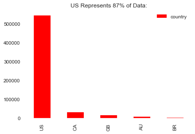


```python
df['covid19_positive'].value_counts()
```


    0    618134
    1       893
    Name: covid19_positive, dtype: int64


#### Target Class is highly imbalanced: 

> Out of the nearly 618,134 samples, 893 tested positive for COVID-19, or .0014%

This is an approximate ratio of 1:1000

#### Inspecting correlations:


```python
df.head()
```


<div>
<style scoped>
    .dataframe tbody tr th:only-of-type {
        vertical-align: middle;
    }

    .dataframe tbody tr th {
        vertical-align: top;
    }

    .dataframe thead th {
        text-align: right;
    }
</style>
<table border="1" class="dataframe">
  <thead>
    <tr style="text-align: right;">
      <th></th>
      <th>survey_date</th>
      <th>region</th>
      <th>country</th>
      <th>ip_latitude</th>
      <th>ip_longitude</th>
      <th>ip_accuracy</th>
      <th>sex</th>
      <th>age</th>
      <th>height</th>
      <th>weight</th>
      <th>bmi</th>
      <th>blood_type</th>
      <th>smoking</th>
      <th>alcohol</th>
      <th>cannabis</th>
      <th>amphetamines</th>
      <th>cocaine</th>
      <th>lsd</th>
      <th>mdma</th>
      <th>contacts_count</th>
      <th>house_count</th>
      <th>text_working</th>
      <th>rate_government_action</th>
      <th>rate_reducing_risk_single</th>
      <th>rate_reducing_risk_house</th>
      <th>rate_reducing_mask</th>
      <th>covid19_positive</th>
      <th>covid19_symptoms</th>
      <th>covid19_contact</th>
      <th>asthma</th>
      <th>kidney_disease</th>
      <th>compromised_immune</th>
      <th>heart_disease</th>
      <th>lung_disease</th>
      <th>diabetes</th>
      <th>hiv_positive</th>
      <th>hypertension</th>
      <th>other_chronic</th>
      <th>prescription_medication</th>
      <th>opinion_infection</th>
      <th>opinion_mortality</th>
      <th>risk_infection</th>
      <th>risk_mortality</th>
    </tr>
  </thead>
  <tbody>
    <tr>
      <th>0</th>
      <td>4/4/2020</td>
      <td>NaN</td>
      <td>US</td>
      <td>35.9568</td>
      <td>-86.5301</td>
      <td>200.0</td>
      <td>female</td>
      <td>40_50</td>
      <td>158</td>
      <td>114</td>
      <td>45.6</td>
      <td>ap</td>
      <td>quit0</td>
      <td>0.0</td>
      <td>0.0</td>
      <td>-1.0</td>
      <td>-1.0</td>
      <td>-1.0</td>
      <td>-1.0</td>
      <td>5.0</td>
      <td>4</td>
      <td>never</td>
      <td>0</td>
      <td>0</td>
      <td>0</td>
      <td>3.0</td>
      <td>0</td>
      <td>0</td>
      <td>0</td>
      <td>1</td>
      <td>0</td>
      <td>1</td>
      <td>0</td>
      <td>0</td>
      <td>0</td>
      <td>0</td>
      <td>1</td>
      <td>1</td>
      <td>NaN</td>
      <td>55.0</td>
      <td>35.0</td>
      <td>64.248</td>
      <td>0.721</td>
    </tr>
    <tr>
      <th>1</th>
      <td>4/5/2020</td>
      <td>NaN</td>
      <td>US</td>
      <td>39.6512</td>
      <td>-82.6200</td>
      <td>20.0</td>
      <td>female</td>
      <td>20_30</td>
      <td>168</td>
      <td>62</td>
      <td>21.9</td>
      <td>on</td>
      <td>never</td>
      <td>3.0</td>
      <td>-1.0</td>
      <td>-1.0</td>
      <td>-1.0</td>
      <td>-1.0</td>
      <td>-1.0</td>
      <td>5.0</td>
      <td>3</td>
      <td>never</td>
      <td>1</td>
      <td>1</td>
      <td>1</td>
      <td>2.0</td>
      <td>0</td>
      <td>0</td>
      <td>0</td>
      <td>0</td>
      <td>0</td>
      <td>0</td>
      <td>0</td>
      <td>0</td>
      <td>0</td>
      <td>0</td>
      <td>0</td>
      <td>0</td>
      <td>NaN</td>
      <td>15.0</td>
      <td>15.0</td>
      <td>57.549</td>
      <td>0.016</td>
    </tr>
    <tr>
      <th>2</th>
      <td>4/5/2020</td>
      <td>NaN</td>
      <td>US</td>
      <td>27.7723</td>
      <td>-82.2767</td>
      <td>10.0</td>
      <td>female</td>
      <td>0_10</td>
      <td>136</td>
      <td>44</td>
      <td>23.7</td>
      <td>bp</td>
      <td>never</td>
      <td>-1.0</td>
      <td>-1.0</td>
      <td>-1.0</td>
      <td>-1.0</td>
      <td>-1.0</td>
      <td>-1.0</td>
      <td>4.0</td>
      <td>3</td>
      <td>stopped</td>
      <td>0</td>
      <td>0</td>
      <td>0</td>
      <td>1.0</td>
      <td>0</td>
      <td>0</td>
      <td>0</td>
      <td>0</td>
      <td>0</td>
      <td>0</td>
      <td>0</td>
      <td>0</td>
      <td>0</td>
      <td>0</td>
      <td>0</td>
      <td>0</td>
      <td>NaN</td>
      <td>NaN</td>
      <td>NaN</td>
      <td>62.377</td>
      <td>0.000</td>
    </tr>
    <tr>
      <th>3</th>
      <td>4/5/2020</td>
      <td>NaN</td>
      <td>US</td>
      <td>39.6675</td>
      <td>-77.5666</td>
      <td>10.0</td>
      <td>female</td>
      <td>30_40</td>
      <td>164</td>
      <td>112</td>
      <td>41.6</td>
      <td>abn</td>
      <td>quit5</td>
      <td>-1.0</td>
      <td>28.0</td>
      <td>-1.0</td>
      <td>-1.0</td>
      <td>-1.0</td>
      <td>-1.0</td>
      <td>4.0</td>
      <td>3</td>
      <td>never</td>
      <td>1</td>
      <td>1</td>
      <td>0</td>
      <td>1.0</td>
      <td>0</td>
      <td>0</td>
      <td>0</td>
      <td>1</td>
      <td>0</td>
      <td>0</td>
      <td>0</td>
      <td>0</td>
      <td>0</td>
      <td>0</td>
      <td>1</td>
      <td>1</td>
      <td>ACETAZOLAMIDE;GABAPENTIN;OMEPRAZOLE;VENLAFAXIN...</td>
      <td>45.0</td>
      <td>25.0</td>
      <td>59.258</td>
      <td>0.195</td>
    </tr>
    <tr>
      <th>4</th>
      <td>4/4/2020</td>
      <td>NaN</td>
      <td>US</td>
      <td>41.3527</td>
      <td>-81.7444</td>
      <td>50.0</td>
      <td>male</td>
      <td>50_60</td>
      <td>184</td>
      <td>132</td>
      <td>38.9</td>
      <td>an</td>
      <td>vape</td>
      <td>0.0</td>
      <td>-1.0</td>
      <td>-1.0</td>
      <td>-1.0</td>
      <td>-1.0</td>
      <td>-1.0</td>
      <td>10.0</td>
      <td>4</td>
      <td>travel critical</td>
      <td>0</td>
      <td>0</td>
      <td>0</td>
      <td>3.0</td>
      <td>0</td>
      <td>0</td>
      <td>0</td>
      <td>0</td>
      <td>0</td>
      <td>0</td>
      <td>0</td>
      <td>0</td>
      <td>1</td>
      <td>0</td>
      <td>0</td>
      <td>0</td>
      <td>METFORMIN HYDROCHLORIDE</td>
      <td>15.0</td>
      <td>5.0</td>
      <td>77.098</td>
      <td>2.463</td>
    </tr>
  </tbody>
</table>
</div>


```python
df_cor = pd.DataFrame(df.corr()['covid19_positive'].sort_values(ascending=False))
df_cor
```


<div>
<style scoped>
    .dataframe tbody tr th:only-of-type {
        vertical-align: middle;
    }

    .dataframe tbody tr th {
        vertical-align: top;
    }

    .dataframe thead th {
        text-align: right;
    }
</style>
<table border="1" class="dataframe">
  <thead>
    <tr style="text-align: right;">
      <th></th>
      <th>covid19_positive</th>
    </tr>
  </thead>
  <tbody>
    <tr>
      <th>covid19_positive</th>
      <td>1.000000</td>
    </tr>
    <tr>
      <th>risk_infection</th>
      <td>0.198632</td>
    </tr>
    <tr>
      <th>covid19_symptoms</th>
      <td>0.089861</td>
    </tr>
    <tr>
      <th>opinion_infection</th>
      <td>0.054837</td>
    </tr>
    <tr>
      <th>covid19_contact</th>
      <td>0.050774</td>
    </tr>
    <tr>
      <th>risk_mortality</th>
      <td>0.014074</td>
    </tr>
    <tr>
      <th>mdma</th>
      <td>0.012152</td>
    </tr>
    <tr>
      <th>heart_disease</th>
      <td>0.007975</td>
    </tr>
    <tr>
      <th>weight</th>
      <td>0.007503</td>
    </tr>
    <tr>
      <th>lsd</th>
      <td>0.007137</td>
    </tr>
    <tr>
      <th>height</th>
      <td>0.006999</td>
    </tr>
    <tr>
      <th>cocaine</th>
      <td>0.006833</td>
    </tr>
    <tr>
      <th>rate_reducing_mask</th>
      <td>0.006201</td>
    </tr>
    <tr>
      <th>ip_longitude</th>
      <td>0.006122</td>
    </tr>
    <tr>
      <th>diabetes</th>
      <td>0.005700</td>
    </tr>
    <tr>
      <th>kidney_disease</th>
      <td>0.004725</td>
    </tr>
    <tr>
      <th>other_chronic</th>
      <td>0.004638</td>
    </tr>
    <tr>
      <th>compromised_immune</th>
      <td>0.004308</td>
    </tr>
    <tr>
      <th>bmi</th>
      <td>0.004280</td>
    </tr>
    <tr>
      <th>hypertension</th>
      <td>0.004055</td>
    </tr>
    <tr>
      <th>hiv_positive</th>
      <td>0.003993</td>
    </tr>
    <tr>
      <th>contacts_count</th>
      <td>0.003741</td>
    </tr>
    <tr>
      <th>ip_latitude</th>
      <td>0.003448</td>
    </tr>
    <tr>
      <th>lung_disease</th>
      <td>0.003296</td>
    </tr>
    <tr>
      <th>amphetamines</th>
      <td>0.002425</td>
    </tr>
    <tr>
      <th>asthma</th>
      <td>0.001956</td>
    </tr>
    <tr>
      <th>house_count</th>
      <td>-0.001151</td>
    </tr>
    <tr>
      <th>ip_accuracy</th>
      <td>-0.001347</td>
    </tr>
    <tr>
      <th>opinion_mortality</th>
      <td>-0.002450</td>
    </tr>
    <tr>
      <th>alcohol</th>
      <td>-0.004070</td>
    </tr>
    <tr>
      <th>cannabis</th>
      <td>-0.004418</td>
    </tr>
    <tr>
      <th>rate_government_action</th>
      <td>-0.005191</td>
    </tr>
    <tr>
      <th>rate_reducing_risk_house</th>
      <td>-0.010192</td>
    </tr>
    <tr>
      <th>rate_reducing_risk_single</th>
      <td>-0.013982</td>
    </tr>
  </tbody>
</table>
</div>


```python
df.corr()['covid19_positive'].sort_values(ascending=False).plot(kind='barh', figsize=(12,12))
```


    <matplotlib.axes._subplots.AxesSubplot at 0x1e5bb788278>


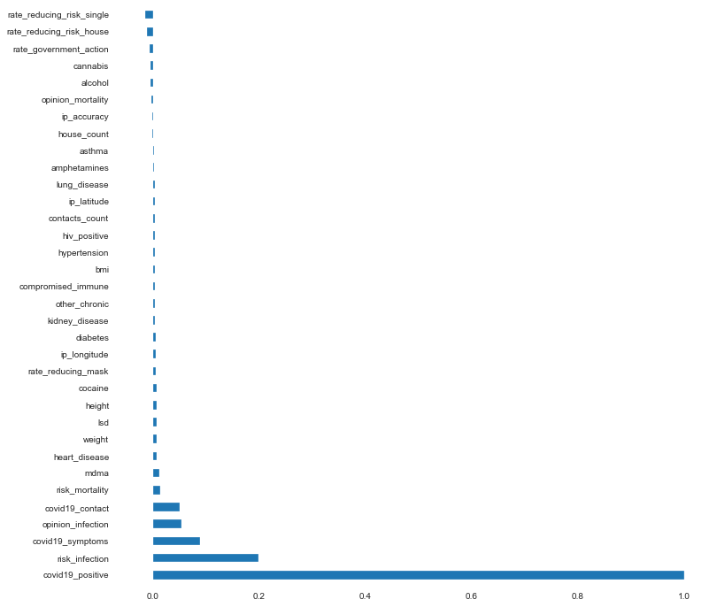


```python
df.corr().style.format("{:.2}").background_gradient(cmap=plt.get_cmap('coolwarm'), axis=1) 
```


<style  type="text/css" >
    #T_a5c56264_8bd6_11ea_af73_54e1adf13a74row0_col0 {
            background-color:  #b40426;
            color:  #f1f1f1;
        }    #T_a5c56264_8bd6_11ea_af73_54e1adf13a74row0_col1 {
            background-color:  #3b4cc0;
            color:  #f1f1f1;
        }    #T_a5c56264_8bd6_11ea_af73_54e1adf13a74row0_col2 {
            background-color:  #9dbdff;
            color:  #000000;
        }    #T_a5c56264_8bd6_11ea_af73_54e1adf13a74row0_col3 {
            background-color:  #a6c4fe;
            color:  #000000;
        }    #T_a5c56264_8bd6_11ea_af73_54e1adf13a74row0_col4 {
            background-color:  #aac7fd;
            color:  #000000;
        }    #T_a5c56264_8bd6_11ea_af73_54e1adf13a74row0_col5 {
            background-color:  #aac7fd;
            color:  #000000;
        }    #T_a5c56264_8bd6_11ea_af73_54e1adf13a74row0_col6 {
            background-color:  #a5c3fe;
            color:  #000000;
        }    #T_a5c56264_8bd6_11ea_af73_54e1adf13a74row0_col7 {
            background-color:  #adc9fd;
            color:  #000000;
        }    #T_a5c56264_8bd6_11ea_af73_54e1adf13a74row0_col8 {
            background-color:  #a3c2fe;
            color:  #000000;
        }    #T_a5c56264_8bd6_11ea_af73_54e1adf13a74row0_col9 {
            background-color:  #a5c3fe;
            color:  #000000;
        }    #T_a5c56264_8bd6_11ea_af73_54e1adf13a74row0_col10 {
            background-color:  #a3c2fe;
            color:  #000000;
        }    #T_a5c56264_8bd6_11ea_af73_54e1adf13a74row0_col11 {
            background-color:  #a1c0ff;
            color:  #000000;
        }    #T_a5c56264_8bd6_11ea_af73_54e1adf13a74row0_col12 {
            background-color:  #9fbfff;
            color:  #000000;
        }    #T_a5c56264_8bd6_11ea_af73_54e1adf13a74row0_col13 {
            background-color:  #a2c1ff;
            color:  #000000;
        }    #T_a5c56264_8bd6_11ea_af73_54e1adf13a74row0_col14 {
            background-color:  #abc8fd;
            color:  #000000;
        }    #T_a5c56264_8bd6_11ea_af73_54e1adf13a74row0_col15 {
            background-color:  #a6c4fe;
            color:  #000000;
        }    #T_a5c56264_8bd6_11ea_af73_54e1adf13a74row0_col16 {
            background-color:  #a6c4fe;
            color:  #000000;
        }    #T_a5c56264_8bd6_11ea_af73_54e1adf13a74row0_col17 {
            background-color:  #9fbfff;
            color:  #000000;
        }    #T_a5c56264_8bd6_11ea_af73_54e1adf13a74row0_col18 {
            background-color:  #a6c4fe;
            color:  #000000;
        }    #T_a5c56264_8bd6_11ea_af73_54e1adf13a74row0_col19 {
            background-color:  #a7c5fe;
            color:  #000000;
        }    #T_a5c56264_8bd6_11ea_af73_54e1adf13a74row0_col20 {
            background-color:  #a6c4fe;
            color:  #000000;
        }    #T_a5c56264_8bd6_11ea_af73_54e1adf13a74row0_col21 {
            background-color:  #a6c4fe;
            color:  #000000;
        }    #T_a5c56264_8bd6_11ea_af73_54e1adf13a74row0_col22 {
            background-color:  #a5c3fe;
            color:  #000000;
        }    #T_a5c56264_8bd6_11ea_af73_54e1adf13a74row0_col23 {
            background-color:  #a6c4fe;
            color:  #000000;
        }    #T_a5c56264_8bd6_11ea_af73_54e1adf13a74row0_col24 {
            background-color:  #a3c2fe;
            color:  #000000;
        }    #T_a5c56264_8bd6_11ea_af73_54e1adf13a74row0_col25 {
            background-color:  #a5c3fe;
            color:  #000000;
        }    #T_a5c56264_8bd6_11ea_af73_54e1adf13a74row0_col26 {
            background-color:  #a5c3fe;
            color:  #000000;
        }    #T_a5c56264_8bd6_11ea_af73_54e1adf13a74row0_col27 {
            background-color:  #a2c1ff;
            color:  #000000;
        }    #T_a5c56264_8bd6_11ea_af73_54e1adf13a74row0_col28 {
            background-color:  #a3c2fe;
            color:  #000000;
        }    #T_a5c56264_8bd6_11ea_af73_54e1adf13a74row0_col29 {
            background-color:  #a6c4fe;
            color:  #000000;
        }    #T_a5c56264_8bd6_11ea_af73_54e1adf13a74row0_col30 {
            background-color:  #abc8fd;
            color:  #000000;
        }    #T_a5c56264_8bd6_11ea_af73_54e1adf13a74row0_col31 {
            background-color:  #a6c4fe;
            color:  #000000;
        }    #T_a5c56264_8bd6_11ea_af73_54e1adf13a74row0_col32 {
            background-color:  #aac7fd;
            color:  #000000;
        }    #T_a5c56264_8bd6_11ea_af73_54e1adf13a74row0_col33 {
            background-color:  #a3c2fe;
            color:  #000000;
        }    #T_a5c56264_8bd6_11ea_af73_54e1adf13a74row1_col0 {
            background-color:  #3b4cc0;
            color:  #f1f1f1;
        }    #T_a5c56264_8bd6_11ea_af73_54e1adf13a74row1_col1 {
            background-color:  #b40426;
            color:  #f1f1f1;
        }    #T_a5c56264_8bd6_11ea_af73_54e1adf13a74row1_col2 {
            background-color:  #a1c0ff;
            color:  #000000;
        }    #T_a5c56264_8bd6_11ea_af73_54e1adf13a74row1_col3 {
            background-color:  #abc8fd;
            color:  #000000;
        }    #T_a5c56264_8bd6_11ea_af73_54e1adf13a74row1_col4 {
            background-color:  #9abbff;
            color:  #000000;
        }    #T_a5c56264_8bd6_11ea_af73_54e1adf13a74row1_col5 {
            background-color:  #97b8ff;
            color:  #000000;
        }    #T_a5c56264_8bd6_11ea_af73_54e1adf13a74row1_col6 {
            background-color:  #a3c2fe;
            color:  #000000;
        }    #T_a5c56264_8bd6_11ea_af73_54e1adf13a74row1_col7 {
            background-color:  #98b9ff;
            color:  #000000;
        }    #T_a5c56264_8bd6_11ea_af73_54e1adf13a74row1_col8 {
            background-color:  #a3c2fe;
            color:  #000000;
        }    #T_a5c56264_8bd6_11ea_af73_54e1adf13a74row1_col9 {
            background-color:  #a5c3fe;
            color:  #000000;
        }    #T_a5c56264_8bd6_11ea_af73_54e1adf13a74row1_col10 {
            background-color:  #a3c2fe;
            color:  #000000;
        }    #T_a5c56264_8bd6_11ea_af73_54e1adf13a74row1_col11 {
            background-color:  #a9c6fd;
            color:  #000000;
        }    #T_a5c56264_8bd6_11ea_af73_54e1adf13a74row1_col12 {
            background-color:  #9ebeff;
            color:  #000000;
        }    #T_a5c56264_8bd6_11ea_af73_54e1adf13a74row1_col13 {
            background-color:  #a1c0ff;
            color:  #000000;
        }    #T_a5c56264_8bd6_11ea_af73_54e1adf13a74row1_col14 {
            background-color:  #b5cdfa;
            color:  #000000;
        }    #T_a5c56264_8bd6_11ea_af73_54e1adf13a74row1_col15 {
            background-color:  #a7c5fe;
            color:  #000000;
        }    #T_a5c56264_8bd6_11ea_af73_54e1adf13a74row1_col16 {
            background-color:  #a6c4fe;
            color:  #000000;
        }    #T_a5c56264_8bd6_11ea_af73_54e1adf13a74row1_col17 {
            background-color:  #9ebeff;
            color:  #000000;
        }    #T_a5c56264_8bd6_11ea_af73_54e1adf13a74row1_col18 {
            background-color:  #a6c4fe;
            color:  #000000;
        }    #T_a5c56264_8bd6_11ea_af73_54e1adf13a74row1_col19 {
            background-color:  #a6c4fe;
            color:  #000000;
        }    #T_a5c56264_8bd6_11ea_af73_54e1adf13a74row1_col20 {
            background-color:  #a2c1ff;
            color:  #000000;
        }    #T_a5c56264_8bd6_11ea_af73_54e1adf13a74row1_col21 {
            background-color:  #a5c3fe;
            color:  #000000;
        }    #T_a5c56264_8bd6_11ea_af73_54e1adf13a74row1_col22 {
            background-color:  #a5c3fe;
            color:  #000000;
        }    #T_a5c56264_8bd6_11ea_af73_54e1adf13a74row1_col23 {
            background-color:  #a2c1ff;
            color:  #000000;
        }    #T_a5c56264_8bd6_11ea_af73_54e1adf13a74row1_col24 {
            background-color:  #a5c3fe;
            color:  #000000;
        }    #T_a5c56264_8bd6_11ea_af73_54e1adf13a74row1_col25 {
            background-color:  #a3c2fe;
            color:  #000000;
        }    #T_a5c56264_8bd6_11ea_af73_54e1adf13a74row1_col26 {
            background-color:  #a1c0ff;
            color:  #000000;
        }    #T_a5c56264_8bd6_11ea_af73_54e1adf13a74row1_col27 {
            background-color:  #a5c3fe;
            color:  #000000;
        }    #T_a5c56264_8bd6_11ea_af73_54e1adf13a74row1_col28 {
            background-color:  #9ebeff;
            color:  #000000;
        }    #T_a5c56264_8bd6_11ea_af73_54e1adf13a74row1_col29 {
            background-color:  #a5c3fe;
            color:  #000000;
        }    #T_a5c56264_8bd6_11ea_af73_54e1adf13a74row1_col30 {
            background-color:  #9fbfff;
            color:  #000000;
        }    #T_a5c56264_8bd6_11ea_af73_54e1adf13a74row1_col31 {
            background-color:  #a3c2fe;
            color:  #000000;
        }    #T_a5c56264_8bd6_11ea_af73_54e1adf13a74row1_col32 {
            background-color:  #9bbcff;
            color:  #000000;
        }    #T_a5c56264_8bd6_11ea_af73_54e1adf13a74row1_col33 {
            background-color:  #a2c1ff;
            color:  #000000;
        }    #T_a5c56264_8bd6_11ea_af73_54e1adf13a74row2_col0 {
            background-color:  #3b4cc0;
            color:  #f1f1f1;
        }    #T_a5c56264_8bd6_11ea_af73_54e1adf13a74row2_col1 {
            background-color:  #3f53c6;
            color:  #f1f1f1;
        }    #T_a5c56264_8bd6_11ea_af73_54e1adf13a74row2_col2 {
            background-color:  #b40426;
            color:  #f1f1f1;
        }    #T_a5c56264_8bd6_11ea_af73_54e1adf13a74row2_col3 {
            background-color:  #465ecf;
            color:  #f1f1f1;
        }    #T_a5c56264_8bd6_11ea_af73_54e1adf13a74row2_col4 {
            background-color:  #4961d2;
            color:  #f1f1f1;
        }    #T_a5c56264_8bd6_11ea_af73_54e1adf13a74row2_col5 {
            background-color:  #4961d2;
            color:  #f1f1f1;
        }    #T_a5c56264_8bd6_11ea_af73_54e1adf13a74row2_col6 {
            background-color:  #3d50c3;
            color:  #f1f1f1;
        }    #T_a5c56264_8bd6_11ea_af73_54e1adf13a74row2_col7 {
            background-color:  #465ecf;
            color:  #f1f1f1;
        }    #T_a5c56264_8bd6_11ea_af73_54e1adf13a74row2_col8 {
            background-color:  #4961d2;
            color:  #f1f1f1;
        }    #T_a5c56264_8bd6_11ea_af73_54e1adf13a74row2_col9 {
            background-color:  #465ecf;
            color:  #f1f1f1;
        }    #T_a5c56264_8bd6_11ea_af73_54e1adf13a74row2_col10 {
            background-color:  #455cce;
            color:  #f1f1f1;
        }    #T_a5c56264_8bd6_11ea_af73_54e1adf13a74row2_col11 {
            background-color:  #455cce;
            color:  #f1f1f1;
        }    #T_a5c56264_8bd6_11ea_af73_54e1adf13a74row2_col12 {
            background-color:  #6282ea;
            color:  #000000;
        }    #T_a5c56264_8bd6_11ea_af73_54e1adf13a74row2_col13 {
            background-color:  #4f69d9;
            color:  #000000;
        }    #T_a5c56264_8bd6_11ea_af73_54e1adf13a74row2_col14 {
            background-color:  #485fd1;
            color:  #f1f1f1;
        }    #T_a5c56264_8bd6_11ea_af73_54e1adf13a74row2_col15 {
            background-color:  #3b4cc0;
            color:  #f1f1f1;
        }    #T_a5c56264_8bd6_11ea_af73_54e1adf13a74row2_col16 {
            background-color:  #3c4ec2;
            color:  #f1f1f1;
        }    #T_a5c56264_8bd6_11ea_af73_54e1adf13a74row2_col17 {
            background-color:  #3e51c5;
            color:  #f1f1f1;
        }    #T_a5c56264_8bd6_11ea_af73_54e1adf13a74row2_col18 {
            background-color:  #445acc;
            color:  #f1f1f1;
        }    #T_a5c56264_8bd6_11ea_af73_54e1adf13a74row2_col19 {
            background-color:  #4358cb;
            color:  #f1f1f1;
        }    #T_a5c56264_8bd6_11ea_af73_54e1adf13a74row2_col20 {
            background-color:  #465ecf;
            color:  #f1f1f1;
        }    #T_a5c56264_8bd6_11ea_af73_54e1adf13a74row2_col21 {
            background-color:  #4257c9;
            color:  #f1f1f1;
        }    #T_a5c56264_8bd6_11ea_af73_54e1adf13a74row2_col22 {
            background-color:  #455cce;
            color:  #f1f1f1;
        }    #T_a5c56264_8bd6_11ea_af73_54e1adf13a74row2_col23 {
            background-color:  #4358cb;
            color:  #f1f1f1;
        }    #T_a5c56264_8bd6_11ea_af73_54e1adf13a74row2_col24 {
            background-color:  #445acc;
            color:  #f1f1f1;
        }    #T_a5c56264_8bd6_11ea_af73_54e1adf13a74row2_col25 {
            background-color:  #455cce;
            color:  #f1f1f1;
        }    #T_a5c56264_8bd6_11ea_af73_54e1adf13a74row2_col26 {
            background-color:  #445acc;
            color:  #f1f1f1;
        }    #T_a5c56264_8bd6_11ea_af73_54e1adf13a74row2_col27 {
            background-color:  #445acc;
            color:  #f1f1f1;
        }    #T_a5c56264_8bd6_11ea_af73_54e1adf13a74row2_col28 {
            background-color:  #455cce;
            color:  #f1f1f1;
        }    #T_a5c56264_8bd6_11ea_af73_54e1adf13a74row2_col29 {
            background-color:  #4257c9;
            color:  #f1f1f1;
        }    #T_a5c56264_8bd6_11ea_af73_54e1adf13a74row2_col30 {
            background-color:  #445acc;
            color:  #f1f1f1;
        }    #T_a5c56264_8bd6_11ea_af73_54e1adf13a74row2_col31 {
            background-color:  #445acc;
            color:  #f1f1f1;
        }    #T_a5c56264_8bd6_11ea_af73_54e1adf13a74row2_col32 {
            background-color:  #6384eb;
            color:  #000000;
        }    #T_a5c56264_8bd6_11ea_af73_54e1adf13a74row2_col33 {
            background-color:  #4055c8;
            color:  #f1f1f1;
        }    #T_a5c56264_8bd6_11ea_af73_54e1adf13a74row3_col0 {
            background-color:  #5673e0;
            color:  #000000;
        }    #T_a5c56264_8bd6_11ea_af73_54e1adf13a74row3_col1 {
            background-color:  #5d7ce6;
            color:  #000000;
        }    #T_a5c56264_8bd6_11ea_af73_54e1adf13a74row3_col2 {
            background-color:  #5875e1;
            color:  #000000;
        }    #T_a5c56264_8bd6_11ea_af73_54e1adf13a74row3_col3 {
            background-color:  #b40426;
            color:  #f1f1f1;
        }    #T_a5c56264_8bd6_11ea_af73_54e1adf13a74row3_col4 {
            background-color:  #ccd9ed;
            color:  #000000;
        }    #T_a5c56264_8bd6_11ea_af73_54e1adf13a74row3_col5 {
            background-color:  #3b4cc0;
            color:  #f1f1f1;
        }    #T_a5c56264_8bd6_11ea_af73_54e1adf13a74row3_col6 {
            background-color:  #799cf8;
            color:  #000000;
        }    #T_a5c56264_8bd6_11ea_af73_54e1adf13a74row3_col7 {
            background-color:  #6384eb;
            color:  #000000;
        }    #T_a5c56264_8bd6_11ea_af73_54e1adf13a74row3_col8 {
            background-color:  #5977e3;
            color:  #000000;
        }    #T_a5c56264_8bd6_11ea_af73_54e1adf13a74row3_col9 {
            background-color:  #6282ea;
            color:  #000000;
        }    #T_a5c56264_8bd6_11ea_af73_54e1adf13a74row3_col10 {
            background-color:  #6485ec;
            color:  #000000;
        }    #T_a5c56264_8bd6_11ea_af73_54e1adf13a74row3_col11 {
            background-color:  #6384eb;
            color:  #000000;
        }    #T_a5c56264_8bd6_11ea_af73_54e1adf13a74row3_col12 {
            background-color:  #5977e3;
            color:  #000000;
        }    #T_a5c56264_8bd6_11ea_af73_54e1adf13a74row3_col13 {
            background-color:  #445acc;
            color:  #f1f1f1;
        }    #T_a5c56264_8bd6_11ea_af73_54e1adf13a74row3_col14 {
            background-color:  #5977e3;
            color:  #000000;
        }    #T_a5c56264_8bd6_11ea_af73_54e1adf13a74row3_col15 {
            background-color:  #516ddb;
            color:  #000000;
        }    #T_a5c56264_8bd6_11ea_af73_54e1adf13a74row3_col16 {
            background-color:  #5e7de7;
            color:  #000000;
        }    #T_a5c56264_8bd6_11ea_af73_54e1adf13a74row3_col17 {
            background-color:  #485fd1;
            color:  #f1f1f1;
        }    #T_a5c56264_8bd6_11ea_af73_54e1adf13a74row3_col18 {
            background-color:  #5875e1;
            color:  #000000;
        }    #T_a5c56264_8bd6_11ea_af73_54e1adf13a74row3_col19 {
            background-color:  #536edd;
            color:  #000000;
        }    #T_a5c56264_8bd6_11ea_af73_54e1adf13a74row3_col20 {
            background-color:  #5470de;
            color:  #000000;
        }    #T_a5c56264_8bd6_11ea_af73_54e1adf13a74row3_col21 {
            background-color:  #4257c9;
            color:  #f1f1f1;
        }    #T_a5c56264_8bd6_11ea_af73_54e1adf13a74row3_col22 {
            background-color:  #5572df;
            color:  #000000;
        }    #T_a5c56264_8bd6_11ea_af73_54e1adf13a74row3_col23 {
            background-color:  #455cce;
            color:  #f1f1f1;
        }    #T_a5c56264_8bd6_11ea_af73_54e1adf13a74row3_col24 {
            background-color:  #5d7ce6;
            color:  #000000;
        }    #T_a5c56264_8bd6_11ea_af73_54e1adf13a74row3_col25 {
            background-color:  #536edd;
            color:  #000000;
        }    #T_a5c56264_8bd6_11ea_af73_54e1adf13a74row3_col26 {
            background-color:  #5e7de7;
            color:  #000000;
        }    #T_a5c56264_8bd6_11ea_af73_54e1adf13a74row3_col27 {
            background-color:  #5f7fe8;
            color:  #000000;
        }    #T_a5c56264_8bd6_11ea_af73_54e1adf13a74row3_col28 {
            background-color:  #6687ed;
            color:  #000000;
        }    #T_a5c56264_8bd6_11ea_af73_54e1adf13a74row3_col29 {
            background-color:  #465ecf;
            color:  #f1f1f1;
        }    #T_a5c56264_8bd6_11ea_af73_54e1adf13a74row3_col30 {
            background-color:  #4c66d6;
            color:  #000000;
        }    #T_a5c56264_8bd6_11ea_af73_54e1adf13a74row3_col31 {
            background-color:  #3b4cc0;
            color:  #f1f1f1;
        }    #T_a5c56264_8bd6_11ea_af73_54e1adf13a74row3_col32 {
            background-color:  #5f7fe8;
            color:  #000000;
        }    #T_a5c56264_8bd6_11ea_af73_54e1adf13a74row3_col33 {
            background-color:  #6f92f3;
            color:  #000000;
        }    #T_a5c56264_8bd6_11ea_af73_54e1adf13a74row4_col0 {
            background-color:  #5470de;
            color:  #000000;
        }    #T_a5c56264_8bd6_11ea_af73_54e1adf13a74row4_col1 {
            background-color:  #4055c8;
            color:  #f1f1f1;
        }    #T_a5c56264_8bd6_11ea_af73_54e1adf13a74row4_col2 {
            background-color:  #516ddb;
            color:  #000000;
        }    #T_a5c56264_8bd6_11ea_af73_54e1adf13a74row4_col3 {
            background-color:  #c7d7f0;
            color:  #000000;
        }    #T_a5c56264_8bd6_11ea_af73_54e1adf13a74row4_col4 {
            background-color:  #b40426;
            color:  #f1f1f1;
        }    #T_a5c56264_8bd6_11ea_af73_54e1adf13a74row4_col5 {
            background-color:  #dc5d4a;
            color:  #000000;
        }    #T_a5c56264_8bd6_11ea_af73_54e1adf13a74row4_col6 {
            background-color:  #3b4cc0;
            color:  #f1f1f1;
        }    #T_a5c56264_8bd6_11ea_af73_54e1adf13a74row4_col7 {
            background-color:  #4a63d3;
            color:  #f1f1f1;
        }    #T_a5c56264_8bd6_11ea_af73_54e1adf13a74row4_col8 {
            background-color:  #4c66d6;
            color:  #000000;
        }    #T_a5c56264_8bd6_11ea_af73_54e1adf13a74row4_col9 {
            background-color:  #4c66d6;
            color:  #000000;
        }    #T_a5c56264_8bd6_11ea_af73_54e1adf13a74row4_col10 {
            background-color:  #4c66d6;
            color:  #000000;
        }    #T_a5c56264_8bd6_11ea_af73_54e1adf13a74row4_col11 {
            background-color:  #4b64d5;
            color:  #f1f1f1;
        }    #T_a5c56264_8bd6_11ea_af73_54e1adf13a74row4_col12 {
            background-color:  #5e7de7;
            color:  #000000;
        }    #T_a5c56264_8bd6_11ea_af73_54e1adf13a74row4_col13 {
            background-color:  #4c66d6;
            color:  #000000;
        }    #T_a5c56264_8bd6_11ea_af73_54e1adf13a74row4_col14 {
            background-color:  #485fd1;
            color:  #f1f1f1;
        }    #T_a5c56264_8bd6_11ea_af73_54e1adf13a74row4_col15 {
            background-color:  #4961d2;
            color:  #f1f1f1;
        }    #T_a5c56264_8bd6_11ea_af73_54e1adf13a74row4_col16 {
            background-color:  #4c66d6;
            color:  #000000;
        }    #T_a5c56264_8bd6_11ea_af73_54e1adf13a74row4_col17 {
            background-color:  #455cce;
            color:  #f1f1f1;
        }    #T_a5c56264_8bd6_11ea_af73_54e1adf13a74row4_col18 {
            background-color:  #4f69d9;
            color:  #000000;
        }    #T_a5c56264_8bd6_11ea_af73_54e1adf13a74row4_col19 {
            background-color:  #4e68d8;
            color:  #000000;
        }    #T_a5c56264_8bd6_11ea_af73_54e1adf13a74row4_col20 {
            background-color:  #4b64d5;
            color:  #f1f1f1;
        }    #T_a5c56264_8bd6_11ea_af73_54e1adf13a74row4_col21 {
            background-color:  #5b7ae5;
            color:  #000000;
        }    #T_a5c56264_8bd6_11ea_af73_54e1adf13a74row4_col22 {
            background-color:  #506bda;
            color:  #000000;
        }    #T_a5c56264_8bd6_11ea_af73_54e1adf13a74row4_col23 {
            background-color:  #506bda;
            color:  #000000;
        }    #T_a5c56264_8bd6_11ea_af73_54e1adf13a74row4_col24 {
            background-color:  #5977e3;
            color:  #000000;
        }    #T_a5c56264_8bd6_11ea_af73_54e1adf13a74row4_col25 {
            background-color:  #506bda;
            color:  #000000;
        }    #T_a5c56264_8bd6_11ea_af73_54e1adf13a74row4_col26 {
            background-color:  #82a6fb;
            color:  #000000;
        }    #T_a5c56264_8bd6_11ea_af73_54e1adf13a74row4_col27 {
            background-color:  #506bda;
            color:  #000000;
        }    #T_a5c56264_8bd6_11ea_af73_54e1adf13a74row4_col28 {
            background-color:  #94b6ff;
            color:  #000000;
        }    #T_a5c56264_8bd6_11ea_af73_54e1adf13a74row4_col29 {
            background-color:  #536edd;
            color:  #000000;
        }    #T_a5c56264_8bd6_11ea_af73_54e1adf13a74row4_col30 {
            background-color:  #536edd;
            color:  #000000;
        }    #T_a5c56264_8bd6_11ea_af73_54e1adf13a74row4_col31 {
            background-color:  #6c8ff1;
            color:  #000000;
        }    #T_a5c56264_8bd6_11ea_af73_54e1adf13a74row4_col32 {
            background-color:  #6180e9;
            color:  #000000;
        }    #T_a5c56264_8bd6_11ea_af73_54e1adf13a74row4_col33 {
            background-color:  #6180e9;
            color:  #000000;
        }    #T_a5c56264_8bd6_11ea_af73_54e1adf13a74row5_col0 {
            background-color:  #6384eb;
            color:  #000000;
        }    #T_a5c56264_8bd6_11ea_af73_54e1adf13a74row5_col1 {
            background-color:  #4c66d6;
            color:  #000000;
        }    #T_a5c56264_8bd6_11ea_af73_54e1adf13a74row5_col2 {
            background-color:  #6180e9;
            color:  #000000;
        }    #T_a5c56264_8bd6_11ea_af73_54e1adf13a74row5_col3 {
            background-color:  #4257c9;
            color:  #f1f1f1;
        }    #T_a5c56264_8bd6_11ea_af73_54e1adf13a74row5_col4 {
            background-color:  #da5a49;
            color:  #000000;
        }    #T_a5c56264_8bd6_11ea_af73_54e1adf13a74row5_col5 {
            background-color:  #b40426;
            color:  #f1f1f1;
        }    #T_a5c56264_8bd6_11ea_af73_54e1adf13a74row5_col6 {
            background-color:  #3b4cc0;
            color:  #f1f1f1;
        }    #T_a5c56264_8bd6_11ea_af73_54e1adf13a74row5_col7 {
            background-color:  #5470de;
            color:  #000000;
        }    #T_a5c56264_8bd6_11ea_af73_54e1adf13a74row5_col8 {
            background-color:  #5a78e4;
            color:  #000000;
        }    #T_a5c56264_8bd6_11ea_af73_54e1adf13a74row5_col9 {
            background-color:  #5673e0;
            color:  #000000;
        }    #T_a5c56264_8bd6_11ea_af73_54e1adf13a74row5_col10 {
            background-color:  #5673e0;
            color:  #000000;
        }    #T_a5c56264_8bd6_11ea_af73_54e1adf13a74row5_col11 {
            background-color:  #5572df;
            color:  #000000;
        }    #T_a5c56264_8bd6_11ea_af73_54e1adf13a74row5_col12 {
            background-color:  #6c8ff1;
            color:  #000000;
        }    #T_a5c56264_8bd6_11ea_af73_54e1adf13a74row5_col13 {
            background-color:  #6687ed;
            color:  #000000;
        }    #T_a5c56264_8bd6_11ea_af73_54e1adf13a74row5_col14 {
            background-color:  #5572df;
            color:  #000000;
        }    #T_a5c56264_8bd6_11ea_af73_54e1adf13a74row5_col15 {
            background-color:  #5a78e4;
            color:  #000000;
        }    #T_a5c56264_8bd6_11ea_af73_54e1adf13a74row5_col16 {
            background-color:  #5875e1;
            color:  #000000;
        }    #T_a5c56264_8bd6_11ea_af73_54e1adf13a74row5_col17 {
            background-color:  #5a78e4;
            color:  #000000;
        }    #T_a5c56264_8bd6_11ea_af73_54e1adf13a74row5_col18 {
            background-color:  #5e7de7;
            color:  #000000;
        }    #T_a5c56264_8bd6_11ea_af73_54e1adf13a74row5_col19 {
            background-color:  #5f7fe8;
            color:  #000000;
        }    #T_a5c56264_8bd6_11ea_af73_54e1adf13a74row5_col20 {
            background-color:  #5b7ae5;
            color:  #000000;
        }    #T_a5c56264_8bd6_11ea_af73_54e1adf13a74row5_col21 {
            background-color:  #7699f6;
            color:  #000000;
        }    #T_a5c56264_8bd6_11ea_af73_54e1adf13a74row5_col22 {
            background-color:  #6180e9;
            color:  #000000;
        }    #T_a5c56264_8bd6_11ea_af73_54e1adf13a74row5_col23 {
            background-color:  #688aef;
            color:  #000000;
        }    #T_a5c56264_8bd6_11ea_af73_54e1adf13a74row5_col24 {
            background-color:  #6687ed;
            color:  #000000;
        }    #T_a5c56264_8bd6_11ea_af73_54e1adf13a74row5_col25 {
            background-color:  #6282ea;
            color:  #000000;
        }    #T_a5c56264_8bd6_11ea_af73_54e1adf13a74row5_col26 {
            background-color:  #90b2fe;
            color:  #000000;
        }    #T_a5c56264_8bd6_11ea_af73_54e1adf13a74row5_col27 {
            background-color:  #5b7ae5;
            color:  #000000;
        }    #T_a5c56264_8bd6_11ea_af73_54e1adf13a74row5_col28 {
            background-color:  #9dbdff;
            color:  #000000;
        }    #T_a5c56264_8bd6_11ea_af73_54e1adf13a74row5_col29 {
            background-color:  #6b8df0;
            color:  #000000;
        }    #T_a5c56264_8bd6_11ea_af73_54e1adf13a74row5_col30 {
            background-color:  #6687ed;
            color:  #000000;
        }    #T_a5c56264_8bd6_11ea_af73_54e1adf13a74row5_col31 {
            background-color:  #8caffe;
            color:  #000000;
        }    #T_a5c56264_8bd6_11ea_af73_54e1adf13a74row5_col32 {
            background-color:  #6c8ff1;
            color:  #000000;
        }    #T_a5c56264_8bd6_11ea_af73_54e1adf13a74row5_col33 {
            background-color:  #6485ec;
            color:  #000000;
        }    #T_a5c56264_8bd6_11ea_af73_54e1adf13a74row6_col0 {
            background-color:  #5d7ce6;
            color:  #000000;
        }    #T_a5c56264_8bd6_11ea_af73_54e1adf13a74row6_col1 {
            background-color:  #5b7ae5;
            color:  #000000;
        }    #T_a5c56264_8bd6_11ea_af73_54e1adf13a74row6_col2 {
            background-color:  #5572df;
            color:  #000000;
        }    #T_a5c56264_8bd6_11ea_af73_54e1adf13a74row6_col3 {
            background-color:  #80a3fa;
            color:  #000000;
        }    #T_a5c56264_8bd6_11ea_af73_54e1adf13a74row6_col4 {
            background-color:  #4a63d3;
            color:  #f1f1f1;
        }    #T_a5c56264_8bd6_11ea_af73_54e1adf13a74row6_col5 {
            background-color:  #3b4cc0;
            color:  #f1f1f1;
        }    #T_a5c56264_8bd6_11ea_af73_54e1adf13a74row6_col6 {
            background-color:  #b40426;
            color:  #f1f1f1;
        }    #T_a5c56264_8bd6_11ea_af73_54e1adf13a74row6_col7 {
            background-color:  #7396f5;
            color:  #000000;
        }    #T_a5c56264_8bd6_11ea_af73_54e1adf13a74row6_col8 {
            background-color:  #688aef;
            color:  #000000;
        }    #T_a5c56264_8bd6_11ea_af73_54e1adf13a74row6_col9 {
            background-color:  #80a3fa;
            color:  #000000;
        }    #T_a5c56264_8bd6_11ea_af73_54e1adf13a74row6_col10 {
            background-color:  #7a9df8;
            color:  #000000;
        }    #T_a5c56264_8bd6_11ea_af73_54e1adf13a74row6_col11 {
            background-color:  #7da0f9;
            color:  #000000;
        }    #T_a5c56264_8bd6_11ea_af73_54e1adf13a74row6_col12 {
            background-color:  #5977e3;
            color:  #000000;
        }    #T_a5c56264_8bd6_11ea_af73_54e1adf13a74row6_col13 {
            background-color:  #4c66d6;
            color:  #000000;
        }    #T_a5c56264_8bd6_11ea_af73_54e1adf13a74row6_col14 {
            background-color:  #5a78e4;
            color:  #000000;
        }    #T_a5c56264_8bd6_11ea_af73_54e1adf13a74row6_col15 {
            background-color:  #5977e3;
            color:  #000000;
        }    #T_a5c56264_8bd6_11ea_af73_54e1adf13a74row6_col16 {
            background-color:  #5e7de7;
            color:  #000000;
        }    #T_a5c56264_8bd6_11ea_af73_54e1adf13a74row6_col17 {
            background-color:  #516ddb;
            color:  #000000;
        }    #T_a5c56264_8bd6_11ea_af73_54e1adf13a74row6_col18 {
            background-color:  #5b7ae5;
            color:  #000000;
        }    #T_a5c56264_8bd6_11ea_af73_54e1adf13a74row6_col19 {
            background-color:  #5b7ae5;
            color:  #000000;
        }    #T_a5c56264_8bd6_11ea_af73_54e1adf13a74row6_col20 {
            background-color:  #5e7de7;
            color:  #000000;
        }    #T_a5c56264_8bd6_11ea_af73_54e1adf13a74row6_col21 {
            background-color:  #5572df;
            color:  #000000;
        }    #T_a5c56264_8bd6_11ea_af73_54e1adf13a74row6_col22 {
            background-color:  #5977e3;
            color:  #000000;
        }    #T_a5c56264_8bd6_11ea_af73_54e1adf13a74row6_col23 {
            background-color:  #4f69d9;
            color:  #000000;
        }    #T_a5c56264_8bd6_11ea_af73_54e1adf13a74row6_col24 {
            background-color:  #5977e3;
            color:  #000000;
        }    #T_a5c56264_8bd6_11ea_af73_54e1adf13a74row6_col25 {
            background-color:  #5977e3;
            color:  #000000;
        }    #T_a5c56264_8bd6_11ea_af73_54e1adf13a74row6_col26 {
            background-color:  #4961d2;
            color:  #f1f1f1;
        }    #T_a5c56264_8bd6_11ea_af73_54e1adf13a74row6_col27 {
            background-color:  #5f7fe8;
            color:  #000000;
        }    #T_a5c56264_8bd6_11ea_af73_54e1adf13a74row6_col28 {
            background-color:  #5a78e4;
            color:  #000000;
        }    #T_a5c56264_8bd6_11ea_af73_54e1adf13a74row6_col29 {
            background-color:  #4e68d8;
            color:  #000000;
        }    #T_a5c56264_8bd6_11ea_af73_54e1adf13a74row6_col30 {
            background-color:  #6485ec;
            color:  #000000;
        }    #T_a5c56264_8bd6_11ea_af73_54e1adf13a74row6_col31 {
            background-color:  #485fd1;
            color:  #f1f1f1;
        }    #T_a5c56264_8bd6_11ea_af73_54e1adf13a74row6_col32 {
            background-color:  #5673e0;
            color:  #000000;
        }    #T_a5c56264_8bd6_11ea_af73_54e1adf13a74row6_col33 {
            background-color:  #6485ec;
            color:  #000000;
        }    #T_a5c56264_8bd6_11ea_af73_54e1adf13a74row7_col0 {
            background-color:  #5e7de7;
            color:  #000000;
        }    #T_a5c56264_8bd6_11ea_af73_54e1adf13a74row7_col1 {
            background-color:  #455cce;
            color:  #f1f1f1;
        }    #T_a5c56264_8bd6_11ea_af73_54e1adf13a74row7_col2 {
            background-color:  #5673e0;
            color:  #000000;
        }    #T_a5c56264_8bd6_11ea_af73_54e1adf13a74row7_col3 {
            background-color:  #6282ea;
            color:  #000000;
        }    #T_a5c56264_8bd6_11ea_af73_54e1adf13a74row7_col4 {
            background-color:  #506bda;
            color:  #000000;
        }    #T_a5c56264_8bd6_11ea_af73_54e1adf13a74row7_col5 {
            background-color:  #4a63d3;
            color:  #f1f1f1;
        }    #T_a5c56264_8bd6_11ea_af73_54e1adf13a74row7_col6 {
            background-color:  #6a8bef;
            color:  #000000;
        }    #T_a5c56264_8bd6_11ea_af73_54e1adf13a74row7_col7 {
            background-color:  #b40426;
            color:  #f1f1f1;
        }    #T_a5c56264_8bd6_11ea_af73_54e1adf13a74row7_col8 {
            background-color:  #6c8ff1;
            color:  #000000;
        }    #T_a5c56264_8bd6_11ea_af73_54e1adf13a74row7_col9 {
            background-color:  #89acfd;
            color:  #000000;
        }    #T_a5c56264_8bd6_11ea_af73_54e1adf13a74row7_col10 {
            background-color:  #96b7ff;
            color:  #000000;
        }    #T_a5c56264_8bd6_11ea_af73_54e1adf13a74row7_col11 {
            background-color:  #92b4fe;
            color:  #000000;
        }    #T_a5c56264_8bd6_11ea_af73_54e1adf13a74row7_col12 {
            background-color:  #5673e0;
            color:  #000000;
        }    #T_a5c56264_8bd6_11ea_af73_54e1adf13a74row7_col13 {
            background-color:  #516ddb;
            color:  #000000;
        }    #T_a5c56264_8bd6_11ea_af73_54e1adf13a74row7_col14 {
            background-color:  #3b4cc0;
            color:  #f1f1f1;
        }    #T_a5c56264_8bd6_11ea_af73_54e1adf13a74row7_col15 {
            background-color:  #4f69d9;
            color:  #000000;
        }    #T_a5c56264_8bd6_11ea_af73_54e1adf13a74row7_col16 {
            background-color:  #4e68d8;
            color:  #000000;
        }    #T_a5c56264_8bd6_11ea_af73_54e1adf13a74row7_col17 {
            background-color:  #516ddb;
            color:  #000000;
        }    #T_a5c56264_8bd6_11ea_af73_54e1adf13a74row7_col18 {
            background-color:  #536edd;
            color:  #000000;
        }    #T_a5c56264_8bd6_11ea_af73_54e1adf13a74row7_col19 {
            background-color:  #5875e1;
            color:  #000000;
        }    #T_a5c56264_8bd6_11ea_af73_54e1adf13a74row7_col20 {
            background-color:  #4e68d8;
            color:  #000000;
        }    #T_a5c56264_8bd6_11ea_af73_54e1adf13a74row7_col21 {
            background-color:  #5d7ce6;
            color:  #000000;
        }    #T_a5c56264_8bd6_11ea_af73_54e1adf13a74row7_col22 {
            background-color:  #5470de;
            color:  #000000;
        }    #T_a5c56264_8bd6_11ea_af73_54e1adf13a74row7_col23 {
            background-color:  #5b7ae5;
            color:  #000000;
        }    #T_a5c56264_8bd6_11ea_af73_54e1adf13a74row7_col24 {
            background-color:  #516ddb;
            color:  #000000;
        }    #T_a5c56264_8bd6_11ea_af73_54e1adf13a74row7_col25 {
            background-color:  #5875e1;
            color:  #000000;
        }    #T_a5c56264_8bd6_11ea_af73_54e1adf13a74row7_col26 {
            background-color:  #4c66d6;
            color:  #000000;
        }    #T_a5c56264_8bd6_11ea_af73_54e1adf13a74row7_col27 {
            background-color:  #5b7ae5;
            color:  #000000;
        }    #T_a5c56264_8bd6_11ea_af73_54e1adf13a74row7_col28 {
            background-color:  #4a63d3;
            color:  #f1f1f1;
        }    #T_a5c56264_8bd6_11ea_af73_54e1adf13a74row7_col29 {
            background-color:  #5d7ce6;
            color:  #000000;
        }    #T_a5c56264_8bd6_11ea_af73_54e1adf13a74row7_col30 {
            background-color:  #5f7fe8;
            color:  #000000;
        }    #T_a5c56264_8bd6_11ea_af73_54e1adf13a74row7_col31 {
            background-color:  #6282ea;
            color:  #000000;
        }    #T_a5c56264_8bd6_11ea_af73_54e1adf13a74row7_col32 {
            background-color:  #516ddb;
            color:  #000000;
        }    #T_a5c56264_8bd6_11ea_af73_54e1adf13a74row7_col33 {
            background-color:  #485fd1;
            color:  #f1f1f1;
        }    #T_a5c56264_8bd6_11ea_af73_54e1adf13a74row8_col0 {
            background-color:  #455cce;
            color:  #f1f1f1;
        }    #T_a5c56264_8bd6_11ea_af73_54e1adf13a74row8_col1 {
            background-color:  #445acc;
            color:  #f1f1f1;
        }    #T_a5c56264_8bd6_11ea_af73_54e1adf13a74row8_col2 {
            background-color:  #4a63d3;
            color:  #f1f1f1;
        }    #T_a5c56264_8bd6_11ea_af73_54e1adf13a74row8_col3 {
            background-color:  #4a63d3;
            color:  #f1f1f1;
        }    #T_a5c56264_8bd6_11ea_af73_54e1adf13a74row8_col4 {
            background-color:  #455cce;
            color:  #f1f1f1;
        }    #T_a5c56264_8bd6_11ea_af73_54e1adf13a74row8_col5 {
            background-color:  #445acc;
            color:  #f1f1f1;
        }    #T_a5c56264_8bd6_11ea_af73_54e1adf13a74row8_col6 {
            background-color:  #516ddb;
            color:  #000000;
        }    #T_a5c56264_8bd6_11ea_af73_54e1adf13a74row8_col7 {
            background-color:  #5f7fe8;
            color:  #000000;
        }    #T_a5c56264_8bd6_11ea_af73_54e1adf13a74row8_col8 {
            background-color:  #b40426;
            color:  #f1f1f1;
        }    #T_a5c56264_8bd6_11ea_af73_54e1adf13a74row8_col9 {
            background-color:  #81a4fb;
            color:  #000000;
        }    #T_a5c56264_8bd6_11ea_af73_54e1adf13a74row8_col10 {
            background-color:  #85a8fc;
            color:  #000000;
        }    #T_a5c56264_8bd6_11ea_af73_54e1adf13a74row8_col11 {
            background-color:  #89acfd;
            color:  #000000;
        }    #T_a5c56264_8bd6_11ea_af73_54e1adf13a74row8_col12 {
            background-color:  #4e68d8;
            color:  #000000;
        }    #T_a5c56264_8bd6_11ea_af73_54e1adf13a74row8_col13 {
            background-color:  #4961d2;
            color:  #f1f1f1;
        }    #T_a5c56264_8bd6_11ea_af73_54e1adf13a74row8_col14 {
            background-color:  #4257c9;
            color:  #f1f1f1;
        }    #T_a5c56264_8bd6_11ea_af73_54e1adf13a74row8_col15 {
            background-color:  #3b4cc0;
            color:  #f1f1f1;
        }    #T_a5c56264_8bd6_11ea_af73_54e1adf13a74row8_col16 {
            background-color:  #3c4ec2;
            color:  #f1f1f1;
        }    #T_a5c56264_8bd6_11ea_af73_54e1adf13a74row8_col17 {
            background-color:  #4358cb;
            color:  #f1f1f1;
        }    #T_a5c56264_8bd6_11ea_af73_54e1adf13a74row8_col18 {
            background-color:  #465ecf;
            color:  #f1f1f1;
        }    #T_a5c56264_8bd6_11ea_af73_54e1adf13a74row8_col19 {
            background-color:  #4a63d3;
            color:  #f1f1f1;
        }    #T_a5c56264_8bd6_11ea_af73_54e1adf13a74row8_col20 {
            background-color:  #4961d2;
            color:  #f1f1f1;
        }    #T_a5c56264_8bd6_11ea_af73_54e1adf13a74row8_col21 {
            background-color:  #4961d2;
            color:  #f1f1f1;
        }    #T_a5c56264_8bd6_11ea_af73_54e1adf13a74row8_col22 {
            background-color:  #4961d2;
            color:  #f1f1f1;
        }    #T_a5c56264_8bd6_11ea_af73_54e1adf13a74row8_col23 {
            background-color:  #4b64d5;
            color:  #f1f1f1;
        }    #T_a5c56264_8bd6_11ea_af73_54e1adf13a74row8_col24 {
            background-color:  #4961d2;
            color:  #f1f1f1;
        }    #T_a5c56264_8bd6_11ea_af73_54e1adf13a74row8_col25 {
            background-color:  #4b64d5;
            color:  #f1f1f1;
        }    #T_a5c56264_8bd6_11ea_af73_54e1adf13a74row8_col26 {
            background-color:  #465ecf;
            color:  #f1f1f1;
        }    #T_a5c56264_8bd6_11ea_af73_54e1adf13a74row8_col27 {
            background-color:  #4f69d9;
            color:  #000000;
        }    #T_a5c56264_8bd6_11ea_af73_54e1adf13a74row8_col28 {
            background-color:  #4961d2;
            color:  #f1f1f1;
        }    #T_a5c56264_8bd6_11ea_af73_54e1adf13a74row8_col29 {
            background-color:  #4a63d3;
            color:  #f1f1f1;
        }    #T_a5c56264_8bd6_11ea_af73_54e1adf13a74row8_col30 {
            background-color:  #4b64d5;
            color:  #f1f1f1;
        }    #T_a5c56264_8bd6_11ea_af73_54e1adf13a74row8_col31 {
            background-color:  #4c66d6;
            color:  #000000;
        }    #T_a5c56264_8bd6_11ea_af73_54e1adf13a74row8_col32 {
            background-color:  #506bda;
            color:  #000000;
        }    #T_a5c56264_8bd6_11ea_af73_54e1adf13a74row8_col33 {
            background-color:  #4a63d3;
            color:  #f1f1f1;
        }    #T_a5c56264_8bd6_11ea_af73_54e1adf13a74row9_col0 {
            background-color:  #4e68d8;
            color:  #000000;
        }    #T_a5c56264_8bd6_11ea_af73_54e1adf13a74row9_col1 {
            background-color:  #4c66d6;
            color:  #000000;
        }    #T_a5c56264_8bd6_11ea_af73_54e1adf13a74row9_col2 {
            background-color:  #4e68d8;
            color:  #000000;
        }    #T_a5c56264_8bd6_11ea_af73_54e1adf13a74row9_col3 {
            background-color:  #5977e3;
            color:  #000000;
        }    #T_a5c56264_8bd6_11ea_af73_54e1adf13a74row9_col4 {
            background-color:  #4b64d5;
            color:  #f1f1f1;
        }    #T_a5c56264_8bd6_11ea_af73_54e1adf13a74row9_col5 {
            background-color:  #455cce;
            color:  #f1f1f1;
        }    #T_a5c56264_8bd6_11ea_af73_54e1adf13a74row9_col6 {
            background-color:  #6f92f3;
            color:  #000000;
        }    #T_a5c56264_8bd6_11ea_af73_54e1adf13a74row9_col7 {
            background-color:  #82a6fb;
            color:  #000000;
        }    #T_a5c56264_8bd6_11ea_af73_54e1adf13a74row9_col8 {
            background-color:  #86a9fc;
            color:  #000000;
        }    #T_a5c56264_8bd6_11ea_af73_54e1adf13a74row9_col9 {
            background-color:  #b40426;
            color:  #f1f1f1;
        }    #T_a5c56264_8bd6_11ea_af73_54e1adf13a74row9_col10 {
            background-color:  #d5dbe5;
            color:  #000000;
        }    #T_a5c56264_8bd6_11ea_af73_54e1adf13a74row9_col11 {
            background-color:  #dedcdb;
            color:  #000000;
        }    #T_a5c56264_8bd6_11ea_af73_54e1adf13a74row9_col12 {
            background-color:  #5470de;
            color:  #000000;
        }    #T_a5c56264_8bd6_11ea_af73_54e1adf13a74row9_col13 {
            background-color:  #4e68d8;
            color:  #000000;
        }    #T_a5c56264_8bd6_11ea_af73_54e1adf13a74row9_col14 {
            background-color:  #445acc;
            color:  #f1f1f1;
        }    #T_a5c56264_8bd6_11ea_af73_54e1adf13a74row9_col15 {
            background-color:  #3b4cc0;
            color:  #f1f1f1;
        }    #T_a5c56264_8bd6_11ea_af73_54e1adf13a74row9_col16 {
            background-color:  #3e51c5;
            color:  #f1f1f1;
        }    #T_a5c56264_8bd6_11ea_af73_54e1adf13a74row9_col17 {
            background-color:  #445acc;
            color:  #f1f1f1;
        }    #T_a5c56264_8bd6_11ea_af73_54e1adf13a74row9_col18 {
            background-color:  #4e68d8;
            color:  #000000;
        }    #T_a5c56264_8bd6_11ea_af73_54e1adf13a74row9_col19 {
            background-color:  #506bda;
            color:  #000000;
        }    #T_a5c56264_8bd6_11ea_af73_54e1adf13a74row9_col20 {
            background-color:  #4e68d8;
            color:  #000000;
        }    #T_a5c56264_8bd6_11ea_af73_54e1adf13a74row9_col21 {
            background-color:  #4f69d9;
            color:  #000000;
        }    #T_a5c56264_8bd6_11ea_af73_54e1adf13a74row9_col22 {
            background-color:  #516ddb;
            color:  #000000;
        }    #T_a5c56264_8bd6_11ea_af73_54e1adf13a74row9_col23 {
            background-color:  #506bda;
            color:  #000000;
        }    #T_a5c56264_8bd6_11ea_af73_54e1adf13a74row9_col24 {
            background-color:  #506bda;
            color:  #000000;
        }    #T_a5c56264_8bd6_11ea_af73_54e1adf13a74row9_col25 {
            background-color:  #516ddb;
            color:  #000000;
        }    #T_a5c56264_8bd6_11ea_af73_54e1adf13a74row9_col26 {
            background-color:  #4c66d6;
            color:  #000000;
        }    #T_a5c56264_8bd6_11ea_af73_54e1adf13a74row9_col27 {
            background-color:  #5e7de7;
            color:  #000000;
        }    #T_a5c56264_8bd6_11ea_af73_54e1adf13a74row9_col28 {
            background-color:  #4a63d3;
            color:  #f1f1f1;
        }    #T_a5c56264_8bd6_11ea_af73_54e1adf13a74row9_col29 {
            background-color:  #4c66d6;
            color:  #000000;
        }    #T_a5c56264_8bd6_11ea_af73_54e1adf13a74row9_col30 {
            background-color:  #506bda;
            color:  #000000;
        }    #T_a5c56264_8bd6_11ea_af73_54e1adf13a74row9_col31 {
            background-color:  #4f69d9;
            color:  #000000;
        }    #T_a5c56264_8bd6_11ea_af73_54e1adf13a74row9_col32 {
            background-color:  #5977e3;
            color:  #000000;
        }    #T_a5c56264_8bd6_11ea_af73_54e1adf13a74row9_col33 {
            background-color:  #5673e0;
            color:  #000000;
        }    #T_a5c56264_8bd6_11ea_af73_54e1adf13a74row10_col0 {
            background-color:  #4961d2;
            color:  #f1f1f1;
        }    #T_a5c56264_8bd6_11ea_af73_54e1adf13a74row10_col1 {
            background-color:  #4961d2;
            color:  #f1f1f1;
        }    #T_a5c56264_8bd6_11ea_af73_54e1adf13a74row10_col2 {
            background-color:  #4b64d5;
            color:  #f1f1f1;
        }    #T_a5c56264_8bd6_11ea_af73_54e1adf13a74row10_col3 {
            background-color:  #5a78e4;
            color:  #000000;
        }    #T_a5c56264_8bd6_11ea_af73_54e1adf13a74row10_col4 {
            background-color:  #4a63d3;
            color:  #f1f1f1;
        }    #T_a5c56264_8bd6_11ea_af73_54e1adf13a74row10_col5 {
            background-color:  #4358cb;
            color:  #f1f1f1;
        }    #T_a5c56264_8bd6_11ea_af73_54e1adf13a74row10_col6 {
            background-color:  #6788ee;
            color:  #000000;
        }    #T_a5c56264_8bd6_11ea_af73_54e1adf13a74row10_col7 {
            background-color:  #8db0fe;
            color:  #000000;
        }    #T_a5c56264_8bd6_11ea_af73_54e1adf13a74row10_col8 {
            background-color:  #88abfd;
            color:  #000000;
        }    #T_a5c56264_8bd6_11ea_af73_54e1adf13a74row10_col9 {
            background-color:  #d4dbe6;
            color:  #000000;
        }    #T_a5c56264_8bd6_11ea_af73_54e1adf13a74row10_col10 {
            background-color:  #b40426;
            color:  #f1f1f1;
        }    #T_a5c56264_8bd6_11ea_af73_54e1adf13a74row10_col11 {
            background-color:  #f7b99e;
            color:  #000000;
        }    #T_a5c56264_8bd6_11ea_af73_54e1adf13a74row10_col12 {
            background-color:  #4f69d9;
            color:  #000000;
        }    #T_a5c56264_8bd6_11ea_af73_54e1adf13a74row10_col13 {
            background-color:  #4b64d5;
            color:  #f1f1f1;
        }    #T_a5c56264_8bd6_11ea_af73_54e1adf13a74row10_col14 {
            background-color:  #3b4cc0;
            color:  #f1f1f1;
        }    #T_a5c56264_8bd6_11ea_af73_54e1adf13a74row10_col15 {
            background-color:  #3c4ec2;
            color:  #f1f1f1;
        }    #T_a5c56264_8bd6_11ea_af73_54e1adf13a74row10_col16 {
            background-color:  #3e51c5;
            color:  #f1f1f1;
        }    #T_a5c56264_8bd6_11ea_af73_54e1adf13a74row10_col17 {
            background-color:  #465ecf;
            color:  #f1f1f1;
        }    #T_a5c56264_8bd6_11ea_af73_54e1adf13a74row10_col18 {
            background-color:  #4c66d6;
            color:  #000000;
        }    #T_a5c56264_8bd6_11ea_af73_54e1adf13a74row10_col19 {
            background-color:  #4f69d9;
            color:  #000000;
        }    #T_a5c56264_8bd6_11ea_af73_54e1adf13a74row10_col20 {
            background-color:  #4b64d5;
            color:  #f1f1f1;
        }    #T_a5c56264_8bd6_11ea_af73_54e1adf13a74row10_col21 {
            background-color:  #4f69d9;
            color:  #000000;
        }    #T_a5c56264_8bd6_11ea_af73_54e1adf13a74row10_col22 {
            background-color:  #506bda;
            color:  #000000;
        }    #T_a5c56264_8bd6_11ea_af73_54e1adf13a74row10_col23 {
            background-color:  #4f69d9;
            color:  #000000;
        }    #T_a5c56264_8bd6_11ea_af73_54e1adf13a74row10_col24 {
            background-color:  #4f69d9;
            color:  #000000;
        }    #T_a5c56264_8bd6_11ea_af73_54e1adf13a74row10_col25 {
            background-color:  #516ddb;
            color:  #000000;
        }    #T_a5c56264_8bd6_11ea_af73_54e1adf13a74row10_col26 {
            background-color:  #4b64d5;
            color:  #f1f1f1;
        }    #T_a5c56264_8bd6_11ea_af73_54e1adf13a74row10_col27 {
            background-color:  #5a78e4;
            color:  #000000;
        }    #T_a5c56264_8bd6_11ea_af73_54e1adf13a74row10_col28 {
            background-color:  #4961d2;
            color:  #f1f1f1;
        }    #T_a5c56264_8bd6_11ea_af73_54e1adf13a74row10_col29 {
            background-color:  #4c66d6;
            color:  #000000;
        }    #T_a5c56264_8bd6_11ea_af73_54e1adf13a74row10_col30 {
            background-color:  #516ddb;
            color:  #000000;
        }    #T_a5c56264_8bd6_11ea_af73_54e1adf13a74row10_col31 {
            background-color:  #4c66d6;
            color:  #000000;
        }    #T_a5c56264_8bd6_11ea_af73_54e1adf13a74row10_col32 {
            background-color:  #5470de;
            color:  #000000;
        }    #T_a5c56264_8bd6_11ea_af73_54e1adf13a74row10_col33 {
            background-color:  #5572df;
            color:  #000000;
        }    #T_a5c56264_8bd6_11ea_af73_54e1adf13a74row11_col0 {
            background-color:  #455cce;
            color:  #f1f1f1;
        }    #T_a5c56264_8bd6_11ea_af73_54e1adf13a74row11_col1 {
            background-color:  #4e68d8;
            color:  #000000;
        }    #T_a5c56264_8bd6_11ea_af73_54e1adf13a74row11_col2 {
            background-color:  #4a63d3;
            color:  #f1f1f1;
        }    #T_a5c56264_8bd6_11ea_af73_54e1adf13a74row11_col3 {
            background-color:  #5875e1;
            color:  #000000;
        }    #T_a5c56264_8bd6_11ea_af73_54e1adf13a74row11_col4 {
            background-color:  #485fd1;
            color:  #f1f1f1;
        }    #T_a5c56264_8bd6_11ea_af73_54e1adf13a74row11_col5 {
            background-color:  #4257c9;
            color:  #f1f1f1;
        }    #T_a5c56264_8bd6_11ea_af73_54e1adf13a74row11_col6 {
            background-color:  #6b8df0;
            color:  #000000;
        }    #T_a5c56264_8bd6_11ea_af73_54e1adf13a74row11_col7 {
            background-color:  #88abfd;
            color:  #000000;
        }    #T_a5c56264_8bd6_11ea_af73_54e1adf13a74row11_col8 {
            background-color:  #8caffe;
            color:  #000000;
        }    #T_a5c56264_8bd6_11ea_af73_54e1adf13a74row11_col9 {
            background-color:  #dcdddd;
            color:  #000000;
        }    #T_a5c56264_8bd6_11ea_af73_54e1adf13a74row11_col10 {
            background-color:  #f7b99e;
            color:  #000000;
        }    #T_a5c56264_8bd6_11ea_af73_54e1adf13a74row11_col11 {
            background-color:  #b40426;
            color:  #f1f1f1;
        }    #T_a5c56264_8bd6_11ea_af73_54e1adf13a74row11_col12 {
            background-color:  #506bda;
            color:  #000000;
        }    #T_a5c56264_8bd6_11ea_af73_54e1adf13a74row11_col13 {
            background-color:  #4b64d5;
            color:  #f1f1f1;
        }    #T_a5c56264_8bd6_11ea_af73_54e1adf13a74row11_col14 {
            background-color:  #3d50c3;
            color:  #f1f1f1;
        }    #T_a5c56264_8bd6_11ea_af73_54e1adf13a74row11_col15 {
            background-color:  #3b4cc0;
            color:  #f1f1f1;
        }    #T_a5c56264_8bd6_11ea_af73_54e1adf13a74row11_col16 {
            background-color:  #3d50c3;
            color:  #f1f1f1;
        }    #T_a5c56264_8bd6_11ea_af73_54e1adf13a74row11_col17 {
            background-color:  #445acc;
            color:  #f1f1f1;
        }    #T_a5c56264_8bd6_11ea_af73_54e1adf13a74row11_col18 {
            background-color:  #4c66d6;
            color:  #000000;
        }    #T_a5c56264_8bd6_11ea_af73_54e1adf13a74row11_col19 {
            background-color:  #4f69d9;
            color:  #000000;
        }    #T_a5c56264_8bd6_11ea_af73_54e1adf13a74row11_col20 {
            background-color:  #4c66d6;
            color:  #000000;
        }    #T_a5c56264_8bd6_11ea_af73_54e1adf13a74row11_col21 {
            background-color:  #4e68d8;
            color:  #000000;
        }    #T_a5c56264_8bd6_11ea_af73_54e1adf13a74row11_col22 {
            background-color:  #506bda;
            color:  #000000;
        }    #T_a5c56264_8bd6_11ea_af73_54e1adf13a74row11_col23 {
            background-color:  #4c66d6;
            color:  #000000;
        }    #T_a5c56264_8bd6_11ea_af73_54e1adf13a74row11_col24 {
            background-color:  #4c66d6;
            color:  #000000;
        }    #T_a5c56264_8bd6_11ea_af73_54e1adf13a74row11_col25 {
            background-color:  #4e68d8;
            color:  #000000;
        }    #T_a5c56264_8bd6_11ea_af73_54e1adf13a74row11_col26 {
            background-color:  #485fd1;
            color:  #f1f1f1;
        }    #T_a5c56264_8bd6_11ea_af73_54e1adf13a74row11_col27 {
            background-color:  #5d7ce6;
            color:  #000000;
        }    #T_a5c56264_8bd6_11ea_af73_54e1adf13a74row11_col28 {
            background-color:  #445acc;
            color:  #f1f1f1;
        }    #T_a5c56264_8bd6_11ea_af73_54e1adf13a74row11_col29 {
            background-color:  #4a63d3;
            color:  #f1f1f1;
        }    #T_a5c56264_8bd6_11ea_af73_54e1adf13a74row11_col30 {
            background-color:  #506bda;
            color:  #000000;
        }    #T_a5c56264_8bd6_11ea_af73_54e1adf13a74row11_col31 {
            background-color:  #4961d2;
            color:  #f1f1f1;
        }    #T_a5c56264_8bd6_11ea_af73_54e1adf13a74row11_col32 {
            background-color:  #5572df;
            color:  #000000;
        }    #T_a5c56264_8bd6_11ea_af73_54e1adf13a74row11_col33 {
            background-color:  #506bda;
            color:  #000000;
        }    #T_a5c56264_8bd6_11ea_af73_54e1adf13a74row12_col0 {
            background-color:  #5e7de7;
            color:  #000000;
        }    #T_a5c56264_8bd6_11ea_af73_54e1adf13a74row12_col1 {
            background-color:  #5d7ce6;
            color:  #000000;
        }    #T_a5c56264_8bd6_11ea_af73_54e1adf13a74row12_col2 {
            background-color:  #82a6fb;
            color:  #000000;
        }    #T_a5c56264_8bd6_11ea_af73_54e1adf13a74row12_col3 {
            background-color:  #688aef;
            color:  #000000;
        }    #T_a5c56264_8bd6_11ea_af73_54e1adf13a74row12_col4 {
            background-color:  #7597f6;
            color:  #000000;
        }    #T_a5c56264_8bd6_11ea_af73_54e1adf13a74row12_col5 {
            background-color:  #7597f6;
            color:  #000000;
        }    #T_a5c56264_8bd6_11ea_af73_54e1adf13a74row12_col6 {
            background-color:  #6282ea;
            color:  #000000;
        }    #T_a5c56264_8bd6_11ea_af73_54e1adf13a74row12_col7 {
            background-color:  #688aef;
            color:  #000000;
        }    #T_a5c56264_8bd6_11ea_af73_54e1adf13a74row12_col8 {
            background-color:  #6c8ff1;
            color:  #000000;
        }    #T_a5c56264_8bd6_11ea_af73_54e1adf13a74row12_col9 {
            background-color:  #6c8ff1;
            color:  #000000;
        }    #T_a5c56264_8bd6_11ea_af73_54e1adf13a74row12_col10 {
            background-color:  #6a8bef;
            color:  #000000;
        }    #T_a5c56264_8bd6_11ea_af73_54e1adf13a74row12_col11 {
            background-color:  #6b8df0;
            color:  #000000;
        }    #T_a5c56264_8bd6_11ea_af73_54e1adf13a74row12_col12 {
            background-color:  #b40426;
            color:  #f1f1f1;
        }    #T_a5c56264_8bd6_11ea_af73_54e1adf13a74row12_col13 {
            background-color:  #a2c1ff;
            color:  #000000;
        }    #T_a5c56264_8bd6_11ea_af73_54e1adf13a74row12_col14 {
            background-color:  #6384eb;
            color:  #000000;
        }    #T_a5c56264_8bd6_11ea_af73_54e1adf13a74row12_col15 {
            background-color:  #3b4cc0;
            color:  #f1f1f1;
        }    #T_a5c56264_8bd6_11ea_af73_54e1adf13a74row12_col16 {
            background-color:  #465ecf;
            color:  #f1f1f1;
        }    #T_a5c56264_8bd6_11ea_af73_54e1adf13a74row12_col17 {
            background-color:  #4e68d8;
            color:  #000000;
        }    #T_a5c56264_8bd6_11ea_af73_54e1adf13a74row12_col18 {
            background-color:  #6687ed;
            color:  #000000;
        }    #T_a5c56264_8bd6_11ea_af73_54e1adf13a74row12_col19 {
            background-color:  #6b8df0;
            color:  #000000;
        }    #T_a5c56264_8bd6_11ea_af73_54e1adf13a74row12_col20 {
            background-color:  #9abbff;
            color:  #000000;
        }    #T_a5c56264_8bd6_11ea_af73_54e1adf13a74row12_col21 {
            background-color:  #6687ed;
            color:  #000000;
        }    #T_a5c56264_8bd6_11ea_af73_54e1adf13a74row12_col22 {
            background-color:  #6384eb;
            color:  #000000;
        }    #T_a5c56264_8bd6_11ea_af73_54e1adf13a74row12_col23 {
            background-color:  #5e7de7;
            color:  #000000;
        }    #T_a5c56264_8bd6_11ea_af73_54e1adf13a74row12_col24 {
            background-color:  #5e7de7;
            color:  #000000;
        }    #T_a5c56264_8bd6_11ea_af73_54e1adf13a74row12_col25 {
            background-color:  #5f7fe8;
            color:  #000000;
        }    #T_a5c56264_8bd6_11ea_af73_54e1adf13a74row12_col26 {
            background-color:  #6180e9;
            color:  #000000;
        }    #T_a5c56264_8bd6_11ea_af73_54e1adf13a74row12_col27 {
            background-color:  #6384eb;
            color:  #000000;
        }    #T_a5c56264_8bd6_11ea_af73_54e1adf13a74row12_col28 {
            background-color:  #6282ea;
            color:  #000000;
        }    #T_a5c56264_8bd6_11ea_af73_54e1adf13a74row12_col29 {
            background-color:  #5e7de7;
            color:  #000000;
        }    #T_a5c56264_8bd6_11ea_af73_54e1adf13a74row12_col30 {
            background-color:  #a7c5fe;
            color:  #000000;
        }    #T_a5c56264_8bd6_11ea_af73_54e1adf13a74row12_col31 {
            background-color:  #5a78e4;
            color:  #000000;
        }    #T_a5c56264_8bd6_11ea_af73_54e1adf13a74row12_col32 {
            background-color:  #f7b79b;
            color:  #000000;
        }    #T_a5c56264_8bd6_11ea_af73_54e1adf13a74row12_col33 {
            background-color:  #4c66d6;
            color:  #000000;
        }    #T_a5c56264_8bd6_11ea_af73_54e1adf13a74row13_col0 {
            background-color:  #516ddb;
            color:  #000000;
        }    #T_a5c56264_8bd6_11ea_af73_54e1adf13a74row13_col1 {
            background-color:  #4f69d9;
            color:  #000000;
        }    #T_a5c56264_8bd6_11ea_af73_54e1adf13a74row13_col2 {
            background-color:  #5f7fe8;
            color:  #000000;
        }    #T_a5c56264_8bd6_11ea_af73_54e1adf13a74row13_col3 {
            background-color:  #4358cb;
            color:  #f1f1f1;
        }    #T_a5c56264_8bd6_11ea_af73_54e1adf13a74row13_col4 {
            background-color:  #5470de;
            color:  #000000;
        }    #T_a5c56264_8bd6_11ea_af73_54e1adf13a74row13_col5 {
            background-color:  #5d7ce6;
            color:  #000000;
        }    #T_a5c56264_8bd6_11ea_af73_54e1adf13a74row13_col6 {
            background-color:  #4358cb;
            color:  #f1f1f1;
        }    #T_a5c56264_8bd6_11ea_af73_54e1adf13a74row13_col7 {
            background-color:  #516ddb;
            color:  #000000;
        }    #T_a5c56264_8bd6_11ea_af73_54e1adf13a74row13_col8 {
            background-color:  #5875e1;
            color:  #000000;
        }    #T_a5c56264_8bd6_11ea_af73_54e1adf13a74row13_col9 {
            background-color:  #5572df;
            color:  #000000;
        }    #T_a5c56264_8bd6_11ea_af73_54e1adf13a74row13_col10 {
            background-color:  #5572df;
            color:  #000000;
        }    #T_a5c56264_8bd6_11ea_af73_54e1adf13a74row13_col11 {
            background-color:  #5673e0;
            color:  #000000;
        }    #T_a5c56264_8bd6_11ea_af73_54e1adf13a74row13_col12 {
            background-color:  #94b6ff;
            color:  #000000;
        }    #T_a5c56264_8bd6_11ea_af73_54e1adf13a74row13_col13 {
            background-color:  #b40426;
            color:  #f1f1f1;
        }    #T_a5c56264_8bd6_11ea_af73_54e1adf13a74row13_col14 {
            background-color:  #5f7fe8;
            color:  #000000;
        }    #T_a5c56264_8bd6_11ea_af73_54e1adf13a74row13_col15 {
            background-color:  #465ecf;
            color:  #f1f1f1;
        }    #T_a5c56264_8bd6_11ea_af73_54e1adf13a74row13_col16 {
            background-color:  #506bda;
            color:  #000000;
        }    #T_a5c56264_8bd6_11ea_af73_54e1adf13a74row13_col17 {
            background-color:  #4f69d9;
            color:  #000000;
        }    #T_a5c56264_8bd6_11ea_af73_54e1adf13a74row13_col18 {
            background-color:  #5470de;
            color:  #000000;
        }    #T_a5c56264_8bd6_11ea_af73_54e1adf13a74row13_col19 {
            background-color:  #5572df;
            color:  #000000;
        }    #T_a5c56264_8bd6_11ea_af73_54e1adf13a74row13_col20 {
            background-color:  #5470de;
            color:  #000000;
        }    #T_a5c56264_8bd6_11ea_af73_54e1adf13a74row13_col21 {
            background-color:  #5875e1;
            color:  #000000;
        }    #T_a5c56264_8bd6_11ea_af73_54e1adf13a74row13_col22 {
            background-color:  #5572df;
            color:  #000000;
        }    #T_a5c56264_8bd6_11ea_af73_54e1adf13a74row13_col23 {
            background-color:  #536edd;
            color:  #000000;
        }    #T_a5c56264_8bd6_11ea_af73_54e1adf13a74row13_col24 {
            background-color:  #4e68d8;
            color:  #000000;
        }    #T_a5c56264_8bd6_11ea_af73_54e1adf13a74row13_col25 {
            background-color:  #4f69d9;
            color:  #000000;
        }    #T_a5c56264_8bd6_11ea_af73_54e1adf13a74row13_col26 {
            background-color:  #4f69d9;
            color:  #000000;
        }    #T_a5c56264_8bd6_11ea_af73_54e1adf13a74row13_col27 {
            background-color:  #4e68d8;
            color:  #000000;
        }    #T_a5c56264_8bd6_11ea_af73_54e1adf13a74row13_col28 {
            background-color:  #4961d2;
            color:  #f1f1f1;
        }    #T_a5c56264_8bd6_11ea_af73_54e1adf13a74row13_col29 {
            background-color:  #506bda;
            color:  #000000;
        }    #T_a5c56264_8bd6_11ea_af73_54e1adf13a74row13_col30 {
            background-color:  #5875e1;
            color:  #000000;
        }    #T_a5c56264_8bd6_11ea_af73_54e1adf13a74row13_col31 {
            background-color:  #4f69d9;
            color:  #000000;
        }    #T_a5c56264_8bd6_11ea_af73_54e1adf13a74row13_col32 {
            background-color:  #bcd2f7;
            color:  #000000;
        }    #T_a5c56264_8bd6_11ea_af73_54e1adf13a74row13_col33 {
            background-color:  #3b4cc0;
            color:  #f1f1f1;
        }    #T_a5c56264_8bd6_11ea_af73_54e1adf13a74row14_col0 {
            background-color:  #5f7fe8;
            color:  #000000;
        }    #T_a5c56264_8bd6_11ea_af73_54e1adf13a74row14_col1 {
            background-color:  #6c8ff1;
            color:  #000000;
        }    #T_a5c56264_8bd6_11ea_af73_54e1adf13a74row14_col2 {
            background-color:  #5a78e4;
            color:  #000000;
        }    #T_a5c56264_8bd6_11ea_af73_54e1adf13a74row14_col3 {
            background-color:  #5b7ae5;
            color:  #000000;
        }    #T_a5c56264_8bd6_11ea_af73_54e1adf13a74row14_col4 {
            background-color:  #516ddb;
            color:  #000000;
        }    #T_a5c56264_8bd6_11ea_af73_54e1adf13a74row14_col5 {
            background-color:  #4f69d9;
            color:  #000000;
        }    #T_a5c56264_8bd6_11ea_af73_54e1adf13a74row14_col6 {
            background-color:  #5470de;
            color:  #000000;
        }    #T_a5c56264_8bd6_11ea_af73_54e1adf13a74row14_col7 {
            background-color:  #3e51c5;
            color:  #f1f1f1;
        }    #T_a5c56264_8bd6_11ea_af73_54e1adf13a74row14_col8 {
            background-color:  #5470de;
            color:  #000000;
        }    #T_a5c56264_8bd6_11ea_af73_54e1adf13a74row14_col9 {
            background-color:  #4f69d9;
            color:  #000000;
        }    #T_a5c56264_8bd6_11ea_af73_54e1adf13a74row14_col10 {
            background-color:  #485fd1;
            color:  #f1f1f1;
        }    #T_a5c56264_8bd6_11ea_af73_54e1adf13a74row14_col11 {
            background-color:  #4a63d3;
            color:  #f1f1f1;
        }    #T_a5c56264_8bd6_11ea_af73_54e1adf13a74row14_col12 {
            background-color:  #5572df;
            color:  #000000;
        }    #T_a5c56264_8bd6_11ea_af73_54e1adf13a74row14_col13 {
            background-color:  #6282ea;
            color:  #000000;
        }    #T_a5c56264_8bd6_11ea_af73_54e1adf13a74row14_col14 {
            background-color:  #b40426;
            color:  #f1f1f1;
        }    #T_a5c56264_8bd6_11ea_af73_54e1adf13a74row14_col15 {
            background-color:  #7396f5;
            color:  #000000;
        }    #T_a5c56264_8bd6_11ea_af73_54e1adf13a74row14_col16 {
            background-color:  #799cf8;
            color:  #000000;
        }    #T_a5c56264_8bd6_11ea_af73_54e1adf13a74row14_col17 {
            background-color:  #506bda;
            color:  #000000;
        }    #T_a5c56264_8bd6_11ea_af73_54e1adf13a74row14_col18 {
            background-color:  #5572df;
            color:  #000000;
        }    #T_a5c56264_8bd6_11ea_af73_54e1adf13a74row14_col19 {
            background-color:  #4e68d8;
            color:  #000000;
        }    #T_a5c56264_8bd6_11ea_af73_54e1adf13a74row14_col20 {
            background-color:  #506bda;
            color:  #000000;
        }    #T_a5c56264_8bd6_11ea_af73_54e1adf13a74row14_col21 {
            background-color:  #4a63d3;
            color:  #f1f1f1;
        }    #T_a5c56264_8bd6_11ea_af73_54e1adf13a74row14_col22 {
            background-color:  #5673e0;
            color:  #000000;
        }    #T_a5c56264_8bd6_11ea_af73_54e1adf13a74row14_col23 {
            background-color:  #4b64d5;
            color:  #f1f1f1;
        }    #T_a5c56264_8bd6_11ea_af73_54e1adf13a74row14_col24 {
            background-color:  #5875e1;
            color:  #000000;
        }    #T_a5c56264_8bd6_11ea_af73_54e1adf13a74row14_col25 {
            background-color:  #5572df;
            color:  #000000;
        }    #T_a5c56264_8bd6_11ea_af73_54e1adf13a74row14_col26 {
            background-color:  #5572df;
            color:  #000000;
        }    #T_a5c56264_8bd6_11ea_af73_54e1adf13a74row14_col27 {
            background-color:  #516ddb;
            color:  #000000;
        }    #T_a5c56264_8bd6_11ea_af73_54e1adf13a74row14_col28 {
            background-color:  #5673e0;
            color:  #000000;
        }    #T_a5c56264_8bd6_11ea_af73_54e1adf13a74row14_col29 {
            background-color:  #4961d2;
            color:  #f1f1f1;
        }    #T_a5c56264_8bd6_11ea_af73_54e1adf13a74row14_col30 {
            background-color:  #3b4cc0;
            color:  #f1f1f1;
        }    #T_a5c56264_8bd6_11ea_af73_54e1adf13a74row14_col31 {
            background-color:  #3f53c6;
            color:  #f1f1f1;
        }    #T_a5c56264_8bd6_11ea_af73_54e1adf13a74row14_col32 {
            background-color:  #4e68d8;
            color:  #000000;
        }    #T_a5c56264_8bd6_11ea_af73_54e1adf13a74row14_col33 {
            background-color:  #5d7ce6;
            color:  #000000;
        }    #T_a5c56264_8bd6_11ea_af73_54e1adf13a74row15_col0 {
            background-color:  #a3c2fe;
            color:  #000000;
        }    #T_a5c56264_8bd6_11ea_af73_54e1adf13a74row15_col1 {
            background-color:  #a3c2fe;
            color:  #000000;
        }    #T_a5c56264_8bd6_11ea_af73_54e1adf13a74row15_col2 {
            background-color:  #98b9ff;
            color:  #000000;
        }    #T_a5c56264_8bd6_11ea_af73_54e1adf13a74row15_col3 {
            background-color:  #9ebeff;
            color:  #000000;
        }    #T_a5c56264_8bd6_11ea_af73_54e1adf13a74row15_col4 {
            background-color:  #9ebeff;
            color:  #000000;
        }    #T_a5c56264_8bd6_11ea_af73_54e1adf13a74row15_col5 {
            background-color:  #9fbfff;
            color:  #000000;
        }    #T_a5c56264_8bd6_11ea_af73_54e1adf13a74row15_col6 {
            background-color:  #9ebeff;
            color:  #000000;
        }    #T_a5c56264_8bd6_11ea_af73_54e1adf13a74row15_col7 {
            background-color:  #9ebeff;
            color:  #000000;
        }    #T_a5c56264_8bd6_11ea_af73_54e1adf13a74row15_col8 {
            background-color:  #97b8ff;
            color:  #000000;
        }    #T_a5c56264_8bd6_11ea_af73_54e1adf13a74row15_col9 {
            background-color:  #92b4fe;
            color:  #000000;
        }    #T_a5c56264_8bd6_11ea_af73_54e1adf13a74row15_col10 {
            background-color:  #96b7ff;
            color:  #000000;
        }    #T_a5c56264_8bd6_11ea_af73_54e1adf13a74row15_col11 {
            background-color:  #94b6ff;
            color:  #000000;
        }    #T_a5c56264_8bd6_11ea_af73_54e1adf13a74row15_col12 {
            background-color:  #7b9ff9;
            color:  #000000;
        }    #T_a5c56264_8bd6_11ea_af73_54e1adf13a74row15_col13 {
            background-color:  #96b7ff;
            color:  #000000;
        }    #T_a5c56264_8bd6_11ea_af73_54e1adf13a74row15_col14 {
            background-color:  #b7cff9;
            color:  #000000;
        }    #T_a5c56264_8bd6_11ea_af73_54e1adf13a74row15_col15 {
            background-color:  #b40426;
            color:  #f1f1f1;
        }    #T_a5c56264_8bd6_11ea_af73_54e1adf13a74row15_col16 {
            background-color:  #f7af91;
            color:  #000000;
        }    #T_a5c56264_8bd6_11ea_af73_54e1adf13a74row15_col17 {
            background-color:  #d6dce4;
            color:  #000000;
        }    #T_a5c56264_8bd6_11ea_af73_54e1adf13a74row15_col18 {
            background-color:  #9ebeff;
            color:  #000000;
        }    #T_a5c56264_8bd6_11ea_af73_54e1adf13a74row15_col19 {
            background-color:  #9dbdff;
            color:  #000000;
        }    #T_a5c56264_8bd6_11ea_af73_54e1adf13a74row15_col20 {
            background-color:  #9dbdff;
            color:  #000000;
        }    #T_a5c56264_8bd6_11ea_af73_54e1adf13a74row15_col21 {
            background-color:  #a2c1ff;
            color:  #000000;
        }    #T_a5c56264_8bd6_11ea_af73_54e1adf13a74row15_col22 {
            background-color:  #9ebeff;
            color:  #000000;
        }    #T_a5c56264_8bd6_11ea_af73_54e1adf13a74row15_col23 {
            background-color:  #a2c1ff;
            color:  #000000;
        }    #T_a5c56264_8bd6_11ea_af73_54e1adf13a74row15_col24 {
            background-color:  #9bbcff;
            color:  #000000;
        }    #T_a5c56264_8bd6_11ea_af73_54e1adf13a74row15_col25 {
            background-color:  #9ebeff;
            color:  #000000;
        }    #T_a5c56264_8bd6_11ea_af73_54e1adf13a74row15_col26 {
            background-color:  #9ebeff;
            color:  #000000;
        }    #T_a5c56264_8bd6_11ea_af73_54e1adf13a74row15_col27 {
            background-color:  #9fbfff;
            color:  #000000;
        }    #T_a5c56264_8bd6_11ea_af73_54e1adf13a74row15_col28 {
            background-color:  #9fbfff;
            color:  #000000;
        }    #T_a5c56264_8bd6_11ea_af73_54e1adf13a74row15_col29 {
            background-color:  #a3c2fe;
            color:  #000000;
        }    #T_a5c56264_8bd6_11ea_af73_54e1adf13a74row15_col30 {
            background-color:  #a3c2fe;
            color:  #000000;
        }    #T_a5c56264_8bd6_11ea_af73_54e1adf13a74row15_col31 {
            background-color:  #aac7fd;
            color:  #000000;
        }    #T_a5c56264_8bd6_11ea_af73_54e1adf13a74row15_col32 {
            background-color:  #3b4cc0;
            color:  #f1f1f1;
        }    #T_a5c56264_8bd6_11ea_af73_54e1adf13a74row15_col33 {
            background-color:  #98b9ff;
            color:  #000000;
        }    #T_a5c56264_8bd6_11ea_af73_54e1adf13a74row16_col0 {
            background-color:  #96b7ff;
            color:  #000000;
        }    #T_a5c56264_8bd6_11ea_af73_54e1adf13a74row16_col1 {
            background-color:  #96b7ff;
            color:  #000000;
        }    #T_a5c56264_8bd6_11ea_af73_54e1adf13a74row16_col2 {
            background-color:  #8caffe;
            color:  #000000;
        }    #T_a5c56264_8bd6_11ea_af73_54e1adf13a74row16_col3 {
            background-color:  #9bbcff;
            color:  #000000;
        }    #T_a5c56264_8bd6_11ea_af73_54e1adf13a74row16_col4 {
            background-color:  #93b5fe;
            color:  #000000;
        }    #T_a5c56264_8bd6_11ea_af73_54e1adf13a74row16_col5 {
            background-color:  #8fb1fe;
            color:  #000000;
        }    #T_a5c56264_8bd6_11ea_af73_54e1adf13a74row16_col6 {
            background-color:  #96b7ff;
            color:  #000000;
        }    #T_a5c56264_8bd6_11ea_af73_54e1adf13a74row16_col7 {
            background-color:  #8db0fe;
            color:  #000000;
        }    #T_a5c56264_8bd6_11ea_af73_54e1adf13a74row16_col8 {
            background-color:  #8badfd;
            color:  #000000;
        }    #T_a5c56264_8bd6_11ea_af73_54e1adf13a74row16_col9 {
            background-color:  #86a9fc;
            color:  #000000;
        }    #T_a5c56264_8bd6_11ea_af73_54e1adf13a74row16_col10 {
            background-color:  #89acfd;
            color:  #000000;
        }    #T_a5c56264_8bd6_11ea_af73_54e1adf13a74row16_col11 {
            background-color:  #88abfd;
            color:  #000000;
        }    #T_a5c56264_8bd6_11ea_af73_54e1adf13a74row16_col12 {
            background-color:  #779af7;
            color:  #000000;
        }    #T_a5c56264_8bd6_11ea_af73_54e1adf13a74row16_col13 {
            background-color:  #90b2fe;
            color:  #000000;
        }    #T_a5c56264_8bd6_11ea_af73_54e1adf13a74row16_col14 {
            background-color:  #afcafc;
            color:  #000000;
        }    #T_a5c56264_8bd6_11ea_af73_54e1adf13a74row16_col15 {
            background-color:  #f7b599;
            color:  #000000;
        }    #T_a5c56264_8bd6_11ea_af73_54e1adf13a74row16_col16 {
            background-color:  #b40426;
            color:  #f1f1f1;
        }    #T_a5c56264_8bd6_11ea_af73_54e1adf13a74row16_col17 {
            background-color:  #c5d6f2;
            color:  #000000;
        }    #T_a5c56264_8bd6_11ea_af73_54e1adf13a74row16_col18 {
            background-color:  #92b4fe;
            color:  #000000;
        }    #T_a5c56264_8bd6_11ea_af73_54e1adf13a74row16_col19 {
            background-color:  #89acfd;
            color:  #000000;
        }    #T_a5c56264_8bd6_11ea_af73_54e1adf13a74row16_col20 {
            background-color:  #8db0fe;
            color:  #000000;
        }    #T_a5c56264_8bd6_11ea_af73_54e1adf13a74row16_col21 {
            background-color:  #8fb1fe;
            color:  #000000;
        }    #T_a5c56264_8bd6_11ea_af73_54e1adf13a74row16_col22 {
            background-color:  #90b2fe;
            color:  #000000;
        }    #T_a5c56264_8bd6_11ea_af73_54e1adf13a74row16_col23 {
            background-color:  #8caffe;
            color:  #000000;
        }    #T_a5c56264_8bd6_11ea_af73_54e1adf13a74row16_col24 {
            background-color:  #8fb1fe;
            color:  #000000;
        }    #T_a5c56264_8bd6_11ea_af73_54e1adf13a74row16_col25 {
            background-color:  #8fb1fe;
            color:  #000000;
        }    #T_a5c56264_8bd6_11ea_af73_54e1adf13a74row16_col26 {
            background-color:  #90b2fe;
            color:  #000000;
        }    #T_a5c56264_8bd6_11ea_af73_54e1adf13a74row16_col27 {
            background-color:  #90b2fe;
            color:  #000000;
        }    #T_a5c56264_8bd6_11ea_af73_54e1adf13a74row16_col28 {
            background-color:  #92b4fe;
            color:  #000000;
        }    #T_a5c56264_8bd6_11ea_af73_54e1adf13a74row16_col29 {
            background-color:  #8db0fe;
            color:  #000000;
        }    #T_a5c56264_8bd6_11ea_af73_54e1adf13a74row16_col30 {
            background-color:  #89acfd;
            color:  #000000;
        }    #T_a5c56264_8bd6_11ea_af73_54e1adf13a74row16_col31 {
            background-color:  #90b2fe;
            color:  #000000;
        }    #T_a5c56264_8bd6_11ea_af73_54e1adf13a74row16_col32 {
            background-color:  #3b4cc0;
            color:  #f1f1f1;
        }    #T_a5c56264_8bd6_11ea_af73_54e1adf13a74row16_col33 {
            background-color:  #92b4fe;
            color:  #000000;
        }    #T_a5c56264_8bd6_11ea_af73_54e1adf13a74row17_col0 {
            background-color:  #5673e0;
            color:  #000000;
        }    #T_a5c56264_8bd6_11ea_af73_54e1adf13a74row17_col1 {
            background-color:  #5572df;
            color:  #000000;
        }    #T_a5c56264_8bd6_11ea_af73_54e1adf13a74row17_col2 {
            background-color:  #5875e1;
            color:  #000000;
        }    #T_a5c56264_8bd6_11ea_af73_54e1adf13a74row17_col3 {
            background-color:  #506bda;
            color:  #000000;
        }    #T_a5c56264_8bd6_11ea_af73_54e1adf13a74row17_col4 {
            background-color:  #5572df;
            color:  #000000;
        }    #T_a5c56264_8bd6_11ea_af73_54e1adf13a74row17_col5 {
            background-color:  #5b7ae5;
            color:  #000000;
        }    #T_a5c56264_8bd6_11ea_af73_54e1adf13a74row17_col6 {
            background-color:  #536edd;
            color:  #000000;
        }    #T_a5c56264_8bd6_11ea_af73_54e1adf13a74row17_col7 {
            background-color:  #5d7ce6;
            color:  #000000;
        }    #T_a5c56264_8bd6_11ea_af73_54e1adf13a74row17_col8 {
            background-color:  #5b7ae5;
            color:  #000000;
        }    #T_a5c56264_8bd6_11ea_af73_54e1adf13a74row17_col9 {
            background-color:  #5673e0;
            color:  #000000;
        }    #T_a5c56264_8bd6_11ea_af73_54e1adf13a74row17_col10 {
            background-color:  #5a78e4;
            color:  #000000;
        }    #T_a5c56264_8bd6_11ea_af73_54e1adf13a74row17_col11 {
            background-color:  #5875e1;
            color:  #000000;
        }    #T_a5c56264_8bd6_11ea_af73_54e1adf13a74row17_col12 {
            background-color:  #465ecf;
            color:  #f1f1f1;
        }    #T_a5c56264_8bd6_11ea_af73_54e1adf13a74row17_col13 {
            background-color:  #5875e1;
            color:  #000000;
        }    #T_a5c56264_8bd6_11ea_af73_54e1adf13a74row17_col14 {
            background-color:  #5673e0;
            color:  #000000;
        }    #T_a5c56264_8bd6_11ea_af73_54e1adf13a74row17_col15 {
            background-color:  #a7c5fe;
            color:  #000000;
        }    #T_a5c56264_8bd6_11ea_af73_54e1adf13a74row17_col16 {
            background-color:  #9dbdff;
            color:  #000000;
        }    #T_a5c56264_8bd6_11ea_af73_54e1adf13a74row17_col17 {
            background-color:  #b40426;
            color:  #f1f1f1;
        }    #T_a5c56264_8bd6_11ea_af73_54e1adf13a74row17_col18 {
            background-color:  #5f7fe8;
            color:  #000000;
        }    #T_a5c56264_8bd6_11ea_af73_54e1adf13a74row17_col19 {
            background-color:  #5e7de7;
            color:  #000000;
        }    #T_a5c56264_8bd6_11ea_af73_54e1adf13a74row17_col20 {
            background-color:  #6c8ff1;
            color:  #000000;
        }    #T_a5c56264_8bd6_11ea_af73_54e1adf13a74row17_col21 {
            background-color:  #6788ee;
            color:  #000000;
        }    #T_a5c56264_8bd6_11ea_af73_54e1adf13a74row17_col22 {
            background-color:  #6180e9;
            color:  #000000;
        }    #T_a5c56264_8bd6_11ea_af73_54e1adf13a74row17_col23 {
            background-color:  #6c8ff1;
            color:  #000000;
        }    #T_a5c56264_8bd6_11ea_af73_54e1adf13a74row17_col24 {
            background-color:  #6384eb;
            color:  #000000;
        }    #T_a5c56264_8bd6_11ea_af73_54e1adf13a74row17_col25 {
            background-color:  #6687ed;
            color:  #000000;
        }    #T_a5c56264_8bd6_11ea_af73_54e1adf13a74row17_col26 {
            background-color:  #6485ec;
            color:  #000000;
        }    #T_a5c56264_8bd6_11ea_af73_54e1adf13a74row17_col27 {
            background-color:  #5f7fe8;
            color:  #000000;
        }    #T_a5c56264_8bd6_11ea_af73_54e1adf13a74row17_col28 {
            background-color:  #6788ee;
            color:  #000000;
        }    #T_a5c56264_8bd6_11ea_af73_54e1adf13a74row17_col29 {
            background-color:  #6b8df0;
            color:  #000000;
        }    #T_a5c56264_8bd6_11ea_af73_54e1adf13a74row17_col30 {
            background-color:  #7396f5;
            color:  #000000;
        }    #T_a5c56264_8bd6_11ea_af73_54e1adf13a74row17_col31 {
            background-color:  #84a7fc;
            color:  #000000;
        }    #T_a5c56264_8bd6_11ea_af73_54e1adf13a74row17_col32 {
            background-color:  #3b4cc0;
            color:  #f1f1f1;
        }    #T_a5c56264_8bd6_11ea_af73_54e1adf13a74row17_col33 {
            background-color:  #6c8ff1;
            color:  #000000;
        }    #T_a5c56264_8bd6_11ea_af73_54e1adf13a74row18_col0 {
            background-color:  #3f53c6;
            color:  #f1f1f1;
        }    #T_a5c56264_8bd6_11ea_af73_54e1adf13a74row18_col1 {
            background-color:  #4055c8;
            color:  #f1f1f1;
        }    #T_a5c56264_8bd6_11ea_af73_54e1adf13a74row18_col2 {
            background-color:  #3e51c5;
            color:  #f1f1f1;
        }    #T_a5c56264_8bd6_11ea_af73_54e1adf13a74row18_col3 {
            background-color:  #4055c8;
            color:  #f1f1f1;
        }    #T_a5c56264_8bd6_11ea_af73_54e1adf13a74row18_col4 {
            background-color:  #4055c8;
            color:  #f1f1f1;
        }    #T_a5c56264_8bd6_11ea_af73_54e1adf13a74row18_col5 {
            background-color:  #3f53c6;
            color:  #f1f1f1;
        }    #T_a5c56264_8bd6_11ea_af73_54e1adf13a74row18_col6 {
            background-color:  #3d50c3;
            color:  #f1f1f1;
        }    #T_a5c56264_8bd6_11ea_af73_54e1adf13a74row18_col7 {
            background-color:  #3d50c3;
            color:  #f1f1f1;
        }    #T_a5c56264_8bd6_11ea_af73_54e1adf13a74row18_col8 {
            background-color:  #3f53c6;
            color:  #f1f1f1;
        }    #T_a5c56264_8bd6_11ea_af73_54e1adf13a74row18_col9 {
            background-color:  #4055c8;
            color:  #f1f1f1;
        }    #T_a5c56264_8bd6_11ea_af73_54e1adf13a74row18_col10 {
            background-color:  #4055c8;
            color:  #f1f1f1;
        }    #T_a5c56264_8bd6_11ea_af73_54e1adf13a74row18_col11 {
            background-color:  #4257c9;
            color:  #f1f1f1;
        }    #T_a5c56264_8bd6_11ea_af73_54e1adf13a74row18_col12 {
            background-color:  #3f53c6;
            color:  #f1f1f1;
        }    #T_a5c56264_8bd6_11ea_af73_54e1adf13a74row18_col13 {
            background-color:  #3e51c5;
            color:  #f1f1f1;
        }    #T_a5c56264_8bd6_11ea_af73_54e1adf13a74row18_col14 {
            background-color:  #3d50c3;
            color:  #f1f1f1;
        }    #T_a5c56264_8bd6_11ea_af73_54e1adf13a74row18_col15 {
            background-color:  #3b4cc0;
            color:  #f1f1f1;
        }    #T_a5c56264_8bd6_11ea_af73_54e1adf13a74row18_col16 {
            background-color:  #3b4cc0;
            color:  #f1f1f1;
        }    #T_a5c56264_8bd6_11ea_af73_54e1adf13a74row18_col17 {
            background-color:  #4055c8;
            color:  #f1f1f1;
        }    #T_a5c56264_8bd6_11ea_af73_54e1adf13a74row18_col18 {
            background-color:  #b40426;
            color:  #f1f1f1;
        }    #T_a5c56264_8bd6_11ea_af73_54e1adf13a74row18_col19 {
            background-color:  #5a78e4;
            color:  #000000;
        }    #T_a5c56264_8bd6_11ea_af73_54e1adf13a74row18_col20 {
            background-color:  #4e68d8;
            color:  #000000;
        }    #T_a5c56264_8bd6_11ea_af73_54e1adf13a74row18_col21 {
            background-color:  #3f53c6;
            color:  #f1f1f1;
        }    #T_a5c56264_8bd6_11ea_af73_54e1adf13a74row18_col22 {
            background-color:  #3f53c6;
            color:  #f1f1f1;
        }    #T_a5c56264_8bd6_11ea_af73_54e1adf13a74row18_col23 {
            background-color:  #3f53c6;
            color:  #f1f1f1;
        }    #T_a5c56264_8bd6_11ea_af73_54e1adf13a74row18_col24 {
            background-color:  #4055c8;
            color:  #f1f1f1;
        }    #T_a5c56264_8bd6_11ea_af73_54e1adf13a74row18_col25 {
            background-color:  #3f53c6;
            color:  #f1f1f1;
        }    #T_a5c56264_8bd6_11ea_af73_54e1adf13a74row18_col26 {
            background-color:  #3f53c6;
            color:  #f1f1f1;
        }    #T_a5c56264_8bd6_11ea_af73_54e1adf13a74row18_col27 {
            background-color:  #3f53c6;
            color:  #f1f1f1;
        }    #T_a5c56264_8bd6_11ea_af73_54e1adf13a74row18_col28 {
            background-color:  #3f53c6;
            color:  #f1f1f1;
        }    #T_a5c56264_8bd6_11ea_af73_54e1adf13a74row18_col29 {
            background-color:  #3f53c6;
            color:  #f1f1f1;
        }    #T_a5c56264_8bd6_11ea_af73_54e1adf13a74row18_col30 {
            background-color:  #4f69d9;
            color:  #000000;
        }    #T_a5c56264_8bd6_11ea_af73_54e1adf13a74row18_col31 {
            background-color:  #3d50c3;
            color:  #f1f1f1;
        }    #T_a5c56264_8bd6_11ea_af73_54e1adf13a74row18_col32 {
            background-color:  #7ea1fa;
            color:  #000000;
        }    #T_a5c56264_8bd6_11ea_af73_54e1adf13a74row18_col33 {
            background-color:  #4358cb;
            color:  #f1f1f1;
        }    #T_a5c56264_8bd6_11ea_af73_54e1adf13a74row19_col0 {
            background-color:  #4961d2;
            color:  #f1f1f1;
        }    #T_a5c56264_8bd6_11ea_af73_54e1adf13a74row19_col1 {
            background-color:  #485fd1;
            color:  #f1f1f1;
        }    #T_a5c56264_8bd6_11ea_af73_54e1adf13a74row19_col2 {
            background-color:  #445acc;
            color:  #f1f1f1;
        }    #T_a5c56264_8bd6_11ea_af73_54e1adf13a74row19_col3 {
            background-color:  #445acc;
            color:  #f1f1f1;
        }    #T_a5c56264_8bd6_11ea_af73_54e1adf13a74row19_col4 {
            background-color:  #465ecf;
            color:  #f1f1f1;
        }    #T_a5c56264_8bd6_11ea_af73_54e1adf13a74row19_col5 {
            background-color:  #485fd1;
            color:  #f1f1f1;
        }    #T_a5c56264_8bd6_11ea_af73_54e1adf13a74row19_col6 {
            background-color:  #445acc;
            color:  #f1f1f1;
        }    #T_a5c56264_8bd6_11ea_af73_54e1adf13a74row19_col7 {
            background-color:  #4961d2;
            color:  #f1f1f1;
        }    #T_a5c56264_8bd6_11ea_af73_54e1adf13a74row19_col8 {
            background-color:  #4961d2;
            color:  #f1f1f1;
        }    #T_a5c56264_8bd6_11ea_af73_54e1adf13a74row19_col9 {
            background-color:  #4a63d3;
            color:  #f1f1f1;
        }    #T_a5c56264_8bd6_11ea_af73_54e1adf13a74row19_col10 {
            background-color:  #4a63d3;
            color:  #f1f1f1;
        }    #T_a5c56264_8bd6_11ea_af73_54e1adf13a74row19_col11 {
            background-color:  #4b64d5;
            color:  #f1f1f1;
        }    #T_a5c56264_8bd6_11ea_af73_54e1adf13a74row19_col12 {
            background-color:  #4c66d6;
            color:  #000000;
        }    #T_a5c56264_8bd6_11ea_af73_54e1adf13a74row19_col13 {
            background-color:  #465ecf;
            color:  #f1f1f1;
        }    #T_a5c56264_8bd6_11ea_af73_54e1adf13a74row19_col14 {
            background-color:  #3c4ec2;
            color:  #f1f1f1;
        }    #T_a5c56264_8bd6_11ea_af73_54e1adf13a74row19_col15 {
            background-color:  #3f53c6;
            color:  #f1f1f1;
        }    #T_a5c56264_8bd6_11ea_af73_54e1adf13a74row19_col16 {
            background-color:  #3b4cc0;
            color:  #f1f1f1;
        }    #T_a5c56264_8bd6_11ea_af73_54e1adf13a74row19_col17 {
            background-color:  #455cce;
            color:  #f1f1f1;
        }    #T_a5c56264_8bd6_11ea_af73_54e1adf13a74row19_col18 {
            background-color:  #6180e9;
            color:  #000000;
        }    #T_a5c56264_8bd6_11ea_af73_54e1adf13a74row19_col19 {
            background-color:  #b40426;
            color:  #f1f1f1;
        }    #T_a5c56264_8bd6_11ea_af73_54e1adf13a74row19_col20 {
            background-color:  #6485ec;
            color:  #000000;
        }    #T_a5c56264_8bd6_11ea_af73_54e1adf13a74row19_col21 {
            background-color:  #506bda;
            color:  #000000;
        }    #T_a5c56264_8bd6_11ea_af73_54e1adf13a74row19_col22 {
            background-color:  #4961d2;
            color:  #f1f1f1;
        }    #T_a5c56264_8bd6_11ea_af73_54e1adf13a74row19_col23 {
            background-color:  #536edd;
            color:  #000000;
        }    #T_a5c56264_8bd6_11ea_af73_54e1adf13a74row19_col24 {
            background-color:  #465ecf;
            color:  #f1f1f1;
        }    #T_a5c56264_8bd6_11ea_af73_54e1adf13a74row19_col25 {
            background-color:  #485fd1;
            color:  #f1f1f1;
        }    #T_a5c56264_8bd6_11ea_af73_54e1adf13a74row19_col26 {
            background-color:  #465ecf;
            color:  #f1f1f1;
        }    #T_a5c56264_8bd6_11ea_af73_54e1adf13a74row19_col27 {
            background-color:  #465ecf;
            color:  #f1f1f1;
        }    #T_a5c56264_8bd6_11ea_af73_54e1adf13a74row19_col28 {
            background-color:  #465ecf;
            color:  #f1f1f1;
        }    #T_a5c56264_8bd6_11ea_af73_54e1adf13a74row19_col29 {
            background-color:  #536edd;
            color:  #000000;
        }    #T_a5c56264_8bd6_11ea_af73_54e1adf13a74row19_col30 {
            background-color:  #6687ed;
            color:  #000000;
        }    #T_a5c56264_8bd6_11ea_af73_54e1adf13a74row19_col31 {
            background-color:  #455cce;
            color:  #f1f1f1;
        }    #T_a5c56264_8bd6_11ea_af73_54e1adf13a74row19_col32 {
            background-color:  #7699f6;
            color:  #000000;
        }    #T_a5c56264_8bd6_11ea_af73_54e1adf13a74row19_col33 {
            background-color:  #4358cb;
            color:  #f1f1f1;
        }    #T_a5c56264_8bd6_11ea_af73_54e1adf13a74row20_col0 {
            background-color:  #4358cb;
            color:  #f1f1f1;
        }    #T_a5c56264_8bd6_11ea_af73_54e1adf13a74row20_col1 {
            background-color:  #3f53c6;
            color:  #f1f1f1;
        }    #T_a5c56264_8bd6_11ea_af73_54e1adf13a74row20_col2 {
            background-color:  #445acc;
            color:  #f1f1f1;
        }    #T_a5c56264_8bd6_11ea_af73_54e1adf13a74row20_col3 {
            background-color:  #4055c8;
            color:  #f1f1f1;
        }    #T_a5c56264_8bd6_11ea_af73_54e1adf13a74row20_col4 {
            background-color:  #4055c8;
            color:  #f1f1f1;
        }    #T_a5c56264_8bd6_11ea_af73_54e1adf13a74row20_col5 {
            background-color:  #4055c8;
            color:  #f1f1f1;
        }    #T_a5c56264_8bd6_11ea_af73_54e1adf13a74row20_col6 {
            background-color:  #4358cb;
            color:  #f1f1f1;
        }    #T_a5c56264_8bd6_11ea_af73_54e1adf13a74row20_col7 {
            background-color:  #3c4ec2;
            color:  #f1f1f1;
        }    #T_a5c56264_8bd6_11ea_af73_54e1adf13a74row20_col8 {
            background-color:  #455cce;
            color:  #f1f1f1;
        }    #T_a5c56264_8bd6_11ea_af73_54e1adf13a74row20_col9 {
            background-color:  #4358cb;
            color:  #f1f1f1;
        }    #T_a5c56264_8bd6_11ea_af73_54e1adf13a74row20_col10 {
            background-color:  #4358cb;
            color:  #f1f1f1;
        }    #T_a5c56264_8bd6_11ea_af73_54e1adf13a74row20_col11 {
            background-color:  #445acc;
            color:  #f1f1f1;
        }    #T_a5c56264_8bd6_11ea_af73_54e1adf13a74row20_col12 {
            background-color:  #7a9df8;
            color:  #000000;
        }    #T_a5c56264_8bd6_11ea_af73_54e1adf13a74row20_col13 {
            background-color:  #4055c8;
            color:  #f1f1f1;
        }    #T_a5c56264_8bd6_11ea_af73_54e1adf13a74row20_col14 {
            background-color:  #3b4cc0;
            color:  #f1f1f1;
        }    #T_a5c56264_8bd6_11ea_af73_54e1adf13a74row20_col15 {
            background-color:  #3c4ec2;
            color:  #f1f1f1;
        }    #T_a5c56264_8bd6_11ea_af73_54e1adf13a74row20_col16 {
            background-color:  #3b4cc0;
            color:  #f1f1f1;
        }    #T_a5c56264_8bd6_11ea_af73_54e1adf13a74row20_col17 {
            background-color:  #506bda;
            color:  #000000;
        }    #T_a5c56264_8bd6_11ea_af73_54e1adf13a74row20_col18 {
            background-color:  #516ddb;
            color:  #000000;
        }    #T_a5c56264_8bd6_11ea_af73_54e1adf13a74row20_col19 {
            background-color:  #6180e9;
            color:  #000000;
        }    #T_a5c56264_8bd6_11ea_af73_54e1adf13a74row20_col20 {
            background-color:  #b40426;
            color:  #f1f1f1;
        }    #T_a5c56264_8bd6_11ea_af73_54e1adf13a74row20_col21 {
            background-color:  #455cce;
            color:  #f1f1f1;
        }    #T_a5c56264_8bd6_11ea_af73_54e1adf13a74row20_col22 {
            background-color:  #4358cb;
            color:  #f1f1f1;
        }    #T_a5c56264_8bd6_11ea_af73_54e1adf13a74row20_col23 {
            background-color:  #4358cb;
            color:  #f1f1f1;
        }    #T_a5c56264_8bd6_11ea_af73_54e1adf13a74row20_col24 {
            background-color:  #4055c8;
            color:  #f1f1f1;
        }    #T_a5c56264_8bd6_11ea_af73_54e1adf13a74row20_col25 {
            background-color:  #4055c8;
            color:  #f1f1f1;
        }    #T_a5c56264_8bd6_11ea_af73_54e1adf13a74row20_col26 {
            background-color:  #3f53c6;
            color:  #f1f1f1;
        }    #T_a5c56264_8bd6_11ea_af73_54e1adf13a74row20_col27 {
            background-color:  #4358cb;
            color:  #f1f1f1;
        }    #T_a5c56264_8bd6_11ea_af73_54e1adf13a74row20_col28 {
            background-color:  #3f53c6;
            color:  #f1f1f1;
        }    #T_a5c56264_8bd6_11ea_af73_54e1adf13a74row20_col29 {
            background-color:  #445acc;
            color:  #f1f1f1;
        }    #T_a5c56264_8bd6_11ea_af73_54e1adf13a74row20_col30 {
            background-color:  #7699f6;
            color:  #000000;
        }    #T_a5c56264_8bd6_11ea_af73_54e1adf13a74row20_col31 {
            background-color:  #3d50c3;
            color:  #f1f1f1;
        }    #T_a5c56264_8bd6_11ea_af73_54e1adf13a74row20_col32 {
            background-color:  #8db0fe;
            color:  #000000;
        }    #T_a5c56264_8bd6_11ea_af73_54e1adf13a74row20_col33 {
            background-color:  #3c4ec2;
            color:  #f1f1f1;
        }    #T_a5c56264_8bd6_11ea_af73_54e1adf13a74row21_col0 {
            background-color:  #4f69d9;
            color:  #000000;
        }    #T_a5c56264_8bd6_11ea_af73_54e1adf13a74row21_col1 {
            background-color:  #4c66d6;
            color:  #000000;
        }    #T_a5c56264_8bd6_11ea_af73_54e1adf13a74row21_col2 {
            background-color:  #4a63d3;
            color:  #f1f1f1;
        }    #T_a5c56264_8bd6_11ea_af73_54e1adf13a74row21_col3 {
            background-color:  #3b4cc0;
            color:  #f1f1f1;
        }    #T_a5c56264_8bd6_11ea_af73_54e1adf13a74row21_col4 {
            background-color:  #5b7ae5;
            color:  #000000;
        }    #T_a5c56264_8bd6_11ea_af73_54e1adf13a74row21_col5 {
            background-color:  #6788ee;
            color:  #000000;
        }    #T_a5c56264_8bd6_11ea_af73_54e1adf13a74row21_col6 {
            background-color:  #455cce;
            color:  #f1f1f1;
        }    #T_a5c56264_8bd6_11ea_af73_54e1adf13a74row21_col7 {
            background-color:  #5673e0;
            color:  #000000;
        }    #T_a5c56264_8bd6_11ea_af73_54e1adf13a74row21_col8 {
            background-color:  #506bda;
            color:  #000000;
        }    #T_a5c56264_8bd6_11ea_af73_54e1adf13a74row21_col9 {
            background-color:  #506bda;
            color:  #000000;
        }    #T_a5c56264_8bd6_11ea_af73_54e1adf13a74row21_col10 {
            background-color:  #516ddb;
            color:  #000000;
        }    #T_a5c56264_8bd6_11ea_af73_54e1adf13a74row21_col11 {
            background-color:  #516ddb;
            color:  #000000;
        }    #T_a5c56264_8bd6_11ea_af73_54e1adf13a74row21_col12 {
            background-color:  #4e68d8;
            color:  #000000;
        }    #T_a5c56264_8bd6_11ea_af73_54e1adf13a74row21_col13 {
            background-color:  #516ddb;
            color:  #000000;
        }    #T_a5c56264_8bd6_11ea_af73_54e1adf13a74row21_col14 {
            background-color:  #3f53c6;
            color:  #f1f1f1;
        }    #T_a5c56264_8bd6_11ea_af73_54e1adf13a74row21_col15 {
            background-color:  #4f69d9;
            color:  #000000;
        }    #T_a5c56264_8bd6_11ea_af73_54e1adf13a74row21_col16 {
            background-color:  #485fd1;
            color:  #f1f1f1;
        }    #T_a5c56264_8bd6_11ea_af73_54e1adf13a74row21_col17 {
            background-color:  #5673e0;
            color:  #000000;
        }    #T_a5c56264_8bd6_11ea_af73_54e1adf13a74row21_col18 {
            background-color:  #4e68d8;
            color:  #000000;
        }    #T_a5c56264_8bd6_11ea_af73_54e1adf13a74row21_col19 {
            background-color:  #5875e1;
            color:  #000000;
        }    #T_a5c56264_8bd6_11ea_af73_54e1adf13a74row21_col20 {
            background-color:  #506bda;
            color:  #000000;
        }    #T_a5c56264_8bd6_11ea_af73_54e1adf13a74row21_col21 {
            background-color:  #b40426;
            color:  #f1f1f1;
        }    #T_a5c56264_8bd6_11ea_af73_54e1adf13a74row21_col22 {
            background-color:  #506bda;
            color:  #000000;
        }    #T_a5c56264_8bd6_11ea_af73_54e1adf13a74row21_col23 {
            background-color:  #6a8bef;
            color:  #000000;
        }    #T_a5c56264_8bd6_11ea_af73_54e1adf13a74row21_col24 {
            background-color:  #506bda;
            color:  #000000;
        }    #T_a5c56264_8bd6_11ea_af73_54e1adf13a74row21_col25 {
            background-color:  #6180e9;
            color:  #000000;
        }    #T_a5c56264_8bd6_11ea_af73_54e1adf13a74row21_col26 {
            background-color:  #5470de;
            color:  #000000;
        }    #T_a5c56264_8bd6_11ea_af73_54e1adf13a74row21_col27 {
            background-color:  #4c66d6;
            color:  #000000;
        }    #T_a5c56264_8bd6_11ea_af73_54e1adf13a74row21_col28 {
            background-color:  #536edd;
            color:  #000000;
        }    #T_a5c56264_8bd6_11ea_af73_54e1adf13a74row21_col29 {
            background-color:  #6788ee;
            color:  #000000;
        }    #T_a5c56264_8bd6_11ea_af73_54e1adf13a74row21_col30 {
            background-color:  #6282ea;
            color:  #000000;
        }    #T_a5c56264_8bd6_11ea_af73_54e1adf13a74row21_col31 {
            background-color:  #8caffe;
            color:  #000000;
        }    #T_a5c56264_8bd6_11ea_af73_54e1adf13a74row21_col32 {
            background-color:  #4b64d5;
            color:  #f1f1f1;
        }    #T_a5c56264_8bd6_11ea_af73_54e1adf13a74row21_col33 {
            background-color:  #4961d2;
            color:  #f1f1f1;
        }    #T_a5c56264_8bd6_11ea_af73_54e1adf13a74row22_col0 {
            background-color:  #3e51c5;
            color:  #f1f1f1;
        }    #T_a5c56264_8bd6_11ea_af73_54e1adf13a74row22_col1 {
            background-color:  #3e51c5;
            color:  #f1f1f1;
        }    #T_a5c56264_8bd6_11ea_af73_54e1adf13a74row22_col2 {
            background-color:  #3f53c6;
            color:  #f1f1f1;
        }    #T_a5c56264_8bd6_11ea_af73_54e1adf13a74row22_col3 {
            background-color:  #3e51c5;
            color:  #f1f1f1;
        }    #T_a5c56264_8bd6_11ea_af73_54e1adf13a74row22_col4 {
            background-color:  #4257c9;
            color:  #f1f1f1;
        }    #T_a5c56264_8bd6_11ea_af73_54e1adf13a74row22_col5 {
            background-color:  #4257c9;
            color:  #f1f1f1;
        }    #T_a5c56264_8bd6_11ea_af73_54e1adf13a74row22_col6 {
            background-color:  #3b4cc0;
            color:  #f1f1f1;
        }    #T_a5c56264_8bd6_11ea_af73_54e1adf13a74row22_col7 {
            background-color:  #3e51c5;
            color:  #f1f1f1;
        }    #T_a5c56264_8bd6_11ea_af73_54e1adf13a74row22_col8 {
            background-color:  #4055c8;
            color:  #f1f1f1;
        }    #T_a5c56264_8bd6_11ea_af73_54e1adf13a74row22_col9 {
            background-color:  #4358cb;
            color:  #f1f1f1;
        }    #T_a5c56264_8bd6_11ea_af73_54e1adf13a74row22_col10 {
            background-color:  #445acc;
            color:  #f1f1f1;
        }    #T_a5c56264_8bd6_11ea_af73_54e1adf13a74row22_col11 {
            background-color:  #445acc;
            color:  #f1f1f1;
        }    #T_a5c56264_8bd6_11ea_af73_54e1adf13a74row22_col12 {
            background-color:  #3d50c3;
            color:  #f1f1f1;
        }    #T_a5c56264_8bd6_11ea_af73_54e1adf13a74row22_col13 {
            background-color:  #3f53c6;
            color:  #f1f1f1;
        }    #T_a5c56264_8bd6_11ea_af73_54e1adf13a74row22_col14 {
            background-color:  #3d50c3;
            color:  #f1f1f1;
        }    #T_a5c56264_8bd6_11ea_af73_54e1adf13a74row22_col15 {
            background-color:  #3b4cc0;
            color:  #f1f1f1;
        }    #T_a5c56264_8bd6_11ea_af73_54e1adf13a74row22_col16 {
            background-color:  #3b4cc0;
            color:  #f1f1f1;
        }    #T_a5c56264_8bd6_11ea_af73_54e1adf13a74row22_col17 {
            background-color:  #4257c9;
            color:  #f1f1f1;
        }    #T_a5c56264_8bd6_11ea_af73_54e1adf13a74row22_col18 {
            background-color:  #3f53c6;
            color:  #f1f1f1;
        }    #T_a5c56264_8bd6_11ea_af73_54e1adf13a74row22_col19 {
            background-color:  #4055c8;
            color:  #f1f1f1;
        }    #T_a5c56264_8bd6_11ea_af73_54e1adf13a74row22_col20 {
            background-color:  #3e51c5;
            color:  #f1f1f1;
        }    #T_a5c56264_8bd6_11ea_af73_54e1adf13a74row22_col21 {
            background-color:  #4257c9;
            color:  #f1f1f1;
        }    #T_a5c56264_8bd6_11ea_af73_54e1adf13a74row22_col22 {
            background-color:  #b40426;
            color:  #f1f1f1;
        }    #T_a5c56264_8bd6_11ea_af73_54e1adf13a74row22_col23 {
            background-color:  #5470de;
            color:  #000000;
        }    #T_a5c56264_8bd6_11ea_af73_54e1adf13a74row22_col24 {
            background-color:  #5673e0;
            color:  #000000;
        }    #T_a5c56264_8bd6_11ea_af73_54e1adf13a74row22_col25 {
            background-color:  #4e68d8;
            color:  #000000;
        }    #T_a5c56264_8bd6_11ea_af73_54e1adf13a74row22_col26 {
            background-color:  #4f69d9;
            color:  #000000;
        }    #T_a5c56264_8bd6_11ea_af73_54e1adf13a74row22_col27 {
            background-color:  #4257c9;
            color:  #f1f1f1;
        }    #T_a5c56264_8bd6_11ea_af73_54e1adf13a74row22_col28 {
            background-color:  #516ddb;
            color:  #000000;
        }    #T_a5c56264_8bd6_11ea_af73_54e1adf13a74row22_col29 {
            background-color:  #4b64d5;
            color:  #f1f1f1;
        }    #T_a5c56264_8bd6_11ea_af73_54e1adf13a74row22_col30 {
            background-color:  #3f53c6;
            color:  #f1f1f1;
        }    #T_a5c56264_8bd6_11ea_af73_54e1adf13a74row22_col31 {
            background-color:  #4e68d8;
            color:  #000000;
        }    #T_a5c56264_8bd6_11ea_af73_54e1adf13a74row22_col32 {
            background-color:  #3e51c5;
            color:  #f1f1f1;
        }    #T_a5c56264_8bd6_11ea_af73_54e1adf13a74row22_col33 {
            background-color:  #7396f5;
            color:  #000000;
        }    #T_a5c56264_8bd6_11ea_af73_54e1adf13a74row23_col0 {
            background-color:  #4b64d5;
            color:  #f1f1f1;
        }    #T_a5c56264_8bd6_11ea_af73_54e1adf13a74row23_col1 {
            background-color:  #465ecf;
            color:  #f1f1f1;
        }    #T_a5c56264_8bd6_11ea_af73_54e1adf13a74row23_col2 {
            background-color:  #4a63d3;
            color:  #f1f1f1;
        }    #T_a5c56264_8bd6_11ea_af73_54e1adf13a74row23_col3 {
            background-color:  #3b4cc0;
            color:  #f1f1f1;
        }    #T_a5c56264_8bd6_11ea_af73_54e1adf13a74row23_col4 {
            background-color:  #4e68d8;
            color:  #000000;
        }    #T_a5c56264_8bd6_11ea_af73_54e1adf13a74row23_col5 {
            background-color:  #5673e0;
            color:  #000000;
        }    #T_a5c56264_8bd6_11ea_af73_54e1adf13a74row23_col6 {
            background-color:  #3c4ec2;
            color:  #f1f1f1;
        }    #T_a5c56264_8bd6_11ea_af73_54e1adf13a74row23_col7 {
            background-color:  #516ddb;
            color:  #000000;
        }    #T_a5c56264_8bd6_11ea_af73_54e1adf13a74row23_col8 {
            background-color:  #4f69d9;
            color:  #000000;
        }    #T_a5c56264_8bd6_11ea_af73_54e1adf13a74row23_col9 {
            background-color:  #4e68d8;
            color:  #000000;
        }    #T_a5c56264_8bd6_11ea_af73_54e1adf13a74row23_col10 {
            background-color:  #4f69d9;
            color:  #000000;
        }    #T_a5c56264_8bd6_11ea_af73_54e1adf13a74row23_col11 {
            background-color:  #4e68d8;
            color:  #000000;
        }    #T_a5c56264_8bd6_11ea_af73_54e1adf13a74row23_col12 {
            background-color:  #445acc;
            color:  #f1f1f1;
        }    #T_a5c56264_8bd6_11ea_af73_54e1adf13a74row23_col13 {
            background-color:  #4961d2;
            color:  #f1f1f1;
        }    #T_a5c56264_8bd6_11ea_af73_54e1adf13a74row23_col14 {
            background-color:  #3e51c5;
            color:  #f1f1f1;
        }    #T_a5c56264_8bd6_11ea_af73_54e1adf13a74row23_col15 {
            background-color:  #4b64d5;
            color:  #f1f1f1;
        }    #T_a5c56264_8bd6_11ea_af73_54e1adf13a74row23_col16 {
            background-color:  #4257c9;
            color:  #f1f1f1;
        }    #T_a5c56264_8bd6_11ea_af73_54e1adf13a74row23_col17 {
            background-color:  #5977e3;
            color:  #000000;
        }    #T_a5c56264_8bd6_11ea_af73_54e1adf13a74row23_col18 {
            background-color:  #4b64d5;
            color:  #f1f1f1;
        }    #T_a5c56264_8bd6_11ea_af73_54e1adf13a74row23_col19 {
            background-color:  #5875e1;
            color:  #000000;
        }    #T_a5c56264_8bd6_11ea_af73_54e1adf13a74row23_col20 {
            background-color:  #4c66d6;
            color:  #000000;
        }    #T_a5c56264_8bd6_11ea_af73_54e1adf13a74row23_col21 {
            background-color:  #6788ee;
            color:  #000000;
        }    #T_a5c56264_8bd6_11ea_af73_54e1adf13a74row23_col22 {
            background-color:  #5f7fe8;
            color:  #000000;
        }    #T_a5c56264_8bd6_11ea_af73_54e1adf13a74row23_col23 {
            background-color:  #b40426;
            color:  #f1f1f1;
        }    #T_a5c56264_8bd6_11ea_af73_54e1adf13a74row23_col24 {
            background-color:  #5e7de7;
            color:  #000000;
        }    #T_a5c56264_8bd6_11ea_af73_54e1adf13a74row23_col25 {
            background-color:  #6687ed;
            color:  #000000;
        }    #T_a5c56264_8bd6_11ea_af73_54e1adf13a74row23_col26 {
            background-color:  #5f7fe8;
            color:  #000000;
        }    #T_a5c56264_8bd6_11ea_af73_54e1adf13a74row23_col27 {
            background-color:  #506bda;
            color:  #000000;
        }    #T_a5c56264_8bd6_11ea_af73_54e1adf13a74row23_col28 {
            background-color:  #5b7ae5;
            color:  #000000;
        }    #T_a5c56264_8bd6_11ea_af73_54e1adf13a74row23_col29 {
            background-color:  #9fbfff;
            color:  #000000;
        }    #T_a5c56264_8bd6_11ea_af73_54e1adf13a74row23_col30 {
            background-color:  #5d7ce6;
            color:  #000000;
        }    #T_a5c56264_8bd6_11ea_af73_54e1adf13a74row23_col31 {
            background-color:  #8db0fe;
            color:  #000000;
        }    #T_a5c56264_8bd6_11ea_af73_54e1adf13a74row23_col32 {
            background-color:  #4257c9;
            color:  #f1f1f1;
        }    #T_a5c56264_8bd6_11ea_af73_54e1adf13a74row23_col33 {
            background-color:  #6788ee;
            color:  #000000;
        }    #T_a5c56264_8bd6_11ea_af73_54e1adf13a74row24_col0 {
            background-color:  #3f53c6;
            color:  #f1f1f1;
        }    #T_a5c56264_8bd6_11ea_af73_54e1adf13a74row24_col1 {
            background-color:  #4055c8;
            color:  #f1f1f1;
        }    #T_a5c56264_8bd6_11ea_af73_54e1adf13a74row24_col2 {
            background-color:  #4055c8;
            color:  #f1f1f1;
        }    #T_a5c56264_8bd6_11ea_af73_54e1adf13a74row24_col3 {
            background-color:  #4961d2;
            color:  #f1f1f1;
        }    #T_a5c56264_8bd6_11ea_af73_54e1adf13a74row24_col4 {
            background-color:  #4e68d8;
            color:  #000000;
        }    #T_a5c56264_8bd6_11ea_af73_54e1adf13a74row24_col5 {
            background-color:  #4a63d3;
            color:  #f1f1f1;
        }    #T_a5c56264_8bd6_11ea_af73_54e1adf13a74row24_col6 {
            background-color:  #3d50c3;
            color:  #f1f1f1;
        }    #T_a5c56264_8bd6_11ea_af73_54e1adf13a74row24_col7 {
            background-color:  #3f53c6;
            color:  #f1f1f1;
        }    #T_a5c56264_8bd6_11ea_af73_54e1adf13a74row24_col8 {
            background-color:  #4358cb;
            color:  #f1f1f1;
        }    #T_a5c56264_8bd6_11ea_af73_54e1adf13a74row24_col9 {
            background-color:  #455cce;
            color:  #f1f1f1;
        }    #T_a5c56264_8bd6_11ea_af73_54e1adf13a74row24_col10 {
            background-color:  #465ecf;
            color:  #f1f1f1;
        }    #T_a5c56264_8bd6_11ea_af73_54e1adf13a74row24_col11 {
            background-color:  #445acc;
            color:  #f1f1f1;
        }    #T_a5c56264_8bd6_11ea_af73_54e1adf13a74row24_col12 {
            background-color:  #3b4cc0;
            color:  #f1f1f1;
        }    #T_a5c56264_8bd6_11ea_af73_54e1adf13a74row24_col13 {
            background-color:  #3b4cc0;
            color:  #f1f1f1;
        }    #T_a5c56264_8bd6_11ea_af73_54e1adf13a74row24_col14 {
            background-color:  #4257c9;
            color:  #f1f1f1;
        }    #T_a5c56264_8bd6_11ea_af73_54e1adf13a74row24_col15 {
            background-color:  #3b4cc0;
            color:  #f1f1f1;
        }    #T_a5c56264_8bd6_11ea_af73_54e1adf13a74row24_col16 {
            background-color:  #3c4ec2;
            color:  #f1f1f1;
        }    #T_a5c56264_8bd6_11ea_af73_54e1adf13a74row24_col17 {
            background-color:  #465ecf;
            color:  #f1f1f1;
        }    #T_a5c56264_8bd6_11ea_af73_54e1adf13a74row24_col18 {
            background-color:  #4358cb;
            color:  #f1f1f1;
        }    #T_a5c56264_8bd6_11ea_af73_54e1adf13a74row24_col19 {
            background-color:  #4257c9;
            color:  #f1f1f1;
        }    #T_a5c56264_8bd6_11ea_af73_54e1adf13a74row24_col20 {
            background-color:  #3f53c6;
            color:  #f1f1f1;
        }    #T_a5c56264_8bd6_11ea_af73_54e1adf13a74row24_col21 {
            background-color:  #445acc;
            color:  #f1f1f1;
        }    #T_a5c56264_8bd6_11ea_af73_54e1adf13a74row24_col22 {
            background-color:  #5a78e4;
            color:  #000000;
        }    #T_a5c56264_8bd6_11ea_af73_54e1adf13a74row24_col23 {
            background-color:  #5572df;
            color:  #000000;
        }    #T_a5c56264_8bd6_11ea_af73_54e1adf13a74row24_col24 {
            background-color:  #b40426;
            color:  #f1f1f1;
        }    #T_a5c56264_8bd6_11ea_af73_54e1adf13a74row24_col25 {
            background-color:  #6c8ff1;
            color:  #000000;
        }    #T_a5c56264_8bd6_11ea_af73_54e1adf13a74row24_col26 {
            background-color:  #6b8df0;
            color:  #000000;
        }    #T_a5c56264_8bd6_11ea_af73_54e1adf13a74row24_col27 {
            background-color:  #455cce;
            color:  #f1f1f1;
        }    #T_a5c56264_8bd6_11ea_af73_54e1adf13a74row24_col28 {
            background-color:  #7093f3;
            color:  #000000;
        }    #T_a5c56264_8bd6_11ea_af73_54e1adf13a74row24_col29 {
            background-color:  #536edd;
            color:  #000000;
        }    #T_a5c56264_8bd6_11ea_af73_54e1adf13a74row24_col30 {
            background-color:  #4257c9;
            color:  #f1f1f1;
        }    #T_a5c56264_8bd6_11ea_af73_54e1adf13a74row24_col31 {
            background-color:  #6384eb;
            color:  #000000;
        }    #T_a5c56264_8bd6_11ea_af73_54e1adf13a74row24_col32 {
            background-color:  #3d50c3;
            color:  #f1f1f1;
        }    #T_a5c56264_8bd6_11ea_af73_54e1adf13a74row24_col33 {
            background-color:  #bfd3f6;
            color:  #000000;
        }    #T_a5c56264_8bd6_11ea_af73_54e1adf13a74row25_col0 {
            background-color:  #4055c8;
            color:  #f1f1f1;
        }    #T_a5c56264_8bd6_11ea_af73_54e1adf13a74row25_col1 {
            background-color:  #3f53c6;
            color:  #f1f1f1;
        }    #T_a5c56264_8bd6_11ea_af73_54e1adf13a74row25_col2 {
            background-color:  #4055c8;
            color:  #f1f1f1;
        }    #T_a5c56264_8bd6_11ea_af73_54e1adf13a74row25_col3 {
            background-color:  #3e51c5;
            color:  #f1f1f1;
        }    #T_a5c56264_8bd6_11ea_af73_54e1adf13a74row25_col4 {
            background-color:  #4358cb;
            color:  #f1f1f1;
        }    #T_a5c56264_8bd6_11ea_af73_54e1adf13a74row25_col5 {
            background-color:  #445acc;
            color:  #f1f1f1;
        }    #T_a5c56264_8bd6_11ea_af73_54e1adf13a74row25_col6 {
            background-color:  #3c4ec2;
            color:  #f1f1f1;
        }    #T_a5c56264_8bd6_11ea_af73_54e1adf13a74row25_col7 {
            background-color:  #445acc;
            color:  #f1f1f1;
        }    #T_a5c56264_8bd6_11ea_af73_54e1adf13a74row25_col8 {
            background-color:  #455cce;
            color:  #f1f1f1;
        }    #T_a5c56264_8bd6_11ea_af73_54e1adf13a74row25_col9 {
            background-color:  #455cce;
            color:  #f1f1f1;
        }    #T_a5c56264_8bd6_11ea_af73_54e1adf13a74row25_col10 {
            background-color:  #485fd1;
            color:  #f1f1f1;
        }    #T_a5c56264_8bd6_11ea_af73_54e1adf13a74row25_col11 {
            background-color:  #445acc;
            color:  #f1f1f1;
        }    #T_a5c56264_8bd6_11ea_af73_54e1adf13a74row25_col12 {
            background-color:  #3b4cc0;
            color:  #f1f1f1;
        }    #T_a5c56264_8bd6_11ea_af73_54e1adf13a74row25_col13 {
            background-color:  #3b4cc0;
            color:  #f1f1f1;
        }    #T_a5c56264_8bd6_11ea_af73_54e1adf13a74row25_col14 {
            background-color:  #3e51c5;
            color:  #f1f1f1;
        }    #T_a5c56264_8bd6_11ea_af73_54e1adf13a74row25_col15 {
            background-color:  #3b4cc0;
            color:  #f1f1f1;
        }    #T_a5c56264_8bd6_11ea_af73_54e1adf13a74row25_col16 {
            background-color:  #3b4cc0;
            color:  #f1f1f1;
        }    #T_a5c56264_8bd6_11ea_af73_54e1adf13a74row25_col17 {
            background-color:  #485fd1;
            color:  #f1f1f1;
        }    #T_a5c56264_8bd6_11ea_af73_54e1adf13a74row25_col18 {
            background-color:  #4055c8;
            color:  #f1f1f1;
        }    #T_a5c56264_8bd6_11ea_af73_54e1adf13a74row25_col19 {
            background-color:  #4358cb;
            color:  #f1f1f1;
        }    #T_a5c56264_8bd6_11ea_af73_54e1adf13a74row25_col20 {
            background-color:  #3f53c6;
            color:  #f1f1f1;
        }    #T_a5c56264_8bd6_11ea_af73_54e1adf13a74row25_col21 {
            background-color:  #5470de;
            color:  #000000;
        }    #T_a5c56264_8bd6_11ea_af73_54e1adf13a74row25_col22 {
            background-color:  #506bda;
            color:  #000000;
        }    #T_a5c56264_8bd6_11ea_af73_54e1adf13a74row25_col23 {
            background-color:  #5b7ae5;
            color:  #000000;
        }    #T_a5c56264_8bd6_11ea_af73_54e1adf13a74row25_col24 {
            background-color:  #6b8df0;
            color:  #000000;
        }    #T_a5c56264_8bd6_11ea_af73_54e1adf13a74row25_col25 {
            background-color:  #b40426;
            color:  #f1f1f1;
        }    #T_a5c56264_8bd6_11ea_af73_54e1adf13a74row25_col26 {
            background-color:  #5470de;
            color:  #000000;
        }    #T_a5c56264_8bd6_11ea_af73_54e1adf13a74row25_col27 {
            background-color:  #4358cb;
            color:  #f1f1f1;
        }    #T_a5c56264_8bd6_11ea_af73_54e1adf13a74row25_col28 {
            background-color:  #5977e3;
            color:  #000000;
        }    #T_a5c56264_8bd6_11ea_af73_54e1adf13a74row25_col29 {
            background-color:  #5673e0;
            color:  #000000;
        }    #T_a5c56264_8bd6_11ea_af73_54e1adf13a74row25_col30 {
            background-color:  #445acc;
            color:  #f1f1f1;
        }    #T_a5c56264_8bd6_11ea_af73_54e1adf13a74row25_col31 {
            background-color:  #7093f3;
            color:  #000000;
        }    #T_a5c56264_8bd6_11ea_af73_54e1adf13a74row25_col32 {
            background-color:  #3b4cc0;
            color:  #f1f1f1;
        }    #T_a5c56264_8bd6_11ea_af73_54e1adf13a74row25_col33 {
            background-color:  #8caffe;
            color:  #000000;
        }    #T_a5c56264_8bd6_11ea_af73_54e1adf13a74row26_col0 {
            background-color:  #4f69d9;
            color:  #000000;
        }    #T_a5c56264_8bd6_11ea_af73_54e1adf13a74row26_col1 {
            background-color:  #4961d2;
            color:  #f1f1f1;
        }    #T_a5c56264_8bd6_11ea_af73_54e1adf13a74row26_col2 {
            background-color:  #4e68d8;
            color:  #000000;
        }    #T_a5c56264_8bd6_11ea_af73_54e1adf13a74row26_col3 {
            background-color:  #5673e0;
            color:  #000000;
        }    #T_a5c56264_8bd6_11ea_af73_54e1adf13a74row26_col4 {
            background-color:  #84a7fc;
            color:  #000000;
        }    #T_a5c56264_8bd6_11ea_af73_54e1adf13a74row26_col5 {
            background-color:  #82a6fb;
            color:  #000000;
        }    #T_a5c56264_8bd6_11ea_af73_54e1adf13a74row26_col6 {
            background-color:  #3b4cc0;
            color:  #f1f1f1;
        }    #T_a5c56264_8bd6_11ea_af73_54e1adf13a74row26_col7 {
            background-color:  #485fd1;
            color:  #f1f1f1;
        }    #T_a5c56264_8bd6_11ea_af73_54e1adf13a74row26_col8 {
            background-color:  #4f69d9;
            color:  #000000;
        }    #T_a5c56264_8bd6_11ea_af73_54e1adf13a74row26_col9 {
            background-color:  #4f69d9;
            color:  #000000;
        }    #T_a5c56264_8bd6_11ea_af73_54e1adf13a74row26_col10 {
            background-color:  #506bda;
            color:  #000000;
        }    #T_a5c56264_8bd6_11ea_af73_54e1adf13a74row26_col11 {
            background-color:  #4c66d6;
            color:  #000000;
        }    #T_a5c56264_8bd6_11ea_af73_54e1adf13a74row26_col12 {
            background-color:  #4a63d3;
            color:  #f1f1f1;
        }    #T_a5c56264_8bd6_11ea_af73_54e1adf13a74row26_col13 {
            background-color:  #4961d2;
            color:  #f1f1f1;
        }    #T_a5c56264_8bd6_11ea_af73_54e1adf13a74row26_col14 {
            background-color:  #4c66d6;
            color:  #000000;
        }    #T_a5c56264_8bd6_11ea_af73_54e1adf13a74row26_col15 {
            background-color:  #4a63d3;
            color:  #f1f1f1;
        }    #T_a5c56264_8bd6_11ea_af73_54e1adf13a74row26_col16 {
            background-color:  #4a63d3;
            color:  #f1f1f1;
        }    #T_a5c56264_8bd6_11ea_af73_54e1adf13a74row26_col17 {
            background-color:  #5572df;
            color:  #000000;
        }    #T_a5c56264_8bd6_11ea_af73_54e1adf13a74row26_col18 {
            background-color:  #506bda;
            color:  #000000;
        }    #T_a5c56264_8bd6_11ea_af73_54e1adf13a74row26_col19 {
            background-color:  #4f69d9;
            color:  #000000;
        }    #T_a5c56264_8bd6_11ea_af73_54e1adf13a74row26_col20 {
            background-color:  #4b64d5;
            color:  #f1f1f1;
        }    #T_a5c56264_8bd6_11ea_af73_54e1adf13a74row26_col21 {
            background-color:  #5572df;
            color:  #000000;
        }    #T_a5c56264_8bd6_11ea_af73_54e1adf13a74row26_col22 {
            background-color:  #5f7fe8;
            color:  #000000;
        }    #T_a5c56264_8bd6_11ea_af73_54e1adf13a74row26_col23 {
            background-color:  #6384eb;
            color:  #000000;
        }    #T_a5c56264_8bd6_11ea_af73_54e1adf13a74row26_col24 {
            background-color:  #799cf8;
            color:  #000000;
        }    #T_a5c56264_8bd6_11ea_af73_54e1adf13a74row26_col25 {
            background-color:  #6282ea;
            color:  #000000;
        }    #T_a5c56264_8bd6_11ea_af73_54e1adf13a74row26_col26 {
            background-color:  #b40426;
            color:  #f1f1f1;
        }    #T_a5c56264_8bd6_11ea_af73_54e1adf13a74row26_col27 {
            background-color:  #516ddb;
            color:  #000000;
        }    #T_a5c56264_8bd6_11ea_af73_54e1adf13a74row26_col28 {
            background-color:  #94b6ff;
            color:  #000000;
        }    #T_a5c56264_8bd6_11ea_af73_54e1adf13a74row26_col29 {
            background-color:  #6384eb;
            color:  #000000;
        }    #T_a5c56264_8bd6_11ea_af73_54e1adf13a74row26_col30 {
            background-color:  #536edd;
            color:  #000000;
        }    #T_a5c56264_8bd6_11ea_af73_54e1adf13a74row26_col31 {
            background-color:  #82a6fb;
            color:  #000000;
        }    #T_a5c56264_8bd6_11ea_af73_54e1adf13a74row26_col32 {
            background-color:  #4b64d5;
            color:  #f1f1f1;
        }    #T_a5c56264_8bd6_11ea_af73_54e1adf13a74row26_col33 {
            background-color:  #94b6ff;
            color:  #000000;
        }    #T_a5c56264_8bd6_11ea_af73_54e1adf13a74row27_col0 {
            background-color:  #3d50c3;
            color:  #f1f1f1;
        }    #T_a5c56264_8bd6_11ea_af73_54e1adf13a74row27_col1 {
            background-color:  #4055c8;
            color:  #f1f1f1;
        }    #T_a5c56264_8bd6_11ea_af73_54e1adf13a74row27_col2 {
            background-color:  #3f53c6;
            color:  #f1f1f1;
        }    #T_a5c56264_8bd6_11ea_af73_54e1adf13a74row27_col3 {
            background-color:  #4b64d5;
            color:  #f1f1f1;
        }    #T_a5c56264_8bd6_11ea_af73_54e1adf13a74row27_col4 {
            background-color:  #4358cb;
            color:  #f1f1f1;
        }    #T_a5c56264_8bd6_11ea_af73_54e1adf13a74row27_col5 {
            background-color:  #3e51c5;
            color:  #f1f1f1;
        }    #T_a5c56264_8bd6_11ea_af73_54e1adf13a74row27_col6 {
            background-color:  #4358cb;
            color:  #f1f1f1;
        }    #T_a5c56264_8bd6_11ea_af73_54e1adf13a74row27_col7 {
            background-color:  #485fd1;
            color:  #f1f1f1;
        }    #T_a5c56264_8bd6_11ea_af73_54e1adf13a74row27_col8 {
            background-color:  #4961d2;
            color:  #f1f1f1;
        }    #T_a5c56264_8bd6_11ea_af73_54e1adf13a74row27_col9 {
            background-color:  #516ddb;
            color:  #000000;
        }    #T_a5c56264_8bd6_11ea_af73_54e1adf13a74row27_col10 {
            background-color:  #506bda;
            color:  #000000;
        }    #T_a5c56264_8bd6_11ea_af73_54e1adf13a74row27_col11 {
            background-color:  #5470de;
            color:  #000000;
        }    #T_a5c56264_8bd6_11ea_af73_54e1adf13a74row27_col12 {
            background-color:  #3e51c5;
            color:  #f1f1f1;
        }    #T_a5c56264_8bd6_11ea_af73_54e1adf13a74row27_col13 {
            background-color:  #3b4cc0;
            color:  #f1f1f1;
        }    #T_a5c56264_8bd6_11ea_af73_54e1adf13a74row27_col14 {
            background-color:  #3b4cc0;
            color:  #f1f1f1;
        }    #T_a5c56264_8bd6_11ea_af73_54e1adf13a74row27_col15 {
            background-color:  #3e51c5;
            color:  #f1f1f1;
        }    #T_a5c56264_8bd6_11ea_af73_54e1adf13a74row27_col16 {
            background-color:  #3d50c3;
            color:  #f1f1f1;
        }    #T_a5c56264_8bd6_11ea_af73_54e1adf13a74row27_col17 {
            background-color:  #4257c9;
            color:  #f1f1f1;
        }    #T_a5c56264_8bd6_11ea_af73_54e1adf13a74row27_col18 {
            background-color:  #4257c9;
            color:  #f1f1f1;
        }    #T_a5c56264_8bd6_11ea_af73_54e1adf13a74row27_col19 {
            background-color:  #4055c8;
            color:  #f1f1f1;
        }    #T_a5c56264_8bd6_11ea_af73_54e1adf13a74row27_col20 {
            background-color:  #4055c8;
            color:  #f1f1f1;
        }    #T_a5c56264_8bd6_11ea_af73_54e1adf13a74row27_col21 {
            background-color:  #3f53c6;
            color:  #f1f1f1;
        }    #T_a5c56264_8bd6_11ea_af73_54e1adf13a74row27_col22 {
            background-color:  #445acc;
            color:  #f1f1f1;
        }    #T_a5c56264_8bd6_11ea_af73_54e1adf13a74row27_col23 {
            background-color:  #455cce;
            color:  #f1f1f1;
        }    #T_a5c56264_8bd6_11ea_af73_54e1adf13a74row27_col24 {
            background-color:  #445acc;
            color:  #f1f1f1;
        }    #T_a5c56264_8bd6_11ea_af73_54e1adf13a74row27_col25 {
            background-color:  #4358cb;
            color:  #f1f1f1;
        }    #T_a5c56264_8bd6_11ea_af73_54e1adf13a74row27_col26 {
            background-color:  #4358cb;
            color:  #f1f1f1;
        }    #T_a5c56264_8bd6_11ea_af73_54e1adf13a74row27_col27 {
            background-color:  #b40426;
            color:  #f1f1f1;
        }    #T_a5c56264_8bd6_11ea_af73_54e1adf13a74row27_col28 {
            background-color:  #4358cb;
            color:  #f1f1f1;
        }    #T_a5c56264_8bd6_11ea_af73_54e1adf13a74row27_col29 {
            background-color:  #3f53c6;
            color:  #f1f1f1;
        }    #T_a5c56264_8bd6_11ea_af73_54e1adf13a74row27_col30 {
            background-color:  #4257c9;
            color:  #f1f1f1;
        }    #T_a5c56264_8bd6_11ea_af73_54e1adf13a74row27_col31 {
            background-color:  #485fd1;
            color:  #f1f1f1;
        }    #T_a5c56264_8bd6_11ea_af73_54e1adf13a74row27_col32 {
            background-color:  #3f53c6;
            color:  #f1f1f1;
        }    #T_a5c56264_8bd6_11ea_af73_54e1adf13a74row27_col33 {
            background-color:  #4961d2;
            color:  #f1f1f1;
        }    #T_a5c56264_8bd6_11ea_af73_54e1adf13a74row28_col0 {
            background-color:  #445acc;
            color:  #f1f1f1;
        }    #T_a5c56264_8bd6_11ea_af73_54e1adf13a74row28_col1 {
            background-color:  #3e51c5;
            color:  #f1f1f1;
        }    #T_a5c56264_8bd6_11ea_af73_54e1adf13a74row28_col2 {
            background-color:  #465ecf;
            color:  #f1f1f1;
        }    #T_a5c56264_8bd6_11ea_af73_54e1adf13a74row28_col3 {
            background-color:  #5673e0;
            color:  #000000;
        }    #T_a5c56264_8bd6_11ea_af73_54e1adf13a74row28_col4 {
            background-color:  #8fb1fe;
            color:  #000000;
        }    #T_a5c56264_8bd6_11ea_af73_54e1adf13a74row28_col5 {
            background-color:  #89acfd;
            color:  #000000;
        }    #T_a5c56264_8bd6_11ea_af73_54e1adf13a74row28_col6 {
            background-color:  #4358cb;
            color:  #f1f1f1;
        }    #T_a5c56264_8bd6_11ea_af73_54e1adf13a74row28_col7 {
            background-color:  #3d50c3;
            color:  #f1f1f1;
        }    #T_a5c56264_8bd6_11ea_af73_54e1adf13a74row28_col8 {
            background-color:  #4961d2;
            color:  #f1f1f1;
        }    #T_a5c56264_8bd6_11ea_af73_54e1adf13a74row28_col9 {
            background-color:  #445acc;
            color:  #f1f1f1;
        }    #T_a5c56264_8bd6_11ea_af73_54e1adf13a74row28_col10 {
            background-color:  #445acc;
            color:  #f1f1f1;
        }    #T_a5c56264_8bd6_11ea_af73_54e1adf13a74row28_col11 {
            background-color:  #4055c8;
            color:  #f1f1f1;
        }    #T_a5c56264_8bd6_11ea_af73_54e1adf13a74row28_col12 {
            background-color:  #4257c9;
            color:  #f1f1f1;
        }    #T_a5c56264_8bd6_11ea_af73_54e1adf13a74row28_col13 {
            background-color:  #3b4cc0;
            color:  #f1f1f1;
        }    #T_a5c56264_8bd6_11ea_af73_54e1adf13a74row28_col14 {
            background-color:  #455cce;
            color:  #f1f1f1;
        }    #T_a5c56264_8bd6_11ea_af73_54e1adf13a74row28_col15 {
            background-color:  #4358cb;
            color:  #f1f1f1;
        }    #T_a5c56264_8bd6_11ea_af73_54e1adf13a74row28_col16 {
            background-color:  #4358cb;
            color:  #f1f1f1;
        }    #T_a5c56264_8bd6_11ea_af73_54e1adf13a74row28_col17 {
            background-color:  #506bda;
            color:  #000000;
        }    #T_a5c56264_8bd6_11ea_af73_54e1adf13a74row28_col18 {
            background-color:  #465ecf;
            color:  #f1f1f1;
        }    #T_a5c56264_8bd6_11ea_af73_54e1adf13a74row28_col19 {
            background-color:  #465ecf;
            color:  #f1f1f1;
        }    #T_a5c56264_8bd6_11ea_af73_54e1adf13a74row28_col20 {
            background-color:  #4358cb;
            color:  #f1f1f1;
        }    #T_a5c56264_8bd6_11ea_af73_54e1adf13a74row28_col21 {
            background-color:  #4b64d5;
            color:  #f1f1f1;
        }    #T_a5c56264_8bd6_11ea_af73_54e1adf13a74row28_col22 {
            background-color:  #5977e3;
            color:  #000000;
        }    #T_a5c56264_8bd6_11ea_af73_54e1adf13a74row28_col23 {
            background-color:  #5673e0;
            color:  #000000;
        }    #T_a5c56264_8bd6_11ea_af73_54e1adf13a74row28_col24 {
            background-color:  #7699f6;
            color:  #000000;
        }    #T_a5c56264_8bd6_11ea_af73_54e1adf13a74row28_col25 {
            background-color:  #5f7fe8;
            color:  #000000;
        }    #T_a5c56264_8bd6_11ea_af73_54e1adf13a74row28_col26 {
            background-color:  #8caffe;
            color:  #000000;
        }    #T_a5c56264_8bd6_11ea_af73_54e1adf13a74row28_col27 {
            background-color:  #485fd1;
            color:  #f1f1f1;
        }    #T_a5c56264_8bd6_11ea_af73_54e1adf13a74row28_col28 {
            background-color:  #b40426;
            color:  #f1f1f1;
        }    #T_a5c56264_8bd6_11ea_af73_54e1adf13a74row28_col29 {
            background-color:  #5a78e4;
            color:  #000000;
        }    #T_a5c56264_8bd6_11ea_af73_54e1adf13a74row28_col30 {
            background-color:  #4b64d5;
            color:  #f1f1f1;
        }    #T_a5c56264_8bd6_11ea_af73_54e1adf13a74row28_col31 {
            background-color:  #7295f4;
            color:  #000000;
        }    #T_a5c56264_8bd6_11ea_af73_54e1adf13a74row28_col32 {
            background-color:  #4358cb;
            color:  #f1f1f1;
        }    #T_a5c56264_8bd6_11ea_af73_54e1adf13a74row28_col33 {
            background-color:  #a1c0ff;
            color:  #000000;
        }    #T_a5c56264_8bd6_11ea_af73_54e1adf13a74row29_col0 {
            background-color:  #4a63d3;
            color:  #f1f1f1;
        }    #T_a5c56264_8bd6_11ea_af73_54e1adf13a74row29_col1 {
            background-color:  #4a63d3;
            color:  #f1f1f1;
        }    #T_a5c56264_8bd6_11ea_af73_54e1adf13a74row29_col2 {
            background-color:  #465ecf;
            color:  #f1f1f1;
        }    #T_a5c56264_8bd6_11ea_af73_54e1adf13a74row29_col3 {
            background-color:  #3b4cc0;
            color:  #f1f1f1;
        }    #T_a5c56264_8bd6_11ea_af73_54e1adf13a74row29_col4 {
            background-color:  #4f69d9;
            color:  #000000;
        }    #T_a5c56264_8bd6_11ea_af73_54e1adf13a74row29_col5 {
            background-color:  #5875e1;
            color:  #000000;
        }    #T_a5c56264_8bd6_11ea_af73_54e1adf13a74row29_col6 {
            background-color:  #3b4cc0;
            color:  #f1f1f1;
        }    #T_a5c56264_8bd6_11ea_af73_54e1adf13a74row29_col7 {
            background-color:  #536edd;
            color:  #000000;
        }    #T_a5c56264_8bd6_11ea_af73_54e1adf13a74row29_col8 {
            background-color:  #4e68d8;
            color:  #000000;
        }    #T_a5c56264_8bd6_11ea_af73_54e1adf13a74row29_col9 {
            background-color:  #4a63d3;
            color:  #f1f1f1;
        }    #T_a5c56264_8bd6_11ea_af73_54e1adf13a74row29_col10 {
            background-color:  #4c66d6;
            color:  #000000;
        }    #T_a5c56264_8bd6_11ea_af73_54e1adf13a74row29_col11 {
            background-color:  #4a63d3;
            color:  #f1f1f1;
        }    #T_a5c56264_8bd6_11ea_af73_54e1adf13a74row29_col12 {
            background-color:  #4358cb;
            color:  #f1f1f1;
        }    #T_a5c56264_8bd6_11ea_af73_54e1adf13a74row29_col13 {
            background-color:  #455cce;
            color:  #f1f1f1;
        }    #T_a5c56264_8bd6_11ea_af73_54e1adf13a74row29_col14 {
            background-color:  #3b4cc0;
            color:  #f1f1f1;
        }    #T_a5c56264_8bd6_11ea_af73_54e1adf13a74row29_col15 {
            background-color:  #4c66d6;
            color:  #000000;
        }    #T_a5c56264_8bd6_11ea_af73_54e1adf13a74row29_col16 {
            background-color:  #4358cb;
            color:  #f1f1f1;
        }    #T_a5c56264_8bd6_11ea_af73_54e1adf13a74row29_col17 {
            background-color:  #5875e1;
            color:  #000000;
        }    #T_a5c56264_8bd6_11ea_af73_54e1adf13a74row29_col18 {
            background-color:  #4b64d5;
            color:  #f1f1f1;
        }    #T_a5c56264_8bd6_11ea_af73_54e1adf13a74row29_col19 {
            background-color:  #5673e0;
            color:  #000000;
        }    #T_a5c56264_8bd6_11ea_af73_54e1adf13a74row29_col20 {
            background-color:  #4b64d5;
            color:  #f1f1f1;
        }    #T_a5c56264_8bd6_11ea_af73_54e1adf13a74row29_col21 {
            background-color:  #6485ec;
            color:  #000000;
        }    #T_a5c56264_8bd6_11ea_af73_54e1adf13a74row29_col22 {
            background-color:  #5673e0;
            color:  #000000;
        }    #T_a5c56264_8bd6_11ea_af73_54e1adf13a74row29_col23 {
            background-color:  #9fbfff;
            color:  #000000;
        }    #T_a5c56264_8bd6_11ea_af73_54e1adf13a74row29_col24 {
            background-color:  #5b7ae5;
            color:  #000000;
        }    #T_a5c56264_8bd6_11ea_af73_54e1adf13a74row29_col25 {
            background-color:  #5f7fe8;
            color:  #000000;
        }    #T_a5c56264_8bd6_11ea_af73_54e1adf13a74row29_col26 {
            background-color:  #5e7de7;
            color:  #000000;
        }    #T_a5c56264_8bd6_11ea_af73_54e1adf13a74row29_col27 {
            background-color:  #4961d2;
            color:  #f1f1f1;
        }    #T_a5c56264_8bd6_11ea_af73_54e1adf13a74row29_col28 {
            background-color:  #5e7de7;
            color:  #000000;
        }    #T_a5c56264_8bd6_11ea_af73_54e1adf13a74row29_col29 {
            background-color:  #b40426;
            color:  #f1f1f1;
        }    #T_a5c56264_8bd6_11ea_af73_54e1adf13a74row29_col30 {
            background-color:  #5d7ce6;
            color:  #000000;
        }    #T_a5c56264_8bd6_11ea_af73_54e1adf13a74row29_col31 {
            background-color:  #82a6fb;
            color:  #000000;
        }    #T_a5c56264_8bd6_11ea_af73_54e1adf13a74row29_col32 {
            background-color:  #3f53c6;
            color:  #f1f1f1;
        }    #T_a5c56264_8bd6_11ea_af73_54e1adf13a74row29_col33 {
            background-color:  #6687ed;
            color:  #000000;
        }    #T_a5c56264_8bd6_11ea_af73_54e1adf13a74row30_col0 {
            background-color:  #6180e9;
            color:  #000000;
        }    #T_a5c56264_8bd6_11ea_af73_54e1adf13a74row30_col1 {
            background-color:  #506bda;
            color:  #000000;
        }    #T_a5c56264_8bd6_11ea_af73_54e1adf13a74row30_col2 {
            background-color:  #5875e1;
            color:  #000000;
        }    #T_a5c56264_8bd6_11ea_af73_54e1adf13a74row30_col3 {
            background-color:  #4e68d8;
            color:  #000000;
        }    #T_a5c56264_8bd6_11ea_af73_54e1adf13a74row30_col4 {
            background-color:  #5d7ce6;
            color:  #000000;
        }    #T_a5c56264_8bd6_11ea_af73_54e1adf13a74row30_col5 {
            background-color:  #6180e9;
            color:  #000000;
        }    #T_a5c56264_8bd6_11ea_af73_54e1adf13a74row30_col6 {
            background-color:  #5e7de7;
            color:  #000000;
        }    #T_a5c56264_8bd6_11ea_af73_54e1adf13a74row30_col7 {
            background-color:  #6282ea;
            color:  #000000;
        }    #T_a5c56264_8bd6_11ea_af73_54e1adf13a74row30_col8 {
            background-color:  #5b7ae5;
            color:  #000000;
        }    #T_a5c56264_8bd6_11ea_af73_54e1adf13a74row30_col9 {
            background-color:  #5a78e4;
            color:  #000000;
        }    #T_a5c56264_8bd6_11ea_af73_54e1adf13a74row30_col10 {
            background-color:  #5e7de7;
            color:  #000000;
        }    #T_a5c56264_8bd6_11ea_af73_54e1adf13a74row30_col11 {
            background-color:  #5e7de7;
            color:  #000000;
        }    #T_a5c56264_8bd6_11ea_af73_54e1adf13a74row30_col12 {
            background-color:  #9dbdff;
            color:  #000000;
        }    #T_a5c56264_8bd6_11ea_af73_54e1adf13a74row30_col13 {
            background-color:  #5b7ae5;
            color:  #000000;
        }    #T_a5c56264_8bd6_11ea_af73_54e1adf13a74row30_col14 {
            background-color:  #3b4cc0;
            color:  #f1f1f1;
        }    #T_a5c56264_8bd6_11ea_af73_54e1adf13a74row30_col15 {
            background-color:  #5a78e4;
            color:  #000000;
        }    #T_a5c56264_8bd6_11ea_af73_54e1adf13a74row30_col16 {
            background-color:  #4c66d6;
            color:  #000000;
        }    #T_a5c56264_8bd6_11ea_af73_54e1adf13a74row30_col17 {
            background-color:  #6c8ff1;
            color:  #000000;
        }    #T_a5c56264_8bd6_11ea_af73_54e1adf13a74row30_col18 {
            background-color:  #6788ee;
            color:  #000000;
        }    #T_a5c56264_8bd6_11ea_af73_54e1adf13a74row30_col19 {
            background-color:  #779af7;
            color:  #000000;
        }    #T_a5c56264_8bd6_11ea_af73_54e1adf13a74row30_col20 {
            background-color:  #8badfd;
            color:  #000000;
        }    #T_a5c56264_8bd6_11ea_af73_54e1adf13a74row30_col21 {
            background-color:  #6c8ff1;
            color:  #000000;
        }    #T_a5c56264_8bd6_11ea_af73_54e1adf13a74row30_col22 {
            background-color:  #5977e3;
            color:  #000000;
        }    #T_a5c56264_8bd6_11ea_af73_54e1adf13a74row30_col23 {
            background-color:  #688aef;
            color:  #000000;
        }    #T_a5c56264_8bd6_11ea_af73_54e1adf13a74row30_col24 {
            background-color:  #5875e1;
            color:  #000000;
        }    #T_a5c56264_8bd6_11ea_af73_54e1adf13a74row30_col25 {
            background-color:  #5b7ae5;
            color:  #000000;
        }    #T_a5c56264_8bd6_11ea_af73_54e1adf13a74row30_col26 {
            background-color:  #5b7ae5;
            color:  #000000;
        }    #T_a5c56264_8bd6_11ea_af73_54e1adf13a74row30_col27 {
            background-color:  #5977e3;
            color:  #000000;
        }    #T_a5c56264_8bd6_11ea_af73_54e1adf13a74row30_col28 {
            background-color:  #5d7ce6;
            color:  #000000;
        }    #T_a5c56264_8bd6_11ea_af73_54e1adf13a74row30_col29 {
            background-color:  #6a8bef;
            color:  #000000;
        }    #T_a5c56264_8bd6_11ea_af73_54e1adf13a74row30_col30 {
            background-color:  #b40426;
            color:  #f1f1f1;
        }    #T_a5c56264_8bd6_11ea_af73_54e1adf13a74row30_col31 {
            background-color:  #a3c2fe;
            color:  #000000;
        }    #T_a5c56264_8bd6_11ea_af73_54e1adf13a74row30_col32 {
            background-color:  #96b7ff;
            color:  #000000;
        }    #T_a5c56264_8bd6_11ea_af73_54e1adf13a74row30_col33 {
            background-color:  #455cce;
            color:  #f1f1f1;
        }    #T_a5c56264_8bd6_11ea_af73_54e1adf13a74row31_col0 {
            background-color:  #5875e1;
            color:  #000000;
        }    #T_a5c56264_8bd6_11ea_af73_54e1adf13a74row31_col1 {
            background-color:  #536edd;
            color:  #000000;
        }    #T_a5c56264_8bd6_11ea_af73_54e1adf13a74row31_col2 {
            background-color:  #5572df;
            color:  #000000;
        }    #T_a5c56264_8bd6_11ea_af73_54e1adf13a74row31_col3 {
            background-color:  #3b4cc0;
            color:  #f1f1f1;
        }    #T_a5c56264_8bd6_11ea_af73_54e1adf13a74row31_col4 {
            background-color:  #7597f6;
            color:  #000000;
        }    #T_a5c56264_8bd6_11ea_af73_54e1adf13a74row31_col5 {
            background-color:  #85a8fc;
            color:  #000000;
        }    #T_a5c56264_8bd6_11ea_af73_54e1adf13a74row31_col6 {
            background-color:  #3f53c6;
            color:  #f1f1f1;
        }    #T_a5c56264_8bd6_11ea_af73_54e1adf13a74row31_col7 {
            background-color:  #6485ec;
            color:  #000000;
        }    #T_a5c56264_8bd6_11ea_af73_54e1adf13a74row31_col8 {
            background-color:  #5b7ae5;
            color:  #000000;
        }    #T_a5c56264_8bd6_11ea_af73_54e1adf13a74row31_col9 {
            background-color:  #5875e1;
            color:  #000000;
        }    #T_a5c56264_8bd6_11ea_af73_54e1adf13a74row31_col10 {
            background-color:  #5875e1;
            color:  #000000;
        }    #T_a5c56264_8bd6_11ea_af73_54e1adf13a74row31_col11 {
            background-color:  #5470de;
            color:  #000000;
        }    #T_a5c56264_8bd6_11ea_af73_54e1adf13a74row31_col12 {
            background-color:  #4a63d3;
            color:  #f1f1f1;
        }    #T_a5c56264_8bd6_11ea_af73_54e1adf13a74row31_col13 {
            background-color:  #506bda;
            color:  #000000;
        }    #T_a5c56264_8bd6_11ea_af73_54e1adf13a74row31_col14 {
            background-color:  #3d50c3;
            color:  #f1f1f1;
        }    #T_a5c56264_8bd6_11ea_af73_54e1adf13a74row31_col15 {
            background-color:  #5f7fe8;
            color:  #000000;
        }    #T_a5c56264_8bd6_11ea_af73_54e1adf13a74row31_col16 {
            background-color:  #516ddb;
            color:  #000000;
        }    #T_a5c56264_8bd6_11ea_af73_54e1adf13a74row31_col17 {
            background-color:  #7b9ff9;
            color:  #000000;
        }    #T_a5c56264_8bd6_11ea_af73_54e1adf13a74row31_col18 {
            background-color:  #5470de;
            color:  #000000;
        }    #T_a5c56264_8bd6_11ea_af73_54e1adf13a74row31_col19 {
            background-color:  #5572df;
            color:  #000000;
        }    #T_a5c56264_8bd6_11ea_af73_54e1adf13a74row31_col20 {
            background-color:  #506bda;
            color:  #000000;
        }    #T_a5c56264_8bd6_11ea_af73_54e1adf13a74row31_col21 {
            background-color:  #93b5fe;
            color:  #000000;
        }    #T_a5c56264_8bd6_11ea_af73_54e1adf13a74row31_col22 {
            background-color:  #6485ec;
            color:  #000000;
        }    #T_a5c56264_8bd6_11ea_af73_54e1adf13a74row31_col23 {
            background-color:  #97b8ff;
            color:  #000000;
        }    #T_a5c56264_8bd6_11ea_af73_54e1adf13a74row31_col24 {
            background-color:  #7699f6;
            color:  #000000;
        }    #T_a5c56264_8bd6_11ea_af73_54e1adf13a74row31_col25 {
            background-color:  #85a8fc;
            color:  #000000;
        }    #T_a5c56264_8bd6_11ea_af73_54e1adf13a74row31_col26 {
            background-color:  #88abfd;
            color:  #000000;
        }    #T_a5c56264_8bd6_11ea_af73_54e1adf13a74row31_col27 {
            background-color:  #5d7ce6;
            color:  #000000;
        }    #T_a5c56264_8bd6_11ea_af73_54e1adf13a74row31_col28 {
            background-color:  #81a4fb;
            color:  #000000;
        }    #T_a5c56264_8bd6_11ea_af73_54e1adf13a74row31_col29 {
            background-color:  #8db0fe;
            color:  #000000;
        }    #T_a5c56264_8bd6_11ea_af73_54e1adf13a74row31_col30 {
            background-color:  #a1c0ff;
            color:  #000000;
        }    #T_a5c56264_8bd6_11ea_af73_54e1adf13a74row31_col31 {
            background-color:  #b40426;
            color:  #f1f1f1;
        }    #T_a5c56264_8bd6_11ea_af73_54e1adf13a74row31_col32 {
            background-color:  #485fd1;
            color:  #f1f1f1;
        }    #T_a5c56264_8bd6_11ea_af73_54e1adf13a74row31_col33 {
            background-color:  #84a7fc;
            color:  #000000;
        }    #T_a5c56264_8bd6_11ea_af73_54e1adf13a74row32_col0 {
            background-color:  #a7c5fe;
            color:  #000000;
        }    #T_a5c56264_8bd6_11ea_af73_54e1adf13a74row32_col1 {
            background-color:  #97b8ff;
            color:  #000000;
        }    #T_a5c56264_8bd6_11ea_af73_54e1adf13a74row32_col2 {
            background-color:  #b9d0f9;
            color:  #000000;
        }    #T_a5c56264_8bd6_11ea_af73_54e1adf13a74row32_col3 {
            background-color:  #aac7fd;
            color:  #000000;
        }    #T_a5c56264_8bd6_11ea_af73_54e1adf13a74row32_col4 {
            background-color:  #b1cbfc;
            color:  #000000;
        }    #T_a5c56264_8bd6_11ea_af73_54e1adf13a74row32_col5 {
            background-color:  #aec9fc;
            color:  #000000;
        }    #T_a5c56264_8bd6_11ea_af73_54e1adf13a74row32_col6 {
            background-color:  #9bbcff;
            color:  #000000;
        }    #T_a5c56264_8bd6_11ea_af73_54e1adf13a74row32_col7 {
            background-color:  #9fbfff;
            color:  #000000;
        }    #T_a5c56264_8bd6_11ea_af73_54e1adf13a74row32_col8 {
            background-color:  #aac7fd;
            color:  #000000;
        }    #T_a5c56264_8bd6_11ea_af73_54e1adf13a74row32_col9 {
            background-color:  #abc8fd;
            color:  #000000;
        }    #T_a5c56264_8bd6_11ea_af73_54e1adf13a74row32_col10 {
            background-color:  #a9c6fd;
            color:  #000000;
        }    #T_a5c56264_8bd6_11ea_af73_54e1adf13a74row32_col11 {
            background-color:  #aac7fd;
            color:  #000000;
        }    #T_a5c56264_8bd6_11ea_af73_54e1adf13a74row32_col12 {
            background-color:  #f59f80;
            color:  #000000;
        }    #T_a5c56264_8bd6_11ea_af73_54e1adf13a74row32_col13 {
            background-color:  #e6d7cf;
            color:  #000000;
        }    #T_a5c56264_8bd6_11ea_af73_54e1adf13a74row32_col14 {
            background-color:  #98b9ff;
            color:  #000000;
        }    #T_a5c56264_8bd6_11ea_af73_54e1adf13a74row32_col15 {
            background-color:  #3b4cc0;
            color:  #f1f1f1;
        }    #T_a5c56264_8bd6_11ea_af73_54e1adf13a74row32_col16 {
            background-color:  #4a63d3;
            color:  #f1f1f1;
        }    #T_a5c56264_8bd6_11ea_af73_54e1adf13a74row32_col17 {
            background-color:  #82a6fb;
            color:  #000000;
        }    #T_a5c56264_8bd6_11ea_af73_54e1adf13a74row32_col18 {
            background-color:  #cedaeb;
            color:  #000000;
        }    #T_a5c56264_8bd6_11ea_af73_54e1adf13a74row32_col19 {
            background-color:  #c4d5f3;
            color:  #000000;
        }    #T_a5c56264_8bd6_11ea_af73_54e1adf13a74row32_col20 {
            background-color:  #d5dbe5;
            color:  #000000;
        }    #T_a5c56264_8bd6_11ea_af73_54e1adf13a74row32_col21 {
            background-color:  #a1c0ff;
            color:  #000000;
        }    #T_a5c56264_8bd6_11ea_af73_54e1adf13a74row32_col22 {
            background-color:  #a2c1ff;
            color:  #000000;
        }    #T_a5c56264_8bd6_11ea_af73_54e1adf13a74row32_col23 {
            background-color:  #9abbff;
            color:  #000000;
        }    #T_a5c56264_8bd6_11ea_af73_54e1adf13a74row32_col24 {
            background-color:  #9ebeff;
            color:  #000000;
        }    #T_a5c56264_8bd6_11ea_af73_54e1adf13a74row32_col25 {
            background-color:  #9dbdff;
            color:  #000000;
        }    #T_a5c56264_8bd6_11ea_af73_54e1adf13a74row32_col26 {
            background-color:  #9fbfff;
            color:  #000000;
        }    #T_a5c56264_8bd6_11ea_af73_54e1adf13a74row32_col27 {
            background-color:  #a1c0ff;
            color:  #000000;
        }    #T_a5c56264_8bd6_11ea_af73_54e1adf13a74row32_col28 {
            background-color:  #9fbfff;
            color:  #000000;
        }    #T_a5c56264_8bd6_11ea_af73_54e1adf13a74row32_col29 {
            background-color:  #98b9ff;
            color:  #000000;
        }    #T_a5c56264_8bd6_11ea_af73_54e1adf13a74row32_col30 {
            background-color:  #cedaeb;
            color:  #000000;
        }    #T_a5c56264_8bd6_11ea_af73_54e1adf13a74row32_col31 {
            background-color:  #96b7ff;
            color:  #000000;
        }    #T_a5c56264_8bd6_11ea_af73_54e1adf13a74row32_col32 {
            background-color:  #b40426;
            color:  #f1f1f1;
        }    #T_a5c56264_8bd6_11ea_af73_54e1adf13a74row32_col33 {
            background-color:  #90b2fe;
            color:  #000000;
        }    #T_a5c56264_8bd6_11ea_af73_54e1adf13a74row33_col0 {
            background-color:  #536edd;
            color:  #000000;
        }    #T_a5c56264_8bd6_11ea_af73_54e1adf13a74row33_col1 {
            background-color:  #506bda;
            color:  #000000;
        }    #T_a5c56264_8bd6_11ea_af73_54e1adf13a74row33_col2 {
            background-color:  #506bda;
            color:  #000000;
        }    #T_a5c56264_8bd6_11ea_af73_54e1adf13a74row33_col3 {
            background-color:  #6e90f2;
            color:  #000000;
        }    #T_a5c56264_8bd6_11ea_af73_54e1adf13a74row33_col4 {
            background-color:  #6788ee;
            color:  #000000;
        }    #T_a5c56264_8bd6_11ea_af73_54e1adf13a74row33_col5 {
            background-color:  #5b7ae5;
            color:  #000000;
        }    #T_a5c56264_8bd6_11ea_af73_54e1adf13a74row33_col6 {
            background-color:  #5b7ae5;
            color:  #000000;
        }    #T_a5c56264_8bd6_11ea_af73_54e1adf13a74row33_col7 {
            background-color:  #485fd1;
            color:  #f1f1f1;
        }    #T_a5c56264_8bd6_11ea_af73_54e1adf13a74row33_col8 {
            background-color:  #5977e3;
            color:  #000000;
        }    #T_a5c56264_8bd6_11ea_af73_54e1adf13a74row33_col9 {
            background-color:  #5e7de7;
            color:  #000000;
        }    #T_a5c56264_8bd6_11ea_af73_54e1adf13a74row33_col10 {
            background-color:  #5f7fe8;
            color:  #000000;
        }    #T_a5c56264_8bd6_11ea_af73_54e1adf13a74row33_col11 {
            background-color:  #5b7ae5;
            color:  #000000;
        }    #T_a5c56264_8bd6_11ea_af73_54e1adf13a74row33_col12 {
            background-color:  #3b4cc0;
            color:  #f1f1f1;
        }    #T_a5c56264_8bd6_11ea_af73_54e1adf13a74row33_col13 {
            background-color:  #3b4cc0;
            color:  #f1f1f1;
        }    #T_a5c56264_8bd6_11ea_af73_54e1adf13a74row33_col14 {
            background-color:  #5a78e4;
            color:  #000000;
        }    #T_a5c56264_8bd6_11ea_af73_54e1adf13a74row33_col15 {
            background-color:  #4961d2;
            color:  #f1f1f1;
        }    #T_a5c56264_8bd6_11ea_af73_54e1adf13a74row33_col16 {
            background-color:  #516ddb;
            color:  #000000;
        }    #T_a5c56264_8bd6_11ea_af73_54e1adf13a74row33_col17 {
            background-color:  #6384eb;
            color:  #000000;
        }    #T_a5c56264_8bd6_11ea_af73_54e1adf13a74row33_col18 {
            background-color:  #5875e1;
            color:  #000000;
        }    #T_a5c56264_8bd6_11ea_af73_54e1adf13a74row33_col19 {
            background-color:  #516ddb;
            color:  #000000;
        }    #T_a5c56264_8bd6_11ea_af73_54e1adf13a74row33_col20 {
            background-color:  #4e68d8;
            color:  #000000;
        }    #T_a5c56264_8bd6_11ea_af73_54e1adf13a74row33_col21 {
            background-color:  #506bda;
            color:  #000000;
        }    #T_a5c56264_8bd6_11ea_af73_54e1adf13a74row33_col22 {
            background-color:  #88abfd;
            color:  #000000;
        }    #T_a5c56264_8bd6_11ea_af73_54e1adf13a74row33_col23 {
            background-color:  #7093f3;
            color:  #000000;
        }    #T_a5c56264_8bd6_11ea_af73_54e1adf13a74row33_col24 {
            background-color:  #cbd8ee;
            color:  #000000;
        }    #T_a5c56264_8bd6_11ea_af73_54e1adf13a74row33_col25 {
            background-color:  #9ebeff;
            color:  #000000;
        }    #T_a5c56264_8bd6_11ea_af73_54e1adf13a74row33_col26 {
            background-color:  #9abbff;
            color:  #000000;
        }    #T_a5c56264_8bd6_11ea_af73_54e1adf13a74row33_col27 {
            background-color:  #5d7ce6;
            color:  #000000;
        }    #T_a5c56264_8bd6_11ea_af73_54e1adf13a74row33_col28 {
            background-color:  #abc8fd;
            color:  #000000;
        }    #T_a5c56264_8bd6_11ea_af73_54e1adf13a74row33_col29 {
            background-color:  #7093f3;
            color:  #000000;
        }    #T_a5c56264_8bd6_11ea_af73_54e1adf13a74row33_col30 {
            background-color:  #4257c9;
            color:  #f1f1f1;
        }    #T_a5c56264_8bd6_11ea_af73_54e1adf13a74row33_col31 {
            background-color:  #82a6fb;
            color:  #000000;
        }    #T_a5c56264_8bd6_11ea_af73_54e1adf13a74row33_col32 {
            background-color:  #4055c8;
            color:  #f1f1f1;
        }    #T_a5c56264_8bd6_11ea_af73_54e1adf13a74row33_col33 {
            background-color:  #b40426;
            color:  #f1f1f1;
        }</style><table id="T_a5c56264_8bd6_11ea_af73_54e1adf13a74" ><thead>    <tr>        <th class="blank level0" ></th>        <th class="col_heading level0 col0" >ip_latitude</th>        <th class="col_heading level0 col1" >ip_longitude</th>        <th class="col_heading level0 col2" >ip_accuracy</th>        <th class="col_heading level0 col3" >height</th>        <th class="col_heading level0 col4" >weight</th>        <th class="col_heading level0 col5" >bmi</th>        <th class="col_heading level0 col6" >alcohol</th>        <th class="col_heading level0 col7" >cannabis</th>        <th class="col_heading level0 col8" >amphetamines</th>        <th class="col_heading level0 col9" >cocaine</th>        <th class="col_heading level0 col10" >lsd</th>        <th class="col_heading level0 col11" >mdma</th>        <th class="col_heading level0 col12" >contacts_count</th>        <th class="col_heading level0 col13" >house_count</th>        <th class="col_heading level0 col14" >rate_government_action</th>        <th class="col_heading level0 col15" >rate_reducing_risk_single</th>        <th class="col_heading level0 col16" >rate_reducing_risk_house</th>        <th class="col_heading level0 col17" >rate_reducing_mask</th>        <th class="col_heading level0 col18" >covid19_positive</th>        <th class="col_heading level0 col19" >covid19_symptoms</th>        <th class="col_heading level0 col20" >covid19_contact</th>        <th class="col_heading level0 col21" >asthma</th>        <th class="col_heading level0 col22" >kidney_disease</th>        <th class="col_heading level0 col23" >compromised_immune</th>        <th class="col_heading level0 col24" >heart_disease</th>        <th class="col_heading level0 col25" >lung_disease</th>        <th class="col_heading level0 col26" >diabetes</th>        <th class="col_heading level0 col27" >hiv_positive</th>        <th class="col_heading level0 col28" >hypertension</th>        <th class="col_heading level0 col29" >other_chronic</th>        <th class="col_heading level0 col30" >opinion_infection</th>        <th class="col_heading level0 col31" >opinion_mortality</th>        <th class="col_heading level0 col32" >risk_infection</th>        <th class="col_heading level0 col33" >risk_mortality</th>    </tr></thead><tbody>
                <tr>
                        <th id="T_a5c56264_8bd6_11ea_af73_54e1adf13a74level0_row0" class="row_heading level0 row0" >ip_latitude</th>
                        <td id="T_a5c56264_8bd6_11ea_af73_54e1adf13a74row0_col0" class="data row0 col0" >1.0</td>
                        <td id="T_a5c56264_8bd6_11ea_af73_54e1adf13a74row0_col1" class="data row0 col1" >-0.47</td>
                        <td id="T_a5c56264_8bd6_11ea_af73_54e1adf13a74row0_col2" class="data row0 col2" >-0.035</td>
                        <td id="T_a5c56264_8bd6_11ea_af73_54e1adf13a74row0_col3" class="data row0 col3" >0.0054</td>
                        <td id="T_a5c56264_8bd6_11ea_af73_54e1adf13a74row0_col4" class="data row0 col4" >0.025</td>
                        <td id="T_a5c56264_8bd6_11ea_af73_54e1adf13a74row0_col5" class="data row0 col5" >0.024</td>
                        <td id="T_a5c56264_8bd6_11ea_af73_54e1adf13a74row0_col6" class="data row0 col6" >-0.0015</td>
                        <td id="T_a5c56264_8bd6_11ea_af73_54e1adf13a74row0_col7" class="data row0 col7" >0.034</td>
                        <td id="T_a5c56264_8bd6_11ea_af73_54e1adf13a74row0_col8" class="data row0 col8" >-0.0043</td>
                        <td id="T_a5c56264_8bd6_11ea_af73_54e1adf13a74row0_col9" class="data row0 col9" >0.0033</td>
                        <td id="T_a5c56264_8bd6_11ea_af73_54e1adf13a74row0_col10" class="data row0 col10" >-0.0053</td>
                        <td id="T_a5c56264_8bd6_11ea_af73_54e1adf13a74row0_col11" class="data row0 col11" >-0.015</td>
                        <td id="T_a5c56264_8bd6_11ea_af73_54e1adf13a74row0_col12" class="data row0 col12" >-0.022</td>
                        <td id="T_a5c56264_8bd6_11ea_af73_54e1adf13a74row0_col13" class="data row0 col13" >-0.01</td>
                        <td id="T_a5c56264_8bd6_11ea_af73_54e1adf13a74row0_col14" class="data row0 col14" >0.026</td>
                        <td id="T_a5c56264_8bd6_11ea_af73_54e1adf13a74row0_col15" class="data row0 col15" >0.0078</td>
                        <td id="T_a5c56264_8bd6_11ea_af73_54e1adf13a74row0_col16" class="data row0 col16" >0.0062</td>
                        <td id="T_a5c56264_8bd6_11ea_af73_54e1adf13a74row0_col17" class="data row0 col17" >-0.023</td>
                        <td id="T_a5c56264_8bd6_11ea_af73_54e1adf13a74row0_col18" class="data row0 col18" >0.0034</td>
                        <td id="T_a5c56264_8bd6_11ea_af73_54e1adf13a74row0_col19" class="data row0 col19" >0.0096</td>
                        <td id="T_a5c56264_8bd6_11ea_af73_54e1adf13a74row0_col20" class="data row0 col20" >0.0052</td>
                        <td id="T_a5c56264_8bd6_11ea_af73_54e1adf13a74row0_col21" class="data row0 col21" >0.0078</td>
                        <td id="T_a5c56264_8bd6_11ea_af73_54e1adf13a74row0_col22" class="data row0 col22" >-0.00053</td>
                        <td id="T_a5c56264_8bd6_11ea_af73_54e1adf13a74row0_col23" class="data row0 col23" >0.0046</td>
                        <td id="T_a5c56264_8bd6_11ea_af73_54e1adf13a74row0_col24" class="data row0 col24" >-0.0045</td>
                        <td id="T_a5c56264_8bd6_11ea_af73_54e1adf13a74row0_col25" class="data row0 col25" >0.0018</td>
                        <td id="T_a5c56264_8bd6_11ea_af73_54e1adf13a74row0_col26" class="data row0 col26" >0.0016</td>
                        <td id="T_a5c56264_8bd6_11ea_af73_54e1adf13a74row0_col27" class="data row0 col27" >-0.01</td>
                        <td id="T_a5c56264_8bd6_11ea_af73_54e1adf13a74row0_col28" class="data row0 col28" >-0.0054</td>
                        <td id="T_a5c56264_8bd6_11ea_af73_54e1adf13a74row0_col29" class="data row0 col29" >0.0042</td>
                        <td id="T_a5c56264_8bd6_11ea_af73_54e1adf13a74row0_col30" class="data row0 col30" >0.031</td>
                        <td id="T_a5c56264_8bd6_11ea_af73_54e1adf13a74row0_col31" class="data row0 col31" >0.0072</td>
                        <td id="T_a5c56264_8bd6_11ea_af73_54e1adf13a74row0_col32" class="data row0 col32" >0.025</td>
                        <td id="T_a5c56264_8bd6_11ea_af73_54e1adf13a74row0_col33" class="data row0 col33" >-0.004</td>
            </tr>
            <tr>
                        <th id="T_a5c56264_8bd6_11ea_af73_54e1adf13a74level0_row1" class="row_heading level0 row1" >ip_longitude</th>
                        <td id="T_a5c56264_8bd6_11ea_af73_54e1adf13a74row1_col0" class="data row1 col0" >-0.47</td>
                        <td id="T_a5c56264_8bd6_11ea_af73_54e1adf13a74row1_col1" class="data row1 col1" >1.0</td>
                        <td id="T_a5c56264_8bd6_11ea_af73_54e1adf13a74row1_col2" class="data row1 col2" >-0.018</td>
                        <td id="T_a5c56264_8bd6_11ea_af73_54e1adf13a74row1_col3" class="data row1 col3" >0.027</td>
                        <td id="T_a5c56264_8bd6_11ea_af73_54e1adf13a74row1_col4" class="data row1 col4" >-0.044</td>
                        <td id="T_a5c56264_8bd6_11ea_af73_54e1adf13a74row1_col5" class="data row1 col5" >-0.058</td>
                        <td id="T_a5c56264_8bd6_11ea_af73_54e1adf13a74row1_col6" class="data row1 col6" >-0.0067</td>
                        <td id="T_a5c56264_8bd6_11ea_af73_54e1adf13a74row1_col7" class="data row1 col7" >-0.052</td>
                        <td id="T_a5c56264_8bd6_11ea_af73_54e1adf13a74row1_col8" class="data row1 col8" >-0.008</td>
                        <td id="T_a5c56264_8bd6_11ea_af73_54e1adf13a74row1_col9" class="data row1 col9" >-0.00027</td>
                        <td id="T_a5c56264_8bd6_11ea_af73_54e1adf13a74row1_col10" class="data row1 col10" >-0.0037</td>
                        <td id="T_a5c56264_8bd6_11ea_af73_54e1adf13a74row1_col11" class="data row1 col11" >0.016</td>
                        <td id="T_a5c56264_8bd6_11ea_af73_54e1adf13a74row1_col12" class="data row1 col12" >-0.029</td>
                        <td id="T_a5c56264_8bd6_11ea_af73_54e1adf13a74row1_col13" class="data row1 col13" >-0.016</td>
                        <td id="T_a5c56264_8bd6_11ea_af73_54e1adf13a74row1_col14" class="data row1 col14" >0.071</td>
                        <td id="T_a5c56264_8bd6_11ea_af73_54e1adf13a74row1_col15" class="data row1 col15" >0.011</td>
                        <td id="T_a5c56264_8bd6_11ea_af73_54e1adf13a74row1_col16" class="data row1 col16" >0.0086</td>
                        <td id="T_a5c56264_8bd6_11ea_af73_54e1adf13a74row1_col17" class="data row1 col17" >-0.029</td>
                        <td id="T_a5c56264_8bd6_11ea_af73_54e1adf13a74row1_col18" class="data row1 col18" >0.0061</td>
                        <td id="T_a5c56264_8bd6_11ea_af73_54e1adf13a74row1_col19" class="data row1 col19" >0.0088</td>
                        <td id="T_a5c56264_8bd6_11ea_af73_54e1adf13a74row1_col20" class="data row1 col20" >-0.0084</td>
                        <td id="T_a5c56264_8bd6_11ea_af73_54e1adf13a74row1_col21" class="data row1 col21" >-0.001</td>
                        <td id="T_a5c56264_8bd6_11ea_af73_54e1adf13a74row1_col22" class="data row1 col22" >-0.0014</td>
                        <td id="T_a5c56264_8bd6_11ea_af73_54e1adf13a74row1_col23" class="data row1 col23" >-0.013</td>
                        <td id="T_a5c56264_8bd6_11ea_af73_54e1adf13a74row1_col24" class="data row1 col24" >-5.9e-06</td>
                        <td id="T_a5c56264_8bd6_11ea_af73_54e1adf13a74row1_col25" class="data row1 col25" >-0.0033</td>
                        <td id="T_a5c56264_8bd6_11ea_af73_54e1adf13a74row1_col26" class="data row1 col26" >-0.018</td>
                        <td id="T_a5c56264_8bd6_11ea_af73_54e1adf13a74row1_col27" class="data row1 col27" >0.00038</td>
                        <td id="T_a5c56264_8bd6_11ea_af73_54e1adf13a74row1_col28" class="data row1 col28" >-0.027</td>
                        <td id="T_a5c56264_8bd6_11ea_af73_54e1adf13a74row1_col29" class="data row1 col29" >0.00099</td>
                        <td id="T_a5c56264_8bd6_11ea_af73_54e1adf13a74row1_col30" class="data row1 col30" >-0.024</td>
                        <td id="T_a5c56264_8bd6_11ea_af73_54e1adf13a74row1_col31" class="data row1 col31" >-0.0062</td>
                        <td id="T_a5c56264_8bd6_11ea_af73_54e1adf13a74row1_col32" class="data row1 col32" >-0.04</td>
                        <td id="T_a5c56264_8bd6_11ea_af73_54e1adf13a74row1_col33" class="data row1 col33" >-0.012</td>
            </tr>
            <tr>
                        <th id="T_a5c56264_8bd6_11ea_af73_54e1adf13a74level0_row2" class="row_heading level0 row2" >ip_accuracy</th>
                        <td id="T_a5c56264_8bd6_11ea_af73_54e1adf13a74row2_col0" class="data row2 col0" >-0.035</td>
                        <td id="T_a5c56264_8bd6_11ea_af73_54e1adf13a74row2_col1" class="data row2 col1" >-0.018</td>
                        <td id="T_a5c56264_8bd6_11ea_af73_54e1adf13a74row2_col2" class="data row2 col2" >1.0</td>
                        <td id="T_a5c56264_8bd6_11ea_af73_54e1adf13a74row2_col3" class="data row2 col3" >0.0081</td>
                        <td id="T_a5c56264_8bd6_11ea_af73_54e1adf13a74row2_col4" class="data row2 col4" >0.016</td>
                        <td id="T_a5c56264_8bd6_11ea_af73_54e1adf13a74row2_col5" class="data row2 col5" >0.014</td>
                        <td id="T_a5c56264_8bd6_11ea_af73_54e1adf13a74row2_col6" class="data row2 col6" >-0.025</td>
                        <td id="T_a5c56264_8bd6_11ea_af73_54e1adf13a74row2_col7" class="data row2 col7" >0.008</td>
                        <td id="T_a5c56264_8bd6_11ea_af73_54e1adf13a74row2_col8" class="data row2 col8" >0.014</td>
                        <td id="T_a5c56264_8bd6_11ea_af73_54e1adf13a74row2_col9" class="data row2 col9" >0.0067</td>
                        <td id="T_a5c56264_8bd6_11ea_af73_54e1adf13a74row2_col10" class="data row2 col10" >0.0031</td>
                        <td id="T_a5c56264_8bd6_11ea_af73_54e1adf13a74row2_col11" class="data row2 col11" >0.0022</td>
                        <td id="T_a5c56264_8bd6_11ea_af73_54e1adf13a74row2_col12" class="data row2 col12" >0.098</td>
                        <td id="T_a5c56264_8bd6_11ea_af73_54e1adf13a74row2_col13" class="data row2 col13" >0.036</td>
                        <td id="T_a5c56264_8bd6_11ea_af73_54e1adf13a74row2_col14" class="data row2 col14" >0.011</td>
                        <td id="T_a5c56264_8bd6_11ea_af73_54e1adf13a74row2_col15" class="data row2 col15" >-0.034</td>
                        <td id="T_a5c56264_8bd6_11ea_af73_54e1adf13a74row2_col16" class="data row2 col16" >-0.027</td>
                        <td id="T_a5c56264_8bd6_11ea_af73_54e1adf13a74row2_col17" class="data row2 col17" >-0.021</td>
                        <td id="T_a5c56264_8bd6_11ea_af73_54e1adf13a74row2_col18" class="data row2 col18" >-0.0013</td>
                        <td id="T_a5c56264_8bd6_11ea_af73_54e1adf13a74row2_col19" class="data row2 col19" >-0.003</td>
                        <td id="T_a5c56264_8bd6_11ea_af73_54e1adf13a74row2_col20" class="data row2 col20" >0.007</td>
                        <td id="T_a5c56264_8bd6_11ea_af73_54e1adf13a74row2_col21" class="data row2 col21" >-0.0089</td>
                        <td id="T_a5c56264_8bd6_11ea_af73_54e1adf13a74row2_col22" class="data row2 col22" >0.0025</td>
                        <td id="T_a5c56264_8bd6_11ea_af73_54e1adf13a74row2_col23" class="data row2 col23" >-0.003</td>
                        <td id="T_a5c56264_8bd6_11ea_af73_54e1adf13a74row2_col24" class="data row2 col24" >0.00049</td>
                        <td id="T_a5c56264_8bd6_11ea_af73_54e1adf13a74row2_col25" class="data row2 col25" >0.0031</td>
                        <td id="T_a5c56264_8bd6_11ea_af73_54e1adf13a74row2_col26" class="data row2 col26" >-0.00014</td>
                        <td id="T_a5c56264_8bd6_11ea_af73_54e1adf13a74row2_col27" class="data row2 col27" >-0.0014</td>
                        <td id="T_a5c56264_8bd6_11ea_af73_54e1adf13a74row2_col28" class="data row2 col28" >0.0021</td>
                        <td id="T_a5c56264_8bd6_11ea_af73_54e1adf13a74row2_col29" class="data row2 col29" >-0.0082</td>
                        <td id="T_a5c56264_8bd6_11ea_af73_54e1adf13a74row2_col30" class="data row2 col30" >0.00022</td>
                        <td id="T_a5c56264_8bd6_11ea_af73_54e1adf13a74row2_col31" class="data row2 col31" >-0.00086</td>
                        <td id="T_a5c56264_8bd6_11ea_af73_54e1adf13a74row2_col32" class="data row2 col32" >0.1</td>
                        <td id="T_a5c56264_8bd6_11ea_af73_54e1adf13a74row2_col33" class="data row2 col33" >-0.015</td>
            </tr>
            <tr>
                        <th id="T_a5c56264_8bd6_11ea_af73_54e1adf13a74level0_row3" class="row_heading level0 row3" >height</th>
                        <td id="T_a5c56264_8bd6_11ea_af73_54e1adf13a74row3_col0" class="data row3 col0" >0.0054</td>
                        <td id="T_a5c56264_8bd6_11ea_af73_54e1adf13a74row3_col1" class="data row3 col1" >0.027</td>
                        <td id="T_a5c56264_8bd6_11ea_af73_54e1adf13a74row3_col2" class="data row3 col2" >0.0081</td>
                        <td id="T_a5c56264_8bd6_11ea_af73_54e1adf13a74row3_col3" class="data row3 col3" >1.0</td>
                        <td id="T_a5c56264_8bd6_11ea_af73_54e1adf13a74row3_col4" class="data row3 col4" >0.39</td>
                        <td id="T_a5c56264_8bd6_11ea_af73_54e1adf13a74row3_col5" class="data row3 col5" >-0.096</td>
                        <td id="T_a5c56264_8bd6_11ea_af73_54e1adf13a74row3_col6" class="data row3 col6" >0.11</td>
                        <td id="T_a5c56264_8bd6_11ea_af73_54e1adf13a74row3_col7" class="data row3 col7" >0.047</td>
                        <td id="T_a5c56264_8bd6_11ea_af73_54e1adf13a74row3_col8" class="data row3 col8" >0.013</td>
                        <td id="T_a5c56264_8bd6_11ea_af73_54e1adf13a74row3_col9" class="data row3 col9" >0.043</td>
                        <td id="T_a5c56264_8bd6_11ea_af73_54e1adf13a74row3_col10" class="data row3 col10" >0.052</td>
                        <td id="T_a5c56264_8bd6_11ea_af73_54e1adf13a74row3_col11" class="data row3 col11" >0.047</td>
                        <td id="T_a5c56264_8bd6_11ea_af73_54e1adf13a74row3_col12" class="data row3 col12" >0.013</td>
                        <td id="T_a5c56264_8bd6_11ea_af73_54e1adf13a74row3_col13" class="data row3 col13" >-0.06</td>
                        <td id="T_a5c56264_8bd6_11ea_af73_54e1adf13a74row3_col14" class="data row3 col14" >0.013</td>
                        <td id="T_a5c56264_8bd6_11ea_af73_54e1adf13a74row3_col15" class="data row3 col15" >-0.012</td>
                        <td id="T_a5c56264_8bd6_11ea_af73_54e1adf13a74row3_col16" class="data row3 col16" >0.029</td>
                        <td id="T_a5c56264_8bd6_11ea_af73_54e1adf13a74row3_col17" class="data row3 col17" >-0.046</td>
                        <td id="T_a5c56264_8bd6_11ea_af73_54e1adf13a74row3_col18" class="data row3 col18" >0.007</td>
                        <td id="T_a5c56264_8bd6_11ea_af73_54e1adf13a74row3_col19" class="data row3 col19" >-0.0065</td>
                        <td id="T_a5c56264_8bd6_11ea_af73_54e1adf13a74row3_col20" class="data row3 col20" >-0.0055</td>
                        <td id="T_a5c56264_8bd6_11ea_af73_54e1adf13a74row3_col21" class="data row3 col21" >-0.067</td>
                        <td id="T_a5c56264_8bd6_11ea_af73_54e1adf13a74row3_col22" class="data row3 col22" >0.0015</td>
                        <td id="T_a5c56264_8bd6_11ea_af73_54e1adf13a74row3_col23" class="data row3 col23" >-0.057</td>
                        <td id="T_a5c56264_8bd6_11ea_af73_54e1adf13a74row3_col24" class="data row3 col24" >0.025</td>
                        <td id="T_a5c56264_8bd6_11ea_af73_54e1adf13a74row3_col25" class="data row3 col25" >-0.0065</td>
                        <td id="T_a5c56264_8bd6_11ea_af73_54e1adf13a74row3_col26" class="data row3 col26" >0.028</td>
                        <td id="T_a5c56264_8bd6_11ea_af73_54e1adf13a74row3_col27" class="data row3 col27" >0.036</td>
                        <td id="T_a5c56264_8bd6_11ea_af73_54e1adf13a74row3_col28" class="data row3 col28" >0.056</td>
                        <td id="T_a5c56264_8bd6_11ea_af73_54e1adf13a74row3_col29" class="data row3 col29" >-0.053</td>
                        <td id="T_a5c56264_8bd6_11ea_af73_54e1adf13a74row3_col30" class="data row3 col30" >-0.031</td>
                        <td id="T_a5c56264_8bd6_11ea_af73_54e1adf13a74row3_col31" class="data row3 col31" >-0.096</td>
                        <td id="T_a5c56264_8bd6_11ea_af73_54e1adf13a74row3_col32" class="data row3 col32" >0.036</td>
                        <td id="T_a5c56264_8bd6_11ea_af73_54e1adf13a74row3_col33" class="data row3 col33" >0.085</td>
            </tr>
            <tr>
                        <th id="T_a5c56264_8bd6_11ea_af73_54e1adf13a74level0_row4" class="row_heading level0 row4" >weight</th>
                        <td id="T_a5c56264_8bd6_11ea_af73_54e1adf13a74row4_col0" class="data row4 col0" >0.025</td>
                        <td id="T_a5c56264_8bd6_11ea_af73_54e1adf13a74row4_col1" class="data row4 col1" >-0.044</td>
                        <td id="T_a5c56264_8bd6_11ea_af73_54e1adf13a74row4_col2" class="data row4 col2" >0.016</td>
                        <td id="T_a5c56264_8bd6_11ea_af73_54e1adf13a74row4_col3" class="data row4 col3" >0.39</td>
                        <td id="T_a5c56264_8bd6_11ea_af73_54e1adf13a74row4_col4" class="data row4 col4" >1.0</td>
                        <td id="T_a5c56264_8bd6_11ea_af73_54e1adf13a74row4_col5" class="data row4 col5" >0.87</td>
                        <td id="T_a5c56264_8bd6_11ea_af73_54e1adf13a74row4_col6" class="data row4 col6" >-0.066</td>
                        <td id="T_a5c56264_8bd6_11ea_af73_54e1adf13a74row4_col7" class="data row4 col7" >-0.012</td>
                        <td id="T_a5c56264_8bd6_11ea_af73_54e1adf13a74row4_col8" class="data row4 col8" >-0.0019</td>
                        <td id="T_a5c56264_8bd6_11ea_af73_54e1adf13a74row4_col9" class="data row4 col9" >-0.0032</td>
                        <td id="T_a5c56264_8bd6_11ea_af73_54e1adf13a74row4_col10" class="data row4 col10" >-0.0009</td>
                        <td id="T_a5c56264_8bd6_11ea_af73_54e1adf13a74row4_col11" class="data row4 col11" >-0.0059</td>
                        <td id="T_a5c56264_8bd6_11ea_af73_54e1adf13a74row4_col12" class="data row4 col12" >0.055</td>
                        <td id="T_a5c56264_8bd6_11ea_af73_54e1adf13a74row4_col13" class="data row4 col13" >0.00021</td>
                        <td id="T_a5c56264_8bd6_11ea_af73_54e1adf13a74row4_col14" class="data row4 col14" >-0.019</td>
                        <td id="T_a5c56264_8bd6_11ea_af73_54e1adf13a74row4_col15" class="data row4 col15" >-0.014</td>
                        <td id="T_a5c56264_8bd6_11ea_af73_54e1adf13a74row4_col16" class="data row4 col16" >-0.0029</td>
                        <td id="T_a5c56264_8bd6_11ea_af73_54e1adf13a74row4_col17" class="data row4 col17" >-0.029</td>
                        <td id="T_a5c56264_8bd6_11ea_af73_54e1adf13a74row4_col18" class="data row4 col18" >0.0075</td>
                        <td id="T_a5c56264_8bd6_11ea_af73_54e1adf13a74row4_col19" class="data row4 col19" >0.0036</td>
                        <td id="T_a5c56264_8bd6_11ea_af73_54e1adf13a74row4_col20" class="data row4 col20" >-0.0046</td>
                        <td id="T_a5c56264_8bd6_11ea_af73_54e1adf13a74row4_col21" class="data row4 col21" >0.047</td>
                        <td id="T_a5c56264_8bd6_11ea_af73_54e1adf13a74row4_col22" class="data row4 col22" >0.012</td>
                        <td id="T_a5c56264_8bd6_11ea_af73_54e1adf13a74row4_col23" class="data row4 col23" >0.0096</td>
                        <td id="T_a5c56264_8bd6_11ea_af73_54e1adf13a74row4_col24" class="data row4 col24" >0.041</td>
                        <td id="T_a5c56264_8bd6_11ea_af73_54e1adf13a74row4_col25" class="data row4 col25" >0.012</td>
                        <td id="T_a5c56264_8bd6_11ea_af73_54e1adf13a74row4_col26" class="data row4 col26" >0.17</td>
                        <td id="T_a5c56264_8bd6_11ea_af73_54e1adf13a74row4_col27" class="data row4 col27" >0.0094</td>
                        <td id="T_a5c56264_8bd6_11ea_af73_54e1adf13a74row4_col28" class="data row4 col28" >0.22</td>
                        <td id="T_a5c56264_8bd6_11ea_af73_54e1adf13a74row4_col29" class="data row4 col29" >0.02</td>
                        <td id="T_a5c56264_8bd6_11ea_af73_54e1adf13a74row4_col30" class="data row4 col30" >0.018</td>
                        <td id="T_a5c56264_8bd6_11ea_af73_54e1adf13a74row4_col31" class="data row4 col31" >0.1</td>
                        <td id="T_a5c56264_8bd6_11ea_af73_54e1adf13a74row4_col32" class="data row4 col32" >0.065</td>
                        <td id="T_a5c56264_8bd6_11ea_af73_54e1adf13a74row4_col33" class="data row4 col33" >0.065</td>
            </tr>
            <tr>
                        <th id="T_a5c56264_8bd6_11ea_af73_54e1adf13a74level0_row5" class="row_heading level0 row5" >bmi</th>
                        <td id="T_a5c56264_8bd6_11ea_af73_54e1adf13a74row5_col0" class="data row5 col0" >0.024</td>
                        <td id="T_a5c56264_8bd6_11ea_af73_54e1adf13a74row5_col1" class="data row5 col1" >-0.058</td>
                        <td id="T_a5c56264_8bd6_11ea_af73_54e1adf13a74row5_col2" class="data row5 col2" >0.014</td>
                        <td id="T_a5c56264_8bd6_11ea_af73_54e1adf13a74row5_col3" class="data row5 col3" >-0.096</td>
                        <td id="T_a5c56264_8bd6_11ea_af73_54e1adf13a74row5_col4" class="data row5 col4" >0.87</td>
                        <td id="T_a5c56264_8bd6_11ea_af73_54e1adf13a74row5_col5" class="data row5 col5" >1.0</td>
                        <td id="T_a5c56264_8bd6_11ea_af73_54e1adf13a74row5_col6" class="data row5 col6" >-0.13</td>
                        <td id="T_a5c56264_8bd6_11ea_af73_54e1adf13a74row5_col7" class="data row5 col7" >-0.033</td>
                        <td id="T_a5c56264_8bd6_11ea_af73_54e1adf13a74row5_col8" class="data row5 col8" >-0.0071</td>
                        <td id="T_a5c56264_8bd6_11ea_af73_54e1adf13a74row5_col9" class="data row5 col9" >-0.023</td>
                        <td id="T_a5c56264_8bd6_11ea_af73_54e1adf13a74row5_col10" class="data row5 col10" >-0.024</td>
                        <td id="T_a5c56264_8bd6_11ea_af73_54e1adf13a74row5_col11" class="data row5 col11" >-0.026</td>
                        <td id="T_a5c56264_8bd6_11ea_af73_54e1adf13a74row5_col12" class="data row5 col12" >0.053</td>
                        <td id="T_a5c56264_8bd6_11ea_af73_54e1adf13a74row5_col13" class="data row5 col13" >0.029</td>
                        <td id="T_a5c56264_8bd6_11ea_af73_54e1adf13a74row5_col14" class="data row5 col14" >-0.027</td>
                        <td id="T_a5c56264_8bd6_11ea_af73_54e1adf13a74row5_col15" class="data row5 col15" >-0.0085</td>
                        <td id="T_a5c56264_8bd6_11ea_af73_54e1adf13a74row5_col16" class="data row5 col16" >-0.018</td>
                        <td id="T_a5c56264_8bd6_11ea_af73_54e1adf13a74row5_col17" class="data row5 col17" >-0.0073</td>
                        <td id="T_a5c56264_8bd6_11ea_af73_54e1adf13a74row5_col18" class="data row5 col18" >0.0043</td>
                        <td id="T_a5c56264_8bd6_11ea_af73_54e1adf13a74row5_col19" class="data row5 col19" >0.0072</td>
                        <td id="T_a5c56264_8bd6_11ea_af73_54e1adf13a74row5_col20" class="data row5 col20" >-0.0027</td>
                        <td id="T_a5c56264_8bd6_11ea_af73_54e1adf13a74row5_col21" class="data row5 col21" >0.085</td>
                        <td id="T_a5c56264_8bd6_11ea_af73_54e1adf13a74row5_col22" class="data row5 col22" >0.012</td>
                        <td id="T_a5c56264_8bd6_11ea_af73_54e1adf13a74row5_col23" class="data row5 col23" >0.04</td>
                        <td id="T_a5c56264_8bd6_11ea_af73_54e1adf13a74row5_col24" class="data row5 col24" >0.031</td>
                        <td id="T_a5c56264_8bd6_11ea_af73_54e1adf13a74row5_col25" class="data row5 col25" >0.016</td>
                        <td id="T_a5c56264_8bd6_11ea_af73_54e1adf13a74row5_col26" class="data row5 col26" >0.17</td>
                        <td id="T_a5c56264_8bd6_11ea_af73_54e1adf13a74row5_col27" class="data row5 col27" >-0.0066</td>
                        <td id="T_a5c56264_8bd6_11ea_af73_54e1adf13a74row5_col28" class="data row5 col28" >0.21</td>
                        <td id="T_a5c56264_8bd6_11ea_af73_54e1adf13a74row5_col29" class="data row5 col29" >0.049</td>
                        <td id="T_a5c56264_8bd6_11ea_af73_54e1adf13a74row5_col30" class="data row5 col30" >0.033</td>
                        <td id="T_a5c56264_8bd6_11ea_af73_54e1adf13a74row5_col31" class="data row5 col31" >0.16</td>
                        <td id="T_a5c56264_8bd6_11ea_af73_54e1adf13a74row5_col32" class="data row5 col32" >0.052</td>
                        <td id="T_a5c56264_8bd6_11ea_af73_54e1adf13a74row5_col33" class="data row5 col33" >0.027</td>
            </tr>
            <tr>
                        <th id="T_a5c56264_8bd6_11ea_af73_54e1adf13a74level0_row6" class="row_heading level0 row6" >alcohol</th>
                        <td id="T_a5c56264_8bd6_11ea_af73_54e1adf13a74row6_col0" class="data row6 col0" >-0.0015</td>
                        <td id="T_a5c56264_8bd6_11ea_af73_54e1adf13a74row6_col1" class="data row6 col1" >-0.0067</td>
                        <td id="T_a5c56264_8bd6_11ea_af73_54e1adf13a74row6_col2" class="data row6 col2" >-0.025</td>
                        <td id="T_a5c56264_8bd6_11ea_af73_54e1adf13a74row6_col3" class="data row6 col3" >0.11</td>
                        <td id="T_a5c56264_8bd6_11ea_af73_54e1adf13a74row6_col4" class="data row6 col4" >-0.066</td>
                        <td id="T_a5c56264_8bd6_11ea_af73_54e1adf13a74row6_col5" class="data row6 col5" >-0.13</td>
                        <td id="T_a5c56264_8bd6_11ea_af73_54e1adf13a74row6_col6" class="data row6 col6" >1.0</td>
                        <td id="T_a5c56264_8bd6_11ea_af73_54e1adf13a74row6_col7" class="data row6 col7" >0.076</td>
                        <td id="T_a5c56264_8bd6_11ea_af73_54e1adf13a74row6_col8" class="data row6 col8" >0.037</td>
                        <td id="T_a5c56264_8bd6_11ea_af73_54e1adf13a74row6_col9" class="data row6 col9" >0.11</td>
                        <td id="T_a5c56264_8bd6_11ea_af73_54e1adf13a74row6_col10" class="data row6 col10" >0.096</td>
                        <td id="T_a5c56264_8bd6_11ea_af73_54e1adf13a74row6_col11" class="data row6 col11" >0.11</td>
                        <td id="T_a5c56264_8bd6_11ea_af73_54e1adf13a74row6_col12" class="data row6 col12" >-0.011</td>
                        <td id="T_a5c56264_8bd6_11ea_af73_54e1adf13a74row6_col13" class="data row6 col13" >-0.059</td>
                        <td id="T_a5c56264_8bd6_11ea_af73_54e1adf13a74row6_col14" class="data row6 col14" >-0.011</td>
                        <td id="T_a5c56264_8bd6_11ea_af73_54e1adf13a74row6_col15" class="data row6 col15" >-0.015</td>
                        <td id="T_a5c56264_8bd6_11ea_af73_54e1adf13a74row6_col16" class="data row6 col16" >0.0059</td>
                        <td id="T_a5c56264_8bd6_11ea_af73_54e1adf13a74row6_col17" class="data row6 col17" >-0.038</td>
                        <td id="T_a5c56264_8bd6_11ea_af73_54e1adf13a74row6_col18" class="data row6 col18" >-0.0041</td>
                        <td id="T_a5c56264_8bd6_11ea_af73_54e1adf13a74row6_col19" class="data row6 col19" >-0.0044</td>
                        <td id="T_a5c56264_8bd6_11ea_af73_54e1adf13a74row6_col20" class="data row6 col20" >0.0058</td>
                        <td id="T_a5c56264_8bd6_11ea_af73_54e1adf13a74row6_col21" class="data row6 col21" >-0.028</td>
                        <td id="T_a5c56264_8bd6_11ea_af73_54e1adf13a74row6_col22" class="data row6 col22" >-0.012</td>
                        <td id="T_a5c56264_8bd6_11ea_af73_54e1adf13a74row6_col23" class="data row6 col23" >-0.05</td>
                        <td id="T_a5c56264_8bd6_11ea_af73_54e1adf13a74row6_col24" class="data row6 col24" >-0.013</td>
                        <td id="T_a5c56264_8bd6_11ea_af73_54e1adf13a74row6_col25" class="data row6 col25" >-0.014</td>
                        <td id="T_a5c56264_8bd6_11ea_af73_54e1adf13a74row6_col26" class="data row6 col26" >-0.071</td>
                        <td id="T_a5c56264_8bd6_11ea_af73_54e1adf13a74row6_col27" class="data row6 col27" >0.011</td>
                        <td id="T_a5c56264_8bd6_11ea_af73_54e1adf13a74row6_col28" class="data row6 col28" >-0.0078</td>
                        <td id="T_a5c56264_8bd6_11ea_af73_54e1adf13a74row6_col29" class="data row6 col29" >-0.053</td>
                        <td id="T_a5c56264_8bd6_11ea_af73_54e1adf13a74row6_col30" class="data row6 col30" >0.025</td>
                        <td id="T_a5c56264_8bd6_11ea_af73_54e1adf13a74row6_col31" class="data row6 col31" >-0.076</td>
                        <td id="T_a5c56264_8bd6_11ea_af73_54e1adf13a74row6_col32" class="data row6 col32" >-0.022</td>
                        <td id="T_a5c56264_8bd6_11ea_af73_54e1adf13a74row6_col33" class="data row6 col33" >0.024</td>
            </tr>
            <tr>
                        <th id="T_a5c56264_8bd6_11ea_af73_54e1adf13a74level0_row7" class="row_heading level0 row7" >cannabis</th>
                        <td id="T_a5c56264_8bd6_11ea_af73_54e1adf13a74row7_col0" class="data row7 col0" >0.034</td>
                        <td id="T_a5c56264_8bd6_11ea_af73_54e1adf13a74row7_col1" class="data row7 col1" >-0.052</td>
                        <td id="T_a5c56264_8bd6_11ea_af73_54e1adf13a74row7_col2" class="data row7 col2" >0.008</td>
                        <td id="T_a5c56264_8bd6_11ea_af73_54e1adf13a74row7_col3" class="data row7 col3" >0.047</td>
                        <td id="T_a5c56264_8bd6_11ea_af73_54e1adf13a74row7_col4" class="data row7 col4" >-0.012</td>
                        <td id="T_a5c56264_8bd6_11ea_af73_54e1adf13a74row7_col5" class="data row7 col5" >-0.033</td>
                        <td id="T_a5c56264_8bd6_11ea_af73_54e1adf13a74row7_col6" class="data row7 col6" >0.076</td>
                        <td id="T_a5c56264_8bd6_11ea_af73_54e1adf13a74row7_col7" class="data row7 col7" >1.0</td>
                        <td id="T_a5c56264_8bd6_11ea_af73_54e1adf13a74row7_col8" class="data row7 col8" >0.083</td>
                        <td id="T_a5c56264_8bd6_11ea_af73_54e1adf13a74row7_col9" class="data row7 col9" >0.17</td>
                        <td id="T_a5c56264_8bd6_11ea_af73_54e1adf13a74row7_col10" class="data row7 col10" >0.21</td>
                        <td id="T_a5c56264_8bd6_11ea_af73_54e1adf13a74row7_col11" class="data row7 col11" >0.2</td>
                        <td id="T_a5c56264_8bd6_11ea_af73_54e1adf13a74row7_col12" class="data row7 col12" >0.012</td>
                        <td id="T_a5c56264_8bd6_11ea_af73_54e1adf13a74row7_col13" class="data row7 col13" >-0.0073</td>
                        <td id="T_a5c56264_8bd6_11ea_af73_54e1adf13a74row7_col14" class="data row7 col14" >-0.09</td>
                        <td id="T_a5c56264_8bd6_11ea_af73_54e1adf13a74row7_col15" class="data row7 col15" >-0.015</td>
                        <td id="T_a5c56264_8bd6_11ea_af73_54e1adf13a74row7_col16" class="data row7 col16" >-0.021</td>
                        <td id="T_a5c56264_8bd6_11ea_af73_54e1adf13a74row7_col17" class="data row7 col17" >-0.0054</td>
                        <td id="T_a5c56264_8bd6_11ea_af73_54e1adf13a74row7_col18" class="data row7 col18" >-0.0044</td>
                        <td id="T_a5c56264_8bd6_11ea_af73_54e1adf13a74row7_col19" class="data row7 col19" >0.013</td>
                        <td id="T_a5c56264_8bd6_11ea_af73_54e1adf13a74row7_col20" class="data row7 col20" >-0.021</td>
                        <td id="T_a5c56264_8bd6_11ea_af73_54e1adf13a74row7_col21" class="data row7 col21" >0.033</td>
                        <td id="T_a5c56264_8bd6_11ea_af73_54e1adf13a74row7_col22" class="data row7 col22" >0.002</td>
                        <td id="T_a5c56264_8bd6_11ea_af73_54e1adf13a74row7_col23" class="data row7 col23" >0.026</td>
                        <td id="T_a5c56264_8bd6_11ea_af73_54e1adf13a74row7_col24" class="data row7 col24" >-0.0052</td>
                        <td id="T_a5c56264_8bd6_11ea_af73_54e1adf13a74row7_col25" class="data row7 col25" >0.014</td>
                        <td id="T_a5c56264_8bd6_11ea_af73_54e1adf13a74row7_col26" class="data row7 col26" >-0.022</td>
                        <td id="T_a5c56264_8bd6_11ea_af73_54e1adf13a74row7_col27" class="data row7 col27" >0.025</td>
                        <td id="T_a5c56264_8bd6_11ea_af73_54e1adf13a74row7_col28" class="data row7 col28" >-0.031</td>
                        <td id="T_a5c56264_8bd6_11ea_af73_54e1adf13a74row7_col29" class="data row7 col29" >0.03</td>
                        <td id="T_a5c56264_8bd6_11ea_af73_54e1adf13a74row7_col30" class="data row7 col30" >0.038</td>
                        <td id="T_a5c56264_8bd6_11ea_af73_54e1adf13a74row7_col31" class="data row7 col31" >0.05</td>
                        <td id="T_a5c56264_8bd6_11ea_af73_54e1adf13a74row7_col32" class="data row7 col32" >-0.0053</td>
                        <td id="T_a5c56264_8bd6_11ea_af73_54e1adf13a74row7_col33" class="data row7 col33" >-0.043</td>
            </tr>
            <tr>
                        <th id="T_a5c56264_8bd6_11ea_af73_54e1adf13a74level0_row8" class="row_heading level0 row8" >amphetamines</th>
                        <td id="T_a5c56264_8bd6_11ea_af73_54e1adf13a74row8_col0" class="data row8 col0" >-0.0043</td>
                        <td id="T_a5c56264_8bd6_11ea_af73_54e1adf13a74row8_col1" class="data row8 col1" >-0.008</td>
                        <td id="T_a5c56264_8bd6_11ea_af73_54e1adf13a74row8_col2" class="data row8 col2" >0.014</td>
                        <td id="T_a5c56264_8bd6_11ea_af73_54e1adf13a74row8_col3" class="data row8 col3" >0.013</td>
                        <td id="T_a5c56264_8bd6_11ea_af73_54e1adf13a74row8_col4" class="data row8 col4" >-0.0019</td>
                        <td id="T_a5c56264_8bd6_11ea_af73_54e1adf13a74row8_col5" class="data row8 col5" >-0.0071</td>
                        <td id="T_a5c56264_8bd6_11ea_af73_54e1adf13a74row8_col6" class="data row8 col6" >0.037</td>
                        <td id="T_a5c56264_8bd6_11ea_af73_54e1adf13a74row8_col7" class="data row8 col7" >0.083</td>
                        <td id="T_a5c56264_8bd6_11ea_af73_54e1adf13a74row8_col8" class="data row8 col8" >1.0</td>
                        <td id="T_a5c56264_8bd6_11ea_af73_54e1adf13a74row8_col9" class="data row8 col9" >0.18</td>
                        <td id="T_a5c56264_8bd6_11ea_af73_54e1adf13a74row8_col10" class="data row8 col10" >0.2</td>
                        <td id="T_a5c56264_8bd6_11ea_af73_54e1adf13a74row8_col11" class="data row8 col11" >0.21</td>
                        <td id="T_a5c56264_8bd6_11ea_af73_54e1adf13a74row8_col12" class="data row8 col12" >0.028</td>
                        <td id="T_a5c56264_8bd6_11ea_af73_54e1adf13a74row8_col13" class="data row8 col13" >0.011</td>
                        <td id="T_a5c56264_8bd6_11ea_af73_54e1adf13a74row8_col14" class="data row8 col14" >-0.013</td>
                        <td id="T_a5c56264_8bd6_11ea_af73_54e1adf13a74row8_col15" class="data row8 col15" >-0.041</td>
                        <td id="T_a5c56264_8bd6_11ea_af73_54e1adf13a74row8_col16" class="data row8 col16" >-0.035</td>
                        <td id="T_a5c56264_8bd6_11ea_af73_54e1adf13a74row8_col17" class="data row8 col17" >-0.0091</td>
                        <td id="T_a5c56264_8bd6_11ea_af73_54e1adf13a74row8_col18" class="data row8 col18" >0.0024</td>
                        <td id="T_a5c56264_8bd6_11ea_af73_54e1adf13a74row8_col19" class="data row8 col19" >0.013</td>
                        <td id="T_a5c56264_8bd6_11ea_af73_54e1adf13a74row8_col20" class="data row8 col20" >0.011</td>
                        <td id="T_a5c56264_8bd6_11ea_af73_54e1adf13a74row8_col21" class="data row8 col21" >0.011</td>
                        <td id="T_a5c56264_8bd6_11ea_af73_54e1adf13a74row8_col22" class="data row8 col22" >0.0095</td>
                        <td id="T_a5c56264_8bd6_11ea_af73_54e1adf13a74row8_col23" class="data row8 col23" >0.017</td>
                        <td id="T_a5c56264_8bd6_11ea_af73_54e1adf13a74row8_col24" class="data row8 col24" >0.0085</td>
                        <td id="T_a5c56264_8bd6_11ea_af73_54e1adf13a74row8_col25" class="data row8 col25" >0.016</td>
                        <td id="T_a5c56264_8bd6_11ea_af73_54e1adf13a74row8_col26" class="data row8 col26" >0.0025</td>
                        <td id="T_a5c56264_8bd6_11ea_af73_54e1adf13a74row8_col27" class="data row8 col27" >0.031</td>
                        <td id="T_a5c56264_8bd6_11ea_af73_54e1adf13a74row8_col28" class="data row8 col28" >0.011</td>
                        <td id="T_a5c56264_8bd6_11ea_af73_54e1adf13a74row8_col29" class="data row8 col29" >0.015</td>
                        <td id="T_a5c56264_8bd6_11ea_af73_54e1adf13a74row8_col30" class="data row8 col30" >0.016</td>
                        <td id="T_a5c56264_8bd6_11ea_af73_54e1adf13a74row8_col31" class="data row8 col31" >0.021</td>
                        <td id="T_a5c56264_8bd6_11ea_af73_54e1adf13a74row8_col32" class="data row8 col32" >0.035</td>
                        <td id="T_a5c56264_8bd6_11ea_af73_54e1adf13a74row8_col33" class="data row8 col33" >0.015</td>
            </tr>
            <tr>
                        <th id="T_a5c56264_8bd6_11ea_af73_54e1adf13a74level0_row9" class="row_heading level0 row9" >cocaine</th>
                        <td id="T_a5c56264_8bd6_11ea_af73_54e1adf13a74row9_col0" class="data row9 col0" >0.0033</td>
                        <td id="T_a5c56264_8bd6_11ea_af73_54e1adf13a74row9_col1" class="data row9 col1" >-0.00027</td>
                        <td id="T_a5c56264_8bd6_11ea_af73_54e1adf13a74row9_col2" class="data row9 col2" >0.0067</td>
                        <td id="T_a5c56264_8bd6_11ea_af73_54e1adf13a74row9_col3" class="data row9 col3" >0.043</td>
                        <td id="T_a5c56264_8bd6_11ea_af73_54e1adf13a74row9_col4" class="data row9 col4" >-0.0032</td>
                        <td id="T_a5c56264_8bd6_11ea_af73_54e1adf13a74row9_col5" class="data row9 col5" >-0.023</td>
                        <td id="T_a5c56264_8bd6_11ea_af73_54e1adf13a74row9_col6" class="data row9 col6" >0.11</td>
                        <td id="T_a5c56264_8bd6_11ea_af73_54e1adf13a74row9_col7" class="data row9 col7" >0.17</td>
                        <td id="T_a5c56264_8bd6_11ea_af73_54e1adf13a74row9_col8" class="data row9 col8" >0.18</td>
                        <td id="T_a5c56264_8bd6_11ea_af73_54e1adf13a74row9_col9" class="data row9 col9" >1.0</td>
                        <td id="T_a5c56264_8bd6_11ea_af73_54e1adf13a74row9_col10" class="data row9 col10" >0.44</td>
                        <td id="T_a5c56264_8bd6_11ea_af73_54e1adf13a74row9_col11" class="data row9 col11" >0.47</td>
                        <td id="T_a5c56264_8bd6_11ea_af73_54e1adf13a74row9_col12" class="data row9 col12" >0.027</td>
                        <td id="T_a5c56264_8bd6_11ea_af73_54e1adf13a74row9_col13" class="data row9 col13" >0.004</td>
                        <td id="T_a5c56264_8bd6_11ea_af73_54e1adf13a74row9_col14" class="data row9 col14" >-0.028</td>
                        <td id="T_a5c56264_8bd6_11ea_af73_54e1adf13a74row9_col15" class="data row9 col15" >-0.063</td>
                        <td id="T_a5c56264_8bd6_11ea_af73_54e1adf13a74row9_col16" class="data row9 col16" >-0.049</td>
                        <td id="T_a5c56264_8bd6_11ea_af73_54e1adf13a74row9_col17" class="data row9 col17" >-0.027</td>
                        <td id="T_a5c56264_8bd6_11ea_af73_54e1adf13a74row9_col18" class="data row9 col18" >0.0068</td>
                        <td id="T_a5c56264_8bd6_11ea_af73_54e1adf13a74row9_col19" class="data row9 col19" >0.014</td>
                        <td id="T_a5c56264_8bd6_11ea_af73_54e1adf13a74row9_col20" class="data row9 col20" >0.0054</td>
                        <td id="T_a5c56264_8bd6_11ea_af73_54e1adf13a74row9_col21" class="data row9 col21" >0.011</td>
                        <td id="T_a5c56264_8bd6_11ea_af73_54e1adf13a74row9_col22" class="data row9 col22" >0.018</td>
                        <td id="T_a5c56264_8bd6_11ea_af73_54e1adf13a74row9_col23" class="data row9 col23" >0.013</td>
                        <td id="T_a5c56264_8bd6_11ea_af73_54e1adf13a74row9_col24" class="data row9 col24" >0.014</td>
                        <td id="T_a5c56264_8bd6_11ea_af73_54e1adf13a74row9_col25" class="data row9 col25" >0.019</td>
                        <td id="T_a5c56264_8bd6_11ea_af73_54e1adf13a74row9_col26" class="data row9 col26" >0.0011</td>
                        <td id="T_a5c56264_8bd6_11ea_af73_54e1adf13a74row9_col27" class="data row9 col27" >0.059</td>
                        <td id="T_a5c56264_8bd6_11ea_af73_54e1adf13a74row9_col28" class="data row9 col28" >-0.0064</td>
                        <td id="T_a5c56264_8bd6_11ea_af73_54e1adf13a74row9_col29" class="data row9 col29" >0.0014</td>
                        <td id="T_a5c56264_8bd6_11ea_af73_54e1adf13a74row9_col30" class="data row9 col30" >0.012</td>
                        <td id="T_a5c56264_8bd6_11ea_af73_54e1adf13a74row9_col31" class="data row9 col31" >0.0096</td>
                        <td id="T_a5c56264_8bd6_11ea_af73_54e1adf13a74row9_col32" class="data row9 col32" >0.041</td>
                        <td id="T_a5c56264_8bd6_11ea_af73_54e1adf13a74row9_col33" class="data row9 col33" >0.033</td>
            </tr>
            <tr>
                        <th id="T_a5c56264_8bd6_11ea_af73_54e1adf13a74level0_row10" class="row_heading level0 row10" >lsd</th>
                        <td id="T_a5c56264_8bd6_11ea_af73_54e1adf13a74row10_col0" class="data row10 col0" >-0.0053</td>
                        <td id="T_a5c56264_8bd6_11ea_af73_54e1adf13a74row10_col1" class="data row10 col1" >-0.0037</td>
                        <td id="T_a5c56264_8bd6_11ea_af73_54e1adf13a74row10_col2" class="data row10 col2" >0.0031</td>
                        <td id="T_a5c56264_8bd6_11ea_af73_54e1adf13a74row10_col3" class="data row10 col3" >0.052</td>
                        <td id="T_a5c56264_8bd6_11ea_af73_54e1adf13a74row10_col4" class="data row10 col4" >-0.0009</td>
                        <td id="T_a5c56264_8bd6_11ea_af73_54e1adf13a74row10_col5" class="data row10 col5" >-0.024</td>
                        <td id="T_a5c56264_8bd6_11ea_af73_54e1adf13a74row10_col6" class="data row10 col6" >0.096</td>
                        <td id="T_a5c56264_8bd6_11ea_af73_54e1adf13a74row10_col7" class="data row10 col7" >0.21</td>
                        <td id="T_a5c56264_8bd6_11ea_af73_54e1adf13a74row10_col8" class="data row10 col8" >0.2</td>
                        <td id="T_a5c56264_8bd6_11ea_af73_54e1adf13a74row10_col9" class="data row10 col9" >0.44</td>
                        <td id="T_a5c56264_8bd6_11ea_af73_54e1adf13a74row10_col10" class="data row10 col10" >1.0</td>
                        <td id="T_a5c56264_8bd6_11ea_af73_54e1adf13a74row10_col11" class="data row10 col11" >0.64</td>
                        <td id="T_a5c56264_8bd6_11ea_af73_54e1adf13a74row10_col12" class="data row10 col12" >0.017</td>
                        <td id="T_a5c56264_8bd6_11ea_af73_54e1adf13a74row10_col13" class="data row10 col13" >0.0034</td>
                        <td id="T_a5c56264_8bd6_11ea_af73_54e1adf13a74row10_col14" class="data row10 col14" >-0.056</td>
                        <td id="T_a5c56264_8bd6_11ea_af73_54e1adf13a74row10_col15" class="data row10 col15" >-0.048</td>
                        <td id="T_a5c56264_8bd6_11ea_af73_54e1adf13a74row10_col16" class="data row10 col16" >-0.042</td>
                        <td id="T_a5c56264_8bd6_11ea_af73_54e1adf13a74row10_col17" class="data row10 col17" >-0.011</td>
                        <td id="T_a5c56264_8bd6_11ea_af73_54e1adf13a74row10_col18" class="data row10 col18" >0.0071</td>
                        <td id="T_a5c56264_8bd6_11ea_af73_54e1adf13a74row10_col19" class="data row10 col19" >0.017</td>
                        <td id="T_a5c56264_8bd6_11ea_af73_54e1adf13a74row10_col20" class="data row10 col20" >0.0054</td>
                        <td id="T_a5c56264_8bd6_11ea_af73_54e1adf13a74row10_col21" class="data row10 col21" >0.015</td>
                        <td id="T_a5c56264_8bd6_11ea_af73_54e1adf13a74row10_col22" class="data row10 col22" >0.022</td>
                        <td id="T_a5c56264_8bd6_11ea_af73_54e1adf13a74row10_col23" class="data row10 col23" >0.015</td>
                        <td id="T_a5c56264_8bd6_11ea_af73_54e1adf13a74row10_col24" class="data row10 col24" >0.017</td>
                        <td id="T_a5c56264_8bd6_11ea_af73_54e1adf13a74row10_col25" class="data row10 col25" >0.025</td>
                        <td id="T_a5c56264_8bd6_11ea_af73_54e1adf13a74row10_col26" class="data row10 col26" >0.0047</td>
                        <td id="T_a5c56264_8bd6_11ea_af73_54e1adf13a74row10_col27" class="data row10 col27" >0.055</td>
                        <td id="T_a5c56264_8bd6_11ea_af73_54e1adf13a74row10_col28" class="data row10 col28" >-0.0038</td>
                        <td id="T_a5c56264_8bd6_11ea_af73_54e1adf13a74row10_col29" class="data row10 col29" >0.01</td>
                        <td id="T_a5c56264_8bd6_11ea_af73_54e1adf13a74row10_col30" class="data row10 col30" >0.024</td>
                        <td id="T_a5c56264_8bd6_11ea_af73_54e1adf13a74row10_col31" class="data row10 col31" >0.0097</td>
                        <td id="T_a5c56264_8bd6_11ea_af73_54e1adf13a74row10_col32" class="data row10 col32" >0.033</td>
                        <td id="T_a5c56264_8bd6_11ea_af73_54e1adf13a74row10_col33" class="data row10 col33" >0.036</td>
            </tr>
            <tr>
                        <th id="T_a5c56264_8bd6_11ea_af73_54e1adf13a74level0_row11" class="row_heading level0 row11" >mdma</th>
                        <td id="T_a5c56264_8bd6_11ea_af73_54e1adf13a74row11_col0" class="data row11 col0" >-0.015</td>
                        <td id="T_a5c56264_8bd6_11ea_af73_54e1adf13a74row11_col1" class="data row11 col1" >0.016</td>
                        <td id="T_a5c56264_8bd6_11ea_af73_54e1adf13a74row11_col2" class="data row11 col2" >0.0022</td>
                        <td id="T_a5c56264_8bd6_11ea_af73_54e1adf13a74row11_col3" class="data row11 col3" >0.047</td>
                        <td id="T_a5c56264_8bd6_11ea_af73_54e1adf13a74row11_col4" class="data row11 col4" >-0.0059</td>
                        <td id="T_a5c56264_8bd6_11ea_af73_54e1adf13a74row11_col5" class="data row11 col5" >-0.026</td>
                        <td id="T_a5c56264_8bd6_11ea_af73_54e1adf13a74row11_col6" class="data row11 col6" >0.11</td>
                        <td id="T_a5c56264_8bd6_11ea_af73_54e1adf13a74row11_col7" class="data row11 col7" >0.2</td>
                        <td id="T_a5c56264_8bd6_11ea_af73_54e1adf13a74row11_col8" class="data row11 col8" >0.21</td>
                        <td id="T_a5c56264_8bd6_11ea_af73_54e1adf13a74row11_col9" class="data row11 col9" >0.47</td>
                        <td id="T_a5c56264_8bd6_11ea_af73_54e1adf13a74row11_col10" class="data row11 col10" >0.64</td>
                        <td id="T_a5c56264_8bd6_11ea_af73_54e1adf13a74row11_col11" class="data row11 col11" >1.0</td>
                        <td id="T_a5c56264_8bd6_11ea_af73_54e1adf13a74row11_col12" class="data row11 col12" >0.021</td>
                        <td id="T_a5c56264_8bd6_11ea_af73_54e1adf13a74row11_col13" class="data row11 col13" >0.0075</td>
                        <td id="T_a5c56264_8bd6_11ea_af73_54e1adf13a74row11_col14" class="data row11 col14" >-0.045</td>
                        <td id="T_a5c56264_8bd6_11ea_af73_54e1adf13a74row11_col15" class="data row11 col15" >-0.054</td>
                        <td id="T_a5c56264_8bd6_11ea_af73_54e1adf13a74row11_col16" class="data row11 col16" >-0.044</td>
                        <td id="T_a5c56264_8bd6_11ea_af73_54e1adf13a74row11_col17" class="data row11 col17" >-0.019</td>
                        <td id="T_a5c56264_8bd6_11ea_af73_54e1adf13a74row11_col18" class="data row11 col18" >0.012</td>
                        <td id="T_a5c56264_8bd6_11ea_af73_54e1adf13a74row11_col19" class="data row11 col19" >0.018</td>
                        <td id="T_a5c56264_8bd6_11ea_af73_54e1adf13a74row11_col20" class="data row11 col20" >0.0088</td>
                        <td id="T_a5c56264_8bd6_11ea_af73_54e1adf13a74row11_col21" class="data row11 col21" >0.013</td>
                        <td id="T_a5c56264_8bd6_11ea_af73_54e1adf13a74row11_col22" class="data row11 col22" >0.022</td>
                        <td id="T_a5c56264_8bd6_11ea_af73_54e1adf13a74row11_col23" class="data row11 col23" >0.012</td>
                        <td id="T_a5c56264_8bd6_11ea_af73_54e1adf13a74row11_col24" class="data row11 col24" >0.01</td>
                        <td id="T_a5c56264_8bd6_11ea_af73_54e1adf13a74row11_col25" class="data row11 col25" >0.014</td>
                        <td id="T_a5c56264_8bd6_11ea_af73_54e1adf13a74row11_col26" class="data row11 col26" >-0.0043</td>
                        <td id="T_a5c56264_8bd6_11ea_af73_54e1adf13a74row11_col27" class="data row11 col27" >0.064</td>
                        <td id="T_a5c56264_8bd6_11ea_af73_54e1adf13a74row11_col28" class="data row11 col28" >-0.017</td>
                        <td id="T_a5c56264_8bd6_11ea_af73_54e1adf13a74row11_col29" class="data row11 col29" >0.0028</td>
                        <td id="T_a5c56264_8bd6_11ea_af73_54e1adf13a74row11_col30" class="data row11 col30" >0.023</td>
                        <td id="T_a5c56264_8bd6_11ea_af73_54e1adf13a74row11_col31" class="data row11 col31" >-0.0032</td>
                        <td id="T_a5c56264_8bd6_11ea_af73_54e1adf13a74row11_col32" class="data row11 col32" >0.038</td>
                        <td id="T_a5c56264_8bd6_11ea_af73_54e1adf13a74row11_col33" class="data row11 col33" >0.024</td>
            </tr>
            <tr>
                        <th id="T_a5c56264_8bd6_11ea_af73_54e1adf13a74level0_row12" class="row_heading level0 row12" >contacts_count</th>
                        <td id="T_a5c56264_8bd6_11ea_af73_54e1adf13a74row12_col0" class="data row12 col0" >-0.022</td>
                        <td id="T_a5c56264_8bd6_11ea_af73_54e1adf13a74row12_col1" class="data row12 col1" >-0.029</td>
                        <td id="T_a5c56264_8bd6_11ea_af73_54e1adf13a74row12_col2" class="data row12 col2" >0.098</td>
                        <td id="T_a5c56264_8bd6_11ea_af73_54e1adf13a74row12_col3" class="data row12 col3" >0.013</td>
                        <td id="T_a5c56264_8bd6_11ea_af73_54e1adf13a74row12_col4" class="data row12 col4" >0.055</td>
                        <td id="T_a5c56264_8bd6_11ea_af73_54e1adf13a74row12_col5" class="data row12 col5" >0.053</td>
                        <td id="T_a5c56264_8bd6_11ea_af73_54e1adf13a74row12_col6" class="data row12 col6" >-0.011</td>
                        <td id="T_a5c56264_8bd6_11ea_af73_54e1adf13a74row12_col7" class="data row12 col7" >0.012</td>
                        <td id="T_a5c56264_8bd6_11ea_af73_54e1adf13a74row12_col8" class="data row12 col8" >0.028</td>
                        <td id="T_a5c56264_8bd6_11ea_af73_54e1adf13a74row12_col9" class="data row12 col9" >0.027</td>
                        <td id="T_a5c56264_8bd6_11ea_af73_54e1adf13a74row12_col10" class="data row12 col10" >0.017</td>
                        <td id="T_a5c56264_8bd6_11ea_af73_54e1adf13a74row12_col11" class="data row12 col11" >0.021</td>
                        <td id="T_a5c56264_8bd6_11ea_af73_54e1adf13a74row12_col12" class="data row12 col12" >1.0</td>
                        <td id="T_a5c56264_8bd6_11ea_af73_54e1adf13a74row12_col13" class="data row12 col13" >0.2</td>
                        <td id="T_a5c56264_8bd6_11ea_af73_54e1adf13a74row12_col14" class="data row12 col14" >-0.0072</td>
                        <td id="T_a5c56264_8bd6_11ea_af73_54e1adf13a74row12_col15" class="data row12 col15" >-0.16</td>
                        <td id="T_a5c56264_8bd6_11ea_af73_54e1adf13a74row12_col16" class="data row12 col16" >-0.11</td>
                        <td id="T_a5c56264_8bd6_11ea_af73_54e1adf13a74row12_col17" class="data row12 col17" >-0.083</td>
                        <td id="T_a5c56264_8bd6_11ea_af73_54e1adf13a74row12_col18" class="data row12 col18" >0.0037</td>
                        <td id="T_a5c56264_8bd6_11ea_af73_54e1adf13a74row12_col19" class="data row12 col19" >0.023</td>
                        <td id="T_a5c56264_8bd6_11ea_af73_54e1adf13a74row12_col20" class="data row12 col20" >0.18</td>
                        <td id="T_a5c56264_8bd6_11ea_af73_54e1adf13a74row12_col21" class="data row12 col21" >0.0011</td>
                        <td id="T_a5c56264_8bd6_11ea_af73_54e1adf13a74row12_col22" class="data row12 col22" >-0.0036</td>
                        <td id="T_a5c56264_8bd6_11ea_af73_54e1adf13a74row12_col23" class="data row12 col23" >-0.023</td>
                        <td id="T_a5c56264_8bd6_11ea_af73_54e1adf13a74row12_col24" class="data row12 col24" >-0.023</td>
                        <td id="T_a5c56264_8bd6_11ea_af73_54e1adf13a74row12_col25" class="data row12 col25" >-0.02</td>
                        <td id="T_a5c56264_8bd6_11ea_af73_54e1adf13a74row12_col26" class="data row12 col26" >-0.015</td>
                        <td id="T_a5c56264_8bd6_11ea_af73_54e1adf13a74row12_col27" class="data row12 col27" >-0.0055</td>
                        <td id="T_a5c56264_8bd6_11ea_af73_54e1adf13a74row12_col28" class="data row12 col28" >-0.012</td>
                        <td id="T_a5c56264_8bd6_11ea_af73_54e1adf13a74row12_col29" class="data row12 col29" >-0.024</td>
                        <td id="T_a5c56264_8bd6_11ea_af73_54e1adf13a74row12_col30" class="data row12 col30" >0.22</td>
                        <td id="T_a5c56264_8bd6_11ea_af73_54e1adf13a74row12_col31" class="data row12 col31" >-0.039</td>
                        <td id="T_a5c56264_8bd6_11ea_af73_54e1adf13a74row12_col32" class="data row12 col32" >0.62</td>
                        <td id="T_a5c56264_8bd6_11ea_af73_54e1adf13a74row12_col33" class="data row12 col33" >-0.089</td>
            </tr>
            <tr>
                        <th id="T_a5c56264_8bd6_11ea_af73_54e1adf13a74level0_row13" class="row_heading level0 row13" >house_count</th>
                        <td id="T_a5c56264_8bd6_11ea_af73_54e1adf13a74row13_col0" class="data row13 col0" >-0.01</td>
                        <td id="T_a5c56264_8bd6_11ea_af73_54e1adf13a74row13_col1" class="data row13 col1" >-0.016</td>
                        <td id="T_a5c56264_8bd6_11ea_af73_54e1adf13a74row13_col2" class="data row13 col2" >0.036</td>
                        <td id="T_a5c56264_8bd6_11ea_af73_54e1adf13a74row13_col3" class="data row13 col3" >-0.06</td>
                        <td id="T_a5c56264_8bd6_11ea_af73_54e1adf13a74row13_col4" class="data row13 col4" >0.00021</td>
                        <td id="T_a5c56264_8bd6_11ea_af73_54e1adf13a74row13_col5" class="data row13 col5" >0.029</td>
                        <td id="T_a5c56264_8bd6_11ea_af73_54e1adf13a74row13_col6" class="data row13 col6" >-0.059</td>
                        <td id="T_a5c56264_8bd6_11ea_af73_54e1adf13a74row13_col7" class="data row13 col7" >-0.0073</td>
                        <td id="T_a5c56264_8bd6_11ea_af73_54e1adf13a74row13_col8" class="data row13 col8" >0.011</td>
                        <td id="T_a5c56264_8bd6_11ea_af73_54e1adf13a74row13_col9" class="data row13 col9" >0.004</td>
                        <td id="T_a5c56264_8bd6_11ea_af73_54e1adf13a74row13_col10" class="data row13 col10" >0.0034</td>
                        <td id="T_a5c56264_8bd6_11ea_af73_54e1adf13a74row13_col11" class="data row13 col11" >0.0075</td>
                        <td id="T_a5c56264_8bd6_11ea_af73_54e1adf13a74row13_col12" class="data row13 col12" >0.2</td>
                        <td id="T_a5c56264_8bd6_11ea_af73_54e1adf13a74row13_col13" class="data row13 col13" >1.0</td>
                        <td id="T_a5c56264_8bd6_11ea_af73_54e1adf13a74row13_col14" class="data row13 col14" >0.036</td>
                        <td id="T_a5c56264_8bd6_11ea_af73_54e1adf13a74row13_col15" class="data row13 col15" >-0.048</td>
                        <td id="T_a5c56264_8bd6_11ea_af73_54e1adf13a74row13_col16" class="data row13 col16" >-0.016</td>
                        <td id="T_a5c56264_8bd6_11ea_af73_54e1adf13a74row13_col17" class="data row13 col17" >-0.02</td>
                        <td id="T_a5c56264_8bd6_11ea_af73_54e1adf13a74row13_col18" class="data row13 col18" >-0.0012</td>
                        <td id="T_a5c56264_8bd6_11ea_af73_54e1adf13a74row13_col19" class="data row13 col19" >0.0017</td>
                        <td id="T_a5c56264_8bd6_11ea_af73_54e1adf13a74row13_col20" class="data row13 col20" >-0.0027</td>
                        <td id="T_a5c56264_8bd6_11ea_af73_54e1adf13a74row13_col21" class="data row13 col21" >0.013</td>
                        <td id="T_a5c56264_8bd6_11ea_af73_54e1adf13a74row13_col22" class="data row13 col22" >0.0027</td>
                        <td id="T_a5c56264_8bd6_11ea_af73_54e1adf13a74row13_col23" class="data row13 col23" >-0.0047</td>
                        <td id="T_a5c56264_8bd6_11ea_af73_54e1adf13a74row13_col24" class="data row13 col24" >-0.022</td>
                        <td id="T_a5c56264_8bd6_11ea_af73_54e1adf13a74row13_col25" class="data row13 col25" >-0.019</td>
                        <td id="T_a5c56264_8bd6_11ea_af73_54e1adf13a74row13_col26" class="data row13 col26" >-0.019</td>
                        <td id="T_a5c56264_8bd6_11ea_af73_54e1adf13a74row13_col27" class="data row13 col27" >-0.021</td>
                        <td id="T_a5c56264_8bd6_11ea_af73_54e1adf13a74row13_col28" class="data row13 col28" >-0.04</td>
                        <td id="T_a5c56264_8bd6_11ea_af73_54e1adf13a74row13_col29" class="data row13 col29" >-0.014</td>
                        <td id="T_a5c56264_8bd6_11ea_af73_54e1adf13a74row13_col30" class="data row13 col30" >0.013</td>
                        <td id="T_a5c56264_8bd6_11ea_af73_54e1adf13a74row13_col31" class="data row13 col31" >-0.018</td>
                        <td id="T_a5c56264_8bd6_11ea_af73_54e1adf13a74row13_col32" class="data row13 col32" >0.33</td>
                        <td id="T_a5c56264_8bd6_11ea_af73_54e1adf13a74row13_col33" class="data row13 col33" >-0.093</td>
            </tr>
            <tr>
                        <th id="T_a5c56264_8bd6_11ea_af73_54e1adf13a74level0_row14" class="row_heading level0 row14" >rate_government_action</th>
                        <td id="T_a5c56264_8bd6_11ea_af73_54e1adf13a74row14_col0" class="data row14 col0" >0.026</td>
                        <td id="T_a5c56264_8bd6_11ea_af73_54e1adf13a74row14_col1" class="data row14 col1" >0.071</td>
                        <td id="T_a5c56264_8bd6_11ea_af73_54e1adf13a74row14_col2" class="data row14 col2" >0.011</td>
                        <td id="T_a5c56264_8bd6_11ea_af73_54e1adf13a74row14_col3" class="data row14 col3" >0.013</td>
                        <td id="T_a5c56264_8bd6_11ea_af73_54e1adf13a74row14_col4" class="data row14 col4" >-0.019</td>
                        <td id="T_a5c56264_8bd6_11ea_af73_54e1adf13a74row14_col5" class="data row14 col5" >-0.027</td>
                        <td id="T_a5c56264_8bd6_11ea_af73_54e1adf13a74row14_col6" class="data row14 col6" >-0.011</td>
                        <td id="T_a5c56264_8bd6_11ea_af73_54e1adf13a74row14_col7" class="data row14 col7" >-0.09</td>
                        <td id="T_a5c56264_8bd6_11ea_af73_54e1adf13a74row14_col8" class="data row14 col8" >-0.013</td>
                        <td id="T_a5c56264_8bd6_11ea_af73_54e1adf13a74row14_col9" class="data row14 col9" >-0.028</td>
                        <td id="T_a5c56264_8bd6_11ea_af73_54e1adf13a74row14_col10" class="data row14 col10" >-0.056</td>
                        <td id="T_a5c56264_8bd6_11ea_af73_54e1adf13a74row14_col11" class="data row14 col11" >-0.045</td>
                        <td id="T_a5c56264_8bd6_11ea_af73_54e1adf13a74row14_col12" class="data row14 col12" >-0.0072</td>
                        <td id="T_a5c56264_8bd6_11ea_af73_54e1adf13a74row14_col13" class="data row14 col13" >0.036</td>
                        <td id="T_a5c56264_8bd6_11ea_af73_54e1adf13a74row14_col14" class="data row14 col14" >1.0</td>
                        <td id="T_a5c56264_8bd6_11ea_af73_54e1adf13a74row14_col15" class="data row14 col15" >0.092</td>
                        <td id="T_a5c56264_8bd6_11ea_af73_54e1adf13a74row14_col16" class="data row14 col16" >0.11</td>
                        <td id="T_a5c56264_8bd6_11ea_af73_54e1adf13a74row14_col17" class="data row14 col17" >-0.026</td>
                        <td id="T_a5c56264_8bd6_11ea_af73_54e1adf13a74row14_col18" class="data row14 col18" >-0.0052</td>
                        <td id="T_a5c56264_8bd6_11ea_af73_54e1adf13a74row14_col19" class="data row14 col19" >-0.035</td>
                        <td id="T_a5c56264_8bd6_11ea_af73_54e1adf13a74row14_col20" class="data row14 col20" >-0.025</td>
                        <td id="T_a5c56264_8bd6_11ea_af73_54e1adf13a74row14_col21" class="data row14 col21" >-0.046</td>
                        <td id="T_a5c56264_8bd6_11ea_af73_54e1adf13a74row14_col22" class="data row14 col22" >-0.0042</td>
                        <td id="T_a5c56264_8bd6_11ea_af73_54e1adf13a74row14_col23" class="data row14 col23" >-0.041</td>
                        <td id="T_a5c56264_8bd6_11ea_af73_54e1adf13a74row14_col24" class="data row14 col24" >0.00059</td>
                        <td id="T_a5c56264_8bd6_11ea_af73_54e1adf13a74row14_col25" class="data row14 col25" >-0.0058</td>
                        <td id="T_a5c56264_8bd6_11ea_af73_54e1adf13a74row14_col26" class="data row14 col26" >-0.0067</td>
                        <td id="T_a5c56264_8bd6_11ea_af73_54e1adf13a74row14_col27" class="data row14 col27" >-0.02</td>
                        <td id="T_a5c56264_8bd6_11ea_af73_54e1adf13a74row14_col28" class="data row14 col28" >-0.0019</td>
                        <td id="T_a5c56264_8bd6_11ea_af73_54e1adf13a74row14_col29" class="data row14 col29" >-0.052</td>
                        <td id="T_a5c56264_8bd6_11ea_af73_54e1adf13a74row14_col30" class="data row14 col30" >-0.1</td>
                        <td id="T_a5c56264_8bd6_11ea_af73_54e1adf13a74row14_col31" class="data row14 col31" >-0.083</td>
                        <td id="T_a5c56264_8bd6_11ea_af73_54e1adf13a74row14_col32" class="data row14 col32" >-0.035</td>
                        <td id="T_a5c56264_8bd6_11ea_af73_54e1adf13a74row14_col33" class="data row14 col33" >0.02</td>
            </tr>
            <tr>
                        <th id="T_a5c56264_8bd6_11ea_af73_54e1adf13a74level0_row15" class="row_heading level0 row15" >rate_reducing_risk_single</th>
                        <td id="T_a5c56264_8bd6_11ea_af73_54e1adf13a74row15_col0" class="data row15 col0" >0.0078</td>
                        <td id="T_a5c56264_8bd6_11ea_af73_54e1adf13a74row15_col1" class="data row15 col1" >0.011</td>
                        <td id="T_a5c56264_8bd6_11ea_af73_54e1adf13a74row15_col2" class="data row15 col2" >-0.034</td>
                        <td id="T_a5c56264_8bd6_11ea_af73_54e1adf13a74row15_col3" class="data row15 col3" >-0.012</td>
                        <td id="T_a5c56264_8bd6_11ea_af73_54e1adf13a74row15_col4" class="data row15 col4" >-0.014</td>
                        <td id="T_a5c56264_8bd6_11ea_af73_54e1adf13a74row15_col5" class="data row15 col5" >-0.0085</td>
                        <td id="T_a5c56264_8bd6_11ea_af73_54e1adf13a74row15_col6" class="data row15 col6" >-0.015</td>
                        <td id="T_a5c56264_8bd6_11ea_af73_54e1adf13a74row15_col7" class="data row15 col7" >-0.015</td>
                        <td id="T_a5c56264_8bd6_11ea_af73_54e1adf13a74row15_col8" class="data row15 col8" >-0.041</td>
                        <td id="T_a5c56264_8bd6_11ea_af73_54e1adf13a74row15_col9" class="data row15 col9" >-0.063</td>
                        <td id="T_a5c56264_8bd6_11ea_af73_54e1adf13a74row15_col10" class="data row15 col10" >-0.048</td>
                        <td id="T_a5c56264_8bd6_11ea_af73_54e1adf13a74row15_col11" class="data row15 col11" >-0.054</td>
                        <td id="T_a5c56264_8bd6_11ea_af73_54e1adf13a74row15_col12" class="data row15 col12" >-0.16</td>
                        <td id="T_a5c56264_8bd6_11ea_af73_54e1adf13a74row15_col13" class="data row15 col13" >-0.048</td>
                        <td id="T_a5c56264_8bd6_11ea_af73_54e1adf13a74row15_col14" class="data row15 col14" >0.092</td>
                        <td id="T_a5c56264_8bd6_11ea_af73_54e1adf13a74row15_col15" class="data row15 col15" >1.0</td>
                        <td id="T_a5c56264_8bd6_11ea_af73_54e1adf13a74row15_col16" class="data row15 col16" >0.55</td>
                        <td id="T_a5c56264_8bd6_11ea_af73_54e1adf13a74row15_col17" class="data row15 col17" >0.24</td>
                        <td id="T_a5c56264_8bd6_11ea_af73_54e1adf13a74row15_col18" class="data row15 col18" >-0.014</td>
                        <td id="T_a5c56264_8bd6_11ea_af73_54e1adf13a74row15_col19" class="data row15 col19" >-0.02</td>
                        <td id="T_a5c56264_8bd6_11ea_af73_54e1adf13a74row15_col20" class="data row15 col20" >-0.021</td>
                        <td id="T_a5c56264_8bd6_11ea_af73_54e1adf13a74row15_col21" class="data row15 col21" >0.005</td>
                        <td id="T_a5c56264_8bd6_11ea_af73_54e1adf13a74row15_col22" class="data row15 col22" >-0.012</td>
                        <td id="T_a5c56264_8bd6_11ea_af73_54e1adf13a74row15_col23" class="data row15 col23" >0.0016</td>
                        <td id="T_a5c56264_8bd6_11ea_af73_54e1adf13a74row15_col24" class="data row15 col24" >-0.023</td>
                        <td id="T_a5c56264_8bd6_11ea_af73_54e1adf13a74row15_col25" class="data row15 col25" >-0.016</td>
                        <td id="T_a5c56264_8bd6_11ea_af73_54e1adf13a74row15_col26" class="data row15 col26" >-0.015</td>
                        <td id="T_a5c56264_8bd6_11ea_af73_54e1adf13a74row15_col27" class="data row15 col27" >-0.0079</td>
                        <td id="T_a5c56264_8bd6_11ea_af73_54e1adf13a74row15_col28" class="data row15 col28" >-0.011</td>
                        <td id="T_a5c56264_8bd6_11ea_af73_54e1adf13a74row15_col29" class="data row15 col29" >0.0093</td>
                        <td id="T_a5c56264_8bd6_11ea_af73_54e1adf13a74row15_col30" class="data row15 col30" >0.012</td>
                        <td id="T_a5c56264_8bd6_11ea_af73_54e1adf13a74row15_col31" class="data row15 col31" >0.036</td>
                        <td id="T_a5c56264_8bd6_11ea_af73_54e1adf13a74row15_col32" class="data row15 col32" >-0.45</td>
                        <td id="T_a5c56264_8bd6_11ea_af73_54e1adf13a74row15_col33" class="data row15 col33" >-0.038</td>
            </tr>
            <tr>
                        <th id="T_a5c56264_8bd6_11ea_af73_54e1adf13a74level0_row16" class="row_heading level0 row16" >rate_reducing_risk_house</th>
                        <td id="T_a5c56264_8bd6_11ea_af73_54e1adf13a74row16_col0" class="data row16 col0" >0.0062</td>
                        <td id="T_a5c56264_8bd6_11ea_af73_54e1adf13a74row16_col1" class="data row16 col1" >0.0086</td>
                        <td id="T_a5c56264_8bd6_11ea_af73_54e1adf13a74row16_col2" class="data row16 col2" >-0.027</td>
                        <td id="T_a5c56264_8bd6_11ea_af73_54e1adf13a74row16_col3" class="data row16 col3" >0.029</td>
                        <td id="T_a5c56264_8bd6_11ea_af73_54e1adf13a74row16_col4" class="data row16 col4" >-0.0029</td>
                        <td id="T_a5c56264_8bd6_11ea_af73_54e1adf13a74row16_col5" class="data row16 col5" >-0.018</td>
                        <td id="T_a5c56264_8bd6_11ea_af73_54e1adf13a74row16_col6" class="data row16 col6" >0.0059</td>
                        <td id="T_a5c56264_8bd6_11ea_af73_54e1adf13a74row16_col7" class="data row16 col7" >-0.021</td>
                        <td id="T_a5c56264_8bd6_11ea_af73_54e1adf13a74row16_col8" class="data row16 col8" >-0.035</td>
                        <td id="T_a5c56264_8bd6_11ea_af73_54e1adf13a74row16_col9" class="data row16 col9" >-0.049</td>
                        <td id="T_a5c56264_8bd6_11ea_af73_54e1adf13a74row16_col10" class="data row16 col10" >-0.042</td>
                        <td id="T_a5c56264_8bd6_11ea_af73_54e1adf13a74row16_col11" class="data row16 col11" >-0.044</td>
                        <td id="T_a5c56264_8bd6_11ea_af73_54e1adf13a74row16_col12" class="data row16 col12" >-0.11</td>
                        <td id="T_a5c56264_8bd6_11ea_af73_54e1adf13a74row16_col13" class="data row16 col13" >-0.016</td>
                        <td id="T_a5c56264_8bd6_11ea_af73_54e1adf13a74row16_col14" class="data row16 col14" >0.11</td>
                        <td id="T_a5c56264_8bd6_11ea_af73_54e1adf13a74row16_col15" class="data row16 col15" >0.55</td>
                        <td id="T_a5c56264_8bd6_11ea_af73_54e1adf13a74row16_col16" class="data row16 col16" >1.0</td>
                        <td id="T_a5c56264_8bd6_11ea_af73_54e1adf13a74row16_col17" class="data row16 col17" >0.2</td>
                        <td id="T_a5c56264_8bd6_11ea_af73_54e1adf13a74row16_col18" class="data row16 col18" >-0.01</td>
                        <td id="T_a5c56264_8bd6_11ea_af73_54e1adf13a74row16_col19" class="data row16 col19" >-0.039</td>
                        <td id="T_a5c56264_8bd6_11ea_af73_54e1adf13a74row16_col20" class="data row16 col20" >-0.026</td>
                        <td id="T_a5c56264_8bd6_11ea_af73_54e1adf13a74row16_col21" class="data row16 col21" >-0.02</td>
                        <td id="T_a5c56264_8bd6_11ea_af73_54e1adf13a74row16_col22" class="data row16 col22" >-0.013</td>
                        <td id="T_a5c56264_8bd6_11ea_af73_54e1adf13a74row16_col23" class="data row16 col23" >-0.031</td>
                        <td id="T_a5c56264_8bd6_11ea_af73_54e1adf13a74row16_col24" class="data row16 col24" >-0.018</td>
                        <td id="T_a5c56264_8bd6_11ea_af73_54e1adf13a74row16_col25" class="data row16 col25" >-0.019</td>
                        <td id="T_a5c56264_8bd6_11ea_af73_54e1adf13a74row16_col26" class="data row16 col26" >-0.014</td>
                        <td id="T_a5c56264_8bd6_11ea_af73_54e1adf13a74row16_col27" class="data row16 col27" >-0.011</td>
                        <td id="T_a5c56264_8bd6_11ea_af73_54e1adf13a74row16_col28" class="data row16 col28" >-0.01</td>
                        <td id="T_a5c56264_8bd6_11ea_af73_54e1adf13a74row16_col29" class="data row16 col29" >-0.024</td>
                        <td id="T_a5c56264_8bd6_11ea_af73_54e1adf13a74row16_col30" class="data row16 col30" >-0.039</td>
                        <td id="T_a5c56264_8bd6_11ea_af73_54e1adf13a74row16_col31" class="data row16 col31" >-0.014</td>
                        <td id="T_a5c56264_8bd6_11ea_af73_54e1adf13a74row16_col32" class="data row16 col32" >-0.37</td>
                        <td id="T_a5c56264_8bd6_11ea_af73_54e1adf13a74row16_col33" class="data row16 col33" >-0.008</td>
            </tr>
            <tr>
                        <th id="T_a5c56264_8bd6_11ea_af73_54e1adf13a74level0_row17" class="row_heading level0 row17" >rate_reducing_mask</th>
                        <td id="T_a5c56264_8bd6_11ea_af73_54e1adf13a74row17_col0" class="data row17 col0" >-0.023</td>
                        <td id="T_a5c56264_8bd6_11ea_af73_54e1adf13a74row17_col1" class="data row17 col1" >-0.029</td>
                        <td id="T_a5c56264_8bd6_11ea_af73_54e1adf13a74row17_col2" class="data row17 col2" >-0.021</td>
                        <td id="T_a5c56264_8bd6_11ea_af73_54e1adf13a74row17_col3" class="data row17 col3" >-0.046</td>
                        <td id="T_a5c56264_8bd6_11ea_af73_54e1adf13a74row17_col4" class="data row17 col4" >-0.029</td>
                        <td id="T_a5c56264_8bd6_11ea_af73_54e1adf13a74row17_col5" class="data row17 col5" >-0.0073</td>
                        <td id="T_a5c56264_8bd6_11ea_af73_54e1adf13a74row17_col6" class="data row17 col6" >-0.038</td>
                        <td id="T_a5c56264_8bd6_11ea_af73_54e1adf13a74row17_col7" class="data row17 col7" >-0.0054</td>
                        <td id="T_a5c56264_8bd6_11ea_af73_54e1adf13a74row17_col8" class="data row17 col8" >-0.0091</td>
                        <td id="T_a5c56264_8bd6_11ea_af73_54e1adf13a74row17_col9" class="data row17 col9" >-0.027</td>
                        <td id="T_a5c56264_8bd6_11ea_af73_54e1adf13a74row17_col10" class="data row17 col10" >-0.011</td>
                        <td id="T_a5c56264_8bd6_11ea_af73_54e1adf13a74row17_col11" class="data row17 col11" >-0.019</td>
                        <td id="T_a5c56264_8bd6_11ea_af73_54e1adf13a74row17_col12" class="data row17 col12" >-0.083</td>
                        <td id="T_a5c56264_8bd6_11ea_af73_54e1adf13a74row17_col13" class="data row17 col13" >-0.02</td>
                        <td id="T_a5c56264_8bd6_11ea_af73_54e1adf13a74row17_col14" class="data row17 col14" >-0.026</td>
                        <td id="T_a5c56264_8bd6_11ea_af73_54e1adf13a74row17_col15" class="data row17 col15" >0.24</td>
                        <td id="T_a5c56264_8bd6_11ea_af73_54e1adf13a74row17_col16" class="data row17 col16" >0.2</td>
                        <td id="T_a5c56264_8bd6_11ea_af73_54e1adf13a74row17_col17" class="data row17 col17" >1.0</td>
                        <td id="T_a5c56264_8bd6_11ea_af73_54e1adf13a74row17_col18" class="data row17 col18" >0.0062</td>
                        <td id="T_a5c56264_8bd6_11ea_af73_54e1adf13a74row17_col19" class="data row17 col19" >0.00033</td>
                        <td id="T_a5c56264_8bd6_11ea_af73_54e1adf13a74row17_col20" class="data row17 col20" >0.048</td>
                        <td id="T_a5c56264_8bd6_11ea_af73_54e1adf13a74row17_col21" class="data row17 col21" >0.033</td>
                        <td id="T_a5c56264_8bd6_11ea_af73_54e1adf13a74row17_col22" class="data row17 col22" >0.011</td>
                        <td id="T_a5c56264_8bd6_11ea_af73_54e1adf13a74row17_col23" class="data row17 col23" >0.05</td>
                        <td id="T_a5c56264_8bd6_11ea_af73_54e1adf13a74row17_col24" class="data row17 col24" >0.017</td>
                        <td id="T_a5c56264_8bd6_11ea_af73_54e1adf13a74row17_col25" class="data row17 col25" >0.025</td>
                        <td id="T_a5c56264_8bd6_11ea_af73_54e1adf13a74row17_col26" class="data row17 col26" >0.023</td>
                        <td id="T_a5c56264_8bd6_11ea_af73_54e1adf13a74row17_col27" class="data row17 col27" >0.0044</td>
                        <td id="T_a5c56264_8bd6_11ea_af73_54e1adf13a74row17_col28" class="data row17 col28" >0.033</td>
                        <td id="T_a5c56264_8bd6_11ea_af73_54e1adf13a74row17_col29" class="data row17 col29" >0.047</td>
                        <td id="T_a5c56264_8bd6_11ea_af73_54e1adf13a74row17_col30" class="data row17 col30" >0.069</td>
                        <td id="T_a5c56264_8bd6_11ea_af73_54e1adf13a74row17_col31" class="data row17 col31" >0.12</td>
                        <td id="T_a5c56264_8bd6_11ea_af73_54e1adf13a74row17_col32" class="data row17 col32" >-0.13</td>
                        <td id="T_a5c56264_8bd6_11ea_af73_54e1adf13a74row17_col33" class="data row17 col33" >0.05</td>
            </tr>
            <tr>
                        <th id="T_a5c56264_8bd6_11ea_af73_54e1adf13a74level0_row18" class="row_heading level0 row18" >covid19_positive</th>
                        <td id="T_a5c56264_8bd6_11ea_af73_54e1adf13a74row18_col0" class="data row18 col0" >0.0034</td>
                        <td id="T_a5c56264_8bd6_11ea_af73_54e1adf13a74row18_col1" class="data row18 col1" >0.0061</td>
                        <td id="T_a5c56264_8bd6_11ea_af73_54e1adf13a74row18_col2" class="data row18 col2" >-0.0013</td>
                        <td id="T_a5c56264_8bd6_11ea_af73_54e1adf13a74row18_col3" class="data row18 col3" >0.007</td>
                        <td id="T_a5c56264_8bd6_11ea_af73_54e1adf13a74row18_col4" class="data row18 col4" >0.0075</td>
                        <td id="T_a5c56264_8bd6_11ea_af73_54e1adf13a74row18_col5" class="data row18 col5" >0.0043</td>
                        <td id="T_a5c56264_8bd6_11ea_af73_54e1adf13a74row18_col6" class="data row18 col6" >-0.0041</td>
                        <td id="T_a5c56264_8bd6_11ea_af73_54e1adf13a74row18_col7" class="data row18 col7" >-0.0044</td>
                        <td id="T_a5c56264_8bd6_11ea_af73_54e1adf13a74row18_col8" class="data row18 col8" >0.0024</td>
                        <td id="T_a5c56264_8bd6_11ea_af73_54e1adf13a74row18_col9" class="data row18 col9" >0.0068</td>
                        <td id="T_a5c56264_8bd6_11ea_af73_54e1adf13a74row18_col10" class="data row18 col10" >0.0071</td>
                        <td id="T_a5c56264_8bd6_11ea_af73_54e1adf13a74row18_col11" class="data row18 col11" >0.012</td>
                        <td id="T_a5c56264_8bd6_11ea_af73_54e1adf13a74row18_col12" class="data row18 col12" >0.0037</td>
                        <td id="T_a5c56264_8bd6_11ea_af73_54e1adf13a74row18_col13" class="data row18 col13" >-0.0012</td>
                        <td id="T_a5c56264_8bd6_11ea_af73_54e1adf13a74row18_col14" class="data row18 col14" >-0.0052</td>
                        <td id="T_a5c56264_8bd6_11ea_af73_54e1adf13a74row18_col15" class="data row18 col15" >-0.014</td>
                        <td id="T_a5c56264_8bd6_11ea_af73_54e1adf13a74row18_col16" class="data row18 col16" >-0.01</td>
                        <td id="T_a5c56264_8bd6_11ea_af73_54e1adf13a74row18_col17" class="data row18 col17" >0.0062</td>
                        <td id="T_a5c56264_8bd6_11ea_af73_54e1adf13a74row18_col18" class="data row18 col18" >1.0</td>
                        <td id="T_a5c56264_8bd6_11ea_af73_54e1adf13a74row18_col19" class="data row18 col19" >0.09</td>
                        <td id="T_a5c56264_8bd6_11ea_af73_54e1adf13a74row18_col20" class="data row18 col20" >0.051</td>
                        <td id="T_a5c56264_8bd6_11ea_af73_54e1adf13a74row18_col21" class="data row18 col21" >0.002</td>
                        <td id="T_a5c56264_8bd6_11ea_af73_54e1adf13a74row18_col22" class="data row18 col22" >0.0047</td>
                        <td id="T_a5c56264_8bd6_11ea_af73_54e1adf13a74row18_col23" class="data row18 col23" >0.0043</td>
                        <td id="T_a5c56264_8bd6_11ea_af73_54e1adf13a74row18_col24" class="data row18 col24" >0.008</td>
                        <td id="T_a5c56264_8bd6_11ea_af73_54e1adf13a74row18_col25" class="data row18 col25" >0.0033</td>
                        <td id="T_a5c56264_8bd6_11ea_af73_54e1adf13a74row18_col26" class="data row18 col26" >0.0057</td>
                        <td id="T_a5c56264_8bd6_11ea_af73_54e1adf13a74row18_col27" class="data row18 col27" >0.004</td>
                        <td id="T_a5c56264_8bd6_11ea_af73_54e1adf13a74row18_col28" class="data row18 col28" >0.0041</td>
                        <td id="T_a5c56264_8bd6_11ea_af73_54e1adf13a74row18_col29" class="data row18 col29" >0.0046</td>
                        <td id="T_a5c56264_8bd6_11ea_af73_54e1adf13a74row18_col30" class="data row18 col30" >0.055</td>
                        <td id="T_a5c56264_8bd6_11ea_af73_54e1adf13a74row18_col31" class="data row18 col31" >-0.0025</td>
                        <td id="T_a5c56264_8bd6_11ea_af73_54e1adf13a74row18_col32" class="data row18 col32" >0.2</td>
                        <td id="T_a5c56264_8bd6_11ea_af73_54e1adf13a74row18_col33" class="data row18 col33" >0.014</td>
            </tr>
            <tr>
                        <th id="T_a5c56264_8bd6_11ea_af73_54e1adf13a74level0_row19" class="row_heading level0 row19" >covid19_symptoms</th>
                        <td id="T_a5c56264_8bd6_11ea_af73_54e1adf13a74row19_col0" class="data row19 col0" >0.0096</td>
                        <td id="T_a5c56264_8bd6_11ea_af73_54e1adf13a74row19_col1" class="data row19 col1" >0.0088</td>
                        <td id="T_a5c56264_8bd6_11ea_af73_54e1adf13a74row19_col2" class="data row19 col2" >-0.003</td>
                        <td id="T_a5c56264_8bd6_11ea_af73_54e1adf13a74row19_col3" class="data row19 col3" >-0.0065</td>
                        <td id="T_a5c56264_8bd6_11ea_af73_54e1adf13a74row19_col4" class="data row19 col4" >0.0036</td>
                        <td id="T_a5c56264_8bd6_11ea_af73_54e1adf13a74row19_col5" class="data row19 col5" >0.0072</td>
                        <td id="T_a5c56264_8bd6_11ea_af73_54e1adf13a74row19_col6" class="data row19 col6" >-0.0044</td>
                        <td id="T_a5c56264_8bd6_11ea_af73_54e1adf13a74row19_col7" class="data row19 col7" >0.013</td>
                        <td id="T_a5c56264_8bd6_11ea_af73_54e1adf13a74row19_col8" class="data row19 col8" >0.013</td>
                        <td id="T_a5c56264_8bd6_11ea_af73_54e1adf13a74row19_col9" class="data row19 col9" >0.014</td>
                        <td id="T_a5c56264_8bd6_11ea_af73_54e1adf13a74row19_col10" class="data row19 col10" >0.017</td>
                        <td id="T_a5c56264_8bd6_11ea_af73_54e1adf13a74row19_col11" class="data row19 col11" >0.018</td>
                        <td id="T_a5c56264_8bd6_11ea_af73_54e1adf13a74row19_col12" class="data row19 col12" >0.023</td>
                        <td id="T_a5c56264_8bd6_11ea_af73_54e1adf13a74row19_col13" class="data row19 col13" >0.0017</td>
                        <td id="T_a5c56264_8bd6_11ea_af73_54e1adf13a74row19_col14" class="data row19 col14" >-0.035</td>
                        <td id="T_a5c56264_8bd6_11ea_af73_54e1adf13a74row19_col15" class="data row19 col15" >-0.02</td>
                        <td id="T_a5c56264_8bd6_11ea_af73_54e1adf13a74row19_col16" class="data row19 col16" >-0.039</td>
                        <td id="T_a5c56264_8bd6_11ea_af73_54e1adf13a74row19_col17" class="data row19 col17" >0.00033</td>
                        <td id="T_a5c56264_8bd6_11ea_af73_54e1adf13a74row19_col18" class="data row19 col18" >0.09</td>
                        <td id="T_a5c56264_8bd6_11ea_af73_54e1adf13a74row19_col19" class="data row19 col19" >1.0</td>
                        <td id="T_a5c56264_8bd6_11ea_af73_54e1adf13a74row19_col20" class="data row19 col20" >0.1</td>
                        <td id="T_a5c56264_8bd6_11ea_af73_54e1adf13a74row19_col21" class="data row19 col21" >0.035</td>
                        <td id="T_a5c56264_8bd6_11ea_af73_54e1adf13a74row19_col22" class="data row19 col22" >0.01</td>
                        <td id="T_a5c56264_8bd6_11ea_af73_54e1adf13a74row19_col23" class="data row19 col23" >0.042</td>
                        <td id="T_a5c56264_8bd6_11ea_af73_54e1adf13a74row19_col24" class="data row19 col24" >0.0037</td>
                        <td id="T_a5c56264_8bd6_11ea_af73_54e1adf13a74row19_col25" class="data row19 col25" >0.009</td>
                        <td id="T_a5c56264_8bd6_11ea_af73_54e1adf13a74row19_col26" class="data row19 col26" >0.0023</td>
                        <td id="T_a5c56264_8bd6_11ea_af73_54e1adf13a74row19_col27" class="data row19 col27" >0.0012</td>
                        <td id="T_a5c56264_8bd6_11ea_af73_54e1adf13a74row19_col28" class="data row19 col28" >0.0019</td>
                        <td id="T_a5c56264_8bd6_11ea_af73_54e1adf13a74row19_col29" class="data row19 col29" >0.043</td>
                        <td id="T_a5c56264_8bd6_11ea_af73_54e1adf13a74row19_col30" class="data row19 col30" >0.11</td>
                        <td id="T_a5c56264_8bd6_11ea_af73_54e1adf13a74row19_col31" class="data row19 col31" >0.00066</td>
                        <td id="T_a5c56264_8bd6_11ea_af73_54e1adf13a74row19_col32" class="data row19 col32" >0.15</td>
                        <td id="T_a5c56264_8bd6_11ea_af73_54e1adf13a74row19_col33" class="data row19 col33" >-0.01</td>
            </tr>
            <tr>
                        <th id="T_a5c56264_8bd6_11ea_af73_54e1adf13a74level0_row20" class="row_heading level0 row20" >covid19_contact</th>
                        <td id="T_a5c56264_8bd6_11ea_af73_54e1adf13a74row20_col0" class="data row20 col0" >0.0052</td>
                        <td id="T_a5c56264_8bd6_11ea_af73_54e1adf13a74row20_col1" class="data row20 col1" >-0.0084</td>
                        <td id="T_a5c56264_8bd6_11ea_af73_54e1adf13a74row20_col2" class="data row20 col2" >0.007</td>
                        <td id="T_a5c56264_8bd6_11ea_af73_54e1adf13a74row20_col3" class="data row20 col3" >-0.0055</td>
                        <td id="T_a5c56264_8bd6_11ea_af73_54e1adf13a74row20_col4" class="data row20 col4" >-0.0046</td>
                        <td id="T_a5c56264_8bd6_11ea_af73_54e1adf13a74row20_col5" class="data row20 col5" >-0.0027</td>
                        <td id="T_a5c56264_8bd6_11ea_af73_54e1adf13a74row20_col6" class="data row20 col6" >0.0058</td>
                        <td id="T_a5c56264_8bd6_11ea_af73_54e1adf13a74row20_col7" class="data row20 col7" >-0.021</td>
                        <td id="T_a5c56264_8bd6_11ea_af73_54e1adf13a74row20_col8" class="data row20 col8" >0.011</td>
                        <td id="T_a5c56264_8bd6_11ea_af73_54e1adf13a74row20_col9" class="data row20 col9" >0.0054</td>
                        <td id="T_a5c56264_8bd6_11ea_af73_54e1adf13a74row20_col10" class="data row20 col10" >0.0054</td>
                        <td id="T_a5c56264_8bd6_11ea_af73_54e1adf13a74row20_col11" class="data row20 col11" >0.0088</td>
                        <td id="T_a5c56264_8bd6_11ea_af73_54e1adf13a74row20_col12" class="data row20 col12" >0.18</td>
                        <td id="T_a5c56264_8bd6_11ea_af73_54e1adf13a74row20_col13" class="data row20 col13" >-0.0027</td>
                        <td id="T_a5c56264_8bd6_11ea_af73_54e1adf13a74row20_col14" class="data row20 col14" >-0.025</td>
                        <td id="T_a5c56264_8bd6_11ea_af73_54e1adf13a74row20_col15" class="data row20 col15" >-0.021</td>
                        <td id="T_a5c56264_8bd6_11ea_af73_54e1adf13a74row20_col16" class="data row20 col16" >-0.026</td>
                        <td id="T_a5c56264_8bd6_11ea_af73_54e1adf13a74row20_col17" class="data row20 col17" >0.048</td>
                        <td id="T_a5c56264_8bd6_11ea_af73_54e1adf13a74row20_col18" class="data row20 col18" >0.051</td>
                        <td id="T_a5c56264_8bd6_11ea_af73_54e1adf13a74row20_col19" class="data row20 col19" >0.1</td>
                        <td id="T_a5c56264_8bd6_11ea_af73_54e1adf13a74row20_col20" class="data row20 col20" >1.0</td>
                        <td id="T_a5c56264_8bd6_11ea_af73_54e1adf13a74row20_col21" class="data row20 col21" >0.01</td>
                        <td id="T_a5c56264_8bd6_11ea_af73_54e1adf13a74row20_col22" class="data row20 col22" >0.002</td>
                        <td id="T_a5c56264_8bd6_11ea_af73_54e1adf13a74row20_col23" class="data row20 col23" >0.0057</td>
                        <td id="T_a5c56264_8bd6_11ea_af73_54e1adf13a74row20_col24" class="data row20 col24" >-0.0056</td>
                        <td id="T_a5c56264_8bd6_11ea_af73_54e1adf13a74row20_col25" class="data row20 col25" >-0.0038</td>
                        <td id="T_a5c56264_8bd6_11ea_af73_54e1adf13a74row20_col26" class="data row20 col26" >-0.0087</td>
                        <td id="T_a5c56264_8bd6_11ea_af73_54e1adf13a74row20_col27" class="data row20 col27" >0.0031</td>
                        <td id="T_a5c56264_8bd6_11ea_af73_54e1adf13a74row20_col28" class="data row20 col28" >-0.0079</td>
                        <td id="T_a5c56264_8bd6_11ea_af73_54e1adf13a74row20_col29" class="data row20 col29" >0.0071</td>
                        <td id="T_a5c56264_8bd6_11ea_af73_54e1adf13a74row20_col30" class="data row20 col30" >0.16</td>
                        <td id="T_a5c56264_8bd6_11ea_af73_54e1adf13a74row20_col31" class="data row20 col31" >-0.015</td>
                        <td id="T_a5c56264_8bd6_11ea_af73_54e1adf13a74row20_col32" class="data row20 col32" >0.23</td>
                        <td id="T_a5c56264_8bd6_11ea_af73_54e1adf13a74row20_col33" class="data row20 col33" >-0.021</td>
            </tr>
            <tr>
                        <th id="T_a5c56264_8bd6_11ea_af73_54e1adf13a74level0_row21" class="row_heading level0 row21" >asthma</th>
                        <td id="T_a5c56264_8bd6_11ea_af73_54e1adf13a74row21_col0" class="data row21 col0" >0.0078</td>
                        <td id="T_a5c56264_8bd6_11ea_af73_54e1adf13a74row21_col1" class="data row21 col1" >-0.001</td>
                        <td id="T_a5c56264_8bd6_11ea_af73_54e1adf13a74row21_col2" class="data row21 col2" >-0.0089</td>
                        <td id="T_a5c56264_8bd6_11ea_af73_54e1adf13a74row21_col3" class="data row21 col3" >-0.067</td>
                        <td id="T_a5c56264_8bd6_11ea_af73_54e1adf13a74row21_col4" class="data row21 col4" >0.047</td>
                        <td id="T_a5c56264_8bd6_11ea_af73_54e1adf13a74row21_col5" class="data row21 col5" >0.085</td>
                        <td id="T_a5c56264_8bd6_11ea_af73_54e1adf13a74row21_col6" class="data row21 col6" >-0.028</td>
                        <td id="T_a5c56264_8bd6_11ea_af73_54e1adf13a74row21_col7" class="data row21 col7" >0.033</td>
                        <td id="T_a5c56264_8bd6_11ea_af73_54e1adf13a74row21_col8" class="data row21 col8" >0.011</td>
                        <td id="T_a5c56264_8bd6_11ea_af73_54e1adf13a74row21_col9" class="data row21 col9" >0.011</td>
                        <td id="T_a5c56264_8bd6_11ea_af73_54e1adf13a74row21_col10" class="data row21 col10" >0.015</td>
                        <td id="T_a5c56264_8bd6_11ea_af73_54e1adf13a74row21_col11" class="data row21 col11" >0.013</td>
                        <td id="T_a5c56264_8bd6_11ea_af73_54e1adf13a74row21_col12" class="data row21 col12" >0.0011</td>
                        <td id="T_a5c56264_8bd6_11ea_af73_54e1adf13a74row21_col13" class="data row21 col13" >0.013</td>
                        <td id="T_a5c56264_8bd6_11ea_af73_54e1adf13a74row21_col14" class="data row21 col14" >-0.046</td>
                        <td id="T_a5c56264_8bd6_11ea_af73_54e1adf13a74row21_col15" class="data row21 col15" >0.005</td>
                        <td id="T_a5c56264_8bd6_11ea_af73_54e1adf13a74row21_col16" class="data row21 col16" >-0.02</td>
                        <td id="T_a5c56264_8bd6_11ea_af73_54e1adf13a74row21_col17" class="data row21 col17" >0.033</td>
                        <td id="T_a5c56264_8bd6_11ea_af73_54e1adf13a74row21_col18" class="data row21 col18" >0.002</td>
                        <td id="T_a5c56264_8bd6_11ea_af73_54e1adf13a74row21_col19" class="data row21 col19" >0.035</td>
                        <td id="T_a5c56264_8bd6_11ea_af73_54e1adf13a74row21_col20" class="data row21 col20" >0.01</td>
                        <td id="T_a5c56264_8bd6_11ea_af73_54e1adf13a74row21_col21" class="data row21 col21" >1.0</td>
                        <td id="T_a5c56264_8bd6_11ea_af73_54e1adf13a74row21_col22" class="data row21 col22" >0.012</td>
                        <td id="T_a5c56264_8bd6_11ea_af73_54e1adf13a74row21_col23" class="data row21 col23" >0.093</td>
                        <td id="T_a5c56264_8bd6_11ea_af73_54e1adf13a74row21_col24" class="data row21 col24" >0.009</td>
                        <td id="T_a5c56264_8bd6_11ea_af73_54e1adf13a74row21_col25" class="data row21 col25" >0.065</td>
                        <td id="T_a5c56264_8bd6_11ea_af73_54e1adf13a74row21_col26" class="data row21 col26" >0.025</td>
                        <td id="T_a5c56264_8bd6_11ea_af73_54e1adf13a74row21_col27" class="data row21 col27" >-0.00076</td>
                        <td id="T_a5c56264_8bd6_11ea_af73_54e1adf13a74row21_col28" class="data row21 col28" >0.018</td>
                        <td id="T_a5c56264_8bd6_11ea_af73_54e1adf13a74row21_col29" class="data row21 col29" >0.087</td>
                        <td id="T_a5c56264_8bd6_11ea_af73_54e1adf13a74row21_col30" class="data row21 col30" >0.071</td>
                        <td id="T_a5c56264_8bd6_11ea_af73_54e1adf13a74row21_col31" class="data row21 col31" >0.2</td>
                        <td id="T_a5c56264_8bd6_11ea_af73_54e1adf13a74row21_col32" class="data row21 col32" >-0.0043</td>
                        <td id="T_a5c56264_8bd6_11ea_af73_54e1adf13a74row21_col33" class="data row21 col33" >-0.014</td>
            </tr>
            <tr>
                        <th id="T_a5c56264_8bd6_11ea_af73_54e1adf13a74level0_row22" class="row_heading level0 row22" >kidney_disease</th>
                        <td id="T_a5c56264_8bd6_11ea_af73_54e1adf13a74row22_col0" class="data row22 col0" >-0.00053</td>
                        <td id="T_a5c56264_8bd6_11ea_af73_54e1adf13a74row22_col1" class="data row22 col1" >-0.0014</td>
                        <td id="T_a5c56264_8bd6_11ea_af73_54e1adf13a74row22_col2" class="data row22 col2" >0.0025</td>
                        <td id="T_a5c56264_8bd6_11ea_af73_54e1adf13a74row22_col3" class="data row22 col3" >0.0015</td>
                        <td id="T_a5c56264_8bd6_11ea_af73_54e1adf13a74row22_col4" class="data row22 col4" >0.012</td>
                        <td id="T_a5c56264_8bd6_11ea_af73_54e1adf13a74row22_col5" class="data row22 col5" >0.012</td>
                        <td id="T_a5c56264_8bd6_11ea_af73_54e1adf13a74row22_col6" class="data row22 col6" >-0.012</td>
                        <td id="T_a5c56264_8bd6_11ea_af73_54e1adf13a74row22_col7" class="data row22 col7" >0.002</td>
                        <td id="T_a5c56264_8bd6_11ea_af73_54e1adf13a74row22_col8" class="data row22 col8" >0.0095</td>
                        <td id="T_a5c56264_8bd6_11ea_af73_54e1adf13a74row22_col9" class="data row22 col9" >0.018</td>
                        <td id="T_a5c56264_8bd6_11ea_af73_54e1adf13a74row22_col10" class="data row22 col10" >0.022</td>
                        <td id="T_a5c56264_8bd6_11ea_af73_54e1adf13a74row22_col11" class="data row22 col11" >0.022</td>
                        <td id="T_a5c56264_8bd6_11ea_af73_54e1adf13a74row22_col12" class="data row22 col12" >-0.0036</td>
                        <td id="T_a5c56264_8bd6_11ea_af73_54e1adf13a74row22_col13" class="data row22 col13" >0.0027</td>
                        <td id="T_a5c56264_8bd6_11ea_af73_54e1adf13a74row22_col14" class="data row22 col14" >-0.0042</td>
                        <td id="T_a5c56264_8bd6_11ea_af73_54e1adf13a74row22_col15" class="data row22 col15" >-0.012</td>
                        <td id="T_a5c56264_8bd6_11ea_af73_54e1adf13a74row22_col16" class="data row22 col16" >-0.013</td>
                        <td id="T_a5c56264_8bd6_11ea_af73_54e1adf13a74row22_col17" class="data row22 col17" >0.011</td>
                        <td id="T_a5c56264_8bd6_11ea_af73_54e1adf13a74row22_col18" class="data row22 col18" >0.0047</td>
                        <td id="T_a5c56264_8bd6_11ea_af73_54e1adf13a74row22_col19" class="data row22 col19" >0.01</td>
                        <td id="T_a5c56264_8bd6_11ea_af73_54e1adf13a74row22_col20" class="data row22 col20" >0.002</td>
                        <td id="T_a5c56264_8bd6_11ea_af73_54e1adf13a74row22_col21" class="data row22 col21" >0.012</td>
                        <td id="T_a5c56264_8bd6_11ea_af73_54e1adf13a74row22_col22" class="data row22 col22" >1.0</td>
                        <td id="T_a5c56264_8bd6_11ea_af73_54e1adf13a74row22_col23" class="data row22 col23" >0.071</td>
                        <td id="T_a5c56264_8bd6_11ea_af73_54e1adf13a74row22_col24" class="data row22 col24" >0.081</td>
                        <td id="T_a5c56264_8bd6_11ea_af73_54e1adf13a74row22_col25" class="data row22 col25" >0.053</td>
                        <td id="T_a5c56264_8bd6_11ea_af73_54e1adf13a74row22_col26" class="data row22 col26" >0.057</td>
                        <td id="T_a5c56264_8bd6_11ea_af73_54e1adf13a74row22_col27" class="data row22 col27" >0.012</td>
                        <td id="T_a5c56264_8bd6_11ea_af73_54e1adf13a74row22_col28" class="data row22 col28" >0.062</td>
                        <td id="T_a5c56264_8bd6_11ea_af73_54e1adf13a74row22_col29" class="data row22 col29" >0.044</td>
                        <td id="T_a5c56264_8bd6_11ea_af73_54e1adf13a74row22_col30" class="data row22 col30" >0.0056</td>
                        <td id="T_a5c56264_8bd6_11ea_af73_54e1adf13a74row22_col31" class="data row22 col31" >0.052</td>
                        <td id="T_a5c56264_8bd6_11ea_af73_54e1adf13a74row22_col32" class="data row22 col32" >0.00054</td>
                        <td id="T_a5c56264_8bd6_11ea_af73_54e1adf13a74row22_col33" class="data row22 col33" >0.17</td>
            </tr>
            <tr>
                        <th id="T_a5c56264_8bd6_11ea_af73_54e1adf13a74level0_row23" class="row_heading level0 row23" >compromised_immune</th>
                        <td id="T_a5c56264_8bd6_11ea_af73_54e1adf13a74row23_col0" class="data row23 col0" >0.0046</td>
                        <td id="T_a5c56264_8bd6_11ea_af73_54e1adf13a74row23_col1" class="data row23 col1" >-0.013</td>
                        <td id="T_a5c56264_8bd6_11ea_af73_54e1adf13a74row23_col2" class="data row23 col2" >-0.003</td>
                        <td id="T_a5c56264_8bd6_11ea_af73_54e1adf13a74row23_col3" class="data row23 col3" >-0.057</td>
                        <td id="T_a5c56264_8bd6_11ea_af73_54e1adf13a74row23_col4" class="data row23 col4" >0.0096</td>
                        <td id="T_a5c56264_8bd6_11ea_af73_54e1adf13a74row23_col5" class="data row23 col5" >0.04</td>
                        <td id="T_a5c56264_8bd6_11ea_af73_54e1adf13a74row23_col6" class="data row23 col6" >-0.05</td>
                        <td id="T_a5c56264_8bd6_11ea_af73_54e1adf13a74row23_col7" class="data row23 col7" >0.026</td>
                        <td id="T_a5c56264_8bd6_11ea_af73_54e1adf13a74row23_col8" class="data row23 col8" >0.017</td>
                        <td id="T_a5c56264_8bd6_11ea_af73_54e1adf13a74row23_col9" class="data row23 col9" >0.013</td>
                        <td id="T_a5c56264_8bd6_11ea_af73_54e1adf13a74row23_col10" class="data row23 col10" >0.015</td>
                        <td id="T_a5c56264_8bd6_11ea_af73_54e1adf13a74row23_col11" class="data row23 col11" >0.012</td>
                        <td id="T_a5c56264_8bd6_11ea_af73_54e1adf13a74row23_col12" class="data row23 col12" >-0.023</td>
                        <td id="T_a5c56264_8bd6_11ea_af73_54e1adf13a74row23_col13" class="data row23 col13" >-0.0047</td>
                        <td id="T_a5c56264_8bd6_11ea_af73_54e1adf13a74row23_col14" class="data row23 col14" >-0.041</td>
                        <td id="T_a5c56264_8bd6_11ea_af73_54e1adf13a74row23_col15" class="data row23 col15" >0.0016</td>
                        <td id="T_a5c56264_8bd6_11ea_af73_54e1adf13a74row23_col16" class="data row23 col16" >-0.031</td>
                        <td id="T_a5c56264_8bd6_11ea_af73_54e1adf13a74row23_col17" class="data row23 col17" >0.05</td>
                        <td id="T_a5c56264_8bd6_11ea_af73_54e1adf13a74row23_col18" class="data row23 col18" >0.0043</td>
                        <td id="T_a5c56264_8bd6_11ea_af73_54e1adf13a74row23_col19" class="data row23 col19" >0.042</td>
                        <td id="T_a5c56264_8bd6_11ea_af73_54e1adf13a74row23_col20" class="data row23 col20" >0.0057</td>
                        <td id="T_a5c56264_8bd6_11ea_af73_54e1adf13a74row23_col21" class="data row23 col21" >0.093</td>
                        <td id="T_a5c56264_8bd6_11ea_af73_54e1adf13a74row23_col22" class="data row23 col22" >0.071</td>
                        <td id="T_a5c56264_8bd6_11ea_af73_54e1adf13a74row23_col23" class="data row23 col23" >1.0</td>
                        <td id="T_a5c56264_8bd6_11ea_af73_54e1adf13a74row23_col24" class="data row23 col24" >0.066</td>
                        <td id="T_a5c56264_8bd6_11ea_af73_54e1adf13a74row23_col25" class="data row23 col25" >0.09</td>
                        <td id="T_a5c56264_8bd6_11ea_af73_54e1adf13a74row23_col26" class="data row23 col26" >0.068</td>
                        <td id="T_a5c56264_8bd6_11ea_af73_54e1adf13a74row23_col27" class="data row23 col27" >0.019</td>
                        <td id="T_a5c56264_8bd6_11ea_af73_54e1adf13a74row23_col28" class="data row23 col28" >0.056</td>
                        <td id="T_a5c56264_8bd6_11ea_af73_54e1adf13a74row23_col29" class="data row23 col29" >0.26</td>
                        <td id="T_a5c56264_8bd6_11ea_af73_54e1adf13a74row23_col30" class="data row23 col30" >0.059</td>
                        <td id="T_a5c56264_8bd6_11ea_af73_54e1adf13a74row23_col31" class="data row23 col31" >0.21</td>
                        <td id="T_a5c56264_8bd6_11ea_af73_54e1adf13a74row23_col32" class="data row23 col32" >-0.029</td>
                        <td id="T_a5c56264_8bd6_11ea_af73_54e1adf13a74row23_col33" class="data row23 col33" >0.093</td>
            </tr>
            <tr>
                        <th id="T_a5c56264_8bd6_11ea_af73_54e1adf13a74level0_row24" class="row_heading level0 row24" >heart_disease</th>
                        <td id="T_a5c56264_8bd6_11ea_af73_54e1adf13a74row24_col0" class="data row24 col0" >-0.0045</td>
                        <td id="T_a5c56264_8bd6_11ea_af73_54e1adf13a74row24_col1" class="data row24 col1" >-5.9e-06</td>
                        <td id="T_a5c56264_8bd6_11ea_af73_54e1adf13a74row24_col2" class="data row24 col2" >0.00049</td>
                        <td id="T_a5c56264_8bd6_11ea_af73_54e1adf13a74row24_col3" class="data row24 col3" >0.025</td>
                        <td id="T_a5c56264_8bd6_11ea_af73_54e1adf13a74row24_col4" class="data row24 col4" >0.041</td>
                        <td id="T_a5c56264_8bd6_11ea_af73_54e1adf13a74row24_col5" class="data row24 col5" >0.031</td>
                        <td id="T_a5c56264_8bd6_11ea_af73_54e1adf13a74row24_col6" class="data row24 col6" >-0.013</td>
                        <td id="T_a5c56264_8bd6_11ea_af73_54e1adf13a74row24_col7" class="data row24 col7" >-0.0052</td>
                        <td id="T_a5c56264_8bd6_11ea_af73_54e1adf13a74row24_col8" class="data row24 col8" >0.0085</td>
                        <td id="T_a5c56264_8bd6_11ea_af73_54e1adf13a74row24_col9" class="data row24 col9" >0.014</td>
                        <td id="T_a5c56264_8bd6_11ea_af73_54e1adf13a74row24_col10" class="data row24 col10" >0.017</td>
                        <td id="T_a5c56264_8bd6_11ea_af73_54e1adf13a74row24_col11" class="data row24 col11" >0.01</td>
                        <td id="T_a5c56264_8bd6_11ea_af73_54e1adf13a74row24_col12" class="data row24 col12" >-0.023</td>
                        <td id="T_a5c56264_8bd6_11ea_af73_54e1adf13a74row24_col13" class="data row24 col13" >-0.022</td>
                        <td id="T_a5c56264_8bd6_11ea_af73_54e1adf13a74row24_col14" class="data row24 col14" >0.00059</td>
                        <td id="T_a5c56264_8bd6_11ea_af73_54e1adf13a74row24_col15" class="data row24 col15" >-0.023</td>
                        <td id="T_a5c56264_8bd6_11ea_af73_54e1adf13a74row24_col16" class="data row24 col16" >-0.018</td>
                        <td id="T_a5c56264_8bd6_11ea_af73_54e1adf13a74row24_col17" class="data row24 col17" >0.017</td>
                        <td id="T_a5c56264_8bd6_11ea_af73_54e1adf13a74row24_col18" class="data row24 col18" >0.008</td>
                        <td id="T_a5c56264_8bd6_11ea_af73_54e1adf13a74row24_col19" class="data row24 col19" >0.0037</td>
                        <td id="T_a5c56264_8bd6_11ea_af73_54e1adf13a74row24_col20" class="data row24 col20" >-0.0056</td>
                        <td id="T_a5c56264_8bd6_11ea_af73_54e1adf13a74row24_col21" class="data row24 col21" >0.009</td>
                        <td id="T_a5c56264_8bd6_11ea_af73_54e1adf13a74row24_col22" class="data row24 col22" >0.081</td>
                        <td id="T_a5c56264_8bd6_11ea_af73_54e1adf13a74row24_col23" class="data row24 col23" >0.066</td>
                        <td id="T_a5c56264_8bd6_11ea_af73_54e1adf13a74row24_col24" class="data row24 col24" >1.0</td>
                        <td id="T_a5c56264_8bd6_11ea_af73_54e1adf13a74row24_col25" class="data row24 col25" >0.14</td>
                        <td id="T_a5c56264_8bd6_11ea_af73_54e1adf13a74row24_col26" class="data row24 col26" >0.13</td>
                        <td id="T_a5c56264_8bd6_11ea_af73_54e1adf13a74row24_col27" class="data row24 col27" >0.014</td>
                        <td id="T_a5c56264_8bd6_11ea_af73_54e1adf13a74row24_col28" class="data row24 col28" >0.15</td>
                        <td id="T_a5c56264_8bd6_11ea_af73_54e1adf13a74row24_col29" class="data row24 col29" >0.06</td>
                        <td id="T_a5c56264_8bd6_11ea_af73_54e1adf13a74row24_col30" class="data row24 col30" >0.0026</td>
                        <td id="T_a5c56264_8bd6_11ea_af73_54e1adf13a74row24_col31" class="data row24 col31" >0.11</td>
                        <td id="T_a5c56264_8bd6_11ea_af73_54e1adf13a74row24_col32" class="data row24 col32" >-0.015</td>
                        <td id="T_a5c56264_8bd6_11ea_af73_54e1adf13a74row24_col33" class="data row24 col33" >0.38</td>
            </tr>
            <tr>
                        <th id="T_a5c56264_8bd6_11ea_af73_54e1adf13a74level0_row25" class="row_heading level0 row25" >lung_disease</th>
                        <td id="T_a5c56264_8bd6_11ea_af73_54e1adf13a74row25_col0" class="data row25 col0" >0.0018</td>
                        <td id="T_a5c56264_8bd6_11ea_af73_54e1adf13a74row25_col1" class="data row25 col1" >-0.0033</td>
                        <td id="T_a5c56264_8bd6_11ea_af73_54e1adf13a74row25_col2" class="data row25 col2" >0.0031</td>
                        <td id="T_a5c56264_8bd6_11ea_af73_54e1adf13a74row25_col3" class="data row25 col3" >-0.0065</td>
                        <td id="T_a5c56264_8bd6_11ea_af73_54e1adf13a74row25_col4" class="data row25 col4" >0.012</td>
                        <td id="T_a5c56264_8bd6_11ea_af73_54e1adf13a74row25_col5" class="data row25 col5" >0.016</td>
                        <td id="T_a5c56264_8bd6_11ea_af73_54e1adf13a74row25_col6" class="data row25 col6" >-0.014</td>
                        <td id="T_a5c56264_8bd6_11ea_af73_54e1adf13a74row25_col7" class="data row25 col7" >0.014</td>
                        <td id="T_a5c56264_8bd6_11ea_af73_54e1adf13a74row25_col8" class="data row25 col8" >0.016</td>
                        <td id="T_a5c56264_8bd6_11ea_af73_54e1adf13a74row25_col9" class="data row25 col9" >0.019</td>
                        <td id="T_a5c56264_8bd6_11ea_af73_54e1adf13a74row25_col10" class="data row25 col10" >0.025</td>
                        <td id="T_a5c56264_8bd6_11ea_af73_54e1adf13a74row25_col11" class="data row25 col11" >0.014</td>
                        <td id="T_a5c56264_8bd6_11ea_af73_54e1adf13a74row25_col12" class="data row25 col12" >-0.02</td>
                        <td id="T_a5c56264_8bd6_11ea_af73_54e1adf13a74row25_col13" class="data row25 col13" >-0.019</td>
                        <td id="T_a5c56264_8bd6_11ea_af73_54e1adf13a74row25_col14" class="data row25 col14" >-0.0058</td>
                        <td id="T_a5c56264_8bd6_11ea_af73_54e1adf13a74row25_col15" class="data row25 col15" >-0.016</td>
                        <td id="T_a5c56264_8bd6_11ea_af73_54e1adf13a74row25_col16" class="data row25 col16" >-0.019</td>
                        <td id="T_a5c56264_8bd6_11ea_af73_54e1adf13a74row25_col17" class="data row25 col17" >0.025</td>
                        <td id="T_a5c56264_8bd6_11ea_af73_54e1adf13a74row25_col18" class="data row25 col18" >0.0033</td>
                        <td id="T_a5c56264_8bd6_11ea_af73_54e1adf13a74row25_col19" class="data row25 col19" >0.009</td>
                        <td id="T_a5c56264_8bd6_11ea_af73_54e1adf13a74row25_col20" class="data row25 col20" >-0.0038</td>
                        <td id="T_a5c56264_8bd6_11ea_af73_54e1adf13a74row25_col21" class="data row25 col21" >0.065</td>
                        <td id="T_a5c56264_8bd6_11ea_af73_54e1adf13a74row25_col22" class="data row25 col22" >0.053</td>
                        <td id="T_a5c56264_8bd6_11ea_af73_54e1adf13a74row25_col23" class="data row25 col23" >0.09</td>
                        <td id="T_a5c56264_8bd6_11ea_af73_54e1adf13a74row25_col24" class="data row25 col24" >0.14</td>
                        <td id="T_a5c56264_8bd6_11ea_af73_54e1adf13a74row25_col25" class="data row25 col25" >1.0</td>
                        <td id="T_a5c56264_8bd6_11ea_af73_54e1adf13a74row25_col26" class="data row25 col26" >0.065</td>
                        <td id="T_a5c56264_8bd6_11ea_af73_54e1adf13a74row25_col27" class="data row25 col27" >0.0097</td>
                        <td id="T_a5c56264_8bd6_11ea_af73_54e1adf13a74row25_col28" class="data row25 col28" >0.083</td>
                        <td id="T_a5c56264_8bd6_11ea_af73_54e1adf13a74row25_col29" class="data row25 col29" >0.073</td>
                        <td id="T_a5c56264_8bd6_11ea_af73_54e1adf13a74row25_col30" class="data row25 col30" >0.015</td>
                        <td id="T_a5c56264_8bd6_11ea_af73_54e1adf13a74row25_col31" class="data row25 col31" >0.15</td>
                        <td id="T_a5c56264_8bd6_11ea_af73_54e1adf13a74row25_col32" class="data row25 col32" >-0.019</td>
                        <td id="T_a5c56264_8bd6_11ea_af73_54e1adf13a74row25_col33" class="data row25 col33" >0.23</td>
            </tr>
            <tr>
                        <th id="T_a5c56264_8bd6_11ea_af73_54e1adf13a74level0_row26" class="row_heading level0 row26" >diabetes</th>
                        <td id="T_a5c56264_8bd6_11ea_af73_54e1adf13a74row26_col0" class="data row26 col0" >0.0016</td>
                        <td id="T_a5c56264_8bd6_11ea_af73_54e1adf13a74row26_col1" class="data row26 col1" >-0.018</td>
                        <td id="T_a5c56264_8bd6_11ea_af73_54e1adf13a74row26_col2" class="data row26 col2" >-0.00014</td>
                        <td id="T_a5c56264_8bd6_11ea_af73_54e1adf13a74row26_col3" class="data row26 col3" >0.028</td>
                        <td id="T_a5c56264_8bd6_11ea_af73_54e1adf13a74row26_col4" class="data row26 col4" >0.17</td>
                        <td id="T_a5c56264_8bd6_11ea_af73_54e1adf13a74row26_col5" class="data row26 col5" >0.17</td>
                        <td id="T_a5c56264_8bd6_11ea_af73_54e1adf13a74row26_col6" class="data row26 col6" >-0.071</td>
                        <td id="T_a5c56264_8bd6_11ea_af73_54e1adf13a74row26_col7" class="data row26 col7" >-0.022</td>
                        <td id="T_a5c56264_8bd6_11ea_af73_54e1adf13a74row26_col8" class="data row26 col8" >0.0025</td>
                        <td id="T_a5c56264_8bd6_11ea_af73_54e1adf13a74row26_col9" class="data row26 col9" >0.0011</td>
                        <td id="T_a5c56264_8bd6_11ea_af73_54e1adf13a74row26_col10" class="data row26 col10" >0.0047</td>
                        <td id="T_a5c56264_8bd6_11ea_af73_54e1adf13a74row26_col11" class="data row26 col11" >-0.0043</td>
                        <td id="T_a5c56264_8bd6_11ea_af73_54e1adf13a74row26_col12" class="data row26 col12" >-0.015</td>
                        <td id="T_a5c56264_8bd6_11ea_af73_54e1adf13a74row26_col13" class="data row26 col13" >-0.019</td>
                        <td id="T_a5c56264_8bd6_11ea_af73_54e1adf13a74row26_col14" class="data row26 col14" >-0.0067</td>
                        <td id="T_a5c56264_8bd6_11ea_af73_54e1adf13a74row26_col15" class="data row26 col15" >-0.015</td>
                        <td id="T_a5c56264_8bd6_11ea_af73_54e1adf13a74row26_col16" class="data row26 col16" >-0.014</td>
                        <td id="T_a5c56264_8bd6_11ea_af73_54e1adf13a74row26_col17" class="data row26 col17" >0.023</td>
                        <td id="T_a5c56264_8bd6_11ea_af73_54e1adf13a74row26_col18" class="data row26 col18" >0.0057</td>
                        <td id="T_a5c56264_8bd6_11ea_af73_54e1adf13a74row26_col19" class="data row26 col19" >0.0023</td>
                        <td id="T_a5c56264_8bd6_11ea_af73_54e1adf13a74row26_col20" class="data row26 col20" >-0.0087</td>
                        <td id="T_a5c56264_8bd6_11ea_af73_54e1adf13a74row26_col21" class="data row26 col21" >0.025</td>
                        <td id="T_a5c56264_8bd6_11ea_af73_54e1adf13a74row26_col22" class="data row26 col22" >0.057</td>
                        <td id="T_a5c56264_8bd6_11ea_af73_54e1adf13a74row26_col23" class="data row26 col23" >0.068</td>
                        <td id="T_a5c56264_8bd6_11ea_af73_54e1adf13a74row26_col24" class="data row26 col24" >0.13</td>
                        <td id="T_a5c56264_8bd6_11ea_af73_54e1adf13a74row26_col25" class="data row26 col25" >0.065</td>
                        <td id="T_a5c56264_8bd6_11ea_af73_54e1adf13a74row26_col26" class="data row26 col26" >1.0</td>
                        <td id="T_a5c56264_8bd6_11ea_af73_54e1adf13a74row26_col27" class="data row26 col27" >0.01</td>
                        <td id="T_a5c56264_8bd6_11ea_af73_54e1adf13a74row26_col28" class="data row26 col28" >0.22</td>
                        <td id="T_a5c56264_8bd6_11ea_af73_54e1adf13a74row26_col29" class="data row26 col29" >0.068</td>
                        <td id="T_a5c56264_8bd6_11ea_af73_54e1adf13a74row26_col30" class="data row26 col30" >0.016</td>
                        <td id="T_a5c56264_8bd6_11ea_af73_54e1adf13a74row26_col31" class="data row26 col31" >0.16</td>
                        <td id="T_a5c56264_8bd6_11ea_af73_54e1adf13a74row26_col32" class="data row26 col32" >-0.0093</td>
                        <td id="T_a5c56264_8bd6_11ea_af73_54e1adf13a74row26_col33" class="data row26 col33" >0.22</td>
            </tr>
            <tr>
                        <th id="T_a5c56264_8bd6_11ea_af73_54e1adf13a74level0_row27" class="row_heading level0 row27" >hiv_positive</th>
                        <td id="T_a5c56264_8bd6_11ea_af73_54e1adf13a74row27_col0" class="data row27 col0" >-0.01</td>
                        <td id="T_a5c56264_8bd6_11ea_af73_54e1adf13a74row27_col1" class="data row27 col1" >0.00038</td>
                        <td id="T_a5c56264_8bd6_11ea_af73_54e1adf13a74row27_col2" class="data row27 col2" >-0.0014</td>
                        <td id="T_a5c56264_8bd6_11ea_af73_54e1adf13a74row27_col3" class="data row27 col3" >0.036</td>
                        <td id="T_a5c56264_8bd6_11ea_af73_54e1adf13a74row27_col4" class="data row27 col4" >0.0094</td>
                        <td id="T_a5c56264_8bd6_11ea_af73_54e1adf13a74row27_col5" class="data row27 col5" >-0.0066</td>
                        <td id="T_a5c56264_8bd6_11ea_af73_54e1adf13a74row27_col6" class="data row27 col6" >0.011</td>
                        <td id="T_a5c56264_8bd6_11ea_af73_54e1adf13a74row27_col7" class="data row27 col7" >0.025</td>
                        <td id="T_a5c56264_8bd6_11ea_af73_54e1adf13a74row27_col8" class="data row27 col8" >0.031</td>
                        <td id="T_a5c56264_8bd6_11ea_af73_54e1adf13a74row27_col9" class="data row27 col9" >0.059</td>
                        <td id="T_a5c56264_8bd6_11ea_af73_54e1adf13a74row27_col10" class="data row27 col10" >0.055</td>
                        <td id="T_a5c56264_8bd6_11ea_af73_54e1adf13a74row27_col11" class="data row27 col11" >0.064</td>
                        <td id="T_a5c56264_8bd6_11ea_af73_54e1adf13a74row27_col12" class="data row27 col12" >-0.0055</td>
                        <td id="T_a5c56264_8bd6_11ea_af73_54e1adf13a74row27_col13" class="data row27 col13" >-0.021</td>
                        <td id="T_a5c56264_8bd6_11ea_af73_54e1adf13a74row27_col14" class="data row27 col14" >-0.02</td>
                        <td id="T_a5c56264_8bd6_11ea_af73_54e1adf13a74row27_col15" class="data row27 col15" >-0.0079</td>
                        <td id="T_a5c56264_8bd6_11ea_af73_54e1adf13a74row27_col16" class="data row27 col16" >-0.011</td>
                        <td id="T_a5c56264_8bd6_11ea_af73_54e1adf13a74row27_col17" class="data row27 col17" >0.0044</td>
                        <td id="T_a5c56264_8bd6_11ea_af73_54e1adf13a74row27_col18" class="data row27 col18" >0.004</td>
                        <td id="T_a5c56264_8bd6_11ea_af73_54e1adf13a74row27_col19" class="data row27 col19" >0.0012</td>
                        <td id="T_a5c56264_8bd6_11ea_af73_54e1adf13a74row27_col20" class="data row27 col20" >0.0031</td>
                        <td id="T_a5c56264_8bd6_11ea_af73_54e1adf13a74row27_col21" class="data row27 col21" >-0.00076</td>
                        <td id="T_a5c56264_8bd6_11ea_af73_54e1adf13a74row27_col22" class="data row27 col22" >0.012</td>
                        <td id="T_a5c56264_8bd6_11ea_af73_54e1adf13a74row27_col23" class="data row27 col23" >0.019</td>
                        <td id="T_a5c56264_8bd6_11ea_af73_54e1adf13a74row27_col24" class="data row27 col24" >0.014</td>
                        <td id="T_a5c56264_8bd6_11ea_af73_54e1adf13a74row27_col25" class="data row27 col25" >0.0097</td>
                        <td id="T_a5c56264_8bd6_11ea_af73_54e1adf13a74row27_col26" class="data row27 col26" >0.01</td>
                        <td id="T_a5c56264_8bd6_11ea_af73_54e1adf13a74row27_col27" class="data row27 col27" >1.0</td>
                        <td id="T_a5c56264_8bd6_11ea_af73_54e1adf13a74row27_col28" class="data row27 col28" >0.0074</td>
                        <td id="T_a5c56264_8bd6_11ea_af73_54e1adf13a74row27_col29" class="data row27 col29" >-0.0034</td>
                        <td id="T_a5c56264_8bd6_11ea_af73_54e1adf13a74row27_col30" class="data row27 col30" >0.0066</td>
                        <td id="T_a5c56264_8bd6_11ea_af73_54e1adf13a74row27_col31" class="data row27 col31" >0.026</td>
                        <td id="T_a5c56264_8bd6_11ea_af73_54e1adf13a74row27_col32" class="data row27 col32" >-0.0021</td>
                        <td id="T_a5c56264_8bd6_11ea_af73_54e1adf13a74row27_col33" class="data row27 col33" >0.03</td>
            </tr>
            <tr>
                        <th id="T_a5c56264_8bd6_11ea_af73_54e1adf13a74level0_row28" class="row_heading level0 row28" >hypertension</th>
                        <td id="T_a5c56264_8bd6_11ea_af73_54e1adf13a74row28_col0" class="data row28 col0" >-0.0054</td>
                        <td id="T_a5c56264_8bd6_11ea_af73_54e1adf13a74row28_col1" class="data row28 col1" >-0.027</td>
                        <td id="T_a5c56264_8bd6_11ea_af73_54e1adf13a74row28_col2" class="data row28 col2" >0.0021</td>
                        <td id="T_a5c56264_8bd6_11ea_af73_54e1adf13a74row28_col3" class="data row28 col3" >0.056</td>
                        <td id="T_a5c56264_8bd6_11ea_af73_54e1adf13a74row28_col4" class="data row28 col4" >0.22</td>
                        <td id="T_a5c56264_8bd6_11ea_af73_54e1adf13a74row28_col5" class="data row28 col5" >0.21</td>
                        <td id="T_a5c56264_8bd6_11ea_af73_54e1adf13a74row28_col6" class="data row28 col6" >-0.0078</td>
                        <td id="T_a5c56264_8bd6_11ea_af73_54e1adf13a74row28_col7" class="data row28 col7" >-0.031</td>
                        <td id="T_a5c56264_8bd6_11ea_af73_54e1adf13a74row28_col8" class="data row28 col8" >0.011</td>
                        <td id="T_a5c56264_8bd6_11ea_af73_54e1adf13a74row28_col9" class="data row28 col9" >-0.0064</td>
                        <td id="T_a5c56264_8bd6_11ea_af73_54e1adf13a74row28_col10" class="data row28 col10" >-0.0038</td>
                        <td id="T_a5c56264_8bd6_11ea_af73_54e1adf13a74row28_col11" class="data row28 col11" >-0.017</td>
                        <td id="T_a5c56264_8bd6_11ea_af73_54e1adf13a74row28_col12" class="data row28 col12" >-0.012</td>
                        <td id="T_a5c56264_8bd6_11ea_af73_54e1adf13a74row28_col13" class="data row28 col13" >-0.04</td>
                        <td id="T_a5c56264_8bd6_11ea_af73_54e1adf13a74row28_col14" class="data row28 col14" >-0.0019</td>
                        <td id="T_a5c56264_8bd6_11ea_af73_54e1adf13a74row28_col15" class="data row28 col15" >-0.011</td>
                        <td id="T_a5c56264_8bd6_11ea_af73_54e1adf13a74row28_col16" class="data row28 col16" >-0.01</td>
                        <td id="T_a5c56264_8bd6_11ea_af73_54e1adf13a74row28_col17" class="data row28 col17" >0.033</td>
                        <td id="T_a5c56264_8bd6_11ea_af73_54e1adf13a74row28_col18" class="data row28 col18" >0.0041</td>
                        <td id="T_a5c56264_8bd6_11ea_af73_54e1adf13a74row28_col19" class="data row28 col19" >0.0019</td>
                        <td id="T_a5c56264_8bd6_11ea_af73_54e1adf13a74row28_col20" class="data row28 col20" >-0.0079</td>
                        <td id="T_a5c56264_8bd6_11ea_af73_54e1adf13a74row28_col21" class="data row28 col21" >0.018</td>
                        <td id="T_a5c56264_8bd6_11ea_af73_54e1adf13a74row28_col22" class="data row28 col22" >0.062</td>
                        <td id="T_a5c56264_8bd6_11ea_af73_54e1adf13a74row28_col23" class="data row28 col23" >0.056</td>
                        <td id="T_a5c56264_8bd6_11ea_af73_54e1adf13a74row28_col24" class="data row28 col24" >0.15</td>
                        <td id="T_a5c56264_8bd6_11ea_af73_54e1adf13a74row28_col25" class="data row28 col25" >0.083</td>
                        <td id="T_a5c56264_8bd6_11ea_af73_54e1adf13a74row28_col26" class="data row28 col26" >0.22</td>
                        <td id="T_a5c56264_8bd6_11ea_af73_54e1adf13a74row28_col27" class="data row28 col27" >0.0074</td>
                        <td id="T_a5c56264_8bd6_11ea_af73_54e1adf13a74row28_col28" class="data row28 col28" >1.0</td>
                        <td id="T_a5c56264_8bd6_11ea_af73_54e1adf13a74row28_col29" class="data row28 col29" >0.067</td>
                        <td id="T_a5c56264_8bd6_11ea_af73_54e1adf13a74row28_col30" class="data row28 col30" >0.019</td>
                        <td id="T_a5c56264_8bd6_11ea_af73_54e1adf13a74row28_col31" class="data row28 col31" >0.14</td>
                        <td id="T_a5c56264_8bd6_11ea_af73_54e1adf13a74row28_col32" class="data row28 col32" >-0.0094</td>
                        <td id="T_a5c56264_8bd6_11ea_af73_54e1adf13a74row28_col33" class="data row28 col33" >0.28</td>
            </tr>
            <tr>
                        <th id="T_a5c56264_8bd6_11ea_af73_54e1adf13a74level0_row29" class="row_heading level0 row29" >other_chronic</th>
                        <td id="T_a5c56264_8bd6_11ea_af73_54e1adf13a74row29_col0" class="data row29 col0" >0.0042</td>
                        <td id="T_a5c56264_8bd6_11ea_af73_54e1adf13a74row29_col1" class="data row29 col1" >0.00099</td>
                        <td id="T_a5c56264_8bd6_11ea_af73_54e1adf13a74row29_col2" class="data row29 col2" >-0.0082</td>
                        <td id="T_a5c56264_8bd6_11ea_af73_54e1adf13a74row29_col3" class="data row29 col3" >-0.053</td>
                        <td id="T_a5c56264_8bd6_11ea_af73_54e1adf13a74row29_col4" class="data row29 col4" >0.02</td>
                        <td id="T_a5c56264_8bd6_11ea_af73_54e1adf13a74row29_col5" class="data row29 col5" >0.049</td>
                        <td id="T_a5c56264_8bd6_11ea_af73_54e1adf13a74row29_col6" class="data row29 col6" >-0.053</td>
                        <td id="T_a5c56264_8bd6_11ea_af73_54e1adf13a74row29_col7" class="data row29 col7" >0.03</td>
                        <td id="T_a5c56264_8bd6_11ea_af73_54e1adf13a74row29_col8" class="data row29 col8" >0.015</td>
                        <td id="T_a5c56264_8bd6_11ea_af73_54e1adf13a74row29_col9" class="data row29 col9" >0.0014</td>
                        <td id="T_a5c56264_8bd6_11ea_af73_54e1adf13a74row29_col10" class="data row29 col10" >0.01</td>
                        <td id="T_a5c56264_8bd6_11ea_af73_54e1adf13a74row29_col11" class="data row29 col11" >0.0028</td>
                        <td id="T_a5c56264_8bd6_11ea_af73_54e1adf13a74row29_col12" class="data row29 col12" >-0.024</td>
                        <td id="T_a5c56264_8bd6_11ea_af73_54e1adf13a74row29_col13" class="data row29 col13" >-0.014</td>
                        <td id="T_a5c56264_8bd6_11ea_af73_54e1adf13a74row29_col14" class="data row29 col14" >-0.052</td>
                        <td id="T_a5c56264_8bd6_11ea_af73_54e1adf13a74row29_col15" class="data row29 col15" >0.0093</td>
                        <td id="T_a5c56264_8bd6_11ea_af73_54e1adf13a74row29_col16" class="data row29 col16" >-0.024</td>
                        <td id="T_a5c56264_8bd6_11ea_af73_54e1adf13a74row29_col17" class="data row29 col17" >0.047</td>
                        <td id="T_a5c56264_8bd6_11ea_af73_54e1adf13a74row29_col18" class="data row29 col18" >0.0046</td>
                        <td id="T_a5c56264_8bd6_11ea_af73_54e1adf13a74row29_col19" class="data row29 col19" >0.043</td>
                        <td id="T_a5c56264_8bd6_11ea_af73_54e1adf13a74row29_col20" class="data row29 col20" >0.0071</td>
                        <td id="T_a5c56264_8bd6_11ea_af73_54e1adf13a74row29_col21" class="data row29 col21" >0.087</td>
                        <td id="T_a5c56264_8bd6_11ea_af73_54e1adf13a74row29_col22" class="data row29 col22" >0.044</td>
                        <td id="T_a5c56264_8bd6_11ea_af73_54e1adf13a74row29_col23" class="data row29 col23" >0.26</td>
                        <td id="T_a5c56264_8bd6_11ea_af73_54e1adf13a74row29_col24" class="data row29 col24" >0.06</td>
                        <td id="T_a5c56264_8bd6_11ea_af73_54e1adf13a74row29_col25" class="data row29 col25" >0.073</td>
                        <td id="T_a5c56264_8bd6_11ea_af73_54e1adf13a74row29_col26" class="data row29 col26" >0.068</td>
                        <td id="T_a5c56264_8bd6_11ea_af73_54e1adf13a74row29_col27" class="data row29 col27" >-0.0034</td>
                        <td id="T_a5c56264_8bd6_11ea_af73_54e1adf13a74row29_col28" class="data row29 col28" >0.067</td>
                        <td id="T_a5c56264_8bd6_11ea_af73_54e1adf13a74row29_col29" class="data row29 col29" >1.0</td>
                        <td id="T_a5c56264_8bd6_11ea_af73_54e1adf13a74row29_col30" class="data row29 col30" >0.062</td>
                        <td id="T_a5c56264_8bd6_11ea_af73_54e1adf13a74row29_col31" class="data row29 col31" >0.18</td>
                        <td id="T_a5c56264_8bd6_11ea_af73_54e1adf13a74row29_col32" class="data row29 col32" >-0.036</td>
                        <td id="T_a5c56264_8bd6_11ea_af73_54e1adf13a74row29_col33" class="data row29 col33" >0.093</td>
            </tr>
            <tr>
                        <th id="T_a5c56264_8bd6_11ea_af73_54e1adf13a74level0_row30" class="row_heading level0 row30" >opinion_infection</th>
                        <td id="T_a5c56264_8bd6_11ea_af73_54e1adf13a74row30_col0" class="data row30 col0" >0.031</td>
                        <td id="T_a5c56264_8bd6_11ea_af73_54e1adf13a74row30_col1" class="data row30 col1" >-0.024</td>
                        <td id="T_a5c56264_8bd6_11ea_af73_54e1adf13a74row30_col2" class="data row30 col2" >0.00022</td>
                        <td id="T_a5c56264_8bd6_11ea_af73_54e1adf13a74row30_col3" class="data row30 col3" >-0.031</td>
                        <td id="T_a5c56264_8bd6_11ea_af73_54e1adf13a74row30_col4" class="data row30 col4" >0.018</td>
                        <td id="T_a5c56264_8bd6_11ea_af73_54e1adf13a74row30_col5" class="data row30 col5" >0.033</td>
                        <td id="T_a5c56264_8bd6_11ea_af73_54e1adf13a74row30_col6" class="data row30 col6" >0.025</td>
                        <td id="T_a5c56264_8bd6_11ea_af73_54e1adf13a74row30_col7" class="data row30 col7" >0.038</td>
                        <td id="T_a5c56264_8bd6_11ea_af73_54e1adf13a74row30_col8" class="data row30 col8" >0.016</td>
                        <td id="T_a5c56264_8bd6_11ea_af73_54e1adf13a74row30_col9" class="data row30 col9" >0.012</td>
                        <td id="T_a5c56264_8bd6_11ea_af73_54e1adf13a74row30_col10" class="data row30 col10" >0.024</td>
                        <td id="T_a5c56264_8bd6_11ea_af73_54e1adf13a74row30_col11" class="data row30 col11" >0.023</td>
                        <td id="T_a5c56264_8bd6_11ea_af73_54e1adf13a74row30_col12" class="data row30 col12" >0.22</td>
                        <td id="T_a5c56264_8bd6_11ea_af73_54e1adf13a74row30_col13" class="data row30 col13" >0.013</td>
                        <td id="T_a5c56264_8bd6_11ea_af73_54e1adf13a74row30_col14" class="data row30 col14" >-0.1</td>
                        <td id="T_a5c56264_8bd6_11ea_af73_54e1adf13a74row30_col15" class="data row30 col15" >0.012</td>
                        <td id="T_a5c56264_8bd6_11ea_af73_54e1adf13a74row30_col16" class="data row30 col16" >-0.039</td>
                        <td id="T_a5c56264_8bd6_11ea_af73_54e1adf13a74row30_col17" class="data row30 col17" >0.069</td>
                        <td id="T_a5c56264_8bd6_11ea_af73_54e1adf13a74row30_col18" class="data row30 col18" >0.055</td>
                        <td id="T_a5c56264_8bd6_11ea_af73_54e1adf13a74row30_col19" class="data row30 col19" >0.11</td>
                        <td id="T_a5c56264_8bd6_11ea_af73_54e1adf13a74row30_col20" class="data row30 col20" >0.16</td>
                        <td id="T_a5c56264_8bd6_11ea_af73_54e1adf13a74row30_col21" class="data row30 col21" >0.071</td>
                        <td id="T_a5c56264_8bd6_11ea_af73_54e1adf13a74row30_col22" class="data row30 col22" >0.0056</td>
                        <td id="T_a5c56264_8bd6_11ea_af73_54e1adf13a74row30_col23" class="data row30 col23" >0.059</td>
                        <td id="T_a5c56264_8bd6_11ea_af73_54e1adf13a74row30_col24" class="data row30 col24" >0.0026</td>
                        <td id="T_a5c56264_8bd6_11ea_af73_54e1adf13a74row30_col25" class="data row30 col25" >0.015</td>
                        <td id="T_a5c56264_8bd6_11ea_af73_54e1adf13a74row30_col26" class="data row30 col26" >0.016</td>
                        <td id="T_a5c56264_8bd6_11ea_af73_54e1adf13a74row30_col27" class="data row30 col27" >0.0066</td>
                        <td id="T_a5c56264_8bd6_11ea_af73_54e1adf13a74row30_col28" class="data row30 col28" >0.019</td>
                        <td id="T_a5c56264_8bd6_11ea_af73_54e1adf13a74row30_col29" class="data row30 col29" >0.062</td>
                        <td id="T_a5c56264_8bd6_11ea_af73_54e1adf13a74row30_col30" class="data row30 col30" >1.0</td>
                        <td id="T_a5c56264_8bd6_11ea_af73_54e1adf13a74row30_col31" class="data row30 col31" >0.24</td>
                        <td id="T_a5c56264_8bd6_11ea_af73_54e1adf13a74row30_col32" class="data row30 col32" >0.2</td>
                        <td id="T_a5c56264_8bd6_11ea_af73_54e1adf13a74row30_col33" class="data row30 col33" >-0.065</td>
            </tr>
            <tr>
                        <th id="T_a5c56264_8bd6_11ea_af73_54e1adf13a74level0_row31" class="row_heading level0 row31" >opinion_mortality</th>
                        <td id="T_a5c56264_8bd6_11ea_af73_54e1adf13a74row31_col0" class="data row31 col0" >0.0072</td>
                        <td id="T_a5c56264_8bd6_11ea_af73_54e1adf13a74row31_col1" class="data row31 col1" >-0.0062</td>
                        <td id="T_a5c56264_8bd6_11ea_af73_54e1adf13a74row31_col2" class="data row31 col2" >-0.00086</td>
                        <td id="T_a5c56264_8bd6_11ea_af73_54e1adf13a74row31_col3" class="data row31 col3" >-0.096</td>
                        <td id="T_a5c56264_8bd6_11ea_af73_54e1adf13a74row31_col4" class="data row31 col4" >0.1</td>
                        <td id="T_a5c56264_8bd6_11ea_af73_54e1adf13a74row31_col5" class="data row31 col5" >0.16</td>
                        <td id="T_a5c56264_8bd6_11ea_af73_54e1adf13a74row31_col6" class="data row31 col6" >-0.076</td>
                        <td id="T_a5c56264_8bd6_11ea_af73_54e1adf13a74row31_col7" class="data row31 col7" >0.05</td>
                        <td id="T_a5c56264_8bd6_11ea_af73_54e1adf13a74row31_col8" class="data row31 col8" >0.021</td>
                        <td id="T_a5c56264_8bd6_11ea_af73_54e1adf13a74row31_col9" class="data row31 col9" >0.0096</td>
                        <td id="T_a5c56264_8bd6_11ea_af73_54e1adf13a74row31_col10" class="data row31 col10" >0.0097</td>
                        <td id="T_a5c56264_8bd6_11ea_af73_54e1adf13a74row31_col11" class="data row31 col11" >-0.0032</td>
                        <td id="T_a5c56264_8bd6_11ea_af73_54e1adf13a74row31_col12" class="data row31 col12" >-0.039</td>
                        <td id="T_a5c56264_8bd6_11ea_af73_54e1adf13a74row31_col13" class="data row31 col13" >-0.018</td>
                        <td id="T_a5c56264_8bd6_11ea_af73_54e1adf13a74row31_col14" class="data row31 col14" >-0.083</td>
                        <td id="T_a5c56264_8bd6_11ea_af73_54e1adf13a74row31_col15" class="data row31 col15" >0.036</td>
                        <td id="T_a5c56264_8bd6_11ea_af73_54e1adf13a74row31_col16" class="data row31 col16" >-0.014</td>
                        <td id="T_a5c56264_8bd6_11ea_af73_54e1adf13a74row31_col17" class="data row31 col17" >0.12</td>
                        <td id="T_a5c56264_8bd6_11ea_af73_54e1adf13a74row31_col18" class="data row31 col18" >-0.0025</td>
                        <td id="T_a5c56264_8bd6_11ea_af73_54e1adf13a74row31_col19" class="data row31 col19" >0.00066</td>
                        <td id="T_a5c56264_8bd6_11ea_af73_54e1adf13a74row31_col20" class="data row31 col20" >-0.015</td>
                        <td id="T_a5c56264_8bd6_11ea_af73_54e1adf13a74row31_col21" class="data row31 col21" >0.2</td>
                        <td id="T_a5c56264_8bd6_11ea_af73_54e1adf13a74row31_col22" class="data row31 col22" >0.052</td>
                        <td id="T_a5c56264_8bd6_11ea_af73_54e1adf13a74row31_col23" class="data row31 col23" >0.21</td>
                        <td id="T_a5c56264_8bd6_11ea_af73_54e1adf13a74row31_col24" class="data row31 col24" >0.11</td>
                        <td id="T_a5c56264_8bd6_11ea_af73_54e1adf13a74row31_col25" class="data row31 col25" >0.15</td>
                        <td id="T_a5c56264_8bd6_11ea_af73_54e1adf13a74row31_col26" class="data row31 col26" >0.16</td>
                        <td id="T_a5c56264_8bd6_11ea_af73_54e1adf13a74row31_col27" class="data row31 col27" >0.026</td>
                        <td id="T_a5c56264_8bd6_11ea_af73_54e1adf13a74row31_col28" class="data row31 col28" >0.14</td>
                        <td id="T_a5c56264_8bd6_11ea_af73_54e1adf13a74row31_col29" class="data row31 col29" >0.18</td>
                        <td id="T_a5c56264_8bd6_11ea_af73_54e1adf13a74row31_col30" class="data row31 col30" >0.24</td>
                        <td id="T_a5c56264_8bd6_11ea_af73_54e1adf13a74row31_col31" class="data row31 col31" >1.0</td>
                        <td id="T_a5c56264_8bd6_11ea_af73_54e1adf13a74row31_col32" class="data row31 col32" >-0.048</td>
                        <td id="T_a5c56264_8bd6_11ea_af73_54e1adf13a74row31_col33" class="data row31 col33" >0.15</td>
            </tr>
            <tr>
                        <th id="T_a5c56264_8bd6_11ea_af73_54e1adf13a74level0_row32" class="row_heading level0 row32" >risk_infection</th>
                        <td id="T_a5c56264_8bd6_11ea_af73_54e1adf13a74row32_col0" class="data row32 col0" >0.025</td>
                        <td id="T_a5c56264_8bd6_11ea_af73_54e1adf13a74row32_col1" class="data row32 col1" >-0.04</td>
                        <td id="T_a5c56264_8bd6_11ea_af73_54e1adf13a74row32_col2" class="data row32 col2" >0.1</td>
                        <td id="T_a5c56264_8bd6_11ea_af73_54e1adf13a74row32_col3" class="data row32 col3" >0.036</td>
                        <td id="T_a5c56264_8bd6_11ea_af73_54e1adf13a74row32_col4" class="data row32 col4" >0.065</td>
                        <td id="T_a5c56264_8bd6_11ea_af73_54e1adf13a74row32_col5" class="data row32 col5" >0.052</td>
                        <td id="T_a5c56264_8bd6_11ea_af73_54e1adf13a74row32_col6" class="data row32 col6" >-0.022</td>
                        <td id="T_a5c56264_8bd6_11ea_af73_54e1adf13a74row32_col7" class="data row32 col7" >-0.0053</td>
                        <td id="T_a5c56264_8bd6_11ea_af73_54e1adf13a74row32_col8" class="data row32 col8" >0.035</td>
                        <td id="T_a5c56264_8bd6_11ea_af73_54e1adf13a74row32_col9" class="data row32 col9" >0.041</td>
                        <td id="T_a5c56264_8bd6_11ea_af73_54e1adf13a74row32_col10" class="data row32 col10" >0.033</td>
                        <td id="T_a5c56264_8bd6_11ea_af73_54e1adf13a74row32_col11" class="data row32 col11" >0.038</td>
                        <td id="T_a5c56264_8bd6_11ea_af73_54e1adf13a74row32_col12" class="data row32 col12" >0.62</td>
                        <td id="T_a5c56264_8bd6_11ea_af73_54e1adf13a74row32_col13" class="data row32 col13" >0.33</td>
                        <td id="T_a5c56264_8bd6_11ea_af73_54e1adf13a74row32_col14" class="data row32 col14" >-0.035</td>
                        <td id="T_a5c56264_8bd6_11ea_af73_54e1adf13a74row32_col15" class="data row32 col15" >-0.45</td>
                        <td id="T_a5c56264_8bd6_11ea_af73_54e1adf13a74row32_col16" class="data row32 col16" >-0.37</td>
                        <td id="T_a5c56264_8bd6_11ea_af73_54e1adf13a74row32_col17" class="data row32 col17" >-0.13</td>
                        <td id="T_a5c56264_8bd6_11ea_af73_54e1adf13a74row32_col18" class="data row32 col18" >0.2</td>
                        <td id="T_a5c56264_8bd6_11ea_af73_54e1adf13a74row32_col19" class="data row32 col19" >0.15</td>
                        <td id="T_a5c56264_8bd6_11ea_af73_54e1adf13a74row32_col20" class="data row32 col20" >0.23</td>
                        <td id="T_a5c56264_8bd6_11ea_af73_54e1adf13a74row32_col21" class="data row32 col21" >-0.0043</td>
                        <td id="T_a5c56264_8bd6_11ea_af73_54e1adf13a74row32_col22" class="data row32 col22" >0.00054</td>
                        <td id="T_a5c56264_8bd6_11ea_af73_54e1adf13a74row32_col23" class="data row32 col23" >-0.029</td>
                        <td id="T_a5c56264_8bd6_11ea_af73_54e1adf13a74row32_col24" class="data row32 col24" >-0.015</td>
                        <td id="T_a5c56264_8bd6_11ea_af73_54e1adf13a74row32_col25" class="data row32 col25" >-0.019</td>
                        <td id="T_a5c56264_8bd6_11ea_af73_54e1adf13a74row32_col26" class="data row32 col26" >-0.0093</td>
                        <td id="T_a5c56264_8bd6_11ea_af73_54e1adf13a74row32_col27" class="data row32 col27" >-0.0021</td>
                        <td id="T_a5c56264_8bd6_11ea_af73_54e1adf13a74row32_col28" class="data row32 col28" >-0.0094</td>
                        <td id="T_a5c56264_8bd6_11ea_af73_54e1adf13a74row32_col29" class="data row32 col29" >-0.036</td>
                        <td id="T_a5c56264_8bd6_11ea_af73_54e1adf13a74row32_col30" class="data row32 col30" >0.2</td>
                        <td id="T_a5c56264_8bd6_11ea_af73_54e1adf13a74row32_col31" class="data row32 col31" >-0.048</td>
                        <td id="T_a5c56264_8bd6_11ea_af73_54e1adf13a74row32_col32" class="data row32 col32" >1.0</td>
                        <td id="T_a5c56264_8bd6_11ea_af73_54e1adf13a74row32_col33" class="data row32 col33" >-0.068</td>
            </tr>
            <tr>
                        <th id="T_a5c56264_8bd6_11ea_af73_54e1adf13a74level0_row33" class="row_heading level0 row33" >risk_mortality</th>
                        <td id="T_a5c56264_8bd6_11ea_af73_54e1adf13a74row33_col0" class="data row33 col0" >-0.004</td>
                        <td id="T_a5c56264_8bd6_11ea_af73_54e1adf13a74row33_col1" class="data row33 col1" >-0.012</td>
                        <td id="T_a5c56264_8bd6_11ea_af73_54e1adf13a74row33_col2" class="data row33 col2" >-0.015</td>
                        <td id="T_a5c56264_8bd6_11ea_af73_54e1adf13a74row33_col3" class="data row33 col3" >0.085</td>
                        <td id="T_a5c56264_8bd6_11ea_af73_54e1adf13a74row33_col4" class="data row33 col4" >0.065</td>
                        <td id="T_a5c56264_8bd6_11ea_af73_54e1adf13a74row33_col5" class="data row33 col5" >0.027</td>
                        <td id="T_a5c56264_8bd6_11ea_af73_54e1adf13a74row33_col6" class="data row33 col6" >0.024</td>
                        <td id="T_a5c56264_8bd6_11ea_af73_54e1adf13a74row33_col7" class="data row33 col7" >-0.043</td>
                        <td id="T_a5c56264_8bd6_11ea_af73_54e1adf13a74row33_col8" class="data row33 col8" >0.015</td>
                        <td id="T_a5c56264_8bd6_11ea_af73_54e1adf13a74row33_col9" class="data row33 col9" >0.033</td>
                        <td id="T_a5c56264_8bd6_11ea_af73_54e1adf13a74row33_col10" class="data row33 col10" >0.036</td>
                        <td id="T_a5c56264_8bd6_11ea_af73_54e1adf13a74row33_col11" class="data row33 col11" >0.024</td>
                        <td id="T_a5c56264_8bd6_11ea_af73_54e1adf13a74row33_col12" class="data row33 col12" >-0.089</td>
                        <td id="T_a5c56264_8bd6_11ea_af73_54e1adf13a74row33_col13" class="data row33 col13" >-0.093</td>
                        <td id="T_a5c56264_8bd6_11ea_af73_54e1adf13a74row33_col14" class="data row33 col14" >0.02</td>
                        <td id="T_a5c56264_8bd6_11ea_af73_54e1adf13a74row33_col15" class="data row33 col15" >-0.038</td>
                        <td id="T_a5c56264_8bd6_11ea_af73_54e1adf13a74row33_col16" class="data row33 col16" >-0.008</td>
                        <td id="T_a5c56264_8bd6_11ea_af73_54e1adf13a74row33_col17" class="data row33 col17" >0.05</td>
                        <td id="T_a5c56264_8bd6_11ea_af73_54e1adf13a74row33_col18" class="data row33 col18" >0.014</td>
                        <td id="T_a5c56264_8bd6_11ea_af73_54e1adf13a74row33_col19" class="data row33 col19" >-0.01</td>
                        <td id="T_a5c56264_8bd6_11ea_af73_54e1adf13a74row33_col20" class="data row33 col20" >-0.021</td>
                        <td id="T_a5c56264_8bd6_11ea_af73_54e1adf13a74row33_col21" class="data row33 col21" >-0.014</td>
                        <td id="T_a5c56264_8bd6_11ea_af73_54e1adf13a74row33_col22" class="data row33 col22" >0.17</td>
                        <td id="T_a5c56264_8bd6_11ea_af73_54e1adf13a74row33_col23" class="data row33 col23" >0.093</td>
                        <td id="T_a5c56264_8bd6_11ea_af73_54e1adf13a74row33_col24" class="data row33 col24" >0.38</td>
                        <td id="T_a5c56264_8bd6_11ea_af73_54e1adf13a74row33_col25" class="data row33 col25" >0.23</td>
                        <td id="T_a5c56264_8bd6_11ea_af73_54e1adf13a74row33_col26" class="data row33 col26" >0.22</td>
                        <td id="T_a5c56264_8bd6_11ea_af73_54e1adf13a74row33_col27" class="data row33 col27" >0.03</td>
                        <td id="T_a5c56264_8bd6_11ea_af73_54e1adf13a74row33_col28" class="data row33 col28" >0.28</td>
                        <td id="T_a5c56264_8bd6_11ea_af73_54e1adf13a74row33_col29" class="data row33 col29" >0.093</td>
                        <td id="T_a5c56264_8bd6_11ea_af73_54e1adf13a74row33_col30" class="data row33 col30" >-0.065</td>
                        <td id="T_a5c56264_8bd6_11ea_af73_54e1adf13a74row33_col31" class="data row33 col31" >0.15</td>
                        <td id="T_a5c56264_8bd6_11ea_af73_54e1adf13a74row33_col32" class="data row33 col32" >-0.068</td>
                        <td id="T_a5c56264_8bd6_11ea_af73_54e1adf13a74row33_col33" class="data row33 col33" >1.0</td>
            </tr>
    </tbody></table>


### Raw Data Inspection Observations: 

> Most of the data collected ~ 87% comes from the United states with Canada 5% and UK 2.5% next.  The rest of the countries reporting are even smaller in terms of contribution size.  A very small percentage: **.0014% tested positive for COVID-19** in this sample.  There are no direct correlations and the most highly correlated features of the unprocessed data are: 

Feature: |  Correlation: 
 --| --|
covid19_positive |	1.000000
risk_infection | 0.198632
covid19_symptoms | 0.089861
opinion_infection |	0.054837
covid19_contact | 0.050774
risk_mortality | 0.014074
mdma | 0.012152
heart_disease | 0.007975
weight | 0.007503
lsd |	0.007137
height | 0.006999


## Preprocessing:

Initial visual inspection of null values indicates that region and prescription medication are sparsely populated.  The opinion_infections and opinion_mortality columns are also a little 'light' in terms of responses and have the same number of responses. Other than that, there doesn't seem to be be any clear, apparent patterns for incomplete data. (See below)

### Null or Missing Data: 


```python
import missingno
missingno.matrix(df)
```


    <matplotlib.axes._subplots.AxesSubplot at 0x1e5bbf3b080>


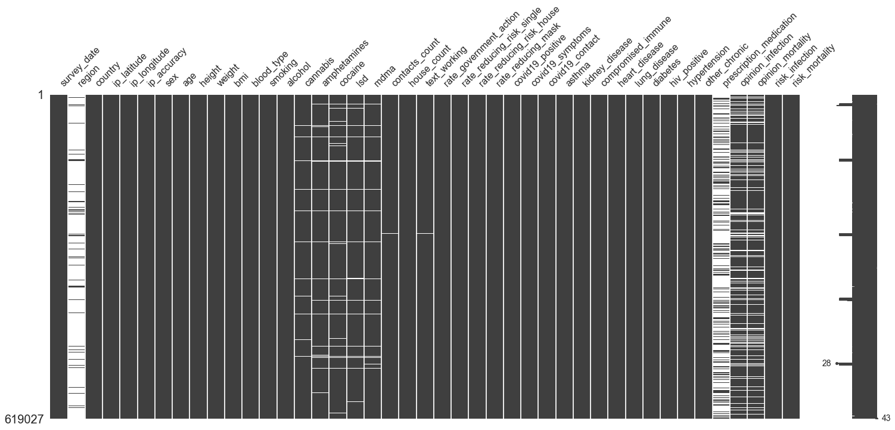


Aditional inspection shows that there are quite a few columns with less than 5% null values.  Since this dataset is so large, it seems reasonable to remove these.  Details follow:


```python
nulls = pd.DataFrame(df.isna().sum()/len(df)*100)
nulls = pd.DataFrame(nulls.reset_index())
nulls.columns=['variable', '%_Null']
nulls.sort_values(by='%_Null', ascending=False, inplace=True)
nulls

```


<div>
<style scoped>
    .dataframe tbody tr th:only-of-type {
        vertical-align: middle;
    }

    .dataframe tbody tr th {
        vertical-align: top;
    }

    .dataframe thead th {
        text-align: right;
    }
</style>
<table border="1" class="dataframe">
  <thead>
    <tr style="text-align: right;">
      <th></th>
      <th>variable</th>
      <th>%_Null</th>
    </tr>
  </thead>
  <tbody>
    <tr>
      <th>1</th>
      <td>region</td>
      <td>93.167342</td>
    </tr>
    <tr>
      <th>38</th>
      <td>prescription_medication</td>
      <td>68.800876</td>
    </tr>
    <tr>
      <th>40</th>
      <td>opinion_mortality</td>
      <td>17.445604</td>
    </tr>
    <tr>
      <th>39</th>
      <td>opinion_infection</td>
      <td>17.445604</td>
    </tr>
    <tr>
      <th>16</th>
      <td>cocaine</td>
      <td>4.705611</td>
    </tr>
    <tr>
      <th>15</th>
      <td>amphetamines</td>
      <td>4.430825</td>
    </tr>
    <tr>
      <th>17</th>
      <td>lsd</td>
      <td>4.089644</td>
    </tr>
    <tr>
      <th>18</th>
      <td>mdma</td>
      <td>3.513255</td>
    </tr>
    <tr>
      <th>14</th>
      <td>cannabis</td>
      <td>2.017198</td>
    </tr>
    <tr>
      <th>21</th>
      <td>text_working</td>
      <td>0.683654</td>
    </tr>
    <tr>
      <th>19</th>
      <td>contacts_count</td>
      <td>0.683654</td>
    </tr>
    <tr>
      <th>25</th>
      <td>rate_reducing_mask</td>
      <td>0.299341</td>
    </tr>
    <tr>
      <th>12</th>
      <td>smoking</td>
      <td>0.299341</td>
    </tr>
    <tr>
      <th>13</th>
      <td>alcohol</td>
      <td>0.299341</td>
    </tr>
    <tr>
      <th>41</th>
      <td>risk_infection</td>
      <td>0.012439</td>
    </tr>
    <tr>
      <th>42</th>
      <td>risk_mortality</td>
      <td>0.012439</td>
    </tr>
    <tr>
      <th>2</th>
      <td>country</td>
      <td>0.002746</td>
    </tr>
    <tr>
      <th>5</th>
      <td>ip_accuracy</td>
      <td>0.000162</td>
    </tr>
    <tr>
      <th>11</th>
      <td>blood_type</td>
      <td>0.000000</td>
    </tr>
    <tr>
      <th>30</th>
      <td>kidney_disease</td>
      <td>0.000000</td>
    </tr>
    <tr>
      <th>3</th>
      <td>ip_latitude</td>
      <td>0.000000</td>
    </tr>
    <tr>
      <th>4</th>
      <td>ip_longitude</td>
      <td>0.000000</td>
    </tr>
    <tr>
      <th>37</th>
      <td>other_chronic</td>
      <td>0.000000</td>
    </tr>
    <tr>
      <th>36</th>
      <td>hypertension</td>
      <td>0.000000</td>
    </tr>
    <tr>
      <th>35</th>
      <td>hiv_positive</td>
      <td>0.000000</td>
    </tr>
    <tr>
      <th>34</th>
      <td>diabetes</td>
      <td>0.000000</td>
    </tr>
    <tr>
      <th>33</th>
      <td>lung_disease</td>
      <td>0.000000</td>
    </tr>
    <tr>
      <th>32</th>
      <td>heart_disease</td>
      <td>0.000000</td>
    </tr>
    <tr>
      <th>31</th>
      <td>compromised_immune</td>
      <td>0.000000</td>
    </tr>
    <tr>
      <th>29</th>
      <td>asthma</td>
      <td>0.000000</td>
    </tr>
    <tr>
      <th>10</th>
      <td>bmi</td>
      <td>0.000000</td>
    </tr>
    <tr>
      <th>28</th>
      <td>covid19_contact</td>
      <td>0.000000</td>
    </tr>
    <tr>
      <th>27</th>
      <td>covid19_symptoms</td>
      <td>0.000000</td>
    </tr>
    <tr>
      <th>26</th>
      <td>covid19_positive</td>
      <td>0.000000</td>
    </tr>
    <tr>
      <th>6</th>
      <td>sex</td>
      <td>0.000000</td>
    </tr>
    <tr>
      <th>24</th>
      <td>rate_reducing_risk_house</td>
      <td>0.000000</td>
    </tr>
    <tr>
      <th>23</th>
      <td>rate_reducing_risk_single</td>
      <td>0.000000</td>
    </tr>
    <tr>
      <th>22</th>
      <td>rate_government_action</td>
      <td>0.000000</td>
    </tr>
    <tr>
      <th>7</th>
      <td>age</td>
      <td>0.000000</td>
    </tr>
    <tr>
      <th>20</th>
      <td>house_count</td>
      <td>0.000000</td>
    </tr>
    <tr>
      <th>8</th>
      <td>height</td>
      <td>0.000000</td>
    </tr>
    <tr>
      <th>9</th>
      <td>weight</td>
      <td>0.000000</td>
    </tr>
    <tr>
      <th>0</th>
      <td>survey_date</td>
      <td>0.000000</td>
    </tr>
  </tbody>
</table>
</div>


```python
cols_to_drop_na = ['country','ip_accuracy','smoking', 'alcohol', 'cannabis', 'amphetamines', 'cocaine', 'lsd', 'mdma', 
                   'contacts_count', 'text_working', 'rate_reducing_mask', 'risk_infection',
                  'risk_mortality']
```


```python
df.dropna(subset=cols_to_drop_na, inplace=True)
```


```python
nulls = pd.DataFrame(df.isna().sum()/len(df)*100)
nulls = pd.DataFrame(nulls.reset_index())
nulls.columns=['variable', '%_Null']
nulls.sort_values(by='%_Null', ascending=False, inplace=True)
nulls
```


<div>
<style scoped>
    .dataframe tbody tr th:only-of-type {
        vertical-align: middle;
    }

    .dataframe tbody tr th {
        vertical-align: top;
    }

    .dataframe thead th {
        text-align: right;
    }
</style>
<table border="1" class="dataframe">
  <thead>
    <tr style="text-align: right;">
      <th></th>
      <th>variable</th>
      <th>%_Null</th>
    </tr>
  </thead>
  <tbody>
    <tr>
      <th>1</th>
      <td>region</td>
      <td>93.322091</td>
    </tr>
    <tr>
      <th>38</th>
      <td>prescription_medication</td>
      <td>68.619982</td>
    </tr>
    <tr>
      <th>40</th>
      <td>opinion_mortality</td>
      <td>16.900436</td>
    </tr>
    <tr>
      <th>39</th>
      <td>opinion_infection</td>
      <td>16.900436</td>
    </tr>
    <tr>
      <th>30</th>
      <td>kidney_disease</td>
      <td>0.000000</td>
    </tr>
    <tr>
      <th>23</th>
      <td>rate_reducing_risk_single</td>
      <td>0.000000</td>
    </tr>
    <tr>
      <th>24</th>
      <td>rate_reducing_risk_house</td>
      <td>0.000000</td>
    </tr>
    <tr>
      <th>25</th>
      <td>rate_reducing_mask</td>
      <td>0.000000</td>
    </tr>
    <tr>
      <th>26</th>
      <td>covid19_positive</td>
      <td>0.000000</td>
    </tr>
    <tr>
      <th>27</th>
      <td>covid19_symptoms</td>
      <td>0.000000</td>
    </tr>
    <tr>
      <th>28</th>
      <td>covid19_contact</td>
      <td>0.000000</td>
    </tr>
    <tr>
      <th>29</th>
      <td>asthma</td>
      <td>0.000000</td>
    </tr>
    <tr>
      <th>0</th>
      <td>survey_date</td>
      <td>0.000000</td>
    </tr>
    <tr>
      <th>31</th>
      <td>compromised_immune</td>
      <td>0.000000</td>
    </tr>
    <tr>
      <th>22</th>
      <td>rate_government_action</td>
      <td>0.000000</td>
    </tr>
    <tr>
      <th>33</th>
      <td>lung_disease</td>
      <td>0.000000</td>
    </tr>
    <tr>
      <th>34</th>
      <td>diabetes</td>
      <td>0.000000</td>
    </tr>
    <tr>
      <th>35</th>
      <td>hiv_positive</td>
      <td>0.000000</td>
    </tr>
    <tr>
      <th>36</th>
      <td>hypertension</td>
      <td>0.000000</td>
    </tr>
    <tr>
      <th>37</th>
      <td>other_chronic</td>
      <td>0.000000</td>
    </tr>
    <tr>
      <th>41</th>
      <td>risk_infection</td>
      <td>0.000000</td>
    </tr>
    <tr>
      <th>32</th>
      <td>heart_disease</td>
      <td>0.000000</td>
    </tr>
    <tr>
      <th>21</th>
      <td>text_working</td>
      <td>0.000000</td>
    </tr>
    <tr>
      <th>20</th>
      <td>house_count</td>
      <td>0.000000</td>
    </tr>
    <tr>
      <th>19</th>
      <td>contacts_count</td>
      <td>0.000000</td>
    </tr>
    <tr>
      <th>2</th>
      <td>country</td>
      <td>0.000000</td>
    </tr>
    <tr>
      <th>3</th>
      <td>ip_latitude</td>
      <td>0.000000</td>
    </tr>
    <tr>
      <th>4</th>
      <td>ip_longitude</td>
      <td>0.000000</td>
    </tr>
    <tr>
      <th>5</th>
      <td>ip_accuracy</td>
      <td>0.000000</td>
    </tr>
    <tr>
      <th>6</th>
      <td>sex</td>
      <td>0.000000</td>
    </tr>
    <tr>
      <th>7</th>
      <td>age</td>
      <td>0.000000</td>
    </tr>
    <tr>
      <th>8</th>
      <td>height</td>
      <td>0.000000</td>
    </tr>
    <tr>
      <th>9</th>
      <td>weight</td>
      <td>0.000000</td>
    </tr>
    <tr>
      <th>10</th>
      <td>bmi</td>
      <td>0.000000</td>
    </tr>
    <tr>
      <th>11</th>
      <td>blood_type</td>
      <td>0.000000</td>
    </tr>
    <tr>
      <th>12</th>
      <td>smoking</td>
      <td>0.000000</td>
    </tr>
    <tr>
      <th>13</th>
      <td>alcohol</td>
      <td>0.000000</td>
    </tr>
    <tr>
      <th>14</th>
      <td>cannabis</td>
      <td>0.000000</td>
    </tr>
    <tr>
      <th>15</th>
      <td>amphetamines</td>
      <td>0.000000</td>
    </tr>
    <tr>
      <th>16</th>
      <td>cocaine</td>
      <td>0.000000</td>
    </tr>
    <tr>
      <th>17</th>
      <td>lsd</td>
      <td>0.000000</td>
    </tr>
    <tr>
      <th>18</th>
      <td>mdma</td>
      <td>0.000000</td>
    </tr>
    <tr>
      <th>42</th>
      <td>risk_mortality</td>
      <td>0.000000</td>
    </tr>
  </tbody>
</table>
</div>


#### Imputing 'opinions'


```python
df.loc[df['opinion_mortality'].isna()]['covid19_positive'].value_counts(normalize=True)
```


    0    0.998385
    1    0.001615
    Name: covid19_positive, dtype: float64


```python
df.loc[df['opinion_infection'].isna()]['covid19_positive'].value_counts(normalize=True)
```


    0    0.998385
    1    0.001615
    Name: covid19_positive, dtype: float64


```python
df['covid19_positive'].value_counts(normalize=True)
```


    0    0.998625
    1    0.001375
    Name: covid19_positive, dtype: float64


> **NOTE**:Since these two columns scale to reflect opinion tend to not have a higher incidence in those that tested positive for covid, initially a feature to indicate null values will be created and a mean value of 15 will be imputed for opinion mortality and 35 for opinion infection.  Should the model indicate relevance, or demonstrate necessity for improvment, this feature can be adjusted.


```python
df['opinion_mortality'].value_counts(normalize=True)
```


    5.0     0.460670
    15.0    0.178922
    25.0    0.106206
    45.0    0.065505
    55.0    0.059436
    35.0    0.057783
    65.0    0.023647
    75.0    0.023350
    85.0    0.014222
    95.0    0.010262
    Name: opinion_mortality, dtype: float64


```python
#use median /mean to fill
df['opinion_mortality'].median()
```


    15.0


```python
df['omwasnull'] = df['opinion_mortality'].isna()
```


```python
df['opinion_mortality'].fillna(15.0, inplace=True)
```


```python
df['omwasnull'].head(3)
```


    0    False
    1    False
    2     True
    Name: omwasnull, dtype: bool


```python
df['oiwasnull'] = df['opinion_infection'].isna()
```


```python
df['opinion_infection'].median()
```


    35.0


```python
df['opinion_infection'].fillna(35, inplace=True)
```

#### Date: Dropping feature

While the date the data was collected could have a bearing on whether or not someone tested postivie, it would not provide insight to biological, behavioral or geographical indicators


```python
df['survey_date'].unique()
```


    array(['4/4/2020', '4/5/2020', '4/3/2020', '4/6/2020', '3/27/2020',
           '3/28/2020', '3/26/2020', '3/29/2020', '3/30/2020', '3/31/2020',
           '4/1/2020', '4/2/2020', '4/7/2020', '4/8/2020', '4/9/2020',
           '4/10/2020'], dtype=object)


```python
df.drop('survey_date', axis=1, inplace=True)
```

#### Dropping Region as a feature due to lack of complete data, as well as  lat/long and will use country for geographic information


```python
df['region'].value_counts()
```


    EU    22523
    OC     6965
    SA     4103
    AS     4073
    AF      748
    Name: region, dtype: int64


```python
df['region'].isnull().sum()/len(df)
```


    0.9332209106239461


```python
cols_to_drop = ['region','ip_latitude', 'ip_longitude']

```


```python
df.drop(cols_to_drop, axis=1, inplace=True)
```

> A quick look to make sure the nulls are gone:


```python
nulls = pd.DataFrame(df.isna().sum()/len(df)*100)
nulls = pd.DataFrame(nulls.reset_index())
nulls.columns=['variable', '%_Null']
nulls.sort_values(by='%_Null', ascending=False, inplace=True)
nulls
```


<div>
<style scoped>
    .dataframe tbody tr th:only-of-type {
        vertical-align: middle;
    }

    .dataframe tbody tr th {
        vertical-align: top;
    }

    .dataframe thead th {
        text-align: right;
    }
</style>
<table border="1" class="dataframe">
  <thead>
    <tr style="text-align: right;">
      <th></th>
      <th>variable</th>
      <th>%_Null</th>
    </tr>
  </thead>
  <tbody>
    <tr>
      <th>34</th>
      <td>prescription_medication</td>
      <td>68.619982</td>
    </tr>
    <tr>
      <th>0</th>
      <td>country</td>
      <td>0.000000</td>
    </tr>
    <tr>
      <th>30</th>
      <td>diabetes</td>
      <td>0.000000</td>
    </tr>
    <tr>
      <th>23</th>
      <td>covid19_symptoms</td>
      <td>0.000000</td>
    </tr>
    <tr>
      <th>24</th>
      <td>covid19_contact</td>
      <td>0.000000</td>
    </tr>
    <tr>
      <th>25</th>
      <td>asthma</td>
      <td>0.000000</td>
    </tr>
    <tr>
      <th>26</th>
      <td>kidney_disease</td>
      <td>0.000000</td>
    </tr>
    <tr>
      <th>27</th>
      <td>compromised_immune</td>
      <td>0.000000</td>
    </tr>
    <tr>
      <th>28</th>
      <td>heart_disease</td>
      <td>0.000000</td>
    </tr>
    <tr>
      <th>29</th>
      <td>lung_disease</td>
      <td>0.000000</td>
    </tr>
    <tr>
      <th>31</th>
      <td>hiv_positive</td>
      <td>0.000000</td>
    </tr>
    <tr>
      <th>21</th>
      <td>rate_reducing_mask</td>
      <td>0.000000</td>
    </tr>
    <tr>
      <th>32</th>
      <td>hypertension</td>
      <td>0.000000</td>
    </tr>
    <tr>
      <th>33</th>
      <td>other_chronic</td>
      <td>0.000000</td>
    </tr>
    <tr>
      <th>35</th>
      <td>opinion_infection</td>
      <td>0.000000</td>
    </tr>
    <tr>
      <th>36</th>
      <td>opinion_mortality</td>
      <td>0.000000</td>
    </tr>
    <tr>
      <th>37</th>
      <td>risk_infection</td>
      <td>0.000000</td>
    </tr>
    <tr>
      <th>38</th>
      <td>risk_mortality</td>
      <td>0.000000</td>
    </tr>
    <tr>
      <th>39</th>
      <td>omwasnull</td>
      <td>0.000000</td>
    </tr>
    <tr>
      <th>22</th>
      <td>covid19_positive</td>
      <td>0.000000</td>
    </tr>
    <tr>
      <th>20</th>
      <td>rate_reducing_risk_house</td>
      <td>0.000000</td>
    </tr>
    <tr>
      <th>1</th>
      <td>ip_accuracy</td>
      <td>0.000000</td>
    </tr>
    <tr>
      <th>19</th>
      <td>rate_reducing_risk_single</td>
      <td>0.000000</td>
    </tr>
    <tr>
      <th>2</th>
      <td>sex</td>
      <td>0.000000</td>
    </tr>
    <tr>
      <th>3</th>
      <td>age</td>
      <td>0.000000</td>
    </tr>
    <tr>
      <th>4</th>
      <td>height</td>
      <td>0.000000</td>
    </tr>
    <tr>
      <th>5</th>
      <td>weight</td>
      <td>0.000000</td>
    </tr>
    <tr>
      <th>6</th>
      <td>bmi</td>
      <td>0.000000</td>
    </tr>
    <tr>
      <th>7</th>
      <td>blood_type</td>
      <td>0.000000</td>
    </tr>
    <tr>
      <th>8</th>
      <td>smoking</td>
      <td>0.000000</td>
    </tr>
    <tr>
      <th>9</th>
      <td>alcohol</td>
      <td>0.000000</td>
    </tr>
    <tr>
      <th>10</th>
      <td>cannabis</td>
      <td>0.000000</td>
    </tr>
    <tr>
      <th>11</th>
      <td>amphetamines</td>
      <td>0.000000</td>
    </tr>
    <tr>
      <th>12</th>
      <td>cocaine</td>
      <td>0.000000</td>
    </tr>
    <tr>
      <th>13</th>
      <td>lsd</td>
      <td>0.000000</td>
    </tr>
    <tr>
      <th>14</th>
      <td>mdma</td>
      <td>0.000000</td>
    </tr>
    <tr>
      <th>15</th>
      <td>contacts_count</td>
      <td>0.000000</td>
    </tr>
    <tr>
      <th>16</th>
      <td>house_count</td>
      <td>0.000000</td>
    </tr>
    <tr>
      <th>17</th>
      <td>text_working</td>
      <td>0.000000</td>
    </tr>
    <tr>
      <th>18</th>
      <td>rate_government_action</td>
      <td>0.000000</td>
    </tr>
    <tr>
      <th>40</th>
      <td>oiwasnull</td>
      <td>0.000000</td>
    </tr>
  </tbody>
</table>
</div>


### Prescription Medication contains: 57,106 distinct values
*from profile report

There are a total of 1297 distinct prescription medications in various combinations.  Future work could be done to see if there is a correlation or importance i


```python
df['prescription_medication'].value_counts()
```


    LEVOTHYROXINE SODIUM                                                                                                                                9480
    SERTRALINE HYDROCHLORIDE                                                                                                                            5979
    ESCITALOPRAM OXALATE                                                                                                                                3848
    LISINOPRIL                                                                                                                                          3777
    AMPHETAMINE ASPARTATE;AMPHETAMINE SULFATE;DEXTROAMPHETAMINE SACCHARATE;DEXTROAMPHETAMINE SULFATE                                                    2907
                                                                                                                                                        ... 
    ASPIRIN;FLUTICASONE PROPIONATE;LORATADINE                                                                                                              1
    ELUXADOLINE;METFORMIN HYDROCHLORIDE;MONTELUKAST SODIUM;PANTOPRAZOLE SODIUM;TOPIRAMATE                                                                  1
    BUSPIRONE HYDROCHLORIDE;CLONAZEPAM;DIVALPROEX SODIUM;METFORMIN HYDROCHLORIDE                                                                           1
    ATORVASTATIN CALCIUM;CETIRIZINE HYDROCHLORIDE;CLORAZEPATE DIPOTASSIUM;DULAGLUTIDE;METFORMIN HYDROCHLORIDE;METOPROLOL FUMARATE;MONTELUKAST SODIUM       1
    ETHINYL ESTRADIOL;NORETHINDRONE ACETATE;FLUOXETINE HYDROCHLORIDE;METHYLPHENIDATE HYDROCHLORIDE                                                         1
    Name: prescription_medication, Length: 54000, dtype: int64


```python
##creating a column to track lack of prescription medication:
df['taking_prescription_medication'] = df['prescription_medication'].notnull()

```


```python
#filling in null values with a value of "NONE" to indicate they are taking no meds
df['prescription_medication'].fillna('NO', inplace=True)
```


```python
split_data = df["prescription_medication"].str.split(";")
meds = split_data.to_list()

meds_df = pd.DataFrame(meds)
meds_df.head()
```


<div>
<style scoped>
    .dataframe tbody tr th:only-of-type {
        vertical-align: middle;
    }

    .dataframe tbody tr th {
        vertical-align: top;
    }

    .dataframe thead th {
        text-align: right;
    }
</style>
<table border="1" class="dataframe">
  <thead>
    <tr style="text-align: right;">
      <th></th>
      <th>0</th>
      <th>1</th>
      <th>2</th>
      <th>3</th>
      <th>4</th>
      <th>5</th>
      <th>6</th>
      <th>7</th>
      <th>8</th>
      <th>9</th>
      <th>10</th>
      <th>11</th>
      <th>12</th>
      <th>13</th>
      <th>14</th>
      <th>15</th>
      <th>16</th>
      <th>17</th>
      <th>18</th>
      <th>19</th>
      <th>20</th>
      <th>21</th>
      <th>22</th>
      <th>23</th>
      <th>24</th>
      <th>25</th>
      <th>26</th>
      <th>27</th>
      <th>28</th>
      <th>29</th>
    </tr>
  </thead>
  <tbody>
    <tr>
      <th>0</th>
      <td>NO</td>
      <td>None</td>
      <td>None</td>
      <td>None</td>
      <td>None</td>
      <td>None</td>
      <td>None</td>
      <td>None</td>
      <td>None</td>
      <td>None</td>
      <td>None</td>
      <td>None</td>
      <td>None</td>
      <td>None</td>
      <td>None</td>
      <td>None</td>
      <td>None</td>
      <td>None</td>
      <td>None</td>
      <td>None</td>
      <td>None</td>
      <td>None</td>
      <td>None</td>
      <td>None</td>
      <td>None</td>
      <td>None</td>
      <td>None</td>
      <td>None</td>
      <td>None</td>
      <td>None</td>
    </tr>
    <tr>
      <th>1</th>
      <td>NO</td>
      <td>None</td>
      <td>None</td>
      <td>None</td>
      <td>None</td>
      <td>None</td>
      <td>None</td>
      <td>None</td>
      <td>None</td>
      <td>None</td>
      <td>None</td>
      <td>None</td>
      <td>None</td>
      <td>None</td>
      <td>None</td>
      <td>None</td>
      <td>None</td>
      <td>None</td>
      <td>None</td>
      <td>None</td>
      <td>None</td>
      <td>None</td>
      <td>None</td>
      <td>None</td>
      <td>None</td>
      <td>None</td>
      <td>None</td>
      <td>None</td>
      <td>None</td>
      <td>None</td>
    </tr>
    <tr>
      <th>2</th>
      <td>NO</td>
      <td>None</td>
      <td>None</td>
      <td>None</td>
      <td>None</td>
      <td>None</td>
      <td>None</td>
      <td>None</td>
      <td>None</td>
      <td>None</td>
      <td>None</td>
      <td>None</td>
      <td>None</td>
      <td>None</td>
      <td>None</td>
      <td>None</td>
      <td>None</td>
      <td>None</td>
      <td>None</td>
      <td>None</td>
      <td>None</td>
      <td>None</td>
      <td>None</td>
      <td>None</td>
      <td>None</td>
      <td>None</td>
      <td>None</td>
      <td>None</td>
      <td>None</td>
      <td>None</td>
    </tr>
    <tr>
      <th>3</th>
      <td>ACETAZOLAMIDE</td>
      <td>GABAPENTIN</td>
      <td>OMEPRAZOLE</td>
      <td>VENLAFAXINE HYDROCHLORIDE</td>
      <td>None</td>
      <td>None</td>
      <td>None</td>
      <td>None</td>
      <td>None</td>
      <td>None</td>
      <td>None</td>
      <td>None</td>
      <td>None</td>
      <td>None</td>
      <td>None</td>
      <td>None</td>
      <td>None</td>
      <td>None</td>
      <td>None</td>
      <td>None</td>
      <td>None</td>
      <td>None</td>
      <td>None</td>
      <td>None</td>
      <td>None</td>
      <td>None</td>
      <td>None</td>
      <td>None</td>
      <td>None</td>
      <td>None</td>
    </tr>
    <tr>
      <th>4</th>
      <td>METFORMIN HYDROCHLORIDE</td>
      <td>None</td>
      <td>None</td>
      <td>None</td>
      <td>None</td>
      <td>None</td>
      <td>None</td>
      <td>None</td>
      <td>None</td>
      <td>None</td>
      <td>None</td>
      <td>None</td>
      <td>None</td>
      <td>None</td>
      <td>None</td>
      <td>None</td>
      <td>None</td>
      <td>None</td>
      <td>None</td>
      <td>None</td>
      <td>None</td>
      <td>None</td>
      <td>None</td>
      <td>None</td>
      <td>None</td>
      <td>None</td>
      <td>None</td>
      <td>None</td>
      <td>None</td>
      <td>None</td>
    </tr>
  </tbody>
</table>
</div>


```python
meds = meds_df.drop_duplicates()
```


```python
meds1 = pd.DataFrame(df['prescription_medication'].unique())
meds1.columns = ['Prescriptions']
meds2 = meds1['Prescriptions'].str.split(';', expand=True)
```

Code for counting how many scrips people are on:


```python
meds5 = meds1['Prescriptions'].apply(lambda x: len(x.split(';')))
meds5
```


    0         1
    1         4
    2         1
    3         4
    4         4
             ..
    53996     6
    53997     4
    53998    12
    53999     8
    54000     5
    Name: Prescriptions, Length: 54001, dtype: int64


```python
meds2
```


<div>
<style scoped>
    .dataframe tbody tr th:only-of-type {
        vertical-align: middle;
    }

    .dataframe tbody tr th {
        vertical-align: top;
    }

    .dataframe thead th {
        text-align: right;
    }
</style>
<table border="1" class="dataframe">
  <thead>
    <tr style="text-align: right;">
      <th></th>
      <th>0</th>
      <th>1</th>
      <th>2</th>
      <th>3</th>
      <th>4</th>
      <th>5</th>
      <th>6</th>
      <th>7</th>
      <th>8</th>
      <th>9</th>
      <th>10</th>
      <th>11</th>
      <th>12</th>
      <th>13</th>
      <th>14</th>
      <th>15</th>
      <th>16</th>
      <th>17</th>
      <th>18</th>
      <th>19</th>
      <th>20</th>
      <th>21</th>
      <th>22</th>
      <th>23</th>
      <th>24</th>
      <th>25</th>
      <th>26</th>
      <th>27</th>
      <th>28</th>
      <th>29</th>
    </tr>
  </thead>
  <tbody>
    <tr>
      <th>0</th>
      <td>NO</td>
      <td>None</td>
      <td>None</td>
      <td>None</td>
      <td>None</td>
      <td>None</td>
      <td>None</td>
      <td>None</td>
      <td>None</td>
      <td>None</td>
      <td>None</td>
      <td>None</td>
      <td>None</td>
      <td>None</td>
      <td>None</td>
      <td>None</td>
      <td>None</td>
      <td>None</td>
      <td>None</td>
      <td>None</td>
      <td>None</td>
      <td>None</td>
      <td>None</td>
      <td>None</td>
      <td>None</td>
      <td>None</td>
      <td>None</td>
      <td>None</td>
      <td>None</td>
      <td>None</td>
    </tr>
    <tr>
      <th>1</th>
      <td>ACETAZOLAMIDE</td>
      <td>GABAPENTIN</td>
      <td>OMEPRAZOLE</td>
      <td>VENLAFAXINE HYDROCHLORIDE</td>
      <td>None</td>
      <td>None</td>
      <td>None</td>
      <td>None</td>
      <td>None</td>
      <td>None</td>
      <td>None</td>
      <td>None</td>
      <td>None</td>
      <td>None</td>
      <td>None</td>
      <td>None</td>
      <td>None</td>
      <td>None</td>
      <td>None</td>
      <td>None</td>
      <td>None</td>
      <td>None</td>
      <td>None</td>
      <td>None</td>
      <td>None</td>
      <td>None</td>
      <td>None</td>
      <td>None</td>
      <td>None</td>
      <td>None</td>
    </tr>
    <tr>
      <th>2</th>
      <td>METFORMIN HYDROCHLORIDE</td>
      <td>None</td>
      <td>None</td>
      <td>None</td>
      <td>None</td>
      <td>None</td>
      <td>None</td>
      <td>None</td>
      <td>None</td>
      <td>None</td>
      <td>None</td>
      <td>None</td>
      <td>None</td>
      <td>None</td>
      <td>None</td>
      <td>None</td>
      <td>None</td>
      <td>None</td>
      <td>None</td>
      <td>None</td>
      <td>None</td>
      <td>None</td>
      <td>None</td>
      <td>None</td>
      <td>None</td>
      <td>None</td>
      <td>None</td>
      <td>None</td>
      <td>None</td>
      <td>None</td>
    </tr>
    <tr>
      <th>3</th>
      <td>HYDROCHLOROTHIAZIDE</td>
      <td>LOSARTAN POTASSIUM</td>
      <td>METHYLPHENIDATE</td>
      <td>OMEPRAZOLE</td>
      <td>None</td>
      <td>None</td>
      <td>None</td>
      <td>None</td>
      <td>None</td>
      <td>None</td>
      <td>None</td>
      <td>None</td>
      <td>None</td>
      <td>None</td>
      <td>None</td>
      <td>None</td>
      <td>None</td>
      <td>None</td>
      <td>None</td>
      <td>None</td>
      <td>None</td>
      <td>None</td>
      <td>None</td>
      <td>None</td>
      <td>None</td>
      <td>None</td>
      <td>None</td>
      <td>None</td>
      <td>None</td>
      <td>None</td>
    </tr>
    <tr>
      <th>4</th>
      <td>CLONAZEPAM</td>
      <td>ETHINYL ESTRADIOL</td>
      <td>NORGESTIMATE</td>
      <td>METFORMIN HYDROCHLORIDE</td>
      <td>None</td>
      <td>None</td>
      <td>None</td>
      <td>None</td>
      <td>None</td>
      <td>None</td>
      <td>None</td>
      <td>None</td>
      <td>None</td>
      <td>None</td>
      <td>None</td>
      <td>None</td>
      <td>None</td>
      <td>None</td>
      <td>None</td>
      <td>None</td>
      <td>None</td>
      <td>None</td>
      <td>None</td>
      <td>None</td>
      <td>None</td>
      <td>None</td>
      <td>None</td>
      <td>None</td>
      <td>None</td>
      <td>None</td>
    </tr>
    <tr>
      <th>...</th>
      <td>...</td>
      <td>...</td>
      <td>...</td>
      <td>...</td>
      <td>...</td>
      <td>...</td>
      <td>...</td>
      <td>...</td>
      <td>...</td>
      <td>...</td>
      <td>...</td>
      <td>...</td>
      <td>...</td>
      <td>...</td>
      <td>...</td>
      <td>...</td>
      <td>...</td>
      <td>...</td>
      <td>...</td>
      <td>...</td>
      <td>...</td>
      <td>...</td>
      <td>...</td>
      <td>...</td>
      <td>...</td>
      <td>...</td>
      <td>...</td>
      <td>...</td>
      <td>...</td>
      <td>...</td>
    </tr>
    <tr>
      <th>53996</th>
      <td>ALPRAZOLAM</td>
      <td>AMITRIPTYLINE HYDROCHLORIDE</td>
      <td>DULAGLUTIDE</td>
      <td>GLIMEPIRIDE</td>
      <td>LISINOPRIL</td>
      <td>PRAVASTATIN SODIUM</td>
      <td>None</td>
      <td>None</td>
      <td>None</td>
      <td>None</td>
      <td>None</td>
      <td>None</td>
      <td>None</td>
      <td>None</td>
      <td>None</td>
      <td>None</td>
      <td>None</td>
      <td>None</td>
      <td>None</td>
      <td>None</td>
      <td>None</td>
      <td>None</td>
      <td>None</td>
      <td>None</td>
      <td>None</td>
      <td>None</td>
      <td>None</td>
      <td>None</td>
      <td>None</td>
      <td>None</td>
    </tr>
    <tr>
      <th>53997</th>
      <td>BUPROPION HYDROCHLORIDE</td>
      <td>FEXOFENADINE HYDROCHLORIDE</td>
      <td>GABAPENTIN</td>
      <td>MELOXICAM</td>
      <td>None</td>
      <td>None</td>
      <td>None</td>
      <td>None</td>
      <td>None</td>
      <td>None</td>
      <td>None</td>
      <td>None</td>
      <td>None</td>
      <td>None</td>
      <td>None</td>
      <td>None</td>
      <td>None</td>
      <td>None</td>
      <td>None</td>
      <td>None</td>
      <td>None</td>
      <td>None</td>
      <td>None</td>
      <td>None</td>
      <td>None</td>
      <td>None</td>
      <td>None</td>
      <td>None</td>
      <td>None</td>
      <td>None</td>
    </tr>
    <tr>
      <th>53998</th>
      <td>CONJUGATED ESTROGENS/MEDROXYPROGESTERONE ACETATE</td>
      <td>CYCLOBENZAPRINE HYDROCHLORIDE</td>
      <td>EMPAGLIFLOZIN</td>
      <td>ESCITALOPRAM OXALATE</td>
      <td>IBUPROFEN</td>
      <td>LEVOTHYROXINE SODIUM</td>
      <td>LISINOPRIL</td>
      <td>LORATADINE</td>
      <td>METFORMIN HYDROCHLORIDE</td>
      <td>SITAGLIPTIN PHOSPHATE</td>
      <td>OMEPRAZOLE</td>
      <td>ZOLPIDEM TARTRATE</td>
      <td>None</td>
      <td>None</td>
      <td>None</td>
      <td>None</td>
      <td>None</td>
      <td>None</td>
      <td>None</td>
      <td>None</td>
      <td>None</td>
      <td>None</td>
      <td>None</td>
      <td>None</td>
      <td>None</td>
      <td>None</td>
      <td>None</td>
      <td>None</td>
      <td>None</td>
      <td>None</td>
    </tr>
    <tr>
      <th>53999</th>
      <td>AMPHETAMINE ASPARTATE</td>
      <td>AMPHETAMINE SULFATE</td>
      <td>DEXTROAMPHETAMINE SACCHARATE</td>
      <td>DEXTROAMPHETAMINE SULFATE</td>
      <td>ETHINYL ESTRADIOL</td>
      <td>NORETHINDRONE</td>
      <td>FEXOFENADINE HYDROCHLORIDE</td>
      <td>MONTELUKAST SODIUM</td>
      <td>None</td>
      <td>None</td>
      <td>None</td>
      <td>None</td>
      <td>None</td>
      <td>None</td>
      <td>None</td>
      <td>None</td>
      <td>None</td>
      <td>None</td>
      <td>None</td>
      <td>None</td>
      <td>None</td>
      <td>None</td>
      <td>None</td>
      <td>None</td>
      <td>None</td>
      <td>None</td>
      <td>None</td>
      <td>None</td>
      <td>None</td>
      <td>None</td>
    </tr>
    <tr>
      <th>54000</th>
      <td>ALPRAZOLAM</td>
      <td>HYDROXYZINE HYDROCHLORIDE</td>
      <td>MONTELUKAST SODIUM</td>
      <td>ROSUVASTATIN CALCIUM</td>
      <td>SERTRALINE HYDROCHLORIDE</td>
      <td>None</td>
      <td>None</td>
      <td>None</td>
      <td>None</td>
      <td>None</td>
      <td>None</td>
      <td>None</td>
      <td>None</td>
      <td>None</td>
      <td>None</td>
      <td>None</td>
      <td>None</td>
      <td>None</td>
      <td>None</td>
      <td>None</td>
      <td>None</td>
      <td>None</td>
      <td>None</td>
      <td>None</td>
      <td>None</td>
      <td>None</td>
      <td>None</td>
      <td>None</td>
      <td>None</td>
      <td>None</td>
    </tr>
  </tbody>
</table>
<p>54001 rows × 30 columns</p>
</div>


```python
scrips = []
for col in meds2.columns:
    x = list(set(meds2[col]))
    scrips.extend(x)
    
```


```python
len(scrips)
```


    7304


```python
cleanscrips = set(scrips)
len(cleanscrips)
```


    1297


```python
df.info()
```

    <class 'pandas.core.frame.DataFrame'>
    Int64Index: 575210 entries, 0 to 619026
    Data columns (total 42 columns):
    country                           575210 non-null object
    ip_accuracy                       575210 non-null float64
    sex                               575210 non-null object
    age                               575210 non-null object
    height                            575210 non-null int64
    weight                            575210 non-null int64
    bmi                               575210 non-null float64
    blood_type                        575210 non-null object
    smoking                           575210 non-null object
    alcohol                           575210 non-null float64
    cannabis                          575210 non-null float64
    amphetamines                      575210 non-null float64
    cocaine                           575210 non-null float64
    lsd                               575210 non-null float64
    mdma                              575210 non-null float64
    contacts_count                    575210 non-null float64
    house_count                       575210 non-null int64
    text_working                      575210 non-null object
    rate_government_action            575210 non-null int64
    rate_reducing_risk_single         575210 non-null int64
    rate_reducing_risk_house          575210 non-null int64
    rate_reducing_mask                575210 non-null float64
    covid19_positive                  575210 non-null int64
    covid19_symptoms                  575210 non-null int64
    covid19_contact                   575210 non-null int64
    asthma                            575210 non-null int64
    kidney_disease                    575210 non-null int64
    compromised_immune                575210 non-null int64
    heart_disease                     575210 non-null int64
    lung_disease                      575210 non-null int64
    diabetes                          575210 non-null int64
    hiv_positive                      575210 non-null int64
    hypertension                      575210 non-null int64
    other_chronic                     575210 non-null int64
    prescription_medication           575210 non-null object
    opinion_infection                 575210 non-null float64
    opinion_mortality                 575210 non-null float64
    risk_infection                    575210 non-null float64
    risk_mortality                    575210 non-null float64
    omwasnull                         575210 non-null bool
    oiwasnull                         575210 non-null bool
    taking_prescription_medication    575210 non-null bool
    dtypes: bool(3), float64(14), int64(18), object(7)
    memory usage: 177.2+ MB
    

### Biological Features: 
* Height, weight, BMI and sex


```python
fn.des(df['sex'])
```


    '------------- Value Counts: -----------'


    female    402914
    male      170211
    other       2085
    Name: sex, dtype: int64


    '-------------- Description: ---------'


    count     575210
    unique         3
    top       female
    freq      402914
    Name: sex, dtype: object


#### Observations on height: potential outliers to remove: <140cm and >200cm


```python
fn.des(df['height'])
```


    '------------- Value Counts: -----------'


    164    56519
    166    47982
    168    47254
    172    43838
    162    40631
           ...  
    222        6
    220        6
    224        5
    218        5
    236        2
    Name: height, Length: 65, dtype: int64


    '-------------- Description: ---------'


    count    575210.000000
    mean        169.063834
    std          11.101964
    min         110.000000
    25%         162.000000
    50%         168.000000
    75%         176.000000
    max         238.000000
    Name: height, dtype: float64


#### Observations on weight:  outliers over ~150kilos


```python
fn.bxplt(df['weight'])
```


    (82     24188
     70     21755
     74     21647
     80     20775
     78     20614
            ...  
     170      386
     174      296
     176      278
     172      277
     178      183
     Name: weight, Length: 69, dtype: int64, count    575210.000000
     mean         86.105141
     std          24.486852
     min          44.000000
     25%          68.000000
     50%          82.000000
     75%         100.000000
     max         180.000000
     Name: weight, dtype: float64, <matplotlib.axes._subplots.AxesSubplot at 0x1e5bbd476a0>)


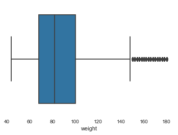


#### Age needs was encoded

Age values were encoded based on the median of each age group.


```python
df['age'].value_counts()
```


    30_40      186191
    20_30      148259
    40_50      116578
    50_60       59158
    60_70       31074
    10_20       18643
    70_80        8896
    0_10         4407
    80_90        1634
    90_100        353
    100_110        17
    Name: age, dtype: int64


```python
age_map = {'0_10' : 5,
          '10_20': 15,
          '20_30' : 25,
          '30_40': 35,
          '40_50': 45,
          '50_60': 55,
          '60_70': 65,
          '70_80': 75,
          '80_90': 85,
          '90_100': 95,
          '100_110': 105}

df['age'] = df['age'].map(age_map)
df['age'].describe()
```


    count    575210.000000
    mean         38.048295
    std          13.437588
    min           5.000000
    25%          25.000000
    50%          35.000000
    75%          45.000000
    max         105.000000
    Name: age, dtype: float64


```python
import seaborn as sns
sns.boxplot(df['age']);
plt.show()
```


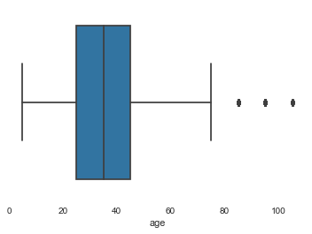


#### BMI 


```python
fn.bxplt(df['bmi'])
```


    (29.0     12353
     29.7     11679
     30.4     11313
     27.7      9320
     28.3      9226
              ...  
     82.8         1
     71.7         1
     104.1        1
     78.4         1
     109.2        1
     Name: bmi, Length: 699, dtype: int64, count    575210.000000
     mean         30.037971
     std           8.044168
     min          10.000000
     25%          24.200000
     50%          28.300000
     75%          34.300000
     max         143.800000
     Name: bmi, dtype: float64, <matplotlib.axes._subplots.AxesSubplot at 0x1e5ca1c7f60>)


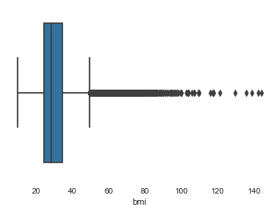


```python

```

####  Blood Type, smoking need to be encoded


```python
df['blood_type'].value_counts()
```


    unknown    194513
    op         123124
    ap         107469
    on          50693
    bp          35975
    an          28422
    abp         19503
    bn           9277
    abn          6234
    Name: blood_type, dtype: int64


```python
df['smoking'].value_counts()
```


    never        326888
    quit10        55446
    yesmedium     50580
    vape          37695
    quit5         34618
    quit0         33149
    yeslight      26606
    yesheavy      10228
    Name: smoking, dtype: int64


### Alcohol & Drugs: Numeric, some/moderate outliers


```python
fn.bxplt(df['alcohol'])
```


    ( 0.0     132092
     -1.0     112941
      1.0      77305
      2.0      55558
      3.0      34201
      4.0      28532
      14.0     26607
      5.0      23456
      7.0      19483
      10.0     17803
      6.0      12762
      12.0      8824
      8.0       7871
      9.0       6465
      13.0      6376
      11.0      4934
     Name: alcohol, dtype: int64, count    575210.000000
     mean          2.672372
     std           4.177297
     min          -1.000000
     25%           0.000000
     50%           1.000000
     75%           4.000000
     max          14.000000
     Name: alcohol, dtype: float64, <matplotlib.axes._subplots.AxesSubplot at 0x1e5cb5c8ef0>)


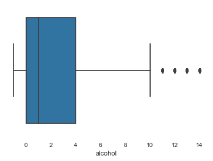


```python
fn.bxplt(df['cannabis'])
```


    (-1.0     300620
      0.0     168057
      28.0     39882
      1.0      16076
      2.0       7928
      3.0       5302
      4.0       4319
      20.0      3736
      5.0       3660
      10.0      3340
      7.0       2785
      14.0      2453
      27.0      2244
      6.0       1732
      25.0      1705
      15.0      1542
      8.0       1346
      24.0      1232
      26.0      1174
      12.0       787
      22.0       700
      23.0       694
      21.0       671
      18.0       635
      9.0        541
      11.0       454
      16.0       407
      17.0       365
      19.0       304
      13.0       267
     -2.0        252
     Name: cannabis, dtype: int64, count    575210.000000
     mean          2.375988
     std           8.075127
     min          -2.000000
     25%          -1.000000
     50%          -1.000000
     75%           0.000000
     max          28.000000
     Name: cannabis, dtype: float64, <matplotlib.axes._subplots.AxesSubplot at 0x1e5cba2fc50>)


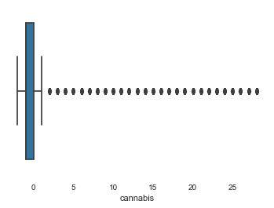


```python
df['amphetamines'].value_counts()
```


    -1.0     507348
     0.0      59216
     1.0       1832
     28.0      1640
     2.0       1023
     3.0        629
     4.0        496
     5.0        439
     10.0       300
     7.0        294
    -2.0        231
     20.0       215
     6.0        211
     14.0       196
     15.0       147
     27.0       136
     8.0        125
     25.0        92
     24.0        91
     9.0         77
     12.0        65
     26.0        64
     22.0        61
     23.0        59
     11.0        43
     21.0        38
     18.0        38
     19.0        34
     16.0        29
     17.0        23
     13.0        18
    Name: amphetamines, dtype: int64


```python
df['cocaine'].value_counts()
```


    -1.0     491189
     0.0      76735
     1.0       2961
     2.0       1217
     3.0        684
     4.0        530
     5.0        340
     7.0        208
     6.0        188
     10.0       167
     28.0       157
     8.0        138
    -2.0        134
     14.0        93
     20.0        75
     12.0        56
     9.0         47
     15.0        46
     27.0        36
     25.0        32
     17.0        21
     16.0        21
     11.0        19
     19.0        18
     24.0        18
     18.0        17
     23.0        15
     21.0        13
     22.0        13
     26.0        12
     13.0        10
    Name: cocaine, dtype: int64


```python
df['lsd'].value_counts()
```


    -1.0     502197
     0.0      69504
     1.0       2175
     2.0        520
     3.0        182
    -2.0        150
     4.0        112
     5.0         70
     28.0        56
     7.0         43
     6.0         36
     8.0         29
     10.0        26
     27.0        21
     9.0         15
     14.0         9
     12.0         9
     24.0         9
     20.0         8
     11.0         7
     18.0         6
     13.0         4
     26.0         4
     17.0         4
     15.0         3
     23.0         3
     19.0         2
     22.0         2
     25.0         2
     21.0         1
     16.0         1
    Name: lsd, dtype: int64


```python
df['mdma'].value_counts()

```


    -1.0     500992
     0.0      71143
     1.0       1809
     2.0        416
     3.0        184
    -2.0        163
     4.0        108
     5.0         91
     28.0        44
     7.0         39
     6.0         37
     10.0        33
     8.0         31
     9.0         22
     20.0        13
     27.0        12
     14.0        12
     11.0        10
     15.0         8
     26.0         6
     18.0         5
     17.0         5
     22.0         4
     13.0         4
     24.0         4
     12.0         4
     25.0         3
     21.0         3
     16.0         3
     23.0         1
     19.0         1
    Name: mdma, dtype: int64


```python
fn.bxplt(df['contacts_count'])
```


    (21.0    80797
     3.0     71691
     4.0     61710
     1.0     61280
     2.0     59036
     5.0     54654
     10.0    42543
     6.0     34862
     0.0     20221
     8.0     19196
     7.0     19079
     15.0    14034
     20.0    10077
     12.0     8580
     9.0      6954
     11.0     2932
     14.0     2466
     13.0     1961
     16.0     1258
     18.0      876
     17.0      728
     19.0      275
     Name: contacts_count, dtype: int64, count    575210.000000
     mean          7.399658
     std           6.746050
     min           0.000000
     25%           3.000000
     50%           5.000000
     75%          10.000000
     max          21.000000
     Name: contacts_count, dtype: float64, <matplotlib.axes._subplots.AxesSubplot at 0x1e5cb91cb38>)


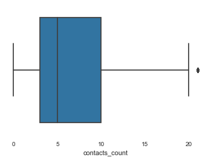


### Behaviors: House Count, Contacts Count, Text Working, Rate Reducing Single, Rate Reducing Mask


```python
fn.bxplt(df['house_count'])
```


    (2     183291
     3     124509
     4     115330
     5      60154
     1      50443
     6      24028
     7       9125
     8       4157
     9       1583
     10      1336
     11      1254
     Name: house_count, dtype: int64, count    575210.000000
     mean          3.190734
     std           1.553937
     min           1.000000
     25%           2.000000
     50%           3.000000
     75%           4.000000
     max          11.000000
     Name: house_count, dtype: float64, <matplotlib.axes._subplots.AxesSubplot at 0x1e5cb7eda90>)


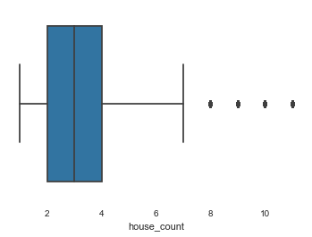


```python
fn.bxplt(df['rate_reducing_mask'])
```


    (1.0    178934
     2.0    159530
     3.0    114260
     4.0     92806
     5.0     29680
     Name: rate_reducing_mask, dtype: int64, count    575210.000000
     mean          2.365046
     std           1.219106
     min           1.000000
     25%           1.000000
     50%           2.000000
     75%           3.000000
     max           5.000000
     Name: rate_reducing_mask, dtype: float64, <matplotlib.axes._subplots.AxesSubplot at 0x1e5cb4d4470>)


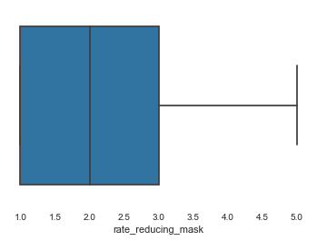


```python
df.head()
```


<div>
<style scoped>
    .dataframe tbody tr th:only-of-type {
        vertical-align: middle;
    }

    .dataframe tbody tr th {
        vertical-align: top;
    }

    .dataframe thead th {
        text-align: right;
    }
</style>
<table border="1" class="dataframe">
  <thead>
    <tr style="text-align: right;">
      <th></th>
      <th>country</th>
      <th>ip_accuracy</th>
      <th>sex</th>
      <th>age</th>
      <th>height</th>
      <th>weight</th>
      <th>bmi</th>
      <th>blood_type</th>
      <th>smoking</th>
      <th>alcohol</th>
      <th>cannabis</th>
      <th>amphetamines</th>
      <th>cocaine</th>
      <th>lsd</th>
      <th>mdma</th>
      <th>contacts_count</th>
      <th>house_count</th>
      <th>text_working</th>
      <th>rate_government_action</th>
      <th>rate_reducing_risk_single</th>
      <th>rate_reducing_risk_house</th>
      <th>rate_reducing_mask</th>
      <th>covid19_positive</th>
      <th>covid19_symptoms</th>
      <th>covid19_contact</th>
      <th>asthma</th>
      <th>kidney_disease</th>
      <th>compromised_immune</th>
      <th>heart_disease</th>
      <th>lung_disease</th>
      <th>diabetes</th>
      <th>hiv_positive</th>
      <th>hypertension</th>
      <th>other_chronic</th>
      <th>prescription_medication</th>
      <th>opinion_infection</th>
      <th>opinion_mortality</th>
      <th>risk_infection</th>
      <th>risk_mortality</th>
      <th>omwasnull</th>
      <th>oiwasnull</th>
      <th>taking_prescription_medication</th>
    </tr>
  </thead>
  <tbody>
    <tr>
      <th>0</th>
      <td>US</td>
      <td>200.0</td>
      <td>female</td>
      <td>45</td>
      <td>158</td>
      <td>114</td>
      <td>45.6</td>
      <td>ap</td>
      <td>quit0</td>
      <td>0.0</td>
      <td>0.0</td>
      <td>-1.0</td>
      <td>-1.0</td>
      <td>-1.0</td>
      <td>-1.0</td>
      <td>5.0</td>
      <td>4</td>
      <td>never</td>
      <td>0</td>
      <td>0</td>
      <td>0</td>
      <td>3.0</td>
      <td>0</td>
      <td>0</td>
      <td>0</td>
      <td>1</td>
      <td>0</td>
      <td>1</td>
      <td>0</td>
      <td>0</td>
      <td>0</td>
      <td>0</td>
      <td>1</td>
      <td>1</td>
      <td>NO</td>
      <td>55.0</td>
      <td>35.0</td>
      <td>64.248</td>
      <td>0.721</td>
      <td>False</td>
      <td>False</td>
      <td>False</td>
    </tr>
    <tr>
      <th>1</th>
      <td>US</td>
      <td>20.0</td>
      <td>female</td>
      <td>25</td>
      <td>168</td>
      <td>62</td>
      <td>21.9</td>
      <td>on</td>
      <td>never</td>
      <td>3.0</td>
      <td>-1.0</td>
      <td>-1.0</td>
      <td>-1.0</td>
      <td>-1.0</td>
      <td>-1.0</td>
      <td>5.0</td>
      <td>3</td>
      <td>never</td>
      <td>1</td>
      <td>1</td>
      <td>1</td>
      <td>2.0</td>
      <td>0</td>
      <td>0</td>
      <td>0</td>
      <td>0</td>
      <td>0</td>
      <td>0</td>
      <td>0</td>
      <td>0</td>
      <td>0</td>
      <td>0</td>
      <td>0</td>
      <td>0</td>
      <td>NO</td>
      <td>15.0</td>
      <td>15.0</td>
      <td>57.549</td>
      <td>0.016</td>
      <td>False</td>
      <td>False</td>
      <td>False</td>
    </tr>
    <tr>
      <th>2</th>
      <td>US</td>
      <td>10.0</td>
      <td>female</td>
      <td>5</td>
      <td>136</td>
      <td>44</td>
      <td>23.7</td>
      <td>bp</td>
      <td>never</td>
      <td>-1.0</td>
      <td>-1.0</td>
      <td>-1.0</td>
      <td>-1.0</td>
      <td>-1.0</td>
      <td>-1.0</td>
      <td>4.0</td>
      <td>3</td>
      <td>stopped</td>
      <td>0</td>
      <td>0</td>
      <td>0</td>
      <td>1.0</td>
      <td>0</td>
      <td>0</td>
      <td>0</td>
      <td>0</td>
      <td>0</td>
      <td>0</td>
      <td>0</td>
      <td>0</td>
      <td>0</td>
      <td>0</td>
      <td>0</td>
      <td>0</td>
      <td>NO</td>
      <td>35.0</td>
      <td>15.0</td>
      <td>62.377</td>
      <td>0.000</td>
      <td>True</td>
      <td>True</td>
      <td>False</td>
    </tr>
    <tr>
      <th>3</th>
      <td>US</td>
      <td>10.0</td>
      <td>female</td>
      <td>35</td>
      <td>164</td>
      <td>112</td>
      <td>41.6</td>
      <td>abn</td>
      <td>quit5</td>
      <td>-1.0</td>
      <td>28.0</td>
      <td>-1.0</td>
      <td>-1.0</td>
      <td>-1.0</td>
      <td>-1.0</td>
      <td>4.0</td>
      <td>3</td>
      <td>never</td>
      <td>1</td>
      <td>1</td>
      <td>0</td>
      <td>1.0</td>
      <td>0</td>
      <td>0</td>
      <td>0</td>
      <td>1</td>
      <td>0</td>
      <td>0</td>
      <td>0</td>
      <td>0</td>
      <td>0</td>
      <td>0</td>
      <td>1</td>
      <td>1</td>
      <td>ACETAZOLAMIDE;GABAPENTIN;OMEPRAZOLE;VENLAFAXIN...</td>
      <td>45.0</td>
      <td>25.0</td>
      <td>59.258</td>
      <td>0.195</td>
      <td>False</td>
      <td>False</td>
      <td>True</td>
    </tr>
    <tr>
      <th>4</th>
      <td>US</td>
      <td>50.0</td>
      <td>male</td>
      <td>55</td>
      <td>184</td>
      <td>132</td>
      <td>38.9</td>
      <td>an</td>
      <td>vape</td>
      <td>0.0</td>
      <td>-1.0</td>
      <td>-1.0</td>
      <td>-1.0</td>
      <td>-1.0</td>
      <td>-1.0</td>
      <td>10.0</td>
      <td>4</td>
      <td>travel critical</td>
      <td>0</td>
      <td>0</td>
      <td>0</td>
      <td>3.0</td>
      <td>0</td>
      <td>0</td>
      <td>0</td>
      <td>0</td>
      <td>0</td>
      <td>0</td>
      <td>0</td>
      <td>0</td>
      <td>1</td>
      <td>0</td>
      <td>0</td>
      <td>0</td>
      <td>METFORMIN HYDROCHLORIDE</td>
      <td>15.0</td>
      <td>5.0</td>
      <td>77.098</td>
      <td>2.463</td>
      <td>False</td>
      <td>False</td>
      <td>True</td>
    </tr>
  </tbody>
</table>
</div>


### Further scrubbing and preprocessing;
>* Changing the datatypes of objects to categories and encoding 
* Dropping additional columns
* Creating additional copies of the DataFrame to work from for future work.


   

### Pairing the size of the dataset by changing objects to categories:


```python
df.columns
```


    Index(['country', 'ip_accuracy', 'sex', 'age', 'height', 'weight', 'bmi',
           'blood_type', 'smoking', 'alcohol', 'cannabis', 'amphetamines',
           'cocaine', 'lsd', 'mdma', 'contacts_count', 'house_count',
           'text_working', 'rate_government_action', 'rate_reducing_risk_single',
           'rate_reducing_risk_house', 'rate_reducing_mask', 'covid19_positive',
           'covid19_symptoms', 'covid19_contact', 'asthma', 'kidney_disease',
           'compromised_immune', 'heart_disease', 'lung_disease', 'diabetes',
           'hiv_positive', 'hypertension', 'other_chronic',
           'prescription_medication', 'opinion_infection', 'opinion_mortality',
           'risk_infection', 'risk_mortality', 'omwasnull', 'oiwasnull',
           'taking_prescription_medication'],
          dtype='object')


```python
df.astype({'country' : 'category', 'sex' : 'category', 'blood_type' : 'category',
           'smoking': 'category', 'text_working' : 'category', 'prescription_medication' : 'category'})
```


<div>
<style scoped>
    .dataframe tbody tr th:only-of-type {
        vertical-align: middle;
    }

    .dataframe tbody tr th {
        vertical-align: top;
    }

    .dataframe thead th {
        text-align: right;
    }
</style>
<table border="1" class="dataframe">
  <thead>
    <tr style="text-align: right;">
      <th></th>
      <th>country</th>
      <th>ip_accuracy</th>
      <th>sex</th>
      <th>age</th>
      <th>height</th>
      <th>weight</th>
      <th>bmi</th>
      <th>blood_type</th>
      <th>smoking</th>
      <th>alcohol</th>
      <th>cannabis</th>
      <th>amphetamines</th>
      <th>cocaine</th>
      <th>lsd</th>
      <th>mdma</th>
      <th>contacts_count</th>
      <th>house_count</th>
      <th>text_working</th>
      <th>rate_government_action</th>
      <th>rate_reducing_risk_single</th>
      <th>rate_reducing_risk_house</th>
      <th>rate_reducing_mask</th>
      <th>covid19_positive</th>
      <th>covid19_symptoms</th>
      <th>covid19_contact</th>
      <th>asthma</th>
      <th>kidney_disease</th>
      <th>compromised_immune</th>
      <th>heart_disease</th>
      <th>lung_disease</th>
      <th>diabetes</th>
      <th>hiv_positive</th>
      <th>hypertension</th>
      <th>other_chronic</th>
      <th>prescription_medication</th>
      <th>opinion_infection</th>
      <th>opinion_mortality</th>
      <th>risk_infection</th>
      <th>risk_mortality</th>
      <th>omwasnull</th>
      <th>oiwasnull</th>
      <th>taking_prescription_medication</th>
    </tr>
  </thead>
  <tbody>
    <tr>
      <th>0</th>
      <td>US</td>
      <td>200.0</td>
      <td>female</td>
      <td>45</td>
      <td>158</td>
      <td>114</td>
      <td>45.6</td>
      <td>ap</td>
      <td>quit0</td>
      <td>0.0</td>
      <td>0.0</td>
      <td>-1.0</td>
      <td>-1.0</td>
      <td>-1.0</td>
      <td>-1.0</td>
      <td>5.0</td>
      <td>4</td>
      <td>never</td>
      <td>0</td>
      <td>0</td>
      <td>0</td>
      <td>3.0</td>
      <td>0</td>
      <td>0</td>
      <td>0</td>
      <td>1</td>
      <td>0</td>
      <td>1</td>
      <td>0</td>
      <td>0</td>
      <td>0</td>
      <td>0</td>
      <td>1</td>
      <td>1</td>
      <td>NO</td>
      <td>55.0</td>
      <td>35.0</td>
      <td>64.248</td>
      <td>0.721</td>
      <td>False</td>
      <td>False</td>
      <td>False</td>
    </tr>
    <tr>
      <th>1</th>
      <td>US</td>
      <td>20.0</td>
      <td>female</td>
      <td>25</td>
      <td>168</td>
      <td>62</td>
      <td>21.9</td>
      <td>on</td>
      <td>never</td>
      <td>3.0</td>
      <td>-1.0</td>
      <td>-1.0</td>
      <td>-1.0</td>
      <td>-1.0</td>
      <td>-1.0</td>
      <td>5.0</td>
      <td>3</td>
      <td>never</td>
      <td>1</td>
      <td>1</td>
      <td>1</td>
      <td>2.0</td>
      <td>0</td>
      <td>0</td>
      <td>0</td>
      <td>0</td>
      <td>0</td>
      <td>0</td>
      <td>0</td>
      <td>0</td>
      <td>0</td>
      <td>0</td>
      <td>0</td>
      <td>0</td>
      <td>NO</td>
      <td>15.0</td>
      <td>15.0</td>
      <td>57.549</td>
      <td>0.016</td>
      <td>False</td>
      <td>False</td>
      <td>False</td>
    </tr>
    <tr>
      <th>2</th>
      <td>US</td>
      <td>10.0</td>
      <td>female</td>
      <td>5</td>
      <td>136</td>
      <td>44</td>
      <td>23.7</td>
      <td>bp</td>
      <td>never</td>
      <td>-1.0</td>
      <td>-1.0</td>
      <td>-1.0</td>
      <td>-1.0</td>
      <td>-1.0</td>
      <td>-1.0</td>
      <td>4.0</td>
      <td>3</td>
      <td>stopped</td>
      <td>0</td>
      <td>0</td>
      <td>0</td>
      <td>1.0</td>
      <td>0</td>
      <td>0</td>
      <td>0</td>
      <td>0</td>
      <td>0</td>
      <td>0</td>
      <td>0</td>
      <td>0</td>
      <td>0</td>
      <td>0</td>
      <td>0</td>
      <td>0</td>
      <td>NO</td>
      <td>35.0</td>
      <td>15.0</td>
      <td>62.377</td>
      <td>0.000</td>
      <td>True</td>
      <td>True</td>
      <td>False</td>
    </tr>
    <tr>
      <th>3</th>
      <td>US</td>
      <td>10.0</td>
      <td>female</td>
      <td>35</td>
      <td>164</td>
      <td>112</td>
      <td>41.6</td>
      <td>abn</td>
      <td>quit5</td>
      <td>-1.0</td>
      <td>28.0</td>
      <td>-1.0</td>
      <td>-1.0</td>
      <td>-1.0</td>
      <td>-1.0</td>
      <td>4.0</td>
      <td>3</td>
      <td>never</td>
      <td>1</td>
      <td>1</td>
      <td>0</td>
      <td>1.0</td>
      <td>0</td>
      <td>0</td>
      <td>0</td>
      <td>1</td>
      <td>0</td>
      <td>0</td>
      <td>0</td>
      <td>0</td>
      <td>0</td>
      <td>0</td>
      <td>1</td>
      <td>1</td>
      <td>ACETAZOLAMIDE;GABAPENTIN;OMEPRAZOLE;VENLAFAXIN...</td>
      <td>45.0</td>
      <td>25.0</td>
      <td>59.258</td>
      <td>0.195</td>
      <td>False</td>
      <td>False</td>
      <td>True</td>
    </tr>
    <tr>
      <th>4</th>
      <td>US</td>
      <td>50.0</td>
      <td>male</td>
      <td>55</td>
      <td>184</td>
      <td>132</td>
      <td>38.9</td>
      <td>an</td>
      <td>vape</td>
      <td>0.0</td>
      <td>-1.0</td>
      <td>-1.0</td>
      <td>-1.0</td>
      <td>-1.0</td>
      <td>-1.0</td>
      <td>10.0</td>
      <td>4</td>
      <td>travel critical</td>
      <td>0</td>
      <td>0</td>
      <td>0</td>
      <td>3.0</td>
      <td>0</td>
      <td>0</td>
      <td>0</td>
      <td>0</td>
      <td>0</td>
      <td>0</td>
      <td>0</td>
      <td>0</td>
      <td>1</td>
      <td>0</td>
      <td>0</td>
      <td>0</td>
      <td>METFORMIN HYDROCHLORIDE</td>
      <td>15.0</td>
      <td>5.0</td>
      <td>77.098</td>
      <td>2.463</td>
      <td>False</td>
      <td>False</td>
      <td>True</td>
    </tr>
    <tr>
      <th>...</th>
      <td>...</td>
      <td>...</td>
      <td>...</td>
      <td>...</td>
      <td>...</td>
      <td>...</td>
      <td>...</td>
      <td>...</td>
      <td>...</td>
      <td>...</td>
      <td>...</td>
      <td>...</td>
      <td>...</td>
      <td>...</td>
      <td>...</td>
      <td>...</td>
      <td>...</td>
      <td>...</td>
      <td>...</td>
      <td>...</td>
      <td>...</td>
      <td>...</td>
      <td>...</td>
      <td>...</td>
      <td>...</td>
      <td>...</td>
      <td>...</td>
      <td>...</td>
      <td>...</td>
      <td>...</td>
      <td>...</td>
      <td>...</td>
      <td>...</td>
      <td>...</td>
      <td>...</td>
      <td>...</td>
      <td>...</td>
      <td>...</td>
      <td>...</td>
      <td>...</td>
      <td>...</td>
      <td>...</td>
    </tr>
    <tr>
      <th>619022</th>
      <td>CA</td>
      <td>5.0</td>
      <td>female</td>
      <td>25</td>
      <td>168</td>
      <td>94</td>
      <td>33.3</td>
      <td>unknown</td>
      <td>never</td>
      <td>2.0</td>
      <td>4.0</td>
      <td>-1.0</td>
      <td>-1.0</td>
      <td>-1.0</td>
      <td>-1.0</td>
      <td>3.0</td>
      <td>3</td>
      <td>stopped</td>
      <td>1</td>
      <td>1</td>
      <td>1</td>
      <td>2.0</td>
      <td>0</td>
      <td>0</td>
      <td>0</td>
      <td>0</td>
      <td>0</td>
      <td>0</td>
      <td>0</td>
      <td>0</td>
      <td>0</td>
      <td>0</td>
      <td>0</td>
      <td>0</td>
      <td>NO</td>
      <td>35.0</td>
      <td>15.0</td>
      <td>57.835</td>
      <td>0.017</td>
      <td>False</td>
      <td>False</td>
      <td>False</td>
    </tr>
    <tr>
      <th>619023</th>
      <td>US</td>
      <td>5.0</td>
      <td>female</td>
      <td>35</td>
      <td>174</td>
      <td>124</td>
      <td>40.9</td>
      <td>op</td>
      <td>never</td>
      <td>1.0</td>
      <td>14.0</td>
      <td>-1.0</td>
      <td>-1.0</td>
      <td>-1.0</td>
      <td>-1.0</td>
      <td>10.0</td>
      <td>5</td>
      <td>home</td>
      <td>0</td>
      <td>1</td>
      <td>1</td>
      <td>3.0</td>
      <td>0</td>
      <td>0</td>
      <td>0</td>
      <td>0</td>
      <td>0</td>
      <td>0</td>
      <td>0</td>
      <td>0</td>
      <td>0</td>
      <td>0</td>
      <td>1</td>
      <td>0</td>
      <td>NO</td>
      <td>55.0</td>
      <td>25.0</td>
      <td>59.874</td>
      <td>0.078</td>
      <td>False</td>
      <td>False</td>
      <td>False</td>
    </tr>
    <tr>
      <th>619024</th>
      <td>US</td>
      <td>5.0</td>
      <td>female</td>
      <td>45</td>
      <td>166</td>
      <td>74</td>
      <td>26.8</td>
      <td>unknown</td>
      <td>never</td>
      <td>1.0</td>
      <td>-1.0</td>
      <td>28.0</td>
      <td>-1.0</td>
      <td>-1.0</td>
      <td>-1.0</td>
      <td>21.0</td>
      <td>4</td>
      <td>travel critical</td>
      <td>-1</td>
      <td>1</td>
      <td>2</td>
      <td>4.0</td>
      <td>0</td>
      <td>0</td>
      <td>0</td>
      <td>0</td>
      <td>0</td>
      <td>0</td>
      <td>0</td>
      <td>0</td>
      <td>0</td>
      <td>0</td>
      <td>0</td>
      <td>0</td>
      <td>AMPHETAMINE ASPARTATE;AMPHETAMINE SULFATE;DEXT...</td>
      <td>85.0</td>
      <td>5.0</td>
      <td>67.718</td>
      <td>0.294</td>
      <td>False</td>
      <td>False</td>
      <td>True</td>
    </tr>
    <tr>
      <th>619025</th>
      <td>US</td>
      <td>20.0</td>
      <td>female</td>
      <td>45</td>
      <td>166</td>
      <td>90</td>
      <td>32.6</td>
      <td>an</td>
      <td>quit10</td>
      <td>2.0</td>
      <td>-1.0</td>
      <td>-1.0</td>
      <td>-1.0</td>
      <td>-1.0</td>
      <td>-1.0</td>
      <td>21.0</td>
      <td>2</td>
      <td>travel critical</td>
      <td>1</td>
      <td>1</td>
      <td>0</td>
      <td>2.0</td>
      <td>0</td>
      <td>0</td>
      <td>1</td>
      <td>0</td>
      <td>0</td>
      <td>0</td>
      <td>0</td>
      <td>0</td>
      <td>0</td>
      <td>0</td>
      <td>0</td>
      <td>0</td>
      <td>ALPRAZOLAM;HYDROXYZINE HYDROCHLORIDE;MONTELUKA...</td>
      <td>25.0</td>
      <td>15.0</td>
      <td>72.490</td>
      <td>0.582</td>
      <td>False</td>
      <td>False</td>
      <td>True</td>
    </tr>
    <tr>
      <th>619026</th>
      <td>US</td>
      <td>100.0</td>
      <td>male</td>
      <td>15</td>
      <td>192</td>
      <td>96</td>
      <td>26.0</td>
      <td>unknown</td>
      <td>yeslight</td>
      <td>0.0</td>
      <td>28.0</td>
      <td>-1.0</td>
      <td>-1.0</td>
      <td>-1.0</td>
      <td>-1.0</td>
      <td>5.0</td>
      <td>2</td>
      <td>never</td>
      <td>1</td>
      <td>1</td>
      <td>1</td>
      <td>1.0</td>
      <td>0</td>
      <td>0</td>
      <td>0</td>
      <td>0</td>
      <td>0</td>
      <td>0</td>
      <td>0</td>
      <td>0</td>
      <td>0</td>
      <td>0</td>
      <td>0</td>
      <td>0</td>
      <td>NO</td>
      <td>35.0</td>
      <td>15.0</td>
      <td>56.420</td>
      <td>0.012</td>
      <td>True</td>
      <td>True</td>
      <td>False</td>
    </tr>
  </tbody>
</table>
<p>575210 rows × 42 columns</p>
</div>


## Main Dataset:

**Columns dropped:**
 These columns were dropped in prior processing:
>* **Date** While the date the data was collected could have a bearing on whether or not someone tested postivie, it would not provide insight to biological, behavioral or geographical indicators.
* **Region** This was a feature that substantially lacked data in the inital collection with 93% of the values missing.

In addition the following columns were dropped with rationale below:
>* **ip_accuracy** - This feature measures the accuracy of the IP location and is used in the data collection process rather than for predicting a medical condition.
* **risk_infection** - This is a value calculated post-hoc, based on the data collected from this dataset
* **risk_mortality** - This is a value calculated post-hoc, based on the data collected from this dataset
* **prescription_medication** - This column contains text-strings and has over 57K values. A column was added called **taking_prescription_medication** to capture if an individual is taking prescribed medicine.  It's proposed to deal with this column separately if it's indicated to be a factor separately since this is computationally expensive.


```python
df.drop('ip_accuracy', axis=1, inplace=True)

```


```python
df.drop('risk_infection', axis=1, 
        inplace=True)
```


```python
df.drop('risk_mortality', axis=1, inplace=True)
```


```python
df1 = df.drop('prescription_medication', axis=1)
```

The primary dataset used for testing:

### Encoding dataset


```python
df2 = pd.get_dummies(df1)
df2.head()
```


<div>
<style scoped>
    .dataframe tbody tr th:only-of-type {
        vertical-align: middle;
    }

    .dataframe tbody tr th {
        vertical-align: top;
    }

    .dataframe thead th {
        text-align: right;
    }
</style>
<table border="1" class="dataframe">
  <thead>
    <tr style="text-align: right;">
      <th></th>
      <th>age</th>
      <th>height</th>
      <th>weight</th>
      <th>bmi</th>
      <th>alcohol</th>
      <th>cannabis</th>
      <th>amphetamines</th>
      <th>cocaine</th>
      <th>lsd</th>
      <th>mdma</th>
      <th>contacts_count</th>
      <th>house_count</th>
      <th>rate_government_action</th>
      <th>rate_reducing_risk_single</th>
      <th>rate_reducing_risk_house</th>
      <th>rate_reducing_mask</th>
      <th>covid19_positive</th>
      <th>covid19_symptoms</th>
      <th>covid19_contact</th>
      <th>asthma</th>
      <th>kidney_disease</th>
      <th>compromised_immune</th>
      <th>heart_disease</th>
      <th>lung_disease</th>
      <th>diabetes</th>
      <th>hiv_positive</th>
      <th>hypertension</th>
      <th>other_chronic</th>
      <th>opinion_infection</th>
      <th>opinion_mortality</th>
      <th>omwasnull</th>
      <th>oiwasnull</th>
      <th>taking_prescription_medication</th>
      <th>country_AD</th>
      <th>country_AE</th>
      <th>country_AF</th>
      <th>country_AG</th>
      <th>country_AI</th>
      <th>country_AL</th>
      <th>country_AM</th>
      <th>...</th>
      <th>country_TT</th>
      <th>country_TW</th>
      <th>country_UA</th>
      <th>country_UG</th>
      <th>country_US</th>
      <th>country_UY</th>
      <th>country_UZ</th>
      <th>country_VE</th>
      <th>country_VI</th>
      <th>country_VN</th>
      <th>country_WS</th>
      <th>country_YE</th>
      <th>country_ZA</th>
      <th>country_ZM</th>
      <th>country_ZW</th>
      <th>sex_female</th>
      <th>sex_male</th>
      <th>sex_other</th>
      <th>blood_type_abn</th>
      <th>blood_type_abp</th>
      <th>blood_type_an</th>
      <th>blood_type_ap</th>
      <th>blood_type_bn</th>
      <th>blood_type_bp</th>
      <th>blood_type_on</th>
      <th>blood_type_op</th>
      <th>blood_type_unknown</th>
      <th>smoking_never</th>
      <th>smoking_quit0</th>
      <th>smoking_quit10</th>
      <th>smoking_quit5</th>
      <th>smoking_vape</th>
      <th>smoking_yesheavy</th>
      <th>smoking_yeslight</th>
      <th>smoking_yesmedium</th>
      <th>text_working_home</th>
      <th>text_working_never</th>
      <th>text_working_stopped</th>
      <th>text_working_travel critical</th>
      <th>text_working_travel non critical</th>
    </tr>
  </thead>
  <tbody>
    <tr>
      <th>0</th>
      <td>45</td>
      <td>158</td>
      <td>114</td>
      <td>45.6</td>
      <td>0.0</td>
      <td>0.0</td>
      <td>-1.0</td>
      <td>-1.0</td>
      <td>-1.0</td>
      <td>-1.0</td>
      <td>5.0</td>
      <td>4</td>
      <td>0</td>
      <td>0</td>
      <td>0</td>
      <td>3.0</td>
      <td>0</td>
      <td>0</td>
      <td>0</td>
      <td>1</td>
      <td>0</td>
      <td>1</td>
      <td>0</td>
      <td>0</td>
      <td>0</td>
      <td>0</td>
      <td>1</td>
      <td>1</td>
      <td>55.0</td>
      <td>35.0</td>
      <td>False</td>
      <td>False</td>
      <td>False</td>
      <td>0</td>
      <td>0</td>
      <td>0</td>
      <td>0</td>
      <td>0</td>
      <td>0</td>
      <td>0</td>
      <td>...</td>
      <td>0</td>
      <td>0</td>
      <td>0</td>
      <td>0</td>
      <td>1</td>
      <td>0</td>
      <td>0</td>
      <td>0</td>
      <td>0</td>
      <td>0</td>
      <td>0</td>
      <td>0</td>
      <td>0</td>
      <td>0</td>
      <td>0</td>
      <td>1</td>
      <td>0</td>
      <td>0</td>
      <td>0</td>
      <td>0</td>
      <td>0</td>
      <td>1</td>
      <td>0</td>
      <td>0</td>
      <td>0</td>
      <td>0</td>
      <td>0</td>
      <td>0</td>
      <td>1</td>
      <td>0</td>
      <td>0</td>
      <td>0</td>
      <td>0</td>
      <td>0</td>
      <td>0</td>
      <td>0</td>
      <td>1</td>
      <td>0</td>
      <td>0</td>
      <td>0</td>
    </tr>
    <tr>
      <th>1</th>
      <td>25</td>
      <td>168</td>
      <td>62</td>
      <td>21.9</td>
      <td>3.0</td>
      <td>-1.0</td>
      <td>-1.0</td>
      <td>-1.0</td>
      <td>-1.0</td>
      <td>-1.0</td>
      <td>5.0</td>
      <td>3</td>
      <td>1</td>
      <td>1</td>
      <td>1</td>
      <td>2.0</td>
      <td>0</td>
      <td>0</td>
      <td>0</td>
      <td>0</td>
      <td>0</td>
      <td>0</td>
      <td>0</td>
      <td>0</td>
      <td>0</td>
      <td>0</td>
      <td>0</td>
      <td>0</td>
      <td>15.0</td>
      <td>15.0</td>
      <td>False</td>
      <td>False</td>
      <td>False</td>
      <td>0</td>
      <td>0</td>
      <td>0</td>
      <td>0</td>
      <td>0</td>
      <td>0</td>
      <td>0</td>
      <td>...</td>
      <td>0</td>
      <td>0</td>
      <td>0</td>
      <td>0</td>
      <td>1</td>
      <td>0</td>
      <td>0</td>
      <td>0</td>
      <td>0</td>
      <td>0</td>
      <td>0</td>
      <td>0</td>
      <td>0</td>
      <td>0</td>
      <td>0</td>
      <td>1</td>
      <td>0</td>
      <td>0</td>
      <td>0</td>
      <td>0</td>
      <td>0</td>
      <td>0</td>
      <td>0</td>
      <td>0</td>
      <td>1</td>
      <td>0</td>
      <td>0</td>
      <td>1</td>
      <td>0</td>
      <td>0</td>
      <td>0</td>
      <td>0</td>
      <td>0</td>
      <td>0</td>
      <td>0</td>
      <td>0</td>
      <td>1</td>
      <td>0</td>
      <td>0</td>
      <td>0</td>
    </tr>
    <tr>
      <th>2</th>
      <td>5</td>
      <td>136</td>
      <td>44</td>
      <td>23.7</td>
      <td>-1.0</td>
      <td>-1.0</td>
      <td>-1.0</td>
      <td>-1.0</td>
      <td>-1.0</td>
      <td>-1.0</td>
      <td>4.0</td>
      <td>3</td>
      <td>0</td>
      <td>0</td>
      <td>0</td>
      <td>1.0</td>
      <td>0</td>
      <td>0</td>
      <td>0</td>
      <td>0</td>
      <td>0</td>
      <td>0</td>
      <td>0</td>
      <td>0</td>
      <td>0</td>
      <td>0</td>
      <td>0</td>
      <td>0</td>
      <td>35.0</td>
      <td>15.0</td>
      <td>True</td>
      <td>True</td>
      <td>False</td>
      <td>0</td>
      <td>0</td>
      <td>0</td>
      <td>0</td>
      <td>0</td>
      <td>0</td>
      <td>0</td>
      <td>...</td>
      <td>0</td>
      <td>0</td>
      <td>0</td>
      <td>0</td>
      <td>1</td>
      <td>0</td>
      <td>0</td>
      <td>0</td>
      <td>0</td>
      <td>0</td>
      <td>0</td>
      <td>0</td>
      <td>0</td>
      <td>0</td>
      <td>0</td>
      <td>1</td>
      <td>0</td>
      <td>0</td>
      <td>0</td>
      <td>0</td>
      <td>0</td>
      <td>0</td>
      <td>0</td>
      <td>1</td>
      <td>0</td>
      <td>0</td>
      <td>0</td>
      <td>1</td>
      <td>0</td>
      <td>0</td>
      <td>0</td>
      <td>0</td>
      <td>0</td>
      <td>0</td>
      <td>0</td>
      <td>0</td>
      <td>0</td>
      <td>1</td>
      <td>0</td>
      <td>0</td>
    </tr>
    <tr>
      <th>3</th>
      <td>35</td>
      <td>164</td>
      <td>112</td>
      <td>41.6</td>
      <td>-1.0</td>
      <td>28.0</td>
      <td>-1.0</td>
      <td>-1.0</td>
      <td>-1.0</td>
      <td>-1.0</td>
      <td>4.0</td>
      <td>3</td>
      <td>1</td>
      <td>1</td>
      <td>0</td>
      <td>1.0</td>
      <td>0</td>
      <td>0</td>
      <td>0</td>
      <td>1</td>
      <td>0</td>
      <td>0</td>
      <td>0</td>
      <td>0</td>
      <td>0</td>
      <td>0</td>
      <td>1</td>
      <td>1</td>
      <td>45.0</td>
      <td>25.0</td>
      <td>False</td>
      <td>False</td>
      <td>True</td>
      <td>0</td>
      <td>0</td>
      <td>0</td>
      <td>0</td>
      <td>0</td>
      <td>0</td>
      <td>0</td>
      <td>...</td>
      <td>0</td>
      <td>0</td>
      <td>0</td>
      <td>0</td>
      <td>1</td>
      <td>0</td>
      <td>0</td>
      <td>0</td>
      <td>0</td>
      <td>0</td>
      <td>0</td>
      <td>0</td>
      <td>0</td>
      <td>0</td>
      <td>0</td>
      <td>1</td>
      <td>0</td>
      <td>0</td>
      <td>1</td>
      <td>0</td>
      <td>0</td>
      <td>0</td>
      <td>0</td>
      <td>0</td>
      <td>0</td>
      <td>0</td>
      <td>0</td>
      <td>0</td>
      <td>0</td>
      <td>0</td>
      <td>1</td>
      <td>0</td>
      <td>0</td>
      <td>0</td>
      <td>0</td>
      <td>0</td>
      <td>1</td>
      <td>0</td>
      <td>0</td>
      <td>0</td>
    </tr>
    <tr>
      <th>4</th>
      <td>55</td>
      <td>184</td>
      <td>132</td>
      <td>38.9</td>
      <td>0.0</td>
      <td>-1.0</td>
      <td>-1.0</td>
      <td>-1.0</td>
      <td>-1.0</td>
      <td>-1.0</td>
      <td>10.0</td>
      <td>4</td>
      <td>0</td>
      <td>0</td>
      <td>0</td>
      <td>3.0</td>
      <td>0</td>
      <td>0</td>
      <td>0</td>
      <td>0</td>
      <td>0</td>
      <td>0</td>
      <td>0</td>
      <td>0</td>
      <td>1</td>
      <td>0</td>
      <td>0</td>
      <td>0</td>
      <td>15.0</td>
      <td>5.0</td>
      <td>False</td>
      <td>False</td>
      <td>True</td>
      <td>0</td>
      <td>0</td>
      <td>0</td>
      <td>0</td>
      <td>0</td>
      <td>0</td>
      <td>0</td>
      <td>...</td>
      <td>0</td>
      <td>0</td>
      <td>0</td>
      <td>0</td>
      <td>1</td>
      <td>0</td>
      <td>0</td>
      <td>0</td>
      <td>0</td>
      <td>0</td>
      <td>0</td>
      <td>0</td>
      <td>0</td>
      <td>0</td>
      <td>0</td>
      <td>0</td>
      <td>1</td>
      <td>0</td>
      <td>0</td>
      <td>0</td>
      <td>1</td>
      <td>0</td>
      <td>0</td>
      <td>0</td>
      <td>0</td>
      <td>0</td>
      <td>0</td>
      <td>0</td>
      <td>0</td>
      <td>0</td>
      <td>0</td>
      <td>1</td>
      <td>0</td>
      <td>0</td>
      <td>0</td>
      <td>0</td>
      <td>0</td>
      <td>0</td>
      <td>1</td>
      <td>0</td>
    </tr>
  </tbody>
</table>
<p>5 rows × 231 columns</p>
</div>


```python
df2.corr()['covid19_positive']
```


    age                                 0.005861
    height                              0.005589
    weight                              0.006757
    bmi                                 0.004146
    alcohol                            -0.004861
                                          ...   
    text_working_home                   0.000755
    text_working_never                 -0.001408
    text_working_stopped               -0.002686
    text_working_travel critical        0.006793
    text_working_travel non critical   -0.004720
    Name: covid19_positive, Length: 231, dtype: float64


```python
df2.describe()
```


<div>
<style scoped>
    .dataframe tbody tr th:only-of-type {
        vertical-align: middle;
    }

    .dataframe tbody tr th {
        vertical-align: top;
    }

    .dataframe thead th {
        text-align: right;
    }
</style>
<table border="1" class="dataframe">
  <thead>
    <tr style="text-align: right;">
      <th></th>
      <th>age</th>
      <th>height</th>
      <th>weight</th>
      <th>bmi</th>
      <th>alcohol</th>
      <th>cannabis</th>
      <th>amphetamines</th>
      <th>cocaine</th>
      <th>lsd</th>
      <th>mdma</th>
      <th>contacts_count</th>
      <th>house_count</th>
      <th>rate_government_action</th>
      <th>rate_reducing_risk_single</th>
      <th>rate_reducing_risk_house</th>
      <th>rate_reducing_mask</th>
      <th>covid19_positive</th>
      <th>covid19_symptoms</th>
      <th>covid19_contact</th>
      <th>asthma</th>
      <th>kidney_disease</th>
      <th>compromised_immune</th>
      <th>heart_disease</th>
      <th>lung_disease</th>
      <th>diabetes</th>
      <th>hiv_positive</th>
      <th>hypertension</th>
      <th>other_chronic</th>
      <th>opinion_infection</th>
      <th>opinion_mortality</th>
      <th>country_AD</th>
      <th>country_AE</th>
      <th>country_AF</th>
      <th>country_AG</th>
      <th>country_AI</th>
      <th>country_AL</th>
      <th>country_AM</th>
      <th>country_AR</th>
      <th>country_AT</th>
      <th>country_AU</th>
      <th>...</th>
      <th>country_TT</th>
      <th>country_TW</th>
      <th>country_UA</th>
      <th>country_UG</th>
      <th>country_US</th>
      <th>country_UY</th>
      <th>country_UZ</th>
      <th>country_VE</th>
      <th>country_VI</th>
      <th>country_VN</th>
      <th>country_WS</th>
      <th>country_YE</th>
      <th>country_ZA</th>
      <th>country_ZM</th>
      <th>country_ZW</th>
      <th>sex_female</th>
      <th>sex_male</th>
      <th>sex_other</th>
      <th>blood_type_abn</th>
      <th>blood_type_abp</th>
      <th>blood_type_an</th>
      <th>blood_type_ap</th>
      <th>blood_type_bn</th>
      <th>blood_type_bp</th>
      <th>blood_type_on</th>
      <th>blood_type_op</th>
      <th>blood_type_unknown</th>
      <th>smoking_never</th>
      <th>smoking_quit0</th>
      <th>smoking_quit10</th>
      <th>smoking_quit5</th>
      <th>smoking_vape</th>
      <th>smoking_yesheavy</th>
      <th>smoking_yeslight</th>
      <th>smoking_yesmedium</th>
      <th>text_working_home</th>
      <th>text_working_never</th>
      <th>text_working_stopped</th>
      <th>text_working_travel critical</th>
      <th>text_working_travel non critical</th>
    </tr>
  </thead>
  <tbody>
    <tr>
      <th>count</th>
      <td>575210.000000</td>
      <td>575210.000000</td>
      <td>575210.000000</td>
      <td>575210.000000</td>
      <td>575210.000000</td>
      <td>575210.000000</td>
      <td>575210.000000</td>
      <td>575210.000000</td>
      <td>575210.000000</td>
      <td>575210.000000</td>
      <td>575210.000000</td>
      <td>575210.000000</td>
      <td>575210.000000</td>
      <td>575210.000000</td>
      <td>575210.000000</td>
      <td>575210.000000</td>
      <td>575210.000000</td>
      <td>575210.000000</td>
      <td>575210.000000</td>
      <td>575210.000000</td>
      <td>575210.000000</td>
      <td>575210.000000</td>
      <td>575210.000000</td>
      <td>575210.000000</td>
      <td>575210.000000</td>
      <td>575210.000000</td>
      <td>575210.000000</td>
      <td>575210.000000</td>
      <td>575210.000000</td>
      <td>575210.000000</td>
      <td>575210.000000</td>
      <td>575210.000000</td>
      <td>575210.000000</td>
      <td>575210.000000</td>
      <td>575210.000000</td>
      <td>575210.000000</td>
      <td>575210.000000</td>
      <td>575210.00000</td>
      <td>575210.000000</td>
      <td>575210.000000</td>
      <td>...</td>
      <td>575210.000000</td>
      <td>575210.000000</td>
      <td>575210.000000</td>
      <td>575210.000000</td>
      <td>575210.000000</td>
      <td>575210.000000</td>
      <td>575210.000000</td>
      <td>575210.000000</td>
      <td>575210.000000</td>
      <td>575210.000000</td>
      <td>575210.000000</td>
      <td>575210.000000</td>
      <td>575210.000000</td>
      <td>575210.000000</td>
      <td>575210.000000</td>
      <td>575210.000000</td>
      <td>575210.000000</td>
      <td>575210.000000</td>
      <td>575210.000000</td>
      <td>575210.000000</td>
      <td>575210.000000</td>
      <td>575210.000000</td>
      <td>575210.000000</td>
      <td>575210.000000</td>
      <td>575210.000000</td>
      <td>575210.000000</td>
      <td>575210.000000</td>
      <td>575210.000000</td>
      <td>575210.000000</td>
      <td>575210.000000</td>
      <td>575210.000000</td>
      <td>575210.000000</td>
      <td>575210.000000</td>
      <td>575210.000000</td>
      <td>575210.000000</td>
      <td>575210.000000</td>
      <td>575210.000000</td>
      <td>575210.000000</td>
      <td>575210.000000</td>
      <td>575210.000000</td>
    </tr>
    <tr>
      <th>mean</th>
      <td>38.048295</td>
      <td>169.063834</td>
      <td>86.105141</td>
      <td>30.037971</td>
      <td>2.672372</td>
      <td>2.375988</td>
      <td>-0.726154</td>
      <td>-0.801010</td>
      <td>-0.857699</td>
      <td>-0.856922</td>
      <td>7.399658</td>
      <td>3.190734</td>
      <td>0.321573</td>
      <td>1.013882</td>
      <td>0.869884</td>
      <td>2.365046</td>
      <td>0.001375</td>
      <td>0.016495</td>
      <td>0.035511</td>
      <td>0.161657</td>
      <td>0.003100</td>
      <td>0.061310</td>
      <td>0.015657</td>
      <td>0.012322</td>
      <td>0.059789</td>
      <td>0.003077</td>
      <td>0.128171</td>
      <td>0.075206</td>
      <td>36.089480</td>
      <td>20.279585</td>
      <td>0.000002</td>
      <td>0.000209</td>
      <td>0.000012</td>
      <td>0.000003</td>
      <td>0.000007</td>
      <td>0.000019</td>
      <td>0.000016</td>
      <td>0.00025</td>
      <td>0.000177</td>
      <td>0.010888</td>
      <td>...</td>
      <td>0.000024</td>
      <td>0.000101</td>
      <td>0.000231</td>
      <td>0.000009</td>
      <td>0.880816</td>
      <td>0.000017</td>
      <td>0.000007</td>
      <td>0.000014</td>
      <td>0.000061</td>
      <td>0.000061</td>
      <td>0.000002</td>
      <td>0.000002</td>
      <td>0.000982</td>
      <td>0.000007</td>
      <td>0.000005</td>
      <td>0.700464</td>
      <td>0.295911</td>
      <td>0.003625</td>
      <td>0.010838</td>
      <td>0.033906</td>
      <td>0.049412</td>
      <td>0.186834</td>
      <td>0.016128</td>
      <td>0.062542</td>
      <td>0.088130</td>
      <td>0.214051</td>
      <td>0.338160</td>
      <td>0.568293</td>
      <td>0.057629</td>
      <td>0.096393</td>
      <td>0.060183</td>
      <td>0.065533</td>
      <td>0.017781</td>
      <td>0.046254</td>
      <td>0.087933</td>
      <td>0.062092</td>
      <td>0.159272</td>
      <td>0.434109</td>
      <td>0.259803</td>
      <td>0.084724</td>
    </tr>
    <tr>
      <th>std</th>
      <td>13.437588</td>
      <td>11.101964</td>
      <td>24.486852</td>
      <td>8.044168</td>
      <td>4.177297</td>
      <td>8.075127</td>
      <td>1.924783</td>
      <td>0.933992</td>
      <td>0.562558</td>
      <td>0.543600</td>
      <td>6.746050</td>
      <td>1.553937</td>
      <td>0.858836</td>
      <td>0.553701</td>
      <td>0.654685</td>
      <td>1.219106</td>
      <td>0.037058</td>
      <td>0.127369</td>
      <td>0.185066</td>
      <td>0.368137</td>
      <td>0.055589</td>
      <td>0.239898</td>
      <td>0.124144</td>
      <td>0.110321</td>
      <td>0.237095</td>
      <td>0.055387</td>
      <td>0.334280</td>
      <td>0.263723</td>
      <td>20.097658</td>
      <td>19.947894</td>
      <td>0.001319</td>
      <td>0.014442</td>
      <td>0.003488</td>
      <td>0.001865</td>
      <td>0.002637</td>
      <td>0.004373</td>
      <td>0.003956</td>
      <td>0.01582</td>
      <td>0.013315</td>
      <td>0.103777</td>
      <td>...</td>
      <td>0.004933</td>
      <td>0.010041</td>
      <td>0.015204</td>
      <td>0.002948</td>
      <td>0.324006</td>
      <td>0.004169</td>
      <td>0.002637</td>
      <td>0.003729</td>
      <td>0.007800</td>
      <td>0.007800</td>
      <td>0.001319</td>
      <td>0.001319</td>
      <td>0.031325</td>
      <td>0.002637</td>
      <td>0.002284</td>
      <td>0.458055</td>
      <td>0.456452</td>
      <td>0.060097</td>
      <td>0.103539</td>
      <td>0.180987</td>
      <td>0.216726</td>
      <td>0.389779</td>
      <td>0.125968</td>
      <td>0.242138</td>
      <td>0.283483</td>
      <td>0.410162</td>
      <td>0.473084</td>
      <td>0.495314</td>
      <td>0.233041</td>
      <td>0.295129</td>
      <td>0.237826</td>
      <td>0.247463</td>
      <td>0.132156</td>
      <td>0.210036</td>
      <td>0.283198</td>
      <td>0.241323</td>
      <td>0.365930</td>
      <td>0.495640</td>
      <td>0.438527</td>
      <td>0.278471</td>
    </tr>
    <tr>
      <th>min</th>
      <td>5.000000</td>
      <td>110.000000</td>
      <td>44.000000</td>
      <td>10.000000</td>
      <td>-1.000000</td>
      <td>-2.000000</td>
      <td>-2.000000</td>
      <td>-2.000000</td>
      <td>-2.000000</td>
      <td>-2.000000</td>
      <td>0.000000</td>
      <td>1.000000</td>
      <td>-2.000000</td>
      <td>-2.000000</td>
      <td>-2.000000</td>
      <td>1.000000</td>
      <td>0.000000</td>
      <td>0.000000</td>
      <td>0.000000</td>
      <td>0.000000</td>
      <td>0.000000</td>
      <td>0.000000</td>
      <td>0.000000</td>
      <td>0.000000</td>
      <td>0.000000</td>
      <td>0.000000</td>
      <td>0.000000</td>
      <td>0.000000</td>
      <td>5.000000</td>
      <td>5.000000</td>
      <td>0.000000</td>
      <td>0.000000</td>
      <td>0.000000</td>
      <td>0.000000</td>
      <td>0.000000</td>
      <td>0.000000</td>
      <td>0.000000</td>
      <td>0.00000</td>
      <td>0.000000</td>
      <td>0.000000</td>
      <td>...</td>
      <td>0.000000</td>
      <td>0.000000</td>
      <td>0.000000</td>
      <td>0.000000</td>
      <td>0.000000</td>
      <td>0.000000</td>
      <td>0.000000</td>
      <td>0.000000</td>
      <td>0.000000</td>
      <td>0.000000</td>
      <td>0.000000</td>
      <td>0.000000</td>
      <td>0.000000</td>
      <td>0.000000</td>
      <td>0.000000</td>
      <td>0.000000</td>
      <td>0.000000</td>
      <td>0.000000</td>
      <td>0.000000</td>
      <td>0.000000</td>
      <td>0.000000</td>
      <td>0.000000</td>
      <td>0.000000</td>
      <td>0.000000</td>
      <td>0.000000</td>
      <td>0.000000</td>
      <td>0.000000</td>
      <td>0.000000</td>
      <td>0.000000</td>
      <td>0.000000</td>
      <td>0.000000</td>
      <td>0.000000</td>
      <td>0.000000</td>
      <td>0.000000</td>
      <td>0.000000</td>
      <td>0.000000</td>
      <td>0.000000</td>
      <td>0.000000</td>
      <td>0.000000</td>
      <td>0.000000</td>
    </tr>
    <tr>
      <th>25%</th>
      <td>25.000000</td>
      <td>162.000000</td>
      <td>68.000000</td>
      <td>24.200000</td>
      <td>0.000000</td>
      <td>-1.000000</td>
      <td>-1.000000</td>
      <td>-1.000000</td>
      <td>-1.000000</td>
      <td>-1.000000</td>
      <td>3.000000</td>
      <td>2.000000</td>
      <td>0.000000</td>
      <td>1.000000</td>
      <td>1.000000</td>
      <td>1.000000</td>
      <td>0.000000</td>
      <td>0.000000</td>
      <td>0.000000</td>
      <td>0.000000</td>
      <td>0.000000</td>
      <td>0.000000</td>
      <td>0.000000</td>
      <td>0.000000</td>
      <td>0.000000</td>
      <td>0.000000</td>
      <td>0.000000</td>
      <td>0.000000</td>
      <td>25.000000</td>
      <td>5.000000</td>
      <td>0.000000</td>
      <td>0.000000</td>
      <td>0.000000</td>
      <td>0.000000</td>
      <td>0.000000</td>
      <td>0.000000</td>
      <td>0.000000</td>
      <td>0.00000</td>
      <td>0.000000</td>
      <td>0.000000</td>
      <td>...</td>
      <td>0.000000</td>
      <td>0.000000</td>
      <td>0.000000</td>
      <td>0.000000</td>
      <td>1.000000</td>
      <td>0.000000</td>
      <td>0.000000</td>
      <td>0.000000</td>
      <td>0.000000</td>
      <td>0.000000</td>
      <td>0.000000</td>
      <td>0.000000</td>
      <td>0.000000</td>
      <td>0.000000</td>
      <td>0.000000</td>
      <td>0.000000</td>
      <td>0.000000</td>
      <td>0.000000</td>
      <td>0.000000</td>
      <td>0.000000</td>
      <td>0.000000</td>
      <td>0.000000</td>
      <td>0.000000</td>
      <td>0.000000</td>
      <td>0.000000</td>
      <td>0.000000</td>
      <td>0.000000</td>
      <td>0.000000</td>
      <td>0.000000</td>
      <td>0.000000</td>
      <td>0.000000</td>
      <td>0.000000</td>
      <td>0.000000</td>
      <td>0.000000</td>
      <td>0.000000</td>
      <td>0.000000</td>
      <td>0.000000</td>
      <td>0.000000</td>
      <td>0.000000</td>
      <td>0.000000</td>
    </tr>
    <tr>
      <th>50%</th>
      <td>35.000000</td>
      <td>168.000000</td>
      <td>82.000000</td>
      <td>28.300000</td>
      <td>1.000000</td>
      <td>-1.000000</td>
      <td>-1.000000</td>
      <td>-1.000000</td>
      <td>-1.000000</td>
      <td>-1.000000</td>
      <td>5.000000</td>
      <td>3.000000</td>
      <td>0.000000</td>
      <td>1.000000</td>
      <td>1.000000</td>
      <td>2.000000</td>
      <td>0.000000</td>
      <td>0.000000</td>
      <td>0.000000</td>
      <td>0.000000</td>
      <td>0.000000</td>
      <td>0.000000</td>
      <td>0.000000</td>
      <td>0.000000</td>
      <td>0.000000</td>
      <td>0.000000</td>
      <td>0.000000</td>
      <td>0.000000</td>
      <td>35.000000</td>
      <td>15.000000</td>
      <td>0.000000</td>
      <td>0.000000</td>
      <td>0.000000</td>
      <td>0.000000</td>
      <td>0.000000</td>
      <td>0.000000</td>
      <td>0.000000</td>
      <td>0.00000</td>
      <td>0.000000</td>
      <td>0.000000</td>
      <td>...</td>
      <td>0.000000</td>
      <td>0.000000</td>
      <td>0.000000</td>
      <td>0.000000</td>
      <td>1.000000</td>
      <td>0.000000</td>
      <td>0.000000</td>
      <td>0.000000</td>
      <td>0.000000</td>
      <td>0.000000</td>
      <td>0.000000</td>
      <td>0.000000</td>
      <td>0.000000</td>
      <td>0.000000</td>
      <td>0.000000</td>
      <td>1.000000</td>
      <td>0.000000</td>
      <td>0.000000</td>
      <td>0.000000</td>
      <td>0.000000</td>
      <td>0.000000</td>
      <td>0.000000</td>
      <td>0.000000</td>
      <td>0.000000</td>
      <td>0.000000</td>
      <td>0.000000</td>
      <td>0.000000</td>
      <td>1.000000</td>
      <td>0.000000</td>
      <td>0.000000</td>
      <td>0.000000</td>
      <td>0.000000</td>
      <td>0.000000</td>
      <td>0.000000</td>
      <td>0.000000</td>
      <td>0.000000</td>
      <td>0.000000</td>
      <td>0.000000</td>
      <td>0.000000</td>
      <td>0.000000</td>
    </tr>
    <tr>
      <th>75%</th>
      <td>45.000000</td>
      <td>176.000000</td>
      <td>100.000000</td>
      <td>34.300000</td>
      <td>4.000000</td>
      <td>0.000000</td>
      <td>-1.000000</td>
      <td>-1.000000</td>
      <td>-1.000000</td>
      <td>-1.000000</td>
      <td>10.000000</td>
      <td>4.000000</td>
      <td>1.000000</td>
      <td>1.000000</td>
      <td>1.000000</td>
      <td>3.000000</td>
      <td>0.000000</td>
      <td>0.000000</td>
      <td>0.000000</td>
      <td>0.000000</td>
      <td>0.000000</td>
      <td>0.000000</td>
      <td>0.000000</td>
      <td>0.000000</td>
      <td>0.000000</td>
      <td>0.000000</td>
      <td>0.000000</td>
      <td>0.000000</td>
      <td>45.000000</td>
      <td>25.000000</td>
      <td>0.000000</td>
      <td>0.000000</td>
      <td>0.000000</td>
      <td>0.000000</td>
      <td>0.000000</td>
      <td>0.000000</td>
      <td>0.000000</td>
      <td>0.00000</td>
      <td>0.000000</td>
      <td>0.000000</td>
      <td>...</td>
      <td>0.000000</td>
      <td>0.000000</td>
      <td>0.000000</td>
      <td>0.000000</td>
      <td>1.000000</td>
      <td>0.000000</td>
      <td>0.000000</td>
      <td>0.000000</td>
      <td>0.000000</td>
      <td>0.000000</td>
      <td>0.000000</td>
      <td>0.000000</td>
      <td>0.000000</td>
      <td>0.000000</td>
      <td>0.000000</td>
      <td>1.000000</td>
      <td>1.000000</td>
      <td>0.000000</td>
      <td>0.000000</td>
      <td>0.000000</td>
      <td>0.000000</td>
      <td>0.000000</td>
      <td>0.000000</td>
      <td>0.000000</td>
      <td>0.000000</td>
      <td>0.000000</td>
      <td>1.000000</td>
      <td>1.000000</td>
      <td>0.000000</td>
      <td>0.000000</td>
      <td>0.000000</td>
      <td>0.000000</td>
      <td>0.000000</td>
      <td>0.000000</td>
      <td>0.000000</td>
      <td>0.000000</td>
      <td>0.000000</td>
      <td>1.000000</td>
      <td>1.000000</td>
      <td>0.000000</td>
    </tr>
    <tr>
      <th>max</th>
      <td>105.000000</td>
      <td>238.000000</td>
      <td>180.000000</td>
      <td>143.800000</td>
      <td>14.000000</td>
      <td>28.000000</td>
      <td>28.000000</td>
      <td>28.000000</td>
      <td>28.000000</td>
      <td>28.000000</td>
      <td>21.000000</td>
      <td>11.000000</td>
      <td>2.000000</td>
      <td>2.000000</td>
      <td>2.000000</td>
      <td>5.000000</td>
      <td>1.000000</td>
      <td>1.000000</td>
      <td>1.000000</td>
      <td>1.000000</td>
      <td>1.000000</td>
      <td>1.000000</td>
      <td>1.000000</td>
      <td>1.000000</td>
      <td>1.000000</td>
      <td>1.000000</td>
      <td>1.000000</td>
      <td>1.000000</td>
      <td>95.000000</td>
      <td>95.000000</td>
      <td>1.000000</td>
      <td>1.000000</td>
      <td>1.000000</td>
      <td>1.000000</td>
      <td>1.000000</td>
      <td>1.000000</td>
      <td>1.000000</td>
      <td>1.00000</td>
      <td>1.000000</td>
      <td>1.000000</td>
      <td>...</td>
      <td>1.000000</td>
      <td>1.000000</td>
      <td>1.000000</td>
      <td>1.000000</td>
      <td>1.000000</td>
      <td>1.000000</td>
      <td>1.000000</td>
      <td>1.000000</td>
      <td>1.000000</td>
      <td>1.000000</td>
      <td>1.000000</td>
      <td>1.000000</td>
      <td>1.000000</td>
      <td>1.000000</td>
      <td>1.000000</td>
      <td>1.000000</td>
      <td>1.000000</td>
      <td>1.000000</td>
      <td>1.000000</td>
      <td>1.000000</td>
      <td>1.000000</td>
      <td>1.000000</td>
      <td>1.000000</td>
      <td>1.000000</td>
      <td>1.000000</td>
      <td>1.000000</td>
      <td>1.000000</td>
      <td>1.000000</td>
      <td>1.000000</td>
      <td>1.000000</td>
      <td>1.000000</td>
      <td>1.000000</td>
      <td>1.000000</td>
      <td>1.000000</td>
      <td>1.000000</td>
      <td>1.000000</td>
      <td>1.000000</td>
      <td>1.000000</td>
      <td>1.000000</td>
      <td>1.000000</td>
    </tr>
  </tbody>
</table>
<p>8 rows × 228 columns</p>
</div>


## copies of dataframes to work from:

considering dropping opinion_infection and opinion mortality since not much is known about these features...


```python
df4 = df1.copy()
```


```python
cols_to_drop = ['opinion_infection', 'opinion_mortality', 'omwasnull', 'oiwasnull']
```


```python
df5 = df4.drop(cols_to_drop, axis=1)
```


```python
df6 = pd.get_dummies(df5)
df6.head()
```


<div>
<style scoped>
    .dataframe tbody tr th:only-of-type {
        vertical-align: middle;
    }

    .dataframe tbody tr th {
        vertical-align: top;
    }

    .dataframe thead th {
        text-align: right;
    }
</style>
<table border="1" class="dataframe">
  <thead>
    <tr style="text-align: right;">
      <th></th>
      <th>age</th>
      <th>height</th>
      <th>weight</th>
      <th>bmi</th>
      <th>alcohol</th>
      <th>cannabis</th>
      <th>amphetamines</th>
      <th>cocaine</th>
      <th>lsd</th>
      <th>mdma</th>
      <th>contacts_count</th>
      <th>house_count</th>
      <th>rate_government_action</th>
      <th>rate_reducing_risk_single</th>
      <th>rate_reducing_risk_house</th>
      <th>rate_reducing_mask</th>
      <th>covid19_positive</th>
      <th>covid19_symptoms</th>
      <th>covid19_contact</th>
      <th>asthma</th>
      <th>kidney_disease</th>
      <th>compromised_immune</th>
      <th>heart_disease</th>
      <th>lung_disease</th>
      <th>diabetes</th>
      <th>hiv_positive</th>
      <th>hypertension</th>
      <th>other_chronic</th>
      <th>taking_prescription_medication</th>
      <th>country_AD</th>
      <th>country_AE</th>
      <th>country_AF</th>
      <th>country_AG</th>
      <th>country_AI</th>
      <th>country_AL</th>
      <th>country_AM</th>
      <th>country_AR</th>
      <th>country_AT</th>
      <th>country_AU</th>
      <th>country_AW</th>
      <th>...</th>
      <th>country_TT</th>
      <th>country_TW</th>
      <th>country_UA</th>
      <th>country_UG</th>
      <th>country_US</th>
      <th>country_UY</th>
      <th>country_UZ</th>
      <th>country_VE</th>
      <th>country_VI</th>
      <th>country_VN</th>
      <th>country_WS</th>
      <th>country_YE</th>
      <th>country_ZA</th>
      <th>country_ZM</th>
      <th>country_ZW</th>
      <th>sex_female</th>
      <th>sex_male</th>
      <th>sex_other</th>
      <th>blood_type_abn</th>
      <th>blood_type_abp</th>
      <th>blood_type_an</th>
      <th>blood_type_ap</th>
      <th>blood_type_bn</th>
      <th>blood_type_bp</th>
      <th>blood_type_on</th>
      <th>blood_type_op</th>
      <th>blood_type_unknown</th>
      <th>smoking_never</th>
      <th>smoking_quit0</th>
      <th>smoking_quit10</th>
      <th>smoking_quit5</th>
      <th>smoking_vape</th>
      <th>smoking_yesheavy</th>
      <th>smoking_yeslight</th>
      <th>smoking_yesmedium</th>
      <th>text_working_home</th>
      <th>text_working_never</th>
      <th>text_working_stopped</th>
      <th>text_working_travel critical</th>
      <th>text_working_travel non critical</th>
    </tr>
  </thead>
  <tbody>
    <tr>
      <th>0</th>
      <td>45</td>
      <td>158</td>
      <td>114</td>
      <td>45.6</td>
      <td>0.0</td>
      <td>0.0</td>
      <td>-1.0</td>
      <td>-1.0</td>
      <td>-1.0</td>
      <td>-1.0</td>
      <td>5.0</td>
      <td>4</td>
      <td>0</td>
      <td>0</td>
      <td>0</td>
      <td>3.0</td>
      <td>0</td>
      <td>0</td>
      <td>0</td>
      <td>1</td>
      <td>0</td>
      <td>1</td>
      <td>0</td>
      <td>0</td>
      <td>0</td>
      <td>0</td>
      <td>1</td>
      <td>1</td>
      <td>False</td>
      <td>0</td>
      <td>0</td>
      <td>0</td>
      <td>0</td>
      <td>0</td>
      <td>0</td>
      <td>0</td>
      <td>0</td>
      <td>0</td>
      <td>0</td>
      <td>0</td>
      <td>...</td>
      <td>0</td>
      <td>0</td>
      <td>0</td>
      <td>0</td>
      <td>1</td>
      <td>0</td>
      <td>0</td>
      <td>0</td>
      <td>0</td>
      <td>0</td>
      <td>0</td>
      <td>0</td>
      <td>0</td>
      <td>0</td>
      <td>0</td>
      <td>1</td>
      <td>0</td>
      <td>0</td>
      <td>0</td>
      <td>0</td>
      <td>0</td>
      <td>1</td>
      <td>0</td>
      <td>0</td>
      <td>0</td>
      <td>0</td>
      <td>0</td>
      <td>0</td>
      <td>1</td>
      <td>0</td>
      <td>0</td>
      <td>0</td>
      <td>0</td>
      <td>0</td>
      <td>0</td>
      <td>0</td>
      <td>1</td>
      <td>0</td>
      <td>0</td>
      <td>0</td>
    </tr>
    <tr>
      <th>1</th>
      <td>25</td>
      <td>168</td>
      <td>62</td>
      <td>21.9</td>
      <td>3.0</td>
      <td>-1.0</td>
      <td>-1.0</td>
      <td>-1.0</td>
      <td>-1.0</td>
      <td>-1.0</td>
      <td>5.0</td>
      <td>3</td>
      <td>1</td>
      <td>1</td>
      <td>1</td>
      <td>2.0</td>
      <td>0</td>
      <td>0</td>
      <td>0</td>
      <td>0</td>
      <td>0</td>
      <td>0</td>
      <td>0</td>
      <td>0</td>
      <td>0</td>
      <td>0</td>
      <td>0</td>
      <td>0</td>
      <td>False</td>
      <td>0</td>
      <td>0</td>
      <td>0</td>
      <td>0</td>
      <td>0</td>
      <td>0</td>
      <td>0</td>
      <td>0</td>
      <td>0</td>
      <td>0</td>
      <td>0</td>
      <td>...</td>
      <td>0</td>
      <td>0</td>
      <td>0</td>
      <td>0</td>
      <td>1</td>
      <td>0</td>
      <td>0</td>
      <td>0</td>
      <td>0</td>
      <td>0</td>
      <td>0</td>
      <td>0</td>
      <td>0</td>
      <td>0</td>
      <td>0</td>
      <td>1</td>
      <td>0</td>
      <td>0</td>
      <td>0</td>
      <td>0</td>
      <td>0</td>
      <td>0</td>
      <td>0</td>
      <td>0</td>
      <td>1</td>
      <td>0</td>
      <td>0</td>
      <td>1</td>
      <td>0</td>
      <td>0</td>
      <td>0</td>
      <td>0</td>
      <td>0</td>
      <td>0</td>
      <td>0</td>
      <td>0</td>
      <td>1</td>
      <td>0</td>
      <td>0</td>
      <td>0</td>
    </tr>
    <tr>
      <th>2</th>
      <td>5</td>
      <td>136</td>
      <td>44</td>
      <td>23.7</td>
      <td>-1.0</td>
      <td>-1.0</td>
      <td>-1.0</td>
      <td>-1.0</td>
      <td>-1.0</td>
      <td>-1.0</td>
      <td>4.0</td>
      <td>3</td>
      <td>0</td>
      <td>0</td>
      <td>0</td>
      <td>1.0</td>
      <td>0</td>
      <td>0</td>
      <td>0</td>
      <td>0</td>
      <td>0</td>
      <td>0</td>
      <td>0</td>
      <td>0</td>
      <td>0</td>
      <td>0</td>
      <td>0</td>
      <td>0</td>
      <td>False</td>
      <td>0</td>
      <td>0</td>
      <td>0</td>
      <td>0</td>
      <td>0</td>
      <td>0</td>
      <td>0</td>
      <td>0</td>
      <td>0</td>
      <td>0</td>
      <td>0</td>
      <td>...</td>
      <td>0</td>
      <td>0</td>
      <td>0</td>
      <td>0</td>
      <td>1</td>
      <td>0</td>
      <td>0</td>
      <td>0</td>
      <td>0</td>
      <td>0</td>
      <td>0</td>
      <td>0</td>
      <td>0</td>
      <td>0</td>
      <td>0</td>
      <td>1</td>
      <td>0</td>
      <td>0</td>
      <td>0</td>
      <td>0</td>
      <td>0</td>
      <td>0</td>
      <td>0</td>
      <td>1</td>
      <td>0</td>
      <td>0</td>
      <td>0</td>
      <td>1</td>
      <td>0</td>
      <td>0</td>
      <td>0</td>
      <td>0</td>
      <td>0</td>
      <td>0</td>
      <td>0</td>
      <td>0</td>
      <td>0</td>
      <td>1</td>
      <td>0</td>
      <td>0</td>
    </tr>
    <tr>
      <th>3</th>
      <td>35</td>
      <td>164</td>
      <td>112</td>
      <td>41.6</td>
      <td>-1.0</td>
      <td>28.0</td>
      <td>-1.0</td>
      <td>-1.0</td>
      <td>-1.0</td>
      <td>-1.0</td>
      <td>4.0</td>
      <td>3</td>
      <td>1</td>
      <td>1</td>
      <td>0</td>
      <td>1.0</td>
      <td>0</td>
      <td>0</td>
      <td>0</td>
      <td>1</td>
      <td>0</td>
      <td>0</td>
      <td>0</td>
      <td>0</td>
      <td>0</td>
      <td>0</td>
      <td>1</td>
      <td>1</td>
      <td>True</td>
      <td>0</td>
      <td>0</td>
      <td>0</td>
      <td>0</td>
      <td>0</td>
      <td>0</td>
      <td>0</td>
      <td>0</td>
      <td>0</td>
      <td>0</td>
      <td>0</td>
      <td>...</td>
      <td>0</td>
      <td>0</td>
      <td>0</td>
      <td>0</td>
      <td>1</td>
      <td>0</td>
      <td>0</td>
      <td>0</td>
      <td>0</td>
      <td>0</td>
      <td>0</td>
      <td>0</td>
      <td>0</td>
      <td>0</td>
      <td>0</td>
      <td>1</td>
      <td>0</td>
      <td>0</td>
      <td>1</td>
      <td>0</td>
      <td>0</td>
      <td>0</td>
      <td>0</td>
      <td>0</td>
      <td>0</td>
      <td>0</td>
      <td>0</td>
      <td>0</td>
      <td>0</td>
      <td>0</td>
      <td>1</td>
      <td>0</td>
      <td>0</td>
      <td>0</td>
      <td>0</td>
      <td>0</td>
      <td>1</td>
      <td>0</td>
      <td>0</td>
      <td>0</td>
    </tr>
    <tr>
      <th>4</th>
      <td>55</td>
      <td>184</td>
      <td>132</td>
      <td>38.9</td>
      <td>0.0</td>
      <td>-1.0</td>
      <td>-1.0</td>
      <td>-1.0</td>
      <td>-1.0</td>
      <td>-1.0</td>
      <td>10.0</td>
      <td>4</td>
      <td>0</td>
      <td>0</td>
      <td>0</td>
      <td>3.0</td>
      <td>0</td>
      <td>0</td>
      <td>0</td>
      <td>0</td>
      <td>0</td>
      <td>0</td>
      <td>0</td>
      <td>0</td>
      <td>1</td>
      <td>0</td>
      <td>0</td>
      <td>0</td>
      <td>True</td>
      <td>0</td>
      <td>0</td>
      <td>0</td>
      <td>0</td>
      <td>0</td>
      <td>0</td>
      <td>0</td>
      <td>0</td>
      <td>0</td>
      <td>0</td>
      <td>0</td>
      <td>...</td>
      <td>0</td>
      <td>0</td>
      <td>0</td>
      <td>0</td>
      <td>1</td>
      <td>0</td>
      <td>0</td>
      <td>0</td>
      <td>0</td>
      <td>0</td>
      <td>0</td>
      <td>0</td>
      <td>0</td>
      <td>0</td>
      <td>0</td>
      <td>0</td>
      <td>1</td>
      <td>0</td>
      <td>0</td>
      <td>0</td>
      <td>1</td>
      <td>0</td>
      <td>0</td>
      <td>0</td>
      <td>0</td>
      <td>0</td>
      <td>0</td>
      <td>0</td>
      <td>0</td>
      <td>0</td>
      <td>0</td>
      <td>1</td>
      <td>0</td>
      <td>0</td>
      <td>0</td>
      <td>0</td>
      <td>0</td>
      <td>0</td>
      <td>1</td>
      <td>0</td>
    </tr>
  </tbody>
</table>
<p>5 rows × 227 columns</p>
</div>


## Train/Test Split:


```python
from sklearn.model_selection import train_test_split
```


```python
y = df2['covid19_positive'].copy()
X = df2.drop('covid19_positive', axis=1).copy()

```


```python
y.value_counts()
```


    0    574419
    1       791
    Name: covid19_positive, dtype: int64


```python
X_train, X_test, y_train, y_test = train_test_split(X,y, test_size=.25, stratify=y, random_state=123)
```


```python
len(X_test)
```


    143803


```python
len(y_test)
```


    143803


```python
len(y_train)
```


    431407


```python
len(X_train)
```


    431407


```python
print(df['covid19_positive'].value_counts(normalize=True))
coviddf= pd.DataFrame(df['covid19_positive'].value_counts(normalize=True)*100)
coviddf.plot(kind='bar', color='r')
plt.title('Covid19 Positive Rates')

```

    0    0.998625
    1    0.001375
    Name: covid19_positive, dtype: float64
    


    Text(0.5, 1.0, 'Covid19 Positive Rates')


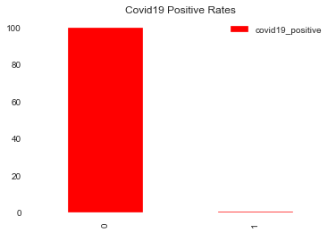


### Inspecting training set  for imbalance 


```python
y_train.value_counts()
```


    0    430814
    1       593
    Name: covid19_positive, dtype: int64


```python
y_test.value_counts()
```


    0    143605
    1       198
    Name: covid19_positive, dtype: int64


## Modeling:  

First Attempt: **Using 'vanilla' Decision Tree and SMOTE to address imbalances**

* Also using the parameter of class_weight='balanced' to address the large imbalance in classes.


```python
smote = SMOTE(random_state=123)
X_train_res, y_train_res = smote.fit_sample(X_train, y_train)
# Preview synthetic sample class distribution
print('-----------------------------------------')
print('Synthetic sample class distribution: \n')
print(pd.Series(y_train_res).value_counts()) 
```

    -----------------------------------------
    Synthetic sample class distribution: 
    
    1    430814
    0    430814
    dtype: int64
    

Using a 'balanced' class_weight to aleviate the very high imbalanced class weight 


```python
tree = DecisionTreeClassifier(class_weight='balanced')
tree.fit(X_train_res, y_train_res)
```


    DecisionTreeClassifier(ccp_alpha=0.0, class_weight='balanced', criterion='gini',
                           max_depth=None, max_features=None, max_leaf_nodes=None,
                           min_impurity_decrease=0.0, min_impurity_split=None,
                           min_samples_leaf=1, min_samples_split=2,
                           min_weight_fraction_leaf=0.0, presort='deprecated',
                           random_state=None, splitter='best')


```python
y_hat_test = tree.predict(X_test)
```


```python
fn.evaluate_model(X_test, y_test, y_hat_test, X_train_res, y_train_res, tree)
```


<div>
<style scoped>
    .dataframe tbody tr th:only-of-type {
        vertical-align: middle;
    }

    .dataframe tbody tr th {
        vertical-align: top;
    }

    .dataframe thead th {
        text-align: right;
    }
</style>
<table border="1" class="dataframe">
  <thead>
    <tr style="text-align: right;">
      <th></th>
      <th>precision</th>
      <th>recall</th>
      <th>f1-score</th>
      <th>support</th>
    </tr>
  </thead>
  <tbody>
    <tr>
      <th>0</th>
      <td>0.999</td>
      <td>0.998</td>
      <td>0.998</td>
      <td>143605.000</td>
    </tr>
    <tr>
      <th>1</th>
      <td>0.056</td>
      <td>0.076</td>
      <td>0.064</td>
      <td>198.000</td>
    </tr>
    <tr>
      <th>accuracy</th>
      <td>0.997</td>
      <td>0.997</td>
      <td>0.997</td>
      <td>0.997</td>
    </tr>
    <tr>
      <th>macro avg</th>
      <td>0.527</td>
      <td>0.537</td>
      <td>0.531</td>
      <td>143803.000</td>
    </tr>
    <tr>
      <th>weighted avg</th>
      <td>0.997</td>
      <td>0.997</td>
      <td>0.997</td>
      <td>143803.000</td>
    </tr>
  </tbody>
</table>
</div>


    ___________________________________________
    
    
    Training Accuracy :  0.9999988394063332
    Test Accuracy :  0.9969541664638429
    ___________________________________________
    


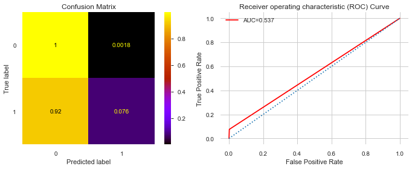


```python
importlib.reload(fn)
```

    2020-05-01 11:12:04.603798-07:00
    [i] Timer started at05/01/20 - 11:12 AM
    [i] Timer ended at 05/01/20 - 11:12 AM
    - Total time = 0:00:00.000996
    


    <module 'functions' from 'C:\\Users\\aosika\\flatiron-ds-course\\mod3_v21\\dsc-mod-3-project-v2-1-online-ds-pt-100719\\functions.py'>


```python
print(pd.Series(y_train_res).value_counts()) 
```

    1    430814
    0    430814
    dtype: int64
    


```python
y_test.value_counts()
```


    0    143605
    1       198
    Name: covid19_positive, dtype: int64


Looking at factors:


```python
fn.df_import(tree, X_train)
```


<style  type="text/css" >
    #T_43069b8a_8bd7_11ea_8ffc_54e1adf13a74row0_col1 {
            width:  10em;
             height:  80%;
            background:  linear-gradient(90deg,#d65f5f 100.0%, transparent 100.0%);
        }    #T_43069b8a_8bd7_11ea_8ffc_54e1adf13a74row1_col1 {
            width:  10em;
             height:  80%;
            background:  linear-gradient(90deg,#d65f5f 92.1%, transparent 92.1%);
        }    #T_43069b8a_8bd7_11ea_8ffc_54e1adf13a74row2_col1 {
            width:  10em;
             height:  80%;
            background:  linear-gradient(90deg,#d65f5f 10.5%, transparent 10.5%);
        }    #T_43069b8a_8bd7_11ea_8ffc_54e1adf13a74row3_col1 {
            width:  10em;
             height:  80%;
            background:  linear-gradient(90deg,#d65f5f 10.3%, transparent 10.3%);
        }    #T_43069b8a_8bd7_11ea_8ffc_54e1adf13a74row4_col1 {
            width:  10em;
             height:  80%;
            background:  linear-gradient(90deg,#d65f5f 7.5%, transparent 7.5%);
        }    #T_43069b8a_8bd7_11ea_8ffc_54e1adf13a74row5_col1 {
            width:  10em;
             height:  80%;
            background:  linear-gradient(90deg,#d65f5f 7.4%, transparent 7.4%);
        }    #T_43069b8a_8bd7_11ea_8ffc_54e1adf13a74row6_col1 {
            width:  10em;
             height:  80%;
            background:  linear-gradient(90deg,#d65f5f 6.8%, transparent 6.8%);
        }    #T_43069b8a_8bd7_11ea_8ffc_54e1adf13a74row7_col1 {
            width:  10em;
             height:  80%;
            background:  linear-gradient(90deg,#d65f5f 5.0%, transparent 5.0%);
        }    #T_43069b8a_8bd7_11ea_8ffc_54e1adf13a74row8_col1 {
            width:  10em;
             height:  80%;
            background:  linear-gradient(90deg,#d65f5f 4.3%, transparent 4.3%);
        }    #T_43069b8a_8bd7_11ea_8ffc_54e1adf13a74row9_col1 {
            width:  10em;
             height:  80%;
            background:  linear-gradient(90deg,#d65f5f 3.4%, transparent 3.4%);
        }    #T_43069b8a_8bd7_11ea_8ffc_54e1adf13a74row10_col1 {
            width:  10em;
             height:  80%;
            background:  linear-gradient(90deg,#d65f5f 2.9%, transparent 2.9%);
        }    #T_43069b8a_8bd7_11ea_8ffc_54e1adf13a74row11_col1 {
            width:  10em;
             height:  80%;
            background:  linear-gradient(90deg,#d65f5f 2.1%, transparent 2.1%);
        }    #T_43069b8a_8bd7_11ea_8ffc_54e1adf13a74row12_col1 {
            width:  10em;
             height:  80%;
            background:  linear-gradient(90deg,#d65f5f 1.7%, transparent 1.7%);
        }    #T_43069b8a_8bd7_11ea_8ffc_54e1adf13a74row13_col1 {
            width:  10em;
             height:  80%;
            background:  linear-gradient(90deg,#d65f5f 1.6%, transparent 1.6%);
        }    #T_43069b8a_8bd7_11ea_8ffc_54e1adf13a74row14_col1 {
            width:  10em;
             height:  80%;
            background:  linear-gradient(90deg,#d65f5f 1.2%, transparent 1.2%);
        }    #T_43069b8a_8bd7_11ea_8ffc_54e1adf13a74row15_col1 {
            width:  10em;
             height:  80%;
            background:  linear-gradient(90deg,#d65f5f 0.7%, transparent 0.7%);
        }    #T_43069b8a_8bd7_11ea_8ffc_54e1adf13a74row16_col1 {
            width:  10em;
             height:  80%;
            background:  linear-gradient(90deg,#d65f5f 0.6%, transparent 0.6%);
        }    #T_43069b8a_8bd7_11ea_8ffc_54e1adf13a74row17_col1 {
            width:  10em;
             height:  80%;
            background:  linear-gradient(90deg,#d65f5f 0.5%, transparent 0.5%);
        }    #T_43069b8a_8bd7_11ea_8ffc_54e1adf13a74row18_col1 {
            width:  10em;
             height:  80%;
            background:  linear-gradient(90deg,#d65f5f 0.4%, transparent 0.4%);
        }    #T_43069b8a_8bd7_11ea_8ffc_54e1adf13a74row19_col1 {
            width:  10em;
             height:  80%;
        }</style><table id="T_43069b8a_8bd7_11ea_8ffc_54e1adf13a74" ><thead>    <tr>        <th class="blank level0" ></th>        <th class="col_heading level0 col0" >factor</th>        <th class="col_heading level0 col1" >coef</th>    </tr></thead><tbody>
                <tr>
                        <th id="T_43069b8a_8bd7_11ea_8ffc_54e1adf13a74level0_row0" class="row_heading level0 row0" >0</th>
                        <td id="T_43069b8a_8bd7_11ea_8ffc_54e1adf13a74row0_col0" class="data row0 col0" >covid19_symptoms</td>
                        <td id="T_43069b8a_8bd7_11ea_8ffc_54e1adf13a74row0_col1" class="data row0 col1" >0.327107</td>
            </tr>
            <tr>
                        <th id="T_43069b8a_8bd7_11ea_8ffc_54e1adf13a74level0_row1" class="row_heading level0 row1" >1</th>
                        <td id="T_43069b8a_8bd7_11ea_8ffc_54e1adf13a74row1_col0" class="data row1 col0" >opinion_infection</td>
                        <td id="T_43069b8a_8bd7_11ea_8ffc_54e1adf13a74row1_col1" class="data row1 col1" >0.30172</td>
            </tr>
            <tr>
                        <th id="T_43069b8a_8bd7_11ea_8ffc_54e1adf13a74level0_row2" class="row_heading level0 row2" >2</th>
                        <td id="T_43069b8a_8bd7_11ea_8ffc_54e1adf13a74row2_col0" class="data row2 col0" >omwasnull</td>
                        <td id="T_43069b8a_8bd7_11ea_8ffc_54e1adf13a74row2_col1" class="data row2 col1" >0.0391222</td>
            </tr>
            <tr>
                        <th id="T_43069b8a_8bd7_11ea_8ffc_54e1adf13a74level0_row3" class="row_heading level0 row3" >3</th>
                        <td id="T_43069b8a_8bd7_11ea_8ffc_54e1adf13a74row3_col0" class="data row3 col0" >rate_reducing_risk_single</td>
                        <td id="T_43069b8a_8bd7_11ea_8ffc_54e1adf13a74row3_col1" class="data row3 col1" >0.0384364</td>
            </tr>
            <tr>
                        <th id="T_43069b8a_8bd7_11ea_8ffc_54e1adf13a74level0_row4" class="row_heading level0 row4" >4</th>
                        <td id="T_43069b8a_8bd7_11ea_8ffc_54e1adf13a74row4_col0" class="data row4 col0" >covid19_contact</td>
                        <td id="T_43069b8a_8bd7_11ea_8ffc_54e1adf13a74row4_col1" class="data row4 col1" >0.0295756</td>
            </tr>
            <tr>
                        <th id="T_43069b8a_8bd7_11ea_8ffc_54e1adf13a74level0_row5" class="row_heading level0 row5" >5</th>
                        <td id="T_43069b8a_8bd7_11ea_8ffc_54e1adf13a74row5_col0" class="data row5 col0" >oiwasnull</td>
                        <td id="T_43069b8a_8bd7_11ea_8ffc_54e1adf13a74row5_col1" class="data row5 col1" >0.0292837</td>
            </tr>
            <tr>
                        <th id="T_43069b8a_8bd7_11ea_8ffc_54e1adf13a74level0_row6" class="row_heading level0 row6" >6</th>
                        <td id="T_43069b8a_8bd7_11ea_8ffc_54e1adf13a74row6_col0" class="data row6 col0" >smoking_never</td>
                        <td id="T_43069b8a_8bd7_11ea_8ffc_54e1adf13a74row6_col1" class="data row6 col1" >0.0271513</td>
            </tr>
            <tr>
                        <th id="T_43069b8a_8bd7_11ea_8ffc_54e1adf13a74level0_row7" class="row_heading level0 row7" >7</th>
                        <td id="T_43069b8a_8bd7_11ea_8ffc_54e1adf13a74row7_col0" class="data row7 col0" >smoking_quit0</td>
                        <td id="T_43069b8a_8bd7_11ea_8ffc_54e1adf13a74row7_col1" class="data row7 col1" >0.0215438</td>
            </tr>
            <tr>
                        <th id="T_43069b8a_8bd7_11ea_8ffc_54e1adf13a74level0_row8" class="row_heading level0 row8" >8</th>
                        <td id="T_43069b8a_8bd7_11ea_8ffc_54e1adf13a74row8_col0" class="data row8 col0" >text_working_stopped</td>
                        <td id="T_43069b8a_8bd7_11ea_8ffc_54e1adf13a74row8_col1" class="data row8 col1" >0.0190445</td>
            </tr>
            <tr>
                        <th id="T_43069b8a_8bd7_11ea_8ffc_54e1adf13a74level0_row9" class="row_heading level0 row9" >9</th>
                        <td id="T_43069b8a_8bd7_11ea_8ffc_54e1adf13a74row9_col0" class="data row9 col0" >text_working_never</td>
                        <td id="T_43069b8a_8bd7_11ea_8ffc_54e1adf13a74row9_col1" class="data row9 col1" >0.0162669</td>
            </tr>
            <tr>
                        <th id="T_43069b8a_8bd7_11ea_8ffc_54e1adf13a74level0_row10" class="row_heading level0 row10" >10</th>
                        <td id="T_43069b8a_8bd7_11ea_8ffc_54e1adf13a74row10_col0" class="data row10 col0" >diabetes</td>
                        <td id="T_43069b8a_8bd7_11ea_8ffc_54e1adf13a74row10_col1" class="data row10 col1" >0.0148078</td>
            </tr>
            <tr>
                        <th id="T_43069b8a_8bd7_11ea_8ffc_54e1adf13a74level0_row11" class="row_heading level0 row11" >11</th>
                        <td id="T_43069b8a_8bd7_11ea_8ffc_54e1adf13a74row11_col0" class="data row11 col0" >blood_type_abp</td>
                        <td id="T_43069b8a_8bd7_11ea_8ffc_54e1adf13a74row11_col1" class="data row11 col1" >0.0119309</td>
            </tr>
            <tr>
                        <th id="T_43069b8a_8bd7_11ea_8ffc_54e1adf13a74level0_row12" class="row_heading level0 row12" >12</th>
                        <td id="T_43069b8a_8bd7_11ea_8ffc_54e1adf13a74row12_col0" class="data row12 col0" >text_working_travel critical</td>
                        <td id="T_43069b8a_8bd7_11ea_8ffc_54e1adf13a74row12_col1" class="data row12 col1" >0.0108365</td>
            </tr>
            <tr>
                        <th id="T_43069b8a_8bd7_11ea_8ffc_54e1adf13a74level0_row13" class="row_heading level0 row13" >13</th>
                        <td id="T_43069b8a_8bd7_11ea_8ffc_54e1adf13a74row13_col0" class="data row13 col0" >rate_reducing_risk_house</td>
                        <td id="T_43069b8a_8bd7_11ea_8ffc_54e1adf13a74row13_col1" class="data row13 col1" >0.0105881</td>
            </tr>
            <tr>
                        <th id="T_43069b8a_8bd7_11ea_8ffc_54e1adf13a74level0_row14" class="row_heading level0 row14" >14</th>
                        <td id="T_43069b8a_8bd7_11ea_8ffc_54e1adf13a74row14_col0" class="data row14 col0" >blood_type_unknown</td>
                        <td id="T_43069b8a_8bd7_11ea_8ffc_54e1adf13a74row14_col1" class="data row14 col1" >0.00928629</td>
            </tr>
            <tr>
                        <th id="T_43069b8a_8bd7_11ea_8ffc_54e1adf13a74level0_row15" class="row_heading level0 row15" >15</th>
                        <td id="T_43069b8a_8bd7_11ea_8ffc_54e1adf13a74row15_col0" class="data row15 col0" >country_US</td>
                        <td id="T_43069b8a_8bd7_11ea_8ffc_54e1adf13a74row15_col1" class="data row15 col1" >0.00762076</td>
            </tr>
            <tr>
                        <th id="T_43069b8a_8bd7_11ea_8ffc_54e1adf13a74level0_row16" class="row_heading level0 row16" >16</th>
                        <td id="T_43069b8a_8bd7_11ea_8ffc_54e1adf13a74row16_col0" class="data row16 col0" >rate_government_action</td>
                        <td id="T_43069b8a_8bd7_11ea_8ffc_54e1adf13a74row16_col1" class="data row16 col1" >0.00710535</td>
            </tr>
            <tr>
                        <th id="T_43069b8a_8bd7_11ea_8ffc_54e1adf13a74level0_row17" class="row_heading level0 row17" >17</th>
                        <td id="T_43069b8a_8bd7_11ea_8ffc_54e1adf13a74row17_col0" class="data row17 col0" >country_GB</td>
                        <td id="T_43069b8a_8bd7_11ea_8ffc_54e1adf13a74row17_col1" class="data row17 col1" >0.00706286</td>
            </tr>
            <tr>
                        <th id="T_43069b8a_8bd7_11ea_8ffc_54e1adf13a74level0_row18" class="row_heading level0 row18" >18</th>
                        <td id="T_43069b8a_8bd7_11ea_8ffc_54e1adf13a74row18_col0" class="data row18 col0" >text_working_home</td>
                        <td id="T_43069b8a_8bd7_11ea_8ffc_54e1adf13a74row18_col1" class="data row18 col1" >0.00667544</td>
            </tr>
            <tr>
                        <th id="T_43069b8a_8bd7_11ea_8ffc_54e1adf13a74level0_row19" class="row_heading level0 row19" >19</th>
                        <td id="T_43069b8a_8bd7_11ea_8ffc_54e1adf13a74row19_col0" class="data row19 col0" >blood_type_bp</td>
                        <td id="T_43069b8a_8bd7_11ea_8ffc_54e1adf13a74row19_col1" class="data row19 col1" >0.00533391</td>
            </tr>
    </tbody></table>


#### Observations for first vanilla DecisionTree Classifier using SMOTE:

> This model out of the box trained very poorly.  It is obviously overtrained and the recall and precision for true positives leave much to be desired with a recall of ~.11

Recording top factors: 


1. covid19_symptoms	0.327107
2.	opinion_infection	0.301703
-	oiwasnull	0.039126
-	rate_reducing_risk_single	0.038522
-	covid19_contact	0.029836
-	omwasnull	0.029283
-	smoking_never	0.026795
-	smoking_quit0	0.021534
-	text_working_stopped	0.019059
-	text_working_never	0.016270
-	diabetes	0.014808
-	blood_type_abp	0.011600
-	text_working_travel critical	0.010846
-	rate_reducing_risk_house	0.010533
-	blood_type_unknown	0.008998
-	country_US	0.008763
-	country_GB	0.007063
-	rate_government_action	0.007048
-	text_working_home	0.006663
	blood_type_bp	0.005332

​


```python

```


```python

#df_import_tree = pd.Series(tree.feature_importances_, index=X_train.columns, name='importance').head(20)
# df_import_tree.sort_values().plot(kind='barh', figsize=(15,12))
```


```python

```


```python
importlib.reload(fn)
```

    2020-05-01 11:12:04.730651-07:00
    [i] Timer started at05/01/20 - 11:12 AM
    [i] Timer ended at 05/01/20 - 11:12 AM
    - Total time = 0:00:00.000997
    


    <module 'functions' from 'C:\\Users\\aosika\\flatiron-ds-course\\mod3_v21\\dsc-mod-3-project-v2-1-online-ds-pt-100719\\functions.py'>


```python

```

#### using UnderSampling


```python
from imblearn.under_sampling import RandomUnderSampler
rus = RandomUnderSampler(random_state=123)
```


```python
X_train_rus, y_train_rus = rus.fit_sample(X_train, y_train)

```


```python
clf = DecisionTreeClassifier(class_weight='balanced', random_state=123)
clf.fit(X_train_rus, y_train_rus)
```


    DecisionTreeClassifier(ccp_alpha=0.0, class_weight='balanced', criterion='gini',
                           max_depth=None, max_features=None, max_leaf_nodes=None,
                           min_impurity_decrease=0.0, min_impurity_split=None,
                           min_samples_leaf=1, min_samples_split=2,
                           min_weight_fraction_leaf=0.0, presort='deprecated',
                           random_state=123, splitter='best')


```python
y_hat_test1 = clf.predict(X_test)

```


```python
fn.evaluate_model(X_test, y_test, y_hat_test1, X_train_rus, y_train_rus, clf)
```


<div>
<style scoped>
    .dataframe tbody tr th:only-of-type {
        vertical-align: middle;
    }

    .dataframe tbody tr th {
        vertical-align: top;
    }

    .dataframe thead th {
        text-align: right;
    }
</style>
<table border="1" class="dataframe">
  <thead>
    <tr style="text-align: right;">
      <th></th>
      <th>precision</th>
      <th>recall</th>
      <th>f1-score</th>
      <th>support</th>
    </tr>
  </thead>
  <tbody>
    <tr>
      <th>0</th>
      <td>1.000</td>
      <td>0.725</td>
      <td>0.841</td>
      <td>143605.000</td>
    </tr>
    <tr>
      <th>1</th>
      <td>0.004</td>
      <td>0.773</td>
      <td>0.008</td>
      <td>198.000</td>
    </tr>
    <tr>
      <th>accuracy</th>
      <td>0.725</td>
      <td>0.725</td>
      <td>0.725</td>
      <td>0.725</td>
    </tr>
    <tr>
      <th>macro avg</th>
      <td>0.502</td>
      <td>0.749</td>
      <td>0.424</td>
      <td>143803.000</td>
    </tr>
    <tr>
      <th>weighted avg</th>
      <td>0.998</td>
      <td>0.725</td>
      <td>0.839</td>
      <td>143803.000</td>
    </tr>
  </tbody>
</table>
</div>


    ___________________________________________
    
    
    Training Accuracy :  1.0
    Test Accuracy :  0.7253812507388581
    ___________________________________________
    


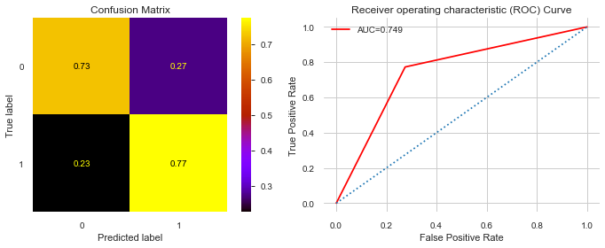


```python
importlib.reload(fn)
```

    2020-05-01 11:12:28.287923-07:00
    [i] Timer started at05/01/20 - 11:12 AM
    [i] Timer ended at 05/01/20 - 11:12 AM
    - Total time = 0:00:00.000997
    


    <module 'functions' from 'C:\\Users\\aosika\\flatiron-ds-course\\mod3_v21\\dsc-mod-3-project-v2-1-online-ds-pt-100719\\functions.py'>


```python
# df_import_clf = pd.Series(clf.feature_importances_, index=X_train.columns, name='importance').head(20)
# df_import_clf.sort_values().plot(kind='barh', figsize=(15,12))
```


```python
fn.df_import(clf, X_train)
```


<style  type="text/css" >
    #T_5120570c_8bd7_11ea_8b9a_54e1adf13a74row0_col1 {
            width:  10em;
             height:  80%;
            background:  linear-gradient(90deg,#d65f5f 100.0%, transparent 100.0%);
        }    #T_5120570c_8bd7_11ea_8b9a_54e1adf13a74row1_col1 {
            width:  10em;
             height:  80%;
            background:  linear-gradient(90deg,#d65f5f 56.9%, transparent 56.9%);
        }    #T_5120570c_8bd7_11ea_8b9a_54e1adf13a74row2_col1 {
            width:  10em;
             height:  80%;
            background:  linear-gradient(90deg,#d65f5f 13.9%, transparent 13.9%);
        }    #T_5120570c_8bd7_11ea_8b9a_54e1adf13a74row3_col1 {
            width:  10em;
             height:  80%;
            background:  linear-gradient(90deg,#d65f5f 13.0%, transparent 13.0%);
        }    #T_5120570c_8bd7_11ea_8b9a_54e1adf13a74row4_col1 {
            width:  10em;
             height:  80%;
            background:  linear-gradient(90deg,#d65f5f 12.4%, transparent 12.4%);
        }    #T_5120570c_8bd7_11ea_8b9a_54e1adf13a74row5_col1 {
            width:  10em;
             height:  80%;
            background:  linear-gradient(90deg,#d65f5f 10.0%, transparent 10.0%);
        }    #T_5120570c_8bd7_11ea_8b9a_54e1adf13a74row6_col1 {
            width:  10em;
             height:  80%;
            background:  linear-gradient(90deg,#d65f5f 9.0%, transparent 9.0%);
        }    #T_5120570c_8bd7_11ea_8b9a_54e1adf13a74row7_col1 {
            width:  10em;
             height:  80%;
            background:  linear-gradient(90deg,#d65f5f 7.1%, transparent 7.1%);
        }    #T_5120570c_8bd7_11ea_8b9a_54e1adf13a74row8_col1 {
            width:  10em;
             height:  80%;
            background:  linear-gradient(90deg,#d65f5f 5.9%, transparent 5.9%);
        }    #T_5120570c_8bd7_11ea_8b9a_54e1adf13a74row9_col1 {
            width:  10em;
             height:  80%;
            background:  linear-gradient(90deg,#d65f5f 5.6%, transparent 5.6%);
        }    #T_5120570c_8bd7_11ea_8b9a_54e1adf13a74row10_col1 {
            width:  10em;
             height:  80%;
            background:  linear-gradient(90deg,#d65f5f 5.1%, transparent 5.1%);
        }    #T_5120570c_8bd7_11ea_8b9a_54e1adf13a74row11_col1 {
            width:  10em;
             height:  80%;
            background:  linear-gradient(90deg,#d65f5f 4.2%, transparent 4.2%);
        }    #T_5120570c_8bd7_11ea_8b9a_54e1adf13a74row12_col1 {
            width:  10em;
             height:  80%;
            background:  linear-gradient(90deg,#d65f5f 4.0%, transparent 4.0%);
        }    #T_5120570c_8bd7_11ea_8b9a_54e1adf13a74row13_col1 {
            width:  10em;
             height:  80%;
            background:  linear-gradient(90deg,#d65f5f 3.6%, transparent 3.6%);
        }    #T_5120570c_8bd7_11ea_8b9a_54e1adf13a74row14_col1 {
            width:  10em;
             height:  80%;
            background:  linear-gradient(90deg,#d65f5f 1.7%, transparent 1.7%);
        }    #T_5120570c_8bd7_11ea_8b9a_54e1adf13a74row15_col1 {
            width:  10em;
             height:  80%;
            background:  linear-gradient(90deg,#d65f5f 1.6%, transparent 1.6%);
        }    #T_5120570c_8bd7_11ea_8b9a_54e1adf13a74row16_col1 {
            width:  10em;
             height:  80%;
            background:  linear-gradient(90deg,#d65f5f 1.3%, transparent 1.3%);
        }    #T_5120570c_8bd7_11ea_8b9a_54e1adf13a74row17_col1 {
            width:  10em;
             height:  80%;
            background:  linear-gradient(90deg,#d65f5f 0.4%, transparent 0.4%);
        }    #T_5120570c_8bd7_11ea_8b9a_54e1adf13a74row18_col1 {
            width:  10em;
             height:  80%;
            background:  linear-gradient(90deg,#d65f5f 0.4%, transparent 0.4%);
        }    #T_5120570c_8bd7_11ea_8b9a_54e1adf13a74row19_col1 {
            width:  10em;
             height:  80%;
        }</style><table id="T_5120570c_8bd7_11ea_8b9a_54e1adf13a74" ><thead>    <tr>        <th class="blank level0" ></th>        <th class="col_heading level0 col0" >factor</th>        <th class="col_heading level0 col1" >coef</th>    </tr></thead><tbody>
                <tr>
                        <th id="T_5120570c_8bd7_11ea_8b9a_54e1adf13a74level0_row0" class="row_heading level0 row0" >0</th>
                        <td id="T_5120570c_8bd7_11ea_8b9a_54e1adf13a74row0_col0" class="data row0 col0" >opinion_infection</td>
                        <td id="T_5120570c_8bd7_11ea_8b9a_54e1adf13a74row0_col1" class="data row0 col1" >0.273447</td>
            </tr>
            <tr>
                        <th id="T_5120570c_8bd7_11ea_8b9a_54e1adf13a74level0_row1" class="row_heading level0 row1" >1</th>
                        <td id="T_5120570c_8bd7_11ea_8b9a_54e1adf13a74row1_col0" class="data row1 col0" >covid19_symptoms</td>
                        <td id="T_5120570c_8bd7_11ea_8b9a_54e1adf13a74row1_col1" class="data row1 col1" >0.159422</td>
            </tr>
            <tr>
                        <th id="T_5120570c_8bd7_11ea_8b9a_54e1adf13a74level0_row2" class="row_heading level0 row2" >2</th>
                        <td id="T_5120570c_8bd7_11ea_8b9a_54e1adf13a74row2_col0" class="data row2 col0" >bmi</td>
                        <td id="T_5120570c_8bd7_11ea_8b9a_54e1adf13a74row2_col1" class="data row2 col1" >0.0456143</td>
            </tr>
            <tr>
                        <th id="T_5120570c_8bd7_11ea_8b9a_54e1adf13a74level0_row3" class="row_heading level0 row3" >3</th>
                        <td id="T_5120570c_8bd7_11ea_8b9a_54e1adf13a74row3_col0" class="data row3 col0" >alcohol</td>
                        <td id="T_5120570c_8bd7_11ea_8b9a_54e1adf13a74row3_col1" class="data row3 col1" >0.0432441</td>
            </tr>
            <tr>
                        <th id="T_5120570c_8bd7_11ea_8b9a_54e1adf13a74level0_row4" class="row_heading level0 row4" >4</th>
                        <td id="T_5120570c_8bd7_11ea_8b9a_54e1adf13a74row4_col0" class="data row4 col0" >contacts_count</td>
                        <td id="T_5120570c_8bd7_11ea_8b9a_54e1adf13a74row4_col1" class="data row4 col1" >0.0416336</td>
            </tr>
            <tr>
                        <th id="T_5120570c_8bd7_11ea_8b9a_54e1adf13a74level0_row5" class="row_heading level0 row5" >5</th>
                        <td id="T_5120570c_8bd7_11ea_8b9a_54e1adf13a74row5_col0" class="data row5 col0" >weight</td>
                        <td id="T_5120570c_8bd7_11ea_8b9a_54e1adf13a74row5_col1" class="data row5 col1" >0.0353858</td>
            </tr>
            <tr>
                        <th id="T_5120570c_8bd7_11ea_8b9a_54e1adf13a74level0_row6" class="row_heading level0 row6" >6</th>
                        <td id="T_5120570c_8bd7_11ea_8b9a_54e1adf13a74row6_col0" class="data row6 col0" >height</td>
                        <td id="T_5120570c_8bd7_11ea_8b9a_54e1adf13a74row6_col1" class="data row6 col1" >0.0327729</td>
            </tr>
            <tr>
                        <th id="T_5120570c_8bd7_11ea_8b9a_54e1adf13a74level0_row7" class="row_heading level0 row7" >7</th>
                        <td id="T_5120570c_8bd7_11ea_8b9a_54e1adf13a74row7_col0" class="data row7 col0" >oiwasnull</td>
                        <td id="T_5120570c_8bd7_11ea_8b9a_54e1adf13a74row7_col1" class="data row7 col1" >0.0276148</td>
            </tr>
            <tr>
                        <th id="T_5120570c_8bd7_11ea_8b9a_54e1adf13a74level0_row8" class="row_heading level0 row8" >8</th>
                        <td id="T_5120570c_8bd7_11ea_8b9a_54e1adf13a74row8_col0" class="data row8 col0" >opinion_mortality</td>
                        <td id="T_5120570c_8bd7_11ea_8b9a_54e1adf13a74row8_col1" class="data row8 col1" >0.0245959</td>
            </tr>
            <tr>
                        <th id="T_5120570c_8bd7_11ea_8b9a_54e1adf13a74level0_row9" class="row_heading level0 row9" >9</th>
                        <td id="T_5120570c_8bd7_11ea_8b9a_54e1adf13a74row9_col0" class="data row9 col0" >age</td>
                        <td id="T_5120570c_8bd7_11ea_8b9a_54e1adf13a74row9_col1" class="data row9 col1" >0.0236773</td>
            </tr>
            <tr>
                        <th id="T_5120570c_8bd7_11ea_8b9a_54e1adf13a74level0_row10" class="row_heading level0 row10" >10</th>
                        <td id="T_5120570c_8bd7_11ea_8b9a_54e1adf13a74row10_col0" class="data row10 col0" >rate_reducing_risk_single</td>
                        <td id="T_5120570c_8bd7_11ea_8b9a_54e1adf13a74row10_col1" class="data row10 col1" >0.0222561</td>
            </tr>
            <tr>
                        <th id="T_5120570c_8bd7_11ea_8b9a_54e1adf13a74level0_row11" class="row_heading level0 row11" >11</th>
                        <td id="T_5120570c_8bd7_11ea_8b9a_54e1adf13a74row11_col0" class="data row11 col0" >rate_government_action</td>
                        <td id="T_5120570c_8bd7_11ea_8b9a_54e1adf13a74row11_col1" class="data row11 col1" >0.0199732</td>
            </tr>
            <tr>
                        <th id="T_5120570c_8bd7_11ea_8b9a_54e1adf13a74level0_row12" class="row_heading level0 row12" >12</th>
                        <td id="T_5120570c_8bd7_11ea_8b9a_54e1adf13a74row12_col0" class="data row12 col0" >house_count</td>
                        <td id="T_5120570c_8bd7_11ea_8b9a_54e1adf13a74row12_col1" class="data row12 col1" >0.0195764</td>
            </tr>
            <tr>
                        <th id="T_5120570c_8bd7_11ea_8b9a_54e1adf13a74level0_row13" class="row_heading level0 row13" >13</th>
                        <td id="T_5120570c_8bd7_11ea_8b9a_54e1adf13a74row13_col0" class="data row13 col0" >covid19_contact</td>
                        <td id="T_5120570c_8bd7_11ea_8b9a_54e1adf13a74row13_col1" class="data row13 col1" >0.0182709</td>
            </tr>
            <tr>
                        <th id="T_5120570c_8bd7_11ea_8b9a_54e1adf13a74level0_row14" class="row_heading level0 row14" >14</th>
                        <td id="T_5120570c_8bd7_11ea_8b9a_54e1adf13a74row14_col0" class="data row14 col0" >blood_type_unknown</td>
                        <td id="T_5120570c_8bd7_11ea_8b9a_54e1adf13a74row14_col1" class="data row14 col1" >0.0132766</td>
            </tr>
            <tr>
                        <th id="T_5120570c_8bd7_11ea_8b9a_54e1adf13a74level0_row15" class="row_heading level0 row15" >15</th>
                        <td id="T_5120570c_8bd7_11ea_8b9a_54e1adf13a74row15_col0" class="data row15 col0" >amphetamines</td>
                        <td id="T_5120570c_8bd7_11ea_8b9a_54e1adf13a74row15_col1" class="data row15 col1" >0.0129728</td>
            </tr>
            <tr>
                        <th id="T_5120570c_8bd7_11ea_8b9a_54e1adf13a74level0_row16" class="row_heading level0 row16" >16</th>
                        <td id="T_5120570c_8bd7_11ea_8b9a_54e1adf13a74row16_col0" class="data row16 col0" >rate_reducing_mask</td>
                        <td id="T_5120570c_8bd7_11ea_8b9a_54e1adf13a74row16_col1" class="data row16 col1" >0.012251</td>
            </tr>
            <tr>
                        <th id="T_5120570c_8bd7_11ea_8b9a_54e1adf13a74level0_row17" class="row_heading level0 row17" >17</th>
                        <td id="T_5120570c_8bd7_11ea_8b9a_54e1adf13a74row17_col0" class="data row17 col0" >hypertension</td>
                        <td id="T_5120570c_8bd7_11ea_8b9a_54e1adf13a74row17_col1" class="data row17 col1" >0.0100174</td>
            </tr>
            <tr>
                        <th id="T_5120570c_8bd7_11ea_8b9a_54e1adf13a74level0_row18" class="row_heading level0 row18" >18</th>
                        <td id="T_5120570c_8bd7_11ea_8b9a_54e1adf13a74row18_col0" class="data row18 col0" >sex_male</td>
                        <td id="T_5120570c_8bd7_11ea_8b9a_54e1adf13a74row18_col1" class="data row18 col1" >0.00990988</td>
            </tr>
            <tr>
                        <th id="T_5120570c_8bd7_11ea_8b9a_54e1adf13a74level0_row19" class="row_heading level0 row19" >19</th>
                        <td id="T_5120570c_8bd7_11ea_8b9a_54e1adf13a74row19_col0" class="data row19 col0" >text_working_never</td>
                        <td id="T_5120570c_8bd7_11ea_8b9a_54e1adf13a74row19_col1" class="data row19 col1" >0.00886926</td>
            </tr>
    </tbody></table>


#### Observations:
> This model was overfit with 100% accuracy on training data and 73% on testing data.  Two sampling methods were attemped - Random Underdampling RUS) and SMOTE.  The best sampling method in terms of performance appears to be SMOTE despite improved recall scores using RUS.   

**Recording top factors:**
1.	opinion_infection	0.273447
2.	covid19_symptoms	0.159422
3.	bmi	0.045614
4.	alcohol	0.043244
5.	contacts_count	0.041634
6.	weight	0.035386
7.	height	0.032773
8.	oiwasnull	0.027615
9.	opinion_mortality	0.024596
10.	age	0.023677
11.	rate_reducing_risk_single	0.022256
12.	rate_government_action	0.019973
13.	house_count	0.019576
14.	covid19_contact	0.018271
15.	blood_type_unknown	0.013277
16.	amphetamines	0.012973
17.	rate_reducing_mask	0.012251
18.	hypertension	0.010017
19.	sex_male	0.00991
20.	text_working_never	0.008869


#### Manually hypertuning random undersampling:


```python
clf_rus1 = DecisionTreeClassifier(criterion='entropy', max_depth=4, max_features=.2,class_weight='balanced',random_state=123)
clf_rus1.fit(X_train_rus, y_train_rus)
```


    DecisionTreeClassifier(ccp_alpha=0.0, class_weight='balanced',
                           criterion='entropy', max_depth=4, max_features=0.2,
                           max_leaf_nodes=None, min_impurity_decrease=0.0,
                           min_impurity_split=None, min_samples_leaf=1,
                           min_samples_split=2, min_weight_fraction_leaf=0.0,
                           presort='deprecated', random_state=123, splitter='best')


```python
yhrus = clf_rus1.predict(X_test)
```


```python
fn.evaluate_model(X_test, y_test, yhrus, X_train_rus, y_train_rus, clf_rus1)
```


<div>
<style scoped>
    .dataframe tbody tr th:only-of-type {
        vertical-align: middle;
    }

    .dataframe tbody tr th {
        vertical-align: top;
    }

    .dataframe thead th {
        text-align: right;
    }
</style>
<table border="1" class="dataframe">
  <thead>
    <tr style="text-align: right;">
      <th></th>
      <th>precision</th>
      <th>recall</th>
      <th>f1-score</th>
      <th>support</th>
    </tr>
  </thead>
  <tbody>
    <tr>
      <th>0</th>
      <td>0.999</td>
      <td>0.949</td>
      <td>0.974</td>
      <td>143605.000</td>
    </tr>
    <tr>
      <th>1</th>
      <td>0.015</td>
      <td>0.551</td>
      <td>0.029</td>
      <td>198.000</td>
    </tr>
    <tr>
      <th>accuracy</th>
      <td>0.949</td>
      <td>0.949</td>
      <td>0.949</td>
      <td>0.949</td>
    </tr>
    <tr>
      <th>macro avg</th>
      <td>0.507</td>
      <td>0.750</td>
      <td>0.501</td>
      <td>143803.000</td>
    </tr>
    <tr>
      <th>weighted avg</th>
      <td>0.998</td>
      <td>0.949</td>
      <td>0.972</td>
      <td>143803.000</td>
    </tr>
  </tbody>
</table>
</div>


    ___________________________________________
    
    
    Training Accuracy :  0.7462057335581788
    Test Accuracy :  0.9487284688080221
    ___________________________________________
    


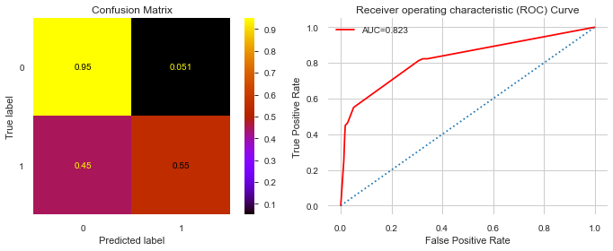


```python
fn.df_import(clf_rus1, X_train)
```


<style  type="text/css" >
    #T_10ff15b8_8be1_11ea_9132_54e1adf13a74row0_col1 {
            width:  10em;
             height:  80%;
            background:  linear-gradient(90deg,#d65f5f 100.0%, transparent 100.0%);
        }    #T_10ff15b8_8be1_11ea_9132_54e1adf13a74row1_col1 {
            width:  10em;
             height:  80%;
            background:  linear-gradient(90deg,#d65f5f 44.6%, transparent 44.6%);
        }    #T_10ff15b8_8be1_11ea_9132_54e1adf13a74row2_col1 {
            width:  10em;
             height:  80%;
            background:  linear-gradient(90deg,#d65f5f 35.1%, transparent 35.1%);
        }    #T_10ff15b8_8be1_11ea_9132_54e1adf13a74row3_col1 {
            width:  10em;
             height:  80%;
            background:  linear-gradient(90deg,#d65f5f 6.1%, transparent 6.1%);
        }    #T_10ff15b8_8be1_11ea_9132_54e1adf13a74row4_col1 {
            width:  10em;
             height:  80%;
            background:  linear-gradient(90deg,#d65f5f 4.8%, transparent 4.8%);
        }    #T_10ff15b8_8be1_11ea_9132_54e1adf13a74row5_col1 {
            width:  10em;
             height:  80%;
            background:  linear-gradient(90deg,#d65f5f 4.0%, transparent 4.0%);
        }    #T_10ff15b8_8be1_11ea_9132_54e1adf13a74row6_col1 {
            width:  10em;
             height:  80%;
            background:  linear-gradient(90deg,#d65f5f 3.7%, transparent 3.7%);
        }    #T_10ff15b8_8be1_11ea_9132_54e1adf13a74row7_col1 {
            width:  10em;
             height:  80%;
            background:  linear-gradient(90deg,#d65f5f 3.5%, transparent 3.5%);
        }    #T_10ff15b8_8be1_11ea_9132_54e1adf13a74row8_col1 {
            width:  10em;
             height:  80%;
            background:  linear-gradient(90deg,#d65f5f 2.9%, transparent 2.9%);
        }    #T_10ff15b8_8be1_11ea_9132_54e1adf13a74row9_col1 {
            width:  10em;
             height:  80%;
            background:  linear-gradient(90deg,#d65f5f 2.4%, transparent 2.4%);
        }    #T_10ff15b8_8be1_11ea_9132_54e1adf13a74row10_col1 {
            width:  10em;
             height:  80%;
            background:  linear-gradient(90deg,#d65f5f 1.6%, transparent 1.6%);
        }    #T_10ff15b8_8be1_11ea_9132_54e1adf13a74row11_col1 {
            width:  10em;
             height:  80%;
            background:  linear-gradient(90deg,#d65f5f 0.4%, transparent 0.4%);
        }    #T_10ff15b8_8be1_11ea_9132_54e1adf13a74row12_col1 {
            width:  10em;
             height:  80%;
        }    #T_10ff15b8_8be1_11ea_9132_54e1adf13a74row13_col1 {
            width:  10em;
             height:  80%;
        }    #T_10ff15b8_8be1_11ea_9132_54e1adf13a74row14_col1 {
            width:  10em;
             height:  80%;
        }    #T_10ff15b8_8be1_11ea_9132_54e1adf13a74row15_col1 {
            width:  10em;
             height:  80%;
        }    #T_10ff15b8_8be1_11ea_9132_54e1adf13a74row16_col1 {
            width:  10em;
             height:  80%;
        }    #T_10ff15b8_8be1_11ea_9132_54e1adf13a74row17_col1 {
            width:  10em;
             height:  80%;
        }    #T_10ff15b8_8be1_11ea_9132_54e1adf13a74row18_col1 {
            width:  10em;
             height:  80%;
        }    #T_10ff15b8_8be1_11ea_9132_54e1adf13a74row19_col1 {
            width:  10em;
             height:  80%;
        }</style><table id="T_10ff15b8_8be1_11ea_9132_54e1adf13a74" ><thead>    <tr>        <th class="blank level0" ></th>        <th class="col_heading level0 col0" >factor</th>        <th class="col_heading level0 col1" >coef</th>    </tr></thead><tbody>
                <tr>
                        <th id="T_10ff15b8_8be1_11ea_9132_54e1adf13a74level0_row0" class="row_heading level0 row0" >0</th>
                        <td id="T_10ff15b8_8be1_11ea_9132_54e1adf13a74row0_col0" class="data row0 col0" >opinion_infection</td>
                        <td id="T_10ff15b8_8be1_11ea_9132_54e1adf13a74row0_col1" class="data row0 col1" >0.478567</td>
            </tr>
            <tr>
                        <th id="T_10ff15b8_8be1_11ea_9132_54e1adf13a74level0_row1" class="row_heading level0 row1" >1</th>
                        <td id="T_10ff15b8_8be1_11ea_9132_54e1adf13a74row1_col0" class="data row1 col0" >covid19_symptoms</td>
                        <td id="T_10ff15b8_8be1_11ea_9132_54e1adf13a74row1_col1" class="data row1 col1" >0.213205</td>
            </tr>
            <tr>
                        <th id="T_10ff15b8_8be1_11ea_9132_54e1adf13a74level0_row2" class="row_heading level0 row2" >2</th>
                        <td id="T_10ff15b8_8be1_11ea_9132_54e1adf13a74row2_col0" class="data row2 col0" >covid19_contact</td>
                        <td id="T_10ff15b8_8be1_11ea_9132_54e1adf13a74row2_col1" class="data row2 col1" >0.167814</td>
            </tr>
            <tr>
                        <th id="T_10ff15b8_8be1_11ea_9132_54e1adf13a74level0_row3" class="row_heading level0 row3" >3</th>
                        <td id="T_10ff15b8_8be1_11ea_9132_54e1adf13a74row3_col0" class="data row3 col0" >rate_reducing_risk_single</td>
                        <td id="T_10ff15b8_8be1_11ea_9132_54e1adf13a74row3_col1" class="data row3 col1" >0.029181</td>
            </tr>
            <tr>
                        <th id="T_10ff15b8_8be1_11ea_9132_54e1adf13a74level0_row4" class="row_heading level0 row4" >4</th>
                        <td id="T_10ff15b8_8be1_11ea_9132_54e1adf13a74row4_col0" class="data row4 col0" >sex_female</td>
                        <td id="T_10ff15b8_8be1_11ea_9132_54e1adf13a74row4_col1" class="data row4 col1" >0.0228217</td>
            </tr>
            <tr>
                        <th id="T_10ff15b8_8be1_11ea_9132_54e1adf13a74level0_row5" class="row_heading level0 row5" >5</th>
                        <td id="T_10ff15b8_8be1_11ea_9132_54e1adf13a74row5_col0" class="data row5 col0" >text_working_travel non critical</td>
                        <td id="T_10ff15b8_8be1_11ea_9132_54e1adf13a74row5_col1" class="data row5 col1" >0.0189586</td>
            </tr>
            <tr>
                        <th id="T_10ff15b8_8be1_11ea_9132_54e1adf13a74level0_row6" class="row_heading level0 row6" >6</th>
                        <td id="T_10ff15b8_8be1_11ea_9132_54e1adf13a74row6_col0" class="data row6 col0" >weight</td>
                        <td id="T_10ff15b8_8be1_11ea_9132_54e1adf13a74row6_col1" class="data row6 col1" >0.0175211</td>
            </tr>
            <tr>
                        <th id="T_10ff15b8_8be1_11ea_9132_54e1adf13a74level0_row7" class="row_heading level0 row7" >7</th>
                        <td id="T_10ff15b8_8be1_11ea_9132_54e1adf13a74row7_col0" class="data row7 col0" >bmi</td>
                        <td id="T_10ff15b8_8be1_11ea_9132_54e1adf13a74row7_col1" class="data row7 col1" >0.0169592</td>
            </tr>
            <tr>
                        <th id="T_10ff15b8_8be1_11ea_9132_54e1adf13a74level0_row8" class="row_heading level0 row8" >8</th>
                        <td id="T_10ff15b8_8be1_11ea_9132_54e1adf13a74row8_col0" class="data row8 col0" >amphetamines</td>
                        <td id="T_10ff15b8_8be1_11ea_9132_54e1adf13a74row8_col1" class="data row8 col1" >0.0136753</td>
            </tr>
            <tr>
                        <th id="T_10ff15b8_8be1_11ea_9132_54e1adf13a74level0_row9" class="row_heading level0 row9" >9</th>
                        <td id="T_10ff15b8_8be1_11ea_9132_54e1adf13a74row9_col0" class="data row9 col0" >other_chronic</td>
                        <td id="T_10ff15b8_8be1_11ea_9132_54e1adf13a74row9_col1" class="data row9 col1" >0.0115824</td>
            </tr>
            <tr>
                        <th id="T_10ff15b8_8be1_11ea_9132_54e1adf13a74level0_row10" class="row_heading level0 row10" >10</th>
                        <td id="T_10ff15b8_8be1_11ea_9132_54e1adf13a74row10_col0" class="data row10 col0" >cannabis</td>
                        <td id="T_10ff15b8_8be1_11ea_9132_54e1adf13a74row10_col1" class="data row10 col1" >0.00779047</td>
            </tr>
            <tr>
                        <th id="T_10ff15b8_8be1_11ea_9132_54e1adf13a74level0_row11" class="row_heading level0 row11" >11</th>
                        <td id="T_10ff15b8_8be1_11ea_9132_54e1adf13a74row11_col0" class="data row11 col0" >smoking_never</td>
                        <td id="T_10ff15b8_8be1_11ea_9132_54e1adf13a74row11_col1" class="data row11 col1" >0.00192486</td>
            </tr>
            <tr>
                        <th id="T_10ff15b8_8be1_11ea_9132_54e1adf13a74level0_row12" class="row_heading level0 row12" >12</th>
                        <td id="T_10ff15b8_8be1_11ea_9132_54e1adf13a74row12_col0" class="data row12 col0" >country_PE</td>
                        <td id="T_10ff15b8_8be1_11ea_9132_54e1adf13a74row12_col1" class="data row12 col1" >0</td>
            </tr>
            <tr>
                        <th id="T_10ff15b8_8be1_11ea_9132_54e1adf13a74level0_row13" class="row_heading level0 row13" >13</th>
                        <td id="T_10ff15b8_8be1_11ea_9132_54e1adf13a74row13_col0" class="data row13 col0" >country_PG</td>
                        <td id="T_10ff15b8_8be1_11ea_9132_54e1adf13a74row13_col1" class="data row13 col1" >0</td>
            </tr>
            <tr>
                        <th id="T_10ff15b8_8be1_11ea_9132_54e1adf13a74level0_row14" class="row_heading level0 row14" >14</th>
                        <td id="T_10ff15b8_8be1_11ea_9132_54e1adf13a74row14_col0" class="data row14 col0" >country_NZ</td>
                        <td id="T_10ff15b8_8be1_11ea_9132_54e1adf13a74row14_col1" class="data row14 col1" >0</td>
            </tr>
            <tr>
                        <th id="T_10ff15b8_8be1_11ea_9132_54e1adf13a74level0_row15" class="row_heading level0 row15" >15</th>
                        <td id="T_10ff15b8_8be1_11ea_9132_54e1adf13a74row15_col0" class="data row15 col0" >country_PA</td>
                        <td id="T_10ff15b8_8be1_11ea_9132_54e1adf13a74row15_col1" class="data row15 col1" >0</td>
            </tr>
            <tr>
                        <th id="T_10ff15b8_8be1_11ea_9132_54e1adf13a74level0_row16" class="row_heading level0 row16" >16</th>
                        <td id="T_10ff15b8_8be1_11ea_9132_54e1adf13a74row16_col0" class="data row16 col0" >country_OM</td>
                        <td id="T_10ff15b8_8be1_11ea_9132_54e1adf13a74row16_col1" class="data row16 col1" >0</td>
            </tr>
            <tr>
                        <th id="T_10ff15b8_8be1_11ea_9132_54e1adf13a74level0_row17" class="row_heading level0 row17" >17</th>
                        <td id="T_10ff15b8_8be1_11ea_9132_54e1adf13a74row17_col0" class="data row17 col0" >country_PK</td>
                        <td id="T_10ff15b8_8be1_11ea_9132_54e1adf13a74row17_col1" class="data row17 col1" >0</td>
            </tr>
            <tr>
                        <th id="T_10ff15b8_8be1_11ea_9132_54e1adf13a74level0_row18" class="row_heading level0 row18" >18</th>
                        <td id="T_10ff15b8_8be1_11ea_9132_54e1adf13a74row18_col0" class="data row18 col0" >country_NP</td>
                        <td id="T_10ff15b8_8be1_11ea_9132_54e1adf13a74row18_col1" class="data row18 col1" >0</td>
            </tr>
            <tr>
                        <th id="T_10ff15b8_8be1_11ea_9132_54e1adf13a74level0_row19" class="row_heading level0 row19" >19</th>
                        <td id="T_10ff15b8_8be1_11ea_9132_54e1adf13a74row19_col0" class="data row19 col0" >country_NO</td>
                        <td id="T_10ff15b8_8be1_11ea_9132_54e1adf13a74row19_col1" class="data row19 col1" >0</td>
            </tr>
    </tbody></table>


#### Observations:
Lowest training accuracy, and testing accuacy is higer than testing.  This is the widest observed split between training and testing yet and poor overall performance.

### Using GridSearchCV to optimize the DecisionTree


```python
from sklearn.model_selection import StratifiedKFold

skf = StratifiedKFold( random_state=123)
```

    C:\Users\aosika\AppData\Local\Continuum\anaconda3\envs\learn-env\lib\site-packages\sklearn\model_selection\_split.py:296: FutureWarning: Setting a random_state has no effect since shuffle is False. This will raise an error in 0.24. You should leave random_state to its default (None), or set shuffle=True.
      FutureWarning
    


```python
from sklearn.model_selection import GridSearchCV


dt_clf1 = DecisionTreeClassifier(class_weight='balanced', random_state=123)
## Set up param grid
param_grid = {'criterion':['gini','entropy'],
             'max_depth':[4,5,7,10],
             'max_features':[60, 70, 80, 85, 90,100]}

## Instantiate GridSearchCV
grid_clf = GridSearchCV(dt_clf1, param_grid, cv=skf)
```


```python
time = fn.Timer()
time.start()
grid_clf.fit(X_train_res, y_train_res)
time.stop()
```

    [i] Timer started at05/01/20 - 11:12 AM
    [i] Timer ended at 05/01/20 - 12:10 PM
    - Total time = 0:58:01.095789
    


```python
print(f'The best parameters via GridSearchCV: {grid_clf.best_params_}')
```

    The best parameters via GridSearchCV: {'criterion': 'gini', 'max_depth': 10, 'max_features': 100}
    


```python
cv_dt = grid_clf.best_estimator_
cv_dt
```


    DecisionTreeClassifier(ccp_alpha=0.0, class_weight='balanced', criterion='gini',
                           max_depth=10, max_features=100, max_leaf_nodes=None,
                           min_impurity_decrease=0.0, min_impurity_split=None,
                           min_samples_leaf=1, min_samples_split=2,
                           min_weight_fraction_leaf=0.0, presort='deprecated',
                           random_state=123, splitter='best')


```python
yhat2 = grid_clf.predict(X_test)
```

#### Applying best parameters from GridSearch 


```python
fn.evaluate_model(X_test,y_test, yhat2, X_train_res, y_train_res, grid_clf)
```


<div>
<style scoped>
    .dataframe tbody tr th:only-of-type {
        vertical-align: middle;
    }

    .dataframe tbody tr th {
        vertical-align: top;
    }

    .dataframe thead th {
        text-align: right;
    }
</style>
<table border="1" class="dataframe">
  <thead>
    <tr style="text-align: right;">
      <th></th>
      <th>precision</th>
      <th>recall</th>
      <th>f1-score</th>
      <th>support</th>
    </tr>
  </thead>
  <tbody>
    <tr>
      <th>0</th>
      <td>0.999</td>
      <td>0.990</td>
      <td>0.995</td>
      <td>143605.000</td>
    </tr>
    <tr>
      <th>1</th>
      <td>0.041</td>
      <td>0.308</td>
      <td>0.073</td>
      <td>198.000</td>
    </tr>
    <tr>
      <th>accuracy</th>
      <td>0.989</td>
      <td>0.989</td>
      <td>0.989</td>
      <td>0.989</td>
    </tr>
    <tr>
      <th>macro avg</th>
      <td>0.520</td>
      <td>0.649</td>
      <td>0.534</td>
      <td>143803.000</td>
    </tr>
    <tr>
      <th>weighted avg</th>
      <td>0.998</td>
      <td>0.989</td>
      <td>0.993</td>
      <td>143803.000</td>
    </tr>
  </tbody>
</table>
</div>


    ___________________________________________
    
    
    Training Accuracy :  0.9717209747129852
    Test Accuracy :  0.9891935495087029
    ___________________________________________
    


```python
#fn.df_import(grid_clf,X_train)
#cannot attain feature_importances_ from a grid-search model.
```


```python
clf3 = DecisionTreeClassifier(criterion='gini', max_depth=10, max_features=75, random_state=123)
clf3.fit(X_train_res, y_train_res)
```


    DecisionTreeClassifier(ccp_alpha=0.0, class_weight=None, criterion='gini',
                           max_depth=10, max_features=75, max_leaf_nodes=None,
                           min_impurity_decrease=0.0, min_impurity_split=None,
                           min_samples_leaf=1, min_samples_split=2,
                           min_weight_fraction_leaf=0.0, presort='deprecated',
                           random_state=123, splitter='best')


```python
yh = clf3.predict(X_test)
```


```python
clf3.score(X_test, y_test)
```


    0.9884077522722057


```python
clf3.score(X_train_res, y_train_res)
```


    0.9787704206455686


```python
fn.evaluate_model(X_test, y_test, yh, X_train_res, X_train_res, clf3)
```


<div>
<style scoped>
    .dataframe tbody tr th:only-of-type {
        vertical-align: middle;
    }

    .dataframe tbody tr th {
        vertical-align: top;
    }

    .dataframe thead th {
        text-align: right;
    }
</style>
<table border="1" class="dataframe">
  <thead>
    <tr style="text-align: right;">
      <th></th>
      <th>precision</th>
      <th>recall</th>
      <th>f1-score</th>
      <th>support</th>
    </tr>
  </thead>
  <tbody>
    <tr>
      <th>0</th>
      <td>0.999</td>
      <td>0.989</td>
      <td>0.994</td>
      <td>143605.000</td>
    </tr>
    <tr>
      <th>1</th>
      <td>0.031</td>
      <td>0.247</td>
      <td>0.056</td>
      <td>198.000</td>
    </tr>
    <tr>
      <th>accuracy</th>
      <td>0.988</td>
      <td>0.988</td>
      <td>0.988</td>
      <td>0.988</td>
    </tr>
    <tr>
      <th>macro avg</th>
      <td>0.515</td>
      <td>0.618</td>
      <td>0.525</td>
      <td>143803.000</td>
    </tr>
    <tr>
      <th>weighted avg</th>
      <td>0.998</td>
      <td>0.988</td>
      <td>0.993</td>
      <td>143803.000</td>
    </tr>
  </tbody>
</table>
</div>


    ___________________________________________
    
    
    


    ---------------------------------------------------------------------------

    ValueError                                Traceback (most recent call last)

    <ipython-input-132-d5d045617b68> in <module>
    ----> 1 fn.evaluate_model(X_test, y_test, yh, X_train_res, X_train_res, clf3)
    

    ~\flatiron-ds-course\mod3_v21\dsc-mod-3-project-v2-1-online-ds-pt-100719\functions.py in evaluate_model(X_true, y_true, y_pred, X_train, y_train, clf)
         80     print("___________________________________________")
         81     print("\n")
    ---> 82     print("Training Accuracy : ", clf.score(X_train, y_train))
         83     print("Test Accuracy : ", clf.score(X_true, y_true))
         84     print("___________________________________________")
    

    ~\AppData\Local\Continuum\anaconda3\envs\learn-env\lib\site-packages\sklearn\base.py in score(self, X, y, sample_weight)
        367         """
        368         from .metrics import accuracy_score
    --> 369         return accuracy_score(y, self.predict(X), sample_weight=sample_weight)
        370 
        371 
    

    ~\AppData\Local\Continuum\anaconda3\envs\learn-env\lib\site-packages\sklearn\metrics\_classification.py in accuracy_score(y_true, y_pred, normalize, sample_weight)
        183 
        184     # Compute accuracy for each possible representation
    --> 185     y_type, y_true, y_pred = _check_targets(y_true, y_pred)
        186     check_consistent_length(y_true, y_pred, sample_weight)
        187     if y_type.startswith('multilabel'):
    

    ~\AppData\Local\Continuum\anaconda3\envs\learn-env\lib\site-packages\sklearn\metrics\_classification.py in _check_targets(y_true, y_pred)
         88     if len(y_type) > 1:
         89         raise ValueError("Classification metrics can't handle a mix of {0} "
    ---> 90                          "and {1} targets".format(type_true, type_pred))
         91 
         92     # We can't have more than one value on y_type => The set is no more needed
    

    ValueError: Classification metrics can't handle a mix of continuous-multioutput and binary targets


#### Observations from GridsearchCV tuned Decision Tree: 

This model has no better recall, very poor true positive rate and AUC is 2nd lowest yet.

### Manually tuning Decision Tree:


```python
clf4 = DecisionTreeClassifier(criterion='gini',class_weight='balanced', max_depth=4, max_features=.15, random_state=123)
clf4.fit(X_train_res, y_train_res)
```


    DecisionTreeClassifier(ccp_alpha=0.0, class_weight='balanced', criterion='gini',
                           max_depth=4, max_features=0.15, max_leaf_nodes=None,
                           min_impurity_decrease=0.0, min_impurity_split=None,
                           min_samples_leaf=1, min_samples_split=2,
                           min_weight_fraction_leaf=0.0, presort='deprecated',
                           random_state=123, splitter='best')


```python
yh = clf4.predict(X_test)
```


```python
mean_clf4_cv_score = np.mean(cross_val_score(clf4, X_train_rus, y_train_rus, cv=3))

```


```python
print(f'Mean Cross Validation score for manually tuned decision tree: {round(mean_clf4_cv_score, 4)}')
```

    Mean Cross Validation score for manually tuned decision tree: 0.6214
    


```python
fn.evaluate_model(X_test, y_test, yh, X_train_res, y_train_res, clf4)
```


<div>
<style scoped>
    .dataframe tbody tr th:only-of-type {
        vertical-align: middle;
    }

    .dataframe tbody tr th {
        vertical-align: top;
    }

    .dataframe thead th {
        text-align: right;
    }
</style>
<table border="1" class="dataframe">
  <thead>
    <tr style="text-align: right;">
      <th></th>
      <th>precision</th>
      <th>recall</th>
      <th>f1-score</th>
      <th>support</th>
    </tr>
  </thead>
  <tbody>
    <tr>
      <th>0</th>
      <td>0.999</td>
      <td>0.899</td>
      <td>0.947</td>
      <td>143605.000</td>
    </tr>
    <tr>
      <th>1</th>
      <td>0.007</td>
      <td>0.530</td>
      <td>0.014</td>
      <td>198.000</td>
    </tr>
    <tr>
      <th>accuracy</th>
      <td>0.899</td>
      <td>0.899</td>
      <td>0.899</td>
      <td>0.899</td>
    </tr>
    <tr>
      <th>macro avg</th>
      <td>0.503</td>
      <td>0.715</td>
      <td>0.480</td>
      <td>143803.000</td>
    </tr>
    <tr>
      <th>weighted avg</th>
      <td>0.998</td>
      <td>0.899</td>
      <td>0.945</td>
      <td>143803.000</td>
    </tr>
  </tbody>
</table>
</div>


    ___________________________________________
    
    
    Training Accuracy :  0.8589530516649877
    Test Accuracy :  0.8985348010820359
    ___________________________________________
    


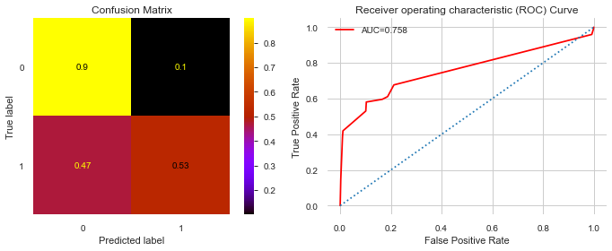


```python
fn.df_import(clf4, X_train)
```


<style  type="text/css" >
    #T_6928235c_8be2_11ea_95bb_54e1adf13a74row0_col1 {
            width:  10em;
             height:  80%;
            background:  linear-gradient(90deg,#d65f5f 100.0%, transparent 100.0%);
        }    #T_6928235c_8be2_11ea_95bb_54e1adf13a74row1_col1 {
            width:  10em;
             height:  80%;
            background:  linear-gradient(90deg,#d65f5f 71.9%, transparent 71.9%);
        }    #T_6928235c_8be2_11ea_95bb_54e1adf13a74row2_col1 {
            width:  10em;
             height:  80%;
            background:  linear-gradient(90deg,#d65f5f 17.8%, transparent 17.8%);
        }    #T_6928235c_8be2_11ea_95bb_54e1adf13a74row3_col1 {
            width:  10em;
             height:  80%;
            background:  linear-gradient(90deg,#d65f5f 15.9%, transparent 15.9%);
        }    #T_6928235c_8be2_11ea_95bb_54e1adf13a74row4_col1 {
            width:  10em;
             height:  80%;
            background:  linear-gradient(90deg,#d65f5f 5.2%, transparent 5.2%);
        }    #T_6928235c_8be2_11ea_95bb_54e1adf13a74row5_col1 {
            width:  10em;
             height:  80%;
            background:  linear-gradient(90deg,#d65f5f 4.7%, transparent 4.7%);
        }    #T_6928235c_8be2_11ea_95bb_54e1adf13a74row6_col1 {
            width:  10em;
             height:  80%;
            background:  linear-gradient(90deg,#d65f5f 0.7%, transparent 0.7%);
        }    #T_6928235c_8be2_11ea_95bb_54e1adf13a74row7_col1 {
            width:  10em;
             height:  80%;
            background:  linear-gradient(90deg,#d65f5f 0.4%, transparent 0.4%);
        }    #T_6928235c_8be2_11ea_95bb_54e1adf13a74row8_col1 {
            width:  10em;
             height:  80%;
            background:  linear-gradient(90deg,#d65f5f 0.2%, transparent 0.2%);
        }    #T_6928235c_8be2_11ea_95bb_54e1adf13a74row9_col1 {
            width:  10em;
             height:  80%;
        }    #T_6928235c_8be2_11ea_95bb_54e1adf13a74row10_col1 {
            width:  10em;
             height:  80%;
        }    #T_6928235c_8be2_11ea_95bb_54e1adf13a74row11_col1 {
            width:  10em;
             height:  80%;
        }    #T_6928235c_8be2_11ea_95bb_54e1adf13a74row12_col1 {
            width:  10em;
             height:  80%;
        }    #T_6928235c_8be2_11ea_95bb_54e1adf13a74row13_col1 {
            width:  10em;
             height:  80%;
        }    #T_6928235c_8be2_11ea_95bb_54e1adf13a74row14_col1 {
            width:  10em;
             height:  80%;
        }    #T_6928235c_8be2_11ea_95bb_54e1adf13a74row15_col1 {
            width:  10em;
             height:  80%;
        }    #T_6928235c_8be2_11ea_95bb_54e1adf13a74row16_col1 {
            width:  10em;
             height:  80%;
        }    #T_6928235c_8be2_11ea_95bb_54e1adf13a74row17_col1 {
            width:  10em;
             height:  80%;
        }    #T_6928235c_8be2_11ea_95bb_54e1adf13a74row18_col1 {
            width:  10em;
             height:  80%;
        }    #T_6928235c_8be2_11ea_95bb_54e1adf13a74row19_col1 {
            width:  10em;
             height:  80%;
        }</style><table id="T_6928235c_8be2_11ea_95bb_54e1adf13a74" ><thead>    <tr>        <th class="blank level0" ></th>        <th class="col_heading level0 col0" >factor</th>        <th class="col_heading level0 col1" >coef</th>    </tr></thead><tbody>
                <tr>
                        <th id="T_6928235c_8be2_11ea_95bb_54e1adf13a74level0_row0" class="row_heading level0 row0" >0</th>
                        <td id="T_6928235c_8be2_11ea_95bb_54e1adf13a74row0_col0" class="data row0 col0" >covid19_contact</td>
                        <td id="T_6928235c_8be2_11ea_95bb_54e1adf13a74row0_col1" class="data row0 col1" >0.461493</td>
            </tr>
            <tr>
                        <th id="T_6928235c_8be2_11ea_95bb_54e1adf13a74level0_row1" class="row_heading level0 row1" >1</th>
                        <td id="T_6928235c_8be2_11ea_95bb_54e1adf13a74row1_col0" class="data row1 col0" >opinion_infection</td>
                        <td id="T_6928235c_8be2_11ea_95bb_54e1adf13a74row1_col1" class="data row1 col1" >0.332024</td>
            </tr>
            <tr>
                        <th id="T_6928235c_8be2_11ea_95bb_54e1adf13a74level0_row2" class="row_heading level0 row2" >2</th>
                        <td id="T_6928235c_8be2_11ea_95bb_54e1adf13a74row2_col0" class="data row2 col0" >rate_reducing_risk_single</td>
                        <td id="T_6928235c_8be2_11ea_95bb_54e1adf13a74row2_col1" class="data row2 col1" >0.0821754</td>
            </tr>
            <tr>
                        <th id="T_6928235c_8be2_11ea_95bb_54e1adf13a74level0_row3" class="row_heading level0 row3" >3</th>
                        <td id="T_6928235c_8be2_11ea_95bb_54e1adf13a74row3_col0" class="data row3 col0" >covid19_symptoms</td>
                        <td id="T_6928235c_8be2_11ea_95bb_54e1adf13a74row3_col1" class="data row3 col1" >0.0731901</td>
            </tr>
            <tr>
                        <th id="T_6928235c_8be2_11ea_95bb_54e1adf13a74level0_row4" class="row_heading level0 row4" >4</th>
                        <td id="T_6928235c_8be2_11ea_95bb_54e1adf13a74row4_col0" class="data row4 col0" >blood_type_op</td>
                        <td id="T_6928235c_8be2_11ea_95bb_54e1adf13a74row4_col1" class="data row4 col1" >0.0238655</td>
            </tr>
            <tr>
                        <th id="T_6928235c_8be2_11ea_95bb_54e1adf13a74level0_row5" class="row_heading level0 row5" >5</th>
                        <td id="T_6928235c_8be2_11ea_95bb_54e1adf13a74row5_col0" class="data row5 col0" >other_chronic</td>
                        <td id="T_6928235c_8be2_11ea_95bb_54e1adf13a74row5_col1" class="data row5 col1" >0.0214886</td>
            </tr>
            <tr>
                        <th id="T_6928235c_8be2_11ea_95bb_54e1adf13a74level0_row6" class="row_heading level0 row6" >6</th>
                        <td id="T_6928235c_8be2_11ea_95bb_54e1adf13a74row6_col0" class="data row6 col0" >opinion_mortality</td>
                        <td id="T_6928235c_8be2_11ea_95bb_54e1adf13a74row6_col1" class="data row6 col1" >0.00305217</td>
            </tr>
            <tr>
                        <th id="T_6928235c_8be2_11ea_95bb_54e1adf13a74level0_row7" class="row_heading level0 row7" >7</th>
                        <td id="T_6928235c_8be2_11ea_95bb_54e1adf13a74row7_col0" class="data row7 col0" >text_working_travel critical</td>
                        <td id="T_6928235c_8be2_11ea_95bb_54e1adf13a74row7_col1" class="data row7 col1" >0.00165439</td>
            </tr>
            <tr>
                        <th id="T_6928235c_8be2_11ea_95bb_54e1adf13a74level0_row8" class="row_heading level0 row8" >8</th>
                        <td id="T_6928235c_8be2_11ea_95bb_54e1adf13a74row8_col0" class="data row8 col0" >smoking_yesmedium</td>
                        <td id="T_6928235c_8be2_11ea_95bb_54e1adf13a74row8_col1" class="data row8 col1" >0.00105716</td>
            </tr>
            <tr>
                        <th id="T_6928235c_8be2_11ea_95bb_54e1adf13a74level0_row9" class="row_heading level0 row9" >14</th>
                        <td id="T_6928235c_8be2_11ea_95bb_54e1adf13a74row9_col0" class="data row9 col0" >country_NG</td>
                        <td id="T_6928235c_8be2_11ea_95bb_54e1adf13a74row9_col1" class="data row9 col1" >0</td>
            </tr>
            <tr>
                        <th id="T_6928235c_8be2_11ea_95bb_54e1adf13a74level0_row10" class="row_heading level0 row10" >18</th>
                        <td id="T_6928235c_8be2_11ea_95bb_54e1adf13a74row10_col0" class="data row10 col0" >country_PA</td>
                        <td id="T_6928235c_8be2_11ea_95bb_54e1adf13a74row10_col1" class="data row10 col1" >0</td>
            </tr>
            <tr>
                        <th id="T_6928235c_8be2_11ea_95bb_54e1adf13a74level0_row11" class="row_heading level0 row11" >17</th>
                        <td id="T_6928235c_8be2_11ea_95bb_54e1adf13a74row11_col0" class="data row11 col0" >country_NE</td>
                        <td id="T_6928235c_8be2_11ea_95bb_54e1adf13a74row11_col1" class="data row11 col1" >0</td>
            </tr>
            <tr>
                        <th id="T_6928235c_8be2_11ea_95bb_54e1adf13a74level0_row12" class="row_heading level0 row12" >16</th>
                        <td id="T_6928235c_8be2_11ea_95bb_54e1adf13a74row12_col0" class="data row12 col0" >country_OM</td>
                        <td id="T_6928235c_8be2_11ea_95bb_54e1adf13a74row12_col1" class="data row12 col1" >0</td>
            </tr>
            <tr>
                        <th id="T_6928235c_8be2_11ea_95bb_54e1adf13a74level0_row13" class="row_heading level0 row13" >15</th>
                        <td id="T_6928235c_8be2_11ea_95bb_54e1adf13a74row13_col0" class="data row13 col0" >country_NZ</td>
                        <td id="T_6928235c_8be2_11ea_95bb_54e1adf13a74row13_col1" class="data row13 col1" >0</td>
            </tr>
            <tr>
                        <th id="T_6928235c_8be2_11ea_95bb_54e1adf13a74level0_row14" class="row_heading level0 row14" >10</th>
                        <td id="T_6928235c_8be2_11ea_95bb_54e1adf13a74row14_col0" class="data row14 col0" >country_NO</td>
                        <td id="T_6928235c_8be2_11ea_95bb_54e1adf13a74row14_col1" class="data row14 col1" >0</td>
            </tr>
            <tr>
                        <th id="T_6928235c_8be2_11ea_95bb_54e1adf13a74level0_row15" class="row_heading level0 row15" >13</th>
                        <td id="T_6928235c_8be2_11ea_95bb_54e1adf13a74row15_col0" class="data row15 col0" >country_NI</td>
                        <td id="T_6928235c_8be2_11ea_95bb_54e1adf13a74row15_col1" class="data row15 col1" >0</td>
            </tr>
            <tr>
                        <th id="T_6928235c_8be2_11ea_95bb_54e1adf13a74level0_row16" class="row_heading level0 row16" >12</th>
                        <td id="T_6928235c_8be2_11ea_95bb_54e1adf13a74row16_col0" class="data row16 col0" >country_PG</td>
                        <td id="T_6928235c_8be2_11ea_95bb_54e1adf13a74row16_col1" class="data row16 col1" >0</td>
            </tr>
            <tr>
                        <th id="T_6928235c_8be2_11ea_95bb_54e1adf13a74level0_row17" class="row_heading level0 row17" >11</th>
                        <td id="T_6928235c_8be2_11ea_95bb_54e1adf13a74row17_col0" class="data row17 col0" >country_NP</td>
                        <td id="T_6928235c_8be2_11ea_95bb_54e1adf13a74row17_col1" class="data row17 col1" >0</td>
            </tr>
            <tr>
                        <th id="T_6928235c_8be2_11ea_95bb_54e1adf13a74level0_row18" class="row_heading level0 row18" >9</th>
                        <td id="T_6928235c_8be2_11ea_95bb_54e1adf13a74row18_col0" class="data row18 col0" >country_NL</td>
                        <td id="T_6928235c_8be2_11ea_95bb_54e1adf13a74row18_col1" class="data row18 col1" >0</td>
            </tr>
            <tr>
                        <th id="T_6928235c_8be2_11ea_95bb_54e1adf13a74level0_row19" class="row_heading level0 row19" >19</th>
                        <td id="T_6928235c_8be2_11ea_95bb_54e1adf13a74row19_col0" class="data row19 col0" >country_PE</td>
                        <td id="T_6928235c_8be2_11ea_95bb_54e1adf13a74row19_col1" class="data row19 col1" >0</td>
            </tr>
    </tbody></table>


#### Obervations on manually-tuned Decision Tree:

After adjusting parameters by penalizing the depth and tuning max_features, the optimal outcome was achieved here:

>DecisionTreeClassifier(ccp_alpha=0.0, class_weight='balanced', criterion='gini',
                       max_depth=4, max_features=0.15, max_leaf_nodes=None,
                       min_impurity_decrease=0.0, min_impurity_split=None,
                       min_samples_leaf=1, min_samples_split=2,
                       min_weight_fraction_leaf=0.0, presort='deprecated',
                       random_state=123, splitter='best')


While recall improved on true positives (53%), AUC leaves some to be desired 75.8% and mean cross-validation score is .6214. Testing data score is consistently higher than training scores which has to do with highly imbalanced data.

Top factors include: 
1. covid-19 contact
2. opinion infection 
3. single behavior modifications 
4. symptoms

#### Trying GridSearch on Decision Tree Classifier using Undersampled classes


```python
time = fn.Timer()
time.start()
grid_clf.fit(X_train_rus, y_train_rus)
time.stop()
```

    [i] Timer started at05/01/20 - 12:32 PM
    [i] Timer ended at 05/01/20 - 12:32 PM
    - Total time = 0:00:02.089642
    


```python
print(f'The best parameters via GridSearchCV: {grid_clf.best_params_}')
```

    The best parameters via GridSearchCV: {'criterion': 'gini', 'max_depth': 5, 'max_features': 90}
    


```python
clf5 = DecisionTreeClassifier(criterion='gini',class_weight='balanced', max_depth=5, max_features=90, random_state=123)
clf5.fit(X_train_rus, y_train_rus)
```


    DecisionTreeClassifier(ccp_alpha=0.0, class_weight='balanced', criterion='gini',
                           max_depth=5, max_features=90, max_leaf_nodes=None,
                           min_impurity_decrease=0.0, min_impurity_split=None,
                           min_samples_leaf=1, min_samples_split=2,
                           min_weight_fraction_leaf=0.0, presort='deprecated',
                           random_state=123, splitter='best')


```python
yh5 = clf5.predict(X_test)
```


```python
mean_clf5_cv_score = np.mean(cross_val_score(clf5, X_train_rus, y_train_rus, cv=3))
```


```python
print(f'Mean Cross Validation Score for Decision Tree using Grid Search on Undersampled data {round(mean_clf5_cv_score,4)}')
```

    Mean Cross Validation Score for Decision Tree using Grid Search on Undersampled data 0.7614
    


```python
fn.evaluate_model(X_test, y_test, yh5, X_train_rus, y_train_rus, clf5)
```


<div>
<style scoped>
    .dataframe tbody tr th:only-of-type {
        vertical-align: middle;
    }

    .dataframe tbody tr th {
        vertical-align: top;
    }

    .dataframe thead th {
        text-align: right;
    }
</style>
<table border="1" class="dataframe">
  <thead>
    <tr style="text-align: right;">
      <th></th>
      <th>precision</th>
      <th>recall</th>
      <th>f1-score</th>
      <th>support</th>
    </tr>
  </thead>
  <tbody>
    <tr>
      <th>0</th>
      <td>1.000</td>
      <td>0.961</td>
      <td>0.980</td>
      <td>143605.00</td>
    </tr>
    <tr>
      <th>1</th>
      <td>0.022</td>
      <td>0.652</td>
      <td>0.043</td>
      <td>198.00</td>
    </tr>
    <tr>
      <th>accuracy</th>
      <td>0.960</td>
      <td>0.960</td>
      <td>0.960</td>
      <td>0.96</td>
    </tr>
    <tr>
      <th>macro avg</th>
      <td>0.511</td>
      <td>0.806</td>
      <td>0.511</td>
      <td>143803.00</td>
    </tr>
    <tr>
      <th>weighted avg</th>
      <td>0.998</td>
      <td>0.960</td>
      <td>0.978</td>
      <td>143803.00</td>
    </tr>
  </tbody>
</table>
</div>


    ___________________________________________
    
    
    Training Accuracy :  0.8136593591905565
    Test Accuracy :  0.9601190517583083
    ___________________________________________
    


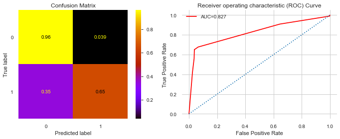


```python
fn.df_import(clf5, X_train)
```


<style  type="text/css" >
    #T_f70639e6_8be2_11ea_9989_54e1adf13a74row0_col1 {
            width:  10em;
             height:  80%;
            background:  linear-gradient(90deg,#d65f5f 100.0%, transparent 100.0%);
        }    #T_f70639e6_8be2_11ea_9989_54e1adf13a74row1_col1 {
            width:  10em;
             height:  80%;
            background:  linear-gradient(90deg,#d65f5f 61.4%, transparent 61.4%);
        }    #T_f70639e6_8be2_11ea_9989_54e1adf13a74row2_col1 {
            width:  10em;
             height:  80%;
            background:  linear-gradient(90deg,#d65f5f 8.8%, transparent 8.8%);
        }    #T_f70639e6_8be2_11ea_9989_54e1adf13a74row3_col1 {
            width:  10em;
             height:  80%;
            background:  linear-gradient(90deg,#d65f5f 7.8%, transparent 7.8%);
        }    #T_f70639e6_8be2_11ea_9989_54e1adf13a74row4_col1 {
            width:  10em;
             height:  80%;
            background:  linear-gradient(90deg,#d65f5f 6.3%, transparent 6.3%);
        }    #T_f70639e6_8be2_11ea_9989_54e1adf13a74row5_col1 {
            width:  10em;
             height:  80%;
            background:  linear-gradient(90deg,#d65f5f 2.3%, transparent 2.3%);
        }    #T_f70639e6_8be2_11ea_9989_54e1adf13a74row6_col1 {
            width:  10em;
             height:  80%;
            background:  linear-gradient(90deg,#d65f5f 2.3%, transparent 2.3%);
        }    #T_f70639e6_8be2_11ea_9989_54e1adf13a74row7_col1 {
            width:  10em;
             height:  80%;
            background:  linear-gradient(90deg,#d65f5f 1.3%, transparent 1.3%);
        }    #T_f70639e6_8be2_11ea_9989_54e1adf13a74row8_col1 {
            width:  10em;
             height:  80%;
            background:  linear-gradient(90deg,#d65f5f 0.9%, transparent 0.9%);
        }    #T_f70639e6_8be2_11ea_9989_54e1adf13a74row9_col1 {
            width:  10em;
             height:  80%;
            background:  linear-gradient(90deg,#d65f5f 0.8%, transparent 0.8%);
        }    #T_f70639e6_8be2_11ea_9989_54e1adf13a74row10_col1 {
            width:  10em;
             height:  80%;
            background:  linear-gradient(90deg,#d65f5f 0.3%, transparent 0.3%);
        }    #T_f70639e6_8be2_11ea_9989_54e1adf13a74row11_col1 {
            width:  10em;
             height:  80%;
            background:  linear-gradient(90deg,#d65f5f 0.2%, transparent 0.2%);
        }    #T_f70639e6_8be2_11ea_9989_54e1adf13a74row12_col1 {
            width:  10em;
             height:  80%;
        }    #T_f70639e6_8be2_11ea_9989_54e1adf13a74row13_col1 {
            width:  10em;
             height:  80%;
        }    #T_f70639e6_8be2_11ea_9989_54e1adf13a74row14_col1 {
            width:  10em;
             height:  80%;
        }    #T_f70639e6_8be2_11ea_9989_54e1adf13a74row15_col1 {
            width:  10em;
             height:  80%;
        }    #T_f70639e6_8be2_11ea_9989_54e1adf13a74row16_col1 {
            width:  10em;
             height:  80%;
        }    #T_f70639e6_8be2_11ea_9989_54e1adf13a74row17_col1 {
            width:  10em;
             height:  80%;
        }    #T_f70639e6_8be2_11ea_9989_54e1adf13a74row18_col1 {
            width:  10em;
             height:  80%;
        }    #T_f70639e6_8be2_11ea_9989_54e1adf13a74row19_col1 {
            width:  10em;
             height:  80%;
        }</style><table id="T_f70639e6_8be2_11ea_9989_54e1adf13a74" ><thead>    <tr>        <th class="blank level0" ></th>        <th class="col_heading level0 col0" >factor</th>        <th class="col_heading level0 col1" >coef</th>    </tr></thead><tbody>
                <tr>
                        <th id="T_f70639e6_8be2_11ea_9989_54e1adf13a74level0_row0" class="row_heading level0 row0" >0</th>
                        <td id="T_f70639e6_8be2_11ea_9989_54e1adf13a74row0_col0" class="data row0 col0" >opinion_infection</td>
                        <td id="T_f70639e6_8be2_11ea_9989_54e1adf13a74row0_col1" class="data row0 col1" >0.519363</td>
            </tr>
            <tr>
                        <th id="T_f70639e6_8be2_11ea_9989_54e1adf13a74level0_row1" class="row_heading level0 row1" >1</th>
                        <td id="T_f70639e6_8be2_11ea_9989_54e1adf13a74row1_col0" class="data row1 col0" >covid19_symptoms</td>
                        <td id="T_f70639e6_8be2_11ea_9989_54e1adf13a74row1_col1" class="data row1 col1" >0.31903</td>
            </tr>
            <tr>
                        <th id="T_f70639e6_8be2_11ea_9989_54e1adf13a74level0_row2" class="row_heading level0 row2" >2</th>
                        <td id="T_f70639e6_8be2_11ea_9989_54e1adf13a74row2_col0" class="data row2 col0" >rate_reducing_risk_single</td>
                        <td id="T_f70639e6_8be2_11ea_9989_54e1adf13a74row2_col1" class="data row2 col1" >0.0457375</td>
            </tr>
            <tr>
                        <th id="T_f70639e6_8be2_11ea_9989_54e1adf13a74level0_row3" class="row_heading level0 row3" >3</th>
                        <td id="T_f70639e6_8be2_11ea_9989_54e1adf13a74row3_col0" class="data row3 col0" >covid19_contact</td>
                        <td id="T_f70639e6_8be2_11ea_9989_54e1adf13a74row3_col1" class="data row3 col1" >0.0404451</td>
            </tr>
            <tr>
                        <th id="T_f70639e6_8be2_11ea_9989_54e1adf13a74level0_row4" class="row_heading level0 row4" >4</th>
                        <td id="T_f70639e6_8be2_11ea_9989_54e1adf13a74row4_col0" class="data row4 col0" >contacts_count</td>
                        <td id="T_f70639e6_8be2_11ea_9989_54e1adf13a74row4_col1" class="data row4 col1" >0.0327985</td>
            </tr>
            <tr>
                        <th id="T_f70639e6_8be2_11ea_9989_54e1adf13a74level0_row5" class="row_heading level0 row5" >5</th>
                        <td id="T_f70639e6_8be2_11ea_9989_54e1adf13a74row5_col0" class="data row5 col0" >cocaine</td>
                        <td id="T_f70639e6_8be2_11ea_9989_54e1adf13a74row5_col1" class="data row5 col1" >0.0121582</td>
            </tr>
            <tr>
                        <th id="T_f70639e6_8be2_11ea_9989_54e1adf13a74level0_row6" class="row_heading level0 row6" >6</th>
                        <td id="T_f70639e6_8be2_11ea_9989_54e1adf13a74row6_col0" class="data row6 col0" >smoking_yesmedium</td>
                        <td id="T_f70639e6_8be2_11ea_9989_54e1adf13a74row6_col1" class="data row6 col1" >0.0121074</td>
            </tr>
            <tr>
                        <th id="T_f70639e6_8be2_11ea_9989_54e1adf13a74level0_row7" class="row_heading level0 row7" >7</th>
                        <td id="T_f70639e6_8be2_11ea_9989_54e1adf13a74row7_col0" class="data row7 col0" >blood_type_abn</td>
                        <td id="T_f70639e6_8be2_11ea_9989_54e1adf13a74row7_col1" class="data row7 col1" >0.00690185</td>
            </tr>
            <tr>
                        <th id="T_f70639e6_8be2_11ea_9989_54e1adf13a74level0_row8" class="row_heading level0 row8" >8</th>
                        <td id="T_f70639e6_8be2_11ea_9989_54e1adf13a74row8_col0" class="data row8 col0" >bmi</td>
                        <td id="T_f70639e6_8be2_11ea_9989_54e1adf13a74row8_col1" class="data row8 col1" >0.00463551</td>
            </tr>
            <tr>
                        <th id="T_f70639e6_8be2_11ea_9989_54e1adf13a74level0_row9" class="row_heading level0 row9" >9</th>
                        <td id="T_f70639e6_8be2_11ea_9989_54e1adf13a74row9_col0" class="data row9 col0" >rate_reducing_risk_house</td>
                        <td id="T_f70639e6_8be2_11ea_9989_54e1adf13a74row9_col1" class="data row9 col1" >0.00422912</td>
            </tr>
            <tr>
                        <th id="T_f70639e6_8be2_11ea_9989_54e1adf13a74level0_row10" class="row_heading level0 row10" >10</th>
                        <td id="T_f70639e6_8be2_11ea_9989_54e1adf13a74row10_col0" class="data row10 col0" >asthma</td>
                        <td id="T_f70639e6_8be2_11ea_9989_54e1adf13a74row10_col1" class="data row10 col1" >0.00143789</td>
            </tr>
            <tr>
                        <th id="T_f70639e6_8be2_11ea_9989_54e1adf13a74level0_row11" class="row_heading level0 row11" >11</th>
                        <td id="T_f70639e6_8be2_11ea_9989_54e1adf13a74row11_col0" class="data row11 col0" >blood_type_bp</td>
                        <td id="T_f70639e6_8be2_11ea_9989_54e1adf13a74row11_col1" class="data row11 col1" >0.00115593</td>
            </tr>
            <tr>
                        <th id="T_f70639e6_8be2_11ea_9989_54e1adf13a74level0_row12" class="row_heading level0 row12" >12</th>
                        <td id="T_f70639e6_8be2_11ea_9989_54e1adf13a74row12_col0" class="data row12 col0" >country_OM</td>
                        <td id="T_f70639e6_8be2_11ea_9989_54e1adf13a74row12_col1" class="data row12 col1" >0</td>
            </tr>
            <tr>
                        <th id="T_f70639e6_8be2_11ea_9989_54e1adf13a74level0_row13" class="row_heading level0 row13" >13</th>
                        <td id="T_f70639e6_8be2_11ea_9989_54e1adf13a74row13_col0" class="data row13 col0" >country_PH</td>
                        <td id="T_f70639e6_8be2_11ea_9989_54e1adf13a74row13_col1" class="data row13 col1" >0</td>
            </tr>
            <tr>
                        <th id="T_f70639e6_8be2_11ea_9989_54e1adf13a74level0_row14" class="row_heading level0 row14" >14</th>
                        <td id="T_f70639e6_8be2_11ea_9989_54e1adf13a74row14_col0" class="data row14 col0" >country_NZ</td>
                        <td id="T_f70639e6_8be2_11ea_9989_54e1adf13a74row14_col1" class="data row14 col1" >0</td>
            </tr>
            <tr>
                        <th id="T_f70639e6_8be2_11ea_9989_54e1adf13a74level0_row15" class="row_heading level0 row15" >15</th>
                        <td id="T_f70639e6_8be2_11ea_9989_54e1adf13a74row15_col0" class="data row15 col0" >country_PA</td>
                        <td id="T_f70639e6_8be2_11ea_9989_54e1adf13a74row15_col1" class="data row15 col1" >0</td>
            </tr>
            <tr>
                        <th id="T_f70639e6_8be2_11ea_9989_54e1adf13a74level0_row16" class="row_heading level0 row16" >16</th>
                        <td id="T_f70639e6_8be2_11ea_9989_54e1adf13a74row16_col0" class="data row16 col0" >country_NP</td>
                        <td id="T_f70639e6_8be2_11ea_9989_54e1adf13a74row16_col1" class="data row16 col1" >0</td>
            </tr>
            <tr>
                        <th id="T_f70639e6_8be2_11ea_9989_54e1adf13a74level0_row17" class="row_heading level0 row17" >17</th>
                        <td id="T_f70639e6_8be2_11ea_9989_54e1adf13a74row17_col0" class="data row17 col0" >country_NO</td>
                        <td id="T_f70639e6_8be2_11ea_9989_54e1adf13a74row17_col1" class="data row17 col1" >0</td>
            </tr>
            <tr>
                        <th id="T_f70639e6_8be2_11ea_9989_54e1adf13a74level0_row18" class="row_heading level0 row18" >18</th>
                        <td id="T_f70639e6_8be2_11ea_9989_54e1adf13a74row18_col0" class="data row18 col0" >country_NL</td>
                        <td id="T_f70639e6_8be2_11ea_9989_54e1adf13a74row18_col1" class="data row18 col1" >0</td>
            </tr>
            <tr>
                        <th id="T_f70639e6_8be2_11ea_9989_54e1adf13a74level0_row19" class="row_heading level0 row19" >19</th>
                        <td id="T_f70639e6_8be2_11ea_9989_54e1adf13a74row19_col0" class="data row19 col0" >country_PE</td>
                        <td id="T_f70639e6_8be2_11ea_9989_54e1adf13a74row19_col1" class="data row19 col1" >0</td>
            </tr>
    </tbody></table>


#### Observations: 
This model is somewhat improved with a cross-validation score of .76. The true positive rates have improved to 65%, as well as the AUC with a result of .827.  The testing accuracy 96% is higher than the training accuracy 81% still indicating that the test data isn't from the same sample as the training data and is more than likely attributed to a hyper-skewed class assignement.  


> Top Features: 
1. opinion_infection	0.519363
-	covid19_symptoms	0.319030
-	rate_reducing_risk_single	0.045737
-	covid19_contact	0.040445
-	contacts_count	0.032799


### Gridsearch on Random Forest using Undersampling:


```python
from sklearn.model_selection import GridSearchCV

from sklearn.ensemble import RandomForestClassifier
rf_clf = RandomForestClassifier(class_weight='balanced', random_state=123)
## Set up param grid
param_grid = {'criterion':['gini','entropy'],
             'max_depth':[7,8, 10,15],
             'max_features':[70, 80, 85, 90,100],
             'n_estimators' :[75,100,125, 150]}

## Instantiate GridSearchCV
grid_clf = GridSearchCV(rf_clf, param_grid, cv=skf)
```


```python
time = fn.Timer()
time.start()
grid_clf.fit(X_train_rus, y_train_rus)
time.stop()
```

    [i] Timer started at05/01/20 - 12:38 PM
    [i] Timer ended at 05/01/20 - 12:46 PM
    - Total time = 0:07:57.390941
    


```python
mean_rf_cv_score = np.mean(cross_val_score(grid_clf, X_train_rus, y_train_rus, cv=3))
mean_rf_cv_score
```


    0.7968098708605037


```python
print(f" Best parameters found via GridSearchCV:{grid_clf.best_params_}")
```

     Best parameters found via GridSearchCV:{'criterion': 'gini', 'max_depth': 10, 'max_features': 70, 'n_estimators': 100}
    


```python
print(f" Best estimators found via GridSearchCV: {grid_clf.best_estimator_}")
```

     Best estimators found via GridSearchCV: RandomForestClassifier(bootstrap=True, ccp_alpha=0.0, class_weight='balanced',
                           criterion='gini', max_depth=10, max_features=70,
                           max_leaf_nodes=None, max_samples=None,
                           min_impurity_decrease=0.0, min_impurity_split=None,
                           min_samples_leaf=1, min_samples_split=2,
                           min_weight_fraction_leaf=0.0, n_estimators=100,
                           n_jobs=None, oob_score=False, random_state=123,
                           verbose=0, warm_start=False)
    

#### Applying best parameters found via GriSearchCV


```python
timer = fn.Timer()
timer.start()
rfgs_clf = RandomForestClassifier(criterion='gini', max_depth=10, max_features=70, n_estimators=100, random_state=123)

rfgs_clf.fit(X_train_res, y_train_res)
timer.stop()
mean_rf_cv_score = np.mean(cross_val_score(rfgs_clf, X_train_rus, y_train_rus, cv=3))

print(f"Mean Cross Validation Score for Random Forest Classifier: {mean_rf_cv_score :.2%}")
```

    [i] Timer started at05/01/20 - 01:59 PM
    [i] Timer ended at 05/01/20 - 02:14 PM
    - Total time = 0:15:35.470131
    Mean Cross Validation Score for Random Forest Classifier: 79.76%
    


```python
y_hat_test2 = rfgs_clf.predict(X_test)
```


```python
fn.evaluate_model(X_test, y_test, y_hat_test2, X_train_rus, y_train_rus, rfgs_clf)
```


<div>
<style scoped>
    .dataframe tbody tr th:only-of-type {
        vertical-align: middle;
    }

    .dataframe tbody tr th {
        vertical-align: top;
    }

    .dataframe thead th {
        text-align: right;
    }
</style>
<table border="1" class="dataframe">
  <thead>
    <tr style="text-align: right;">
      <th></th>
      <th>precision</th>
      <th>recall</th>
      <th>f1-score</th>
      <th>support</th>
    </tr>
  </thead>
  <tbody>
    <tr>
      <th>0</th>
      <td>0.999</td>
      <td>0.995</td>
      <td>0.997</td>
      <td>143605.000</td>
    </tr>
    <tr>
      <th>1</th>
      <td>0.065</td>
      <td>0.263</td>
      <td>0.104</td>
      <td>198.000</td>
    </tr>
    <tr>
      <th>accuracy</th>
      <td>0.994</td>
      <td>0.994</td>
      <td>0.994</td>
      <td>0.994</td>
    </tr>
    <tr>
      <th>macro avg</th>
      <td>0.532</td>
      <td>0.629</td>
      <td>0.550</td>
      <td>143803.000</td>
    </tr>
    <tr>
      <th>weighted avg</th>
      <td>0.998</td>
      <td>0.994</td>
      <td>0.996</td>
      <td>143803.000</td>
    </tr>
  </tbody>
</table>
</div>


    ___________________________________________
    
    
    Training Accuracy :  0.7554806070826307
    Test Accuracy :  0.9937692537707836
    ___________________________________________
    


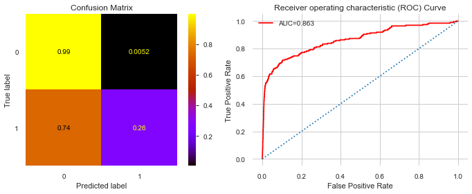


```python
    df_import = pd.DataFrame(rfgs_clf.feature_importances_, X_train.columns)
    df_import.reset_index(inplace=True)
    df_import.columns = ['feature', 'coef']
    df_import.sort_values('coef', ascending=False).head(20)
```


<div>
<style scoped>
    .dataframe tbody tr th:only-of-type {
        vertical-align: middle;
    }

    .dataframe tbody tr th {
        vertical-align: top;
    }

    .dataframe thead th {
        text-align: right;
    }
</style>
<table border="1" class="dataframe">
  <thead>
    <tr style="text-align: right;">
      <th></th>
      <th>feature</th>
      <th>coef</th>
    </tr>
  </thead>
  <tbody>
    <tr>
      <th>16</th>
      <td>covid19_symptoms</td>
      <td>0.230841</td>
    </tr>
    <tr>
      <th>27</th>
      <td>opinion_infection</td>
      <td>0.209132</td>
    </tr>
    <tr>
      <th>17</th>
      <td>covid19_contact</td>
      <td>0.121898</td>
    </tr>
    <tr>
      <th>14</th>
      <td>rate_reducing_risk_house</td>
      <td>0.067957</td>
    </tr>
    <tr>
      <th>31</th>
      <td>taking_prescription_medication</td>
      <td>0.051272</td>
    </tr>
    <tr>
      <th>13</th>
      <td>rate_reducing_risk_single</td>
      <td>0.038375</td>
    </tr>
    <tr>
      <th>217</th>
      <td>smoking_never</td>
      <td>0.038012</td>
    </tr>
    <tr>
      <th>15</th>
      <td>rate_reducing_mask</td>
      <td>0.032829</td>
    </tr>
    <tr>
      <th>228</th>
      <td>text_working_travel critical</td>
      <td>0.027977</td>
    </tr>
    <tr>
      <th>227</th>
      <td>text_working_stopped</td>
      <td>0.020079</td>
    </tr>
    <tr>
      <th>216</th>
      <td>blood_type_unknown</td>
      <td>0.017896</td>
    </tr>
    <tr>
      <th>30</th>
      <td>oiwasnull</td>
      <td>0.015905</td>
    </tr>
    <tr>
      <th>29</th>
      <td>omwasnull</td>
      <td>0.014454</td>
    </tr>
    <tr>
      <th>215</th>
      <td>blood_type_op</td>
      <td>0.009417</td>
    </tr>
    <tr>
      <th>12</th>
      <td>rate_government_action</td>
      <td>0.006962</td>
    </tr>
    <tr>
      <th>211</th>
      <td>blood_type_ap</td>
      <td>0.005926</td>
    </tr>
    <tr>
      <th>9</th>
      <td>mdma</td>
      <td>0.004681</td>
    </tr>
    <tr>
      <th>226</th>
      <td>text_working_never</td>
      <td>0.004530</td>
    </tr>
    <tr>
      <th>205</th>
      <td>sex_female</td>
      <td>0.004423</td>
    </tr>
    <tr>
      <th>218</th>
      <td>smoking_quit0</td>
      <td>0.004282</td>
    </tr>
  </tbody>
</table>
</div>


```python
df_import_clf = pd.Series(rf_clf.feature_importances_, index=X_train.columns, name='importance').head(20)
df_import_clf.sort_values().plot(kind='barh', figsize=(15,12))
```

#### Observations using GridSearch Random Forest Classifier on Random UnderSampled Data

> Still having trouble with precision and classifying true positives with a hyper lack-luster result of 26% - worst  yet, and training accuracy of 77.5% , testing accuracy of 99.3%, Interesting that AUC of 86% and high avg accuracy scores.
Mean Cross Validation Score for Random Forest Classifier: 79.76% 


**Top factors remain:**
1. Covid19 Symptoms
2. Opinion Infection
3. Covid19 Contact
4. rate_reducing_house
5. rate_reducing_single


### GridSearchCV to optimize RandomForrest on SMOTED data:


```python
# time = fn.Timer()
# time.start()
# rf_clf1 = RandomForestClassifier(class_weight='balanced', random_state=111)
# ## Set up param grid
# param_grid = {'criterion':['gini','entropy'],
#              'max_depth':[2,3,4,5],
#              'max_features':[.2, .3, .4],
#              'n_estimators' :[90,95,100,105]}

# ## Instantiate GridSearchCV
# grid_clff = GridSearchCV(rf_clf1, param_grid, cv=skf,verbose=1, n_jobs=-1)
# time.stop()
# #fit grid
# grid_clff.fit(X_train_res, y_train_res)

# best_parameters = grid_clff.best_params_
# print(f'GridSearch found the following optimal parameters:')
# for param_name in sorted(best_parameters.keys()):
#     print("%s: %r" % (param_name, best_parameters[param_name]))#
```


```python
# from sklearn.model_selection import GridSearchCV

# from sklearn.ensemble import RandomForestClassifier
# time = fn.Timer()
# time.start()
# rf_clf1 = RandomForestClassifier(class_weight='balanced', random_state=111)
# ## Set up param grid
# param_grid = {'criterion':['gini','entropy'],
#              'max_depth':[2,3,4,5],
#              'max_features':[.2, .3, .4],
#              'n_estimators' :[90,95,100,105]}

# ## Instantiate GridSearchCV
# grid_clff = GridSearchCV(rf_clf1, param_grid, cv=skf,verbose=1, n_jobs=-1)
# time.stop()
```


```python
#grid_clff.
```

#### Observation: 
GridSearch was too computationally expensive on SMOTED data

### Trying XGBoost


```python
## import xgboost RF
from xgboost import XGBRFClassifier,XGBClassifier
## Fit and Evaluate

xgb_rf = XGBRFClassifier(class_weight='1:1000',random_state=123)


```


```python
time = fn.Timer()
time.start()
xgb_rf.fit(X_train_res,y_train_res)
time.stop()

```

    [i] Timer started at05/01/20 - 02:18 PM
    [i] Timer ended at 05/01/20 - 02:24 PM
    - Total time = 0:06:07.968873
    


```python
y_train_data = np.array(y_train_res)
X_train_data = np.array(X_train_res)
y_test_data = np.array(y_test)
X_test_data = np.array(X_test)
```


```python
print(xgb_rf.score(X_train_data,y_train_data))
print(xgb_rf.score(X_test_data,y_test_data))
```

    0.8797056270223345
    0.9758906281510121
    


```python
y_hat_test = xgb_rf.predict(X_test_data)
```


```python
fn.evaluate_model(X_test, y_test, y_hat_test, X_train_res, y_train_res, xgb_rf)
```


<div>
<style scoped>
    .dataframe tbody tr th:only-of-type {
        vertical-align: middle;
    }

    .dataframe tbody tr th {
        vertical-align: top;
    }

    .dataframe thead th {
        text-align: right;
    }
</style>
<table border="1" class="dataframe">
  <thead>
    <tr style="text-align: right;">
      <th></th>
      <th>precision</th>
      <th>recall</th>
      <th>f1-score</th>
      <th>support</th>
    </tr>
  </thead>
  <tbody>
    <tr>
      <th>0</th>
      <td>0.999</td>
      <td>0.976</td>
      <td>0.988</td>
      <td>143605.000</td>
    </tr>
    <tr>
      <th>1</th>
      <td>0.034</td>
      <td>0.596</td>
      <td>0.064</td>
      <td>198.000</td>
    </tr>
    <tr>
      <th>accuracy</th>
      <td>0.976</td>
      <td>0.976</td>
      <td>0.976</td>
      <td>0.976</td>
    </tr>
    <tr>
      <th>macro avg</th>
      <td>0.517</td>
      <td>0.786</td>
      <td>0.526</td>
      <td>143803.000</td>
    </tr>
    <tr>
      <th>weighted avg</th>
      <td>0.998</td>
      <td>0.976</td>
      <td>0.987</td>
      <td>143803.000</td>
    </tr>
  </tbody>
</table>
</div>


    ___________________________________________
    
    
    Training Accuracy :  0.8797056270223345
    


    ---------------------------------------------------------------------------

    ValueError                                Traceback (most recent call last)

    <ipython-input-169-c0d2a61db3c2> in <module>
    ----> 1 fn.evaluate_model(X_test, y_test, y_hat_test, X_train_res, y_train_res, xgb_rf)
    

    ~\flatiron-ds-course\mod3_v21\dsc-mod-3-project-v2-1-online-ds-pt-100719\functions.py in evaluate_model(X_true, y_true, y_pred, X_train, y_train, clf)
         81     print("\n")
         82     print("Training Accuracy : ", clf.score(X_train, y_train))
    ---> 83     print("Test Accuracy : ", clf.score(X_true, y_true))
         84     print("___________________________________________")
         85 
    

    ~\AppData\Local\Continuum\anaconda3\envs\learn-env\lib\site-packages\sklearn\base.py in score(self, X, y, sample_weight)
        367         """
        368         from .metrics import accuracy_score
    --> 369         return accuracy_score(y, self.predict(X), sample_weight=sample_weight)
        370 
        371 
    

    ~\AppData\Local\Continuum\anaconda3\envs\learn-env\lib\site-packages\xgboost\sklearn.py in predict(self, data, output_margin, ntree_limit, validate_features)
        789                                                  output_margin=output_margin,
        790                                                  ntree_limit=ntree_limit,
    --> 791                                                  validate_features=validate_features)
        792         if output_margin:
        793             # If output_margin is active, simply return the scores
    

    ~\AppData\Local\Continuum\anaconda3\envs\learn-env\lib\site-packages\xgboost\core.py in predict(self, data, output_margin, ntree_limit, pred_leaf, pred_contribs, approx_contribs, pred_interactions, validate_features)
       1282 
       1283         if validate_features:
    -> 1284             self._validate_features(data)
       1285 
       1286         length = c_bst_ulong()
    

    ~\AppData\Local\Continuum\anaconda3\envs\learn-env\lib\site-packages\xgboost\core.py in _validate_features(self, data)
       1688 
       1689                 raise ValueError(msg.format(self.feature_names,
    -> 1690                                             data.feature_names))
       1691 
       1692     def get_split_value_histogram(self, feature, fmap='', bins=None, as_pandas=True):
    

    ValueError: feature_names mismatch: ['f0', 'f1', 'f2', 'f3', 'f4', 'f5', 'f6', 'f7', 'f8', 'f9', 'f10', 'f11', 'f12', 'f13', 'f14', 'f15', 'f16', 'f17', 'f18', 'f19', 'f20', 'f21', 'f22', 'f23', 'f24', 'f25', 'f26', 'f27', 'f28', 'f29', 'f30', 'f31', 'f32', 'f33', 'f34', 'f35', 'f36', 'f37', 'f38', 'f39', 'f40', 'f41', 'f42', 'f43', 'f44', 'f45', 'f46', 'f47', 'f48', 'f49', 'f50', 'f51', 'f52', 'f53', 'f54', 'f55', 'f56', 'f57', 'f58', 'f59', 'f60', 'f61', 'f62', 'f63', 'f64', 'f65', 'f66', 'f67', 'f68', 'f69', 'f70', 'f71', 'f72', 'f73', 'f74', 'f75', 'f76', 'f77', 'f78', 'f79', 'f80', 'f81', 'f82', 'f83', 'f84', 'f85', 'f86', 'f87', 'f88', 'f89', 'f90', 'f91', 'f92', 'f93', 'f94', 'f95', 'f96', 'f97', 'f98', 'f99', 'f100', 'f101', 'f102', 'f103', 'f104', 'f105', 'f106', 'f107', 'f108', 'f109', 'f110', 'f111', 'f112', 'f113', 'f114', 'f115', 'f116', 'f117', 'f118', 'f119', 'f120', 'f121', 'f122', 'f123', 'f124', 'f125', 'f126', 'f127', 'f128', 'f129', 'f130', 'f131', 'f132', 'f133', 'f134', 'f135', 'f136', 'f137', 'f138', 'f139', 'f140', 'f141', 'f142', 'f143', 'f144', 'f145', 'f146', 'f147', 'f148', 'f149', 'f150', 'f151', 'f152', 'f153', 'f154', 'f155', 'f156', 'f157', 'f158', 'f159', 'f160', 'f161', 'f162', 'f163', 'f164', 'f165', 'f166', 'f167', 'f168', 'f169', 'f170', 'f171', 'f172', 'f173', 'f174', 'f175', 'f176', 'f177', 'f178', 'f179', 'f180', 'f181', 'f182', 'f183', 'f184', 'f185', 'f186', 'f187', 'f188', 'f189', 'f190', 'f191', 'f192', 'f193', 'f194', 'f195', 'f196', 'f197', 'f198', 'f199', 'f200', 'f201', 'f202', 'f203', 'f204', 'f205', 'f206', 'f207', 'f208', 'f209', 'f210', 'f211', 'f212', 'f213', 'f214', 'f215', 'f216', 'f217', 'f218', 'f219', 'f220', 'f221', 'f222', 'f223', 'f224', 'f225', 'f226', 'f227', 'f228', 'f229'] ['age', 'height', 'weight', 'bmi', 'alcohol', 'cannabis', 'amphetamines', 'cocaine', 'lsd', 'mdma', 'contacts_count', 'house_count', 'rate_government_action', 'rate_reducing_risk_single', 'rate_reducing_risk_house', 'rate_reducing_mask', 'covid19_symptoms', 'covid19_contact', 'asthma', 'kidney_disease', 'compromised_immune', 'heart_disease', 'lung_disease', 'diabetes', 'hiv_positive', 'hypertension', 'other_chronic', 'opinion_infection', 'opinion_mortality', 'omwasnull', 'oiwasnull', 'taking_prescription_medication', 'country_AD', 'country_AE', 'country_AF', 'country_AG', 'country_AI', 'country_AL', 'country_AM', 'country_AR', 'country_AT', 'country_AU', 'country_AW', 'country_AZ', 'country_BA', 'country_BB', 'country_BD', 'country_BE', 'country_BG', 'country_BH', 'country_BM', 'country_BN', 'country_BO', 'country_BQ', 'country_BR', 'country_BS', 'country_BW', 'country_BY', 'country_BZ', 'country_CA', 'country_CH', 'country_CI', 'country_CL', 'country_CM', 'country_CN', 'country_CO', 'country_CR', 'country_CU', 'country_CY', 'country_CZ', 'country_DE', 'country_DJ', 'country_DK', 'country_DM', 'country_DO', 'country_DZ', 'country_EC', 'country_EE', 'country_EG', 'country_ES', 'country_ET', 'country_FI', 'country_FJ', 'country_FO', 'country_FR', 'country_GA', 'country_GB', 'country_GD', 'country_GE', 'country_GG', 'country_GH', 'country_GI', 'country_GM', 'country_GN', 'country_GR', 'country_GT', 'country_GU', 'country_HK', 'country_HN', 'country_HR', 'country_HT', 'country_HU', 'country_ID', 'country_IE', 'country_IL', 'country_IN', 'country_IQ', 'country_IR', 'country_IS', 'country_IT', 'country_JE', 'country_JM', 'country_JO', 'country_JP', 'country_KE', 'country_KG', 'country_KH', 'country_KR', 'country_KW', 'country_KY', 'country_KZ', 'country_LA', 'country_LB', 'country_LC', 'country_LI', 'country_LK', 'country_LT', 'country_LU', 'country_LV', 'country_LY', 'country_MA', 'country_MC', 'country_MD', 'country_ME', 'country_MG', 'country_MK', 'country_ML', 'country_MM', 'country_MN', 'country_MO', 'country_MT', 'country_MU', 'country_MV', 'country_MW', 'country_MX', 'country_MY', 'country_MZ', 'country_NE', 'country_NG', 'country_NI', 'country_NL', 'country_NO', 'country_NP', 'country_NZ', 'country_OM', 'country_PA', 'country_PE', 'country_PG', 'country_PH', 'country_PK', 'country_PL', 'country_PR', 'country_PS', 'country_PT', 'country_PY', 'country_QA', 'country_RO', 'country_RS', 'country_RU', 'country_RW', 'country_SA', 'country_SC', 'country_SD', 'country_SE', 'country_SG', 'country_SI', 'country_SK', 'country_SN', 'country_SR', 'country_SV', 'country_SX', 'country_SY', 'country_SZ', 'country_TC', 'country_TG', 'country_TH', 'country_TJ', 'country_TN', 'country_TO', 'country_TR', 'country_TT', 'country_TW', 'country_UA', 'country_UG', 'country_US', 'country_UY', 'country_UZ', 'country_VE', 'country_VI', 'country_VN', 'country_WS', 'country_YE', 'country_ZA', 'country_ZM', 'country_ZW', 'sex_female', 'sex_male', 'sex_other', 'blood_type_abn', 'blood_type_abp', 'blood_type_an', 'blood_type_ap', 'blood_type_bn', 'blood_type_bp', 'blood_type_on', 'blood_type_op', 'blood_type_unknown', 'smoking_never', 'smoking_quit0', 'smoking_quit10', 'smoking_quit5', 'smoking_vape', 'smoking_yesheavy', 'smoking_yeslight', 'smoking_yesmedium', 'text_working_home', 'text_working_never', 'text_working_stopped', 'text_working_travel critical', 'text_working_travel non critical']
    expected f76, f9, f219, f148, f192, f95, f206, f153, f28, f96, f126, f16, f109, f220, f7, f57, f55, f49, f171, f62, f197, f103, f154, f98, f89, f137, f94, f63, f217, f80, f67, f165, f38, f146, f42, f128, f168, f214, f12, f37, f132, f152, f203, f222, f25, f44, f84, f99, f119, f120, f182, f53, f205, f74, f228, f47, f86, f133, f138, f24, f97, f2, f123, f221, f110, f188, f52, f166, f187, f13, f179, f60, f102, f14, f18, f45, f32, f3, f118, f87, f164, f185, f170, f64, f207, f135, f39, f201, f58, f73, f223, f193, f163, f189, f78, f90, f177, f121, f213, f8, f54, f15, f33, f116, f130, f125, f70, f180, f46, f40, f72, f195, f115, f41, f140, f159, f30, f4, f68, f105, f31, f151, f216, f81, f112, f186, f65, f114, f129, f117, f174, f22, f144, f161, f59, f145, f69, f184, f211, f19, f71, f100, f113, f85, f66, f124, f139, f150, f162, f160, f26, f196, f157, f107, f23, f191, f127, f93, f176, f202, f227, f5, f79, f17, f108, f141, f34, f61, f77, f136, f6, f11, f111, f134, f204, f209, f212, f56, f181, f199, f43, f101, f50, f29, f198, f51, f210, f91, f21, f215, f173, f175, f155, f178, f0, f226, f27, f229, f147, f106, f75, f183, f224, f35, f83, f88, f10, f20, f156, f172, f92, f1, f208, f143, f225, f36, f200, f194, f142, f122, f48, f82, f104, f169, f190, f149, f218, f158, f167, f131 in input data
    training data did not have the following fields: country_GN, country_HN, country_AL, country_MT, country_UZ, country_GR, country_MK, country_IR, taking_prescription_medication, country_LA, country_BY, country_NG, oiwasnull, cocaine, amphetamines, rate_reducing_mask, country_FR, blood_type_ap, country_EE, blood_type_on, blood_type_op, country_RO, country_GM, smoking_never, country_IS, hypertension, country_IN, smoking_yeslight, country_RW, country_KZ, country_DE, omwasnull, asthma, country_PY, country_PH, country_RU, blood_type_bn, text_working_never, country_NE, country_IE, country_TT, country_ET, country_ZW, country_MO, country_TG, country_FO, country_SV, country_TJ, blood_type_an, rate_government_action, country_DJ, blood_type_bp, country_LK, country_AU, country_UY, country_GH, country_AM, country_MA, country_JO, country_IT, opinion_mortality, height, country_BR, weight, country_FI, country_MZ, country_PE, country_TW, country_FJ, country_VI, country_BN, country_CZ, blood_type_abn, country_GA, country_TR, country_SZ, country_WS, country_AF, country_MU, country_AT, country_MN, cannabis, contacts_count, country_VE, country_LB, country_CY, country_PA, country_SR, country_SE, country_PS, smoking_yesheavy, country_AG, country_NO, other_chronic, country_CA, country_HT, country_GI, country_VN, country_BQ, mdma, kidney_disease, country_YE, country_LU, country_IL, country_SY, country_SX, country_KY, country_BG, country_TC, blood_type_abp, country_JM, country_GU, country_PL, country_TO, lung_disease, covid19_symptoms, country_LC, country_SC, country_AE, country_BW, country_EG, country_GT, country_LI, country_LV, country_BM, country_ES, country_SI, country_ZM, country_BD, sex_other, country_BA, country_UG, country_AW, country_MM, country_NZ, country_KH, smoking_yesmedium, country_MG, country_EC, country_PK, smoking_quit5, country_MD, alcohol, country_AI, rate_reducing_risk_single, country_NP, country_UA, house_count, heart_disease, country_AZ, country_DO, country_BZ, smoking_vape, country_GB, country_LT, country_MX, rate_reducing_risk_house, smoking_quit10, country_RS, sex_male, lsd, country_BS, country_CO, country_PT, sex_female, age, text_working_stopped, country_PR, country_KE, country_HK, opinion_infection, country_MC, country_MY, country_CR, country_CL, country_AR, diabetes, country_GD, country_IQ, country_SG, covid19_contact, country_JP, country_HU, bmi, country_MV, country_PG, country_SK, blood_type_unknown, country_GG, country_ME, country_NI, text_working_home, country_NL, country_OM, country_SD, country_DZ, country_QA, country_SA, country_BH, country_US, country_KG, country_GE, text_working_travel non critical, country_DK, country_BB, country_AD, country_ML, country_JE, country_CH, country_CU, country_DM, country_CN, country_KW, country_LY, country_TN, smoking_quit0, country_HR, country_TH, country_ZA, country_KR, country_SN, text_working_travel critical, country_CI, country_MW, country_ID, country_BO, hiv_positive, country_BE, compromised_immune, country_CM


### Observations: Testing rate is still higher than training data, true positive rate is 59%. Will resume with random forest model since so far has been the most promising thus far.

### GridSearch was too computationally expensive on SMOTED data using Random Forest Classification. 

Will tune Random Forest Manually:


```python
# time = fn.Timer()
# time.start()
# rf_clf2 = RandomForestClassifier(criterion='gini', max_depth=5, max_features=.3, n_estimators=100, class_weight='balanced', random_state=111)
# rf_clf2.fit(X_train_res, y_train_res)
# time.stop()
```


```python
yh2 = rf_clf2.predict(X_test)
```


```python
fn.evaluate_model(X_test, y_test, yh2, X_train_res, y_train_res, rf_clf2)
```


```python
# time = fn.Timer()
# time.start()
# rf_clf3 = RandomForestClassifier(criterion='gini', max_depth=3, max_features=.45, n_estimators=95, class_weight='balanced', random_state=111)
# rf_clf3.fit(X_train_res, y_train_res)
# time.stop()
```


```python
# yh4= rf_clf3.predict(X_test)

```


```python
# fn.evaluate_model(X_test,y_test, yh4, X_train_res, y_train_res, rf_clf3)
```

## BEST MODEL: Manually Tuned Random Forest


```python
time = fn.Timer()
time.start()
rf_clf3 = RandomForestClassifier(criterion='gini', max_depth=2, max_features=.45, n_estimators=80, class_weight='balanced', random_state=111)
rf_clf3.fit(X_train_res, y_train_res)
time.stop()
```

    [i] Timer started at05/01/20 - 03:39 PM
    [i] Timer ended at 05/01/20 - 03:45 PM
    - Total time = 0:05:19.026577
    


```python
yh5=rf_clf3.predict(X_test)
```


```python
fn.evaluate_model(X_test, y_test, yh5, X_train_res, y_train_res, rf_clf3)
```


<div>
<style scoped>
    .dataframe tbody tr th:only-of-type {
        vertical-align: middle;
    }

    .dataframe tbody tr th {
        vertical-align: top;
    }

    .dataframe thead th {
        text-align: right;
    }
</style>
<table border="1" class="dataframe">
  <thead>
    <tr style="text-align: right;">
      <th></th>
      <th>precision</th>
      <th>recall</th>
      <th>f1-score</th>
      <th>support</th>
    </tr>
  </thead>
  <tbody>
    <tr>
      <th>0</th>
      <td>0.999</td>
      <td>0.966</td>
      <td>0.983</td>
      <td>143605.000</td>
    </tr>
    <tr>
      <th>1</th>
      <td>0.025</td>
      <td>0.616</td>
      <td>0.047</td>
      <td>198.000</td>
    </tr>
    <tr>
      <th>accuracy</th>
      <td>0.966</td>
      <td>0.966</td>
      <td>0.966</td>
      <td>0.966</td>
    </tr>
    <tr>
      <th>macro avg</th>
      <td>0.512</td>
      <td>0.791</td>
      <td>0.515</td>
      <td>143803.000</td>
    </tr>
    <tr>
      <th>weighted avg</th>
      <td>0.998</td>
      <td>0.966</td>
      <td>0.981</td>
      <td>143803.000</td>
    </tr>
  </tbody>
</table>
</div>


    ___________________________________________
    
    
    Training Accuracy :  0.8925626836639478
    Test Accuracy :  0.9657726194863807
    ___________________________________________
    


###  Observations on manually tuned random forest:

Improved recall by .25 and slightly improve the overtrained data via several iterations of training. **This model has an overall accuracy average of .97 and weighted recall of .97.**  This model is highest rated in terms of performance despite the fact that the testing score is higher than the training.

The area under the curve demonstrates the overall accuracy of the model is 84.9%

The most important factors are listed below:


```python
fn.df_import(rf_clf3,X_train, n=10)
```


<style  type="text/css" >
    #T_cca82a7e_8bfe_11ea_92e0_54e1adf13a74row0_col1 {
            width:  10em;
             height:  80%;
            background:  linear-gradient(90deg,#d65f5f 100.0%, transparent 100.0%);
        }    #T_cca82a7e_8bfe_11ea_92e0_54e1adf13a74row1_col1 {
            width:  10em;
             height:  80%;
            background:  linear-gradient(90deg,#d65f5f 47.9%, transparent 47.9%);
        }    #T_cca82a7e_8bfe_11ea_92e0_54e1adf13a74row2_col1 {
            width:  10em;
             height:  80%;
            background:  linear-gradient(90deg,#d65f5f 45.5%, transparent 45.5%);
        }    #T_cca82a7e_8bfe_11ea_92e0_54e1adf13a74row3_col1 {
            width:  10em;
             height:  80%;
            background:  linear-gradient(90deg,#d65f5f 8.8%, transparent 8.8%);
        }    #T_cca82a7e_8bfe_11ea_92e0_54e1adf13a74row4_col1 {
            width:  10em;
             height:  80%;
            background:  linear-gradient(90deg,#d65f5f 5.1%, transparent 5.1%);
        }    #T_cca82a7e_8bfe_11ea_92e0_54e1adf13a74row5_col1 {
            width:  10em;
             height:  80%;
            background:  linear-gradient(90deg,#d65f5f 2.9%, transparent 2.9%);
        }    #T_cca82a7e_8bfe_11ea_92e0_54e1adf13a74row6_col1 {
            width:  10em;
             height:  80%;
            background:  linear-gradient(90deg,#d65f5f 2.7%, transparent 2.7%);
        }    #T_cca82a7e_8bfe_11ea_92e0_54e1adf13a74row7_col1 {
            width:  10em;
             height:  80%;
            background:  linear-gradient(90deg,#d65f5f 1.7%, transparent 1.7%);
        }    #T_cca82a7e_8bfe_11ea_92e0_54e1adf13a74row8_col1 {
            width:  10em;
             height:  80%;
            background:  linear-gradient(90deg,#d65f5f 1.0%, transparent 1.0%);
        }    #T_cca82a7e_8bfe_11ea_92e0_54e1adf13a74row9_col1 {
            width:  10em;
             height:  80%;
        }</style><table id="T_cca82a7e_8bfe_11ea_92e0_54e1adf13a74" ><thead>    <tr>        <th class="blank level0" ></th>        <th class="col_heading level0 col0" >factor</th>        <th class="col_heading level0 col1" >coef</th>    </tr></thead><tbody>
                <tr>
                        <th id="T_cca82a7e_8bfe_11ea_92e0_54e1adf13a74level0_row0" class="row_heading level0 row0" >0</th>
                        <td id="T_cca82a7e_8bfe_11ea_92e0_54e1adf13a74row0_col0" class="data row0 col0" >covid19_symptoms</td>
                        <td id="T_cca82a7e_8bfe_11ea_92e0_54e1adf13a74row0_col1" class="data row0 col1" >0.450538</td>
            </tr>
            <tr>
                        <th id="T_cca82a7e_8bfe_11ea_92e0_54e1adf13a74level0_row1" class="row_heading level0 row1" >1</th>
                        <td id="T_cca82a7e_8bfe_11ea_92e0_54e1adf13a74row1_col0" class="data row1 col0" >opinion_infection</td>
                        <td id="T_cca82a7e_8bfe_11ea_92e0_54e1adf13a74row1_col1" class="data row1 col1" >0.217297</td>
            </tr>
            <tr>
                        <th id="T_cca82a7e_8bfe_11ea_92e0_54e1adf13a74level0_row2" class="row_heading level0 row2" >2</th>
                        <td id="T_cca82a7e_8bfe_11ea_92e0_54e1adf13a74row2_col0" class="data row2 col0" >covid19_contact</td>
                        <td id="T_cca82a7e_8bfe_11ea_92e0_54e1adf13a74row2_col1" class="data row2 col1" >0.206646</td>
            </tr>
            <tr>
                        <th id="T_cca82a7e_8bfe_11ea_92e0_54e1adf13a74level0_row3" class="row_heading level0 row3" >3</th>
                        <td id="T_cca82a7e_8bfe_11ea_92e0_54e1adf13a74row3_col0" class="data row3 col0" >rate_reducing_risk_house</td>
                        <td id="T_cca82a7e_8bfe_11ea_92e0_54e1adf13a74row3_col1" class="data row3 col1" >0.0424337</td>
            </tr>
            <tr>
                        <th id="T_cca82a7e_8bfe_11ea_92e0_54e1adf13a74level0_row4" class="row_heading level0 row4" >4</th>
                        <td id="T_cca82a7e_8bfe_11ea_92e0_54e1adf13a74row4_col0" class="data row4 col0" >taking_prescription_medication</td>
                        <td id="T_cca82a7e_8bfe_11ea_92e0_54e1adf13a74row4_col1" class="data row4 col1" >0.0260322</td>
            </tr>
            <tr>
                        <th id="T_cca82a7e_8bfe_11ea_92e0_54e1adf13a74level0_row5" class="row_heading level0 row5" >5</th>
                        <td id="T_cca82a7e_8bfe_11ea_92e0_54e1adf13a74row5_col0" class="data row5 col0" >text_working_travel critical</td>
                        <td id="T_cca82a7e_8bfe_11ea_92e0_54e1adf13a74row5_col1" class="data row5 col1" >0.0159807</td>
            </tr>
            <tr>
                        <th id="T_cca82a7e_8bfe_11ea_92e0_54e1adf13a74level0_row6" class="row_heading level0 row6" >6</th>
                        <td id="T_cca82a7e_8bfe_11ea_92e0_54e1adf13a74row6_col0" class="data row6 col0" >rate_reducing_risk_single</td>
                        <td id="T_cca82a7e_8bfe_11ea_92e0_54e1adf13a74row6_col1" class="data row6 col1" >0.0153934</td>
            </tr>
            <tr>
                        <th id="T_cca82a7e_8bfe_11ea_92e0_54e1adf13a74level0_row7" class="row_heading level0 row7" >7</th>
                        <td id="T_cca82a7e_8bfe_11ea_92e0_54e1adf13a74row7_col0" class="data row7 col0" >smoking_never</td>
                        <td id="T_cca82a7e_8bfe_11ea_92e0_54e1adf13a74row7_col1" class="data row7 col1" >0.0106096</td>
            </tr>
            <tr>
                        <th id="T_cca82a7e_8bfe_11ea_92e0_54e1adf13a74level0_row8" class="row_heading level0 row8" >8</th>
                        <td id="T_cca82a7e_8bfe_11ea_92e0_54e1adf13a74row8_col0" class="data row8 col0" >rate_reducing_mask</td>
                        <td id="T_cca82a7e_8bfe_11ea_92e0_54e1adf13a74row8_col1" class="data row8 col1" >0.0076694</td>
            </tr>
            <tr>
                        <th id="T_cca82a7e_8bfe_11ea_92e0_54e1adf13a74level0_row9" class="row_heading level0 row9" >9</th>
                        <td id="T_cca82a7e_8bfe_11ea_92e0_54e1adf13a74row9_col0" class="data row9 col0" >oiwasnull</td>
                        <td id="T_cca82a7e_8bfe_11ea_92e0_54e1adf13a74row9_col1" class="data row9 col1" >0.00319239</td>
            </tr>
    </tbody></table>


### Looking for correlations in relation to feature importance:


```python
df_cor = pd.DataFrame(df2.corr()['covid19_positive'].sort_values(ascending=False))
df_cor
```


<div>
<style scoped>
    .dataframe tbody tr th:only-of-type {
        vertical-align: middle;
    }

    .dataframe tbody tr th {
        vertical-align: top;
    }

    .dataframe thead th {
        text-align: right;
    }
</style>
<table border="1" class="dataframe">
  <thead>
    <tr style="text-align: right;">
      <th></th>
      <th>covid19_positive</th>
    </tr>
  </thead>
  <tbody>
    <tr>
      <th>covid19_positive</th>
      <td>1.000000</td>
    </tr>
    <tr>
      <th>covid19_symptoms</th>
      <td>0.088013</td>
    </tr>
    <tr>
      <th>covid19_contact</th>
      <td>0.050423</td>
    </tr>
    <tr>
      <th>opinion_infection</th>
      <td>0.049646</td>
    </tr>
    <tr>
      <th>country_DK</th>
      <td>0.012630</td>
    </tr>
    <tr>
      <th>...</th>
      <td>...</td>
    </tr>
    <tr>
      <th>alcohol</th>
      <td>-0.004861</td>
    </tr>
    <tr>
      <th>smoking_yesmedium</th>
      <td>-0.005062</td>
    </tr>
    <tr>
      <th>rate_reducing_risk_house</th>
      <td>-0.008963</td>
    </tr>
    <tr>
      <th>sex_female</th>
      <td>-0.009122</td>
    </tr>
    <tr>
      <th>rate_reducing_risk_single</th>
      <td>-0.012114</td>
    </tr>
  </tbody>
</table>
<p>231 rows × 1 columns</p>
</div>


```python
df_cor.loc['smoking_never']
```


    covid19_positive    0.000898
    Name: smoking_never, dtype: float64


```python
df_cor.loc['smoking_yesmedium']
```


    covid19_positive   -0.005062
    Name: smoking_yesmedium, dtype: float64


```python
df_cor.loc['smoking_yesheavy']
```


    covid19_positive    0.000687
    Name: smoking_yesheavy, dtype: float64


```python
df_cor.loc['smoking_yeslight']
```


    covid19_positive   -0.001248
    Name: smoking_yeslight, dtype: float64


```python

```

#### Vizualizing Trees in Forest:


```python
import graphviz
from sklearn.tree import export_graphviz
from pydotplus import graph_from_dot_data
from IPython.display import Image  
```


```python
rf_clf3.estimators_[0]
```


    DecisionTreeClassifier(ccp_alpha=0.0, class_weight=None, criterion='gini',
                           max_depth=2, max_features=0.45, max_leaf_nodes=None,
                           min_impurity_decrease=0.0, min_impurity_split=None,
                           min_samples_leaf=1, min_samples_split=2,
                           min_weight_fraction_leaf=0.0, presort='deprecated',
                           random_state=481767252, splitter='best')


```python
# Create DOT data
dot_data = export_graphviz(rf_clf3.estimators_[9], out_file=None, 
                           feature_names=X_train.columns,  
                           class_names=np.unique(y).astype('str'), 
                           filled=True, rounded=True, special_characters=True)

# Draw graph
graph = graph_from_dot_data(dot_data)  

# Show graph
Image(graph.create_png())
```


```python
# Create DOT data
dot_data1 = export_graphviz(rf_clf3.estimators_[9], out_file=None, 
                           feature_names=X_train.columns,  
                           class_names=np.unique(y).astype('str'), 
                           filled=True, rounded=True, special_characters=True)

# Draw graph
graph1 = graph_from_dot_data(dot_data1)  

# Show graph
Image(graph1.create_png())
```

#### Attempting Randomized Search:


```python
from sklearn.model_selection import RandomizedSearchCV
```


```python
time = fn.Timer()
time.start()
rf_clfb = RandomForestClassifier(class_weight='balanced', random_state=111)
## Set up param grid
param_grid = {'criterion':['gini','entropy'],
             'max_depth':[7,8, 10,15],
             'max_features':[.2, .3, .45],
             'n_estimators' :[75,100,125, 150]}

## Instantiate GridSearchCV
rgrid_clfb = RandomizedSearchCV(rf_clfb, param_grid, n_jobs=-1, verbose=1, cv=skf)
time.stop()
```

    [i] Timer started at05/01/20 - 04:28 PM
    [i] Timer ended at 05/01/20 - 04:28 PM
    - Total time = 0:00:00
    


```python
rgrid_clfb.fit(X_train_res, y_train_res)
```

    Fitting 5 folds for each of 10 candidates, totalling 50 fits
    

    [Parallel(n_jobs=-1)]: Using backend LokyBackend with 4 concurrent workers.
    [Parallel(n_jobs=-1)]: Done  42 tasks      | elapsed: 283.8min
    [Parallel(n_jobs=-1)]: Done  50 out of  50 | elapsed: 334.9min finished
    


    RandomizedSearchCV(cv=StratifiedKFold(n_splits=5, random_state=123, shuffle=False),
                       error_score=nan,
                       estimator=RandomForestClassifier(bootstrap=True,
                                                        ccp_alpha=0.0,
                                                        class_weight='balanced',
                                                        criterion='gini',
                                                        max_depth=None,
                                                        max_features='auto',
                                                        max_leaf_nodes=None,
                                                        max_samples=None,
                                                        min_impurity_decrease=0.0,
                                                        min_impurity_split=None,
                                                        min_samples_leaf=1,
                                                        min_sampl...
                                                        n_jobs=None,
                                                        oob_score=False,
                                                        random_state=111, verbose=0,
                                                        warm_start=False),
                       iid='deprecated', n_iter=10, n_jobs=-1,
                       param_distributions={'criterion': ['gini', 'entropy'],
                                            'max_depth': [7, 8, 10, 15],
                                            'max_features': [0.2, 0.3, 0.45],
                                            'n_estimators': [75, 100, 125, 150]},
                       pre_dispatch='2*n_jobs', random_state=None, refit=True,
                       return_train_score=False, scoring=None, verbose=1)


```python
yhtrgrid = rgrid_clfb.predict(X_test)
```


```python
rgrid_clfb.best_params_
```


    {'n_estimators': 75, 'max_features': 0.2, 'max_depth': 15, 'criterion': 'gini'}


```python
rf_clfb1 = RandomForestClassifier(criterion = 'gini', n_estimators=75, max_features=.2, 
                                  max_depth=15, class_weight='balanced', random_state=111)
time = fn.Timer()
time.start()
rf_clfb1.fit(X_train_res, y_train_res)
time.stop()
```

    [i] Timer started at05/02/20 - 07:57 AM
    [i] Timer ended at 05/02/20 - 08:07 AM
    - Total time = 0:10:30.412130
    


```python
hytb1 = rf_clfb1.predict(X_test)
```


```python
fn.evaluate_model(X_test, y_test, hytb1, X_train_res, y_train_res, rf_clfb1)
```


<div>
<style scoped>
    .dataframe tbody tr th:only-of-type {
        vertical-align: middle;
    }

    .dataframe tbody tr th {
        vertical-align: top;
    }

    .dataframe thead th {
        text-align: right;
    }
</style>
<table border="1" class="dataframe">
  <thead>
    <tr style="text-align: right;">
      <th></th>
      <th>precision</th>
      <th>recall</th>
      <th>f1-score</th>
      <th>support</th>
    </tr>
  </thead>
  <tbody>
    <tr>
      <th>0</th>
      <td>0.999</td>
      <td>0.998</td>
      <td>0.999</td>
      <td>143605.000</td>
    </tr>
    <tr>
      <th>1</th>
      <td>0.085</td>
      <td>0.116</td>
      <td>0.098</td>
      <td>198.000</td>
    </tr>
    <tr>
      <th>accuracy</th>
      <td>0.997</td>
      <td>0.997</td>
      <td>0.997</td>
      <td>0.997</td>
    </tr>
    <tr>
      <th>macro avg</th>
      <td>0.542</td>
      <td>0.557</td>
      <td>0.548</td>
      <td>143803.000</td>
    </tr>
    <tr>
      <th>weighted avg</th>
      <td>0.998</td>
      <td>0.997</td>
      <td>0.997</td>
      <td>143803.000</td>
    </tr>
  </tbody>
</table>
</div>


    ___________________________________________
    
    
    Training Accuracy :  0.9988614576127981
    Test Accuracy :  0.9970584758315195
    ___________________________________________
    


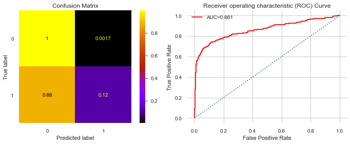


```python
# define grid
weights = [1, 25, 50, 75, 100,800, 804, 1000]
param_grid1 = dict(scale_pos_weight=weights)
```


```python
from sklearn.model_selection import RepeatedStratifiedKFold
# define evaluation procedure
cv = RepeatedStratifiedKFold(n_splits=10, n_repeats=3, random_state=123)
# define grid search
grid = GridSearchCV(estimator=xgb_rf, param_grid=param_grid, n_jobs=-1, cv=cv, scoring='roc_auc')

```


```python

```


```python

time = fn.Timer()
time.start()
grid.fit(X_train_res,y_train_res)
time.stop()
```


```python
xgbc.fit(X_train_res, y_train_res)
```


```python
print(xgbc.score(X_train_data,y_train_data))
print(xgbc.score(X_test_data,y_test_data))
```


```python
y_hat_test = xgbc.predict(X_test_data)
```


```python
fn.evaluate_model(X_test_data, y_test_data, y_hat_test, X_train_res, y_train_res, xgbc)
```

## Conclusion:

This dataset was a random sample of over 618,000 individuals reporting biological, behavioral, and environmental factors as well as their COVID-19 status.  The medium used to collect the data is operated by a UK - based an open-source platform that's main focus is data analytics and is non-medical in nature.  The questionaire used to collect data has undergone several versions and several features collected during this sample are no longer being tracked.  A very small rate (.013%) reported testing positive.  It should be noted that at this time there was a shortage of tests available in the United States as well as time taken to get results was up to two weeks in latency.

Using data collected over a 15 day span (March 27 - April 10, 2020), a predictive model was developed to identify top factors in contracting COVID-19.

The factors that rated highest in predicting contraction of COVID-19 were derived using a Random Forest Classification model that yeilded an overall accuracy average of .97 and weighted recall of .97.  A Receiver Operator Characteristic (ROC) curve demonstrates a diagnostic ability of this binary classifier to be 84.9%.  This model ran at a higher sensitivy rate of 97% than it's specificity rate of 62%. 

The most important factors are listed below.  The + or - signs indicate whether the correlations associated with these factors were positive or negative:

factor| description |	coef | correlation
--| --| --| --|
covid19_symptoms | Individual exhibited COVID-19 symptops | 0.450538 | +
opinion_infection | Individual believed they could contract COVID-19| 0.217297 | +
covid19_contact | Individual was in contact with another who was COVID-19 +| 0.206646 | +
rate_reducing_risk_house |Househould took precautionary measures | 0.0424337 | -
taking_prescription_medication | Individual was taking prescription medication | 0.0260322 | +
text_working_travel critical | Individual traveled to work due to it's cricitcal nature | 0.0159807 | +
rate_reducing_risk_single | Individual washed hands and practiced social distancing | 0.0153934 | -
smoking_never | Individual never smoked | 0.0106096 | +
rate_reducing_mask | Individual wore mask ouside home | 0.0076694 | +
oiwasnull | Opinion Infection was left null | 0.00319239 | +


It's common sense that having symptoms and coming into contact with someone infected would be factors in contracting a contagious disease, and are proven as such since they classified as top factors. More information is needed on  'opinion_infection' as this is also a top factor, however there is no background and data is no longer being collected on this datapoint. The field 'oiwasnull' is associated with this factor - and reflects that respondents did not fill this value in.  

This model also illustrates that behavioral modifications such as taking precautionary measures individually and as a household, as well as travel habits also factor into becoming infected. 

Wearing a mask outside the home was also a factor, but with a positive correlation which was surprising since it is recommended by the cdc to slow the spread by wearing them.  This could demonstrate that it is more effective to prevent transmission rather than contraction of the disease. As noted by the [CDC](https://www.cdc.gov/coronavirus/2019-ncov/prevent-getting-sick/prevention.html) "The cloth face cover is meant to protect other people in case you are infected." 

Also surprising is the factor of never smoking being a factor and it's ever-so-slight positive correlation.  In fact, smoking at a 'medium' level had a negative correlation with contracting the disease.  It should be noted that larger percentage of Americans don't smoke [(86%)](https://www.cdc.gov/tobacco/data_statistics/fact_sheets/adult_data/cig_smoking/index.htm) so this could explain the natural amount of those classified with the disease despite never smoking.  Additional exploration could be done around this factor.

## Recommendations: 
> **To avoid contracting COVID-19:**
    1. Practice social distancing and hygiene *individually and as a household*.
    2. Avoid contact with those known to be infected
    3. Avoid or Minimize travel
    
    Additionally: 
    * If taking prescription medication, discuss with a physician additional associated risk for infection.
    * If you have sympotoms assiciated with COVID-19, or think you could have COVID-19 you should be tested to confirm.
    

Due to the nature of prescrition medications field (57K values in the original dataset) it was tracked as a boolean value to identify whether or not it had bearing.  Since it yeilded a positive result, more work could be done to investigate details around this factor. 

**This model shows that majority of the most important factors associated with contracting COVID-19 are related with behaviors.**


## Appendix: 


```python
importlib.reload(fn)
```

### Vizualizations for non-technical presentation:


```python
import sklearn.metrics as metrics
import matplotlib.pyplot as plt
import pandas as pd
from sklearn.metrics import confusion_matrix
font = {'family': 'serif',
        'color':  'darkred',
        'weight': 'normal',
        'size': 16,
        }


labels = ['COVID-19 -','COVID-19 +']

cnf_matrix = metrics.plot_confusion_matrix(rf_clf3,X_test,y_test,cmap='Reds',
                              normalize='true',display_labels=labels)
plt.title('Random Forest Classifier Prediction Rates', fontdict=font)


```


```python
pos_map = {'0' : 'Covid19 Negative',
          '1': 'Covid19 Posistive'}

coviddf['covid19_positive'] = coviddf['covid19_positive'].map(pos_map)
```


```python
font = {'family': 'serif',
        'color':  'darkred',
        'weight': 'normal',
        'size': 18,
        }

font1 = {'family': 'serif',
        'color':  'black',
        'weight': 'normal',
        'size': 12,
        }
print(df['covid19_positive'].value_counts(normalize=True))
lables = ['Negative', 'Positive']
coviddf= pd.DataFrame(df['covid19_positive'].value_counts(normalize=True)*100)
coviddf.plot(kind='bar', color='darkred')
plt.title('COVID-19 Rates', fontdict=font)
plt.xlabel('Negative                :::               Positive', fontdict=font1)

plt.ylabel('Percent', fontdict=font1)


```


```python
targetdf = pd.DataFrame(y)


```


```python
import pyplot
```


```python
df['covid19_positive'].value_counts()
```


```python
#!pip install Counter
from collections import Counter
# summarize class distribution
counter = Counter(y)
print(counter)
# scatter plot of examples by class label
data = {"x":[], "y":[], "label":[]}
for label, coord in counter.items():
    data["x"].append(coord[0])
    data["y"].append(coord[1])
    label["label"].append(label)
    
plt.figure(figsize=(10,8))
plt.title('Scatter Plot', fontsize=20)
plt.xlabel('x', fontsize=15)
plt.ylabel('y', fontsize=15)
plt.scatter(data["x"], data["y"], marker = 'o')

# add labels
for label, x, y in zip(data["label"], data["x"], data["y"]):
    plt.annotate(label, xy = (x, y))
```


```python
counter.items()
```


```python
df_cor = pd.DataFrame(df2.corr()['covid19_positive'].sort_values(ascending=False))
df_cor
```


```python
# featimpt = ['covid19_symptoms','opinion_infection', 'covid19_contact','rate_reducing_risk_house',
# 'taking_prescription_medication','text_working_travel critical','rate_reducing_risk_single',
# 'smoking_never', 'rate_reducing_mask', 'oiwasnull']featimpt
```


```python
df_cor.loc['smoking':]
```


```python
df_cor.head(60)
```


```python
df_cor.tail(50)
```


```python
def _plot_classification_report(y_true, y_pred_class):
    import sklearn.metrics as metrics
    report = metrics.classification_report(y_true, y_pred_class, output_dict=True)
    report_df = pd.DataFrame(report).transpose().round(4)

    fig, ax = plt.subplots()
    ax.axis('off')
    ax.axis('tight')
    ax.table(cellText=report_df.values,
             colLabels=report_df.columns,
             rowLabels=report_df.index,
             loc='center',
             bbox=[0.2, 0.2, 0.8, 0.8])
    fig.tight_layout()

    return fig 
```


```python
#alternative code for feature importance:
#df_import_tree = pd.Series(tree.feature_importances_, index=X_train.columns, name='importance').head(20)
# df_import_tree.sort_values().plot(kind='barh', figsize=(15,12))
```


```python
!pip install mictools
```


```python
!pip install ppscore
```

    Requirement already satisfied: ppscore in c:\users\aosika\appdata\local\continuum\anaconda3\envs\learn-env\lib\site-packages (0.0.2)
    


```python

```
